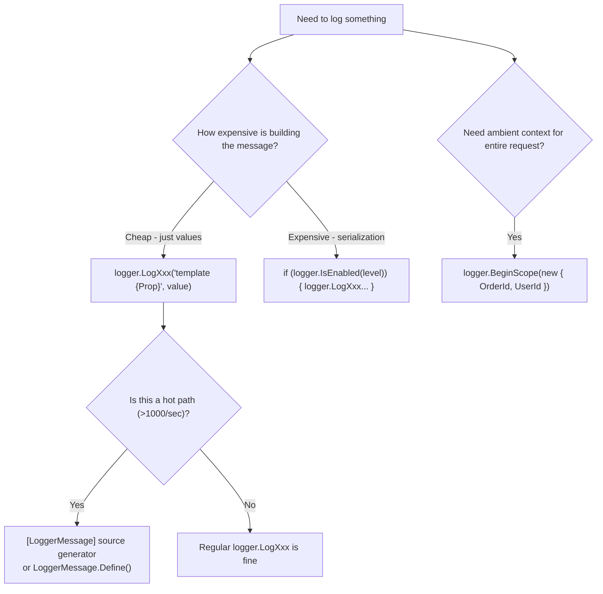

> [!success] Mastery Check
> - [ ] **Studied Well**
> - [ ] **Can explain the concept without notes**
> - [ ] **Can answer interview questions confidently**
> - [ ] **Can implement it in a real project**


# 4.023 — ILogger\<T\>: The .NET Logging Abstraction

## PART 0 — Navigation & Context

```
ASP.NET Core Mastery
├── C. Logging & Diagnostics   (4.023–4.033)
│   ├── ▶▶▶ 4.023  ILogger<T>: The .NET Logging Abstraction  ◀◀◀
│   ├── 4.024  Log Levels, Categories, and Filtering
│   ├── 4.025  Structured Logging: Log Templates and Semantic Values
│   ├── 4.026  Log Scopes: Contextual Information
│   └── 4.028  Serilog Integration
```

---

## PART 1 — Core Mental Model

### The Fundamental Rule

> **`ILogger<T>` is the abstraction — you inject it everywhere, write to it everywhere, and never reference a concrete provider (Serilog, NLog, Application Insights) in your code. The provider is plugged in at startup. This separation means you can change from console logging to Elasticsearch without touching a single service class. Always use structured log message templates with named holes, never string interpolation.**

### The Logging Architecture

```
Your Code
  │  logger.LogInformation("Order {OrderId} created by {UserId}", orderId, userId)
  ▼
ILogger<T>
  │  (abstraction — Microsoft.Extensions.Logging)
  ▼
ILoggerFactory
  │  Routes log entries to all registered providers
  ├──► ConsoleLoggerProvider      → stdout
  ├──► DebugLoggerProvider        → Debug output window
  ├──► EventSourceLoggerProvider  → ETW / dotnet-trace
  ├──► SerilogLoggerProvider      → Seq, Elasticsearch, file, etc.
  └──► ApplicationInsightsLoggerProvider → Azure Monitor
```

---

## PART 2 — Deep Mechanics

### 2.1 — The ILogger\<T\> Interface

```csharp
public interface ILogger<out TCategoryName> : ILogger { }

public interface ILogger
{
    void Log<TState>(LogLevel logLevel, EventId eventId, TState state,
                     Exception? exception, Func<TState, Exception?, string> formatter);
    bool IsEnabled(LogLevel logLevel);
    IDisposable? BeginScope<TState>(TState state) where TState : notnull;
}
```

**Key points:**
- `T` in `ILogger<T>` sets the **category name** — typically the full class name (e.g., `OrderService`). Filtering rules target category names.
- `IsEnabled(logLevel)` — check before building expensive log messages in hot paths.
- `BeginScope` — adds ambient context to all log entries within the scope lifetime.

### 2.2 — Injection and Usage Pattern

```csharp
// ✅ Constructor injection (preferred — testable, explicit)
public class OrderService(
    IOrderRepository repository,
    ILogger<OrderService> logger)   // ← Category = "YourApp.Services.OrderService"
{
    public async Task<Order> CreateOrderAsync(CreateOrderRequest request)
    {
        // Log entry with structured properties (named holes — NOT string interpolation)
        logger.LogInformation(
            "Creating order for customer {CustomerId} with {ItemCount} items. Total: {Total:C}",
            request.CustomerId, request.Items.Count, request.Total);

        try
        {
            var order = await repository.CreateAsync(request);

            logger.LogInformation(
                "Order {OrderId} created successfully. Status: {Status}",
                order.Id, order.Status);

            return order;
        }
        catch (Exception ex)
        {
            // ✅ Pass exception as first argument — providers serialize the full stack trace
            logger.LogError(ex,
                "Failed to create order for customer {CustomerId}",
                request.CustomerId);
            throw;
        }
    }
}
```

### 2.3 — The Six Log Level Methods

```csharp
// LogLevel enum values (0–6):
logger.LogTrace("Entering {Method} with args: {@Args}", "CreateOrder", args);     // Level 0 — most verbose
logger.LogDebug("Cache {CacheKey} miss — fetching from database", cacheKey);       // Level 1
logger.LogInformation("Order {OrderId} created in {ElapsedMs}ms", id, ms);        // Level 2 — default min level
logger.LogWarning("Retry {Attempt} of {Max} for payment gateway", attempt, max);   // Level 3
logger.LogError(ex, "Payment gateway timeout for order {OrderId}", orderId);       // Level 4
logger.LogCritical(ex, "Database connection pool exhausted — shutting down");      // Level 5

// LogNone (6) — used in filter rules to disable all logging for a category
```

### 2.4 — Structured Message Templates

```csharp
// ✅ CORRECT: Named holes — providers capture OrderId as a structured property
logger.LogInformation("Processing order {OrderId} for customer {CustomerId}", orderId, customerId);
// Structured output: { "OrderId": 42, "CustomerId": "C-1234", "Message": "Processing order 42 for customer C-1234" }

// ⚠️ WRONG: String interpolation — destroys structure; all providers get a flat string
logger.LogInformation($"Processing order {orderId} for customer {customerId}");
// Output: { "Message": "Processing order 42 for customer C-1234" }
// ← OrderId and CustomerId are not queryable fields in Seq/Elastic

// ⚠️ WRONG: string.Format — same problem
logger.LogInformation("Processing order {0} for {1}", orderId, customerId);
// ← Positional placeholders lose semantic names

// Object destructuring (Serilog-style @ prefix):
logger.LogInformation("Order created: {@Order}", order);
// ← Serilog captures all public properties of the Order object
// Microsoft.Extensions.Logging treats @ as part of the property name; Serilog handles destructuring
```

### 2.5 — EventId for Log Filtering and Monitoring

```csharp
// EventId groups related log entries — useful for alerting and filtering
public static class LogEvents
{
    public static readonly EventId OrderCreated        = new(1001, "OrderCreated");
    public static readonly EventId OrderPaymentFailed  = new(1002, "OrderPaymentFailed");
    public static readonly EventId InventoryLow        = new(2001, "InventoryLow");
    public static readonly EventId DatabaseError       = new(5001, "DatabaseError");
}

logger.LogInformation(LogEvents.OrderCreated,
    "Order {OrderId} created for {CustomerId}", order.Id, order.CustomerId);

logger.LogError(LogEvents.OrderPaymentFailed,
    "Payment failed for order {OrderId}: {Reason}", orderId, reason);

// Alert in Datadog/Grafana: alert when EventId = 5001 count > 5 in 60s
```

### 2.6 — Checking IsEnabled Before Expensive Operations

```csharp
// ✅ Guard expensive log message construction behind IsEnabled check
if (logger.IsEnabled(LogLevel.Debug))
{
    // Only serialize the full order object when debug logging is enabled
    var serialized = JsonSerializer.Serialize(order, _debugOptions);
    logger.LogDebug("Full order state: {OrderJson}", serialized);
}

// Better: use LoggerMessage.Define for zero-allocation hot-path logging (see 4.031)
// Or the [LoggerMessage] source generator attribute (.NET 6+):
[LoggerMessage(Level = LogLevel.Debug, Message = "Full order state: {OrderJson}")]
static partial void LogOrderDebug(ILogger logger, string orderJson);
```

---

## PART 3 — Production Code Patterns

### Pattern 1: Structured Logging Throughout the Request Lifecycle

```csharp
public class PaymentService(ILogger<PaymentService> logger, IPaymentGateway gateway)
{
    public async Task<PaymentResult> ProcessPaymentAsync(PaymentRequest request)
    {
        // Log at entry with all relevant correlation properties
        using var scope = logger.BeginScope(new Dictionary<string, object>
        {
            ["OrderId"]     = request.OrderId,
            ["CustomerId"]  = request.CustomerId,
            ["Amount"]      = request.Amount,
            ["Currency"]    = request.Currency
        });

        logger.LogInformation(
            "Processing {Amount:C} payment for order {OrderId} via {Gateway}",
            request.Amount, request.OrderId, request.GatewayName);

        var sw = Stopwatch.StartNew();
        PaymentResult result;

        try
        {
            result = await gateway.ChargeAsync(request);
            sw.Stop();

            logger.LogInformation(
                "Payment {TransactionId} succeeded for order {OrderId} in {ElapsedMs}ms",
                result.TransactionId, request.OrderId, sw.ElapsedMilliseconds);
        }
        catch (GatewayTimeoutException ex)
        {
            sw.Stop();
            logger.LogWarning(ex,
                "Payment gateway timeout after {ElapsedMs}ms for order {OrderId}",
                sw.ElapsedMilliseconds, request.OrderId);
            throw;
        }
        catch (Exception ex)
        {
            sw.Stop();
            logger.LogError(ex,
                "Payment gateway error for order {OrderId} after {ElapsedMs}ms",
                request.OrderId, sw.ElapsedMilliseconds);
            throw;
        }

        return result;
    }
}
```

### Pattern 2: ILoggerFactory for Non-Generic Contexts

```csharp
// When you need to create loggers dynamically by category name (middleware, generic utilities)
public class RequestLoggingMiddleware(RequestDelegate next, ILoggerFactory loggerFactory)
{
    // Create a logger with a specific category name (not tied to this class's generic type)
    private readonly ILogger _logger = loggerFactory.CreateLogger("RequestAudit");

    public async Task InvokeAsync(HttpContext context)
    {
        _logger.LogInformation(
            "Incoming {Method} {Path} from {RemoteIp}",
            context.Request.Method,
            context.Request.Path,
            context.Connection.RemoteIpAddress);

        await next(context);

        _logger.LogInformation(
            "Completed {Method} {Path} → {StatusCode}",
            context.Request.Method,
            context.Request.Path,
            context.Response.StatusCode);
    }
}
```

### Pattern 3: Test-Safe Logging with NullLogger

```csharp
// In unit tests — use NullLogger<T> to satisfy ILogger<T> dependency without output
var service = new OrderService(
    repository: mockRepository.Object,
    logger: NullLogger<OrderService>.Instance);    // ← No output, no exceptions

// In integration tests with xUnit output:
using Microsoft.Extensions.Logging.Testing;
var collector = new FakeLogCollector();
var logger = new FakeLogger<OrderService>(collector);
// After test: collector.GetSnapshot() returns all log entries written
```

---

## PART 4 — Gotchas

### Gotcha 1: String Interpolation Destroys Structured Logging
`logger.LogInformation($"Order {orderId} failed")` creates a single flat string. The `orderId` value is embedded in text — providers cannot extract it as a queryable field. Alerts like "count of OrderId = 42 errors > 5" become impossible to write in Seq or Grafana. Always use named holes: `logger.LogInformation("Order {OrderId} failed", orderId)`.

### Gotcha 2: Logging PII / Sensitive Data
```csharp
// ⚠️ WRONG — logs a credit card number in plain text
logger.LogInformation("Processing payment with card {CardNumber}", request.CardNumber);

// ✅ CORRECT — mask sensitive data
logger.LogInformation("Processing payment with card ending {Last4}", request.CardNumber[^4..]);
```
PII in logs is a GDPR/PCI violation. Use `[LoggerMessage]` source generators with explicit property selection to prevent accidental sensitive data logging.

### Gotcha 3: Exception as Second Argument (Not First)
```csharp
// ⚠️ WRONG — exception is treated as a message template argument, not captured separately
logger.LogError("Payment failed: {Exception}", ex);   // ex.ToString() as string property

// ✅ CORRECT — exception is the first argument; providers extract stack trace, type, message
logger.LogError(ex, "Payment failed for order {OrderId}", orderId);
```

### Gotcha 4: Logging Level Not Enabled — Still Evaluating Arguments
```csharp
// ⚠️ WRONG — even if Debug is disabled, JsonSerializer.Serialize still runs
logger.LogDebug("Order details: {Json}", JsonSerializer.Serialize(largeOrder));

// ✅ CORRECT — guard expensive operations with IsEnabled check
if (logger.IsEnabled(LogLevel.Debug))
    logger.LogDebug("Order details: {Json}", JsonSerializer.Serialize(largeOrder));

// BEST — use [LoggerMessage] source generator which generates the IsEnabled check automatically
```

### Gotcha 5: ILogger Is NOT Thread-Safe for Scope
`BeginScope` returns an `IDisposable` that must be disposed on the same thread/async context. Do not share scopes across threads. In async code, use `await` within the scope; do not fire-and-forget tasks inside a scope and expect the scope to still be active.

---

## PART 5 — Performance

| Operation | Cost | Notes |
|---|---|---|
| `IsEnabled(LogLevel.Debug)` when disabled | ~1 ns | Single integer comparison |
| `logger.LogInformation("template", args)` | ~200–500 ns | Message formatting, provider dispatch |
| `logger.LogInformation($"interpolated {val}")` | ~200–500 ns | Same perf, but string already allocated |
| `LoggerMessage.Define<T>()` (cached delegate) | ~50–100 ns | Zero allocation in hot paths |
| `[LoggerMessage]` source generator | ~50–100 ns | Same as Define, generated at compile time |
| `BeginScope(new { OrderId = id })` | ~500 ns | Dictionary allocation |

---

## PART 6 — Interview Arsenal

**Q: Why should you use message templates instead of string interpolation in `ILogger`?**
> "Message templates like `'Order {OrderId} created'` keep the property value separate from the message text. Structured logging providers — Serilog, Application Insights, Seq, Elasticsearch — capture `OrderId` as a queryable field in the log store. That means I can query `OrderId == 42` in Seq and find every log entry related to that order across 50 microservices. String interpolation produces `'Order 42 created'` — the value is embedded in the string and not extractable. I can't query by OrderId. This is the difference between searchable structured logs and grep-able text files."

**Q: What is `ILogger<T>` vs `ILogger` vs `ILoggerFactory`?**
> "`ILogger<T>` is the generic interface that automatically sets the category name to the full class name of T. It's what you inject in constructors. `ILogger` (non-generic) is the base interface — you'd use it when you need to pass a logger around without knowing the specific category. `ILoggerFactory` is the factory — you call `CreateLogger('CategoryName')` to get a logger with a custom category name. I use `ILoggerFactory` in middleware and generic utilities where the category name should describe what's being logged, not what class is logging it."

**Red flags:**
1. Using `$"string interpolation"` in log messages — destroys structure.
2. Passing exception as a format argument: `logger.LogError("Error: {ex}", ex)` instead of `logger.LogError(ex, "Error occurred")`.
3. "I use Console.WriteLine for logging" — no filtering, no structured output, no provider swap.

---

## PART 7 — Decision Framework



---

## PART 8 — Self-Check

1. What is the difference between `ILogger<T>` and `ILoggerFactory`?
2. Why does `logger.LogInformation($"Order {id}")` break structured logging?
3. How do you pass an exception so providers can capture the stack trace?
4. When should you use `logger.IsEnabled(LogLevel.Debug)`?
5. What is an EventId and when should you use it?

<details><summary>Answers</summary>

1. `ILogger<T>` auto-sets the category to the full class name of T — use in constructors. `ILoggerFactory` creates loggers with arbitrary category names — use in middleware and generic utilities.
2. String interpolation embeds the value inside the message string before the logger sees it. Providers receive a flat string; the value is not a separate structured property and cannot be queried by value.
3. Pass the exception as the **first argument**: `logger.LogError(exception, "message template", args...)`. Not as a format argument.
4. Before building expensive values (JSON serialization, LINQ queries) that are only needed for the log message. `IsEnabled` is a nanosecond check; skipping it causes the expensive work to run even when that log level is disabled.
5. An EventId is a numeric + name identifier for a class of log entry. Use it to group related events (e.g., `EventId(1001, "PaymentFailed")`) for alerting rules, log filtering, and audit trail categorization.

</details>

---

## PART 9 — Connections

| Topic | Relationship |
|---|---|
| [[4.024 — Log Levels, Categories, and Filtering]] | Filtering rules target the category name set by ILogger\<T\> |
| [[4.025 — Structured Logging: Log Templates]] | ILogger\<T\> uses message templates; this topic explains the full structured logging model |
| [[4.028 — Serilog Integration]] | Serilog plugs in as a provider behind ILogger\<T\> |
| [[4.031 — High-Performance Logging]] | LoggerMessage.Define and [LoggerMessage] optimize the hot-path cost of ILogger\<T\> calls |

**Docs:** [Logging in .NET — Microsoft Docs](https://learn.microsoft.com/en-us/aspnet/core/fundamentals/logging/)
