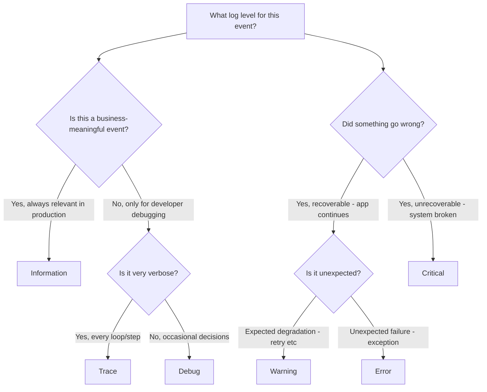

> [!success] Mastery Check
> - [ ] **Studied Well**
> - [ ] **Can explain the concept without notes**
> - [ ] **Can answer interview questions confidently**
> - [ ] **Can implement it in a real project**


# 4.024 — Log Levels, Categories, and Filtering

## PART 0 — Navigation & Context

```
ASP.NET Core Mastery
├── C. Logging & Diagnostics
│   ├── 4.023  ILogger<T>: The .NET Logging Abstraction
│   ├── ▶▶▶ 4.024  Log Levels, Categories, and Filtering  ◀◀◀
│   └── 4.025  Structured Logging
```

---

## PART 1 — Core Mental Model

### The Fundamental Rule

> **Log filtering is a two-level gate: the provider level and the category level. A log entry is written only if both gates pass. The category name is the full class name from `ILogger<T>`. Filtering is configured in `appsettings.json` under `Logging:LogLevel` and can be set per-provider, per-category, or globally. Production default should be `Warning` globally, with `Information` only for your own app's namespaces. Emitting `Trace` or `Debug` in production is a performance and storage incident.**

### The Two-Level Filter Model

```
Log Entry Arrives (e.g., LogLevel.Debug from "MyApp.Services.OrderService")
        │
        ▼ Level 1: Global / Category filter (Logging:LogLevel rules)
Is LogLevel.Debug enabled for category "MyApp.Services.OrderService"?
        │ NO → entry discarded, never reaches provider
        │ YES ↓
        ▼ Level 2: Provider-specific filter (Logging:Console:LogLevel, etc.)
Is LogLevel.Debug enabled for this specific provider (Console)?
        │ NO → not sent to this provider; other providers may still receive it
        │ YES ↓
        ▼ Provider processes the entry (Console, Serilog, AppInsights)
```

---

## PART 2 — Deep Mechanics

### 2.1 — The Seven Log Levels

```csharp
// LogLevel enum — integer values 0 to 6:
LogLevel.Trace       = 0   // Every step of execution; variable values; extremely verbose
LogLevel.Debug       = 1   // Developer debugging; cache misses, method entry/exit
LogLevel.Information = 2   // Normal application flow; order created, user logged in
LogLevel.Warning     = 3   // Unexpected event, but operation continues; retry attempt, slow query
LogLevel.Error       = 4   // Operation failed; exception caught; must be investigated
LogLevel.Critical    = 5   // System-wide failure; data corruption; service unavailable
LogLevel.None        = 6   // Used only in filter rules to disable all logging for a category

// Filtering: a filter of "Warning" means Warning, Error, and Critical pass; Trace, Debug, Info are discarded
```

**Decision guide for which level to use:**

| Level | When to use | Example |
|---|---|---|
| Trace | Entering/exiting methods, loop iterations | `"Iterating order item {Index}"` |
| Debug | Cache behavior, branching decisions | `"Cache miss for {CacheKey} — loading from DB"` |
| Information | Business events that should appear in production | `"Order {OrderId} created, Total: {Total:C}"` |
| Warning | Retry attempt, degraded behavior, expected-but-notable | `"Payment retry {Attempt}/{Max} for order {OrderId}"` |
| Error | Exception caught, operation failed but app continues | `"Failed to send email for order {OrderId}"` |
| Critical | Unrecoverable failure, immediate action required | `"Database connection pool exhausted"` |

### 2.2 — Category Names

The category name is set by the `T` in `ILogger<T>` — it is the **full qualified class name**:

```csharp
ILogger<OrderService>    → Category: "MyApp.Services.OrderService"
ILogger<PaymentService>  → Category: "MyApp.Services.PaymentService"
ILogger<OrderController> → Category: "MyApp.Controllers.OrderController"
```

This allows granular filter rules using namespace prefixes:

```json
{
  "Logging": {
    "LogLevel": {
      "Default":                           "Warning",   // Everything else → Warning
      "MyApp":                             "Information",// All MyApp.* namespaces → Info
      "MyApp.Services.PaymentService":     "Debug",      // Payment service → Debug (hotfix debug)
      "Microsoft":                         "Warning",    // ASP.NET Core framework → Warning
      "Microsoft.AspNetCore":              "Warning",
      "Microsoft.EntityFrameworkCore":     "Warning",
      "Microsoft.EntityFrameworkCore.Database.Command": "Information"  // EF SQL queries → Info
    }
  }
}
```

**Category matching rules:**
- Exact match wins over prefix match: `"MyApp.Services.PaymentService": "Debug"` wins over `"MyApp": "Information"` for PaymentService.
- Prefix match: `"MyApp"` matches `"MyApp.Services.OrderService"`, `"MyApp.Controllers"`, etc.
- `"Default"` catches everything not matched by a more specific rule.

### 2.3 — Provider-Specific Filtering

```json
// appsettings.json — provider-specific rules override global rules for that provider only
{
  "Logging": {
    "LogLevel": {
      "Default": "Warning",
      "MyApp": "Information"
    },
    "Console": {
      "LogLevel": {
        "Default": "Warning",
        "MyApp": "Debug"          // Console shows Debug for MyApp; other providers still get Info
      }
    },
    "ApplicationInsights": {
      "LogLevel": {
        "Default": "Information", // App Insights gets Info globally
        "Microsoft": "Error"      // Framework logs → only errors in App Insights
      }
    }
  }
}
```

**Resolution order for a given (provider, category) pair:**
1. Provider-specific exact category match
2. Provider-specific prefix match
3. Global (non-provider) exact category match
4. Global prefix match
5. `Default` (global fallback)

### 2.4 — Filtering in Code (Programmatic)

```csharp
// Minimum level filter — applies before any category rules
builder.Logging.SetMinimumLevel(LogLevel.Debug);   // Override the global default

// Add filter rules programmatically:
builder.Logging.AddFilter("Microsoft", LogLevel.Warning);
builder.Logging.AddFilter("MyApp.Services", LogLevel.Information);
builder.Logging.AddFilter<ConsoleLoggerProvider>("MyApp", LogLevel.Debug);

// Completely clear all providers and add only what you want:
builder.Logging.ClearProviders();
builder.Logging.AddConsole();
builder.Logging.AddSerilog();
```

### 2.5 — The Exact EF Core Filter Pattern

Entity Framework Core generates verbose Debug/Trace log entries for every SQL query, parameter, connection open/close. In production, this is both a performance issue (string formatting for every query) and a storage issue:

```json
{
  "Logging": {
    "LogLevel": {
      "Default": "Warning",
      "MyApp": "Information",
      "Microsoft.EntityFrameworkCore.Database.Command": "Information",  // SQL queries
      "Microsoft.EntityFrameworkCore.Database.Connection": "Warning",   // Connection events
      "Microsoft.EntityFrameworkCore.Database.Transaction": "Warning",  // Transaction events
      "Microsoft.EntityFrameworkCore.Query": "Warning",                 // Query compilation
      "Microsoft.EntityFrameworkCore.Infrastructure": "Warning"         // Context lifetime
    }
  }
}
```

**HTTP consequence of over-logging EF Core:**
- Each EF query generates ~5–10 log entries at Debug level
- 100 requests/second × 3 queries each × 10 log entries = 3,000 debug log entries/second
- Log aggregation cost: ~$50–500/month depending on provider (Datadog, Splunk)
- Latency impact: string formatting for debug messages runs even if the log store is remote (~2–5 µs per entry)

---

## PART 3 — Production Code Patterns

### Pattern 1: Production vs Development Logging Configuration

```json
// appsettings.json (base — applies to all environments)
{
  "Logging": {
    "LogLevel": {
      "Default": "Warning",
      "MyApp": "Information",
      "Microsoft.AspNetCore": "Warning",
      "Microsoft.EntityFrameworkCore": "Warning",
      "Microsoft.EntityFrameworkCore.Database.Command": "Warning"
    }
  }
}

// appsettings.Development.json (overrides for local dev)
{
  "Logging": {
    "LogLevel": {
      "Default": "Information",
      "MyApp": "Debug",
      "Microsoft.AspNetCore": "Information",
      "Microsoft.EntityFrameworkCore.Database.Command": "Information"
    }
  }
}
```

### Pattern 2: Dynamic Log Level Change via IConfigurationReloadableLogLevel (.NET 8)

```csharp
// Filter rules support reloadOnChange from appsettings.json
// Change the log level at runtime without restarting the app:
builder.Logging.AddConfiguration(builder.Configuration.GetSection("Logging"));
// ← This wires up live reload of filter rules from appsettings.json
// With reloadOnChange: true on the JSON provider, changing appsettings.json
// immediately updates the filter rules without a restart.

// Pattern: add a debug-mode endpoint that temporarily changes log level at runtime
app.MapPost("/admin/logging/debug", (ILoggerFactory factory) =>
{
    // LoggerFactory doesn't expose SetMinimumLevel at runtime on its own
    // Use a custom ILogLevelController or swap the configuration filter
    // This is a common pattern in distributed systems for incident debugging
}).RequireAuthorization("AdminOnly");
```

### Pattern 3: Suppressing Noisy Third-Party Libraries

```json
{
  "Logging": {
    "LogLevel": {
      "Default": "Warning",
      "MyApp": "Information",
      
      // Suppress common noisy third-party loggers:
      "Microsoft.AspNetCore.Routing.EndpointMiddleware": "Warning",
      "Microsoft.AspNetCore.Hosting.Diagnostics": "Warning",
      "System.Net.Http.HttpClient": "Warning",
      "Polly": "Warning",
      "HealthChecks": "Warning",
      "Hangfire": "Warning"
    }
  }
}
```

---

## PART 4 — Gotchas

### Gotcha 1: Default Is Production — `Warning`, Not `Information`
If you create an ASP.NET Core app and run it in Production without configuring Logging:LogLevel, the default is `Information` (from the hardcoded defaults). This floods production logs with framework Information messages. Always explicitly set `"Default": "Warning"` in appsettings.json and override with your app's namespace.

### Gotcha 2: Filtering Happens BEFORE Provider; Arguments Still Evaluated
```csharp
// Even when Debug is filtered OUT, this still allocates the string:
logger.LogDebug("Order details: " + JsonSerializer.Serialize(order));  // ← Allocation happens!
// The filtering check happens inside ILogger.Log(), AFTER the message string is built.

// Correct: the message template approach defers formatting until after the IsEnabled check
logger.LogDebug("Order details: {Json}", JsonSerializer.Serialize(order));
// ← Still evaluates JsonSerializer.Serialize(order) regardless of enabled level!
// For truly zero-cost disabled logging, use IsEnabled or [LoggerMessage]
```

### Gotcha 3: Category Prefix Match Is Longest-Wins
`"Microsoft.AspNetCore": "Warning"` and `"Microsoft": "Error"` both match `Microsoft.AspNetCore.Routing`. The most specific (longest prefix) wins — so `Warning` applies to `Microsoft.AspNetCore.Routing`, not `Error`.

### Gotcha 4: `LogLevel.None` in appsettings.json
```json
"Microsoft.AspNetCore.StaticFiles": "None"
```
This completely disables all logging from the StaticFiles middleware — not just reduces it to a level, but disables it entirely. The numeric value 6 (None) means "no log entries will ever be emitted from this category." This is the correct way to silence a particularly noisy logger you never need.

---

## PART 5 — Performance

| Scenario | Cost | Recommendation |
|---|---|---|
| Filtered-out log entry (IsEnabled=false) | ~1 ns | Near zero — just a level comparison |
| Active log entry, simple template | ~200–500 ns | Acceptable — only for enabled entries |
| Active log entry, string interpolation | ~200–500 ns + extra allocation | Avoid — string allocated before filter check |
| `JsonSerializer.Serialize()` in log arg | ~10–100 µs | Gate with `IsEnabled` or `[LoggerMessage]` |
| High-performance `[LoggerMessage]` | ~50–100 ns | Zero allocation, inlined IsEnabled check |
| 1000 Debug entries/sec, disabled | ~1 ms total | Negligible |
| 1000 Debug entries/sec, enabled → Console | ~500 ms total | Console provider is synchronous — blocks! |

**Console provider warning:** The Console logging provider is synchronous and blocking in .NET 8 by default. At >1000 log entries/second, it becomes a throughput bottleneck. Use `builder.Logging.AddConsole(o => o.FormatterName = ConsoleFormatterNames.Systemd)` or switch to Serilog with an async sink for production.

---

## PART 6 — Interview Arsenal

**Q: How does log filtering work in ASP.NET Core?**
> "Filtering is a two-gate system. First, the global filter rules under `Logging:LogLevel` in appsettings.json determine whether a log entry at a given level for a given category passes at all — these rules apply before any provider sees the entry. The category is the full class name from `ILogger<T>`. Rules match by exact name first, then by prefix (longest match wins), then fall back to `Default`. Second, provider-specific filter rules under `Logging:Console:LogLevel` can further restrict which entries each provider receives. The practical production pattern is: `Default: Warning` globally, `MyApp: Information` for your own code, and `None` for categories you want to completely silence. This prevents Microsoft framework spam from flooding your log aggregation service."

**Q: What is the `LogLevel.None` value used for?**
> "LogLevel.None (value 6) is used exclusively in filter rule configuration — never in actual logging calls. Setting a category's filter to `None` completely disables all logging from that category. No entries of any level will pass through. I use it to silence third-party libraries that generate logging noise I can never act on, like `Microsoft.AspNetCore.StaticFiles` in APIs that serve no static files but have the middleware registered."

**Red flags:**
1. "I set Default to Debug in production" — destroys performance and explodes log storage costs.
2. "I didn't know framework logs could be filtered separately from app logs" — common gap.
3. "I use the Console provider in production as my main logging sink" — Console is synchronous and not queryable; use Serilog/OpenTelemetry.

---

## PART 7 — Decision Framework



---

## PART 8 — Self-Check

1. What are the seven log levels and their integer values?
2. What is a category name? How is it set by `ILogger<T>`?
3. If both `"Microsoft": "Error"` and `"Microsoft.AspNetCore": "Warning"` are configured, what level applies to `Microsoft.AspNetCore.Mvc`?
4. Why is the Console logging provider a potential bottleneck in production?
5. What does `"LogLevel": { "Default": "None" }` do?

<details><summary>Answers</summary>

1. Trace(0), Debug(1), Information(2), Warning(3), Error(4), Critical(5), None(6).
2. The category name is the full qualified type name of T in `ILogger<T>` — e.g., `MyApp.Services.OrderService`. It is used as the log source identifier for filtering rules.
3. `"Microsoft.AspNetCore"` is a longer prefix match than `"Microsoft"` — so Warning applies to `Microsoft.AspNetCore.Mvc`.
4. The Console provider writes synchronously to stdout. At high log volumes (>1000 entries/sec), the synchronous write blocks the async request pipeline, reducing throughput.
5. It disables all logging globally — no entries of any level from any category will be written.

</details>

---

## PART 9 — Connections

| Topic | Relationship |
|---|---|
| [[4.023 — ILogger\<T\>]] | Category names come from ILogger\<T\>'s generic type parameter |
| [[4.025 — Structured Logging]] | Filtering applies before structured log entries reach the provider |
| [[4.028 — Serilog Integration]] | Serilog has its own level filter system that works alongside these rules |

**Docs:** [Logging — Microsoft Docs](https://learn.microsoft.com/en-us/aspnet/core/fundamentals/logging/#log-level)
