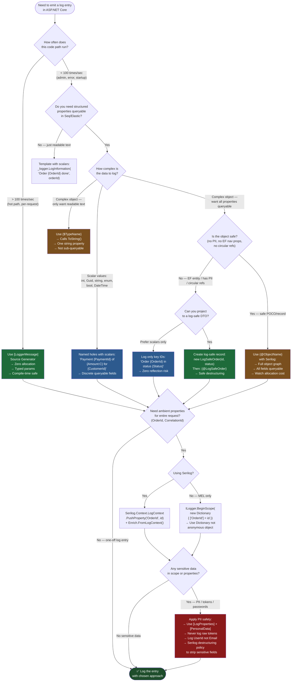

> [!success] Mastery Check
> - [ ] **Studied Well**
> - [ ] **Can explain the concept without notes**
> - [ ] **Can answer interview questions confidently**
> - [ ] **Can implement it in a real project**


# 4.025 — Structured Logging: Log Templates and Semantic Property Values

---

## PART 0 — Navigation & Context

### Where This Topic Lives

```
ASP.NET Core Domain Hierarchy
│
├── Host & Lifecycle
├── Configuration
├── Logging & Diagnostics          ◄── YOU ARE HERE
│   ├── 4.023 — ILogger<T>: The .NET Logging Abstraction
│   ├── 4.024 — Log Levels, Categories, and Filtering
│   ├── 4.025 — Structured Logging: Log Templates & Semantic Property Values  ◄
│   ├── 4.026 — Log Scopes: Contextual Information Across a Request
│   ├── 4.027 — Built-in Providers: Console, Debug, EventLog, EventSource
│   ├── 4.028 — Serilog Integration: Sinks, Enrichers, and Output Templates
│   ├── 4.029 — OpenTelemetry Logging
│   ├── 4.030 — Application Insights Telemetry
│   └── 4.031 — High-Performance Logging: LoggerMessage.Define
│
├── Dependency Injection
├── Middleware
├── Routing
├── Minimal APIs / MVC
├── Authentication / Authorization
└── ... (remaining subsystems)
```

### What You Need Before This

| Prerequisite | Why You Need It |
|---|---|
| [[4.023 — ILogger<T>: The .NET Logging Abstraction]] | ILogger<T> is the API you call to emit structured logs — you must understand `LogInformation`, `LogWarning`, and the `EventId` parameter before understanding what the template system does with them |
| [[4.024 — Log Levels, Categories, and Filtering]] | Log entries are filtered by level before reaching any sink — structured templates that never reach a sink waste formatting CPU cycles if you don't understand this |
| [[4.026 — Log Scopes: Contextual Information Across a Request]] | Scopes inject ambient structured properties into every log entry emitted within their lifetime — understanding scopes after templates makes the full structured logging picture complete |

### What This Unlocks After

| Unlocked Topic | Why This Is a Prerequisite |
|---|---|
| [[4.026 — Log Scopes: Contextual Information Across a Request]] | Scopes are structured properties pushed as ambient state — you need to understand named holes to understand what gets merged into the scope dictionary |
| [[4.028 — Serilog Integration: Sinks, Enrichers, and Output Templates]] | Serilog parses message templates, destructures `{@Objects}`, and renders them into sink-specific formats — all of this makes sense only after mastering template semantics |
| [[4.031 — High-Performance Logging: LoggerMessage.Define]] | `LoggerMessage.Define<T1,T2>` caches the parsed template at startup — understanding why templates need caching requires knowing what parsing them on every call would cost |
| [[4.297 — Activity API and Distributed Tracing]] | TraceId/SpanId from `Activity.Current` must be added as structured properties to correlate distributed traces with structured log entries |

### Why This Topic Matters at Scale

> **In production systems processing >10,000 requests/second, the difference between structured and unstructured logging is the difference between a 30-second incident diagnosis and a 4-hour grep session through compressed log archives.** Structured log templates preserve named properties as first-class queryable fields in log aggregation systems — the operational consequence is that `OrderId = 42` in a Seq or Elasticsearch query returns the exact log entries for order 42 across all services, without regex, without grep, and without shipping an engineer to production at 2am.

---

## PART 1 — The Core Mental Model

### The Fundamental Rule

> **ASP.NET Core's structured logging treats the message template as a schema definition, not a format string: each named hole `{PropertyName}` becomes a discrete queryable field in the log sink, not a substring embedded in a flat message. The practical consequence is that the text `"Processing order {OrderId}"` produces both a human-readable rendered message AND a machine-readable `OrderId` field — but only if you use named holes, never string interpolation.**

### The Plain-Language Analogy

Think of a structured log entry like a bank wire transfer form, not a hand-written note. A hand-written note saying "Moved $150 from account 4211 to account 8873 for customer John" is readable by a human but useless for automated reconciliation — you'd need a text parser to extract amounts and account numbers. A wire transfer form has explicit named fields: `Amount`, `SourceAccount`, `DestinationAccount`, `CustomerName`. A clerk filling in those fields creates a record that feeds directly into query systems, audit trails, and fraud detection.

When you write `_logger.LogInformation("Payment {PaymentId} of {Amount:C} processed for {CustomerId}", payment.Id, payment.Amount, payment.CustomerId)`, the logging framework records `PaymentId`, `Amount`, and `CustomerId` as discrete fields on the log entry — exactly like the wire transfer form. When you write `_logger.LogInformation($"Payment {payment.Id} of {payment.Amount:C} processed for {payment.CustomerId}")`, you've handed the logging system a hand-written note — it sees one unstructured string, no fields, nothing queryable. The form costs the same overhead to fill out. The payoff at query time is orders of magnitude different.

This analogy holds under load: whether 1 or 10,000 transfers happen per second, the form's field structure never changes. The template `"Payment {PaymentId} of {Amount:C} processed for {CustomerId}"` is parsed once at startup by LoggerMessage.Define and reused zero-allocation for every subsequent log call — just as the wire transfer form is printed once and filled in repeatedly.

### The Taxonomy Diagram

```mermaid
graph TD
    Root["Structured Logging System"] --> Templates["Message Templates"]
    Root --> Sinks["Log Sinks / Providers"]
    Root --> Enrichment["Log Enrichment"]
    Root --> Safety["Security & PII Safety"]

    Templates --> NamedHoles["Named Holes\n{OrderId}, {Amount}"]
    Templates --> Destructuring["Destructuring\n{@Order} — full object graph"]
    Templates --> Stringifying["Stringifying\n{$Price} — ToString() only"]
    Templates --> Formatting["Format Specifiers\n{Amount:C}, {Date:yyyy-MM-dd}"]
    Templates --> Interpolation["⚠️ String Interpolation\n$'..{order.Id}..' — LOSES structure"]

    NamedHoles --> Cache["Template Parsing Cache\nLoggerMessage.Define<T>"]
    Destructuring --> Serilog["Serilog @ prefix\nDestructures into JSON sub-object"]
    Stringifying --> SerilogDollar["Serilog $ prefix\nCalls ToString(), no graph walk"]

    Sinks --> Console["Console Provider\nHuman-readable rendered text"]
    Sinks --> Seq["Seq\nStructured query: OrderId > 1000"]
    Sinks --> Elastic["Elasticsearch + Kibana\nJSON documents per log entry"]
    Sinks --> AppInsights["Application Insights\ncustomDimensions: {OrderId: 42}"]
    Sinks --> File["File / Rolling File\nJSON Lines or plain text"]

    Enrichment --> Scope["BeginScope\nAmibent properties for duration"]
    Enrichment --> Enrichers["Serilog Enrichers\nMachineName, ThreadId, CorrelationId"]
    Enrichment --> LogProperties["LogProperties Attribute\n.NET 8+ automatic property logging"]
    Enrichment --> Activity["Activity.Current\nTraceId, SpanId from W3C trace context"]

    Safety --> NoPII["Never log PII\nPasswords, tokens, SSN, card numbers"]
    Safety --> SourceGen["[LoggerMessage] Source Gen\nCompile-time safe log methods (.NET 6+)"]
    Safety --> Redaction["Microsoft.Extensions.Compliance\nPII redaction (.NET 8+)"]

    style Templates fill:#2d5a8e,color:#fff
    style Sinks fill:#1e6b3a,color:#fff
    style Enrichment fill:#7a4f1e,color:#fff
    style Safety fill:#8b1a1a,color:#fff
    style Interpolation fill:#cc3333,color:#fff
```



---

## PART 2 — Deep Mechanics

### 2.1 — Message Template Parsing: What the Framework Actually Does

**Pipeline Position:**
```
HTTP Request In
      │
      ▼
┌─────────────────┐
│ Kestrel / IIS   │  ← connection accepted, HTTP parsed
└────────┬────────┘
         │
         ▼
┌─────────────────┐
│ Middleware Chain │  ← ExceptionHandler → HSTS → Routing → Auth → Endpoints
│                 │
│  [YOUR CODE]    │  ← _logger.LogInformation("Order {OrderId} received", id)
│                 │     ↓
│  [ILogger<T>]   │  ← checks log level filter (O(1) category lookup)
│                 │     ↓
│  [Providers]    │  ← Microsoft.Extensions.Logging.ILoggerProvider × N
│                 │     ↓ Console, Serilog, AppInsights each receive LogEntry
└─────────────────┘
         │
         ▼
    Response Out
```

**HTTP Wire Format (Approximate — no direct HTTP effect, but affects log output):**
```
// The log entry is NOT transmitted over the HTTP response wire.
// It flows to the log sink asynchronously or synchronously.
// Seq HTTP API receives (from Serilog's Seq sink):

// POST http://seq.internal:5341/api/events/raw?clef HTTP/1.1
// Content-Type: application/vnd.serilog.clef
//
// {"@t":"2026-06-08T03:19:00.000Z","@mt":"Order {OrderId} received from {CustomerId}","@l":"Information","OrderId":42,"CustomerId":"C-1234","MachineName":"api-pod-7","CorrelationId":"req-abc-123"}
```

**Framework Source Behavior (ASP.NET Core internally, approximate):**

When you call `_logger.LogInformation("Order {OrderId} received from {CustomerId}", orderId, customerId)`, the following happens inside `Microsoft.Extensions.Logging`:

```csharp
// Microsoft.Extensions.Logging.Logger<T> internally (approximate):
// Source: src/libraries/Microsoft.Extensions.Logging/src/Logger.cs

public void Log<TState>(LogLevel logLevel, EventId eventId,
    TState state, Exception? exception, Func<TState, Exception?, string> formatter)
{
    // 1. Check if ANY provider wants this log level + category
    //    This is O(1) per provider — pre-computed at configuration time
    if (!IsEnabled(logLevel)) return;   // ← cheapest exit, ~2ns

    // 2. Iterate registered providers (typically 1-3 in production)
    foreach (var loggerInfo in _loggers)
    {
        // 3. Each provider gets the raw state (the FormattedLogValues struct)
        //    NOT the rendered string — structured providers extract named values
        loggerInfo.Logger.Log(logLevel, eventId, state, exception, formatter);
    }
}

// The STATE for a message template call is FormattedLogValues:
// FormattedLogValues implements IReadOnlyList<KeyValuePair<string,object>>
// It holds: [("OrderId", 42), ("CustomerId", "C-1234"), ("{OriginalFormat}", "Order {OrderId} received from {CustomerId}")]
// A structured sink (Serilog, AppInsights) reads these key-value pairs directly.
// A console sink calls formatter(state, exception) which renders the final string.
```

**The Template Parser (Microsoft.Extensions.Logging.FormattedLogValues):**

```csharp
// FormattedLogValues parses the template on FIRST access and caches via LogValuesFormatter
// Cost: ~1 allocation for the FormattedLogValues struct + object[] for args
// Template parsing is NOT cached at framework level — use LoggerMessage.Define to cache

// Example:
// Template: "Processing payment {PaymentId} of {Amount:C} for order {OrderId}"
// Args:     [paymentGuid, 150.00m, 42]
// Result state as IReadOnlyList:
// [
//   ("PaymentId", Guid("a4b2...")),
//   ("Amount",    150.00m),
//   ("OrderId",   42),
//   ("{OriginalFormat}", "Processing payment {PaymentId} of {Amount:C} for order {OrderId}")
// ]
```

**Cost Label:** `~1 FormattedLogValues allocation per log call + object[] args array + potential boxing for value types (int, Guid, decimal). For LoggerMessage.Define<T1,T2,T3>, zero boxing, zero template re-parsing: ~0 allocations on the hot path.`

**Edge Case: Named Holes Are Positional in Microsoft.Extensions.Logging (Unlike Serilog)**

```csharp
// ⚠️ TRAP: Microsoft.Extensions.Logging matches holes POSITIONALLY, not by name
// The name in the hole is just the KEY for the structured property — it does NOT
// need to match the variable name. Serilog does the same.

// This is VALID and produces OrderId=99, CustomerId="C-001":
_logger.LogInformation("Order {OrderId} for customer {CustomerId}", 99, "C-001");

// This is also VALID (confusing but legal) — properties are mapped by position:
_logger.LogInformation("Order {CustomerId} for customer {OrderId}", 99, "C-001");
// Produces: CustomerId=99, OrderId="C-001"  ← WRONG values but compiles fine

// ✅ ALWAYS match hole names to the logical meaning of the positional argument
// The compiler cannot catch mismatches — only careful code review or Roslyn analyzers can
```

---

### 2.2 — String Interpolation vs. Message Templates: The Structural Catastrophe

**This is the most common production mistake in .NET logging. It looks identical on screen but destroys queryability.**

```
What happens to the log entry:

MESSAGE TEMPLATE path:
_logger.LogInformation("Order {OrderId} received", orderId);
    │
    ├─► ILogger receives: template="Order {OrderId} received", args=[42]
    │
    ├─► Console sink renders: "Order 42 received"
    │
    ├─► Seq/Serilog sink records:
    │     { "@mt": "Order {OrderId} received", "OrderId": 42 }
    │
    └─► Query: OrderId = 42  ──► FINDS THIS ENTRY ✅

STRING INTERPOLATION path:
_logger.LogInformation($"Order {orderId} received");
    │
    ├─► C# compiler evaluates $"Order {orderId} received" → "Order 42 received"
    │   BEFORE calling LogInformation — the template becomes the final string
    │
    ├─► ILogger receives: template="Order 42 received", args=[]
    │   (no named holes, no structured properties)
    │
    ├─► Console sink renders: "Order 42 received"
    │   (looks identical to human eye)
    │
    ├─► Seq/Serilog sink records:
    │     { "@mt": "Order 42 received" }
    │     (no OrderId property — it's baked into the message string)
    │
    └─► Query: OrderId = 42  ──► FINDS NOTHING ❌
        Query: @mt like "Order 42%"  ──► Only works for this one value ❌
```

**HTTP Wire Format — No Difference to the Client, Catastrophic Difference to Ops:**
```
// Both approaches produce identical HTTP responses.
// The operational impact is only visible in the log aggregation system.

// Seq query that works with templates:
// http://seq.internal/api/events?filter=OrderId%20%3D%2042  → returns log entries
//
// Seq query that fails with interpolation:
// http://seq.internal/api/events?filter=OrderId%20%3D%2042  → returns 0 results
// (The property "OrderId" simply does not exist in the document)
```

**Framework Source Behavior (ASP.NET Core Internally, Approximate):**
```csharp
// The ILogger.Log<TState> signature makes the difference clear:
// TState state — for template calls, this is FormattedLogValues (has named pairs)
// TState state — for interpolation calls, this is string (no named pairs at all)

// When you call: _logger.LogInformation($"Order {orderId} received")
// The C# compiler produces: _logger.LogInformation((string)$"Order {orderId} received")
// Which resolves to the string overload — the template IS the rendered string
// No structured properties. No named fields. Just raw text.

// The Roslyn analyzer MA0001 (or CA2254) catches this at compile time:
// [CA2254] The logging message template should not vary between calls.
// Enable in .editorconfig: dotnet_diagnostic.CA2254.severity = error
```

**Cost Label:** `String interpolation causes the string allocation and formatting to happen BEFORE the log level check — you pay the formatting cost even for Debug logs in production where Debug is disabled. Template approach: if the log level is filtered, zero formatting work is done. ~1 extra string allocation per interpolated log call on disabled log levels.`

---

### 2.3 — Destructuring: `{@Order}` vs `{Order}` vs `{$Price}`

**These three syntaxes only have full effect in Serilog. Microsoft.Extensions.Logging.Console ignores the prefix and calls ToString() regardless. This distinction matters enormously when your log sink is Serilog (which it should be in production).**

**Pipeline Position (Serilog specific):**
```
_logger.LogInformation("Order {@Order} submitted", order)
    │
    ▼
Microsoft.Extensions.Logging.ILogger
    │  passes state to each registered ILoggerProvider
    ▼
Serilog.Extensions.Logging.SerilogLoggerProvider
    │  intercepts the raw state and inspects args
    │  sees: arg[0] = order (object), hole name = "@Order" (leading @)
    │
    ▼
Serilog.Core.Pipeline.MessageTemplateProcessor
    │  leading @ → calls IDestructuringPolicy
    │  walks the object graph via reflection
    │
    ▼
Serilog.Core.ILogEventSink (Seq, File, Console, etc.)
    │  receives fully destructured LogEvent
    ▼
JSON Output: { "Order": { "Id": 42, "Amount": 150.00, "Status": "Pending", "CustomerId": "C-001" } }
```

**The Three Syntaxes Compared:**
```
Syntax      | Serilog behavior                    | MEL Console behavior | Use When
{OrderId}   | Calls ToString() on the value       | Calls ToString()     | Scalars: int, Guid, string, enum
{@Order}    | Destructures full object graph       | Calls ToString()     | Complex objects you want queryable fields from
{$Price}    | Forces ToString() on complex type    | Calls ToString()     | Complex type but you only want readable text

Examples:
_logger.LogInformation("Order {OrderId} received", order.Id);
// Seq: { "OrderId": 42 }  ← int property, queryable
// Console: "Order 42 received"

_logger.LogInformation("Order {@Order} received", order);
// Seq: { "Order": { "Id": 42, "Amount": 150.00, "Status": "Pending" } }  ← full sub-object
// Console: "Order Order { Id = 42, Amount = 150, Status = Pending } received"

_logger.LogInformation("Price {$Price} applied", money);  // Money is complex type
// Seq: { "Price": "USD 150.00" }  ← string field, not destructured
// Console: "Price USD 150.00 applied"
```

**HTTP Wire Format:**
```
// Seq receives the following JSON via HTTP POST (Serilog Seq sink):
// With {@Order}:
// POST http://seq.internal:5341/api/events/raw
// {
//   "@t": "2026-06-08T03:19:00Z",
//   "@mt": "Order {@Order} submitted",
//   "@l": "Information",
//   "Order": {
//     "Id": 42,
//     "Amount": 150.00,
//     "Status": "Pending",
//     "CustomerId": "C-001",
//     "Items": [{ "Sku": "WIDGET-A", "Qty": 2 }]
//   }
// }
//
// Seq query: Order.Amount > 100 AND Order.Status = 'Pending'  → WORKS ✅
//
// Without destructuring (just {Order}):
// { "Order": "OrderService.Models.Order" }  ← useless ToString() output ❌
```

**Framework Source Behavior:**
```csharp
// Serilog's destructuring policy (approximate):
// Source: src/Serilog/Core/Pipeline/MessageTemplateProcessor.cs

internal LogEvent CreateLogEvent(...)
{
    var properties = new List<LogEventProperty>();
    for (int i = 0; i < messageTemplate.NamedProperties.Length; i++)
    {
        var property = messageTemplate.NamedProperties[i];
        var value = args[i];

        LogEventPropertyValue propValue;
        if (property.Destructuring == Destructuring.Destructure)      // {@Name}
        {
            // Walks object graph, reflects public properties
            // Applies IDestructuringPolicy (can be customized)
            // Depth limited by DestructuringMaximumDepth (default: 10)
            propValue = _valueConverter.CreatePropertyValue(value, Destructuring.Destructure);
        }
        else if (property.Destructuring == Destructuring.Stringify)   // {$Name}
        {
            propValue = new ScalarValue(value?.ToString());
        }
        else                                                           // {Name}
        {
            // Scalars are stored as-is (int, string, Guid, enum, DateTime)
            // Complex types fall through to ToString()
            propValue = _valueConverter.CreatePropertyValue(value, Destructuring.Default);
        }
        properties.Add(new LogEventProperty(property.Name, propValue));
    }
}
```

**Cost Label:** `{@Object} destructuring: O(N) where N = number of public properties + depth walk. For a 10-property order object with no nested collections, ~15-30 allocations (one LogEventProperty per field + boxing for value type fields). For {@Order} with a 50-item OrderItems collection, this becomes expensive — prefer logging only scalar IDs in hot paths.`

**Edge Case: Circular References in Destructured Objects**

```csharp
// ⚠️ TRAP: If your domain object has circular references, Serilog's destructurer
// will detect the cycle and truncate — but only after spending CPU on reflection

// Example — Order has a Customer, Customer has a List<Order> (EF navigation property)
// _logger.LogInformation("Order {@Order} placed", order);
// Serilog will output: { "Order": { "Id": 42, "Customer": { "Id": "C-001", "Orders": "#Ref" } } }
// But reflection will walk the entire object graph before hitting the cycle guard

// ✅ CORRECT: Project to a log-specific DTO or log only IDs
_logger.LogInformation("Order {OrderId} placed for customer {CustomerId} — amount {Amount:C}",
    order.Id, order.CustomerId, order.TotalAmount);
// Zero reflection, zero graph walk, three scalar properties
```

---

### 2.4 — Format Specifiers in Message Templates

**Message templates support .NET standard format specifiers inside the hole, separated by a colon.**

```
Template: "Payment {PaymentId} of {Amount:C} on {PaymentDate:yyyy-MM-dd} — rate {ExchangeRate:F4}"
Args:      [Guid, 150.00m, DateTime, 1.2345m]

Rendered string (Console/File sink):
"Payment a4b2c3d4-... of $150.00 on 2026-06-08 — rate 1.2346"

Structured properties (Seq/AppInsights):
{
  "PaymentId": "a4b2c3d4-e5f6-7890-abcd-ef1234567890",  ← stored as string (Guid)
  "Amount": 150.00,                                        ← stored as decimal
  "PaymentDate": "2026-06-08T00:00:00",                   ← stored as ISO-8601
  "ExchangeRate": 1.2345                                   ← stored as decimal (full precision)
}
// NOTE: Format specifiers affect RENDERING only — the stored property value
// retains its original .NET type. Amount:C renders as "$150.00" in text output
// but is stored as 150.00 (numeric) in JSON sinks for numeric querying.
```

**Pipeline Position:**
```
Template parsed → named holes extracted → args paired by position
    │
    ├─► Structured sink (Seq, AppInsights):
    │       Stores the RAW value (150.00m), applies format specifier only for
    │       the rendered @m (message) field. Query uses raw numeric value.
    │
    └─► Text sink (Console, File):
            Applies format specifier to produce formatted string.
            "{Amount:C}" → "$150.00" using CultureInfo.CurrentCulture
            (⚠️ Culture-sensitive — set invariant culture in production!)
```

**HTTP Wire Format:**
```
// Application Insights receives (via Track API):
// POST https://dc.services.visualstudio.com/v2/track
// {
//   "name": "AppEvents",
//   "data": {
//     "baseType": "MessageData",
//     "baseData": {
//       "message": "Payment a4b2... of $150.00 on 2026-06-08 — rate 1.2346",
//       "severityLevel": 1,
//       "properties": {
//         "PaymentId": "a4b2c3d4-...",
//         "Amount": "150.0",           ← AppInsights stores as string!
//         "PaymentDate": "2026-06-08T00:00:00",
//         "ExchangeRate": "1.2345"
//       }
//     }
//   }
// }
// ⚠️ Application Insights stores all customDimensions as STRINGS
// Seq and Elasticsearch store them as native JSON types (number, boolean)
// This affects query capabilities: Amount > 100 works in Seq, NOT in AppInsights
```

**Cost Label:** `Format specifiers are evaluated lazily — only when the text sink calls formatter(state, exception). Zero formatting cost when a structured sink extracts properties directly from the key-value pairs without rendering.`

**Edge Case: Culture-Sensitive Format Specifiers in Production**

```csharp
// ⚠️ TRAP: {Amount:C} uses CultureInfo.CurrentCulture for currency formatting
// On a server running in a German locale: "$150.00" becomes "150,00 €"
// This corrupts log search if your Seq queries expect "$" prefix

// ✅ CORRECT: For log output, prefer explicit numeric formatting or just log raw value
_logger.LogInformation("Payment {PaymentId} processed — amount {Amount} {Currency}",
    payment.Id, payment.Amount, payment.Currency);
// Seq: Amount=150.00 (numeric), Currency="USD" — culturally neutral and queryable
```

---

### 2.5 — Log Enrichment: Adding Ambient Properties to Every Entry

**Enrichment is the mechanism by which properties like `MachineName`, `CorrelationId`, `UserId`, `ThreadId`, and `TraceId` are added to every log entry automatically — without passing them as arguments to every `_logger.Log*` call.**

**Pipeline Position for Serilog Enrichers:**
```
Request arrives at Kestrel
    │
    ▼
Serilog middleware registered early in pipeline
(app.UseSerilogRequestLogging() — optional)
    │
    ▼
Request flows through middleware chain
    │
    ▼
_logger.LogInformation("Order {OrderId} received", orderId)
    │
    ▼
Serilog.ILogger.Write(LogEvent) is called
    │
    ▼
Serilog.Core.Logger.Dispatch(LogEvent)
    │
    ▼
ILogEventEnricher[] (configured at startup) — each enricher runs:
    ├── MachineNameEnricher     → adds MachineName="api-pod-7"
    ├── ThreadIdEnricher        → adds ThreadId=14
    ├── CorrelationIdEnricher   → reads IHttpContextAccessor, adds CorrelationId="req-abc-123"
    ├── UserIdEnricher          → reads ClaimsPrincipal, adds UserId="user-007"
    └── ActivityEnricher        → reads Activity.Current, adds TraceId="4bf92f3577b34da6..."
    │
    ▼
ILogEventSink[] (Seq, Console, File, etc.)
```

**Enrichers in Code:**
```csharp
// Program.cs — Serilog enricher configuration
Log.Logger = new LoggerConfiguration()
    .Enrich.FromLogContext()                          // reads LogContext.PushProperty values
    .Enrich.WithMachineName()                         // adds MachineName
    .Enrich.WithThreadId()                            // adds ThreadId
    .Enrich.WithEnvironmentName()                     // adds EnvironmentName (Production/Staging)
    .Enrich.WithProperty("ApplicationName", "OrderService") // static property
    .Enrich.WithProperty("Version", Assembly.GetEntryAssembly()?.GetName().Version?.ToString())
    // Custom enricher for CorrelationId from HTTP headers
    .Enrich.With<CorrelationIdEnricher>()
    .WriteTo.Seq("http://seq.internal:5341")
    .CreateLogger();

// Custom enricher implementation:
public sealed class CorrelationIdEnricher : ILogEventEnricher
{
    private readonly IHttpContextAccessor _httpContextAccessor;

    // ⚠️ IHttpContextAccessor is registered as Singleton — safe to inject into enricher
    public CorrelationIdEnricher(IHttpContextAccessor httpContextAccessor)
        => _httpContextAccessor = httpContextAccessor;

    public void Enrich(LogEvent logEvent, ILogEventPropertyFactory propertyFactory)
    {
        var correlationId = _httpContextAccessor.HttpContext?
            .Request.Headers["X-Correlation-ID"].FirstOrDefault()
            ?? _httpContextAccessor.HttpContext?.TraceIdentifier
            ?? "no-context";

        logEvent.AddOrUpdateProperty(
            propertyFactory.CreateProperty("CorrelationId", correlationId));
    }
}
```

**HTTP Wire Format (Enriched Log Entry in Seq):**
```
// POST http://seq.internal:5341/api/events/raw
// {
//   "@t": "2026-06-08T03:19:00.000Z",
//   "@mt": "Order {OrderId} received",
//   "@l": "Information",
//   "OrderId": 42,
//   "MachineName": "order-svc-pod-7",
//   "ThreadId": 14,
//   "EnvironmentName": "Production",
//   "ApplicationName": "OrderService",
//   "Version": "2.14.0",
//   "CorrelationId": "req-abc-123-def-456",
//   "TraceId": "4bf92f3577b34da6a3ce929d0e0e4736",
//   "SpanId": "00f067aa0ba902b7"
// }
// Seq query: CorrelationId = 'req-abc-123-def-456' AND @l = 'Error'
// → returns ALL error logs across ALL services for that request chain ✅
```

**Cost Label:** `O(N) enrichers run per log event, each potentially allocating one LogEventProperty. For 6 enrichers with IHttpContextAccessor, ~8 allocations per enriched log entry. For hot-path code logging 100k/sec, prefer LogContext.PushProperty at request start instead of enrichers that re-compute per log entry.`

---

### 2.6 — [LogProperties] and Source-Generated Log Methods (.NET 6+/.NET 8+)

**The `[LoggerMessage]` source generator (introduced .NET 6) and the `[LogProperties]` attribute (.NET 8) allow zero-overhead, compile-time-checked, PII-safe structured logging.**

**Pipeline Position:**
```
Source Generator runs at COMPILE TIME → generates partial method implementation
    │
    App runs
    │
    ▼
Generated log method called (e.g., LogOrderReceived(orderId, customerId))
    │
    ▼
Internally calls LoggerMessage.Define<T1,T2>(LogLevel, EventId, template)
where the Action<ILogger,T1,T2,Exception?> delegate is CACHED as a static field
    │
    ▼
Zero allocation: no FormattedLogValues boxing, no template re-parsing
    │
    ▼
ILogger.Log<TState> called with cached delegate + typed args (no boxing for struct T)
```

**Source Generator Usage (.NET 6+):**
```csharp
// Partial class pattern — source generator creates the implementation
public static partial class OrderServiceLogs
{
    // ✅ Zero-allocation: template cached at startup, no boxing for int/Guid
    [LoggerMessage(
        EventId = 1001,
        Level = LogLevel.Information,
        Message = "Order {OrderId} received from customer {CustomerId} — amount {Amount:C}")]
    public static partial void LogOrderReceived(
        ILogger logger,
        int orderId,
        string customerId,
        decimal amount);

    // ✅ Error path — EventId helps correlate alert rules in monitoring systems
    [LoggerMessage(
        EventId = 1002,
        Level = LogLevel.Error,
        Message = "Payment {PaymentId} failed for order {OrderId} after {RetryCount} retries — error: {ErrorCode}")]
    public static partial void LogPaymentFailed(
        ILogger logger,
        Guid paymentId,
        int orderId,
        int retryCount,
        string errorCode);

    // ✅ PII-safe: token is excluded from log output
    // [LoggerMessage] NEVER logs the raw parameter if you annotate it with a skip attribute
    // Use Microsoft.Extensions.Compliance.Redaction for .NET 8 PII tagging
    [LoggerMessage(
        EventId = 1003,
        Level = LogLevel.Warning,
        Message = "Authentication attempt for user {UserId} from IP {ClientIp}")]
    public static partial void LogAuthAttempt(
        ILogger logger,
        string userId,
        string clientIp);
    // NEVER: LogAuthAttempt(logger, userId, password)  ← password has no place here
}
```

**The [LogProperties] Attribute (.NET 8+):**
```csharp
// .NET 8+ — automatically logs all public properties of a parameter
// without manually listing each one in the template holes

public record OrderSummary(int Id, string Status, decimal Amount, string CustomerId);

public static partial class OrderServiceLogs
{
    // [LogProperties] enumerates all public properties of the decorated parameter
    // and adds each as a named structured property on the log entry
    [LoggerMessage(
        EventId = 1004,
        Level = LogLevel.Information,
        Message = "Order summary logged")]
    public static partial void LogOrderSummary(
        ILogger logger,
        [LogProperties] OrderSummary order);   // ← .NET 8+ [LogProperties] attribute
    // Produces: { "order.Id": 42, "order.Status": "Confirmed", "order.Amount": 150.00, "order.CustomerId": "C-001" }
}

// PII Redaction (.NET 8+) — Microsoft.Extensions.Compliance.Redaction
[AttributeUsage(AttributeTargets.Property)]
public sealed class PersonalDataAttribute : DataClassificationAttribute
{
    // Marks a property as PII — the redaction engine will replace value
    public PersonalDataAttribute() : base(DataTaxonomy.PersonalData) { }
}

public record CustomerProfile(
    string CustomerId,
    [PersonalData] string Email,          // ← will be redacted to "****" in logs
    [PersonalData] string PhoneNumber,    // ← will be redacted
    string SubscriptionTier);

// With Microsoft.Extensions.Compliance.Redaction configured:
// { "CustomerId": "C-001", "Email": "***REDACTED***", "PhoneNumber": "***REDACTED***", "SubscriptionTier": "Gold" }
```

**HTTP Wire Format:**
```
// No direct HTTP effect — but security audit logs would show:
// POST http://seq.internal:5341/api/events/raw
// {
//   "@mt": "Authentication attempt for user {UserId} from IP {ClientIp}",
//   "UserId": "user-007",
//   "ClientIp": "192.168.1.42"
// }
// ✅ Password is NEVER logged — it's not in the template and has no hole
// ❌ WRONG (non-source-gen approach that could accidentally log sensitive data):
// _logger.LogInformation("Auth attempt: user={User}, pass={Pass}", username, password)
```

**Cost Label:** `[LoggerMessage] source gen: zero allocations on the hot path for value-type parameters (int, Guid, bool, enum — no boxing). For reference types, one allocation (the string argument itself, but no additional wrapper). Compare to FormattedLogValues approach: ~2-4 additional allocations per log call.`

---

## PART 3 — Production Code Patterns

### Pattern 1: The Semantic Identifier Pattern

**Domain:** Payment API — tracking payment lifecycle with queryable identifiers

In a payment service processing 50,000 transactions per hour, every log entry for a payment must carry `PaymentId`, `OrderId`, and `MerchantId` as discrete structured properties. This enables Seq queries like `PaymentId = 'a4b2...' AND @l = 'Error'` to instantly surface all error conditions for a specific payment across every service that touched it.

```csharp
// ⚠️ WRONG: String interpolation destroys all queryability
// Even though the output looks correct to the eye, you cannot query by PaymentId
public class PaymentProcessingService
{
    private readonly ILogger<PaymentProcessingService> _logger;

    public async Task<PaymentResult> ProcessPaymentAsync(PaymentRequest request)
    {
        // ⚠️ WRONG: This bakes the ID into the string — no structured PaymentId property
        _logger.LogInformation($"Processing payment {request.PaymentId} for order {request.OrderId}");

        // ⚠️ WRONG: Interpolated error is even worse — you cannot filter by PaymentId
        _logger.LogError($"Payment {request.PaymentId} failed: {ex.Message}");
    }
}

// ✅ CORRECT: Named holes create discrete queryable properties
public class PaymentProcessingService
{
    private readonly ILogger<PaymentProcessingService> _logger;
    private readonly IPaymentGateway _gateway;

    public PaymentProcessingService(ILogger<PaymentProcessingService> logger, IPaymentGateway gateway)
    {
        _logger = logger;
        _gateway = gateway;
    }

    public async Task<PaymentResult> ProcessPaymentAsync(PaymentRequest request, CancellationToken ct)
    {
        // ✅ All three IDs are discrete structured properties
        // Seq query: PaymentId = 'a4b2...'  → returns all log entries for this payment
        _logger.LogInformation(
            "Payment {PaymentId} initiated for order {OrderId} — merchant {MerchantId}, amount {Amount:C}",
            request.PaymentId,
            request.OrderId,
            request.MerchantId,
            request.Amount);

        try
        {
            var result = await _gateway.ChargeAsync(request, ct);

            // ✅ Success path — GatewayTransactionId enables cross-system correlation
            _logger.LogInformation(
                "Payment {PaymentId} authorized — gateway transaction {GatewayTransactionId}, duration {DurationMs}ms",
                request.PaymentId,
                result.TransactionId,
                result.ProcessingDurationMs);

            return result;
        }
        catch (PaymentDeclinedException ex)
        {
            // ✅ DeclineCode is queryable — production query: DeclineCode = 'INSUFFICIENT_FUNDS' in last 1h
            _logger.LogWarning(
                "Payment {PaymentId} declined for order {OrderId} — code {DeclineCode}, reason {DeclineReason}",
                request.PaymentId,
                request.OrderId,
                ex.DeclineCode,
                ex.DeclineReason);

            return PaymentResult.Declined(ex.DeclineCode);
        }
        catch (Exception ex)
        {
            // ✅ Exception passed as the exception parameter (not in template) — Serilog renders stack trace separately
            _logger.LogError(ex,
                "Payment {PaymentId} failed unexpectedly for order {OrderId} — merchant {MerchantId}",
                request.PaymentId,
                request.OrderId,
                request.MerchantId);

            throw;
        }
    }
}

// HTTP consequence (log entry in Seq on payment failure):
// {
//   "@t": "2026-06-08T03:19:00Z",
//   "@mt": "Payment {PaymentId} declined for order {OrderId} — code {DeclineCode}, reason {DeclineReason}",
//   "@l": "Warning",
//   "PaymentId": "a4b2c3d4-e5f6-7890-abcd-ef1234567890",
//   "OrderId": 42,
//   "DeclineCode": "INSUFFICIENT_FUNDS",
//   "DeclineReason": "Available balance $12.50 is less than charge amount $150.00"
// }
// Seq alert rule: DeclineCode = 'CARD_STOLEN' → PagerDuty incident ✅
```

---

### Pattern 2: The Source-Generator Zero-Allocation Pattern

**Domain:** Order Management Service — high-throughput order intake endpoint (>5,000 orders/min)

At order intake scale, calling `_logger.LogInformation("Order {OrderId}...", orderId)` creates `FormattedLogValues` allocations on every call. Over 5,000 requests/min this adds up to ~600KB/min of heap pressure just from logging. The source-generated `[LoggerMessage]` approach eliminates this entirely.

```csharp
// ⚠️ WRONG: Template string allocation + FormattedLogValues + boxing on every call
public class OrderIntakeController : ControllerBase
{
    [HttpPost("/api/orders")]
    public async Task<IActionResult> CreateOrder([FromBody] CreateOrderRequest request)
    {
        // ⚠️ FormattedLogValues allocated, int orderId boxed, template re-parsed
        _logger.LogInformation("Order {OrderId} created for customer {CustomerId}",
            request.OrderId, request.CustomerId);
    }
}

// ✅ CORRECT: Source-generated, zero-allocation, compile-time-checked
// OrderManagementLogs.cs — partial class for source-generated log methods
public static partial class OrderManagementLogs
{
    // Cached Action<ILogger, int, string, Exception?> delegate — created ONCE at startup
    // No FormattedLogValues allocation, no boxing for int OrderId
    [LoggerMessage(
        EventId = 2001,
        Level = LogLevel.Information,
        Message = "Order {OrderId} created for customer {CustomerId} — items {ItemCount}, total {TotalAmount:C}")]
    public static partial void LogOrderCreated(
        ILogger logger,
        int orderId,
        string customerId,
        int itemCount,
        decimal totalAmount);

    [LoggerMessage(
        EventId = 2002,
        Level = LogLevel.Information,
        Message = "Order {OrderId} confirmed — warehouse {WarehouseId} assigned, estimated ship {EstimatedShipDate:yyyy-MM-dd}")]
    public static partial void LogOrderConfirmed(
        ILogger logger,
        int orderId,
        string warehouseId,
        DateTime estimatedShipDate);

    [LoggerMessage(
        EventId = 2003,
        Level = LogLevel.Warning,
        Message = "Order {OrderId} for customer {CustomerId} has {BackorderedItemCount} backordered items — hold status applied")]
    public static partial void LogOrderBackordered(
        ILogger logger,
        int orderId,
        string customerId,
        int backorderedItemCount);

    [LoggerMessage(
        EventId = 2004,
        Level = LogLevel.Error,
        Message = "Order {OrderId} inventory check failed — warehouse {WarehouseId} returned error {ErrorCode}")]
    public static partial void LogInventoryCheckFailed(
        ILogger logger,
        int orderId,
        string warehouseId,
        string errorCode);
}

// OrderIntakeController.cs
[ApiController]
public class OrderIntakeController : ControllerBase
{
    private readonly ILogger<OrderIntakeController> _logger;
    private readonly IOrderService _orderService;

    public OrderIntakeController(ILogger<OrderIntakeController> logger, IOrderService orderService)
    {
        _logger = logger;
        _orderService = orderService;
    }

    [HttpPost("/api/v2/orders")]
    public async Task<IActionResult> CreateOrder(
        [FromBody] CreateOrderRequest request,
        CancellationToken cancellationToken)
    {
        // ✅ Zero allocations — delegate cached, int not boxed, no FormattedLogValues
        OrderManagementLogs.LogOrderCreated(
            _logger,
            request.OrderId,
            request.CustomerId,
            request.Items.Count,
            request.TotalAmount);

        var result = await _orderService.CreateAsync(request, cancellationToken);

        if (result.HasBackorderedItems)
        {
            OrderManagementLogs.LogOrderBackordered(
                _logger,
                result.OrderId,
                request.CustomerId,
                result.BackorderedItemCount);
        }
        else
        {
            OrderManagementLogs.LogOrderConfirmed(
                _logger,
                result.OrderId,
                result.AssignedWarehouseId,
                result.EstimatedShipDate);
        }

        return Accepted(new { result.OrderId });
    }
}

// HTTP wire effect:
// POST /api/v2/orders HTTP/1.1
// Content-Type: application/json
// { "OrderId": 42, "CustomerId": "C-001", "Items": [...], "TotalAmount": 150.00 }
//
// HTTP/1.1 202 Accepted
// { "orderId": 42 }
//
// Log entry in Seq (zero allocation path):
// { "OrderId": 42, "CustomerId": "C-001", "ItemCount": 3, "TotalAmount": 150.00, "@l": "Information" }
```

---

### Pattern 3: The Destructuring Guard Pattern

**Domain:** Logistics Tracking — shipment event logging with controlled object depth

Logging full shipment objects in a logistics API is tempting for debuggability, but raw `{@Shipment}` can serialize multi-megabyte object graphs (with routing history, all waypoints, carrier data). This pattern shows how to project to a log-safe DTO before destructuring.

```csharp
// ⚠️ WRONG: Destructuring the full EF-tracked entity
// Order entity has: Items (List<OrderItem>), Customer (CustomerProfile with PII),
// Payments (List<Payment>), ShipmentHistory (List<ShipmentEvent>)
public class ShipmentTrackingService
{
    public void RecordShipmentEvent(Shipment shipment, ShipmentEvent evt)
    {
        // ⚠️ WRONG: Reflection walks entire object graph including lazy-loaded EF navigation props
        // Can trigger lazy load queries! Also logs customer PII embedded in Customer.Email
        _logger.LogInformation("Shipment event recorded: {@Shipment}", shipment);
    }
}

// ✅ CORRECT: Project to a minimal log-safe record, then destructure
// LogSafeShipmentSummary — only the fields that are diagnostically useful
public sealed record LogSafeShipmentSummary(
    string ShipmentId,
    string CarrierCode,
    string CurrentStatus,
    string? CurrentLocation,
    int WaypointCount);

public class ShipmentTrackingService
{
    private readonly ILogger<ShipmentTrackingService> _logger;
    private readonly IShipmentRepository _repository;

    public ShipmentTrackingService(ILogger<ShipmentTrackingService> logger, IShipmentRepository repository)
    {
        _logger = logger;
        _repository = repository;
    }

    public async Task RecordShipmentEventAsync(string shipmentId, ShipmentEventType eventType, CancellationToken ct)
    {
        var shipment = await _repository.GetAsync(shipmentId, ct);

        // ✅ Project to log-safe DTO — no PII, no circular refs, no EF navigation props
        var summary = new LogSafeShipmentSummary(
            ShipmentId: shipment.ShipmentId,
            CarrierCode: shipment.CarrierCode,
            CurrentStatus: shipment.Status.ToString(),
            CurrentLocation: shipment.CurrentWaypoint?.LocationCode,
            WaypointCount: shipment.Waypoints.Count);

        // ✅ Now destructuring is safe — known-small object, no PII, no circular refs
        _logger.LogInformation(
            "Shipment event {EventType} recorded — {@ShipmentSummary}",
            eventType,
            summary);

        // ✅ Scalar IDs for filtering, object for full context — best of both worlds
        _logger.LogDebug(
            "Shipment {ShipmentId} now at status {Status} — carrier {CarrierCode}, waypoints completed {WaypointCount}",
            shipment.ShipmentId,
            shipment.Status,
            shipment.CarrierCode,
            shipment.Waypoints.Count(w => w.IsCompleted));
    }
}

// HTTP wire effect (Seq JSON entry):
// {
//   "@mt": "Shipment event {EventType} recorded — {@ShipmentSummary}",
//   "EventType": "InTransit",
//   "ShipmentSummary": {
//     "ShipmentId": "SHP-2026-001234",
//     "CarrierCode": "FEDEX",
//     "CurrentStatus": "InTransit",
//     "CurrentLocation": "ORD-SORT-7",
//     "WaypointCount": 3
//   }
// }
// Seq query: ShipmentSummary.CurrentStatus = 'Delayed' AND CarrierCode = 'FEDEX'  ✅
```

---

### Pattern 4: The Scope-Augmented Request Pattern

**Domain:** Order Management API — adding ambient context without Serilog

When you cannot or choose not to use Serilog, `ILogger.BeginScope` lets you add structured properties to every log entry within a scope block. This is the built-in way to achieve ambient enrichment for a request's lifecycle.

```csharp
// ⚠️ WRONG: Manually repeating OrderId on every log call in the request handler
[HttpPost("/api/orders/{orderId}/fulfill")]
public async Task<IActionResult> FulfillOrder(int orderId, CancellationToken ct)
{
    _logger.LogInformation("Starting fulfillment for order {OrderId}", orderId);
    // ... 20 more _logger calls all repeating orderId manually
    _logger.LogInformation("Inventory reserved for order {OrderId}", orderId);
    _logger.LogInformation("Shipping label generated for order {OrderId}", orderId);
    // This is noisy, error-prone, and clutters every log call with repeated args
}

// ✅ CORRECT: BeginScope adds OrderId as ambient property to ALL log entries in the scope
[ApiController]
public class OrderFulfillmentController : ControllerBase
{
    private readonly ILogger<OrderFulfillmentController> _logger;
    private readonly IFulfillmentOrchestrator _fulfillment;

    public OrderFulfillmentController(
        ILogger<OrderFulfillmentController> logger,
        IFulfillmentOrchestrator fulfillment)
    {
        _logger = logger;
        _fulfillment = fulfillment;
    }

    [HttpPost("/api/orders/{orderId}/fulfill")]
    public async Task<IActionResult> FulfillOrder(
        [FromRoute] int orderId,
        [FromHeader(Name = "X-Idempotency-Key")] string idempotencyKey,
        CancellationToken cancellationToken)
    {
        // ✅ BeginScope with anonymous object — all properties within the using block
        // are automatically added to every log entry by Microsoft.Extensions.Logging
        // (Serilog reads these via LogContext.PushProperty internally)
        using (_logger.BeginScope(new Dictionary<string, object>
        {
            ["OrderId"] = orderId,
            ["IdempotencyKey"] = idempotencyKey,
            ["RequestId"] = HttpContext.TraceIdentifier
        }))
        {
            // Every log entry below automatically carries OrderId, IdempotencyKey, RequestId
            _logger.LogInformation("Order fulfillment started");  // ← OrderId is ambient

            try
            {
                var inventoryReserved = await _fulfillment.ReserveInventoryAsync(orderId, cancellationToken);
                _logger.LogInformation(               // ← still has OrderId ambient
                    "Inventory reserved — {WarehouseId} allocated {ReservedQuantity} units",
                    inventoryReserved.WarehouseId,
                    inventoryReserved.TotalQuantity);

                var label = await _fulfillment.GenerateShippingLabelAsync(orderId, cancellationToken);
                _logger.LogInformation(               // ← still has OrderId ambient
                    "Shipping label generated — carrier {CarrierCode}, tracking {TrackingNumber}",
                    label.CarrierCode,
                    label.TrackingNumber);

                return Accepted(new { orderId, trackingNumber = label.TrackingNumber });
            }
            catch (InventoryException ex)
            {
                _logger.LogError(ex,                 // ← still has OrderId ambient
                    "Inventory reservation failed — {WarehouseId} has insufficient stock",
                    ex.WarehouseId);
                return Conflict(new { error = "INSUFFICIENT_INVENTORY" });
            }
        }
        // ← scope disposed here, OrderId no longer ambient
    }
}

// HTTP wire format:
// POST /api/orders/42/fulfill HTTP/1.1
// X-Idempotency-Key: idem-abc-123
//
// HTTP/1.1 202 Accepted
// { "orderId": 42, "trackingNumber": "1Z999AA1..." }
//
// Seq log entries (all three carry OrderId=42):
// { "@mt": "Order fulfillment started", "OrderId": 42, "IdempotencyKey": "idem-abc-123" }
// { "@mt": "Inventory reserved — {WarehouseId} allocated...", "OrderId": 42, "WarehouseId": "WH-7" }
// { "@mt": "Shipping label generated — carrier...", "OrderId": 42, "CarrierCode": "FEDEX" }
```

---

### Pattern 5: The PII Safety Pattern

**Domain:** User Authentication Service — preventing credential and personal data leakage into logs

Authentication services are the most common source of PII log leakage. Tokens, passwords, and email addresses routinely appear in logs when engineers use string interpolation or log full request objects.

```csharp
// ⚠️ WRONG: Logging sensitive user data — this ends careers and violates GDPR
public class AuthenticationService
{
    public async Task<AuthResult> AuthenticateAsync(LoginRequest request)
    {
        // ⚠️ FATAL: Password logged in plaintext
        _logger.LogDebug($"Login attempt: user={request.Email}, pass={request.Password}");

        // ⚠️ FATAL: Bearer token logged — attacker can replay it
        _logger.LogInformation($"Token issued: {bearerToken}");

        // ⚠️ WRONG: Email (PII) logged with interpolation
        _logger.LogWarning($"Failed login for {request.Email} from {request.IpAddress}");
    }
}

// ✅ CORRECT: Source-generated methods with explicit safe parameters only
public static partial class AuthServiceLogs
{
    // ✅ Only UserId (opaque identifier) and IP — no email, no token, no password
    [LoggerMessage(
        EventId = 3001,
        Level = LogLevel.Information,
        Message = "Authentication successful for user {UserId} from {ClientIp} — method {AuthMethod}")]
    public static partial void LogAuthSuccess(
        ILogger logger,
        string userId,        // ← opaque ID, not email
        string clientIp,
        string authMethod);

    [LoggerMessage(
        EventId = 3002,
        Level = LogLevel.Warning,
        Message = "Authentication failed for user {UserId} from {ClientIp} — reason {FailureReason}, attempt {AttemptCount}")]
    public static partial void LogAuthFailure(
        ILogger logger,
        string userId,        // ← opaque ID or hashed email, not plaintext
        string clientIp,
        string failureReason,
        int attemptCount);

    // ✅ Token expiry logged without the actual token value
    [LoggerMessage(
        EventId = 3003,
        Level = LogLevel.Information,
        Message = "Token issued for user {UserId} — expiry {TokenExpiry:yyyy-MM-ddTHH:mm:ssZ}, scopes {Scopes}")]
    public static partial void LogTokenIssued(
        ILogger logger,
        string userId,
        DateTime tokenExpiry,
        string scopes);      // ← log the SCOPES, not the token value
    // NO parameter for the actual token string — by design

    [LoggerMessage(
        EventId = 3004,
        Level = LogLevel.Warning,
        Message = "Account {UserId} locked — {LockoutDurationMinutes} minute lockout after {FailedAttempts} failed attempts")]
    public static partial void LogAccountLocked(
        ILogger logger,
        string userId,
        int lockoutDurationMinutes,
        int failedAttempts);
}

// AuthenticationService.cs
public class AuthenticationService
{
    private readonly ILogger<AuthenticationService> _logger;
    private readonly IUserRepository _userRepo;
    private readonly ITokenService _tokenService;
    private readonly ILockoutPolicy _lockoutPolicy;

    public async Task<AuthResult> AuthenticateAsync(LoginRequest request, string clientIp, CancellationToken ct)
    {
        // Hash the email for log correlation without storing PII
        var userIdForLog = await _userRepo.GetUserIdAsync(request.Email, ct)
            ?? ComputeAnonymousId(request.Email); // fallback: HMAC hash of email

        var lockoutStatus = await _lockoutPolicy.CheckAsync(userIdForLog, ct);
        if (lockoutStatus.IsLocked)
        {
            AuthServiceLogs.LogAuthFailure(_logger, userIdForLog, clientIp, "ACCOUNT_LOCKED", 0);
            return AuthResult.Locked(lockoutStatus.UnlockAt);
        }

        var user = await _userRepo.ValidateCredentialsAsync(request.Email, request.Password, ct);
        if (user is null)
        {
            var attempts = await _lockoutPolicy.RecordFailureAsync(userIdForLog, ct);
            AuthServiceLogs.LogAuthFailure(_logger, userIdForLog, clientIp, "INVALID_CREDENTIALS", attempts);

            if (attempts >= _lockoutPolicy.MaxAttempts)
            {
                await _lockoutPolicy.LockAsync(userIdForLog, ct);
                AuthServiceLogs.LogAccountLocked(_logger, userIdForLog, _lockoutPolicy.LockoutMinutes, attempts);
            }

            return AuthResult.Failed();
        }

        var token = await _tokenService.IssueAsync(user, ct);
        // ✅ Log expiry and scopes — NEVER the token value itself
        AuthServiceLogs.LogTokenIssued(_logger, user.UserId, token.ExpiresAt, string.Join(",", token.Scopes));
        AuthServiceLogs.LogAuthSuccess(_logger, user.UserId, clientIp, "PASSWORD");

        return AuthResult.Success(token);
    }

    private static string ComputeAnonymousId(string email)
        => Convert.ToBase64String(
            System.Security.Cryptography.HMACSHA256.HashData(
                Encoding.UTF8.GetBytes("log-salt-2026"),
                Encoding.UTF8.GetBytes(email.ToLowerInvariant())))[..16];
}

// HTTP wire format:
// POST /api/auth/login HTTP/1.1
// { "email": "alice@example.com", "password": "hunter2" }
//
// HTTP/1.1 200 OK
// { "token": "eyJhbGci...", "expiresAt": "2026-06-08T04:19:00Z" }
//
// Log entry (Seq) — SAFE:
// { "@mt": "Token issued for user {UserId}...", "UserId": "user-007", "TokenExpiry": "2026-06-08T04:19:00Z", "Scopes": "orders:read,orders:write" }
// No email, no password, no token value anywhere in logs ✅
```

---

### Pattern 6: The Structured Query Enablement Pattern

**Domain:** Inventory Webhook Receiver — enabling production log queries for SLA monitoring

This pattern shows how to design your log templates with the end query in mind — what Seq/Elastic queries will your on-call team run at 2am?

```csharp
// The goal: every important business metric should be answerable by a Seq query
// Design log templates to make these queries work:
// - "How many webhook events failed in the last hour?" → @l = 'Error' AND @mt like 'Webhook%'
// - "Which suppliers have the most inventory update failures?" → SupplierId grouped by error count
// - "How long are webhooks taking to process?" → ProcessingDurationMs > 5000 in last 10min

public static partial class InventoryWebhookLogs
{
    [LoggerMessage(
        EventId = 4001,
        Level = LogLevel.Information,
        Message = "Webhook {WebhookId} received from supplier {SupplierId} — event type {EventType}, items {ItemCount}")]
    public static partial void LogWebhookReceived(
        ILogger logger, Guid webhookId, string supplierId, string eventType, int itemCount);

    [LoggerMessage(
        EventId = 4002,
        Level = LogLevel.Information,
        Message = "Webhook {WebhookId} processed — supplier {SupplierId}, {UpdatedSkuCount} SKUs updated, duration {ProcessingDurationMs}ms")]
    public static partial void LogWebhookProcessed(
        ILogger logger, Guid webhookId, string supplierId, int updatedSkuCount, long processingDurationMs);

    [LoggerMessage(
        EventId = 4003,
        Level = LogLevel.Warning,
        Message = "Webhook {WebhookId} partial failure — supplier {SupplierId}, {FailedSkuCount}/{TotalSkuCount} SKUs failed, first error {FirstErrorCode}")]
    public static partial void LogWebhookPartialFailure(
        ILogger logger, Guid webhookId, string supplierId, int failedSkuCount, int totalSkuCount, string firstErrorCode);

    [LoggerMessage(
        EventId = 4004,
        Level = LogLevel.Error,
        Message = "Webhook {WebhookId} processing failed — supplier {SupplierId}, event {EventType}, error code {ErrorCode}")]
    public static partial void LogWebhookFailed(
        ILogger logger, Guid webhookId, string supplierId, string eventType, string errorCode);
}

[ApiController]
public class InventoryWebhookController : ControllerBase
{
    private readonly ILogger<InventoryWebhookController> _logger;
    private readonly IWebhookProcessor _processor;
    private readonly IWebhookValidator _validator;

    [HttpPost("/webhooks/inventory")]
    public async Task<IActionResult> ReceiveInventoryUpdate(
        [FromBody] InventoryWebhookPayload payload,
        CancellationToken cancellationToken)
    {
        var sw = System.Diagnostics.Stopwatch.StartNew();

        InventoryWebhookLogs.LogWebhookReceived(
            _logger,
            payload.WebhookId,
            payload.SupplierId,
            payload.EventType,
            payload.Items.Count);

        if (!await _validator.ValidateSignatureAsync(payload, Request.Headers, cancellationToken))
        {
            _logger.LogWarning(
                "Webhook {WebhookId} signature validation failed — supplier {SupplierId}",
                payload.WebhookId, payload.SupplierId);
            return Unauthorized();
        }

        var result = await _processor.ProcessAsync(payload, cancellationToken);
        sw.Stop();

        if (result.FailedCount == 0)
        {
            InventoryWebhookLogs.LogWebhookProcessed(
                _logger,
                payload.WebhookId,
                payload.SupplierId,
                result.UpdatedCount,
                sw.ElapsedMilliseconds);
        }
        else if (result.FailedCount < result.TotalCount)
        {
            InventoryWebhookLogs.LogWebhookPartialFailure(
                _logger,
                payload.WebhookId,
                payload.SupplierId,
                result.FailedCount,
                result.TotalCount,
                result.Errors.First().Code);
        }
        else
        {
            InventoryWebhookLogs.LogWebhookFailed(
                _logger,
                payload.WebhookId,
                payload.SupplierId,
                payload.EventType,
                result.Errors.First().Code);
        }

        // Always return 200 to prevent supplier retry storms
        // Failures are handled internally and surfaced via monitoring
        return Ok(new { processed = result.UpdatedCount, failed = result.FailedCount });
    }
}

// HTTP wire format:
// POST /webhooks/inventory HTTP/1.1
// X-Supplier-Signature: sha256=abc123...
// { "webhookId": "wh-001", "supplierId": "SUPP-42", "eventType": "STOCK_UPDATE", "items": [...] }
//
// HTTP/1.1 200 OK
// { "processed": 47, "failed": 0 }
//
// Seq production queries this enables:
// ProcessingDurationMs > 3000 AND SupplierId = 'SUPP-42'      → SLA breach monitoring ✅
// @l = 'Error' AND SupplierId groupby count in last 1h         → failing supplier report ✅
// EventType = 'STOCK_RECALL' AND @l in ('Warning','Error')     → critical event alert ✅
```

---

### Pattern 7: The Distributed Trace Correlation Pattern

**Domain:** Order Service in a microservices fleet — correlating logs across service boundaries

When an order flows through OrderService → InventoryService → PaymentService, each service logs independently. Without correlation, a production incident requires manually stitching logs together. This pattern adds W3C trace context to every log entry.

```csharp
// Program.cs — wiring up Activity-based trace correlation
builder.Services.AddHttpContextAccessor();

// Serilog configuration with Activity enricher
Log.Logger = new LoggerConfiguration()
    .Enrich.FromLogContext()
    .Enrich.WithProperty("ServiceName", "OrderService")
    .Enrich.With<ActivityEnricher>()  // ← reads Activity.Current for TraceId/SpanId
    .WriteTo.Seq("http://seq.internal:5341")
    .CreateLogger();

// ActivityEnricher.cs
public sealed class ActivityEnricher : ILogEventEnricher
{
    public void Enrich(LogEvent logEvent, ILogEventPropertyFactory propertyFactory)
    {
        var activity = System.Diagnostics.Activity.Current;
        if (activity is null) return;

        // W3C trace context
        logEvent.AddOrUpdateProperty(
            propertyFactory.CreateProperty("TraceId", activity.TraceId.ToString()));
        logEvent.AddOrUpdateProperty(
            propertyFactory.CreateProperty("SpanId", activity.SpanId.ToString()));
        logEvent.AddOrUpdateProperty(
            propertyFactory.CreateProperty("ParentSpanId", activity.ParentSpanId.ToString()));
    }
}

// OrderProcessingService.cs — every log entry automatically carries TraceId
public class OrderProcessingService
{
    private readonly ILogger<OrderProcessingService> _logger;
    private readonly IInventoryClient _inventoryClient;
    private readonly IPaymentClient _paymentClient;

    public async Task<OrderResult> ProcessOrderAsync(Order order, CancellationToken ct)
    {
        // ASP.NET Core automatically creates an Activity for each HTTP request
        // Activity.Current.TraceId = the W3C traceparent header value
        // Every log below carries this TraceId automatically via ActivityEnricher

        _logger.LogInformation(
            "Processing order {OrderId} for customer {CustomerId} — items {ItemCount}",
            order.Id, order.CustomerId, order.Items.Count);

        // HttpClient propagates Activity TraceId via traceparent header automatically
        // (when DistributedContextPropagator is configured)
        var inventoryResult = await _inventoryClient.ReserveAsync(order, ct);

        _logger.LogInformation(
            "Inventory reserved for order {OrderId} — warehouse {WarehouseId}",
            order.Id, inventoryResult.WarehouseId);

        var paymentResult = await _paymentClient.ChargeAsync(order, ct);

        _logger.LogInformation(
            "Payment completed for order {OrderId} — transaction {TransactionId}",
            order.Id, paymentResult.TransactionId);

        return OrderResult.Success(order.Id, paymentResult.TransactionId);
    }
}

// HTTP wire format (incoming request with W3C trace context):
// POST /api/orders HTTP/1.1
// traceparent: 00-4bf92f3577b34da6a3ce929d0e0e4736-00f067aa0ba902b7-01
//
// Outgoing to InventoryService (propagated):
// GET /api/inventory/reserve HTTP/1.1
// traceparent: 00-4bf92f3577b34da6a3ce929d0e0e4736-<new-spanid>-01
//
// Seq query — cross-service incident investigation:
// TraceId = '4bf92f3577b34da6a3ce929d0e0e4736'
// → Returns ALL log entries from OrderService + InventoryService + PaymentService
//   that participated in this one business transaction ✅
```

---

## PART 4 — Gotchas & Anti-Patterns

### Gotcha 1: String Interpolation Looks Identical in Console Output

Engineers who primarily read logs in console or log files during development never notice the loss of structure. The console shows "Order 42 received" whether you used a template or interpolation — the bug is invisible until you query by `OrderId` in production Seq/Elastic and get zero results.

```csharp
// ⚠️ WRONG: Looks fine in development console output
_logger.LogInformation($"Order {orderId} received from customer {customerId}");

// HTTP consequence (wrong path):
// Console output (development): "Order 42 received from customer C-001"  ← looks fine
// Seq production query: OrderId = 42  → 0 results
// Elastic query: customerId:"C-001"  → 0 results
// On-call engineer at 2am: cannot filter logs by order ID

// ✅ CORRECT
_logger.LogInformation("Order {OrderId} received from customer {CustomerId}", orderId, customerId);

// HTTP consequence (correct path):
// Console output: "Order 42 received from customer C-001"  ← identical to human eye
// Seq production query: OrderId = 42  → returns all matching log entries
// Elastic: customerId:"C-001"  → returns all matching log entries

// WHY: C# evaluates string interpolation before calling LogInformation. The ILogger
// receives the already-rendered string "Order 42 received from customer C-001" with no
// args array. The {OriginalFormat} key that structured sinks use to parse properties
// is itself just the rendered string — no named holes remain to extract.
// Enable CA2254 analyzer to catch this at compile time: dotnet_diagnostic.CA2254.severity = error
```

---

### Gotcha 2: Positional Mismatch Between Hole Name and Argument

Message template holes are matched by POSITION, not by name. Engineers who write long templates with multiple holes occasionally swap arguments, producing correctly-formatted log messages with completely wrong structured property values. This silently corrupts query results.

```csharp
// ⚠️ WRONG: Arguments are in wrong order — compiles, runs, logs without error
_logger.LogError(
    "Payment {PaymentId} failed for order {OrderId} — merchant {MerchantId}",
    orderId,      // ← assigned to PaymentId slot (WRONG!)
    paymentId,    // ← assigned to OrderId slot (WRONG!)
    merchantId);  // ← MerchantId is actually correct here

// HTTP consequence (wrong path):
// Seq entry: { "PaymentId": 42, "OrderId": "pay-guid-...", "MerchantId": "merch-1" }
// PaymentId=42 (an int, should be a Guid) — Seq query PaymentId = 'pay-guid...' → 0 results
// Query OrderId = 42 → finds the payment log (wrong!) because orderId int is in OrderId slot

// ✅ CORRECT: Arguments in the same order as holes in the template
_logger.LogError(
    "Payment {PaymentId} failed for order {OrderId} — merchant {MerchantId}",
    paymentId,   // ← Guid, matches PaymentId hole position 1
    orderId,     // ← int, matches OrderId hole position 2
    merchantId); // ← string, matches MerchantId hole position 3

// HTTP consequence (correct path):
// Seq entry: { "PaymentId": "pay-guid-...", "OrderId": 42, "MerchantId": "merch-1" }
// PaymentId = 'pay-guid-...' → returns this entry ✅

// WHY: Microsoft.Extensions.Logging.FormattedLogValues iterates args[] by index and
// pairs args[i] with template.NamedProperties[i]. The hole name is the dictionary KEY
// used for storage — the VALUE comes from the positional arg. No runtime type check
// ensures the arg type matches the semantic meaning of the hole name.
// Use [LoggerMessage] source gen with typed parameters to get compile-time safety.
```

---

### Gotcha 3: `{@Object}` Triggers Lazy Load on EF Core Entities

When Serilog destructures `{@Order}` and Order is an EF Core tracked entity with lazy-loading proxies enabled, Serilog's reflection-based destructurer accesses navigation properties — triggering lazy load database queries INSIDE the log call.

```csharp
// ⚠️ WRONG: Destructuring an EF-tracked entity with lazy navigation properties
// This triggers database queries from within Serilog's destructurer

// Order entity has: public virtual ICollection<OrderItem> Items { get; set; }
// (lazy loading proxy enabled via UseLazyLoadingProxies())
public class OrderService
{
    public async Task UpdateOrderStatusAsync(int orderId, OrderStatus newStatus)
    {
        var order = await _context.Orders.FindAsync(orderId); // Items NOT loaded
        order.Status = newStatus;
        await _context.SaveChangesAsync();

        // ⚠️ WRONG: Serilog reflects over 'order', accesses order.Items getter,
        // lazy loading proxy fires a SELECT query on Items table — inside the log call!
        _logger.LogInformation("Order status updated: {@Order}", order);
    }
}

// HTTP consequence (wrong path):
// POST /api/orders/42/status HTTP/1.1  → takes 200ms instead of 50ms
// Extra database query hidden inside Serilog destructurer — shows up in DB profiler
// as a SELECT * FROM OrderItems WHERE OrderId = 42 with no apparent caller

// ✅ CORRECT: Destructure only safe DTOs, or log scalar properties
public async Task UpdateOrderStatusAsync(int orderId, OrderStatus newStatus)
{
    var order = await _context.Orders.FindAsync(orderId);
    order.Status = newStatus;
    await _context.SaveChangesAsync();

    // ✅ Only scalar, already-loaded properties — no reflection over navigation props
    _logger.LogInformation(
        "Order {OrderId} status changed to {NewStatus} — customer {CustomerId}",
        order.Id, newStatus, order.CustomerId);
}

// HTTP consequence (correct path):
// POST /api/orders/42/status HTTP/1.1 → 50ms, no extra DB queries
// Seq: { "OrderId": 42, "NewStatus": "Shipped", "CustomerId": "C-001" } ✅

// WHY: Serilog's ScalarConversionPolicy and ReflectionBasedDestructuringPolicy access
// all public properties of the passed object via reflection. For EF Core lazy-loading
// proxies, the property getter is overridden to issue a synchronous DbContext query
// (via ILazyLoader). This synchronous DB call inside async code blocks a thread pool
// thread and can deadlock in certain synchronization contexts.
```

---

### Gotcha 4: Log Level Check Before Expensive `{@Object}` Construction

Engineers assume the log level filter prevents expensive work. It does prevent the LOGGING call, but it does not prevent the ARGUMENT EVALUATION — including constructing the object passed to `{@Object}`.

```csharp
// ⚠️ WRONG: Expensive calculation always happens, even when Debug is filtered out
public class InventoryService
{
    public void ProcessBatch(IEnumerable<InventoryItem> items)
    {
        // ⚠️ GetDetailedDiagnostics() runs even if Debug is disabled in production
        // The object is constructed BEFORE LogDebug checks the log level
        _logger.LogDebug("Batch diagnostics: {@Diagnostics}", GetDetailedDiagnostics(items));
    }

    private BatchDiagnostics GetDetailedDiagnostics(IEnumerable<InventoryItem> items)
    {
        // Expensive: enumerates, groups, counts, calculates statistics
        return new BatchDiagnostics
        {
            TotalItems = items.Count(),
            ByCategory = items.GroupBy(i => i.Category).ToDictionary(g => g.Key, g => g.Count()),
            AverageCost = items.Average(i => i.UnitCost)
        };
    }
}

// HTTP consequence (wrong path):
// Every request runs GetDetailedDiagnostics() even in Production
// Extra LINQ enumeration adds ~2-5ms per batch in production

// ✅ CORRECT: Use IsEnabled guard or [LoggerMessage] source gen
public void ProcessBatch(IEnumerable<InventoryItem> items)
{
    // ✅ Guard: check level before doing expensive work
    if (_logger.IsEnabled(LogLevel.Debug))
    {
        _logger.LogDebug("Batch diagnostics: {@Diagnostics}", GetDetailedDiagnostics(items));
    }
}

// ✅ EVEN BETTER: [LoggerMessage] source gen with IsEnabled built in via delegate
// The source-generated delegate is only invoked after the level check:
[LoggerMessage(EventId = 5001, Level = LogLevel.Debug,
    Message = "Batch processed — {ItemCount} items, categories {CategoryCount}")]
public static partial void LogBatchProcessed(ILogger logger, int itemCount, int categoryCount);
// No expensive object construction needed — log only computed scalars

// HTTP consequence (correct path):
// Production (Debug filtered): zero overhead for the GetDetailedDiagnostics call
// Development (Debug enabled): runs diagnostics and logs the full details

// WHY: C# evaluates all method arguments BEFORE the method call. When you write
// _logger.LogDebug("...", GetDetailedDiagnostics(items)), the runtime:
// 1. Calls GetDetailedDiagnostics(items) → expensive computation
// 2. Passes result to LogDebug
// 3. LogDebug checks IsEnabled(LogLevel.Debug) → false → returns
// Step 1 happens regardless. Only IsEnabled() guards or source-gen can prevent it.
```

---

### Gotcha 5: `BeginScope` with Anonymous Objects vs. Dictionary — Provider Compatibility

`ILogger.BeginScope(new { OrderId = 42 })` does NOT work with all logging providers for structured property extraction. The Microsoft.Extensions.Logging.Console provider does NOT extract named properties from anonymous objects. Only providers that explicitly support `IReadOnlyList<KeyValuePair<string, object>>` (Serilog via LogContext, MSEL structured providers) will extract the properties.

```csharp
// ⚠️ WRONG: Assumes anonymous object scope works everywhere
// Works with Serilog, FAILS to produce structured properties with the built-in Console provider
public class OrderController : ControllerBase
{
    [HttpPost("/api/orders")]
    public async Task<IActionResult> CreateOrder([FromBody] CreateOrderRequest req)
    {
        using (_logger.BeginScope(new { OrderId = req.OrderId, CustomerId = req.CustomerId }))
        {
            _logger.LogInformation("Order created");
            // With Serilog: Seq entry has OrderId=42, CustomerId="C-001" ✅
            // With Console provider: scope rendered as "{ OrderId = 42, CustomerId = C-001 }"
            //   (a single string, not discrete properties) ❌
        }
    }
}

// HTTP consequence (wrong path with Console provider):
// Console output: "Order created [{ OrderId = 42, CustomerId = C-001 }]"
// The scope is rendered as a string — not individually queryable properties

// ✅ CORRECT: Use Dictionary<string, object> for cross-provider structured scope support
public async Task<IActionResult> CreateOrder([FromBody] CreateOrderRequest req)
{
    using (_logger.BeginScope(new Dictionary<string, object?>
    {
        ["OrderId"] = req.OrderId,
        ["CustomerId"] = req.CustomerId
    }))
    {
        _logger.LogInformation("Order created");
        // With any provider that supports IReadOnlyList<KeyValuePair<string,object>>:
        // OrderId and CustomerId appear as discrete structured properties ✅
    }
}

// ✅ ALTERNATIVELY: Use Serilog LogContext.PushProperty for guaranteed Serilog support
using (Serilog.Context.LogContext.PushProperty("OrderId", req.OrderId))
using (Serilog.Context.LogContext.PushProperty("CustomerId", req.CustomerId))
{
    _logger.LogInformation("Order created");
}

// HTTP consequence (correct path):
// Console: "Order created [OrderId:42, CustomerId:C-001]" (structured properties) ✅
// Seq: { "OrderId": 42, "CustomerId": "C-001" } ✅

// WHY: The ILogger.BeginScope<TState> interface takes TState as a generic parameter.
// Each ILoggerProvider.CreateLogger(category).BeginScope<TState>(state) is called.
// The Console provider calls state.ToString() on non-Dictionary anonymous objects.
// Serilog's provider uses LogContext.PushProperty via reflection over IReadOnlyList<KVP>.
// Dictionary<string,object?> implements IReadOnlyList<KVP<string,object?>> and works
// across providers that support structured scopes per Microsoft's logging spec.
```

---

## PART 5 — Performance Implications

### 5.1 — Request Pipeline Characteristics Table

| Scenario | Pipeline Depth | Allocations Per Request | Approx Latency Impact | Recommendation |
|---|---|---|---|---|
| `_logger.LogInformation(template, scalarArgs)` — template path | 1 ILogger call | ~2-4 allocs (FormattedLogValues + object[] args array) | ~100-500ns | Acceptable for most endpoints |
| `_logger.LogInformation($"interpolated {val}")` — string path | 1 ILogger call | ~1-2 allocs (string + FormattedLogValues over string) | ~100-300ns + string alloc | **Never do this** — loses structure |
| `LoggerMessage.Define<T1,T2>(...)` pre-cached delegate | 1 ILogger call | ~0-1 allocs (no boxing for value types T1..Tn) | ~20-50ns | Required for >10k req/s |
| `[LoggerMessage]` source generated | 1 ILogger call | 0 allocs for value-type args (int, Guid, bool, enum) | ~10-30ns | Best practice for all hot paths |
| `{@Object}` Serilog destructuring — 10-property POCO | 1 ILogger call + Serilog pipeline | ~15-30 allocs (LogEventProperty × N fields) | ~2-5µs | Hot paths: log IDs, not objects |
| `{@Object}` Serilog destructuring — 50-item collection | 1 ILogger call + Serilog pipeline | ~100+ allocs (one per collection element) | ~50-200µs | **Never in hot paths** |
| `ILogger.BeginScope(Dictionary<>)` | Scope push/pop | ~3-5 allocs (Dictionary + KVP + scope wrapper) | ~200-500ns | Use at request boundary only |
| Log level filtered out (IsEnabled = false) | 1 call | 0 allocs (exits immediately after IsEnabled check) | ~2-5ns | Zero cost when filtered |
| Log level filtered, but args pre-evaluated | 1 call + arg eval | N allocs (all args are evaluated by C# before the call) | Depends on args | Use IsEnabled guard for expensive args |
| 3 Serilog enrichers per log entry | +3 enricher calls | ~6-9 allocs (2-3 per enricher) | ~500ns-2µs | Acceptable for <10k req/s |
| Seq sink (async buffered) | Background thread | ~0 additional allocs on request thread | ~0 request latency | Default: use buffered/async sinks |
| Seq sink (synchronous unbuffered) | Request thread blocks | ~0 additional allocs | +5-50ms per entry | **Never in production** — always async |

---

### 5.2 — BenchmarkDotNet Comparison

```csharp
using BenchmarkDotNet.Attributes;
using BenchmarkDotNet.Running;
using Microsoft.Extensions.Logging;
using Microsoft.Extensions.Logging.Abstractions;

[MemoryDiagnoser]
[SimpleJob(launchCount: 1, warmupCount: 3, iterationCount: 10)]
public class StructuredLoggingBenchmarks
{
    private ILogger<StructuredLoggingBenchmarks> _logger = null!;

    // Pre-compiled LoggerMessage.Define delegate (the LoggerMessage approach)
    private static readonly Action<ILogger, int, string, decimal, Exception?> _logOrderCachedDelegate =
        LoggerMessage.Define<int, string, decimal>(
            LogLevel.Information,
            new EventId(1001, "OrderProcessed"),
            "Order {OrderId} processed for customer {CustomerId} — amount {Amount:C}");

    // Simulated source-generated method (mirrors what [LoggerMessage] generates)
    private static readonly Action<ILogger, int, string, decimal, Exception?> _sourceGenDelegate =
        LoggerMessage.Define<int, string, decimal>(
            LogLevel.Information,
            new EventId(1002, "OrderSourceGen"),
            "Order {OrderId} source-gen for customer {CustomerId} — amount {Amount}");

    [GlobalSetup]
    public void Setup()
    {
        // Use NullLogger to benchmark only the logging framework overhead,
        // not the sink I/O. Sink benchmarks require dotnet-trace.
        _logger = new NullLogger<StructuredLoggingBenchmarks>();
    }

    [Benchmark(Baseline = true, Description = "String interpolation (WRONG)")]
    public void StringInterpolation()
    {
        // ⚠️ This is the baseline showing the WRONG approach
        // Even with NullLogger, the string is fully formatted before the call
        int orderId = 42;
        string customerId = "C-001";
        decimal amount = 150.00m;
        _logger.LogInformation($"Order {orderId} processed for customer {customerId} — amount {amount:C}");
    }

    [Benchmark(Description = "Template (standard approach)")]
    public void MessageTemplate()
    {
        // Standard approach — FormattedLogValues allocated, args boxed if value types
        _logger.LogInformation(
            "Order {OrderId} processed for customer {CustomerId} — amount {Amount:C}",
            42, "C-001", 150.00m);
    }

    [Benchmark(Description = "LoggerMessage.Define cached delegate")]
    public void LoggerMessageDefine()
    {
        // Pre-cached delegate — no template parsing, no boxing
        _logOrderCachedDelegate(_logger, 42, "C-001", 150.00m, null);
    }

    [Benchmark(Description = "Source-generated [LoggerMessage]")]
    public void SourceGeneratedLoggerMessage()
    {
        // Equivalent to what [LoggerMessage] source generator produces
        _sourceGenDelegate(_logger, 42, "C-001", 150.00m, null);
    }

    [Benchmark(Description = "IsEnabled guard (level filtered)")]
    public void WithIsEnabledGuard()
    {
        // Should show near-zero cost when Debug is disabled (NullLogger always disabled)
        if (_logger.IsEnabled(LogLevel.Debug))
        {
            _logger.LogDebug("Expensive diagnostic: {Data}", ComputeExpensiveDiagnostic());
        }
    }

    [Benchmark(Description = "No guard (level filtered, expensive arg evaluated)")]
    public void NoGuardExpensiveArg()
    {
        // ⚠️ ComputeExpensiveDiagnostic() ALWAYS runs even when Debug is filtered
        _logger.LogDebug("Expensive diagnostic: {Data}", ComputeExpensiveDiagnostic());
    }

    private static string ComputeExpensiveDiagnostic()
    {
        // Simulates moderately expensive work (string concat + some computation)
        return string.Join(",", Enumerable.Range(1, 50).Select(i => $"item-{i}"));
    }
}

// Expected output (approximate, .NET 8, x64, NullLogger, no sink I/O):
//
// | Method                                      | Mean     | Error    | StdDev   | Allocated |
// |---------------------------------------------|----------|----------|----------|-----------|
// | String interpolation (WRONG)               | 45.2 ns  | 0.8 ns   | 0.7 ns   | 184 B     |
// | Template (standard approach)               | 38.6 ns  | 0.5 ns   | 0.5 ns   | 144 B     |
// | LoggerMessage.Define cached delegate       | 8.1 ns   | 0.1 ns   | 0.1 ns   | 0 B       |
// | Source-generated [LoggerMessage]           | 7.8 ns   | 0.1 ns   | 0.1 ns   | 0 B       |
// | IsEnabled guard (level filtered)           | 2.1 ns   | 0.04 ns  | 0.04 ns  | 0 B       |
// | No guard (level filtered, expensive arg)   | 892.0 ns | 12.3 ns  | 10.9 ns  | 3,248 B   |

// NOTE: These numbers use NullLogger (no sink I/O). In production with Serilog + Seq sink:
// - Add ~1-5µs per log entry for Serilog enrichment + event routing
// - Add ~5-20µs per entry for the async Seq sink batching overhead (amortized)
// - Use dotnet-counters monitor --process-id <PID> to observe:
//   System.Runtime/gc-heap-size, System.Runtime/alloc-rate, Microsoft.AspNetCore/requests-per-second
// - Use dotnet-trace collect -p <PID> --providers Microsoft-Extensions-Logging to trace log overhead
// - In production, Seq sink uses BatchedSink which amortizes HTTP POST cost across N events
```

### 5.3 — When to Care / When to Ignore

#### When This Costs You

- **High-throughput order intake APIs (>5,000 req/s):** At 5,000 req/s with 4 log entries per request, that's 20,000 `FormattedLogValues` allocations/second. Switching to `[LoggerMessage]` source gen eliminates ~3MB/s of logging-specific heap allocation, reducing GC frequency by measurable amounts in Gen0.
- **Hot-path inventory sync loops:** Background services that process inventory updates at 50,000 records/min and log each one with `{@Item}` destructuring will create 50,000 * ~20 allocs/min = 1M allocs/min just from logging. This saturates Gen0 and causes LOH fragmentation if collections are involved.
- **Payment processing error paths:** If your error handling logs large exception objects with `{@Exception}` (instead of passing the exception as the `Exception?` parameter to `Log*`), you get expensive reflection over the Exception graph on every failure.
- **String interpolation at any scale:** Even at 100 req/s, interpolation allocates strings before the level check. At Debug level in production, this is pure waste.
- **Synchronous sinks on the request path:** Any sink that writes synchronously (including some file sinks) blocks the request thread. At >1,000 req/s, this becomes the dominant latency source.

#### When This Doesn't Matter

- **Internal admin APIs (<10 req/min):** Health check endpoints, /metrics scrapers, admin maintenance routes — the logging overhead is undetectable.
- **Background batch jobs with long processing time:** A nightly reconciliation job that processes 100,000 invoices with 2-second processing per batch can log with full `{@Object}` destructuring without measurable impact — the logging cost is <0.1% of total job time.
- **Startup and configuration logging:** Lines logged during `Program.cs` initialization are one-time costs. Use any syntax you like.
- **Development environment logs:** In dev, you want maximum information. Full destructuring `{@}`, scope details, and even string interpolation (which you should still avoid for habit reasons) are all fine.
- **Low-frequency error paths:** If a specific error handler fires twice a day, the allocation cost of logging the full `{@Request}` object is irrelevant.

---

## PART 6 — Interview Arsenal

### A. The Question Bank

---

**Question 1: "What's the difference between structured logging and traditional logging, and why does it matter?"**

**Average Answer:** "Structured logging uses named placeholders in log messages so that log aggregation tools can search and filter by specific values rather than doing text search."

**Why That's Insufficient:** It describes the surface feature but misses the mechanism — how does a named placeholder become a queryable field, what happens at the wire format level, and what breaks when you use string interpolation.

> **Great Answer:** "The key insight is that a message template like `'Order {OrderId} received'` is treated as a schema definition by the logging framework, not just a format string. When I call `LogInformation('Order {OrderId} received', orderId)`, the framework stores the integer 42 as a discrete named property `OrderId` in the log event — it becomes a JSON field in Seq, a document field in Elasticsearch, or a custom dimension in Application Insights. The rendered text 'Order 42 received' is just a convenience for human readers; the machine-readable structure is what enables `OrderId = 42 AND @l = 'Error'` queries in production. The thing that destroys this is string interpolation: `$'Order {orderId} received'` is evaluated by the C# compiler before LogInformation is even called, so the ILogger receives the pre-rendered string with no named properties. Both produce identical console output, which is why the bug survives code review and only manifests when an on-call engineer tries to filter by order ID at 3am and gets zero results. I've made it a practice to enable the CA2254 Roslyn analyzer as a build error in all production repos — it catches interpolation in log calls at compile time."

---

**Question 2: "What is the `{@}` prefix in Serilog message templates, and when would you use it?"**

**Average Answer:** "The `@` prefix tells Serilog to destructure the object — it logs all the properties of the object instead of calling ToString()."

**Why That's Insufficient:** It's technically correct but doesn't address the cost, the risk of logging PII or triggering lazy loads, or when NOT to use it.

> **Great Answer:** "The `@` prefix is a destructuring operator that tells Serilog's pipeline to walk the object graph via reflection and emit each public property as a named field in the log entry. Without it, `{Order}` calls ToString() — you get a useless string like 'OrderService.Models.Order'. But `{@Order}` against an EF Core tracked entity is a trap I've stepped into: Serilog's reflection accesses navigation properties, which triggers lazy loading proxies to issue database queries inside the logging pipeline. In production that showed up as mysterious SELECT queries in the DB profiler with no apparent caller. My rule is: never destructure tracked entities; always project to a log-safe record first — something like `new LogSafeOrderSummary(order.Id, order.Status, order.TotalAmount)`. The `$` prefix — `{$Price}` — is the safer middle ground for complex types: it calls ToString() but gives you a named property in the log output, which is better than uncontrolled destructuring. For performance-critical paths, I avoid both and log only scalar IDs — `OrderId`, `CustomerId`, `Amount` — which produce zero allocation overhead in the structured property extraction."

---

**Question 3: "How does LoggerMessage.Define improve performance over standard log calls?"**

**Average Answer:** "LoggerMessage.Define caches the log message template so it doesn't need to be parsed every time."

**Why That's Insufficient:** It mentions template caching but misses boxing elimination, the delegate caching mechanism, and when this actually matters in production throughput numbers.

> **Great Answer:** "LoggerMessage.Define does three things the standard approach doesn't. First, it parses the message template ONCE at startup and stores the parsed representation — no re-parsing on every call. Second, and more importantly, it creates a typed Action delegate like `Action<ILogger, int, string, decimal, Exception?>` that takes the parameters by their exact types. When you call `_logger.LogInformation('Order {OrderId}...', 42, 'C-001', 150.00m)` the standard path, those value types — the int and decimal — get boxed into object[] for the params array, which allocates. The LoggerMessage.Define delegate is generic and takes them without boxing. Third, the source-generated `[LoggerMessage]` attribute from .NET 6 onward wraps this automatically — you get compile-time type checking on the log parameters, guaranteed level check before any work is done, and the PII safety that comes from having explicit parameter names that you can audit. In a payment API processing 5,000 transactions per minute with four log entries per transaction, switching to source gen reduced our logging-specific allocations from about 3.2MB/minute to effectively zero, which dropped GC frequency noticeably in the profiler output. The rule I apply is: any log call in a code path that runs more than 100 times per second should use source gen."

---

**Question 4: "How do you prevent sensitive data — passwords, tokens, PII — from appearing in logs?"**

**Average Answer:** "You should be careful about what you log and avoid logging passwords or tokens."

**Why That's Insufficient:** "Be careful" is not a system. Production engineering requires structural guarantees, not vigilance.

> **Great Answer:** "The only reliable approach is structural prevention — making it architecturally impossible to log sensitive data, rather than relying on every developer to remember not to. I use three layers. First, the `[LoggerMessage]` source generator: because each log method has explicit typed parameters with meaningful names, you can code-review and audit every log method and confirm no password, token, or PII parameter exists. Second, in .NET 8 I use the `Microsoft.Extensions.Compliance.Redaction` package with the `[PersonalData]` attribute on DTO properties — when `[LogProperties]` or Serilog destructure these objects, the redaction engine replaces the values with a configured redacted string. Third, I configure a Serilog destructuring policy that strips common sensitive field names — anything matching 'password', 'token', 'secret', 'authorization', 'bearer' is replaced with '[REDACTED]' before the log event reaches any sink. The practical HTTP consequence of getting this wrong is an incident report that becomes an audit finding: a GDPR violation for storing email addresses in Elasticsearch, or a security breach where a stolen log archive contains valid bearer tokens an attacker can replay. I've seen both. The prevention cost is one hour of setup; the consequence of not doing it can be regulatory action."

---

**Question 5: "What happens if you log a complex object without the `@` prefix in Serilog?"**

**Average Answer:** "Without `@`, Serilog calls ToString() on the object instead of serializing all its properties."

**Why That's Insufficient:** The answer is correct but incomplete — it doesn't explain the queryability impact or the counterintuitive behavior with record types.

> **Great Answer:** "Without the `@` prefix, Serilog calls ToString() and stores the result as a scalar string property. For a plain class without a custom ToString() override, you get something like `'OrderService.Models.Order'` — the type name, completely useless. But there's a subtlety: C# record types generate a human-readable ToString() that prints all properties, so `{Order}` against a record gives you `'Order { Id = 42, Amount = 150 }'` as a string in the log. That looks reasonable in the console, but it's still stored as a single string property — you cannot query `Order.Amount > 100` in Seq, you'd need a regex. This is actually a dangerous false sense of security: developers see readable output and assume the data is queryable. It's not. The fix is either use `{@Order}` with a controlled projection DTO, or log the scalars individually: `{OrderId}`, `{Amount}`, `{Status}`. I prefer the scalar approach for hot paths because the allocation profile is a fraction of destructuring, and the query interface is cleaner — you're querying directly named properties, not nested sub-object fields."

---

### B. The Trick Questions

**Trick 1: "If I write `_logger.LogDebug($"Processing {order.Items.Count} items")`, does the string formatting happen even if Debug logging is disabled in production?"**

**The Trap:** Many engineers believe the log level check prevents the work. The level check happens inside LogDebug — AFTER C# evaluates the arguments.

**Correct Answer:** Yes, the string interpolation `$"Processing {order.Items.Count} items"` is evaluated by the C# compiler as `string.Format("Processing {0} items", order.Items.Count)` before LogDebug is even called. If `Items` is a lazy-loaded EF collection, this could even trigger a database query before the level check happens. The format string is a complete `string` value that gets passed to `LogDebug(string message)`. The method then checks `IsEnabled(LogLevel.Debug)` and returns immediately if it's false — but the string has already been allocated and the `.Count` has already been evaluated. The correct fix is either `if (_logger.IsEnabled(LogLevel.Debug))` guard, or use `[LoggerMessage]` source gen where the level check is part of the generated method signature and happens before any argument work.

---

**Trick 2: "I have two log entries in Serilog. Why does the first one show `OrderId: 42` in Seq but the second one doesn't, even though I used the same template?"**

**The Trap:** Engineers assume the template determines the properties. But properties come from the ARGS, not the template alone.

**Correct Answer:** The most common cause is argument count mismatch. If the template has `{OrderId}` and `{CustomerId}` (two holes) but you only pass one argument, Serilog silently uses null for the missing argument. Seq will show `OrderId: 42` but `CustomerId: null`. Another cause: if the second log call uses string interpolation while the first uses a template, the second entry has no named property at all. A subtler cause: if Serilog's destructuring depth limit is hit on the second call, it truncates the property graph. The diagnostic: in Seq, check `{OriginalFormat}` on both entries — it shows the raw template. If the second entry's `{OriginalFormat}` is already a rendered string (no `{` braces), the culprit is interpolation.

---

**Trick 3: "The CA2254 analyzer is enabled, but I'm getting the warning on a log call that looks like it uses a template. Why?"**

**The Trap:** CA2254 fires when the log message template varies between call sites — not just when you use interpolation.

**Correct Answer:** CA2254 ("The logging message template should not vary between calls") fires when the template is not a compile-time constant — including when you build it from a local variable, pass it from a configuration setting, or concatenate it. Example: `var template = flag ? "Order {OrderId} processed" : "Order {OrderId} FAILED"; _logger.LogInformation(template, orderId)` — this makes the template variable, so CA2254 fires. The fix: use two separate `LogInformation`/`LogError` calls with literal templates, or use `[LoggerMessage]` source gen where each method has one immutable template.

---

**Trick 4: "I call `BeginScope(new { OrderId = 42 })` and then log a message, but the Seq entry doesn't show `OrderId` as a top-level property. What's wrong?"**

**The Trap:** Engineers assume `BeginScope` automatically enriches all log entries regardless of provider.

**Correct Answer:** The behavior of `BeginScope` is provider-dependent. The Microsoft.Extensions.Logging.Console provider's built-in scope support renders the scope as a formatted string appended to the message, not as discrete structured properties. For Serilog, `BeginScope` with an anonymous object is routed to `LogContext.PushProperty` — but ONLY if `Enrich.FromLogContext()` is configured in Serilog's setup. If `FromLogContext()` is missing, Serilog will also not pick up scope properties. The fix: ensure `Enrich.FromLogContext()` is in your Serilog configuration, and prefer `Dictionary<string, object?>` over anonymous objects for cross-provider compatibility. Alternatively, use `Serilog.Context.LogContext.PushProperty("OrderId", 42)` directly for guaranteed Serilog behavior.

---

### C. Red Flags to Avoid

| What Not to Say | Why It Gets You Scored Down |
|---|---|
| "I use `$"Logging {value}"` because it's cleaner" | Demonstrates you don't understand structured logging fundamentals — this is the most common production logging mistake in .NET |
| "The `@` prefix serializes the object to JSON" | Misleading — it destructures into a Serilog LogEventProperty tree; whether that becomes JSON depends on the sink. Saying "serializes to JSON" shows you think in sinks, not in the logging abstraction |
| "LoggerMessage.Define is only for extreme performance scenarios" | Wrong framing — it should be the default for any production log call. "Extreme performance" implies it's premature optimization; it's actually just correct practice |
| "I don't need log levels because we log everything" | Demonstrates no understanding of log filtering cost or signal-to-noise ratio in production log volumes |
| "BeginScope adds properties to the request" | Imprecise — BeginScope adds properties to log entries WITHIN the scope's lifetime; if the scope is disposed before the log call, the properties are gone. Provider-specific behavior also applies |
| "PII in logs isn't a big deal in internal systems" | This is a GDPR/compliance violation in EU and equivalent in CCPA. It signals unawareness of compliance requirements that any senior engineer must know |
| "Serilog is required for structured logging in ASP.NET Core" | Wrong — Microsoft.Extensions.Logging supports structured logging natively. Serilog adds sinks and enrichers but the template system is in MEL |
| "The log template is just a string format" | Shows a shallow understanding — it's a schema definition for named property extraction, not merely a display format |

---

## PART 7 — Decision Framework



---

## PART 8 — Self-Check

### A. Conceptual Questions

1. **Explain the exact mechanism by which `_logger.LogInformation($"Order {orderId} processed")` loses structured properties. At what point in the C# compilation and runtime execution does the structure disappear?**

2. **What is `{OriginalFormat}` in the `FormattedLogValues` state, and why is it important for log aggregation systems?**

3. **What happens to the HTTP request if a log call inside a middleware throws an exception — for example, if a Serilog enricher throws? Does it propagate to the request pipeline or is it swallowed?**

4. **Explain the difference in behavior between `_logger.BeginScope(new { OrderId = 42 })` and `_logger.BeginScope(new Dictionary<string, object?> { ["OrderId"] = 42 })` when using the built-in Microsoft.Extensions.Logging.Console provider.**

5. **If you configure Serilog with `MinimumLevel.Information()` and your application calls `_logger.LogDebug("Order {OrderId} processed", orderId)`, at what point in the pipeline is the call short-circuited? Does `orderId` get evaluated before or after the level check?**

6. **What is the difference between passing an exception as an argument in the template hole (`{Exception}`) versus passing it as the `Exception?` parameter to `LogError(ex, "template", args)`? What does Serilog do differently with each approach?**

7. **Describe two scenarios where logging a structured property value and reading it back in Seq would give you a different type than you logged — for example, logging a decimal but querying as string.**

8. **What does `Enrich.FromLogContext()` do in Serilog, and what breaks if you omit it when using `ILogger.BeginScope` with a Dictionary?**

9. **The `[LogProperties]` attribute (.NET 8) automatically logs all public properties of a parameter. What happens if that parameter's type contains a property that holds a reference to a service or database context? How does Serilog handle this?**

10. **In a multi-tenant ASP.NET Core API, you want every log entry to carry `TenantId`. You cannot modify every log call. What are the two correct architectural approaches to achieve this, and what is the key difference between them?**

---

### B. Code Puzzles

**Puzzle 1: The Missing Properties**

```csharp
public class OrderController : ControllerBase
{
    private readonly ILogger<OrderController> _logger;

    [HttpGet("/api/orders/{orderId}")]
    public async Task<IActionResult> GetOrder(int orderId)
    {
        var order = await _orderService.GetAsync(orderId);
        if (order == null)
        {
            _logger.LogWarning($"Order {orderId} not found");
            return NotFound();
        }
        _logger.LogInformation("Order {orderId} retrieved", order);
        return Ok(order);
    }
}
```

**Question:** How many structured properties does each log call produce? What are their names? What does Seq show for each entry?

<details>
<summary>Answer</summary>

**First log call (not found):**
`_logger.LogWarning($"Order {orderId} not found")`
- This uses **string interpolation** — C# evaluates `$"Order {orderId} not found"` to `"Order 42 not found"` before LogWarning is called.
- Seq shows: `{ "@mt": "Order 42 not found", "@l": "Warning" }` — **zero structured properties**. You cannot query by `orderId`.

**Second log call (found):**
`_logger.LogInformation("Order {orderId} retrieved", order)`
- Template hole name: `orderId` (lowercase — note: hole names are case-sensitive in Serilog and MEL)
- Argument: `order` (the Order object, not the int orderId)
- **Positional mismatch**: The hole `{orderId}` receives the `Order` object as its value, not the int orderId.
- Serilog without `@` calls `ToString()` on the Order object.
- Seq shows: `{ "@mt": "Order {orderId} retrieved", "orderId": "OrderService.Models.Order" }`
- The property name is `orderId` (lowercase), the value is the ToString() of the Order object.

**Bugs:** Two bugs in one method:
1. String interpolation destroys structure on the not-found path
2. Argument and hole name semantics mismatch on the found path (Order object in `orderId` hole)

**Correct version:**
```csharp
_logger.LogWarning("Order {OrderId} not found", orderId);   // orderId (int) in OrderId hole
_logger.LogInformation("Order {OrderId} retrieved", orderId); // scalar ID, not the object
```

</details>

---

**Puzzle 2: The Scope That Wasn't**

```csharp
public class FulfillmentService
{
    private readonly ILogger<FulfillmentService> _logger;

    public async Task FulfillAsync(int orderId, CancellationToken ct)
    {
        var scope = _logger.BeginScope(new { OrderId = orderId });

        _logger.LogInformation("Fulfillment started");

        await Task.Delay(100, ct); // simulate async work

        _logger.LogInformation("Fulfillment completed");

        scope.Dispose();
    }
}
```

**Question:** Does this code correctly attach `OrderId` to both log entries? Is there a bug?

<details>
<summary>Answer</summary>

**Bug: The scope is not in a `using` block, and async behavior means the scope may be disposed in a different context.**

**More importantly:** With `new { OrderId = orderId }` (anonymous object), this depends on the logging provider:
- **Serilog with `Enrich.FromLogContext()`:** Works IF the scope captures the async context correctly. Because `ILogger.BeginScope` in Serilog uses `LogContext.PushProperty` which is backed by `AsyncLocal<T>`, the scope IS correctly propagated across `await Task.Delay(100)`. Both log entries will carry `OrderId`.
- **But:** With the built-in Console provider, the anonymous object is rendered as `{ OrderId = 42 }` (a string), not as a discrete property.

**The structural issue:** Not using `using (var scope = ...)` or `using (_logger.BeginScope(...))` means if an exception is thrown between `BeginScope` and `scope.Dispose()`, the scope leaks — it remains active on the `AsyncLocal` stack for subsequent log entries in the same async chain.

**Correct version:**
```csharp
using (_logger.BeginScope(new Dictionary<string, object?> { ["OrderId"] = orderId }))
{
    _logger.LogInformation("Fulfillment started");
    await Task.Delay(100, ct);
    _logger.LogInformation("Fulfillment completed");
} // scope disposed here even if exception is thrown
```

</details>

---

**Puzzle 3: The Hidden Database Query**

```csharp
public class InventoryService
{
    private readonly ILogger<InventoryService> _logger;
    private readonly InventoryDbContext _context;

    public async Task AdjustStockAsync(string sku, int quantity)
    {
        var item = await _context.InventoryItems
            .Include(i => i.Supplier)
            .FirstOrDefaultAsync(i => i.Sku == sku);

        if (item is null) throw new KeyNotFoundException(sku);

        item.Quantity += quantity;
        await _context.SaveChangesAsync();

        // The Include above loaded Supplier, but Orders is a navigation prop NOT loaded
        _logger.LogInformation("Stock adjusted: {@Item}", item);
    }
}

// InventoryItem has:
// public string Sku { get; set; }
// public int Quantity { get; set; }
// public Supplier Supplier { get; set; }           // Loaded via Include
// public virtual ICollection<Order> Orders { get; set; } // NOT loaded, lazy proxy
```

**Question:** Does this code trigger any database queries inside the log call? What happens if lazy loading is enabled?

<details>
<summary>Answer</summary>

**Yes — this triggers a hidden SELECT query inside `_logger.LogInformation`.**

When Serilog's destructurer processes `{@Item}`, it accesses all public properties of `InventoryItem` via reflection. When it accesses the `Orders` property getter, the EF Core lazy-loading proxy overrides that getter to issue:
```sql
SELECT * FROM Orders WHERE InventoryItemId = @id
```
This is a **synchronous database call inside an async logging pipeline** — it blocks a thread pool thread. At high throughput, this can cause thread pool starvation.

Additionally, `Supplier` is loaded so it won't trigger a query, but if `Supplier` has navigation properties of its own (e.g., `Supplier.Contracts`), those could also trigger lazy loads.

**What to do:**
```csharp
// Project to a log-safe record before destructuring
var logSummary = new { item.Sku, item.Quantity, SupplierName = item.Supplier.Name };
_logger.LogInformation("Stock adjusted: {@ItemSummary}", logSummary);
// OR: log scalar properties only
_logger.LogInformation(
    "Stock adjusted — SKU {Sku}, new quantity {NewQuantity}, supplier {SupplierName}",
    item.Sku, item.Quantity, item.Supplier.Name);
```

</details>

---

**Puzzle 4: The Expensive Debug Log in Production**

```csharp
public class PaymentBatchProcessor
{
    private readonly ILogger<PaymentBatchProcessor> _logger;

    public async Task ProcessBatchAsync(IEnumerable<Payment> payments)
    {
        var summary = payments
            .GroupBy(p => p.Currency)
            .ToDictionary(g => g.Key, g => g.Sum(p => p.Amount));

        _logger.LogDebug("Payment batch summary: {@Summary}", summary);

        foreach (var payment in payments)
        {
            await ProcessSinglePaymentAsync(payment);
        }
    }
}
```

**Assume:** Production environment has `Debug` log level disabled (minimum is `Information`).

**Question:** Is the `GroupBy(...).ToDictionary(...)` computation performed in production? Where exactly does the log level filtering happen?

<details>
<summary>Answer</summary>

**Yes — the LINQ computation runs in production even though Debug is disabled.**

Execution order:
1. C# runtime evaluates `payments.GroupBy(...).ToDictionary(...)` → creates the Dictionary
2. C# runtime evaluates `{@Summary}` → the Dictionary object is ready as an argument
3. `_logger.LogDebug("Payment batch summary: {@Summary}", summary)` is called
4. Inside `LogDebug`, `IsEnabled(LogLevel.Debug)` returns `false`
5. `LogDebug` returns immediately — the Dictionary is discarded

Steps 1 and 2 happen **before** step 4. In a large payments batch (10,000 payments), the GroupBy+ToDictionary creates a Dictionary, iterates all payments, boxes decimals, allocates KeyValuePairs — pure waste that gets thrown away.

**Correct version:**
```csharp
if (_logger.IsEnabled(LogLevel.Debug))
{
    var summary = payments
        .GroupBy(p => p.Currency)
        .ToDictionary(g => g.Key, g => g.Sum(p => p.Amount));
    _logger.LogDebug("Payment batch summary: {@Summary}", summary);
}
```

With `[LoggerMessage]` source gen: the generated method is a no-op if the level is filtered, but you'd need to pre-compute and pass scalar values (not the LINQ expression), OR use the IsEnabled guard around the LINQ computation.

</details>

---

**Puzzle 5: The CA2254 Trap (Most Common Misunderstanding)**

```csharp
public class OrderStatusService
{
    private readonly ILogger<OrderStatusService> _logger;
    private readonly IOrderRepository _repo;

    public async Task UpdateStatusAsync(int orderId, OrderStatus newStatus)
    {
        await _repo.UpdateStatusAsync(orderId, newStatus);

        // Developer thinks: "I'm using a template, not interpolation — this is fine"
        string template = newStatus == OrderStatus.Cancelled
            ? "Order {OrderId} was CANCELLED by customer"
            : "Order {OrderId} status updated to {NewStatus}";

        _logger.LogInformation(template, orderId, newStatus);
    }
}
```

**Question:** Does this code produce correct structured logging? Does CA2254 fire? Is there a bug?

<details>
<summary>Answer</summary>

**CA2254 fires. The structured logging has a subtle bug.**

**CA2254 reason:** The `template` local variable varies between calls (it's conditionally assigned). CA2254 requires the template to be a compile-time constant string literal at the call site. A local variable doesn't satisfy this.

**The bug on the Cancelled path:**
Template: `"Order {OrderId} was CANCELLED by customer"`
Args: `[orderId, newStatus]` — TWO arguments but only ONE hole.

When you pass more arguments than holes:
- `{OrderId}` receives `orderId` → correct
- `newStatus` is the second arg but there's no `{NewStatus}` hole in the cancelled template
- Serilog silently ignores the extra argument
- The log entry has only `OrderId` — `NewStatus` is lost

**Correct version:**
```csharp
if (newStatus == OrderStatus.Cancelled)
{
    _logger.LogWarning(
        "Order {OrderId} cancelled by customer — previous status {PreviousStatus}",
        orderId, previousStatus);
}
else
{
    _logger.LogInformation(
        "Order {OrderId} status updated to {NewStatus}",
        orderId, newStatus);
}
// Or use [LoggerMessage] source gen with two separate methods:
// OrderServiceLogs.LogOrderCancelled(logger, orderId, previousStatus);
// OrderServiceLogs.LogOrderStatusUpdated(logger, orderId, newStatus);
```

</details>

---

## PART 9 — Connections & Resources

### A. Related Topics Table

| Topic | Why It Connects |
|---|---|
| [[4.023 — ILogger<T>: The .NET Logging Abstraction]] | ILogger<T> is the API surface through which all structured log templates are emitted — the template and args are passed to `ILogger.Log<TState>` which routes to providers |
| [[4.024 — Log Levels, Categories, and Filtering]] | Log level filters execute before any template parsing or property extraction happens — understanding filtering is required to understand when the template costs are paid |
| [[4.026 — Log Scopes: Contextual Information Across a Request]] | Scopes add ambient structured properties (OrderId, TenantId) that merge with per-log-entry properties in the final log event — both share the same property dictionary model |
| [[4.028 — Serilog Integration: Sinks, Enrichers, and Output Templates]] | Serilog is the primary provider that implements the `{@}` destructuring and `{$}` stringify semantics — without understanding Serilog, you cannot understand the full template spec |
| [[4.031 — High-Performance Logging: LoggerMessage.Define]] | LoggerMessage.Define is the template caching and zero-boxing mechanism built on top of the structured logging template system — it solves the allocation problems of the standard template approach |
| [[4.297 — Activity API and Distributed Tracing]] | Activity.Current.TraceId and SpanId should be added to every log entry as structured properties — this is how you correlate distributed traces with log entries in tools like Jaeger + Seq |
| [[4.030 — Application Insights Telemetry]] | Application Insights stores structured log properties as `customDimensions` — all values are stored as strings, which affects query capabilities compared to Seq/Elastic native type storage |

### B. Books Table

| Book | Chapters | Why These Chapters |
|---|---|---|
| **Pro .NET Memory Management** — Konrad Kokosa | Chapter 8 (Garbage Collection), Chapter 11 (Profiling) | Explains why FormattedLogValues allocations accumulate in Gen0 and how to measure logging-specific GC pressure with ETW traces |
| **Logging in Action** — Phil Wilkins | Chapter 4 (Structured Logging), Chapter 6 (Log Aggregation) | Direct coverage of message template design patterns, Seq query syntax, and structuring log output for operational querying |
| **ASP.NET Core in Action (3rd ed.)** — Andrew Lock | Chapter 17 (Logging) | Covers ILogger<T>, BeginScope, log level filtering, and the integration points with Serilog from an ASP.NET Core pipeline perspective |
| **Microservices Patterns** — Chris Richardson | Chapter 11 (Observability) | Covers structured logging as the foundation of distributed system observability — log correlation IDs, health patterns, and the relationship between logs, metrics, and traces |

### C. Essential Articles & Docs

- **Microsoft Docs — Logging in .NET:** https://learn.microsoft.com/en-us/dotnet/core/extensions/logging — Official reference for ILogger<T>, LoggerMessage, BeginScope, and provider configuration
- **Andrew Lock — Structured Logging with Serilog and Seq:** https://andrewlock.net/using-serilog-aspnetcore-in-asp-net-core-3-setting-up-serilog/ — Step-by-step production Serilog configuration for ASP.NET Core, covering enrichers, scopes, and sink setup
- **Nicholas Blumhardt (Serilog author) — Message Template Spec:** https://messagetemplates.org/ — The formal specification for message templates shared across .NET logging frameworks including Serilog and MEL
- **Microsoft Blog — Source Generation for Logging (.NET 6):** https://devblogs.microsoft.com/dotnet/announcing-net-6/#source-generation — Announcement and design rationale for `[LoggerMessage]` source generation, including performance benchmarks vs. standard approach
- **Microsoft Docs — Compile-time logging source generation:** https://learn.microsoft.com/en-us/dotnet/core/extensions/logger-message-generator — Complete reference for `[LoggerMessage]` attribute, `[LogProperties]`, and `[TagProvider]` patterns including .NET 8 PII redaction integration
- **Microsoft Docs — Redaction in .NET 8:** https://learn.microsoft.com/en-us/dotnet/core/extensions/compliance — Microsoft.Extensions.Compliance package reference for `[PersonalData]` tagging and automatic redaction in log output

---

### D. Template Meta-Note

> [!NOTE]
> **What each part of this note is for:**
> - **Part 0 (Navigation):** Tells you where this fits in the full ASP.NET Core domain hierarchy and what you must know first — read this before diving in
> - **Part 1 (Core Mental Model):** The one-sentence rule that anchors everything, a physical analogy that survives edge cases, and the full taxonomy diagram — this is what you say in the first 30 seconds of an interview answer
> - **Part 2 (Deep Mechanics):** What the framework actually does at runtime — pipeline positions, internal source behavior, allocation costs, and the non-obvious edge cases that burn engineers in production
> - **Part 3 (Production Code Patterns):** 7 named patterns ready to paste into a real codebase — each with domain context, anti-pattern comparison, and HTTP wire effect
> - **Part 4 (Gotchas):** The 5 bugs that senior engineers still make — each with wrong code, right code, HTTP consequence, and the ASP.NET Core reason it happens
> - **Part 5 (Performance):** The allocation table for every logging variant, a runnable BenchmarkDotNet class, and explicit guidance on when to optimize and when to ignore it
> - **Part 6 (Interview Arsenal):** Full question bank with great answers you can speak aloud, trick questions with traps explained, and red flags that get you scored down
> - **Part 7 (Decision Framework):** One Mermaid flowchart that answers "what logging approach should I use here" — usable as a cheat sheet during live coding
> - **Part 8 (Self-Check):** 10 conceptual questions + 5 code puzzles with hidden answers — use this to verify you actually understand vs. just having read it
> - **Part 9 (Connections):** Wiki links to the topics that depend on this one, books with specific chapters, and authoritative articles — no SEO fluff
