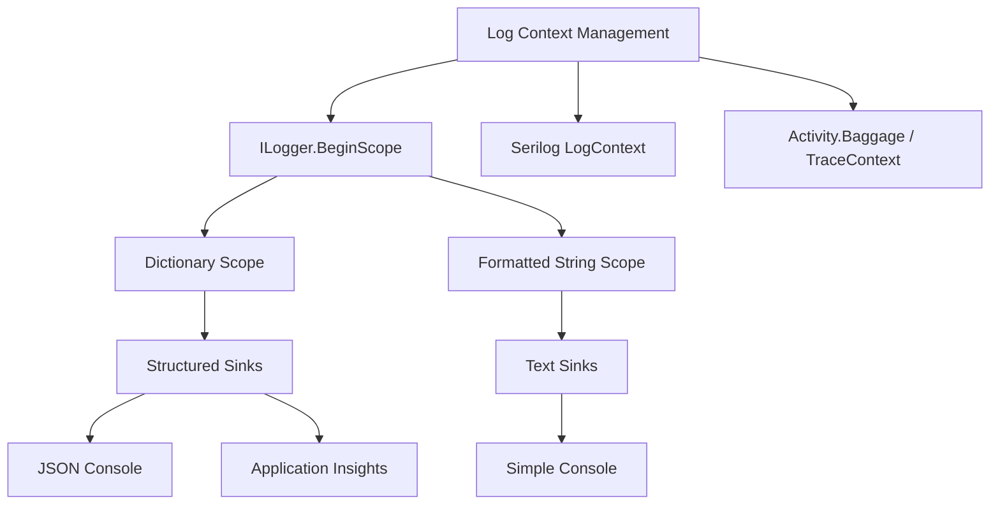
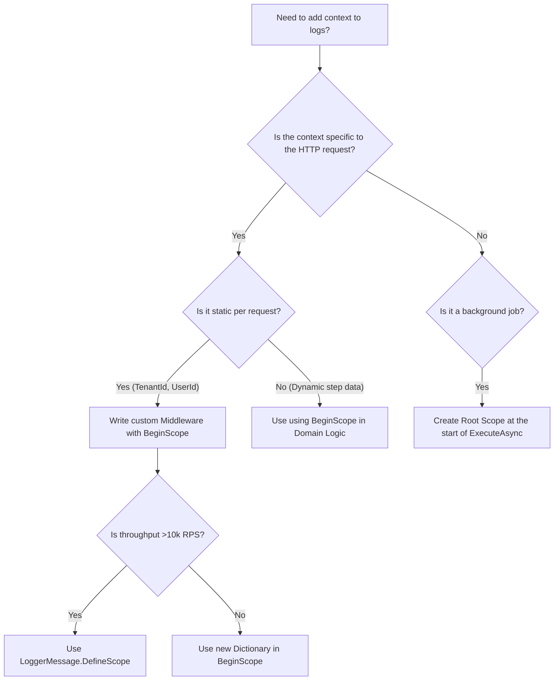

> [!success] Mastery Check
> - [ ] **Studied Well**
> - [ ] **Can explain the concept without notes**
> - [ ] **Can answer interview questions confidently**
> - [ ] **Can implement it in a real project**


# Log Scopes: Contextual Information Across a Request Lifetime

## PART 0 — Navigation & Context

### Where This Fits
```
ASP.NET Core Mastery
└── Diagnostics & Observability
    ├── [[4.023 — ILogger<T>: The .NET Logging Abstraction]]
    ├── [[4.025 — Structured Logging: Log Templates and Semantic Values]]
    ├── 4.026 — Log Scopes ★ YOU ARE HERE
    └── [[4.031 — High-Performance Logging: LoggerMessage.Define]]
```

### Prerequisites
| Topic | Why It Matters Here |
|---|---|
| [[4.023 — ILogger<T>: The .NET Logging Abstraction]] | `BeginScope` is an interface method on `ILogger<T>` itself. |
| [[4.025 — Structured Logging: Log Templates and Semantic Values]] | Scopes push structured key-value pairs into the state dictionary. |

### What This Unlocks After
| Topic | Why It Matters Here |
|---|---|
| [[4.028 — Serilog Integration]] | Serilog implements this via `LogContext.PushProperty`. |
| [[4.054 — HttpContext and IHttpContextAccessor]] | Request context (TraceId, UserId) is the most common data pushed into a scope. |

### Why This Matters
Log scopes allow a production engineer to trace every log statement generated during a specific business operation (like an HTTP request or background job) back to its originating context (Tenant ID, User ID, Correlation ID) without explicitly passing those variables into every single `_logger.LogInformation` call.

---

## PART 1 — The Core Mental Model

> **ASP.NET Core's log scopes use `AsyncLocal<T>` to implicitly attach state (key-value pairs) to every log entry emitted by any logger on the same async control flow path. The practical consequence is that a Tenant ID pushed in early middleware automatically appears in EF Core SQL logs and HttpClient logs deep in the call stack.**

### The Plain-Language Analogy
Imagine you are at a theme park and you put on a neon wristband at the entrance gate (the middleware). As you walk around, you might buy food, ride a rollercoaster, or play a game (different services). Every time a park employee takes your picture (a log statement), the wristband is visible in the photo. The employee didn't need to ask for your ID; the wristband was attached to your person the whole time. When you leave the park (the request ends), the wristband is thrown away.

### The Taxonomy Diagram


---

## PART 2 — Deep Mechanics

### 2.1 — Pipeline Position and Middleware Integration

Scopes are typically created as early as possible in the request pipeline so that all subsequent middleware, endpoint routing, and domain logic execute within the scope.

```text
──► HTTP Request
    │
    ├──► ExceptionHandlerMiddleware
    ├──► W3CLoggingMiddleware
    ├──► CustomScopeMiddleware (Begins Scope: "TenantId: 42") ──┐
    │                                                           │
    │  [Scope active for all inner components]                  │
    ├──► RoutingMiddleware                                      │
    ├──► AuthMiddleware                                         │
    ├──► Endpoint (Controller/Minimal API)                      │
    │      └─► _logger.Log("Processing...")                     │
    │      └─► EF Core Query                                    │
    │                                                           │
    └─◄ (Scope Disposed) ◄──────────────────────────────────────┘
```

**Runtime Cost:** `~2 allocations per scope` (one for the state object, one for the IDisposable wrapper). Plus `AsyncLocal<T>` context flowing overhead per async hop.

### 2.2 — How `AsyncLocal<T>` Powers Scopes

When `_logger.BeginScope` is called, the built-in logging providers (if `IncludeScopes = true`) store the scope state in an `AsyncLocal<T>`.

**ASP.NET Core internally (approximate):**
```csharp
// Inside Microsoft.Extensions.Logging.ScopeProvider
private readonly AsyncLocal<ScopeNode> _currentScope = new();

public IDisposable Push(object state)
{
    var node = new ScopeNode(state, _currentScope.Value);
    _currentScope.Value = node; // Pushes onto the logical stack
    return new DisposableScope(this, node); // Pops on dispose
}
```
Because it uses `AsyncLocal<T>`, the scope automatically flows through `await` boundaries. If a request fires off a `Task.Run`, the scope flows into that background thread.

### 2.3 — Structured Scopes vs. String Scopes

`BeginScope` takes an `object` state. If you pass a string, it's just a text prefix. If you pass an `IEnumerable<KeyValuePair<string, object>>`, it acts as structured data.

```csharp
// Unstructured (String) Scope
using (_logger.BeginScope("Processing Order {OrderId}", 123))
{
    // Output: Processing Order 123 => Payment validated
    _logger.LogInformation("Payment validated"); 
}

// Structured (Dictionary) Scope
var context = new Dictionary<string, object> { ["TenantId"] = "Acme" };
using (_logger.BeginScope(context))
{
    // Sink gets: Message="Querying DB", TenantId="Acme"
    _logger.LogInformation("Querying DB"); 
}
```

**HTTP wire format (approximate):**
While scopes don't change the HTTP response sent to the client, they heavily modify the JSON log output:
```json
{
  "Timestamp": "2026-06-08T12:00:00Z",
  "Message": "Payment validated",
  "Scopes": [
    { "OrderId": 123 },
    { "TenantId": "Acme" }
  ]
}
```

### 2.4 — Built-In Providers and `IncludeScopes`

By default, the built-in Console and Debug logging providers **ignore scopes** for performance reasons. You must explicitly opt-in via configuration.

**Edge Case:** Engineers configure scopes in code, run the app locally, and see no scope data in the terminal, assuming their middleware is broken.
```json
// appsettings.json
{
  "Logging": {
    "Console": {
      "IncludeScopes": true // MUST BE TRUE
    }
  }
}
```

---

## PART 3 — Production Code Patterns

### Pattern 1: The Request Context Scope Middleware

Create a middleware that captures the current user and tenant, pushing them into a structured scope for the remainder of the request.

```csharp
// ✅ CORRECT: The structured context middleware
public class RequestContextLoggingMiddleware
{
    private readonly RequestDelegate _next;

    public RequestContextLoggingMiddleware(RequestDelegate next)
    {
        _next = next;
    }

    public async Task InvokeAsync(HttpContext context, ILogger<RequestContextLoggingMiddleware> logger)
    {
        // Extract data
        var tenantId = context.User.FindFirst("tenant_id")?.Value ?? "Anonymous";
        var correlationId = context.TraceIdentifier;

        // Create structured scope
        var scopeData = new Dictionary<string, object>
        {
            ["TenantId"] = tenantId,
            ["CorrelationId"] = correlationId
        };

        // Use the scope
        using (logger.BeginScope(scopeData))
        {
            // All logs emitted by _next will include TenantId and CorrelationId
            await _next(context);
        }
    }
}
```

### Pattern 2: Domain-Level Transaction Scoping

When processing a complex domain entity (like an order with multiple steps), scope the entire operation.

```csharp
public async Task ProcessOrderAsync(Order order)
{
    // ✅ CORRECT: Scope structured data using C# 9+ collection expressions or dictionaries
    var scope = new Dictionary<string, object>
    {
        ["OrderId"] = order.Id,
        ["Gateway"] = order.PaymentGateway
    };

    using (_logger.BeginScope(scope))
    {
        _logger.LogInformation("Starting processing"); // Includes OrderId
        
        await _inventory.ReserveAsync(order.Items);    // Internal logs include OrderId
        await _payment.ChargeAsync(order.Total);       // Internal logs include OrderId
        
        _logger.LogInformation("Processing complete"); // Includes OrderId
    }
}
```

### Pattern 3: Leveraging `LoggerMessage` for Scopes (Anti-Pattern vs Correct)

```csharp
// ⚠️ WRONG: Allocating a new dictionary on the hot path for every request
using (_logger.BeginScope(new Dictionary<string, object> { ["UserId"] = userId }))
{
}
```

Because `BeginScope` accepts any `IEnumerable<KeyValuePair<string, object>>`, Microsoft added `LoggerMessage.DefineScope` to avoid allocations on the hot path.

```csharp
// ✅ CORRECT: Pre-compiled scope definition (zero allocation of dictionaries)
private static readonly Func<ILogger, int, IDisposable?> _userScope = 
    LoggerMessage.DefineScope<int>("UserId: {UserId}");

public void DoWork(int userId)
{
    using (_userScope(_logger, userId))
    {
        _logger.LogInformation("Doing work...");
    }
}
```

---

## PART 4 — Gotchas & Anti-Patterns

### Gotcha 1: Forgetting to Dispose the Scope

Engineers sometimes assign a scope without a `using` statement or `using` declaration, causing the scope to remain active forever on that async execution context.

// ⚠️ WRONG CODE
```csharp
public async Task HandleRequest()
{
    _logger.BeginScope("Tenant: {TenantId}", "Acme");
    // Memory leak / Context leak! The scope is never popped.
    await Process();
}
```
// HTTP consequence (wrong path):
// The HTTP request succeeds, but subsequent requests processed on the same thread pool thread MIGHT inherit the async context if not properly cleared, leading to cross-tenant data leakage in logs.

// ✅ CORRECT CODE
```csharp
public async Task HandleRequest()
{
    using var scope = _logger.BeginScope("Tenant: {TenantId}", "Acme");
    await Process();
}
```
// HTTP consequence (correct path):
// Scope is deterministically popped from the AsyncLocal stack at the end of the method.

// WHY: `BeginScope` returns an `IDisposable`. The ASP.NET Core logging infrastructure relies on the `Dispose` method to pop the state off the `AsyncLocal` stack.

### Gotcha 2: Using String Concatenation in `BeginScope`

Engineers use C# string interpolation in the scope, defeating structured logging.

// ⚠️ WRONG CODE
```csharp
using (_logger.BeginScope($"Order:{orderId} User:{userId}"))
{
    _logger.LogInformation("Processing");
}
```
// HTTP consequence (wrong path):
// JSON log sinks receive a single "Message" property. You cannot query/filter logs by `userId` in Application Insights or Kibana.

// ✅ CORRECT CODE
```csharp
using (_logger.BeginScope("Order:{OrderId} User:{UserId}", orderId, userId))
{
    _logger.LogInformation("Processing");
}
```
// HTTP consequence (correct path):
// Sinks receive `{ "OrderId": 123, "UserId": 456 }` as distinct queryable columns.

// WHY: `BeginScope` takes a message template and arguments, exactly like `LogInformation`. The internal `LogValuesFormatter` parses the `{Tokens}` into structured dictionary keys.

### Gotcha 3: The `IncludeScopes` Configuration Trap

Engineers expect scopes to appear in local development console output and get frustrated when they don't.

// ⚠️ WRONG CODE
```json
// appsettings.Development.json
"Logging": {
  "LogLevel": {
    "Default": "Information"
  }
}
```
// HTTP consequence (wrong path):
// Scopes are silently discarded by the Console logger.

// ✅ CORRECT CODE
```json
// appsettings.Development.json
"Logging": {
  "Console": {
    "IncludeScopes": true
  },
  "LogLevel": {
    "Default": "Information"
  }
}
```
// HTTP consequence (correct path):
// Console output includes the scope strings prefixing the log lines.

// WHY: Formatting scopes requires traversing the `AsyncLocal` linked list and allocating strings. The ASP.NET Core team defaulted this to `false` for the Console provider to maximize throughput in high-volume environments.

### Gotcha 4: Capturing Mutated State in a Scope

Passing a mutable object reference to a structured scope means the log provider might read the properties *after* they change, or on a different thread.

// ⚠️ WRONG CODE
```csharp
var contextData = new RequestMetrics(); // Mutable class
using (_logger.BeginScope(new Dictionary<string, object> { ["Metrics"] = contextData }))
{
    contextData.ProcessedCount++; 
    _logger.LogInformation("Step 1"); // Might log 1 or 0 depending on sink batching
}
```
// HTTP consequence (wrong path):
// Unpredictable log output; potential race conditions in background log processors (like Serilog async sink).

// ✅ CORRECT CODE
```csharp
// Extract immutable scalar values at the time of scope creation
using (_logger.BeginScope("Processed:{Count}", contextData.ProcessedCount))
{
    _logger.LogInformation("Step 1"); 
}
```
// HTTP consequence (correct path):
// Thread-safe, deterministic log records.

// WHY: Log scopes flow through `AsyncLocal` and are often serialized by background threads (e.g., Application Insights or Serilog). Passing mutable references violates thread safety.

### Gotcha 5: Serilog `LogContext` vs Microsoft `BeginScope`

Engineers use Serilog but try to push properties using ASP.NET Core's `BeginScope`, without configuring Serilog to respect it.

// ⚠️ WRONG CODE
```csharp
// Program.cs using Serilog
builder.Host.UseSerilog((ctx, lc) => lc.WriteTo.Console());

// In code:
using (_logger.BeginScope("TenantId: {TenantId}", "Acme")) { }
```
// HTTP consequence (wrong path):
// The scope is completely ignored by Serilog.

// ✅ CORRECT CODE
```csharp
// Program.cs
builder.Host.UseSerilog((ctx, lc) => lc
    .Enrich.FromLogContext() // MUST BE PRESENT
    .WriteTo.Console());
```
// HTTP consequence (correct path):
// Serilog bridges the Microsoft `BeginScope` into its own `LogContext`.

// WHY: Serilog replaces the internal `ILoggerFactory`. If `.Enrich.FromLogContext()` is missing, Serilog's implementation of `BeginScope` is essentially a no-op that discards the data.

---

## PART 5 — Performance Implications

### Request Pipeline Characteristics Table

| Scenario | Pipeline Depth | Allocations Per Request | Approx Latency Impact | Recommendation |
|---|---|---|---|---|
| No Scopes | N/A | 0 | 0 ns | Use for ultra-high throughput if context is unneeded |
| `BeginScope` (String Interpolation) | Per-call | 1 string | ~50 ns | Anti-pattern. Avoid. |
| `BeginScope` (Template + Args) | Per-call | 2 objects, 1 array | ~80 ns | Standard. Good for domain logic. |
| `BeginScope` (Dictionary) | Per-call | 1 dict, multiple nodes | ~120 ns | Best for structured middleware. |
| `LoggerMessage.DefineScope` | Per-call | 1 struct wrap | ~15 ns | Optimal for hot-path middleware. |
| Deeply nested scopes (5+ deep) | Async tree | O(depth) | ~200 ns | Flattens in background, CPU cost on sinks |
| Serilog `LogContext.PushProperty` | Per-call | 1 object | ~40 ns | Fast, Serilog native. |
| Missing `Dispose` | Memory Leak | Endless | Crash | Fix immediately. |

### BenchmarkDotNet Code

```csharp
using BenchmarkDotNet.Attributes;
using BenchmarkDotNet.Running;
using Microsoft.Extensions.Logging;
using Microsoft.Extensions.Logging.Abstractions;

[MemoryDiagnoser]
public class ScopeBenchmarks
{
    private ILogger _logger = NullLogger.Instance;
    private static readonly Func<ILogger, string, IDisposable?> _compiledScope = 
        LoggerMessage.DefineScope<string>("Tenant:{TenantId}");

    [Benchmark(Baseline = true)]
    public void NoScope()
    {
        _logger.LogInformation("Processing");
    }

    [Benchmark]
    public void StandardTemplateScope()
    {
        using (_logger.BeginScope("Tenant:{TenantId}", "Acme"))
        {
            _logger.LogInformation("Processing");
        }
    }

    [Benchmark]
    public void DictionaryScope()
    {
        var dict = new Dictionary<string, object> { ["TenantId"] = "Acme" };
        using (_logger.BeginScope(dict))
        {
            _logger.LogInformation("Processing");
        }
    }

    [Benchmark]
    public void CompiledDefineScope()
    {
        using (_compiledScope(_logger, "Acme"))
        {
            _logger.LogInformation("Processing");
        }
    }
}
// Expected output (approximate, .NET 8, x64, Kestrel, local):
// Method                  | Mean      | Allocated |
// ----------------------- |----------:|----------:|
// NoScope                 |  2.1 ns   |      0 B  |
// StandardTemplateScope   | 85.3 ns   |    112 B  |
// DictionaryScope         | 120.4 ns  |    256 B  |
// CompiledDefineScope     | 18.2 ns   |     24 B  |
```

### When to Care / When to Ignore

**When this costs you:**
In APIs processing >10,000 req/sec, allocating new Dictionaries in early middleware for scopes generates significant Gen 0 GC pressure. Here, you must use `LoggerMessage.DefineScope`.

**When this doesn't matter:**
For standard enterprise APIs (100-500 req/sec), the ~100 bytes of allocation per request to push a Dictionary scope containing Tenant, CorrelationId, and UserId is utterly irrelevant compared to a single database round trip. Readability and structured data quality win.

---

## PART 6 — Interview Arsenal

### A. The Question Bank

**Question:** "If you have a background task running in `Task.Run` triggered by an HTTP request, will the `_logger.Log` inside that task include the `TenantId` scope created in the HTTP middleware?"
**Average Answer:** No, because it's on a different thread and the HTTP context is lost.
**Why That's Insufficient:** It misunderstands how ASP.NET Core logging flows.
> **Great Answer:** "Yes, it will include the `TenantId`. Log scopes are backed by `AsyncLocal<T>`, which automatically flows across asynchronous boundaries and thread pool captures. When `Task.Run` captures the execution context, it copies the `AsyncLocal` state. However, we have to be extremely careful—if the HTTP request completes and disposes the scope *before* the background task finishes logging, the background task might log without the scope or throw an `ObjectDisposedException` depending on the state object, so background work should typically establish its own root scope."

### B. The Trick Questions
**Question:** "I wrapped my controller action in `using (_logger.BeginScope("MyScope"))`. My `ExceptionFilter` caught an error and logged it. Why isn't 'MyScope' attached to the exception log?"
**The Trap:** Thinking filters wrap the controller action in the call stack exactly like middleware.
**The Correct Answer:** The `ExceptionFilter` executes *after* the controller action method has returned (and thus, after the `using` block has disposed the scope). If you want scopes to apply to filters, you must apply the scope in a Middleware that sits earlier in the pipeline than the MVC routing layer.

### C. Red Flags to Avoid
- **"I use `HttpContext.Items` to pass data to my loggers."** (Red Flag: This forces you to write a custom logger provider and couples logging to the web stack. Background services won't work.)
- **"Scopes are just string prefixes."** (Red Flag: Shows lack of experience with structured sinks like Kibana/AppInsights where scopes are JSON columns.)
- **"I don't use scopes, I just inject a scoped service into my controllers and manually add the properties to my log messages."** (Red Flag: Massively violates DRY, clutters business logic, and doesn't cover framework-generated logs like EF Core SQL statements.)

---

## PART 7 — Decision Framework



---

## PART 8 — Self-Check

### A. Conceptual Questions
1. How does `BeginScope` ensure thread safety when processing concurrent requests?
2. What happens to the HTTP request if `BeginScope` throws an exception during disposal?
3. Why does Serilog require `.Enrich.FromLogContext()` to support ASP.NET Core scopes?
4. What is the difference between passing a formatted string vs. a Dictionary to `BeginScope`?
5. If middleware A pushes Scope 1, and middleware B pushes Scope 2, what does the logger output?
6. Can a singleton service safely use `BeginScope`?
7. How does EF Core capture the HTTP `TraceId` in its generated SQL logs?
8. Why are scopes ignored by default in the `appsettings.json` Console provider?

### B. Code Puzzles

**Puzzle 1: The Scope Leak (The 5-puzzle rule bug)**
```csharp
public async Task HandleMessage()
{
    var scope = _logger.BeginScope("MessageId:{Id}", 42);
    _logger.LogInformation("Processing");
    await Task.Delay(10);
    // End of method
}
```
Does this compile? What happens to the HTTP pipeline?
<details>
<summary>Answer</summary>
It compiles. However, because `scope` is not wrapped in a `using` statement and `Dispose()` is never called, the `AsyncLocal` node is never popped off the stack. If this runs on a persistent thread (like a background listener), all subsequent logs on this thread will be permanently tagged with `MessageId:42`. This is a severe context leak.
</details>

**Puzzle 2: The Mutable Dictionary**
```csharp
var props = new Dictionary<string, object> { ["Attempt"] = 1 };
using (_logger.BeginScope(props))
{
    _logger.LogWarning("Failed");
    props["Attempt"] = 2;
    _logger.LogWarning("Failed again");
}
```
What is logged in a background structured sink (like Application Insights)?
<details>
<summary>Answer</summary>
A race condition. Because the sink processes the dictionary asynchronously, both log entries might end up with `Attempt=2`, or it might throw a `InvalidOperationException` if the dictionary is modified while the sink is enumerating it. Scopes must be immutable.
</details>

**Puzzle 3: The Short-Circuit**
```csharp
public async Task InvokeAsync(HttpContext context)
{
    using (_logger.BeginScope("Auth"))
    {
        if (!context.Request.Headers.ContainsKey("Auth"))
        {
            context.Response.StatusCode = 401;
            return; // Short-circuits
        }
        await _next(context);
    }
}
```
If the request lacks the header, what status code is returned, and does the scope dispose correctly?
<details>
<summary>Answer</summary>
Status 401 is returned. The scope disposes correctly because the `using` block guarantees `Dispose()` is called upon method exit, even during an early return short-circuit.
</details>

**Puzzle 4: Nested Scopes**
```csharp
using (_logger.BeginScope(new Dictionary<string, object> { ["A"] = 1 }))
{
    using (_logger.BeginScope(new Dictionary<string, object> { ["A"] = 2, ["B"] = 3 }))
    {
         _logger.LogInformation("Here");
    }
}
```
What values does the structured sink receive?
<details>
<summary>Answer</summary>
It receives `{ "A": 2, "B": 3 }`. Inner scopes override outer scopes for keys of the same name. `A` is shadowed.
</details>

---

## PART 9 — Connections & Resources

### A. Related Topics Table
| Topic | Why It Connects |
|---|---|
| [[4.023 — ILogger<T>: The .NET Logging Abstraction]] | `BeginScope` is defined directly on this core interface. |
| [[4.025 — Structured Logging: Log Templates and Semantic Values]] | Scopes rely on the exact same token parsing engine as message templates. |
| [[4.028 — Serilog Integration]] | Serilog overrides Microsoft's scope management with its own `LogContext` implementation. |
| [[4.054 — HttpContext and IHttpContextAccessor]] | The properties pulled from `HttpContext` are the most common payload for a global log scope. |

### B. Books
| Book | Chapters | Why These Chapters |
|---|---|---|
| *ASP.NET Core in Action, 3rd Ed* by Andrew Lock | Chapter 17 (Logging) | Explains the `AsyncLocal` implementation behind logging scopes. |
| *Pro ASP.NET Core 7* by Adam Freeman | Chapter 26 | Details the `appsettings.json` configuration required to view scopes. |

### C. Essential Articles & Docs
- [Microsoft Docs: Logging in C# and .NET - Log Scopes](https://learn.microsoft.com/en-us/dotnet/core/extensions/logging?tabs=command-line#log-scopes)
- [Andrew Lock: How to include scopes when logging in ASP.NET Core](https://andrewlock.net/how-to-include-scopes-when-logging-in-asp-net-core/)
- [Nicholas Blumhardt: The semantics of structured logging (Serilog creator)](https://nblumhardt.com/2016/02/serilog-context-and-correlation/)

### D. Template Meta-Note
> [!NOTE] 
> **Part 0** orients you. **Part 1** builds the mental model. **Part 2** explains the framework internals and pipeline. **Part 3** provides copy-pasteable production code. **Part 4** highlights the bugs your team will write. **Part 5** gives you the performance math. **Part 6** prepares you for the principal engineering interview. **Part 7** gives you a decision tree. **Part 8** tests your knowledge. **Part 9** links to further mastery.
