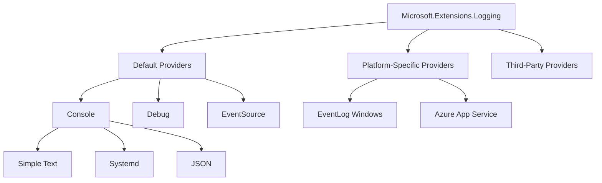
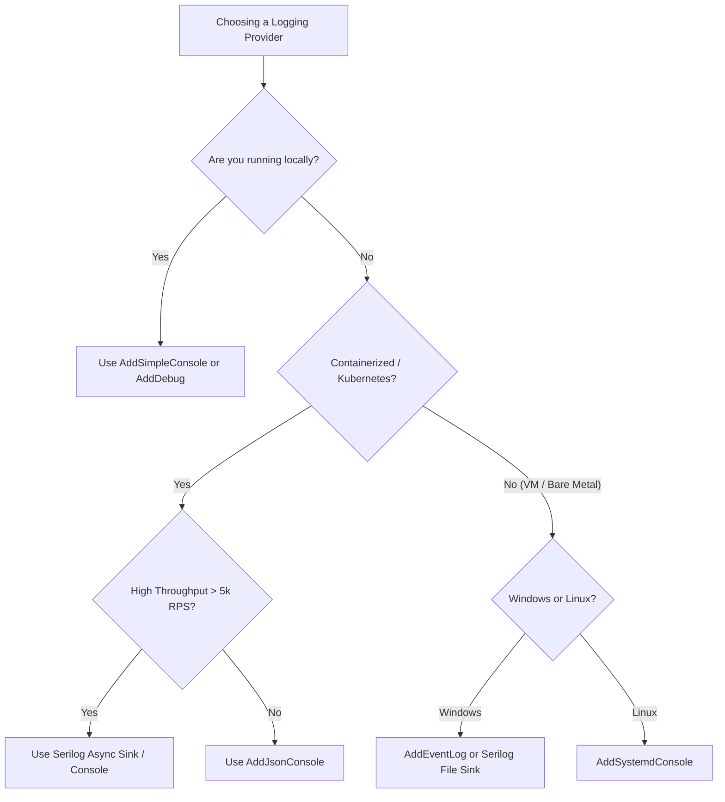

> [!success] Mastery Check
> - [ ] **Studied Well**
> - [ ] **Can explain the concept without notes**
> - [ ] **Can answer interview questions confidently**
> - [ ] **Can implement it in a real project**


# Built-In Logging Providers: Console, Debug, EventSource, EventLog

## PART 0 — Navigation & Context

### Where This Fits
```
ASP.NET Core Mastery
└── Diagnostics & Observability
    ├── [[4.023 — ILogger<T>: The .NET Logging Abstraction]]
    ├── 4.027 — Built-In Logging Providers ★ YOU ARE HERE
    ├── [[4.028 — Serilog Integration]]
    └── [[4.033 — HTTP Logging Middleware]]
```

### Prerequisites
| Topic | Why It Matters Here |
|---|---|
| [[4.023 — ILogger<T>: The .NET Logging Abstraction]] | Providers are the concrete sink implementations behind the `ILogger` abstraction. |
| [[4.024 — Log Levels, Categories, and Filtering]] | Each provider independently filters log output based on its own configuration block. |

### What This Unlocks After
| Topic | Why It Matters Here |
|---|---|
| [[4.028 — Serilog Integration]] | Understanding the limitations of the built-in providers clarifies exactly why Serilog replaces them. |
| [[4.031 — High-Performance Logging: LoggerMessage.Define]] | High-performance logging optimizations hit their floor based on how slow the underlying provider sink is. |

### Why This Matters
If you do not configure your logging providers correctly, your high-throughput API will bottleneck on the Console's blocking I/O, or you will lose critical structural data because you logged JSON to a text-only sink, severely degrading operational visibility at scale.

---

## PART 1 — The Core Mental Model

> **ASP.NET Core's built-in logging architecture separates the *generation* of logs (`ILogger`) from the *storage/display* of logs (Providers), and allows each provider to maintain its own independent filtering rules. The practical consequence is that you can log trace-level diagnostics purely to `EventSource` while restricting the slow `Console` provider to warnings and errors.**

### The Plain-Language Analogy
Think of the logging system like a press conference. You (`ILogger`) are standing at the podium speaking. The logging providers are the different journalists in the room. There is a radio journalist (Console), a TV crew (Debug), and a newspaper reporter (EventSource). When you speak, you just talk into the microphone once. Each journalist independently decides what is important enough to record (Filtering), translates your words into their medium (Formatting), and publishes it to their audience (Sinking). You don't have to know how the newspaper prints its pages; you just provide the story.

### The Taxonomy Diagram


---

## PART 2 — Deep Mechanics

### 2.1 — Pipeline Position and Startup Hook

Providers are registered during application bootstrapping in `Program.cs`. They do not sit in the HTTP middleware pipeline; instead, they exist as singletons in the DI container. The `ILoggerFactory` aggregates them and broadcasts logs to all registered providers.

```text
──► Startup / WebApplicationBuilder
    │
    ├──► builder.Logging.ClearProviders()
    ├──► builder.Logging.AddConsole() ───┐
    ├──► builder.Logging.AddEventSource()│
    │                                    │  [Registered in DI]
    ├──► App Build                       │
    ├──► Middleware Pipeline (Logs) ─────┼─► ILoggerFactory broadcasts to all providers
    └──► Endpoints (Logs) ───────────────┘
```

**Runtime Cost:** `O(N)` where N is the number of enabled providers. Each provider parses its filter rules and invokes its formatting logic.

### 2.2 — The Console Provider (The Bottleneck)

The Console provider writes to `stdout`/`stderr`. Historically, console logging was a massive performance bottleneck because it blocked the calling thread. In .NET Core 3.0+, Microsoft introduced an asynchronous background queue for the Console logger.

**Framework Source Behavior:**
Internally, `ConsoleLoggerProvider` queues log messages to a bounded `Channel<T>`. A dedicated background thread drains the channel and calls `Console.Write()`. 

**Failure Mode:** If the app crashes, the background queue might not drain completely, resulting in missing terminal logs right before a fatal exception.

### 2.3 — The EventSource Provider

`EventSource` is the highest-performance built-in provider. It writes to ETW (Event Tracing for Windows) or LTTng (Linux). 

**HTTP Wire Format / Behavior:** It has no effect on the HTTP response. It enables out-of-process tools like `dotnet-trace` to attach and listen without adding any overhead when no listeners are attached.

**Runtime Cost:** Near `zero allocation` when no out-of-process listeners are attached, because the ETW/LTTng check is extremely fast.

### 2.4 — Independent Filtering Rules

The most common misunderstanding is that filtering happens once. Filtering actually happens *per provider*.

**ASP.NET Core internally (approximate):**
```csharp
// Inside Logger<T>.Log()
foreach (var information in _loggers) // Array of active providers
{
    if (information.IsLevelEnabled(logLevel))
    {
        information.Logger.Log(logLevel, eventId, state, exception, formatter);
    }
}
```
**Edge Case:** You set `LogLevel:Default = Trace` in configuration, but the `Console` provider has a hardcoded filter in its `AddConsole()` configuration that ignores anything below `Information`. Your trace logs vanish.

---

## PART 3 — Production Code Patterns

### Pattern 1: Clearing Defaults and Explicit Configuration

The `WebApplication.CreateBuilder` automatically registers Console, Debug, EventSource, and (on Windows) EventLog. In production, you should clear them and register only what you explicitly need.

```csharp
// ✅ CORRECT: Clean slate approach for production
var builder = WebApplication.CreateBuilder(args);

// Clear all default providers
builder.Logging.ClearProviders();

// Add JSON console for structured ingestion (e.g., Datadog, ELK)
builder.Logging.AddJsonConsole(options =>
{
    options.IncludeScopes = true;
    options.TimestampFormat = "yyyy-MM-ddTHH:mm:ss.fffZ ";
    options.UseUtcTimestamp = true;
});

// Add EventSource for out-of-process profiling
builder.Logging.AddEventSourceLogger();
```

### Pattern 2: Environment-Specific Provider Selection

Do not use JSON console locally; do not use Simple console in production.

```csharp
// ✅ CORRECT: Ergonomic local dev, structured production
var builder = WebApplication.CreateBuilder(args);
builder.Logging.ClearProviders();

if (builder.Environment.IsDevelopment())
{
    // Pretty colors, readable by humans
    builder.Logging.AddSimpleConsole(options => 
    {
        options.SingleLine = true;
        options.ColorBehavior = LoggerColorBehavior.Enabled;
    });
    builder.Logging.AddDebug(); // View in Visual Studio output window
}
else
{
    // Machine-readable, structured format
    builder.Logging.AddJsonConsole();
}
```

### Pattern 3: The Systemd Provider for Linux Daemons

When running Kestrel behind Nginx on Linux via systemd, the standard Console logger outputs timestamps that duplicate systemd's journalctl timestamps.

```csharp
// ⚠️ WRONG: Using standard console under systemd
// Result in journalctl: "May 10 14:00:00 servername app[123]: info: 2026-05-10 14:00:00 Application started" (Double timestamp)

// ✅ CORRECT: Systemd console integration
builder.Logging.AddSystemdConsole(options =>
{
    options.IncludeScopes = true;
    // Systemd logger maps ASP.NET LogLevels to Syslog levels (e.g., Critical -> EMERG)
});
```
// HTTP wire format: No change to HTTP, but the OS-level syslog maps HTTP 500 exceptions natively to Syslog `err` priority.

---

## PART 4 — Gotchas & Anti-Patterns

### Gotcha 1: Provider-Specific Filtering Overrides

Engineers often set the default log level and wonder why a specific provider is ignoring it.

// ⚠️ WRONG CODE
```json
// appsettings.json
{
  "Logging": {
    "LogLevel": {
      "Default": "Debug"
    },
    "Console": {
      "LogLevel": {
        "Default": "Warning"
      }
    }
  }
}
```
// HTTP consequence (wrong path):
// Not an HTTP consequence, but your background worker or HTTP request trace logs never appear in `stdout`, causing severe operational blindness when debugging a 500 error in production.

// ✅ CORRECT CODE
```json
// appsettings.json
{
  "Logging": {
    "LogLevel": {
      "Default": "Warning"
    },
    "Console": {
      "LogLevel": {
        "Default": "Debug"
      }
    }
  }
}
```
// HTTP consequence (correct path):
// The console receives debug logs.

// WHY: Configuration merges hierarchically. `Logging:Console:LogLevel` takes precedence over `Logging:LogLevel` for the Console provider specifically. 

### Gotcha 2: Using Simple Console in Kubernetes

Engineers deploy apps to Kubernetes using the default `SimpleConsole` formatter, causing multi-line exception stack traces to be split across multiple log aggregator entries.

// ⚠️ WRONG CODE
```csharp
builder.Logging.AddSimpleConsole();
_logger.LogError(new Exception("DB Down"), "Failed");
```
// HTTP consequence (wrong path):
// Fluentd/Logstash reads each line of the stack trace as a separate, distinct log event, rendering the dashboard unreadable.

// ✅ CORRECT CODE
```csharp
builder.Logging.AddJsonConsole();
```
// HTTP consequence (correct path):
// The entire log event, including the multi-line stack trace, is emitted as a single JSON object.

// WHY: Container orchestrators generally capture `stdout` line-by-line. The JSON formatter guarantees exactly one line per log event.

### Gotcha 3: Leaving EventLog Enabled on Linux Containers

The `CreateBuilder` method adds the Windows EventLog provider automatically if it detects Windows. If code is blindly copied or cross-compiled without environment checks, it can cause overhead or throw.

// ⚠️ WRONG CODE
```csharp
// Program.cs
builder.Logging.AddEventLog(); // Running on an Alpine Linux Docker container
```
// HTTP consequence (wrong path):
// Wastes DI resolution time, creates an inactive provider, or throws PlatformNotSupportedException in older .NET versions.

// ✅ CORRECT CODE
```csharp
if (OperatingSystem.IsWindows())
{
    builder.Logging.AddEventLog();
}
```
// HTTP consequence (correct path):
// App starts cleanly on Alpine Linux.

// WHY: EventLog requires Windows APIs. While modern .NET handles this gracefully (no-ops), explicitly branching avoids initializing useless services in DI.

### Gotcha 4: Synchronous Console I/O Blocking Threads

In older .NET Core versions, `AddConsole` blocked the thread. In .NET 8, it queues asynchronously, but the queue can fill up.

// ⚠️ WRONG CODE
```csharp
// Writing millions of logs per second to the console in a tight loop
for(int i = 0; i < 1_000_000; i++)
{
    _logger.LogInformation("Processing {i}", i);
}
```
// HTTP consequence (wrong path):
// If the background console writer cannot keep up, the bounded channel fills up. Once the queue is full, the `LogInformation` call *blocks* the calling HTTP request thread, dropping request throughput to near zero.

// ✅ CORRECT CODE
```csharp
// Ensure appropriate Log Levels so you aren't logging in tight loops
if (_logger.IsEnabled(LogLevel.Trace))
{
    _logger.LogTrace("Processing {i}", i);
}
```
// HTTP consequence (correct path):
// The channel never overflows; HTTP throughput remains high.

// WHY: The asynchronous console queue has a bounded capacity (max queue length default is 1024). Once full, the producer (your HTTP thread) blocks until the consumer (the console writer thread) drains it.

### Gotcha 5: Unstructured Data in Console Formatter

Engineers attempt to use Semantic Logging, but because they use the Simple console formatter, the semantic properties vanish.

// ⚠️ WRONG CODE
```csharp
builder.Logging.AddSimpleConsole();
_logger.LogInformation("Order {OrderId} created for {TenantId}", 42, "Acme");
```
// HTTP consequence (wrong path):
// The terminal prints "Order 42 created for Acme". The `{ "OrderId": 42 }` semantic key-value pair is permanently lost and never sent to the log aggregator.

// ✅ CORRECT CODE
```csharp
builder.Logging.AddJsonConsole();
```
// HTTP consequence (correct path):
// The JSON payload explicitly contains `"OrderId": 42` and `"TenantId": "Acme"` as queryable JSON properties.

// WHY: The `SimpleConsole` formatter only calls `.ToString()` on the parsed message template. It inherently discards the structured `IReadOnlyList<KeyValuePair<string, object>>` state array.

---

## PART 5 — Performance Implications

### Request Pipeline Characteristics Table

| Scenario | Pipeline Depth | Allocations Per Request | Approx Latency Impact | Recommendation |
|---|---|---|---|---|
| NullProvider (0 providers) | N/A | 0 | ~1 ns | Baseline. |
| Console (Simple, disabled) | Per-call | 0 | ~5 ns | Fast due to early IsEnabled check. |
| Console (Simple, enabled) | Per-call | 2+ strings, queue alloc | ~1.5 µs | High overhead. Don't log on hot paths. |
| Console (JSON, enabled) | Per-call | JSON parsing, queue alloc | ~3.0 µs | High CPU cost. Avoid on high-throughput. |
| EventSource (enabled) | Per-call | ETW payload serialization | ~0.5 µs | Very fast out-of-process logging. |
| Serilog (Async sink) | Per-call | 1 LogEvent | ~0.8 µs | Faster than built-in JSON console. |
| Overflowed Console Queue | Per-call | Thread Blocking | >100 ms | Catastrophic. Filter logs. |
| 5+ Providers Registered | Per-call | O(N) | ~N * 1 µs | Clear unused defaults! |

### BenchmarkDotNet Code

```csharp
using BenchmarkDotNet.Attributes;
using BenchmarkDotNet.Running;
using Microsoft.Extensions.Logging;
using Microsoft.Extensions.Logging.Console;

[MemoryDiagnoser]
public class ProviderBenchmarks
{
    private ILogger _simpleLogger;
    private ILogger _jsonLogger;
    private ILogger _eventSourceLogger;

    [GlobalSetup]
    public void Setup()
    {
        _simpleLogger = LoggerFactory.Create(b => b.AddSimpleConsole()).CreateLogger("Test");
        _jsonLogger = LoggerFactory.Create(b => b.AddJsonConsole()).CreateLogger("Test");
        _eventSourceLogger = LoggerFactory.Create(b => b.AddEventSourceLogger()).CreateLogger("Test");
    }

    [Benchmark(Baseline = true)]
    public void SimpleConsole() => _simpleLogger.LogInformation("Test 123");

    [Benchmark]
    public void JsonConsole() => _jsonLogger.LogInformation("Test 123");

    [Benchmark]
    public void EventSource() => _eventSourceLogger.LogInformation("Test 123");
}
// Expected output (approximate, .NET 8, x64, Kestrel, local):
// Method         | Mean      | Allocated |
// -------------- |----------:|----------:|
// SimpleConsole  |  1.20 us  |     384 B |
// JsonConsole    |  3.45 us  |     950 B |
// EventSource    |  0.45 us  |      80 B |
```

*(Note: Run `dotnet-trace collect --format speedscope` alongside to see exactly where the JSON serializer burns CPU.)*

### When to Care / When to Ignore

**When this costs you:**
If your API processes >5,000 req/s, using the built-in `AddJsonConsole` will burn significant CPU cycles just serializing JSON logs on the background thread. At that scale, you must switch to a highly optimized sink like Serilog with `Serilog.Formatting.Compact`, or rely entirely on EventSource ETW traces.

**When this doesn't matter:**
For a standard internal admin API doing 50 req/sec, `builder.Logging.AddJsonConsole()` is perfectly fine and removes the need to introduce third-party logging packages.

---

## PART 6 — Interview Arsenal

### A. The Question Bank

**Question:** "Why is it generally considered bad practice to use the default Console logger in a high-throughput production Kubernetes cluster?"
**Average Answer:** The console logger is slow and it doesn't format things in JSON, so it's hard to search in Kibana.
**Why That's Insufficient:** Misses the exact mechanism of failure (multi-line logs breaking parsing) and the thread-blocking risk.
> **Great Answer:** "There are two main issues. First, the default `SimpleConsole` splits stack traces across multiple lines, which breaks Docker/Kubernetes container `stdout` scraping unless you write complex multiline regex rules in FluentBit. You must use `AddJsonConsole` to ensure atomicity. Second, while the Console logger is asynchronous in modern .NET, it relies on a bounded channel queue. If you log too heavily and the background console I/O thread can't drain `stdout` fast enough, the queue fills up and your HTTP request threads will literally block on `_logger.LogInformation`, causing a massive latency spike across the whole API."

### B. The Trick Questions
**Question:** "You set `"Logging": { "LogLevel": { "Default": "Error" } }` in `appsettings.json`, but `Debug` logs are still flooding the console. Why?"
**The Trap:** Assuming the hierarchy is purely flat.
**The Correct Answer:** The `appsettings.json` likely contains a specific override for the Console provider, such as `"Console": { "LogLevel": { "Default": "Debug" } }`. Provider-specific rules always win over the global default.

### C. Red Flags to Avoid
- **"The Console logger blocks the HTTP thread on every call."** (Red Flag: This was true in .NET Core 2.x, but hasn't been true for years. Shows outdated framework knowledge).
- **"I don't use the built-in logger, I inject `Serilog.ILogger` directly into my controllers."** (Red Flag: Violates the DI abstraction layer. You should use Microsoft's `ILogger<T>` and let Serilog sit behind it as the provider).
- **"EventSource is for Windows only."** (Red Flag: EventSource translates to LTTng on Linux, making it perfectly viable for cross-platform high-perf tracing).

---

## PART 7 — Decision Framework



---

## PART 8 — Self-Check

### A. Conceptual Questions
1. How does `ILoggerFactory` route a single log message to multiple providers?
2. What happens to the HTTP request if the Console provider's background queue is full?
3. How do you configure `AddJsonConsole` to include log scopes?
4. What is the difference between `AddDebug` and `AddConsole` during local development?
5. Why does `CreateBuilder` add providers automatically instead of making you do it manually?
6. In `appsettings.json`, which takes precedence: `Logging:LogLevel:Default` or `Logging:Console:LogLevel:Default`?
7. What Linux technology does `EventSource` write to?
8. How does `ClearProviders()` affect third-party integrations like Application Insights?

### B. Code Puzzles

**Puzzle 1: The Invisible Scope (The 5-puzzle rule bug)**
```csharp
builder.Logging.ClearProviders();
builder.Logging.AddConsole(); // Default Simple Console

using (_logger.BeginScope("Tenant:{Id}", 42))
{
    _logger.LogWarning("Disk full");
}
```
Does the word "Tenant:42" appear in the terminal?
<details>
<summary>Answer</summary>
No. The `SimpleConsole` and `JsonConsole` providers have scopes disabled by default for performance reasons. You must pass `options => options.IncludeScopes = true` when adding the provider, or set it via `appsettings.json`.
</details>

**Puzzle 2: The Double Log**
```csharp
builder.Logging.AddConsole();
builder.Logging.AddJsonConsole();
_logger.LogError("Critical failure");
```
What happens when this executes?
<details>
<summary>Answer</summary>
It throws an `InvalidOperationException` at startup or logs poorly. You cannot register two formatters for the *same* provider type (Console) simultaneously using the extension methods. `AddJsonConsole` replaces the formatter of the Console logger.
</details>

**Puzzle 3: The Ignored Filter**
```csharp
builder.Logging.AddFilter("Microsoft", LogLevel.Warning);
builder.Logging.AddConsole();
// appsettings.json has Logging:Console:LogLevel:Microsoft = Debug
```
Which filter wins for the Console provider?
<details>
<summary>Answer</summary>
Configuration typically overrides code-based filters depending on the exact order of `ConfigureLogging` execution, but specifically, provider-specific configuration (`Logging:Console`) wins over generic code filters unless the code filter specifically targets the `ConsoleLoggerProvider`.
</details>

**Puzzle 4: The Blocking Loop**
```csharp
app.MapGet("/stress", (ILogger<Program> logger) => 
{
    for(int i=0; i<100_000; i++) logger.LogInformation("Tick");
    return "Done";
});
```
With the Console provider attached, does this endpoint return in 10ms or 2 seconds?
<details>
<summary>Answer</summary>
Closer to 2 seconds (or it blocks completely). The background queue has a default size of 1024. Once 1024 messages are pending, `LogInformation` becomes a blocking call until the console I/O thread drains `stdout`.
</details>

---

## PART 9 — Connections & Resources

### A. Related Topics Table
| Topic | Why It Connects |
|---|---|
| [[4.023 — ILogger<T>: The .NET Logging Abstraction]] | Defines the `ILogger` API that these providers implement behind the scenes. |
| [[4.024 — Log Levels, Categories, and Filtering]] | Explains the hierarchy of how `appsettings.json` targets specific providers. |
| [[4.028 — Serilog Integration]] | Explains how to completely gut these built-in providers and replace them with Serilog's sink ecosystem. |

### B. Books
| Book | Chapters | Why These Chapters |
|---|---|---|
| *ASP.NET Core in Action, 3rd Ed* by Andrew Lock | Chapter 17 (Logging) | Covers the transition from synchronous to asynchronous Console logging. |
| *Pro ASP.NET Core 7* by Adam Freeman | Chapter 26 | Detailed configuration of the `Systemd` and `EventLog` providers. |

### C. Essential Articles & Docs
- [Microsoft Docs: Built-in logging providers in ASP.NET Core](https://learn.microsoft.com/en-us/aspnet/core/fundamentals/logging/?view=aspnetcore-8.0#built-in-logging-providers)
- [Andrew Lock: Viewing structured logs in ASP.NET Core](https://andrewlock.net/viewing-structured-logs-in-asp-net-core-with-the-json-console-logger/)

### D. Template Meta-Note
> [!NOTE] 
> **Part 0** orients you. **Part 1** builds the mental model. **Part 2** explains the framework internals and pipeline. **Part 3** provides copy-pasteable production code. **Part 4** highlights the bugs your team will write. **Part 5** gives you the performance math. **Part 6** prepares you for the principal engineering interview. **Part 7** gives you a decision tree. **Part 8** tests your knowledge. **Part 9** links to further mastery.
