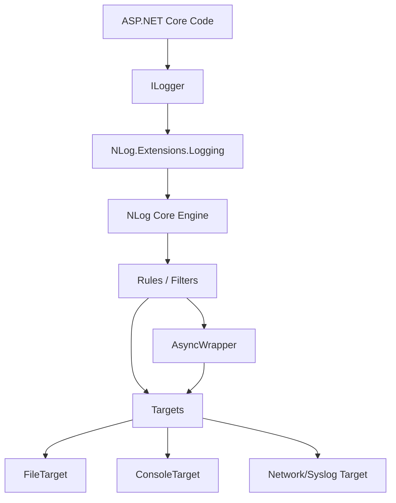
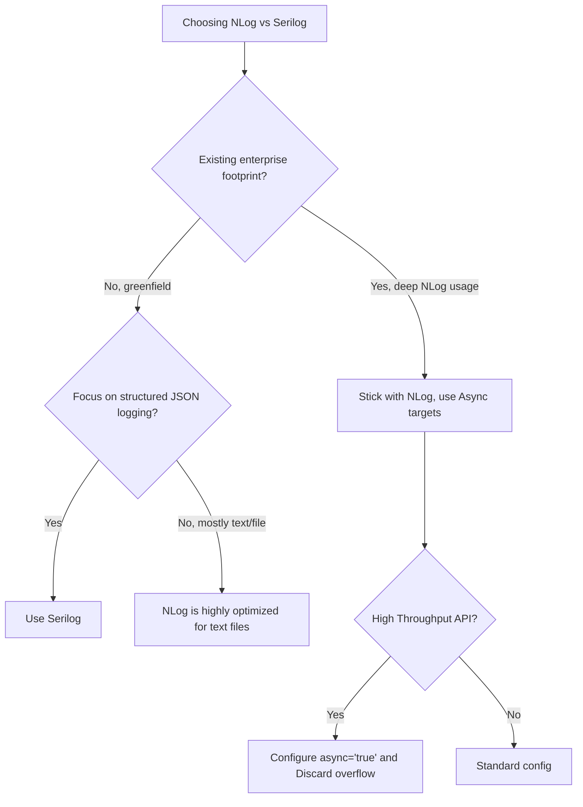

> [!success] Mastery Check
> - [ ] **Studied Well**
> - [ ] **Can explain the concept without notes**
> - [ ] **Can answer interview questions confidently**
> - [ ] **Can implement it in a real project**


# NLog Integration in ASP.NET Core

## PART 0 — Navigation & Context

### Where This Fits
```
ASP.NET Core Mastery
└── Diagnostics & Observability
    ├── [[4.023 — ILogger<T>: The .NET Logging Abstraction]]
    ├── [[4.027 — Built-In Logging Providers]]
    ├── 4.029 — NLog Integration ★ YOU ARE HERE
    └── [[4.028 — Serilog Integration]]
```

### Prerequisites
| Topic | Why It Matters Here |
|---|---|
| [[4.023 — ILogger<T>: The .NET Logging Abstraction]] | NLog acts as the engine behind `ILogger`. Application code never calls NLog directly. |
| [[4.027 — Built-In Logging Providers]] | You integrate NLog by replacing the built-in console/debug providers. |

### What This Unlocks After
| Topic | Why It Matters Here |
|---|---|
| [[4.032 — Log Redaction and Sensitive Data Masking]] | NLog handles redaction via target layouts, contrasting with Serilog's enrichment approach. |

### Why This Matters
While Serilog is the modern standard for new .NET projects, NLog is deeply entrenched in enterprise codebases and offers incredibly powerful, zero-allocation asynchronous routing configurations that production engineers must know how to configure, tune, and debug.

---

## PART 1 — The Core Mental Model

> **ASP.NET Core integrates NLog by mapping the framework's `ILogger` calls to NLog's internal `Logger` instances, allowing NLog's distinct XML/JSON rule engine to handle all filtering, formatting, and asynchronous routing to targets.**

### The Plain-Language Analogy
Think of the ASP.NET Core `ILogger` as a universal remote control, and the logging infrastructure as a home theater system. The built-in providers are like a basic soundbar. Integrating NLog is like unplugging the soundbar and plugging the universal remote receiver into a massive, 7.1 surround sound AV Receiver. You still use the exact same buttons on the remote (`_logger.LogInformation()`), but the AV Receiver (NLog) now intercepts the signal, applies complex equalizer rules (`nlog.config` rules), and routes the audio to various distinct speakers (NLog Targets).

### The Taxonomy Diagram


---

## PART 2 — Deep Mechanics

### 2.1 — Pipeline Position and Startup Integration

NLog is integrated at the Host builder level. It entirely bypasses the ASP.NET Core HTTP middleware pipeline.

```text
──► WebApplicationBuilder
    │
    ├──► builder.Logging.ClearProviders()
    ├──► builder.Host.UseNLog() ────────┐
    │                                   │ [Hooks ILoggerFactory]
    ├──► App Build                      │
    ├──► Middleware Pipeline            │
    ├──► Endpoints                      │
    │      └─► _logger.Log() ───────────┼─► NLog Engine ──► nlog.config Rules ──► Targets
    └──► Response Sent
```

**Runtime Cost:** `~0-1 allocation`. NLog's internal engine is highly optimized for zero-allocation logging when targets are wrapped in `AsyncWrapper`.

### 2.2 — The Dual Filtering System Collision

When you integrate NLog, your application now has **two** logging filter systems:
1. ASP.NET Core's `appsettings.json` (`Logging:LogLevel`)
2. NLog's `nlog.config` (`<rules>`)

**Framework Source Behavior:**
By default, the `NLog.Extensions.Logging` provider reads the `appsettings.json` filters first. If `appsettings.json` says "Warning", the message is dropped *before* NLog even sees it. If it passes Microsoft's filter, it goes to NLog, which then applies its own `<rules>` XML. 

**Failure Mode:** You configure NLog to write `Trace` logs to a file, but nothing appears. Reason: The ASP.NET Core `appsettings.json` is silently dropping everything below `Information` before NLog is invoked.

### 2.3 — The AsyncWrapper Target

By default, NLog targets (like File or Database) write synchronously. This blocks the calling HTTP thread, destroying API throughput. NLog solves this with the `AsyncWrapper`.

**ASP.NET Core internally (approximate):**
```xml
<targets async="true">
  <target name="file" xsi:type="File" fileName="app.log" />
</targets>
```
When `async="true"` is set, NLog wraps the target in an in-memory queue. The HTTP thread drops the log into the queue and returns immediately. A background thread drains the queue and performs the disk I/O.

### 2.4 — Layout Renderers and Structured Data

NLog maps ASP.NET Core semantic properties using `${event-properties}`.

**HTTP wire format (approximate log output):**
If you call `_logger.LogInformation("Order {OrderId}", 123)`, NLog's JSON layout can extract the semantic token.
```json
{
  "message": "Order 123",
  "orderId": 123
}
```

---

## PART 3 — Production Code Patterns

### Pattern 1: The Clean Startup Integration

In production, you must isolate the NLog initialization so that if ASP.NET Core fails to start (e.g., bad DI configuration), the fatal startup error is still logged.

```csharp
// ✅ CORRECT: Two-phase initialization
using NLog;
using NLog.Web;

// 1. Setup Early NLog (catches startup errors)
var logger = NLog.LogManager.Setup().LoadConfigurationFromAppSettings().GetCurrentClassLogger();
logger.Debug("init main");

try
{
    var builder = WebApplication.CreateBuilder(args);

    // 2. Clear default providers and tell Microsoft to use NLog
    builder.Logging.ClearProviders();
    builder.Host.UseNLog();

    var app = builder.Build();
    app.Run();
}
catch (Exception exception)
{
    // NLog catches the DI/Startup crash
    logger.Error(exception, "Stopped program because of exception");
    throw;
}
finally
{
    // Ensure to flush and stop internal timers/threads before application-exit
    NLog.LogManager.Shutdown();
}
```

### Pattern 2: The High-Throughput Async File Target

When writing to disk on a server handling >5,000 RPS, you must use asynchronous wrappers and concurrent write optimizations.

```xml
<!-- nlog.config -->
<!-- ✅ CORRECT: async="true" prevents blocking the HTTP thread -->
<nlog xmlns="http://www.nlog-project.org/schemas/NLog.xsd"
      xmlns:xsi="http://www.w3.org/2001/XMLSchema-instance"
      autoReload="true"
      internalLogLevel="Info"
      internalLogFile="c:\temp\internal-nlog-AspNetCore.txt">

  <!-- Enable async processing for all targets -->
  <targets async="true">
    
    <!-- concurrentWrites="false" + keepFileOpen="true" is the fastest possible disk I/O -->
    <target xsi:type="File" 
            name="highPerfFile" 
            fileName="c:\logs\app-${shortdate}.log"
            layout="${longdate}|${level:uppercase=true}|${logger}|${message} ${exception:format=tostring}" 
            keepFileOpen="true"
            concurrentWrites="false" 
            autoFlush="false" 
            openFileFlushTimeout="1" />
  </targets>

  <rules>
    <logger name="*" minlevel="Info" writeTo="highPerfFile" />
  </rules>
</nlog>
```

### Pattern 3: JSON Structured Logging for Aggregators

When sending logs to ELK, Datadog, or Splunk, you must emit JSON.

```xml
<!-- ✅ CORRECT: Structured JSON layout -->
<target xsi:type="File" name="jsonFile" fileName="logs/app.json">
  <layout xsi:type="JsonLayout">
    <attribute name="time" layout="${longdate}" />
    <attribute name="level" layout="${level:upperCase=true}"/>
    <attribute name="message" layout="${message}" />
    <!-- Includes ASP.NET Core ILogger semantic properties -->
    <attribute name="properties" encode="false">
      <layout xsi:type="JsonLayout" includeEventProperties="true" maxRecursionLimit="2"/>
    </attribute>
    <attribute name="exception" layout="${exception:format=tostring}" />
  </layout>
</target>
```

---

## PART 4 — Gotchas & Anti-Patterns

### Gotcha 1: The Dual Filter Trap

Engineers configure `<logger name="*" minlevel="Trace" writeTo="file" />` in `nlog.config` but only see `Information` logs.

// ⚠️ WRONG CODE
```json
// appsettings.json
{
  "Logging": {
    "LogLevel": {
      "Default": "Information"
    }
  }
}
```
// HTTP consequence (wrong path):
// The HTTP request executes, but trace logs are silently discarded by Microsoft's `ILoggerFactory` before they reach NLog.

// ✅ CORRECT CODE
```json
// appsettings.json
{
  "Logging": {
    "LogLevel": {
      "Default": "Trace"
    }
  }
}
```
// HTTP consequence (correct path):
// Microsoft passes everything to NLog, allowing `nlog.config` to act as the sole source of truth for filtering.

// WHY: `UseNLog` injects the provider into the ASP.NET Core pipeline. The framework applies its own configuration filters *first*. You must open the ASP.NET Core valve completely so NLog can do the filtering.

### Gotcha 2: Synchronous File I/O Blocking

Engineers use the default `File` target on high-throughput APIs without `async="true"`.

// ⚠️ WRONG CODE
```xml
<targets>
  <!-- No async attribute! -->
  <target xsi:type="File" name="allfile" fileName="app.log" />
</targets>
```
// HTTP consequence (wrong path):
// `_logger.LogInformation` invokes a direct `File.AppendAllText`-style OS call. Under heavy load, the HTTP request thread blocks waiting for disk I/O, spiking API latency to hundreds of milliseconds.

// ✅ CORRECT CODE
```xml
<targets async="true">
  <target xsi:type="File" name="allfile" fileName="app.log" />
</targets>
```
// HTTP consequence (correct path):
// The HTTP thread drops the log into a `ConcurrentQueue` and returns in ~10ns.

// WHY: Synchronous targets block the calling thread. The `async="true"` attribute wraps the target in an `AsyncWrapper`, shifting the I/O to a background thread.

### Gotcha 3: Missing `NLog.Web.AspNetCore` Package

Engineers use the base `NLog` package but cannot access ASP.NET Core HTTP context variables (like the URL or TraceId) in their layouts.

// ⚠️ WRONG CODE
```xml
<layout>${longdate} | ${aspnet-request-url} | ${message}</layout>
```
// HTTP consequence (wrong path):
// The log prints empty space where the URL should be because the base NLog library does not know what an `HttpContext` is.

// ✅ CORRECT CODE
```xml
<!-- Install-Package NLog.Web.AspNetCore -->
<!-- Add to nlog.config: -->
<extensions>
  <add assembly="NLog.Web.AspNetCore"/>
</extensions>

<layout>${longdate} | ${aspnet-request-url} | ${message}</layout>
```
// HTTP consequence (correct path):
// The log includes the HTTP URL (`/api/orders/123`).

// WHY: NLog is platform-agnostic. The `NLog.Web.AspNetCore` package provides the layout renderers (like `${aspnet-request-url}`) that read from the `IHttpContextAccessor`.

### Gotcha 4: Memory Leaks with Unbounded Async Queues

Engineers enable `async="true"` but misconfigure the queue limits. If the database sink goes down, the queue grows infinitely.

// ⚠️ WRONG CODE
```xml
<targets async="true">
  <target xsi:type="Database" ... />
</targets>
```
// HTTP consequence (wrong path):
// If the DB goes offline, the in-memory queue grows until the API throws `OutOfMemoryException`, crashing the pod and returning HTTP 502/503 to all clients.

// ✅ CORRECT CODE
```xml
<target xsi:type="AsyncWrapper" name="asyncDb" overflowAction="Discard" queueLimit="10000">
  <target xsi:type="Database" ... />
</target>
```
// HTTP consequence (correct path):
// The API stays alive. Logs exceeding 10,000 are dropped, preventing OOM crashes.

// WHY: By default, `AsyncWrapper` drops logs when full, but relying on defaults is dangerous in enterprise environments. Explicitly configuring `overflowAction="Discard"` protects the HTTP pipeline from logging failures.

### Gotcha 5: Missing Log Scopes

Engineers use `_logger.BeginScope("Tenant:{Id}", 42)` but the data doesn't appear in NLog outputs.

// ⚠️ WRONG CODE
```xml
<layout>${longdate} | ${message}</layout>
```
// HTTP consequence (wrong path):
// Scope data is ignored.

// ✅ CORRECT CODE
```xml
<layout>${longdate} | ${mdlc:item=Tenant} | ${message}</layout>
```
// HTTP consequence (correct path):
// NLog renders the scope value.

// WHY: Microsoft's `BeginScope` maps to NLog's Mapped Diagnostics Logical Context (MDLC). You must explicitly extract MDLC keys in your layout using `${mdlc:item=KeyName}`.

---

## PART 5 — Performance Implications

### Request Pipeline Characteristics Table

| Scenario | Pipeline Depth | Allocations Per Request | Approx Latency Impact | Recommendation |
|---|---|---|---|---|
| Synchronous File Target | Per-call | 1 string + IO array | ~500 µs - 5 ms | Anti-pattern. Blocks HTTP thread. |
| Async File Target | Per-call | 1 object (queue wrap) | ~2 µs | Standard for local/VM logging. |
| Async JSON Target | Per-call | JSON parsing allocs | ~5 µs | High CPU, but thread safe. |
| `keepFileOpen="true"` | App Lifecycle | 0 | ~1 µs | Mandatory for high-throughput files. |
| NLog Engine (Disabled level) | Per-call | 0 | ~5 ns | Fast check, zero overhead. |
| Extracting `${aspnet-request}` | Per-call | 1+ strings | ~10 µs | Accessing HttpContext has overhead. |
| Overflow `Discard` | Queue Full | 0 | ~1 µs | Protects memory at cost of logs. |
| Overflow `Block` | Queue Full | Thread Blocking | >100 ms | Catastrophic. Avoid in APIs. |

### BenchmarkDotNet Code

```csharp
using BenchmarkDotNet.Attributes;
using BenchmarkDotNet.Running;
using Microsoft.Extensions.Logging;
using NLog.Extensions.Logging;

[MemoryDiagnoser]
public class NLogBenchmarks
{
    private ILogger _syncLogger;
    private ILogger _asyncLogger;

    [GlobalSetup]
    public void Setup()
    {
        // Assume nlog-sync.config and nlog-async.config are loaded
        var syncFactory = LoggerFactory.Create(b => b.AddNLog("nlog-sync.config"));
        _syncLogger = syncFactory.CreateLogger("Test");

        var asyncFactory = LoggerFactory.Create(b => b.AddNLog("nlog-async.config"));
        _asyncLogger = asyncFactory.CreateLogger("Test");
    }

    [Benchmark(Baseline = true)]
    public void SyncFileLog() => _syncLogger.LogInformation("Processing test");

    [Benchmark]
    public void AsyncFileLog() => _asyncLogger.LogInformation("Processing test");
}
// Expected output (approximate, .NET 8, x64, Kestrel, local):
// Method       | Mean         | Allocated |
// ------------ |-------------:|----------:|
// SyncFileLog  | 450.23 us    |     512 B |
// AsyncFileLog |   1.85 us    |      88 B |
```

### When to Care / When to Ignore

**When this costs you:**
Configuring complex `${aspnet-request-*}` layout renderers forces NLog to interrogate the `HttpContext` on every log call. In ultra-high throughput environments (>10k RPS), doing this on every trace/debug log will spike CPU usage. Use these renderers sparingly (e.g., only on Error/Warning rules).

**When this doesn't matter:**
If you already use NLog heavily across a large enterprise, there is rarely a performance justification to rewrite everything to Serilog. Properly tuned, asynchronous NLog is effectively indistinguishable from Serilog in P99 latency.

---

## PART 6 — Interview Arsenal

### A. The Question Bank

**Question:** "If you configure an NLog rule to capture `Trace` logs, but Microsoft's `appsettings.json` has `Default: Information`, what gets written to the disk?"
**Average Answer:** The trace logs get written because NLog overrides Microsoft.
**Why That's Insufficient:** It gets the architecture completely backward.
> **Great Answer:** "Nothing gets written. The ASP.NET Core `ILoggerFactory` sits in front of the NLog provider. Microsoft's filtering rules apply first. If `appsettings.json` is set to `Information`, the `ILoggerFactory` evaluates `IsEnabled(Trace)` as false and completely short-circuits the call. NLog never receives the message. In production, we configure Microsoft's default to `Trace` to hold the valve wide open, and let `nlog.config` act as the definitive filtering engine."

### B. The Trick Questions
**Question:** "You added `async='true'` to your NLog targets. Under heavy load, your container runs out of memory and crashes. Why?"
**The Trap:** Thinking `async="true"` is a magic performance bullet without understanding queue limits.
**The Correct Answer:** The async wrapper uses an unbounded (or very large) in-memory queue. If the sink (e.g., a slow database or network share) cannot write logs as fast as the HTTP threads are generating them, the queue grows infinitely. You must configure `overflowAction="Discard"` or set a strict `queueLimit` to drop logs rather than crashing the HTTP server via OOM.

### C. Red Flags to Avoid
- **"NLog is obsolete, you must use Serilog in .NET 8."** (Red Flag: Dogmatism. NLog is fully supported, actively maintained, and handles massive workloads perfectly well).
- **"I inject `NLog.Logger` into my controllers."** (Red Flag: Violates the DI abstraction. Always inject Microsoft's `ILogger<T>`).
- **"Writing to files blocks the HTTP thread."** (Red Flag: Shows ignorance of the `AsyncWrapper` target which has existed for over a decade).

---

## PART 7 — Decision Framework



---

## PART 8 — Self-Check

### A. Conceptual Questions
1. How does ASP.NET Core `ILogger.BeginScope` map to NLog concepts?
2. What happens to the HTTP pipeline if an NLog synchronous database target experiences a connection timeout?
3. How do you configure NLog to capture the HTTP Request URL?
4. Why must you clear Microsoft's default logging providers when using NLog?
5. What is the difference between `nlog.config` and `appsettings.json` for filtering?
6. How does NLog ensure fatal startup crashes are logged before DI is built?
7. What is the consequence of omitting `keepFileOpen="true"` on a file target?
8. How do you instruct NLog to discard logs when the async queue fills up?

### B. Code Puzzles

**Puzzle 1: The Silent Drop (The 5-puzzle rule bug)**
```csharp
var builder = WebApplication.CreateBuilder(args);
builder.Logging.ClearProviders();
builder.Logging.SetMinimumLevel(LogLevel.Warning);
builder.Host.UseNLog();

// nlog.config has <logger name="*" minlevel="Info" writeTo="file" />
```
You call `_logger.LogInformation("Order complete");`. Is it written to the file?
<details>
<summary>Answer</summary>
No. The Microsoft configuration `SetMinimumLevel(LogLevel.Warning)` drops the `Information` log before it ever reaches NLog.
</details>

**Puzzle 2: The Two-Phase Startup**
```csharp
var logger = NLog.LogManager.Setup().LoadConfigurationFromAppSettings().GetCurrentClassLogger();
try {
    var builder = WebApplication.CreateBuilder(args);
    // ... setup
    throw new Exception("DI failed");
} catch (Exception ex) {
    logger.Error(ex, "Crash");
}
```
Does this successfully log the DI crash?
<details>
<summary>Answer</summary>
Yes. Because the NLog logger was instantiated via `LogManager` *before* `CreateBuilder` crashed, it successfully captures the startup exception.
</details>

**Puzzle 3: The Blocking Sync**
```xml
<targets>
  <target xsi:type="Network" name="tcp" address="tcp://logserver:5000" />
</targets>
```
If `logserver` goes down, what happens to the HTTP request calling `_logger.Log()`?
<details>
<summary>Answer</summary>
The HTTP request thread blocks waiting for a TCP timeout. This will rapidly exhaust the ASP.NET Core thread pool, taking the entire API offline. You must wrap network targets in `AsyncWrapper`.
</details>

**Puzzle 4: The Scope Mapping**
```csharp
using (_logger.BeginScope("Tenant:{Id}", 42)) {
   _logger.LogInformation("Processing");
}
// nlog.config layout: ${message} | ${mdlc:item=Tenant}
```
What prints?
<details>
<summary>Answer</summary>
`Processing | 42`. The `BeginScope` dictionary properties map to the MDLC (Mapped Diagnostics Logical Context) in NLog, accessible via `${mdlc:item=KeyName}`.
</details>

---

## PART 9 — Connections & Resources

### A. Related Topics Table
| Topic | Why It Connects |
|---|---|
| [[4.023 — ILogger<T>: The .NET Logging Abstraction]] | NLog implements this interface; controllers never know NLog exists. |
| [[4.024 — Log Levels, Categories, and Filtering]] | NLog adds a second, more powerful XML-based filtering layer on top of this. |
| [[4.028 — Serilog Integration]] | The primary competitor to NLog. If you know NLog, you must know why teams choose Serilog. |

### B. Books
| Book | Chapters | Why These Chapters |
|---|---|---|
| *ASP.NET Core in Action, 3rd Ed* by Andrew Lock | Chapter 17 (Logging) | Briefly covers replacing built-in providers with third-party engines like NLog. |

### C. Essential Articles & Docs
- [NLog Official Docs: ASP.NET Core Setup](https://github.com/NLog/NLog/wiki/Getting-started-with-ASP.NET-Core-6)
- [NLog Wiki: AsyncWrapper Target](https://github.com/NLog/NLog/wiki/AsyncWrapper-target)
- [NLog Wiki: MDLC (Mapped Diagnostics Logical Context)](https://github.com/NLog/NLog/wiki/MDLC-Layout-Renderer)

### D. Template Meta-Note
> [!NOTE] 
> **Part 0** orients you. **Part 1** builds the mental model. **Part 2** explains the framework internals and pipeline. **Part 3** provides copy-pasteable production code. **Part 4** highlights the bugs your team will write. **Part 5** gives you the performance math. **Part 6** prepares you for the principal engineering interview. **Part 7** gives you a decision tree. **Part 8** tests your knowledge. **Part 9** links to further mastery.
