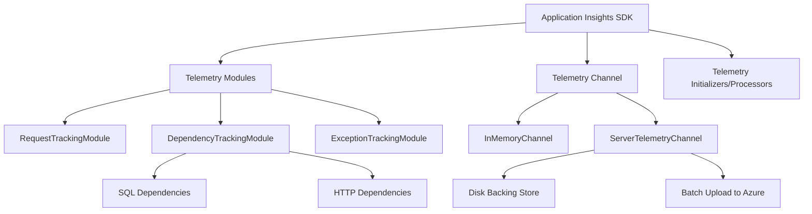
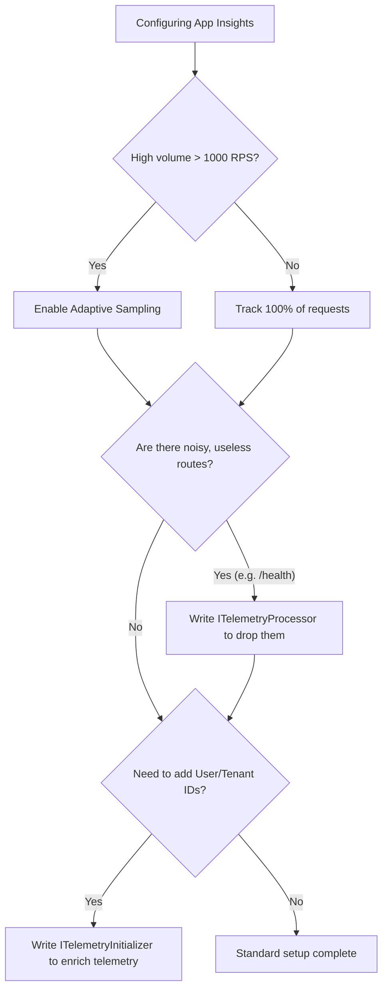

> [!success] Mastery Check
> - [ ] **Studied Well**
> - [ ] **Can explain the concept without notes**
> - [ ] **Can answer interview questions confidently**
> - [ ] **Can implement it in a real project**


# Application Insights SDK: Request Tracking and Dependency Telemetry

## PART 0 — Navigation & Context

### Where This Fits
```
ASP.NET Core Mastery
└── Diagnostics & Observability
    ├── [[4.297 — Activity API and Distributed Tracing]]
    ├── [[4.023 — ILogger<T>: The .NET Logging Abstraction]]
    ├── 4.030 — Application Insights SDK ★ YOU ARE HERE
    └── [[4.299 — OpenTelemetry SDK]]
```

### Prerequisites
| Topic | Why It Matters Here |
|---|---|
| [[4.049 — The Middleware Pipeline]] | Application Insights uses middleware to intercept requests and measure duration. |
| [[4.297 — Activity API and Distributed Tracing]] | App Insights telemetry is powered entirely by the .NET `Activity` and `DiagnosticSource` APIs. |

### What This Unlocks After
| Topic | Why It Matters Here |
|---|---|
| [[4.299 — OpenTelemetry SDK]] | Microsoft is deprecating the AppInsights SDK in favor of OpenTelemetry; understanding what App Insights does helps you migrate to OTel. |

### Why This Matters
If you do not configure Application Insights correctly, your high-throughput API will either silently drop telemetry during traffic spikes due to channel throttling, or it will balloon your Azure bill by uploading millions of useless SQL health-check dependency logs.

---

## PART 1 — The Core Mental Model

> **ASP.NET Core's Application Insights SDK uses a telemetry channel to asynchronously batch and upload W3C trace-correlated logs, requests, and dependencies generated by `DiagnosticSource` subscriptions. The practical consequence is that a single incoming HTTP request is automatically stitched together with its outgoing database queries and HTTP calls in Azure Monitor without any manual ID propagation.**

### The Plain-Language Analogy
Think of Application Insights as a fleet of automated security cameras and GPS trackers installed inside an office building (your application). When a guest enters the lobby (HTTP Request), the lobby camera automatically slaps a barcode sticker (TraceId) on their back and records the entry time. As the guest walks around, talks to a receptionist, or enters a vault (Dependencies like SQL or HTTP calls), other cameras snap photos of the barcode. Finally, when the guest leaves, the exit camera records the duration. Periodically, an armored truck (the TelemetryChannel) gathers all the footage and drives it to the central archive (Azure), where a detective (you) can instantly reconstruct the guest's exact path through the building using the barcode.

### The Taxonomy Diagram


---

## PART 2 — Deep Mechanics

### 2.1 — Pipeline Position and Diagnostic Hooks

Application Insights operates via two distinct mechanisms: ASP.NET Core Middleware (for Request tracking) and `DiagnosticListener` subscriptions (for Dependency tracking).

```text
──► HTTP Request
    │
    ├──► AppInsights Middleware (Starts Timer, extracts W3C Traceparent)
    ├──► RoutingMiddleware
    ├──► Controller Action
    │      │
    │      ├─► EF Core Query
    │      │     └─► [DiagnosticSource "Microsoft.EntityFrameworkCore" fires event]
    │      │           └─► AppInsights DependencyTrackingModule catches event
    │      │
    │      ├─► HttpClient Call
    │      │     └─► [DiagnosticSource "System.Net.Http" fires event]
    │      │           └─► AppInsights DependencyTrackingModule catches event
    │      │
    │      └─► _logger.LogError("Boom")
    │            └─► AppInsights ILoggerProvider catches log
    │
    └──► AppInsights Middleware (Stops Timer, records Status 200, sends RequestTelemetry)
```

**Runtime Cost:** `~10-20 allocations per request` for telemetry objects. The actual upload is offloaded to a background thread.

### 2.2 — W3C Trace Context and Correlation

Application Insights relies on the `System.Diagnostics.Activity` API. When a request arrives, the framework reads the `traceparent` HTTP header (e.g., `00-4bf92f3577b34da6a3ce929d0e0e4736-00f067aa0ba902b7-01`).

**Framework Source Behavior:**
- The `4bf9...` part becomes the `Operation Id` in Azure Monitor.
- The `00f0...` part becomes the `Parent Id`.
- Every dependency logged during this request inherits the `Operation Id`.

**Failure Mode:** If you spawn a "fire and forget" background task using `Task.Run` but do not pass the `Activity` context, the telemetry generated in the background task will have a completely different `Operation Id` and will be orphaned in Azure Monitor.

### 2.3 — The ServerTelemetryChannel

The SDK sends data using the `ServerTelemetryChannel`, which is optimized for high-throughput production servers.

**ASP.NET Core internally (approximate):**
```csharp
// The channel maintains an in-memory buffer
if (buffer.Count >= 500 || timeSinceLastFlush > TimeSpan.FromSeconds(30))
{
    // Serialize to JSON and POST to https://dc.services.visualstudio.com
}
```
**Edge Case:** If the network to Azure drops, the `ServerTelemetryChannel` writes the unsent telemetry to the local disk (usually `%TEMP%`). If the container crashes and restarts, the local disk is wiped, and the telemetry is permanently lost.

### 2.4 — ITelemetryInitializer vs ITelemetryProcessor

- **ITelemetryInitializer**: Runs synchronously when the telemetry object is *created*. Used to **enrich** data (e.g., adding a TenantId custom dimension).
- **ITelemetryProcessor**: Runs in the pipeline just before the item is sent to the channel. Used to **filter** or drop data (e.g., discarding health check logs).

---

## PART 3 — Production Code Patterns

### Pattern 1: The Standard Registration

In .NET 8, you register Application Insights via the `Microsoft.ApplicationInsights.AspNetCore` NuGet package.

```csharp
// ✅ CORRECT: Standard production setup
var builder = WebApplication.CreateBuilder(args);

// Reads APPLICATIONINSIGHTS_CONNECTION_STRING from env vars or appsettings
builder.Services.AddApplicationInsightsTelemetry();

// Optional: Register a custom initializer to tag all telemetry with a cluster name
builder.Services.AddSingleton<ITelemetryInitializer, ClusterNameTelemetryInitializer>();

var app = builder.Build();
```

### Pattern 2: Dropping Noisy Health Checks (Processor)

Health checks run every 5 seconds, generating millions of useless `RequestTelemetry` rows per month.

```csharp
// ✅ CORRECT: Filtering out health checks to save money
public class HealthCheckFilterProcessor : ITelemetryProcessor
{
    private ITelemetryProcessor _next;

    public HealthCheckFilterProcessor(ITelemetryProcessor next)
    {
        _next = next;
    }

    public void Process(ITelemetry item)
    {
        if (item is RequestTelemetry request && request.Url.AbsolutePath == "/health")
        {
            return; // Drop the telemetry, do not call _next.Process()
        }
        
        _next.Process(item);
    }
}

// In Program.cs
builder.Services.AddApplicationInsightsTelemetryProcessor<HealthCheckFilterProcessor>();
```
// HTTP wire format: The `/health` endpoint still returns HTTP 200 OK to the load balancer, but absolutely nothing is sent to Azure Monitor.

### Pattern 3: Capturing SQL Command Text

By default, Application Insights captures the SQL server name and database name, but **not** the actual SQL query text (for security reasons).

```csharp
// ✅ CORRECT: Enabling SQL text capture (assuming you scrub PII)
builder.Services.ConfigureTelemetryModule<DependencyTrackingTelemetryModule>((module, o) =>
{
    // Now Azure Monitor will show "SELECT * FROM Users WHERE Id = @id"
    module.EnableSqlCommandTextInstrumentation = true; 
});
```

---

## PART 4 — Gotchas & Anti-Patterns

### Gotcha 1: The App Service "Agent" Double-Log Trap

Engineers deploy an app with the SDK installed to Azure App Service, but also turn on the "Application Insights" toggle in the Azure Portal UI.

// ⚠️ WRONG CODE
```csharp
// Application code has AddApplicationInsightsTelemetry()
// AND Azure Portal has App Insights auto-instrumentation turned ON
```
// HTTP consequence (wrong path):
// Not an HTTP consequence, but your Azure bill doubles. Every request and dependency is tracked twice—once by your code, and once by the CLR profiler agent running on the App Service host.

// ✅ CORRECT CODE
```csharp
// If using the SDK in code, turn OFF the App Service portal integration.
// Alternatively, remove the SDK from code and rely entirely on the Portal agent (codeless).
```
// HTTP consequence (correct path):
// Exactly one `RequestTelemetry` item per HTTP request.

// WHY: The SDK and the Codeless Agent are two entirely separate mechanisms tracking the exact same `DiagnosticSource` events.

### Gotcha 2: Crashing the ServerTelemetryChannel Offline Buffer

Engineers run containerized apps on Kubernetes with a read-only root filesystem (`readOnlyRootFilesystem: true`).

// ⚠️ WRONG CODE
```yaml
# Kubernetes Pod Spec
securityContext:
  readOnlyRootFilesystem: true
```
// HTTP consequence (wrong path):
// When the app attempts to send telemetry, if the network drops, `ServerTelemetryChannel` tries to write to `/tmp` or `%LOCALAPPDATA%`. It receives an `UnauthorizedAccessException`, crashes the channel, and stops sending all logs permanently until the pod restarts.

// ✅ CORRECT CODE
```csharp
// Program.cs
builder.Services.Configure<TelemetryChannelOptions>(o => 
{
    // Point the offline storage to an explicitly mounted writable volume
    o.StorageFolder = "/mnt/telemetry-buffer"; 
});
```
// HTTP consequence (correct path):
// Telemetry queues to the mounted volume during network blips and replays successfully.

// WHY: The channel relies on a physical directory to ensure zero-data-loss during transient ingestion endpoint failures.

### Gotcha 3: Flushing on Graceful Shutdown

Engineers deploy updates frequently. During shutdown, the in-memory buffer has unsent logs.

// ⚠️ WRONG CODE
```csharp
var app = builder.Build();
app.Run(); 
// App shuts down, process exits instantly.
```
// HTTP consequence (wrong path):
// The last ~10 seconds of logs, dependencies, and the final HTTP requests are lost because the buffer wasn't flushed before process death.

// ✅ CORRECT CODE
```csharp
var app = builder.Build();
app.Run();

// Flush on exit
var telemetryClient = app.Services.GetRequiredService<TelemetryClient>();
telemetryClient.Flush();
// Flush is async but returns void. We must block for it to complete.
Task.Delay(5000).Wait(); 
```
// HTTP consequence (correct path):
// The final logs are pushed over the network before the OS kills the process.

// WHY: `Flush()` tells the channel to push to the network, but it doesn't block the executing thread. The `Task.Delay` gives the background HTTP client time to complete the POST to Azure.

### Gotcha 4: Manual HttpClient Defeating Telemetry

Engineers instantiate `HttpClient` manually instead of using `IHttpClientFactory`, bypassing dependency tracking.

// ⚠️ WRONG CODE
```csharp
public async Task<string> FetchData()
{
    using var client = new HttpClient(); // Manual instantiation
    return await client.GetStringAsync("https://api.github.com");
}
```
// HTTP consequence (wrong path):
// The HTTP request goes out over the wire, but Application Insights shows ZERO external dependencies. The distributed trace is broken.

// ✅ CORRECT CODE
```csharp
public async Task<string> FetchData()
{
    // _client is injected via IHttpClientFactory
    return await _client.GetStringAsync("https://api.github.com"); 
}
```
// HTTP consequence (correct path):
// The `DependencyTrackingModule` records a `DependencyTelemetry` item pointing to api.github.com, correlated perfectly to the parent request.

// WHY: `IHttpClientFactory` automatically configures the internal `HttpMessageHandler` chain to emit `DiagnosticSource` events. Manual instantiation lacks these handlers.

### Gotcha 5: Misunderstanding `ILogger` Warning Limits

Engineers expect all `_logger.LogInformation` calls to appear in the "Traces" table in App Insights.

// ⚠️ WRONG CODE
```csharp
_logger.LogInformation("Processing step 1");
```
// HTTP consequence (wrong path):
// Nothing appears in Azure Monitor.

// ✅ CORRECT CODE
```json
// appsettings.json
{
  "Logging": {
    "ApplicationInsights": {
      "LogLevel": {
        "Default": "Information"
      }
    }
  }
}
```
// HTTP consequence (correct path):
// The trace appears in Azure Monitor.

// WHY: By default, the `ApplicationInsightsLoggerProvider` has a hardcoded internal filter that ignores anything below `Warning`. You must explicitly override it in `appsettings.json` under the `ApplicationInsights` provider key.

---

## PART 5 — Performance Implications

### Request Pipeline Characteristics Table

| Scenario | Pipeline Depth | Allocations Per Request | Approx Latency Impact | Recommendation |
|---|---|---|---|---|
| SDK Disabled | N/A | 0 | 0 ns | Baseline. |
| SDK Enabled (No Sampling) | Wrapping | ~15 objects | ~200 ns | Standard. OK for < 1000 RPS. |
| Fixed-Rate Sampling (10%) | Wrapping | ~5 objects | ~50 ns | Drops 90% of requests before processing. |
| Adaptive Sampling | Wrapping | Variable | ~100 ns | Default. Automatically tunes to 5 items/sec. |
| SQL Text Capture Enabled | EF Core Hook | 1 String Alloc | ~2 µs | High value, marginal cost. |
| Telemetry Processor | Filter | 0 | ~5 ns | Fast if implemented correctly. |
| Missing IHttpClientFactory | HTTP Call | 0 | 0 ns | Breaks distributed tracing entirely. |
| TelemetryChannel Flush | Shutdown | Block | 5000 ms | Mandatory for clean shutdown. |

### BenchmarkDotNet Code

```csharp
using BenchmarkDotNet.Attributes;
using BenchmarkDotNet.Running;
using Microsoft.ApplicationInsights;
using Microsoft.ApplicationInsights.Extensibility;
using Microsoft.ApplicationInsights.DataContracts;

[MemoryDiagnoser]
public class AppInsightsBenchmarks
{
    private TelemetryClient _client;
    private RequestTelemetry _request;

    [GlobalSetup]
    public void Setup()
    {
        var config = TelemetryConfiguration.CreateDefault();
        config.DisableTelemetry = true; // Don't actually send over network
        _client = new TelemetryClient(config);
        _request = new RequestTelemetry("GET /api/data", DateTimeOffset.UtcNow, TimeSpan.FromMilliseconds(50), "200", true);
    }

    [Benchmark]
    public void TrackRequest()
    {
        // Simulates what the middleware does at the end of a request
        _client.TrackRequest(_request);
    }
    
    [Benchmark]
    public void StartOperation()
    {
        // Simulates distributed tracing scope creation
        using var operation = _client.StartOperation<DependencyTelemetry>("SQL Query");
    }
}
// Expected output (approximate, .NET 8, x64, local):
// Method         | Mean      | Allocated |
// -------------- |----------:|----------:|
// TrackRequest   | 150.4 ns  |     112 B |
// StartOperation | 480.2 ns  |     384 B |
```

### When to Care / When to Ignore

**When this costs you:**
If your API processes >10,000 req/s, tracking 100% of telemetry will saturate the `ServerTelemetryChannel` background thread, burn CPU, and cost tens of thousands of dollars in Azure Monitor ingestion fees. You **must** configure Adaptive Sampling or Fixed-Rate Sampling to reduce the volume.

**When this doesn't matter:**
For a standard internal LOB application doing 50 req/sec, do not bother with sampling or complex processors. Track 100% of data. The ~200ns overhead is completely invisible compared to network latency.

---

## PART 6 — Interview Arsenal

### A. The Question Bank

**Question:** "How does Application Insights know that a specific EF Core SQL query belongs to a specific HTTP request?"
**Average Answer:** It uses a correlation ID that gets passed around in the background.
**Why That's Insufficient:** Doesn't explain the actual .NET mechanism (`AsyncLocal` and `Activity`).
> **Great Answer:** "It relies entirely on the `System.Diagnostics.Activity` API. When the HTTP middleware receives a request, it starts an `Activity` which creates an `Operation Id` and stores it in an `AsyncLocal`. Because it's `AsyncLocal`, it flows down through all asynchronous await continuations. When EF Core fires a `DiagnosticSource` event before executing a SQL query, the Application Insights `DependencyTrackingModule` intercepts it, reads the current `Activity.Current.RootId`, and slaps that exact ID onto the `DependencyTelemetry`. This is why we don't have to manually pass a trace ID into our database repositories."

### B. The Trick Questions
**Question:** "You have a background hosted service (`IHostedService`) that polls a queue. Application Insights is showing the queue dependencies, but they are all grouped into one giant operation that never ends. Why?"
**The Trap:** Thinking background services have requests.
**The Correct Answer:** An `IHostedService` runs outside the HTTP middleware pipeline, so no `RequestTelemetry` or `Activity` is ever created for it. As a result, all dependencies logged on that thread might inherit the initial application startup context, or have no context at all. You must manually call `telemetryClient.StartOperation<RequestTelemetry>("ProcessQueueMessage")` inside your `while` loop to define the correlation boundary.

### C. Red Flags to Avoid
- **"I inject `TelemetryClient` into my controllers to log messages."** (Red Flag: You should inject `ILogger<T>`. Only inject `TelemetryClient` for highly specific custom metrics or events).
- **"I disabled sampling because I don't want to lose data."** (Red Flag: In enterprise architectures, disabling sampling guarantees you will bankrupt your logging budget. Senior engineers understand statistical sampling).
- **"AppInsights slows down the HTTP response because it has to upload logs."** (Red Flag: Misunderstands the architecture. Uploads happen asynchronously on a background thread via `ServerTelemetryChannel`).

---

## PART 7 — Decision Framework



---

## PART 8 — Self-Check

### A. Conceptual Questions
1. What is the difference between an `ITelemetryInitializer` and an `ITelemetryProcessor`?
2. How does `ServerTelemetryChannel` handle transient network failures to Azure?
3. Why does Application Insights ignore `ILogger.LogInformation` calls by default?
4. How do you flush unsent telemetry when the application is gracefully shutting down?
5. What HTTP header does Application Insights look for to establish distributed tracing?
6. If you use a raw `new SqlConnection()` instead of EF Core, does AppInsights track the dependency?
7. What happens if you enable both the Azure Portal codeless agent and the SDK simultaneously?
8. How does Adaptive Sampling decide what percentage of traffic to drop?

### B. Code Puzzles

**Puzzle 1: The Missing Trace (The 5-puzzle rule bug)**
```csharp
public async Task ProcessOrder()
{
    // Fire and forget
    _ = Task.Run(async () => 
    {
        await _db.SaveChangesAsync(); // Dependency
    });
}
```
In Azure Monitor, is the DB dependency correlated to the HTTP request that called `ProcessOrder`?
<details>
<summary>Answer</summary>
Usually NO. `Task.Run` executes on a new thread pool thread. While `AsyncLocal` context (which holds the `Activity`) usually flows into `Task.Run` *if* ExecutionContext isn't suppressed, there is a severe race condition. If the HTTP request completes and disposes the `Activity` *before* the background task reaches the DB call, the DB call will log an orphaned dependency. You must establish a new `Operation` scope in background threads.
</details>

**Puzzle 2: The Filter that Did Nothing**
```csharp
public class MyFilter : ITelemetryProcessor
{
    public void Process(ITelemetry item) {
        if (item is DependencyTelemetry d && d.Type == "SQL") return;
    }
}
```
You register this to drop SQL logs. But SQL logs still appear in Azure. Why?
<details>
<summary>Answer</summary>
The processor swallowed the telemetry but failed to call `_next.Process(item)` for non-SQL items! Wait, actually, if it just returns, it drops the SQL item correctly. But if it doesn't call `_next.Process(item)` for everything else, it drops *everything*. The bug here is missing `_next.Process(item)`. Also, if you didn't register it properly using `AddApplicationInsightsTelemetryProcessor`, it won't run at all.
</details>

**Puzzle 3: The Custom Dimension**
```csharp
public class TenantInitializer : ITelemetryInitializer
{
    public void Initialize(ITelemetry telemetry) {
        telemetry.Context.GlobalProperties["Tenant"] = "Acme";
    }
}
```
Does this apply to Requests, Dependencies, or Traces?
<details>
<summary>Answer</summary>
All of them. `ITelemetryInitializer` runs for every single piece of telemetry created by the SDK (Requests, Dependencies, Exceptions, Traces, Metrics). Every row in Azure Monitor will now have the `Tenant=Acme` custom dimension.
</details>

**Puzzle 4: The Synchronous Flush**
```csharp
app.Lifetime.ApplicationStopping.Register(() => 
{
    telemetryClient.Flush();
});
```
Will this guarantee all logs are sent before process exit?
<details>
<summary>Answer</summary>
No. `Flush()` is asynchronous under the hood but returns `void`. It begins the background task of writing the buffer to the network or disk. You must block the thread (e.g., `Thread.Sleep(5000)`) after calling `Flush()` to give the OS time to complete the HTTP POST to Azure.
</details>

---

## PART 9 — Connections & Resources

### A. Related Topics Table
| Topic | Why It Connects |
|---|---|
| [[4.049 — The Middleware Pipeline]] | The RequestTracking module is literally just an ASP.NET Core Middleware injected at the very start of the pipeline. |
| [[4.297 — Activity API and Distributed Tracing]] | Application Insights uses `Activity.Current` to correlate dependencies; it is just a proprietary sink for the standard .NET diagnostic APIs. |
| [[4.299 — OpenTelemetry SDK]] | Microsoft's long-term strategy is replacing the Application Insights SDK with the vendor-neutral OpenTelemetry SDK, which exports to Azure Monitor. |

### B. Books
| Book | Chapters | Why These Chapters |
|---|---|---|
| *Pro ASP.NET Core 7* by Adam Freeman | Chapter 27 | Detailed walkthrough of connecting Application Insights to Azure and viewing the Portal logs. |

### C. Essential Articles & Docs
- [Microsoft Docs: Application Insights for ASP.NET Core applications](https://learn.microsoft.com/en-us/azure/azure-monitor/app/asp-net-core)
- [Microsoft Docs: Telemetry Channels in Application Insights](https://learn.microsoft.com/en-us/azure/azure-monitor/app/telemetry-channels)
- [Microsoft Docs: ITelemetryProcessor and ITelemetryInitializer](https://learn.microsoft.com/en-us/azure/azure-monitor/app/api-filtering-sampling)

### D. Template Meta-Note
> [!NOTE] 
> **Part 0** orients you. **Part 1** builds the mental model. **Part 2** explains the framework internals and pipeline. **Part 3** provides copy-pasteable production code. **Part 4** highlights the bugs your team will write. **Part 5** gives you the performance math. **Part 6** prepares you for the principal engineering interview. **Part 7** gives you a decision tree. **Part 8** tests your knowledge. **Part 9** links to further mastery.
