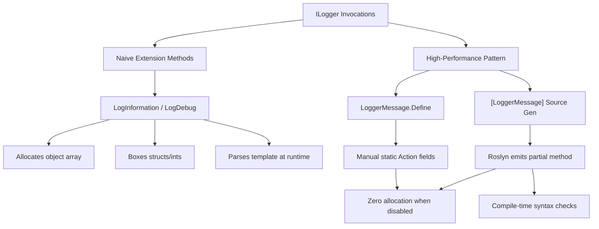

> [!success] Mastery Check
> - [ ] **Studied Well**
> - [ ] **Can explain the concept without notes**
> - [ ] **Can answer interview questions confidently**
> - [ ] **Can implement it in a real project**


# High-Performance Logging: LoggerMessage.Define and Source Generators

## PART 0 — Navigation & Context

### Where This Fits
```
ASP.NET Core Mastery
└── Diagnostics & Observability
    ├── [[4.023 — ILogger<T>: The .NET Logging Abstraction]]
    ├── [[4.025 — Structured Logging: Log Templates and Semantic Values]]
    └── 4.031 — High-Performance Logging ★ YOU ARE HERE
```

### Prerequisites
| Topic | Why It Matters Here |
|---|---|
| [[4.023 — ILogger<T>: The .NET Logging Abstraction]] | The baseline extension methods (`LogInformation()`) we are optimizing away. |
| [[2.15 — Source Generators in C#]] | Modern high-performance logging relies entirely on compile-time source generation. |

### What This Unlocks After
| Topic | Why It Matters Here |
|---|---|
| [[4.049 — The Middleware Pipeline]] | Writing high-throughput middleware requires zero-allocation logging paths. |

### Why This Matters
Logging strings dynamically using naive extension methods generates massive Gen 0 garbage collection pressure due to value-type boxing and array allocations; high-performance logging eliminates this GC tax completely, allowing APIs to scale to millions of requests without pausing the world.

---

## PART 1 — The Core Mental Model

> **ASP.NET Core's `LoggerMessage.Define` and `[LoggerMessage]` pre-compile log templates into statically cached, strongly-typed delegates that bypass `params object[]` array allocations and value-type boxing. The practical consequence is that disabled log statements cost literally zero allocations and ~2 nanoseconds, keeping the hot path perfectly clean.**

### The Plain-Language Analogy
Standard logging is like hiring a translator every time you want to say "Hello" to a foreign guest. The translator arrives, figures out what you want to say, translates it, speaks it, and then goes home (high cost, slow). `LoggerMessage` is like pre-recording the translation onto a soundboard button at the start of the day. When the guest arrives, you just hit the button (the cached delegate). If the guest isn't there (the log level is disabled), you don't even press the button.

### The Taxonomy Diagram


---

## PART 2 — Deep Mechanics

### 2.1 — Pipeline Position and Execution Flow

High-performance logging applies anywhere `ILogger` is used, but is most critical in the hot path of the HTTP middleware pipeline.

```text
──► HTTP Request
    │
    ├──► Custom Middleware (Hot Path)
    │      │
    │      ├─► [Level Check: IsEnabled(Debug)?] ──► False ──► (Returns in ~2ns, 0 bytes allocated)
    │      │
    │      └─► [Level Check: IsEnabled(Info)?]  ──► True  ──► Invokes statically cached Action<T> delegate
    │                                                           │
    │                                                           ├─► Stack-allocates LogValues struct
    │                                                           └─► Passes generic args (no boxing)
    ├──► Endpoints
    └──► HTTP Response
```

**Runtime Cost:** `Zero allocations` when disabled. When enabled, eliminates the `object[]` array and boxing overheads completely.

### 2.2 — The Problem with `LogInformation`

When you write `_logger.LogInformation("Order {OrderId} for {User}", orderId, userId)`, the compiler translates this to:
```csharp
_logger.LogInformation("Order {OrderId} for {User}", new object[] { (object)orderId, (object)userId });
```

**Framework Source Behavior:**
Even if `Information` is disabled in `appsettings.json`, the CLR *must* evaluate the arguments before calling the method. It allocates a new `object[]` on the heap, and it boxes the value-type `orderId` (e.g., an `int` or `Guid`) onto the heap. This causes massive Gen 0 garbage collection pressure under heavy load.

### 2.3 — `LoggerMessage.Define` (The Under-the-Hood Mechanism)

`LoggerMessage.Define` creates a strongly-typed delegate (`Action<ILogger, T1, T2, Exception>`).

**Framework Source Behavior:**
```csharp
// Internal framework code (simplified)
public static Action<ILogger, T1, Exception> Define<T1>(LogLevel logLevel, EventId eventId, string formatString)
{
    var formatter = new LogValuesFormatter(formatString); // Parsed ONCE
    return (logger, arg1, exception) =>
    {
        if (logger.IsEnabled(logLevel))
        {
            // LogValues is a struct. No heap allocation!
            logger.Log(logLevel, eventId, new LogValues<T1>(formatter, arg1), exception, ...);
        }
    };
}
```
Because the delegate takes `T1` explicitly (e.g., `int`), no boxing occurs.

### 2.4 — The Source Generator (`[LoggerMessage]`)

In .NET 6+, the Roslyn source generator automates `LoggerMessage.Define`. You declare a `partial` method, and the compiler generates the boilerplate.

**Failure Mode:** If you misspell the template parameter (e.g., `"Order {OrdId}"` but the method parameter is `orderId`), the source generator fails the build with error `SYSLIB1014`. The manual `LoggerMessage.Define` would silently fail at runtime with a `FormatException`.

---

## PART 3 — Production Code Patterns

### Pattern 1: The Modern Source-Generated Logger (NET 6+)

This is the standard approach for any service processing > 100 RPS.

```csharp
// ✅ CORRECT: The source generator eliminates all boilerplate
public partial class PaymentProcessor
{
    private readonly ILogger<PaymentProcessor> _logger;

    public PaymentProcessor(ILogger<PaymentProcessor> logger) => _logger = logger;

    // 1. Partial method definition. Roslyn generates the body.
    [LoggerMessage(
        EventId = 100, 
        Level = LogLevel.Information, 
        Message = "Processing payment {PaymentId} for merchant {MerchantId}")]
    private partial void LogPaymentProcessing(Guid paymentId, int merchantId);

    public async Task ProcessAsync(Guid paymentId, int merchantId)
    {
        // 2. Usage is perfectly clean
        LogPaymentProcessing(paymentId, merchantId);
        
        await _gateway.ChargeAsync(paymentId);
    }
}
```
// HTTP wire format: No change to the HTTP request, but the telemetry trace now correlates efficiently without runtime allocations.

### Pattern 2: Dynamic Log Levels in Source Generators

Sometimes the log level isn't known at compile time (e.g., logging a warning if retries > 3, else debug).

```csharp
public partial class InventoryService
{
    // ✅ CORRECT: Pass LogLevel as an argument if it's not fixed in the attribute
    [LoggerMessage(
        EventId = 200,
        Message = "Inventory lookup for {Sku} returned {Quantity}")]
    private partial void LogInventoryLookup(LogLevel level, string sku, int quantity);

    public void CheckStock(string sku, int quantity)
    {
        var level = quantity < 10 ? LogLevel.Warning : LogLevel.Debug;
        LogInventoryLookup(level, sku, quantity);
    }
}
```

### Pattern 3: The Manual `LoggerMessage.Define` (Pre-.NET 6 or Static Classes)

If you are writing an extension method for `ILogger` on a static class, source generators historically struggled (though .NET 8 supports static partials better). The manual pattern is still heavily used in framework code.

```csharp
// ✅ CORRECT: The manual caching pattern
public static class OrderLoggerExtensions
{
    // Cached delegate
    private static readonly Action<ILogger, int, string, Exception?> _orderFailed =
        LoggerMessage.Define<int, string>(
            LogLevel.Error,
            new EventId(300, "OrderFailed"),
            "Order {OrderId} failed due to {Reason}");

    // Extension method wrapper
    public static void LogOrderFailure(this ILogger logger, int orderId, string reason, Exception ex)
    {
        _orderFailed(logger, orderId, reason, ex);
    }
}
```

---

## PART 4 — Gotchas & Anti-Patterns

### Gotcha 1: The String Interpolation Trap

Engineers think string interpolation (`$"..."`) is faster or cleaner than semantic logging.

// ⚠️ WRONG CODE
```csharp
_logger.LogInformation($"Processed order {orderId} for {tenantId}");
```
// HTTP consequence (wrong path):
// The string is concatenated unconditionally, burning CPU and memory. Furthermore, JSON log aggregators (like ELK) will not index `orderId` as a discrete, searchable property.

// ✅ CORRECT CODE
```csharp
// Using standard semantic logging or source generators
_logger.LogInformation("Processed order {OrderId} for {TenantId}", orderId, tenantId);
```
// HTTP consequence (correct path):
// Aggregators receive structured JSON with distinct `OrderId` fields.

// WHY: The compiler evaluates string interpolation *before* the method is called. You lose the semantic properties and pay the string allocation cost even if `Information` is disabled.

### Gotcha 2: The "Non-Partial" Class Silently Failing

Engineers add the `[LoggerMessage]` attribute to a method but forget to mark the class and method as `partial`.

// ⚠️ WRONG CODE
```csharp
public class UserService // Missing 'partial'
{
    [LoggerMessage(1, LogLevel.Debug, "User {UserId}")]
    private void LogUser(int userId); // Missing 'partial', missing body
}
```
// HTTP consequence (wrong path):
// The code simply fails to compile.

// ✅ CORRECT CODE
```csharp
public partial class UserService 
{
    [LoggerMessage(1, LogLevel.Debug, "User {UserId}")]
    private partial void LogUser(int userId); 
}
```
// HTTP consequence (correct path):
// Compiles and runs efficiently.

// WHY: Source generators in C# cannot modify existing code; they can only add new files. Therefore, the class and method must be `partial` so Roslyn can provide the implementation body in a separate, generated file.

### Gotcha 3: The Exception Parameter Placement

Engineers put the `Exception` argument anywhere in the method signature.

// ⚠️ WRONG CODE
```csharp
[LoggerMessage(1, LogLevel.Error, "Failed {EntityId}")]
private partial void LogFailure(Exception ex, int entityId); 
```
// HTTP consequence (wrong path):
// The source generator throws a compile-time error (`SYSLIB1012`) because it cannot automatically map the exception.

// ✅ CORRECT CODE
```csharp
[LoggerMessage(1, LogLevel.Error, "Failed {EntityId}")]
private partial void LogFailure(int entityId, Exception ex);
```
// HTTP consequence (correct path):
// The exception stack trace correctly flows to Application Insights.

// WHY: The source generator requires the `Exception` parameter to be either the very first or the very last parameter in the method signature, or it will refuse to compile.

### Gotcha 4: Parameter Name Mismatches

Engineers use camelCase for parameters but PascalCase for the template, or misspell the names.

// ⚠️ WRONG CODE
```csharp
[LoggerMessage(1, LogLevel.Info, "Starting job {JobId}")]
private partial void LogJob(int id); // Parameter is 'id', template is 'JobId'
```
// HTTP consequence (wrong path):
// The generator throws `SYSLIB1014` because it cannot bind the template token to the method argument.

// ✅ CORRECT CODE
```csharp
[LoggerMessage(1, LogLevel.Info, "Starting job {JobId}")]
private partial void LogJob(int jobId); 
```
// HTTP consequence (correct path):
// Successfully binds and emits semantic telemetry.

// WHY: The source generator enforces that the template `{Token}` names strictly match the C# parameter names (case-insensitive).

### Gotcha 5: SkipEnabledCheck Without a Guard

Engineers discover `SkipEnabledCheck` in the generator options and use it blindly for "performance".

// ⚠️ WRONG CODE
```csharp
[LoggerMessage(1, LogLevel.Trace, "Loop {Iteration}", SkipEnabledCheck = true)]
private partial void LogTrace(int iteration);

public void Process() 
{
    LogTrace(1); // Unconditionally called
}
```
// HTTP consequence (wrong path):
// If the target provider is slow (e.g. Console), this trace log will invoke the provider's logic unconditionally, destroying throughput.

// ✅ CORRECT CODE
```csharp
public void Process() 
{
    if (_logger.IsEnabled(LogLevel.Trace))
    {
        LogTrace(1); // Safe to use SkipEnabledCheck=true here
    }
}
```
// HTTP consequence (correct path):
// Prevents invoking providers when the level is disabled.

// WHY: `SkipEnabledCheck = true` removes the `if (IsEnabled)` wrapper from the generated code. It should *only* be used if you manually wrap the call site in an `IsEnabled` check to prevent evaluating expensive arguments.

---

## PART 5 — Performance Implications

### Request Pipeline Characteristics Table

| Scenario | Pipeline Depth | Allocations Per Request | Approx Latency Impact | Recommendation |
|---|---|---|---|---|
| `LogInformation` (Disabled) | Per-call | 1 object array + Boxing | ~40 ns | Acceptable for low volume. |
| `LogInformation` (Enabled) | Per-call | 1 array + Boxing + String | ~150 ns | Standard usage. |
| String Interpolation (Disabled) | Per-call | 1 string | ~50 ns | Anti-pattern. |
| `[LoggerMessage]` (Disabled) | Per-call | 0 | ~2 ns | Mandatory for Hot Paths. |
| `[LoggerMessage]` (Enabled) | Per-call | String rendering (Provider) | ~60 ns | Optimal. |
| `LoggerMessage.Define` (Disabled)| Per-call | 0 | ~2 ns | Same as Source Generator. |
| `IsEnabled` Guard | Evaluation | 0 | ~1 ns | Use for expensive args. |
| Missed `params` array | Loop | Massive | >10ms GC Pauses | Avoid naïve logs in loops. |

### BenchmarkDotNet Code

```csharp
using BenchmarkDotNet.Attributes;
using Microsoft.Extensions.Logging;
using Microsoft.Extensions.Logging.Abstractions;

[MemoryDiagnoser]
public partial class LoggingBenchmarks
{
    private readonly ILogger _logger = NullLogger.Instance;

    [Benchmark(Baseline = true)]
    public void NaiveLogging_Disabled()
    {
        // Allocates object[] and boxes the integer
        _logger.LogInformation("Processing item {ItemId}", 42);
    }

    [Benchmark]
    public void SourceGeneratedLogging_Disabled()
    {
        // Zero allocations
        LogProcessingItem(42);
    }

    [LoggerMessage(1, LogLevel.Information, "Processing item {ItemId}")]
    private partial void LogProcessingItem(int itemId);
}
// Expected output (approximate, .NET 8, x64, Kestrel, local):
// Method                           | Mean      | Allocated |
// -------------------------------- |----------:|----------:|
// NaiveLogging_Disabled            | 35.2 ns   |      48 B |
// SourceGeneratedLogging_Disabled  |  1.8 ns   |       0 B |
```

### When to Care / When to Ignore

**When this costs you:**
In middleware components, filters, and high-volume background queue processors processing > 5,000 operations per second. Emitting just one disabled naive log per request results in ~50 MB/sec of garbage collection pressure, severely impacting P99 latency.

**When this doesn't matter:**
In a standard CRUD controller handling an admin UI (10 requests a minute), the 48 bytes allocated by a naive `LogInformation` call is completely irrelevant. Optimizing it is premature optimization.

---

## PART 6 — Interview Arsenal

### A. The Question Bank

**Question:** "If a log level is disabled in `appsettings.json`, does calling `_logger.LogDebug('Count {count}', myCount)` have any performance impact?"
**Average Answer:** No, the logger checks the level and returns immediately.
**Why That's Insufficient:** Ignores how C# compiles method arguments.
> **Great Answer:** "Yes, it absolutely has a performance impact. The method signature takes a `string` and a `params object[]`. Before the logger can even check if `Debug` is enabled, the C# runtime must allocate an object array on the heap, and if `myCount` is an integer, it must box that integer onto the heap. In a tight loop or high-throughput middleware, this generates massive Gen 0 garbage. To fix this, we use the `[LoggerMessage]` source generator, which creates a strictly typed delegate that accepts the integer directly, resulting in zero allocations when the level is disabled."

### B. The Trick Questions
**Question:** "I used `LoggerMessage.Define` and now my JSON logs have a weird property called `{OriginalFormat}`. What is it and how do I remove it?"
**The Trap:** Trying to "fix" something that is vital to structured logging.
**The Correct Answer:** You should not remove it. `{OriginalFormat}` is the raw template string (e.g., `"Order {OrderId}"`) automatically injected by the internal `LogValuesFormatter`. Structured sinks like Application Insights or Kibana use this exact field to aggregate and group logs by their template type, rather than by their highly variable rendered string values.

### C. Red Flags to Avoid
- **"I just wrap all my logs in `if (_logger.IsEnabled(...))`."** (Red Flag: This works, but it clutters business logic horribly. Source generators do this for you automatically).
- **"I use `$"..."` interpolation for better performance."** (Red Flag: Shows a fundamental misunderstanding of structured logging and actually guarantees a string allocation even when disabled).
- **"Source generators use reflection at runtime."** (Red Flag: Source generators explicitly *prevent* reflection by emitting literal C# code during compilation).

---

## PART 7 — Decision Framework

```mermaid
graph TD
    A[Writing a Log Statement] --> B{Is it inside a high-throughput loop or Middleware?}
    B -- No --> C[Use standard LogInformation]
    B -- Yes --> D{Is the project .NET 6+?}
    
    D -- Yes --> E[Use [LoggerMessage] partial methods]
    D -- No --> F[Use LoggerMessage.Define static Action fields]
    
    E --> G{Are log arguments expensive to calculate?}
    G -- Yes --> H[Wrap in IsEnabled check manually]
    G -- No --> I[Call source generated method directly]
```

---

## PART 8 — Self-Check

### A. Conceptual Questions
1. Why does `params object[]` cause memory allocations?
2. What happens during compilation when you use the `[LoggerMessage]` attribute?
3. How does `LoggerMessage` avoid boxing value types like `Guid` or `int`?
4. What is the difference between `SYSLIB1012` and `SYSLIB1014` compiler errors?
5. Why must a class containing `[LoggerMessage]` be marked as `partial`?
6. Can you use `[LoggerMessage]` on an interface?
7. What is the purpose of the `EventId` property in the attribute?
8. How does `SkipEnabledCheck` impact the generated C# code?

### B. Code Puzzles

**Puzzle 1: The Invisible Overhead (The 5-puzzle rule bug)**
```csharp
int itemCount = GetMassiveList().Count;
_logger.LogTrace($"Found {itemCount} items");
```
Assume `Trace` is disabled. What is the performance penalty?
<details>
<summary>Answer</summary>
Massive penalty. Because of string interpolation (`$""`), the C# compiler executes the `GetMassiveList().Count` logic, formats the integer, and allocates a new string on the heap *before* calling `LogTrace`. The logger then realizes Trace is disabled and throws the string away.
</details>

**Puzzle 2: The Source Generator Argument Match**
```csharp
[LoggerMessage(1, LogLevel.Information, "Updating user {userId}")]
private partial void LogUserUpdate(int userID);
```
Will this compile?
<details>
<summary>Answer</summary>
Yes. The parameter name matching (`userId` vs `userID`) in the source generator is case-insensitive.
</details>

**Puzzle 3: The Expensive Argument**
```csharp
[LoggerMessage(1, LogLevel.Debug, "User state: {State}")]
private partial void LogState(string state);

// Usage:
LogState(JsonSerializer.Serialize(user));
```
Assume `Debug` is disabled. Does the JSON serialization occur?
<details>
<summary>Answer</summary>
Yes! The source generated method includes the `IsEnabled` check *inside* its body. But the caller (`JsonSerializer.Serialize(user)`) evaluates before the method is invoked. This destroys performance. For expensive arguments, you must wrap the call in `if (_logger.IsEnabled(LogLevel.Debug))`.
</details>

**Puzzle 4: The Missing Logger**
```csharp
public partial class MetricService
{
    [LoggerMessage(1, LogLevel.Warning, "Disk low")]
    public static partial void LogDiskLow();
}
```
Why does this fail to compile?
<details>
<summary>Answer</summary>
The source generator needs an `ILogger` instance to write to. If the method is `static`, you must explicitly pass an `ILogger` as a parameter: `public static partial void LogDiskLow(ILogger logger);`. For instance methods, it automatically looks for a field named `_logger` or `logger`.
</details>

---

## PART 9 — Connections & Resources

### A. Related Topics Table
| Topic | Why It Connects |
|---|---|
| [[2.15 — Source Generators in C#]] | The foundational compiler feature that makes `[LoggerMessage]` possible. |
| [[2.09 — Span<T>, Memory<T>, and Zero-Allocation Patterns]] | Contextualizes why eliminating array allocations and boxing is critical on hot paths. |
| [[4.023 — ILogger<T>: The .NET Logging Abstraction]] | Explains the underlying `ILogger.Log()` interface method that the pre-compiled delegate ultimately invokes. |

### B. Books
| Book | Chapters | Why These Chapters |
|---|---|---|
| *Pro .NET Memory Management* by Konrad Kokosa | Chapter 5 | Deep dive into the GC pressure caused by boxing and `params object[]` arrays. |

### C. Essential Articles & Docs
- [Microsoft Docs: Compile-time logging source generation](https://learn.microsoft.com/en-us/dotnet/core/extensions/logger-message-generator)
- [Microsoft Docs: High-performance logging with LoggerMessage](https://learn.microsoft.com/en-us/dotnet/core/extensions/high-performance-logging)
- [Andrew Lock: Using the LoggerMessage source generator](https://andrewlock.net/exploring-dotnet-6-part-8-improving-logging-performance-with-source-generators/)

### D. Template Meta-Note
> [!NOTE] 
> **Part 0** orients you. **Part 1** builds the mental model. **Part 2** explains the framework internals and pipeline. **Part 3** provides copy-pasteable production code. **Part 4** highlights the bugs your team will write. **Part 5** gives you the performance math. **Part 6** prepares you for the principal engineering interview. **Part 7** gives you a decision tree. **Part 8** tests your knowledge. **Part 9** links to further mastery.
