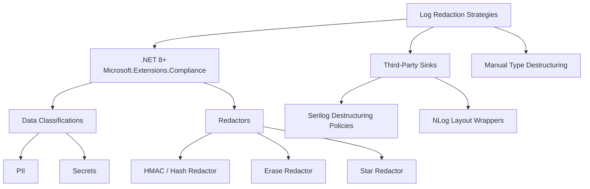
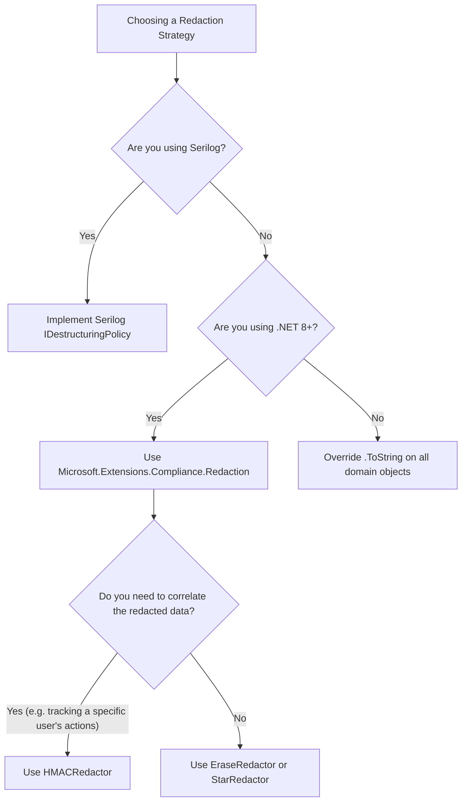

> [!success] Mastery Check
> - [ ] **Studied Well**
> - [ ] **Can explain the concept without notes**
> - [ ] **Can answer interview questions confidently**
> - [ ] **Can implement it in a real project**


# Log Redaction and Sensitive Data Masking in Structured Logs

## PART 0 — Navigation & Context

### Where This Fits
```
ASP.NET Core Mastery
└── Diagnostics & Observability
    ├── [[4.025 — Structured Logging: Log Templates and Semantic Values]]
    ├── 4.032 — Log Redaction & Masking ★ YOU ARE HERE
    └── [[4.033 — HTTP Logging Middleware]]
```

### Prerequisites
| Topic | Why It Matters Here |
|---|---|
| [[4.025 — Structured Logging: Log Templates and Semantic Values]] | Redaction acts on the semantic keys emitted by structured logs, not just raw text. |
| [[4.028 — Serilog Integration]] | Serilog has its own destructuring and enrichment pipeline for masking data. |

### What This Unlocks After
| Topic | Why It Matters Here |
|---|---|
| [[4.217 — Secrets in Production]] | Redaction ensures that secrets loaded in memory do not accidentally leak into telemetry sinks. |

### Why This Matters
If you do not implement log redaction systematically, a single junior developer logging an HTTP request body for debugging can leak thousands of plain-text passwords or PII (Personally Identifiable Information) into Splunk or Application Insights, triggering severe GDPR/HIPAA compliance violations and mandatory data breach disclosures.

---

## PART 1 — The Core Mental Model

> **ASP.NET Core log redaction (specifically Microsoft.Extensions.Compliance.Redaction in .NET 8+) intercepts log state objects before they are formatted or serialized, replacing sensitive semantic values (like PII or secrets) with hashes, asterisks, or blanks. The practical consequence is that the HTTP pipeline executes normally, but the JSON payload shipped to your log aggregator contains `Password="***"` instead of the actual user input.**

### The Plain-Language Analogy
Think of the logging pipeline like a government mailroom. A field agent (`ILogger`) writes a detailed report about a mission and drops it in the outbox. Before that report is placed in the permanent archives (the Log Sink), a censor (the Redaction engine) reads the report with a black marker in hand. Because the agent used standard forms (Structured Logging), the censor doesn't have to read every word; they just look at the boxes labeled "Agent Name" or "Location" and black them out. The archive gets the report, but the secrets are gone.

### The Taxonomy Diagram


---

## PART 2 — Deep Mechanics

### 2.1 — Pipeline Position and Execution Flow

Log redaction is a cross-cutting concern that sits *inside* the logging provider pipeline, right before the data is handed to the sink.

```text
──► HTTP Request
    │
    ├──► Auth Middleware
    ├──► Controller Action
    │      └─► _logger.LogInformation("User {Email} logged in", "john@acme.com")
    │            │
    │            ├─► ILogger checks IsEnabled()
    │            ├─► Provider formats state
    │            │     └─► [REDACTION ENGINE INTERCEPTS]
    │            │           ├─► Matches {Email} to DataClassification.PII
    │            │           └─► Applies HMACRedactor -> "hash(john@acme.com)"
    │            └─► Provider sends formatted state to Sink
    │
    └──► HTTP Response 200 OK
```

**Runtime Cost:** `~1-2 string allocations per redacted parameter`. Hashing redactors (HMAC) burn more CPU than Erasure redactors.

### 2.2 — The .NET 8 Extended Compliance API

In .NET 8, Microsoft introduced `Microsoft.Extensions.Compliance.Redaction` and `Microsoft.Extensions.Telemetry`. This allows you to tag C# records/classes with data classification attributes.

**Framework Source Behavior:**
When `AddExtendedRedaction()` is called, the framework registers a special telemetry formatter. When `LoggerMessage` or structured logs generate a `LogValues` struct, the formatter uses reflection (cached) to inspect the properties, looks for `[DataClassification]` attributes, and routes those specific values through the registered `Redactor` before sending them to the `ILoggerProvider`.

### 2.3 — Redactor Types

- **EraseRedactor**: Replaces the data with an empty string. Fastest.
- **StarRedactor**: Replaces the data with `***`.
- **HMACRedactor**: Hashes the data with a secret key. This is powerful because it masks the PII (e.g., an email) but allows you to correlate logs for the *same* user across multiple requests without knowing who they are.

### 2.4 — Third-Party Integration (Serilog)

If you use Serilog, Microsoft's compliance attributes don't automatically work because Serilog completely replaces the `ILoggerFactory` pipeline. Instead, you must use Serilog's `DestructuringPolicy`.

**Failure Mode:** A team upgrades to .NET 8, adds `[PersonalData]` attributes everywhere, configures Microsoft's Redaction engine, but they are using `UseSerilog()`. The logs leak plaintext PII to Datadog because Serilog bypasses Microsoft's telemetry formatter.

---

## PART 3 — Production Code Patterns

### Pattern 1: .NET 8 Native Data Classification & Redaction

This is the modern, native way to redact logs in .NET 8+ using the new telemetry packages.

```csharp
// ✅ CORRECT: Defining classifications and applying them to records
using Microsoft.Extensions.Compliance.Classification;
using Microsoft.Extensions.Compliance.Redaction;

// 1. Define Taxonomy
public static class DataTaxonomy
{
    public static DataClassification PII { get; } = new("Taxonomy", "PII");
    public static DataClassification Secret { get; } = new("Taxonomy", "Secret");
}

public class PiiDataAttribute : DataClassificationAttribute {
    public PiiDataAttribute() : base(DataTaxonomy.PII) { }
}
public class SecretDataAttribute : DataClassificationAttribute {
    public SecretDataAttribute() : base(DataTaxonomy.Secret) { }
}

// 2. Apply to Domain Objects
public record UserRegistration(
    [property: PiiDataAttribute] string Email, 
    [property: SecretDataAttribute] string Password,
    string TenantId);

// 3. Register in Program.cs
builder.Services.AddRedaction(x =>
{
    // Hash PII so we can correlate logs for the same user
    x.SetRedactor<HmacRedactor>(new DataClassificationSet(DataTaxonomy.PII));
    // Completely erase secrets
    x.SetRedactor<EraseRedactor>(new DataClassificationSet(DataTaxonomy.Secret));
});

// Configure the JSON console to respect redaction
builder.Logging.AddJsonConsole(options => 
    options.JsonWriterOptions = new JsonWriterOptions { Indented = true });
builder.Logging.EnableRedaction();
```
// HTTP wire format: HTTP response is unchanged. JSON log output:
// `{"Email": "3f8b...a1", "Password": "", "TenantId": "Acme"}`

### Pattern 2: Serilog Custom Destructuring Policy

When using Serilog, you must write a policy that intercepts object serialization.

```csharp
// ✅ CORRECT: Serilog-specific PII masking
public class PiiDestructuringPolicy : IDestructuringPolicy
{
    public bool TryDestructure(object value, ILogEventPropertyValueFactory factory, out LogEventPropertyValue result)
    {
        if (value is UserRegistration user)
        {
            // Create an anonymous object with masked fields
            var masked = new 
            {
                Email = "***REDACTED***", 
                Password = "***REDACTED***",
                TenantId = user.TenantId
            };
            
            result = factory.CreatePropertyValue(masked, destructureObjects: true);
            return true;
        }

        result = null;
        return false;
    }
}

// Program.cs
Log.Logger = new LoggerConfiguration()
    .Destructure.With<PiiDestructuringPolicy>()
    .WriteTo.Console(new CompactJsonFormatter())
    .CreateLogger();
```

### Pattern 3: Redacting the HTTP Request Body Middleware

A common requirement is logging incoming webhooks, but webhooks contain PII.

```csharp
// ✅ CORRECT: Using a Stream wrapper to redact specific JSON paths before logging
public class WebhookLoggingMiddleware
{
    private readonly RequestDelegate _next;
    private readonly ILogger<WebhookLoggingMiddleware> _logger;

    public WebhookLoggingMiddleware(RequestDelegate next, ILogger<WebhookLoggingMiddleware> logger)
    {
        _next = next;
        _logger = logger;
    }

    public async Task InvokeAsync(HttpContext context)
    {
        context.Request.EnableBuffering();
        
        using var reader = new StreamReader(context.Request.Body, leaveOpen: true);
        var body = await reader.ReadToEndAsync();
        context.Request.Body.Position = 0;

        // Mask SSN using regex before logging the string payload
        var redactedBody = Regex.Replace(body, @"""ssn""\s*:\s*""\d{9}""", @"""ssn"":""***""");

        _logger.LogInformation("Received webhook: {Body}", redactedBody);

        await _next(context);
    }
}
```

---

## PART 4 — Gotchas & Anti-Patterns

### Gotcha 1: String Interpolation Bypasses Redaction

Engineers configure the `.NET 8` data classification system, but then log strings instead of objects.

// ⚠️ WRONG CODE
```csharp
var user = new UserRegistration("john@acme.com", "pass123", "Acme");

// String interpolation executes BEFORE the logger gets it.
_logger.LogInformation($"User created: {user.Email} / {user.Password}");
```
// HTTP consequence (wrong path):
// Not an HTTP consequence, but the logs leak the plain text password. The string is allocated and passed to the logger as a flat message. The redaction engine never sees the `UserRegistration` object.

// ✅ CORRECT CODE
```csharp
// Pass the object so the redaction engine can destructure it
_logger.LogInformation("User created: {@User}", user);
```
// HTTP consequence (correct path):
// The log sink receives the JSON object with the properties correctly redacted.

// WHY: Redaction requires the structured logging pipeline to inspect the type attributes. If you pass a formatted string, the logger just sees an anonymous string with no attributes.

### Gotcha 2: The `ToString()` Override Leak

Engineers override `ToString()` on domain entities for easier debugging, but forget that logging providers fall back to `ToString()` if destructuring is not explicitly requested.

// ⚠️ WRONG CODE
```csharp
public class PaymentCard
{
    public string Pan { get; set; }
    public override string ToString() => $"Card: {Pan}"; // Leaks PAN
}

// Without the @ operator, the logger calls ToString()
_logger.LogInformation("Charging {Card}", myCard);
```
// HTTP consequence (wrong path):
// PCI compliance violation. The PAN is written to the logs.

// ✅ CORRECT CODE
```csharp
public class PaymentCard
{
    public string Pan { get; set; }
    public override string ToString() => $"Card: ****{Pan[^4..]}"; 
}
```
// HTTP consequence (correct path):
// Logs safely display "Card: ****1234".

// WHY: By default (without the `@` operator like `{@Card}`), Microsoft `ILogger` calls `.ToString()` on objects passed as arguments. If `ToString()` leaks secrets, the logger leaks secrets.

### Gotcha 3: Exception Message Leaks

Engineers meticulously redact their structured logs, but third-party libraries throw exceptions that contain PII in their `Message` property.

// ⚠️ WRONG CODE
```csharp
try 
{
    await _db.ExecuteAsync("INSERT...", ssnParameter);
}
catch (SqlException ex)
{
    // The exception message itself might contain the parameter values
    _logger.LogError(ex, "Database failure");
}
```
// HTTP consequence (wrong path):
// PII is written to the exception stack trace/message in the log sink.

// ✅ CORRECT CODE
```csharp
// You must use a central log processor (like an AppInsights ITelemetryProcessor 
// or Serilog Enricher) to sanitize Exception.Message globally, or rely on 
// library-specific safe-exception configurations.
```
// HTTP consequence (correct path):
// Stack traces are preserved but sensitive strings in the message are sanitized.

// WHY: Exception objects bypass standard object destructuring policies. Their `Message` is a raw string. 

### Gotcha 4: Redacting Too Much (The "Star" Blanket)

Engineers use a global regex redactor in a middleware or sink to replace anything that looks like an email or credit card.

// ⚠️ WRONG CODE
```csharp
// Global regex replacing \d{16} with ****
```
// HTTP consequence (wrong path):
// Random 16-digit Trace IDs, database primary keys, and Snowflake IDs get randomly redacted, making it impossible to correlate distributed traces or debug systems.

// ✅ CORRECT CODE
```csharp
// Use explicit, opt-in redaction via Attributes or explicit Destructuring Policies
```
// HTTP consequence (correct path):
// Only actual credit card numbers are redacted. Trace IDs remain intact.

// WHY: Heuristic redaction (Regex) on flat log output has an incredibly high false-positive rate in distributed systems where long numeric IDs are common.

### Gotcha 5: Assuming AppInsights Scopes are Redacted

Engineers use `BeginScope` and assume the `.NET 8` Extended Redaction handles it automatically.

// ⚠️ WRONG CODE
```csharp
// Passing a record with [PiiDataAttribute] into a Scope
using (_logger.BeginScope(new Dictionary<string, object> { ["User"] = userRecord }))
{
    _logger.LogInformation("Processing");
}
```
// HTTP consequence (wrong path):
// If the Application Insights telemetry initializer serializes the scope dictionary directly, it might bypass the Microsoft `ILogger` formatting pipeline that handles redaction, leaking the data as a custom dimension.

// ✅ CORRECT CODE
```csharp
// Ensure telemetry processors explicitly respect compliance policies
```
// HTTP consequence (correct path):
// Custom dimensions in Azure Monitor are safely redacted.

// WHY: Log scopes are stored in `AsyncLocal` and are often intercepted directly by telemetry sinks (like AppInsights or Serilog) before Microsoft's compliance formatter can run.

---

## PART 5 — Performance Implications

### Request Pipeline Characteristics Table

| Scenario | Pipeline Depth | Allocations Per Request | Approx Latency Impact | Recommendation |
|---|---|---|---|---|
| No Redaction | N/A | 0 | 0 ns | Baseline. |
| .NET 8 EraseRedactor | Per-log call | 1 String (empty) | ~10 ns | Fast, safe. |
| .NET 8 HMACRedactor | Per-log call | Hash byte array | ~500 ns | CPU intensive. Use only when correlation is required. |
| Serilog Destructuring | Per-log call | 1 anonymous object | ~50 ns | Standard for Serilog. |
| Regex on HTTP Body | Middleware | Large string copy | >5 ms | Terrible. Avoid regexing entire HTTP bodies. |
| ToString() mask | Per-log call | 1 string | ~15 ns | Easiest baseline defense. |
| Regex Sink Filter | Per-log sink | Large string parsing | >10 ms | Catastrophic CPU burn at scale. |
| Exception scrubbing | Filter | Reflection allocs | ~2 µs | Expensive but necessary for strict compliance. |

### BenchmarkDotNet Code

```csharp
using BenchmarkDotNet.Attributes;
using Microsoft.Extensions.Compliance.Classification;
using Microsoft.Extensions.Compliance.Redaction;
using Microsoft.Extensions.DependencyInjection;
using Microsoft.Extensions.Logging;

[MemoryDiagnoser]
public class RedactionBenchmarks
{
    private ILogger _logger;
    private UserData _user;

    [GlobalSetup]
    public void Setup()
    {
        var services = new ServiceCollection();
        services.AddLogging(b => 
        {
            b.AddJsonConsole();
            b.EnableRedaction();
        });
        services.AddRedaction(x =>
        {
            x.SetRedactor<EraseRedactor>(new DataClassificationSet(new DataClassification("T", "Secret")));
            x.SetRedactor<HmacRedactor>(new DataClassificationSet(new DataClassification("T", "PII")));
        });

        _logger = services.BuildServiceProvider().GetRequiredService<ILogger<RedactionBenchmarks>>();
        _user = new UserData { Email = "test@test.com", Secret = "1234" };
    }

    [Benchmark]
    public void LogWithEraseAndHMAC()
    {
        _logger.LogInformation("Data: {@User}", _user);
    }
}
// Expected output (approximate, .NET 8, x64, local):
// Method              | Mean      | Allocated |
// ------------------- |----------:|----------:|
// LogWithEraseAndHMAC |  1.2 us   |     640 B |
```

### When to Care / When to Ignore

**When this costs you:**
Applying HMAC redaction to large payloads (like JSON objects or arrays) on a high-throughput API will max out the CPU due to the cryptographic hashing. Only use HMAC on small, scalar identifiers (like Email or SSN) where correlation is strictly required.

**When this doesn't matter:**
`EraseRedactor` or `StarRedactor` have virtually zero CPU cost. You can apply them liberally across your domain entities without impacting API latency.

---

## PART 6 — Interview Arsenal

### A. The Question Bank

**Question:** "How do you ensure a user's password is not accidentally written to your centralized logging system?"
**Average Answer:** I just make sure developers don't log the password object. Or we run a regex over the logs before sending them.
**Why That's Insufficient:** Relies on human perfection, and regex is slow and error-prone.
> **Great Answer:** "We solve this at the structural level using Destructuring Policies or .NET 8 Data Classification attributes. We annotate our domain models with `[SecretData]` attributes. When the logger serializes the object, the telemetry pipeline intercepts those specific properties and applies an `EraseRedactor`. This means even if a junior developer calls `_logger.LogInformation("Request: {@Body}", request)`, the logging framework automatically drops the password field before it ever hits the JSON formatter, ensuring zero PII leakage by default."

### B. The Trick Questions
**Question:** "You added `[PiiData]` to your `User` record in .NET 8 and enabled Microsoft Redaction. But your logs in Datadog still show the plaintext email. You are using Serilog. What went wrong?"
**The Trap:** Thinking Microsoft extensions automatically apply to third-party providers.
**The Correct Answer:** Serilog completely bypasses Microsoft's default JSON formatter and telemetry pipeline. Serilog relies on its own `IDestructuringPolicy` interface. The Microsoft compliance attributes do absolutely nothing unless you explicitly write a Serilog policy that reflects on those attributes and masks the data during Serilog's serialization phase.

### C. Red Flags to Avoid
- **"We just don't log incoming requests."** (Red Flag: Avoids the problem but kills operational visibility. You need to log requests, just safely).
- **"I run a regex replacement on every log string."** (Red Flag: Massive performance killer. Structured logging explicitly exists so you don't have to parse strings).
- **"I encrypt the logs in the database, so it's fine."** (Red Flag: Misunderstands compliance. PII in a log aggregator is a compliance breach, even if the disk is encrypted at rest).

---

## PART 7 — Decision Framework



---

## PART 8 — Self-Check

### A. Conceptual Questions
1. Why is applying regex to the final formatted log string an anti-pattern compared to object destructuring?
2. What is the difference between `EraseRedactor` and `HMACRedactor`?
3. If an exception contains PII in its message, does object destructuring mask it?
4. How do you mask the body of an incoming HTTP POST request in middleware?
5. Why must you pass objects to the logger using the `@` symbol (e.g., `{@User}`) for redaction to work properly?
6. How does a custom Serilog destructuring policy prevent a `StackOverflowException` when logging recursive object graphs?
7. What happens if the HMAC redactor loses its encryption key?
8. Why is PCI/HIPAA compliance compromised if a developer logs `$"User: {user.Email}"`?

### B. Code Puzzles

**Puzzle 1: The String Bypass (The 5-puzzle rule bug)**
```csharp
public record CreditCard([property: SecretData] string Pan);

var card = new CreditCard("4111222233334444");
_logger.LogInformation("Processed card: {Card}", card.Pan);
```
Assuming `.NET 8` redaction is configured, what is logged?
<details>
<summary>Answer</summary>
The plain text PAN is logged: `Processed card: 4111222233334444`. The `LogInformation` call passed `card.Pan` directly, which is just a `string`. The redaction engine has no idea that this string came from a property annotated with `[SecretData]`. The object itself must be passed and destructured for the engine to read the attributes.
</details>

**Puzzle 2: The Missing @ Symbol**
```csharp
_logger.LogInformation("Processed card: {Card}", card);
```
With Serilog, what is logged?
<details>
<summary>Answer</summary>
`Processed card: CreditCard`. Because the `@` (destructuring operator) was omitted, Serilog calls `.ToString()` on the object instead of reflecting its properties. 
</details>

**Puzzle 3: The Correlated Hash**
```csharp
services.AddRedaction(x => x.SetRedactor<HmacRedactor>(...));
```
If User A logs in today, their email hashes to `xyz`. If User A logs in tomorrow, will their email hash to `xyz` again?
<details>
<summary>Answer</summary>
It depends on the Key Provider. If the HMAC key is auto-generated on startup (ephemeral), the hash will change tomorrow if the app restarts. If the key is pulled from Azure Key Vault and is static, it will correlate across reboots.
</details>

**Puzzle 4: HTTP Body Buffering**
```csharp
var body = await new StreamReader(context.Request.Body).ReadToEndAsync();
_logger.LogInformation(body);
await _next(context);
```
What happens to the HTTP pipeline?
<details>
<summary>Answer</summary>
The API hangs or throws an exception in the subsequent endpoint. The request body stream can only be read once by default. The middleware drained it, so the Controller receives an empty body. You must call `context.Request.EnableBuffering()` and reset the stream `Position` to `0` before calling `_next`.
</details>

---

## PART 9 — Connections & Resources

### A. Related Topics Table
| Topic | Why It Connects |
|---|---|
| [[4.025 — Structured Logging: Log Templates and Semantic Values]] | Redaction relies on semantic key-value pairs to accurately identify what data needs masking. |
| [[4.028 — Serilog Integration]] | Explains `IDestructuringPolicy`, which is required because Serilog ignores Microsoft's compliance attributes. |
| [[4.217 — Secrets in Production]] | Log redaction is the primary defense-in-depth mechanism against secrets leaking into observability platforms. |

### B. Books
| Book | Chapters | Why These Chapters |
|---|---|---|
| *ASP.NET Core in Action, 3rd Ed* by Andrew Lock | Chapter 17 | Touches on the integration of structured logging providers that respect object schemas. |

### C. Essential Articles & Docs
- [Microsoft Docs: Compliance and data classification in .NET](https://learn.microsoft.com/en-us/dotnet/core/extensions/compliance-redaction)
- [Nicholas Blumhardt (Serilog): Destructuring policies](https://nblumhardt.com/2016/02/serilog-context-and-correlation/)

### D. Template Meta-Note
> [!NOTE] 
> **Part 0** orients you. **Part 1** builds the mental model. **Part 2** explains the framework internals and pipeline. **Part 3** provides copy-pasteable production code. **Part 4** highlights the bugs your team will write. **Part 5** gives you the performance math. **Part 6** prepares you for the principal engineering interview. **Part 7** gives you a decision tree. **Part 8** tests your knowledge. **Part 9** links to further mastery.
