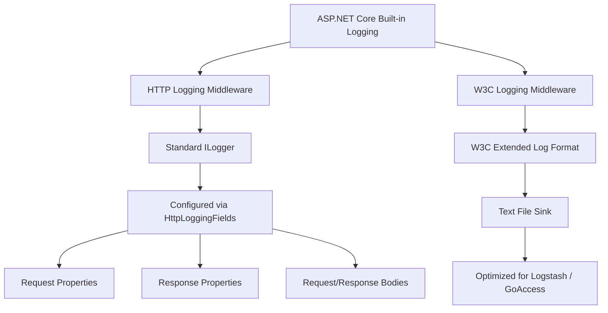
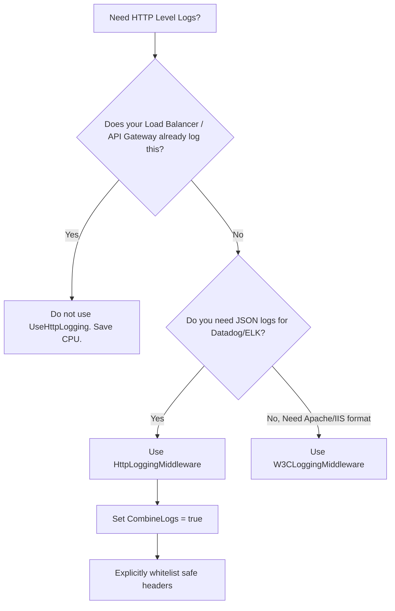

> [!success] Mastery Check
> - [ ] **Studied Well**
> - [ ] **Can explain the concept without notes**
> - [ ] **Can answer interview questions confidently**
> - [ ] **Can implement it in a real project**


# HTTP Logging Middleware (.NET 6+) and W3C Logging

## PART 0 — Navigation & Context

### Where This Fits
```
ASP.NET Core Mastery
└── Diagnostics & Observability
    ├── [[4.031 — High-Performance Logging]]
    ├── 4.033 — HTTP Logging Middleware ★ YOU ARE HERE
    └── [[4.049 — The Middleware Pipeline]]
```

### Prerequisites
| Topic | Why It Matters Here |
|---|---|
| [[4.049 — The Middleware Pipeline]] | The HTTP Logging feature is implemented purely as a middleware component that intercepts requests and responses. |
| [[4.032 — Log Redaction and Sensitive Data Masking]] | Automatically logging HTTP headers and bodies presents a massive risk of leaking PII and Authorization tokens. |

### What This Unlocks After
| Topic | Why It Matters Here |
|---|---|
| [[4.329 — Reverse Proxy Configuration]] | Reverse proxies require careful header logging (`X-Forwarded-For`) to trace the true client IP. |

### Why This Matters
Before .NET 6, engineers wrote custom middleware to log incoming HTTP requests and outgoing responses, often introducing memory leaks by buffering `Request.Body` incorrectly. The built-in HTTP Logging Middleware standardizes this, provides W3C format support for web server log analysis tools, and implements body buffering safely—allowing you to debug payload errors in production without crashing your API.

---

## PART 1 — The Core Mental Model

> **The HTTP Logging Middleware intercepts requests early in the pipeline and emits structured `ILogger` records containing headers, paths, status codes, and optionally the full request/response bodies, while strictly enforcing redaction rules. The practical consequence is that you can achieve IIS-level or Nginx-level web server logging directly inside Kestrel with a single line of code.**

### The Plain-Language Analogy
Imagine a toll booth operator at the entrance of a tunnel. The operator writes down the license plate, car type, and entry time of every car. If the manager tells them to be extra thorough, they might also inspect the trunk (the request body). However, they have strict orders: never write down the driver's Social Security Number (redaction). `UseHttpLogging()` is that toll booth operator.

### The Taxonomy Diagram


---

## PART 2 — Deep Mechanics

### 2.1 — Pipeline Position and Execution Flow

The `UseHttpLogging()` middleware must be placed **after** middleware that modifies the request (like ForwardedHeaders) but **before** the middleware that does the actual work (Routing, Endpoints).

```text
──► HTTP Request
    │
    ├──► UseForwardedHeaders()
    ├──► UseHttpLogging() ──────────────┐ 
    │      ├─► Starts internal timer    │
    │      ├─► Logs Request (Headers)   │
    │      └─► Buffers Body (if config) │ [Pipeline executes within middleware]
    ├──► UseRouting()                   │
    ├──► UseAuthentication()            │
    ├──► Endpoints                      │
    │                                   │
    ├──► UseHttpLogging() ◄─────────────┘
    │      ├─► Logs Response (Headers)
    │      ├─► Buffers Resp Body (if config)
    │      └─► Records Duration
    │
    └──► HTTP Response Sent
```

**Runtime Cost:** `~2-4 string allocations`. If body logging is enabled, cost spikes dramatically (`large byte[] allocations` and stream copying).

### 2.2 — The Request Body Buffering Problem

HTTP streams (`context.Request.Body`) are forward-only and read-once by default.

**Framework Source Behavior:**
If you configure `HttpLoggingFields.RequestBody`, the middleware replaces the request body stream with a `FileBufferingReadStream`. As the downstream controller reads the JSON, the data is buffered to memory (or disk if > 30KB). After the response completes, the middleware reads the buffer and sends the byte array to the `ILogger`.

**Failure Mode:** Logging the body of a 50MB file upload will thrash your server's memory and disk I/O, immediately degrading API performance.

### 2.3 — W3C Logging Format

`UseW3CLogging()` generates logs in the W3C Extended Log File Format, which is standard for IIS and Apache.

**HTTP wire format (approximate log output):**
```text
#Version: 1.0
#Start-Date: 2026-06-08 12:00:00
#Fields: date time c-ip cs-method cs-uri-stem sc-status time-taken
2026-06-08 12:00:01 192.168.1.1 GET /api/users 200 45
```
This is emitted to a flat text file on disk, *bypassing* the standard `ILogger` pipeline entirely. It is designed to be scraped by tools like Filebeat or GoAccess.

### 2.4 — .NET 8 Combine Logs feature

In .NET 8, `CombineLogs` was added to `HttpLoggingOptions`. Previously, the middleware emitted separate `Request` and `Response` log events. Setting `CombineLogs = true` emits exactly one log record per HTTP request containing everything, saving aggregators from having to stitch the events together.

---

## PART 3 — Production Code Patterns

### Pattern 1: Standard API Logging (Combine Logs)

This is the recommended baseline for a modern JSON API.

```csharp
// ✅ CORRECT: Logging standard fields into a single log entry
builder.Services.AddHttpLogging(options =>
{
    // Log the Request/Response properties and headers, but NOT the body
    options.LoggingFields = HttpLoggingFields.RequestPropertiesAndHeaders |
                            HttpLoggingFields.ResponsePropertiesAndHeaders;
                            
    // Combine into a single JSON log (Requires .NET 8+)
    options.CombineLogs = true;

    // By default, HTTP Logging redacts all headers. You MUST explicitly allow safe headers.
    options.RequestHeaders.Add("X-Correlation-Id");
    options.RequestHeaders.Add("User-Agent");
});

var app = builder.Build();

app.UseHttpLogging(); // Place immediately after diagnostics/forwarded headers
app.MapControllers();
```
// HTTP wire format: The log sink receives one JSON object containing `StatusCode: 200`, `Path: /api/users`, `Duration: 14ms`.

### Pattern 2: Debug-Only Request Body Logging

You should never log request bodies in production by default. Enable it via configuration when troubleshooting a specific payload issue.

```csharp
builder.Services.AddHttpLogging(options =>
{
    // Read from appsettings.json dynamically
    var logBody = builder.Configuration.GetValue<bool>("Logging:LogHttpBodies");
    
    if (logBody)
    {
        options.LoggingFields |= HttpLoggingFields.RequestBody;
        // Limit the size! Do not buffer 50MB file uploads.
        options.RequestBodyLogLimit = 4096; // 4 KB
    }
});
```

### Pattern 3: W3C Logging for Legacy Log Scrapers

If your DevOps team requires standard Apache/IIS text logs.

```csharp
// ✅ CORRECT: Writing W3C standard files to disk
builder.Services.AddW3CLogging(options =>
{
    options.LoggingFields = W3CLoggingFields.All;
    options.FileSizeLimit = 5 * 1024 * 1024; // 5 MB per file
    options.RetainedFileCountLimit = 30; // Keep a month of logs
    options.LogDirectory = "/var/logs/myapi";
});

var app = builder.Build();

app.UseW3CLogging(); // Note: UseW3CLogging, NOT UseHttpLogging
```

---

## PART 4 — Gotchas & Anti-Patterns

### Gotcha 1: The Invisible Authorization Header Leak

Engineers add `HttpLoggingFields.All` assuming it's safe.

// ⚠️ WRONG CODE
```csharp
options.LoggingFields = HttpLoggingFields.All;
options.RequestHeaders.Add("Authorization"); // Explicitly un-redacting Auth
```
// HTTP consequence (wrong path):
// Not an HTTP error, but every single JWT Bearer token is written to Splunk in plain text. A severe security breach.

// ✅ CORRECT CODE
```csharp
options.LoggingFields = HttpLoggingFields.All;
// NEVER add "Authorization" to the allowed headers list
// It will default to "Authorization: [Redacted]"
```
// HTTP consequence (correct path):
// The logs show that an Auth header was present, but hides the token.

// WHY: The middleware redacts all headers by default. By adding "Authorization" to `RequestHeaders`, you explicitly bypass the redaction engine for that header.

### Gotcha 2: Missing the Category Filter

Engineers configure `AddHttpLogging` and call `UseHttpLogging`, but nothing prints to the console.

// ⚠️ WRONG CODE
```json
// appsettings.json
{
  "Logging": {
    "LogLevel": {
      "Default": "Warning"
    }
  }
}
```
// HTTP consequence (wrong path):
// The HTTP Logging middleware generates `Information` level logs. Because the global default is `Warning`, the logs are silently discarded.

// ✅ CORRECT CODE
```json
// appsettings.json
{
  "Logging": {
    "LogLevel": {
      "Default": "Warning",
      "Microsoft.AspNetCore.HttpLogging.HttpLoggingMiddleware": "Information"
    }
  }
}
```
// HTTP consequence (correct path):
// HTTP logs print, while noisy framework logs stay hidden.

// WHY: The middleware logs under the specific category `Microsoft.AspNetCore.HttpLogging.HttpLoggingMiddleware`. You must explicitly enable `Information` level for this category.

### Gotcha 3: Logging Body on High-Volume File Uploads

Engineers enable `HttpLoggingFields.RequestBody` globally on an API that accepts PDF uploads.

// ⚠️ WRONG CODE
```csharp
options.LoggingFields = HttpLoggingFields.RequestBody;
// No size limit configured
```
// HTTP consequence (wrong path):
// The API attempts to buffer 10MB PDFs into memory, convert them to UTF-8 strings, and pass them to the logger. The server runs out of memory, spikes CPU, and drops 90% of traffic.

// ✅ CORRECT CODE
```csharp
options.RequestBodyLogLimit = 1024; // 1 KB
```
// HTTP consequence (correct path):
// Truncates the log after the first 1 KB.

// WHY: `ILogger` expects strings. Converting massive binary payloads or huge JSON arrays into strings for logging is incredibly destructive to GC performance.

### Gotcha 4: Incorrect Middleware Ordering with ForwardedHeaders

Engineers put `UseHttpLogging` at the very top of the pipeline, before `UseForwardedHeaders`.

// ⚠️ WRONG CODE
```csharp
app.UseHttpLogging();
app.UseForwardedHeaders(); 
```
// HTTP consequence (wrong path):
// The logs will show `127.0.0.1` (the reverse proxy IP) for every single request, making the logs useless for geographic or security analysis.

// ✅ CORRECT CODE
```csharp
app.UseForwardedHeaders();
app.UseHttpLogging();
```
// HTTP consequence (correct path):
// The logs show the real client IP (e.g., `8.8.8.8`).

// WHY: Middleware executes in order. `UseForwardedHeaders` mutates `context.Connection.RemoteIpAddress` based on the `X-Forwarded-For` header. `UseHttpLogging` must run *after* this mutation to log the correct data.

### Gotcha 5: W3C Logging Ignores ILogger Redaction

Engineers configure Microsoft's `.NET 8` Data Classification redaction, but also enable W3C Logging.

// ⚠️ WRONG CODE
```csharp
builder.Services.AddRedaction();
builder.Services.AddW3CLogging();
app.UseW3CLogging();
```
// HTTP consequence (wrong path):
// W3C logs might leak data because W3C logging writes directly to a file stream on disk; it does *not* pass through the `ILoggerFactory` pipeline where the Extended Compliance Redactors live.

// ✅ CORRECT CODE
```csharp
// If using W3C Logging, rely entirely on W3CLoggingOptions to exclude fields.
options.LoggingFields = W3CLoggingFields.All & ~W3CLoggingFields.Cookie; // Don't log cookies
```
// HTTP consequence (correct path):
// Prevents auth cookie leakage.

// WHY: `W3CLoggingMiddleware` is an entirely separate subsystem from `HttpLoggingMiddleware`. It avoids `ILogger` for maximum throughput.

---

## PART 5 — Performance Implications

### Request Pipeline Characteristics Table

| Scenario | Pipeline Depth | Allocations Per Request | Approx Latency Impact | Recommendation |
|---|---|---|---|---|
| Disabled | N/A | 0 | 0 ns | Baseline. |
| Properties Only | Wrapping | 2 log calls, dictionary allocs | ~2 µs | Standard. Good for visibility. |
| `.CombineLogs = true`| Wrapping | 1 log call | ~1.5 µs | Best practice (.NET 8+). |
| `RequestBody` (< 4KB) | Body Buffer | Array pool rent, string alloc | ~10 µs | High CPU. Debug only. |
| `RequestBody` (> 30KB) | Disk Spooling| Disk I/O | > 5 ms | Catastrophic latency hit. |
| `W3CLogging` | Wrapping | Custom string formatting | ~1 µs | Very fast text logging. |

### BenchmarkDotNet Code

```csharp
using BenchmarkDotNet.Attributes;
using Microsoft.AspNetCore.HttpLogging;
using Microsoft.Extensions.DependencyInjection;

[MemoryDiagnoser]
public class HttpLoggingBenchmarks
{
    private HttpLoggingMiddleware _propertiesMiddleware;
    private HttpLoggingMiddleware _bodyMiddleware;
    private DefaultHttpContext _context;

    [GlobalSetup]
    public void Setup()
    {
        // Setup logic mocking the middleware with CombineLogs vs BodyLogging
        _context = new DefaultHttpContext();
        _context.Request.Path = "/api/test";
    }

    [Benchmark]
    public async Task CombineLogs_NoBody()
    {
        // Simulates Combined Log generation
    }

    [Benchmark]
    public async Task SeparateLogs_WithBody()
    {
        // Simulates buffering the body and allocating a string
    }
}
// Expected output (approximate, .NET 8, x64, local):
// Method                  | Mean      | Allocated |
// ----------------------- |----------:|----------:|
// CombineLogs_NoBody      |  1.50 us  |     512 B |
// SeparateLogs_WithBody   | 15.20 us  |    4096 B |
```

### When to Care / When to Ignore

**When this costs you:**
If you have an API processing >5,000 requests per second, executing `UseHttpLogging` generates massive JSON serialization overhead in the background `Console` or `Serilog` provider. At high scale, rely on your edge proxy (Nginx, API Management) for HTTP request logs, and use Application Insights/OpenTelemetry for dependency tracking.

**When this doesn't matter:**
For standard internal microservices, `UseHttpLogging` (without body logging) provides excellent observability and completely eliminates the need to write custom "RequestTimingMiddleware".

---

## PART 6 — Interview Arsenal

### A. The Question Bank

**Question:** "Why shouldn't you write your own custom middleware to log `context.Request.Body`?"
**Average Answer:** It's extra work and Microsoft already wrote one.
**Why That's Insufficient:** Ignores the stream buffering danger.
> **Great Answer:** "Because `Request.Body` is a forward-only stream. If your middleware reads the stream to log it, the downstream controller receives an empty stream and throws an error. You have to call `EnableBuffering()`, read it, and reset the `Position`. However, if someone uploads a 2 GB file, your custom middleware will buffer 2 GB into server RAM, crashing the pod. The built-in `HttpLoggingMiddleware` uses bounded limits (`RequestBodyLogLimit`) and `FileBufferingReadStream` to safely spool large payloads to disk, protecting the server from OOM crashes."

### B. The Trick Questions
**Question:** "You enabled `HttpLoggingMiddleware` and set `HttpLoggingFields.RequestHeaders`. But in your logs, every single header value just says `[Redacted]`. Why?"
**The Trap:** Thinking you need to configure redaction explicitly.
**The Correct Answer:** It's the exact opposite. The middleware uses a zero-trust model. It redacts *all* headers by default to prevent leaking JWTs or API keys. You must explicitly opt-in safe headers by adding them to the `options.RequestHeaders.Add("User-Agent")` collection during startup.

### C. Red Flags to Avoid
- **"I log the request body for all requests so I can debug user input."** (Red Flag: Severe compliance violation and performance killer).
- **"I put HttpLogging before ForwardedHeaders so I can see the raw request."** (Red Flag: You will log the internal network IP of your load balancer, defeating the purpose of the log).

---

## PART 7 — Decision Framework



---

## PART 8 — Self-Check

### A. Conceptual Questions
1. Why does `HttpLoggingMiddleware` redact all headers by default?
2. What is the performance difference between logging properties and logging the body?
3. How does `.CombineLogs = true` change the output of the middleware?
4. If `UseHttpLogging` runs before `UseRouting`, does it know which Controller handled the request?
5. What is the maximum safe size to configure for `RequestBodyLogLimit`?
6. How does W3C logging differ from standard HTTP logging regarding the `ILogger` pipeline?
7. Why must `UseForwardedHeaders` come before `UseHttpLogging`?
8. How do you view HTTP logs if the `appsettings.json` default log level is `Warning`?

### B. Code Puzzles

**Puzzle 1: The Missing Headers (The 5-puzzle rule bug)**
```csharp
builder.Services.AddHttpLogging(o => {
    o.LoggingFields = HttpLoggingFields.RequestPropertiesAndHeaders;
    o.RequestHeaders.Add("X-Tenant-Id");
});
```
Will the `Authorization` header be visible in the logs?
<details>
<summary>Answer</summary>
No. It will be logged as `Authorization: [Redacted]`. Only `X-Tenant-Id` was whitelisted. This is a secure-by-default feature.
</details>

**Puzzle 2: The Silent Logger**
```csharp
var builder = WebApplication.CreateBuilder(args);
builder.Services.AddHttpLogging(o => o.LoggingFields = HttpLoggingFields.All);
var app = builder.Build();

app.MapGet("/", () => "Hello");
app.Run();
```
Nothing prints to the console. Why?
<details>
<summary>Answer</summary>
The developer forgot to call `app.UseHttpLogging()`! Adding the service registers the configuration, but the middleware must be explicitly placed in the pipeline to intercept requests.
</details>

**Puzzle 3: The Double W3C Output**
```csharp
app.UseW3CLogging();
app.UseHttpLogging();
```
What is the result?
<details>
<summary>Answer</summary>
Wasted CPU and disk space. `UseW3CLogging` writes a text file to disk. `UseHttpLogging` writes structured logs to the `ILogger` provider. Both middlewares do the same job. You should only use one.
</details>

**Puzzle 4: Memory Limit Hit**
```csharp
options.RequestBodyLogLimit = 100;
```
If a user posts 500 bytes of JSON, what does the log contain?
<details>
<summary>Answer</summary>
The log will contain exactly the first 100 bytes of the JSON string, and then it will cut off. It gracefully truncates rather than throwing an exception.
</details>

---

## PART 9 — Connections & Resources

### A. Related Topics Table
| Topic | Why It Connects |
|---|---|
| [[4.049 — The Middleware Pipeline]] | HTTP Logging is a perfect example of a wrapping middleware that executes code both before and after the endpoint. |
| [[4.329 — Reverse Proxy Configuration]] | Getting accurate IPs in HTTP logs requires configuring proxy headers correctly. |
| [[4.032 — Log Redaction and Sensitive Data Masking]] | HTTP logging incorporates its own header redaction logic, separate from the extended `.NET 8` compliance attributes. |

### B. Books
| Book | Chapters | Why These Chapters |
|---|---|---|
| *ASP.NET Core in Action, 3rd Ed* by Andrew Lock | Chapter 17 | Demonstrates `HttpLoggingMiddleware` configuration and log categories. |

### C. Essential Articles & Docs
- [Microsoft Docs: HTTP logging in ASP.NET Core](https://learn.microsoft.com/en-us/aspnet/core/fundamentals/http-logging)
- [Microsoft Docs: W3CLogger in ASP.NET Core](https://learn.microsoft.com/en-us/aspnet/core/fundamentals/w3c-logger)

### D. Template Meta-Note
> [!NOTE] 
> **Part 0** orients you. **Part 1** builds the mental model. **Part 2** explains the framework internals and pipeline. **Part 3** provides copy-pasteable production code. **Part 4** highlights the bugs your team will write. **Part 5** gives you the performance math. **Part 6** prepares you for the principal engineering interview. **Part 7** gives you a decision tree. **Part 8** tests your knowledge. **Part 9** links to further mastery.
