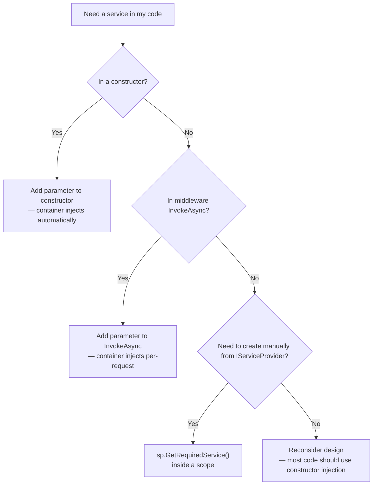

> [!success] Mastery Check
> - [ ] **Studied Well**
> - [ ] **Can explain the concept without notes**
> - [ ] **Can answer interview questions confidently**
> - [ ] **Can implement it in a real project**


# 4.034 — The Built-In DI Container: Service Registration and Resolution

## PART 0 — Navigation & Context

```
ASP.NET Core Mastery
├── D. Dependency Injection   (4.034–4.048)
│   ├── ▶▶▶ 4.034  The Built-In DI Container  ◀◀◀
│   ├── 4.035  Service Lifetimes: Singleton, Scoped, Transient
│   ├── 4.036  IServiceProvider and IServiceScope
│   ├── 4.038  Keyed Services (.NET 8)
│   └── 4.042  The Captive Dependency Problem
```

**Prerequisites:** [[4.002 — WebApplication and WebApplicationBuilder]] — `builder.Services` is the `IServiceCollection` where all registrations happen.

---

## PART 1 — Core Mental Model

### The Fundamental Rule

> **The built-in DI container resolves services by type. You register a service type → implementation type mapping in `IServiceCollection` before `Build()`. After `Build()`, `IServiceProvider` resolves instances on demand. The container builds an object graph automatically — if `OrderService` depends on `IOrderRepository`, the container creates and injects the repository without your code calling `new`. Always code to interfaces, not concrete types, to keep the container the only place that knows about implementations.**

### The Two-Phase Mental Model

```
REGISTRATION PHASE (before builder.Build())
─────────────────────────────────────────────────────────
builder.Services.AddScoped<IOrderService, OrderService>();
builder.Services.AddScoped<IOrderRepository, SqlOrderRepository>();
builder.Services.AddSingleton<ICacheService, RedisCacheService>();

  IServiceCollection = a List<ServiceDescriptor>
  ServiceDescriptor = { ServiceType, ImplementationType, Lifetime }

RESOLUTION PHASE (after Build(), per-request or manual)
─────────────────────────────────────────────────────────
IServiceProvider.GetRequiredService<IOrderService>()
  → Looks up IOrderService descriptor
  → Creates or retrieves SqlOrderRepository instance (Scoped — per-request)
  → Creates or retrieves RedisCacheService instance (Singleton — shared)
  → Constructs OrderService(SqlOrderRepository, RedisCacheService)
  → Returns the fully initialized OrderService
```

---

## PART 2 — Deep Mechanics

### 2.1 — Registration Methods Reference

```csharp
// ─── BASIC REGISTRATION FORMS ───

// Interface → Implementation (most common — program to abstractions)
builder.Services.AddScoped<IOrderService, OrderService>();
builder.Services.AddSingleton<ICacheService, RedisCacheService>();
builder.Services.AddTransient<IEmailService, SmtpEmailService>();

// Concrete type registration (no abstraction — use for simple infrastructure types)
builder.Services.AddSingleton<MetricsCollector>();

// Factory registration (for conditional or parameterized construction)
builder.Services.AddScoped<IPaymentGateway>(sp =>
{
    var config = sp.GetRequiredService<IOptions<PaymentOptions>>().Value;
    return config.UseStripe
        ? new StripePaymentGateway(config.StripeKey)
        : new PayPalPaymentGateway(config.PayPalClientId, config.PayPalSecret);
});

// Instance registration (pre-created singleton — container doesn't manage lifetime)
var myInstance = new ConfigurationService(hardCodedConfig);
builder.Services.AddSingleton<IConfigurationService>(myInstance);

// ─── SAFE REGISTRATION HELPERS ───

// TryAdd — only registers if the service type is NOT already registered
// Used by framework code and library authors to allow user overrides
builder.Services.TryAddScoped<IOrderService, OrderService>();   // No-op if IOrderService already registered
builder.Services.TryAddSingleton<IHttpContextAccessor, HttpContextAccessor>();

// Replace — removes existing registration and adds new one (useful in tests)
builder.Services.RemoveAll<IOrderService>();
builder.Services.AddScoped<IOrderService, TestOrderService>();

// ─── MULTIPLE IMPLEMENTATIONS ───
// All three registered, all three resolved via IEnumerable<INotificationService>
builder.Services.AddScoped<INotificationService, EmailNotificationService>();
builder.Services.AddScoped<INotificationService, SmsNotificationService>();
builder.Services.AddScoped<INotificationService, PushNotificationService>();

// Resolution:
public class NotificationDispatcher(IEnumerable<INotificationService> services)
{
    public async Task NotifyAllAsync(Notification n) =>
        await Task.WhenAll(services.Select(s => s.SendAsync(n)));
}
```

### 2.2 — How the Container Resolves Constructors

```csharp
// The container automatically finds and calls the public constructor:
public class OrderService
{
    // ✅ All parameters must be registered in the container
    public OrderService(
        IOrderRepository repository,    // ← resolved from container
        ICacheService cache,            // ← resolved from container
        ILogger<OrderService> logger,   // ← resolved from container (framework provides)
        IOptions<OrderOptions> options) // ← resolved from container (framework provides)
    {
        // ...
    }
}
```

**Constructor selection rules:**
1. If there is exactly one public constructor → use it.
2. If there are multiple public constructors → choose the one with the most parameters that can all be resolved (the "greedy" constructor). Ambiguity throws.
3. All constructor parameters must be resolvable from the container, or resolution throws `InvalidOperationException`.

**What the container provides automatically (registered by `builder.Services.Add*()`):**
- `ILogger<T>` — via `AddLogging()` (included in CreateBuilder)
- `IOptions<T>`, `IOptionsSnapshot<T>`, `IOptionsMonitor<T>` — via `AddOptions()` (included)
- `IConfiguration` — registered by CreateDefaultBuilder
- `IWebHostEnvironment`, `IHostEnvironment` — registered by CreateDefaultBuilder
- `IHttpContextAccessor` — via `AddHttpContextAccessor()` (must be called explicitly)

### 2.3 — Resolution Methods

```csharp
// From IServiceProvider:
var service = serviceProvider.GetService<IOrderService>();         // null if not registered
var service = serviceProvider.GetRequiredService<IOrderService>(); // throws if not registered (preferred)

var services = serviceProvider.GetServices<INotificationService>(); // IEnumerable<T>

// From a controller constructor (automatic injection by the framework):
public class OrderController(IOrderService orderService) : ControllerBase { }

// From a Minimal API endpoint parameter:
app.MapPost("/orders", (IOrderService orderService, CreateOrderRequest request) =>
    orderService.CreateAsync(request));

// From middleware (convention-based — services injected into InvokeAsync, not constructor):
public class AuditMiddleware(RequestDelegate next)
{
    // ✅ Scoped services injected into InvokeAsync — NOT the constructor (which runs at startup)
    public async Task InvokeAsync(HttpContext context, IAuditService auditService)
    {
        await auditService.LogRequestAsync(context);
        await next(context);
    }
}
```

### 2.4 — ServiceDescriptor Internals

```csharp
// What builder.Services.AddScoped<IOrderService, OrderService>() actually stores:
var descriptor = new ServiceDescriptor(
    serviceType: typeof(IOrderService),
    implementationType: typeof(OrderService),
    lifetime: ServiceLifetime.Scoped);

builder.Services.Add(descriptor);

// Inspection (useful in tests to verify registrations):
var descriptor = builder.Services
    .FirstOrDefault(d => d.ServiceType == typeof(IOrderService));
// descriptor.Lifetime == ServiceLifetime.Scoped
// descriptor.ImplementationType == typeof(OrderService)
```

### 2.5 — Scope Validation (.NET Development Mode)

In Development, ASP.NET Core automatically validates scopes at startup:

```csharp
// This is active by default in Development:
builder.Host.UseDefaultServiceProvider(options =>
{
    options.ValidateScopes = app.Environment.IsDevelopment();
    options.ValidateOnBuild = app.Environment.IsDevelopment();
});

// ValidateScopes: throws if a Scoped service is resolved from the root IServiceProvider
// ValidateOnBuild: throws at startup if any service has unresolvable dependencies
// Both are disabled in Production for performance
```

---

## PART 3 — Production Code Patterns

### Pattern 1: The Service Registration Pattern

```csharp
// ✅ Organize registrations into extension methods — keeps Program.cs clean

// ServiceCollectionExtensions.cs
public static class ServiceCollectionExtensions
{
    public static IServiceCollection AddOrderDomain(
        this IServiceCollection services, IConfiguration config)
    {
        services.AddScoped<IOrderService, OrderService>();
        services.AddScoped<IOrderRepository, SqlOrderRepository>();
        services.AddScoped<IOrderValidator, OrderValidator>();
        services.AddOptions<OrderOptions>()
            .BindConfiguration("Orders")
            .ValidateDataAnnotations()
            .ValidateOnStart();
        return services;   // ← Returns IServiceCollection for chaining
    }

    public static IServiceCollection AddPaymentDomain(
        this IServiceCollection services, IConfiguration config)
    {
        services.AddScoped<IPaymentService, PaymentService>();
        services.AddScoped<IPaymentGateway>(sp =>
        {
            var options = sp.GetRequiredService<IOptions<PaymentOptions>>().Value;
            return options.Provider == "Stripe"
                ? new StripeGateway(options.StripeApiKey)
                : new PayPalGateway(options.PayPalClientId, options.PayPalSecret);
        });
        return services;
    }
}

// Program.cs — clean:
builder.Services
    .AddOrderDomain(builder.Configuration)
    .AddPaymentDomain(builder.Configuration)
    .AddInventoryDomain(builder.Configuration);
```

### Pattern 2: Conditional Registration for Testing

```csharp
// In WebApplicationFactory for integration tests:
var factory = new WebApplicationFactory<Program>()
    .WithWebHostBuilder(b =>
    {
        b.ConfigureTestServices(services =>
        {
            // Remove real implementation and replace with fake
            services.RemoveAll<IEmailService>();
            services.AddSingleton<IEmailService, FakeEmailService>();

            services.RemoveAll<IPaymentGateway>();
            services.AddSingleton<IPaymentGateway, FakePaymentGateway>();
        });
    });
```

### Pattern 3: Verifying DI Registrations in Tests

```csharp
[Fact]
public void AllServicesAreRegistered()
{
    // Build the service provider from a fresh WebApplicationFactory
    using var factory = new WebApplicationFactory<Program>();
    var sp = factory.Services;

    // Verify that all critical services are resolvable
    using var scope = sp.CreateScope();
    var scopedProvider = scope.ServiceProvider;

    // These throw InvalidOperationException if not registered:
    scopedProvider.GetRequiredService<IOrderService>();
    scopedProvider.GetRequiredService<IOrderRepository>();
    scopedProvider.GetRequiredService<IPaymentGateway>();

    // Verify the correct implementation type is registered:
    var descriptor = factory.Services
        .GetRequiredService<IServiceCollection>()  // Not quite right - use reflection
        // Better: check the WebApplicationFactory's service collection directly
        .FirstOrDefault(d => d.ServiceType == typeof(IOrderService));
    Assert.Equal(ServiceLifetime.Scoped, descriptor?.Lifetime);
}
```

---

## PART 4 — Gotchas

### Gotcha 1: `GetService<T>` Returns Null; `GetRequiredService<T>` Throws
```csharp
var service = sp.GetService<IOrderService>();   // null if not registered — silent failure
service.ProcessOrder(...);                       // NullReferenceException much later

var service = sp.GetRequiredService<IOrderService>();  // InvalidOperationException immediately
// ← Fail fast: always prefer GetRequiredService in application code
```

### Gotcha 2: Registering a Generic Open Type
```csharp
// ✅ Open generic registration — resolves IRepository<Order>, IRepository<Product>, etc.
builder.Services.AddScoped(typeof(IRepository<>), typeof(SqlRepository<>));

// Resolution:
var orderRepo = sp.GetRequiredService<IRepository<Order>>();   // → SqlRepository<Order>
var productRepo = sp.GetRequiredService<IRepository<Product>>();// → SqlRepository<Product>
```

### Gotcha 3: The Last Registration Wins for Single Resolution
```csharp
// Both registrations exist:
builder.Services.AddScoped<IOrderService, OrderService>();
builder.Services.AddScoped<IOrderService, FastOrderService>();

// GetRequiredService<IOrderService>() returns FastOrderService (last wins)
// GetServices<IOrderService>() returns both (OrderService then FastOrderService)
```

### Gotcha 4: Circular Dependencies
```csharp
// ⚠️ A depends on B, B depends on A → stack overflow at resolution
// The container throws StackOverflowException or InvalidOperationException
// Solution: break the cycle with Lazy<T>, IServiceProvider, or redesign

services.AddScoped<ServiceA>();   // ServiceA(ServiceB b)
services.AddScoped<ServiceB>();   // ServiceB(ServiceA a) ← circular!

// Fix: inject Lazy<ServiceA> in ServiceB to defer resolution
services.AddScoped<Lazy<ServiceA>>(sp => new Lazy<ServiceA>(sp.GetRequiredService<ServiceA>));
```

### Gotcha 5: constructor injection in middleware fires at startup (Singleton scope)
```csharp
// ⚠️ Middleware constructors run ONCE at startup — not per-request
// If you inject a Scoped service into the constructor, it becomes a captive dependency
public class BadMiddleware(RequestDelegate next, IOrderService orderService)  // ← Scoped in Singleton!
{
    // orderService is the SAME instance for all requests — captive dependency bug
}

// ✅ Inject Scoped services via InvokeAsync parameters:
public class GoodMiddleware(RequestDelegate next)
{
    public async Task InvokeAsync(HttpContext context, IOrderService orderService)
    {
        // orderService is fresh per request — resolved from the request's scope
        await next(context);
    }
}
```

---

## PART 5 — Performance

| Operation | Cost | Notes |
|---|---|---|
| `builder.Services.AddScoped<>()` | ~1 µs | Adds ServiceDescriptor to list — only at startup |
| `builder.Build()` | ~100–500ms | Compiles service descriptors into resolution lambdas |
| `sp.GetRequiredService<T>()` (Singleton) | ~50 ns | Cache lookup — nearly free |
| `sp.GetRequiredService<T>()` (Scoped, first) | ~500 ns | Creates scope + instantiates service graph |
| `sp.GetRequiredService<T>()` (Scoped, subsequent) | ~50 ns | Returns same instance from scope cache |
| `sp.CreateScope()` | ~300 ns | Creates a scope context |
| Constructor injection (MVC/Minimal API) | ~200–500 ns | Framework invokes scope.GetRequiredService<T> for each constructor parameter |

**Note:** The built-in container is significantly slower than Autofac and DryIoc for complex graphs but is fast enough for all typical web application workloads. Only switch to a third-party container if profiling proves the container is a bottleneck (extremely rare).

---

## PART 6 — Interview Arsenal

**Q: How does the ASP.NET Core built-in DI container work?**
> "The container has two phases. Registration: before `builder.Build()`, you add `ServiceDescriptor` objects to `IServiceCollection` — each describes a service type, implementation type, and lifetime. Build: `builder.Build()` compiles these descriptors into a tree of resolution delegates. Resolution: at runtime, `IServiceProvider.GetRequiredService<T>()` traverses the tree to construct the object graph — it creates instances, injects their dependencies, and returns the root object. Constructor injection is automatic: if `OrderService` has a constructor parameter `IOrderRepository`, the container resolves IOrderRepository first, then passes it to OrderService's constructor. The rules are: one constructor (or the most resolvable if multiple), all parameters must be registered, and lifetimes must be respected — Scoped services can't be injected into Singletons."

**Q: What is the difference between `GetService<T>()` and `GetRequiredService<T>()`?**
> "`GetService<T>()` returns null if the service is not registered — this is a silent failure that causes a NullReferenceException somewhere downstream. `GetRequiredService<T>()` throws `InvalidOperationException` immediately if the service is not registered — it's a fail-fast approach. In application code, always use `GetRequiredService<T>()`. `GetService<T>()` is useful in framework code where a service is genuinely optional."

**Red flags:**
1. `new OrderService()` anywhere in application code — defeats the purpose of DI.
2. Injecting `IServiceProvider` into a service and calling `GetService` inside methods — this is the Service Locator anti-pattern; defeats testability.
3. Not using interface abstractions — concrete-to-concrete registration makes testing and swapping implementations impossible.

---

## PART 7 — Decision Framework



---

## PART 8 — Self-Check

1. What is `IServiceCollection` and when is it used?
2. What is `IServiceProvider` and when does it become available?
3. What does `TryAddScoped<T>()` do differently than `AddScoped<T>()`?
4. Why can't you inject a `Scoped` service into a `Middleware` constructor?
5. What happens when you call `GetRequiredService<T>()` for a service that was not registered?

<details><summary>Answers</summary>

1. `IServiceCollection` is a list of `ServiceDescriptor` objects — the registration surface available in the configuration phase before `builder.Build()`.
2. `IServiceProvider` is the compiled service resolution engine, available after `builder.Build()`. It is the runtime container.
3. `TryAddScoped<T>()` only registers the service if no registration for that service type already exists. `AddScoped<T>()` always adds a new registration — potentially creating duplicates.
4. Middleware constructors run once at startup — they are effectively Singleton-scoped. Injecting a Scoped service into a constructor creates a captive dependency: the Scoped service lives as long as the Singleton (the entire app lifetime). Use `InvokeAsync` parameters for per-request Scoped services.
5. `InvalidOperationException` is thrown immediately: `"No service for type 'IOrderService' has been registered."` — fail-fast, much better than a NullReferenceException later.

</details>

---

## PART 9 — Connections

| Topic | Relationship |
|---|---|
| [[4.035 — Service Lifetimes]] | The three lifetimes (Singleton/Scoped/Transient) are the most important DI concept after basic registration |
| [[4.036 — IServiceProvider and IServiceScope]] | Manual resolution patterns — when you can't use constructor injection |
| [[4.042 — The Captive Dependency Problem]] | The most dangerous bug that comes from incorrect lifetime mixing |
| [[4.038 — Keyed Services (.NET 8)]] | Multiple implementations registered by name, resolved by key |

**Docs:** [Dependency injection in ASP.NET Core — Microsoft Docs](https://learn.microsoft.com/en-us/aspnet/core/fundamentals/dependency-injection)
