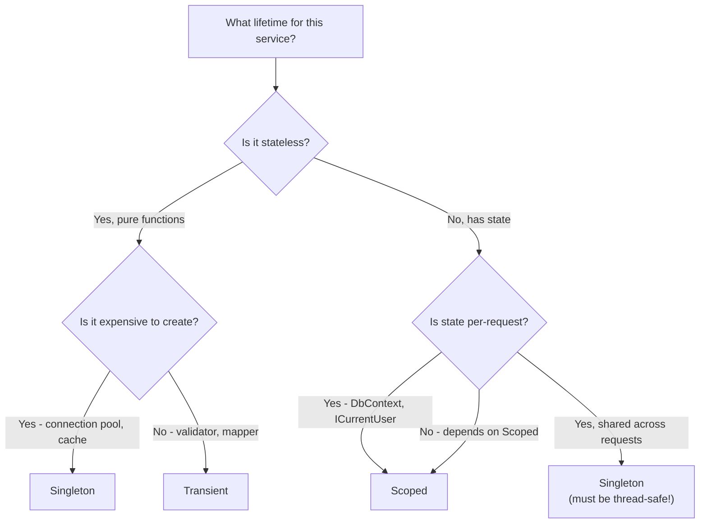

> [!success] Mastery Check
> - [ ] **Studied Well**
> - [ ] **Can explain the concept without notes**
> - [ ] **Can answer interview questions confidently**
> - [ ] **Can implement it in a real project**


# 4.035 — Service Lifetimes: Singleton, Scoped, Transient — Rules and Pitfalls

## PART 0 — Navigation & Context

```
ASP.NET Core Mastery
├── D. Dependency Injection
│   ├── 4.034  The Built-In DI Container
│   ├── ▶▶▶ 4.035  Service Lifetimes  ◀◀◀
│   └── 4.042  The Captive Dependency Problem
```

---

## PART 1 — Core Mental Model

### The Fundamental Rule

> **Singleton lives for the entire application lifetime. Scoped lives for one HTTP request (or one manually created scope). Transient is created fresh on every resolution. The cardinal rule: a longer-lived service must never directly depend on a shorter-lived service — a Singleton consuming a Scoped service is a captive dependency bug that causes data corruption or state leakage between requests.**

### The Lifetime Triangle

```
Application Lifetime (process start → shutdown)
├── SINGLETON — one instance, shared by all requests
│     IMemoryCache, IConfiguration, ICacheService, IHttpClientFactory
│
└── REQUEST LIFETIME (per HTTP request, or per manual scope)
    ├── SCOPED — one instance per request, shared within the request
    │     DbContext, IOrderService, IOrderRepository, ICurrentUser
    │
    └── TRANSIENT — new instance every time it is resolved
          Validators, Mappers, stateless utility services

Danger Zone:
  Singleton ────depends on────► Scoped = CAPTIVE DEPENDENCY BUG ⚠️
  Scoped ───depends on────────► Transient = OK (fine — transient is shorter)
  Singleton ──depends on───────► Transient = Memory leak (transient held by singleton)
```

---

## PART 2 — Deep Mechanics

### 2.1 — Singleton: One Instance, Application Lifetime

```csharp
// Registration forms:
builder.Services.AddSingleton<ICacheService, RedisCacheService>();
builder.Services.AddSingleton<IEmailTemplateRenderer, RazorEmailRenderer>();
builder.Services.AddSingleton<MetricsCollector>();

// Pre-created instance registration (container doesn't manage lifetime):
var configService = new HardCodedConfigService(config);
builder.Services.AddSingleton<IConfigService>(configService);

// Factory (called once, result cached as singleton):
builder.Services.AddSingleton<IPaymentGatewayFactory>(sp =>
    new StripeGatewayFactory(sp.GetRequiredService<IOptions<StripeOptions>>().Value));
```

**When to use Singleton:**
- Stateless services that are expensive to create (connection pools, thread-safe caches)
- Services with truly shared state (in-memory cache, metrics)
- Thread-safe infrastructure: `IHttpClientFactory`, `IMemoryCache`, `ILoggerFactory`
- `IOptions<T>` — the options object itself is Singleton (cached at startup)

**Singleton MUST be thread-safe** — multiple requests access the same instance concurrently. Any mutable state (fields, properties) must be protected with `Interlocked`, `ConcurrentDictionary`, `lock`, or `SemaphoreSlim`.

```csharp
// ✅ Thread-safe singleton with ConcurrentDictionary
public class InMemorySessionStore : ISessionStore
{
    private readonly ConcurrentDictionary<string, Session> _sessions = new();

    public Session? Get(string sessionId) => _sessions.GetValueOrDefault(sessionId);
    public void Set(string sessionId, Session session) => _sessions[sessionId] = session;
}

// ⚠️ WRONG: not thread-safe singleton
public class BrokenSessionStore : ISessionStore
{
    private readonly Dictionary<string, Session> _sessions = new();  // NOT thread-safe!
    public Session? Get(string sessionId) => _sessions.GetValueOrDefault(sessionId);
}
```

### 2.2 — Scoped: One Instance Per Request

```csharp
// Registration:
builder.Services.AddScoped<IOrderService, OrderService>();
builder.Services.AddScoped<IOrderRepository, SqlOrderRepository>();
builder.Services.AddDbContext<OrderDbContext>(o => o.UseSqlServer(connStr));
// DbContext is Scoped by default — one per HTTP request

// What "per request" means technically:
// → ASP.NET Core creates an IServiceScope at the start of each request
// → The scope's IServiceProvider resolves Scoped services within the request
// → At the end of the request, the scope is disposed → all Scoped services are disposed
```

**When to use Scoped:**
- `DbContext` — tracks entity state for the duration of a request
- Services that depend on `DbContext` (`IOrderRepository`, `IOrderService`)
- Services that carry per-request state (`ICurrentUserService`, `IRequestContext`)
- Unit of Work pattern implementations

```csharp
// Scoped services are shared within a single request:
public class OrderService(IOrderRepository repo, IInventoryRepository inventory)
{
    // Both repo and inventory get the SAME DbContext instance within this request
    // This means they participate in the same database transaction if needed
}
```

### 2.3 — Transient: New Instance Every Resolution

```csharp
// Registration:
builder.Services.AddTransient<IOrderValidator, OrderValidator>();
builder.Services.AddTransient<IPaymentRequestMapper, PaymentRequestMapper>();
builder.Services.AddTransient<IEmailBuilder, HtmlEmailBuilder>();
```

**When to use Transient:**
- Lightweight, stateless services with no shared state
- Services where a fresh instance is required for correctness (not idempotent state)
- Validators, mappers, formatters, builders — pure functions as services

**Transient in Singleton = memory leak:**
```csharp
// ⚠️ Transient held by a Singleton is never disposed — it lives for the app lifetime
builder.Services.AddSingleton<ISomeSingleton, SomeSingleton>();
builder.Services.AddTransient<IDisposableTransient, DisposableTransient>();

// SomeSingleton holds IDisposableTransient → never disposed → memory leak
public class SomeSingleton(IDisposableTransient transient) { }
// The transient instance is captured by the Singleton constructor
// and lives for the entire application lifetime — its Dispose() is never called
// until the application shuts down
```

### 2.4 — The Captive Dependency Rule (Cardinal Rule)

```
SAFE combinations (shorter lives can depend on longer-lived):
  Transient  → depends on → Scoped    ✅ (creates a new transient per resolution, within the scope)
  Transient  → depends on → Singleton ✅
  Scoped     → depends on → Singleton ✅ (singleton is always available)

DANGEROUS combinations:
  Singleton  → depends on → Scoped    ❌ CAPTIVE DEPENDENCY — Scoped captured as Singleton
  Singleton  → depends on → Transient ⚠️ MEMORY LEAK — Transient captured as Singleton
```

```csharp
// ⚠️ CAPTIVE DEPENDENCY — caught by ValidateScopes=true in Development
public class OrderSingleton(IOrderRepository scopedRepo) { }
// scopedRepo is captured in the Singleton constructor
// All requests use the SAME DbContext from the FIRST request — data corruption

builder.Services.AddSingleton<OrderSingleton>();   // Singleton
builder.Services.AddScoped<IOrderRepository, SqlOrderRepository>();  // Scoped

// In Development: InvalidOperationException at startup (ValidateOnBuild=true)
// "Cannot consume scoped service 'IOrderRepository' from singleton 'OrderSingleton'"

// In Production (ValidateScopes=false): Silent bug — first request's DbContext
// is shared with all subsequent requests — entity tracking corruption

// ✅ FIX: inject IServiceScopeFactory and create a scope per unit of work
public class OrderSingleton(IServiceScopeFactory scopeFactory)
{
    public async Task ProcessAsync()
    {
        using var scope = scopeFactory.CreateScope();
        var repo = scope.ServiceProvider.GetRequiredService<IOrderRepository>();
        await repo.DoWorkAsync();
    }   // ← scope disposed here → repo (Scoped) disposed here
}
```

### 2.5 — Lifetime in Practice: The DbContext Rule

The most important real-world lifetime rule involves `DbContext`:

```csharp
// ✅ CORRECT: DbContext is Scoped — one per request
builder.Services.AddDbContext<OrderDbContext>(o => o.UseSqlServer(connStr));
// AddDbContext registers with Scoped lifetime by default

// ✅ Services that use DbContext must also be Scoped or Transient:
builder.Services.AddScoped<IOrderRepository, SqlOrderRepository>();
// SqlOrderRepository(OrderDbContext dbContext) ← Scoped depends on Scoped ✅

// ⚠️ WRONG: Singleton repository with Scoped DbContext
builder.Services.AddSingleton<IOrderRepository, SqlOrderRepository>();
// SqlOrderRepository(OrderDbContext dbContext) ← Singleton depends on Scoped ❌
// First request's DbContext is captured forever — tracks ALL entities ever loaded

// ⚠️ WRONG: Singleton DbContext (explicit registration)
builder.Services.AddDbContext<OrderDbContext>(o => o.UseSqlServer(connStr),
    ServiceLifetime.Singleton);  // ← Never do this unless you know exactly why
// A Singleton DbContext tracks ALL entities from ALL requests — grows without bound
```

---

## PART 3 — Production Code Patterns

### Pattern 1: The Correct Lifetime Stack for a Feature

```csharp
// A full feature with correct lifetimes
builder.Services.AddSingleton<ICacheService, RedisCacheService>();    // Long-lived cache
builder.Services.AddScoped<IOrderService, OrderService>();              // Per-request
builder.Services.AddScoped<IOrderRepository, SqlOrderRepository>();     // Per-request
builder.Services.AddScoped<IInventoryRepository, SqlInventoryRepository>(); // Per-request
builder.Services.AddDbContext<OrderDbContext>(o => o.UseSqlServer(connStr)); // Scoped
builder.Services.AddTransient<IOrderValidator, FluentOrderValidator>(); // Stateless

// The dependency graph:
// OrderService (Scoped)
//   ├── IOrderRepository (Scoped) ← same DbContext
//   ├── IInventoryRepository (Scoped) ← same DbContext
//   ├── ICacheService (Singleton) ← thread-safe cache
//   └── IOrderValidator (Transient) ← new per resolution
```

### Pattern 2: IServiceScopeFactory in Background Services

```csharp
// BackgroundService is Singleton — cannot directly inject Scoped services
public class OrderProcessingBackgroundService(
    IServiceScopeFactory scopeFactory,   // ✅ Singleton → Singleton (safe)
    ILogger<OrderProcessingBackgroundService> logger) : BackgroundService
{
    protected override async Task ExecuteAsync(CancellationToken stoppingToken)
    {
        while (!stoppingToken.IsCancellationRequested)
        {
            await ProcessPendingOrdersAsync(stoppingToken);
            await Task.Delay(TimeSpan.FromSeconds(30), stoppingToken);
        }
    }

    private async Task ProcessPendingOrdersAsync(CancellationToken ct)
    {
        // ✅ Create a new scope for each unit of work — mimics a request scope
        using var scope = scopeFactory.CreateScope();
        var orderService = scope.ServiceProvider.GetRequiredService<IOrderService>();
        var orders = await orderService.GetPendingOrdersAsync(ct);
        foreach (var order in orders)
            await orderService.ProcessAsync(order, ct);
        // scope disposed here → DbContext disposed → connection returned to pool
    }
}
```

---

## PART 4 — Gotchas

### Gotcha 1: ValidateScopes Is Off in Production
`ValidateScopes=true` in Development throws immediately if a Singleton depends on a Scoped service. In Production, `ValidateScopes=false` (for performance). The bug silently exists in production — first request's DbContext is captured by the Singleton and used for all subsequent requests. Always test with Development environment to catch lifetime bugs.

### Gotcha 2: IOptionsSnapshot Is Scoped, IOptions Is Singleton
```csharp
// IOptions<T>     = Singleton — value set at startup, never changes
// IOptionsSnapshot<T> = Scoped — re-reads per request (supports hot-reload)
// IOptionsMonitor<T>  = Singleton — callback-based hot-reload

// ⚠️ Injecting IOptionsSnapshot<T> into a Singleton = captive dependency
public class MySingleton(IOptionsSnapshot<AppOptions> snapshot) { } // ← WRONG
// IOptionsSnapshot is Scoped — captive in Singleton

// ✅ Use IOptionsMonitor<T> (Singleton) in Singletons:
public class MySingleton(IOptionsMonitor<AppOptions> monitor) { }  // ← OK
```

### Gotcha 3: Transient IDisposable Is Never Disposed by Singleton Container
The root `IServiceProvider` (Singleton container) tracks and disposes all services it creates — but only when the application shuts down. Transient `IDisposable` services created from the root container live until shutdown. Always resolve Transient IDisposable services from a scope (request scope or manually created scope), not from the root container.

---

## PART 5 — Performance

| Lifetime | Creation Cost | Resolution Cost | Memory Impact |
|---|---|---|---|
| Singleton | Once at first resolution (~1–100 µs) | ~50 ns (cache lookup) | Low — one instance |
| Scoped | Once per request (~100–500 ns) | ~50 ns (scope cache) | Medium — one per active request |
| Transient | Every resolution (~100–500 ns) | Same as creation | High if IDisposable (held until scope disposed) |

**High-throughput APIs:** Scoped service creation (~100–500 ns) is negligible at even 100k req/s (50ms/sec total overhead). Never optimize lifetimes prematurely; correctness is the priority.

---

## PART 6 — Interview Arsenal

**Q: Explain the three service lifetimes in ASP.NET Core DI.**
> "Singleton is created once and shared across all requests for the application lifetime — the same instance serves every HTTP request. It must be thread-safe. Scoped is created once per HTTP request (or per manually created scope) and shared within that request — `DbContext` is the canonical example. Transient is created fresh every time it's resolved from the container — used for stateless, lightweight services like validators and mappers. The critical rule is: never inject a Scoped service into a Singleton — this is called a captive dependency. The Scoped service (e.g., DbContext) is captured by the Singleton and lives for the entire application, causing data corruption as all requests share the same tracked entity state."

**Q: What is the captive dependency problem?**
> "A captive dependency is when a longer-lived service holds a reference to a shorter-lived service. The most dangerous version: a Singleton service directly injects a Scoped service. The Singleton's constructor runs once at startup, captures the Scoped instance, and holds it forever. Every subsequent request uses that same Scoped instance instead of getting a fresh one. For `DbContext`, this means all requests share the same entity-tracking context — previously loaded entities are still tracked, transactions overlap, and data corruption occurs. ASP.NET Core catches this in Development with `ValidateScopes=true` — a startup `InvalidOperationException`. In Production, `ValidateScopes=false` — the bug is silent. The fix: inject `IServiceScopeFactory` into the Singleton and create a new scope per unit of work."

**Red flags:**
1. "I made my DbContext Singleton for performance" — catastrophic bug; entity tracking grows unbounded.
2. "I didn't know about ValidateScopes" — means captive dependencies in production are invisible.
3. "I use Transient for DbContext" — creates a new connection per DI resolution; expensive and breaks unit-of-work patterns.

---

## PART 7 — Decision Framework



---

## PART 8 — Self-Check

1. What is the correct lifetime for `DbContext`? Why?
2. If a Singleton depends on a Scoped service, what happens in Development? In Production?
3. Why is a Transient service held by a Singleton a memory leak?
4. What is `IServiceScopeFactory` and when do you use it?
5. What is the difference between `IOptions<T>`, `IOptionsSnapshot<T>`, and `IOptionsMonitor<T>` in terms of lifetime?

<details><summary>Answers</summary>

1. **Scoped**. DbContext tracks entity state across all operations within a single request (unit of work). If Singleton: all requests share tracked entities → corruption. If Transient: new connection per DI resolution → expensive, breaks transactions.
2. Development: `InvalidOperationException` at startup: "Cannot consume scoped service from singleton." Production: silent captive dependency — Scoped service lives for the app lifetime, all requests share one instance.
3. The Singleton holds a reference to the Transient instance via its constructor parameter. The Transient's `Dispose()` is only called when the Singleton is disposed (at app shutdown). Resources (DB connections, file handles, network sockets) held by the transient are never released during the app's lifetime.
4. `IServiceScopeFactory` is a Singleton service that creates new DI scopes on demand. Use it in Singletons (BackgroundService, middleware constructors) that need to resolve Scoped services — create a new scope, resolve the scoped service, use it, then dispose the scope.
5. `IOptions<T>` — Singleton, reads once at startup. `IOptionsSnapshot<T>` — Scoped, re-reads per request (supports hot-reload from JSON). `IOptionsMonitor<T>` — Singleton, notifies via `OnChange` callback when configuration changes.

</details>

---

## PART 9 — Connections

| Topic | Relationship |
|---|---|
| [[4.034 — The Built-In DI Container]] | Lifetime is a parameter of service registration |
| [[4.042 — The Captive Dependency Problem]] | Deep dive into the Singleton→Scoped captive dependency bug |
| [[4.036 — IServiceProvider and IServiceScope]] | IServiceScopeFactory creates scopes for Singleton→Scoped safe resolution |
| [[4.231 — IHostedService]] | BackgroundService is Singleton — the IServiceScopeFactory pattern is mandatory |

**Docs:** [Service lifetimes — Microsoft Docs](https://learn.microsoft.com/en-us/aspnet/core/fundamentals/dependency-injection#lifetime-and-registration-options)
