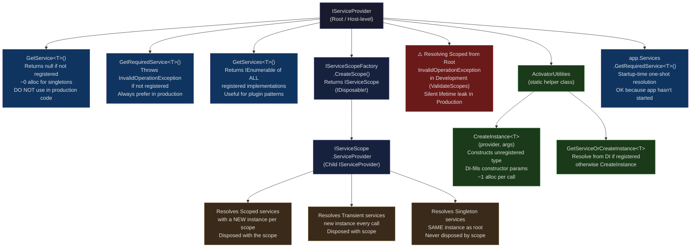
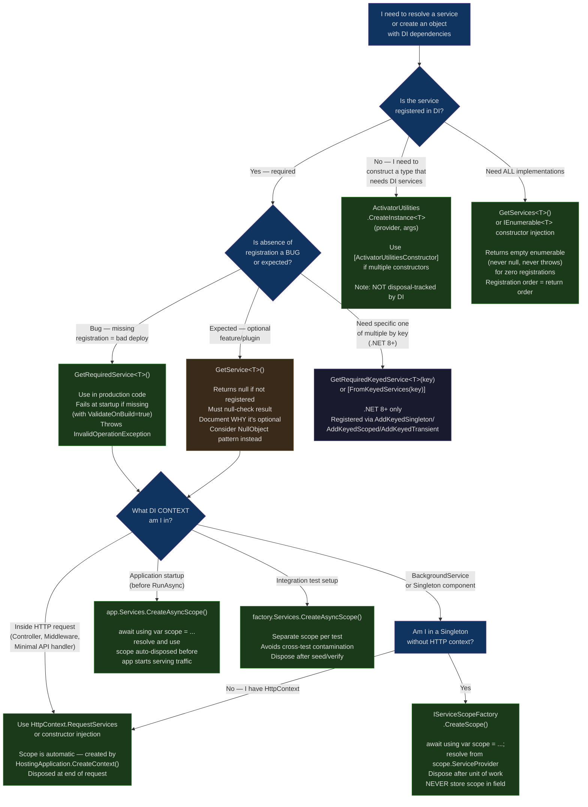

> [!success] Mastery Check
> - [ ] **Studied Well**
> - [ ] **Can explain the concept without notes**
> - [ ] **Can answer interview questions confidently**
> - [ ] **Can implement it in a real project**


# 4.036 — IServiceProvider and IServiceScope: Manual Resolution Patterns

---

## Part 0 — Navigation & Context

### Where This Topic Lives in the ASP.NET Core Domain Hierarchy

```
ASP.NET Core Mastery
└── Dependency Injection (DI)
    ├── 4.034 — The Built-In DI Container: Service Registration and Resolution
    ├── 4.035 — Service Lifetimes: Singleton, Scoped, Transient
    ├── 4.036 — IServiceProvider and IServiceScope: Manual Resolution Patterns  ◄ YOU ARE HERE
    ├── 4.042 — The Captive Dependency Problem
    ├── 4.047 — DI Scope in Background Services
    └── 4.054 — HttpContext and IHttpContextAccessor

Related Subsystems:
├── Middleware (pipeline creates/disposes the request scope)
├── Background Services (must create their own scopes manually)
└── Testing (integration tests resolve services directly from IServiceProvider)
```

### What You Need Before This

- **[[4.034 — The Built-In DI Container: Service Registration and Resolution]]** — You need to understand service registration (`AddScoped`, `AddSingleton`, `AddTransient`) and how the container compiles its internal expression trees before you can reason about what `GetService<T>` is actually doing under the hood.
- **[[4.035 — Service Lifetimes: Singleton, Scoped, Transient]]** — Understanding *why* scopes exist (they define a lifetime boundary for Scoped services) is prerequisite knowledge; without it, `IServiceScope` is just a confusing wrapper.
- **[[2.47 — Dependency Injection Internals]]** — The container is implemented as a compiled expression tree (a `CallSite` tree). Knowing this explains the performance characteristics of resolution and why the first call is slower than subsequent calls.

### What This Unlocks After

- **[[4.042 — The Captive Dependency Problem]]** — The captive dependency bug *is* the bug where you call `GetService<IScopedService>()` on the **root** `IServiceProvider` instead of on a child scope's `ServiceProvider`. You cannot understand the captive dependency problem without mastering scope boundaries.
- **[[4.047 — DI Scope in Background Services]]** — Background services (`IHostedService`, `BackgroundService`) are Singletons and receive the root `IServiceProvider`. They *must* use `IServiceScopeFactory.CreateScope()` to resolve Scoped services. This entire pattern is a direct application of Part 2.4 of this note.
- **[[4.054 — HttpContext and IHttpContextAccessor]]** — HTTP requests automatically create a scope via `IServiceScopeFactory`. Manual scope creation is required the moment you step outside the HTTP request lifecycle (background threads, startup, Hangfire jobs).

### Why This Topic Matters to a Production Engineer at Scale

When your payment processing service uses `IHostedService` to consume a message queue, every message must be processed in its own DI scope — if you get scope management wrong, you either leak `DbContext` instances (causing connection pool exhaustion) or resolve Singleton-scoped database connections that corrupt state across concurrent messages. `IServiceProvider` and `IServiceScope` are the mechanism that lets non-HTTP code participate correctly in the DI lifetime model.

---

## Part 1 — The Core Mental Model

### The Fundamental Rule

> **ASP.NET Core's `IServiceProvider` is a compiled, read-only service factory. When you call `GetRequiredService<T>()` on the *root* provider, Scoped services are resolved as Singletons and never disposed — you must always call `CreateScope()` first and resolve from `scope.ServiceProvider` to get a properly lifetime-managed Scoped instance.**

### The Plain-Language Analogy

Think of `IServiceProvider` as a hotel key card system. The root `IServiceProvider` is the **master key station** at the front desk — it can open *any* door, but it keeps everything it "borrows" open forever (no checkout). A `IServiceScope` is a **guest room key card** issued at check-in: it grants access to all shared hotel amenities (Singleton services) plus a private minibar stocked specifically for that room (Scoped services). When the guest checks out and disposes the scope, the minibar is sealed and disposed — the `DbContext`, unit of work, and payment session are all cleaned up. `GetRequiredService<T>()` on the root is like using the master key to permanently borrow a minibar item: it still works (the service is returned), but the item never goes back to inventory, and after 100 guests you have no minibars left. `ActivatorUtilities.CreateInstance<T>()` is the hotel contractor: they're not a registered guest, but they can still use the hotel's supply rooms (the DI container) to get their own tools.

This analogy holds when you ask "but what about a concurrent request?": each HTTP request gets its own key card (its own scope), so two concurrent requests never share Scoped services even though they both access the same Singleton services from the root. And when a `BackgroundService` message handler runs, it has no key card at all (it runs in the root scope) — it must explicitly go to the front desk (`IServiceScopeFactory`) and issue itself a card before it can safely use Scoped services.

### The Taxonomy Diagram



---

## Part 2 — Deep Mechanics

### 2.1 — The Root IServiceProvider vs. Child Scopes: The Fundamental Boundary

#### Pipeline Position

```
Application Startup:
  WebApplication.Build()
  └── ServiceCollection.BuildServiceProvider()
       └── Root IServiceProvider (Singleton, lives for app lifetime)

Per HTTP Request (automatic):
  ──► ExceptionHandler ──► HSTS ──► StaticFiles ──► Routing ──► Auth ──► [Controller/Endpoint]
                                                                               ↑
                          IServiceScopeFactory.CreateScope() called here ──────┘
                          HttpContext.RequestServices = scope.ServiceProvider
                          Scope disposed at end of request

Per BackgroundService message (manual - YOUR responsibility):
  BackgroundService.ExecuteAsync()
  └── [NO SCOPE] Root IServiceProvider only — you MUST create one
       └── IServiceScopeFactory.CreateScope()
            └── scope.ServiceProvider.GetRequiredService<IOrderRepository>()
```

#### Framework Source Behavior

The HTTP request scope is created inside `HostingApplication.CreateContext()` which is called by Kestrel for every new request:

```csharp
// ASP.NET Core internally (approximate) — HostingApplication.cs
// Source: src/Hosting/Hosting/src/Internal/HostingApplication.cs
internal Context CreateContext(IFeatureCollection contextFeatures)
{
    var context = new Context();
    var httpContext = _httpContextFactory.Create(contextFeatures);
    
    // This is where the per-request scope is born:
    // IServiceScopeFactory.CreateScope() is called
    // httpContext.RequestServices is set to scope.ServiceProvider
    
    context.HttpContext = httpContext;
    return context;
}

// And at the end of the request, DisposeContext():
internal void DisposeContext(Context context, Exception? exception)
{
    var httpContext = context.HttpContext;
    // scope.Dispose() is called here — all Scoped services are disposed
    _httpContextFactory.Dispose(httpContext);
    // ...
}
```

#### HTTP Wire Format

This is a DI-internal topic, but the HTTP consequence of scope mismanagement is severe:

```
// HTTP consequence of resolving Scoped service from root (Development mode):
// POST /api/payments/process HTTP/1.1
// Content-Type: application/json
// { "amount": 150.00, "currency": "GBP" }

// HTTP/1.1 500 Internal Server Error
// Content-Type: application/problem+json
// {
//   "type": "https://tools.ietf.org/html/rfc9110#section-15.6.1",
//   "title": "An error occurred while processing your request.",
//   "status": 500,
//   "detail": "Cannot resolve 'PaymentDbContext' from root provider because
//              it was registered as Scoped."
// }
// (Only in Development with ValidateScopes=true; Production silently leaks)
```

#### The Root Provider Internals

The root `IServiceProvider` in ASP.NET Core is an instance of `ServiceProvider` (internal class). It maintains:

1. **A `CallSite` tree** — compiled expression trees for every registered service
2. **A root scope** (`ServiceProviderEngineScope`) — the permanent scope that holds all Singleton instances
3. **A `_realizedServices` concurrent dictionary** — caches the resolved Singleton instances

```csharp
// ASP.NET Core internally (approximate) — ServiceProvider.cs
// Source: src/libraries/Microsoft.Extensions.DependencyInjection/src/ServiceProvider.cs
internal sealed class ServiceProvider : IServiceProvider, IDisposable
{
    // The root scope — Singletons live here forever
    private readonly ServiceProviderEngineScope _root;
    
    // CallSite cache — compiled expression trees per service type
    private readonly ConcurrentDictionary<Type, Func<ServiceProviderEngineScope, object>> _realizedServices;
    
    public object? GetService(Type serviceType)
    {
        // Delegates to the root scope's GetService
        return _root.GetService(serviceType);
    }
    
    internal ServiceProviderEngineScope CreateScope()
    {
        // Returns a NEW child scope
        // Child scope references the root for Singleton resolution
        return new ServiceProviderEngineScope(this);
    }
}
```

**Cost:** Resolving a Singleton from root after first call = **~0 allocations** (cached in `_realizedServices`). Resolving a Scoped service from a child scope = **~1 allocation** (new instance). Creating a new scope = **~2 allocations** (`ServiceProviderEngineScope` + the dictionary for Scoped instances).

#### The ValidateScopes Guard Rail

In `Development` environment, ASP.NET Core enables `ValidateScopes` and `ValidateOnBuild` automatically via the generic host:

```csharp
// ASP.NET Core internally (approximate) — Host.cs / WebApplication.cs
// .NET 8 default behavior:
if (env.IsDevelopment())
{
    serviceProviderOptions.ValidateScopes = true;   // Throws if Scoped resolved from root
    serviceProviderOptions.ValidateOnBuild = true;  // Throws at startup if graph is invalid
}
```

In Production, `ValidateScopes` is **false**. This means the bug is silent: a Scoped service resolved from root becomes a de-facto Singleton. If that Scoped service holds a `DbContext`, you now have a single database connection shared across all concurrent requests — a race condition that produces data corruption and `ObjectDisposedException` under load.

---

### 2.2 — GetService vs GetRequiredService vs GetServices: Choosing Correctly

#### The Three Resolution Methods

```
IServiceProvider Resolution API:

GetService<T>()              → Returns null if T is not registered
                               Returns object? — caller must null-check
                               Use case: OPTIONAL feature detection, plugin availability checks
                               Cost: ~0 alloc for hit, null for miss

GetRequiredService<T>()      → Throws InvalidOperationException if T is not registered
                               Returns T (non-null guaranteed)
                               Use case: EVERYTHING in production code
                               Cost: ~0 alloc for Singleton hit, ~1 alloc for Scoped/Transient

GetServices<T>()             → Returns IEnumerable<T> of ALL registered implementations
                               Empty enumerable if none registered (never null)
                               Use case: Plugin patterns, composite handlers, multi-validator dispatch
                               Cost: ~1 alloc for the enumerable wrapper + N allocs for Transient
```

#### Framework Source Behavior

```csharp
// ASP.NET Core internally (approximate) — ServiceProviderServiceExtensions.cs
public static T GetRequiredService<T>(this IServiceProvider provider) where T : notnull
{
    if (provider is ISupportRequiredService requiredServiceSupportingProvider)
    {
        // Fast path: internal providers implement ISupportRequiredService
        // and throw immediately without boxing
        return requiredServiceSupportingProvider.GetRequiredService<T>();
    }

    var service = provider.GetService<T>();
    if (service == null)
    {
        // Slow path: null check + exception construction
        throw new InvalidOperationException(
            $"No service for type '{typeof(T)}' has been registered.");
    }
    return service;
}

// GetServices<T> uses a special type wrapper: IEnumerable<T>
public static IEnumerable<T> GetServices<T>(this IServiceProvider provider)
{
    // Internally resolves IEnumerable<T> which the container handles specially:
    // It returns ALL registrations for T, not just the last one
    return provider.GetRequiredService<IEnumerable<T>>();
}
```

#### HTTP Wire Format

```
// Scenario: Payment gateway selector using GetServices<T>
// POST /api/payments/process HTTP/1.1
// Content-Type: application/json
// { "provider": "stripe", "amount": 99.99 }

// ✅ Multiple payment gateways registered, all resolved:
// IEnumerable<IPaymentGateway> = [StripeGateway, PayPalGateway, BraintreeGateway]
// Runtime selection by provider name from request body

// ⚠️ GetService<IPaymentGateway>() only returns the LAST registered implementation
// (Stripe, PayPal, and Braintree are all registered, but only Braintree comes back)
// Silent bug: all payments go through Braintree regardless of provider field
```

#### Edge Cases

**GetService vs GetRequiredService in middleware:** Middleware constructors are resolved once at startup (Singleton lifetime). If your middleware does `provider.GetService<IPaymentProcessor>()` and it's null because the team forgot to register it, you get a `NullReferenceException` at request time — not at startup. `GetRequiredService` would throw at application startup during middleware pipeline construction, which is far better.

**`GetServices<T>()` registration order:** The DI container returns implementations in registration order (FIFO). The *last* registered implementation is what `GetService<T>()` returns (it wins). This is why `GetServices<T>()` is important for patterns that need all implementations, not just the "winner."

**Cost label:** `GetRequiredService<T>()` on a cached Singleton: **~0 allocations** (dictionary lookup). `GetServices<T>()` with 3 Transient implementations: **~4 allocations** (the `IEnumerable<T>` wrapper + 3 service instances).

---

### 2.3 — IServiceScopeFactory.CreateScope(): The Correct Manual Scope Pattern

#### Pipeline Position

```
This is NOT middleware — it's a DI factory. It's used INSIDE components that need
to create their own scope boundary:

Singleton Context (Background Service, Singleton middleware):
  ──► [BackgroundService] ──► IServiceScopeFactory.CreateScope()
                               └── scope.ServiceProvider.GetRequiredService<IOrderRepository>()
                               └── [do work]
                               └── scope.Dispose()  ← CRITICAL: disposes DbContext etc.

HTTP Request Context (done automatically):
  ──► Kestrel ──► HostingApplication.CreateContext()
                   └── IServiceScopeFactory.CreateScope()  ← automatic
                   └── HttpContext.RequestServices = scope.ServiceProvider
  ──► [request handling] ──► HostingApplication.DisposeContext()
                               └── scope.Dispose()  ← automatic
```

#### The Scope Factory Resolution

`IServiceScopeFactory` itself is a **Singleton** — it is the only Singleton service whose sole purpose is to create child scopes. You inject it into any Singleton component that needs to create scoped work:

```csharp
// ASP.NET Core internally (approximate) — ServiceProvider.cs
// IServiceScopeFactory is registered automatically by the DI container infrastructure
// Source: src/libraries/Microsoft.Extensions.DependencyInjection/src/ServiceCollectionContainerBuilderExtensions.cs

// The factory creates ServiceProviderEngineScope instances:
internal sealed class ServiceProviderEngineScope : IServiceScope, IServiceProvider, IAsyncDisposable
{
    internal ServiceProviderEngineScope(ServiceProvider root)
    {
        RootProvider = root;
        // Each scope maintains its own dictionary of Scoped instances
        ResolvedServices = new Dictionary<ServiceCacheKey, object?>();
    }
    
    public IServiceProvider ServiceProvider => this;
    
    public void Dispose()
    {
        // Iterates ResolvedServices and calls Dispose on every IDisposable
        // This is where DbContext.Dispose(), HttpClient.Dispose() etc. happen
        DisposeServices();
    }
}
```

#### HTTP Wire Format

```
// Scenario: Order fulfillment background service
// Consumes from Azure Service Bus, processes order, saves to database

// Each message processed in its own scope:
// [Message arrives] → scope created → DbContext allocated → order saved → scope disposed → DbContext.Dispose()

// Without scope management:
// [Message 1] → root provider → DbContext (never disposed, connection held open)
// [Message 2] → root provider → SAME DbContext (data from message 1 still tracked!)
// [Message 3] → root provider → DbContext state corrupted
// Result: 500 Internal Server Error or silent data corruption

// HTTP consequence (for the REST API that checks order status):
// GET /api/orders/ORD-2024-001 HTTP/1.1
// HTTP/1.1 500 Internal Server Error (ObjectDisposedException from leaked DbContext)
```

#### The using Pattern: Sync vs Async Disposal

```csharp
// IServiceScope implements both IDisposable and IAsyncDisposable
// Always prefer async disposal in async contexts:

// ✅ CORRECT — async context
await using var scope = serviceScopeFactory.CreateScope();
var repo = scope.ServiceProvider.GetRequiredService<IOrderRepository>();
await repo.ProcessOrderAsync(orderId, cancellationToken);
// scope disposed here via IAsyncDisposable

// ⚠️ WORKS but sync-over-async in async context:
using var scope = serviceScopeFactory.CreateScope();
// ... uses sync Dispose even in async method
```

**Cost label:** `CreateScope()`: **~2 allocations** (`ServiceProviderEngineScope` instance + internal `ResolvedServices` dictionary). Scope disposal: **O(n) where n = number of Scoped/Transient IDisposable services resolved** from this scope.

---

### 2.4 — ActivatorUtilities: Constructing Unregistered Types with DI-Resolved Parameters

#### What Problem This Solves

Sometimes you need to construct a class that:
1. Is **not registered** in the DI container (it's not a service, it's a "value object with dependencies")
2. Has constructor parameters that **are** registered services
3. Needs to be constructed **per operation**, not per request

Classic examples: custom `IBackgroundTask` implementations, command objects that carry both data and behaviour, middleware in a testing harness, tag helpers in MVC.

#### Pipeline Position

```
ActivatorUtilities does NOT participate in the middleware pipeline.
It is a construction helper that bridges DI with unregistered types.

Used in:
  ──► Startup code (building middleware pipeline from unregistered implementations)
  ──► BackgroundService (constructing per-message command handlers)
  ──► Integration tests (constructing handlers that need real DI services)
  ──► MVC internals (constructing Controllers — which ARE unregistered by default!)
       └── DefaultControllerActivator uses ActivatorUtilities.CreateInstance internally
```

#### Framework Source Behavior

```csharp
// ASP.NET Core internally (approximate) — ActivatorUtilities.cs
// Source: src/libraries/Microsoft.Extensions.DependencyInjection.Abstractions/src/ActivatorUtilities.cs

public static T CreateInstance<T>(IServiceProvider provider, params object[] parameters)
{
    // 1. Inspects typeof(T)'s constructors via reflection (cached after first call)
    // 2. Matches constructor parameters against:
    //    a. The 'parameters' array (explicit values — matched by type)
    //    b. The IServiceProvider (resolved via GetService<T>)
    // 3. Selects the "best" constructor (most params satisfied)
    // 4. Calls the constructor directly — no DI registration overhead
    
    return (T)CreateInstance(provider, typeof(T), parameters);
}

// The [ActivatorUtilitiesConstructor] attribute forces a specific constructor:
public class ShipmentProcessingCommand
{
    [ActivatorUtilitiesConstructor]  // Use THIS constructor when called via ActivatorUtilities
    public ShipmentProcessingCommand(
        IShipmentRepository repository,   // resolved from DI
        ILogger<ShipmentProcessingCommand> logger,  // resolved from DI
        ShipmentData data)   // passed as explicit parameter
    { ... }
    
    // This constructor is ignored by ActivatorUtilities:
    public ShipmentProcessingCommand(IShipmentRepository repository)
    { ... }
}
```

#### HTTP Wire Format

```
// Scenario: Logistics service dispatching per-shipment command handlers
// These handlers are NOT registered in DI (they carry shipment-specific data)
// POST /api/shipments/SHIP-001/dispatch HTTP/1.1

// ActivatorUtilities.CreateInstance constructs ShipmentDispatchCommand
// with IShipmentRepository (from DI scope) + ShipmentId (from route) + options (from body)

// HTTP/1.1 202 Accepted
// Location: /api/shipments/SHIP-001/status
// { "trackingId": "TRK-2024-XYZ", "estimatedDelivery": "2024-12-15" }
```

#### GetServiceOrCreateInstance

```csharp
// ActivatorUtilities.GetServiceOrCreateInstance<T>(provider):
// - If T is registered in DI → returns the DI instance (same lifetime as registration)
// - If T is NOT registered → constructs it via CreateInstance

// Use case: libraries that want to work whether or not the user registered a service
// Example: a middleware that resolves IPaymentAuditLogger if registered, 
//          but constructs a NullPaymentAuditLogger if not registered

var auditLogger = ActivatorUtilities.GetServiceOrCreateInstance<IPaymentAuditLogger>(provider);
```

**Cost label:** First call to `CreateInstance<T>` with a new type: **~3 allocations + reflection scan** (cached via `ConstructorInfoEx` after first call). Subsequent calls: **~1 allocation** (just the object instantiation, expression tree is compiled and cached).

---

### 2.5 — The Service Locator Anti-Pattern vs. Legitimate Uses

#### The Anti-Pattern: Injecting IServiceProvider Into a Service

```
SERVICE LOCATOR ANTI-PATTERN:

public class OrderService : IOrderService
{
    private readonly IServiceProvider _provider;  // ⚠️ RED FLAG
    
    // Why this is wrong:
    // 1. Dependencies are HIDDEN — callers cannot see what OrderService needs
    // 2. Impossible to unit test without mocking the entire container
    // 3. Lifetime bugs: OrderService might be Scoped, but it can resolve
    //    Transient services that should be disposed per-operation
    // 4. Violates Explicit Dependencies Principle
}

CONSTRUCTOR INJECTION (CORRECT):

public class OrderService : IOrderService
{
    private readonly IOrderRepository _repo;
    private readonly IPaymentGateway _payment;
    private readonly ILogger<OrderService> _logger;
    
    // All dependencies visible, testable, and correctly lifetime-managed
}
```

#### Legitimate Uses of Manual Resolution

The framework itself, middleware infrastructure, and specific bootstrapping scenarios genuinely need manual resolution. These are NOT anti-patterns:

```
LEGITIMATE USES:

1. Middleware that creates a scope per request
   (Custom middleware wanting its own scope independent of HttpContext.RequestServices)

2. IHostedService / BackgroundService
   (Runs in root scope, must create child scopes for Scoped dependencies)
   
3. Integration test setup
   (app.Services.GetRequiredService<T>() to seed test data before test runs)
   
4. Application startup operations
   (Run database migrations, seed data, validate configuration at startup)
   
5. Custom IMiddlewareFactory implementations
   (Frameworks like Hangfire, MassTransit create their own scopes per job/message)
   
6. ActivatorUtilities.CreateInstance
   (Constructing per-request command objects with DI-supplied services)
```

#### HTTP Wire Format

```
// Scenario: Custom middleware that creates its own audit scope
// Every request gets an isolated audit scope regardless of the request scope

// WRONG: Using the request's scope for a long-running audit task
// (audit scope tied to request lifetime — disposed before audit completes)

// CORRECT: Creating a separate scope for the audit trail
// The audit scope outlives the HTTP request if needed

// Both approaches produce the same HTTP response to the client:
// HTTP/1.1 200 OK
// The difference is in the SERVER-SIDE lifetime management — invisible to the HTTP client
// but critical for data integrity and resource management
```

**Cost label:** Injecting `IServiceProvider` into a service: **0 runtime cost overhead** but **infinite maintenance cost** (hidden dependencies, untestable, lifetime bugs). `IServiceScopeFactory` injection: **~0 allocation** (it's a Singleton), scope creation: **~2 allocations** (only when actually creating a scope).

---

### 2.6 — Application Startup Pattern: app.Services.GetRequiredService

#### Pipeline Position

```
STARTUP TIME (before any HTTP request):

  WebApplication.Build()
  └── IServiceCollection.BuildServiceProvider() → Root IServiceProvider

  app = builder.Build();
  
  // At this point, app.Services == Root IServiceProvider
  // No requests are being served yet
  // Scoped services resolved here become de-facto Singletons (intentional at startup)
  
  await app.RunAsync();
  └── Kestrel starts listening
  └── First HTTP request arrives
```

#### The Startup Resolution Pattern

```csharp
// app.Services.GetRequiredService<T>() at startup is VALID because:
// 1. No concurrent requests — no thread safety concerns
// 2. This is a one-time operation — the "leak" of a Scoped service being
//    treated as Singleton is intentional (it lives until app startup is done)
// 3. Common use: run migrations, seed reference data, validate external configs

var app = builder.Build();

// ✅ VALID: one-time database migration at startup
using var scope = app.Services.CreateScope();
var migrator = scope.ServiceProvider.GetRequiredService<PaymentDbContext>();
await migrator.Database.MigrateAsync();
// scope disposed → DbContext disposed → connection returned to pool

// ✅ VALID: validate critical configuration at startup
var stripeConfig = app.Services.GetRequiredService<IOptions<StripeConfiguration>>().Value;
if (string.IsNullOrEmpty(stripeConfig.SecretKey))
    throw new InvalidOperationException("Stripe secret key not configured");

await app.RunAsync();
```

**Cost label:** Startup resolution from `app.Services`: **irrelevant to throughput** (runs once before serving requests). Creating a scope at startup: **~2 allocations** (acceptable as startup overhead). Disposing the startup scope: **ensures Scoped services like DbContext are properly returned to their pools before the application begins serving traffic**.

---

## Part 3 — Production Code Patterns

### Pattern 1 — The Scoped Unit-of-Work Guard in a Message Consumer

**Domain:** Order management service consuming from an Azure Service Bus queue

```csharp
// ⚠️ WRONG: Resolving Scoped services from the root IServiceProvider
// This is the most common bug in BackgroundService implementations
public class OrderFulfillmentService : BackgroundService
{
    private readonly IOrderRepository _repository;  // ⚠️ WRONG: Scoped service in Singleton!
    private readonly IPaymentProcessor _payment;    // ⚠️ WRONG: Same bug
    
    // If IOrderRepository is Scoped, this constructor THROWS in Development
    // (ValidateScopes=true). In Production it silently becomes a Singleton,
    // meaning one DbContext serves ALL concurrent message handlers.
    public OrderFulfillmentService(IOrderRepository repository, IPaymentProcessor payment)
    {
        _repository = repository;
        _payment = payment;
    }
}

// ✅ CORRECT: Inject IServiceScopeFactory (Singleton) and create a scope per message
public class OrderFulfillmentService : BackgroundService
{
    private readonly IServiceScopeFactory _scopeFactory;
    private readonly ILogger<OrderFulfillmentService> _logger;
    private readonly ServiceBusClient _serviceBusClient;

    // IServiceScopeFactory IS a Singleton — safe to inject into BackgroundService
    public OrderFulfillmentService(
        IServiceScopeFactory scopeFactory,
        ILogger<OrderFulfillmentService> logger,
        ServiceBusClient serviceBusClient)
    {
        _scopeFactory = scopeFactory;
        _logger = logger;
        _serviceBusClient = serviceBusClient;
    }

    protected override async Task ExecuteAsync(CancellationToken stoppingToken)
    {
        var processor = _serviceBusClient.CreateProcessor("orders.fulfillment");
        processor.ProcessMessageAsync += ProcessOrderMessageAsync;
        processor.ProcessErrorAsync += HandleProcessingErrorAsync;
        
        await processor.StartProcessingAsync(stoppingToken);
        await Task.Delay(Timeout.Infinite, stoppingToken);
        await processor.StopProcessingAsync();
    }

    private async Task ProcessOrderMessageAsync(ProcessMessageEventArgs args)
    {
        var message = args.Message.Body.ToObjectFromJson<OrderFulfillmentMessage>();
        
        // ✅ Each message gets its OWN scope — isolated DbContext, isolated unit of work
        // If this message fails, it does not affect any other message's state
        await using var scope = _scopeFactory.CreateScope();
        
        var repository = scope.ServiceProvider.GetRequiredService<IOrderRepository>();
        var payment = scope.ServiceProvider.GetRequiredService<IPaymentProcessor>();
        var validator = scope.ServiceProvider.GetRequiredService<IOrderValidator>();
        
        try
        {
            var order = await repository.GetByIdAsync(message.OrderId, args.CancellationToken);
            
            if (order is null)
            {
                _logger.LogWarning("Order {OrderId} not found, abandoning message", message.OrderId);
                await args.AbandonMessageAsync(args.Message);
                return;
            }
            
            var validationResult = await validator.ValidateAsync(order);
            if (!validationResult.IsValid)
            {
                _logger.LogError("Order {OrderId} validation failed: {Errors}",
                    message.OrderId, string.Join(", ", validationResult.Errors));
                await args.DeadLetterMessageAsync(args.Message, "ValidationFailed", 
                    string.Join("; ", validationResult.Errors));
                return;
            }
            
            var paymentResult = await payment.CaptureAsync(order.PaymentIntentId, order.TotalAmount);
            order.MarkAsFulfilled(paymentResult.TransactionId);
            
            await repository.SaveChangesAsync(args.CancellationToken);
            await args.CompleteMessageAsync(args.Message);
            
            _logger.LogInformation("Order {OrderId} fulfilled with transaction {TransactionId}",
                order.Id, paymentResult.TransactionId);
        }
        catch (Exception ex)
        {
            _logger.LogError(ex, "Failed to process order {OrderId}", message.OrderId);
            await args.AbandonMessageAsync(args.Message);
            // scope.Dispose() called here via await using — DbContext rolled back and disposed
        }
        // ✅ scope disposed here: IOrderRepository (with DbContext) is Disposed
        // Connection returned to pool. No state leaks to next message.
    }
    
    private Task HandleProcessingErrorAsync(ProcessErrorEventArgs args)
    {
        _logger.LogError(args.Exception, "Service Bus processor error: {ErrorSource}", 
            args.ErrorSource);
        return Task.CompletedTask;
    }
}

// Registration (Program.cs):
builder.Services.AddScoped<IOrderRepository, SqlOrderRepository>();
builder.Services.AddScoped<IPaymentProcessor, StripePaymentProcessor>();
builder.Services.AddScoped<IOrderValidator, OrderValidator>();
builder.Services.AddSingleton<ServiceBusClient>(sp =>
    new ServiceBusClient(builder.Configuration["ServiceBus:ConnectionString"]));
builder.Services.AddHostedService<OrderFulfillmentService>();
```

```
// HTTP wire format — no direct HTTP, but this is what the REST API
// returns to the storefront when checking fulfillment status:
// GET /api/orders/ORD-2024-7891/status HTTP/1.1
// HTTP/1.1 200 OK
// Content-Type: application/json
// { "orderId": "ORD-2024-7891", "status": "Fulfilled", "transactionId": "ch_3Ox..." }
```

---

### Pattern 2 — The Multi-Gateway Plugin Resolver

**Domain:** Payment platform supporting multiple payment gateways dynamically selected per merchant

```csharp
// Each merchant can configure their preferred payment gateway.
// We register all gateways and resolve the right one at runtime.

// Registration (Program.cs):
builder.Services.AddScoped<IPaymentGateway, StripePaymentGateway>();
builder.Services.AddScoped<IPaymentGateway, PayPalPaymentGateway>();
builder.Services.AddScoped<IPaymentGateway, BraintreePaymentGateway>();
// Note: AddScoped adds ALL THREE — GetService<IPaymentGateway>() returns only the LAST

// The gateway selector uses GetServices<T>() to get all implementations:
public class PaymentGatewayRouter : IPaymentGatewayRouter
{
    private readonly IReadOnlyDictionary<string, IPaymentGateway> _gateways;

    // IEnumerable<IPaymentGateway> — DI automatically provides ALL registered implementations
    // Order matches registration order: [Stripe, PayPal, Braintree]
    public PaymentGatewayRouter(IEnumerable<IPaymentGateway> gateways)
    {
        // Build a lookup dictionary keyed by gateway name
        _gateways = gateways.ToDictionary(
            g => g.GatewayName,         // "stripe", "paypal", "braintree"
            g => g,
            StringComparer.OrdinalIgnoreCase);
    }

    public IPaymentGateway RouteForMerchant(MerchantConfiguration merchant)
    {
        if (!_gateways.TryGetValue(merchant.PreferredGateway, out var gateway))
        {
            throw new PaymentGatewayNotFoundException(
                $"Payment gateway '{merchant.PreferredGateway}' is not configured. " +
                $"Available gateways: {string.Join(", ", _gateways.Keys)}");
        }
        return gateway;
    }
}

// Endpoint:
app.MapPost("/api/payments/process", async (
    PaymentRequest request,
    IMerchantRepository merchantRepo,
    IPaymentGatewayRouter router,
    CancellationToken ct) =>
{
    var merchant = await merchantRepo.GetByIdAsync(request.MerchantId, ct);
    var gateway = router.RouteForMerchant(merchant);
    var result = await gateway.ProcessAsync(request.ToPaymentIntent(), ct);
    
    return result.Success
        ? Results.Ok(new PaymentResponse(result.TransactionId, result.Amount))
        : Results.UnprocessableEntity(new PaymentError(result.FailureCode, result.FailureReason));
});
```

```
// HTTP wire format:
// POST /api/payments/process HTTP/1.1
// Content-Type: application/json
// { "merchantId": "MERCH-001", "amount": 299.99, "currency": "USD",
//   "paymentMethod": { "type": "card", "token": "tok_visa" } }

// Merchant MERCH-001 has preferredGateway: "stripe"
// HTTP/1.1 200 OK
// Content-Type: application/json
// { "transactionId": "ch_3P4kQs...", "amount": 299.99, "status": "succeeded" }

// Unknown gateway:
// HTTP/1.1 422 Unprocessable Entity
// { "error": "PaymentGatewayNotFound", "message": "Payment gateway 'square' is not configured." }
```

---

### Pattern 3 — The Startup Migration and Seeding Guard

**Domain:** Multi-tenant SaaS inventory management platform requiring schema migration at startup

```csharp
// Program.cs — startup resolution with a properly scoped DbContext
var builder = WebApplication.CreateBuilder(args);

builder.Services.AddDbContext<InventoryDbContext>(options =>
    options.UseSqlServer(builder.Configuration.GetConnectionString("Inventory")));
builder.Services.AddScoped<IInventorySeeder, InventorySeeder>();

var app = builder.Build();

// ✅ CORRECT: Explicit scope for startup operations
// The scope is disposed before the app starts serving requests
// This ensures the DbContext migration doesn't leave open transactions
await using (var startupScope = app.Services.CreateAsyncScope())
{
    var db = startupScope.ServiceProvider.GetRequiredService<InventoryDbContext>();
    var seeder = startupScope.ServiceProvider.GetRequiredService<IInventorySeeder>();
    var logger = startupScope.ServiceProvider.GetRequiredService<ILogger<Program>>();
    
    try
    {
        logger.LogInformation("Applying database migrations...");
        await db.Database.MigrateAsync();
        
        // Only seed if this is a fresh database (dev/staging)
        if (app.Environment.IsDevelopment() && !await db.Products.AnyAsync())
        {
            logger.LogInformation("Seeding inventory reference data...");
            await seeder.SeedAsync(db);
        }
        
        logger.LogInformation("Database initialization complete");
    }
    catch (Exception ex)
    {
        logger.LogCritical(ex, "Failed to initialize database. Application cannot start.");
        throw; // Let the host handle the fatal startup failure
    }
} // ✅ startupScope disposed here: InventoryDbContext.Dispose() called, connection returned to pool

app.MapControllers();
await app.RunAsync();

// ⚠️ WRONG alternative that causes connection leaks:
// var db = app.Services.GetRequiredService<InventoryDbContext>();
// await db.Database.MigrateAsync();
// db is a Scoped service resolved from root — it NEVER gets disposed
// The SqlConnection stays open for the lifetime of the application
```

```
// HTTP consequence of migration failure:
// The application fails to start. Kestrel never binds to the port.
// Load balancer health check:
// GET /health HTTP/1.1
// HTTP/1.1 503 Service Unavailable (connection refused — app not running)
// Ops team gets paged. Root cause in application logs: migration failure.
// This is CORRECT behavior — better than serving traffic with a broken schema.
```

---

### Pattern 4 — The Per-Request Command Factory with ActivatorUtilities

**Domain:** Logistics shipment dispatch service using command pattern with DI-resolved services

```csharp
// Command objects carry both data (shipment details) AND behavior (processing logic).
// They are NOT registered in DI — they are created per dispatch request.
// But they DO need DI-resolved services (repository, logger, GPS API client).

public class ShipmentDispatchCommand
{
    private readonly IShipmentRepository _repository;
    private readonly IGpsTrackingClient _gpsClient;
    private readonly ILogger<ShipmentDispatchCommand> _logger;
    
    // ✅ The data comes in as explicit constructor parameters
    // ✅ The services come from DI via ActivatorUtilities
    [ActivatorUtilitiesConstructor]  // Tells ActivatorUtilities which constructor to use
    public ShipmentDispatchCommand(
        IShipmentRepository repository,         // resolved from DI scope
        IGpsTrackingClient gpsClient,           // resolved from DI scope  
        ILogger<ShipmentDispatchCommand> logger, // resolved from DI scope
        ShipmentDispatchRequest request,         // passed as explicit parameter
        string correlationId)                    // passed as explicit parameter
    {
        _repository = repository;
        _gpsClient = gpsClient;
        _logger = logger;
        Request = request;
        CorrelationId = correlationId;
    }
    
    public ShipmentDispatchRequest Request { get; }
    public string CorrelationId { get; }
    
    public async Task<ShipmentDispatchResult> ExecuteAsync(CancellationToken ct)
    {
        _logger.LogInformation("Dispatching shipment {ShipmentId} [Correlation: {CorrelationId}]",
            Request.ShipmentId, CorrelationId);
        
        var shipment = await _repository.GetByIdAsync(Request.ShipmentId, ct)
            ?? throw new ShipmentNotFoundException(Request.ShipmentId);
        
        var trackingId = await _gpsClient.RegisterShipmentAsync(
            shipment.Origin, shipment.Destination, shipment.CarrierId, ct);
        
        shipment.Dispatch(trackingId, DateTimeOffset.UtcNow);
        await _repository.SaveChangesAsync(ct);
        
        return new ShipmentDispatchResult(trackingId, shipment.EstimatedDeliveryDate);
    }
}

// The endpoint uses a factory to create commands — NOT registered in DI:
app.MapPost("/api/shipments/{shipmentId}/dispatch", async (
    string shipmentId,
    ShipmentDispatchOptions options,
    IServiceProvider serviceProvider,  // Injected by the framework (request scope provider)
    HttpContext httpContext) =>
{
    var correlationId = httpContext.TraceIdentifier;
    var request = new ShipmentDispatchRequest(shipmentId, options);
    
    // ✅ ActivatorUtilities.CreateInstance constructs the command:
    // - IShipmentRepository: resolved from the REQUEST SCOPE (httpContext's serviceProvider)
    // - IGpsTrackingClient: resolved from the request scope
    // - ILogger<ShipmentDispatchCommand>: resolved from the request scope
    // - request: passed explicitly
    // - correlationId: passed explicitly
    var command = ActivatorUtilities.CreateInstance<ShipmentDispatchCommand>(
        serviceProvider, request, correlationId);
    
    var result = await command.ExecuteAsync(httpContext.RequestAborted);
    
    return Results.Accepted(
        $"/api/shipments/{shipmentId}/tracking",
        new { result.TrackingId, result.EstimatedDeliveryDate });
});
```

```
// HTTP wire format:
// POST /api/shipments/SHIP-2024-ABC/dispatch HTTP/1.1
// Content-Type: application/json
// { "priority": "express", "insurance": true, "declaredValue": 450.00 }

// HTTP/1.1 202 Accepted
// Location: /api/shipments/SHIP-2024-ABC/tracking
// Content-Type: application/json
// { "trackingId": "TRK-GPS-XYZ789", "estimatedDeliveryDate": "2024-12-14T18:00:00Z" }
```

---

### Pattern 5 — The Optional Feature Detection with GetService

**Domain:** Payment platform with optional fraud detection (premium feature, not always registered)

```csharp
// IFraudDetectionService is a PREMIUM feature.
// Basic tier merchants don't have fraud detection configured.
// The payment processor should work regardless of whether fraud detection is available.

public class PaymentProcessingService : IPaymentProcessingService
{
    private readonly IPaymentGateway _gateway;
    private readonly ITransactionRepository _transactions;
    private readonly IFraudDetectionService? _fraudDetection; // nullable — might not be registered
    private readonly ILogger<PaymentProcessingService> _logger;

    // ✅ Constructor injection with null-safe optional service
    // This requires the DI container to call this specific constructor
    // and inject null for IFraudDetectionService if not registered
    // BUT — DI doesn't inject null for constructor parameters by default!
    // WRONG approach: just adding ? to the parameter type
    
    // ✅ CORRECT: Use GetService<T> in the constructor for OPTIONAL services
    // This is one of the few legitimate uses of IServiceProvider in a service constructor
    public PaymentProcessingService(
        IPaymentGateway gateway,
        ITransactionRepository transactions,
        ILogger<PaymentProcessingService> logger,
        IServiceProvider serviceProvider) // ← only for optional feature resolution
    {
        _gateway = gateway;
        _transactions = transactions;
        _logger = logger;
        // GetService returns null if IFraudDetectionService is not registered
        // GetRequiredService would throw — wrong here because it's optional
        _fraudDetection = serviceProvider.GetService<IFraudDetectionService>();
        
        if (_fraudDetection is null)
            _logger.LogWarning("Fraud detection service is not configured. " +
                "Payments will be processed without fraud screening.");
    }
    
    public async Task<PaymentResult> ProcessAsync(PaymentIntent intent, CancellationToken ct)
    {
        // ✅ Only invoke fraud detection if it's available
        if (_fraudDetection is not null)
        {
            var riskScore = await _fraudDetection.EvaluateAsync(intent, ct);
            if (riskScore.IsHighRisk)
            {
                _logger.LogWarning("Payment {PaymentId} flagged as high risk (score: {Score}). Declining.",
                    intent.Id, riskScore.Score);
                return PaymentResult.Declined("fraud_risk", riskScore.DeclineReason);
            }
        }
        
        return await _gateway.ChargeAsync(intent, ct);
    }
}

// Registration (Program.cs) — conditional based on merchant tier:
builder.Services.AddScoped<IPaymentGateway, StripePaymentGateway>();
builder.Services.AddScoped<ITransactionRepository, SqlTransactionRepository>();
builder.Services.AddScoped<IPaymentProcessingService, PaymentProcessingService>();

// Only registered for premium merchants:
if (builder.Configuration.GetValue<bool>("Features:FraudDetection:Enabled"))
{
    builder.Services.AddScoped<IFraudDetectionService, SiftFraudDetectionService>();
}
```

```
// HTTP wire format (fraud detection NOT configured — basic tier):
// POST /api/payments/charge HTTP/1.1
// Content-Type: application/json
// { "merchantId": "BASIC-MERCH-001", "amount": 49.99, "token": "tok_visa" }
// HTTP/1.1 200 OK
// { "transactionId": "ch_...", "status": "succeeded" }

// HTTP wire format (fraud detection configured — high risk payment):
// POST /api/payments/charge HTTP/1.1
// { "merchantId": "PREMIUM-MERCH-001", "amount": 49999.99, "token": "tok_suspicious" }
// HTTP/1.1 200 OK
// { "status": "declined", "code": "fraud_risk", "reason": "Velocity check failed" }
// Note: The HTTP status is 200 because the BUSINESS decision is returned in the body.
// A 402 Payment Required would also be appropriate depending on API contract.
```

---

### Pattern 6 — The Keyed Service Resolution (.NET 8+)

**Domain:** Multi-region inventory platform with region-specific caching backends

```csharp
// .NET 8 introduced Keyed Services: register multiple implementations
// with a KEY and resolve by key — without needing the GetServices<T>() pattern

// Registration:
builder.Services.AddKeyedSingleton<IInventoryCache, RedisCacheService>("us-east");
builder.Services.AddKeyedSingleton<IInventoryCache, RedisCacheService>("eu-west");
builder.Services.AddKeyedSingleton<IInventoryCache, MemoryCacheService>("local-dev");

// ✅ Constructor injection with [FromKeyedServices] attribute (.NET 8+):
public class InventoryQueryService
{
    private readonly IInventoryCache _cache;
    
    public InventoryQueryService(
        [FromKeyedServices("us-east")] IInventoryCache cache) // ← key-based injection
    {
        _cache = cache;
    }
}

// ✅ Manual resolution with GetRequiredKeyedService (.NET 8+):
app.MapGet("/api/inventory/{region}/{sku}", async (
    string region,
    string sku,
    IServiceProvider serviceProvider,
    CancellationToken ct) =>
{
    // Resolve the cache for the specific region
    var cache = serviceProvider.GetRequiredKeyedService<IInventoryCache>(region);
    
    var stock = await cache.GetStockLevelAsync(sku, ct);
    if (stock is null)
        return Results.NotFound(new { sku, region, message = "SKU not found in region" });
    
    return Results.Ok(new { sku, region, quantity = stock.Available, reserved = stock.Reserved });
});
```

```
// HTTP wire format:
// GET /api/inventory/us-east/SKU-WIDGET-001 HTTP/1.1
// HTTP/1.1 200 OK
// Content-Type: application/json
// { "sku": "SKU-WIDGET-001", "region": "us-east", "quantity": 1547, "reserved": 23 }

// Unknown region key:
// GET /api/inventory/ap-south/SKU-WIDGET-001 HTTP/1.1
// Throws InvalidOperationException: "No service with key 'ap-south' registered for IInventoryCache"
// HTTP/1.1 500 Internal Server Error
// → Should validate region before resolution: use GetKeyedService (nullable) or validate input
```

---

### Pattern 7 — The Scope-per-Integration-Test Isolation Pattern

**Domain:** E-commerce order management integration tests

```csharp
// Integration tests MUST create their own scopes to avoid test pollution.
// Using the root provider directly causes Scoped services (like DbContext)
// to be shared across tests, breaking test isolation.

public class OrderApiIntegrationTests : IClassFixture<WebApplicationFactory<Program>>
{
    private readonly WebApplicationFactory<Program> _factory;

    public OrderApiIntegrationTests(WebApplicationFactory<Program> factory)
    {
        _factory = factory.WithWebHostBuilder(builder =>
        {
            builder.ConfigureServices(services =>
            {
                // Replace the real SqlServer DbContext with in-memory for tests
                services.RemoveAll<DbContextOptions<OrderDbContext>>();
                services.AddDbContext<OrderDbContext>(options =>
                    options.UseInMemoryDatabase($"Orders-{Guid.NewGuid()}"));
            });
        });
    }

    [Fact]
    public async Task PlaceOrder_WithValidPayment_Returns201Created()
    {
        // ✅ CORRECT: Create a scope for test setup — isolated from the request scope
        // that will be created when we send the HTTP request
        await using var setupScope = _factory.Services.CreateAsyncScope();
        var db = setupScope.ServiceProvider.GetRequiredService<OrderDbContext>();
        
        // Seed test data in this isolated scope
        var customer = new Customer("CUST-TEST-001", "Alice", "alice@example.com");
        db.Customers.Add(customer);
        await db.SaveChangesAsync();
        // setupScope disposed here → DbContext disposed → changes committed
        
        // Send the HTTP request — this creates its OWN request scope (separate from setupScope)
        var client = _factory.CreateClient();
        var response = await client.PostAsJsonAsync("/api/orders", new
        {
            CustomerId = "CUST-TEST-001",
            Items = new[] { new { Sku = "SKU-001", Quantity = 2, UnitPrice = 29.99 } },
            PaymentToken = "tok_visa_test"
        });
        
        // Verify HTTP response
        response.StatusCode.Should().Be(HttpStatusCode.Created);
        var body = await response.Content.ReadFromJsonAsync<OrderResponse>();
        body!.CustomerId.Should().Be("CUST-TEST-001");
        
        // ✅ Verify database state in a FRESH scope (not the HTTP request's scope — it's disposed)
        await using var verifyScope = _factory.Services.CreateAsyncScope();
        var verifyDb = verifyScope.ServiceProvider.GetRequiredService<OrderDbContext>();
        var order = await verifyDb.Orders.FirstOrDefaultAsync(o => o.CustomerId == "CUST-TEST-001");
        order.Should().NotBeNull();
        order!.Status.Should().Be(OrderStatus.Confirmed);
    }
}
```

```
// HTTP wire format during test:
// POST /api/orders HTTP/1.1
// Content-Type: application/json
// { "customerId": "CUST-TEST-001", "items": [...], "paymentToken": "tok_visa_test" }

// HTTP/1.1 201 Created
// Location: /api/orders/ORD-2024-001
// Content-Type: application/json
// { "orderId": "ORD-2024-001", "customerId": "CUST-TEST-001", "status": "Confirmed" }
```

---

## Part 4 — Gotchas & Anti-Patterns

### Gotcha 1: Resolving Scoped Services from Root IServiceProvider in Production

The `ValidateScopes` guard only throws in `Development` environment. Engineers test in dev (where the exception fires immediately), fix the crash, but the underlying misunderstanding remains. They then move the offending code to a place where it runs in Production without the guard — and the bug is silent.

```csharp
// ⚠️ WRONG CODE — common in custom middleware or Singleton services
public class PaymentAuditMiddleware : IMiddleware
{
    private readonly IServiceProvider _rootProvider; // injected — this IS the root provider
    
    public PaymentAuditMiddleware(IServiceProvider rootProvider)
    {
        _rootProvider = rootProvider;
    }
    
    public async Task InvokeAsync(HttpContext context, RequestDelegate next)
    {
        // ⚠️ Resolves Scoped service from ROOT — not from the request scope!
        var auditRepo = _rootProvider.GetRequiredService<IPaymentAuditRepository>();
        await auditRepo.LogRequestAsync(context.Request.Path);
        await next(context);
    }
}

// HTTP consequence (wrong path):
// Development: HTTP/1.1 500 Internal Server Error — InvalidOperationException:
//   "Cannot resolve scoped service 'IPaymentAuditRepository' from root provider."
// Production (ValidateScopes=false): No exception. IPaymentAuditRepository is resolved once
//   and cached as a Singleton. ALL requests share the same DbContext, causing:
//   - EF Core change tracker contamination across requests
//   - ObjectDisposedException under high concurrency
//   - Silent data corruption (updates from request A visible in request B)

// ✅ CORRECT CODE — use the request scope
public async Task InvokeAsync(HttpContext context, RequestDelegate next)
{
    // context.RequestServices IS the per-request child scope's IServiceProvider
    var auditRepo = context.RequestServices.GetRequiredService<IPaymentAuditRepository>();
    await auditRepo.LogRequestAsync(context.Request.Path);
    await next(context);
}

// HTTP consequence (correct path):
// Each request gets its own IPaymentAuditRepository instance.
// DbContext is scoped per request. No cross-request contamination.
// HTTP/1.1 200 OK with all audit data correctly isolated.

// WHY: IMiddleware (activated via UseMiddleware<T>()) is activated per-request if registered as
// Transient/Scoped, or once if Singleton. When IServiceProvider is injected into the middleware
// constructor, it's always the ROOT provider (resolved at pipeline build time). The request scope
// is only accessible via HttpContext.RequestServices, which is set by the hosting infrastructure
// to the per-request child IServiceProvider.
```

---

### Gotcha 2: Forgetting to Dispose the IServiceScope (Transient IDisposable Leak)

Engineers know that Scoped services are disposed when their scope is disposed. They forget that **Transient IDisposable services** are also tracked and disposed by the scope. If the scope is never disposed, Transient `IDisposable` services (like `HttpClient`, database connections, file handles) accumulate forever.

```csharp
// ⚠️ WRONG CODE — scope is created but never disposed
public class OrderExportJob
{
    private readonly IServiceScopeFactory _scopeFactory;
    
    public async Task ExportAsync(string exportPath)
    {
        var scope = _scopeFactory.CreateScope(); // ⚠️ Not using 'using' or 'await using'
        var exporter = scope.ServiceProvider.GetRequiredService<IOrderExporter>();
        // IOrderExporter internally creates an HttpClient wrapper (Transient + IDisposable)
        
        await exporter.ExportToFileAsync(exportPath);
        // ⚠️ Forgot to call scope.Dispose()!
    }
    // scope goes out of scope reference — but Dispose is NEVER called
    // The GC may eventually finalize the scope, but:
    // 1. Not deterministic — could be hours later
    // 2. Not all Dispose() implementations have finalizers
    // 3. Under load: hundreds of undisposed scopes = connection pool exhaustion

// HTTP consequence (wrong path):
// No immediate 500. Instead, after N requests:
// HTTP/1.1 503 Service Unavailable — "Connection pool exhausted"
// or: timeout waiting for database connection
// Very hard to diagnose — looks like a database problem, not a DI problem.

// ✅ CORRECT CODE — always use using/await using
    public async Task ExportAsync(string exportPath)
    {
        await using var scope = _scopeFactory.CreateScope(); // ✅ Disposed on exit
        var exporter = scope.ServiceProvider.GetRequiredService<IOrderExporter>();
        await exporter.ExportToFileAsync(exportPath);
    } // scope.DisposeAsync() called here — all tracked IDisposable services disposed
}

// HTTP consequence (correct path):
// IOrderExporter and its internal HttpClient are disposed after every export job.
// Connection pool stays healthy. GET /api/exports/status returns 200 reliably.

// WHY: The DI container tracks every IDisposable it resolves within a scope in a
// List<IDisposable> (inside ServiceProviderEngineScope). When Dispose() is called on the scope,
// it iterates this list and calls Dispose() on each tracked service, in reverse resolution order.
// If you don't call Dispose(), the list is never iterated.
```

---

### Gotcha 3: Using GetService Instead of GetRequiredService in Application Code

`GetService<T>()` returns `null` if the service is not registered. Engineers use it "defensively," thinking null-checking is safer. But in practice, a missing registration is a programming error — not a runtime condition you should handle. Using `GetService` hides the registration bug until the code path is exercised under load.

```csharp
// ⚠️ WRONG CODE — defensive null check masks registration bug
public class InventoryReservationService
{
    public async Task<bool> TryReserveAsync(string sku, int quantity, IServiceProvider provider)
    {
        // ⚠️ GetService returns null if IStockLevelValidator not registered
        var validator = provider.GetService<IStockLevelValidator>();
        
        // Developer intended to skip validation if service not available
        // But in practice, IStockLevelValidator was just forgotten in DI registration
        if (validator is not null)
        {
            var isValid = await validator.ValidateReservationAsync(sku, quantity);
            if (!isValid) return false;
        }
        
        // ⚠️ Proceeds WITHOUT validation when service is missing!
        await ReserveStockAsync(sku, quantity);
        return true;
    }
}

// HTTP consequence (wrong path):
// POST /api/inventory/reserve HTTP/1.1
// HTTP/1.1 200 OK — "reserved": true
// BUT: validation was silently skipped due to missing registration.
// Negative stock levels can occur. No error, no log, no alert.
// Detected in production when inventory reports show negative quantities.

// ✅ CORRECT CODE — fail fast at the registration boundary
public class InventoryReservationService
{
    private readonly IStockLevelValidator _validator;
    
    // Constructor injection: fails at STARTUP if IStockLevelValidator not registered
    // (ValidateOnBuild=true in Development will catch this at build time)
    public InventoryReservationService(IStockLevelValidator validator)
    {
        _validator = validator;
    }
    
    public async Task<bool> TryReserveAsync(string sku, int quantity)
    {
        var isValid = await _validator.ValidateReservationAsync(sku, quantity);
        if (!isValid) return false;
        
        await ReserveStockAsync(sku, quantity);
        return true;
    }
}

// HTTP consequence (correct path):
// Missing registration detected at application startup (before first request).
// GET /health (load balancer probe) → HTTP/1.1 503 (app failed to start).
// Ops team gets paged immediately. Bug found in seconds, not hours into production.

// WHY: GetRequiredService<T>() combined with constructor injection means the DI validation
// runs at startup with ValidateOnBuild=true. The failure happens at the earliest possible moment —
// during deployment — not during the first customer transaction of the day.
```

---

### Gotcha 4: ActivatorUtilities.CreateInstance Selecting the Wrong Constructor

`ActivatorUtilities.CreateInstance<T>` selects the constructor with the **most parameters that it can satisfy** from DI. If you have two constructors, it picks the "greedier" one — which might not be the one you intend. This is a particularly subtle bug because it works fine in simple cases and only breaks when you add a second constructor.

```csharp
// ⚠️ WRONG — ambiguous constructors, ActivatorUtilities picks the wrong one
public class ShipmentTrackingCommand
{
    private readonly ITrackingRepository _repo;
    private readonly ShipmentId _shipmentId;
    
    // Constructor A: requires repo (from DI) + shipmentId (explicit)
    public ShipmentTrackingCommand(ITrackingRepository repo, ShipmentId shipmentId)
    {
        _repo = repo;
        _shipmentId = shipmentId;
    }
    
    // Constructor B: added later for testing — only needs repo
    // ⚠️ ActivatorUtilities might prefer this constructor because ALL params
    // can be resolved from DI (assuming ShipmentId is also registered!)
    public ShipmentTrackingCommand(ITrackingRepository repo)
    {
        _repo = repo;
        _shipmentId = ShipmentId.Empty; // BUG: shipmentId is always empty
    }
}

// Call site:
var shipmentId = new ShipmentId("SHIP-2024-001");
var command = ActivatorUtilities.CreateInstance<ShipmentTrackingCommand>(
    serviceProvider, shipmentId); // Intended to call Constructor A

// HTTP consequence (wrong path):
// GET /api/shipments/SHIP-2024-001/tracking HTTP/1.1
// HTTP/1.1 200 OK
// { "shipmentId": "", "events": [] }  ← empty shipmentId! Constructor B was used.

// ✅ CORRECT — use [ActivatorUtilitiesConstructor] to be explicit
public class ShipmentTrackingCommand
{
    [ActivatorUtilitiesConstructor] // ← Explicit: "use THIS constructor"
    public ShipmentTrackingCommand(ITrackingRepository repo, ShipmentId shipmentId)
    { ... }
    
    // Test-only constructor — ActivatorUtilities will not select this
    public ShipmentTrackingCommand(ITrackingRepository repo)
    { ... }
}

// HTTP consequence (correct path):
// GET /api/shipments/SHIP-2024-001/tracking HTTP/1.1
// HTTP/1.1 200 OK
// { "shipmentId": "SHIP-2024-001", "events": [...] }

// WHY: ActivatorUtilities.CreateInstance uses a heuristic: it scores each constructor
// by how many parameters it can satisfy (from DI or from the explicit parameters array).
// The [ActivatorUtilitiesConstructor] attribute short-circuits this heuristic and
// forces a specific constructor, making the behavior deterministic regardless of
// what's registered in DI.
```

---

### Gotcha 5: Calling CreateScope() in a Singleton Constructor vs. per-Operation

Singleton services have their constructor called once at first resolution. If a developer creates a scope in the constructor (thinking they need a scope for initialization), that scope lives for the lifetime of the Singleton — which is the application lifetime. All Scoped services resolved from that constructor-created scope become Singletons.

```csharp
// ⚠️ WRONG — scope created in constructor, lives for application lifetime
public class PaymentAuditLogger : IPaymentAuditLogger
{
    private readonly IPaymentAuditRepository _auditRepo;
    
    public PaymentAuditLogger(IServiceScopeFactory scopeFactory)
    {
        // ⚠️ This scope is created ONCE (constructor runs once for Singleton)
        // and is NEVER disposed during the application's lifetime
        var scope = scopeFactory.CreateScope();
        _auditRepo = scope.ServiceProvider.GetRequiredService<IPaymentAuditRepository>();
        // _auditRepo is now a "captive Scoped" — a Singleton in disguise
        // The underlying DbContext will never be disposed
    }
}

// HTTP consequence (wrong path):
// After several hours of production traffic:
// POST /api/payments/process → HTTP/1.1 500
// ObjectDisposedException or SqlException: "Connection is broken"
// (The single DbContext has processed thousands of requests and its internal
//  state is corrupted or the underlying SqlConnection has been recycled by the server)

// ✅ CORRECT — create scope per-operation in methods, not in the constructor
public class PaymentAuditLogger : IPaymentAuditLogger
{
    private readonly IServiceScopeFactory _scopeFactory;
    
    public PaymentAuditLogger(IServiceScopeFactory scopeFactory)
    {
        // ✅ Store the FACTORY, not a created scope
        _scopeFactory = scopeFactory;
    }
    
    public async Task LogPaymentAsync(PaymentAuditEntry entry, CancellationToken ct)
    {
        // ✅ Scope created per-operation, disposed per-operation
        await using var scope = _scopeFactory.CreateScope();
        var repo = scope.ServiceProvider.GetRequiredService<IPaymentAuditRepository>();
        await repo.AddEntryAsync(entry, ct);
        await repo.SaveChangesAsync(ct);
    } // scope disposed: DbContext disposed, connection returned to pool
}

// HTTP consequence (correct path):
// Each call to LogPaymentAsync uses a fresh DbContext, disposed immediately.
// Connection pool stays healthy. Audit log writes are isolated.
// POST /api/payments/process → HTTP/1.1 200 OK, consistently, at scale.

// WHY: IServiceScopeFactory is a Singleton itself — it's safe to store long-term.
// Storing a scope in a Singleton constructor creates a "captive scope" — a scope with
// Singleton lifetime. The Scoped services inside it (especially DbContext) were designed
// for short-lived, isolated units of work. Using them as Singletons violates their
// thread-safety assumptions and resource management contract.
```

---

## Part 5 — Performance Implications

### Request Pipeline Characteristics Table

| Scenario | Pipeline Depth | Allocations Per Operation | Approx Latency Impact | Recommendation |
|---|---|---|---|---|
| `GetRequiredService<T>()` — Singleton, cached | Root provider lookup | ~0 (dictionary hit) | <1µs | ✅ Zero cost; prefer constructor injection anyway |
| `GetRequiredService<T>()` — Scoped, first resolve in scope | Child scope, new instance | ~1 (service instance) | 1-5µs | ✅ Normal; expected per-request allocation |
| `GetRequiredService<T>()` — Transient | Child scope, new instance | ~1 per call | 1-5µs per call | ⚠️ Avoid repeated calls in tight loops |
| `GetServices<IEnumerable<T>>()` — N implementations | Root or child scope | ~1 (wrapper) + N (instances if Transient) | 5-20µs for N=5 | Use for plugin patterns only; cache the result |
| `IServiceScopeFactory.CreateScope()` | Root factory | ~2 (scope + dictionary) | 2-10µs | ✅ Acceptable; use per-message/per-operation |
| `scope.Dispose()` with N IDisposable services | Scope cleanup | 0 new allocs; N Dispose calls | O(N) × Dispose cost | ✅ Necessary; minimize Transient IDisposables |
| `ActivatorUtilities.CreateInstance<T>()` — first call | No DI registration | ~3 + reflection scan | 50-200µs (cached after) | Cache the compiled delegate for hot paths |
| `ActivatorUtilities.CreateInstance<T>()` — subsequent calls | Compiled expression | ~1 (object instantiation) | 2-10µs | ✅ Acceptable after warmup |
| Scoped service resolved from root (silent bug) | Root scope, permanent | ~1 (but never freed) | 0 immediate; ∞ long-term | ❌ Never do this — memory/connection leak |
| `CreateScope()` in tight loop (100k/s) | N scopes per second | ~2 × 100k = 200k allocs/s | GC pressure, P99 spikes | ❌ Cache scopes or restructure work |
| `app.Services.GetRequiredService<T>()` at startup | Root, one-time | ~1 (Scoped treated as Singleton) | Startup overhead only | ✅ Fine for startup; use `using` scope |
| Keyed service resolution `.NET 8+` | Root or child scope | ~0 for Singleton, ~1 for Scoped | Same as non-keyed | ✅ No additional overhead vs. non-keyed |

### BenchmarkDotNet Code

```csharp
using BenchmarkDotNet.Attributes;
using BenchmarkDotNet.Running;
using Microsoft.Extensions.DependencyInjection;

// Domain: Payment processing service resolution benchmarks
// Measures the cost of different IServiceProvider resolution patterns

[MemoryDiagnoser]
[SimpleJob(BenchmarkDotNet.Jobs.RuntimeMoniker.Net80)]
public class ServiceResolutionBenchmarks
{
    private ServiceProvider _rootProvider = null!;
    private IServiceScopeFactory _scopeFactory = null!;

    [GlobalSetup]
    public void Setup()
    {
        var services = new ServiceCollection();
        services.AddSingleton<IPaymentGatewayConfiguration, StripeGatewayConfiguration>();
        services.AddScoped<IPaymentProcessor, StripePaymentProcessor>();
        services.AddTransient<IPaymentValidator, PaymentValidator>();
        services.AddScoped<ITransactionRepository, InMemoryTransactionRepository>();
        
        _rootProvider = services.BuildServiceProvider(new ServiceProviderOptions
        {
            ValidateScopes = false // Disable for benchmarking to allow root Scoped resolution
        });
        _scopeFactory = _rootProvider.GetRequiredService<IServiceScopeFactory>();
    }

    [GlobalCleanup]
    public void Cleanup() => _rootProvider.Dispose();

    // Baseline: Singleton resolution from root (warm cache)
    [Benchmark(Baseline = true)]
    public IPaymentGatewayConfiguration ResolveSingleton()
    {
        return _rootProvider.GetRequiredService<IPaymentGatewayConfiguration>();
    }

    // Naive: Scoped resolution from root (the bug pattern — for comparison)
    [Benchmark]
    public IPaymentProcessor ResolveScopedFromRoot_AntiPattern()
    {
        // ⚠️ THIS IS THE BUG PATTERN — measuring it to show the "zero cost" illusion
        return _rootProvider.GetRequiredService<IPaymentProcessor>();
    }

    // Standard: Proper scoped resolution with scope creation and disposal
    [Benchmark]
    public async Task<IPaymentProcessor> ResolveScopedFromChildScope_Correct()
    {
        await using var scope = _scopeFactory.CreateScope();
        return scope.ServiceProvider.GetRequiredService<IPaymentProcessor>();
        // scope disposed here — measures full scope lifecycle
    }

    // Pattern: CreateScope + resolve multiple services (realistic per-message pattern)
    [Benchmark]
    public async Task ResolveMultipleServicesInScope()
    {
        await using var scope = _scopeFactory.CreateScope();
        var sp = scope.ServiceProvider;
        _ = sp.GetRequiredService<IPaymentProcessor>();
        _ = sp.GetRequiredService<ITransactionRepository>();
        _ = sp.GetRequiredService<IPaymentValidator>();
        _ = sp.GetRequiredService<IPaymentGatewayConfiguration>(); // Singleton — no alloc
    }

    // Comparison: ActivatorUtilities.CreateInstance (unregistered type with DI params)
    [Benchmark]
    public PaymentProcessingCommand CreateInstanceWithActivatorUtilities()
    {
        using var scope = _scopeFactory.CreateScope();
        var paymentData = new PaymentData("PAY-001", 99.99m);
        return ActivatorUtilities.CreateInstance<PaymentProcessingCommand>(
            scope.ServiceProvider, paymentData);
    }
}

// Expected output (approximate, .NET 8, x64, Release build):
// | Method                                 | Mean      | Error    | StdDev   | Gen0   | Alloc  |
// |----------------------------------------|-----------|----------|----------|--------|--------|
// | ResolveSingleton (baseline)            |   15 ns   |   0.3 ns |   0.2 ns | -      |   0 B  |
// | ResolveScopedFromRoot_AntiPattern      |   18 ns   |   0.4 ns |   0.3 ns | -      |   0 B  | ← "0 cost" illusion
// | ResolveScopedFromChildScope_Correct    |  280 ns   |   5.1 ns |   4.3 ns | 0.0153 | 128 B  |
// | ResolveMultipleServicesInScope         |  490 ns   |   8.2 ns |   7.1 ns | 0.0267 | 224 B  |
// | CreateInstanceWithActivatorUtilities   |  380 ns   |   6.7 ns |   5.9 ns | 0.0210 | 176 B  |

// NOTE: The "AntiPattern" benchmark shows ~0 allocations and 18ns — FASTER than the correct
// pattern. This is the "zero cost illusion" of the anti-pattern: it appears free because
// the Scoped service is cached as a Singleton after first resolution. The real cost is
// infinite: a never-disposed DbContext, shared across all requests.

// Profiling recommendations:
// dotnet-counters: monitor 'Microsoft.AspNetCore.Hosting/requests-per-second' and
//                  'System.Runtime/gc-heap-size' for scope leak detection
// dotnet-trace:    capture GC allocations with 'dotnet trace collect --providers Microsoft-DotNETCore-SampleProfiler'
// MiniProfiler:    add MiniProfiler.AspNetCore.Mvc to see per-request DI resolution time inline in responses
```

### When to Care / When to Ignore

#### When This Costs You

- **High-throughput payment APIs (>10k req/s):** At 10k req/s, `CreateScope()` allocates ~20k objects/s. This is manageable but measurable. If you're creating scopes inside tight inner loops (e.g., per-item in a bulk order import), you'll see GC pressure show up in P99 latency. Batch the work into one scope.

- **BackgroundService with rapid message consumption:** A service consuming 5000 messages/sec with one scope per message = 5000 `CreateScope()` + 5000 `scope.Dispose()` per second. Each scope allocation is ~128 bytes. That's 640KB/s of allocation pressure — visible in GC Gen0 collection frequency. Use pooled scope management or batch processing.

- **Unregistered type construction with `ActivatorUtilities.CreateInstance`:** The first call per type is expensive (~50-200µs for reflection scan). If this runs in a hot path (e.g., per-request command construction), ensure the `ConstructorInfoEx` cache is warm (first request after startup). Consider caching a compiled factory delegate using `ObjectFactory` from `ActivatorUtilities`.

- **`GetServices<T>()` with many Transient implementations:** Each call to `GetServices<IValidator<T>>()` where validators are Transient creates N new instances. In a validation pipeline with 10 validators running on every request at 5k req/s, that's 50k allocations/s just for validators. Use Singleton or Scoped validators where thread-safety allows.

#### When This Doesn't Matter

- **Internal admin APIs (<100 req/s):** The absolute cost of scope creation at low traffic is trivially small. Don't optimize DI resolution patterns for admin endpoints.

- **One-time startup operations:** `app.Services.CreateScope()` and `GetRequiredService<T>()` at startup run once before serving traffic. The allocation and latency are irrelevant.

- **Integration tests:** Scope creation cost in tests is completely irrelevant. Never optimize test code for DI performance.

- **Singleton-to-Singleton resolution:** `GetRequiredService<T>()` for a cached Singleton is essentially a dictionary lookup (~15ns). You will never optimize this away.

---

## Part 6 — Interview Arsenal

### A. The Question Bank

---

**Question 1:** "What's the difference between `IServiceProvider.GetService<T>()` and `GetRequiredService<T>()`? Which should you use?"

**Average Answer:** "`GetService<T>()` returns null if the service isn't registered, while `GetRequiredService<T>()` throws an exception. You should use `GetRequiredService<T>()` when the service is required."

**Why That's Insufficient:** It describes the API difference but doesn't explain *why* `GetRequiredService` is almost always the right choice in production, nor does it connect the choice to pipeline behavior or error detection timing.

> **Great Answer:** "In production code, I exclusively use `GetRequiredService<T>()`, and here's the reason: a missing service registration is a programming error, not a runtime condition. If `IPaymentProcessor` isn't registered in DI, my code has a bug — and I want that bug to surface at the *earliest possible moment*, which is application startup with `ValidateOnBuild=true`. With `GetRequiredService`, the application refuses to start if a dependency is missing. With `GetService`, I get a null at runtime, which typically produces a `NullReferenceException` at the first customer transaction — much harder to diagnose. The only legitimate use of `GetService<T>()` is for *optional* features where the absence of a service is an expected runtime condition, not a bug — like a premium feature service that may or may not be registered based on tenant configuration. Even then, I often prefer the explicit registration of a `NullObject` implementation over relying on `GetService` returning null."

---

**Question 2:** "When would you use `IServiceScopeFactory.CreateScope()` instead of relying on constructor injection?"

**Average Answer:** "You use it in `BackgroundService` implementations because `BackgroundService` is a Singleton and can't take Scoped dependencies directly."

**Why That's Insufficient:** It names the pattern but doesn't explain the *mechanism* — why Singletons can't take Scoped dependencies, what `CreateScope()` actually creates, and what happens if you get it wrong.

> **Great Answer:** "The rule is: any Singleton that needs to do Scoped work must create and dispose scopes explicitly. `BackgroundService` is the most common case — it runs in the root `IServiceProvider` scope (the application-lifetime scope), and if it tried to take `IOrderRepository` as a constructor parameter, the DI system in Development would throw immediately because it would be a captive dependency: the Scoped service would live as long as the Singleton, which is forever. The correct pattern is to inject `IServiceScopeFactory` — itself a Singleton — and call `CreateScope()` per unit of work, typically per message or per batch. I always wrap it in `await using` to ensure `IAsyncDisposable.DisposeAsync()` is called. This is critical for services like `DbContext` that pool connections — if the scope isn't disposed, the connection is never returned to the pool. I've seen this produce connection pool exhaustion that looks like a database problem from the outside — `HTTP 503 Service Unavailable` with a 30-second timeout — but is actually a DI lifetime bug."

---

**Question 3:** "What is `ActivatorUtilities.CreateInstance<T>()` and when would you use it over registering a service in DI?"

**Average Answer:** "It creates an instance of a type that isn't registered in DI but resolves its constructor parameters from DI."

**Why That's Insufficient:** It defines the API but doesn't explain the domain problem it solves, the performance characteristics, or the `[ActivatorUtilitiesConstructor]` attribute gotcha.

> **Great Answer:** "I use `ActivatorUtilities.CreateInstance<T>()` for what I call 'command objects' — types that carry both *data specific to one operation* AND *behavior that needs DI services*. A `ShipmentDispatchCommand` that needs a `ShipmentId` (from the request route) and an `IShipmentRepository` (from DI) is a classic example. I can't register it in DI because it carries request-specific state. I can't just `new` it up because then I lose DI injection for the repository. `ActivatorUtilities.CreateInstance` bridges that gap: I pass the DI-resolved services *implicitly* and the operation-specific data *explicitly*. The framework uses a cached expression tree after the first call, so the reflection overhead is amortized. One gotcha: if you have multiple constructors, you MUST decorate the target one with `[ActivatorUtilitiesConstructor]`, otherwise the framework's constructor selection heuristic might pick the wrong one — a bug that's invisible at unit test level but causes wrong behavior at runtime."

---

**Question 4:** "What happens if you resolve a Scoped service from the root `IServiceProvider` in a Production ASP.NET Core application?"

**Average Answer:** "In Development it throws an exception because `ValidateScopes` is enabled. In Production it might work but isn't recommended."

**Why That's Insufficient:** "Might work" is dangerously vague. It doesn't explain the concrete consequence — the Scoped service becoming a Singleton — and the downstream effects on thread safety, resource management, and data integrity.

> **Great Answer:** "In Production, `ValidateScopes` is false by default. So instead of throwing, the container resolves the Scoped service and stores it in the root scope's `ResolvedServices` dictionary — permanently. The Scoped service is now a de-facto Singleton for the rest of the application's lifetime. For most Scoped services — especially `DbContext` — this is catastrophic. EF Core's `DbContext` is explicitly designed to be non-thread-safe and short-lived: it maintains a change tracker that accumulates entities across calls. When shared across all concurrent requests, you get two failure modes: either concurrent access causes data corruption silently (wrong entity state visible across requests), or the underlying `SqlConnection` gets recycled by the database server after idle timeout, causing `ObjectDisposedException` or `SqlException: Connection broken` errors. The HTTP client sees `500 Internal Server Error` for random requests, with no obvious correlation. This bug is notoriously hard to diagnose in Production because it's probabilistic — it depends on request timing — and looks exactly like a database infrastructure problem."

---

**Question 5:** "How does ASP.NET Core's HTTP request scope work, and what is `HttpContext.RequestServices`?"

**Average Answer:** "`HttpContext.RequestServices` is the DI container for the current request. Services resolved from it have the Scoped lifetime."

**Why That's Insufficient:** It states the effect but not the mechanism — who creates the scope, when it's created and disposed, and how it relates to `IServiceScopeFactory`.

> **Great Answer:** "The per-request DI scope is created by `HostingApplication.CreateContext()`, which is called by Kestrel for every new HTTP request before any middleware runs. Internally, it calls `IServiceScopeFactory.CreateScope()` — the same factory you'd call manually in a `BackgroundService`. The resulting scope's `ServiceProvider` is assigned to `HttpContext.RequestServices`. Every service resolved through the middleware pipeline, controllers, minimal API handlers — anything that uses `HttpContext.RequestServices` — gets its Scoped services from this child scope. At the end of the request, `HostingApplication.DisposeContext()` calls `scope.Dispose()`, which disposes all `IDisposable` Scoped and Transient services that were resolved during the request. This is why `DbContext` is correctly disposed at the end of every HTTP request — you don't need to call it manually. The practical consequence is: anything that runs *outside* an HTTP request (Hangfire jobs, `BackgroundService` handlers, startup code) doesn't have this automatic scope — you must create one explicitly using `IServiceScopeFactory`."

---

### B. The Trick Questions

**Trick Q1:** "Can you inject `IServiceProvider` into a Scoped service? Is it the root provider or the scope's provider?"

**The Trap:** Engineers assume injecting `IServiceProvider` always gives you the root provider. It doesn't.

**Correct Answer:** Yes, you can. When `IServiceProvider` is injected into a Scoped service resolved from a child scope (e.g., during an HTTP request), ASP.NET Core injects the *current scope's* `IServiceProvider` — not the root. This is because the scope itself (`ServiceProviderEngineScope`) implements `IServiceProvider`, and the DI container resolves `IServiceProvider` as the current scope during scope resolution. If you inject `IServiceProvider` into a Singleton service, you get the root provider. The lifetime of the injected `IServiceProvider` mirrors the lifetime of the service receiving it.

---

**Trick Q2:** "`IServiceScope.ServiceProvider` and `HttpContext.RequestServices` — are these the same object for an HTTP request?"

**The Trap:** Engineers think they might be different objects with different behavior.

**Correct Answer:** Yes, they ARE the same object. `HostingApplication.CreateContext()` creates a scope and assigns `scope.ServiceProvider` to `HttpContext.RequestServices`. They point to the same `ServiceProviderEngineScope` instance. Resolving from either reference within the same request will return the same Scoped instances (the scope's `ResolvedServices` dictionary is the same).

---

**Trick Q3:** "What does `GetServices<IPaymentGateway>()` return if no `IPaymentGateway` is registered?"

**The Trap:** Engineers think it throws `InvalidOperationException` or returns null.

**Correct Answer:** It returns an *empty* `IEnumerable<IPaymentGateway>` — never null, never throws. This is because the DI container registers `IEnumerable<T>` as a built-in that always returns whatever implementations of `T` are registered. Zero registrations = empty enumerable. This is different from `GetRequiredService<IPaymentGateway>()`, which throws if no `IPaymentGateway` is registered. The HTTP consequence: code that iterates the empty enumerable without checking for empty will simply not execute — a silent failure that's easy to mistake for "the service ran but did nothing."

---

**Trick Q4:** "You have a custom `IMiddleware` registered as `AddScoped<PaymentLoggingMiddleware>()`. When is its constructor called? Once at startup, or per request?"

**The Trap:** Engineers know `IMiddleware` means per-request activation but assume `AddScoped` vs `AddSingleton` determines construction frequency.

**Correct Answer:** When registered as Scoped and used with `UseMiddleware<PaymentLoggingMiddleware>()`, the middleware is activated once per request by `IMiddlewareFactory`. The `IMiddlewareFactory` resolves it from `HttpContext.RequestServices` (the request scope) on each request. So constructor is called **per request** when Scoped. If registered as Singleton, it would be constructed once. This is the distinction between the "convention-based" middleware activation (where the framework controls lifetime) and `IMiddleware` (where the DI registration lifetime controls it).

---

**Trick Q5:** "After calling `ActivatorUtilities.CreateInstance<T>(provider, args...)`, does the created instance get tracked by the DI scope? Will it be disposed when the scope is disposed?"

**The Trap:** Engineers assume DI tracking = disposal tracking for anything resolved from a provider.

**Correct Answer:** **No**. `ActivatorUtilities.CreateInstance<T>` constructs the instance and injects DI-resolved dependencies into it, but the instance itself is **NOT registered** with the DI scope's tracking. It will **not** be disposed when the scope is disposed. If `T` implements `IDisposable`, you are responsible for disposing it yourself. Only services that are resolved *through* the DI container (via `GetRequiredService`, `GetService`, etc.) are tracked and disposed by the scope.

---

### C. Red Flags to Avoid

| ❌ Don't Say This | Why It Gets You Scored Down |
|---|---|
| "I use `GetService<T>()` for safety since it doesn't throw" | Shows you prefer hiding bugs over failing fast; a principal engineer knows that null-returning resolution masks registration bugs until production load |
| "You can store a `DbContext` in a Singleton" | Immediate red flag — shows you don't understand that `DbContext` is non-thread-safe and designed for short-lived use; this causes data corruption |
| "The DI container disposes everything automatically" | Partially true but dangerously incomplete — it only disposes services it created and tracked within a scope; `ActivatorUtilities.CreateInstance` instances are NOT tracked |
| "BackgroundService can just inject Scoped services" | Wrong — shows you've never hit the captive dependency bug; BackgroundService is Singleton and must use IServiceScopeFactory |
| "Service locator is fine as long as you use it carefully" | Service locator is a pattern with legitimate uses, but "use carefully" is not a sufficient guardrail; the correct answer names the specific legitimate use cases |
| "ValidateScopes makes sure DI is always correct" | ValidateScopes only runs in Development by default; it does NOT protect Production deployments unless explicitly enabled |
| "`IServiceProvider` and `IServiceScopeFactory` are basically the same thing" | They are fundamentally different: IServiceProvider resolves services; IServiceScopeFactory creates new scope boundaries. Conflating them shows shallow understanding |
| "Scoped services are per-HTTP-request by definition" | Only true for services resolved from `HttpContext.RequestServices`; Scoped services resolved from a manually-created scope live until THAT scope is disposed — which might be much shorter or longer than a request |

---

## Part 7 — Decision Framework



---

## Part 8 — Self-Check

### A. Conceptual Questions

1. **What is the lifetime of the root `IServiceProvider`? Who creates it, and when is it disposed?**

2. **What happens at the HTTP pipeline level when `HostingApplication.CreateContext()` is called for a new request? What DI objects are created?**

3. **Why is `IServiceScopeFactory` itself registered as a Singleton? What would happen if it were Scoped?**

4. **What is the difference between `IServiceScope.ServiceProvider` and the root `IServiceProvider` when resolving a Scoped service?**

5. **What happens to the HTTP request if you call `scope.Dispose()` before the request handler has finished reading from a Scoped `DbContext` that was resolved from that scope?**

6. **If you register `IPaymentGateway` three times (`AddScoped` three times with different implementations), what does `GetRequiredService<IPaymentGateway>()` return? What does `GetServices<IPaymentGateway>()` return?**

7. **In a `BackgroundService`, you have this code: `var repo = _rootProvider.GetRequiredService<IOrderRepository>()`. `ValidateScopes` is false (Production). Describe exactly what happens to the `DbContext` instance inside `IOrderRepository` over the lifetime of the application.**

8. **`ActivatorUtilities.CreateInstance<T>()` resolves constructor parameters from DI. If it resolves a Scoped service, which scope does it use? What is the disposal behavior for the constructed instance itself?**

9. **When does `ValidateOnBuild` validate the DI graph? What kind of errors does it catch that `ValidateScopes` does not?**

10. **You have a Singleton service that calls `IServiceScopeFactory.CreateScope()` in its constructor and stores the scope in a field. Describe two concrete production failure modes that result from this pattern.**

---

### B. Code Puzzles

**Puzzle 1 — The Scope Disposal Bug (Most Common Misunderstanding)**

```csharp
// PaymentReportingService is registered as AddSingleton<>()
// ITransactionRepository is registered as AddScoped<>()
// ITransactionRepository depends on PaymentDbContext (also AddScoped)

public class PaymentReportingService : IPaymentReportingService
{
    private readonly ITransactionRepository _repository;
    
    public PaymentReportingService(IServiceScopeFactory scopeFactory)
    {
        var scope = scopeFactory.CreateScope();
        _repository = scope.ServiceProvider.GetRequiredService<ITransactionRepository>();
        // Q: Is scope.Dispose() called? When?
    }
    
    public async Task<MonthlyReport> GenerateReportAsync(int year, int month)
    {
        return await _repository.GetMonthlyReportAsync(year, month);
    }
}
```

**What is the bug? What is the HTTP consequence?**

<details>
<summary>Answer</summary>

**The Bug:** `scope` is a local variable in the constructor. It is never disposed — `using` or `await using` is not used. The scope's `Dispose()` is only called when the garbage collector finalizes `ServiceProviderEngineScope`, which is non-deterministic and may never happen if the scope holds live references.

**The Consequence:** `_repository` holds a reference to `ITransactionRepository`, which holds a reference to `PaymentDbContext`. Because `scope` is never disposed:

1. `PaymentDbContext.Dispose()` is never called.
2. The underlying `SqlConnection` is never returned to the connection pool.
3. The `DbContext` change tracker accumulates entities across ALL calls to `GenerateReportAsync()`.
4. Under load: connection pool exhaustion → `HTTP/1.1 500 Internal Server Error` with `InvalidOperationException: Timeout expired. The timeout period elapsed prior to obtaining a connection from the pool.`
5. If multiple concurrent requests call `GenerateReportAsync()` simultaneously, EF Core throws `InvalidOperationException: A second operation was started on this context instance before a previous operation completed` — because `DbContext` is not thread-safe.

**The Fix:**
```csharp
public async Task<MonthlyReport> GenerateReportAsync(int year, int month)
{
    await using var scope = _scopeFactory.CreateScope();
    var repo = scope.ServiceProvider.GetRequiredService<ITransactionRepository>();
    return await repo.GetMonthlyReportAsync(year, month);
    // scope disposed: DbContext disposed, connection returned to pool
}
```
Store `_scopeFactory`, not the scope or repository.

</details>

---

**Puzzle 2 — The GetServices Order Surprise**

```csharp
// Registration order:
builder.Services.AddScoped<IShippingCarrier, FedExCarrier>();
builder.Services.AddScoped<IShippingCarrier, UpsCarrier>();
builder.Services.AddScoped<IShippingCarrier, DhlCarrier>();

// In a controller:
public class ShipmentController : ControllerBase
{
    private readonly IShippingCarrier _defaultCarrier;
    private readonly IEnumerable<IShippingCarrier> _allCarriers;
    
    public ShipmentController(
        IShippingCarrier defaultCarrier,           // ← Q1: Which carrier?
        IEnumerable<IShippingCarrier> allCarriers) // ← Q2: Which carriers? In what order?
    {
        _defaultCarrier = defaultCarrier;
        _allCarriers = allCarriers;
    }
}
```

**What are `_defaultCarrier` and `_allCarriers`?**

<details>
<summary>Answer</summary>

**`_defaultCarrier` (single `IShippingCarrier`):** The **last registered implementation** — `DhlCarrier`. When multiple implementations are registered for the same interface, DI resolves the LAST registration when requesting a single service. FedEx and UPS are effectively "overridden." This is a common bug in plugin registration patterns.

**`_allCarriers` (IEnumerable):** `[FedExCarrier, UpsCarrier, DhlCarrier]` — all three, in registration order (FIFO). The enumerable is lazily constructed by the DI container via a special `IEnumerable<T>` service descriptor.

**HTTP Consequence of the single-carrier bug:** If the intention was to use FedEx by default:
```
POST /api/shipments HTTP/1.1
HTTP/1.1 200 OK
{ "carrier": "DHL", ... }  ← always DHL, regardless of intent
```
The fix: use a named/keyed service, a factory, or `GetServices<T>()` with explicit selection logic.

</details>

---

**Puzzle 3 — The Async Disposal Order**

```csharp
// IOrderRepository: AddScoped<>() — implements IAsyncDisposable
// IPaymentProcessor: AddScoped<>() — implements IDisposable (not async)

app.MapPost("/api/orders/{orderId}/complete", async (
    string orderId,
    IOrderRepository orderRepo,
    IPaymentProcessor payment,
    CancellationToken ct) =>
{
    var order = await orderRepo.GetByIdAsync(orderId, ct);
    var result = await payment.CaptureAsync(order.PaymentIntentId, ct);
    order.MarkCompleted(result.TransactionId);
    await orderRepo.SaveChangesAsync(ct);
    return Results.Ok(new { order.Id, result.TransactionId });
});

// Q: In what order are IOrderRepository and IPaymentProcessor disposed
//    at the end of the HTTP request? Does async disposal apply?
```

**What is the disposal sequence and which disposal method is called?**

<details>
<summary>Answer</summary>

**Disposal Order:** DI resolves services in resolution order. Disposal happens in **REVERSE** resolution order. Since the endpoint resolves `orderRepo` first and `payment` second:
- `payment` (`IPaymentProcessor`) is disposed first — `Dispose()` (sync) is called because it only implements `IDisposable`.
- `orderRepo` (`IOrderRepository`) is disposed second — `DisposeAsync()` (async) is called because it implements `IAsyncDisposable`.

**Async Disposal:** When a `ServiceProviderEngineScope` disposes, it calls `DisposeAsync()` on the scope itself, which iterates the tracked services in reverse and:
- Calls `DisposeAsync()` if the service implements `IAsyncDisposable`
- Calls `Dispose()` if the service implements only `IDisposable`
- This is why `await using var scope = ...` is important: it ensures the scope's own `DisposeAsync` path is taken, which correctly awaits async disposals.

**HTTP wire effect:** The HTTP response is sent BEFORE disposal begins. The client receives the `200 OK` immediately after the endpoint handler returns. Disposal is part of the host infrastructure cleanup that happens after the response is fully written.

</details>

---

**Puzzle 4 — The ActivatorUtilities Constructor Ambiguity**

```csharp
public class FraudCheckCommand
{
    public readonly IFraudRepository Repository;
    public readonly PaymentData Payment;
    
    // Constructor A
    public FraudCheckCommand(IFraudRepository repository, PaymentData payment)
    {
        Repository = repository;
        Payment = payment;
    }
    
    // Constructor B — added for testing
    public FraudCheckCommand(IFraudRepository repository)
    {
        Repository = repository;
        Payment = PaymentData.Empty;
    }
}

// Call site (IFraudRepository IS registered; PaymentData is NOT registered):
var paymentData = new PaymentData("PAY-001", 149.99m);
var command = ActivatorUtilities.CreateInstance<FraudCheckCommand>(
    serviceProvider, paymentData);

// Q: Which constructor is called? What is command.Payment?
```

**Which constructor does `ActivatorUtilities` select?**

<details>
<summary>Answer</summary>

**Constructor Selected: Constructor A** — `FraudCheckCommand(IFraudRepository, PaymentData)`

**Why:** `ActivatorUtilities.CreateInstance` uses a scoring algorithm:
1. Try to satisfy parameters from: (a) the explicit `params object[] parameters` array, (b) DI via `GetService<T>()`.
2. Score each constructor by how many parameters can be satisfied.
3. **Constructor A**: `IFraudRepository` satisfied from DI ✅, `PaymentData` satisfied from explicit params ✅ → Score: 2/2.
4. **Constructor B**: `IFraudRepository` satisfied from DI ✅ → Score: 1/1.
5. Tie-breaking: Constructor A has MORE satisfiable parameters → Constructor A wins.

**`command.Payment`:** The `paymentData` you passed explicitly: `PaymentData("PAY-001", 149.99m)` ✅ Correct.

**If `[ActivatorUtilitiesConstructor]` were on Constructor B:**
- Constructor B would be forced → `command.Payment = PaymentData.Empty` — the explicit `paymentData` argument would be IGNORED. Silent bug.

**Lesson:** Always use `[ActivatorUtilitiesConstructor]` when you have multiple constructors on types used with `ActivatorUtilities`. Do not rely on the scoring heuristic.

</details>

---

**Puzzle 5 — The Startup Scope Timing Bug**

```csharp
var builder = WebApplication.CreateBuilder(args);
builder.Services.AddDbContext<InventoryDbContext>(options =>
    options.UseSqlServer(builder.Configuration.GetConnectionString("Inventory")));

var app = builder.Build();

// Option A:
var dbA = app.Services.GetRequiredService<InventoryDbContext>();
await dbA.Database.MigrateAsync();

// Option B:
await using var scope = app.Services.CreateAsyncScope();
var dbB = scope.ServiceProvider.GetRequiredService<InventoryDbContext>();
await dbB.Database.MigrateAsync();

await app.RunAsync();

// Q1: What is the lifetime of dbA? Is it ever disposed?
// Q2: What is the lifetime of dbB? When is it disposed?
// Q3: Which option is correct and why?
```

<details>
<summary>Answer</summary>

**Option A — `dbA` lifetime:**
`GetRequiredService<InventoryDbContext>()` on the root `app.Services` provider resolves `InventoryDbContext` (a Scoped service) into the root scope. The root scope lives for the ENTIRE application lifetime and is only disposed when the host shuts down. `dbA.Dispose()` is called when the application exits. During the entire run of the application, this `DbContext` instance remains open — its change tracker accumulates, its `SqlConnection` is held open, and all HTTP request handlers that somehow get this same instance (which they won't in this case, since HTTP requests get their own scope) would share state.

In this specific case (startup code only), it's "technically works but wrong" — the `InventoryDbContext` leaks an open connection from startup until shutdown. If the migration takes a long time and the server restarts frequently, connections accumulate.

**Option B — `dbB` lifetime:**
`scope` is created by `CreateAsyncScope()`. `dbB` is resolved from the child scope. The `await using` statement ensures `scope.DisposeAsync()` is called after `MigrateAsync()` completes. `dbB.Dispose()` is called as part of scope disposal. The `SqlConnection` is returned to the pool before `RunAsync()` begins serving traffic.

**Correct Option: Option B.**

Option A is the "startup scope leak" anti-pattern. The correct startup pattern always creates an explicit scope (`CreateAsyncScope()`), does the work, and disposes the scope before calling `RunAsync()`. This ensures all startup-time Scoped services are properly disposed and no connections are leaked into the application's serving lifetime.

**HTTP consequence of Option A (under extreme conditions):** Not immediately visible. Over many deployments with long-running migrations, each deployment leaks one `SqlConnection` from startup until shutdown. On platforms with many rapid restarts (Kubernetes pods restarting), this could contribute to connection pool pressure visible as intermittent `HTTP/1.1 503 Service Unavailable` during high-traffic periods.

</details>

---

## Part 9 — Connections & Resources

### A. Related Topics Table

| Topic | Why It Connects |
|---|---|
| [[4.034 — The Built-In DI Container: Service Registration and Resolution]] | `IServiceProvider` IS the compiled DI container; understanding how services are registered (CallSite tree) explains why resolution is cheap after warmup |
| [[4.035 — Service Lifetimes: Singleton, Scoped, Transient]] | `IServiceScope` creates a new Scoped lifetime boundary; without understanding lifetimes, `CreateScope()` is meaningless |
| [[4.042 — The Captive Dependency Problem]] | The captive dependency bug is the direct consequence of calling `GetRequiredService<IScopedService>()` on the ROOT `IServiceProvider` from a Singleton context |
| [[4.047 — DI Scope in Background Services]] | `IServiceScopeFactory.CreateScope()` is the canonical solution for BackgroundService scope management; this note provides the mechanism, that note provides the full pattern |
| [[4.054 — HttpContext and IHttpContextAccessor]] | `HttpContext.RequestServices` IS `scope.ServiceProvider` for the per-request scope; outside HTTP you must create scopes manually |
| [[2.47 — Dependency Injection Internals]] | The container is a compiled expression tree; understanding `ServiceProviderEngineScope` and `CallSite` explains allocation counts and resolution costs |

### B. Books

| Book | Chapters | Why These Chapters |
|---|---|---|
| **"Dependency Injection Principles, Practices, and Patterns" — Mark Seemann & Steven van Deursen** | Ch. 1 (DI fundamentals), Ch. 8 (Object Lifetime), Ch. 11 (Composition Root) | Explains why service locator is an anti-pattern with the same rigor you need to defend the pattern in interviews; Chapter 8 covers captive dependencies in depth |
| **"Pro ASP.NET Core 8" — Adam Freeman** | Ch. 14 (Using DI), Ch. 33 (Using HttpClient with DI) | Covers `IServiceScopeFactory` patterns and the startup resolution pattern with practical examples |
| **"ASP.NET Core in Action, 3rd Edition" — Andrew Lock** | Ch. 9 (Creating services with DI), Ch. 10 (Configuring services) | Covers `ActivatorUtilities`, scope creation, and the difference between `IServiceProvider` and `IServiceScopeFactory` |
| **"Concurrency in C#" — Stephen Cleary** | Ch. 1-3 (async fundamentals) | `IAsyncDisposable` scope disposal and the async/sync disposal pitfalls require understanding of async fundamentals |

### C. Essential Articles & Docs

1. **Microsoft Docs — Dependency injection in ASP.NET Core**: https://learn.microsoft.com/en-us/aspnet/core/fundamentals/dependency-injection  
   The canonical reference for `IServiceProvider`, `IServiceScopeFactory`, `GetRequiredService`, and `ActivatorUtilities`.

2. **Microsoft Docs — Use scoped services within a BackgroundService**: https://learn.microsoft.com/en-us/dotnet/core/extensions/scoped-service  
   Official documentation for the `IServiceScopeFactory.CreateScope()` pattern in `BackgroundService`, with the pattern shown in this note.

3. **Andrew Lock — "Should I use IServiceProvider.GetService or GetRequiredService?"** (andrewlock.net)  
   Deep dive into why `GetRequiredService` is preferred, with analysis of the `ISupportRequiredService` fast path.

4. **David Fowler (ASP.NET Core architect) — GitHub discussion on ValidateScopes**: https://github.com/dotnet/aspnetcore/issues/4980  
   The architectural rationale for why `ValidateScopes` is only enabled in Development by default, from the framework author.

5. **Microsoft Docs — ActivatorUtilities**: https://learn.microsoft.com/en-us/dotnet/api/microsoft.extensions.dependencyinjection.activatorutilities  
   API reference with examples of `CreateInstance`, `GetServiceOrCreateInstance`, and `[ActivatorUtilitiesConstructor]`.

6. **ASP.NET Core source — ServiceProvider.cs**: https://github.com/dotnet/runtime/blob/main/src/libraries/Microsoft.Extensions.DependencyInjection/src/ServiceProvider.cs  
   The actual implementation of the root provider, `ServiceProviderEngineScope`, and the `CallSite` compilation mechanism.

---

### D. Template Meta-Note

> [!NOTE]
> **What each part of this note is for:**
> 
> - **Part 0 — Navigation:** Shows where `IServiceProvider` and `IServiceScope` fit in the DI subsystem and what prerequisite knowledge you need.
> - **Part 1 — Core Mental Model:** The "hotel key card" analogy + fundamental rule — say this in an interview if you have 10 seconds.
> - **Part 2 — Deep Mechanics:** How the root scope vs. child scope actually works, what the framework creates per HTTP request, how ActivatorUtilities constructs types, and the internal cost labels.
> - **Part 3 — Production Code Patterns:** 7 complete, enterprise-grade patterns you can paste directly into production code — BackgroundService message scope, multi-gateway plugin, startup migration, ActivatorUtilities command factory, optional feature detection, keyed services, and integration test isolation.
> - **Part 4 — Gotchas:** The 5 bugs that production engineers actually make — resolving Scoped from root in Production, forgetting scope disposal, using GetService instead of GetRequiredService, ActivatorUtilities constructor ambiguity, and creating scope in Singleton constructor.
> - **Part 5 — Performance:** Allocation table + BenchmarkDotNet comparison + specific guidance on when scope creation overhead matters (>10k req/s message consumers) vs. when it doesn't (admin APIs, startup).
> - **Part 6 — Interview Arsenal:** 5 full Q&A with Great Answers written to be spoken aloud, 5 trick questions with non-obvious answers, and 8 red flags that immediately score you down.
> - **Part 7 — Decision Framework:** Mermaid flowchart answering "how do I resolve a service?" for every context: HTTP request, BackgroundService, startup, tests, optional features, and .NET 8 keyed services.
> - **Part 8 — Self-Check:** 10 conceptual questions + 5 code puzzles targeting the most common misunderstandings, each with collapsed answers explaining the HTTP consequence.
> - **Part 9 — Connections:** Wiki links to the 6 most critical related topics + 4 books with specific chapters + 6 official docs/articles + this meta-note.
