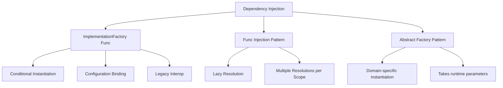
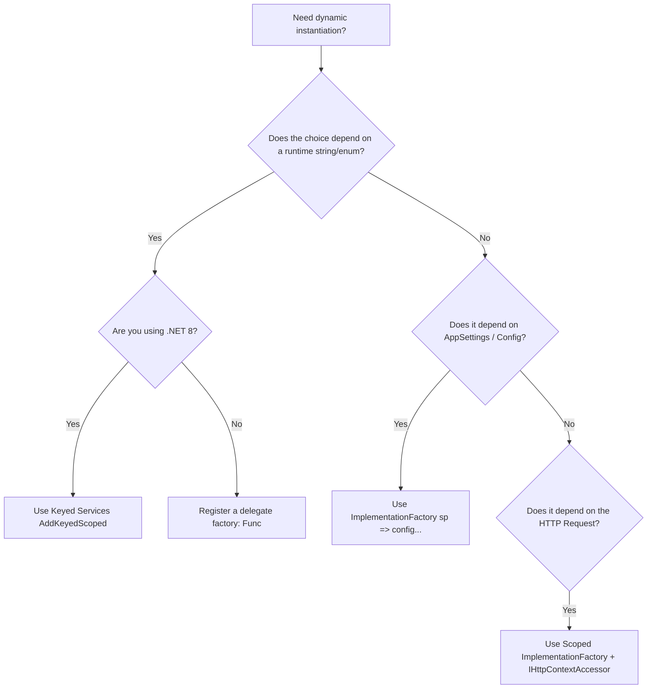

> [!success] Mastery Check
> - [ ] **Studied Well**
> - [ ] **Can explain the concept without notes**
> - [ ] **Can answer interview questions confidently**
> - [ ] **Can implement it in a real project**


# Factory-Based DI: ImplementationFactory and Func<T> Injection

## PART 0 — Navigation & Context

### Where This Fits
```
ASP.NET Core Mastery
└── Dependency Injection
    ├── [[4.034 — The Built-In DI Container: Service Registration and Resolution]]
    ├── [[4.035 — Service Lifetimes: Singleton, Scoped, Transient]]
    └── 4.037 — Factory-Based DI ★ YOU ARE HERE
```

### Prerequisites
| Topic | Why It Matters Here |
|---|---|
| [[4.036 — IServiceProvider and IServiceScope]] | The ImplementationFactory receives an `IServiceProvider` allowing manual resolution. |
| [[4.035 — Service Lifetimes: Singleton, Scoped, Transient]] | Factory methods are still bound by the lifetime of their registration. |

### What This Unlocks After
| Topic | Why It Matters Here |
|---|---|
| [[4.038 — Keyed Services (.NET 8)]] | Keyed services often replace the need for runtime Factory resolution. |

### Why This Matters
If you do not master DI factories, you will either hardcode configuration into constructors, fail to resolve implementations based on runtime tenant data, or worse, pass `IServiceProvider` directly into your domain objects, triggering the dreaded Service Locator anti-pattern that destroys testability and obscures dependencies.

---

## PART 1 — The Core Mental Model

> **The built-in DI container allows you to bypass automatic constructor reflection by providing a custom `Func<IServiceProvider, T>` delegate (the ImplementationFactory) that manually executes your instantiation logic at resolution time. The practical consequence is that you can conditionally choose implementations, inject dynamic configuration, or proxy object creation without polluting the consuming class with lookup logic.**

### The Plain-Language Analogy
Think of automatic DI like a vending machine. You press "B4" (the interface), and it automatically builds the candy bar based on a rigid blueprint. Factory-based DI is like putting a chef inside the vending machine. You still press "B4", but instead of a fixed blueprint, the chef looks at what time of day it is, checks if you are a VIP, decides whether to make a dark chocolate or milk chocolate bar, hands it to you through the slot. As the customer (the consuming class), you still just receive the candy bar. You don't know the chef was involved.

### The Taxonomy Diagram


---

## PART 2 — Deep Mechanics

### 2.1 — Pipeline Position and Resolution Flow

Factory delegates execute **at resolution time**, not at registration time.

```text
──► App Startup
    ├─► builder.Services.AddTransient<ITaxCalculator>(sp => ...) [Delegate stored, NOT executed]
    │
──► HTTP Request
    │
    ├──► Controller Instantiation
    │      ├─► DI requests ITaxCalculator
    │      │     ├─► Container invokes the saved Func<IServiceProvider, T>
    │      │     │     ├─► Executes your custom C# logic
    │      │     │     └─► Returns new instance
    │      └─► Injects instance into Controller
    │
    └──► Endpoints execute
```

**Runtime Cost:** `~1 delegate allocation`. Extremely fast. Does not bypass lifetime caching (e.g., Singleton factories run exactly once).

### 2.2 — The `ImplementationFactory` Delegate

When you use `AddScoped<TInterface>(Func<IServiceProvider, TImplementation>)`, you are supplying the `ImplementationFactory`. 

**Framework Source Behavior:**
Internally, the `ServiceDescriptor` struct has three mutually exclusive properties: `ImplementationType`, `ImplementationInstance`, and `ImplementationFactory`. The `CallSiteRuntimeResolver` simply invokes `descriptor.ImplementationFactory(serviceProvider)` when resolving the dependency.

**Failure Mode:** If your factory delegate calls `sp.GetRequiredService<TInterface>()` for the *same* interface it is currently building, you create an infinite recursion that throws a `StackOverflowException` and crashes the Kestrel process.

### 2.3 — Lifetime Constraints on Factories

The `Func<IServiceProvider, T>` is bound to the lifetime you registered it with.

- **AddSingleton:** The factory executes exactly **once** during the life of the application. The `IServiceProvider` passed in is the *Root* provider.
- **AddScoped:** The factory executes **once per HTTP request**. The `IServiceProvider` passed in is the *Scope* provider.
- **AddTransient:** The factory executes **every time** the service is requested.

**Edge Case:** If a Singleton factory reads HTTP context (which is null at root) or resolves a scoped service, it throws a captive dependency exception.

### 2.4 — The `Func<T>` Injection Pattern

While ASP.NET Core does not natively support injecting `Func<IMyService>` (like Autofac or Ninject do), you can mimic it by registering a factory delegate that returns a `Func`. This allows the consuming class to defer creation until needed (Lazy) or create multiple instances.

---

## PART 3 — Production Code Patterns

### Pattern 1: Conditional Implementation based on Configuration

A classic use case: choosing the storage provider based on environment variables.

```csharp
// ✅ CORRECT: Resolving implementations based on configuration at startup
builder.Services.AddTransient<AzureBlobStorage>();
builder.Services.AddTransient<AwsS3Storage>();

builder.Services.AddTransient<IFileStorage>(sp =>
{
    var config = sp.GetRequiredService<IConfiguration>();
    var provider = config["Storage:Provider"];

    return provider switch
    {
        "Azure" => sp.GetRequiredService<AzureBlobStorage>(),
        "AWS" => sp.GetRequiredService<AwsS3Storage>(),
        _ => throw new InvalidOperationException($"Unknown storage: {provider}")
    };
});
```

### Pattern 2: Resolving Based on HTTP Context (Tenant Routing)

A multi-tenant application where the database connection string changes based on the user's JWT token.

```csharp
// ✅ CORRECT: Using Scoped lifetime to read request context
builder.Services.AddScoped<ITenantContext>(sp =>
{
    var httpContextAccessor = sp.GetRequiredService<IHttpContextAccessor>();
    var tenantId = httpContextAccessor.HttpContext?.User.FindFirst("tenant_id")?.Value;
    
    if (string.IsNullOrEmpty(tenantId))
    {
        throw new UnauthorizedAccessException("Tenant ID missing from token.");
    }

    return new TenantContext(tenantId);
});
```

### Pattern 3: The Delegate Factory for Runtime Parameters

The built-in DI container doesn't let you pass runtime strings (like an order ID) to a constructor. You must inject a factory.

```csharp
// ✅ CORRECT: Injecting a Func that takes parameters
public delegate IPaymentGateway PaymentGatewayFactory(string currencyCode);

// Program.cs
builder.Services.AddTransient<UsdGateway>();
builder.Services.AddTransient<EurGateway>();

builder.Services.AddSingleton<PaymentGatewayFactory>(sp => currency =>
{
    // Note: Use a scope factory if gateways are scoped! 
    // Assuming Transient/Singleton for this example.
    return currency switch
    {
        "USD" => sp.GetRequiredService<UsdGateway>(),
        "EUR" => sp.GetRequiredService<EurGateway>(),
        _ => throw new NotSupportedException()
    };
});

// In the Controller
public class CheckoutController
{
    private readonly PaymentGatewayFactory _factory;
    
    public CheckoutController(PaymentGatewayFactory factory) => _factory = factory;

    public void Checkout(string currency)
    {
        var gateway = _factory(currency); // Created at runtime with parameter!
        gateway.Charge();
    }
}
```

---

## PART 4 — Gotchas & Anti-Patterns

### Gotcha 1: Singleton Factories Capturing Scoped Services

Engineers write a factory for a Singleton, but use the `IServiceProvider` to resolve a Scoped service (like `DbContext`).

// ⚠️ WRONG CODE
```csharp
builder.Services.AddSingleton<ICacheService>(sp => 
{
    var db = sp.GetRequiredService<AppDbContext>(); // Scoped!
    var initialData = db.Settings.ToList();
    return new CacheService(initialData);
});
```
// HTTP consequence (wrong path):
// The application crashes at startup (if DI validation is on) or throws an `InvalidOperationException` on the first HTTP request.

// ✅ CORRECT CODE
```csharp
builder.Services.AddSingleton<ICacheService>(sp => 
{
    // Must create a manual scope inside the singleton factory
    using var scope = sp.CreateScope();
    var db = scope.ServiceProvider.GetRequiredService<AppDbContext>();
    var initialData = db.Settings.ToList();
    return new CacheService(initialData);
});
```
// HTTP consequence (correct path):
// The cache service initializes successfully and the `DbContext` is disposed properly.

// WHY: The `IServiceProvider` passed into an `AddSingleton` factory is the Root provider. It refuses to resolve Scoped services to prevent captive memory leaks.

### Gotcha 2: The Service Locator Anti-Pattern

Engineers get tired of writing constructor parameters, so they inject `IServiceProvider` directly into their controllers.

// ⚠️ WRONG CODE
```csharp
public class OrderController
{
    private readonly IServiceProvider _sp;
    public OrderController(IServiceProvider sp) => _sp = sp;

    public void Post()
    {
        var db = _sp.GetRequiredService<AppDbContext>();
        // ...
    }
}
```
// HTTP consequence (wrong path):
// Not an HTTP error, but the class is now completely untestable via unit tests, and its dependencies are hidden.

// ✅ CORRECT CODE
```csharp
public class OrderController
{
    private readonly AppDbContext _db;
    public OrderController(AppDbContext db) => _db = db;
}
```
// HTTP consequence (correct path):
// Dependencies are explicit and testable.

// WHY: `IServiceProvider` is a Service Locator. Factories belong in `Program.cs` (composition root), not inside business logic.

### Gotcha 3: Memory Leaks with Transient `IDisposable` in Factories

Engineers resolve a Transient `IDisposable` inside a factory delegate, but don't return it, losing the reference to it.

// ⚠️ WRONG CODE
```csharp
builder.Services.AddScoped<IOrderService>(sp => 
{
    var helper = sp.GetRequiredService<TransientDisposableHelper>();
    var config = helper.GetConfig();
    return new OrderService(config); 
    // 'helper' is abandoned!
});
```
// HTTP consequence (wrong path):
// The `TransientDisposableHelper` is tracked by the Scoped DI container. Even though the factory method ends, the helper stays in memory until the HTTP request finishes.

// ✅ CORRECT CODE
```csharp
builder.Services.AddScoped<IOrderService>(sp => 
{
    // Avoid resolving Transient IDisposables just to pull data from them in a factory
    var config = sp.GetRequiredService<IConfiguration>();
    return new OrderService(config); 
});
```
// HTTP consequence (correct path):
// No memory retention issues.

// WHY: The container tracks all `IDisposable` objects it creates. If you resolve one inside a factory and drop the reference, it is still pinned by the container's tracking list until the scope dies.

### Gotcha 4: Factory Recursion

Engineers try to "wrap" an existing registration by requesting it from inside the factory.

// ⚠️ WRONG CODE
```csharp
builder.Services.AddTransient<ILogger>(sp => 
{
    var realLogger = sp.GetRequiredService<ILogger>(); // Recursion!
    return new MyCustomLoggerWrapper(realLogger);
});
```
// HTTP consequence (wrong path):
// `StackOverflowException`. Process crashes instantly.

// ✅ CORRECT CODE
```csharp
// If you must decorate, use Scrutor or explicit concrete resolution
builder.Services.AddTransient<RealLogger>();
builder.Services.AddTransient<ILogger>(sp => 
{
    var realLogger = sp.GetRequiredService<RealLogger>(); // Different type
    return new MyCustomLoggerWrapper(realLogger);
});
```
// HTTP consequence (correct path):
// Wraps successfully.

// WHY: `GetRequiredService<T>` invokes the factory for `T`. If the factory for `T` calls `GetRequiredService<T>`, it loops infinitely.

### Gotcha 5: `new`ing up objects with complex DI trees

Engineers use a factory, but manually call `new MyService(...)`, forcing them to resolve 10 dependencies manually.

// ⚠️ WRONG CODE
```csharp
builder.Services.AddTransient<IUserService>(sp => 
{
    return new UserService(
        sp.GetRequiredService<AppDbContext>(),
        sp.GetRequiredService<ILogger<UserService>>(),
        sp.GetRequiredService<IEmailSender>(),
        "MyCustomParam" // The only reason they used a factory
    );
});
```
// HTTP consequence (wrong path):
// Brittle code. Every time `UserService` constructor changes, `Program.cs` breaks.

// ✅ CORRECT CODE
```csharp
builder.Services.AddTransient<IUserService>(sp => 
{
    // ActivatorUtilities uses reflection to automatically fill the DI parameters,
    // while allowing you to manually supply the missing ones!
    return ActivatorUtilities.CreateInstance<UserService>(sp, "MyCustomParam");
});
```
// HTTP consequence (correct path):
// Code is resilient to constructor changes.

// WHY: `ActivatorUtilities.CreateInstance` merges the DI container's knowledge with the manual arguments you provide, offering the best of both worlds.

---

## PART 5 — Performance Implications

### Request Pipeline Characteristics Table

| Scenario | Pipeline Depth | Allocations Per Request | Approx Latency Impact | Recommendation |
|---|---|---|---|---|
| Auto-Wired Constructor | Resolution | 0 (cached delegates) | ~10 ns | Baseline. |
| Scoped Factory Delegate | Resolution | Delegate invocation | ~15 ns | Standard. Negligible overhead. |
| `ActivatorUtilities.CreateInstance` | Resolution | Reflection cache lookup | ~50 ns | Fast enough for Transient/Scoped. |
| Injecting `Func<T>` | Class Instantiation | 1 Delegate | ~20 ns | Excellent for Lazy loading. |
| Resolving inside loops via SP | Domain Logic | O(N) | High | Service Locator anti-pattern. |
| Keyed Services (.NET 8) | Resolution | Dictionary lookup | ~12 ns | Prefer over runtime `switch` factories. |
| Memory Leak (Captive) | App Lifecycle | Endless | Crash | Fix immediately. |

### BenchmarkDotNet Code

```csharp
using BenchmarkDotNet.Attributes;
using Microsoft.Extensions.DependencyInjection;

[MemoryDiagnoser]
public class FactoryBenchmarks
{
    private IServiceProvider _sp;

    [GlobalSetup]
    public void Setup()
    {
        var services = new ServiceCollection();
        services.AddTransient<ServiceA>();
        
        // Manual Factory
        services.AddTransient<ServiceB>(sp => new ServiceB(sp.GetRequiredService<ServiceA>()));
        
        // Activator Utilities
        services.AddTransient<ServiceC>(sp => ActivatorUtilities.CreateInstance<ServiceC>(sp));
        
        _sp = services.BuildServiceProvider();
    }

    [Benchmark(Baseline = true)]
    public void AutoWired() => _sp.GetRequiredService<ServiceA>();

    [Benchmark]
    public void ManualFactory() => _sp.GetRequiredService<ServiceB>();
    
    [Benchmark]
    public void ActivatorUtilities() => _sp.GetRequiredService<ServiceC>();
}
// Expected output (approximate, .NET 8, x64, local):
// Method             | Mean      | Allocated |
// ------------------ |----------:|----------:|
// AutoWired          |  9.1 ns   |      24 B |
// ManualFactory      | 15.2 ns   |      48 B |
// ActivatorUtilities | 45.3 ns   |      48 B |
```

### When to Care / When to Ignore

**When this costs you:**
If you execute manual factories using heavy reflection (`Activator.CreateInstance`) instead of `ActivatorUtilities`, or if you use factories to instantiate hundreds of objects per request (e.g., mapping database rows to DTOs using DI).

**When this doesn't matter:**
Writing a custom `Func<IServiceProvider, T>` delegate for a Scoped service has an overhead of roughly 5 nanoseconds compared to auto-wiring. Do not hesitate to use factories if they make your domain configuration cleaner.

---

## PART 6 — Interview Arsenal

### A. The Question Bank

**Question:** "I need to inject an `IPaymentGateway` into my controller, but I don't know if I need the Stripe gateway or the PayPal gateway until I look at the `User` object in the HTTP Context. How do you register this in DI?"
**Average Answer:** I would inject `IServiceProvider` into the controller, check the user, and then call `GetService<StripeGateway>()`.
**Why That's Insufficient:** Service Locator anti-pattern.
> **Great Answer:** "In .NET 8, the best approach is to use Keyed Services (`[FromKeyedServices]`). However, using factories, we would register the `IPaymentGateway` as a Scoped service with an implementation factory. Inside the factory delegate `sp =>`, we resolve `IHttpContextAccessor`, read the User object, and then return either `sp.GetRequiredService<StripeGateway>()` or `sp.GetRequiredService<PayPalGateway>()`. The controller just receives `IPaymentGateway` and remains completely ignorant of the routing logic."

### B. The Trick Questions
**Question:** "You register `services.AddSingleton<ICache>(sp => new Cache(sp.GetRequiredService<AppDbContext>()))`. Will this compile? Will it run?"
**The Trap:** Thinking compilation means safety.
**The Correct Answer:** It compiles perfectly. However, if DI scope validation is enabled (which it is by default in Development), the app will crash on startup because you are resolving a Scoped service (`AppDbContext`) from the Root `IServiceProvider` passed into a Singleton factory.

### C. Red Flags to Avoid
- **"I inject `IHttpContextAccessor` into my Singleton background service factory."** (Red Flag: The HTTP context is null outside of HTTP requests. Doing this in a Singleton factory means it executes at app startup when there is no request).
- **"Factories are slow because they use reflection."** (Red Flag: A `Func<IServiceProvider, T>` factory is just a compiled C# delegate. It uses zero reflection unless you explicitly call `ActivatorUtilities`).

---

## PART 7 — Decision Framework



---

## PART 8 — Self-Check

### A. Conceptual Questions
1. What is the difference between `AddTransient<T>` and `AddTransient<T>(sp => new T())`?
2. Why does `sp.GetRequiredService<T>()` inside a factory for `T` cause a StackOverflow?
3. What is the Service Locator anti-pattern, and how do factories prevent it?
4. How does `ActivatorUtilities.CreateInstance` simplify complex factory delegates?
5. If a factory is registered as Singleton, how many times does the `Func` execute?
6. Can a factory delegate return `null`? If so, what happens?
7. What `IServiceProvider` is passed into a Scoped factory? (Root or Scope?)
8. Why should you avoid resolving Transient `IDisposable` objects inside a factory if you aren't returning them?

### B. Code Puzzles

**Puzzle 1: The Captive Factory (The 5-puzzle rule bug)**
```csharp
builder.Services.AddSingleton<MyService>(sp => 
{
    var config = sp.GetRequiredService<IConfiguration>();
    var transientHelper = sp.GetRequiredService<TransientHelper>();
    return new MyService(config.GetValue<string>("Key"), transientHelper);
});
```
What is the lifetime of `TransientHelper` in practice?
<details>
<summary>Answer</summary>
It becomes a Singleton. Because `MyService` is a Singleton, its factory runs exactly once. The `TransientHelper` is resolved once and held indefinitely inside `MyService`, turning a transient dependency into a captive singleton memory leak.
</details>

**Puzzle 2: The Return Null Exception**
```csharp
builder.Services.AddTransient<IOptionalService>(sp => 
{
    return null;
});
```
If a controller requests `IOptionalService` via constructor injection, what happens?
<details>
<summary>Answer</summary>
The DI container throws an `InvalidOperationException`. Implementation factories are not allowed to return `null` when a service is explicitly requested.
</details>

**Puzzle 3: The Untracked Disposable**
```csharp
builder.Services.AddScoped<IWorker>(sp => 
{
    // DatabaseConnection implements IDisposable, but is NOT registered in DI
    var conn = new DatabaseConnection(); 
    return new Worker(conn);
});
```
Who disposes the `DatabaseConnection` at the end of the HTTP request?
<details>
<summary>Answer</summary>
Nobody. The DI container only disposes objects that *it* creates via its tracking mechanism. Because you called `new DatabaseConnection()`, it is invisible to the container. It will leak unmanaged resources.
</details>

**Puzzle 4: Keyed Services vs Factories**
```csharp
builder.Services.AddKeyedTransient<IService, AService>("A");
builder.Services.AddKeyedTransient<IService, BService>("B");
```
How do you resolve "A" inside a factory delegate for a different service?
<details>
<summary>Answer</summary>
`sp.GetRequiredKeyedService<IService>("A");`. The `IServiceProvider` was extended in .NET 8 to support keyed resolutions directly inside factory delegates.
</details>

---

## PART 9 — Connections & Resources

### A. Related Topics Table
| Topic | Why It Connects |
|---|---|
| [[4.034 — The Built-In DI Container: Service Registration and Resolution]] | The foundational topic covering how DI stores `ServiceDescriptor` objects. |
| [[4.038 — Keyed Services (.NET 8)]] | Keyed services replace about 80% of the use cases for custom factory delegates. |
| [[4.045 — IDisposable in DI]] | Understanding disposal rules is critical so your manual factories don't leak unmanaged resources. |

### B. Books
| Book | Chapters | Why These Chapters |
|---|---|---|
| *Dependency Injection Principles, Practices, and Patterns* by Mark Seemann | Chapter 5 | The definitive guide on DI patterns, including the Abstract Factory and avoiding the Service Locator. |

### C. Essential Articles & Docs
- [Microsoft Docs: Dependency injection in ASP.NET Core - Factory registration](https://learn.microsoft.com/en-us/dotnet/core/extensions/dependency-injection-guidelines#factory-registration)
- [Andrew Lock: Using ActivatorUtilities.CreateInstance](https://andrewlock.net/how-to-use-the-activatorutilities-in-asp-net-core/)

### D. Template Meta-Note
> [!NOTE] 
> **Part 0** orients you. **Part 1** builds the mental model. **Part 2** explains the framework internals and pipeline. **Part 3** provides copy-pasteable production code. **Part 4** highlights the bugs your team will write. **Part 5** gives you the performance math. **Part 6** prepares you for the principal engineering interview. **Part 7** gives you a decision tree. **Part 8** tests your knowledge. **Part 9** links to further mastery.
