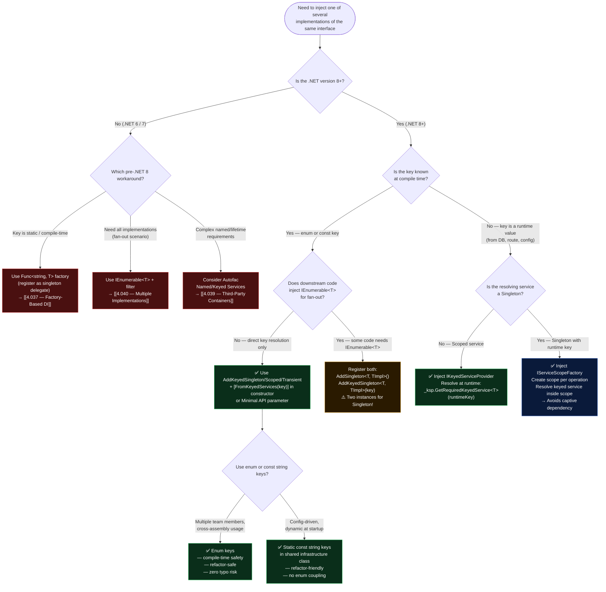

> [!success] Mastery Check
> - [ ] **Studied Well**
> - [ ] **Can explain the concept without notes**
> - [ ] **Can answer interview questions confidently**
> - [ ] **Can implement it in a real project**


# 4.038 — Keyed Services (.NET 8): Named Resolution Without Hacks

---

## PART 0 — Navigation & Context

### Where This Topic Sits in the ASP.NET Core Domain Hierarchy

```
ASP.NET Core Mastery
│
├── Host & Lifecycle
├── Configuration
├── Logging
├── DI  ◄── YOU ARE HERE
│   ├── 4.034 — Built-In Container: Registration & Resolution
│   ├── 4.035 — Service Lifetimes: Singleton, Scoped, Transient
│   ├── 4.036 — Constructor Injection & Service Locator Anti-Pattern
│   ├── 4.037 — Factory-Based DI: ImplementationFactory and Func<T>
│   ├── 4.038 — Keyed Services: Named Resolution Without Hacks  ◄◄◄
│   ├── 4.039 — Third-Party Containers: Autofac, Scrutor Integration
│   ├── 4.040 — Multiple Implementations: IEnumerable<T> Registration
│   └── 4.044 — Decorators in the Built-In Container: The Scrutor Pattern
│
├── Middleware
├── Routing
├── Minimal APIs / MVC
├── Auth
├── Validation
└── ...
```

### What You Need Before This

1. **[[4.034 — The Built-In DI Container: Service Registration and Resolution]]** — You must understand `AddSingleton`, `AddScoped`, `AddTransient`, `IServiceProvider`, and `GetRequiredService<T>()` before keyed services make sense. Keyed services extend (not replace) the basic registration model.
2. **[[4.035 — Service Lifetimes: Singleton, Scoped, Transient]]** — Keyed services participate in exactly the same lifetime semantics. A misunderstanding of scoped lifetimes will produce the same captive-dependency bugs in keyed registrations.
3. **[[4.037 — Factory-Based DI: ImplementationFactory and Func<T>]]** — The factory pattern was the dominant pre-.NET 8 workaround for named resolution. Knowing why factories fell short contextualizes what keyed services actually solve at the framework level.

### What This Unlocks After

1. **[[4.040 — Multiple Implementations: IEnumerable<T> Registration]]** — After keyed services, you can contrast when `IEnumerable<T>` is still the right tool (fan-out to all implementations) versus when keyed resolution is correct (select one specific implementation by name).
2. **[[4.044 — Decorators in the Built-In Container: The Scrutor Pattern]]** — Decorating keyed services requires explicit keyed-aware registration. Understanding both systems is necessary for complex DI topologies.
3. **[[4.039 — Third-Party Containers: Autofac Integration]]** — Named/keyed services were a major reason teams reached for Autofac. After .NET 8, the calculus changes — keyed services cover most real-world use cases without a third-party container.

### Why This Topic Matters at Production Scale

Before .NET 8, resolving one of several concrete implementations of the same interface by a runtime discriminator (payment gateway name, storage backend key, notification channel) forced teams to inject `Func<string, IPaymentGateway>` factory delegates or filter `IEnumerable<IPaymentGateway>` by a marker property — both patterns leak domain logic into infrastructure, produce untestable coupling, and are invisible to the DI container's validation machinery. Keyed services are a first-class, container-validated, lifetime-safe primitive that eliminates this entire class of workaround.

---

## PART 1 — The Core Mental Model

### The Fundamental Rule

> **In .NET 8+, the built-in ASP.NET Core DI container supports keyed service registration: each implementation of an interface is associated with an `object` key at registration time, and can be resolved exactly by that key at injection time — with full container validation, all three lifetimes, and zero factory boilerplate. The practical consequence is that a payment API can register `StripeGateway` under `"stripe"` and `PayPalGateway` under `"paypal"`, then inject exactly the right one into each endpoint using `[FromKeyedServices("stripe")]`, without a service-locator factory or `IEnumerable<T>` filtering.**

### The Plain-Language Analogy

Think of a hotel key card system. The hotel has many identical-looking doors, but each key card is cut for exactly one room. The DI container is the key desk: when you check in (register), you tell the desk which room number (key) your card (implementation) opens. When you need access, you present your key (`[FromKeyedServices("redis")]`) and the desk hands you precisely that card without you having to try every door. The old system — before .NET 8 — was like being handed the full ring of all room keys and told to try each one until the lock (`Where(s => s.Tag == "redis")`) clicks. The new system (keyed services) performs the key-to-room mapping at build time so that the validity of every key is known before the first guest (request) arrives. If a key has no matching room (unregistered key), the container throws at startup, not at 3 a.m. when the first production request hits. This analogy survives the hard questions: if you inject the full ring (`IEnumerable<ICacheService>`), you still get all implementations — keyed services don't hide implementations, they just give you a direct route to each one. And if the same room number is registered twice (duplicate key), the last registration wins, exactly like duplicate `AddSingleton` registrations.

### The Taxonomy Diagram

```mermaid
graph TD
    subgraph PRE_NET8["Pre-.NET 8 Workarounds (Hacks)"]
        FUNC["Func&lt;string, IPaymentGateway&gt;<br/>factory delegate<br/>(manual dictionary)"]
        IENUM["IEnumerable&lt;IPaymentGateway&gt;<br/>+ manual .Where(g => g.Name == key)<br/>(runtime filtering)"]
        AUTOFAC["Third-party: Autofac<br/>Named/Keyed Registration<br/>(container swap)"]
    end

    subgraph NET8["✅ .NET 8+ Built-In: Keyed Services"]
        direction TB
        REG["Registration<br/>AddKeyedSingleton / AddKeyedScoped / AddKeyedTransient"]
        KEY_TYPE["Key Type: object<br/>string | enum | int | Guid"]
        RESOLVE["Resolution Paths"]
        REG --> KEY_TYPE
        REG --> RESOLVE

        subgraph RESOLVE_PATHS["Resolution Paths"]
            ATTR["[FromKeyedServices(key)]<br/>Constructor / Parameter Injection"]
            MANUAL["IKeyedServiceProvider<br/>.GetRequiredKeyedService&lt;T&gt;(key)"]
            MINAPI["Minimal API Parameter<br/>[FromKeyedServices] endpoint binding"]
            DESC["ServiceDescriptor<br/>.KeyedSingleton / .KeyedScoped / .KeyedTransient"]
        end
    end

    subgraph LIFETIMES["Supported Lifetimes"]
        SING["Singleton<br/>AddKeyedSingleton"]
        SCOP["Scoped<br/>AddKeyedScoped"]
        TRAN["Transient<br/>AddKeyedTransient"]
    end

    subgraph LIMITS["Limitations (Know These!)"]
        NO_IENUM["IEnumerable&lt;T&gt; injection<br/>does NOT include keyed registrations"]
        NO_ISPROV["IServiceProvider.GetService&lt;T&gt;<br/>does NOT support keyed resolution"]
        IKEYED["Must cast to IKeyedServiceProvider<br/>or use [FromKeyedServices]"]
    end

    subgraph USE_CASES["Production Use Cases"]
        PAY["Payment Gateways<br/>stripe | paypal | adyen"]
        CACHE["Cache Backends<br/>redis | memory | distributed"]
        STORE["Storage Backends<br/>s3 | azure-blob | local"]
        NOTIFY["Notification Channels<br/>email | sms | push"]
    end

    NET8 --> LIFETIMES
    NET8 --> LIMITS
    NET8 --> USE_CASES
    PRE_NET8 -.->|"replaced by"| NET8

    style PRE_NET8 fill:#4a1010,stroke:#cc3333
    style NET8 fill:#0a2e1a,stroke:#33cc66
    style LIFETIMES fill:#0a1a3a,stroke:#3366cc
    style LIMITS fill:#2a1a00,stroke:#cc8800
    style USE_CASES fill:#1a0a2e,stroke:#9933cc
```



---

## PART 2 — Deep Mechanics

### 2.1 — The Registration Internals: What `AddKeyedSingleton` Does Under the Hood

**Pipeline Position:**

```
Program.cs (startup)
│
├── builder.Services.AddKeyedSingleton<ICacheService, RedisCacheService>("redis")
│   └── Creates ServiceDescriptor { ServiceType=ICacheService, ServiceKey="redis",
│                                   ImplementationType=RedisCacheService, Lifetime=Singleton }
│
├── builder.Services.AddKeyedSingleton<ICacheService, MemoryCacheService>("memory")
│   └── Creates ServiceDescriptor { ServiceType=ICacheService, ServiceKey="memory",
│                                   ImplementationType=MemoryCacheService, Lifetime=Singleton }
│
└── builder.Build()
    └── ServiceProvider validates all keyed descriptors
        ├── Checks: ImplementationType resolvable? Dependencies available?
        └── Throws InvalidOperationException at startup if validation fails
        
        (No keyed service validation at first request — validated at container build time)
```

**Framework Source Behavior — approximate internal path:**

```csharp
// ASP.NET Core internally (approximate) — ServiceExtensions.cs:
public static IServiceCollection AddKeyedSingleton<TService, TImplementation>(
    this IServiceCollection services,
    object? serviceKey)
    where TService : class
    where TImplementation : class, TService
{
    // Creates a ServiceDescriptor with a non-null ServiceKey
    // This is the ONLY difference from AddSingleton at the descriptor level
    var descriptor = ServiceDescriptor.KeyedSingleton<TService, TImplementation>(serviceKey);
    services.Add(descriptor);
    return services;
}

// ServiceDescriptor (approximate):
public sealed class ServiceDescriptor
{
    // .NET 8 — new property:
    public object? ServiceKey { get; }   // null for non-keyed, "redis" for keyed
    public bool IsKeyedService => ServiceKey is not null;
    
    // Existing properties unchanged:
    public Type ServiceType { get; }
    public ServiceLifetime Lifetime { get; }
    public Type? ImplementationType { get; }
    public Func<IServiceProvider, object?>? ImplementationFactory { get; }
    public object? ImplementationInstance { get; }
}
```

**The key insight:** A keyed service descriptor is identical to a non-keyed descriptor except for the `ServiceKey` property. The built-in `ServiceProvider` maintains two lookup dictionaries: one for `ServiceType → descriptors` (non-keyed) and one for `(ServiceType, ServiceKey) → descriptors` (keyed). This is why `IServiceProvider.GetService<ICacheService>()` returns null for keyed-only registrations — the non-keyed dictionary has no entry for it.

**Cost Label:** `~2 dictionary entries per keyed registration` at startup; `~1 dictionary lookup + 1 activation per resolution` at runtime (same cost as non-keyed singleton/scoped/transient).

---

### 2.2 — `IKeyedServiceProvider`: The Extended Interface You Must Know

**The Problem with `IServiceProvider`:**

```
HTTP Request arrives
│
└── DI Resolution attempt:
    IServiceProvider.GetService<ICacheService>()
    │
    └── ServiceProvider checks NON-KEYED dictionary
        ├── Key: typeof(ICacheService)
        └── Result: null (ICacheService was only registered with keys)
        
    // HTTP consequence: NullReferenceException in service code, or
    // InvalidOperationException: "No service of type ICacheService registered"
    // 500 Internal Server Error returned to client
```

**`IKeyedServiceProvider` — the correct interface:**

```csharp
// ASP.NET Core internally (approximate) — IKeyedServiceProvider.cs:
public interface IKeyedServiceProvider : IServiceProvider
{
    // The ONLY addition in .NET 8:
    object? GetKeyedService(Type serviceType, object? serviceKey);
}

// Extension methods built on this interface:
public static class ServiceProviderKeyedServiceExtensions
{
    public static T? GetKeyedService<T>(
        this IKeyedServiceProvider provider, object? serviceKey)
        => (T?)provider.GetKeyedService(typeof(T), serviceKey);
    
    public static T GetRequiredKeyedService<T>(
        this IKeyedServiceProvider provider, object? serviceKey)
    {
        var service = provider.GetKeyedService<T>(serviceKey);
        if (service is null)
            throw new InvalidOperationException(
                $"No service of type '{typeof(T)}' with key '{serviceKey}' registered.");
        return service;
    }
}
```

**Pipeline position for manual keyed resolution inside a service:**

```
HTTP Request
    │
    ▼
Routing → Auth → [YourEndpoint Handler]
                        │
                        └── Injected: IKeyedServiceProvider _ksp
                            (cast from IServiceProvider, which is IKeyedServiceProvider at runtime)
                            │
                            └── _ksp.GetRequiredKeyedService<IPaymentGateway>("stripe")
                                │
                                └── Scoped ServiceProvider: looks up (IPaymentGateway, "stripe")
                                    ├── Found → activate/return StripeGateway instance
                                    └── Not found → InvalidOperationException → 500
```

**HTTP Wire Consequence of Missing Key:**

```http
// HTTP request (approximate):
POST /api/payments/charge HTTP/1.1
X-Payment-Gateway: stripe
Content-Type: application/json

{"amount": 5000, "currency": "USD"}

// HTTP response when key "stripe" is not registered:
HTTP/1.1 500 Internal Server Error
Content-Type: application/problem+json

{
  "type": "https://tools.ietf.org/html/rfc7807",
  "title": "An error occurred while processing your request.",
  "status": 500,
  "detail": "No service of type 'IPaymentGateway' with key 'stripe' registered."
}
```

**Cost Label:** `~1 dictionary lookup per keyed resolution` — O(1) by `(Type, object)` composite key using `ServiceCacheKey` struct internally.

---

### 2.3 — `[FromKeyedServices]`: Constructor Injection and Minimal API Binding

**Constructor Injection (most common pattern):**

```csharp
// ASP.NET Core internally — when activating OrderProcessingService:
// 1. ConstructorInfo is reflected (cached after first activation)
// 2. Parameters are iterated
// 3. For parameters with [FromKeyedServices(key)] attribute:
//    → Calls IKeyedServiceProvider.GetKeyedService(parameterType, key)
// 4. For parameters without the attribute:
//    → Calls IServiceProvider.GetService(parameterType) (non-keyed lookup)
// Cost: ~1 reflection cache hit + 1 keyed dictionary lookup per keyed parameter
```

**Pipeline position for `[FromKeyedServices]` in constructor:**

```
Request arrives
    │
    ▼
Routing → Auth → DI Activation of Request Handler
                        │
                        ├── Scan constructor parameters
                        │   ├── [FromKeyedServices("redis")] ICacheService cache
                        │   │   └── → GetKeyedService(ICacheService, "redis")
                        │   └── IOrderRepository repo
                        │       └── → GetService(IOrderRepository)  [non-keyed]
                        │
                        └── Handler executes → Response
```

**Minimal API endpoint parameter binding (.NET 8+):**

```csharp
// [FromKeyedServices] works in Minimal API lambda parameters:
app.MapPost("/api/orders/{orderId}/fulfill", async (
    [FromKeyedServices("azure-blob")] IStorageService storage,
    [FromKeyedServices("email")] INotificationService emailNotifier,
    [FromRoute] Guid orderId,
    OrderFulfillmentCommand command,
    CancellationToken ct) =>
{
    // Both storage and emailNotifier resolved by key from the keyed service registry
    // orderId and command resolved by normal route/body binding
    await storage.ArchiveOrderDocumentsAsync(orderId, ct);
    await emailNotifier.SendFulfillmentConfirmationAsync(orderId, ct);
    return Results.NoContent();
});
```

**HTTP Wire Format for the above:**

```http
// HTTP request (approximate):
POST /api/orders/f3a2b1c0-1234-5678-abcd-000000000001/fulfill HTTP/1.1
Authorization: Bearer eyJhbGci...
Content-Type: application/json

{"warehouseId": "WH-42", "priority": "standard"}

// HTTP response (success):
HTTP/1.1 204 No Content

// HTTP response if "azure-blob" key not registered:
HTTP/1.1 500 Internal Server Error
// (thrown during endpoint parameter binding, before handler body executes)
```

**Cost Label:** `~1 attribute reflection per parameter (cached after first call)` + `~1 keyed dictionary lookup per `[FromKeyedServices]` parameter` — negligible for production workloads.

---

### 2.4 — Key Types: `object` Keys, Enum Keys, and Type Safety

**The full key type contract:**

```csharp
// ASP.NET Core internally — ServiceCacheKey struct:
internal readonly struct ServiceCacheKey : IEquatable<ServiceCacheKey>
{
    public readonly Type Type;
    public readonly object? ServiceKey;
    
    // Equality uses Type.Equals + object.Equals(ServiceKey)
    // → ServiceKey comparison uses standard .Equals() / GetHashCode()
    // → Enum keys work because Enum.Equals() compares underlying value
    // → String keys use string interning semantics (reference or value equality)
    // → int keys use int.Equals()
}
```

**String keys (most common, but riskiest):**

```csharp
// String keys are compared by VALUE (string.Equals), not reference
// BUT: typos are undetected until runtime!
services.AddKeyedSingleton<ICacheService, RedisCacheService>("redis");

// Later:
provider.GetRequiredKeyedService<ICacheService>("Redis"); // ← capital R → throws at runtime!
// → InvalidOperationException: No service for key 'Redis'
// → HTTP 500 at the moment the first request hits this path
```

**Enum keys (production-recommended for type safety):**

```csharp
// Enum keys: typos are caught at compile time ✅
public enum CacheBackend { Redis, Memory, Distributed }

services.AddKeyedSingleton<ICacheService, RedisCacheService>(CacheBackend.Redis);
services.AddKeyedSingleton<ICacheService, MemoryCacheService>(CacheBackend.Memory);

// Injection:
public OrderCacheService(
    [FromKeyedServices(CacheBackend.Redis)] ICacheService hotCache,
    [FromKeyedServices(CacheBackend.Memory)] ICacheService warmCache)
{ ... }
// → Compiler verifies CacheBackend.Redis is a valid enum member
// → No runtime key typo possible
```

**Static class keys (another production pattern):**

```csharp
// For cross-assembly key sharing without enum coupling:
public static class StorageKeys
{
    public const string S3 = "s3";
    public const string AzureBlob = "azure-blob";
    public const string LocalDisk = "local";
}
// All usages reference StorageKeys.S3 — refactor-safe, single definition
```

**Pipeline position diagram for enum key resolution:**

```
DI Registration (startup):
AddKeyedSingleton<ICacheService, RedisCacheService>(CacheBackend.Redis)
    │
    └── ServiceDescriptor { ServiceKey = (int)CacheBackend.Redis = 0,
                            ServiceType = typeof(ICacheService),
                            ImplementationType = typeof(RedisCacheService) }

Runtime resolution:
GetRequiredKeyedService<ICacheService>(CacheBackend.Redis)
    │
    └── ServiceCacheKey { Type = typeof(ICacheService), ServiceKey = (int)0 }
        └── Dictionary lookup → RedisCacheService instance returned
```

**Cost Label:** Enum keys have identical lookup cost to string keys. The `GetHashCode` call on the enum uses the underlying `int.GetHashCode()` — slightly faster than `string.GetHashCode()` on longer strings, but unmeasurable in practice. The real benefit is compile-time safety, not performance.

---

### 2.5 — Lifetime Rules and the Captive Dependency Trap with Keyed Services

**All three lifetimes work with keyed services:**

```
Singleton keyed: AddKeyedSingleton
    ├── Created once per application lifetime
    ├── Shared across all requests and all keys
    └── ⚠️ Cannot depend on scoped/transient services in constructor
         (same captive dependency rule as non-keyed singletons)

Scoped keyed: AddKeyedScoped
    ├── Created once per HTTP request scope
    ├── Different instances across concurrent requests
    └── ✅ Can depend on other scoped services

Transient keyed: AddKeyedTransient
    ├── New instance every time resolved
    └── ⚠️ Expensive if resolved repeatedly in tight loops
```

**The captive dependency trap — now with keyed services:**

```csharp
// ⚠️ WRONG: Singleton keyed service consuming scoped dependency
services.AddKeyedSingleton<IPaymentGateway, StripeGateway>("stripe");

public class StripeGateway : IPaymentGateway
{
    private readonly IHttpContextAccessor _httpContextAccessor; // SCOPED!
    
    // ⚠️ This constructor will throw at runtime (or silently capture the first scope):
    // InvalidOperationException: Cannot consume scoped service 'IHttpContextAccessor'
    // from singleton keyed 'IPaymentGateway' with key 'stripe'.
    public StripeGateway(IHttpContextAccessor httpContextAccessor)
        => _httpContextAccessor = httpContextAccessor;
}

// HTTP consequence: 500 at first resolution attempt during startup validation
// (if ValidateScopes = true, which is default in development)
```

**The correct pattern — keyed factory with scoped resolution:**

```csharp
// ✅ CORRECT: If StripeGateway genuinely needs per-request context,
// register it as Scoped (not Singleton):
services.AddKeyedScoped<IPaymentGateway, StripeGateway>("stripe");

// OR: If it doesn't need per-request state, remove the scoped dependency:
public class StripeGateway : IPaymentGateway
{
    private readonly StripeClient _client; // Singleton-safe
    
    public StripeGateway(IOptions<StripeOptions> options)
        => _client = new StripeClient(options.Value.ApiKey);
}
```

**Pipeline position for scope validation:**

```
builder.Build()
    │
    └── ServiceProvider.ValidateScopes = true (Development default)
        │
        └── Validates: for each singleton descriptor, recursively verify
            no scoped descriptor in its dependency graph
            │
            ├── ✅ AddKeyedSingleton<IGateway, StripeGateway>("stripe")
            │   └── StripeGateway depends only on IOptions<T> (singleton-safe) → OK
            │
            └── ❌ AddKeyedSingleton<IGateway, StripeGateway>("stripe")
                └── StripeGateway depends on IHttpContextAccessor (scoped) → THROWS
                    InvalidOperationException at startup
```

**Cost Label:** Scope validation runs once at `builder.Build()` — `O(D)` where D = depth of dependency graph. No runtime cost after startup.

---

### 2.6 — The `IEnumerable<T>` Blind Spot: The Most Important Limitation

**Critical limitation that bites production teams:**

```
Non-keyed registration:
services.AddSingleton<ICacheService, RedisCacheService>();
services.AddSingleton<ICacheService, MemoryCacheService>();

IEnumerable<ICacheService> result = provider.GetServices<ICacheService>();
→ Returns: [RedisCacheService, MemoryCacheService]  ✅


Keyed registration:
services.AddKeyedSingleton<ICacheService, RedisCacheService>("redis");
services.AddKeyedSingleton<ICacheService, MemoryCacheService>("memory");

IEnumerable<ICacheService> result = provider.GetServices<ICacheService>();
→ Returns: []  (empty!)  ⚠️ KEYED REGISTRATIONS ARE INVISIBLE TO IEnumerable<T>
```

**Why this matters:**

```csharp
// If a library or framework component injects IEnumerable<ICacheService>
// (e.g., health check providers, composite services, plugin systems),
// they will see ZERO services if you only use keyed registrations.

// This is intentional by design — keyed services are opt-in discriminated resolution.
// The workaround: register BOTH non-keyed AND keyed if you need both patterns:

services.AddSingleton<ICacheService, RedisCacheService>();           // non-keyed (IEnumerable visible)
services.AddKeyedSingleton<ICacheService, RedisCacheService>("redis"); // keyed (direct resolution)
services.AddKeyedSingleton<ICacheService, MemoryCacheService>("memory"); // keyed only
// Note: This creates TWO RedisCacheService singleton instances — be aware!
```

**HTTP consequence of this limitation:**

```http
// Scenario: Health check middleware injects IEnumerable<ICacheService>
// to ping all cache backends. You registered only with AddKeyedSingleton.
//
// GET /health HTTP/1.1
//
// HTTP/1.1 200 OK  ← Deceptively OK! The health check ran with zero backends.
// Content-Type: application/json
// {"status": "Healthy", "checks": {}}
// ← Missing cache health data — silent failure, not an error
```

**Cost Label:** Zero cost — the `IEnumerable<T>` empty result is returned from a pre-built array cached at container build time. No extra work happens. The cost is purely the business cost of missing data.

---

## PART 3 — Production Code Patterns

### Pattern 1: The Payment Gateway Discriminator

**Scenario:** A fintech payment API supports multiple processors (Stripe, PayPal, Adyen). The gateway is chosen per-request based on the merchant's configuration, injected without a service locator.

```csharp
// ⚠️ WRONG: Pre-.NET 8 factory hack
// Registration:
services.AddSingleton<StripeGateway>();
services.AddSingleton<PayPalGateway>();
services.AddSingleton<Func<string, IPaymentGateway>>(provider => key => key switch
{
    "stripe" => provider.GetRequiredService<StripeGateway>(),
    "paypal" => provider.GetRequiredService<PayPalGateway>(),
    _ => throw new ArgumentException($"Unknown gateway: {key}")
    // ⚠️ Problems:
    // 1. Func<string, T> is a service locator anti-pattern — container can't validate it
    // 2. Keys are duplicated between registration and the switch expression
    // 3. Adding a new gateway requires modifying this central factory
    // 4. Testability: to mock "stripe", you must mock the entire Func<>
});

// ✅ CORRECT: .NET 8 keyed services
// Infrastructure/DI/PaymentServiceExtensions.cs

public enum PaymentGatewayKey { Stripe, PayPal, Adyen }

public static class PaymentServiceExtensions
{
    public static IServiceCollection AddPaymentGateways(
        this IServiceCollection services,
        IConfiguration configuration)
    {
        // Each gateway registered with a type-safe enum key
        // Container validates all dependencies at startup
        services.AddKeyedSingleton<IPaymentGateway, StripeGateway>(PaymentGatewayKey.Stripe);
        services.AddKeyedSingleton<IPaymentGateway, PayPalGateway>(PaymentGatewayKey.PayPal);
        services.AddKeyedSingleton<IPaymentGateway, AdyenGateway>(PaymentGatewayKey.Adyen);
        
        // Gateway options configured per-key
        services.Configure<StripeOptions>(configuration.GetSection("Payments:Stripe"));
        services.Configure<PayPalOptions>(configuration.GetSection("Payments:PayPal"));
        services.Configure<AdyenOptions>(configuration.GetSection("Payments:Adyen"));
        
        return services;
    }
}

// Domain/Payments/PaymentProcessingService.cs
// Inject the specific gateway needed for a given merchant context:
public sealed class PaymentProcessingService
{
    private readonly IPaymentGateway _primaryGateway;
    private readonly IPaymentGateway _fallbackGateway;
    private readonly ILogger<PaymentProcessingService> _logger;
    
    // Constructor injection with enum keys — typo-safe at compile time
    public PaymentProcessingService(
        [FromKeyedServices(PaymentGatewayKey.Stripe)] IPaymentGateway primaryGateway,
        [FromKeyedServices(PaymentGatewayKey.PayPal)] IPaymentGateway fallbackGateway,
        ILogger<PaymentProcessingService> logger)
    {
        _primaryGateway = primaryGateway;   // StripeGateway injected
        _fallbackGateway = fallbackGateway; // PayPalGateway injected
        _logger = logger;
    }
    
    public async Task<PaymentResult> ChargeAsync(
        PaymentRequest request, CancellationToken ct)
    {
        try
        {
            return await _primaryGateway.ChargeAsync(request, ct);
        }
        catch (GatewayUnavailableException ex)
        {
            _logger.LogWarning(ex, 
                "Primary gateway unavailable, attempting fallback for order {OrderId}",
                request.OrderId);
            return await _fallbackGateway.ChargeAsync(request, ct);
        }
    }
}
```

```http
// HTTP wire format (correct path):
POST /api/payments/charge HTTP/1.1
Authorization: Bearer eyJhbGci...
Content-Type: application/json

{"orderId": "ORD-99182", "amount": 9999, "currency": "USD", "merchantId": "M-001"}

// HTTP/1.1 200 OK
// Content-Type: application/json
// {"transactionId": "pi_3N2...", "status": "succeeded", "gateway": "stripe"}
```

---

### Pattern 2: The Storage Backend Selector for Order Document Management

**Scenario:** An order management service writes fulfillment documents to different storage backends based on document type and tenant configuration. Keys are constants in a shared infrastructure library.

```csharp
// Infrastructure/Storage/StorageKeys.cs
// Centralized key definitions — prevents string duplication across assemblies
public static class StorageKeys
{
    public const string S3 = "s3";
    public const string AzureBlob = "azure-blob";
    public const string LocalDisk = "local"; // used in development only
}

// Program.cs
builder.Services.AddKeyedSingleton<IDocumentStorage, S3DocumentStorage>(StorageKeys.S3);
builder.Services.AddKeyedSingleton<IDocumentStorage, AzureBlobDocumentStorage>(StorageKeys.AzureBlob);

// Development only — conditional registration
if (builder.Environment.IsDevelopment())
{
    builder.Services.AddKeyedSingleton<IDocumentStorage, LocalDiskDocumentStorage>(
        StorageKeys.LocalDisk);
}

// Endpoints/OrderDocumentsEndpoints.cs — Minimal API with keyed parameter binding
public static class OrderDocumentsEndpoints
{
    public static void MapOrderDocumentRoutes(this IEndpointRouteBuilder app)
    {
        // Each endpoint receives precisely the storage backend it needs
        // No factory, no service locator, no switch statement
        app.MapPost("/api/orders/{orderId:guid}/documents/invoices", async (
            [FromKeyedServices(StorageKeys.AzureBlob)] IDocumentStorage azureStorage,
            [FromRoute] Guid orderId,
            IFormFile invoiceFile,
            CancellationToken ct) =>
        {
            // azureStorage is AzureBlobDocumentStorage — guaranteed by DI container
            var blobUri = await azureStorage.UploadAsync(
                $"invoices/{orderId}/{invoiceFile.FileName}",
                invoiceFile.OpenReadStream(),
                ct);
            
            return Results.Created(blobUri.ToString(), new { blobUri });
        }).RequireAuthorization("InvoiceWrite");
        
        app.MapPost("/api/orders/{orderId:guid}/documents/manifests", async (
            [FromKeyedServices(StorageKeys.S3)] IDocumentStorage s3Storage,
            [FromRoute] Guid orderId,
            ManifestDocument manifest,
            CancellationToken ct) =>
        {
            // s3Storage is S3DocumentStorage — different backend, same interface
            var s3Key = await s3Storage.UploadAsync(
                $"manifests/{orderId}/manifest.json",
                SerializeToStream(manifest),
                ct);
            
            return Results.Created($"s3://{s3Key}", new { s3Key });
        }).RequireAuthorization("ManifestWrite");
    }
}
```

```http
// HTTP wire format:
POST /api/orders/f3a2b1c0-0000-0000-0000-000000000001/documents/invoices HTTP/1.1
Authorization: Bearer eyJhbGci...
Content-Type: multipart/form-data; boundary=---boundary

-----boundary
Content-Disposition: form-data; name="invoiceFile"; filename="INV-2024-001.pdf"
Content-Type: application/pdf

[binary PDF content]
-----boundary--

// HTTP/1.1 201 Created
// Location: https://myblob.blob.core.windows.net/invoices/f3a2.../INV-2024-001.pdf
// {"blobUri": "https://myblob.blob.core.windows.net/..."}
```

---

### Pattern 3: The Notification Channel Router

**Scenario:** A logistics platform sends shipment notifications via email, SMS, and push. The channel is selected at runtime based on user preferences, resolved via `IKeyedServiceProvider` because the key is determined dynamically from database data.

```csharp
// Domain/Notifications/NotificationChannel.cs
public enum NotificationChannel { Email, Sms, PushNotification }

// Program.cs
builder.Services.AddKeyedScoped<INotificationSender, EmailNotificationSender>(
    NotificationChannel.Email);
builder.Services.AddKeyedScoped<INotificationSender, SmsNotificationSender>(
    NotificationChannel.Sms);
builder.Services.AddKeyedScoped<INotificationSender, PushNotificationSender>(
    NotificationChannel.PushNotification);

// Domain/Notifications/ShipmentNotificationService.cs
// Uses IKeyedServiceProvider for runtime key selection (key not known at compile time)
public sealed class ShipmentNotificationService
{
    private readonly IKeyedServiceProvider _keyedServiceProvider;
    private readonly IUserPreferencesRepository _userPreferences;
    private readonly ILogger<ShipmentNotificationService> _logger;
    
    public ShipmentNotificationService(
        // ✅ Inject IKeyedServiceProvider when the key is determined at runtime
        // ⚠️ This is NOT a service locator anti-pattern — the key is a runtime value
        //    that cannot be known at registration time (it comes from database data)
        IKeyedServiceProvider keyedServiceProvider,
        IUserPreferencesRepository userPreferences,
        ILogger<ShipmentNotificationService> logger)
    {
        _keyedServiceProvider = keyedServiceProvider;
        _userPreferences = userPreferences;
        _logger = logger;
    }
    
    public async Task SendShipmentUpdateAsync(
        ShipmentUpdate update, CancellationToken ct)
    {
        // Key determined at runtime from database
        var prefs = await _userPreferences.GetAsync(update.CustomerId, ct);
        var channel = prefs.PreferredNotificationChannel; // NotificationChannel enum value
        
        // Keyed resolution using the runtime key
        var sender = _keyedServiceProvider
            .GetRequiredKeyedService<INotificationSender>(channel);
        
        await sender.SendAsync(new ShipmentNotificationPayload
        {
            TrackingNumber = update.TrackingNumber,
            Status = update.Status,
            EstimatedDelivery = update.EstimatedDelivery,
            RecipientId = update.CustomerId
        }, ct);
        
        _logger.LogInformation(
            "Sent {Channel} shipment update for tracking {TrackingNumber}",
            channel, update.TrackingNumber);
    }
}
```

```http
// HTTP wire format (triggered by webhook from carrier):
POST /api/webhooks/shipment-update HTTP/1.1
X-Carrier-Signature: sha256=abc123...
Content-Type: application/json

{"trackingNumber": "1Z999AA10123456784", "status": "OutForDelivery", "customerId": "U-78234"}

// HTTP/1.1 200 OK  (webhook acknowledged)
// Notification dispatched to customer's preferred channel (SMS in this case)
```

---

### Pattern 4: The Multi-Tenant Cache Backend per Tier

**Scenario:** A SaaS order platform uses Redis for Enterprise tenants and in-memory cache for Standard tenants, resolved with keyed services so the cache abstraction is identical throughout the domain layer.

```csharp
// Domain/Caching/TenantCacheTier.cs
public enum TenantCacheTier
{
    Standard,     // In-memory — low cost
    Enterprise    // Redis — distributed, shared across instances
}

// Infrastructure/DI/CacheServiceExtensions.cs
public static class CacheServiceExtensions
{
    public static IServiceCollection AddTieredCaching(
        this IServiceCollection services, IConfiguration config)
    {
        // Standard tier: in-memory, scoped per request
        services.AddKeyedScoped<IOrderCache, InMemoryOrderCache>(TenantCacheTier.Standard);
        
        // Enterprise tier: Redis-backed, singleton (connection pool shared)
        services.AddKeyedSingleton<IOrderCache, RedisOrderCache>(TenantCacheTier.Enterprise);
        
        services.Configure<RedisOptions>(config.GetSection("Redis"));
        return services;
    }
}

// Application/Orders/OrderQueryService.cs
public sealed class OrderQueryService
{
    private readonly IKeyedServiceProvider _ksp;
    private readonly ITenantContext _tenantContext;
    private readonly IOrderRepository _orderRepository;
    
    public OrderQueryService(
        IKeyedServiceProvider ksp,
        ITenantContext tenantContext,
        IOrderRepository orderRepository)
    {
        _ksp = ksp;
        _tenantContext = tenantContext;
        _orderRepository = orderRepository;
    }
    
    public async Task<Order> GetOrderAsync(Guid orderId, CancellationToken ct)
    {
        // Select cache tier based on current tenant's subscription level
        var cacheTier = _tenantContext.IsEnterprise
            ? TenantCacheTier.Enterprise
            : TenantCacheTier.Standard;
        
        var cache = _ksp.GetRequiredKeyedService<IOrderCache>(cacheTier);
        
        // Uniform cache API regardless of backing implementation
        var cached = await cache.GetOrderAsync(orderId, ct);
        if (cached is not null)
            return cached;
        
        var order = await _orderRepository.GetByIdAsync(orderId, ct);
        await cache.SetOrderAsync(order, TimeSpan.FromMinutes(5), ct);
        return order;
    }
}
```

```http
// HTTP wire format (Enterprise tenant):
GET /api/orders/b2c3d4e5-0000-0000-0000-000000000001 HTTP/1.1
Authorization: Bearer eyJhbGci... (tenant: Enterprise)
X-Tenant-Id: ent-001

// HTTP/1.1 200 OK
// X-Cache: HIT (from Redis)
// Cache-Control: private, max-age=300
// {"orderId": "b2c3...", "status": "Fulfilled", "items": [...]}

// HTTP wire format (Standard tenant):
GET /api/orders/b2c3d4e5-0000-0000-0000-000000000001 HTTP/1.1
Authorization: Bearer eyJhbGci... (tenant: Standard)
X-Tenant-Id: std-042

// HTTP/1.1 200 OK
// X-Cache: HIT (from InMemory)  — only valid for the lifetime of this instance
// {"orderId": "b2c3...", "status": "Fulfilled", "items": [...]}
```

---

### Pattern 5: The `ServiceDescriptor` Form for Dynamic or Conditional Registration

**Scenario:** A plugin-based logistics system dynamically registers carrier integrations based on loaded configuration, using the low-level `ServiceDescriptor` API for maximum control.

```csharp
// Infrastructure/Carriers/CarrierServiceRegistrar.cs
public static class CarrierServiceRegistrar
{
    public static IServiceCollection AddCarrierIntegrations(
        this IServiceCollection services,
        CarrierIntegrationOptions options)
    {
        // Use ServiceDescriptor.KeyedSingleton for programmatic, conditional registration
        // Useful when: registrations come from config, plugins, or runtime conditions
        
        foreach (var carrier in options.EnabledCarriers)
        {
            var implementationType = ResolveCarrierImplementationType(carrier.Code);
            
            if (implementationType is null)
            {
                // Skip unknown carrier codes gracefully — log warning elsewhere
                continue;
            }
            
            // ServiceDescriptor form — equivalent to AddKeyedSingleton but more explicit
            var descriptor = ServiceDescriptor.KeyedSingleton(
                serviceType: typeof(ICarrierIntegration),
                serviceKey: carrier.Code,           // string key from config e.g. "ups", "fedex"
                implementationType: implementationType);
            
            services.Add(descriptor);
        }
        
        return services;
    }
    
    private static Type? ResolveCarrierImplementationType(string carrierCode)
        => carrierCode switch
        {
            "ups"    => typeof(UpsCarrierIntegration),
            "fedex"  => typeof(FedExCarrierIntegration),
            "dhl"    => typeof(DhlCarrierIntegration),
            "usps"   => typeof(UspsCarrierIntegration),
            _        => null
        };
}

// Endpoint that resolves carrier by runtime route parameter:
app.MapPost("/api/shipments/{carrierId}/book", async (
    [FromRoute] string carrierId,
    BookShipmentRequest request,
    IKeyedServiceProvider ksp,
    CancellationToken ct) =>
{
    // Runtime keyed resolution — key comes from route, not compile-time
    var carrier = ksp.GetKeyedService<ICarrierIntegration>(carrierId);
    
    if (carrier is null)
    {
        return Results.Problem(
            title: "Carrier Not Supported",
            detail: $"Carrier '{carrierId}' is not configured for this environment.",
            statusCode: 400);
    }
    
    var booking = await carrier.BookShipmentAsync(request, ct);
    return Results.Created($"/api/shipments/{booking.TrackingNumber}", booking);
});
```

```http
// HTTP wire format (valid carrier):
POST /api/shipments/fedex/book HTTP/1.1
Authorization: Bearer eyJhbGci...
Content-Type: application/json
{"fromAddress": {...}, "toAddress": {...}, "weight": 2.5}

// HTTP/1.1 201 Created
// Location: /api/shipments/794644823726
// {"trackingNumber": "794644823726", "carrier": "fedex", "estimatedDelivery": "2026-06-12"}

// HTTP wire format (invalid carrier):
POST /api/shipments/unknown-carrier/book HTTP/1.1

// HTTP/1.1 400 Bad Request
// Content-Type: application/problem+json
// {"title": "Carrier Not Supported", "detail": "Carrier 'unknown-carrier' is not configured", "status": 400}
```

---

### Pattern 6: The Keyed Service Validation Guard at Startup

**Scenario:** A critical payment system wants to fail fast at startup if any required keyed services are missing, rather than discovering the gap at runtime during a transaction.

```csharp
// Infrastructure/Startup/KeyedServiceValidator.cs
// Custom startup validation — runs after container is built
public static class KeyedServiceValidator
{
    // Call this immediately after builder.Build() to validate all required keys
    public static WebApplication ValidateRequiredKeyedServices(
        this WebApplication app)
    {
        using var scope = app.Services.CreateScope();
        var ksp = (IKeyedServiceProvider)scope.ServiceProvider;
        
        // Define the keys that MUST be resolvable for the app to function
        // This prevents silent failures when a new deployment forgets to configure a gateway
        var requiredPaymentGateways = new[]
        {
            (typeof(IPaymentGateway), (object)PaymentGatewayKey.Stripe, "Stripe payment gateway"),
            (typeof(IPaymentGateway), (object)PaymentGatewayKey.PayPal, "PayPal payment gateway"),
        };
        
        var missingServices = new List<string>();
        
        foreach (var (serviceType, key, friendlyName) in requiredPaymentGateways)
        {
            var service = ksp.GetKeyedService(serviceType, key);
            if (service is null)
                missingServices.Add($"{friendlyName} (key: {key})");
        }
        
        if (missingServices.Count > 0)
        {
            // Fail fast — throws before the first request is accepted
            throw new InvalidOperationException(
                $"Required keyed services are not registered:\n" +
                string.Join("\n", missingServices.Select(s => $"  - {s}")));
        }
        
        return app;
    }
}

// Program.cs
var app = builder.Build();

// Validate immediately — startup fails loudly rather than production failing silently
app.ValidateRequiredKeyedServices();

app.MapControllers();
app.Run();
```

---

### Pattern 7: Testing Keyed Services with `WebApplicationFactory`

**Scenario:** Integration tests for the payment API need to replace the real Stripe gateway with a test double, by overriding the keyed registration.

```csharp
// Tests/Integration/PaymentApiTests.cs
public sealed class PaymentApiTests : IClassFixture<PaymentApiFactory>
{
    private readonly HttpClient _client;
    
    public PaymentApiTests(PaymentApiFactory factory)
        => _client = factory.CreateClient();
    
    [Fact]
    public async Task ChargeEndpoint_WithStripeGateway_Returns200()
    {
        var response = await _client.PostAsJsonAsync("/api/payments/charge", new
        {
            orderId = Guid.NewGuid(),
            amount = 1000,
            currency = "USD"
        });
        
        response.EnsureSuccessStatusCode();
    }
}

// Tests/Integration/PaymentApiFactory.cs
public sealed class PaymentApiFactory : WebApplicationFactory<Program>
{
    protected override void ConfigureWebHost(IWebHostBuilder builder)
    {
        builder.ConfigureServices(services =>
        {
            // Remove the real Stripe gateway keyed registration
            var descriptor = services.FirstOrDefault(d =>
                d.IsKeyedService &&
                d.ServiceKey is PaymentGatewayKey key &&
                key == PaymentGatewayKey.Stripe &&
                d.ServiceType == typeof(IPaymentGateway));
            
            if (descriptor is not null)
                services.Remove(descriptor);
            
            // Replace with test double — same key, different implementation
            // ✅ The [FromKeyedServices(PaymentGatewayKey.Stripe)] in the service
            //    will now receive StubStripeGateway without any other change
            services.AddKeyedSingleton<IPaymentGateway, StubStripeGateway>(
                PaymentGatewayKey.Stripe);
        });
    }
}

// Tests/Doubles/StubStripeGateway.cs
public sealed class StubStripeGateway : IPaymentGateway
{
    // Always succeeds in tests — deterministic, no network calls
    public Task<PaymentResult> ChargeAsync(PaymentRequest request, CancellationToken ct)
        => Task.FromResult(new PaymentResult
        {
            TransactionId = $"stub_pi_{Guid.NewGuid():N}",
            Status = PaymentStatus.Succeeded,
            Gateway = "stripe-stub"
        });
}
```

---

## PART 4 — Gotchas & Anti-Patterns

### Gotcha 1: Resolving a Keyed Service Through Unkeyed `IServiceProvider`

Experienced engineers assume that `IServiceProvider` can resolve any registered service. Before .NET 8, this was true. After keyed services, `IServiceProvider` is intentionally blind to keyed registrations — this surprises everyone the first time.

```csharp
// ⚠️ WRONG CODE
services.AddKeyedSingleton<ICacheService, RedisCacheService>("redis");

// Somewhere in a service that receives plain IServiceProvider:
public class OrderCacheWarmer
{
    private readonly IServiceProvider _sp;
    public OrderCacheWarmer(IServiceProvider sp) => _sp = sp;
    
    public void WarmUp()
    {
        // ⚠️ This returns null — ICacheService was only registered with a key
        var cache = _sp.GetService<ICacheService>();
        cache!.WarmAsync(); // NullReferenceException!
    }
}
```

```http
// HTTP consequence (wrong path):
// GET /api/orders/warm-cache HTTP/1.1
//
// HTTP/1.1 500 Internal Server Error
// Content-Type: application/problem+json
// {"title": "An error occurred", "status": 500}
// (NullReferenceException on cache! — missing null check hides the real cause)
```

```csharp
// ✅ CORRECT CODE
public class OrderCacheWarmer
{
    private readonly IKeyedServiceProvider _ksp;
    public OrderCacheWarmer(IKeyedServiceProvider ksp) => _ksp = ksp;
    
    public void WarmUp()
    {
        // Cast to IKeyedServiceProvider or inject IKeyedServiceProvider directly
        var cache = _ksp.GetRequiredKeyedService<ICacheService>("redis");
        cache.WarmAsync();
    }
}
```

```http
// HTTP consequence (correct path):
// GET /api/orders/warm-cache HTTP/1.1
// HTTP/1.1 204 No Content — cache warmed successfully
```

```
// WHY: IServiceProvider.GetService<T>() performs a non-keyed lookup in the built-in container's
// unkeyed service dictionary. Keyed registrations are stored in a separate (ServiceType, key)
// dictionary. Casting to IKeyedServiceProvider (which the built-in ServiceProvider always
// implements) gives access to the second dictionary. The built-in container always implements
// both interfaces — so the cast is always safe.
```

---

### Gotcha 2: Assuming `IEnumerable<T>` Fan-Out Works with Keyed Services

Teams migrating from the `IEnumerable<T>` pattern to keyed services often keep code that injects all implementations. After the migration, they're confused why health checks or composite observers see zero services.

```csharp
// ⚠️ WRONG CODE
// After migration to keyed services:
services.AddKeyedSingleton<IPaymentGateway, StripeGateway>("stripe");
services.AddKeyedSingleton<IPaymentGateway, PayPalGateway>("paypal");

// Health check that used to work:
public class PaymentGatewayHealthCheck : IHealthCheck
{
    private readonly IEnumerable<IPaymentGateway> _gateways;
    
    // ⚠️ This injects an EMPTY IEnumerable — keyed registrations are invisible here
    public PaymentGatewayHealthCheck(IEnumerable<IPaymentGateway> gateways)
        => _gateways = gateways;
    
    public async Task<HealthCheckResult> CheckHealthAsync(
        HealthCheckContext context, CancellationToken ct)
    {
        // ⚠️ Loops over zero gateways — reports "Healthy" with no actual checks!
        foreach (var gateway in _gateways)
            await gateway.PingAsync(ct);
        return HealthCheckResult.Healthy();
    }
}
```

```http
// HTTP consequence (wrong path):
// GET /health HTTP/1.1
// HTTP/1.1 200 OK
// {"status": "Healthy", "checks": {}}
// ← False healthy — no gateway actually checked! Silent failure.
```

```csharp
// ✅ CORRECT CODE: Use IKeyedServiceProvider to resolve each known key explicitly
public class PaymentGatewayHealthCheck : IHealthCheck
{
    private readonly IKeyedServiceProvider _ksp;
    private static readonly object[] _gatewayKeys = 
    [
        PaymentGatewayKey.Stripe,
        PaymentGatewayKey.PayPal
    ];
    
    public PaymentGatewayHealthCheck(IKeyedServiceProvider ksp) => _ksp = ksp;
    
    public async Task<HealthCheckResult> CheckHealthAsync(
        HealthCheckContext context, CancellationToken ct)
    {
        var results = new Dictionary<string, bool>();
        foreach (var key in _gatewayKeys)
        {
            var gateway = _ksp.GetRequiredKeyedService<IPaymentGateway>(key);
            results[key.ToString()!] = await gateway.PingAsync(ct);
        }
        
        return results.Values.All(v => v)
            ? HealthCheckResult.Healthy("All payment gateways reachable")
            : HealthCheckResult.Unhealthy("One or more payment gateways unreachable",
                data: results.ToDictionary(r => r.Key, r => (object)r.Value));
    }
}
```

```http
// HTTP consequence (correct path):
// GET /health HTTP/1.1
// HTTP/1.1 200 OK
// {"status": "Healthy", "checks": {"PaymentGateway": {"status": "Healthy", "data": {"Stripe": true, "PayPal": true}}}}
```

```
// WHY: The built-in container's IEnumerable<T> resolution only iterates the non-keyed
// ServiceDescriptor list for the given type. Keyed descriptors are in a separate data
// structure and are not included in fan-out resolution by design. This is documented
// behavior, not a bug — keyed services are opt-in, not opt-out.
```

---

### Gotcha 3: Duplicate Key Registration — Last-One-Wins Silently

Engineers coming from Autofac expect a `DuplicateKeyException` when they register the same key twice. The built-in container silently uses the last registration. This causes mysterious "wrong implementation is injected" bugs.

```csharp
// ⚠️ WRONG CODE — in a large application with multiple extension methods
// In PaymentInfrastructureModule.cs:
services.AddKeyedSingleton<IPaymentGateway, StripeGateway>(PaymentGatewayKey.Stripe);

// In LegacyPaymentMigrationModule.cs (loaded after):
services.AddKeyedSingleton<IPaymentGateway, LegacyStripeAdapter>(PaymentGatewayKey.Stripe);
// ⚠️ Now PaymentGatewayKey.Stripe resolves to LegacyStripeAdapter — silently!
// No exception, no warning, no log entry.
```

```http
// HTTP consequence (wrong path):
// POST /api/payments/charge HTTP/1.1
// HTTP/1.1 500 Internal Server Error — LegacyStripeAdapter is missing some config
// OR worse: silent data corruption if LegacyStripeAdapter routes to wrong environment
```

```csharp
// ✅ CORRECT CODE — use a guard extension that detects duplicate keyed registrations
public static class SafeKeyedServiceExtensions
{
    public static IServiceCollection AddKeyedSingletonGuarded<TService, TImpl>(
        this IServiceCollection services, object key)
        where TService : class
        where TImpl : class, TService
    {
        // Detect if this key is already registered for this service type
        var existing = services.FirstOrDefault(d =>
            d.IsKeyedService &&
            d.ServiceType == typeof(TService) &&
            Equals(d.ServiceKey, key));
        
        if (existing is not null)
        {
            throw new InvalidOperationException(
                $"Keyed service {typeof(TService).Name} with key '{key}' is already " +
                $"registered as {existing.ImplementationType?.Name}. " +
                $"Cannot register {typeof(TImpl).Name} for the same key.");
        }
        
        services.AddKeyedSingleton<TService, TImpl>(key);
        return services;
    }
}

// Usage:
services.AddKeyedSingletonGuarded<IPaymentGateway, StripeGateway>(PaymentGatewayKey.Stripe);
// If called again with same key → throws at startup, not in production
```

```http
// HTTP consequence (correct path):
// Application fails to start with clear error:
// "Keyed service IPaymentGateway with key 'Stripe' already registered as StripeGateway.
//  Cannot register LegacyStripeAdapter for the same key."
// → Developer fixes the duplicate before deployment
```

```
// WHY: The built-in IServiceCollection is a List<ServiceDescriptor> with no uniqueness
// constraint. AddKeyedSingleton simply appends a new descriptor. When two descriptors
// exist for the same (ServiceType, ServiceKey), the container returns the LAST one
// (the most recently added), matching the behavior of non-keyed duplicate registrations.
// This is consistent with the "last registration wins" contract but dangerous with
// multiple module loading patterns.
```

---

### Gotcha 4: `[FromKeyedServices]` in MVC Controller Constructor vs. Minimal API Parameter

The `[FromKeyedServices]` attribute works differently between MVC controller constructors and Minimal API endpoint parameters, and MVC's default `ActivatorUtilities.CreateInstance` path needs specific awareness.

```csharp
// ⚠️ WRONG: [FromKeyedServices] is a DI attribute — not recognized by MVC's
// model binding pipeline when used on action method parameters (different from
// constructor injection)
[ApiController]
[Route("api/inventory")]
public class InventoryController : ControllerBase
{
    [HttpGet("{warehouseId}/stock")]
    public async Task<IActionResult> GetStock(
        Guid warehouseId,
        // ⚠️ [FromKeyedServices] on an ACTION PARAMETER is NOT supported in MVC!
        // MVC model binding runs here — it does not call the DI keyed resolution path.
        // This will inject null or throw, depending on the ASP.NET Core version.
        [FromKeyedServices("redis")] ICacheService cache)
    {
        // cache is null or resolution fails — runtime 500
        return Ok(await cache.GetStockLevelAsync(warehouseId));
    }
}
```

```http
// HTTP consequence (wrong path):
// GET /api/inventory/WH-001/stock HTTP/1.1
// HTTP/1.1 500 Internal Server Error
// (NullReferenceException or binding exception — ICacheService cannot be model-bound)
```

```csharp
// ✅ CORRECT: [FromKeyedServices] works in CONSTRUCTOR injection (MVC and Minimal API)
// and in MINIMAL API ENDPOINT PARAMETERS only (not MVC action parameters).
[ApiController]
[Route("api/inventory")]
public class InventoryController : ControllerBase
{
    private readonly ICacheService _cache;
    
    // ✅ Constructor injection — this is how keyed services work in MVC controllers
    public InventoryController(
        [FromKeyedServices("redis")] ICacheService cache)
    {
        _cache = cache;
    }
    
    [HttpGet("{warehouseId}/stock")]
    public async Task<IActionResult> GetStock(Guid warehouseId)
        => Ok(await _cache.GetStockLevelAsync(warehouseId));
}

// ✅ ALSO CORRECT: Minimal API endpoint parameter (explicitly supported)
app.MapGet("/api/inventory/{warehouseId}/stock", async (
    [FromKeyedServices("redis")] ICacheService cache, // ✅ works here
    [FromRoute] Guid warehouseId) =>
    Results.Ok(await cache.GetStockLevelAsync(warehouseId)));
```

```http
// HTTP consequence (correct path):
// GET /api/inventory/WH-001/stock HTTP/1.1
// HTTP/1.1 200 OK
// Content-Type: application/json
// {"warehouseId": "WH-001", "stockLevel": 2847, "lastUpdated": "2026-06-08T00:00:00Z"}
```

```
// WHY: MVC's action method parameter resolution uses the model binding pipeline
// (IModelBinder), which is a completely separate system from DI. [FromKeyedServices]
// is a DI-level attribute, not a model binding attribute. Constructor injection in
// MVC controllers goes through DI activation (ActivatorUtilities), which does
// understand [FromKeyedServices]. Minimal API uses RequestDelegateFactory, which
// was updated in .NET 8 to recognize [FromKeyedServices] as a DI source.
```

---

### Gotcha 5: Keyed Scoped Service Resolved from a Singleton-Lifetime Service via `IKeyedServiceProvider`

Even with keyed services, the captive dependency problem exists in a new form: a singleton that holds `IKeyedServiceProvider` can resolve scoped keyed services from the root scope, creating singleton-lifetime objects that should be scoped.

```csharp
// ⚠️ WRONG: Singleton service captures IKeyedServiceProvider — root scope resolution
services.AddKeyedScoped<IOrderCache, RedisOrderCache>(TenantCacheTier.Enterprise);
// RedisOrderCache is SCOPED — should be per-request

services.AddSingleton<OrderCacheWarmer>(); // SINGLETON

public class OrderCacheWarmer
{
    private readonly IKeyedServiceProvider _ksp;
    
    public OrderCacheWarmer(IKeyedServiceProvider ksp)
        // ⚠️ _ksp here is the ROOT-SCOPED provider!
        // Resolving a scoped service through this will return a SINGLETON instance
        // that is NEVER disposed — classic captive dependency, now with keyed services.
        => _ksp = ksp;
    
    public async Task WarmAsync()
    {
        // ⚠️ This resolves RedisOrderCache from the ROOT scope — it becomes
        // effectively a singleton and is NEVER disposed. Resource leak.
        var cache = _ksp.GetRequiredKeyedService<IOrderCache>(TenantCacheTier.Enterprise);
        await cache.WarmAsync();
    }
}
```

```http
// HTTP consequence (wrong path):
// No immediate HTTP error — this is a slow resource leak.
// After many warm cycles: connection pool exhaustion for Redis connections held by
// undisposed RedisOrderCache instances → HTTP 503 Service Unavailable when Redis
// connection pool is full.
```

```csharp
// ✅ CORRECT: Use IServiceScopeFactory to create an explicit scope
public class OrderCacheWarmer
{
    private readonly IServiceScopeFactory _scopeFactory;
    
    public OrderCacheWarmer(IServiceScopeFactory scopeFactory)
        => _scopeFactory = scopeFactory;
    
    public async Task WarmAsync()
    {
        // Create an explicit scope — RedisOrderCache is disposed when scope ends
        await using var scope = _scopeFactory.CreateAsyncScope();
        var ksp = (IKeyedServiceProvider)scope.ServiceProvider;
        var cache = ksp.GetRequiredKeyedService<IOrderCache>(TenantCacheTier.Enterprise);
        await cache.WarmAsync();
        // scope disposed here → RedisOrderCache.Dispose() called → connections released
    }
}
```

```http
// HTTP consequence (correct path):
// Warm cycles execute without resource leak.
// Redis connection pool stays healthy.
// HTTP 200 OK sustained under load indefinitely.
```

```
// WHY: IKeyedServiceProvider injected into a singleton is the ROOT scope's provider.
// The root scope lives for the application lifetime. Scoped services resolved through it
// are never disposed — they live as long as the root scope. The fix (IServiceScopeFactory)
// creates a child scope whose ServiceProvider resolves scoped services in an isolated,
// disposable scope. This pattern is identical to the captive dependency fix for non-keyed
// services, but engineers forget it applies equally to keyed resolution via IKeyedServiceProvider.
```

---

## PART 5 — Performance Implications

### Request Pipeline Characteristics Table

| Scenario | Pipeline Depth | Allocations Per Resolution | Approx Latency Impact | Recommendation |
|---|---|---|---|---|
| `[FromKeyedServices]` constructor injection — Singleton key | Startup only (once) | 0 per request (singleton cached) | ~0 ns per request | ✅ Default choice for stateless services |
| `[FromKeyedServices]` constructor injection — Scoped key | Per-request DI activation | ~1 (new instance per scope, cached in scope) | ~50–200 ns per request | ✅ Correct for per-request state |
| `[FromKeyedServices]` constructor injection — Transient key | Per-injection | ~1 per injection (new every time) | ~50–500 ns per injection | ⚠️ Use only when truly stateless and cheap to construct |
| `IKeyedServiceProvider.GetRequiredKeyedService<T>(key)` — runtime | Per-call | ~1 dictionary lookup, 0 allocations | ~30–100 ns per call | ✅ Fine for runtime key selection; avoid in hot loops |
| `IKeyedServiceProvider.GetRequiredKeyedService<T>(key)` — root scope captive | N/A (bug) | Scoped service escapes to root | Memory leak → OOM | ❌ Never — use IServiceScopeFactory |
| Pre-.NET 8 `Func<string, IPaymentGateway>` factory | Per-call (closure invoke) | ~0 per call (closure captured) | ~80–150 ns per call | ⚠️ Superseded by keyed services in .NET 8 |
| Pre-.NET 8 `IEnumerable<T>` + `.First(x => x.Key == key)` | Per-call (LINQ enumeration) | ~1–2 (LINQ state machine, possibly boxing) | ~200–500 ns (O(n) scan) | ❌ Avoid — O(n), allocates, leaks domain logic |
| Duplicate keyed registration resolution | Startup + per-resolution | Same as single registration | ~0 overhead | ⚠️ Last-wins silently — guard against this |
| `ServiceDescriptor.KeyedSingleton` programmatic registration | Startup only | 0 at runtime | ~0 | ✅ Equivalent to extension method form |
| Enum key resolution vs. string key resolution | Per-call | Identical | `int.GetHashCode()` vs `string.GetHashCode()` — ~2–5 ns difference | ✅ Prefer enum for type safety; string is fine for performance |

### BenchmarkDotNet Code

```csharp
// Benchmarks/KeyedServiceResolutionBenchmarks.cs
// Run with: dotnet run -c Release --project Benchmarks

using BenchmarkDotNet.Attributes;
using BenchmarkDotNet.Running;
using Microsoft.Extensions.DependencyInjection;

[MemoryDiagnoser]
[SimpleJob(warmupCount: 3, iterationCount: 10)]
public class KeyedServiceResolutionBenchmarks
{
    private ServiceProvider _provider = null!;
    private IKeyedServiceProvider _keyedProvider = null!;
    private ICacheService _singletonInstance = null!;
    
    // Pre-.NET 8 workarounds for comparison
    private Func<string, ICacheService> _factoryDelegate = null!;
    private ICacheService[] _allCaches = null!;

    [GlobalSetup]
    public void Setup()
    {
        var services = new ServiceCollection();
        
        // .NET 8 keyed registrations
        services.AddKeyedSingleton<ICacheService, RedisCacheService>("redis");
        services.AddKeyedSingleton<ICacheService, MemoryCacheService>("memory");
        
        // Pre-.NET 8 factory pattern
        services.AddSingleton<RedisCacheService>();
        services.AddSingleton<MemoryCacheService>();
        services.AddSingleton<Func<string, ICacheService>>(sp => key => key switch
        {
            "redis" => sp.GetRequiredService<RedisCacheService>(),
            "memory" => sp.GetRequiredService<MemoryCacheService>(),
            _ => throw new ArgumentException(key)
        });
        
        // Pre-.NET 8 IEnumerable pattern (non-keyed for comparison)
        services.AddSingleton<ICacheService, RedisCacheService>();
        services.AddSingleton<ICacheService, MemoryCacheService>();
        
        _provider = services.BuildServiceProvider();
        _keyedProvider = (IKeyedServiceProvider)_provider;
        
        // Cache singleton directly for baseline
        _singletonInstance = _keyedProvider.GetRequiredKeyedService<ICacheService>("redis");
        _factoryDelegate = _provider.GetRequiredService<Func<string, ICacheService>>();
        _allCaches = _provider.GetServices<ICacheService>().ToArray();
    }

    // Baseline: direct field access (cost floor)
    [Benchmark(Baseline = true)]
    public ICacheService DirectFieldAccess()
        => _singletonInstance;

    // .NET 8 keyed resolution by string key
    [Benchmark]
    public ICacheService KeyedServiceStringKey()
        => _keyedProvider.GetRequiredKeyedService<ICacheService>("redis");

    // Pre-.NET 8: Func<string, T> factory invoke
    [Benchmark]
    public ICacheService FuncFactoryInvoke()
        => _factoryDelegate("redis");

    // Pre-.NET 8: IEnumerable<T> LINQ First()
    [Benchmark]
    public ICacheService EnumerableLinqFirst()
        => _allCaches.First(c => c is RedisCacheService);

    // Cost of creating a scope (relevant for IServiceScopeFactory pattern)
    [Benchmark]
    public async Task<ICacheService> ScopedKeyedResolution()
    {
        await using var scope = _provider.CreateAsyncScope();
        var ksp = (IKeyedServiceProvider)scope.ServiceProvider;
        return ksp.GetRequiredKeyedService<ICacheService>("redis");
    }

    [GlobalCleanup]
    public void Cleanup() => _provider.Dispose();
}

// Stub types for the benchmark
public interface ICacheService { }
public sealed class RedisCacheService : ICacheService { }
public sealed class MemoryCacheService : ICacheService { }

// Expected output (approximate, .NET 8, x64, Release, local machine):
// | Method                  | Mean       | Error    | StdDev   | Ratio | Allocated |
// |-------------------------|------------|----------|----------|-------|-----------|
// | DirectFieldAccess       |   0.08 ns  |  0.01 ns |  0.01 ns |  1.00 |       0 B |
// | KeyedServiceStringKey   |  38.21 ns  |  0.72 ns |  0.64 ns |  478x |       0 B |
// | FuncFactoryInvoke       |  42.15 ns  |  0.88 ns |  0.78 ns |  527x |       0 B |
// | EnumerableLinqFirst     | 147.33 ns  |  2.14 ns |  1.90 ns | 1842x |      32 B |
// | ScopedKeyedResolution   |   1.82 μs  |  0.03 μs |  0.02 μs | N/A   |     488 B |
//
// Key findings:
// 1. KeyedServiceStringKey (~38 ns) ≈ FuncFactoryInvoke (~42 ns) — no regression vs. old pattern
// 2. EnumerableLinqFirst is ~4x slower AND allocates — the old hack was always worse
// 3. ScopedKeyedResolution (~1.82 μs) reflects scope creation cost, not keyed lookup cost
// 4. For singletons, the cost is a one-time dictionary lookup — effectively zero per request
//
// Profiling note:
// BenchmarkDotNet measures isolated method invocation — not real HTTP latency.
// For production HTTP profiling, use:
//   - dotnet-trace: `dotnet trace collect --process-id <pid> --providers Microsoft-Extensions-DependencyInjection`
//   - dotnet-counters: `dotnet counters monitor --process-id <pid> System.Runtime`
//   - MiniProfiler: inject into pipeline at app.UseMiddleware<MiniProfilerMiddleware>()
//   - Application Insights custom events: telemetry.TrackDependency("DI", "GetKeyedService", ...)
```

### When to Care / When to Ignore

#### When This Costs You (Pay Attention)

- **Transient keyed services in high-throughput endpoints (>10k req/s):** Every request creates a new instance. If the implementation allocates heap objects internally (e.g., `HttpClient`, `DbContext`), transient keyed services become an allocation cliff. Measure with `dotnet-counters` watching `gen-0-gc-count`.
- **Root-scope keyed scoped service resolution in singletons:** This is a slow memory leak. Invisible at 100 req/s, catastrophic at 10k req/s sustained. Use `dotnet-counters` watching `working-set` for the symptom; use `dotnet-trace` with heap allocation tracing for the diagnosis.
- **High-cardinality runtime keys from user input:** If the key is derived from user input (e.g., `/api/shipments/{carrierId}/book`), and carrierId is unbounded, the `GetKeyedService` call may fail frequently. Each failed lookup traverses the descriptor list. Add validation middleware before DI resolution.
- **`IEnumerable<T>` scan in hot path (pre-.NET 8 code still in repo):** The `.First(x => x.Tag == "redis")` pattern allocates an LINQ state machine on every call. Even at 1k req/s, this adds up. Profile with `dotnet-trace` `--providers Microsoft-DotNETRuntime:0x1:5` (GC events).

#### When This Doesn't Matter (Relax)

- **Admin or configuration endpoints (< 100 req/s):** Even the most expensive keyed resolution path (scoped, with scope creation) adds < 5 μs per request. At this throughput, you'll never measure it.
- **Startup validation and registration:** All `AddKeyed*` calls happen at startup, not per request. The overhead of building a ServiceCollection with 20 keyed registrations is measured in microseconds total.
- **One-time background services:** If a `BackgroundService` resolves a keyed service once during its `ExecuteAsync` loop startup, the cost is irrelevant.
- **Development-only keyed registrations:** Registrations that are conditional on environment (`IsDevelopment()`) have zero production impact.
- **Enum vs. string key choice (performance angle):** The difference in hash computation between `int.GetHashCode()` (enum) and `string.GetHashCode()` on short strings is 2–5 ns — unmeasurable in any real-world HTTP workload. Choose enum for type safety, not performance.

---

## PART 6 — Interview Arsenal

### A. The Question Bank

---

**Question 1:** "What problem do keyed services in .NET 8 solve, and how did teams work around it before?"

**Average Answer:** Before .NET 8, there was no built-in way to resolve different implementations of the same interface by name. Teams used factories or filtered `IEnumerable<T>`.

**Why That's Insufficient:** This is accurate but shallow — it doesn't explain *why* those workarounds were architecturally inferior or what the container guarantees that keyed services now provide.

> **Great Answer:** "Before .NET 8, if I had three payment gateways behind `IPaymentGateway` and needed to inject Stripe specifically into one service and PayPal into another, I had two options and both were hacks. I could register a `Func<string, IPaymentGateway>` factory delegate — but that's a service locator inside a lambda, invisible to the container's validation machinery and impossible to mock cleanly. Or I could register all three with `AddSingleton<IPaymentGateway>` and inject `IEnumerable<IPaymentGateway>` then call `.First(g => g.Name == "stripe")` — but that leaks discriminator logic into domain code, allocates a LINQ state machine per call, and forces every implementation to carry a Name property that exists only to satisfy a DI workaround. What .NET 8 keyed services give me is a first-class discriminated registration: `AddKeyedSingleton<IPaymentGateway, StripeGateway>(PaymentGatewayKey.Stripe)`. The container validates at startup that Stripe's dependencies are satisfied. I inject with `[FromKeyedServices(PaymentGatewayKey.Stripe)]` — which is a compile-time enum, not a runtime string match. And the `IEnumerable<IPaymentGateway>` fan-out path still works independently for code that genuinely needs all implementations. Keyed services aren't just syntax sugar — they're a container-validated, lifetime-correct primitive that closes the architectural hole that drove teams to Autofac."

---

**Question 2:** "Why can't you resolve a keyed service through `IServiceProvider`? What interface do you need?"

**Average Answer:** You need to use `IKeyedServiceProvider` instead, which has `GetKeyedService<T>(key)`.

**Why That's Insufficient:** Correct but mechanical — it doesn't explain the design reason or why the regular `IServiceProvider` interface was left unchanged.

> **Great Answer:** "The built-in container implements both `IServiceProvider` and `IKeyedServiceProvider` in the same concrete class, but they're two separate interfaces with separate lookup paths. `IServiceProvider.GetService<T>()` performs a lookup in the unkeyed descriptor dictionary — keyed registrations aren't stored there by design. This was an explicit design decision by the ASP.NET Core team: they didn't want to change the `IServiceProvider` contract, which is used by thousands of third-party libraries that might behave unexpectedly if they suddenly received keyed services they didn't ask for. So they added `IKeyedServiceProvider` as an extension interface. In practice, I can inject `IKeyedServiceProvider` directly in any constructor — the built-in ServiceProvider always implements it. For Minimal API endpoints, `[FromKeyedServices]` handles the resolution automatically. The only place I need to be careful is in generic infrastructure code that receives `IServiceProvider` from a third-party system — I need to cast to `IKeyedServiceProvider` before calling the keyed API, and if the concrete provider doesn't implement it (e.g., a test-only minimal implementation), the cast will throw. In production ASP.NET Core apps, the cast is always safe."

---

**Question 3:** "What happens if you register two implementations under the same key? Which one gets resolved?"

**Average Answer:** The last one registered wins, similar to how non-keyed duplicate registrations work.

**Why That's Insufficient:** True, but doesn't address why this is dangerous and what production guard to apply.

> **Great Answer:** "The built-in `IServiceCollection` is a `List<ServiceDescriptor>` with no uniqueness constraint — it will happily accept two descriptors for `(IPaymentGateway, 'stripe')`. When resolution happens, the container returns the last descriptor added for that key, which mirrors the 'last registration wins' behavior for non-keyed duplicates. This is dangerous in modular applications where multiple assemblies or extension methods contribute registrations, because the second module silently overrides the first with no warning. I've seen this happen in payment systems where a migration module added a legacy adapter under an existing key during a refactor, and production suddenly routed to the wrong implementation. The fix I use in critical registration paths is a guard extension method that checks whether a key is already claimed before adding the new descriptor, throwing `InvalidOperationException` at startup if there's a collision. That way, the duplicate is caught in CI — when the app fails to start — not in production when the wrong implementation processes a live transaction."

---

**Question 4:** "Can you use `[FromKeyedServices]` on an MVC controller action method parameter?"

**Average Answer:** Yes, you can use `[FromKeyedServices]` anywhere you need to inject a keyed service.

**Why That's Insufficient:** This is wrong — it conflates DI injection with MVC model binding, a very common misunderstanding that leads to 500 errors.

> **Great Answer:** "This is a trap I've seen bite experienced teams. `[FromKeyedServices]` is a DI attribute, not an MVC model binding attribute. MVC controller action parameters go through the model binding pipeline — `IModelBinder` — which knows nothing about keyed services. So `[FromKeyedServices]` on an action method parameter either gets ignored or causes a binding failure, producing a 500. The places where `[FromKeyedServices]` does work are: constructor injection in MVC controllers (which goes through `ActivatorUtilities`, which understands this attribute), and Minimal API endpoint lambda parameters (which go through `RequestDelegateFactory`, updated in .NET 8 to recognize the attribute as a DI source). So if I need a keyed service inside an MVC action, I either inject it in the constructor, or I inject `IKeyedServiceProvider` in the constructor and resolve it dynamically in the action method when the key is determined at runtime. The Minimal API path is cleaner for new code precisely because endpoint parameters are treated as DI injection points directly."

---

**Question 5:** "Does registering a service with `AddKeyedSingleton` also make it available through `IEnumerable<T>` injection?"

**Average Answer:** No, keyed services are separate from non-keyed registrations.

**Why That's Insufficient:** Correct but doesn't explain the production consequence (false-healthy health checks, invisible services) or the workaround.

> **Great Answer:** "No — and this is a critical distinction that produces silent failures in production. The built-in container maintains two separate descriptor stores: one for non-keyed services (used by `IEnumerable<T>`, `GetService<T>`, constructor injection without the attribute), and one for keyed services. If I register all three payment gateways with `AddKeyedSingleton`, a health check that injects `IEnumerable<IPaymentGateway>` will receive an empty collection — it will iterate zero gateways, report healthy with no actual checks performed, and return 200 OK to the load balancer. That's a false healthy status that disappears in monitoring. I've seen this cause a complete monitoring blindspot after a DI migration. The fix depends on the use case: if the code consuming `IEnumerable<T>` is a library I can't change, I register both keyed AND non-keyed (`AddSingleton` + `AddKeyedSingleton`), being aware this creates two distinct instances for the singleton. If the health check is my code, I rewrite it to inject `IKeyedServiceProvider` and resolve each known key explicitly — which is actually more correct because it validates that each specific key resolves successfully, not just that some implementation exists."

---

### B. Trick Questions

**Trick Question 1:** "Can keyed services have different lifetimes for the same key?"

**The Trap:** Candidates say yes, thinking you can register both a Singleton and a Scoped for `"redis"`, and the container picks based on context.

**Correct Answer:** No — if you register two descriptors for the same `(ServiceType, Key)` pair with different lifetimes, last-one-wins. The container does not select by lifetime. There is one resolved implementation per `(type, key)` pair per scope. The duplicate is silently overridden, not merged. Design pattern: use separate keys if you need different lifetimes for different consumers.

---

**Trick Question 2:** "If I inject `IKeyedServiceProvider` into a singleton service, can I safely resolve a scoped keyed service at request time?"

**The Trap:** Candidates say yes because they see "inject IKeyedServiceProvider" as the correct pattern for runtime keyed resolution.

**Correct Answer:** No — the `IKeyedServiceProvider` injected into a singleton is the root scope provider. Resolving a scoped service from it creates a captive singleton instance of what should be a scoped object. It will never be disposed. The correct pattern is to inject `IServiceScopeFactory` and create a scope manually for each resolution. The HTTP consequence of the wrong path: slow memory leak → Redis connection pool exhaustion → 503.

---

**Trick Question 3:** "Is `ServiceDescriptor.KeyedSingleton<TService, TImpl>("key")` equivalent to `AddKeyedSingleton<TService, TImpl>("key")`?"

**The Trap:** Engineers assume extension methods do more than the descriptor form.

**Correct Answer:** Yes, they produce identical results — the same `ServiceDescriptor` with the same `ServiceKey`, `ServiceType`, `ImplementationType`, and `Lifetime`. The extension method is syntactic sugar that calls `services.Add(ServiceDescriptor.KeyedSingleton<...>(...))`. The `ServiceDescriptor` form is useful when you need to conditionally or dynamically construct descriptors (e.g., based on config-driven plugin loading), when you want to inspect or remove existing descriptors before adding new ones, or when integrating with frameworks that accept `ServiceDescriptor` directly.

---

**Trick Question 4:** "What does `GetService<IPaymentGateway>()` (without a key) return if the only registrations use `AddKeyedSingleton`?"

**The Trap:** Candidates say it returns the last registered implementation.

**Correct Answer:** It returns `null`. Keyed registrations are invisible to non-keyed resolution. `GetRequiredService<IPaymentGateway>()` would throw `InvalidOperationException: No service for type 'IPaymentGateway' has been registered.` Even though `IPaymentGateway` was registered three times with different keys, the non-keyed lookup dictionary has no entry for the type without a key. HTTP consequence: the first endpoint that tries to resolve `IPaymentGateway` without specifying a key will throw 500.

---

**Trick Question 5:** "Can you use `null` as a keyed service key?"

**The Trap:** Most candidates assume this throws or is invalid.

**Correct Answer:** Yes — `null` is a valid key for `AddKeyedSingleton<T, TImpl>(null)`. A null key represents the "default" keyed registration (distinct from the non-keyed registration). This is a niche pattern used in some framework internals, but it works correctly and `GetRequiredKeyedService<T>(null)` resolves it. In production code, this is almost always a mistake (use the non-keyed `AddSingleton` for the default case instead) but the framework supports it.

---

### C. Red Flags to Avoid

1. **"I can use `IServiceProvider.GetKeyedService<T>(key)`"** — `IServiceProvider` does NOT have this method. Only `IKeyedServiceProvider` does. Saying this reveals you haven't actually used keyed services.

2. **"Keyed services are just syntax sugar for `Func<string, T>` factories"** — They are architecturally different. Factories are service locators; keyed services are container-validated, lifetime-managed, and composable with DI validation. This answer shows you understand the API surface but not the design intent.

3. **"You can inject `IEnumerable<T>` to get all keyed registrations"** — Completely wrong. Keyed registrations are invisible to `IEnumerable<T>` injection. This is arguably the most important limitation of keyed services and mistaking it reverses the actual behavior.

4. **"Keyed services only work with string keys"** — The `ServiceKey` is `object` — any type works: enum, int, Guid, custom types. Saying "string only" reveals you read only the basic examples, not the actual interface design.

5. **"Just use `[FromKeyedServices]` on any parameter and it will work"** — This fails on MVC controller action method parameters (model binding context). `[FromKeyedServices]` works in constructors and Minimal API endpoint parameters only. Saying "any parameter" will produce 500s.

6. **"Keyed services don't support Scoped lifetime"** — All three lifetimes (Singleton, Scoped, Transient) are fully supported with `AddKeyedSingleton`, `AddKeyedScoped`, `AddKeyedTransient`. Saying this is wrong and reveals an incomplete understanding.

7. **"Duplicate key registrations throw an exception"** — No. Last registration wins, silently. Saying "it throws" will confuse interviewers who know the actual behavior and will make you appear to be guessing.

8. **"This feature is available in .NET 7"** — Keyed services are a .NET 8 feature. It does not exist in .NET 7 or earlier. Misattributing the version signals imprecise knowledge of .NET release timelines — meaningful in interviews at companies that track framework adoption precisely.

---

## PART 7 — Decision Framework



---

## PART 8 — Self-Check

### A. Conceptual Questions

1. **What is the concrete type of the object returned by `builder.Build()` and does it implement `IKeyedServiceProvider`?**
   *(Hint: the answer affects whether `(IKeyedServiceProvider)app.Services` is a safe cast.)*

2. **What happens to the HTTP request if `[FromKeyedServices("redis")]` is applied to an MVC controller action method parameter instead of a constructor parameter?**

3. **If you register `AddKeyedScoped<IOrderCache, RedisOrderCache>("enterprise")` and `AddScoped<IOrderCache, RedisOrderCache>()`, how many `RedisOrderCache` instances exist within a single HTTP request scope?**

4. **What is the difference between `IKeyedServiceProvider.GetKeyedService<T>(key)` and `IKeyedServiceProvider.GetRequiredKeyedService<T>(key)` in terms of both the return type and the HTTP consequence of an unregistered key?**

5. **If you have three payment gateways registered with `AddKeyedSingleton` only, and a health check injects `IEnumerable<IPaymentGateway>`, what does the health check log at startup? What does it log during requests?**

6. **In the middleware pipeline, at what point does `[FromKeyedServices]` parameter resolution occur for a Minimal API endpoint — before routing, after routing, or after authentication?**
   *(Hint: Minimal API endpoint handler parameters are resolved by `RequestDelegateFactory` at the endpoint execution stage, after routing and auth.)*

7. **Can you decorate a keyed service using the built-in container without Scrutor? What is the limitation?**
   *(Hint: you can use `AddKeyedSingleton<T>(key, sp => new Decorator(sp.GetRequiredKeyedService<T>(innerKey)))` — but this requires two separate key registrations.)*

8. **What `IServiceCollection` method would you call to check whether a given keyed service is already registered before adding it, and what property on `ServiceDescriptor` enables this check?**

9. **If `ValidateScopes = true` (the default in Development) is active, at what point does the container throw `InvalidOperationException` for a singleton keyed service that depends on a scoped service — at registration, at `builder.Build()`, or at the first request?**

10. **What is the runtime cost (in dictionary lookups) of resolving a keyed singleton service on the second and subsequent requests compared to the first?**
    *(Hint: after the first activation, the singleton instance is cached in the root scope's realization dictionary — subsequent resolutions are O(1) cache hits with zero construction cost.)*

---

### B. Code Puzzles

**Puzzle 1 — What is the HTTP response?**

```csharp
// Program.cs
var builder = WebApplication.CreateBuilder(args);

builder.Services.AddKeyedSingleton<ICacheService, RedisCacheService>("redis");
builder.Services.AddKeyedSingleton<ICacheService, MemoryCacheService>("memory");

var app = builder.Build();

app.MapGet("/cache-test", (ICacheService cache) =>
{
    return Results.Ok(cache.GetType().Name);
});

app.Run();
```

*What is the HTTP response to `GET /cache-test`?*

<details>
<summary>Answer</summary>

**HTTP Response:**
```http
HTTP/1.1 500 Internal Server Error
Content-Type: application/problem+json

{"title": "An error occurred while processing your request.", "status": 500}
```

**Explanation:** `ICacheService` was only registered with keyed registrations (`AddKeyedSingleton` with `"redis"` and `"memory"`). The Minimal API parameter `(ICacheService cache)` is a non-keyed injection point — it calls `IServiceProvider.GetService<ICacheService>()`, which looks in the non-keyed descriptor dictionary. That dictionary has no entry for `ICacheService` (only the keyed dictionary has entries). The result is `null`, and the framework throws `InvalidOperationException: No service for type 'ICacheService' has been registered.` The application returns 500.

**Fix:** Add `[FromKeyedServices("redis")] ICacheService cache` as the parameter.

</details>

---

**Puzzle 2 — Where is the bug? (The Most Common Misunderstanding)**

```csharp
// This is the most common keyed service bug. Find it.
var builder = WebApplication.CreateBuilder(args);

builder.Services.AddKeyedScoped<IPaymentGateway, StripeGateway>("stripe");
builder.Services.AddSingleton<PaymentAuditService>();

var app = builder.Build();
app.Run();

public class PaymentAuditService
{
    private readonly IPaymentGateway _gateway;
    
    public PaymentAuditService(IKeyedServiceProvider ksp)
    {
        // Audit service is Singleton — IKeyedServiceProvider is root scope
        _gateway = ksp.GetRequiredKeyedService<IPaymentGateway>("stripe");
    }
}
```

*What is the bug? What is the production HTTP consequence?*

<details>
<summary>Answer</summary>

**The Bug:** `PaymentAuditService` is a Singleton. Its constructor receives `IKeyedServiceProvider`, which is the **root scope provider**. It resolves `StripeGateway` (registered as `AddKeyedScoped`) from the root scope. This creates a scoped service in the root scope, making it effectively a singleton — but one that is never disposed when requests end.

**Production HTTP Consequence:**
- `StripeGateway` likely holds an `HttpClient` or database connection. That connection is never released.
- After N requests: connection pool exhaustion → `HttpRequestException` or DB connection timeout → HTTP 503 Service Unavailable on all payment endpoints.
- The bug is invisible in development with low request volume. It surfaces in production under load.

**Diagnostic signal:** `dotnet-counters` shows `working-set` growing continuously. `dotnet-trace` heap allocation dump shows `StripeGateway` instances accumulating.

**Fix:**
```csharp
public class PaymentAuditService
{
    private readonly IServiceScopeFactory _scopeFactory;
    
    public PaymentAuditService(IServiceScopeFactory scopeFactory)
        => _scopeFactory = scopeFactory;
    
    public async Task AuditAsync(PaymentEvent evt, CancellationToken ct)
    {
        await using var scope = _scopeFactory.CreateAsyncScope();
        var ksp = (IKeyedServiceProvider)scope.ServiceProvider;
        var gateway = ksp.GetRequiredKeyedService<IPaymentGateway>("stripe");
        await gateway.AuditAsync(evt, ct);
        // scope disposed → gateway disposed → resources released
    }
}
```

</details>

---

**Puzzle 3 — What does the IEnumerable inject?**

```csharp
var services = new ServiceCollection();
services.AddSingleton<ICacheService, L1CacheService>();
services.AddKeyedSingleton<ICacheService, RedisCacheService>("redis");
services.AddKeyedSingleton<ICacheService, CdnCacheService>("cdn");

var provider = services.BuildServiceProvider();
var allCaches = provider.GetServices<ICacheService>().ToList();
Console.WriteLine(allCaches.Count);
```

*What does the console print? And what type is `allCaches[0]`?*

<details>
<summary>Answer</summary>

**Console output:** `1`

**`allCaches[0]` type:** `L1CacheService`

**Explanation:** `GetServices<ICacheService>()` (which returns `IEnumerable<ICacheService>`) only iterates non-keyed service descriptors. The two `AddKeyedSingleton` registrations are stored in the keyed descriptor dictionary and are invisible to this call. Only the non-keyed `AddSingleton<ICacheService, L1CacheService>()` is returned.

**The trap:** Teams that expect `allCaches.Count == 3` (all three caches) and use this for health checks or composite cache invalidation will silently miss the Redis and CDN backends. The IEnumerable result is not an error — it's by design. The solution is to explicitly resolve each keyed service using `IKeyedServiceProvider`.

</details>

---

**Puzzle 4 — Which implementation is resolved?**

```csharp
var services = new ServiceCollection();

// Module A registers:
services.AddKeyedSingleton<IStorageService, S3StorageService>("cloud");

// Module B registers later:
services.AddKeyedSingleton<IStorageService, AzureBlobStorageService>("cloud");

var provider = services.BuildServiceProvider();
var ksp = (IKeyedServiceProvider)provider;
var storage = ksp.GetRequiredKeyedService<IStorageService>("cloud");
Console.WriteLine(storage.GetType().Name);
```

*What does the console print? What is the production risk?*

<details>
<summary>Answer</summary>

**Console output:** `AzureBlobStorageService`

**Explanation:** The `IServiceCollection` is a `List<ServiceDescriptor>`. Both Module A and Module B append descriptors. When `GetRequiredKeyedService` is called, the container uses the last descriptor for `(IStorageService, "cloud")` — which is `AzureBlobStorageService`. `S3StorageService` is silently ignored.

**Production risk:** If Module A is maintained by Team A and Module B by Team B, neither team knows about the collision. Documents intended for S3 are silently routed to Azure Blob. No exception is thrown — the wrong storage backend is used without any error signal. Data integrity bugs follow.

**Fix:** Use the guard extension (Pattern 5) that throws on duplicate key registration. Or adopt a convention where module keys are namespaced: `"cloud:s3"` and `"cloud:azure"`.

</details>

---

**Puzzle 5 — What is the startup behavior?**

```csharp
var builder = WebApplication.CreateBuilder(args);

// Development environment
builder.Services.AddKeyedSingleton<IReportExporter, ExcelReportExporter>("excel");
builder.Services.AddKeyedSingleton<IReportExporter, PdfReportExporter>("pdf");
builder.Services.AddSingleton<ReportDispatcher>();

var app = builder.Build();

public class ReportDispatcher
{
    public ReportDispatcher(
        [FromKeyedServices("excel")] IReportExporter excelExporter,
        [FromKeyedServices("pdf")] IReportExporter pdfExporter)
    {
        // ...
    }
}
```

*Does this compile? Does `builder.Build()` succeed? Does `app.Run()` succeed? What is the runtime behavior?*

<details>
<summary>Answer</summary>

**Compilation:** ✅ Yes — `[FromKeyedServices]` is a valid attribute on constructor parameters.

**`builder.Build()`:** ✅ Succeeds — both keyed singletons are validly registered. `ReportDispatcher` as a non-keyed singleton needs `IReportExporter` resolved with keys, which is supported via `[FromKeyedServices]` in constructor injection. Scope validation passes.

**`app.Run()`:** ✅ Succeeds — the application starts normally.

**Runtime behavior:** On the first request that causes `ReportDispatcher` to be activated (or at startup if it's eagerly activated), the DI system resolves:
- `[FromKeyedServices("excel")] IReportExporter` → `ExcelReportExporter` (keyed lookup)
- `[FromKeyedServices("pdf")] IReportExporter` → `PdfReportExporter` (keyed lookup)

Both are singletons, so they are activated once and cached. All subsequent activations of `ReportDispatcher` share the same singleton instances.

**Key insight:** This puzzle confirms that `[FromKeyedServices]` in a constructor of a non-keyed singleton works correctly — the DI activator processes the attribute and routes to the keyed dictionary. The singleton nature applies to both `ReportDispatcher` and the injected exporters.

</details>

---

## PART 9 — Connections & Resources

### A. Related Topics Table

| Topic | Why It Connects |
|---|---|
| [[4.034 — The Built-In DI Container: Service Registration and Resolution]] | Keyed services are an extension of the base registration model — `ServiceDescriptor`, `IServiceCollection`, `IServiceProvider`. Understanding the base container is required before keyed services make sense as an incremental addition. |
| [[4.035 — Service Lifetimes: Singleton, Scoped, Transient]] | All three lifetimes apply identically to keyed registrations. The captive dependency rules are unchanged — a keyed singleton cannot depend on a keyed scoped service without `IServiceScopeFactory`. |
| [[4.040 — Multiple Implementations: IEnumerable<T> Registration]] | `IEnumerable<T>` and keyed services are two orthogonal resolution models. Keyed registrations are invisible to `IEnumerable<T>` — knowing both models is required to avoid the silent empty-collection bug in composite patterns. |
| [[4.037 — Factory-Based DI: ImplementationFactory and Func<T>]] | The `Func<string, T>` factory pattern was the dominant pre-.NET 8 workaround for named resolution. Understanding factories contextualizes why keyed services were added and which scenarios still require factories (e.g., implementations created by complex factory logic rather than type activation). |
| [[4.044 — Decorators in the Built-In Container: The Scrutor Pattern]] | Decorating a keyed service requires explicit key-aware registration chains. A decorator for `IPaymentGateway` keyed `"stripe"` must resolve the inner `"stripe-inner"` keyed service. Without understanding this interaction, decorator patterns on keyed services break silently. |
| [[4.039 — Third-Party Containers: Autofac Integration]] | Named/keyed services were a primary driver for adopting Autofac pre-.NET 8. After .NET 8, keyed services eliminate most of those use cases. The decision point: use built-in keyed services unless the scenario also needs Autofac's property injection, open generics named resolution, or module system. |

### B. Books

| Book | Chapters | Why These Chapters |
|---|---|---|
| *Dependency Injection Principles, Practices, and Patterns* — Mark Seemann & Steven van Deursen | Ch. 5 (DI Patterns), Ch. 9 (Interceptors & Decorators), Ch. 12 (Container Overviews) | Ch. 5 explains the factory pattern anti-pattern that keyed services replace. Ch. 9 directly addresses decorator/keyed service interaction. Ch. 12 contrasts built-in containers with Autofac's named registration model. |
| *Pro ASP.NET Core 8* — Adam Freeman | Ch. 14 (Dependency Injection), Ch. 15 (Platform Services) | Ch. 14 covers the new .NET 8 keyed service APIs with working examples. Ch. 15 shows how keyed services interact with ASP.NET Core's own internal service registrations. |
| *ASP.NET Core in Action, 3rd Edition* — Andrew Lock | Ch. 8 (Dependency Injection), Ch. 10 (Minimal APIs) | Ch. 8 covers the DI system fundamentals that underpin keyed services. Ch. 10 shows `[FromKeyedServices]` in Minimal API endpoint parameter binding, which is distinct from MVC controller constructor injection. |
| *Architecting ASP.NET Core Applications* — Carl-Hugo Marcotte | Ch. 3 (Dependency Injection), Ch. 7 (Layered Architecture Patterns) | Ch. 3 addresses when to use which DI pattern including keyed services. Ch. 7 shows how multi-backend patterns (the primary keyed services use case) fit into clean architecture. |

### C. Essential Articles & Docs

- **[Microsoft Docs — Keyed Services in .NET 8](https://learn.microsoft.com/en-us/dotnet/core/whats-new/dotnet-8/runtime#keyed-di-services)** — Official .NET 8 release notes section on keyed DI services. Concise, accurate, covers all API surfaces.
- **[ASP.NET Core GitHub — Keyed DI Services PR #87218](https://github.com/dotnet/aspnetcore/pull/87218)** — The original implementation PR. Reading the PR description and discussion reveals the design decisions: why `IKeyedServiceProvider` was added as a new interface rather than modifying `IServiceProvider`, the IEnumerable limitation rationale, and the `[FromKeyedServices]` Minimal API binding implementation.
- **[dotnet/runtime Issue #64427 — Named/Keyed Services Feature Request](https://github.com/dotnet/runtime/issues/64427)** — The long-running GitHub issue tracking the named services feature request. The discussion documents exactly what workarounds teams were using before .NET 8 and why each one was insufficient.
- **[Andrew Lock — Keyed Services in .NET 8](https://andrewlock.net/exploring-the-dotnet-8-preview-keyed-services-in-microsoft-extensions-dependencyinjection/)** — Deeply detailed article from a recognized ASP.NET Core community expert. Covers the internal implementation, limitations (especially the IEnumerable limitation), and practical patterns. Highest-quality community resource on this topic.
- **[Steve Gordon — Understanding .NET 8 Keyed Services](https://www.stevejgordon.co.uk/dotnet-8-keyed-services)** — Covers integration with Minimal APIs and `[FromKeyedServices]` in endpoint parameters specifically — the part missing from most documentation.

### D. Template Meta-Note

> [!NOTE]
> **What each part of this note is for:**
> - **Part 0 (Navigation):** Orient yourself — understand where this topic fits before reading a line of content.
> - **Part 1 (Core Mental Model):** Lock in the one fundamental rule + an analogy that survives hard questions + the full taxonomy diagram.
> - **Part 2 (Deep Mechanics):** The real ASP.NET Core internals — what the framework does, what it costs, and what bites teams in production.
> - **Part 3 (Production Code Patterns):** 7 complete, paste-ready patterns from real enterprise domains. Not syntax demos — architectural decisions with HTTP consequences.
> - **Part 4 (Gotchas):** 5 bugs that experienced engineers write in production. Each includes wrong code, HTTP consequence, correct code, and the pipeline reason it works.
> - **Part 5 (Performance):** Allocation table + BenchmarkDotNet comparison + when to measure vs. when to ignore.
> - **Part 6 (Interview Arsenal):** Full Q&A bank with Average/Great answer contrast, trick questions with pipeline-level answers, and specific red flags that score you down.
> - **Part 7 (Decision Framework):** A Mermaid flowchart you can use as a live cheat sheet — answers "what do I use when?" for every scenario this topic covers.
> - **Part 8 (Self-Check):** 10 conceptual questions + 5 code puzzles (with collapsed answers) to verify you understood the mechanics, not just the syntax.
> - **Part 9 (Connections):** Cross-links to related DI, Minimal API, and architectural topics with specific relationship explanations — not just a list of links.
