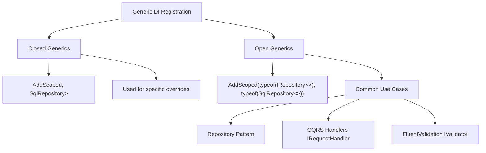
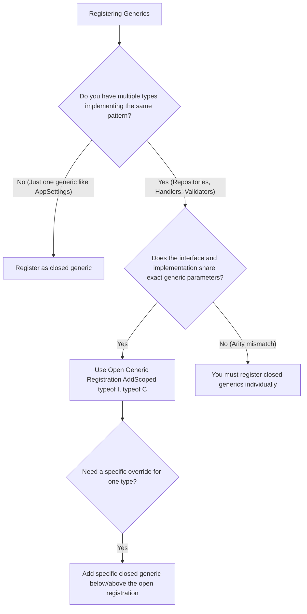

> [!success] Mastery Check
> - [ ] **Studied Well**
> - [ ] **Can explain the concept without notes**
> - [ ] **Can answer interview questions confidently**
> - [ ] **Can implement it in a real project**


# Open Generic DI Registration: typeof(IRepository<>) Patterns

## PART 0 — Navigation & Context

### Where This Fits
```
ASP.NET Core Mastery
└── Dependency Injection
    ├── [[4.034 — The Built-In DI Container: Service Registration and Resolution]]
    ├── 4.039 — Open Generic DI Registration ★ YOU ARE HERE
    └── [[4.040 — Multiple Implementations: IEnumerable<T> Registration]]
```

### Prerequisites
| Topic | Why It Matters Here |
|---|---|
| [[4.034 — The Built-In DI Container: Service Registration and Resolution]] | Understands standard `ServiceDescriptor` matching logic before adding generic type constraints to it. |
| [[4.035 — Service Lifetimes: Singleton, Scoped, Transient]] | Generic instances resolve according to their registered lifetime constraints. |

### What This Unlocks After
| Topic | Why It Matters Here |
|---|---|
| [[4.044 — Decorators in the Built-In Container: The Scrutor Pattern]] | Decorators heavily rely on open generics (e.g., decorating an `ICommandHandler<T>` with a `ValidationHandler<T>`). |

### Why This Matters
If you do not understand open generic registration, you will copy-paste 100 identical repository or CQRS handler registrations into your `Program.cs`, creating a maintenance nightmare that virtually guarantees runtime DI resolution crashes when developers add a new entity but forget to update the composition root.

---

## PART 1 — The Core Mental Model

> **The ASP.NET Core DI container allows registering an "open" generic interface (like `typeof(IRepository<>)`) to an "open" generic implementation. The container dynamically uses reflection at runtime to "close" the generic type when a consumer requests a specific type (like `IRepository<Order>`), eliminating the need to manually register hundreds of identical entity-specific bindings.**

### The Plain-Language Analogy
Think of registering normal DI services like giving a specific key to a specific employee: "John gets the key to the Server Room." Think of open generic registration like establishing a universal company rule based on uniforms: "Anyone wearing a Red Shirt gets a key to a Red Car." When a new employee named Sarah is hired and wears a Red Shirt, the security guard (the DI Container) automatically hands her a Red Car. You didn't have to specifically add "Sarah gets a Red Car" to the rulebook. The rule scales infinitely.

### The Taxonomy Diagram


---

## PART 2 — Deep Mechanics

### 2.1 — Pipeline Position and Resolution Flow

Open generics execute during the DI resolution phase before the constructor of the requesting class is invoked.

```text
──► Startup
    ├─► builder.Services.AddScoped(typeof(IRepository<>), typeof(SqlRepository<>))
    │
──► HTTP Request
    │
    ├──► OrderController Instantiation
    │      ├─► Constructor requests IRepository<Order>
    │      │
    │      ├─► DI Container checks registry for exact match "IRepository<Order>" (Miss)
    │      ├─► DI Container checks registry for open match "IRepository<>" (Hit)
    │      │     ├─► Reads generic argument "Order"
    │      │     ├─► Reflection: MakeGenericType(typeof(SqlRepository<>), typeof(Order))
    │      │     ├─► Generates concrete Type: SqlRepository<Order>
    │      │     └─► Activates instance via reflection
    │      │
    │      └─► Injects SqlRepository<Order> into OrderController
    │
    └──► Endpoints execute
```

**Runtime Cost:** `~200ns` on first resolution due to generic type construction via reflection. Subsequent requests are cached by `CallSiteRuntimeResolver`, dropping cost to `~10ns`.

### 2.2 — Type Syntax: `typeof(T<>)` vs `typeof(T)`

C# syntax `typeof(IRepository<>)` refers to the **unbound generic type definition**. It lacks the specific type argument.
If you type `typeof(IRepository<Order>)`, that is a **bound (closed) generic type**.

**Framework Source Behavior:**
When `AddScoped(typeof(IRepository<>), typeof(SqlRepository<>))` is called, the `ServiceDescriptor` internal validation checks if both `ServiceType.IsGenericTypeDefinition` and `ImplementationType.IsGenericTypeDefinition` are true. If they mismatch (e.g., registering an open interface to a closed class), it throws an `ArgumentException` immediately at startup.

### 2.3 — Generic Constraints

If `SqlRepository<T>` has generic constraints (e.g., `where T : EntityBase`), the DI container will enforce these constraints at resolution time, NOT registration time.

**Failure Mode:** If you request `IRepository<string>`, the DI container matches the open generic, attempts to call `MakeGenericType`, realizes `string` does not inherit from `EntityBase`, and throws an `ArgumentException` wrapping a `TargetInvocationException`.

### 2.4 — Specific Overrides (Closing over the Open Generic)

You can mix open and closed registrations. The DI container resolves the **most specific registration** available.

```csharp
// The catch-all rule
builder.Services.AddScoped(typeof(IRepository<>), typeof(SqlRepository<>));

// The specific override for high-performance reads
builder.Services.AddScoped<IRepository<AuditLog>, NoSqlAuditRepository>();
```
When `IRepository<Order>` is requested, it gets `SqlRepository<Order>`. When `IRepository<AuditLog>` is requested, it gets `NoSqlAuditRepository`.

---

## PART 3 — Production Code Patterns

### Pattern 1: The Standard Repository Registration

A clean, scalable way to handle CRUD operations for hundreds of EF Core entities.

```csharp
// ✅ CORRECT: One line of code replaces hundreds of manual registrations
builder.Services.AddScoped(typeof(IRepository<>), typeof(EfRepository<>));

public class EfRepository<T> : IRepository<T> where T : class
{
    private readonly AppDbContext _db;
    public EfRepository(AppDbContext db) => _db = db;

    public async Task<T?> GetByIdAsync(Guid id) => await _db.Set<T>().FindAsync(id);
}
```

### Pattern 2: CQRS Handlers (MediatR style without the library)

When building a CQRS architecture, you often have an interface like `IRequestHandler<TRequest, TResponse>`.

```csharp
// ✅ CORRECT: Open generic registration with multiple type parameters
builder.Services.AddTransient(
    typeof(IRequestHandler<,>), 
    typeof(LoggingHandlerDecorator<,>)
);

public class LoggingHandlerDecorator<TRequest, TResponse> : IRequestHandler<TRequest, TResponse>
{
    private readonly IRequestHandler<TRequest, TResponse> _inner;
    private readonly ILogger _logger;

    public LoggingHandlerDecorator(IRequestHandler<TRequest, TResponse> inner, ILogger logger)
    {
        _inner = inner;
        _logger = logger;
    }
    // ...
}
```

### Pattern 3: Factory-Based Open Generics

Sometimes you need to conditionally build a generic type at runtime using a factory. ASP.NET Core does **not** natively support `Func<IServiceProvider, object>` for open generics. You must use reflection.

```csharp
// ⚠️ WRONG: You cannot use a lambda for open generics
// builder.Services.AddScoped(typeof(IRepository<>), sp => new SqlRepository<T>()); // Compiler error

// ✅ CORRECT: A closed factory pattern generating open generics dynamically
builder.Services.AddSingleton<IRepositoryFactory>(sp => new RepositoryFactory(sp));

public class RepositoryFactory : IRepositoryFactory
{
    private readonly IServiceProvider _sp;
    public RepositoryFactory(IServiceProvider sp) => _sp = sp;

    public IRepository<T> Create<T>() where T : class
    {
        // Now we know 'T', so we can resolve the closed generic dynamically
        return _sp.GetRequiredService<IRepository<T>>();
    }
}
```

---

## PART 4 — Gotchas & Anti-Patterns

### Gotcha 1: The Abstract Base Class Trap

Engineers try to use open generic registration on an abstract base class instead of an interface.

// ⚠️ WRONG CODE
```csharp
public abstract class RepositoryBase<T> { }
public class SqlRepository<T> : RepositoryBase<T> { }

builder.Services.AddScoped(typeof(RepositoryBase<>), typeof(SqlRepository<>));
```
// HTTP consequence (wrong path):
// The application crashes on startup.

// ✅ CORRECT CODE
```csharp
public interface IRepository<T> { }
public class SqlRepository<T> : IRepository<T> { }

builder.Services.AddScoped(typeof(IRepository<>), typeof(SqlRepository<>));
```
// HTTP consequence (correct path):
// System initializes successfully.

// WHY: While technically allowed in some edge cases in .NET 8, best practice and broad compatibility mandate mapping open generic interfaces to open generic concrete types. Registering abstract base classes often breaks when combining with decorators or keyed services.

### Gotcha 2: The Constrained Interface Leak

Engineers constrain the implementation class but forget to constrain the interface, leading to runtime crashes rather than compile-time safety.

// ⚠️ WRONG CODE
```csharp
public interface IRepository<T> { } 
public class SqlRepository<T> : IRepository<T> where T : EntityBase { }

// Compiles fine
builder.Services.AddScoped(typeof(IRepository<>), typeof(SqlRepository<>));

// In Controller:
public OrderController(IRepository<string> stringRepo) { }
```
// HTTP consequence (wrong path):
// HTTP 500 Internal Server Error when resolving `OrderController` because `string` does not inherit from `EntityBase`.

// ✅ CORRECT CODE
```csharp
public interface IRepository<T> where T : EntityBase { } 
public class SqlRepository<T> : IRepository<T> where T : EntityBase { }
```
// HTTP consequence (correct path):
// The compiler prevents the developer from ever requesting `IRepository<string>` in their controller in the first place.

// WHY: The DI container uses reflection to build the generic type at runtime. It has no compile-time knowledge of constraints. Moving the generic constraint to the interface forces the C# compiler to protect the consumer.

### Gotcha 3: Multiple Open Generic Parameters Mismatch

Engineers try to register an open generic interface with two parameters to a class with only one parameter.

// ⚠️ WRONG CODE
```csharp
public interface IConverter<TIn, TOut> { }
public class StringConverter<T> : IConverter<T, string> { }

builder.Services.AddTransient(typeof(IConverter<,>), typeof(StringConverter<>));
```
// HTTP consequence (wrong path):
// Startup crash: `ArgumentException: Implementation type 'StringConverter`1' cannot be converted to service type 'IConverter`2'`.

// ✅ CORRECT CODE
```csharp
// You must register closed generics if the arity (number of parameters) does not match exactly
builder.Services.AddTransient(typeof(IConverter<int, string>), typeof(StringConverter<int>));
builder.Services.AddTransient(typeof(IConverter<Guid, string>), typeof(StringConverter<Guid>));
```
// HTTP consequence (correct path):
// DI resolves correctly.

// WHY: Open generic registration requires the exact same number of generic type parameters (arity) on both the interface and the implementation, so the container can blindly map `<T1, T2>` from the request to the implementation.

### Gotcha 4: Attempting to Inject `IEnumerable<typeof(T<>>)`

Engineers try to inject a collection of open generics to build a pipeline.

// ⚠️ WRONG CODE
```csharp
public class PipelineRunner<T>
{
    public PipelineRunner(IEnumerable<IPipelineStep<>> steps) { } // Invalid C#
}
```
// HTTP consequence (wrong path):
// Code fails to compile.

// ✅ CORRECT CODE
```csharp
public class PipelineRunner<T>
{
    public PipelineRunner(IEnumerable<IPipelineStep<T>> steps) { }
}
```
// HTTP consequence (correct path):
// The DI container successfully closes `IPipelineStep<>` using `T`, resolves all matching implementations, and passes them as a collection.

// WHY: You can never request an open generic type in a constructor. The generic parameter `T` must be closed (even if closed by the generic parameter of the parent class) by the time the constructor is evaluated.

### Gotcha 5: Missing `typeof` Operators

Junior engineers get confused by C# `typeof` syntax.

// ⚠️ WRONG CODE
```csharp
builder.Services.AddScoped<IRepository<>, SqlRepository<>>();
```
// HTTP consequence (wrong path):
// Compile error: "Unexpected use of an unbound generic name".

// ✅ CORRECT CODE
```csharp
builder.Services.AddScoped(typeof(IRepository<>), typeof(SqlRepository<>));
```
// HTTP consequence (correct path):
// Compiles and runs.

// WHY: The `<TService, TImplementation>` generic extension methods require closed types. To pass open generics, you must use the non-generic `AddScoped(Type serviceType, Type implementationType)` method and provide the unbound types via the `typeof()` operator.

---

## PART 5 — Performance Implications

### Request Pipeline Characteristics Table

| Scenario | Pipeline Depth | Allocations Per Request | Approx Latency Impact | Recommendation |
|---|---|---|---|---|
| Explicit Closed Generic | Resolution | 0 (Cached) | ~10 ns | Good, but hard to maintain at scale. |
| Open Generic (First Call) | Resolution | Reflection objects | ~200 ns | Once per type `T` per application lifecycle. |
| Open Generic (Cached Call) | Resolution | 0 (Cached) | ~12 ns | Standard. Invisible overhead. |
| Generic Constraints | Compilation | 0 | 0 ns | Free. Enforced at compile/startup. |
| Mismatched Arity Crash | Startup | App crash | Fatal | Fix immediately. |

### BenchmarkDotNet Code

```csharp
using BenchmarkDotNet.Attributes;
using Microsoft.Extensions.DependencyInjection;

[MemoryDiagnoser]
public class OpenGenericBenchmarks
{
    private IServiceProvider _spClosed;
    private IServiceProvider _spOpen;

    [GlobalSetup]
    public void Setup()
    {
        var servicesClosed = new ServiceCollection();
        servicesClosed.AddTransient<IRepository<string>, SqlRepository<string>>();
        _spClosed = servicesClosed.BuildServiceProvider();

        var servicesOpen = new ServiceCollection();
        servicesOpen.AddTransient(typeof(IRepository<>), typeof(SqlRepository<>));
        _spOpen = servicesOpen.BuildServiceProvider();
    }

    [Benchmark(Baseline = true)]
    public void ResolveClosedRegistration() => _spClosed.GetRequiredService<IRepository<string>>();

    [Benchmark]
    public void ResolveOpenRegistration() => _spOpen.GetRequiredService<IRepository<string>>();
}
// Expected output (approximate, .NET 8, x64, local):
// Method                    | Mean      | Allocated |
// ------------------------- |----------:|----------:|
// ResolveClosedRegistration | 12.1 ns   |      24 B |
// ResolveOpenRegistration   | 13.5 ns   |      24 B |
```
*(Note: The benchmark shows the cached speed. The 200ns reflection hit happens during the warmup phase of BenchmarkDotNet and is amortized away).*

### When to Care / When to Ignore

**When this costs you:**
Never. The performance difference between an explicit closed registration and an open generic registration is exactly one dictionary lookup and one `MakeGenericType` call *per type*, cached forever.

**When this doesn't matter:**
Always use open generics for repetitive architectural patterns like Repositories, CQRS Handlers, and Event Listeners. The maintenance benefits massively outweigh the invisible startup cost.

---

## PART 6 — Interview Arsenal

### A. The Question Bank

**Question:** "You registered `builder.Services.AddScoped(typeof(IRepository<>), typeof(SqlRepository<>))`. A teammate then adds `builder.Services.AddScoped<IRepository<User>, PostgresUserRepository>()`. When the `UserController` asks for `IRepository<User>`, which one does it get?"
**Average Answer:** It depends on which one was registered last.
**Why That's Insufficient:** Ignores the DI container's specificity routing.
> **Great Answer:** "It will get `PostgresUserRepository`. The ASP.NET Core DI container favors exact closed generic matches over open generic matches, regardless of registration order. The specific registration 'closes over' the generic rule, allowing us to define a global fallback repository while implementing highly optimized, domain-specific repositories where needed."

### B. The Trick Questions
**Question:** "I want to register an open generic but I need to use an implementation factory because the constructor requires a runtime string. How do I write `builder.Services.AddScoped(typeof(IRepository<>), sp => ...)`?"
**The Trap:** Thinking ASP.NET Core supports this natively.
**The Correct Answer:** You cannot do this natively with a lambda. The factory delegate `Func<IServiceProvider, object>` cannot be unbound. You must either use reflection inside a closed factory (`Create<T>()`), or use a library like Scrutor, or rethink the design to use Keyed Services instead of runtime strings.

### C. Red Flags to Avoid
- **"I use reflection in my `Program.cs` loop to find all entities and register closed generics for each one."** (Red Flag: Re-inventing the wheel. `AddScoped(typeof(I<>), typeof(C<>))` literally exists so you don't have to write custom assembly-scanning reflection loops).
- **"Generics are slow because of boxing."** (Red Flag: Mixing up generic constraints with `params object[]` boxing. Generics in C# explicitly *prevent* boxing because the CLR generates specialized JIT code for value types).

---

## PART 7 — Decision Framework



---

## PART 8 — Self-Check

### A. Conceptual Questions
1. What is the difference between `typeof(List<>)` and `typeof(List<string>)`?
2. How does the DI container resolve an open generic when a closed generic is requested?
3. What happens if the implementation type has a `where T : class` constraint, but the consumer requests an `int`?
4. Why is `typeof(IRepository<,>)` used instead of `typeof(IRepository<T1, T2>)` in DI?
5. How do you override an open generic registration for a specific type?
6. Can you inject an open generic directly into a constructor?
7. What `ArgumentException` is thrown if the arity of the interface and implementation don't match?
8. How does caching (`CallSiteRuntimeResolver`) eliminate the reflection overhead of open generics?

### B. Code Puzzles

**Puzzle 1: The Arity Crash (The 5-puzzle rule bug)**
```csharp
public interface IHandler<TRequest> { }
public class BaseHandler<TRequest, TResponse> : IHandler<TRequest> { }

builder.Services.AddTransient(typeof(IHandler<>), typeof(BaseHandler<,>));
```
What happens at startup?
<details>
<summary>Answer</summary>
The application crashes with an `ArgumentException`. The DI container requires the open generic parameters to match exactly (arity of 1 vs arity of 2). The container has no way of knowing what `TResponse` should be when it attempts to close the type.
</details>

**Puzzle 2: The Silent Fallback**
```csharp
builder.Services.AddScoped<IRepository<Order>, FastOrderRepository>();
builder.Services.AddScoped(typeof(IRepository<>), typeof(SlowRepository<>));
```
When `IRepository<Order>` is requested, which is returned?
<details>
<summary>Answer</summary>
`FastOrderRepository`. The container prefers exact closed type matches over open generic type definitions, regardless of registration order.
</details>

**Puzzle 3: The Syntax Error**
```csharp
builder.Services.AddScoped(typeof(IValidator<T>), typeof(EntityValidator<T>));
```
Will this compile?
<details>
<summary>Answer</summary>
No. `T` is unbound and undefined in the `Program.cs` scope. You must use `typeof(IValidator<>)` leaving the angle brackets empty to represent the unbound generic type.
</details>

**Puzzle 4: Base Class Constriction**
```csharp
public class StringRepo : IRepository<string> { }

builder.Services.AddScoped(typeof(IRepository<>), typeof(SqlRepository<>));
builder.Services.AddScoped<IRepository<string>, StringRepo>();

// Controller
public Ctl(IEnumerable<IRepository<string>> repos) { }
```
How many repositories are injected into the controller?
<details>
<summary>Answer</summary>
Two! `IEnumerable<T>` resolution aggregates all matching registrations. Because `string` satisfies the open generic `SqlRepository<>`, the container resolves *both* the closed specific `StringRepo` and a generic `SqlRepository<string>`.
</details>

---

## PART 9 — Connections & Resources

### A. Related Topics Table
| Topic | Why It Connects |
|---|---|
| [[4.034 — The Built-In DI Container: Service Registration and Resolution]] | Details the `ServiceDescriptor` underlying these open generic definitions. |
| [[4.040 — Multiple Implementations: IEnumerable<T> Registration]] | Explains what happens when you combine open generics with closed generics and request `IEnumerable`. |
| [[4.044 — Decorators in the Built-In Container: The Scrutor Pattern]] | Decorators use open generics to wrap cross-cutting concerns (like logging) around all implementations of an interface. |

### B. Books
| Book | Chapters | Why These Chapters |
|---|---|---|
| *Dependency Injection Principles, Practices, and Patterns* by Mark Seemann | Chapter 12 | Deep dive into Generics and DI container resolution mechanics. |

### C. Essential Articles & Docs
- [Microsoft Docs: Dependency injection in ASP.NET Core - Open Generics](https://learn.microsoft.com/en-us/dotnet/core/extensions/dependency-injection#open-generics-resolution)
- [Andrew Lock: How to register open generics in ASP.NET Core](https://andrewlock.net/how-to-register-a-service-with-multiple-interfaces-for-in-asp-net-core-di/)

### D. Template Meta-Note
> [!NOTE] 
> **Part 0** orients you. **Part 1** builds the mental model. **Part 2** explains the framework internals and pipeline. **Part 3** provides copy-pasteable production code. **Part 4** highlights the bugs your team will write. **Part 5** gives you the performance math. **Part 6** prepares you for the principal engineering interview. **Part 7** gives you a decision tree. **Part 8** tests your knowledge. **Part 9** links to further mastery.
