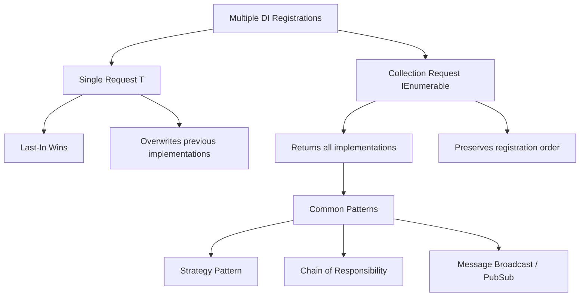
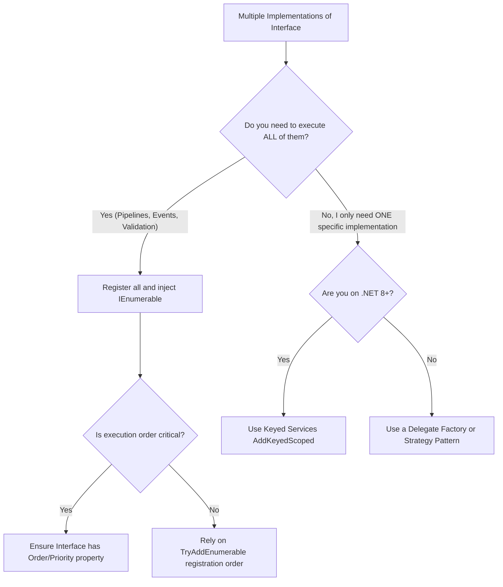

> [!success] Mastery Check
> - [ ] **Studied Well**
> - [ ] **Can explain the concept without notes**
> - [ ] **Can answer interview questions confidently**
> - [ ] **Can implement it in a real project**


# Multiple Implementations: IEnumerable<T> Registration

## PART 0 — Navigation & Context

### Where This Fits
```
ASP.NET Core Mastery
└── Dependency Injection
    ├── [[4.034 — The Built-In DI Container: Service Registration and Resolution]]
    ├── [[4.039 — Open Generic DI Registration]]
    └── 4.040 — Multiple Implementations ★ YOU ARE HERE
```

### Prerequisites
| Topic | Why It Matters Here |
|---|---|
| [[4.034 — The Built-In DI Container: Service Registration and Resolution]] | You must understand how `ServiceDescriptor` lists are evaluated (last-in wins) for single resolutions. |
| [[4.037 — Factory-Based DI]] | Factories are often the alternative to `IEnumerable<T>` for runtime resolution strategies. |

### What This Unlocks After
| Topic | Why It Matters Here |
|---|---|
| [[4.038 — Keyed Services (.NET 8)]] | Keyed services solve the "I have multiple implementations but only want one specific one" problem without needing `IEnumerable<T>`. |

### Why This Matters
If you do not understand `IEnumerable<T>` injection, you will struggle to implement standard gang-of-four patterns (like Chain of Responsibility, Strategy, or Pipelines) in ASP.NET Core, falling back to writing massive, brittle switch statements instead of leveraging the container's built-in collection resolution.

---

## PART 1 — The Core Mental Model

> **When you register multiple implementations of the exact same interface, requesting `T` returns only the last registered type, but requesting `IEnumerable<T>` returns an array of all registered implementations in the exact order they were registered. The practical consequence is that you can build highly decoupled, extensible pipelines where new modules simply register themselves into the DI collection without touching the consuming pipeline runner.**

### The Plain-Language Analogy
Think of the DI container like a talent agency. You ask them for "A Magician" (`IMagician`). They look at their list, see three magicians, and just send you the last one they hired (Last-In Wins). But if you ask them for "A group of Magicians" (`IEnumerable<IMagician>`), they will send you all three magicians, standing in the exact order they joined the agency. You can then ask each one to perform their trick in sequence.

### The Taxonomy Diagram


---

## PART 2 — Deep Mechanics

### 2.1 — Pipeline Position and Execution Flow

Collection resolution occurs during controller or service instantiation.

```text
──► Startup
    ├─► builder.Services.AddTransient<IRule, NullRule>()
    ├─► builder.Services.AddTransient<IRule, LengthRule>()
    │
──► HTTP Request
    │
    ├──► ValidationController Instantiation
    │      ├─► Constructor requests IEnumerable<IRule>
    │      │
    │      ├─► DI Container scans ServiceDescriptor list for IRule
    │      │     ├─► Finds NullRule
    │      │     ├─► Finds LengthRule
    │      │     └─► Allocates Array: IRule[2]
    │      │
    │      ├─► Resolves NullRule instance
    │      ├─► Resolves LengthRule instance
    │      └─► Injects Array into ValidationController
    │
    ├──► Controller iterates over rules: foreach (var rule in _rules)
    └──► Endpoints execute
```

**Runtime Cost:** `~N array allocation` plus the instantiation cost of each element. If a collection contains 10 elements, you pay for 10 instantiations every time the collection is resolved.

### 2.2 — Collection Registration vs `TryAdd`

The standard `AddTransient` methods append to the `IServiceCollection`. 

**Framework Source Behavior:**
If you use `TryAddEnumerable` (from `Microsoft.Extensions.DependencyInjection.Extensions`), the container checks if the exact *implementation type* is already registered for that service type. If so, it skips it. This prevents double-registering the same rule.

**Failure Mode:** A module registers `LengthRule` during startup. Another module registers `LengthRule` again. The `IEnumerable<IRule>` now contains two identical `LengthRule` instances, causing duplicate validations and performance bugs.

### 2.3 — Lifetime Independence

An `IEnumerable<T>` can contain implementations with different lifetimes.

**Framework Source Behavior:**
```csharp
builder.Services.AddSingleton<IRule, StaticRule>();
builder.Services.AddScoped<IRule, DbRule>();
```
When `IEnumerable<IRule>` is resolved inside a Scoped controller, the container hands back the cached singleton `StaticRule`, and instantiates a new scoped `DbRule`. The collection itself is effectively transient (an array), but its contents respect their configured lifetimes.

### 2.4 — Array Optimization (.NET 8)

In .NET 8, the DI container was heavily optimized. Requesting `IEnumerable<T>` no longer creates intermediate `List<T>` allocations; it directly sizes and allocates an array.

---

## PART 3 — Production Code Patterns

### Pattern 1: The Validation Pipeline (Chain of Responsibility)

A clean way to run multiple rules without modifying the runner class.

```csharp
// ✅ CORRECT: Injecting IEnumerable to execute a pipeline
public interface IOrderValidator 
{ 
    bool IsValid(Order order); 
}

public class OrderService
{
    // The collection is injected
    private readonly IEnumerable<IOrderValidator> _validators;

    public OrderService(IEnumerable<IOrderValidator> validators) 
        => _validators = validators;

    public bool ValidateOrder(Order order)
    {
        // Executes in exact order of registration
        foreach(var validator in _validators)
        {
            if (!validator.IsValid(order)) return false;
        }
        return true;
    }
}

// In Program.cs
// TryAddEnumerable prevents accidental duplicate registrations
builder.Services.TryAddEnumerable(ServiceDescriptor.Transient<IOrderValidator, StockValidator>());
builder.Services.TryAddEnumerable(ServiceDescriptor.Transient<IOrderValidator, FraudValidator>());
```

### Pattern 2: The Strategy Selector

Sometimes you inject all implementations and use a property to pick the right one.

```csharp
// ✅ CORRECT: Selecting from a collection based on a runtime value
public interface IPaymentStrategy 
{ 
    string GatewayName { get; } 
    void Charge(); 
}

public class CheckoutService
{
    private readonly IEnumerable<IPaymentStrategy> _strategies;

    public CheckoutService(IEnumerable<IPaymentStrategy> strategies) 
        => _strategies = strategies;

    public void ProcessPayment(string selectedGateway)
    {
        // LINQ lookup to find the matching strategy
        var strategy = _strategies.FirstOrDefault(s => s.GatewayName == selectedGateway) 
            ?? throw new NotSupportedException();
            
        strategy.Charge();
    }
}
```
*(Note: In .NET 8, Keyed Services largely replace this pattern for 1:1 lookups).*

### Pattern 3: Event Broadcasting

Notifying multiple independent listeners of an event.

```csharp
// ✅ CORRECT: Broadcasting to all listeners
public class OrderNotifier
{
    private readonly IEnumerable<IOrderCreatedListener> _listeners;

    public OrderNotifier(IEnumerable<IOrderCreatedListener> listeners) 
        => _listeners = listeners;

    public async Task NotifyAllAsync(Order order)
    {
        // Run all listeners concurrently
        var tasks = _listeners.Select(l => l.HandleAsync(order));
        await Task.WhenAll(tasks);
    }
}
```

---

## PART 4 — Gotchas & Anti-Patterns

### Gotcha 1: The "Last-In Wins" Single Injection

Engineers register multiple implementations but request a single `T` instead of `IEnumerable<T>`.

// ⚠️ WRONG CODE
```csharp
builder.Services.AddTransient<IRule, NullRule>();
builder.Services.AddTransient<IRule, LengthRule>();

// In Controller
public ValidationController(IRule rule) { }
```
// HTTP consequence (wrong path):
// Not an HTTP error, but a logic bug. The controller *only* receives `LengthRule`. The `NullRule` is completely ignored and inaccessible via single injection.

// ✅ CORRECT CODE
```csharp
public ValidationController(IEnumerable<IRule> rules) { }
```
// HTTP consequence (correct path):
// The controller receives both rules.

// WHY: The DI container resolves `T` by iterating its `ServiceDescriptor` list backwards and returning the first match it finds (last-in wins). It resolves `IEnumerable<T>` by iterating forwards and collecting all matches.

### Gotcha 2: Instantiating Heavy Strategies Inadvertently

Engineers use `IEnumerable<T>` for the Strategy Pattern, but the strategies have heavy database connections or network clients in their constructors.

// ⚠️ WRONG CODE
```csharp
public CheckoutService(IEnumerable<IPaymentStrategy> strategies) { }

// The checkout service finds the specific strategy:
var strategy = _strategies.First(s => s.Name == "Stripe");
```
// HTTP consequence (wrong path):
// Massive latency. Resolving `IEnumerable<T>` instantiates *every single strategy* in the collection. If there are 10 payment gateways, 10 database connections/clients are created, even though only 1 is used.

// ✅ CORRECT CODE
```csharp
// Use .NET 8 Keyed Services instead of IEnumerable for 1:1 strategy selection
public CheckoutService([FromKeyedServices("Stripe")] IPaymentStrategy strategy) { }
```
// HTTP consequence (correct path):
// Only the Stripe strategy is instantiated.

// WHY: `IEnumerable<T>` in ASP.NET Core DI is an eagerly instantiated array, not an `IQueryable` or a lazy enumerator.

### Gotcha 3: Relying on Registration Order for Critical Logic

Engineers build pipelines that strictly rely on `RuleA` executing before `RuleB`, but enforce this purely through `Program.cs` line order.

// ⚠️ WRONG CODE
```csharp
// Program.cs
builder.Services.AddTransient<IRule, AuthRule>(); // Must run first!
builder.Services.AddTransient<IRule, LogicRule>(); // Must run second!
```
// HTTP consequence (wrong path):
// A junior developer alphabetizes the registrations during a refactor. The `LogicRule` now executes before `AuthRule`, allowing unauthorized execution of domain logic.

// ✅ CORRECT CODE
```csharp
// The interface should enforce ordering
public interface IRule { int ExecutionOrder { get; } }

// In the pipeline runner
var orderedRules = _rules.OrderBy(r => r.ExecutionOrder);
foreach(var rule in orderedRules) { ... }
```
// HTTP consequence (correct path):
// The pipeline executes securely regardless of `Program.cs` syntax.

// WHY: While ASP.NET Core guarantees registration order preservation, relying on `Program.cs` line numbers for critical business security logic is extremely brittle.

### Gotcha 4: Accidentally Registering the Same Implementation Twice

Engineers register services in loops or multiple extension methods, causing duplicates in the `IEnumerable`.

// ⚠️ WRONG CODE
```csharp
builder.Services.AddTransient<IRule, LengthRule>();
builder.Services.AddTransient<IRule, LengthRule>(); // Accidentally added twice
```
// HTTP consequence (wrong path):
// `IEnumerable<IRule>` now contains two instances of `LengthRule`. The validation runs twice, wasting CPU.

// ✅ CORRECT CODE
```csharp
using Microsoft.Extensions.DependencyInjection.Extensions;

builder.Services.TryAddEnumerable(ServiceDescriptor.Transient<IRule, LengthRule>());
builder.Services.TryAddEnumerable(ServiceDescriptor.Transient<IRule, LengthRule>());
```
// HTTP consequence (correct path):
// `TryAddEnumerable` checks the `ImplementationType`. It ignores the second registration.

// WHY: Standard `AddTransient` just appends to the `List<ServiceDescriptor>`. `TryAddEnumerable` is explicitly designed for safe collection building.

### Gotcha 5: Expecting `IReadOnlyCollection<T>` or `IList<T>`

Engineers request a strongly typed collection instead of `IEnumerable<T>`.

// ⚠️ WRONG CODE
```csharp
public ValidationController(IList<IRule> rules) { }
```
// HTTP consequence (wrong path):
// The application crashes with `InvalidOperationException: Unable to resolve service for type 'System.Collections.Generic.IList1[IRule]'`.

// ✅ CORRECT CODE
```csharp
public ValidationController(IEnumerable<IRule> rules) 
{ 
    _rules = rules.ToList(); // Convert manually if you need a list
}
```
// HTTP consequence (correct path):
// Application runs successfully.

// WHY: The DI container natively understands exactly one collection interface: `IEnumerable<T>`. It does not support resolving `ICollection<T>`, `IList<T>`, or arrays `T[]` directly.

---

## PART 5 — Performance Implications

### Request Pipeline Characteristics Table

| Scenario | Pipeline Depth | Allocations Per Request | Approx Latency Impact | Recommendation |
|---|---|---|---|---|
| Single `T` request | Resolution | 0 (Cached delegate) | ~10 ns | Baseline. |
| `IEnumerable<T>` (2 items) | Resolution | Array[2] + 2 Object Allocs | ~30 ns | Fast, standard pipeline use. |
| `IEnumerable<T>` (50 items) | Resolution | Array[50] + 50 Allocs | ~800 ns | Heavy. Avoid large collections of Transients. |
| Keyed Service Lookup (.NET 8) | Resolution | Dictionary Lookup | ~12 ns | Replaces IEnumerable for strategy selection. |
| Duplicate Registrations | Domain Logic | N extra instantiations | Variable | Use `TryAddEnumerable`. |
| Sorting `IEnumerable` | Domain Logic | LINQ sorting allocs | ~500 ns | Necessary if order is critical. |

### BenchmarkDotNet Code

```csharp
using BenchmarkDotNet.Attributes;
using Microsoft.Extensions.DependencyInjection;

[MemoryDiagnoser]
public class EnumerableBenchmarks
{
    private IServiceProvider _spSingle;
    private IServiceProvider _spMulti;

    [GlobalSetup]
    public void Setup()
    {
        var services1 = new ServiceCollection();
        services1.AddTransient<IRule, LengthRule>();
        _spSingle = services1.BuildServiceProvider();

        var services2 = new ServiceCollection();
        for(int i = 0; i < 10; i++) 
            services2.AddTransient<IRule, LengthRule>();
        _spMulti = services2.BuildServiceProvider();
    }

    [Benchmark(Baseline = true)]
    public void ResolveSingle() => _spSingle.GetRequiredService<IRule>();

    [Benchmark]
    public void ResolveEnumerableOfTen() => _spMulti.GetRequiredService<IEnumerable<IRule>>();
}
// Expected output (approximate, .NET 8, x64, local):
// Method               | Mean      | Allocated |
// -------------------- |----------:|----------:|
// ResolveSingle        | 10.1 ns   |      24 B |
// ResolveEnumerableOfTen| 185.3 ns  |     320 B |
```

### When to Care / When to Ignore

**When this costs you:**
Using `IEnumerable<T>` to hold 50 different "Strategies" where each strategy's constructor opens a database connection or reads the disk. Because `IEnumerable` instantiates everything eagerly, resolving the collection will instantly open 50 database connections just so your code can pick one.

**When this doesn't matter:**
For standard pipelines (e.g., 5 Validators, 3 Decorators, 4 Request Handlers), the instantiation overhead of resolving a few lightweight objects into an array is completely negligible (< 1 microsecond).

---

## PART 6 — Interview Arsenal

### A. The Question Bank

**Question:** "If you register two classes `ClassA` and `ClassB` against the same interface `IService`, what happens when a controller constructor asks for `IService`? What happens when it asks for `IEnumerable<IService>`?"
**Average Answer:** It returns `ClassB` because it overwrites `ClassA`. `IEnumerable` returns both.
**Why That's Insufficient:** Doesn't explain the internal mechanism or the order.
> **Great Answer:** "When asking for a single `IService`, the container scans its `ServiceDescriptor` list backwards and returns the last registration it finds, which is `ClassB`. `ClassA` is not actually overwritten or deleted; it just loses the resolution race. When asking for `IEnumerable<IService>`, the container scans forward, allocating an array containing instantiated versions of both `ClassA` and `ClassB` in the exact order they were registered. This guarantees deterministic pipeline execution."

### B. The Trick Questions
**Question:** "I registered three `IMessageHandler` implementations using `builder.Services.AddScoped<IMessageHandler, Handler>()`. Now I want to inject them into my background worker as an `IList<IMessageHandler>`. Why does DI throw an error?"
**The Trap:** Thinking standard C# interface inheritance applies to DI resolution.
**The Correct Answer:** The ASP.NET Core DI container has a hardcoded special case only for `IEnumerable<T>`. It does not know how to resolve `IList<T>`, `ICollection<T>`, or `IReadOnlyList<T>`. You must request `IEnumerable<T>` and call `.ToList()` manually inside your constructor.

### C. Red Flags to Avoid
- **"I use `IEnumerable` to pick the right payment gateway based on a string."** (Red Flag: This was acceptable in .NET 6, but in .NET 8, this is an anti-pattern. You should immediately mention Keyed Services as the modern, high-performance solution).
- **"I inject `IEnumerable<T>` but it throws because I forgot to register any implementations."** (Red Flag: In ASP.NET Core, resolving `IEnumerable<T>` when no implementations exist does *not* throw. It safely returns an empty array. Saying it throws shows a lack of hands-on experience).

---

## PART 7 — Decision Framework



---

## PART 8 — Self-Check

### A. Conceptual Questions
1. Why does resolving `IEnumerable<T>` return an empty array instead of throwing when no services are registered?
2. What is the difference between `AddTransient` and `TryAddEnumerable`?
3. How does the DI container determine the order of elements in the resolved `IEnumerable<T>`?
4. Why is resolving an `IEnumerable<T>` containing heavy strategies considered an anti-pattern?
5. If an `IEnumerable` contains one Singleton and one Transient, what happens when it is resolved twice in the same scope?
6. Can you inject `IReadOnlyCollection<T>`?
7. How does `.NET 8` Keyed Services reduce the need for `IEnumerable<T>`?
8. What happens if a scoped implementation is inside an `IEnumerable<T>` resolved from a root provider?

### B. Code Puzzles

**Puzzle 1: The Invisible Overwrite (The 5-puzzle rule bug)**
```csharp
builder.Services.TryAddTransient<IRule, RuleA>();
builder.Services.TryAddTransient<IRule, RuleB>();
```
When `IEnumerable<IRule>` is resolved, how many rules are returned?
<details>
<summary>Answer</summary>
Exactly ONE (`RuleA`). `TryAddTransient` checks if the *interface* `IRule` is already registered. Since `RuleA` registered it, `RuleB` is completely skipped. To register multiple implementations safely, you MUST use `TryAddEnumerable`.
</details>

**Puzzle 2: The Eager Array**
```csharp
public ctor(IEnumerable<IHeavyService> services) 
{
    _selectedService = services.First(s => s.IsActive);
}
```
If there are 10 `IHeavyService` implementations, how many are instantiated?
<details>
<summary>Answer</summary>
All 10 are instantiated. The DI container resolves `IEnumerable<T>` by instantiating every element and throwing them into an array *before* passing the array to your constructor. LINQ's deferred execution does not save you here.
</details>

**Puzzle 3: The Empty Collection**
```csharp
// No IPlugin registered in Program.cs
public PluginManager(IEnumerable<IPlugin> plugins) { }
```
Does this crash with a DI resolution error?
<details>
<summary>Answer</summary>
No. Requesting `IEnumerable<T>` when no implementations exist simply returns `Array.Empty<T>()`. It never throws.
</details>

**Puzzle 4: Ordering the IEnumerable**
```csharp
builder.Services.AddTransient<IHandler, ZHandler>();
builder.Services.AddTransient<IHandler, AHandler>();
```
If you iterate the resolved `IEnumerable`, which executes first?
<details>
<summary>Answer</summary>
`ZHandler` executes first. The container preserves the exact registration order (first-in, first-out for collections). It does not alphabetize.
</details>

---

## PART 9 — Connections & Resources

### A. Related Topics Table
| Topic | Why It Connects |
|---|---|
| [[4.034 — The Built-In DI Container: Service Registration and Resolution]] | The basic foundation of how `ServiceDescriptor` objects are stored in the underlying `IServiceCollection`. |
| [[4.038 — Keyed Services (.NET 8)]] | The modern alternative to `IEnumerable<T>` when you only need to resolve a single, specific implementation out of many. |
| [[4.044 — Decorators in the Built-In Container: The Scrutor Pattern]] | Decorators often interact with multiple implementations by decorating the entire `IEnumerable`. |

### B. Books
| Book | Chapters | Why These Chapters |
|---|---|---|
| *Dependency Injection Principles, Practices, and Patterns* by Mark Seemann | Chapter 10 | Covers the integration of the Strategy, Composite, and Decorator patterns with DI collections. |

### C. Essential Articles & Docs
- [Microsoft Docs: Dependency injection in ASP.NET Core - Multiple implementations](https://learn.microsoft.com/en-us/dotnet/core/extensions/dependency-injection-guidelines#multiple-constructor-injection-rules)
- [Andrew Lock: Using TryAddEnumerable in ASP.NET Core](https://andrewlock.net/dependency-injection-in-asp-net-core-using-tryaddenumerable/)

### D. Template Meta-Note
> [!NOTE] 
> **Part 0** orients you. **Part 1** builds the mental model. **Part 2** explains the framework internals and pipeline. **Part 3** provides copy-pasteable production code. **Part 4** highlights the bugs your team will write. **Part 5** gives you the performance math. **Part 6** prepares you for the principal engineering interview. **Part 7** gives you a decision tree. **Part 8** tests your knowledge. **Part 9** links to further mastery.
