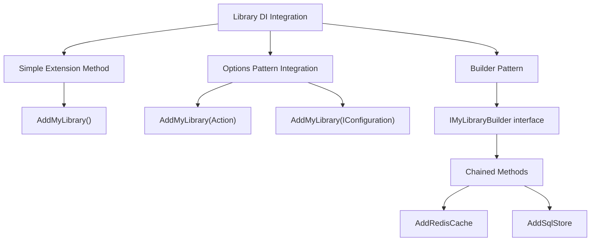
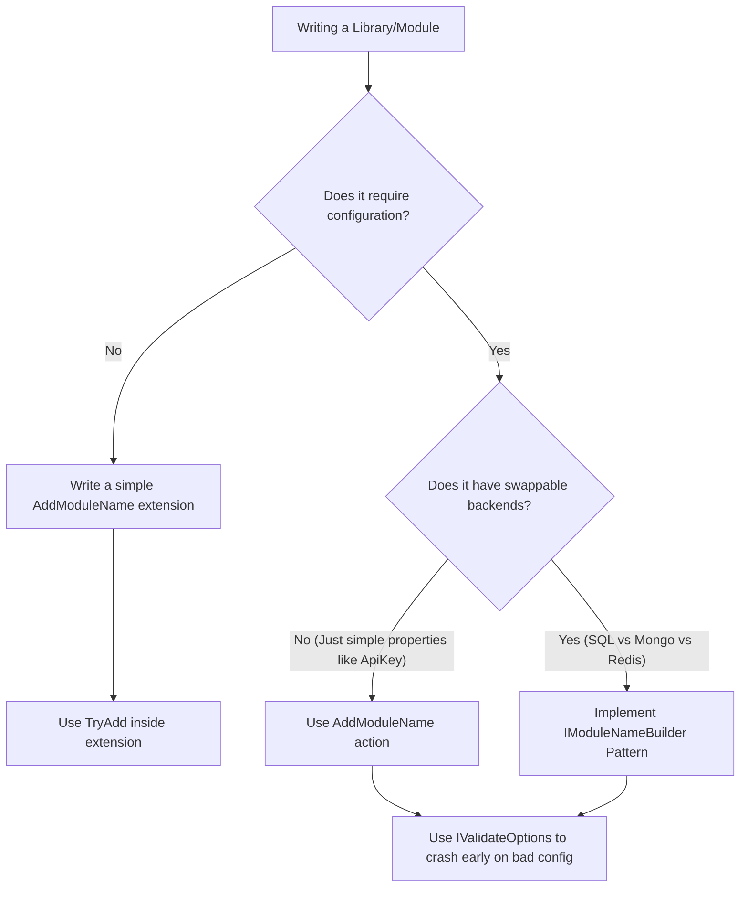

> [!success] Mastery Check
> - [ ] **Studied Well**
> - [ ] **Can explain the concept without notes**
> - [ ] **Can answer interview questions confidently**
> - [ ] **Can implement it in a real project**


# IServiceCollection Extension Methods: Builder Pattern for Libraries

## PART 0 — Navigation & Context

### Where This Fits
```
ASP.NET Core Mastery
└── Dependency Injection
    ├── [[4.034 — The Built-In DI Container: Service Registration and Resolution]]
    ├── 4.041 — IServiceCollection Extension Methods ★ YOU ARE HERE
    └── [[4.046 — DI Validation at Startup]]
```

### Prerequisites
| Topic | Why It Matters Here |
|---|---|
| [[4.034 — The Built-In DI Container: Service Registration and Resolution]] | You must understand how `IServiceCollection` acts as a list of `ServiceDescriptor` objects. |
| [[4.016 — IOptions<T>: Type-Safe Configuration Binding]] | Libraries often require registering their own internal configuration models. |

### What This Unlocks After
| Topic | Why It Matters Here |
|---|---|
| [[4.046 — DI Validation at Startup]] | Well-written extensions validate their configuration requirements immediately when added. |

### Why This Matters
If you do not encapsulate your module's internal DI registrations behind clean `AddMyLibrary()` extension methods, your `Program.cs` will grow into a 2,000-line monolithic script that exposes internal implementation details (like HTTP clients and caching strategies) to the consuming application, destroying modularity and breaking encapsulation across enterprise teams.

---

## PART 1 — The Core Mental Model

> **The `IServiceCollection` builder pattern encapsulates a library or module's internal complexity by exposing a single `AddModuleName(Action<Options>)` extension method that handles configuration binding, internal `ServiceDescriptor` registrations, and sub-builders. The practical consequence is that the consuming `Program.cs` needs only one line of code to register dozens of internal services securely.**

### The Plain-Language Analogy
Think of building a car. You are the mechanic (the `Program.cs`). You don't buy a loose box containing a transmission, a drive shaft, and 400 gears, and then try to assemble the engine yourself. Instead, you buy a pre-assembled Engine module. You tell the manufacturer (the Extension Method) what type of fuel you use (the Options), and they hand you a sealed Engine that bolts right into the car. The extension method hides the complexity of how the engine's internal gears fit together.

### The Taxonomy Diagram


---

## PART 2 — Deep Mechanics

### 2.1 — Pipeline Position and Execution Flow

Extension methods execute strictly during the Application Startup phase, before the DI container is built.

```text
──► App Startup
    │
    ├──► builder.Services.AddControllers()
    ├──► builder.Services.AddAuthentication()
    ├──► builder.Services.AddPaymentProcessing(opts => opts.ApiKey = "123") ─┐
    │      │                                                                 │
    │      ├─► Registers IPaymentOptions (Singleton) ◄───────────────────────┤
    │      ├─► Registers StripeHttpClient (Transient) ◄──────────────────────┤ (Hidden internals)
    │      └─► Registers IPaymentGateway as StripeGateway (Scoped) ◄─────────┘
    │
    ├──► builder.Build()  [ServiceDescriptors are baked into IServiceProvider]
    │
    └──► Endpoints execute
```

**Runtime Cost:** `Zero latency impact`. Executes exactly once during startup.

### 2.2 — `IServiceCollection` Mutability

`IServiceCollection` is simply an `IList<ServiceDescriptor>`.

**Framework Source Behavior:**
When you write an extension method, you are just writing a `public static IServiceCollection AddMyService(this IServiceCollection services)`. It modifies the list and returns it to allow fluent chaining. If your library depends on external framework services (like `IHttpClientFactory` or `IMemoryCache`), your extension method must call `services.AddHttpClient()` internally to ensure dependencies are present.

### 2.3 — `TryAdd` vs `Add` in Extensions

Library authors cannot predict the consuming application. If the host application registered its own `ILogger`, the library must not overwrite it.

**Failure Mode:** If your extension uses `services.AddSingleton<ITelemetry>()`, and the consumer also registers their own `ITelemetry`, your library overwrites the consumer's choice (or causes duplicate array issues). Library extensions should almost exclusively use `services.TryAdd...` to respect user overrides.

### 2.4 — The Builder Pattern Interface

For complex libraries (like Entity Framework or Identity), passing a single `Action<Options>` isn't enough. They return a custom Builder interface.

```csharp
public interface IPaymentBuilder 
{ 
    IServiceCollection Services { get; } 
}
```
This allows extension methods to hang off `IPaymentBuilder` instead of polluting the global `IServiceCollection` IntelliSense.

---

## PART 3 — Production Code Patterns

### Pattern 1: The Simple Action<Options> Extension

The standard way to expose a feature that requires simple configuration.

```csharp
// ✅ CORRECT: Clean extension method with options binding
public static class PaymentServiceCollectionExtensions
{
    public static IServiceCollection AddPaymentProcessing(
        this IServiceCollection services, 
        Action<PaymentOptions> configureOptions)
    {
        // 1. Register the options block
        services.Configure(configureOptions);

        // 2. Add required framework dependencies safely
        services.AddHttpClient();
        services.AddMemoryCache();

        // 3. Register library internals safely
        services.TryAddScoped<IPaymentGateway, StripePaymentGateway>();
        services.TryAddTransient<ITransactionLogger, DefaultTransactionLogger>();

        // 4. Return for fluent chaining
        return services;
    }
}

// Consumer Program.cs
builder.Services.AddPaymentProcessing(options => 
{
    options.ApiKey = builder.Configuration["StripeKey"];
});
```

### Pattern 2: The Sub-Builder Pattern for Pluggability

When your library has multiple storage or caching backends, use a Builder.

```csharp
// ✅ CORRECT: The Builder pattern for complex libraries
public interface IPaymentBuilder
{
    IServiceCollection Services { get; }
}

public class PaymentBuilder : IPaymentBuilder
{
    public IServiceCollection Services { get; }
    public PaymentBuilder(IServiceCollection services) => Services = services;
}

public static class PaymentBuilderExtensions
{
    // The entry point returns the builder, NOT IServiceCollection
    public static IPaymentBuilder AddPayments(this IServiceCollection services)
    {
        services.TryAddScoped<IPaymentManager, PaymentManager>();
        return new PaymentBuilder(services);
    }

    // Storage extensions hang off the Builder
    public static IPaymentBuilder AddSqlStorage(this IPaymentBuilder builder, string connectionString)
    {
        builder.Services.AddScoped<IPaymentStore>(sp => new SqlPaymentStore(connectionString));
        return builder;
    }
}

// Consumer Program.cs
builder.Services.AddPayments()
                .AddSqlStorage("Server=..."); // Fluent UI restricts what methods appear here
```

### Pattern 3: Validating Configuration Early

If the user misconfigures your library, crash at startup, not when the first customer tries to check out.

```csharp
// ✅ CORRECT: Using IValidateOptions to crash early
public class PaymentOptionsValidator : IValidateOptions<PaymentOptions>
{
    public ValidateOptionsResult Validate(string? name, PaymentOptions options)
    {
        if (string.IsNullOrEmpty(options.ApiKey))
            return ValidateOptionsResult.Fail("ApiKey must be provided to AddPaymentProcessing.");
            
        return ValidateOptionsResult.Success;
    }
}

public static IServiceCollection AddPaymentProcessing(this IServiceCollection services, Action<PaymentOptions> setup)
{
    services.Configure(setup);
    
    // Register the validator
    services.TryAddEnumerable(ServiceDescriptor.Singleton<IValidateOptions<PaymentOptions>, PaymentOptionsValidator>());
    
    return services;
}
```

---

## PART 4 — Gotchas & Anti-Patterns

### Gotcha 1: Using `Add...` instead of `TryAdd...`

Library authors forcefully overwrite existing services.

// ⚠️ WRONG CODE
```csharp
public static IServiceCollection AddMyLibrary(this IServiceCollection services)
{
    // If the consumer already registered ISystemClock for testing, this destroys their mock!
    services.AddSingleton<ISystemClock, RealSystemClock>();
    return services;
}
```
// HTTP consequence (wrong path):
// The application behaves unexpectedly because the consumer's carefully crafted mocks or custom implementations are overwritten by the library.

// ✅ CORRECT CODE
```csharp
public static IServiceCollection AddMyLibrary(this IServiceCollection services)
{
    services.TryAddSingleton<ISystemClock, RealSystemClock>();
    return services;
}
```
// HTTP consequence (correct path):
// The library only registers its default if the consumer hasn't already provided one.

// WHY: The DI container resolves the last registered instance for a given interface. `TryAdd` checks if the `ServiceType` is already in the `IServiceCollection` list, and if so, it safely no-ops.

### Gotcha 2: Returning `void`

Engineers write an extension method but break the fluent chain.

// ⚠️ WRONG CODE
```csharp
public static void AddFeature(this IServiceCollection services)
{
    services.AddTransient<IFeature, Feature>();
}
```
// HTTP consequence (wrong path):
// Code fails to compile if the consumer tries to chain it: `services.AddFeature().AddCors()`.

// ✅ CORRECT CODE
```csharp
public static IServiceCollection AddFeature(this IServiceCollection services)
{
    services.TryAddTransient<IFeature, Feature>();
    return services;
}
```
// HTTP consequence (correct path):
// Compiles perfectly.

// WHY: ASP.NET Core relies heavily on the fluent builder pattern. `IServiceCollection` extension methods must always `return services;`.

### Gotcha 3: Accessing Configuration Directly Inside the Extension

Engineers pass `IConfiguration` into the extension method and call `.GetValue`, effectively hardcoding the configuration schema.

// ⚠️ WRONG CODE
```csharp
public static IServiceCollection AddMyFeature(this IServiceCollection services, IConfiguration config)
{
    // Hardcoded schema assumption: "MyFeature:ApiKey"
    var key = config["MyFeature:ApiKey"]; 
    services.AddSingleton(new Feature(key));
    return services;
}
```
// HTTP consequence (wrong path):
// The consumer cannot rename their configuration section. If they store the API key in Azure Key Vault under a different name, the library breaks.

// ✅ CORRECT CODE
```csharp
public static IServiceCollection AddMyFeature(this IServiceCollection services, Action<FeatureOptions> setup)
{
    services.Configure(setup);
    services.TryAddSingleton<Feature>();
    return services;
}
```
// HTTP consequence (correct path):
// The consumer decides where the data comes from: `AddMyFeature(o => o.ApiKey = config["CustomKey"])`.

// WHY: Libraries should decouple from the physical structure of `appsettings.json`. Passing `Action<Options>` gives the consumer ultimate control over mapping configuration sources to the library's required properties.

### Gotcha 4: Polluting IntelliSense

Engineers dump 50 extension methods onto `IServiceCollection`.

// ⚠️ WRONG CODE
```csharp
public static IServiceCollection AddLibraryCore(this IServiceCollection services) { ... }
public static IServiceCollection AddLibrarySql(this IServiceCollection services) { ... }
public static IServiceCollection AddLibraryRedis(this IServiceCollection services) { ... }
```
// HTTP consequence (wrong path):
// Not a runtime error, but DX (Developer Experience) suffers. Typing `services.Add...` brings up hundreds of irrelevant methods.

// ✅ CORRECT CODE
```csharp
// Entry point
public static ILibraryBuilder AddLibrary(this IServiceCollection services) { ... }

// Extensions on the builder
public static ILibraryBuilder AddSql(this ILibraryBuilder builder) { ... }
```
// HTTP consequence (correct path):
// Clean DX.

// WHY: The Builder Pattern scopes extension methods. `builder.AddSql()` only appears when the user is explicitly configuring `AddLibrary()`.

### Gotcha 5: Missing `AddOptions()`

Engineers use the Options pattern but forget that `IOptions<T>` itself needs to be registered.

// ⚠️ WRONG CODE
```csharp
public static IServiceCollection AddFeature(this IServiceCollection services, Action<FeatureOptions> setup)
{
    services.Configure(setup);
    return services;
}
```
// HTTP consequence (wrong path):
// If the consuming app doesn't call `AddOptions()` somewhere else, the DI container might fail to resolve `IOptions<FeatureOptions>`. (Note: In modern .NET 6/8, the WebHost builds usually include this automatically, but standalone library consumers like Worker Services might crash).

// ✅ CORRECT CODE
```csharp
public static IServiceCollection AddFeature(this IServiceCollection services, Action<FeatureOptions> setup)
{
    services.AddOptions(); // Safe to call multiple times
    services.Configure(setup);
    return services;
}
```
// HTTP consequence (correct path):
// Guaranteed resolution of `IOptions<T>`.

// WHY: Libraries must be defensive. You cannot assume the host application has registered all the core framework primitives. Call `AddOptions`, `AddMemoryCache`, `AddHttpClient`, etc., if your library requires them.

---

## PART 5 — Performance Implications

### Request Pipeline Characteristics Table

| Scenario | Pipeline Depth | Allocations Per Request | Approx Latency Impact | Recommendation |
|---|---|---|---|---|
| Extension Method Execution | Startup | `ServiceDescriptor` objects | 0 ns (Runtime) | Free at runtime. |
| Missing `TryAdd` | Resolution | Array inflation / Overwrites | Variable | Use `TryAdd` to prevent leaks. |
| Early Validation (`IValidateOptions`) | Startup / First Call | 0 ns (Runtime) | 0 ns | Validates once. Highly recommended. |
| `IOptionsMonitor` evaluation | Runtime | Read lock | ~50 ns | Fast, but caching is better. |

### BenchmarkDotNet Code

*(No BenchmarkDotNet provided because `IServiceCollection` extension methods execute exclusively during the application bootstrap phase. They have exactly zero impact on per-request HTTP latency or throughput).*

### When to Care / When to Ignore

**When this costs you:**
When you write internal company NuGet packages and fail to use `TryAdd`. This forces downstream application teams to write horrific workarounds to replace your hardcoded internal dependencies, wasting weeks of engineering time.

**When this doesn't matter:**
If you are writing a microservice that is entirely self-contained and will never be shared as a library, creating complex Builder interfaces is premature abstraction. Just group registrations into simple `AddDomainServices()` extensions for readability.

---

## PART 6 — Interview Arsenal

### A. The Question Bank

**Question:** "You are writing a NuGet package. Should you use `services.AddSingleton<ICache, RedisCache>()` or `services.TryAddSingleton<ICache, RedisCache>()` in your extension method, and why?"
**Average Answer:** You should use `TryAddSingleton` so you don't add it twice.
**Why That's Insufficient:** Misses the primary architectural reason regarding the composition root.
> **Great Answer:** "You must use `TryAddSingleton`. The application's `Program.cs` is the composition root, meaning the consuming developer has the final say on all dependencies. If they want to use an `InMemoryCache` for local testing instead of your `RedisCache`, they will register their mock before calling your `AddMyLibrary()` method. If you use `AddSingleton`, your library forcefully overwrites their registration. `TryAddSingleton` respects the consumer by only registering the service if the interface isn't already claimed."

### B. The Trick Questions
**Question:** "Your library requires an HTTP client. Inside your `AddMyLibrary` extension, you call `services.AddHttpClient()`. If the consumer also calls `services.AddHttpClient()` in their `Program.cs`, does this cause a conflict or crash?"
**The Trap:** Assuming duplicate framework calls throw errors.
**The Correct Answer:** It is perfectly safe. Microsoft designed most foundational framework extensions (`AddHttpClient`, `AddOptions`, `AddMemoryCache`) to be idempotent. They use `TryAdd` internally. Your library should always call them defensively to ensure they exist.

### C. Red Flags to Avoid
- **"I don't use extension methods, I just tell developers to register all 12 of my library's classes manually in their Program.cs."** (Red Flag: Total disregard for encapsulation and API design. Breaking changes will occur every time a new dependency is added).
- **"I pass `IServiceProvider` into my extension method to resolve dependencies."** (Red Flag: `IServiceProvider` does not exist during the configuration phase. `IServiceCollection` is just a list of blueprints. Attempting to build the provider early causes the 'Multiple IServiceProvider copies' performance bug).

---

## PART 7 — Decision Framework



---

## PART 8 — Self-Check

### A. Conceptual Questions
1. Why do ASP.NET Core extension methods always return `IServiceCollection`?
2. What is the functional difference between `AddTransient` and `TryAddTransient`?
3. If your library needs configuration data, why is passing `Action<MyOptions>` preferred over passing `IConfiguration`?
4. How does the Builder pattern (e.g., `IMyFeatureBuilder`) improve developer experience (IntelliSense)?
5. Why is it dangerous to call `services.BuildServiceProvider()` inside an extension method?
6. How do you ensure the host application has provided a required option (like an API key) before the app starts accepting traffic?
7. Should a library use `TryAddEnumerable` or `TryAdd` when registering an implementation of `IHostedService`?
8. What happens if a library calls `services.AddOptions()` and the host app also calls it?

### B. Code Puzzles

**Puzzle 1: The Stubborn Override (The 5-puzzle rule bug)**
```csharp
// Consumer Program.cs
builder.Services.AddSingleton<ITelemetry, MockTelemetry>();
builder.Services.AddMyLibrary(); // This extension method uses AddSingleton<ITelemetry, RealTelemetry>()

var telemetry = app.Services.GetRequiredService<ITelemetry>();
```
Which telemetry instance does the consumer get?
<details>
<summary>Answer</summary>
`RealTelemetry`. The library author used `AddSingleton` instead of `TryAddSingleton`, overwriting the consumer's mock and ruining their test environment.
</details>

**Puzzle 2: The Double Registration**
```csharp
public static IServiceCollection AddFeature(this IServiceCollection services)
{
    services.TryAddTransient<IFeature, RealFeature>();
    services.TryAddTransient<IFeature, BackupFeature>();
    return services;
}
```
If a user resolves `IEnumerable<IFeature>`, what do they get?
<details>
<summary>Answer</summary>
An array with exactly one element: `RealFeature`. `TryAddTransient` prevents the second line (`BackupFeature`) from registering because the interface `IFeature` is already present.
</details>

**Puzzle 3: The Premature Build**
```csharp
public static IServiceCollection AddFeature(this IServiceCollection services)
{
    var sp = services.BuildServiceProvider();
    var config = sp.GetRequiredService<IConfiguration>();
    
    if (config["Enabled"] == "true")
        services.AddTransient<IFeature, RealFeature>();
        
    return services;
}
```
Why is this a catastrophic anti-pattern?
<details>
<summary>Answer</summary>
Calling `BuildServiceProvider` creates a completely separate, duplicate DI container. Any Singletons resolved during this phase are trapped in this throwaway container. When the host app calls `builder.Build()` later, a *second* copy of all Singletons is created, causing memory leaks and state desynchronization.
</details>

**Puzzle 4: Safely adding IHostedService**
```csharp
public static IServiceCollection AddBackgroundWorker(this IServiceCollection services)
{
    // How should you register MyBackgroundWorker (which implements IHostedService)?
}
```
<details>
<summary>Answer</summary>
`services.TryAddEnumerable(ServiceDescriptor.Singleton<IHostedService, MyBackgroundWorker>())` or `services.AddHostedService<MyBackgroundWorker>()` (which wraps TryAddEnumerable). If you use `TryAddSingleton`, it will block any other library from adding hosted services.
</details>

---

## PART 9 — Connections & Resources

### A. Related Topics Table
| Topic | Why It Connects |
|---|---|
| [[4.034 — The Built-In DI Container: Service Registration and Resolution]] | The underlying `IServiceCollection` list manipulated by these extension methods. |
| [[4.016 — IOptions<T>: Type-Safe Configuration Binding]] | The standard way configuration is injected into libraries securely. |
| [[4.046 — DI Validation at Startup]] | Ensures the complex internal registrations made by the library form a valid graph. |

### B. Books
| Book | Chapters | Why These Chapters |
|---|---|---|
| *ASP.NET Core in Action, 3rd Ed* by Andrew Lock | Chapter 10 | Covers configuring options and encapsulating logic in extension methods. |

### C. Essential Articles & Docs
- [Microsoft Docs: Dependency injection guidelines - Design services for injection](https://learn.microsoft.com/en-us/dotnet/core/extensions/dependency-injection-guidelines#design-services-for-injection)
- [Andrew Lock: How to create an IServiceCollection extension method](https://andrewlock.net/creating-a-custom-iservicecollection-extension-method/)

### D. Template Meta-Note
> [!NOTE] 
> **Part 0** orients you. **Part 1** builds the mental model. **Part 2** explains the framework internals and pipeline. **Part 3** provides copy-pasteable production code. **Part 4** highlights the bugs your team will write. **Part 5** gives you the performance math. **Part 6** prepares you for the principal engineering interview. **Part 7** gives you a decision tree. **Part 8** tests your knowledge. **Part 9** links to further mastery.
