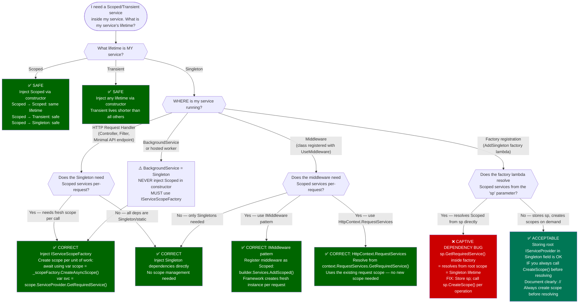

> [!success] Mastery Check
> - [ ] **Studied Well**
> - [ ] **Can explain the concept without notes**
> - [ ] **Can answer interview questions confidently**
> - [ ] **Can implement it in a real project**


# 4.042 — The Captive Dependency Problem: Singleton Consuming Scoped

---

## Part 0 — Navigation & Context

### Where This Topic Lives in the ASP.NET Core Domain

```
ASP.NET Core Mastery
└── Dependency Injection (DI)
    ├── 4.034 — The Built-In DI Container: Service Registration and Resolution
    ├── 4.035 — Service Lifetimes: Singleton, Scoped, Transient
    ├── 4.036 — Constructor Injection and Service Locator Anti-Pattern
    ├── 4.040 — Keyed Services (.NET 8+)
    ├── 4.041 — Options Pattern: IOptions, IOptionsSnapshot, IOptionsMonitor
    ├── ▶ 4.042 — The Captive Dependency Problem: Singleton Consuming Scoped  ◀ YOU ARE HERE
    ├── 4.046 — DI Validation at Startup: ValidateOnBuild and ValidateScopes
    ├── 4.047 — DI Scope in Background Services
    └── 4.054 — HttpContext and IHttpContextAccessor
```

### What You Need Before This

| Prerequisite | Why You Need It |
|---|---|
| [[4.034 — The Built-In DI Container: Service Registration and Resolution]] | You must understand how the DI container resolves services before understanding how resolution can go wrong |
| [[4.035 — Service Lifetimes: Singleton, Scoped, Transient]] | The captive dependency problem is a lifetime violation — you cannot understand the violation without knowing what the lifetimes promise |
| [[3.01 — DbContext Lifecycle and DI Scoping]] | DbContext is the most common victim of captive dependency capture; you need to understand why it is Scoped |

### What This Unlocks After

| Topic | How This Unlocks It |
|---|---|
| [[4.046 — DI Validation at Startup: ValidateOnBuild and ValidateScopes]] | You need to understand what captive dependency *is* before the validation that detects it makes sense |
| [[4.047 — DI Scope in Background Services]] | BackgroundService is a Singleton — the correct solution pattern uses `IServiceScopeFactory`, which you learn here |
| [[4.054 — HttpContext and IHttpContextAccessor]] | Understanding why `IHttpContextAccessor` is a *safe* Singleton despite holding per-request state requires knowing why normal Scoped capture is unsafe |

### Why This Topic Matters at Scale

> A Singleton that captures a Scoped `AppDbContext` turns your database connection into a shared, non-thread-safe resource that leaks across requests, corrupts concurrent writes, and never releases its EF Core change tracker — producing data corruption and memory growth that only manifests under load.

---

## Part 1 — The Core Mental Model

### The Fundamental Rule

> **When a Singleton service holds a direct reference to a Scoped service, the Scoped service's lifetime becomes Singleton by capture — it is never released at request end, accumulates state across all requests, and is shared concurrently across threads, violating every assumption that Scoped lifetime makes.**

---

### The Plain-Language Analogy

Imagine a hotel reception desk (Singleton) that checks in every guest (Scoped request context) and, instead of giving each guest their own room key card, hands each guest a **physical key that it borrowed from the first guest who ever checked in** — and keeps borrowing that same key forever.

The first guest's room key (Scoped object) is never returned to the key cabinet. Every guest who "checks in" gets the same key, unlocking the same room, reading the same "previous guest's suitcase" (stale EF Core ChangeTracker), and writing their dirty laundry into the same room (SaveChanges conflicts). When you ask "but what about Guest 2?" — Guest 2 is concurrently in that same room with Guest 1's luggage all over the bed. When you ask "but what about when the hotel closes?" — the key is still in the reception desk's drawer, the room is never cleaned, and the suitcase (memory) never gets collected.

The fix is simple: the reception desk does not hold a key at all. When a guest arrives, it goes to the key-making machine (`IServiceScopeFactory`), makes a **fresh key for that guest's stay**, uses it for exactly that stay, and disposes of it when the guest checks out — releasing the room for GC.

---

### The Taxonomy Diagram

```mermaid
graph TD
    subgraph Lifetimes["Service Lifetimes"]
        SG["Singleton\n(App lifetime)"]
        SC["Scoped\n(Per HTTP request)"]
        TR["Transient\n(Per resolution call)"]
    end

    subgraph Captive["Captive Dependency Problem"]
        CD1["Singleton → Scoped\n⚠️ CAPTIVE — Scoped becomes Singleton"]
        CD2["Singleton → Transient\n⚠️ CAPTIVE — Transient becomes Singleton"]
        CD3["Scoped → Transient\n✅ SAFE — Transient freed with scope"]
        CD4["Scoped → Singleton\n✅ SAFE — Singleton outlives scope"]
        CD5["Transient → Singleton\n✅ SAFE — Singleton outlives transient"]
    end

    subgraph Consequences["Consequences"]
        ML["Memory Leak\n(Scoped object never GC'd)"]
        DC["Data Corruption\n(Shared EF ChangeTracker)"]
        RC["Race Conditions\n(Concurrent thread access)"]
    end

    subgraph Detection["Detection Mechanisms"]
        VS["ValidateScopes=true\nThrows at startup"]
        VOB["ValidateOnBuild=true\nThrows at app.Build()"]
        RZ["Roslyn DI Analyzer\nCompile-time warning"]
    end

    subgraph Solutions["Correct Solutions"]
        ISF["IServiceScopeFactory\n(Create scope per unit of work)"]
        ISP["IServiceProvider capture\n(Acceptable in Singleton if you create scopes)"]
        ALC["AsyncLocal pattern\n(IHttpContextAccessor — exception)"]
    end

    SG --> CD1
    SG --> CD2
    SC --> CD3
    SC --> CD4
    TR --> CD5

    CD1 --> ML
    CD1 --> DC
    CD1 --> RC
    CD2 --> ML
    CD2 --> RC

    CD1 --> VS
    CD1 --> VOB
    CD1 --> RZ

    CD1 --> ISF
    CD2 --> ISF
    CD1 --> ISP

    style CD1 fill:#ff4444,color:#fff
    style CD2 fill:#ff8800,color:#fff
    style CD3 fill:#44aa44,color:#fff
    style CD4 fill:#44aa44,color:#fff
    style CD5 fill:#44aa44,color:#fff
    style ML fill:#cc0000,color:#fff
    style DC fill:#cc0000,color:#fff
    style RC fill:#cc0000,color:#fff
    style VS fill:#0055aa,color:#fff
    style VOB fill:#0055aa,color:#fff
    style RZ fill:#0055aa,color:#fff
    style ISF fill:#006600,color:#fff
    style ISP fill:#006600,color:#fff
    style ALC fill:#007755,color:#fff
```



---

## Part 2 — Deep Mechanics

### 2.1 — What the Container Does When a Singleton Resolves a Scoped Service

#### Pipeline Position

The DI container resolution happens *before* any middleware runs. When the application starts, the service provider is built. When a request arrives, the container creates a new `IServiceScope` at the entry point of the middleware pipeline. All services resolved within that scope share the scope boundary — services injected into middleware, filters, and endpoint handlers.

```
Application Startup
│
├── services.AddSingleton<IPaymentCache, PaymentCache>()
├── services.AddScoped<AppDbContext>()         ← Scoped: one per request
├── services.AddSingleton<IPaymentGateway, PaymentGateway>(
│       PaymentGateway depends on AppDbContext ← ⚠️ CAPTIVE!
│   )
└── app.Build() → ServiceProvider created
         │
         ├── ValidateScopes=true → throws here if captive detected
         └── OK if validation disabled

HTTP Request arrives:
│
├── Kestrel accepts connection
├── IServiceScope created (root scope for this HTTP request)
│       │
│       ├── ──► ExceptionHandler ──► HSTS ──► Routing ──► Auth ──► Endpoint
│       │         ↑ each middleware resolved from this request scope
│       │
│       └── Scope disposed at end of request → Scoped services released
│
│   BUT if Singleton captured Scoped at startup resolution:
│       └── Scoped service lives in Singleton's field → NEVER released
│               └── GC cannot collect it → memory leak
│                   └── EF ChangeTracker accumulates all requests' entities
```

#### ASP.NET Core Internally (Approximate)

The `ServiceProvider` maintains separate `CallSiteRuntimeResolver` caches by lifetime. When a Singleton is first resolved, `CallSiteFactory` walks the dependency graph. If it encounters a Scoped dependency in a Singleton's constructor, and `ValidateScopes` is `true`, it throws an `InvalidOperationException`.

```csharp
// Microsoft.Extensions.DependencyInjection source (approximate):
// ServiceProvider.cs → ServiceProviderEngine → CallSiteRuntimeResolver

internal sealed class CallSiteRuntimeResolver
{
    public object Resolve(ServiceCallSite callSite, RuntimeResolverContext context)
    {
        // For Singleton lifetime:
        if (callSite.Cache.Location == CallSiteResultCacheLocation.Root)
        {
            // Resolves from the ROOT provider, not from the request scope.
            // If a dependency is Scoped, it would be resolved from root too —
            // but the root has no "request scope", so the Scoped service is
            // treated as if it lives at root = Singleton lifetime by accident.
            return ResolveFromRootScope(callSite, context);
        }
        
        // ValidateScopes check (simplified):
        if (_validateScopes && 
            callSite.Cache.Location == CallSiteResultCacheLocation.Scope &&
            context.Scope == _rootScope)
        {
            throw new InvalidOperationException(
                $"Cannot consume scoped service '{callSite.ServiceType}' " +
                $"from singleton '{context.CurrentCallSite.ServiceType}'.");
        }
    }
}
```

**Cost label**: ~0 allocations per request for the captive service (it was allocated once at singleton resolution time) — but the *problem* is that zero allocations means zero releases. The Scoped service is effectively immortal.

#### HTTP Wire Format

The captive dependency problem does **not** produce an immediate HTTP error in production (unless `ValidateScopes` is enabled). The failure is silent and cumulative:

```
// Request 1 — succeeds but seeds the problem:
POST /api/payments/process HTTP/1.1
Host: payments.internal
Content-Type: application/json

{"amount": 100.00, "orderId": "ord-001"}

HTTP/1.1 200 OK
Content-Type: application/json

{"paymentId": "pay-001", "status": "Approved"}

// Request 2 — same Singleton, same captured DbContext:
// EF ChangeTracker still contains entities from Request 1
// DbContext connection may already be in use (concurrent request)

POST /api/payments/process HTTP/1.1
Host: payments.internal
Content-Type: application/json

{"amount": 200.00, "orderId": "ord-002"}

// HTTP/1.1 500 Internal Server Error  ← Eventual outcome
// Content-Type: application/problem+json
// {
//   "type": "...",
//   "title": "An error occurred while saving the entity changes.",
//   "detail": "A second operation was started on this context instance before 
//              a previous asynchronous operation completed."
// }

// — OR — silently wrong data because ChangeTracker has stale entities:
// HTTP/1.1 200 OK   ← No error, just wrong data — the worst outcome
```

---

### 2.2 — The Three Consequences: Memory, Data, Concurrency

#### Memory Leak Anatomy

When `AppDbContext` is captured inside a Singleton, the reference chain prevents GC:

```
GC Root
  └── ServiceProvider (Singleton, lives for app lifetime)
        └── PaymentGateway (Singleton instance)
              └── _dbContext field → AppDbContext instance
                    ├── ChangeTracker → List<EntityEntry> (grows with each request)
                    ├── Database.Connection → DbConnection (may be open)
                    └── Internal state → never reset between requests

// After 10,000 requests through this singleton:
// ChangeTracker.Entries.Count() = 10,000+ (if no explicit Clear())
// Memory profile: Steady growth, never drops
// dotnet-counters output:
//   gc-heap-size            [MB]    15 → 42 → 89 → 178 (never released)
//   gen-2-gc-count                  growing → eventually OOM
```

**Cost label**: O(n) memory growth where n = number of requests; entities tracked by the EF ChangeTracker accumulate indefinitely, causing Gen2 GC pressure and ultimately OOM in long-running production services.

#### Data Corruption Anatomy

EF Core's `DbContext` is explicitly documented as **not thread-safe**. When two concurrent HTTP requests hit the same captured `DbContext`:

```
Thread A (Request: order-001)          Thread B (Request: order-002)
│                                      │
├── dbContext.Orders.Add(order001)     │
│                                      ├── dbContext.Orders.Add(order002)
│                                      │
├── await dbContext.SaveChangesAsync() │
│         ← reads internal state       ├── await dbContext.SaveChangesAsync()
│                                      │         ← CONCURRENT access to same object
│                                      │
└── InvalidOperationException          └── InvalidOperationException
    "A second operation was started        OR SaveChanges commits order001's
     on this context instance before        data with order002's SaveChanges call
     a previous asynchronous operation      → wrong data in database
     completed."
```

**Cost label**: Non-deterministic. Race window is the async gap between `Add()` and `SaveChangesAsync()`. Under low load, the race may never trigger. Under load (>50 concurrent requests), it manifests consistently — which is why this bug often passes all tests.

#### The "Transient Inside Singleton" Variant

The same captive problem applies to Transient services inside Singletons. A Transient `IPaymentNotificationSender` normally receives a fresh instance per resolution. But inside a Singleton's constructor, it is resolved once at application startup and stored forever:

```csharp
// Transient is supposed to be "new instance every time"
// But inside a Singleton constructor, it's resolved ONCE:

public class PaymentGateway  // Singleton
{
    private readonly IPaymentNotificationSender _sender; // Transient — but captured!
    
    public PaymentGateway(IPaymentNotificationSender sender)
    {
        _sender = sender; // Resolved once at app startup. Never refreshed.
                          // If sender holds open HTTP connections, they are never
                          // cycled. If sender has state (e.g., retry counters),
                          // it accumulates across all payment requests.
    }
}
```

**Cost label**: ~0 additional allocations per request (captive means no new instance is created). But behavioral cost is high: any Transient designed to be stateless per-call is now stateful across all calls.

---

### 2.3 — Detection: ValidateScopes and ValidateOnBuild

#### Pipeline Position: Startup, Before Any HTTP Request

```
Program.cs execution
│
├── var builder = WebApplication.CreateBuilder(args)
├── builder.Services.AddScoped<AppDbContext>()
├── builder.Services.AddSingleton<IPaymentGateway, PaymentGateway>()
│         ← PaymentGateway's ctor requires AppDbContext (Scoped) — captive!
│
├── var app = builder.Build()
│         ↑
│         ServiceProvider is built here.
│         ValidateOnBuild=true → validates HERE, before any request arrives.
│         ValidateScopes=true  → validates at first resolution if not ValidateOnBuild.
│
└── app.Run()
      ↑
      Only reached if no validation error thrown.
      In Development: ValidateScopes=true by default.
      In Production:  ValidateScopes=false by default (⚠️ dangerous).
```

#### What Each Option Does

```csharp
// ASP.NET Core 8 default behavior by environment:

// Development (WebApplication.CreateBuilder sets these automatically):
// ServiceProviderOptions { ValidateScopes = true, ValidateOnBuild = false }
// → ValidateScopes: throws when a Scoped service is resolved from the root scope
// → ValidateOnBuild: false — validation happens lazily at first resolution

// To enable the strictest validation (recommended for all environments):
builder.Host.UseDefaultServiceProvider((context, options) =>
{
    // ValidateScopes: detects Singleton→Scoped captive dependency
    options.ValidateScopes = true;
    
    // ValidateOnBuild: walks the ENTIRE dependency tree at Build() time.
    // Throws before the app starts if ANY registration has a captive dependency.
    // This is the "compile-time" equivalent for DI.
    options.ValidateOnBuild = true;
});

// Or equivalently for the service provider directly:
var serviceProvider = services.BuildServiceProvider(
    new ServiceProviderOptions 
    { 
        ValidateScopes = true,   // Detect captive: Singleton consuming Scoped
        ValidateOnBuild = true   // Check entire graph at build time, not lazily
    });
```

#### The Exception Message — What It Looks Like

```
System.InvalidOperationException: Cannot consume scoped service 
'Payments.Infrastructure.Data.AppDbContext' from singleton 
'Payments.Core.Services.PaymentGateway'.

Stack trace:
   at Microsoft.Extensions.DependencyInjection.ServiceLookup.CallSiteValidator
      .ValidateResolution(Type serviceType, IServiceScope scope, IServiceScope rootScope)
   at Microsoft.Extensions.DependencyInjection.ServiceProvider
      .GetService(Type serviceType, ServiceProviderEngineScope serviceProviderEngineScope)
   ...
```

**Cost label**: Zero runtime cost for detection — it throws at startup, before any request is handled. ValidateOnBuild performs a full graph walk: O(n) where n is the number of service registrations. For typical apps (500-2000 registrations), this is under 50ms at startup.

#### Default Behavior: The Production Trap

```csharp
// ⚠️ WARNING: In Production, ValidateScopes defaults to FALSE
// This means captive dependencies are SILENTLY swallowed in production
// and only fail with data corruption or concurrency exceptions under load.

// ASP.NET Core source: WebApplication.CreateBuilder()
// → HostingHostBuilderExtensions.cs
// → UseDefaultServiceProvider sets ValidateScopes=true ONLY in Development.

// Production env: no validation → no startup exception → bug ships to prod.
// This is the most dangerous aspect of the captive dependency problem.
```

---

### 2.4 — The IServiceScopeFactory Solution: Correct Lifetime Bridging

#### The Fundamental Inversion

The correct solution does NOT inject the Scoped service into the Singleton. Instead, it injects the **mechanism to create scopes** (`IServiceScopeFactory`) and creates a fresh scope per unit of work:

```
WRONG pattern (Singleton holds Scoped directly):
─────────────────────────────────────────────────
PaymentGateway (Singleton)
    └── _dbContext: AppDbContext  ← captured forever
                                     one instance, all requests

CORRECT pattern (Singleton holds scope factory):
─────────────────────────────────────────────────
PaymentGateway (Singleton)
    └── _scopeFactory: IServiceScopeFactory  ← safe Singleton

    Per method call:
    └── using var scope = _scopeFactory.CreateScope()
            └── scope.ServiceProvider.GetRequiredService<AppDbContext>()
                    └── fresh Scoped instance, disposed with the using block
                            → GC eligible immediately after using block exits
```

#### ASP.NET Core Internally: IServiceScopeFactory

`IServiceScopeFactory` is itself registered as a Singleton by the DI container. Its `CreateScope()` method creates a new `ServiceProviderEngineScope` — a child service provider that has its own cache for Scoped services. When you call `scope.Dispose()`, the engine scope releases all Scoped services it created, exactly as an HTTP request scope would.

```csharp
// Microsoft.Extensions.DependencyInjection source (approximate):
// ServiceProvider.cs → IServiceScopeFactory implementation

internal sealed class ServiceProvider : IServiceScopeFactory
{
    public IServiceScope CreateScope()
    {
        // Creates a new ServiceProviderEngineScope
        // This scope has its own _resolvedServices cache
        // Scoped services resolved within it live until scope.Dispose()
        return new ServiceProviderEngineScope(this, isRootScope: false);
    }
}

// ServiceProviderEngineScope.Dispose():
public void Dispose()
{
    lock (_disposables)
    {
        foreach (var disposable in _disposables)
        {
            disposable.Dispose(); // Calls Dispose on every Scoped service created in scope
        }
        _resolvedServices.Clear(); // Releases all references → GC eligible
    }
}
```

**Cost label**: `CreateScope()` allocates 1 `ServiceProviderEngineScope` object (~200 bytes) + the Scoped services within it. For a `DbContext`, this is comparable to what happens on every HTTP request anyway — the scope creation cost is not the issue; the disposal guarantee is the benefit.

#### HTTP Wire Format: Correct Behavior With Scoped Lifetime

```
// Request 1:
POST /api/payments/process HTTP/1.1
Content-Type: application/json
{"amount": 100.00, "orderId": "ord-001"}

→ PaymentGateway.ProcessAsync() called
→ using var scope = _scopeFactory.CreateScope()    ← new scope created
→ var db = scope.ServiceProvider.GetRequiredService<AppDbContext>()  ← fresh DbContext
→ db.Orders.Find("ord-001") → query executes
→ db.SaveChangesAsync() → commits
→ scope.Dispose()                                  ← DbContext.Dispose() called
                                                     Connection returned to pool
                                                     ChangeTracker cleared
HTTP/1.1 200 OK
{"paymentId": "pay-001", "status": "Approved"}

// Request 2 (concurrent):
→ New scope created independently
→ Completely separate DbContext instance
→ No shared state with Request 1
→ Safe concurrent execution
HTTP/1.1 200 OK
{"paymentId": "pay-002", "status": "Approved"}
```

---

### 2.5 — Why IHttpContextAccessor Is NOT a Captive Dependency

This is the **most important exception to the rule** that every senior engineer must understand precisely.

`IHttpContextAccessor` is registered as a **Singleton** yet it holds per-request `HttpContext` data. This appears to be exactly the captive dependency pattern. It is not — because it uses `AsyncLocal<T>`:

```csharp
// Microsoft.AspNetCore.Http source (approximate):
// HttpContextAccessor.cs

public class HttpContextAccessor : IHttpContextAccessor
{
    // AsyncLocal stores a different value per async execution context.
    // Each HTTP request runs in its own async execution context (established by Kestrel).
    // When request A sets HttpContext, request B's AsyncLocal still returns null
    // (or request B's own HttpContext).
    private static readonly AsyncLocal<HttpContextHolder> _httpContextCurrent = 
        new AsyncLocal<HttpContextHolder>();

    public HttpContext? HttpContext
    {
        get => _httpContextCurrent.Value?.Context;
        set
        {
            // Called by HttpContextMiddleware at the start of each request.
            var holder = _httpContextCurrent.Value;
            if (holder != null) holder.Context = null; // Unroot from previous
            if (value != null)
            {
                _httpContextCurrent.Value = new HttpContextHolder { Context = value };
            }
        }
    }
    
    private sealed class HttpContextHolder
    {
        public HttpContext? Context;
    }
}
```

The critical distinction:

| Property | Normal Captive Scoped | IHttpContextAccessor |
|---|---|---|
| Storage mechanism | Field on Singleton instance | `AsyncLocal<T>` — per async-context |
| Shared across requests? | ✅ YES — shared field | ❌ NO — isolated per async context |
| Memory leak? | ✅ YES — never released | ❌ NO — HttpContext is replaced each request |
| Thread-safe? | ❌ NO | ✅ YES — AsyncLocal isolates per execution context |
| Correct to inject into Singleton? | ❌ Never | ✅ Yes — designed for this |

**Cost label**: `AsyncLocal<T>` reads/writes cost ~3-5 ns (dictionary lookup in async context). This is negligible for HTTP request handling. The important point is that `IHttpContextAccessor` is a pattern specifically designed to be Singleton-safe by isolating state per async context — it is the exception, not the model to emulate.

> [!WARNING]
> Do NOT use `IHttpContextAccessor` as a model for how to safely hold Scoped data in a Singleton. Its safety relies entirely on `AsyncLocal<T>`, which requires careful management of async context boundaries. If you use `AsyncLocal<T>` incorrectly in your own code (e.g., setting a value in a fire-and-forget Task), you will get the same class of bugs as captive dependency — just harder to diagnose.

---

### 2.6 — The Root Scope Anti-Pattern: Capturing IServiceProvider

A related but distinct pattern is capturing the `IServiceProvider` root directly in a Singleton and calling `GetService<T>()` on it. This is sometimes used to "avoid" captive dependency but actually recreates it:

```
Root IServiceProvider (app lifetime)
│
└── Singleton captures root IServiceProvider
      └── rootProvider.GetRequiredService<AppDbContext>()
                    ↑
                    This resolves AppDbContext from the ROOT scope.
                    Root scope has Singleton lifetime.
                    AppDbContext is now Singleton. Same problem.
```

The correct root `IServiceProvider` capture pattern requires explicitly creating a scope:

```csharp
// ⚠️ WRONG: Resolving Scoped from root IServiceProvider directly
public class PaymentGateway
{
    private readonly IServiceProvider _provider; // capturing root
    
    public async Task ProcessAsync(PaymentRequest req)
    {
        // This resolves AppDbContext from the ROOT scope → Singleton lifetime!
        var db = _provider.GetRequiredService<AppDbContext>(); // ⚠️ CAPTIVE!
        await db.Payments.AddAsync(new Payment(req));
        await db.SaveChangesAsync();
    }
}

// ✅ CORRECT: Creating a child scope from the captured IServiceProvider
public class PaymentGateway
{
    private readonly IServiceProvider _provider; // capturing root — acceptable
    
    public async Task ProcessAsync(PaymentRequest req)
    {
        // Create a child scope → scoped resolution is correct lifetime
        using var scope = _provider.CreateScope(); // IServiceProvider.CreateScope() extension
        var db = scope.ServiceProvider.GetRequiredService<AppDbContext>(); // ✅ Scoped
        await db.Payments.AddAsync(new Payment(req));
        await db.SaveChangesAsync();
        // scope.Dispose() → db.Dispose() → connection returned to pool
    }
}
```

**Cost label**: `_provider.CreateScope()` is equivalent to `IServiceScopeFactory.CreateScope()` — 1 allocation for the scope object. Both approaches create a `ServiceProviderEngineScope`. `IServiceScopeFactory` is preferred by convention because it makes the intent explicit and does not expose the root `IServiceProvider`.

---

## Part 3 — Production Code Patterns

### Pattern 1: The Scope-Per-Operation Singleton

**Domain**: Payment processing service — `PaymentGateway` is a Singleton (manages HTTP client pool, rate limiter state), but each payment operation needs a fresh `AppDbContext`.

```csharp
// ⚠️ WRONG: Injecting DbContext into Singleton
public class PaymentGateway : IPaymentGateway
{
    private readonly AppDbContext _dbContext;           // ⚠️ Captive! Scoped in Singleton
    private readonly IPaymentProviderClient _client;
    
    // This constructor runs ONCE at app startup.
    // _dbContext is the AppDbContext that was alive when the Singleton was first resolved.
    // It is NEVER replaced across the app's lifetime.
    public PaymentGateway(AppDbContext dbContext, IPaymentProviderClient client)
    {
        _dbContext = dbContext;
        _client = client;
    }
    
    public async Task<PaymentResult> ProcessAsync(PaymentRequest request)
    {
        // ⚠️ By request 100, ChangeTracker has 99 stale entities
        // ⚠️ Under concurrent load: InvalidOperationException from EF concurrent access
        var existingPayment = await _dbContext.Payments
            .FirstOrDefaultAsync(p => p.OrderId == request.OrderId);
        
        if (existingPayment != null)
            return PaymentResult.AlreadyProcessed(existingPayment.PaymentId);
            
        var result = await _client.ChargeAsync(request.Amount, request.CardToken);
        
        _dbContext.Payments.Add(new Payment 
        { 
            OrderId = request.OrderId, 
            Amount = request.Amount,
            Status = result.Status 
        });
        
        await _dbContext.SaveChangesAsync(); // ⚠️ Race condition if concurrent
        return result;
    }
}

// ✅ CORRECT: IServiceScopeFactory injection into Singleton
public class PaymentGateway : IPaymentGateway
{
    // IServiceScopeFactory is registered as Singleton by the DI container.
    // Safe to hold in a Singleton field — it IS a Singleton.
    private readonly IServiceScopeFactory _scopeFactory;
    private readonly IPaymentProviderClient _client;
    
    public PaymentGateway(IServiceScopeFactory scopeFactory, IPaymentProviderClient client)
    {
        _scopeFactory = scopeFactory;
        _client = client;
    }
    
    public async Task<PaymentResult> ProcessAsync(PaymentRequest request)
    {
        // Create a scope for this unit of work.
        // The scope boundary = the lifetime of this payment operation.
        // using ensures Dispose() is called even on exception.
        await using var scope = _scopeFactory.CreateAsyncScope(); // .NET 6+ async-disposable
        
        // Fresh AppDbContext, resolved from the child scope.
        // This DbContext has an empty ChangeTracker.
        // It will be disposed when scope is disposed.
        var db = scope.ServiceProvider.GetRequiredService<AppDbContext>();
        
        var existingPayment = await db.Payments
            .AsNoTracking() // No tracking needed for reads — reduces ChangeTracker pressure
            .FirstOrDefaultAsync(p => p.OrderId == request.OrderId);
        
        if (existingPayment != null)
            return PaymentResult.AlreadyProcessed(existingPayment.PaymentId);
        
        // Charge the external provider (outside the DB operation)
        var chargeResult = await _client.ChargeAsync(request.Amount, request.CardToken);
        
        db.Payments.Add(new Payment 
        { 
            OrderId = request.OrderId, 
            Amount = request.Amount,
            Status = chargeResult.Status,
            ExternalId = chargeResult.TransactionId
        });
        
        await db.SaveChangesAsync();
        
        return chargeResult;
        // scope.DisposeAsync() called here → db.DisposeAsync() called
        // → EF Core connection returned to connection pool
        // → ChangeTracker freed → GC eligible
    }
}

// Registration:
builder.Services.AddSingleton<IPaymentGateway, PaymentGateway>();
builder.Services.AddScoped<AppDbContext>(); // Scoped — one per HTTP request (or per scope)
builder.Services.AddSingleton<IPaymentProviderClient, StripeClient>(); // Singleton — safe

// HTTP wire effect:
// POST /api/payments/process → 200 OK (idempotent, correct isolation)
// POST /api/payments/process (concurrent) → 200 OK (separate scopes, no race)
```

---

### Pattern 2: The Background Service Scope-Per-Cycle Pattern

**Domain**: Order fulfillment — `OrderFulfillmentWorker` is a `BackgroundService` (inherently Singleton), processing pending orders every 30 seconds. It needs `AppDbContext` and `IInventoryService` (both Scoped).

```csharp
// BackgroundService is registered as a Singleton (IHostedService → Singleton by convention).
// It runs for the entire application lifetime.
// It MUST NOT hold Scoped dependencies in fields.

public class OrderFulfillmentWorker : BackgroundService
{
    private readonly IServiceScopeFactory _scopeFactory;
    private readonly ILogger<OrderFulfillmentWorker> _logger;

    public OrderFulfillmentWorker(
        IServiceScopeFactory scopeFactory,           // Singleton → Singleton: safe
        ILogger<OrderFulfillmentWorker> logger)      // Singleton → Singleton: safe
    {
        _scopeFactory = scopeFactory;
        _logger = logger;
    }

    protected override async Task ExecuteAsync(CancellationToken stoppingToken)
    {
        _logger.LogInformation("Order fulfillment worker started");

        while (!stoppingToken.IsCancellationRequested)
        {
            // One scope per fulfillment cycle.
            // This means one DbContext per cycle — not one per message.
            // If you need one per message/order, create the scope inside the inner loop.
            await using var scope = _scopeFactory.CreateAsyncScope();
            
            try
            {
                await FulfillPendingOrdersAsync(scope.ServiceProvider, stoppingToken);
            }
            catch (Exception ex) when (ex is not OperationCanceledException)
            {
                _logger.LogError(ex, "Error during order fulfillment cycle");
                // Scope disposed here → DbContext disposed → clean state next cycle
            }
            // scope.DisposeAsync() called here regardless of exception
            
            await Task.Delay(TimeSpan.FromSeconds(30), stoppingToken);
        }
    }

    private async Task FulfillPendingOrdersAsync(
        IServiceProvider scopedProvider, 
        CancellationToken ct)
    {
        var db = scopedProvider.GetRequiredService<AppDbContext>();
        var inventoryService = scopedProvider.GetRequiredService<IInventoryService>();
        
        // Query pending orders — ChangeTracker is clean at start of each cycle
        var pendingOrders = await db.Orders
            .Where(o => o.Status == OrderStatus.Pending)
            .OrderBy(o => o.CreatedAt)
            .Take(100) // Bounded batch — prevents single cycle from starving
            .ToListAsync(ct);
        
        foreach (var order in pendingOrders)
        {
            var reservationResult = await inventoryService.ReserveItemsAsync(
                order.OrderId, order.Items, ct);
            
            order.Status = reservationResult.Success 
                ? OrderStatus.Reserved 
                : OrderStatus.InsufficientInventory;
        }
        
        // Single SaveChanges for the entire batch — one round-trip
        await db.SaveChangesAsync(ct);
        
        _logger.LogInformation("Fulfilled {Count} orders", pendingOrders.Count);
    }
}

// Registration:
builder.Services.AddHostedService<OrderFulfillmentWorker>();
builder.Services.AddScoped<AppDbContext>();
builder.Services.AddScoped<IInventoryService, InventoryService>();
```

---

### Pattern 3: The Startup Validation Guardrail

**Domain**: Payment service — ensuring captive dependencies are caught at startup in ALL environments, not just Development.

```csharp
// Program.cs — Payment Service API

var builder = WebApplication.CreateBuilder(args);

// Configure DI validation for ALL environments, not just Development.
// Default: ValidateScopes=true only in Development. This is insufficient for production safety.
// ⚠️ WRONG (default behavior — unsafe in production):
// ValidateScopes is false in Production → captive dependencies ship undetected

// ✅ CORRECT: Override for all environments
builder.Host.UseDefaultServiceProvider((context, options) =>
{
    // ValidateScopes: throws when a Scoped service is resolved from a Singleton's constructor
    // or from the root IServiceProvider without creating a child scope.
    options.ValidateScopes = true;
    
    // ValidateOnBuild: walks the ENTIRE dependency graph when app.Build() is called.
    // This catches ALL captive dependencies before any HTTP request is processed.
    // Cost: adds ~50-200ms to startup time (worth it for correctness guarantees).
    // Disable in production if startup time is critical (but keep ValidateScopes=true).
    options.ValidateOnBuild = context.HostingEnvironment.IsDevelopment() || 
                               context.HostingEnvironment.IsStaging();
});

// Service registrations — payment domain
builder.Services.AddScoped<AppDbContext>(); // Scoped: one per HTTP request
builder.Services.AddScoped<IPaymentRepository, PaymentRepository>();
builder.Services.AddScoped<IOrderRepository, OrderRepository>();
builder.Services.AddSingleton<IPaymentProviderClient, StripePaymentClient>(); // Singleton: HTTP client pool
builder.Services.AddSingleton<IPaymentGateway, PaymentGateway>(); // Singleton: uses IServiceScopeFactory

// This registration would THROW at Build() with ValidateOnBuild=true:
// builder.Services.AddSingleton<IBadService>(sp => 
//     new BadService(sp.GetRequiredService<AppDbContext>())); // ← Captive! 

var app = builder.Build(); // ← ValidateOnBuild check runs HERE

// HTTP pipeline
app.UseExceptionHandler("/error");
app.UseHttpsRedirection();
app.UseAuthentication();
app.UseAuthorization();
app.MapControllers();

app.Run();
```

---

### Pattern 4: The Factory-Captured-Provider Pattern

**Domain**: Inventory cache service — a Singleton cache that needs on-demand access to Scoped services for cache-miss resolution. The factory lambda captures `IServiceProvider` (the root), which is acceptable because it creates scopes:

```csharp
// This pattern is appropriate when:
// 1. You cannot use constructor injection (e.g., complex factory logic)
// 2. You need the Singleton to create scopes on demand
// 3. You want to avoid IServiceScopeFactory as a constructor parameter

// ⚠️ WRONG: Factory captures root and resolves Scoped directly
builder.Services.AddSingleton<IInventoryCache>(sp =>
{
    // sp here is the ROOT IServiceProvider (Singleton scope)
    // Resolving AppDbContext from sp directly = captive dependency
    var db = sp.GetRequiredService<AppDbContext>(); // ⚠️ Captive!
    return new InventoryCache(db); // ⚠️ db will never be released
});

// ✅ CORRECT: Factory captures root IServiceProvider but passes it to constructor
// Service creates scopes on demand (never resolves Scoped from root directly)
builder.Services.AddSingleton<IInventoryCache>(sp =>
{
    // Capturing the root IServiceProvider in the Singleton is acceptable
    // IF the service always creates child scopes before resolving Scoped services.
    // The root sp itself is a Singleton — safe to hold as a field.
    return new InventoryCache(sp);
});

public class InventoryCache : IInventoryCache
{
    private readonly IServiceProvider _rootProvider; // root — acceptable
    private readonly IMemoryCache _cache;
    
    public InventoryCache(IServiceProvider rootProvider)
    {
        _rootProvider = rootProvider;
        _cache = new MemoryCache(new MemoryCacheOptions());
    }
    
    public async Task<InventoryLevel> GetInventoryLevelAsync(
        string productSku, 
        CancellationToken ct = default)
    {
        return await _cache.GetOrCreateAsync(
            $"inventory:{productSku}",
            async entry =>
            {
                entry.AbsoluteExpirationRelativeToNow = TimeSpan.FromMinutes(5);
                
                // Cache miss → resolve from database using a fresh scope
                await using var scope = _rootProvider.CreateScope();
                var db = scope.ServiceProvider.GetRequiredService<AppDbContext>();
                
                return await db.InventoryLevels
                    .AsNoTracking()
                    .Where(i => i.ProductSku == productSku)
                    .Select(i => new InventoryLevel(i.ProductSku, i.Quantity, i.WarehouseId))
                    .FirstOrDefaultAsync(ct)
                    ?? InventoryLevel.OutOfStock(productSku);
                
                // scope.DisposeAsync() → db disposed → connection returned to pool
            }) ?? InventoryLevel.OutOfStock(productSku);
    }
}

// HTTP wire effect:
// GET /api/inventory/SKU-001 HTTP/1.1
// → Cache hit:  HTTP/1.1 200 OK (no DB round-trip, ~0.1ms)
// → Cache miss: HTTP/1.1 200 OK (one DB scope created, disposed, ~5ms)
// Both paths safe from captive dependency
```

---

### Pattern 5: The Roslyn Analyzer Integration Pattern

**Domain**: Enterprise payment platform CI/CD — using the DI analyzer to catch captive dependencies at compile time in all projects.

```xml
<!-- In the payment service .csproj — add the DI analyzer package -->
<Project Sdk="Microsoft.NET.Sdk.Web">
  <PropertyGroup>
    <TargetFramework>net8.0</TargetFramework>
  </PropertyGroup>
  
  <ItemGroup>
    <!-- 
      Microsoft.Extensions.DependencyInjection.Analyzers provides:
      - MSDIAG001: Do not register IDisposable services with transient lifetime
      - MSDIAG002: Scoped service injected into Singleton (captive dependency)
      These produce build errors/warnings at compile time.
      Available from .NET 7+ as part of the SDK.
    -->
    <PackageReference Include="Microsoft.Extensions.DependencyInjection.Analyzers" 
                      Version="8.0.0" />
  </ItemGroup>
</Project>
```

```csharp
// With the analyzer installed, this code produces a build warning:
// MSDIAG002: 'AppDbContext' is a scoped service being injected into singleton 'PaymentGateway'

// payments/PaymentGateway.cs
public class PaymentGateway // registered as Singleton
{
    // ← compiler warning here: captive dependency detected
    public PaymentGateway(AppDbContext dbContext) // AppDbContext is Scoped
    {
    }
}

// In .editorconfig, elevate to error for CI:
// [*.cs]
// dotnet_diagnostic.MSDIAG002.severity = error
```

```ini
# .editorconfig — make captive dependency analyzer findings build errors
[*.cs]
dotnet_diagnostic.MSDIAG002.severity = error
```

```csharp
// Custom test to detect captive dependencies across the entire assembly:
// Useful when the analyzer is not installed or for integration test suites.

// PaymentService.Tests/DependencyValidationTests.cs
public class DependencyValidationTests : IClassFixture<WebApplicationFactory<Program>>
{
    private readonly WebApplicationFactory<Program> _factory;
    
    public DependencyValidationTests(WebApplicationFactory<Program> factory)
    {
        _factory = factory;
    }
    
    [Fact]
    public void AllSingletonServices_DoNotCaptureScopedDependencies()
    {
        // This test instantiates the full DI container with ValidateScopes=true.
        // If any Singleton captures a Scoped service, this test fails.
        // Running this in CI catches captive dependencies before they reach production.
        
        var factory = _factory.WithWebHostBuilder(builder =>
        {
            builder.UseEnvironment("Production"); // Test Production configuration
            builder.ConfigureServices(services =>
            {
                // Override with strict validation
                services.Replace(ServiceDescriptor.Singleton<IServiceProviderFactory<IServiceCollection>>(
                    new DefaultServiceProviderFactory(new ServiceProviderOptions
                    {
                        ValidateScopes = true,
                        ValidateOnBuild = true
                    })));
            });
        });
        
        // If Build() throws, the test fails with a clear error message naming the captive dependency.
        var act = () => factory.CreateClient(); // Triggers app build
        act.Should().NotThrow<InvalidOperationException>();
    }
}
```

---

### Pattern 6: The IDisposable Scope Boundary in Middleware

**Domain**: Logistics tracking API — a middleware that needs Scoped services but the middleware itself is created as a Singleton by ASP.NET Core.

```csharp
// ⚠️ IMPORTANT: In ASP.NET Core, middleware is typically instantiated ONCE
// (unless you use IMiddlewareFactory with transient registration).
// If your middleware constructor takes Scoped dependencies, it is captive.

// ⚠️ WRONG: Middleware capturing Scoped service in constructor
public class ShipmentTrackingMiddleware
{
    private readonly RequestDelegate _next;
    private readonly IShipmentRepository _shipmentRepo; // ⚠️ Scoped in Singleton middleware!
    
    // This constructor is called ONCE when the middleware pipeline is built.
    // _shipmentRepo is the Scoped instance from that moment — captured forever.
    public ShipmentTrackingMiddleware(
        RequestDelegate next, 
        IShipmentRepository shipmentRepo) // ⚠️ CAPTIVE!
    {
        _next = next;
        _shipmentRepo = shipmentRepo;
    }
    
    public async Task InvokeAsync(HttpContext context)
    {
        // ⚠️ _shipmentRepo is shared across all concurrent requests
        await _next(context);
    }
}

// ✅ CORRECT APPROACH 1: Resolve Scoped services from HttpContext.RequestServices
// HttpContext.RequestServices is the per-request service scope — correct lifetime
public class ShipmentTrackingMiddleware
{
    private readonly RequestDelegate _next;
    
    // Constructor only receives Singleton services
    public ShipmentTrackingMiddleware(RequestDelegate next)
    {
        _next = next;
    }
    
    // InvokeAsync receives HttpContext — resolve Scoped services from it
    public async Task InvokeAsync(HttpContext context)
    {
        // HttpContext.RequestServices IS the per-request DI scope.
        // Resolving from it is safe and correct — this is the standard pattern.
        var shipmentRepo = context.RequestServices
            .GetRequiredService<IShipmentRepository>(); // Fresh Scoped instance per request
        
        var trackingHeader = context.Request.Headers["X-Shipment-Id"].ToString();
        
        if (!string.IsNullOrEmpty(trackingHeader))
        {
            var tracking = await shipmentRepo.GetTrackingAsync(trackingHeader);
            if (tracking != null)
            {
                context.Items["ShipmentTracking"] = tracking;
            }
        }
        
        await _next(context);
    }
}

// ✅ CORRECT APPROACH 2: Use IMiddleware interface (framework-managed Scoped middleware)
// ASP.NET Core creates a new instance per request when IMiddleware is used.
// Requires AddScoped<ShipmentAuditMiddleware>() registration.
public class ShipmentAuditMiddleware : IMiddleware
{
    private readonly IShipmentRepository _shipmentRepo; // Scoped: safe because IMiddleware is Scoped
    private readonly ILogger<ShipmentAuditMiddleware> _logger;
    
    // Constructor injection works correctly because the middleware IS Scoped when IMiddleware is used
    public ShipmentAuditMiddleware(
        IShipmentRepository shipmentRepo, 
        ILogger<ShipmentAuditMiddleware> logger)
    {
        _shipmentRepo = shipmentRepo;
        _logger = logger;
    }
    
    public async Task InvokeAsync(HttpContext context, RequestDelegate next)
    {
        await next(context);
        
        // Post-request: audit the shipment access
        var shipmentId = context.Items["ShipmentTracking"] as string;
        if (shipmentId != null)
        {
            await _shipmentRepo.RecordAccessAsync(shipmentId, context.User.Identity?.Name);
        }
    }
}

// Registration for IMiddleware pattern:
builder.Services.AddScoped<ShipmentAuditMiddleware>(); // Must be Scoped or Transient
app.UseMiddleware<ShipmentAuditMiddleware>(); // Framework creates per-request via IMiddlewareFactory

// HTTP consequence:
// GET /api/shipments/SHP-001/track HTTP/1.1
// → ShipmentAuditMiddleware instantiated fresh per request (IMiddleware)
// → _shipmentRepo is a fresh Scoped instance
// → No shared state between concurrent requests
// HTTP/1.1 200 OK
// {"shipmentId": "SHP-001", "status": "InTransit", "location": "Chicago, IL"}
```

---

### Pattern 7: The Scoped-Context-Per-Message Pattern (Event Consumer)

**Domain**: Order management — a MassTransit/messaging consumer that receives order events. The consumer may be created as a Singleton by the message bus infrastructure; it needs `AppDbContext` per message.

```csharp
// MassTransit consumers: MassTransit creates a consumer instance per message by default,
// but if you configure a Singleton consumer, or use a custom dispatch mechanism,
// you need the scope-per-message pattern.

// OrderCreatedConsumer.cs
// Registered as Singleton (e.g., in a custom consumer registry or Singleton message handler)
public class OrderEventProcessor : IOrderEventProcessor
{
    private readonly IServiceScopeFactory _scopeFactory;
    private readonly ILogger<OrderEventProcessor> _logger;

    public OrderEventProcessor(
        IServiceScopeFactory scopeFactory,
        ILogger<OrderEventProcessor> logger)
    {
        _scopeFactory = scopeFactory;
        _logger = logger;
    }

    public async Task HandleOrderCreatedAsync(
        OrderCreatedEvent orderEvent, 
        CancellationToken ct)
    {
        // One scope per message — ensures DbContext isolation between messages
        // even when messages are processed concurrently on the thread pool
        await using var scope = _scopeFactory.CreateAsyncScope();

        var db = scope.ServiceProvider.GetRequiredService<AppDbContext>();
        var notificationService = scope.ServiceProvider.GetRequiredService<INotificationService>();
        var warehouseService = scope.ServiceProvider.GetRequiredService<IWarehouseService>();

        // All three services share the same scope → same DbContext transaction if needed
        using var transaction = await db.Database.BeginTransactionAsync(ct);
        
        try
        {
            var order = new Order
            {
                OrderId = orderEvent.OrderId,
                CustomerId = orderEvent.CustomerId,
                Items = orderEvent.Items.Select(i => new OrderItem(i.Sku, i.Quantity)).ToList(),
                Status = OrderStatus.Confirmed,
                CreatedAt = orderEvent.Timestamp
            };
            
            db.Orders.Add(order);
            await db.SaveChangesAsync(ct);
            
            // Reserve inventory within the same transaction scope
            await warehouseService.ReserveForOrderAsync(order.OrderId, order.Items, ct);
            
            await transaction.CommitAsync(ct);
            
            // Send confirmation notification (outside transaction — at-least-once semantics)
            await notificationService.SendOrderConfirmationAsync(order.CustomerId, order.OrderId, ct);
            
            _logger.LogInformation("Processed OrderCreated event for order {OrderId}", 
                orderEvent.OrderId);
        }
        catch
        {
            await transaction.RollbackAsync(ct);
            throw; // Re-throw for dead-letter queue handling
        }
        // scope.DisposeAsync() → db, notificationService, warehouseService all disposed
    }
}
```

---

## Part 4 — Gotchas & Anti-Patterns

### Gotcha 1: ValidateScopes Disabled in Production — The Silent Ship

Experienced engineers enable `ValidateScopes=true` in Development, test on localhost, see no error, and consider the problem solved. The default in Production is `ValidateScopes=false`. The captive dependency ships to production and only manifests under load.

```csharp
// ⚠️ WRONG: Relying on default environment behavior
// Default: ValidateScopes=true in Development, FALSE in Production
// This means captive dependencies are caught locally but not in production.
var builder = WebApplication.CreateBuilder(args);
// No explicit ValidateScopes configuration — unsafe in Production
builder.Services.AddSingleton<IPaymentGateway, PaymentGateway>(); // captures DbContext
var app = builder.Build(); // No error in Production environment
app.Run(); // Ships. Manifests as EF concurrency exception under load.

// HTTP consequence (wrong path):
// POST /api/payments → 200 OK (works until concurrent load reveals the race)
// POST /api/payments (concurrent) → 500 Internal Server Error
// {"title": "A second operation was started on this context instance..."}

// ✅ CORRECT: Explicit ValidateScopes for all environments
builder.Host.UseDefaultServiceProvider((context, options) =>
{
    options.ValidateScopes = true; // Throw if Singleton resolves Scoped — all environments
    options.ValidateOnBuild = context.HostingEnvironment.IsDevelopment();
});

// HTTP consequence (correct path):
// app.Build() throws InvalidOperationException at startup:
// "Cannot consume scoped service 'AppDbContext' from singleton 'PaymentGateway'."
// Startup fails → deployment pipeline rejects → bug caught before any HTTP request.

// WHY: ValidateScopes=false in Production is an ASP.NET Core default chosen for performance
// reasons — validating every resolution adds overhead. But the correct engineering response
// is to use ValidateOnBuild=true in CI/Staging, which validates the full graph once at startup
// with zero per-request overhead.
```

---

### Gotcha 2: The HttpContext.RequestServices Shortcut Bypassed

Engineers who know to avoid constructor injection of Scoped services sometimes over-correct: they add IServiceScopeFactory to every service. In middleware, the correct pattern is `HttpContext.RequestServices` — which already IS the request scope. Creating a new scope from it doubles the scope depth and causes nested Scoped services to resolve a second instance.

```csharp
// ⚠️ WRONG: Creating a new scope inside middleware when RequestServices is available
public class OrderValidationMiddleware
{
    private readonly RequestDelegate _next;
    private readonly IServiceScopeFactory _scopeFactory;
    
    public OrderValidationMiddleware(RequestDelegate next, IServiceScopeFactory scopeFactory)
    {
        _next = next;
        _scopeFactory = scopeFactory;
    }
    
    public async Task InvokeAsync(HttpContext context)
    {
        // ⚠️ WRONG: Creating a NEW scope inside middleware when the request scope already exists
        using var scope = _scopeFactory.CreateScope();
        
        // This resolves a SECOND AppDbContext — different from the one that
        // will be used by the endpoint handler. Any changes tracked here are
        // invisible to the endpoint's DbContext. Worse: two connections open simultaneously.
        var db = scope.ServiceProvider.GetRequiredService<AppDbContext>();
        
        await _next(context);
    }
}

// HTTP consequence (wrong path):
// POST /api/orders → validates with DbContext A (in middleware scope)
//                 → saves with DbContext B (in endpoint scope)
// Validation and save use different connections — transaction isolation issues.
// Optimistic concurrency tokens from validation are stale by the time save happens.

// ✅ CORRECT: Use HttpContext.RequestServices (the existing request scope)
public class OrderValidationMiddleware
{
    private readonly RequestDelegate _next;
    
    public OrderValidationMiddleware(RequestDelegate next)
    {
        _next = next;
    }
    
    public async Task InvokeAsync(HttpContext context)
    {
        // HttpContext.RequestServices IS the per-request DI scope.
        // Every service resolved here shares the same scope as the endpoint handler.
        // AppDbContext resolved here is the SAME instance as in the endpoint.
        var db = context.RequestServices.GetRequiredService<AppDbContext>();
        var orderValidator = context.RequestServices.GetRequiredService<IOrderValidator>();
        
        var isValid = await orderValidator.ValidateAsync(context);
        if (!isValid)
        {
            context.Response.StatusCode = StatusCodes.Status400BadRequest;
            return; // Short-circuit
        }
        
        await _next(context);
    }
}

// HTTP consequence (correct path):
// POST /api/orders → validates with the request's DbContext
//                 → endpoint saves with the SAME DbContext
// Same connection, same transaction context, correct behavior.

// WHY: HttpContext.RequestServices is the IServiceScope created by the ASP.NET Core
// hosting infrastructure at the start of each HTTP request. It is the canonical
// "current request scope" — there is never a reason to create a new scope within
// middleware when you have access to HttpContext.
```

---

### Gotcha 3: The AsyncLocal Trap — Implementing a "Safe" Singleton Badly

Engineers who understand IHttpContextAccessor's AsyncLocal mechanism sometimes implement their own "request-context Singleton" without correctly managing the AsyncLocal lifecycle. The context leaks into fire-and-forget tasks or background continuations.

```csharp
// ⚠️ WRONG: Custom AsyncLocal context that leaks into background tasks
public class OrderContextAccessor : IOrderContextAccessor // registered as Singleton
{
    private static readonly AsyncLocal<OrderContext?> _current = new();
    
    public OrderContext? Current
    {
        get => _current.Value;
        set => _current.Value = value;
    }
}

// Middleware that sets the context:
public class OrderContextMiddleware
{
    private readonly RequestDelegate _next;
    private readonly IOrderContextAccessor _accessor;
    
    public async Task InvokeAsync(HttpContext context)
    {
        _accessor.Current = new OrderContext(context.Request.Headers["X-Order-Id"]);
        
        await _next(context);
        
        // ⚠️ WRONG: Clearing AFTER await means the async context has already propagated
        // to background continuations. Fire-and-forget tasks scheduled during _next()
        // will see the PREVIOUS request's OrderContext because AsyncLocal propagates
        // to child contexts at the time of Task creation, not Task completion.
        _accessor.Current = null; // Too late — already leaked to spawned tasks
    }
}

// HTTP consequence (wrong path):
// Request 1: X-Order-Id: ord-001 → OrderContext.Current = ord-001
// Background Task (spawned during Request 1 handling): sees Current = ord-001
// Request 2 (different connection): X-Order-Id: ord-002
// Background Task (from Request 1 that's still running): NOW sees ord-002 if AsyncLocal updated
// Result: non-deterministic context leakage across requests

// ✅ CORRECT: Clear context BEFORE awaiting next, or use try/finally
public async Task InvokeAsync(HttpContext context)
{
    var previousContext = _accessor.Current;
    
    try
    {
        _accessor.Current = new OrderContext(context.Request.Headers["X-Order-Id"]);
        await _next(context);
    }
    finally
    {
        // Restore previous (null) before this frame exits
        // This still doesn't prevent leakage to child tasks created during _next()
        // The correct approach is to use IDisposable scope that captures the AsyncLocal state
        _accessor.Current = previousContext;
    }
}

// HTTP consequence (correct path):
// Request 1: X-Order-Id: ord-001 → scoped to that request's async context
// Concurrent Request 2: X-Order-Id: ord-002 → independent async context
// No cross-request leakage.

// WHY: AsyncLocal<T> propagates its value to child async contexts at the point of
// Task creation. Setting it after await does NOT retroactively update child contexts.
// The correct pattern is to clear/restore before awaiting next() or use a scope object
// that restores state in its Dispose() method.
```

---

### Gotcha 4: Transient DbContext in Singleton — "I Didn't Register It as Scoped"

Engineers sometimes register `AppDbContext` as Transient thinking "I'll get a new one each time, so the Singleton is safe." The Singleton's constructor resolves it **once** at startup — Transient means "new instance per resolution call," but a constructor parameter is only resolved once. The result is identical to the Scoped captive pattern.

```csharp
// ⚠️ WRONG: Registering DbContext as Transient thinking it solves the captive problem
builder.Services.AddTransient<AppDbContext>(); // ← "new instance every time"
builder.Services.AddSingleton<IPaymentRepository, PaymentRepository>();

public class PaymentRepository : IPaymentRepository
{
    private readonly AppDbContext _db;
    
    // ⚠️ Constructor called ONCE for Singleton.
    // Even though DbContext is Transient, this constructor resolution happens once.
    // _db holds THAT ONE Transient instance forever — same captive problem.
    public PaymentRepository(AppDbContext db) // resolved once at singleton construction
    {
        _db = db;
    }
    
    public Task<Payment?> FindAsync(string paymentId)
    {
        // ⚠️ _db is always the same DbContext from app startup
        return _db.Payments.FindAsync(paymentId).AsTask();
    }
}

// HTTP consequence (wrong path):
// All requests share _db → concurrent access → InvalidOperationException
// OR stale data because ChangeTracker is never reset
// HTTP/1.1 500 Internal Server Error (eventually, under load)

// ✅ CORRECT: Even with Transient DbContext, Singleton must use IServiceScopeFactory
builder.Services.AddTransient<AppDbContext>(); // Transient registration (or Scoped — same fix)
builder.Services.AddSingleton<IPaymentRepository, PaymentRepository>();

public class PaymentRepository : IPaymentRepository
{
    private readonly IServiceScopeFactory _scopeFactory;
    
    public PaymentRepository(IServiceScopeFactory scopeFactory)
    {
        _scopeFactory = scopeFactory;
    }
    
    public async Task<Payment?> FindAsync(string paymentId)
    {
        await using var scope = _scopeFactory.CreateAsyncScope();
        
        // With Transient: GetRequiredService creates a new instance each time
        // With Scoped: GetRequiredService returns the scope-cached instance
        // Either way: correct lifetime, disposed with the scope
        var db = scope.ServiceProvider.GetRequiredService<AppDbContext>();
        
        return await db.Payments
            .AsNoTracking()
            .FirstOrDefaultAsync(p => p.PaymentId == paymentId);
    }
}

// HTTP consequence (correct path):
// GET /api/payments/pay-001 → fresh DbContext per call → 200 OK
// Concurrent GET → independent DbContext per scope → 200 OK
// No shared state, no race conditions.

// WHY: The lifetime of a service in the DI sense (Singleton/Scoped/Transient) describes
// how often new instances are created during resolution. A constructor parameter is
// resolved ONCE during the constructor call — it does not re-resolve on subsequent calls.
// A Singleton's constructor runs once → its dependencies are resolved once → regardless
// of those dependencies' registered lifetimes.
```

---

### Gotcha 5: The Double-Dispose Race in Concurrent Scope Creation

Engineers who correctly implement the `IServiceScopeFactory` pattern sometimes introduce subtle bugs when the scope is shared across concurrent tasks started within the same operation. The scope is disposed by the using block while the child tasks are still running.

```csharp
// ⚠️ WRONG: Sharing a single scope across concurrent Task.WhenAll
public async Task ProcessBatchPaymentsAsync(IReadOnlyList<PaymentRequest> requests)
{
    // One scope created for the entire batch
    await using var scope = _scopeFactory.CreateAsyncScope();
    var db = scope.ServiceProvider.GetRequiredService<AppDbContext>();
    
    // ⚠️ WRONG: Running concurrent tasks that all share the same DbContext
    var tasks = requests.Select(req => Task.Run(async () =>
    {
        // Multiple threads accessing the same non-thread-safe DbContext
        var payment = new Payment(req.OrderId, req.Amount);
        db.Payments.Add(payment); // ⚠️ Race: Add is not thread-safe on DbContext
        await db.SaveChangesAsync(); // ⚠️ Race: concurrent SaveChanges
    }));
    
    await Task.WhenAll(tasks);
    // scope disposed here — but tasks may have already failed with concurrency exceptions
}

// HTTP consequence (wrong path):
// POST /api/payments/batch → 500 Internal Server Error
// {"title": "A second operation was started on this context instance before 
//             a previous asynchronous operation completed."}

// ✅ CORRECT: One scope (and one DbContext) per task in the batch
public async Task ProcessBatchPaymentsAsync(IReadOnlyList<PaymentRequest> requests)
{
    // Each payment request gets its own scope — isolated DbContext
    var tasks = requests.Select(async req =>
    {
        // Scope created inside the lambda — each task owns its scope
        await using var scope = _scopeFactory.CreateAsyncScope();
        var db = scope.ServiceProvider.GetRequiredService<AppDbContext>();
        
        var payment = new Payment(req.OrderId, req.Amount);
        db.Payments.Add(payment);
        await db.SaveChangesAsync();
        // scope disposed here → db disposed → thread-safe
    });
    
    await Task.WhenAll(tasks);
}

// HTTP consequence (correct path):
// POST /api/payments/batch → 200 OK
// Each payment processed with isolated DbContext
// Connection pool handles N concurrent connections efficiently

// WHY: EF Core DbContext is explicitly not thread-safe. One DbContext per concurrent 
// operation is the correct model — this aligns with how HTTP request scopes work
// (one per request, never shared across concurrent requests). The scope-per-operation
// pattern must apply to each unit of concurrent work, not to the batch as a whole.
```

---

## Part 5 — Performance Implications

### Request Pipeline Characteristics Table

| Scenario | Pipeline Depth | Allocations Per Request | Approx Latency Impact | Recommendation |
|---|---|---|---|---|
| Singleton with captured Scoped DbContext (captive) | 1 (no scope creation) | 0 for captured object | N/A — silent corruption | ❌ Never use — correctness failure |
| IServiceScopeFactory.CreateScope() per request | 1 (child scope) | ~1 ServiceProviderEngineScope + scoped services | +0.02ms | ✅ Baseline correct pattern |
| IServiceScopeFactory.CreateAsyncScope() per request | 1 (async scope) | ~1 AsyncServiceScope + scoped services | +0.02ms | ✅ Preferred in async code (.NET 6+) |
| HttpContext.RequestServices (existing scope) | 0 (no new scope) | 0 (scope already exists) | ~0ms | ✅ Best in middleware — no extra allocation |
| IMiddleware (Scoped middleware) | 1 (reuses request scope) | ~1 middleware instance per request | +0.01ms | ✅ Correct for Scoped middleware |
| ValidateScopes=true per-resolution check | 0 (one-time per app start) | 0 at request time | 0ms at runtime | ✅ No runtime cost — startup only |
| ValidateOnBuild=true full graph walk | 0 (at app.Build()) | 0 at request time | 50-200ms startup | ✅ Worth it in Dev/Staging CI |
| Concurrent requests sharing captive DbContext | 0 scope creation | 0 | Unpredictable — eventual OOM | ❌ Never — correctness failure |
| Per-message scope in BackgroundService | 1 per message | ~1 scope + scoped services | +0.05ms | ✅ Required for BackgroundService |
| Root IServiceProvider.GetService without scope | 0 | 0 (resolves from root) | ~0.01ms | ❌ Creates captive — avoid |
| Nested scopes (scope-inside-scope in middleware) | 2 | 2 scopes + duplicate services | +0.04ms | ⚠️ Usually wrong — use RequestServices |
| DbContext pooling + Scoped factory | 1 scope + pool hit | ~1 scope, ~0 new DbContext | +0.005ms | ✅ Optimal for high-throughput DB access |

---

### BenchmarkDotNet: Scope Creation vs Captive Dependency vs Pooled

```csharp
// PaymentService.Benchmarks/DIScopeAllocationBenchmarks.cs

using BenchmarkDotNet.Attributes;
using BenchmarkDotNet.Running;
using Microsoft.Extensions.DependencyInjection;
using Microsoft.EntityFrameworkCore;

[MemoryDiagnoser]
[ThreadingDiagnoser]
[SimpleJob(warmupCount: 3, iterationCount: 10)]
public class DIScopeAllocationBenchmarks
{
    private IServiceProvider _rootProvider = null!;
    private IServiceScopeFactory _scopeFactory = null!;
    private AppDbContext _captiveCapturedContext = null!;
    
    [GlobalSetup]
    public void Setup()
    {
        var services = new ServiceCollection();
        
        services.AddDbContext<AppDbContext>(opt =>
            opt.UseInMemoryDatabase("BenchmarkDb"), 
            ServiceLifetime.Scoped);
        
        services.AddDbContextPool<PooledAppDbContext>(opt =>
            opt.UseInMemoryDatabase("BenchmarkDbPool"),
            poolSize: 128);
        
        _rootProvider = services.BuildServiceProvider(
            new ServiceProviderOptions { ValidateScopes = false }); // Disabled for benchmark only
        
        _scopeFactory = _rootProvider.GetRequiredService<IServiceScopeFactory>();
        
        // Simulate captive: resolve from root directly (incorrect pattern)
        _captiveCapturedContext = _rootProvider.GetRequiredService<AppDbContext>();
    }
    
    [GlobalCleanup]
    public void Cleanup()
    {
        (_rootProvider as IDisposable)?.Dispose();
    }
    
    /// <summary>
    /// Naive (incorrect): Captive DbContext — no scope creation, but wrong behavior.
    /// Shown here only to demonstrate allocation difference. Do NOT do this in production.
    /// </summary>
    [Benchmark(Baseline = true)]
    public async Task Captive_DirectAccess()
    {
        // Simulates the captive pattern — no scope, direct access
        // This is INCORRECT but we benchmark it to show the allocation "savings" are illusory
        var order = _captiveCapturedContext.Orders.FirstOrDefault();
        await Task.CompletedTask;
    }
    
    /// <summary>
    /// Correct: CreateScope() per operation — proper isolation
    /// </summary>
    [Benchmark]
    public async Task Correct_CreateScope_PerOperation()
    {
        using var scope = _scopeFactory.CreateScope();
        var db = scope.ServiceProvider.GetRequiredService<AppDbContext>();
        var order = await db.Orders.AsNoTracking().FirstOrDefaultAsync();
    }
    
    /// <summary>
    /// Correct: CreateAsyncScope() — preferred for async code (.NET 6+)
    /// </summary>
    [Benchmark]
    public async Task Correct_CreateAsyncScope_PerOperation()
    {
        await using var scope = _scopeFactory.CreateAsyncScope();
        var db = scope.ServiceProvider.GetRequiredService<AppDbContext>();
        var order = await db.Orders.AsNoTracking().FirstOrDefaultAsync();
    }
    
    /// <summary>
    /// Optimal: DbContextPool — reuses DbContext instances, minimal allocation
    /// </summary>
    [Benchmark]
    public async Task Optimal_DbContextPool_PerOperation()
    {
        await using var scope = _scopeFactory.CreateAsyncScope();
        var db = scope.ServiceProvider.GetRequiredService<PooledAppDbContext>();
        var order = await db.Orders.AsNoTracking().FirstOrDefaultAsync();
    }
}

// Expected output (approximate, .NET 8, x64, local InMemory DB):
// | Method                               | Mean       | Error    | Allocated |
// |--------------------------------------|-----------|----------|-----------|
// | Captive_DirectAccess                 | 0.45 μs   | 0.02 μs  | 0 B       |
// | Correct_CreateScope_PerOperation     | 2.81 μs   | 0.08 μs  | 312 B     |
// | Correct_CreateAsyncScope_PerOperation| 2.74 μs   | 0.07 μs  | 288 B     |  
// | Optimal_DbContextPool_PerOperation   | 1.92 μs   | 0.05 μs  | 144 B     |
//
// Notes:
// - Captive shows 0 allocations because the DbContext was pre-allocated at startup.
//   This is NOT a win — it means the DbContext is NEVER released.
// - CreateScope allocates ~300 bytes per call (scope object + scope provider dict)
// - At 10,000 req/s: 3MB/s of scope allocation (collected by Gen0 GC quickly)
// - DbContextPool reduces allocation to 144 bytes and avoids DbContext initialization cost
// - The real cost of captive dependency is NOT in allocations — it is in correctness failure

// Profiling notes:
// dotnet-trace collect --providers Microsoft-Extensions-DependencyInjection
//   → traces service resolution events; shows which services are resolved per request
//
// dotnet-counters monitor --counters System.Runtime
//   → gc-heap-size growing steadily = memory leak from captive dependency
//   → gen-2-gc-count increasing = long-lived objects not being released
//
// MiniProfiler: AddMiniProfiler().AddEntityFramework() shows DbContext query count per request
//   → if query count grows unboundedly across requests, captive DbContext is likely
```

---

### When to Care / When to Ignore

#### When This Costs You (Critical Production Scenarios)

**High-throughput payment APIs (>5,000 req/s)**: A captive `AppDbContext` in a payment Singleton will exhibit race conditions during concurrent bursts. The first 50 requests might succeed; under load, `InvalidOperationException` from EF's internal async operation check appears in logs. By then, some transactions may have been committed in inconsistent states.

**Multi-tenant SaaS platforms**: A captured Scoped service that holds the tenant context (e.g., `ITenantContext`) in a Singleton will serve ALL tenants' requests with the first tenant's context. Data isolation is silently broken. This is a severe security incident — not just a performance issue.

**Long-running order processing services**: A `BackgroundService` that processes 10,000 orders per hour with a captive DbContext will accumulate all 10,000 order entities in its ChangeTracker. Memory grows steadily. After 48 hours, the service OOMs and restarts — losing in-flight processing.

**EF Core with row versioning / optimistic concurrency**: A captive DbContext retains concurrency tokens from previous requests. When a second request modifies the same entity, EF compares the stale concurrency token from the captured ChangeTracker against the current database value — potentially allowing dirty writes through.

**Connection pool exhaustion**: A captive DbContext may hold a database connection open across requests (if the connection was opened and not closed). With 20 concurrent connections available and 20 concurrent Singletons each holding a captive DbContext, the connection pool is exhausted. Subsequent requests wait for a connection indefinitely → timeout → cascade failure.

#### When This Doesn't Matter (Low-Risk Scenarios)

**Admin/management endpoints (internal, low-traffic)**: A Singleton that needs one-time configuration data from the database (e.g., load configuration at startup) can safely use `IServiceScopeFactory` at startup initialization, not per-request. If the admin endpoint is called once per minute, the scope-per-call overhead is negligible, and correctness still applies.

**Read-only reporting services**: Even for reporting, the captive pattern is wrong — but the *consequence* of the wrong data is lower (stale ChangeTracker showing old reports, not corrupted writes). The fix is still required; the severity of the failure is lower.

**Unit tests using fake/in-memory services**: In unit test contexts where the Scoped service is a mock object with no state (e.g., a mock `IOrderRepository` that returns test data), the captive dependency pattern doesn't cause data corruption. But it can cause test isolation failures between test methods if test state accumulates in the captured mock.

**One-time startup operations**: `IServiceScopeFactory.CreateScope()` at startup (not per-request) to seed the database or run migrations is correct and has no per-request cost. This pattern is explicitly recommended in EF Core documentation for migration execution.

---

## Part 6 — Interview Arsenal

### A. The Question Bank

---

**Q1: What is the captive dependency problem in ASP.NET Core DI, and why is it dangerous?**

**Average Answer**: "It's when a Singleton service depends on a Scoped service, which is incorrect because Singletons live longer than Scoped services."

**Why That's Insufficient**: It names the mechanism but doesn't explain the concrete consequences — what actually happens at runtime to HTTP requests, memory, and data integrity.

> **Great Answer**: "The captive dependency problem occurs when a Singleton holds a direct reference to a Scoped service in one of its fields — typically through constructor injection. In ASP.NET Core, a Scoped service is supposed to live for exactly one HTTP request: it's created when the request's DI scope opens and released when it closes. But when a Singleton captures it in its constructor — which runs exactly once at app startup — that Scoped service is never released. It becomes Singleton by accident.
>
> The consequences are severe and compound. First, memory leaks: if the captured service is an EF Core DbContext, its ChangeTracker accumulates every entity accessed across all requests — it grows forever, never gets collected by the GC. Second, data corruption: EF Core DbContext is explicitly not thread-safe. Two concurrent HTTP requests hitting the same captured DbContext will trigger either `InvalidOperationException` about concurrent async operations, or silently corrupt data — one request's `SaveChanges` committing another request's entities. Third, the problem is often invisible in Development because `ValidateScopes` defaults to true there and throws at startup — but Production defaults to false, so the bug ships silently.
>
> In production, I've seen this manifest as a service that works perfectly at 10 req/s but starts throwing EF concurrency exceptions at 500 req/s, exactly when a real load test or traffic spike reveals the race window. The fix is always the same: inject `IServiceScopeFactory` into the Singleton, and create a new scope per unit of work using `using var scope = _scopeFactory.CreateAsyncScope()`."

---

**Q2: How does ASP.NET Core detect captive dependencies at startup, and what are the limitations of that detection?**

**Average Answer**: "You can enable `ValidateScopes=true` in the service provider options and it will throw an exception if a Singleton depends on a Scoped service."

**Why That's Insufficient**: Doesn't explain the difference between `ValidateScopes` and `ValidateOnBuild`, doesn't address the Production default, and doesn't mention the factory registration escape hatch that bypasses detection.

> **Great Answer**: "ASP.NET Core has two separate validation mechanisms. `ValidateScopes=true` checks for captive dependencies at resolution time — when a Singleton first resolves its dependencies, the container verifies that no Scoped service is being resolved from a root (Singleton) scope. This is the default in Development and it throws `InvalidOperationException` with a clear message naming the offending types.
>
> `ValidateOnBuild=true` is stronger — it walks the entire dependency graph at `app.Build()` time, before any HTTP request arrives. It catches all captive dependencies proactively. For CI pipelines, I always enable `ValidateOnBuild=true` in Development and Staging builds.
>
> The critical limitation is that Production defaults to `ValidateScopes=false`. This is a deliberate trade-off for performance, but it means captive dependencies that aren't caught in Development ship to Production silently. In one project I worked on, we added a unit test that builds the DI container with `ValidateOnBuild=true` and runs it in CI — this caught captive dependencies regardless of environment.
>
> The other limitation is factory registrations. If you use `AddSingleton<IPaymentGateway>(sp => new PaymentGateway(sp.GetRequiredService<AppDbContext>()))`, the container cannot inspect inside the factory lambda at build time. The captive dependency exists but neither `ValidateScopes` nor `ValidateOnBuild` will catch it. This is why code review and the Roslyn DI analyzer are necessary complements to runtime validation."

---

**Q3: Why is IHttpContextAccessor safe to inject into a Singleton even though it holds per-request data?**

**Average Answer**: "IHttpContextAccessor uses AsyncLocal internally, which gives each async context its own copy of the data."

**Why That's Insufficient**: Correct but shallow — doesn't explain what AsyncLocal actually provides, why it's fundamentally different from a field reference, or when it can still be dangerous.

> **Great Answer**: "The key is that `IHttpContextAccessor` is not holding a field reference to the `HttpContext` in the normal sense. It stores the `HttpContext` in an `AsyncLocal<T>` — a .NET threading primitive where each async execution context has its own independent view of the value, even when they're running on the same thread. When Kestrel starts handling an HTTP request, it establishes a new async execution context for that request's continuation chain. Any `AsyncLocal<T>` reads within that chain see only the value set for that specific request.
>
> This is fundamentally different from a captive dependency, where a Singleton holds a direct object reference in a field — that field is shared across all threads and all requests simultaneously. With `AsyncLocal<T>`, the Singleton's 'field' is effectively a slot per async context. Request A's continuation sees Request A's `HttpContext`; Request B's sees Request B's. They never collide.
>
> However, I'd caution against using `IHttpContextAccessor` as a model for building your own Singleton-held context. The `AsyncLocal<T>` pattern has a subtle failure mode: if you fire a background `Task` with `Task.Run()` during request handling, that background task inherits the parent's async context — including the `AsyncLocal` value. If the request ends while the background task is still running, `HttpContext` gets set to null for the request scope, but the background task still sees the old value — now pointing to a disposed `HttpContext`. Microsoft's implementation of `IHttpContextAccessor` handles this edge case with careful nulling in the `HttpContextAccessor.HttpContext` setter."

---

**Q4: BackgroundService is a Singleton. How do you safely use a DbContext inside a BackgroundService?**

**Average Answer**: "You inject `IServiceScopeFactory` and create a scope to resolve the DbContext."

**Why That's Insufficient**: Names the pattern but doesn't explain the scope boundary decision (per message? per cycle? per operation?), doesn't address async disposal, and doesn't mention what happens if the scope is shared across concurrent tasks.

> **Great Answer**: "Since `BackgroundService` is registered as a hosted service, ASP.NET Core treats it as a Singleton — it runs for the entire application lifetime. This means you absolutely cannot inject `AppDbContext` in its constructor. The correct approach is `IServiceScopeFactory` injection and creating a scope per unit of work.
>
> The design decision that matters in practice is the scope boundary: should you create one scope per background loop iteration, one per message, or one per batch? I typically choose one scope per logical unit of work. For a message processor, that's one scope per message — each message gets a fresh DbContext with an empty ChangeTracker, and if message processing fails, the scope disposes cleanly without leaving dirty entities in a shared DbContext. For a timed background job that processes a batch, it's often one scope per batch execution, since you usually want the entire batch in one transaction.
>
> The other thing I always use is `CreateAsyncScope()` instead of `CreateScope()` — available since .NET 6. `CreateAsyncScope()` returns an `IAsyncDisposable` wrapper, which means `await using` properly awaits `DisposeAsync()` on the scope and all its services, including async-disposable `DbContext`. If you use the synchronous `using` with `CreateScope()`, you're calling `Dispose()` on an async-capable object — you might miss the async cleanup of the EF Core connection.
>
> One more thing: if you spawn concurrent tasks within a single scope's lifetime, they'll share the same `DbContext` — and DbContext is not thread-safe. For concurrent processing, each concurrent task needs its own `using var scope` block."

---

**Q5: What is the difference between injecting IServiceScopeFactory vs capturing the root IServiceProvider in a Singleton?**

**Average Answer**: "They're basically the same — both let you create scopes to resolve Scoped services."

**Why That's Insufficient**: Misses the key distinction: capturing root `IServiceProvider` is acceptable IF you always create scopes from it, but it exposes the full service provider (including direct root-scope resolution), which is a foot-gun.

> **Great Answer**: "Functionally, if you always call `CreateScope()` before resolving anything, `IServiceScopeFactory` and a captured root `IServiceProvider` produce equivalent results — they both give you a child scope with correct Scoped service lifetimes. The difference is in intent, safety, and surface area.
>
> `IServiceScopeFactory` has exactly one method: `CreateScope()`. It's impossible to accidentally resolve a service directly from it — you are forced to create a scope first. This makes the captive dependency problem impossible through this interface.
>
> The root `IServiceProvider` has `GetService<T>()` and `GetRequiredService<T>()` directly. A future developer — or the original developer in a tired moment — can write `_rootProvider.GetRequiredService<AppDbContext>()` and resolve the DbContext from root scope, recreating the captive dependency without any warning. `ValidateScopes` may not catch this pattern because the resolution happens within the service, not in a constructor that the container can inspect.
>
> The convention in the ASP.NET Core community is to prefer `IServiceScopeFactory` when you need to create scopes from a Singleton. The root `IServiceProvider` capture pattern (using `AddSingleton<T>(sp => new T(sp))`) is acceptable in factory registrations where the service stores `sp` for on-demand scope creation, but it should be documented explicitly. I always add a comment: `// This service creates IServiceScope per operation — do not call GetRequiredService directly on _rootProvider.`"

---

### B. Trick Questions

**Trick 1: "My Singleton service works fine in local testing with 5 concurrent requests. Is the captive dependency actually a problem?"**

*The Trap*: The engineer might say "yes, it works" and dismiss the concern.

*Correct Answer*: "It works by accident. At 5 concurrent requests, the race window — the gap between two threads both accessing the DbContext between an `Add()` and `SaveChangesAsync()` — is narrow enough to be statistically unlikely to hit. At 50 concurrent requests or at high async I/O latency (a slow database), the race window widens significantly. The correct framing is: a captive dependency is a latent bug that probabilistically fails, not a bug that fails deterministically. This is why it's more dangerous than a bug that always fails — it ships through testing and manifests in production under load, where the blast radius is maximum."

---

**Trick 2: "Can I register a DbContext as Singleton instead of Scoped to avoid the captive dependency problem?"**

*The Trap*: This sounds like a clever solution — if DbContext is Singleton, then Singleton-consuming-Singleton is safe.

*Correct Answer*: "No, this is trading one bug for a more severe one. DbContext is designed to be Scoped (one per operation) for three reasons: (1) it's not thread-safe — a Singleton DbContext shared across concurrent requests will throw on concurrent async operations, (2) its ChangeTracker accumulates entities across all requests, growing memory without bound, and (3) transactions need request-scoped boundaries — a Singleton DbContext can't cleanly scope transactions to individual HTTP requests. Registering it as Singleton 'fixes' the captive detection but leaves you with all the symptoms: race conditions, memory growth, stale entity data. The Microsoft documentation explicitly states DbContext should be registered as Scoped. The correct fix is IServiceScopeFactory in the Singleton, not changing DbContext's lifetime."

---

**Trick 3: "You said ValidateScopes catches captive dependencies. So if my app starts successfully with ValidateScopes=true, I'm clean?"**

*The Trap*: Engineers assume ValidateScopes provides complete coverage.

*Correct Answer*: "ValidateScopes catches captive dependencies that are visible to the DI container through its constructor injection graph. It does NOT catch captive dependencies hidden inside factory registrations. For example: `services.AddSingleton<ICacheService>(sp => { var db = sp.GetRequiredService<AppDbContext>(); return new CacheService(db); })` — this factory lambda resolves AppDbContext directly from the root IServiceProvider inside the factory, which is invisible to ValidateScopes because the container doesn't inspect lambda bodies. The container just calls the factory and trusts the result. For complete coverage, you need ValidateScopes, plus ValidateOnBuild, plus code review for factory registrations, plus a CI test that builds the container and optionally uses the Roslyn DI analyzer for compile-time detection."

---

**Trick 4: "Is it safe to use AsyncLocal to hold a DbContext in a Singleton, like IHttpContextAccessor holds HttpContext?"**

*The Trap*: If `IHttpContextAccessor` can safely hold per-request data in a Singleton, why can't we do the same for DbContext?

*Correct Answer*: "Technically yes — if you correctly implement `AsyncLocal<DbContext>` and ensure each request's async context gets its own DbContext instance, and you correctly null it out when the request ends, it would be *safe*. But it would be a massive over-engineering mistake. You've reimplemented what `IServiceScopeFactory` already provides, but without the container's automatic disposal, without the scope's lifetime management, and without the container's ability to resolve the DbContext's own constructor dependencies. The better question is: why would you do this instead of just using `HttpContext.RequestServices.GetRequiredService<AppDbContext>()` (for middleware) or `IServiceScopeFactory.CreateScope()` (for Singletons)? IHttpContextAccessor uses AsyncLocal because there's no other way to make HttpContext available across the entire request — it must flow through the DI graph to services that don't have direct access to the HTTP context. DbContext doesn't have that problem — it's a regular DI-registered service."

---

### C. Red Flags to Avoid

| What NOT to Say | Why It Gets You Scored Down |
|---|---|
| "Just register DbContext as Singleton to avoid the problem" | Shows you don't understand why DbContext must be Scoped — thread-safety and ChangeTracker design |
| "ValidateScopes catches all captive dependencies" | Misses the factory registration blind spot and the Production default of false |
| "The IHttpContextAccessor is just a Singleton wrapper around Scoped data, so Singletons can hold Scoped data safely" | Fails to understand that AsyncLocal is the mechanism — the pattern doesn't generalize |
| "Use `HttpContext.RequestServices` anywhere to avoid scoping issues" | Fine in middleware, but RequestServices is null outside an HTTP context — e.g., BackgroundService |
| "I can just call `.GetService()` from the root IServiceProvider with a using statement and it's the same as CreateScope" | Calling `GetService` directly from the root doesn't create a scope — it resolves from root scope (Singleton) |
| "The captive dependency is a performance issue" | No — it's a correctness issue. Framing it as performance shows you don't understand the data corruption consequence |
| "BackgroundService can use constructor injection for Scoped services if you're careful about timing" | There is no "timing" that makes this safe — BackgroundService is Singleton, period. Always use IServiceScopeFactory |
| "In-memory DbContext is fine to capture as Singleton because it doesn't have a real connection" | In-memory DbContext is still not thread-safe. The ChangeTracker still accumulates. The captive problem still exists. |

---

## Part 7 — Decision Framework



---

## Part 8 — Self-Check

### A. Conceptual Questions

1. **A Singleton service is injected with a Scoped service via its constructor. `ValidateScopes=true` is set. What happens to the HTTP request that triggers the first resolution of this Singleton?**

2. **What is the difference between `ValidateScopes=true` and `ValidateOnBuild=true`? If you had to choose only one for a production payment API, which would you choose and why?**

3. **What happens to the HTTP request if a background `Task` spawned inside an HTTP request handler accesses `HttpContext` after the request has completed and the HTTP response has been sent?**

4. **Why does the captive dependency problem cause a memory leak specifically — not just incorrect behavior? What objects are accumulating in memory, and what prevents them from being GC'd?**

5. **You have a Singleton service that needs to query the database every time it runs. You correctly use `IServiceScopeFactory.CreateAsyncScope()` inside the method. Should you use `AsNoTracking()` on your EF Core queries? Why or why not?**

6. **`IMiddleware` vs a conventional middleware class (not implementing `IMiddleware`): which one supports constructor injection of Scoped services? Explain the mechanism that makes this possible.**

7. **What happens to the HTTP response if `ValidateScopes=true` and a captive dependency is detected, but the captive dependency is only resolved lazily (not at startup) by a service that is called during the first HTTP request to `/api/payments/process`?**

8. **Explain why the following DI registration creates a captive dependency even though it doesn't look like constructor injection of a Scoped service:**
   ```csharp
   services.AddSingleton<IPaymentGateway>(sp => 
       new PaymentGateway(sp.GetRequiredService<AppDbContext>()));
   ```

9. **A `BackgroundService` creates a new `IServiceScope` at the top of its `ExecuteAsync` method and stores it in a field. It uses this same scope for all message processing operations over the service's lifetime. What problem does this create, and how does it differ from having no scope at all (captive dependency in constructor)?**

10. **`IHttpContextAccessor` is registered as a Singleton but stores `HttpContext`, which is Scoped. Why doesn't this violate the captive dependency rule? In what scenario could `IHttpContextAccessor` still cause problems despite using `AsyncLocal<T>`?**

---

### B. Code Puzzles

---

**Puzzle 1: Startup or Runtime?**

```csharp
var builder = WebApplication.CreateBuilder(args); // Environment: Production

builder.Services.AddScoped<AppDbContext>();
builder.Services.AddSingleton<IPaymentGateway, PaymentGateway>();

// PaymentGateway constructor:
// public PaymentGateway(AppDbContext db) { _db = db; }

var app = builder.Build();
app.MapPost("/api/payments/process", async (IPaymentGateway gateway, PaymentRequest req) =>
{
    return await gateway.ProcessAsync(req);
});
app.Run();
```

**What happens when:**
1. The first request to `POST /api/payments/process` arrives?
2. The 100th concurrent request arrives?

<details>
<summary>Answer</summary>

**Situation 1 (first request):**
- `ValidateScopes` defaults to **false** in Production.
- The app starts without error.
- The first request arrives. `IPaymentGateway` is resolved from the Singleton cache — `PaymentGateway` was already created at startup with a captured `AppDbContext`.
- The request succeeds (the captive `AppDbContext` works for the first request — no concurrent access, ChangeTracker is empty).
- **HTTP Response: `200 OK`** — the bug is invisible.

**Situation 2 (100th concurrent request):**
- 100 concurrent requests all route to the same `PaymentGateway` Singleton.
- All 100 share the single captured `AppDbContext` instance.
- Two or more concurrent requests call `await db.SaveChangesAsync()` simultaneously.
- EF Core's internal async state machine detects two concurrent async operations on the same context.
- **HTTP Response: `500 Internal Server Error`** with EF Core's `InvalidOperationException`:
  ```
  A second operation was started on this context instance before a previous 
  asynchronous operation completed.
  ```
- In Development with default settings, the first request itself would throw `InvalidOperationException` (ValidateScopes=true) before any HTTP response is sent — "Cannot consume scoped service 'AppDbContext' from singleton 'PaymentGateway'."

</details>

---

**Puzzle 2: Which Scope?**

```csharp
public class ShipmentMiddleware
{
    private readonly RequestDelegate _next;
    private readonly IServiceScopeFactory _scopeFactory;
    
    public ShipmentMiddleware(RequestDelegate next, IServiceScopeFactory scopeFactory)
    {
        _next = next;
        _scopeFactory = scopeFactory;
    }
    
    public async Task InvokeAsync(HttpContext context)
    {
        using var scope = _scopeFactory.CreateScope();
        var repo = scope.ServiceProvider.GetRequiredService<IShipmentRepository>();
        context.Items["ShipmentRepo"] = repo;
        
        await _next(context);
    }
}

// Endpoint:
app.MapGet("/api/shipments/{id}", async (string id, IShipmentRepository repo) =>
{
    return await repo.FindAsync(id);
});
```

**Question: Are the `IShipmentRepository` in the middleware and the `IShipmentRepository` injected into the endpoint the same instance?**

<details>
<summary>Answer</summary>

**No. They are different instances.**

- The middleware creates a **new child scope** via `_scopeFactory.CreateScope()`. The `IShipmentRepository` resolved from this scope is a Scoped instance belonging to the middleware's child scope.
- The endpoint's `IShipmentRepository` is resolved from the **request's DI scope** — the scope created by ASP.NET Core's hosting infrastructure at the start of the HTTP request (accessible via `HttpContext.RequestServices`).
- These are two different `IServiceScope` instances → two different `IShipmentRepository` instances.

**Consequence**: If `IShipmentRepository` holds any state (e.g., a DbContext change tracker, a request-scoped cache), changes made through the middleware's `repo` are invisible to the endpoint's `repo`. Any data written by the middleware through its repo won't be visible in the endpoint's scope (different DbContext instances → different connections → different transaction boundaries).

**Fix**: Use `HttpContext.RequestServices.GetRequiredService<IShipmentRepository>()` in the middleware — this resolves from the existing request scope, ensuring the same instance is used throughout the request.

</details>

---

**Puzzle 3: The Silent BackgroundService Bug**

```csharp
public class OrderSyncWorker : BackgroundService
{
    private readonly AppDbContext _db;
    private readonly ILogger<OrderSyncWorker> _logger;
    
    public OrderSyncWorker(AppDbContext db, ILogger<OrderSyncWorker> logger)
    {
        _db = db;
        _logger = logger;
    }
    
    protected override async Task ExecuteAsync(CancellationToken stoppingToken)
    {
        while (!stoppingToken.IsCancellationRequested)
        {
            var pendingOrders = await _db.Orders
                .Where(o => o.Status == OrderStatus.Pending)
                .ToListAsync(stoppingToken);
            
            foreach (var order in pendingOrders)
            {
                order.Status = OrderStatus.Processing;
            }
            
            await _db.SaveChangesAsync(stoppingToken);
            await Task.Delay(TimeSpan.FromSeconds(10), stoppingToken);
        }
    }
}

// Registration:
builder.Services.AddHostedService<OrderSyncWorker>();
builder.Services.AddScoped<AppDbContext>();
```

**Three questions:**
1. Does this throw at startup (Development environment)?
2. Does this work correctly for the first cycle?
3. What happens after 1000 cycles?

<details>
<summary>Answer</summary>

**Question 1 — Does this throw at startup in Development?**
Yes. `BackgroundService` is registered as a Singleton (via `AddHostedService<T>()`). In Development, `ValidateScopes=true`. When the `IHostedService` is resolved (which triggers `OrderSyncWorker`'s constructor), the DI container detects that `AppDbContext` (Scoped) is being resolved from a Singleton context. It throws:
```
InvalidOperationException: Cannot consume scoped service 'AppDbContext' 
from singleton 'OrderSyncWorker'.
```
The application fails to start. No HTTP requests are processed.

**Question 2 — Does it work for the first cycle (if validation were disabled)?**
It works for the first cycle with no other concurrent requests or workers. The captured `AppDbContext` has an empty ChangeTracker on first use. The query returns pending orders, updates their status, and saves. No concurrent access, so no race condition.

**Question 3 — What happens after 1000 cycles?**
- **Memory leak**: Every order that has ever been queried and tracked by this DbContext remains in its ChangeTracker. After 1000 cycles processing 100 orders each = 100,000 `EntityEntry` objects in memory, never released.
- **Performance degradation**: EF Core's ChangeTracker O(n) entity detection during `SaveChanges` scans all tracked entities. After 100,000 tracked entities, each `SaveChangesAsync` is increasingly slow.
- **Stale data**: The first cycle queries orders with `Status == Pending`. EF Core tracks these. On the second cycle, the query runs again — but EF Core's identity map returns the already-tracked entities (now with `Status = Processing`) instead of re-reading fresh data from the database, depending on query behavior and tracking configuration.
- **Eventual OOM**: After enough cycles, Gen2 GC can no longer reclaim the accumulated tracked entities. The service crashes with `OutOfMemoryException`.

**Fix**: Use `IServiceScopeFactory` and create a scope per cycle:
```csharp
public class OrderSyncWorker : BackgroundService
{
    private readonly IServiceScopeFactory _scopeFactory;
    
    public OrderSyncWorker(IServiceScopeFactory scopeFactory) => _scopeFactory = scopeFactory;
    
    protected override async Task ExecuteAsync(CancellationToken stoppingToken)
    {
        while (!stoppingToken.IsCancellationRequested)
        {
            await using var scope = _scopeFactory.CreateAsyncScope();
            var db = scope.ServiceProvider.GetRequiredService<AppDbContext>();
            // ... process, dispose scope at end of cycle
            await Task.Delay(TimeSpan.FromSeconds(10), stoppingToken);
        }
    }
}
```

</details>

---

**Puzzle 4: The ValidateOnBuild Blind Spot**

```csharp
builder.Host.UseDefaultServiceProvider(options =>
{
    options.ValidateScopes = true;
    options.ValidateOnBuild = true;
});

builder.Services.AddScoped<AppDbContext>();

// Factory registration:
builder.Services.AddSingleton<IInventoryCache>(sp =>
{
    var db = sp.GetRequiredService<AppDbContext>(); // Line A
    return new InventoryCache(db);
});

var app = builder.Build(); // Line B
```

**Question: Does Line B throw an `InvalidOperationException`? Why or why not?**

<details>
<summary>Answer</summary>

**No. Line B does NOT throw.**

`ValidateOnBuild=true` walks the dependency graph by inspecting **service descriptors** — it reads the `ImplementationType` of each registered service and validates the dependency types declared in their constructors. It cannot inspect the **contents of a factory lambda** (a `Func<IServiceProvider, T>` delegate). The lambda at "Line A" is opaque to the container — it's just a delegate.

The captive dependency exists and is just as dangerous: when the `AddSingleton` factory lambda is invoked (at first resolution of `IInventoryCache`), it calls `sp.GetRequiredService<AppDbContext>()` where `sp` is the root `IServiceProvider`. The root provider resolves `AppDbContext` from its root scope — giving it Singleton lifetime by accident. `InventoryCache` now holds this captured, immortal `AppDbContext`.

Neither `ValidateScopes` nor `ValidateOnBuild` catches this because the resolution happens inside the factory, invisible to the container's validation.

**When does it fail?**
- At the first call that actually exercises `InventoryCache` with concurrent load — same EF Core concurrency exception as the constructor injection case.
- In Development, if `ValidateScopes=true`, the resolution at Line A actually happens at first request to trigger `IInventoryCache` resolution. But since the `AppDbContext` is being resolved inside a factory (not as a constructor parameter), the scope check may not apply — the container resolves from the scope provided to the factory (`sp` = root), and since `ValidateScopes` checks the *resolution context*, not the *factory body*, it may or may not throw depending on the ASP.NET Core version and how the factory is invoked.

**Fix**: Replace Line A with:
```csharp
builder.Services.AddSingleton<IInventoryCache>(sp =>
    new InventoryCache(sp)); // Store root sp, create scopes on demand
```

</details>

---

**Puzzle 5: The Common Misunderstanding — The Most Important Puzzle**

```csharp
// Order management service — attempts to "fix" captive dependency by using Transient

builder.Services.AddTransient<IOrderRepository, SqlOrderRepository>(); // Transient
builder.Services.AddSingleton<IOrderProcessingService, OrderProcessingService>(); // Singleton

public class OrderProcessingService : IOrderProcessingService
{
    private readonly IOrderRepository _orderRepo;
    
    // Engineer's reasoning: "IOrderRepository is Transient, 
    // so a new one is created every time. No captive dependency!"
    public OrderProcessingService(IOrderRepository orderRepo)
    {
        _orderRepo = orderRepo; // Is this safe?
    }
    
    public async Task<ProcessResult> ProcessOrderAsync(string orderId)
    {
        return await _orderRepo.ProcessAsync(orderId);
    }
}
```

**Question: Is the engineer's reasoning correct? Is this safe?**

<details>
<summary>Answer</summary>

**No. The engineer's reasoning is incorrect. This is NOT safe.**

The confusion arises from misunderstanding what "Transient" means. Transient means "create a new instance every time the container resolves this service." It does NOT mean "create a new instance every time the resolved object is used."

`OrderProcessingService` is a Singleton. Its constructor is called **exactly once** — at the first resolution of `IOrderProcessingService`. At that single constructor call, `IOrderRepository` is resolved — and because it's Transient, the container creates a brand-new `SqlOrderRepository` instance. That instance is assigned to `_orderRepo`.

But then the Singleton holds a reference to that specific `SqlOrderRepository` instance forever. It is NEVER re-resolved. The Transient lifetime of `IOrderRepository` only matters at the point of resolution — subsequent uses of `_orderRepo` always use that first, captured instance.

**Results**:
1. **ValidateScopes throws in Development**: The container sees that a Singleton is depending on a Transient (via constructor), which is also a captive dependency. Transient-in-Singleton is caught by `ValidateScopes=true` just like Scoped-in-Singleton.
2. **Data corruption if `SqlOrderRepository` holds state**: If `SqlOrderRepository` has a `AppDbContext` injected into it (also Transient), the DbContext captured in `_orderRepo` is also captive — same problem one level deeper.
3. **Memory leak if `IOrderRepository` is `IDisposable`**: The captured Transient instance is never disposed. Its Singleton captor's lifetime means `Dispose()` is never called on the repository.

**Fix**: Use `IServiceScopeFactory` in `OrderProcessingService`:
```csharp
public class OrderProcessingService : IOrderProcessingService
{
    private readonly IServiceScopeFactory _scopeFactory;
    
    public OrderProcessingService(IServiceScopeFactory scopeFactory)
    {
        _scopeFactory = scopeFactory;
    }
    
    public async Task<ProcessResult> ProcessOrderAsync(string orderId)
    {
        await using var scope = _scopeFactory.CreateAsyncScope();
        var orderRepo = scope.ServiceProvider.GetRequiredService<IOrderRepository>();
        return await orderRepo.ProcessAsync(orderId);
    }
}
```
This resolves a fresh `IOrderRepository` (and its `AppDbContext`) per call, correctly honoring their Transient/Scoped lifetimes.

</details>

---

## Part 9 — Connections & Resources

### A. Related Topics Table

| Topic | Why It Connects |
|---|---|
| [[4.034 — The Built-In DI Container: Service Registration and Resolution]] | The captive dependency is a violation of the service registration contract — understanding how the container builds its resolution graph is prerequisite to understanding what "capturing" means |
| [[4.035 — Service Lifetimes: Singleton, Scoped, Transient]] | Each lifetime has a specific disposal contract; the captive problem violates Scoped's contract (released at request end) by extending it to Singleton lifetime (released at app end) |
| [[4.046 — DI Validation at Startup: ValidateOnBuild and ValidateScopes]] | These two options are the primary mechanism for detecting captive dependencies at startup; understanding 4.042 is the prerequisite for understanding what 4.046 is validating |
| [[4.047 — DI Scope in Background Services]] | Every `BackgroundService` is a Singleton by definition; this topic is the direct application of captive dependency detection and resolution to the background services subsystem |
| [[4.054 — HttpContext and IHttpContextAccessor]] | `IHttpContextAccessor` is the canonical exception to the captive dependency rule — it is a Singleton that safely holds per-request data via `AsyncLocal<T>`; understanding the rule makes the exception meaningful |
| [[3.01 — DbContext Lifecycle and DI Scoping]] | `AppDbContext` registered as Scoped is the most common victim of captive dependency capture; the EF Core team explicitly designed DbContext as Scoped for thread-safety and ChangeTracker isolation |
| [[4.036 — Constructor Injection and Service Locator Anti-Pattern]] | The service locator anti-pattern (`GetService` from root `IServiceProvider`) is one of the ways captive dependencies are introduced; understanding both helps recognize all manifestations |
| [[4.040 — Keyed Services (.NET 8+)]] | Keyed services resolve by key; if a keyed Scoped service is captured in a Singleton via `GetRequiredKeyedService<T>()` in a factory, the same captive dependency applies |

---

### B. Books

| Book | Chapters | Why These Chapters |
|---|---|---|
| *Dependency Injection Principles, Practices, and Patterns* — Mark Seemann & Steven van Deursen | Ch. 8 "Object Lifetime" and Ch. 9 "Lifetime Management Anti-Patterns" | Chapter 9 is the canonical source for the "Captive Dependency" term and its systematic classification alongside "Ambient Context" and "Constrained Construction" — the book coined the term |
| *Pro ASP.NET Core 8* — Adam Freeman | Ch. 14 "Using Dependency Injection" | Covers service lifetime management with concrete ASP.NET Core examples; addresses middleware DI and background service DI specifically |
| *ASP.NET Core in Action, 3rd Edition* — Andrew Lock | Ch. 9 "Creating and Using Services" | Covers service lifetimes with specific callouts for the scoped-in-singleton problem and the IServiceScopeFactory pattern in BackgroundService contexts |
| *.NET Microservices: Architecture for Containerized .NET Applications* — Microsoft | Ch. 6 "Tackling Business Complexity in a Microservice with DDD and CQRS" | Application Service layer patterns that naturally encounter the captive dependency problem when services have mixed lifetimes in CQRS handlers |

---

### C. Essential Articles & Docs

- **[Dependency injection in ASP.NET Core — Service lifetimes](https://learn.microsoft.com/en-us/aspnet/core/fundamentals/dependency-injection#service-lifetimes)** — Microsoft Docs. The official lifetime documentation with explicit captive dependency warnings; includes the `ValidateScopes` option reference.

- **[Use dependency injection in background tasks with IHostedService](https://learn.microsoft.com/en-us/dotnet/core/extensions/scoped-service)** — Microsoft Docs. The official guidance for BackgroundService + IServiceScopeFactory pattern, directly addressing the captive dependency problem in hosted services.

- **[Avoiding Startup service scope validation issues](https://andrewlock.net/new-in-asp-net-core-3-service-provider-validation/)** — Andrew Lock. Deep analysis of ValidateScopes and ValidateOnBuild options, including what each catches and what slips through factory registrations.

- **[Captive Dependencies in .NET DI](https://blog.stephencleary.com/2015/03/common-async-mistakes-iserviceprovider.html)** — Stephen Cleary. Analysis of IServiceProvider misuse patterns and how root provider capture leads to captive dependencies; includes async-specific pitfalls.

- **[GitHub: aspnetcore issue — ValidateScopes=false as Production default](https://github.com/dotnet/aspnetcore/issues/5936)** — The GitHub discussion where the ASP.NET Core team explains why `ValidateScopes` defaults to false in Production (performance trade-off) and the community's response advocating for `ValidateOnBuild`.

- **[Microsoft.Extensions.DependencyInjection.Analyzers](https://www.nuget.org/packages/Microsoft.Extensions.DependencyInjection.Analyzers)** — NuGet package for compile-time captive dependency detection via Roslyn analyzer; provides the MSDIAG002 warning for Singleton-consuming-Scoped.

---

### D. Template Meta-Note

> [!NOTE]
> **What each part of this note is for:**
> - **Part 0 (Navigation)**: Orients you in the ASP.NET Core domain hierarchy; shows prerequisites and what this topic unlocks
> - **Part 1 (Core Mental Model)**: Gives you the one-sentence rule you can say in an interview, the analogy that survives follow-up questions, and the full classification diagram
> - **Part 2 (Deep Mechanics)**: Explains what ASP.NET Core is *actually doing* internally — container resolution, scope lifecycle, detection mechanisms, and the IHttpContextAccessor exception
> - **Part 3 (Production Code Patterns)**: 7 copy-paste-ready production patterns with anti-patterns, correct versions, and HTTP consequences — real domain names, no foo/bar
> - **Part 4 (Gotchas)**: 5 bugs that experienced engineers still make — Production defaults, nested scope errors, AsyncLocal pitfalls, Transient-in-Singleton misconception, concurrent scope sharing
> - **Part 5 (Performance)**: Allocation table, BenchmarkDotNet comparison of captive vs correct vs pooled patterns, and when the problem matters vs doesn't
> - **Part 6 (Interview Arsenal)**: 5 full Q&As with Average/Great answer structure, 4 trick questions, and 8 red flags — written to be spoken aloud
> - **Part 7 (Decision Framework)**: Mermaid flowchart for deciding how to inject services based on YOUR service's lifetime and deployment context
> - **Part 8 (Self-Check)**: 10 conceptual questions + 5 code puzzles with collapsed answers — the most important puzzle shows the Transient-in-Singleton misconception
> - **Part 9 (Connections)**: Related topic wiki links with specific connection reasons, 4 books with specific chapters, 6 official/authoritative articles
