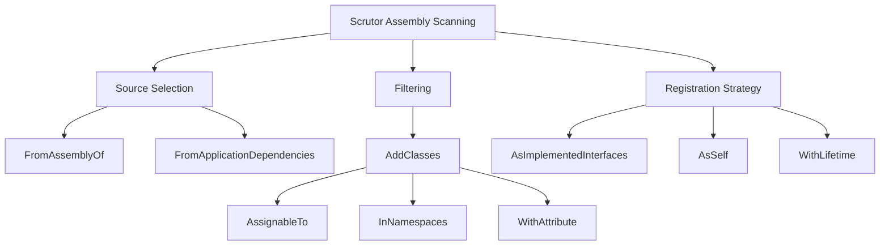
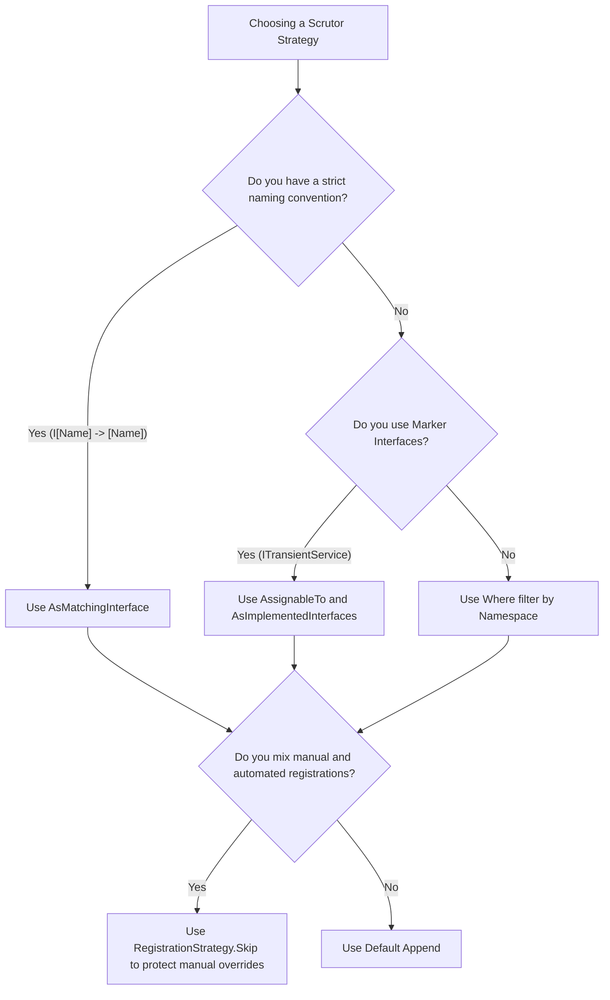

> [!success] Mastery Check
> - [ ] **Studied Well**
> - [ ] **Can explain the concept without notes**
> - [ ] **Can answer interview questions confidently**
> - [ ] **Can implement it in a real project**


# Scrutor: Assembly Scanning and Convention-Based Registration

## PART 0 — Navigation & Context

### Where This Fits
```
ASP.NET Core Mastery
└── Dependency Injection
    ├── [[4.034 — The Built-In DI Container: Service Registration and Resolution]]
    ├── 4.043 — Scrutor: Assembly Scanning ★ YOU ARE HERE
    └── [[4.044 — Decorators in the Built-In Container: The Scrutor Pattern]]
```

### Prerequisites
| Topic | Why It Matters Here |
|---|---|
| [[4.034 — The Built-In DI Container: Service Registration and Resolution]] | Scrutor is simply a fluent API that automates the generation of `ServiceDescriptor` lists. |
| [[4.039 — Open Generic DI Registration]] | Assembly scanning often replaces the need to manually register hundreds of generic types. |

### What This Unlocks After
| Topic | Why It Matters Here |
|---|---|
| [[4.044 — Decorators in the Built-In Container: The Scrutor Pattern]] | Scrutor also provides the standard `.Decorate<T>()` API, which is impossible natively. |

### Why This Matters
As enterprise applications scale, development teams waste countless hours debugging `InvalidOperationException: Unable to resolve service` errors simply because someone forgot to add `services.AddScoped<INewService, NewService>()` to a 500-line `Program.cs`. Convention-based scanning automates DI registration, ensuring that if an engineer creates a class matching a structural convention, it is wired up flawlessly without human intervention.

---

## PART 1 — The Core Mental Model

> **Scrutor scans .NET assemblies at application startup, uses reflection to find classes matching specific conventions (like "names ending in Repository" or "implementing ITransientService"), and automatically pushes them into the `IServiceCollection`. The practical consequence is that you can delete hundreds of lines of brittle DI registration code, relying instead on structural rules that automatically wire up new classes as your team builds them.**

### The Plain-Language Analogy
Think of manual DI registration like a club bouncer holding a guest list where you manually typed out the name of every single invited person. If someone's name isn't exactly on the list, they don't get in. Scrutor changes the bouncer's instructions from a rigid list to a set of rules: "Let anyone in who is wearing a blue shirt (inherits an interface), or whose ID says they live in the 'Repository' neighborhood (namespace/naming convention)." As the city grows, you never have to update the guest list again.

### The Taxonomy Diagram


---

## PART 2 — Deep Mechanics

### 2.1 — Pipeline Position and Execution Flow

Scrutor executes strictly during the host building phase.

```text
──► App Startup
    │
    ├──► builder.Services.Scan(scan => ...)
    │      │
    │      ├─► Locates target Assemblies
    │      ├─► Reflection: Gets all Types
    │      ├─► Filters Types based on rules
    │      └─► Injects generated ServiceDescriptors into IServiceCollection
    │
    ├──► builder.Build()  [No reflection cost remains]
    │
    └──► Endpoints execute
```

**Runtime Cost:** `Zero latency impact at runtime`. Imposes a `~50-200ms` penalty strictly during application startup due to assembly loading and reflection scanning.

### 2.2 — `IServiceCollection` Mutability

Scrutor does not replace the Microsoft DI container; it simply automates the population of it.

**Framework Source Behavior:**
When you call `scan.FromAssemblyOf<Program>().AddClasses().AsImplementedInterfaces()`, Scrutor internally loops over the types, calls `type.GetInterfaces()`, creates a `ServiceDescriptor` for each match, and calls `services.Add(descriptor)`. 

**Failure Mode:** If you misconfigure the scanner to scan standard .NET framework assemblies (like `System.Linq`), it might attempt to register thousands of internal framework types, causing a massive memory spike and startup crash.

### 2.3 — AsImplementedInterfaces vs AsMatchingInterface

Scrutor's registration strategies determine *how* the service is bound.

- **AsImplementedInterfaces**: A class `SqlUserRepository` that implements `IUserRepository` and `IDisposable` will be registered against *both* interfaces.
- **AsMatchingInterface**: Matches by naming convention. `SqlUserRepository` matches `IUserRepository`, but ignores `IDisposable`.

### 2.4 — Duplicate Registrations

By default, Scrutor uses `Add` rather than `TryAdd`.

**Framework Source Behavior:**
If `SqlUserRepository` and `MongoUserRepository` both implement `IUserRepository`, scanning them with `AsImplementedInterfaces` will result in two registrations. A consumer requesting a single `IUserRepository` will receive the last one scanned. Scrutor mitigates this with `.UsingRegistrationStrategy(RegistrationStrategy.Skip)` to mimic `TryAdd`.

---

## PART 3 — Production Code Patterns

### Pattern 1: Marker Interfaces

The safest and most explicit way to use convention-based DI is to define empty marker interfaces (like `IScopedService`, `ITransientService`). Any class that inherits them is automatically registered.

```csharp
// ✅ CORRECT: Explicit lifetime marker interfaces
public interface ITransientService { }
public interface IScopedService { }

// Developer just adds the interface
public class PaymentProcessor : IPaymentProcessor, IScopedService { }

// Program.cs
builder.Services.Scan(scan => scan
    .FromAssemblyOf<Program>()
    
    // Find all classes implementing ITransientService
    .AddClasses(classes => classes.AssignableTo<ITransientService>())
        .AsImplementedInterfaces() // Register as IPaymentProcessor
        .WithTransientLifetime()
        
    // Find all classes implementing IScopedService
    .AddClasses(classes => classes.AssignableTo<IScopedService>())
        .AsImplementedInterfaces()
        .WithScopedLifetime());
```

### Pattern 2: Namespace and Naming Conventions

Useful when migrating legacy monoliths without modifying the source code of hundreds of classes.

```csharp
// ✅ CORRECT: Scanning by namespace and class suffix
builder.Services.Scan(scan => scan
    .FromAssemblyOf<Program>()
    
    // Only classes in the Data.Repositories namespace that end with "Repository"
    .AddClasses(classes => classes.InNamespaces("MyApi.Data.Repositories")
                                  .Where(t => t.Name.EndsWith("Repository")))
        .AsMatchingInterface() // Matches SqlOrderRepository to IOrderRepository
        .WithScopedLifetime()
        
    // Handlers
    .AddClasses(classes => classes.Where(t => t.Name.EndsWith("Handler")))
        .AsImplementedInterfaces()
        .WithTransientLifetime());
```

### Pattern 3: Custom Attributes

Using C# attributes to define DI registration behavior dynamically.

```csharp
// ✅ CORRECT: Using attributes for metadata-driven registration
[AttributeUsage(AttributeTargets.Class)]
public class InjectAsSingletonAttribute : Attribute { }

[InjectAsSingleton]
public class LookupCache : ILookupCache { }

// Program.cs
builder.Services.Scan(scan => scan
    .FromAssemblyOf<Program>()
    .AddClasses(classes => classes.WithAttribute<InjectAsSingletonAttribute>())
        .AsImplementedInterfaces()
        .WithSingletonLifetime());
```

---

## PART 4 — Gotchas & Anti-Patterns

### Gotcha 1: Over-Registration of `IDisposable`

Engineers use `AsImplementedInterfaces()` without filtering out core framework interfaces.

// ⚠️ WRONG CODE
```csharp
public class Worker : IWorker, IDisposable { ... }

builder.Services.Scan(scan => scan
    .FromAssemblyOf<Program>()
    .AddClasses()
        .AsImplementedInterfaces()
        .WithTransientLifetime());
```
// HTTP consequence (wrong path):
// The class is registered twice: once as `IWorker`, and once as `IDisposable`. If any other system component requests `IEnumerable<IDisposable>`, the DI container will instantiate hundreds of `Worker` classes (along with every other scanned class implementing `IDisposable`), causing a catastrophic memory and latency spike.

// ✅ CORRECT CODE
```csharp
builder.Services.Scan(scan => scan
    .FromAssemblyOf<Program>()
    .AddClasses()
        // Use AsMatchingInterface to ignore IDisposable, or explicitly filter it
        .AsImplementedInterfaces(i => i != typeof(IDisposable)) 
        .WithTransientLifetime());
```
// HTTP consequence (correct path):
// Only business interfaces are registered.

// WHY: `AsImplementedInterfaces` blindly reflects over `GetInterfaces()`, pulling in `IDisposable`, `IEquatable`, `ICloneable`, etc., polluting the DI container.

### Gotcha 2: Cross-Assembly Blindness

Engineers extract their domain logic into a Class Library, but leave the Scrutor scan configured to the `Program` assembly.

// ⚠️ WRONG CODE
```csharp
// The ASP.NET Core project
builder.Services.Scan(scan => scan
    .FromAssemblyOf<Program>() // Only scans the Web project!
    .AddClasses().AsMatchingInterface().WithScopedLifetime());
```
// HTTP consequence (wrong path):
// HTTP 500. `InvalidOperationException: Unable to resolve service...` because the services in the `Domain.dll` project were never scanned.

// ✅ CORRECT CODE
```csharp
builder.Services.Scan(scan => scan
    // Scan both assemblies explicitly
    .FromAssembliesOf(typeof(Program), typeof(Domain.Marker))
    .AddClasses().AsMatchingInterface().WithScopedLifetime());
```
// HTTP consequence (correct path):
// Services from all specified layers are successfully registered.

// WHY: Assembly scanning is explicitly scoped to the requested assemblies to avoid scanning the entire .NET runtime ecosystem. You must point it at your library assemblies.

### Gotcha 3: Singletons Overwritten by Scope Scans

Engineers manually register a Singleton, but a broad Scrutor scan accidentally sweeps up the class and registers it again as Transient.

// ⚠️ WRONG CODE
```csharp
// Manually add the critical singleton
builder.Services.AddSingleton<ITokenCache, TokenCache>();

// Later... a generic sweep
builder.Services.Scan(scan => scan
    .FromAssemblyOf<Program>()
    .AddClasses()
        .AsImplementedInterfaces()
        .WithTransientLifetime()); 
```
// HTTP consequence (wrong path):
// The Token Cache is now resolved as Transient (because Scrutor appended its registration last). The cache is empty on every request, hammering the downstream identity provider and causing rate limiting.

// ✅ CORRECT CODE
```csharp
builder.Services.Scan(scan => scan
    .FromAssemblyOf<Program>()
    .AddClasses()
        .UsingRegistrationStrategy(RegistrationStrategy.Skip) // Mimics TryAdd
        .AsImplementedInterfaces()
        .WithTransientLifetime()); 
```
// HTTP consequence (correct path):
// Scrutor sees that `ITokenCache` is already registered and safely skips it.

// WHY: Scrutor uses `.Add` by default, overwriting previous registrations for single resolutions.

### Gotcha 4: Multiple Implementations with `AsMatchingInterface`

Engineers use `AsMatchingInterface` expecting to build a pipeline, but it fails to match.

// ⚠️ WRONG CODE
```csharp
public class ValidateAuth : IPipelineStep { }
public class ValidateData : IPipelineStep { }

builder.Services.Scan(scan => scan
    .FromAssemblyOf<Program>()
    .AddClasses(c => c.AssignableTo<IPipelineStep>())
        .AsMatchingInterface() // FAILS!
        .WithScopedLifetime());
```
// HTTP consequence (wrong path):
// Empty array injected. The pipeline doesn't run.

// ✅ CORRECT CODE
```csharp
builder.Services.Scan(scan => scan
    .FromAssemblyOf<Program>()
    .AddClasses(c => c.AssignableTo<IPipelineStep>())
        .AsImplementedInterfaces() // CORRECT
        .WithScopedLifetime());
```
// HTTP consequence (correct path):
// Both classes are registered against `IPipelineStep`.

// WHY: `AsMatchingInterface` uses string comparison: it looks for an interface named `IValidateAuth` for `ValidateAuth`. Because `IPipelineStep` does not structurally match the class name, it is ignored.

### Gotcha 5: Unintentional Instantiation of Base Classes

Engineers have abstract base classes that shouldn't be registered.

// ⚠️ WRONG CODE
```csharp
// Abstract class implementing an interface
public abstract class RepositoryBase : IRepository { }
```
// HTTP consequence (wrong path):
// Not an HTTP consequence directly, but Scrutor automatically filters out `IsAbstract` types, so the DI container does not attempt to register `RepositoryBase`. This is actually a feature, not a bug, but engineers often waste time writing `.Where(c => !c.IsAbstract)` manually.

// ✅ CORRECT CODE
```csharp
// Scrutor ignores abstract classes and interfaces automatically inside .AddClasses()
```
// HTTP consequence (correct path):
// Clean registration.

// WHY: `AddClasses` internally filters `!t.IsAbstract`.

---

## PART 5 — Performance Implications

### Request Pipeline Characteristics Table

| Scenario | Pipeline Depth | Allocations Per Request | Approx Latency Impact | Recommendation |
|---|---|---|---|---|
| Scrutor Scanning | Startup | Large reflection trees | 0 ns (Runtime) | Negligible impact on API calls. |
| Over-registering IDisposable | Resolution | Memory leak via tracking | >100 ms | Disastrous. Filter framework interfaces. |
| RegistrationStrategy.Skip | Startup | Dictionary lookups | 0 ns (Runtime) | Safest strategy. |
| Broad FromApplicationDependencies | Startup | Massive assembly scanning | 0 ns (Runtime) | Can add 2+ seconds to app startup time. |

### BenchmarkDotNet Code

*(No BenchmarkDotNet provided because Scrutor executes exclusively during the application bootstrap phase. It has exactly zero impact on per-request HTTP latency or throughput).*

### When to Care / When to Ignore

**When this costs you:**
Using `FromApplicationDependencies()` in a massive monolithic solution with 100+ NuGet packages. Scrutor will reflect over every single loaded DLL, potentially adding 2-5 seconds to the application startup time. This destroys the fast inner loop for developers and slows down Kubernetes pod scaling.

**When this doesn't matter:**
Scanning a specific `FromAssemblyOf<Program>()` adds milliseconds to startup time. The productivity gain of never debugging a missing DI registration vastly outweighs this microscopic startup penalty.

---

## PART 6 — Interview Arsenal

### A. The Question Bank

**Question:** "You are using Scrutor to register all classes in your project via `AsImplementedInterfaces()`. Suddenly, a background service that relies on an `IEnumerable<IDisposable>` queue breaks, processing hundreds of random system objects. Why?"
**Average Answer:** Scrutor registered everything as Transient.
**Why That's Insufficient:** Doesn't explain the interface reflection mechanic.
> **Great Answer:** "Because `AsImplementedInterfaces` reflects over every interface the class inherits. In .NET, many business objects implement `IDisposable`, `IEquatable<T>`, or `ICloneable`. Scrutor blindly registered your business services against `IDisposable`. When the background worker requested a collection of `IDisposable`, the DI container happily instantiated every single business service and handed them over. To fix this, you must explicitly filter out framework interfaces in the Scrutor configuration using a predicate."

### B. The Trick Questions
**Question:** "Your class `OrderService` implements `IOrderService`. If you use Scrutor's `AsMatchingInterface()`, how does it know they match?"
**The Trap:** Thinking it maps by semantic meaning or inheritance alone.
**The Correct Answer:** It matches purely by string manipulation. It takes the class name (`OrderService`), prepends an `I`, and looks for an interface in the class's hierarchy named `IOrderService`. If you name the interface `IOrderLogic`, it will not match, even if the class implements it.

### C. Red Flags to Avoid
- **"Scrutor is slow because it uses reflection on every request."** (Red Flag: Total misunderstanding. Scrutor only uses reflection once at startup to populate the standard `IServiceCollection`).
- **"I don't use Scrutor because I want explicitly typed DI registrations for safety."** (Red Flag: Shows resistance to automation. Modern C# architectures rely heavily on conventions and marker interfaces).

---

## PART 7 — Decision Framework



---

## PART 8 — Self-Check

### A. Conceptual Questions
1. Why is convention-based scanning often preferred over manual DI registration in large teams?
2. What is the functional difference between `AsImplementedInterfaces` and `AsSelf`?
3. How do you prevent Scrutor from registering core framework interfaces like `IEquatable`?
4. What happens if you scan an assembly that contains no matching classes?
5. How does `RegistrationStrategy.Skip` protect custom mocks during unit testing?
6. Why must you explicitly declare `FromAssembliesOf(...)` when splitting domain logic into class libraries?
7. Does Scrutor automatically register abstract classes?
8. How does Scrutor handle a class with multiple generic parameters?

### B. Code Puzzles

**Puzzle 1: The Missing Match (The 5-puzzle rule bug)**
```csharp
public interface IPaymentLogic { }
public class PaymentService : IPaymentLogic { }

builder.Services.Scan(scan => scan.FromAssemblyOf<Program>()
    .AddClasses().AsMatchingInterface().WithTransientLifetime());
```
When `IPaymentLogic` is requested, what happens?
<details>
<summary>Answer</summary>
The DI container throws `InvalidOperationException`. `AsMatchingInterface` looks for `IPaymentService` (an "I" appended to the class name). It does not find it, so the class is silently skipped. You must use `AsImplementedInterfaces` here.
</details>

**Puzzle 2: The Double Dip**
```csharp
public class MyWorker : IWorker { }

builder.Services.AddScoped<IWorker, MyWorker>(); // Manual

builder.Services.Scan(s => s.FromAssemblyOf<Program>()
    .AddClasses().AsImplementedInterfaces().WithScopedLifetime()); // Scan
```
If a consumer requests `IEnumerable<IWorker>`, how many instances do they get?
<details>
<summary>Answer</summary>
Two. By default, Scrutor appends registrations. It registered `MyWorker` a second time.
</details>

**Puzzle 3: The Marker Interface Trap**
```csharp
public interface ITransientDependency { }
public class DbHelper : IDbHelper, ITransientDependency { }

builder.Services.Scan(s => s.FromAssemblyOf<Program>()
    .AddClasses(c => c.AssignableTo<ITransientDependency>())
        .AsImplementedInterfaces().WithTransientLifetime());
```
Is `DbHelper` registered against `ITransientDependency`?
<details>
<summary>Answer</summary>
Yes. Because `AsImplementedInterfaces` maps every implemented interface, the DI container now maps `ITransientDependency` to `DbHelper`. While harmless for DI resolution of `IDbHelper`, it clutters the container.
</details>

**Puzzle 4: The Abstract Silence**
```csharp
public abstract class BaseRepo : IRepository { }
builder.Services.Scan(s => s.FromAssemblyOf<Program>().AddClasses().AsImplementedInterfaces());
```
Does Scrutor crash trying to register the abstract class?
<details>
<summary>Answer</summary>
No. `AddClasses` automatically excludes abstract classes. It will silently skip `BaseRepo`.
</details>

---

## PART 9 — Connections & Resources

### A. Related Topics Table
| Topic | Why It Connects |
|---|---|
| [[4.034 — The Built-In DI Container: Service Registration and Resolution]] | Scrutor is syntactic sugar that compiles down to the `ServiceDescriptor` lists explained here. |
| [[4.044 — Decorators in the Built-In Container: The Scrutor Pattern]] | The Scrutor library is also the industry standard for applying Decorators in ASP.NET Core. |
| [[4.041 — IServiceCollection Extension Methods]] | Assembly scanning is often encapsulated inside a single `AddDomainServices()` extension method. |

### B. Books
| Book | Chapters | Why These Chapters |
|---|---|---|
| *Dependency Injection Principles, Practices, and Patterns* by Mark Seemann | Chapter 12 | Explains convention over configuration in DI architectures. |

### C. Essential Articles & Docs
- [Scrutor GitHub Repository](https://github.com/khellang/Scrutor)
- [Andrew Lock: Using Scrutor to automatically register your services](https://andrewlock.net/using-scrutor-to-automatically-register-your-services-with-the-asp-net-core-di-container/)

### D. Template Meta-Note
> [!NOTE] 
> **Part 0** orients you. **Part 1** builds the mental model. **Part 2** explains the framework internals and pipeline. **Part 3** provides copy-pasteable production code. **Part 4** highlights the bugs your team will write. **Part 5** gives you the performance math. **Part 6** prepares you for the principal engineering interview. **Part 7** gives you a decision tree. **Part 8** tests your knowledge. **Part 9** links to further mastery.
