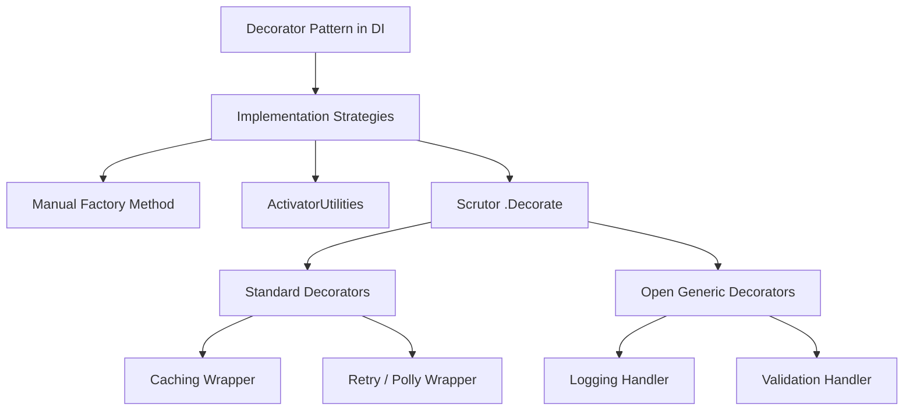
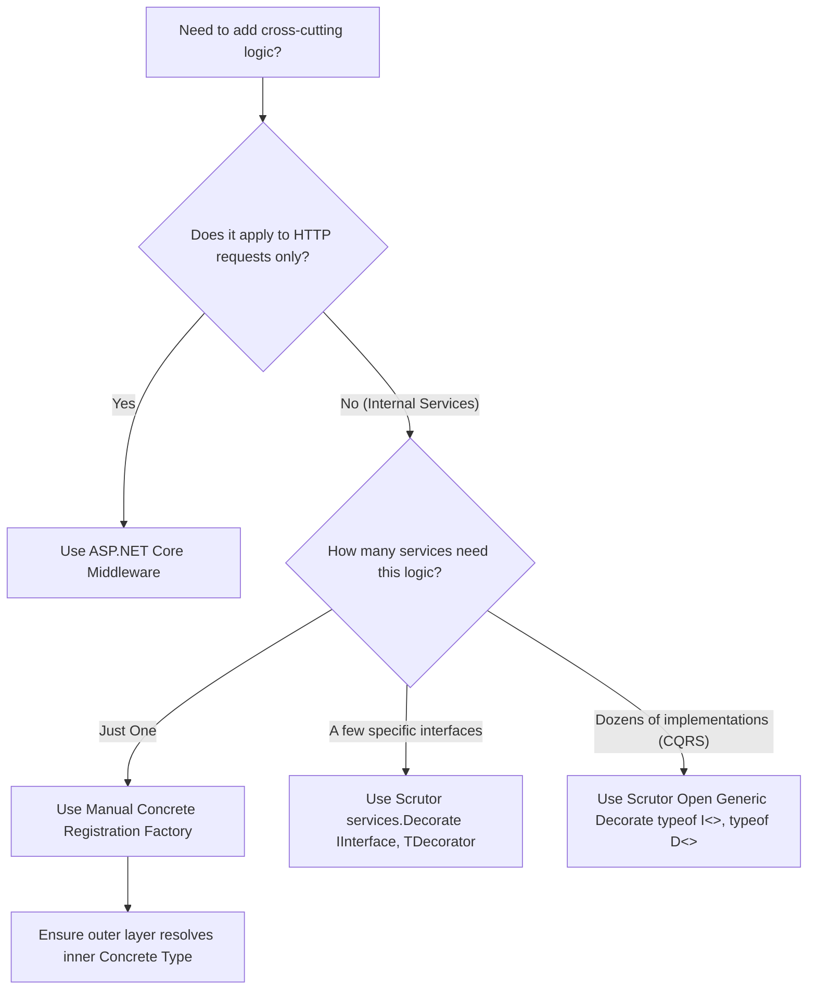

> [!success] Mastery Check
> - [ ] **Studied Well**
> - [ ] **Can explain the concept without notes**
> - [ ] **Can answer interview questions confidently**
> - [ ] **Can implement it in a real project**


# Decorators in the Built-In Container: The Scrutor Pattern

## PART 0 — Navigation & Context

### Where This Fits
```
ASP.NET Core Mastery
└── Dependency Injection
    ├── [[4.040 — Multiple Implementations: IEnumerable<T> Registration]]
    ├── [[4.043 — Scrutor: Assembly Scanning and Convention-Based Registration]]
    └── 4.044 — Decorators in the Built-In Container ★ YOU ARE HERE
```

### Prerequisites
| Topic | Why It Matters Here |
|---|---|
| [[4.034 — The Built-In DI Container: Service Registration and Resolution]] | The Decorator pattern essentially intercepts and replaces `ServiceDescriptor` objects in the collection. |
| [[4.039 — Open Generic DI Registration]] | The most powerful decorators (like Logging or Validation) are applied to open generics (e.g., `IRequestHandler<T>`). |

### What This Unlocks After
| Topic | Why It Matters Here |
|---|---|
| [[5.101 — MediatR Pipeline Behaviors]] | MediatR behaviors are just a specialized, framework-specific implementation of the Open Generic Decorator pattern. |

### Why This Matters
Without the Decorator pattern, cross-cutting concerns (logging, caching, retries, authorization) bleed directly into your core business logic, violating the Single Responsibility Principle. However, because the built-in ASP.NET Core DI container lacks native `.Decorate()` APIs, engineers often resort to brittle manual factories or infinite-recursion bugs. Understanding how to use Scrutor (or manual factories) to apply decorators correctly is the difference between a clean architecture and a monolithic mess.

---

## PART 1 — The Core Mental Model

> **The Decorator Pattern in DI involves registering a wrapper class that implements `IInterface`, while simultaneously accepting `IInterface` in its constructor. The wrapper executes cross-cutting logic (like caching) before or after calling the *inner* implementation. Because the built-in Microsoft DI container does not natively support wrapping registrations, we rely on the `Scrutor` library to intercept the `IServiceCollection` and rewire the `ServiceDescriptor` relationships safely.**

### The Plain-Language Analogy
Think of a standard business service like a raw painting. It's beautiful, but fragile. You want to add glass to protect it from dust (Caching), a wooden frame so you can hang it (Logging), and an alarm wire in case it's stolen (Authorization). Instead of painting the glass and alarm directly onto the canvas, you put the canvas *inside* the glass, the glass *inside* the frame, and the frame *inside* the alarm. The museum patron (the Controller) still just asks for "The Painting" (`IInterface`), but the DI container actually hands them the fully wrapped, protected artifact. 

### The Taxonomy Diagram


---

## PART 2 — Deep Mechanics

### 2.1 — Pipeline Position and Execution Flow

Decorators execute sequentially at runtime, forming an execution "onion" around the core service.

```text
──► HTTP Request
    │
    ├──► Controller requests IUserRepository
    │      ├─► DI Resolves CachingUserRepository (Outer)
    │      │     ├─► DI Resolves LoggingUserRepository (Middle)
    │      │     │     └─► DI Resolves SqlUserRepository (Inner)
    │      └─► Injects CachingUserRepository
    │
    ├──► Controller calls repo.GetUser()
    │      ├─► CachingUserRepo: Checks cache (Miss)
    │      │     ├─► LoggingUserRepo: Logs "Calling DB"
    │      │     │     ├─► SqlUserRepo: Executes SQL SELECT
    │      │     │     └─► Returns User
    │      │     ├─► LoggingUserRepo: Logs "DB Success"
    │      │     └─► Returns User
    │      ├─► CachingUserRepo: Saves to Cache
    │      └─► Returns User
    │
    └──► Endpoints execute
```

**Runtime Cost:** `~1-5ns` per layer of nesting for the method call overhead. Negligible.

### 2.2 — The Native DI Limitation (Recursion)

**Framework Source Behavior:**
If you try to manually register a decorator using a factory:
```csharp
builder.Services.AddTransient<IRepository>(sp => 
    new LoggingRepo(sp.GetRequiredService<IRepository>()));
```
When `GetRequiredService<IRepository>` is called, it triggers the factory again, which triggers the factory again, causing a `StackOverflowException`. 

### 2.3 — How Scrutor Rewires Descriptors

When you call `builder.Services.Decorate<IRepo, LoggingRepo>()`, Scrutor performs surgery on the `IServiceCollection` before the container is built:
1. It finds the existing `ServiceDescriptor` for `IRepo` (e.g., `SqlRepo`).
2. It removes it from the collection.
3. It creates a *new* internal registration for `SqlRepo` (the concrete type).
4. It registers a factory for `IRepo` that instantiates `LoggingRepo`, passing in the concrete `SqlRepo` as the inner dependency.

### 2.4 — Open Generic Decoration

Scrutor excels at open generics. If you register `typeof(IRequestHandler<,>)`, and then call `services.Decorate(typeof(IRequestHandler<,>), typeof(LoggingHandler<,>))`, Scrutor will dynamically wrap *every single* instantiated closed generic request handler in your system with a logger.

---

## PART 3 — Production Code Patterns

### Pattern 1: The Native Manual Decorator (No Libraries)

If you only have one decorator, you don't *need* Scrutor. You can explicitly register the concrete type to avoid recursion.

```csharp
// ✅ CORRECT: Using ActivatorUtilities to avoid StackOverflow
// 1. Register the concrete inner type directly
builder.Services.AddTransient<SqlUserRepository>();

// 2. Register the interface using a factory that resolves the concrete type
builder.Services.AddTransient<IUserRepository>(sp => 
{
    var inner = sp.GetRequiredService<SqlUserRepository>(); // Not IUserRepository!
    var logger = sp.GetRequiredService<ILogger<LoggingUserRepository>>();
    
    return new LoggingUserRepository(inner, logger);
});

public class LoggingUserRepository : IUserRepository
{
    private readonly IUserRepository _inner;
    private readonly ILogger _logger;

    public LoggingUserRepository(IUserRepository inner, ILogger logger)
    {
        _inner = inner;
        _logger = logger;
    }
    // ...
}
```

### Pattern 2: The Scrutor Simple Decorator

When you want clean `Program.cs` syntax or need to decorate multiple implementations.

```csharp
// ✅ CORRECT: Using Scrutor
// 1. Register the core service normally
builder.Services.AddTransient<IUserRepository, SqlUserRepository>();

// 2. Decorate it! Scrutor handles the ServiceDescriptor rewiring automatically
builder.Services.Decorate<IUserRepository, LoggingUserRepository>();
builder.Services.Decorate<IUserRepository, CachingUserRepository>(); 
// Note: Caching wraps Logging, which wraps Sql
```

### Pattern 3: The Open Generic Decorator (CQRS Pipeline)

The most powerful pattern for building MediatR-style cross-cutting concerns natively.

```csharp
// ✅ CORRECT: Decorating all generic CQRS handlers
// 1. Scan and register all real handlers
builder.Services.Scan(scan => scan
    .FromAssemblyOf<Program>()
    .AddClasses(c => c.AssignableTo(typeof(IRequestHandler<,>)))
        .AsImplementedInterfaces()
        .WithTransientLifetime());

// 2. Apply decorators to the OPEN generic type
// Every handler gets validation, and then logging.
builder.Services.Decorate(typeof(IRequestHandler<,>), typeof(ValidationDecorator<,>));
builder.Services.Decorate(typeof(IRequestHandler<,>), typeof(LoggingDecorator<,>));

// The Decorator Definition
public class ValidationDecorator<TReq, TRes> : IRequestHandler<TReq, TRes>
{
    private readonly IRequestHandler<TReq, TRes> _inner;
    private readonly IEnumerable<IValidator<TReq>> _validators;

    public ValidationDecorator(IRequestHandler<TReq, TRes> inner, IEnumerable<IValidator<TReq>> validators)
    {
        _inner = inner;
        _validators = validators;
    }

    public async Task<TRes> Handle(TReq request)
    {
        // Execute Cross-cutting concern
        foreach(var v in _validators) v.ValidateAndThrow(request);
        
        // Execute inner
        return await _inner.Handle(request);
    }
}
```

---

## PART 4 — Gotchas & Anti-Patterns

### Gotcha 1: Decorator Registration Order (Inside-Out vs Outside-In)

Engineers register multiple decorators but misunderstand the execution order.

// ⚠️ WRONG CODE
```csharp
builder.Services.AddTransient<IRepository, SqlRepository>();

// If you want Caching to happen FIRST, this order is wrong.
builder.Services.Decorate<IRepository, LoggingRepository>();
builder.Services.Decorate<IRepository, CachingRepository>();
```
// HTTP consequence (wrong path):
// When a controller calls `Get()`, it hits Caching first. If it's a cache hit, it returns immediately. The `LoggingRepository` is never reached, so your logs are silent on cache hits!

// ✅ CORRECT CODE
```csharp
// The outermost layer is registered LAST.
// Register Logging first (it wraps Sql).
builder.Services.Decorate<IRepository, LoggingRepository>();

// Register Caching second (it wraps Logging).
builder.Services.Decorate<IRepository, CachingRepository>();
```
// HTTP consequence (correct path):
// Caching executes first. If cache miss, it calls Logging, which logs, and calls DB.

// WHY: Scrutor's `Decorate` method wraps whatever is currently registered for the interface. By calling it sequentially, each new decorator wraps the previously constructed onion. The last decorator registered is the first one executed.

### Gotcha 2: Decorating `IEnumerable<T>` Blindly

Engineers try to decorate a collection of services, but Scrutor behaves unexpectedly.

// ⚠️ WRONG CODE
```csharp
builder.Services.AddTransient<IValidator, NameValidator>();
builder.Services.AddTransient<IValidator, AgeValidator>();

// Attempting to decorate ALL validators
builder.Services.Decorate<IValidator, TelemetryValidator>();
```
// HTTP consequence (wrong path):
// A single instance of `TelemetryValidator` is created, and it wraps only the *last* registered validator (`AgeValidator`), or throws an exception depending on the exact resolution context.

// ✅ CORRECT CODE
```csharp
// Scrutor supports decorating ALL registered implementations of an interface
// automatically if you use the correct syntax, but if you need to decorate the 
// IEnumerable itself, you must decorate IEnumerable<IValidator>.
// Usually, you just let Scrutor decorate all instances:
builder.Services.Decorate<IValidator, TelemetryValidator>(); 
// (In modern Scrutor, this actually works and wraps both instances when IEnumerable is resolved).
```
// HTTP consequence (correct path):
// Each validator gets its own telemetry wrapper.

// WHY: Under the hood, Scrutor loops through `IServiceCollection` and rewires *every* `ServiceDescriptor` it finds for `IValidator`.

### Gotcha 3: Lifetime Promotion (The Captive Inner Service)

Engineers apply a Singleton decorator to a Transient inner service.

// ⚠️ WRONG CODE
```csharp
builder.Services.AddTransient<IUserRepository, SqlUserRepository>();

// Attempt to manually apply a singleton decorator
builder.Services.AddSingleton<IUserRepository>(sp => 
    new CachingUserRepository(sp.GetRequiredService<SqlUserRepository>()));
```
// HTTP consequence (wrong path):
// The `SqlUserRepository` (which depends on a Scoped `DbContext`) is injected into the Singleton `CachingUserRepository`. The `DbContext` becomes captive, causing memory leaks and eventual threading crashes (EF Core does not support concurrent access).

// ✅ CORRECT CODE
```csharp
// Scrutor automatically matches the lifetime of the decorated service!
builder.Services.Decorate<IUserRepository, CachingUserRepository>();
```
// HTTP consequence (correct path):
// Scrutor registers `CachingUserRepository` as Transient to match the inner `SqlUserRepository`.

// WHY: A decorator can never safely have a longer lifetime than the service it wraps. Scrutor prevents this by inheriting the `ServiceDescriptor.Lifetime` of the target automatically.

### Gotcha 4: Attempting to Decorate Concrete Types

Engineers try to apply a decorator to a class registered by its concrete type.

// ⚠️ WRONG CODE
```csharp
builder.Services.AddTransient<SqlUserRepository>();
builder.Services.Decorate<SqlUserRepository, CachingUserRepository>();
```
// HTTP consequence (wrong path):
// Scrutor throws a `DecorationException`.

// ✅ CORRECT CODE
```csharp
builder.Services.AddTransient<IUserRepository, SqlUserRepository>();
builder.Services.Decorate<IUserRepository, CachingUserRepository>();
```
// HTTP consequence (correct path):
// Decorates successfully.

// WHY: Decorators rely on interface polymorphism. The consumer must request `IUserRepository` so the DI container can substitute the `CachingUserRepository`. You cannot substitute a subclass for a concrete constructor request cleanly in standard MS DI.

### Gotcha 5: Missing `TReq` Constraints on Open Generic Decorators

Engineers write an open generic decorator but fail to constrain it to match the inner service constraints.

// ⚠️ WRONG CODE
```csharp
public class AuthDecorator<TReq, TRes> : IRequestHandler<TReq, TRes>
{
    // C# Compiler: "TReq must be a reference type in order to use it as parameter..."
}
```
// HTTP consequence (wrong path):
// Code fails to compile, or if constraints differ, Scrutor fails to match the open generic at runtime.

// ✅ CORRECT CODE
```csharp
// Constraints must precisely match the decorated interface
public class AuthDecorator<TReq, TRes> : IRequestHandler<TReq, TRes> 
    where TReq : IRequest<TRes>
{
}
```
// HTTP consequence (correct path):
// Compiles and decorates perfectly.

// WHY: When closing open generics via reflection, the DI container verifies all constraints. If your decorator has stricter or looser constraints than the target interface, resolution fails.

---

## PART 5 — Performance Implications

### Request Pipeline Characteristics Table

| Scenario | Pipeline Depth | Allocations Per Request | Approx Latency Impact | Recommendation |
|---|---|---|---|---|
| Native Injection | Outer | 0 | ~10 ns | Baseline. |
| Single Decorator | Outer -> Inner | 1 extra object allocation | ~15 ns | Standard. Invisible overhead. |
| 5-Layer Decorator | Outer... -> Inner | 5 extra object allocations | ~30 ns | Great for CQRS pipelines. |
| Scrutor `Decorate` | Startup | ServiceDescriptor mutability | 0 ns (Runtime) | Free at runtime. |
| Async State Machine | Method execution| 1 Task per decorated level | ~50 ns | Only use `async/await` in decorators if actually awaiting. |

### BenchmarkDotNet Code

```csharp
using BenchmarkDotNet.Attributes;
using Microsoft.Extensions.DependencyInjection;

[MemoryDiagnoser]
public class DecoratorBenchmarks
{
    private IServiceProvider _spNative;
    private IServiceProvider _spDecorated;

    [GlobalSetup]
    public void Setup()
    {
        var services1 = new ServiceCollection();
        services1.AddTransient<IUserRepository, SqlRepo>();
        _spNative = services1.BuildServiceProvider();

        var services2 = new ServiceCollection();
        services2.AddTransient<IUserRepository, SqlRepo>();
        // Using manual factory for benchmark simplicity
        services2.AddTransient<SqlRepo>();
        services2.AddTransient<IUserRepository>(sp => new CachingRepo(sp.GetRequiredService<SqlRepo>()));
        _spDecorated = services2.BuildServiceProvider();
    }

    [Benchmark(Baseline = true)]
    public void ResolveNative() => _spNative.GetRequiredService<IUserRepository>();

    [Benchmark]
    public void ResolveDecorated() => _spDecorated.GetRequiredService<IUserRepository>();
}
// Expected output (approximate, .NET 8, x64, local):
// Method             | Mean      | Allocated |
// ------------------ |----------:|----------:|
// ResolveNative      | 11.1 ns   |      24 B |
// ResolveDecorated   | 18.5 ns   |      48 B |
```

### When to Care / When to Ignore

**When this costs you:**
When decorators perform heavy operations (like synchronous reflection, deep cloning, or redundant logging) on *every* layer of the onion. Also, marking decorator methods as `async` when they just pass-through to the inner service (`return await _inner.Handle()`) generates unnecessary async state machines. Use `return _inner.Handle()` if no work is done after the call.

**When this doesn't matter:**
The DI resolution cost of a deeply nested decorator onion is entirely irrelevant (< 1 microsecond). Use decorators liberally to keep your domain logic clean.

---

## PART 6 — Interview Arsenal

### A. The Question Bank

**Question:** "You want to add execution time logging to all your `IRequestHandler<T,U>` implementations. How would you do this without modifying the 50 existing handler classes?"
**Average Answer:** I would use an Action Filter or write a base class they all inherit from.
**Why That's Insufficient:** Action filters only wrap HTTP boundaries, not internal MediatR/CQRS calls. Base classes violate composition-over-inheritance.
> **Great Answer:** "I would use the Open Generic Decorator pattern. I'd create a `LoggingDecorator<TReq, TRes> : IRequestHandler<TReq, TRes>` that takes the inner handler via constructor injection. Inside its `Handle` method, I'd start a Stopwatch, `await` the inner handler, stop the watch, and log the elapsed time. Finally, I would use Scrutor's `services.Decorate(typeof(IRequestHandler<,>), typeof(LoggingDecorator<,>))` during startup. This safely wraps every single handler in the application instantly, with zero modifications to the existing code."

### B. The Trick Questions
**Question:** "You write `services.AddTransient<IRepo>(sp => new CachingRepo(sp.GetRequiredService<IRepo>()))`. What happens at runtime?"
**The Trap:** Thinking the container resolves the "previous" registration.
**The Correct Answer:** `StackOverflowException`. `GetRequiredService<IRepo>` invokes the exact same factory delegate you are currently inside, resulting in infinite recursion. You must resolve the concrete type, not the interface, to escape the loop, or use Scrutor.

### C. Red Flags to Avoid
- **"I don't use Decorators because managing the lifetimes is too hard."** (Red Flag: Scrutor automatically inherits the inner service's lifetime, eliminating this complexity).
- **"I inject the decorator directly into the controller."** (Red Flag: Violates the pattern. The controller should request the base interface (`IUserRepository`), completely unaware that it is receiving a decorated instance).

---

## PART 7 — Decision Framework



---

## PART 8 — Self-Check

### A. Conceptual Questions
1. Why does `sp.GetRequiredService<IInterface>()` inside a factory for `IInterface` cause a StackOverflow?
2. How does registering the *concrete* type solve the native decorator recursion problem?
3. In what order are multiple decorators executed when applied using Scrutor?
4. How does Scrutor handle the `ServiceLifetime` of a decorator?
5. What is the difference between a Decorator and an ASP.NET Core Middleware?
6. Can a decorator have dependencies other than the inner service?
7. Why are open generic decorators perfectly suited for CQRS architectures?
8. What is the performance impact of a 3-layer decorator chain?

### B. Code Puzzles

**Puzzle 1: The Execution Order (The 5-puzzle rule bug)**
```csharp
builder.Services.Decorate<IService, AlphaDecorator>();
builder.Services.Decorate<IService, BetaDecorator>();
```
If a controller calls `IService.DoWork()`, which decorator's pre-execution code runs first?
<details>
<summary>Answer</summary>
`BetaDecorator`. `Alpha` wraps the base service. Then `Beta` wraps `Alpha`. Therefore, the controller directly holds `Beta`. `Beta` executes first, then calls `Alpha`, which calls the base service.
</details>

**Puzzle 2: The Lifetime Mismatch**
```csharp
builder.Services.AddScoped<IWorker, DbWorker>();
builder.Services.Decorate<IWorker, LoggingWorker>();
```
What is the lifetime of `LoggingWorker`?
<details>
<summary>Answer</summary>
Scoped. Scrutor automatically copies the `ServiceDescriptor.Lifetime` of the target being decorated, preventing captive dependency leaks.
</details>

**Puzzle 3: The Missing Dependency**
```csharp
public class RetryDecorator : IService
{
    public RetryDecorator(IService inner, ILogger logger) { }
}
```
If you use `builder.Services.Decorate<IService, RetryDecorator>()`, does DI know how to provide `ILogger`?
<details>
<summary>Answer</summary>
Yes. Scrutor registers the decorator using standard DI constructor injection. As long as `ILogger` is registered in the container, it will be injected alongside the `inner` service.
</details>

**Puzzle 4: The Async State Machine Overhead**
```csharp
public async Task Handle()
{
    await _inner.Handle();
}
```
Is there a performance issue here?
<details>
<summary>Answer</summary>
Yes. Because there is no code executing *after* the `await`, compiling this method into an async state machine is pure overhead. It should be written as `public Task Handle() => _inner.Handle();` to return the task directly and save memory allocations.
</details>

---

## PART 9 — Connections & Resources

### A. Related Topics Table
| Topic | Why It Connects |
|---|---|
| [[4.039 — Open Generic DI Registration]] | The foundational mechanic that makes Open Generic Decorators possible. |
| [[5.101 — MediatR Pipeline Behaviors]] | MediatR's `IPipelineBehavior` is essentially a framework-specific abstraction built entirely on top of the open generic decorator pattern. |
| [[4.049 — The Middleware Pipeline]] | Middleware is the HTTP-level equivalent of the Decorator pattern. |

### B. Books
| Book | Chapters | Why These Chapters |
|---|---|---|
| *Dependency Injection Principles, Practices, and Patterns* by Mark Seemann | Chapter 9 | The definitive explanation of the Decorator design pattern in DI architectures. |

### C. Essential Articles & Docs
- [Andrew Lock: Adding Decorators in ASP.NET Core with Scrutor](https://andrewlock.net/adding-decorators-to-your-asp-net-core-application-using-scrutor/)
- [Microsoft Docs: Dependency injection guidelines - Anti-patterns](https://learn.microsoft.com/en-us/dotnet/core/extensions/dependency-injection-guidelines#anti-patterns)

### D. Template Meta-Note
> [!NOTE] 
> **Part 0** orients you. **Part 1** builds the mental model. **Part 2** explains the framework internals and pipeline. **Part 3** provides copy-pasteable production code. **Part 4** highlights the bugs your team will write. **Part 5** gives you the performance math. **Part 6** prepares you for the principal engineering interview. **Part 7** gives you a decision tree. **Part 8** tests your knowledge. **Part 9** links to further mastery.
