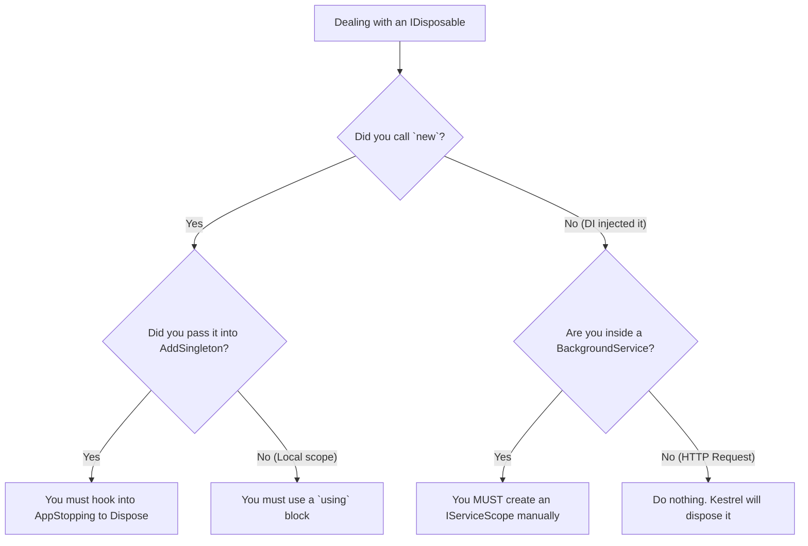

> [!success] Mastery Check
> - [ ] **Studied Well**
> - [ ] **Can explain the concept without notes**
> - [ ] **Can answer interview questions confidently**
> - [ ] **Can implement it in a real project**


# IDisposable in DI: Ownership and Disposal Responsibility

## PART 0 — Navigation & Context

### Where This Fits
```
ASP.NET Core Mastery
└── Dependency Injection
    ├── [[4.035 — Service Lifetimes: Singleton, Scoped, Transient]]
    ├── [[4.036 — IServiceProvider and IServiceScope]]
    └── 4.045 — IDisposable in DI ★ YOU ARE HERE
```

### Prerequisites
| Topic | Why It Matters Here |
|---|---|
| [[4.036 — IServiceProvider and IServiceScope]] | Disposal is inextricably linked to the lifecycle of the `IServiceScope`. |
| [[4.037 — Factory-Based DI]] | Manual instantiation via factories breaks the container's ability to track and dispose objects. |

### What This Unlocks After
| Topic | Why It Matters Here |
|---|---|
| [[4.047 — DI Scope in Background Services]] | Failing to manage `IServiceScope` disposal in BackgroundServices is the #1 cause of memory leaks in modern .NET worker apps. |

### Why This Matters
If you do not understand the DI container's ownership rules regarding `IDisposable`, you will either cause severe memory leaks by preventing the Garbage Collector from doing its job, or you will cause `ObjectDisposedException` runtime crashes by manually disposing objects that the framework was planning to use later. 

---

## PART 1 — The Core Mental Model

> **The ASP.NET Core DI container has a strict ownership rule: "If I create it, I dispose it. If you create it, you dispose it." The container tracks every `IDisposable` instance it creates inside a specific `IServiceScope`. When that scope ends (e.g., at the end of an HTTP request), the container automatically calls `.Dispose()` on every tracked instance in reverse resolution order. The practical consequence is that you should almost *never* manually call `.Dispose()` on an injected service.**

### The Plain-Language Analogy
Think of the DI Container as a rental car agency. 
- If you rent a car from them (the container instantiates the object), the rental agreement (the Scope) dictates that you must return the car to them when you are done. *You are not allowed to crush the car in a compactor* (calling `.Dispose()` manually). They will crush the cars themselves at the end of the day.
- However, if you bought a car with your own money outside the agency (`new MyService()`), the agency has no idea it exists. If you park it in their lot and walk away, it will sit there forever (a memory leak). You must crush your own car.

### The Taxonomy Diagram
```mermaid
graph TD
    A[IDisposable in DI] --> B[Container Created]
    A --> C[User Created]

    B --> D[Transient]
    B --> E[Scoped]
    B --> F[Singleton]

    D --> G[Tracked by Scope. Disposed on Scope end.]
    E --> G
    F --> H[Tracked by Root. Disposed on App shutdown.]

    C --> I[new MyService()]
    C --> J[Registered as Instance]
    
    I --> K[Untracked. User must dispose.]
    J --> K
```

---

## PART 2 — Deep Mechanics

### 2.1 — Pipeline Position and Execution Flow

Scope disposal happens automatically via ASP.NET Core hosting middleware at the end of the HTTP pipeline.

```text
──► HTTP Request
    │
    ├──► Hosting Framework creates IServiceScope
    ├──► Controller requests DbContext (Scoped, IDisposable)
    │      ├─► DI creates DbContext
    │      └─► Adds to scope's internal `List<object> _disposables`
    │
    ├──► Controller requests FileProcessor (Transient, IDisposable)
    │      ├─► DI creates FileProcessor
    │      └─► Adds to scope's internal `List<object> _disposables`
    │
    ├──► Endpoints execute
    │
    └──► HTTP Response Sent
           │
           └─► Framework calls scope.Dispose()
                 ├─► Iterates _disposables backwards
                 ├─► Calls FileProcessor.Dispose()
                 └─► Calls DbContext.Dispose()
```

**Runtime Cost:** The `List<object>` tracking mechanism adds `~10-20ns` per disposable resolution. Very fast, but creates references that prevent Garbage Collection until the scope dies.

### 2.2 — The Transient IDisposable Trap

Transients are created fresh *every time* they are requested.

**Framework Source Behavior:**
If a Scoped service requests a Transient `IDisposable`, the container creates the Transient and pins it to the current `IServiceScope` tracking list. Even if the Scoped service drops the reference to the Transient, the scope's internal list still holds a reference. The Transient cannot be Garbage Collected until the entire HTTP request ends.

**Failure Mode:** If a Singleton or a long-running Background Service resolves a Transient `IDisposable` inside a loop, the container pins *every single instance* to the Root Provider. This is a catastrophic memory leak. The app will consume gigabytes of RAM and crash.

### 2.3 — `IAsyncDisposable`

Since .NET Core 3.0, the DI container fully supports `IAsyncDisposable`. 
If a service implements both `IDisposable` and `IAsyncDisposable`, the container prefers `DisposeAsync()` and awaits it during scope teardown.

### 2.4 — Implementation Instances

If you register an existing instance (`builder.Services.AddSingleton(new MyService())`), the container assumes **you** own the lifetime. It will *not* track it, and it will *not* call `Dispose()` on app shutdown.

---

## PART 3 — Production Code Patterns

### Pattern 1: The Safe Background Service Loop

When running background tasks, you must manually create scopes to bound the lifetime of injected `IDisposables`.

```csharp
// ✅ CORRECT: Creating explicit scopes to clear Disposables
public class ReportWorker : BackgroundService
{
    private readonly IServiceProvider _sp;

    public ReportWorker(IServiceProvider sp) => _sp = sp;

    protected override async Task ExecuteAsync(CancellationToken stoppingToken)
    {
        while (!stoppingToken.IsCancellationRequested)
        {
            // The `using` statement defines the boundary for DI tracking
            using (var scope = _sp.CreateScope())
            {
                // DbContext is scoped. It will be disposed when the loop iteration ends.
                var db = scope.ServiceProvider.GetRequiredService<AppDbContext>();
                await ProcessReportsAsync(db);
            }
            
            await Task.Delay(5000, stoppingToken);
        }
    }
}
```

### Pattern 2: Factory Delegate Registration

If you create an object inside a DI factory delegate, the container tracks it, provided it returns the object.

```csharp
// ✅ CORRECT: The container tracks objects created in factories
builder.Services.AddScoped<IFileWriter>(sp => 
{
    // The container invoked this delegate, so the container owns the result.
    var writer = new CustomFileWriter(); 
    return writer; 
    // Container sees CustomFileWriter implements IDisposable.
    // Container will dispose it at the end of the HTTP request.
});
```

### Pattern 3: Explicit Disposal of Unregistered Objects

If you manually instantiate an `IDisposable` that is *not* returned to the DI container, you must dispose it.

```csharp
// ✅ CORRECT: Disposing manually created objects
public class DataImporter
{
    public void Import()
    {
        // 1. You called `new`. 
        // 2. DI has no idea this exists.
        // 3. You must use `using`.
        using var stream = new FileStream("data.csv", FileMode.Open);
        // process...
    }
}
```

---

## PART 4 — Gotchas & Anti-Patterns

### Gotcha 1: The `using` Block on Injected Services

Engineers apply `using` blocks to injected services "just to be safe."

// ⚠️ WRONG CODE
```csharp
public class OrderController
{
    private readonly AppDbContext _db;
    public OrderController(AppDbContext db) => _db = db;

    public void Get()
    {
        using (_db) // NEVER DO THIS
        {
            var user = _db.Users.First();
        }
    }
}
```
// HTTP consequence (wrong path):
// The request succeeds. However, if any action filter, middleware, or background thread tries to access `_db` after the controller finishes, they will receive an `ObjectDisposedException`. Furthermore, the DI container will try to call `Dispose()` *again* at the end of the request.

// ✅ CORRECT CODE
```csharp
public class OrderController
{
    private readonly AppDbContext _db;
    public OrderController(AppDbContext db) => _db = db;

    public void Get()
    {
        var user = _db.Users.First();
        // Do nothing. Let the DI container handle disposal.
    }
}
```
// HTTP consequence (correct path):
// Flawless execution.

// WHY: The DI container owns the lifetime of injected services. You are merely borrowing a reference.

### Gotcha 2: The Transient `IDisposable` Factory Leak

Engineers resolve a Transient `IDisposable` inside a factory delegate, but don't return it.

// ⚠️ WRONG CODE
```csharp
builder.Services.AddScoped<MyService>(sp => 
{
    // Resolving a Transient IDisposable
    var helper = sp.GetRequiredService<TransientDisposableHelper>();
    var config = helper.GetConnectionString();
    
    // We only needed it for the string. We drop the reference.
    return new MyService(config);
});
```
// HTTP consequence (wrong path):
// The `TransientDisposableHelper` remains in the DI container's tracking list until the end of the HTTP request, even though no code can access it. Memory footprint bloats.

// ✅ CORRECT CODE
```csharp
builder.Services.AddScoped<MyService>(sp => 
{
    // If you only need config, inject IConfiguration, not a disposable wrapper.
    var config = sp.GetRequiredService<IConfiguration>();
    return new MyService(config["ConnString"]);
});
```
// HTTP consequence (correct path):
// Clean memory graph.

// WHY: The container tracks *all* resolved `IDisposable` transients. Dropping the reference in your code does not remove the reference from the container's tracking list.

### Gotcha 3: Singletons and DbContexts

Engineers inject a Scoped `DbContext` into a Singleton `BackgroundService`.

// ⚠️ WRONG CODE
```csharp
public class Worker : BackgroundService
{
    private readonly AppDbContext _db; // INJECTED SCOPED DB INTO SINGLETON

    public Worker(AppDbContext db) => _db = db;

    protected override async Task ExecuteAsync(CancellationToken t)
    {
        // ...
    }
}
```
// HTTP consequence (wrong path):
// Crash on startup (if validation is on). If validation is off, `_db` is pinned as a Singleton. Over hours, EF Core's change tracker consumes gigabytes of memory tracking every row ever queried. Eventually, the connection drops or the app OOM crashes.

// ✅ CORRECT CODE
```csharp
// Inject IServiceProvider and use sp.CreateScope() inside the ExecuteAsync loop.
```
// HTTP consequence (correct path):
// Safe bounding of the `DbContext` lifetime.

// WHY: Singletons never dispose their dependencies until the app shuts down.

### Gotcha 4: Registering Implementation Instances (`AddSingleton(new)`)

Engineers assume `AddSingleton` behaves identically regardless of the method overload.

// ⚠️ WRONG CODE
```csharp
var myService = new HeavyResourceService();
builder.Services.AddSingleton<IHeavy>(myService);
```
// HTTP consequence (wrong path):
// When the Kestrel application is stopped (SIGTERM), `myService.Dispose()` is never called. Background threads might not terminate cleanly, or external connections might be left dangling.

// ✅ CORRECT CODE
```csharp
// Let the container instantiate it!
builder.Services.AddSingleton<IHeavy, HeavyResourceService>();

// OR, if you must pre-instantiate, handle the disposal yourself on app shutdown:
var myService = new HeavyResourceService();
builder.Services.AddSingleton<IHeavy>(myService);
app.Lifetime.ApplicationStopping.Register(() => myService.Dispose());
```
// HTTP consequence (correct path):
// Resources are cleanly released on shutdown.

// WHY: The DI container explicitly ignores `IDisposable` tracking for instances you pass in directly, because it assumes you might be using them elsewhere in your `Program.cs`.

### Gotcha 5: Implementing IDisposable "Just in Case"

Engineers implement `IDisposable` on generic domain services that only contain managed objects (strings, ints).

// ⚠️ WRONG CODE
```csharp
public class MathCalculator : IDisposable
{
    public void Dispose() { /* Nothing to do */ }
}
```
// HTTP consequence (wrong path):
// If registered as Transient, the DI container must allocate tracking objects and pin the `MathCalculator` to the scope, preventing Generation 0 garbage collection and slowing down the request pipeline for absolutely no benefit.

// ✅ CORRECT CODE
```csharp
public class MathCalculator { }
```
// HTTP consequence (correct path):
// Fast, GC-friendly memory management.

// WHY: Only implement `IDisposable` if your class holds unmanaged resources (File Handles, Network Sockets, Pointers) or holds references to *other* `IDisposable` objects that require explicit chained disposal.

---

## PART 5 — Performance Implications

### Request Pipeline Characteristics Table

| Scenario | Pipeline Depth | Allocations Per Request | Approx Latency Impact | Recommendation |
|---|---|---|---|---|
| Resolving Scoped `IDisposable` | Outer | Tracking object (Array resize) | ~15 ns | Standard. Safe. |
| Resolving Transient `IDisposable` | Inner | Tracking object per call | ~20 ns | Dangerous if called in loops. |
| Dropping Transient ref | Inner | GC Pinning | Variable | GC cannot collect until Scope dies. |
| Scope Tear-down | End of Request | Sequential Dispose calls | ~50 ns | Handled automatically by Kestrel. |
| `AddSingleton(new obj)` | Startup | 0 | 0 ns | Free, but requires manual shutdown hooks. |

### BenchmarkDotNet Code

```csharp
using BenchmarkDotNet.Attributes;
using Microsoft.Extensions.DependencyInjection;

[MemoryDiagnoser]
public class DisposableBenchmarks
{
    private IServiceProvider _sp;

    [GlobalSetup]
    public void Setup()
    {
        var services = new ServiceCollection();
        services.AddTransient<HeavyObject>();
        services.AddTransient<DisposableHeavyObject>();
        _sp = services.BuildServiceProvider();
    }

    [Benchmark(Baseline = true)]
    public void ResolveNormalTransient()
    {
        using var scope = _sp.CreateScope();
        scope.ServiceProvider.GetRequiredService<HeavyObject>();
    }

    [Benchmark]
    public void ResolveDisposableTransient()
    {
        using var scope = _sp.CreateScope();
        scope.ServiceProvider.GetRequiredService<DisposableHeavyObject>();
    }
}
// Expected output (approximate, .NET 8, x64, local):
// Method                     | Mean      | Allocated |
// -------------------------- |----------:|----------:|
// ResolveNormalTransient     | 15.1 ns   |      48 B |
// ResolveDisposableTransient | 45.3 ns   |     112 B |
```
*(Note: The overhead isn't just the tracking array; it's the fact that the object survives Gen 0 garbage collection due to the tracking reference).*

### When to Care / When to Ignore

**When this costs you:**
If you have a background worker processing millions of messages, and you resolve a Transient `IDisposable` for each message using the Root `IServiceProvider`, your app will crash with an `OutOfMemoryException` in minutes. The root provider tracks the objects forever.

**When this doesn't matter:**
If you resolve a Scoped `IDisposable` (like `DbContext`) during a standard HTTP request. The ASP.NET Core framework creates and destroys the scope automatically in milliseconds. The tracking overhead is invisible.

---

## PART 6 — Interview Arsenal

### A. The Question Bank

**Question:** "You have a Controller with an injected `IDbConnection`. Should you wrap the `IDbConnection` in a `using` block inside your Controller Action? Why or why not?"
**Average Answer:** Yes, because database connections are unmanaged resources and you should always dispose them immediately.
**Why That's Insufficient:** Ignores DI ownership rules and risks runtime crashes.
> **Great Answer:** "No, absolutely not. In ASP.NET Core, the DI container has strict ownership of the objects it creates. If the container injected the connection, it tracks it inside the current `IServiceScope`. If you manually call `.Dispose()` via a `using` block, the connection is closed. If any subsequent middleware or action filter tries to use that connection, the app will throw an `ObjectDisposedException`. You must let the framework dispose of it when the HTTP request scope naturally ends."

### B. The Trick Questions
**Question:** "I registered my service using `builder.Services.AddSingleton(new KafkaProducer())`. At the end of the application lifecycle, does the container call `Dispose()` on the producer?"
**The Trap:** Assuming all Singletons are tracked by the root provider.
**The Correct Answer:** No. Because you manually instantiated the object (`new KafkaProducer()`) and passed the instance to the container, the container assumes you own it. It will not dispose it. You must hook into `IHostApplicationLifetime.ApplicationStopping` to dispose it yourself.

### C. Red Flags to Avoid
- **"I use `GC.Collect()` to clean up my DI services."** (Red Flag: Fundamental misunderstanding of managed memory. `GC.Collect()` is a blocking operation that should virtually never be called in a web server).
- **"I make everything Singleton so I don't have to worry about Disposal."** (Red Flag: Singletons never dispose until the app stops. If they hold state, they will eventually cause memory exhaustion).

---

## PART 7 — Decision Framework



---

## PART 8 — Self-Check

### A. Conceptual Questions
1. What is the fundamental rule of `IDisposable` ownership in ASP.NET Core DI?
2. Why is manually disposing an injected service dangerous?
3. How does the container track `IDisposable` objects resolved inside a scope?
4. What happens if a Singleton resolves a Transient `IDisposable`?
5. Why doesn't the container dispose instances registered via `AddSingleton(new Service())`?
6. In what order does the container dispose objects when a scope ends?
7. What is the difference in DI behavior between `IDisposable` and `IAsyncDisposable`?
8. Why is it dangerous to resolve a Transient `IDisposable` from the Root `IServiceProvider`?

### B. Code Puzzles

**Puzzle 1: The Premature Disposal (The 5-puzzle rule bug)**
```csharp
public class LoggingMiddleware
{
    public async Task InvokeAsync(HttpContext context, AppDbContext db)
    {
        await _next(context);
        db.Dispose(); // Middleware cleans up early to save memory!
    }
}
```
What happens if the `AppDbContext` was also requested by the Controller?
<details>
<summary>Answer</summary>
The controller executes fine (because `_next` ran first). However, at the end of the request, the DI container attempts to tear down the scope and calls `db.Dispose()` *again*. If the `DbContext` isn't defensive against double-disposal, it could throw an error. More dangerously, if the middleware ran *before* `_next` and disposed it, the controller would crash instantly.
</details>

**Puzzle 2: The Silent Leak**
```csharp
public class CacheLoader
{
    private readonly IServiceProvider _sp;
    public CacheLoader(IServiceProvider sp) => _sp = sp;

    public void Load()
    {
        // No explicit scope!
        var db = _sp.GetRequiredService<AppDbContext>(); 
    }
}
```
If `CacheLoader` is a Singleton, when is `db` disposed?
<details>
<summary>Answer</summary>
Never. The Root `IServiceProvider` resolved the `DbContext` (ignoring DI validation for a moment). It is pinned to the Root container. It will leak memory until the application is restarted.
</details>

**Puzzle 3: The Instance Registration**
```csharp
var client = new HttpClient();
builder.Services.AddSingleton(client);
```
Who disposes `client` when the app shuts down?
<details>
<summary>Answer</summary>
No one. The container did not create it. To fix this, use `builder.Services.AddHttpClient()`, or manually dispose it during shutdown.
</details>

**Puzzle 4: IAsyncDisposable Priority**
```csharp
public class MyStream : IDisposable, IAsyncDisposable
{
    public void Dispose() => Console.WriteLine("Sync");
    public ValueTask DisposeAsync() { Console.WriteLine("Async"); return ValueTask.CompletedTask; }
}
```
When the DI scope ends, what prints to the console?
<details>
<summary>Answer</summary>
`Async`. The container detects both interfaces and prefers `DisposeAsync`, awaiting it to prevent blocking the thread pool during teardown.
</details>

---

## PART 9 — Connections & Resources

### A. Related Topics Table
| Topic | Why It Connects |
|---|---|
| [[4.035 — Service Lifetimes: Singleton, Scoped, Transient]] | Disposal is tied directly to these lifetimes. |
| [[4.036 — IServiceProvider and IServiceScope]] | The `IServiceScope` object is the actual mechanism holding the tracking list for Disposables. |
| [[4.047 — DI Scope in Background Services]] | The most common place where disposal logic is completely mismanaged by developers. |

### B. Books
| Book | Chapters | Why These Chapters |
|---|---|---|
| *Dependency Injection Principles, Practices, and Patterns* by Mark Seemann | Chapter 8 | Explains the "Release" phase of DI containers and object ownership rules. |

### C. Essential Articles & Docs
- [Microsoft Docs: Dependency injection guidelines - Disposal of services](https://learn.microsoft.com/en-us/dotnet/core/extensions/dependency-injection-guidelines#disposal-of-services)
- [Nicholas Blumhardt: IDiposable and the Dependency Injection Container](https://nblumhardt.com/2020/10/idisposable-di/)

### D. Template Meta-Note
> [!NOTE] 
> **Part 0** orients you. **Part 1** builds the mental model. **Part 2** explains the framework internals and pipeline. **Part 3** provides copy-pasteable production code. **Part 4** highlights the bugs your team will write. **Part 5** gives you the performance math. **Part 6** prepares you for the principal engineering interview. **Part 7** gives you a decision tree. **Part 8** tests your knowledge. **Part 9** links to further mastery.
