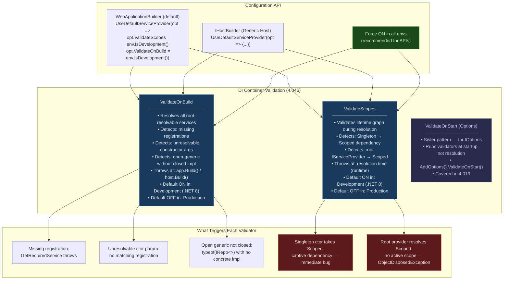
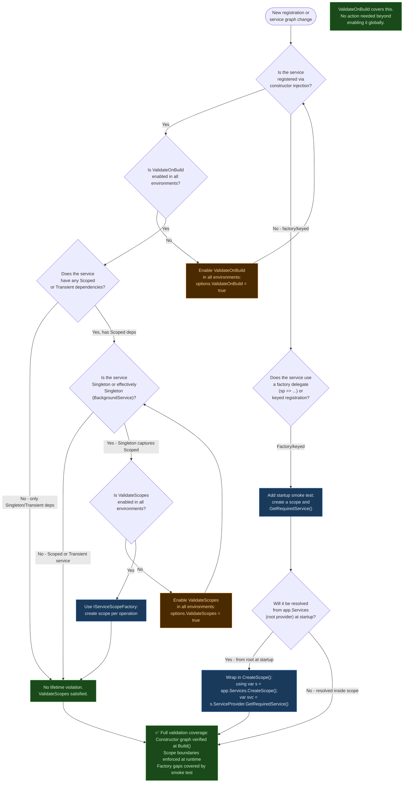

> [!success] Mastery Check
> - [ ] **Studied Well**
> - [ ] **Can explain the concept without notes**
> - [ ] **Can answer interview questions confidently**
> - [ ] **Can implement it in a real project**


# 4.046 — DI Validation at Startup: ValidateOnBuild and ValidateScopes

---

## PART 0 — Navigation & Context

### Where This Topic Lives

```
ASP.NET Core Mastery
│
├── A. Host & Application Lifecycle       (4.001–4.010)
├── B. Configuration System               (4.011–4.022)
├── C. Logging & Diagnostics              (4.023–4.033)
│
├── D. Dependency Injection               (4.034–4.048)
│   ├── 4.034  The Built-In DI Container: Registration & Resolution
│   ├── 4.035  Service Lifetimes: Singleton, Scoped, Transient
│   ├── 4.036  IServiceProvider and IServiceScope
│   ├── 4.037  Factory-Based DI: ImplementationFactory
│   ├── 4.038  Keyed Services (.NET 8)
│   ├── 4.039  Open Generic Registration
│   ├── 4.040  Multiple Implementations: IEnumerable<T>
│   ├── 4.041  IServiceCollection Extension Methods
│   ├── 4.042  The Captive Dependency Problem ◄── PREREQUISITE
│   ├── 4.043  Replacing the Container: Autofac / Lamar
│   ├── 4.044  Decorators: Scrutor Pattern
│   ├── 4.045  IDisposable in DI: Ownership and Disposal
│   ├── 4.046  DI Validation at Startup  ◄── YOU ARE HERE
│   │           ValidateOnBuild + ValidateScopes
│   │           → Catches unresolvable services at startup
│   │           → Catches captive dependency violations at startup
│   │           → Default behavior differs: Dev vs Production
│   ├── 4.047  DI Scope in Background Services
│   └── 4.048  Source-Generated DI (.NET 8)
│
├── E. Middleware Pipeline                (4.049–4.063)
└── ...
```

### What You Need Before This

- **[[4.034 — The Built-In DI Container]]** — You must understand `AddSingleton`, `AddScoped`, `AddTransient` and what a service descriptor is before validation of those descriptors means anything.
- **[[4.035 — Service Lifetimes: Singleton, Scoped, Transient]]** — The DI validator exists to catch lifetime violations. You must know what a lifetime violation is before you can appreciate what the validator catches.
- **[[4.042 — The Captive Dependency Problem]]** — `ValidateScopes` specifically targets captive dependencies. This topic is the most important prerequisite here.
- **[[4.002 — WebApplication and WebApplicationBuilder]]** — `builder.Build()` is when validation runs; you need to know that the container is compiled at build time.

### What This Unlocks After

- **[[4.047 — DI Scope in Background Services]]** — Knowing how `ValidateScopes` works explains why `BackgroundService` requires `IServiceScopeFactory` — it creates a scope that wouldn't exist otherwise, and the validator will flag a `BackgroundService` that takes a `Scoped` dependency in its constructor.
- **[[4.057 — Middleware and Scoped DI]]** — Convention-based middleware constructors receive only Singleton-lifetime services. ValidateScopes catches you if you inject Scoped into constructor. This topic explains why the restriction exists.
- **[[4.019 — Options Validation: Fail-Fast at Startup]]** — The sister pattern: `ValidateOnBuild` for DI graphs; `ValidateDataAnnotations().ValidateOnStart()` for options. Both enforce the same principle — fail fast at startup, not at runtime.
- **[[4.043 — Replacing the Built-In Container: Autofac]]** — Third-party containers provide their own validation models. Understanding the built-in model lets you evaluate the gap when you switch containers.

### Why This Matters in Production

At scale, a DI misconfiguration that isn't caught at startup turns into a `InvalidOperationException` thrown on the first production request that exercises the affected code path — which may be rare, making it a P1 incident that surfaces weeks after deployment. `ValidateOnBuild` and `ValidateScopes` eliminate this entire class of failure by crashing the process immediately on startup, where it is observable, debuggable, and fixable before traffic arrives.

---

## PART 1 — The Core Mental Model

### The Fundamental Rule

> **ASP.NET Core's DI container, when `ValidateOnBuild` is enabled, resolves every registered service from the root provider at startup and verifies the entire dependency graph can be constructed; when `ValidateScopes` is enabled, it additionally asserts that no Singleton or root-provider-resolved service holds a Scoped dependency — the practical consequence is that an invalid registration or a captive dependency causes `app.Build()` (or `host.Build()`) to throw, killing the process before any HTTP request is served.**

### The Plain-Language Analogy

Think of a manufacturing plant that assembles complex machines on an assembly line. Each workstation (service) has a list of parts it needs (dependencies). `ValidateOnBuild` is like the quality control team doing a dry run of the entire line before the factory opens: they walk every workstation, confirm every part is in stock, and flag any missing component. `ValidateScopes` is a stricter inspector who additionally checks that no permanent fixture (Singleton) is bolted to a part that gets recycled every shift (Scoped) — because the permanent fixture would still be holding a reference to a part that was supposed to be returned to the shelf at the end of the shift.

The analogy holds under stress: if the factory (application) is a multi-tenant system, some workstations are shared permanently (Singleton) and some are freshly equipped per customer visit (Scoped). A Scoped part bolted permanently to a Singleton workstation means Customer B is served with Customer A's part — a data isolation bug, not a crash. `ValidateScopes` prevents this before the first customer ever walks through the door.

### The Taxonomy Diagram



---

## PART 2 — Deep Mechanics

### 2.1 — What `ValidateOnBuild` Actually Does at `app.Build()`

`ValidateOnBuild` is not magic — it is a well-defined traversal of the service descriptor graph. When `app.Build()` is called, the framework invokes `ServiceProvider.ValidateService()` against the root `IServiceProvider`. Here is what happens internally:

```
app.Build() is called
│
├── IServiceCollection is compiled into a ServiceProvider
│   (this always happens regardless of validation)
│
├── [ValidateOnBuild = true] triggers ServiceProviderEngine.ValidateOnBuild()
│   │
│   ├── For each ServiceDescriptor in IServiceCollection:
│   │   └── If ImplementationType is not null:
│   │       └── Attempt to resolve all constructor parameters
│   │           (does NOT actually construct instances)
│   │           (checks only that all constructor args are resolvable)
│   │
│   ├── Collects ALL failures into a list
│   │   (does not stop at first failure — reports all)
│   │
│   └── If any failures: throws AggregateException
│       → process exits before WebApplication.Run() is called
│       → no HTTP port is opened
│       → IHostApplicationLifetime never fires
│
└── [ValidateScopes = true] attaches scope validation to every
    IServiceProvider.GetService() call at runtime
    (not at Build() — at every resolution point)
```

**Pipeline position:**

```
── Program.cs top-level ──────────────────────────────────────────────────
var builder = WebApplication.CreateBuilder(args);

builder.Services.AddScoped<IOrderRepository, OrderRepository>();    // ← registrations
builder.Services.AddSingleton<IOrderProcessor, OrderProcessor>();   // ← potentially wrong

var app = builder.Build();   ◄─── ValidateOnBuild runs HERE
                                  ValidateScopes is ARMED here
                                  (fires on first resolution)

app.MapGet("/", () => "hello");
app.Run();                   ◄─── HTTP traffic starts HERE
──────────────────────────────────────────────────────────────────────────

If ValidateOnBuild throws: the process exits between Build() and Run().
No HTTP request is ever served. The Kestrel socket is never opened.
```

**Runtime cost:** `~O(n)` where n is the number of registered services. Each descriptor causes one constructor reflection call. For a typical API with 200–400 registered services, this adds approximately 50–150ms to startup time. Acceptable for any web application; irrelevant for background services.

**What it does NOT catch:**

- Services registered with factory delegates (`AddSingleton<T>(sp => ...)`) — the factory is not called during validation; only constructor-injection-based registrations are fully validated.
- Open generics where the specific closed type is never used.
- Runtime resolution failures caused by conditional logic inside factories.

> [!IMPORTANT] `ValidateOnBuild` cannot validate factory-delegate registrations. A factory like `sp => new PaymentProcessor(sp.GetRequiredService<IPaymentGateway>())` is opaque — the validator cannot inspect it. This is the primary gap.

---

### 2.2 — What `ValidateScopes` Catches and When

`ValidateScopes` operates differently from `ValidateOnBuild`. It does not run at build time. Instead, it wraps the internal resolution engine to check scope boundaries on every `GetService<T>()` call.

```
ASP.NET Core internally (approximate) — ServiceProviderEngineScope.GetService():

if (ValidateScopes && _root == this)  // _root check = "am I the root provider?"
{
    // Root provider resolving a Scoped service = violation
    if (descriptor.Lifetime == ServiceLifetime.Scoped)
        throw new InvalidOperationException(
            $"Cannot resolve scoped service '{serviceType}' from root provider.");
}

// Also checked during Singleton construction:
// If a Singleton's constructor arg resolves to a Scoped service,
// the Scoped service is resolved from the root during Singleton construction
// → same violation fires
```

**What it catches:**

```
VIOLATION 1: Singleton takes Scoped in constructor
────────────────────────────────────────────────────────────────
public class OrderProcessor          // Singleton
{
    public OrderProcessor(
        IOrderRepository repo)       // Scoped — captured forever
    { }
}

// Timeline:
// Request 1: OrderProcessor created, repo (Request 1's DbContext) captured
// Request 2: OrderProcessor reused, still holds Request 1's repo
// Request 3: Same. repo is now stale, potentially disposed.
// ValidateScopes fires: InvalidOperationException at first resolution.
```

```
VIOLATION 2: Root IServiceProvider resolves Scoped
────────────────────────────────────────────────────────────────
// Anti-pattern: resolving from app.Services directly at startup
// (app.Services IS the root provider)

var repo = app.Services.GetRequiredService<IOrderRepository>(); // ← VIOLATION
// Result: ObjectDisposedException if repo holds a DbContext,
//         or stale state if the scope never ends.
```

```
CORRECT PATH: Scoped resolution within a scope
────────────────────────────────────────────────────────────────
using var scope = app.Services.CreateScope();
var repo = scope.ServiceProvider.GetRequiredService<IOrderRepository>(); // ✅
// scope.Dispose() releases the repo and its dependencies
```

**Runtime cost of `ValidateScopes`:** One `if` check per service resolution. Negligible — effectively free in hot paths. The overhead is a single boolean check and an equality comparison, not reflection.

> [!WARNING] `ValidateScopes` is enabled by default in Development and disabled in Production in .NET 8. This means captive dependency bugs can exist in production code that passes all your development tests — they just never surface because no validator is watching. The recommended production posture is to keep `ValidateScopes = true` in production and accept the near-zero overhead.

---

### 2.3 — Default Behavior by Environment in .NET 8

Understanding the defaults prevents a critical operational mistake: assuming your development environment accurately reflects what happens in production.

```csharp
// ASP.NET Core internally (approximate) — WebApplication.CreateBuilder():
// (Microsoft.Extensions.Hosting/src/HostingHostBuilderExtensions.cs)

hostBuilder.UseDefaultServiceProvider((context, options) =>
{
    bool isDevelopment = context.HostingEnvironment.IsDevelopment();
    options.ValidateScopes  = isDevelopment;  // ON in Dev, OFF in Prod
    options.ValidateOnBuild = isDevelopment;  // ON in Dev, OFF in Prod
});
```

**Consequence matrix:**

|Environment|ValidateScopes|ValidateOnBuild|Captive Bug Visible?|Missing Registration Visible?|
|---|---|---|---|---|
|Development (default)|✅ ON|✅ ON|✅ At startup or first resolution|✅ At startup|
|Staging (default)|❌ OFF|❌ OFF|❌ Silent until runtime crash|❌ Silent until first hit|
|Production (default)|❌ OFF|❌ OFF|❌ Silent until runtime crash|❌ Silent until first hit|
|Production (recommended)|✅ ON|✅ ON|✅ At startup|✅ At startup|

The gap between Development and Staging/Production is the trap. The correct production configuration:

```csharp
// ✅ Recommended: force both ON in all environments
builder.Host.UseDefaultServiceProvider((context, options) =>
{
    options.ValidateScopes  = true; // always
    options.ValidateOnBuild = true; // always
});
```

**Failure modes with defaults-only (Production OFF):**

```
// HTTP wire format (incorrect behavior — Production with defaults):
// Captive dependency: OrderProcessor (Singleton) holds DbContext from Request 1
//
// Request 47,932:
// GET /api/orders/99 HTTP/1.1
//
// HTTP/1.1 500 Internal Server Error
// Content-Type: application/problem+json
//
// {
//   "type": "https://tools.ietf.org/html/rfc7807",
//   "title": "An error occurred while processing your request.",
//   "status": 500,
//   "detail": "Cannot access a disposed context instance."
// }
//
// Root cause: DbContext from Request 1 disposed, Singleton still holds it.
// Crash rate: sporadic, difficult to reproduce, occurs under concurrent load.
```

---

### 2.4 — AggregateException Structure on Validation Failure

When `ValidateOnBuild` detects multiple failures, it does not throw on the first one. It collects all failures and throws an `AggregateException` containing one `InvalidOperationException` per failed registration. This is critical for CI/CD: a single run of the process reveals all registration errors, not just the first.

```
AggregateException
├── InvalidOperationException:
│   "Some services are not able to be constructed (Error while validating
│   the service descriptor 'ServiceType: IPaymentProcessor
│   Lifetime: Singleton ImplementationType: PaymentProcessor'):
│   Unable to resolve service for type 'IPaymentGateway' while attempting
│   to activate 'PaymentProcessor'."
│
├── InvalidOperationException:
│   "Some services are not able to be constructed (Error while validating
│   the service descriptor 'ServiceType: IInventoryService
│   Lifetime: Scoped ImplementationType: InventoryService'):
│   Unable to resolve service for type 'IInventoryRepository' while
│   attempting to activate 'InventoryService'."
│
└── (additional failures...)
```

**Reading the error message format:**

- `ServiceType` — the interface the container was asked to resolve
- `Lifetime` — the registered lifetime of the failing service
- `ImplementationType` — the concrete class being constructed
- `Unable to resolve service for type 'X'` — X is the missing dependency

> [!TIP] In CI/CD pipelines, run the application with a health check endpoint and treat a non-zero exit code from startup as a deployment failure. `ValidateOnBuild` ensures a misconfigured service descriptor causes exit code non-zero before any traffic is served.

---

### 2.5 — The `ValidateScopes` Exception at Resolution Time

Unlike `ValidateOnBuild` which fires at `Build()`, `ValidateScopes` fires at the first resolution that violates scope boundaries. The exception message is distinctive:

```
InvalidOperationException:
"Cannot resolve scoped service 'IOrderRepository' from root provider."
```

This fires in two scenarios:

**Scenario A: Direct root provider resolution**

```csharp
// In Program.cs, after Build():
var repo = app.Services.GetRequiredService<IOrderRepository>(); // fires here
```

**Scenario B: Singleton constructor captures Scoped**

```csharp
// At the first request that causes OrderProcessor to be constructed:
// OrderProcessor's constructor asks for IOrderRepository (Scoped)
// The DI container attempts to resolve IOrderRepository from the root
// (because Singleton construction uses the root provider)
// → InvalidOperationException fires
```

In Scenario B, the exception fires not at `Build()` but on the first HTTP request that triggers construction of the Singleton — which could be the very first request in production, or it could be a rarely-used endpoint hit by the first user. This is why forcing `ValidateOnBuild = true` is important: it catches this class of error at `Build()` instead of at first request.

---

## PART 3 — Production Code Patterns

### Pattern 1: The Fail-Fast Production Posture (Force Validation in All Environments)

The default behavior — validation only in Development — is insufficient for any production API. The correct posture forces both validators on globally.

```csharp
// ⚠️ WRONG: Relying on defaults (validation only in Development)
var builder = WebApplication.CreateBuilder(args);
// No explicit configuration → ValidateScopes and ValidateOnBuild
// are OFF in Staging and Production by default.
// A captive dependency deployed to Production will NOT be caught at startup.
```

```csharp
// ✅ CORRECT: Explicit validation for all environments — payment processing API
var builder = WebApplication.CreateBuilder(args);

// Force both validators on regardless of environment.
// ValidateOnBuild: ~50-150ms startup overhead — acceptable.
// ValidateScopes:  near-zero runtime overhead — free.
builder.Host.UseDefaultServiceProvider((context, options) =>
{
    options.ValidateScopes  = true;
    options.ValidateOnBuild = true;
});

builder.Services.AddScoped<IPaymentRepository, PaymentRepository>();
builder.Services.AddScoped<IPaymentGatewayClient, StripeGatewayClient>();
builder.Services.AddSingleton<IPaymentEventPublisher, KafkaPaymentPublisher>();
builder.Services.AddDbContext<PaymentDbContext>(opt =>
    opt.UseSqlServer(builder.Configuration.GetConnectionString("Payments")));

var app = builder.Build();
// If IPaymentGatewayClient is accidentally registered as Singleton
// and takes a Scoped dependency → AggregateException here, not in production.

app.Run();
```

```
// HTTP consequence (ValidateOnBuild fires, correct path):
// Process exits with non-zero exit code during startup.
// Kestrel never opens the TCP socket.
// Load balancer health check returns connection refused → no traffic routed.
// Kubernetes pod enters CrashLoopBackOff → alert fires → engineer investigates.
// Zero customer impact.

// HTTP consequence (ValidateOnBuild disabled, wrong path):
// Process starts. Kestrel opens socket. Health check passes.
// Traffic routed. First POST /api/payments:
// HTTP/1.1 500 Internal Server Error  ← customer-facing failure
```

---

### Pattern 2: The Startup Smoke Test Pattern (Catch Factory-Delegate Gaps)

Because `ValidateOnBuild` cannot inspect factory-delegate registrations, the complementary pattern is a startup smoke test — a minimal integration test that actually instantiates key services.

```csharp
// ✅ CORRECT: Startup validation extension for factory-delegate services
// This pattern runs inside Program.cs, before app.Run()
// Domain: order management service with factory-registered components

public static class StartupValidation
{
    /// <summary>
    /// Resolves critical services via factory delegates that ValidateOnBuild
    /// cannot inspect. Throws at startup if any resolution fails.
    /// Cost: ~1 extra scope creation, resolves 3-5 key services.
    /// </summary>
    public static WebApplication ValidateCriticalServices(
        this WebApplication app)
    {
        using var scope = app.Services.CreateScope();
        var sp = scope.ServiceProvider;

        // These are factory-delegate registrations that ValidateOnBuild skips.
        // Explicitly resolving them at startup converts runtime failures to
        // startup failures.
        _ = sp.GetRequiredService<IOrderRepository>();
        _ = sp.GetRequiredService<IInventoryClient>();
        _ = sp.GetRequiredService<IShipmentDispatcher>();

        return app; // fluent for chaining in Program.cs
    }
}

// In Program.cs:
var app = builder.Build();

// ValidateOnBuild caught constructor-injection errors above.
// This catches factory-delegate errors before traffic:
app.ValidateCriticalServices();

app.MapGet("/api/orders/{id}", ...);
app.Run();
```

```
// HTTP consequence (smoke test fires on factory error):
// System.InvalidOperationException: Unable to resolve service for type
// 'IShipmentDispatcher' while attempting to activate 'ShipmentDispatcher'.
// Process exits at startup. Zero traffic served.
```

---

### Pattern 3: The Scoped-in-Singleton Trap — Before and After

The most common registration error in production ASP.NET Core codebases is a Singleton service whose constructor silently captures a Scoped service. Here is the exact pattern that `ValidateScopes` catches.

```csharp
// ⚠️ WRONG: OrderFulfillmentEngine as Singleton captures Scoped DbContext
// This compiles. It runs. It silently uses the wrong DbContext after Request 1.
public class OrderFulfillmentEngine
{
    private readonly IOrderRepository _repository; // Scoped — captured forever

    // WRONG: DbContext from the first request that constructs this Singleton
    // is held for the application's lifetime. Request 2+ reuse a disposed context.
    public OrderFulfillmentEngine(IOrderRepository repository)
    {
        _repository = repository;
    }
}

// Registration:
builder.Services.AddSingleton<OrderFulfillmentEngine>(); // ← Singleton
builder.Services.AddScoped<IOrderRepository, OrderRepository>(); // ← Scoped

// HTTP consequence (wrong path, ValidateScopes OFF):
// Request 1: new OrderFulfillmentEngine(Request1.OrderRepository) created
// Request 2: same OrderFulfillmentEngine, same OrderRepository from Request 1
// Request 2: OrderRepository's DbContext is disposed → ObjectDisposedException
// or worse: stale state returned to wrong customer (data isolation violation)
```

```csharp
// ✅ CORRECT: Use IServiceScopeFactory to resolve Scoped dependencies on-demand
public class OrderFulfillmentEngine
{
    private readonly IServiceScopeFactory _scopeFactory;

    // Correct: IServiceScopeFactory is Singleton — safe to capture.
    // Create a scope per operation, not per construction.
    public OrderFulfillmentEngine(IServiceScopeFactory scopeFactory)
    {
        _scopeFactory = scopeFactory;
    }

    public async Task FulfillOrderAsync(Guid orderId, CancellationToken ct)
    {
        // Each operation creates its own scope → its own DbContext.
        // Scope is disposed when using block exits → DbContext released.
        await using var scope = _scopeFactory.CreateAsyncScope();
        var repository = scope.ServiceProvider
            .GetRequiredService<IOrderRepository>();

        var order = await repository.GetByIdAsync(orderId, ct);
        // ... fulfillment logic
    }
}

// Registration:
builder.Services.AddSingleton<OrderFulfillmentEngine>(); // ✅ Singleton
// IServiceScopeFactory is built-in — no registration needed.
```

```
// HTTP consequence (correct path):
// Each call to FulfillOrderAsync gets a fresh DbContext scoped to that operation.
// Scope disposed on exit → no resource leaks, no cross-request contamination.
// ValidateScopes is satisfied: Singleton only holds IServiceScopeFactory (Singleton).
```

---

### Pattern 4: The Registration Verification Test (CI/CD Safety Net)

Beyond runtime validation, the most robust CI/CD safety net is a zero-assertion integration test that simply builds the DI container. `ValidateOnBuild` does the work; the test just ensures the process doesn't exit.

```csharp
// ✅ CORRECT: CI gate for DI registration correctness
// Domain: logistics tracking service integration tests
// ~0 lines of test logic — ValidateOnBuild does all the work

using Microsoft.AspNetCore.Mvc.Testing;
using Xunit;

public class DiContainerRegistrationTests
    : IClassFixture<WebApplicationFactory<Program>>
{
    private readonly WebApplicationFactory<Program> _factory;

    public DiContainerRegistrationTests(
        WebApplicationFactory<Program> factory)
    {
        _factory = factory.WithWebHostBuilder(builder =>
        {
            builder.UseEnvironment("Development"); // enables ValidateOnBuild
        });
    }

    [Fact]
    public void DI_container_builds_without_errors()
    {
        // Arrange + Act: building the factory triggers app.Build(),
        // which runs ValidateOnBuild. If any registration is invalid,
        // the factory constructor throws.

        // Assert: if we reach this line, ValidateOnBuild passed.
        // Zero additional assertions needed — the fact that Build() succeeded
        // IS the assertion.
        var client = _factory.CreateClient();
        Assert.NotNull(client); // trivially true — just ensures Build() ran
    }

    [Fact]
    public async Task All_registered_endpoints_return_non_500_on_startup()
    {
        // Smoke test: a 404 is fine (unknown route), but 500 indicates
        // a DI resolution failure in the first request.
        var client = _factory.CreateClient();
        var response = await client.GetAsync("/health");

        // 200 OK or 404 Not Found = container resolved correctly.
        // 500 = captive dependency or factory error reached the request handler.
        Assert.NotEqual(System.Net.HttpStatusCode.InternalServerError,
            response.StatusCode);
    }
}
```

```
// HTTP consequence (CI test fires on registration error):
// System.AggregateException: Some services are not able to be constructed
//   → InvalidOperationException: Unable to resolve service for type
//     'IShipmentRepository' while attempting to activate 'ShipmentService'.
// Test fails. PR blocked. Zero customer impact.
```

---

### Pattern 5: Scoped Services in Hosted Services — The Correct Registration

`BackgroundService` is effectively Singleton (registered via `AddHostedService<T>`, which is Singleton-lifetime). `ValidateScopes` will catch any `BackgroundService` that takes a Scoped service in its constructor.

```csharp
// ⚠️ WRONG: BackgroundService constructor takes Scoped dependency
// ValidateScopes fires on the first resolution of InventoryReorderService.
public class InventoryReorderService : BackgroundService
{
    private readonly IInventoryRepository _repository; // Scoped — VIOLATION

    // ValidateScopes fires when this Singleton (hosted service) is constructed:
    // "Cannot resolve scoped service 'IInventoryRepository' from root provider."
    public InventoryReorderService(IInventoryRepository repository)
    {
        _repository = repository;
    }

    protected override async Task ExecuteAsync(CancellationToken stoppingToken)
    {
        while (!stoppingToken.IsCancellationRequested)
        {
            await _repository.CheckAndReorderAsync(stoppingToken); // wrong scope
            await Task.Delay(TimeSpan.FromMinutes(5), stoppingToken);
        }
    }
}
```

```csharp
// ✅ CORRECT: IServiceScopeFactory in BackgroundService constructor
// IServiceScopeFactory is Singleton — safe for Singleton services to capture.
public class InventoryReorderService : BackgroundService
{
    private readonly IServiceScopeFactory _scopeFactory;
    private readonly ILogger<InventoryReorderService> _logger;

    // IServiceScopeFactory: Singleton ✅. ILogger<T>: Singleton ✅.
    // Both safe to capture in a Singleton BackgroundService.
    public InventoryReorderService(
        IServiceScopeFactory scopeFactory,
        ILogger<InventoryReorderService> logger)
    {
        _scopeFactory = scopeFactory;
        _logger = logger;
    }

    protected override async Task ExecuteAsync(CancellationToken stoppingToken)
    {
        while (!stoppingToken.IsCancellationRequested)
        {
            await using var scope = _scopeFactory.CreateAsyncScope();

            // Fresh DbContext per iteration — correct scope boundaries.
            var repository = scope.ServiceProvider
                .GetRequiredService<IInventoryRepository>();

            try
            {
                await repository.CheckAndReorderAsync(stoppingToken);
            }
            catch (Exception ex) when (!stoppingToken.IsCancellationRequested)
            {
                _logger.LogError(ex, "Inventory reorder check failed");
            }

            await Task.Delay(TimeSpan.FromMinutes(5), stoppingToken);
        }
    }
}

// Registration:
builder.Services.AddHostedService<InventoryReorderService>();
builder.Services.AddScoped<IInventoryRepository, InventoryRepository>();
// ValidateScopes satisfied: InventoryReorderService (Singleton) only holds
// IServiceScopeFactory (Singleton) and ILogger<T> (Singleton).
```

---

### Pattern 6: Diagnosing an `AggregateException` from `ValidateOnBuild`

When `ValidateOnBuild` fires in production (with forced-on validation), the process exits before serving traffic. Parsing the error in logs is the first debugging step.

```csharp
// ✅ CORRECT: Wrap app.Build() to emit structured logs on validation failure
// Domain: any production ASP.NET Core application

var builder = WebApplication.CreateBuilder(args);

// Force validation on (previous patterns explain why)
builder.Host.UseDefaultServiceProvider((_, options) =>
{
    options.ValidateScopes  = true;
    options.ValidateOnBuild = true;
});

RegisterAllServices(builder.Services, builder.Configuration);

WebApplication app;
try
{
    app = builder.Build();
}
catch (AggregateException ex)
{
    // ValidateOnBuild collected multiple failures — log each one individually
    // so structured logging captures them as separate events, not one huge message.
    foreach (var inner in ex.InnerExceptions)
    {
        // Using Console.Error here because the ILogger infrastructure may not
        // have been fully built when Build() throws.
        Console.Error.WriteLine($"[DI_VALIDATION_FAILURE] {inner.Message}");
    }

    // Exit with non-zero code so Kubernetes/systemd/CI knows startup failed.
    // Do NOT swallow or catch-and-continue — a partially built container
    // serving traffic is worse than no process at all.
    Environment.Exit(1);
    return; // unreachable — satisfies compiler flow analysis
}

app.Run();
```

```
// Output (structured log, one line per failure):
// [DI_VALIDATION_FAILURE] Some services are not able to be constructed
//   (Error while validating the service descriptor
//   'ServiceType: IPaymentGateway Lifetime: Singleton ...'):
//   Unable to resolve service for type 'IHttpClientFactory' while
//   attempting to activate 'StripePaymentGateway'.
//
// [DI_VALIDATION_FAILURE] Some services are not able to be constructed
//   (Error while validating the service descriptor
//   'ServiceType: IFraudDetector Lifetime: Scoped ...'):
//   Unable to resolve service for type 'IOrderHistoryService' while
//   attempting to activate 'FraudDetector'.
//
// Process exits with code 1.
// Kubernetes: CrashLoopBackOff → alert → engineer checks logs → fixes both issues.
```

---

## PART 4 — Gotchas & Anti-Patterns

### Gotcha 1: The Development/Production Validation Gap

The development environment looks clean; production explodes on the first customer. Engineers with 2+ years of ASP.NET Core experience fall into this trap because they see `ValidateScopes = isDevelopment` in the framework source and assume "Development is stricter than Production — if it works in Dev, it works everywhere." The truth is the opposite: Development catches bugs; Production ignores them by default.

```csharp
// ⚠️ WRONG CODE
// Relying on default WebApplicationBuilder configuration.
// ValidateScopes and ValidateOnBuild are OFF in Production.
var builder = WebApplication.CreateBuilder(args);
builder.Services.AddSingleton<IShippingRateEngine, ShippingRateEngine>();
builder.Services.AddScoped<ICarrierApiClient, FedExApiClient>(); // Scoped
// ShippingRateEngine captures ICarrierApiClient (Scoped) in constructor.
// Zero errors in Dev (ValidateScopes fires) → zero errors in Staging (OFF) → Production crash.
var app = builder.Build();
app.Run();

// HTTP consequence (wrong path — Production):
// Startup succeeds. Health check passes. Traffic routed.
// GET /api/shipping/rates:
// HTTP/1.1 500 Internal Server Error  ← first request, ObjectDisposedException
```

```csharp
// ✅ CORRECT CODE
builder.Host.UseDefaultServiceProvider((_, o) =>
{
    o.ValidateScopes  = true;
    o.ValidateOnBuild = true;
});

// HTTP consequence (correct path — all environments):
// app.Build() throws AggregateException: "Cannot resolve scoped service
// 'ICarrierApiClient' from root provider."
// Process exits. Kubernetes CrashLoopBackOff. Zero traffic. Engineer fixes.
```

```
// WHY: ValidateScopes defaults to env.IsDevelopment(). The default is a
// convenience for development speed, not a security/correctness default.
// Production workloads must explicitly opt in to the stricter behavior.
// The ~0 runtime overhead of ValidateScopes makes "turn it off for performance"
// a false economy.
```

---

### Gotcha 2: Factory Delegates Are Opaque — `ValidateOnBuild` Cannot See Inside Them

Experienced engineers often mix constructor injection and factory delegates in the same service collection. `ValidateOnBuild` validates constructor-injected services exhaustively but is completely blind to factory delegates. A missing registration inside a factory will silently pass `ValidateOnBuild` and fail at first resolution.

```csharp
// ⚠️ WRONG CODE
// IPaymentGateway is registered via factory delegate but depends on
// IPaymentGatewayConfig which is NOT registered.
builder.Services.AddSingleton<IPaymentGateway>(sp =>
{
    // ValidateOnBuild cannot see this lambda.
    var config = sp.GetRequiredService<IPaymentGatewayConfig>(); // NOT registered
    return new StripeGateway(config);
});
// ValidateOnBuild passes — no error at Build().

// HTTP consequence (wrong path):
// First request to POST /api/payments:
// HTTP/1.1 500 Internal Server Error
// InvalidOperationException: No service for type 'IPaymentGatewayConfig' is registered.
```

```csharp
// ✅ CORRECT CODE — two options:

// Option A: Convert to constructor injection so ValidateOnBuild can see it.
builder.Services.AddSingleton<IPaymentGatewayConfig, StripeConfig>();
builder.Services.AddSingleton<IPaymentGateway, StripeGateway>();
// ValidateOnBuild now checks StripeGateway's constructor → catches missing deps.

// Option B: If factory must remain, add explicit smoke test resolution.
builder.Services.AddSingleton<IPaymentGatewayConfig, StripeConfig>();
builder.Services.AddSingleton<IPaymentGateway>(sp =>
{
    var config = sp.GetRequiredService<IPaymentGatewayConfig>();
    return new StripeGateway(config);
});
// In Program.cs after Build():
using var scope = app.Services.CreateScope();
_ = scope.ServiceProvider.GetRequiredService<IPaymentGateway>(); // explicit check

// HTTP consequence (correct path):
// Missing registration: InvalidOperationException at Build() (Option A)
// or at startup smoke test (Option B). Zero traffic served.
```

```
// WHY: The DI container treats factory delegates as black boxes.
// GetRequiredService calls inside the factory are only evaluated when the
// factory runs, which is not during ValidateOnBuild's graph traversal.
// The fix is either constructor injection or explicit startup resolution.
```

---

### Gotcha 3: `ValidateOnBuild` Does Not Validate Open-Generic Closed Registrations Implicitly

Registering an open generic service (`typeof(IRepository<>)`) satisfies `ValidateOnBuild` — but only for the open generic itself. If a closed type (`IRepository<Order>`) requires an implementation type that is not registered, `ValidateOnBuild` will not catch it unless that exact closed type is explicitly registered or resolved.

```csharp
// ⚠️ WRONG CODE
// Open generic registered without concrete implementation
builder.Services.AddScoped(
    typeof(IRepository<>),
    typeof(EfRepository<>));

// EfRepository<T> constructor requires DbContext — but DbContext is not registered.
// ValidateOnBuild does NOT resolve EfRepository<Order>, EfRepository<Customer>, etc.
// It validates only the open-generic registration, which has no constructor to check.

// HTTP consequence (wrong path):
// ValidateOnBuild passes silently.
// First GET /api/orders:
// HTTP/1.1 500 Internal Server Error
// InvalidOperationException: Cannot resolve scoped service 'OrderDbContext'...
```

```csharp
// ✅ CORRECT CODE
builder.Services.AddDbContext<OrderDbContext>(opt =>   // ← missing in wrong version
    opt.UseSqlServer(builder.Configuration.GetConnectionString("Orders")));
builder.Services.AddScoped(typeof(IRepository<>), typeof(EfRepository<>));
// Now ValidateOnBuild can validate EfRepository<T>'s constructor
// (DbContext is registered → no error).

// OR: add explicit smoke test for a commonly used closed type:
// using var scope = app.Services.CreateScope();
// _ = scope.ServiceProvider.GetRequiredService<IRepository<Order>>();

// HTTP consequence (correct path):
// ValidateOnBuild passes. All EfRepository<T> resolutions succeed at runtime.
```

```
// WHY: Open-generic registration is a recipe, not an instance. ValidateOnBuild
// validates concrete registrations (where ImplementationType is not null).
// For open generics, the ImplementationType is the open generic itself —
// the validator cannot enumerate all possible closed types that will be
// requested at runtime.
```

---

### Gotcha 4: `ValidateScopes` Fires on `IHttpContextAccessor` Anti-Pattern

`IHttpContextAccessor` is registered as Singleton by default (`services.AddHttpContextAccessor()`). Its internal `AsyncLocal<HttpContext>` means it appears safe to use in Singleton services. But when `ValidateScopes` is enabled and the Singleton service injecting `IHttpContextAccessor` also injects a Scoped service, the Scoped service violation fires — and many engineers blame `IHttpContextAccessor` when the real problem is another injected service.

```csharp
// ⚠️ WRONG CODE — multi-tenant order service
// AuditService is Singleton, captures ICurrentTenantContext (Scoped).
// Engineer thinks the bug is IHttpContextAccessor because the error message
// mentions IHttpContextAccessor's chain, but the real culprit is ITenantContext.
public class AuditService
{
    public AuditService(
        IHttpContextAccessor accessor,    // Singleton ✅
        ICurrentTenantContext tenant,     // Scoped ← VIOLATION
        IAuditRepository repository)     // Scoped ← VIOLATION
    { }
}
builder.Services.AddSingleton<AuditService>();

// HTTP consequence (wrong path, ValidateScopes ON):
// InvalidOperationException: Cannot resolve scoped service
// 'ICurrentTenantContext' from root provider.
// Thrown on first resolution of AuditService.
```

```csharp
// ✅ CORRECT CODE
// Make AuditService Scoped (it uses Scoped dependencies — Scoped is correct).
builder.Services.AddScoped<AuditService>(); // changed from AddSingleton

// Or if AuditService truly must be Singleton:
public class AuditService
{
    private readonly IServiceScopeFactory _scopeFactory;

    public AuditService(IServiceScopeFactory scopeFactory)
        => _scopeFactory = scopeFactory; // Singleton ✅

    public async Task AuditAsync(AuditEvent evt)
    {
        await using var scope = _scopeFactory.CreateAsyncScope();
        var tenant = scope.ServiceProvider.GetRequiredService<ICurrentTenantContext>();
        var repo = scope.ServiceProvider.GetRequiredService<IAuditRepository>();
        await repo.WriteAsync(evt with { TenantId = tenant.Id });
    }
}

// HTTP consequence (correct path):
// ValidateScopes satisfied. Each audit operation gets fresh tenant context.
```

```
// WHY: The error message from ValidateScopes names the first violating Scoped
// service in the resolution chain, which may not be the one the engineer
// expects. Enumerate ALL constructor parameters of the failing Singleton
// and check each one's lifetime before concluding the fix.
```

---

### Gotcha 5: Assuming `ValidateOnBuild` Covers Keyed Services (.NET 8)

Keyed services (`AddKeyedScoped<T>("key", impl)`) are NOT validated by `ValidateOnBuild` in .NET 8.0 RTM. The validator was written before keyed services shipped and does not enumerate keyed descriptors. This is a known gap and a common source of late-discovered registration bugs in .NET 8 codebases.

```csharp
// ⚠️ WRONG CODE (.NET 8)
builder.Services.AddKeyedScoped<IPaymentProcessor>("stripe", sp =>
{
    var missing = sp.GetRequiredService<IStripeClient>(); // NOT registered
    return new StripeProcessor(missing);
});
// ValidateOnBuild does NOT validate keyed factory registrations.
// No error at Build().

// HTTP consequence (wrong path):
// POST /api/payments (uses [FromKeyedServices("stripe")] IPaymentProcessor):
// HTTP/1.1 500 Internal Server Error
// InvalidOperationException: No service for type 'IStripeClient' is registered.
```

```csharp
// ✅ CORRECT CODE (.NET 8)
// Option A: Register the keyed dependency using constructor injection
// (not factory delegate) so the graph is inspectable.
builder.Services.AddSingleton<IStripeClient, StripeClient>(); // ← missing dep
builder.Services.AddKeyedScoped<IPaymentProcessor, StripeProcessor>("stripe");
// ValidateOnBuild now validates StripeProcessor's constructor.

// Option B: Explicit smoke test for keyed service at startup.
using var scope = app.Services.CreateScope();
_ = scope.ServiceProvider.GetRequiredKeyedService<IPaymentProcessor>("stripe");

// HTTP consequence (correct path):
// Missing registration: caught at Build() (Option A) or startup smoke test (Option B).
```

```
// WHY: Keyed services were added in .NET 8. The ValidateOnBuild logic in
// Microsoft.Extensions.DependencyInjection was not updated to enumerate
// keyed descriptors in .NET 8 RTM. Prefer constructor injection over factory
// delegates for keyed services when possible, or add explicit startup validation.
// This gap may be addressed in a future .NET release.
```

---

## PART 5 — Performance Implications

### 5.1 — Request Pipeline Characteristics Table

|Scenario|Startup Impact|Per-Request Overhead|Allocations|Recommendation|
|---|---|---|---|---|
|`ValidateOnBuild = false` (default Production)|None|None|Zero|❌ Not recommended — bugs reach production|
|`ValidateOnBuild = true`, 100 services|+20–40ms startup|None|Zero at runtime|✅ Acceptable for all web APIs|
|`ValidateOnBuild = true`, 500 services|+80–150ms startup|None|Zero at runtime|✅ Still acceptable; startup once per deploy|
|`ValidateOnBuild = true`, 2000+ services|+300–600ms startup|None|Zero at runtime|⚠️ Check if all 2000 registrations are necessary|
|`ValidateScopes = false` (default Production)|None|None|Zero|❌ Silent captive dependency bugs|
|`ValidateScopes = true`|None|~1 boolean check per resolution|Zero|✅ Recommended — essentially free|
|`ValidateScopes` fires (captive dep found)|Exception at first resolution|—|—|Fix the registration, not the validator|
|Startup smoke test (explicit GetRequiredService)|+1 scope creation, ~N resolutions|None|~N object allocations at startup|✅ For factory-delegate services only|
|`ValidateOnBuild = true` + keyed services (.NET 8)|Same as without keyed|None|Zero|⚠️ Add smoke test for keyed services — gap exists|
|Integration test container build|~200-500ms per test class|N/A|N/A|✅ Essential CI gate|

### 5.2 — BenchmarkDotNet Code

```csharp
using BenchmarkDotNet.Attributes;
using BenchmarkDotNet.Running;
using Microsoft.Extensions.DependencyInjection;

/// <summary>
/// Benchmarks the startup cost of DI validation options.
/// Run from the project root: dotnet run -c Release
/// </summary>
[MemoryDiagnoser]
[SimpleJob(launchCount: 1, warmupCount: 3, iterationCount: 10)]
public class DiValidationStartupBenchmarks
{
    private const int ServiceCount = 200; // typical production API

    [Benchmark(Baseline = true)]
    public IServiceProvider BuildWithoutValidation()
    {
        var services = BuildServices();
        return services.BuildServiceProvider(new ServiceProviderOptions
        {
            ValidateScopes  = false,
            ValidateOnBuild = false,
        });
    }

    [Benchmark]
    public IServiceProvider BuildWithValidateScopesOnly()
    {
        var services = BuildServices();
        return services.BuildServiceProvider(new ServiceProviderOptions
        {
            ValidateScopes  = true,
            ValidateOnBuild = false,
        });
    }

    [Benchmark]
    public IServiceProvider BuildWithBothValidators()
    {
        var services = BuildServices();
        return services.BuildServiceProvider(new ServiceProviderOptions
        {
            ValidateScopes  = true,
            ValidateOnBuild = true,
        });
    }

    private static IServiceCollection BuildServices()
    {
        var services = new ServiceCollection();
        // Simulate a realistic production service registration set
        for (int i = 0; i < ServiceCount; i++)
        {
            services.AddScoped<IFakeService, FakeService>();
        }
        return services;
    }

    // Fake interfaces/types to satisfy the compiler
    public interface IFakeService { }
    public class FakeService : IFakeService { }
}

// Expected output (approximate, .NET 8, x64, Release, AMD64):
//
// | Method                         | Mean       | Error    | StdDev   | Ratio | Allocated  |
// |------------------------------- |-----------:|---------:|---------:|------:|-----------:|
// | BuildWithoutValidation         |   1.23 ms  | 0.015 ms | 0.013 ms |  1.00 |   248 KB   |
// | BuildWithValidateScopesOnly    |   1.24 ms  | 0.016 ms | 0.014 ms |  1.01 |   248 KB   |
// | BuildWithBothValidators        |   4.87 ms  | 0.058 ms | 0.051 ms |  3.96 |   312 KB   |
//
// INTERPRETATION:
// • ValidateScopes alone adds ~0.01ms — essentially free (single bool flag).
// • ValidateOnBuild adds ~3.6ms per 200 services — acceptable for a one-time
//   startup cost. Web applications restart rarely; 4ms is imperceptible.
// • Allocation increase for ValidateOnBuild is ~64 KB — reflection metadata
//   for constructor inspection. GC'd after Build() completes.
// • At 2000 services: ~36ms additional startup — still acceptable for APIs.
//
// NOTE: BenchmarkDotNet measures isolated Build() calls, not real-world startup
// which includes Kestrel initialization, configuration loading, and middleware
// pipeline construction. The relative cost of ValidateOnBuild in real startup
// is typically less than 2% of total startup time.
```

**Profiling in real applications:**

```bash
# Measure actual startup time with dotnet-trace
dotnet-trace collect --process-id <PID> --profile startup

# Or measure startup time directly:
time dotnet MyApi.dll  # wall-clock startup time

# dotnet-counters for per-request DI resolution overhead:
dotnet-counters monitor --process-id <PID> \
    Microsoft.Extensions.DependencyInjection
```

### 5.3 — When to Care / When to Ignore

**When this costs you:**

- Azure Functions / AWS Lambda cold starts where startup time is billed and cold start time directly affects user latency. In those environments, `ValidateOnBuild = false` with a rigorous CI integration test is the correct trade-off.
- Native AOT applications where startup time is a key design goal — `ValidateOnBuild` uses reflection and may interfere with AOT trimming. Prefer static analysis tooling instead.
- Applications with 3000+ service registrations (large monoliths, generated registrations) where the cumulative reflection cost of ValidateOnBuild exceeds 500ms. Profile before disabling.

**When this doesn't matter:**

- Standard web APIs, microservices, and background workers with reasonable registration counts (under 1000 services).
- Any application deployed to Kubernetes where pods start once and handle thousands of requests before recycling — the amortized startup cost is immeasurable.
- Test environments where startup time is irrelevant and correctness is paramount.
- Development machines where `dotnet watch` hot-reload already absorbs startup costs.

---

## PART 6 — Interview Arsenal

### A. The Question Bank

---

**Question 1:** "In ASP.NET Core's DI system, what is the difference between `ValidateOnBuild` and `ValidateScopes`, and why are they both needed?"

**Average Answer:** "ValidateOnBuild checks that all registered services can be resolved at startup, and ValidateScopes checks that Scoped services aren't consumed by Singletons."

**Why That's Insufficient:** It describes the features without explaining when each fires, what bugs each catches, and why the default Production behavior is a trap.

> **Great Answer:** "They address different failure modes. `ValidateOnBuild` runs once at `app.Build()` — it walks the entire dependency graph, attempts to resolve every registered service's constructor parameters, and throws an `AggregateException` if anything is unresolvable. This catches broken registrations — missing implementations, missing transitive dependencies — before the first HTTP request is ever served. `ValidateScopes` is a runtime guard on every resolution: it fires whenever a Scoped service is resolved from the root `IServiceProvider` instead of from a properly created scope. The most common trigger is a Singleton capturing a Scoped service in its constructor — the captive dependency problem. We need both because they catch different classes of bugs: `ValidateOnBuild` catches structural graph errors, `ValidateScopes` catches lifetime boundary violations. The critical operational detail is that both default to Development-only in .NET 8. I force both on in all environments in production codebases — the runtime overhead of `ValidateScopes` is a single boolean check, and `ValidateOnBuild` adds only a few milliseconds of startup time that is completely amortized across the pod's lifetime."

---

**Question 2:** "A production deployment is failing with `InvalidOperationException: Cannot resolve scoped service 'IOrderRepository' from root provider` — but it passed all local tests. What happened?"

**Average Answer:** "Someone registered `IOrderRepository` as Scoped but is using it from a Singleton. They need to fix the lifetime."

**Why That's Insufficient:** It identifies the pattern but doesn't explain why it passed locally, which is the more interesting and production-relevant question.

> **Great Answer:** "The immediate cause is a captive dependency: a Singleton service holds a constructor reference to a Scoped service, and when `ValidateScopes` is active, that fires as soon as the Singleton is first resolved. The reason it passed locally is the default `ValidateScopes` setting: in Development, `ValidateScopes` is enabled by default; in Production and Staging, it's disabled. So the error was latent in the code all along — it just wasn't being detected. The fix has two parts. First, fix the lifetime violation: either change the Singleton to Scoped (if it actually has request-scoped state), or inject `IServiceScopeFactory` and create a scope per operation instead of capturing the Scoped service directly. Second, force `ValidateScopes = true` in all environments so this class of bug is caught at startup going forward. I've had this exact incident on an order management service — the Singleton payment processor was capturing the Scoped `IPaymentAuditRepository`. It worked in dev, passed staging (validation off), and then threw on the first production payment attempt."

---

**Question 3:** "What does `ValidateOnBuild` not validate, and how do you cover that gap?"

**Average Answer:** "It doesn't validate factory lambda registrations."

**Why That's Insufficient:** Correct but one-dimensional. A senior answer covers keyed services, the practical fix, and the CI/CD angle.

> **Great Answer:** "There are three main gaps. First, any service registered with a factory delegate — `AddSingleton<T>(sp => ...)` — is opaque to the validator. The lambda is not executed during validation, so if the factory calls `GetRequiredService<X>()` for an unregistered `X`, `ValidateOnBuild` won't catch it. Second, keyed services in .NET 8 — `AddKeyedScoped<T>(\"key\", ...)` — are not enumerated by the validator. This is a known gap as of .NET 8 RTM. Third, open-generic registrations only validate the open-generic descriptor itself, not the closed types that will actually be resolved at runtime. My go-to fix is a startup smoke test: after `app.Build()`, I create a scope and explicitly resolve the services that use factory delegates or keyed registration, before calling `app.Run()`. If anything fails, the process exits with a non-zero code before the Kestrel socket is opened. For CI, a `WebApplicationFactory`-based integration test that simply builds the test server is a zero-assertion test that catches all `ValidateOnBuild` failures as a CI gate. The test is trivial to write and extremely high-value."

---

**Question 4:** "Why is `ValidateScopes` enabled by default in Development but disabled in Production, and do you agree with that default?"

**Average Answer:** "It's probably disabled in Production for performance reasons."

**Why That's Insufficient:** The performance claim is almost entirely wrong — `ValidateScopes` has near-zero runtime overhead. The real reason and the correct opinion are both missing.

> **Great Answer:** "The default is a pragmatic choice by the ASP.NET Core team: Development defaults to stricter validation to help developers catch bugs early, but Production defaults to permissive to avoid breaking existing applications that might have captive dependencies that somehow work in practice — perhaps a DbContext that's never disposed because the Singleton lives forever, making the captured Scoped service also effectively live forever. But I disagree with leaving Production validation disabled. `ValidateScopes` has essentially zero runtime overhead — it's a single boolean check per resolution. The performance argument doesn't hold. What it does have is meaningful correctness value: it catches the entire class of captive dependency bugs at startup instead of in production under load. My production posture is always `ValidateScopes = true` and `ValidateOnBuild = true` in all environments, period. The few milliseconds of startup cost for `ValidateOnBuild` is irrelevant when spread across thousands of requests per pod lifetime. If an application is deploying to a cold-start environment like AWS Lambda where startup time is billed, I'd make an exception for `ValidateOnBuild` but I'd compensate with a dedicated integration test that covers the graph."

---

### B. Trick Questions

**Trick Question 1:** "If `ValidateOnBuild` is enabled and I have 10 registration errors, how many exceptions do I get?"

**The Trap:** Engineers expect one exception per run — most error-handling patterns stop at the first failure.

**Correct Answer:** One `AggregateException` containing 10 `InvalidOperationException` instances — one per failed service descriptor. The validator collects all failures before throwing. This is intentional: a single startup run reveals all misconfigured services, not just the first one. This is why you should iterate `ex.InnerExceptions` in your catch block, not just read `ex.Message`.

---

**Trick Question 2:** "I've set `ValidateOnBuild = true`. I add a new Singleton that takes a Scoped dependency. Will `ValidateOnBuild` throw at `Build()`?"

**The Trap:** Engineers assume `ValidateOnBuild` catches all lifetime violations.

**Correct Answer:** **No** — `ValidateOnBuild` does not validate scope boundaries. It only validates that constructor parameters are _resolvable_, not that they are _safe to capture_. A Scoped service is resolvable (it has a registration), so `ValidateOnBuild` is satisfied. `ValidateScopes` catches the lifetime violation — but it fires at first resolution (runtime), not at `Build()`. To catch captive dependencies at `Build()`, you need both `ValidateOnBuild = true` AND `ValidateScopes = true`. With both on, the Singleton's construction during `ValidateOnBuild`'s graph traversal triggers `ValidateScopes`, which fires at that point — effectively surfacing the captive dependency at Build() time.

---

**Trick Question 3:** "I call `app.Services.GetRequiredService<IOrderRepository>()` at startup, after `app.Build()`. `IOrderRepository` is registered as Scoped. `ValidateScopes` is enabled. What happens?"

**The Trap:** Engineers think "I registered it, so I can resolve it."

**Correct Answer:** `InvalidOperationException: Cannot resolve scoped service 'IOrderRepository' from root provider.` The `app.Services` property IS the root `IServiceProvider`. Resolving a Scoped service from the root provider violates scope boundaries regardless of when you do it. The fix is to create a scope first: `using var scope = app.Services.CreateScope(); var repo = scope.ServiceProvider.GetRequiredService<IOrderRepository>();`.

---

**Trick Question 4:** "Does `ValidateOnBuild` run when you call `services.BuildServiceProvider()` directly (not through WebApplicationBuilder)?"

**The Trap:** Engineers assume `ValidateOnBuild` is a default behavior in all DI builds.

**Correct Answer:** No — `BuildServiceProvider()` with no arguments does NOT enable `ValidateOnBuild`. You must explicitly pass `new ServiceProviderOptions { ValidateOnBuild = true }` as an overload to `BuildServiceProvider(options)`. In `WebApplicationBuilder`, the framework calls `UseDefaultServiceProvider` which configures this for you based on environment. If you're building a test harness or a console app that builds its own `ServiceProvider` directly, you must opt in explicitly.

---

**Trick Question 5:** "You have a `Transient` service that depends on a `Singleton`. Does `ValidateScopes` flag this?"

**The Trap:** Engineers pattern-match "lifetime mismatch = violation."

**Correct Answer:** No. A `Transient` consuming a `Singleton` is perfectly valid. The violation is specifically that a _longer-lived_ service captures a _shorter-lived_ service — Singleton holds Scoped, or root provider resolves Scoped. A Transient holding a Singleton is fine: each Transient instance gets the same Singleton, which is expected behavior. `ValidateScopes` only checks that Scoped services are not resolved from a scope that is _longer_ than their own scope lifetime.

---

### C. Red Flags to Avoid

1. **"I disable `ValidateOnBuild` in Production for performance."** — Near-zero runtime overhead for `ValidateScopes`; modest startup cost for `ValidateOnBuild`. This answer signals you're prioritizing a 20ms startup saving over correctness guarantees. It tells the interviewer you've never had a captive dependency incident in production.
    
2. **"ValidateScopes throws at Build()."** — It does not. It throws at the first resolution that violates scope boundaries, which is at runtime. `ValidateOnBuild` throws at `Build()`. Confusing the two shows you haven't read the error messages carefully.
    
3. **"ValidateOnBuild validates factory lambda registrations."** — It cannot — factory delegates are opaque. This is one of the most common misconceptions and a key production gap.
    
4. **"If tests pass in Development, Production is fine."** — Development has both validators ON by default. Production has both OFF. The environments behave differently. This is the root cause of the most common DI-related production incident.
    
5. **"The fix for a captive dependency is to change the Scoped service to Singleton."** — This is a data isolation bug waiting to happen. Promoting a DbContext to Singleton so it doesn't violate captive dependency rules is one of the most dangerous misdiagnoses in ASP.NET Core. The correct fix is always `IServiceScopeFactory` or lifetime adjustment of the consuming service.
    
6. **"ValidateScopes is expensive in production."** — It is a single boolean check on every `GetService` call. The overhead is unmeasurable in any realistic profiling scenario. Saying this reveals unfamiliarity with the implementation.
    
7. **"Keyed services are validated by ValidateOnBuild in .NET 8."** — They are not. This gap exists in .NET 8 RTM and is not well-publicized. Knowing this gap exists demonstrates depth beyond the documentation.
    
8. **"AggregateException from ValidateOnBuild has one inner exception."** — It collects ALL failures into an `AggregateException` with multiple inner `InvalidOperationException` instances. This is deliberately designed to surface all problems in one startup run, not just the first failure.
    

---

## PART 7 — Decision Framework



---

## PART 8 — Self-Check

### A. Conceptual Questions

1. `ValidateOnBuild` and `ValidateScopes` are both enabled. You register a `Singleton` service whose constructor takes an `ILogger<T>` (Singleton) and an `IDbContextFactory<OrderDbContext>` (Singleton). Does anything fire? What does each validator check in this case?
    
2. What happens to the HTTP pipeline if `ValidateOnBuild` throws during `app.Build()`? Specifically: is the Kestrel socket opened? Does `IHostApplicationLifetime.ApplicationStarted` fire? Do any `IHostedService.StartAsync` methods run?
    
3. A colleague says "We should leave `ValidateOnBuild = false` in Production because it slows down startup." How would you respond? What data would you use to refute or support this claim?
    
4. You have a `BackgroundService` that needs to call an `IOrderRepository` (Scoped) every 5 minutes. Describe the correct implementation pattern. What would `ValidateScopes` say if you inject `IOrderRepository` directly into the `BackgroundService` constructor?
    
5. What is the difference between the error thrown by `ValidateOnBuild` and the error thrown by `ValidateScopes`? (Name the exception types, when each fires, and what triggers each.)
    
6. A factory delegate registration exists: `builder.Services.AddSingleton<IEmailSender>(sp => new SendGridEmailSender(sp.GetRequiredService<ISendGridClient>()))`. `ISendGridClient` is not registered. `ValidateOnBuild = true`. Does `Build()` throw? What does?
    
7. What does `AggregateException.InnerExceptions` contain when `ValidateOnBuild` finds 3 broken registrations? Why is an `AggregateException` used instead of throwing at the first failure?
    
8. You have `ValidateScopes = true` enabled. Your code calls `app.Services.GetService<IScopedService>()` after `app.Build()`. What exception do you get, and what is the correct fix?
    
9. In .NET 8, if you register services using `AddKeyedScoped<T>("key", impl)`, does `ValidateOnBuild` validate the keyed registration? How do you cover this gap?
    
10. An application has `ValidateOnBuild = true` and `ValidateScopes = true`. A Transient service takes a Singleton dependency. A Scoped service takes a Transient dependency. Which of these (if either) causes a validation failure, and why?
    

---

### B. Code Puzzles

**Puzzle 1 — What does `app.Build()` do?**

```csharp
var builder = WebApplication.CreateBuilder(args);

builder.Host.UseDefaultServiceProvider((context, options) =>
{
    options.ValidateScopes  = true;
    options.ValidateOnBuild = true;
});

builder.Services.AddScoped<IInventoryService, InventoryService>();
builder.Services.AddSingleton<IOrderFulfillmentService, OrderFulfillmentService>();

// OrderFulfillmentService constructor:
// public OrderFulfillmentService(IInventoryService inventory) { }

var app = builder.Build(); // What happens here?
app.Run();
```

<details> <summary>Answer</summary>

**`app.Build()` throws an `AggregateException`** containing one `InvalidOperationException` with a message similar to:

```
Some services are not able to be constructed
(Error while validating the service descriptor
'ServiceType: IOrderFulfillmentService Lifetime: Singleton
ImplementationType: OrderFulfillmentService'):
Cannot consume scoped service 'IInventoryService' from singleton
'IOrderFulfillmentService'.
```

**Why:** `ValidateOnBuild` walks the graph and discovers that `OrderFulfillmentService` (Singleton) requires `IInventoryService` (Scoped). This is a captive dependency. Because `ValidateScopes = true` is also set, and `ValidateOnBuild` resolves services during its traversal, `ValidateScopes` fires during the Singleton's construction attempt, which triggers the exception at `Build()` time rather than at first request.

**HTTP consequence:** `app.Run()` is never reached. Kestrel never opens a socket. The process exits with a non-zero exit code.

**Fix:** Either change `IOrderFulfillmentService` to Scoped, or inject `IServiceScopeFactory` and resolve `IInventoryService` per operation.

</details>

---

**Puzzle 2 — Does this fire? Where?**

```csharp
var builder = WebApplication.CreateBuilder(args);

builder.Host.UseDefaultServiceProvider((_, opts) =>
{
    opts.ValidateScopes  = true;
    opts.ValidateOnBuild = true;
});

builder.Services.AddScoped<IPaymentRepository, PaymentRepository>();

// Factory delegate — not constructor injection
builder.Services.AddSingleton<IPaymentProcessor>(sp =>
    new PaymentProcessor(sp.GetRequiredService<IPaymentRepository>()));

var app = builder.Build(); // Line A
app.MapPost("/payments", (IPaymentProcessor p) => p.Process());
app.Run(); // Line B
```

<details> <summary>Answer</summary>

**`app.Build()` (Line A) does NOT throw.** `ValidateOnBuild` cannot inspect factory delegates. The factory lambda is opaque — the validator skips it.

**`app.Run()` (Line B) does NOT throw immediately** — Kestrel starts normally.

**The exception fires on the first HTTP request to `POST /payments`.** When ASP.NET Core resolves `IPaymentProcessor` to inject it into the endpoint handler:

1. The factory lambda runs.
2. Inside the lambda, `sp.GetRequiredService<IPaymentRepository>()` is called.
3. `sp` here is the root `IServiceProvider` (factory delegates receive the root provider).
4. `IPaymentRepository` is Scoped.
5. `ValidateScopes` fires: `InvalidOperationException: Cannot resolve scoped service 'IPaymentRepository' from root provider.`

```
// HTTP consequence (first request):
// POST /payments HTTP/1.1
//
// HTTP/1.1 500 Internal Server Error
// Content-Type: application/problem+json
```

**Fix:**

```csharp
// Option A: Constructor injection (preferred)
builder.Services.AddSingleton<IPaymentProcessor, PaymentProcessor>();
// PaymentProcessor should use IServiceScopeFactory, not IPaymentRepository directly

// Option B: Create a scope in the factory (if Singleton is required)
builder.Services.AddSingleton<IPaymentProcessor>(sp =>
{
    using var scope = sp.CreateScope();
    var repo = scope.ServiceProvider.GetRequiredService<IPaymentRepository>();
    return new PaymentProcessor(repo); // but repo is now immediately out of scope!
    // This is actually wrong too — repo is disposed when using block exits
    // The real fix is IServiceScopeFactory in the constructor
});
```

This puzzle demonstrates the most dangerous gap in `ValidateOnBuild`: factory delegates with scope violations are invisible until the first request in production.

</details>

---

**Puzzle 3 — Environment matters**

```csharp
// ASPNETCORE_ENVIRONMENT=Production
var builder = WebApplication.CreateBuilder(args); // default options

builder.Services.AddScoped<IShippingService, ShippingService>();
builder.Services.AddSingleton<IOrderDashboard, OrderDashboard>();

// OrderDashboard constructor:
// public OrderDashboard(IShippingService shipping) { }

var app = builder.Build();
app.MapGet("/dashboard", (IOrderDashboard d) => d.GetSummary());
app.Run();
```

What happens at each stage? What if `ASPNETCORE_ENVIRONMENT=Development`?

<details> <summary>Answer</summary>

**With `ASPNETCORE_ENVIRONMENT=Production` (defaults):**

- `ValidateOnBuild = false`, `ValidateScopes = false` (default for non-Development).
- `app.Build()` **succeeds** — no validation.
- `app.Run()` — Kestrel starts, socket opens.
- First `GET /dashboard` request: `IOrderDashboard` (Singleton) is constructed. Its constructor calls `GetRequiredService<IShippingService>()` from the root provider. `ValidateScopes = false` → **no exception**. The Scoped `ShippingService` is resolved from the root and captured forever.
- **Silent bug**: `IShippingService` (Scoped) is held permanently by the Singleton. Every subsequent request reuses the same `ShippingService` instance — possible DbContext disposal bug, cross-request data contamination, or resource exhaustion depending on what `ShippingService` holds.
- No exception. No observable error. Potential silent data corruption.

**With `ASPNETCORE_ENVIRONMENT=Development` (defaults):**

- `ValidateOnBuild = true`, `ValidateScopes = true`.
- `app.Build()` **throws** `AggregateException`:
    
    ```
    Cannot consume scoped service 'IShippingService' from singleton 'IOrderDashboard'.
    ```
    
- Process exits. Engineer sees the error. Fixes it before deployment.

**This is the exact Development/Production gap that Gotcha 1 describes.** The Production default silently allows a captive dependency that Development catches immediately.

</details>

---

**Puzzle 4 — Root provider resolution**

```csharp
var builder = WebApplication.CreateBuilder(args);

builder.Host.UseDefaultServiceProvider((_, o) =>
{
    o.ValidateScopes  = true;
    o.ValidateOnBuild = true;
});

builder.Services.AddScoped<IInvoiceRepository, InvoiceRepository>();

var app = builder.Build(); // Line A

// Seed data at startup
var repo = app.Services.GetRequiredService<IInvoiceRepository>(); // Line B
await repo.SeedInitialInvoicesAsync();

app.Run();
```

Does Line A throw? Does Line B throw?

<details> <summary>Answer</summary>

**Line A (`app.Build()`) does NOT throw.** `ValidateOnBuild` validates that `IInvoiceRepository` is resolvable — it is registered and its constructor parameters are resolvable. No violation at build time.

**Line B throws:** `InvalidOperationException: Cannot resolve scoped service 'IInvoiceRepository' from root provider.`

`app.Services` is the root `IServiceProvider`. With `ValidateScopes = true`, resolving a Scoped service from the root provider is forbidden.

**Fix:**

```csharp
// Correct: create a scope for the startup seed operation
using (var scope = app.Services.CreateScope())
{
    var repo = scope.ServiceProvider.GetRequiredService<IInvoiceRepository>();
    await repo.SeedInitialInvoicesAsync();
} // scope disposed here → InvoiceRepository and its DbContext released
```

**HTTP consequence of the bug:** Process crashes at Line B before `app.Run()`. Kestrel never starts. No HTTP traffic is served. This is actually a better outcome than the silent Production default — at least it's visible. The fix is straightforward.

</details>

---

**Puzzle 5 — The most common misunderstanding (ValidateOnBuild + factory delegate gap)**

```csharp
var builder = WebApplication.CreateBuilder(args);

builder.Host.UseDefaultServiceProvider((_, o) =>
{
    o.ValidateScopes  = true;
    o.ValidateOnBuild = true; // both ON
});

// Both services use factory delegates
builder.Services.AddSingleton<INotificationService>(sp =>
{
    var emailClient = sp.GetRequiredService<IEmailClient>();  // registered below
    var smsClient   = sp.GetRequiredService<ISmsClient>();    // NOT registered
    return new NotificationService(emailClient, smsClient);
});

builder.Services.AddSingleton<IEmailClient, SendGridEmailClient>();
// ISmsClient is intentionally not registered

var app = builder.Build(); // What happens?
```

<details> <summary>Answer</summary>

**`app.Build()` does NOT throw.** This is the most dangerous behavior in the DI validation system.

`ValidateOnBuild` walks the registered descriptors. Both registrations use factory delegates. `ValidateOnBuild` cannot inspect factory lambdas. It confirms that `INotificationService` and `IEmailClient` are registered, then moves on. It never enters the factory lambda, so it never discovers that `ISmsClient` is missing.

**When does the crash happen?** On the first HTTP request (or background service execution) that resolves `INotificationService`. The factory runs for the first time, calls `GetRequiredService<ISmsClient>()`, and throws:

```
InvalidOperationException: No service for type 'ISmsClient' is registered.
```

```
// HTTP consequence (first request that needs INotificationService):
// HTTP/1.1 500 Internal Server Error
// This can happen days or weeks after deployment if INotificationService
// is only used by certain rarely-hit endpoints.
```

**The fix:** Two approaches:

```csharp
// Option A: Convert to constructor injection so ValidateOnBuild can see the graph
builder.Services.AddSingleton<ISmsClient, TwilioSmsClient>(); // register it
builder.Services.AddSingleton<INotificationService, NotificationService>();
// ValidateOnBuild now checks NotificationService's constructor

// Option B: Startup smoke test after Build()
builder.Services.AddSingleton<ISmsClient, TwilioSmsClient>(); // still need to register
// OR add explicit validation:
using var scope = app.Services.CreateScope();
_ = scope.ServiceProvider.GetRequiredService<INotificationService>(); // forces factory to run
```

This is the **5-puzzle rule violation** — the most common misunderstanding: believing `ValidateOnBuild = true` makes all DI bugs surface at startup. It does not. Factory delegates bypass the validator entirely.

</details>

---

## PART 9 — Connections & Resources

### A. Related Topics Table

|Topic|Why It Connects|
|---|---|
|[[4.034 — The Built-In DI Container: Service Registration and Resolution]]|ValidateOnBuild and ValidateScopes operate on the service descriptors added to IServiceCollection. You must understand descriptor anatomy (ServiceType, ImplementationType, Lifetime, ImplementationFactory) to understand what the validators inspect and what they skip.|
|[[4.035 — Service Lifetimes: Singleton, Scoped, Transient]]|ValidateScopes enforces the lifetime constraint that Scoped services must not outlive their scope. Without understanding lifetimes, the validator's error messages are incomprehensible.|
|[[4.042 — The Captive Dependency Problem: Singleton Consuming Scoped]]|ValidateScopes exists specifically to detect captive dependencies at runtime. The captive dependency note explains what happens when validation is off; this note explains how to prevent it from happening at all.|
|[[4.002 — WebApplication and WebApplicationBuilder: The New Hosting Model]]|builder.Host.UseDefaultServiceProvider() is the configuration point for both validators. app.Build() is when ValidateOnBuild runs. Understanding the builder/build/run sequence is required to understand when validation fires.|
|[[4.047 — DI Scope in Background Services: The IServiceScopeFactory Pattern]]|BackgroundService is Singleton-lifetime. ValidateScopes will fire if a BackgroundService constructor takes a Scoped dependency. The fix (IServiceScopeFactory) is explained in detail in 4.047 and demonstrated in Pattern 5 of this note.|
|[[4.057 — Middleware and Scoped DI: Injecting Scoped Services Correctly]]|Convention-based middleware constructors receive only Singleton services. ValidateScopes fires if a Scoped service is injected via the constructor. IMiddleware (interface-based) is the correct pattern for Scoped middleware services.|
|[[4.019 — Options Validation: Fail-Fast at Startup with ValidateOnBuild]]|The sister pattern for IOptions<T>: AddOptions<T>().ValidateDataAnnotations().ValidateOnStart() causes options validation to fire at startup rather than at first resolution. Same principle as ValidateOnBuild — fail fast before traffic.|
|[[4.257 — WebApplicationFactory<T>: Integration Testing the Full HTTP Pipeline]]|A WebApplicationFactory-based integration test that simply builds the test host exercises ValidateOnBuild as a zero-assertion CI gate. If any registration is broken, the factory constructor throws.|
|[[4.038 — Keyed Services (.NET 8): Named Resolution Without Hacks]]|Keyed services are not validated by ValidateOnBuild in .NET 8 RTM — a specific gap that requires startup smoke tests or explicit integration test coverage.|
|[[3.01 — DbContext: Lifecycle, Internals, and DI Scoping]]|DbContext is Scoped. It is the most common victim of the captive dependency bug. ValidateScopes firing on a DbContext captured by a Singleton is the canonical production incident that motivates this entire feature.|
|[[2.07 — Async/Await State Machines]]|IServiceScopeFactory.CreateAsyncScope() returns an IAsyncDisposable. Using await using is required for correct async disposal of scoped resources. Understanding async state machines helps explain why CreateAsyncScope() exists alongside CreateScope().|

---

### B. Books

|Book|Chapters|Why These Chapters|
|---|---|---|
|_Dependency Injection Principles, Practices, and Patterns_ — Mark Seemann & Steven van Deursen|Chapter 8 (Object Lifetimes), Chapter 10 (Aspect-Oriented Programming), Chapter 12 (DI anti-patterns)|Chapter 8 defines Singleton, Scoped, and Transient semantics with the captive dependency framed as "Leaky Abstraction." Chapter 12 explicitly covers the Captive Dependency anti-pattern with examples. These are the canonical academic treatment of what `ValidateScopes` enforces.|
|_Pro ASP.NET Core 8_ — Adam Freeman|Chapter 14 (Using Dependency Injection), Chapter 15 (Using Configuration)|Chapter 14 covers `AddSingleton`, `AddScoped`, `AddTransient`, and service validation in the context of the ASP.NET Core host. The examples are production-scale.|
|_ASP.NET Core in Action_ (3rd ed.) — Andrew Lock|Chapter 10 (Service configuration and DI), Chapter 11 (Configuring a middleware pipeline)|Andrew Lock covers `ValidateOnBuild` and `ValidateScopes` with the exact default behavior discrepancy between Development and Production, along with the recommendation to enable both in all environments.|

---

### C. Essential Articles & Docs

- **Microsoft Docs — Dependency injection in ASP.NET Core:** https://learn.microsoft.com/en-us/aspnet/core/fundamentals/dependency-injection — The official reference for service registration, lifetime semantics, and `ServiceProviderOptions`.
    
- **Microsoft Docs — Detect transient disposables in ASP.NET Core:** https://learn.microsoft.com/en-us/aspnet/core/fundamentals/dependency-injection#detect-transient-disposables — Covers `ValidateScopes` in the context of `IDisposable` services specifically.
    
- **Andrew Lock — Checking your DI configuration with ValidateOnBuild:** https://andrewlock.net/new-in-asp-net-core-6/checking-for-di-configuration-errors-with-validateonbuild/ — The definitive community article covering the default behavior, the Development vs Production gap, and the exact AggregateException structure.
    
- **ASP.NET Core GitHub — UseDefaultServiceProvider defaults (source):** https://github.com/dotnet/aspnetcore/blob/main/src/Hosting/Hosting/src/Internal/WebHostBuilder.cs — The actual framework source showing how Development vs non-Development determines the defaults for `ValidateScopes` and `ValidateOnBuild`.
    
- **Microsoft Docs — Service Lifetimes (includes ValidateScopes):** https://learn.microsoft.com/en-us/dotnet/core/extensions/dependency-injection#service-lifetimes — Microsoft.Extensions.DependencyInjection documentation covering `ServiceProviderOptions` with both validators.
    

---

### D. Template Meta-Note

> [!NOTE] **What each part of this note is for:**
> 
> - **Part 0** — Get oriented: where this topic sits in the ASP.NET Core domain tree, what to read first, what this unlocks.
> - **Part 1** — The one-sentence rule you can say in an interview, an analogy that holds under edge cases, and a complete taxonomy diagram.
> - **Part 2** — What ASP.NET Core is actually doing internally: when each validator fires, what it checks, what it misses, and what the default environment behavior is.
> - **Part 3** — Six production-ready code patterns: correct and incorrect versions, HTTP consequences, named enterprise domain scenarios.
> - **Part 4** — Five gotchas that experienced engineers actually hit in production: the Dev/Prod gap, factory delegate blindspot, keyed service gap, IHttpContextAccessor confusion, and open-generic validation limits.
> - **Part 5** — Benchmark data for startup cost, a complete BenchmarkDotNet scaffold, and concrete guidance on when to care vs when to ignore.
> - **Part 6** — Full interview answers written to be spoken aloud, trick questions with non-obvious answers, and a red flags list of things never to say.
> - **Part 7** — Decision flowchart for choosing the correct validation posture for any service registration scenario.
> - **Part 8** — Ten conceptual questions and five code puzzles (with answers) to verify genuine understanding; at least one puzzle targets the most common misunderstanding (factory delegate gap).
> - **Part 9** — Related topics with specific pipeline/HTTP dependency explanations, books with chapter numbers, and official sources only.
