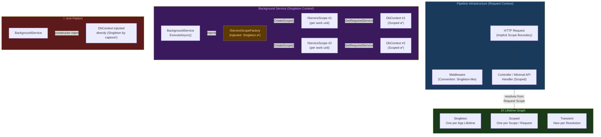
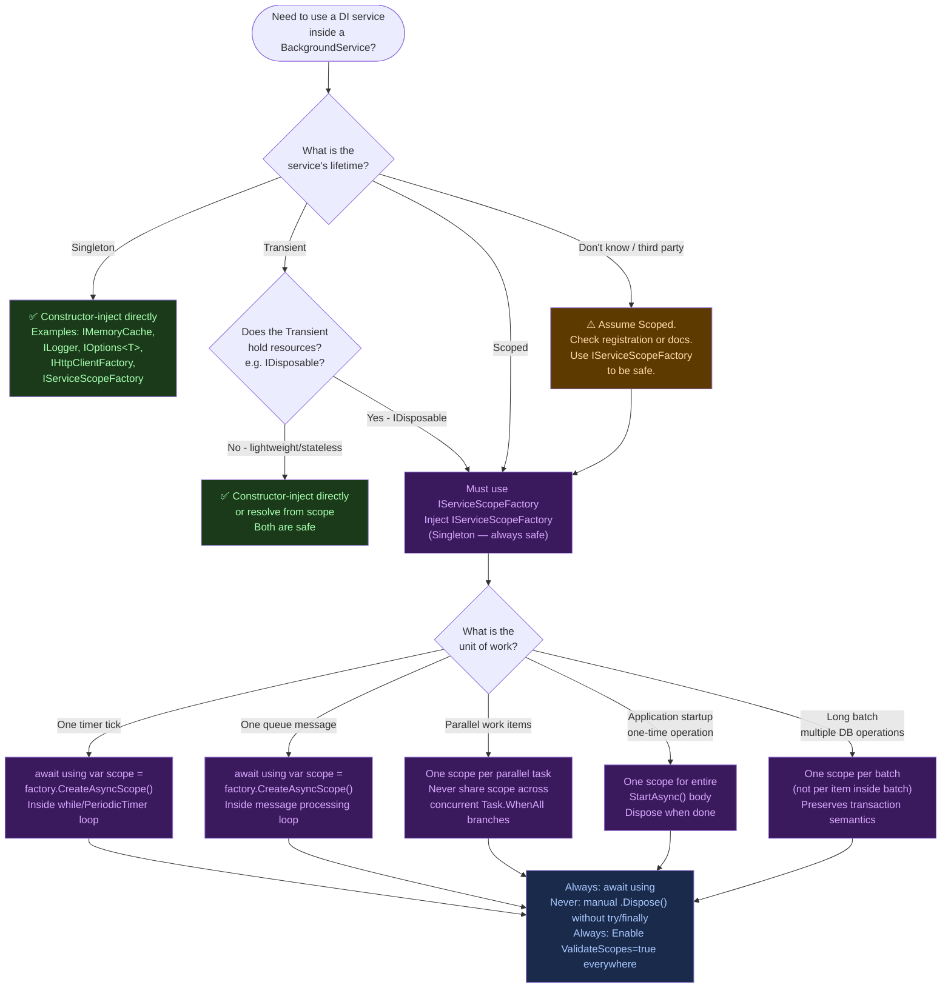

> [!success] Mastery Check
> - [ ] **Studied Well**
> - [ ] **Can explain the concept without notes**
> - [ ] **Can answer interview questions confidently**
> - [ ] **Can implement it in a real project**

# 4.047 — DI Scope in Background Services: The IServiceScopeFactory Pattern

---

## PART 0 — Navigation & Context

### Domain Hierarchy

```
ASP.NET Core Mastery
│
├── A. Host & Application Lifecycle      (4.001–4.010)
├── B. Configuration System              (4.011–4.022)
├── C. Logging & Diagnostics             (4.023–4.033)
├── D. Dependency Injection              (4.034–4.048)
│   ├── 4.034  The Built-In DI Container
│   ├── 4.035  Service Lifetimes: Singleton, Scoped, Transient
│   ├── 4.036  IServiceProvider and IServiceScope
│   ├── 4.037  Factory-Based DI
│   ├── 4.038  Keyed Services (.NET 8)
│   ├── 4.039  Open Generic Registration
│   ├── 4.040  Multiple Implementations: IEnumerable<T>
│   ├── 4.041  IServiceCollection Extension Methods
│   ├── 4.042  The Captive Dependency Problem
│   ├── 4.043  Replacing the Container: Autofac
│   ├── 4.044  Decorators: Scrutor
│   ├── 4.045  IDisposable in DI
│   ├── 4.046  DI Validation at Startup
│   ├── 4.047  ◄ DI Scope in Background Services  ◄ YOU ARE HERE
│   └── 4.048  Source-Generated DI (.NET 8)
│
├── E. Middleware Pipeline                (4.049–4.063)
├── R. Background Services               (4.231–4.239)
│   ├── 4.232  BackgroundService base class
│   ├── 4.233  Timed Background Service
│   ├── 4.234  Queued Background Tasks
│   └── 4.235  Scoped Services in BackgroundService ◄ deep dive companion
└── ...
```

### What You Need Before This

- **[[4.035 — Service Lifetimes: Singleton, Scoped, Transient]]** — you must know what "Scoped" means before you can understand why it breaks inside a BackgroundService.
- **[[4.042 — The Captive Dependency Problem]]** — the bug this topic solves is a variant of captive dependency; read that first.
- **[[4.232 — BackgroundService: The Base Class for Long-Running Work]]** — BackgroundService's `ExecuteAsync` lifecycle and CancellationToken contract.
- **[[4.036 — IServiceProvider and IServiceScope]]** — `IServiceScopeFactory` produces `IServiceScope`; understanding scope creation is prerequisite.

### What This Unlocks After

- **[[4.234 — Queued Background Tasks: Channel<T>-Based Producer/Consumer]]** — every consumer that processes work items needs a scope per work item.
- **[[4.235 — Scoped Services in BackgroundService]]** — the deeper treatment of scope patterns inside long-running services.
- **[[3.01 — DbContext: Lifecycle, Internals, and DI Scoping]]** — `DbContext` is Scoped; every database operation in a background service requires this pattern.
- **[[4.238 — Hangfire Integration]]** — Hangfire job execution creates a scope per job; understanding this pattern explains why Hangfire works correctly.

### Why This Topic Matters at Scale

Background services that directly inject Scoped dependencies (like `DbContext`, `IRepository<T>`, or `IUnitOfWork`) silently share a single service instance across every task they execute — producing data corruption, DbContext tracking conflicts, and connection pool exhaustion at production load, none of which appear in development until the service has processed thousands of records.

---

## PART 1 — The Core Mental Model

### The Fundamental Rule

> **BackgroundService runs as a Singleton — it lives for the application lifetime — so it cannot receive Scoped services through constructor injection. The practical consequence is that every unit of work the service processes must create and dispose its own `IServiceScope`, or it will share stale, cross-contaminated service instances across all work items.**

### The Plain-Language Analogy

Think of a factory floor with a permanent night-shift manager (the BackgroundService — Singleton, always present) and a series of contract workers (Scoped services — hired per shift, released when the shift ends). The manager cannot bring a contract worker home permanently; they must be hired fresh at the start of each shift and let go at the end. If the manager tried to keep one contract worker forever, that worker would carry stale knowledge from months of previous shifts — wrong inventory counts, wrong customer state, wrong database connections.

The `IServiceScopeFactory` is the hiring agency. Every time the manager needs to do a unit of work, they call the agency (`factory.CreateScope()`), hire fresh workers for that unit of work (resolve Scoped services from `scope.ServiceProvider`), do the work, and then let those workers go (`scope.Dispose()`). The agency itself lives permanently with the manager — it is Singleton — but the workers it provides are always fresh.

This analogy holds even for concurrent work: ten simultaneous jobs mean ten simultaneous `using (factory.CreateScope())` blocks, each with their own set of workers, none sharing state. It holds for the failure case too: if the manager injects the contract worker directly into his home (constructor-injects a Scoped service), that worker is the same person who showed up on day one, carrying six months of accumulated, incorrect state.

### The Taxonomy Diagram



---

## PART 2 — Deep Mechanics

### 2.1 Why BackgroundService Is a Singleton and Why That Matters

BackgroundService is registered with `AddHostedService<T>()`, which internally calls `AddSingleton<IHostedService, T>()`. This means the framework creates exactly one instance of your background service when the host starts, and that instance lives until the process exits.

The DI container enforces a critical rule: a Singleton service **may not receive a Scoped service as a constructor parameter**. In development (where `ValidateScopes = true` by default), this is caught at startup:

```
// Pipeline position: during app.Build() → IHost.StartAsync() → hosted service resolution
// The container throws at startup, before any request is served

InvalidOperationException: Cannot consume scoped service 'OrderProcessingService.Infrastructure.IOrderRepository'
from singleton 'OrderProcessingService.Workers.OrderProcessingWorker'.
```

In production, if `ValidateScopes` is `false` (the default for non-Development environments in older configurations), no exception is thrown — the Scoped service is silently captured, and the Singleton holds it for the application lifetime. A `DbContext` captured this way will accumulate every entity it has ever tracked, leak connections, and produce inexplicable `ObjectDisposedException` errors after the context's internal state becomes inconsistent.

**Pipeline Position:**

```
App Startup
───────────────────────────────────────────────────────────────────
IHost.StartAsync()
  └── IHostedService.StartAsync() ← Your BackgroundService.StartAsync()
        └── Task.Run(() => ExecuteAsync(stoppingToken))
              └── Your work loop runs here — OUTSIDE the HTTP pipeline
                  No HttpContext. No Request Scope. No implicit scope.
───────────────────────────────────────────────────────────────────
HTTP Pipeline (completely separate):
  Kestrel → Middleware → Routing → Auth → Endpoint Handler
                          (Each request has its own IServiceScope)
```

**Framework Source (approximate):**

```csharp
// Microsoft.Extensions.Hosting internals — BackgroundService.StartAsync
// Source: src/libraries/Microsoft.Extensions.Hosting.Abstractions/src/BackgroundService.cs
public virtual Task StartAsync(CancellationToken cancellationToken)
{
    _stoppingCts = CancellationTokenSource.CreateLinkedTokenSource(cancellationToken);
    _executeTask = ExecuteAsync(_stoppingCts.Token);  // ← Runs on ThreadPool, no scope
    if (_executeTask.IsCompleted)
        return _executeTask;
    return Task.CompletedTask;  // ← Returns immediately; ExecuteAsync runs in background
}
```

**Runtime cost:** `~0 allocations` for the BackgroundService itself (it's a long-lived Singleton). Every `IServiceScopeFactory.CreateScope()` allocates ~1 `ServiceProviderEngineScope` object on the heap — cheap, but must be `Dispose()`d or the scope and all its services will be leaked.

---

### 2.2 IServiceScopeFactory — The Only Safe Bridge

`IServiceScopeFactory` is registered as a **Singleton** by the DI container itself. It is safe to inject into any service at any lifetime, including Singleton BackgroundServices. It is the official mechanism for creating child scopes that have their own lifetime boundary.

```csharp
// ASP.NET Core internally (approximate):
// ServiceProviderEngineScope implements both IServiceScope and IServiceProvider
public interface IServiceScopeFactory
{
    IServiceScope CreateScope();
}

public interface IServiceScope : IDisposable
{
    IServiceProvider ServiceProvider { get; }
}
```

When you call `factory.CreateScope()`, the container creates a new `ServiceProviderEngineScope` — a child container that shares the root container's Singleton registrations but creates independent instances of every Scoped registration. When you `Dispose()` the scope, all `IDisposable` Scoped services created within it are disposed in reverse registration order.

**The Correct Injection Pattern:**

```
BackgroundService (Singleton)
  └── IServiceScopeFactory (Singleton) ← safe to inject
        └── IServiceScope (transient boundary — create and dispose per work unit)
              └── IOrderRepository (Scoped) ← safe to resolve here
              └── AppDbContext (Scoped) ← safe to resolve here
              └── ILogger<T> (Singleton, but resolved fine from child scope)
```

**Runtime Cost:**

- `IServiceScopeFactory.CreateScope()` → `~1 heap allocation` (the scope object)
- Resolving a Scoped service from the new scope → `~1 allocation` per new instance
- `scope.Dispose()` → calls `Dispose()` on all `IDisposable` Scoped services → `0 allocations`, just method calls
- Failing to dispose → memory leak + unclosed DB connections (DbContext holds `SqlConnection`)

---

### 2.3 The Per-Work-Item Scope Pattern

Every discrete unit of work processed by a background service must be wrapped in its own `using` block. "Unit of work" varies by service type:

- **Timed service:** one scope per timer tick
- **Queue consumer:** one scope per dequeued message
- **Batch processor:** one scope per batch (not per item — batches should share a UoW)
- **Event processor:** one scope per event

**Framework Source — what `using` does here:**

```csharp
// ASP.NET Core internally (approximate):
// IServiceScope.Dispose() triggers:
//   foreach (var disposable in _disposables)
//       disposable.Dispose();
// where _disposables is every Scoped IDisposable resolved from this scope
```

**HTTP consequence of the pattern:** This pattern has no direct HTTP consequence — background services produce no HTTP responses. The observable production consequence of getting this wrong is:

```
// WRONG: shared DbContext across all orders ever processed
// Symptom: ObjectDisposedException, ChangeTracker conflicts, connection pool exhaustion
// Observable in logs: "A second operation was started on this context instance before..."
//                     "The connection does not support MultipleActiveResultSets"
//                     Memory growth over time (ChangeTracker accumulating tracked entities)
```

```
// CORRECT: fresh DbContext per order, disposed after processing
// Observable: Stable memory, no DbContext errors, connection pool returns connections promptly
```

**Runtime Cost Comparison:**

|Pattern|DbContext instances per 10k orders|Connections held|ChangeTracker size|
|---|---|---|---|
|Constructor-inject DbContext|1 (leaked forever)|1 (held forever)|Grows to 10k+ entities|
|IServiceScopeFactory per order|10,000 (short-lived)|~10-20 (pool)|Max ~1-100 per scope|

---

### 2.4 Scope Lifetime and the Three Failure Modes

**Failure Mode 1: Captive Scoped Dependency (no scope created)**

```
// Runtime exception in Development:
InvalidOperationException: Cannot consume scoped service '...' from singleton '...'

// In Production (if ValidateScopes=false): silent corruption
// No exception at startup, no exception at runtime until state accumulates
```

**Failure Mode 2: Scope Leak (scope created but not disposed)**

```
// No exception. Observable symptoms at scale:
// - Memory grows monotonically with processed work items
// - DbContext connections not returned to pool → connection exhaustion
// - "Timeout expired. The timeout period elapsed prior to obtaining a connection..."
// - dotnet-counters shows: Microsoft.AspNetCore.Hosting/requests-per-second healthy
//                          but: dotnet-counters show GC Gen2 size growing
```

**Failure Mode 3: Scope Shared Across Concurrent Work Items**

```csharp
// ⚠️ SUBTLE BUG: single scope shared across concurrent tasks
private IServiceScope _sharedScope;  // created once

protected override async Task ExecuteAsync(CancellationToken stoppingToken)
{
    _sharedScope = _scopeFactory.CreateScope();
    var dbContext = _sharedScope.ServiceProvider.GetRequiredService<AppDbContext>();
    
    // Multiple threads calling dbContext simultaneously
    // DbContext is NOT thread-safe
    // Observable: "A second operation was started on this context instance before..."
}

// ✅ CORRECT: one scope per concurrent operation, not one shared scope
```

**Pipeline Position for all three failure modes:**

```
ProcessAsync() method (runs on ThreadPool, no HTTP context)
  │
  ├── Failure 1: No scope at all → DbContext is Singleton-captured
  │     → ChangeTracker grows unbounded, connections never released
  │
  ├── Failure 2: Scope created, not disposed
  │     → Scope and its services held in memory until GC (never, for Scoped services)
  │
  └── Failure 3: One scope shared across concurrent calls
        → DbContext accessed from multiple threads simultaneously
        → Non-deterministic exceptions, data corruption
```

---

### 2.5 AsyncServiceScope (.NET 6+) — The Modern Disposal Pattern

.NET 6 introduced `IAsyncServiceScope` and the `CreateAsyncScope()` extension method on `IServiceScopeFactory`. This is the preferred approach when scoped services implement `IAsyncDisposable`.

```csharp
// ASP.NET Core internally (approximate):
// IAsyncServiceScope wraps ServiceProviderEngineScope and calls DisposeAsync()
// on any IAsyncDisposable services before Dispose() on IDisposable ones
public interface IAsyncServiceScope : IAsyncDisposable
{
    IServiceProvider ServiceProvider { get; }
}
```

`DbContext` in EF Core 7+ implements `IAsyncDisposable`. Using `await using` with `CreateAsyncScope()` ensures async disposal is called, which gives EF Core the chance to flush connection state asynchronously rather than blocking a thread pool thread.

**Runtime Cost:** `CreateAsyncScope()` has the same allocation cost as `CreateScope()`. The benefit is correctness in async disposal chains, not performance.

---

## PART 3 — Production Code Patterns

### Pattern 1: The Canonical Per-Tick Scope in an Order Polling Service

```csharp
// Domain: e-commerce order management — polling for orders ready to fulfill
// Pattern: one scope per timer tick, no scope leaks possible

public class OrderFulfillmentWorker : BackgroundService
{
    private readonly IServiceScopeFactory _scopeFactory;
    private readonly ILogger<OrderFulfillmentWorker> _logger;

    // ✅ CORRECT: inject IServiceScopeFactory (Singleton) — never inject IOrderFulfillmentService directly
    public OrderFulfillmentWorker(
        IServiceScopeFactory scopeFactory,
        ILogger<OrderFulfillmentWorker> logger)
    {
        _scopeFactory = scopeFactory;
        _logger = logger;
    }

    protected override async Task ExecuteAsync(CancellationToken stoppingToken)
    {
        var timer = new PeriodicTimer(TimeSpan.FromSeconds(30));

        while (await timer.WaitForNextTickAsync(stoppingToken))
        {
            // ✅ CORRECT: fresh scope per tick — DbContext, repositories, UoW all fresh
            await using var scope = _scopeFactory.CreateAsyncScope();

            var fulfillmentService = scope.ServiceProvider
                .GetRequiredService<IOrderFulfillmentService>();

            try
            {
                // All work inside this scope shares one DbContext instance
                // The DbContext is disposed cleanly when the scope ends (await using)
                await fulfillmentService.ProcessPendingOrdersAsync(stoppingToken);
            }
            catch (OperationCanceledException) when (stoppingToken.IsCancellationRequested)
            {
                // Expected during graceful shutdown — do not log as error
                break;
            }
            catch (Exception ex)
            {
                // Log but do NOT rethrow — rethrowing kills ExecuteAsync permanently
                // The next tick will try again with a fresh scope
                _logger.LogError(ex, "Failed to process pending orders. Will retry next tick.");
            }
            // scope.DisposeAsync() called here automatically — DbContext disposed cleanly
        }
    }
}

// Registration:
// builder.Services.AddHostedService<OrderFulfillmentWorker>();
// builder.Services.AddScoped<IOrderFulfillmentService, OrderFulfillmentService>();
// builder.Services.AddDbContext<OrderDbContext>(options => ...);
```

---

### Pattern 2: The Per-Message Scope in a Queue Consumer

```csharp
// Domain: logistics shipment tracking — processing inbound carrier webhook events
// Pattern: one scope per message — correct unit of work boundary for event processing

public class ShipmentEventConsumer : BackgroundService
{
    private readonly IServiceScopeFactory _scopeFactory;
    private readonly Channel<ShipmentEvent> _channel;
    private readonly ILogger<ShipmentEventConsumer> _logger;

    public ShipmentEventConsumer(
        IServiceScopeFactory scopeFactory,
        Channel<ShipmentEvent> channel,   // Singleton channel — fine to inject directly
        ILogger<ShipmentEventConsumer> logger)
    {
        _scopeFactory = scopeFactory;
        _channel = channel;
        _logger = logger;
    }

    protected override async Task ExecuteAsync(CancellationToken stoppingToken)
    {
        await foreach (var shipmentEvent in _channel.Reader.ReadAllAsync(stoppingToken))
        {
            // ✅ CORRECT: scope per message — each event gets its own DbContext
            // If two messages arrive concurrently via parallel consumers, each has isolated state
            await using var scope = _scopeFactory.CreateAsyncScope();

            var handler = scope.ServiceProvider
                .GetRequiredService<IShipmentEventHandler>();

            try
            {
                await handler.HandleAsync(shipmentEvent, stoppingToken);
            }
            catch (Exception ex)
            {
                _logger.LogError(ex,
                    "Failed to handle shipment event {EventType} for shipment {ShipmentId}. " +
                    "Event will not be retried — consider dead-letter queue.",
                    shipmentEvent.EventType, shipmentEvent.ShipmentId);
                // Do not rethrow — channel consumption continues for next message
            }
        }
    }
}
```

---

### Pattern 3: The Anti-Pattern — Constructor-Injected DbContext

```csharp
// ⚠️ WRONG: injecting a Scoped service into the constructor of a BackgroundService
// This compiles fine. In Development, it throws InvalidOperationException at startup.
// In Production (ValidateScopes=false), it silently captures the DbContext forever.

public class InvoiceGenerationWorker : BackgroundService
{
    private readonly AppDbContext _dbContext;      // ⚠️ WRONG: captured as Singleton
    private readonly IInvoiceService _invoiceService; // ⚠️ WRONG: captured as Singleton

    public InvoiceGenerationWorker(
        AppDbContext dbContext,
        IInvoiceService invoiceService)
    {
        _dbContext = dbContext;
        _invoiceService = invoiceService;
    }

    protected override async Task ExecuteAsync(CancellationToken stoppingToken)
    {
        while (!stoppingToken.IsCancellationRequested)
        {
            // After 10,000 invoices, _dbContext.ChangeTracker has 10,000 tracked entities
            // Memory grows without bound; eventually OOM or severe GC pressure
            var pendingInvoices = await _dbContext.Invoices
                .Where(i => i.Status == InvoiceStatus.Pending)
                .ToListAsync(stoppingToken);

            foreach (var invoice in pendingInvoices)
                await _invoiceService.GenerateAsync(invoice, stoppingToken);

            await Task.Delay(TimeSpan.FromMinutes(1), stoppingToken);
        }
    }
}

// HTTP consequence (wrong path — what happens in production):
// No HTTP error — background services don't produce HTTP responses.
// Observable symptoms: memory leak, EF Core tracking conflicts,
// "InvalidOperationException: A second operation was started on this context instance before..."
// eventually: OutOfMemoryException or connection pool exhaustion

// ✅ CORRECT: use IServiceScopeFactory (see Pattern 1 above)
```

---

### Pattern 4: The Parallel Work Dispatch Pattern with Bounded Concurrency

```csharp
// Domain: payment reconciliation service — processing bank statement records in parallel
// Pattern: each parallel task gets its own scope — DbContext is never shared across threads

public class PaymentReconciliationWorker : BackgroundService
{
    private readonly IServiceScopeFactory _scopeFactory;
    private readonly ILogger<PaymentReconciliationWorker> _logger;
    // Maximum concurrent reconciliation operations — prevents connection pool exhaustion
    private readonly SemaphoreSlim _concurrencyLimiter = new(maxCount: 5, initialCount: 5);

    public PaymentReconciliationWorker(
        IServiceScopeFactory scopeFactory,
        ILogger<PaymentReconciliationWorker> logger)
    {
        _scopeFactory = scopeFactory;
        _logger = logger;
    }

    protected override async Task ExecuteAsync(CancellationToken stoppingToken)
    {
        var timer = new PeriodicTimer(TimeSpan.FromMinutes(5));

        while (await timer.WaitForNextTickAsync(stoppingToken))
        {
            IReadOnlyList<int> statementIds;

            // Narrow scope: fetch IDs only, then process each independently
            await using (var listScope = _scopeFactory.CreateAsyncScope())
            {
                var db = listScope.ServiceProvider.GetRequiredService<PaymentDbContext>();
                statementIds = await db.BankStatements
                    .Where(s => s.ReconciliationStatus == ReconciliationStatus.Pending)
                    .Select(s => s.Id)
                    .ToListAsync(stoppingToken);
            }
            // listScope disposed here — connection returned to pool before parallel work begins

            var tasks = statementIds.Select(async id =>
            {
                await _concurrencyLimiter.WaitAsync(stoppingToken);
                try
                {
                    // ✅ CORRECT: each parallel task has its own scope and its own DbContext
                    // No shared DbContext across concurrent reconciliations
                    await using var workScope = _scopeFactory.CreateAsyncScope();
                    var reconciler = workScope.ServiceProvider
                        .GetRequiredService<IStatementReconciler>();

                    await reconciler.ReconcileAsync(id, stoppingToken);
                }
                catch (Exception ex)
                {
                    _logger.LogError(ex, "Failed to reconcile statement {StatementId}", id);
                }
                finally
                {
                    _concurrencyLimiter.Release();
                }
            });

            await Task.WhenAll(tasks);
        }
    }
}
```

---

### Pattern 5: Accessing Singleton Services Alongside Scoped Services

```csharp
// Domain: user authentication service — refreshing cached permission sets
// Pattern: Singleton services (cache, config) used directly; Scoped services via scope

public class PermissionCacheRefreshWorker : BackgroundService
{
    private readonly IServiceScopeFactory _scopeFactory;
    // ✅ CORRECT: IMemoryCache is Singleton — safe to inject directly
    private readonly IMemoryCache _cache;
    // ✅ CORRECT: IOptions<T> is Singleton — safe to inject directly
    private readonly IOptions<PermissionCacheOptions> _options;
    private readonly ILogger<PermissionCacheRefreshWorker> _logger;

    public PermissionCacheRefreshWorker(
        IServiceScopeFactory scopeFactory,
        IMemoryCache cache,
        IOptions<PermissionCacheOptions> options,
        ILogger<PermissionCacheRefreshWorker> logger)
    {
        _scopeFactory = scopeFactory;
        _cache = cache;
        _options = options;
        _logger = logger;
    }

    protected override async Task ExecuteAsync(CancellationToken stoppingToken)
    {
        var refreshInterval = _options.Value.RefreshInterval; // Singleton access — fine

        var timer = new PeriodicTimer(refreshInterval);

        while (await timer.WaitForNextTickAsync(stoppingToken))
        {
            await using var scope = _scopeFactory.CreateAsyncScope();

            // IPermissionRepository is Scoped (depends on DbContext) — resolved from scope
            var permissionRepo = scope.ServiceProvider
                .GetRequiredService<IPermissionRepository>();

            var allPermissions = await permissionRepo.GetAllActiveAsync(stoppingToken);

            // Write back to Singleton cache — fine, cache is thread-safe
            foreach (var (userId, permissions) in allPermissions)
            {
                _cache.Set(
                    $"permissions:{userId}",
                    permissions,
                    _options.Value.CacheExpiry);
            }

            _logger.LogInformation(
                "Refreshed permission cache for {UserCount} users",
                allPermissions.Count);
        }
    }
}
```

---

### Pattern 6: The Startup Service Pattern (IHostedService One-Shot)

```csharp
// Domain: inventory management — running database migrations and seed data on startup
// Pattern: one scope for the entire startup operation (not a loop — runs once)

public class DatabaseMigrationStartupService : IHostedService
{
    private readonly IServiceScopeFactory _scopeFactory;
    private readonly ILogger<DatabaseMigrationStartupService> _logger;

    public DatabaseMigrationStartupService(
        IServiceScopeFactory scopeFactory,
        ILogger<DatabaseMigrationStartupService> logger)
    {
        _scopeFactory = scopeFactory;
        _logger = logger;
    }

    public async Task StartAsync(CancellationToken cancellationToken)
    {
        _logger.LogInformation("Applying database migrations...");

        // ✅ CORRECT: one scope for the entire migration run — single unit of work
        await using var scope = _scopeFactory.CreateAsyncScope();

        var dbContext = scope.ServiceProvider
            .GetRequiredService<InventoryDbContext>();

        await dbContext.Database.MigrateAsync(cancellationToken);

        var seeder = scope.ServiceProvider
            .GetRequiredService<IInventoryDataSeeder>();

        await seeder.SeedAsync(cancellationToken);

        _logger.LogInformation("Database migrations applied successfully.");
        // scope disposed — DbContext connection returned before app starts serving traffic
    }

    public Task StopAsync(CancellationToken cancellationToken) => Task.CompletedTask;
}

// Registration order matters: migration must complete before the web server starts
// builder.Services.AddHostedService<DatabaseMigrationStartupService>();
// Note: In .NET 8, consider IHostedLifecycleService for finer startup ordering
```

---

### Pattern 7: Testing a BackgroundService With Scope Verification

```csharp
// Domain: test harness for order processing worker
// Pattern: verify scope is created per work item using a fake scope factory

public class OrderProcessingWorkerTests
{
    [Fact]
    public async Task ExecuteAsync_CreatesNewScopePerOrder_NotSharedAcrossOrders()
    {
        // Arrange
        var scopeCount = 0;
        var services = new ServiceCollection();

        services.AddSingleton<IServiceScopeFactory>(sp =>
        {
            var real = new DefaultServiceProviderFactory()
                .CreateServiceProvider(new ServiceCollection()
                    .AddScoped<IOrderRepository, FakeOrderRepository>()
                    .AddScoped<IOrderProcessor, FakeOrderProcessor>()
                    .BuildServiceProvider());

            return new CountingScopeFactory(real.GetRequiredService<IServiceScopeFactory>(),
                () => Interlocked.Increment(ref scopeCount));
        });
        services.AddHostedService<OrderProcessingWorker>();

        var provider = services.BuildServiceProvider();
        var worker = provider.GetRequiredService<IHostedService>() as OrderProcessingWorker;

        var cts = new CancellationTokenSource(TimeSpan.FromMilliseconds(500));

        // Act
        await worker!.StartAsync(cts.Token);
        await Task.Delay(400); // let it tick a few times
        await worker.StopAsync(CancellationToken.None);

        // Assert: each tick created its own scope
        Assert.True(scopeCount >= 2, $"Expected at least 2 scopes, got {scopeCount}");
    }
}
```

---

## PART 4 — Gotchas & Anti-Patterns

### Gotcha 1: ValidateScopes Is False in Production by Default

Experienced engineers assume the `InvalidOperationException` for captive dependency will fire in all environments. It only fires when `ValidateScopes = true`, which is enabled by default **only in Development** (when `IsDevelopment()` is `true`). In Production, the container silently captures the Scoped service into the Singleton.

```csharp
// ⚠️ WRONG: relying on the runtime to catch captive dependency in Production
public class ReportGenerationWorker : BackgroundService
{
    private readonly IReportRepository _reportRepo; // Scoped — captured as Singleton in Production

    public ReportGenerationWorker(IReportRepository reportRepo)
        => _reportRepo = reportRepo;

    // ...
}

// HTTP consequence (wrong path):
// Development: InvalidOperationException at startup — caught early ✅
// Staging/Production: No exception. Scoped service lives forever.
// Observable after hours: DbContext tracking 50,000 report entities; OOM or GC pressure.
// Connection pool: 1 connection held by the DbContext indefinitely → "connection pool exhausted"

// ✅ CORRECT: explicitly enable scope validation in all environments (not just Development)
builder.Host.UseDefaultServiceProvider(options =>
{
    // Enable in all environments — slight startup overhead, catches bugs everywhere
    options.ValidateScopes = true;
    options.ValidateOnBuild = true;
});
```

```csharp
// HTTP consequence (correct path):
// InvalidOperationException thrown during host startup in all environments.
// Deploy pipeline catches this before traffic reaches the service.
```

```
// WHY: ValidateScopes is a startup-time check, not a runtime check.
// The DI container validates the object graph during app.Build() only when ValidateScopes = true.
// Enabling it in Production adds negligible startup overhead (~milliseconds) and
// prevents an entire class of production bugs that are nearly impossible to debug post-deployment.
```

---

### Gotcha 2: Catching and Swallowing OperationCanceledException Kills the Worker

Engineers wrap `ExecuteAsync` in a broad `catch (Exception)` to prevent crashes — a good instinct — but accidentally swallow `OperationCanceledException` thrown when the host stops. After the host calls `CancellationToken.Cancel()`, the worker must stop. If `OperationCanceledException` is caught and ignored, the worker gets stuck in an infinite retry loop during graceful shutdown, and the process hangs until forcefully killed.

```csharp
// ⚠️ WRONG: catches OperationCanceledException inside the loop — worker never stops cleanly
protected override async Task ExecuteAsync(CancellationToken stoppingToken)
{
    while (true) // ← no stoppingToken check
    {
        try
        {
            await using var scope = _scopeFactory.CreateAsyncScope();
            var service = scope.ServiceProvider.GetRequiredService<IPaymentSweepService>();
            await service.SweepAsync(stoppingToken);
        }
        catch (Exception ex) // ← catches OperationCanceledException too
        {
            _logger.LogError(ex, "Sweep failed, retrying...");
            await Task.Delay(5000); // ← delays shutdown by 5 seconds each iteration
        }
    }
}

// HTTP consequence (wrong path):
// Process shutdown hangs. Kubernetes receives SIGTERM, waits 30s, then sends SIGKILL.
// Inflight payment sweeps are killed mid-transaction → potential double-charge or missed payment.

// ✅ CORRECT: distinguish cancellation from operational errors
protected override async Task ExecuteAsync(CancellationToken stoppingToken)
{
    while (!stoppingToken.IsCancellationRequested)
    {
        try
        {
            await using var scope = _scopeFactory.CreateAsyncScope();
            var service = scope.ServiceProvider.GetRequiredService<IPaymentSweepService>();
            await service.SweepAsync(stoppingToken);
        }
        catch (OperationCanceledException) when (stoppingToken.IsCancellationRequested)
        {
            break; // ← Clean shutdown path
        }
        catch (Exception ex)
        {
            _logger.LogError(ex, "Sweep failed, will retry after delay.");
            await Task.Delay(5000, stoppingToken); // ← delay respects cancellation too
        }
    }
}

// HTTP consequence (correct path):
// Worker stops promptly when host requests shutdown. In-progress work completes.
// Kubernetes graceful shutdown succeeds within termination grace period.
```

```
// WHY: OperationCanceledException is not an error — it is the normal shutdown signal.
// The when clause (stoppingToken.IsCancellationRequested) is the discriminator.
// Task.Delay must also receive stoppingToken or the delay blocks shutdown.
```

---

### Gotcha 3: Storing Scoped Services in Instance Fields

Engineers sometimes create the scope once in `ExecuteAsync` and store resolved services in instance fields — thinking this is cleaner than passing services through method parameters. The scope is technically correct (it exists), but it lives for the entire `ExecuteAsync` duration, which is the application lifetime. This is functionally identical to the constructor injection bug.

```csharp
// ⚠️ WRONG: scope created once, effectively Singleton-duration
public class CustomerNotificationWorker : BackgroundService
{
    private ICustomerRepository _customerRepo = null!;     // ⚠️ initialized once
    private IEmailService _emailService = null!;           // ⚠️ initialized once
    private IServiceScope? _scope;                         // ⚠️ lives forever

    protected override async Task ExecuteAsync(CancellationToken stoppingToken)
    {
        // Scope created once here — everything resolved from it lives for the app lifetime
        _scope = _scopeFactory.CreateScope();
        _customerRepo = _scope.ServiceProvider.GetRequiredService<ICustomerRepository>();
        _emailService = _scope.ServiceProvider.GetRequiredService<IEmailService>();

        while (!stoppingToken.IsCancellationRequested)
        {
            await ProcessNotificationsAsync(stoppingToken);
            await Task.Delay(TimeSpan.FromMinutes(1), stoppingToken);
        }
    }
}

// HTTP consequence (wrong path):
// Functionally equivalent to constructor injection of Scoped services.
// DbContext ChangeTracker accumulates state across all notification batches.
// Memory grows; connections held; observable via dotnet-counters gen2-size or working-set.

// ✅ CORRECT: create scope inside the loop (see Pattern 1 and Pattern 2 above)
```

```
// WHY: The scope boundary must match the unit-of-work boundary.
// Creating a scope once at startup and keeping it forever defeats the entire purpose
// of Scoped lifetime — which is to bound the lifetime of expensive resources like DbContext.
```

---

### Gotcha 4: Sharing a Single Scope Across Concurrent Tasks

When parallelizing work inside a BackgroundService, engineers create one scope and then `Task.WhenAll` over multiple operations that all use the same scope's services. `DbContext` is not thread-safe — it explicitly throws if two threads access it concurrently.

```csharp
// ⚠️ WRONG: one scope shared across parallel tasks
protected override async Task ExecuteAsync(CancellationToken stoppingToken)
{
    var timer = new PeriodicTimer(TimeSpan.FromMinutes(5));
    while (await timer.WaitForNextTickAsync(stoppingToken))
    {
        await using var scope = _scopeFactory.CreateAsyncScope(); // ← one scope
        var processor = scope.ServiceProvider.GetRequiredService<IInvoiceProcessor>();

        var invoiceIds = new[] { 1, 2, 3, 4, 5 };

        // ⚠️ WRONG: all parallel tasks share the same IInvoiceProcessor (and its DbContext)
        await Task.WhenAll(invoiceIds.Select(id => processor.ProcessAsync(id, stoppingToken)));
    }
}

// HTTP consequence (wrong path):
// InvalidOperationException: "A second operation was started on this context instance
// before a previous asynchronous operation completed."
// Thrown non-deterministically under concurrent load.
// Under low concurrency (single core, sequential scheduler): may appear to work in dev.

// ✅ CORRECT: one scope per parallel task (see Pattern 4 above)
await Task.WhenAll(invoiceIds.Select(async id =>
{
    await using var taskScope = _scopeFactory.CreateAsyncScope();
    var processor = taskScope.ServiceProvider.GetRequiredService<IInvoiceProcessor>();
    await processor.ProcessAsync(id, stoppingToken);
}));

// HTTP consequence (correct path):
// Each parallel operation has an isolated DbContext. No contention. No exceptions.
```

```
// WHY: IServiceScope is not thread-safe. Services resolved from a scope should only be
// used from the thread (or logical async flow) that created the scope.
// DbContext explicitly documents that it is not thread-safe in the EF Core docs.
```

---

### Gotcha 5: Not Disposing Scopes When Exceptions Are Thrown

Engineers who write scope disposal in a non-`using` style (manually calling `scope.Dispose()` at the end of a method) forget that an exception between `CreateScope()` and `Dispose()` will skip the disposal entirely. This leaks the DbContext and all other Scoped services.

```csharp
// ⚠️ WRONG: manual disposal — exception skips Dispose()
protected override async Task ExecuteAsync(CancellationToken stoppingToken)
{
    while (!stoppingToken.IsCancellationRequested)
    {
        var scope = _scopeFactory.CreateScope(); // ← not using

        var service = scope.ServiceProvider.GetRequiredService<IOrderProcessor>();

        await service.ProcessNextBatchAsync(stoppingToken); // ← if this throws...

        scope.Dispose(); // ← ...this is skipped. Scope and DbContext leaked.
    }
}

// HTTP consequence (wrong path):
// Memory leak. Connection pool leak. Under sustained error conditions (e.g., database
// intermittently unavailable), the connection pool drains completely within minutes.
// Observable: "Connection pool exhausted" after first wave of errors.

// ✅ CORRECT: always use `using` or `await using` for scopes
protected override async Task ExecuteAsync(CancellationToken stoppingToken)
{
    while (!stoppingToken.IsCancellationRequested)
    {
        await using var scope = _scopeFactory.CreateAsyncScope(); // ← disposed even on exception

        var service = scope.ServiceProvider.GetRequiredService<IOrderProcessor>();

        await service.ProcessNextBatchAsync(stoppingToken);
        // scope.DisposeAsync() called here regardless of exception
    }
}

// HTTP consequence (correct path):
// DbContext disposed in all cases. Connection returned to pool. Memory stable.
```

```
// WHY: C# `using` / `await using` compiles to a try/finally block.
// Dispose() is called even when an exception propagates. Manual disposal does not have
// this guarantee unless you also write a try/finally manually.
```

---

## PART 5 — Performance Implications

### Request Pipeline Characteristics Table

|Scenario|Scope Creation Frequency|Allocations Per Work Unit|Approx Latency Impact|Recommendation|
|---|---|---|---|---|
|One scope per timer tick (30s interval)|~120/hour|~2–5 objects|Negligible|✅ Correct and cheap|
|One scope per queued message (high-throughput)|10k+/hour|~2–5 objects|~1–5 µs per scope|✅ Acceptable; scope is ~100 bytes|
|One scope for entire app lifetime|1|0 ongoing|0|🚫 Wrong — Scoped = Singleton|
|One scope shared across parallel tasks|1 per batch|~2–5 objects|DbContext contention|🚫 Wrong — thread safety violation|
|One scope per item in a 10k batch|10,000/batch|~2–5 objects × 10k|~10–50ms for scope overhead|⚠️ Consider batching strategy|
|Scope not disposed on exception|1+ leaked per error|Leaks accumulate|Memory/connection leak|🚫 Always use `await using`|
|CreateScope() vs CreateAsyncScope()|Same|Same|~0 difference|Prefer `CreateAsyncScope()` in .NET 6+|
|Constructor inject Scoped into Singleton|0 scopes created|0|N/A — silent bug|🚫 Captive dependency|
|ValidateScopes=true in Production|0 at runtime|Startup cost only|~few ms at startup|✅ Enable everywhere|

### BenchmarkDotNet Code

```csharp
using BenchmarkDotNet.Attributes;
using BenchmarkDotNet.Running;
using Microsoft.Extensions.DependencyInjection;

[MemoryDiagnoser]
[SimpleJob]
public class ServiceScopeBenchmarks
{
    private ServiceProvider _provider = null!;
    private IServiceScopeFactory _factory = null!;

    [GlobalSetup]
    public void Setup()
    {
        var services = new ServiceCollection();
        services.AddScoped<IOrderRepository, InMemoryOrderRepository>();
        services.AddScoped<AppDbContext>();  // simulated scoped service
        _provider = services.BuildServiceProvider();
        _factory = _provider.GetRequiredService<IServiceScopeFactory>();
    }

    [Benchmark(Baseline = true)]
    public async Task NaivePattern_SingletonCapturedService()
    {
        // Simulates the wrong pattern: resolve once, reuse forever
        // (In production this would be constructor-injected — we simulate here)
        var repo = _provider.GetRequiredService<IOrderRepository>(); // root scope = Singleton-scoped
        await repo.GetPendingCountAsync();
    }

    [Benchmark]
    public async Task CorrectPattern_ScopePerWorkItem()
    {
        // Correct: one scope per unit of work
        using var scope = _factory.CreateScope();
        var repo = scope.ServiceProvider.GetRequiredService<IOrderRepository>();
        await repo.GetPendingCountAsync();
    }

    [Benchmark]
    public async Task OptimalPattern_AsyncScopePerWorkItem()
    {
        // .NET 6+: CreateAsyncScope — async disposal, same allocation profile
        await using var scope = _factory.CreateAsyncScope();
        var repo = scope.ServiceProvider.GetRequiredService<IOrderRepository>();
        await repo.GetPendingCountAsync();
    }
}

// Expected output (approximate, .NET 8, x64):
// | Method                                | Mean      | Allocated |
// |------------------------------------- |---------: |----------:|
// | NaivePattern_SingletonCapturedService |   120 ns  |      0 B  |  ← "fast" but wrong
// | CorrectPattern_ScopePerWorkItem       |   480 ns  |    264 B  |  ← correct, cheap
// | OptimalPattern_AsyncScopePerWorkItem  |   510 ns  |    296 B  |  ← preferred in .NET 6+
//
// The NaivePattern appears faster because it avoids scope allocation.
// In production, it costs orders of magnitude more in DbContext accumulation and GC pressure.
```

> [!NOTE] BenchmarkDotNet measures individual operation cost in isolation. For real production profiling of BackgroundService memory behavior:
> 
> - `dotnet-counters monitor --process-id <pid> --counters Microsoft.AspNetCore.Hosting,System.Runtime` — watch `gc-heap-size` and `gen2-gc-count` over time.
> - `dotnet-trace collect --process-id <pid> --profile gc-verbose` — identify what is allocated and not being collected.
> - For connection pool pressure: SQL Server DMV `sys.dm_exec_connections` or `SELECT COUNT(*) FROM sys.dm_exec_connections` while the worker runs.

### When to Care / When to Ignore

**When this costs you:**

- Any BackgroundService that accesses a database — getting scoping wrong causes `DbContext` to accumulate all tracked entities in memory indefinitely.
- High-throughput queue consumers processing >1,000 messages/minute — each incorrectly scoped `DbContext` holds an open SQL connection; pool exhaustion appears as `InvalidOperationException: timeout expired obtaining connection from pool`.
- Multi-tenant systems where one tenant's data must not leak into another tenant's scope — incorrect scoping causes cross-tenant data leakage, which is a security incident, not just a performance issue.
- Long-running workers with in-memory caching inside scoped services — stale cache entries from hours ago affect current processing.

**When this doesn't matter:**

- Pure compute BackgroundServices (no DI-resolved services, no database) — `IServiceScopeFactory` pattern is still best practice, but wrong scoping has no consequence if no Scoped services exist.
- One-shot startup services (`IHostedService.StartAsync()` that does one database migration and exits) — one scope for the entire `StartAsync()` body is correct and has no accumulation risk.
- Lightweight timed services that run every 30+ seconds and process small datasets — the performance cost of incorrect scoping is real but sub-observable at low frequency.

---

## PART 6 — Interview Arsenal

### A. The Question Bank

**Question 1:** _"Why can't a BackgroundService inject a DbContext through its constructor?"_

**Average Answer:** Because DbContext is Scoped, and BackgroundService is a Singleton, and you can't inject Scoped services into Singletons.

**Why That's Insufficient:** It names the rule but doesn't explain what actually goes wrong or how to fix it correctly.

> **Great Answer:** "BackgroundService is registered with `AddHostedService<T>()`, which resolves to `AddSingleton` — so there's exactly one instance for the app's lifetime. DbContext is Scoped, meaning it's designed to live for the duration of a single unit of work. If I constructor-inject a DbContext into a BackgroundService, the DI container will throw an `InvalidOperationException` in Development because `ValidateScopes = true`. But here's the dangerous part: in Production, if `ValidateScopes` is false — which is the historical default — no exception is thrown. Instead, the DbContext is silently captured as a Singleton. It accumulates every entity it has ever tracked in its ChangeTracker, holds a SQL connection open forever, and eventually causes memory pressure, stale data bugs, or outright connection pool exhaustion. The fix is to inject `IServiceScopeFactory` — which is Singleton and safe — and call `factory.CreateAsyncScope()` inside each unit of work, resolving the DbContext fresh each time. I always also enable `ValidateScopes = true` in all environments, not just Development, to catch this class of bug at startup rather than in production."

---

**Question 2:** _"Walk me through what happens when a BackgroundService processes a queue message. Where do you create the scope and why?"_

**Average Answer:** You create a scope inside the loop, before processing each message, and dispose it when you're done.

**Why That's Insufficient:** It gives the right answer without explaining the unit-of-work semantics or the consequences of scope granularity choices.

> **Great Answer:** "The scope boundary should match the unit-of-work boundary — for a queue consumer, that's one message. I call `await using var scope = scopeFactory.CreateAsyncScope()` at the start of each message's processing, inside the read loop. Everything I need to process that message — the repository, the domain service, the DbContext underneath them — is resolved from that scope. When the `await using` block ends, `DisposeAsync()` is called on the scope, which disposes the DbContext and returns its SQL connection to the pool. If I made the scope too wide — say, one scope for the entire `ExecuteAsync` — I'm back to the captive dependency problem. If I made it too narrow — one scope per database call — I'd break transaction semantics, because different calls in the same message handler would use different DbContext instances and couldn't participate in the same transaction. So one scope per message is the right granularity: it aligns with transactional consistency, connection lifecycle, and memory safety."

---

**Question 3:** _"What is the difference between `CreateScope()` and `CreateAsyncScope()`, and which should you use?"_

**Average Answer:** `CreateAsyncScope()` is for async code and supports async disposal.

**Why That's Insufficient:** It doesn't explain why async disposal matters, which services benefit from it, or when the difference is observable.

> **Great Answer:** "Both produce a child container that resolves Scoped services independently. The difference is in how they dispose those services. `CreateScope()` returns an `IServiceScope` that calls `Dispose()` — the synchronous `IDisposable` interface. `CreateAsyncScope()` was added in .NET 6 and returns an `IAsyncServiceScope` that calls `DisposeAsync()` — the `IAsyncDisposable` interface — when you `await using` it. This matters because EF Core's `DbContext` implements `IAsyncDisposable` since EF Core 7. Synchronous disposal of a `DbContext` in an async context can block a thread-pool thread while flushing connection state — a thread-pool stall in a high-throughput service is a real latency problem. With `await using var scope = factory.CreateAsyncScope()`, the disposal is genuinely async, no thread blocking. I always use `CreateAsyncScope()` with `await using` in async code paths in .NET 6 or later. The allocation cost is identical to `CreateScope()`."

---

### B. The Trick Questions

**Trick 1:** _"I've enabled `ValidateScopes = true`. My app starts fine. Does that mean I have no captive dependency issues?"_

**The Trap:** Candidates assume `ValidateScopes` catches everything. It only validates the object graph constructed by the DI container — it does not catch service location anti-patterns where you call `serviceProvider.GetService<T>()` with a Scoped service from a long-lived scope.

**Correct Answer:** No. `ValidateScopes` validates the registered object graph at build time — it will catch `BackgroundService` constructor-injecting a `DbContext`. But it won't catch code like `app.ApplicationServices.GetRequiredService<IOrderRepository>()` — resolving a Scoped service directly from the root provider bypasses validation and captures the service as a Singleton. The root `IServiceProvider` (the one you get from `app.Services`) creates Scoped services without a scope boundary, meaning they live forever in the root. Always resolve Scoped services from a child scope created by `IServiceScopeFactory`, never from the root provider directly.

---

**Trick 2:** _"My BackgroundService uses `IServiceScopeFactory` and creates a scope per work item. A colleague says I'm leaking scopes because I'm not calling `scope.Dispose()` explicitly. Are they right?"_

**The Trap:** Candidates second-guess `await using` — maybe thinking the async disposal isn't working.

**Correct Answer:** No. `await using var scope = factory.CreateAsyncScope()` compiles to a try/finally that calls `scope.DisposeAsync()` at the end of the block — including when an exception is thrown. This is exactly the same guarantee as a `try/finally { scope.Dispose(); }` pattern. The colleague is right only if you wrote `var scope = factory.CreateScope()` without `using` — then a thrown exception would skip disposal. The fix is always `await using`, never manual disposal.

---

**Trick 3:** _"In `ExecuteAsync`, I need both `IOptions<T>` (Singleton) and `IOrderRepository` (Scoped). Should I create a scope and resolve both from it?"_

**The Trap:** Candidates either say "yes, resolve everything from the scope" (slightly wasteful but fine) or "no, inject Singleton directly" (also fine but then they can't explain why).

**Correct Answer:** Inject Singleton services (`IOptions<T>`, `IMemoryCache`, `ILogger<T>`) directly in the constructor — they're Singleton and safe. Only use `IServiceScopeFactory` for services that are Scoped or that depend on Scoped services. Resolving Singleton services from a child scope works correctly (it returns the same instance from the root container) but creates unnecessary indirection. The pattern: constructor-inject all Singletons, create a scope per work unit, resolve only Scoped services from the scope. This makes the dependency graph explicit and avoids the mental overhead of "why is my Singleton being resolved from a scope?"

---

**Trick 4:** _"If I register my BackgroundService as Scoped instead of Singleton, will that fix the captive dependency problem?"_

**The Trap:** Candidates who know the lifetime mismatch is the problem might think changing the service's lifetime fixes it.

**Correct Answer:** You can't register a `BackgroundService` as Scoped — `AddHostedService<T>()` always uses Singleton. Even if you could, it would make no sense: a BackgroundService that runs for the app's lifetime cannot have a Scoped lifetime. "Scoped" means one per request, but there is no request for a BackgroundService. The solution is not to change the BackgroundService's lifetime — it's to use `IServiceScopeFactory` to manually create request-like scopes around each unit of work.

---

### C. Red Flags to Avoid

1. **"I inject the DbContext directly into the BackgroundService constructor."** This is the exact bug. Even if you follow it with "but I configure the options correctly," it's wrong — the issue is the scope mismatch, not the configuration.
    
2. **"I create the scope once in `ExecuteAsync` and reuse it across all iterations."** This is functionally identical to constructor injection of a Scoped service. The scope exists, but it lives for the app lifetime.
    
3. **"ValidateScopes only matters in development."** This misses the point that Production is where the bug causes real damage. Always enable `ValidateScopes = true` everywhere.
    
4. **"I use `scope.ServiceProvider.GetService<T>()` (not `GetRequiredService<T>()`) to avoid exceptions."** Using `GetService<T>()` returns `null` if the service isn't registered, which causes a `NullReferenceException` later. Always use `GetRequiredService<T>()` — it fails loudly at the call site with a clear error message.
    
5. **"The scope is disposed by the GC when it goes out of scope."** GC does not call `Dispose()`. Scopes (and their DbContexts) are only disposed if you explicitly call `Dispose()` or use `using`. GC finalizers are not guaranteed to call `Dispose()` in a timely fashion, and `DbContext` does not have a finalizer that closes connections.
    
6. **"I can inject IServiceProvider and call GetRequiredService<T>() directly."** Injecting the root `IServiceProvider` into a Singleton (like `BackgroundService`) and resolving Scoped services from it creates captive dependencies without any runtime warning — even with `ValidateScopes = true`. This pattern bypasses the validation entirely. Use `IServiceScopeFactory` explicitly.
    
7. **"I don't need to worry about thread safety inside the scope — it's all async, so it runs on one thread."** Async code can resume on different thread pool threads at each `await`. More importantly, if you `Task.WhenAll` over multiple async operations sharing the same scope, they can execute concurrently. Always treat a scope as single-threaded and never share it across concurrent operations.
    
8. **"The `using` statement calls `Dispose()` synchronously on my `DbContext`, but that's fine."** For `DbContext`, synchronous disposal in an async context can block. Use `await using` with `CreateAsyncScope()` in all async code paths on .NET 6+. This is not just best practice — it prevents thread-pool stalls in high-throughput services.
    

---

## PART 7 — Decision Framework



---

## PART 8 — Self-Check

### A. Conceptual Questions

1. `AddHostedService<T>()` internally calls what DI registration method? What does this mean for the lifetime of your `BackgroundService`?
    
2. What does `ValidateScopes = true` check, and why is it set to `true` only in Development by default? What is the production risk of leaving it as the default?
    
3. What is the difference between resolving a Scoped service from the root `IServiceProvider` (e.g., `app.Services.GetRequiredService<T>()`) versus resolving it from a scope created by `IServiceScopeFactory`?
    
4. What happens to the HTTP request pipeline when a BackgroundService throws an unhandled exception inside `ExecuteAsync`? Does it affect incoming requests? Does it restart the host?
    
5. You need to process 1,000 inventory records in a BackgroundService. Should you create 1,000 scopes (one per record), 1 scope for the entire batch, or something in between? What are the trade-offs?
    
6. A colleague adds `services.AddScoped<IInventorySync, InventorySync>()` and then registers it with `services.AddHostedService<IInventorySync>()`. What happens at startup? What is the fix?
    
7. What happens to the HTTP request pipeline if you call `serviceProvider.GetRequiredService<DbContext>()` from the root `IServiceProvider` (not from a scope)? Will `ValidateScopes = true` catch this?
    
8. In .NET 6+, `IAsyncDisposable` was added to `DbContext`. Why does this matter specifically for background services using `CreateScope()` instead of `CreateAsyncScope()`?
    
9. What happens to a `BackgroundService` if its `ExecuteAsync` method returns a `Task` that completes (returns without looping)? Does the host shut down?
    
10. You have a `IHostedService` that runs database migrations in `StartAsync()`. What lifetime should the `DbContext` for this operation have? How do you ensure it is properly disposed?
    

---

### B. Code Puzzles

**Puzzle 1 — What is the bug?**

```csharp
public class NotificationDispatchWorker : BackgroundService
{
    private readonly INotificationService _notificationService;

    public NotificationDispatchWorker(INotificationService notificationService)
        => _notificationService = notificationService;

    protected override async Task ExecuteAsync(CancellationToken stoppingToken)
    {
        var timer = new PeriodicTimer(TimeSpan.FromSeconds(10));
        while (await timer.WaitForNextTickAsync(stoppingToken))
        {
            await _notificationService.SendPendingAsync(stoppingToken);
        }
    }
}

// INotificationService is registered as Scoped.
// What is the bug? What happens in Development? What happens in Production?
```

<details> <summary>Answer</summary>

**Bug:** `INotificationService` is Scoped but is constructor-injected into `BackgroundService` (Singleton). This is the captive dependency problem.

**Development behavior:** `InvalidOperationException` thrown at startup (`app.Build()`) because `ValidateScopes = true` by default in Development. The app never starts. Message: `"Cannot consume scoped service 'INotificationService' from singleton 'NotificationDispatchWorker'."` This is the **correct** failure — it protects the team.

**Production behavior (ValidateScopes = false):** No exception. The Scoped `INotificationService` is resolved from the root scope and captured forever in `_notificationService`. Its underlying `DbContext` (if any) lives for the app lifetime. The ChangeTracker accumulates all entities ever tracked, memory grows, connections are never returned to the pool.

**Fix:** Inject `IServiceScopeFactory` and create a scope per timer tick.

</details>

---

**Puzzle 2 — What is the HTTP consequence?**

```csharp
public class ReportGenerationWorker : BackgroundService
{
    private readonly IServiceScopeFactory _factory;

    public ReportGenerationWorker(IServiceScopeFactory factory)
        => _factory = factory;

    protected override async Task ExecuteAsync(CancellationToken stoppingToken)
    {
        var scope = _factory.CreateScope();

        while (!stoppingToken.IsCancellationRequested)
        {
            var service = scope.ServiceProvider.GetRequiredService<IReportService>();
            await service.GenerateAsync(stoppingToken);
            await Task.Delay(TimeSpan.FromMinutes(5), stoppingToken);
        }

        scope.Dispose();
    }
}

// Is this correct? What is wrong if anything?
```

<details> <summary>Answer</summary>

**Bug:** The scope is created once outside the loop and shared across all iterations. This is functionally equivalent to constructor-injecting a Scoped service — the `IReportService` (and its `DbContext`) live for the app lifetime, never disposed between iterations.

**Additionally:** If `stoppingToken` is cancelled and throws `OperationCanceledException` inside `Task.Delay`, the `while` loop exits via exception, and `scope.Dispose()` at the bottom is **never called** (because the exception propagates past it). The scope and all its services are leaked.

**HTTP consequence:** No HTTP response affected — background workers don't touch the HTTP pipeline. Observable effects: memory growth, connection pool leak, EF Core ChangeTracker accumulation. Eventually: `InvalidOperationException` from EF Core under load due to stale tracking state.

**Fix:** Move the scope creation inside the loop, and use `await using`:

```csharp
while (!stoppingToken.IsCancellationRequested)
{
    await using var scope = _factory.CreateAsyncScope();
    var service = scope.ServiceProvider.GetRequiredService<IReportService>();
    await service.GenerateAsync(stoppingToken);
    await Task.Delay(TimeSpan.FromMinutes(5), stoppingToken);
}
```

</details>

---

**Puzzle 3 — Which middleware runs? What status code is returned?**

```csharp
// Worker Service (no HTTP pipeline) running alongside a web host:
public class InventoryImportWorker : BackgroundService
{
    private readonly IServiceScopeFactory _factory;

    public InventoryImportWorker(IServiceScopeFactory factory)
        => _factory = factory;

    protected override async Task ExecuteAsync(CancellationToken stoppingToken)
    {
        while (!stoppingToken.IsCancellationRequested)
        {
            await using var scope = _factory.CreateAsyncScope();
            var importer = scope.ServiceProvider.GetRequiredService<IInventoryImporter>();

            // This throws UnauthorizedAccessException on every execution
            await importer.ImportAsync(stoppingToken);
            await Task.Delay(TimeSpan.FromSeconds(5), stoppingToken);
        }
    }
}

// Question: Does this return a 401 or 403 to any HTTP client?
// What happens to the BackgroundService and the host after the exception?
```

<details> <summary>Answer</summary>

**No HTTP status code is returned.** BackgroundServices run outside the HTTP pipeline. There is no `HttpContext`, no request, no response. An unhandled exception inside `ExecuteAsync` does not produce an HTTP response.

**What happens to the BackgroundService:** The exception propagates out of `ExecuteAsync`. The `BackgroundService` base class catches it in its `_executeTask`. When `StopAsync` is called (or when the host checks `_executeTask`), it will see the faulted task. In .NET 8, unhandled exceptions in `ExecuteAsync` log a critical error and stop the hosted service — but do **not** crash the process by default (unlike .NET 6 where the behavior was different).

**What the host does:** The host logs: `"BackgroundService failed"` at Critical level. The specific behavior depends on the `BackgroundServiceExceptionBehavior` option (introduced in .NET 6):

- Default in .NET 8: `BackgroundServiceExceptionBehavior.StopHost` — the exception causes `IHostApplicationLifetime.StopApplication()` to be called, initiating graceful shutdown of the entire host.
- If set to `Ignore`: the background service stops but the host continues serving HTTP traffic.

**The correct pattern:** The exception should be caught inside `ExecuteAsync` (not allowed to propagate), logged, and the loop should continue or retry with a delay.

</details>

---

**Puzzle 4 — Does this compile? Does it work at runtime?**

```csharp
public class CustomerSyncWorker : BackgroundService
{
    private readonly IServiceScopeFactory _factory;
    private readonly ILogger<CustomerSyncWorker> _logger;

    public CustomerSyncWorker(IServiceScopeFactory factory, ILogger<CustomerSyncWorker> logger)
    {
        _factory = factory;
        _logger = logger;
    }

    protected override async Task ExecuteAsync(CancellationToken stoppingToken)
    {
        var timer = new PeriodicTimer(TimeSpan.FromMinutes(1));

        while (await timer.WaitForNextTickAsync(stoppingToken))
        {
            var customerIds = new List<int> { 1, 2, 3, 4, 5 };

            await using var scope = _factory.CreateAsyncScope();

            await Task.WhenAll(customerIds.Select(async id =>
            {
                var syncService = scope.ServiceProvider
                    .GetRequiredService<ICustomerSyncService>();
                await syncService.SyncCustomerAsync(id, stoppingToken);
            }));
        }
    }
}
// ICustomerSyncService depends on AppDbContext (Scoped).
// Does this compile? Does it work correctly at runtime?
```

<details> <summary>Answer</summary>

**Compiles:** Yes, no compilation errors.

**Runtime behavior:** **Potentially broken.** One `IServiceScope` is created per timer tick, but five parallel `Task.WhenAll` tasks all share the same scope and therefore the same `ICustomerSyncService` instance (and its underlying `AppDbContext`).

`DbContext` is **not thread-safe**. If the five parallel async operations execute concurrently (which `Task.WhenAll` can enable, particularly if the underlying operations yield at `await` points), multiple threads can access the same `DbContext` instance simultaneously.

**Observable failure:** `InvalidOperationException: A second operation was started on this context instance before a previous asynchronous operation completed.`

The failure is non-deterministic — it depends on whether the async operations actually run concurrently. On a single-core machine or under low I/O wait, they may appear sequential. On a multi-core machine under load, they will interleave and fail.

**Fix:** One scope per parallel task:

```csharp
await Task.WhenAll(customerIds.Select(async id =>
{
    await using var taskScope = _factory.CreateAsyncScope();
    var syncService = taskScope.ServiceProvider.GetRequiredService<ICustomerSyncService>();
    await syncService.SyncCustomerAsync(id, stoppingToken);
}));
```

</details>

---

**Puzzle 5 — The Startup Ordering Bug**

```csharp
// In Program.cs:
builder.Services.AddHostedService<DatabaseMigrationWorker>();
builder.Services.AddHostedService<OrderSeedingWorker>();

// DatabaseMigrationWorker.StartAsync():
public async Task StartAsync(CancellationToken cancellationToken)
{
    await using var scope = _factory.CreateAsyncScope();
    var db = scope.ServiceProvider.GetRequiredService<AppDbContext>();
    await db.Database.MigrateAsync(cancellationToken);
}

// OrderSeedingWorker.StartAsync():
public async Task StartAsync(CancellationToken cancellationToken)
{
    await using var scope = _factory.CreateAsyncScope();
    var db = scope.ServiceProvider.GetRequiredService<AppDbContext>();
    await new OrderSeeder(db).SeedAsync(cancellationToken);  // fails if tables don't exist
}

// Question: Is the migration guaranteed to complete before seeding starts?
```

<details> <summary>Answer</summary>

**No.** `IHostedService.StartAsync()` methods are called sequentially in registration order by the generic host. However, `StartAsync()` is intended to be **non-blocking** — it starts the background work and returns, not waits for it to complete. If `DatabaseMigrationWorker.StartAsync()` returns `Task.CompletedTask` immediately while scheduling the migration as background work, the `OrderSeedingWorker.StartAsync()` will be called before the migration completes.

**In this specific code:** Both `StartAsync()` methods actually `await` their operations (they are `async Task` methods that `await` the database operations). The host calls `await startupWorker.StartAsync(cancellationToken)` sequentially — so migrations **will** complete before seeding starts in this specific implementation.

**The trap:** If `DatabaseMigrationWorker` inherits `BackgroundService` and puts the migration in `ExecuteAsync` (which runs as a fire-and-forget task), the ordering guarantee is gone. The `StartAsync()` of `BackgroundService` returns immediately, and `ExecuteAsync` runs on a ThreadPool thread concurrently with `OrderSeedingWorker.StartAsync()`.

**Lesson:** For startup ordering dependencies (migration → seed → serve traffic), use `IHostedService` directly with `await` in `StartAsync()`, not `BackgroundService` (which fire-and-forgets `ExecuteAsync`). In .NET 8, consider `IHostedLifecycleService.StartingAsync()` for more granular ordering control.

</details>

---

## PART 9 — Connections & Resources

### A. Related Topics Table

|Topic|Why It Connects|
|---|---|
|[[4.035 — Service Lifetimes: Singleton, Scoped, Transient]]|The fundamental reason this pattern is needed: BackgroundService is Singleton, and Scoped services cannot survive the lifetime mismatch without a manually-created scope.|
|[[4.042 — The Captive Dependency Problem]]|Constructor-injecting a Scoped service into a BackgroundService is the most common manifestation of the captive dependency bug.|
|[[4.036 — IServiceProvider and IServiceScope]]|`IServiceScopeFactory.CreateScope()` produces an `IServiceScope`; understanding the scope abstraction is prerequisite.|
|[[4.046 — DI Validation at Startup: ValidateOnBuild and ValidateScopes]]|`ValidateScopes = true` is the compile-time safeguard for exactly the bug this topic addresses; must be enabled in all environments.|
|[[4.232 — BackgroundService: The Base Class for Long-Running Work]]|BackgroundService's `ExecuteAsync`, `StartAsync`, and `StopAsync` lifecycle determines how and when scopes must be created and disposed.|
|[[4.234 — Queued Background Tasks: Channel<T>-Based Producer/Consumer]]|The per-message scope pattern (Pattern 2 in this note) is the standard scope strategy for Channel-based queue consumers.|
|[[4.235 — Scoped Services in BackgroundService: IServiceScopeFactory Pattern]]|The deeper companion note; this is the "how" and that is the "complete catalog of patterns".|
|[[4.237 — Graceful Shutdown in Background Services]]|`OperationCanceledException` handling (Gotcha 2 in this note) is the first step to correct graceful shutdown; this note is the complete treatment.|
|[[3.01 — DbContext: Lifecycle, Internals, and DI Scoping]]|`DbContext` is Scoped for a reason — it is the most common Scoped service in background services. Understanding its lifetime explains why per-work-item scopes are essential.|
|[[4.038 — Keyed Services (.NET 8)]]|Keyed services are Scoped and share the same scope resolution requirements inside background services.|
|[[4.054 — HttpContext and IHttpContextAccessor]]|`IHttpContextAccessor` is Singleton but wraps Scoped data — the inverse of the problem here; both reveal how ASP.NET Core bridges Singleton and Scoped lifetimes safely.|

### B. Books

|Book|Chapters|Why These Chapters|
|---|---|---|
|_ASP.NET Core in Action, 3rd Edition_ — Andrew Lock|Ch. 10 (Service lifetimes), Ch. 33 (Background services)|Direct treatment of `AddHostedService`, lifetime mismatches, and IServiceScopeFactory in the context of real applications.|
|_Pro ASP.NET Core 8_ — Adam Freeman|Ch. 14 (Dependency Injection internals), Ch. 37 (Background services)|Covers the DI container internals and how `AddHostedService` hooks into the generic host.|
|_Dependency Injection Principles, Practices, and Patterns_ — Mark Seemann & Steven van Deursen|Ch. 8 (Object Composition), Ch. 9 (Lifetime Management)|The definitive treatment of captive dependencies, scope management, and the decorator pattern — language-agnostic but directly applicable to the .NET DI container.|

### C. Essential Articles & Docs

- **Microsoft Docs — Background tasks with hosted services in ASP.NET Core:** https://learn.microsoft.com/en-us/aspnet/core/fundamentals/host/hosted-services — official treatment of `IHostedService`, `BackgroundService`, and the `IServiceScopeFactory` pattern with working examples.
- **Andrew Lock — Using scoped services inside a BackgroundService:** https://andrewlock.net/creating-a-quartz-net-hosted-service-with-asp-net-core/ — detailed walkthrough of the pattern in a real Quartz.NET integration.
- **Steve Gordon (ASP.NET Core team) — BackgroundService ExceptionBehavior (.NET 6):** https://devblogs.microsoft.com/dotnet/asp-net-core-updates-in-dotnet-6-preview-4/ — the .NET 6 behavior change for unhandled exceptions in `ExecuteAsync`.
- **Microsoft Docs — Dependency injection in .NET (ValidateScopes):** https://learn.microsoft.com/en-us/dotnet/core/extensions/dependency-injection#scope-validation — explains `ValidateScopes` and when it fires.
- **GitHub Issue — IAsyncDisposable in DI container (.NET 6):** https://github.com/dotnet/runtime/issues/36265 — the tracking issue for `IAsyncDisposable` support in the DI container, explains why `CreateAsyncScope` was introduced.

### D. Template Meta-Note

> [!NOTE] **What each part of this note is for:**
> 
> - **Part 0 — Navigation:** Orient yourself in the domain hierarchy; check prerequisites before reading.
> - **Part 1 — Core Mental Model:** One-sentence rule + analogy + taxonomy. Memorize the rule; use the analogy in interviews.
> - **Part 2 — Deep Mechanics:** Pipeline internals, framework source behavior, failure modes, runtime costs. This is what separates senior from mid-level.
> - **Part 3 — Production Code:** 5–7 annotated patterns with real domain names. Copy-paste starting points for production services.
> - **Part 4 — Gotchas:** 5 production bugs with wrong→correct→why. Every one of these has appeared in real codebases.
> - **Part 5 — Performance:** Allocation table + benchmark + when to care. Use the table as a cheat sheet.
> - **Part 6 — Interview Arsenal:** Question bank, trick questions, red flags. Practice the Great Answers aloud before interviews.
> - **Part 7 — Decision Framework:** Mermaid flowchart for "which pattern when." Use as a cheat sheet during live coding.
> - **Part 8 — Self-Check:** 10 conceptual questions + 5 code puzzles. Do not look at the answers until you have written yours.
> - **Part 9 — Connections:** Wiki links, books, official docs. Use to build the next note or deepen a specific area.
