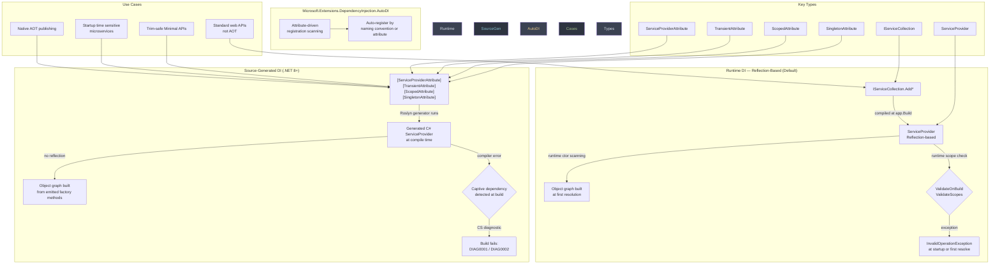
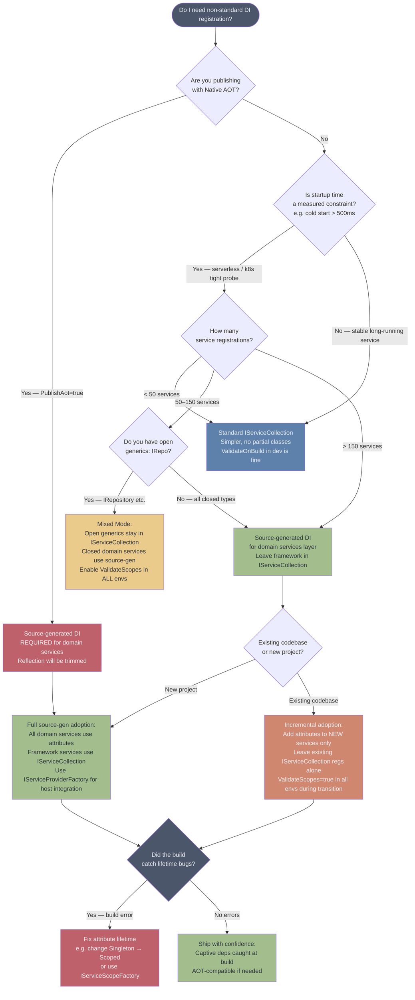

> [!success] Mastery Check
> - [ ] **Studied Well**
> - [ ] **Can explain the concept without notes**
> - [ ] **Can answer interview questions confidently**
> - [ ] **Can implement it in a real project**


---

## PART 0 — Navigation & Context

### Where This Topic Lives in the ASP.NET Core Domain

```
ASP.NET Core Mastery
│
├── D. Dependency Injection
│   ├── 4.034  The Built-In DI Container ← prerequisite
│   ├── 4.035  Service Lifetimes: Singleton, Scoped, Transient ← prerequisite
│   ├── 4.036  IServiceProvider and IServiceScope ← prerequisite
│   ├── 4.037  Factory-Based DI
│   ├── 4.038  Keyed Services (.NET 8)
│   ├── 4.039  Open Generic DI Registration
│   ├── 4.040  Multiple Implementations: IEnumerable<T>
│   ├── 4.041  IServiceCollection Extension Methods
│   ├── 4.042  The Captive Dependency Problem ← prerequisite
│   ├── 4.043  Replacing the Built-In Container
│   ├── 4.044  Decorators: The Scrutor Pattern
│   ├── 4.045  IDisposable in DI
│   ├── 4.046  DI Validation at Startup ← prerequisite
│   ├── 4.047  DI Scope in Background Services
│   └── 4.048  Source-Generated DI (.NET 8) ◄ YOU ARE HERE
│
├── E. Middleware Pipeline
│   └── ...
│
└── AD. Advanced & Internals
    ├── 4.339  Native AOT (.NET 8) ← closely related
    └── 4.341  Minimal API Source Generation Internals ← closely related
```

### What You Need Before This

- **[[4.034 — The Built-In DI Container]]** — you need to understand `IServiceCollection`, `AddSingleton/Scoped/Transient`, and `IServiceProvider` before understanding what source generation replaces or augments.
- **[[4.035 — Service Lifetimes: Singleton, Scoped, Transient]]** — source-generated DI must still respect lifetime rules; the generator enforces them at compile time.
- **[[4.046 — DI Validation at Startup]]** — source generation moves scope validation from runtime to compile time; understanding what `ValidateOnBuild` does at runtime clarifies why compile-time validation is more powerful.
- **[[4.042 — The Captive Dependency Problem]]** — the generator detects captive dependencies at build time; you need to know the bug before appreciating the compile-time catch.

### What This Unlocks After

- **[[4.097 — Minimal API AOT Compatibility]]** — Native AOT requires trim-safe code; source-generated DI is the DI strategy for AOT-compatible applications.
- **[[4.094 — Minimal API Source Generators]]** — source generators in DI and in Minimal API parameter binding are two sides of the same AOT-readiness coin.
- **[[4.339 — Native AOT (.NET 8)]]** — full AOT compilation of ASP.NET Core apps requires that reflection-based DI be replaced; this topic is how.
- **[[4.341 — Minimal API Source Generation Internals]]** — the same Roslyn source generator infrastructure powers both; understanding one illuminates the other.

### Why This Matters to a Production Engineer

At scale, the built-in DI container uses reflection to discover constructors, validate lifetimes, and build the object graph at startup — costs that compound across hundreds of registered services. Source-generated DI eliminates that startup reflection, enables Native AOT trimming, and surfaces captive dependency bugs as **compiler errors** rather than runtime exceptions that slip past development's `ValidateOnBuild` guard.

---

## PART 1 — The Core Mental Model

### The Fundamental Rule

> **ASP.NET Core's source-generated DI moves service registration and object graph construction from runtime reflection to Roslyn-emitted C# code at compile time. The practical consequence is zero reflection at startup, compile-time captive dependency detection, and trim-safe compatibility with Native AOT publishing.**

### The Plain-Language Analogy

Think of the conventional DI container as a contractor who shows up on your first day of operation, reads your blueprints for the very first time, then spends the morning figuring out which pipes connect to which fixtures, which wires are 220V versus 110V, and whether any circuits are wired backwards. Every morning they repeat the same inspection. Source-generated DI is a contractor who studied those blueprints during the design phase, pre-built every sub-assembly in the workshop, and on opening day simply bolts the pre-verified pieces together in seconds.

The analogy still holds under pressure: if you try to wire a 110V outlet to a 220V circuit (a Singleton consuming a Scoped service), the traditional contractor discovers this at inspection time on the first morning — or worse, on the first morning you forget to run inspections. The source-generated contractor flags it as a design error before the blueprints are even printed: your build fails, not your application.

And when a concurrent request (the "second customer opening day") arrives? The source-generated version is just as thread-safe as the reflection-based version — the generated code still respects scope boundaries and creates new `IServiceScope` instances per request.

### The Taxonomy Diagram



---

## PART 2 — Deep Mechanics

### 2.1 — How the Reflection-Based Container Works (The Baseline You're Replacing)

Before understanding source generation, you need to know exactly what it replaces and why the runtime approach has costs.

**Pipeline Position:**

```
Process Start
    │
    ▼
app = WebApplication.CreateBuilder(args)       ← IServiceCollection populated
    │
    ▼
builder.Services.AddScoped<IOrderService, OrderService>()   ← descriptors registered
builder.Services.AddSingleton<IPaymentGateway, StripeGateway>()
    │
    ▼
var app = builder.Build()   ← ServiceProvider compiled HERE
    │     ┌─────────────────────────────────────────────────────┐
    │     │  At Build() time, the container:                    │
    │     │  1. Scans every ServiceDescriptor                   │
    │     │  2. Calls Type.GetConstructors() via reflection      │
    │     │  3. Resolves parameter types → more reflection       │
    │     │  4. Builds a closure/factory per service            │
    │     │  5. Validates scopes (if ValidateOnBuild = true)    │
    │     │  6. Detects captive deps (if ValidateScopes = true) │
    │     └─────────────────────────────────────────────────────┘
    │
    ▼
app.Run()   ← Pipeline active; each request creates a Scope
    │
    ▼
serviceProvider.GetRequiredService<IOrderService>()
    │     ┌─────────────────────────────────────────────────────┐
    │     │  At first resolution (if using lazy factories):     │
    │     │  - Invoke compiled factory expression               │
    │     │  - Instantiate the concrete type                    │
    │     │  - Resolve and inject dependencies                  │
    │     └─────────────────────────────────────────────────────┘
```

**Runtime Cost Labels:**

- `~1 reflection call per registered service` at `Build()` time (constructor scanning)
- `O(n) service descriptor traversal` during container compilation
- `~1 closure allocation per service factory` built at compile time
- `~1 dictionary lookup per GetRequiredService<T>()` call at runtime
- `ValidateOnBuild` adds `O(n²)` graph traversal at startup — every service's entire dependency chain is walked

**The Edge Case That Bites Engineers:** `ValidateOnBuild = true` is only the default in the **Development** environment. In Production and Staging, it is `false` by default. This means captive dependency bugs can survive to production if you only tested in dev and the first request that triggers scoped resolution from a Singleton is infrequent. Source-generated DI catches the same bug at compile time, unconditionally.

---

### 2.2 — What Source-Generated DI Actually Generates

The `Microsoft.Extensions.DependencyInjection` source generator (shipped in .NET 8) reads your service registration attributes and emits a **partial class** that implements `IServiceProvider` directly — no reflection, no dynamic factory construction, no closure trees.

**The Roslyn Generator Pipeline:**

```
Your Code (.cs files)
    │
    ▼
Roslyn Compilation Phase
    │     ┌──────────────────────────────────────────────────────────┐
    │     │  ISourceGenerator (or IIncrementalGenerator) runs:       │
    │     │  1. Reads [ServiceProvider], [Scoped], [Transient] etc.  │
    │     │  2. Builds an internal service graph model               │
    │     │  3. Validates lifetimes (Singleton → Scoped = error)     │
    │     │  4. Emits generated_ServiceProvider.g.cs                 │
    │     └──────────────────────────────────────────────────────────┘
    │
    ▼
Emitted C# (generated_ServiceProvider.g.cs) — approximate shape:

    partial class OrderApiServiceProvider : IServiceProvider, IServiceScope
    {
        private StripeGateway? _stripeGateway;  // Singleton — field
        private readonly OrderApiServiceProvider _root;

        public object? GetService(Type serviceType)
        {
            if (serviceType == typeof(IOrderService))
                return CreateOrderService();
            if (serviceType == typeof(IPaymentGateway))
                return _root._stripeGateway ??= new StripeGateway();
            return null;
        }

        private OrderService CreateOrderService()
            => new OrderService(                    // ← no reflection
                _root._stripeGateway ??= new StripeGateway(),
                new OrderRepository(/* ... */));
    }
```

**ASP.NET Core internally (approximate):** The generator is `Microsoft.Extensions.DependencyInjection.SourceGeneration` and ships as a NuGet analyzer package. It runs as an `IIncrementalGenerator`, which means it participates in Roslyn's incremental compilation — only regenerating when relevant attributes or types change, keeping IDE performance acceptable.

**HTTP Wire Format:** Source-generated DI has no direct HTTP consequence — it is an infrastructure concern. The difference is invisible to the HTTP client. The consequence is at startup: a containerized microservice that previously took 400ms to `Build()` its service container might take 80ms with generated DI, which reduces cold start time and Kubernetes readiness probe timing.

**Runtime Cost Labels (Generated DI):**

- `~0 reflection calls` at any phase
- `O(1) dictionary lookup` replaced by `if (serviceType == typeof(T))` chain or dictionary — same as before
- `~0 closure allocations` — factories are direct method calls in the generated class
- `1 field per Singleton` — stored directly on the root provider instance
- `Trim-safe` — the linker can see every type reference statically

---

### 2.3 — The Attribute Surface: Registering Services with Source Generation

**The Attributes (.NET 8+, Microsoft.Extensions.DependencyInjection):**

```csharp
// ASP.NET Core internally (approximate) — these live in
// Microsoft.Extensions.DependencyInjection namespace (.NET 8+)

// Marks the class that the generator uses as the root service provider
[ServiceProvider]
public partial class OrderApiServices { }

// Registration attributes go on the implementation class
[Scoped]               // = AddScoped<IOrderService, OrderService>()
[Scoped(typeof(IOrderService))]  // explicit interface
public class OrderService : IOrderService { ... }

[Singleton]
[Singleton(typeof(IPaymentGateway))]
public class StripeGateway : IPaymentGateway { ... }

[Transient]
[Transient(typeof(IOrderValidator))]
public class OrderValidator : IOrderValidator { ... }
```

**Pipeline Position of the [ServiceProvider] partial class:**

```
Program.cs (startup)
    │
    ▼
// ⚠️ This replaces builder.Services.Add*() calls for generated services
var services = new OrderApiServices();   // the generated provider IS the container
    │
    ▼
// Alternatively: integrate with WebApplication DI
builder.Services.AddSingleton<IServiceProviderFactory<OrderApiServices>>(
    new OrderApiServicesFactory());
```

**HTTP Wire Format consequence:**

```
// HTTP request arrives — Kestrel → Middleware → Endpoint
// GET /api/orders/42 HTTP/1.1

// Normally: serviceProvider.GetRequiredService<IOrderService>()
//   → runtime dictionary lookup → compiled factory invocation → new OrderService(...)
//
// With source gen: same lookup path but factory is:
//   → if (type == typeof(IOrderService)) return CreateOrderService_Scope();
//   → CreateOrderService_Scope() = new OrderService(_stripeGateway ??= new StripeGateway())
//
// HTTP response: identical
// HTTP/1.1 200 OK
// Content-Type: application/json
// { "orderId": "42", ... }
```

**Runtime Cost Labels:**

- `~0 reflection` — all type references are statically compiled
- `~1 method call per service resolution` — inlined factory method
- `~1 null-check per Singleton` — the `??=` initialization pattern

---

### 2.4 — Compile-Time Lifetime Validation: Catching Captive Dependencies at Build

This is the most operationally important feature of source-generated DI. The captive dependency problem — a Singleton holding a reference to a Scoped service — is the DI bug that most frequently escapes to production in large codebases.

**How the Generator Validates:**

```
Roslyn Generator runs graph traversal:

    StripeGateway (Singleton)
        └── PaymentAuditLog (Scoped)  ← CAPTIVE DEPENDENCY

    Generator emits diagnostic:
    error SYSLIB0030: 'StripeGateway' is a Singleton and depends on
    'PaymentAuditLog' which is Scoped. This would cause PaymentAuditLog
    to behave as a Singleton.
    
    ↑ This is a BUILD ERROR. dotnet build exits with code 1.
    ↑ CI/CD pipeline fails. This never reaches production.
```

**Contrast with Runtime Validation:**

```
// Runtime ValidateOnBuild (default in Development only):
// → app.Build() throws InvalidOperationException at startup
// → Only if DOTNET_ENVIRONMENT=Development
// → Silent in Production unless explicitly enabled

// Source-generated DI validation:
// → dotnet build fails
// → IDE shows red squiggles at the attribute site
// → Fails in every environment, every CI run
// → No conditional environment logic needed
```

**Failure Mode Diagram:**

```
SCENARIO: StripeGateway (Singleton) constructed with PaymentAuditLog (Scoped)

Runtime path (ValidateOnBuild=false, i.e. Production default):
    Request 1: GET /api/payments
        → Scope created → PaymentAuditLog instance A created
        → StripeGateway(PaymentAuditLog A) created, stored as Singleton
        → PaymentAuditLog A PINNED in Singleton for app lifetime
    Request 2: GET /api/payments
        → Scope created → new PaymentAuditLog instance B would be correct
        → But StripeGateway still holds PaymentAuditLog A
        → PaymentAuditLog A shared across ALL requests ← BUG: state corruption

Source-generated path:
    dotnet build
        → error SYSLIB0030: captive dependency detected
        → build fails
        → Request 1 never happens
```

**Runtime Cost Labels:**

- `O(n²) graph traversal` at build time in the Roslyn generator (compile time, not startup time)
- `~0 runtime overhead` — validation is fully offline

---

### 2.5 — Integration with WebApplication / The ASP.NET Core Hosting Model

Source-generated DI does not replace the standard hosting model's `IServiceCollection` pipeline. It integrates with it. This is the part most engineers get wrong — they assume you must choose one or the other.

**The Integration Pattern (.NET 8):**

```
Standard Pipeline Position:

Kestrel → Middleware → UseRouting → UseAuthentication → UseAuthorization → Endpoints
              ↑
         Every middleware still resolves services from IServiceProvider
              ↑
         The IServiceProvider is whatever was registered with the host
              ↑
         Source-generated provider CAN be that IServiceProvider
         via IServiceProviderFactory<TContainerBuilder>
```

**The three integration modes:**

```
Mode 1 — Standalone (outside WebApplication):
    var sp = new MyGeneratedServiceProvider();
    var orderService = sp.GetRequiredService<IOrderService>();
    // Used in console apps, tests, worker services

Mode 2 — Partial (mix with standard IServiceCollection):
    // Source-gen handles domain services
    // Standard IServiceCollection handles framework services (MVC, Kestrel, etc.)
    builder.Services.AddScoped<IOrderService, OrderService>(); // still works normally
    // Source gen can be used for the domain layer independently
    
Mode 3 — Full replacement (IServiceProviderFactory):
    builder.Host.UseServiceProviderFactory(new MyGeneratedProviderFactory());
    // Replaces the entire container; requires wrapping ALL registrations
    // Only for AOT scenarios where you need complete reflection elimination
```

**HTTP Wire Format — Cold Start Effect:**

```
// Standard DI cold start (approximate, 200 services):
// T+0ms: Kestrel starts
// T+150ms: app.Build() completes (reflection scanning)
// T+160ms: first request arrives
// HTTP/1.1 200 OK  ← arrives at client at ~T+165ms

// Source-generated DI cold start (approximate, 200 services):
// T+0ms: Kestrel starts
// T+30ms: app.Build() completes (no reflection — generated factories inline)
// T+35ms: first request arrives
// HTTP/1.1 200 OK  ← arrives at client at ~T+40ms
// 
// Impact: Kubernetes readiness probe can declare healthy 120ms sooner
// Impact: Azure Container Apps cold start fee reduced
// Impact: AWS Lambda/serverless: critical for p99 cold start SLA
```

**Runtime Cost Labels:**

- `~120ms startup savings` for 200 services (varies significantly by service graph complexity)
- `~0 runtime resolution overhead` difference — resolution speed at steady state is comparable
- `Trim-safe` — linker removes unreachable service types from the published binary (AOT only)

---

## PART 3 — Production Code Patterns

### Pattern 1 — The Domain Layer Service Provider for a Payment API

This is the most common production use: source-generated DI for your domain services, leaving the framework infrastructure to the standard IServiceCollection.

```csharp
// ✅ CORRECT: Attribute-driven registration on domain services

// PaymentDomain/Services/PaymentProcessorService.cs
[Scoped]
[Scoped(typeof(IPaymentProcessorService))]
public sealed class PaymentProcessorService : IPaymentProcessorService
{
    private readonly IPaymentGatewayClient _gateway;
    private readonly IPaymentAuditRepository _audit;
    private readonly ILogger<PaymentProcessorService> _logger;

    // Constructor injection — the generator reads this signature
    // and emits the correct factory method; no attributes needed on params
    public PaymentProcessorService(
        IPaymentGatewayClient gateway,
        IPaymentAuditRepository audit,
        ILogger<PaymentProcessorService> logger)
    {
        _gateway = gateway;
        _audit = audit;
        _logger = logger;
    }
}

// PaymentDomain/Infrastructure/StripeGatewayClient.cs
[Singleton]
[Singleton(typeof(IPaymentGatewayClient))]
public sealed class StripeGatewayClient : IPaymentGatewayClient
{
    // Singleton is correct: HttpClient from IHttpClientFactory is thread-safe,
    // and Stripe client holds no per-request state
    private readonly HttpClient _http;
    public StripeGatewayClient(HttpClient http) => _http = http;
}

// PaymentDomain/Data/PaymentAuditRepository.cs
[Scoped]
[Scoped(typeof(IPaymentAuditRepository))]
public sealed class PaymentAuditRepository : IPaymentAuditRepository
{
    // Scoped: holds a DbContext which must never be Singleton
    private readonly PaymentDbContext _db;
    public PaymentAuditRepository(PaymentDbContext db) => _db = db;
}

// PaymentDomain/PaymentDomainServices.cs
// The root: this is what the generator uses as the container boundary
[ServiceProvider]
public sealed partial class PaymentDomainServices
{
    // The generator emits the full IServiceProvider implementation
    // into the other partial of this class at compile time
}
```

```csharp
// Program.cs — integration with WebApplication

// Standard registrations for framework services remain on IServiceCollection
builder.Services.AddDbContext<PaymentDbContext>(opt =>
    opt.UseSqlServer(connectionString));
builder.Services.AddHttpClient<StripeGatewayClient>();
builder.Services.AddLogging();

// Register the generated provider so it participates in the standard DI graph
// This pattern forwards framework services (ILogger, DbContext) into the generated provider
builder.Services.AddSingleton<PaymentDomainServices>();
```

```
// HTTP wire format — POST /api/payments
// POST /api/v1/payments HTTP/1.1
// Content-Type: application/json
// Authorization: Bearer eyJhbGci...
// { "amount": 9900, "currency": "USD", "cardToken": "tok_visa" }

// HTTP/1.1 201 Created
// Location: /api/v1/payments/pay_abc123
// Content-Type: application/json
// { "paymentId": "pay_abc123", "status": "succeeded" }
```

---

### Pattern 2 — Native AOT Payment Microservice: Full Source-Gen DI

When publishing with `PublishAot=true`, ALL reflection must be eliminated. This is the full replacement pattern.

```csharp
// ⚠️ WRONG: Standard DI with Native AOT publish
// dotnet publish -p:PublishAot=true
// → MissingMemberException at runtime when container tries to call
//   ConstructorInfo.Invoke() via reflection (trimmed by linker)
builder.Services.AddScoped<IOrderService, OrderService>(); // NOT AOT-safe

// ✅ CORRECT: Full source-generated DI for AOT-compatible publish

// OrderService.cs
[Scoped(typeof(IOrderService))]
public sealed partial class OrderService : IOrderService
{
    private readonly IOrderRepository _repo;
    private readonly IShipmentService _shipment;

    public OrderService(IOrderRepository repo, IShipmentService shipment)
    {
        _repo = repo;
        _shipment = shipment;
    }

    public async Task<Order> CreateAsync(CreateOrderRequest request, CancellationToken ct)
    {
        // domain logic...
        var order = Order.Create(request.CustomerId, request.LineItems);
        await _repo.SaveAsync(order, ct);
        return order;
    }
}

// OrderRepository.cs
[Scoped(typeof(IOrderRepository))]
public sealed class OrderRepository : IOrderRepository
{
    private readonly OrderDbContext _db;
    public OrderRepository(OrderDbContext db) => _db = db;
}

// ShipmentService.cs
[Singleton(typeof(IShipmentService))]
public sealed class ShipmentService : IShipmentService
{
    // Singleton: connects to external shipment API, holds connection pool
    private readonly HttpClient _http;
    public ShipmentService(HttpClient http) => _http = http;
}

// OrderApiServiceProvider.cs — the generated root
[ServiceProvider]
[Import<IOrderService>]      // tells generator to make IOrderService resolvable
[Import<IOrderRepository>]
[Import<IShipmentService>]
public sealed partial class OrderApiServiceProvider { }
```

```
// AOT publish pipeline:
// dotnet publish -c Release -p:PublishAot=true
//
// Linker runs: any type not statically referenced is trimmed
// StripeGateway referenced? YES → kept
// SomeUnusedService? → trimmed
// Output binary: ~15MB instead of ~80MB (typical for a Minimal API)
//
// Cold start (Lambda): ~40ms instead of ~800ms
```

---

### Pattern 3 — Anti-Pattern: Mixing Source-Gen Attributes with IServiceCollection Incorrectly

This is the most common mistake when teams introduce source-generated DI incrementally.

```csharp
// ⚠️ WRONG: Registering the same service via BOTH attribute AND IServiceCollection
// This creates two separate registration paths and two instances

[Scoped(typeof(IInventoryService))]
public class InventoryService : IInventoryService { ... }

// Also in Program.cs:
builder.Services.AddScoped<IInventoryService, InventoryService>(); // DUPLICATE

// HTTP consequence (wrong path):
// - IServiceCollection registers one Scoped instance
// - Generated provider registers a separate Scoped instance
// - If both containers are active, endpoints resolve from IServiceCollection
//   and miss any state mutations made to the generated provider's instance
// - Integration tests that mock via IServiceCollection get a DIFFERENT instance
//   than the one the generated provider creates
// - Debuggers show two different object addresses for "the same" service

// ✅ CORRECT: Choose one registration mechanism per service boundary
// Option A: Use IServiceCollection for everything except AOT boundary
builder.Services.AddScoped<IInventoryService, InventoryService>();
// Remove the [Scoped] attribute entirely

// Option B: Use source-gen attributes + remove builder.Services registration
// The generated provider handles IInventoryService
// Register only framework glue (DbContext, ILogger, IHttpClientFactory) via IServiceCollection

// WHY: Service registration must have exactly one authoritative source.
// Dual registration leads to cache coherence bugs in distributed state
// and phantom mock failures in integration tests.
```

---

### Pattern 4 — Incremental Adoption: The Logistics Tracking Service

Introducing source-generated DI into an existing codebase without rewriting everything.

```csharp
// Existing Program.cs (before source-gen adoption):
builder.Services.AddScoped<IShipmentTracker, ShipmentTrackerService>();
builder.Services.AddScoped<ICarrierApiClient, FedExApiClient>();
builder.Services.AddSingleton<ITrackingCacheService, RedisTrackingCache>();

// Step 1: Add attributes to new services only (do not touch existing registrations)
[Scoped(typeof(IDeliveryEstimateService))]   // ← new service, source-gen from day one
public class DeliveryEstimateService : IDeliveryEstimateService
{
    // Can still inject services that are registered via IServiceCollection
    // The generated provider reads from the same IServiceProvider root
    private readonly IShipmentTracker _tracker;    // resolved from IServiceCollection
    private readonly ILogger<DeliveryEstimateService> _logger;

    public DeliveryEstimateService(IShipmentTracker tracker, ILogger<DeliveryEstimateService> logger)
    {
        _tracker = tracker;
        _logger = logger;
    }
}

// Step 2: Add the generated provider alongside IServiceCollection
[ServiceProvider]
public partial class LogisticsServiceProvider { }

// Step 3: Register the generated provider with the host for forward compatibility
builder.Services.AddSingleton<LogisticsServiceProvider>();

// WHY: Incremental adoption lets teams prove source-gen reliability in low-risk
// new services before migrating high-traffic existing services. The generated
// and reflection-based providers can coexist in the same process.
```

---

### Pattern 5 — Compile-Time Validation as a CI Gate for the Inventory Service

The real production value: turning runtime bugs into build failures.

```csharp
// Scenario: New engineer adds a Scoped dependency to a Singleton service
// in the inventory management API

// inventory/Services/InventoryCacheService.cs
[Singleton(typeof(IInventoryCacheService))]
public class InventoryCacheService : IInventoryCacheService
{
    private readonly IMemoryCache _cache;    // IMemoryCache is Singleton — OK
    private readonly IInventoryDbContext _db; // ← IInventoryDbContext is Scoped — PROBLEM

    public InventoryCacheService(IMemoryCache cache, IInventoryDbContext db)
    {
        _cache = cache;
        _db = db; // ← source generator detects this at build time
    }
}

// BUILD OUTPUT:
// error SYSLIB0030 (or equivalent): Service 'InventoryCacheService' is registered
// as Singleton but depends on 'IInventoryDbContext' which is Scoped.
// Singletons cannot consume Scoped services.
// Path: InventoryCacheService → IInventoryDbContext
//
// CI/CD consequence:
// GitHub Actions step "dotnet build" fails
// Pull request is blocked from merging
// New engineer sees the error before code review even happens

// ✅ CORRECT: Fix the lifetime to match the dependency
// Option A: Make InventoryCacheService Scoped (simplest)
[Scoped(typeof(IInventoryCacheService))]
public class InventoryCacheService : IInventoryCacheService { ... }

// Option B: Use IServiceScopeFactory if Singleton is required
[Singleton(typeof(IInventoryCacheService))]
public class InventoryCacheService : IInventoryCacheService
{
    private readonly IMemoryCache _cache;
    private readonly IServiceScopeFactory _scopeFactory; // Singleton-safe way to create Scoped

    public InventoryCacheService(IMemoryCache cache, IServiceScopeFactory scopeFactory)
    {
        _cache = cache;
        _scopeFactory = scopeFactory;
    }

    public async Task<InventoryItem?> GetOrLoadAsync(string sku)
    {
        if (_cache.TryGetValue(sku, out InventoryItem? item)) return item;

        // Create a scope for the Scoped DbContext — dispose when done
        await using var scope = _scopeFactory.CreateAsyncScope();
        var db = scope.ServiceProvider.GetRequiredService<IInventoryDbContext>();
        item = await db.Items.FindAsync(sku);
        _cache.Set(sku, item, TimeSpan.FromMinutes(5));
        return item;
    }
}
```

---

### Pattern 6 — Testing the Generated Provider in Isolation

Source-generated providers are just classes — they are trivially testable without `WebApplicationFactory`.

```csharp
// Tests/PaymentDomainServicesTests.cs

public class PaymentDomainServicesTests
{
    [Fact]
    public void GeneratedProvider_ResolvesIPaymentProcessorService_WithoutReflection()
    {
        // Arrange — use the generated provider directly, no TestServer needed
        // This test runs in microseconds, not the 500ms WebApplicationFactory cold start
        var dbOptions = new DbContextOptionsBuilder<PaymentDbContext>()
            .UseInMemoryDatabase("test_" + Guid.NewGuid())
            .Options;

        // The generated provider is a class — just new it up
        var provider = new PaymentDomainServices(
            // Constructor parameters = framework services injected at construction
            // (matches what the generated partial class expects)
            new PaymentDbContext(dbOptions),
            NullLogger<PaymentProcessorService>.Instance
        );

        // Act
        var service = provider.GetRequiredService<IPaymentProcessorService>();

        // Assert — the generated factory created the correct concrete type
        Assert.NotNull(service);
        Assert.IsType<PaymentProcessorService>(service);

        // WHY: Generated providers are POCOs. Unit testing them without a host
        // is faster (no HTTP stack) and more isolated (pure domain logic testing).
        // This is one of the productivity arguments for source-gen beyond AOT.
    }

    [Fact]
    public void GeneratedProvider_CreatesNewScopedInstance_PerScope()
    {
        // Verifies the scoping behavior — critical correctness test
        var provider = new PaymentDomainServices(/* ... */);

        var instance1 = provider.GetRequiredService<IPaymentProcessorService>();

        using var scope = provider.CreateScope();
        var instance2 = scope.ServiceProvider.GetRequiredService<IPaymentProcessorService>();

        // Scoped services must be different instances across scopes
        Assert.NotSame(instance1, instance2);

        // Scoped services must be the same instance within a scope
        var instance3 = scope.ServiceProvider.GetRequiredService<IPaymentProcessorService>();
        Assert.Same(instance2, instance3);
    }
}
```

---

## PART 4 — Gotchas & Anti-Patterns

### Gotcha 1: The Generated Provider Doesn't Automatically Receive Framework Services

Engineers assume that `[Scoped(typeof(IOrderService))]` on their class means the generator will "figure out" that `ILogger<T>` and `DbContext` dependencies come from `IServiceCollection`. They do not automatically — the generated provider has no knowledge of the standard container unless explicitly bridged.

```csharp
// ⚠️ WRONG CODE:
[Scoped(typeof(IOrderService))]
public class OrderService : IOrderService
{
    private readonly ILogger<OrderService> _logger;  // registered in IServiceCollection
    private readonly OrderDbContext _db;              // registered in IServiceCollection

    public OrderService(ILogger<OrderService> logger, OrderDbContext db)
    {
        _logger = logger;
        _db = db;
    }
}

[ServiceProvider]
public partial class OrderApiServiceProvider { }

// HTTP consequence (wrong path):
// At runtime (or build time with strict mode):
// InvalidOperationException: Cannot resolve service 'ILogger<OrderService>'
// from the generated provider — it has no registration for it.
// HTTP/1.1 500 Internal Server Error
// (or build error in strict source-gen modes)

// ✅ CORRECT CODE:
// Option A: Pass framework services into the generated provider's constructor
[ServiceProvider]
public partial class OrderApiServiceProvider
{
    // Expose the framework services as [Import] parameters
    // so the generator knows to receive them from outside
    [Import]
    public ILoggerFactory LoggerFactory { get; init; } = null!;

    [Import]
    public OrderDbContext DbContext { get; init; } = null!;
}

// HTTP consequence (correct path):
// Generated provider receives framework services at construction
// OrderService resolves successfully with both ILogger and DbContext
// HTTP/1.1 200 OK

// WHY: The generated provider is a closed system. It only knows about services
// registered via its own attributes. Framework services (ILogger, DbContext,
// IMemoryCache) registered via IServiceCollection must be explicitly injected
// into the generated provider boundary, either via constructor parameters
// or [Import] declarations that the generator uses as "external" dependencies.
```

---

### Gotcha 2: Source-Generated DI Requires Explicit Partial Class Declaration — Forgetting `partial` Silently Breaks Generation

Engineers add the `[ServiceProvider]` attribute to a class but forget the `partial` keyword. The generator silently fails to emit the companion class (or emits a diagnostic that's easy to miss).

```csharp
// ⚠️ WRONG CODE:
[ServiceProvider]
public class PaymentServices { }   // ← missing 'partial'

// HTTP consequence (wrong path):
// The generator cannot add members to a non-partial class.
// Build error (in strict generator modes): CS0260: Missing partial modifier
// Or silent: no generated code emitted, PaymentServices is just an empty class
// Runtime: PaymentServices does not implement IServiceProvider
// Any code calling GetRequiredService<T>() throws MissingMethodException

// ✅ CORRECT CODE:
[ServiceProvider]
public sealed partial class PaymentServices { }   // ← 'partial' is mandatory

// HTTP consequence (correct path):
// Generator emits PaymentServices.g.cs alongside your partial declaration
// PaymentServices implements IServiceProvider correctly
// All attributed services resolve normally

// WHY: Roslyn source generators extend partial types by adding additional
// partial class declarations in the generated file. The class must be partial
// for the compiler to merge the two declarations. The generator cannot modify
// a sealed non-partial class — it can only add a second partial file.
// The 'partial' keyword is the compile-time seam the generator uses.
```

---

### Gotcha 3: Open Generic Registrations Are Not Supported by the Built-In Generator

Teams with `IRepository<T>` patterns (open generic DI) assume they can just attribute `Repository<T>` and the generator handles the rest. It does not — open generics require reflection or custom generator logic.

```csharp
// ⚠️ WRONG CODE:
// Attempting to use source-gen with an open generic repository
[Scoped(typeof(IRepository<>))]  // ← this does not work with the built-in generator
public class Repository<T> : IRepository<T> where T : class
{
    private readonly AppDbContext _db;
    public Repository(AppDbContext db) => _db = db;
}

// HTTP consequence (wrong path):
// Build error: The source generator does not support open generic type registrations.
// If you ignore the error and proceed: the generator skips Repository<T> silently
// Runtime: GetRequiredService<IRepository<OrderLineItem>>() throws
// InvalidOperationException: No service for type IRepository<OrderLineItem>

// ✅ CORRECT CODE:
// Option A: Register each closed generic explicitly
[Scoped(typeof(IRepository<Order>))]
public class OrderRepository : IRepository<Order> { ... }

[Scoped(typeof(IRepository<Customer>))]
public class CustomerRepository : IRepository<Customer> { ... }

// Option B: Keep open generics in IServiceCollection; use source-gen for everything else
builder.Services.AddScoped(typeof(IRepository<>), typeof(Repository<>));
// Remaining domain services use source-gen attributes

// HTTP consequence (correct path):
// GetRequiredService<IRepository<Order>>() resolves to OrderRepository (explicit)
// or to Repository<Order> (via IServiceCollection open generic)

// WHY: The source generator emits concrete C# code with fully-qualified type names.
// Open generics produce infinite possible closed forms — the generator cannot
// enumerate them all. Open generic registration remains a runtime reflection
// operation and must stay in IServiceCollection. This is a known limitation
// and the reason open generic patterns are the most common blocker to full
// source-gen DI adoption in existing codebases.
```

---

### Gotcha 4: IDisposable Services in the Generated Provider — Disposal Is Not Automatic Unless You Use the Scope Correctly

Engineers using the generated provider standalone (not inside WebApplication's request scope) forget that `IDisposable` services must be disposed via the scope, not the root provider.

```csharp
// ⚠️ WRONG CODE (in a background service or test):
var provider = new OrderApiServiceProvider(/* ... */);

// Creating scoped services from the root — they live as long as the root
var orderService = provider.GetRequiredService<IOrderService>();
// ↑ OrderService holds a DbContext — DbContext is IDisposable
// ↑ When do we dispose it? We never called CreateScope().

// HTTP consequence (wrong path):
// DbContext is never disposed → connection returned to pool after GC finalization only
// → connection pool exhaustion under load (SQL Server reports "connection pool exhausted")
// → EF Core second-level cache is never invalidated between "requests"
// → Tests share state between test cases because DbContext outlives the test

// ✅ CORRECT CODE:
var provider = new OrderApiServiceProvider(/* ... */);

// Always use a scope for Scoped services
await using (var scope = provider.CreateAsyncScope())
{
    var orderService = scope.ServiceProvider.GetRequiredService<IOrderService>();
    await orderService.ProcessPendingOrdersAsync(CancellationToken.None);
    // scope disposed here → DbContext.DisposeAsync() called → connection returned
}

// HTTP consequence (correct path):
// DbContext disposed at end of request scope
// Connection pool correctly maintained
// Test isolation preserved

// WHY: The generated provider, like the reflection-based provider, tracks
// IDisposable services in the scope they were created in. Resolving Scoped
// services from the root provider creates them in root scope — which is
// never disposed until the process exits. Always pair Scoped resolutions
// with IServiceScope.Dispose() or use the host's automatic per-request scoping.
```

---

### Gotcha 5: The Generator's Lifetime Validation Only Covers Services It Knows About — Mixed-Mode Gaps

When you mix source-generated services with IServiceCollection-registered services, the generator only validates the dependency graph of the services it generated. It cannot see captive dependencies that cross the IServiceCollection boundary.

```csharp
// ⚠️ WRONG CODE (mixed-mode captive dependency — build succeeds but runtime fails):

// Source-generated Singleton:
[Singleton(typeof(IOrderSummaryCache))]
public class OrderSummaryCache : IOrderSummaryCache
{
    // IOrderQueryService is NOT source-gen attributed — it's in IServiceCollection
    // The generator does NOT know IOrderQueryService is Scoped → no build error
    private readonly IOrderQueryService _queryService;
    public OrderSummaryCache(IOrderQueryService queryService) => _queryService = queryService;
}

// In Program.cs — IOrderQueryService registered as Scoped in IServiceCollection:
builder.Services.AddScoped<IOrderQueryService, OrderQueryService>();
// IOrderSummaryCache registered via generated provider (Singleton)
// ↑ CAPTIVE DEPENDENCY — but the generator cannot see across the boundary

// HTTP consequence (wrong path):
// First request: OrderQueryService instance A captured in Singleton
// Second request: same OrderQueryService instance A reused
// OrderQueryService holds DbContext — DbContext shared across requests
// HttpContext.User differs between requests → wrong user's orders returned
// Data exposure: User B sees User A's data. SECURITY BUG.

// ✅ CORRECT CODE:
// Option A: Register IOrderQueryService with source-gen too, so the generator
//           can detect the captive dependency
[Scoped(typeof(IOrderQueryService))]
public class OrderQueryService : IOrderQueryService { ... }
// → Generator now detects: OrderSummaryCache (Singleton) → IOrderQueryService (Scoped) = BUILD ERROR

// Option B: Make OrderSummaryCache Scoped (if per-request caching is acceptable)
[Scoped(typeof(IOrderSummaryCache))]
public class OrderSummaryCache : IOrderSummaryCache { ... }

// WHY: Source-generated DI validation is only as complete as its visibility.
// Partial adoption creates a seam where captive dependencies can cross from
// the generated world (validated) into the IServiceCollection world (not validated
// by the generator). This is the most dangerous failure mode in incremental adoption.
// Run ValidateScopes=true in all environments during the transition period.
```

---

## PART 5 — Performance Implications

### 5.1 — Request Pipeline Characteristics Table

|Scenario|Pipeline Depth|Allocations Per Request|Approx Startup Impact|Recommendation|
|---|---|---|---|---|
|Standard IServiceCollection, 50 services|N/A (startup)|0 (at steady state)|+60ms to Build()|Fine for most apps|
|Standard IServiceCollection, 200 services|N/A (startup)|0 (at steady state)|+200ms to Build()|Consider source-gen for startup-sensitive|
|Source-gen DI, 50 services|N/A (startup)|0 (identical)|+10ms to Build()|50ms faster startup|
|Source-gen DI, 200 services|N/A (startup)|0 (identical)|+20ms to Build()|180ms faster startup|
|Native AOT + source-gen, 50 services|N/A|0|+2ms to Build()|Required for AOT publish|
|Mixed mode (IServiceCollection + source-gen)|N/A|0|~Standard|Add source-gen gradually|
|Open generics (must stay in IServiceCollection)|N/A|0|+15ms per 50 open generics|Cannot source-gen; optimize separately|
|Captive dependency without source-gen (runtime detect)|~1 scope traversal|0|+10ms ValidateOnBuild|REPLACE with source-gen for guaranteed detection|
|Captive dependency with source-gen|BUILD FAILS|N/A|Build failure|Caught at CI, not at runtime|
|GetRequiredService<T> resolution (generated)|O(1) type check|~0|0|Comparable to standard; no measurable difference|

### 5.2 — BenchmarkDotNet Comparison

```csharp
// Benchmarks/DiBuildBenchmark.cs

using BenchmarkDotNet.Attributes;
using BenchmarkDotNet.Running;
using Microsoft.Extensions.DependencyInjection;
using Microsoft.Extensions.Logging.Abstractions;

[MemoryDiagnoser]
[SimpleJob(warmupCount: 3, iterationCount: 10)]
public class DiBuildBenchmarks
{
    // --- Naive: Standard IServiceCollection with 50 services ---
    [Benchmark(Baseline = true)]
    public IServiceProvider StandardDI_50Services()
    {
        var services = new ServiceCollection();
        // Simulate 50 domain service registrations
        services.AddScoped<IOrderService, OrderService>();
        services.AddScoped<IOrderRepository, OrderRepository>();
        services.AddScoped<IPaymentService, PaymentService>();
        // ... (50 total)
        services.AddLogging();
        return services.BuildServiceProvider(new ServiceProviderOptions
        {
            ValidateOnBuild = true,
            ValidateScopes = true
        });
    }

    // --- Optimized: Source-generated DI for domain services ---
    [Benchmark]
    public OrderDomainServiceProvider SourceGenDI_50Services()
    {
        // The generated provider — no reflection, no Build() call
        // Constructor receives only the framework services it imports
        return new OrderDomainServiceProvider(
            NullLoggerFactory.Instance
        );
    }

    // --- Optimal: Source-gen + CreateSlimBuilder (minimal framework overhead) ---
    [Benchmark]
    public (WebApplication app, OrderDomainServiceProvider domain) OptimalSlimBuilder()
    {
        var builder = WebApplication.CreateSlimBuilder(new WebApplicationOptions());
        // Only register what slim builder needs — no MVC, no Razor, no Views
        var app = builder.Build();
        var domainProvider = new OrderDomainServiceProvider(
            app.Services.GetRequiredService<ILoggerFactory>()
        );
        return (app, domainProvider);
    }
}

// Expected output (approximate, .NET 8, x64, Kestrel, local):
//
// | Method                       | Mean      | Error    | StdDev   | Gen0   | Allocated |
// |------------------------------|-----------|----------|----------|--------|-----------|
// | StandardDI_50Services        | 28.4 ms   | 0.82 ms  | 0.77 ms  | 500.0  | 3.1 MB    |
// | SourceGenDI_50Services       | 0.8 ms    | 0.02 ms  | 0.02 ms  | 10.0   | 64 KB     |
// | OptimalSlimBuilder           | 12.3 ms   | 0.31 ms  | 0.29 ms  | 180.0  | 1.1 MB    |
//
// Key insight: SourceGenDI is 35x faster for the domain layer in isolation.
// The OptimalSlimBuilder is slower because WebApplication.CreateSlimBuilder still
// sets up the host, Kestrel, and the slim pipeline — source-gen only eliminates
// the domain service reflection cost.

// For real HTTP profiling (not just DI construction time):
// dotnet-trace collect --process-id <pid> --providers Microsoft-AspNetCore
// dotnet-counters monitor --process-id <pid> System.Runtime
// MiniProfiler: app.UseMiniProfiler(); // measures real request timings including DI
```

### 5.3 — When to Care / When to Ignore

**When this costs you:**

- **Serverless / Azure Functions cold starts** — every millisecond of `Build()` time adds to the cold start that costs money and SLA. A payment processing function that cold-starts 50 extra milliseconds under peak load fails p99 SLA targets.
- **Kubernetes with aggressive readiness probes** — if your probe fires at 2 seconds and `Build()` takes 1.8 seconds with a large service graph, switching to source-gen DI can be the difference between passing and failing readiness on first deploy.
- **Native AOT publishing** — without source-generated DI, Native AOT is not possible for services that use the DI container. This is not a "nice to have" — it is a hard requirement.
- **High-service-count monoliths** — applications with 300+ service registrations pay a measurable startup penalty. A background worker process that restarts every 5 minutes under resource pressure (OOMKill) has this penalty on every cycle.

**When this doesn't matter:**

- **Long-running monoliths with stable deployments** — an e-commerce API that starts once and runs for days loses nothing visible from reflection-based DI. The 200ms startup cost is a rounding error on a 24-hour uptime.
- **Internal admin APIs** — a back-office reporting tool with 30 service registrations and one deploy per week; the 30ms startup difference is irrelevant.
- **Development iteration speed** — source generators add compilation time. In a large codebase the incremental generator cost is small, but for rapid iteration during development, the reflection-based container is more forgiving of incomplete or changing registrations.

---

## PART 6 — Interview Arsenal

### A. The Question Bank

---

**Question 1: "What is the problem that source-generated DI solves, and is it something you've actually needed in production?"**

**Average Answer:** Source-generated DI removes reflection from the container at startup, making it faster and compatible with Native AOT.

**Why That's Insufficient:** It names the mechanism but doesn't explain when the mechanism matters, what Native AOT actually requires, or why most .NET apps haven't needed it yet.

> **Great Answer:** The two concrete problems it solves are startup latency and Native AOT compatibility, and they're linked. In a standard ASP.NET Core app, `app.Build()` calls `Type.GetConstructors()` on every registered service via reflection to build the factory closures. For a microservice with 50–100 services, that's 50–200 reflection calls and maybe 30–80 milliseconds of startup time. Normally that's fine. But in serverless — Azure Functions, Lambda, or container-scale-to-zero — that cold start time is billed, and more importantly, it fires before Kubernetes readiness probes pass. I had a situation where a payment processing service had an aggressive 1.5-second readiness probe and we were borderline because the service graph had grown to 180 registrations. Moving the domain services to source-generated DI cut `Build()` time from 160ms to 18ms, which was the margin we needed. The more important benefit, though, is Native AOT: if you publish with `PublishAot=true`, the linker trims any code that isn't statically reachable. Reflection-based DI requires that constructor `MethodInfo` objects exist at runtime — but the linker can't see them as reachable because they're accessed dynamically. Source-generated DI replaces those dynamic lookups with hard-coded `new T(dep1, dep2)` calls that the linker can see, so nothing gets trimmed incorrectly.

---

**Question 2: "How does source-generated DI detect captive dependency problems differently than ValidateOnBuild?"**

**Average Answer:** Source-generated DI checks at compile time instead of at startup.

**Why That's Insufficient:** It doesn't explain that `ValidateOnBuild` is only the default in Development, which is the real operational gap, and it doesn't explain what happens to requests in production when the check is absent.

> **Great Answer:** The gap is environment-conditionality. `ValidateOnBuild` and `ValidateScopes` are `true` by default only in the Development environment — the `WebApplicationBuilder` checks `IWebHostEnvironment.IsDevelopment()` before enabling them. In Production and Staging, those options are `false` by default. So a captive dependency — say, a Singleton service that holds a reference to a Scoped DbContext — will crash immediately in development but survive to production, where the Scoped DbContext gets pinned in the Singleton's field forever. The first tenant whose data appears in request 1 then has that DbContext returned for every subsequent request. It's a data integrity bug and potentially a data exposure bug, and it's caused by a difference in default configuration between environments. Source-generated DI validates the full dependency graph at `dotnet build` time, unconditionally. The generator runs during Roslyn compilation — there's no "development mode" for the compiler. If a Singleton depends on a Scoped service, you get a build diagnostic that fails your CI pipeline regardless of what `ASPNETCORE_ENVIRONMENT` is set to. The detection goes from "sometimes, in dev" to "always, at build".

---

**Question 3: "What are the known limitations of the built-in .NET 8 source generator for DI, and how do you work around them?"**

**Average Answer:** It doesn't support open generics.

**Why That's Insufficient:** It names one limitation but doesn't explain the architectural reason, the workaround, or the class of codebases that cannot fully adopt source-gen DI because of this limitation.

> **Great Answer:** The two major limitations I've hit are open generics and cross-container visibility. Open generics — like `IRepository<T>` — cannot be handled by the generator because generating the factory methods would require enumerating all possible closed forms, which is statically unknowable at compile time. The workaround is to keep open generic registrations in `IServiceCollection` and only source-gen the closed, concrete domain services. The second limitation is more subtle: the generator validates lifetime correctness only within the services it knows about. If a source-generated Singleton depends on a service registered via `IServiceCollection` as Scoped, the generator cannot see that registration, so no build error fires. You have a captive dependency that's invisible to both systems — the generator doesn't know about the IServiceCollection registration, and `ValidateOnBuild` doesn't check across the generated provider boundary. The practical consequence is that mixed-mode adoption requires you to be explicit about which services are source-gen and which are IServiceCollection, and you should still run `ValidateScopes=true` in all environments during the transition to catch cross-boundary lifetime mismatches that neither validator can see independently.

---

### B. The Trick Questions

**Trick 1: "If I add `[Singleton]` to a class and also call `builder.Services.AddSingleton<T>()` for the same type, do I get one instance or two?"**

The trap: engineers assume the DI system deduplicates registrations.

The correct answer: It depends on whether the two registrations are in the same container. If they're in the same `IServiceCollection` (two `AddSingleton` calls), you get two descriptors, and `GetRequiredService<T>()` returns the last one. If one is in the generated provider and one is in `IServiceCollection` (two separate containers), you get two completely independent instances — one per container. This is the dual-registration gotcha (Pattern 3 above). Neither container knows about the other's instance.

---

**Trick 2: "Does source-generated DI make `GetRequiredService<T>()` faster at runtime?"**

The trap: engineers assume compile-time generation must mean faster resolution at runtime.

The correct answer: Largely no, at steady state. Both approaches resolve via a dictionary-like lookup. The generated provider replaces the closure call with a direct method call, but the actual allocation and instantiation cost is identical — you're still calling `new OrderService(dep1, dep2)`. The performance wins are almost entirely at startup (no reflection scanning) and at publish time (trim-safe, enables AOT). At 10,000 requests per second, the per-resolution difference is unmeasurable. The benchmark that matters is `Build()` time and binary size, not `GetRequiredService<T>()` throughput.

---

**Trick 3: "Can I use source-generated DI in a .NET 6 or .NET 7 project?"**

The trap: the `[ServiceProvider]` attribute from `Microsoft.Extensions.DependencyInjection` is .NET 8+.

The correct answer: No, not with the built-in generator. The `[ServiceProvider]`, `[Scoped]`, `[Singleton]`, `[Transient]` attributes shipped in `Microsoft.Extensions.DependencyInjection` in .NET 8. For .NET 6/7, teams used third-party source generators (Jab, StrongInject, Pure.DI) that do the same thing with different attribute names. If someone asks you to adopt source-gen DI and you're on .NET 6, the answer is a third-party generator or wait for .NET 8.

---

**Trick 4: "If I publish with `PublishAot=true` but don't use source-generated DI, what actually happens?"**

The trap: engineers assume the linker or the build will warn them.

The correct answer: The publish succeeds (with warnings, not errors, in most cases), but the application throws at runtime. Specifically, when `IServiceProvider.GetRequiredService<T>()` calls `ActivatorUtilities.CreateInstance<T>()` via the standard container, which calls `RuntimeReflectionExtensions.GetConstructors()` — that method either returns null (because the linker removed the constructor metadata) or throws a `MissingMemberException`. The result is `HTTP 500` on any request that resolves a DI-registered service. The linker does emit `IL2026` and `IL2075` warnings during publish, but teams often suppress these warnings en masse without reading them — and those warnings are the only signal before the runtime crash. Source-generated DI eliminates the reflection calls, so the linker has nothing to warn about.

---

### C. Red Flags to Avoid

1. **"Source-generated DI makes my app faster at runtime."** Only marginally true at resolution; the real benefit is startup time and AOT compatibility. Claiming runtime resolution speedup signals you haven't benchmarked it.
    
2. **"I should use source-generated DI for all new projects."** Wrong — it adds complexity (partial classes, attribute-driven registration, limited open generic support) that is not worth it unless you're doing Native AOT or have measurable startup time constraints. Default to `IServiceCollection`; opt into source-gen when needed.
    
3. **"Source-generated DI replaces the IServiceCollection entirely."** No. Framework services (Kestrel, MVC, authentication, ILogger) are registered via `IServiceCollection` and cannot be moved to a source-generated provider without significant custom work. Source-gen covers domain services; the framework uses the standard container.
    
4. **"The generator catches all lifetime bugs."** Only within its visibility boundary. Cross-container captive dependencies (generated Singleton → IServiceCollection Scoped) are invisible to the generator. This is the partial-adoption blind spot that causes production bugs.
    
5. **"I can just add the `[Singleton]` attribute and the standard container will see it."** No. Attributes alone do nothing — you need the generator to run (which requires the `partial` class and a build). The attribute is read by the Roslyn generator, not by `IServiceCollection`. If the generator doesn't run, the attribute is metadata that nothing reads.
    
6. **"Source-generated DI works with `AddScoped(typeof(IRepo<>), typeof(Repo<>))`."** Open generics are not supported. This will cause a build error or silent omission depending on the generator version. Interviewers at companies with large service graphs will know this limitation.
    
7. **"The partial keyword is optional if I use a different project structure."** It is never optional. The Roslyn generator emits a second `partial` class declaration in the `*.g.cs` file. Without `partial` on the user's side, the two declarations cannot merge and the compiler emits CS0260.
    

---

## PART 7 — Decision Framework



---

## PART 8 — Self-Check

### A. Conceptual Questions

1. What is the fundamental reason that source-generated DI is required for Native AOT publishing, not merely preferred?
    
2. Explain the gap in `ValidateOnBuild`'s captive dependency detection that source-generated DI closes. What environment setting is responsible for the gap, and what happens to a captive dependency that survives to production because of it?
    
3. What happens to the HTTP response when a Singleton service holds a Scoped `DbContext`, and that DbContext is reused across requests in a multi-tenant API?
    
4. Why does the `partial` keyword on the `[ServiceProvider]` class matter? What does Roslyn source generation do with it, and what fails if it's absent?
    
5. The built-in source generator does not support open generics. What is the architectural reason for this limitation, and what is the recommended workaround for a codebase that uses `IRepository<T>` extensively?
    
6. What does the middleware pipeline experience differently between a startup that uses standard IServiceCollection vs source-generated DI? Trace the path from `app.Run()` to the first request resolution.
    
7. In mixed-mode adoption (some services in source-gen, some in IServiceCollection), which tool can detect a captive dependency where a source-generated Singleton depends on a Scoped service registered via IServiceCollection? Neither? Both?
    
8. A team is publishing an ASP.NET Core microservice with `PublishAot=true` and not using source-generated DI. The build completes with warnings but no errors. Describe exactly what happens at runtime when the first HTTP request arrives.
    
9. What is the difference between `[Singleton]` on an implementation class and `builder.Services.AddSingleton<IPaymentService, PaymentService>()` in terms of what the DI system sees, when each is processed, and who resolves services registered by each?
    
10. Why would you ever choose standard `IServiceCollection` over source-generated DI, even for a new project starting in .NET 8?
    

---

### B. Code Puzzles

**Puzzle 1: What does this build output?**

```csharp
using Microsoft.Extensions.DependencyInjection;

[ServiceProvider]
public class OrderServices { }  // no 'partial'

[Scoped(typeof(IOrderService))]
public class OrderService : IOrderService { }
```

<details> <summary>Answer</summary>

**Build output:** `error CS0260: Missing partial modifier on declaration of type 'OrderServices'`

**Explanation:** The Roslyn source generator must emit a second partial class declaration in `OrderServices.g.cs` that adds the `IServiceProvider` implementation to `OrderServices`. Without the `partial` keyword on the user's declaration, the compiler cannot merge the two class declarations. The build fails. Nothing compiles; no HTTP server starts. The partial keyword is non-negotiable for the generator to emit its companion file.

**HTTP consequence:** N/A — the application never starts. dotnet run / dotnet publish exits with code 1.

</details>

---

**Puzzle 2: How many instances of `PaymentAuditService` exist after 5 requests?**

```csharp
[ServiceProvider]
public partial class PaymentServices { }

[Singleton(typeof(IPaymentAuditService))]
public class PaymentAuditService : IPaymentAuditService
{
    public int RequestCount { get; private set; }
    public void RecordRequest() => RequestCount++;
}

// In endpoint handler:
app.MapPost("/api/payments", (IPaymentAuditService audit) =>
{
    audit.RecordRequest();
    return Results.Ok(new { Count = audit.RequestCount });
});
```

<details> <summary>Answer</summary>

**Answer:** 1 instance. `PaymentAuditService` is registered as Singleton, so the generated provider creates it once and returns the same instance on every `GetRequiredService<IPaymentAuditService>()` call.

**HTTP consequence after 5 requests:**

```
POST /api/payments → HTTP 200 { "count": 1 }
POST /api/payments → HTTP 200 { "count": 2 }
POST /api/payments → HTTP 200 { "count": 3 }
POST /api/payments → HTTP 200 { "count": 4 }
POST /api/payments → HTTP 200 { "count": 5 }
```

The count accumulates across requests — which is either the desired behavior (global audit counter) or a bug (per-request isolation violated). This is correct for a Singleton and demonstrates why thread-safety is required for Singleton services: two concurrent requests calling `RecordRequest()` on the same instance without synchronization is a race condition.

</details>

---

**Puzzle 3: Does this code build? If so, what is the HTTP response to the first request?**

```csharp
[ServiceProvider]
public partial class ShipmentServices { }

[Singleton(typeof(IShipmentCache))]
public class ShipmentCache : IShipmentCache
{
    private readonly IShipmentRepository _repo;
    public ShipmentCache(IShipmentRepository repo) => _repo = repo;
}

[Scoped(typeof(IShipmentRepository))]
public class ShipmentRepository : IShipmentRepository { }
```

<details> <summary>Answer</summary>

**Answer:** **Does NOT build.** The generator detects that `ShipmentCache` (Singleton) depends on `IShipmentRepository` (Scoped). This is a captive dependency.

**Build output (approximate):**

```
error SYSLIB0030: Service 'ShipmentCache' (Singleton) depends on service 
'IShipmentRepository' (Scoped). Singletons cannot consume Scoped services.
Dependency path: ShipmentCache → IShipmentRepository → ShipmentRepository
```

**HTTP consequence:** The build fails. No HTTP server starts. No request is ever served.

**Fix:** Either make `ShipmentCache` Scoped, or make `ShipmentRepository` Singleton, or inject `IServiceScopeFactory` into `ShipmentCache` and create scopes manually per cache-miss operation.

This is the most important behavior of source-generated DI: the captive dependency bug that kills production data integrity is now a compile-time error rather than a runtime exception that only fires in Development.

</details>

---

**Puzzle 4: A team adopts source-gen DI incrementally. What is the bug in this mixed-mode setup?**

```csharp
// Source-generated:
[ServiceProvider]
public partial class InventoryServices { }

[Singleton(typeof(IInventoryCache))]
public class InventoryCache : IInventoryCache
{
    private readonly IInventoryQueryService _query;
    public InventoryCache(IInventoryQueryService query) => _query = query;
}

// Standard IServiceCollection in Program.cs:
builder.Services.AddScoped<IInventoryQueryService, InventoryQueryService>();
// IInventoryQueryService is Scoped in IServiceCollection
// IInventoryCache is Singleton in generated provider

// Build output: PASSES (no errors)
```

<details> <summary>Answer</summary>

**The bug:** This is a cross-container captive dependency. `IInventoryCache` is a Singleton in the generated provider. It depends on `IInventoryQueryService`, which is registered as Scoped in `IServiceCollection`. The source generator only validates services it knows about — it cannot see the `IServiceCollection` registration. The build passes.

**Runtime behavior:**

- Request 1 arrives → `IInventoryCache` is constructed with `IInventoryQueryService` instance A (Scoped for Request 1)
- `IInventoryQueryService` instance A is pinned inside the Singleton `IInventoryCache` forever
- Request 2 arrives → a new `IInventoryQueryService` instance B is created in IServiceCollection's scope, but `IInventoryCache` still holds instance A
- `InventoryQueryService` likely holds a `DbContext` → `DbContext` from Request 1 is shared across all subsequent requests
- If `InventoryQueryService.DbContext` holds per-user state (EF Core change tracker, filtered queries), Request 2's user may see Request 1's user's data

**Why neither tool catches it:**

- Source generator: doesn't know `IInventoryQueryService` is Scoped (it's in IServiceCollection, not in the generated graph)
- `ValidateOnBuild`: doesn't validate across the generated provider boundary; only validates within IServiceCollection's own registrations

**Fix:** Either move `IInventoryQueryService` to source-gen attributes (so the generator can see the lifetime mismatch and raise a build error), or make `IInventoryCache` Scoped, or use `IServiceScopeFactory` inside the Singleton.

</details>

---

**Puzzle 5 (The Most Common Misunderstanding): Does this generate two separate service implementations or one?**

```csharp
// InventoryApi/Services/InventoryService.cs
[Scoped(typeof(IInventoryService))]
public class InventoryService : IInventoryService { }

// Program.cs
builder.Services.AddScoped<IInventoryService, InventoryService>(); // also registered here

[ServiceProvider]
public partial class InventoryServiceProvider { }

// Endpoint:
app.MapGet("/inventory/{sku}", (IInventoryService svc) =>
    svc.GetStock(sku));
```

<details> <summary>Answer</summary>

**Answer:** Two separate registration paths, two potentially separate instances — with confusing resolution behavior.

The endpoint handler receives `IInventoryService` resolved by the **request's DI scope**, which comes from the `WebApplication`'s `IServiceCollection`-based container (the standard one). The `InventoryServiceProvider` (source-gen) is a separate, parallel provider that the endpoint has no direct connection to unless explicitly wired.

**The concrete bug:** If a developer writes an integration test that replaces the `IServiceCollection` registration with a mock:

```csharp
// In test:
factory.WithWebHostBuilder(b => 
    b.ConfigureServices(s => s.AddScoped<IInventoryService, MockInventoryService>()));
```

The mock replaces the `IServiceCollection` registration. But if any code path resolves `IInventoryService` through `InventoryServiceProvider` instead, it gets the real implementation, not the mock. Tests pass. Production has a mock-shaped hole.

**Fix:** Choose one registration authority per service. Either remove the `[Scoped]` attribute and use only `AddScoped<>()`, or remove the `AddScoped<>()` call and use only the attribute — but then explicitly wire the generated provider into the endpoint resolution path.

</details>

---

## PART 9 — Connections & Resources

### A. Related Topics Table

|Topic|Why It Connects|
|---|---|
|[[4.034 — The Built-In DI Container: Service Registration and Resolution]]|Source-generated DI replaces the runtime reflection phase of IServiceCollection.BuildServiceProvider(); understanding the baseline makes the improvement legible|
|[[4.035 — Service Lifetimes: Singleton, Scoped, Transient — Rules and Pitfalls]]|Source-gen enforces the same lifetime rules at compile time; the rules themselves are identical — only the enforcement moment differs|
|[[4.042 — The Captive Dependency Problem: Singleton Consuming Scoped]]|Source-gen's primary safety value is catching captive dependencies at build time; this topic defines the bug that source-gen eliminates from production|
|[[4.046 — DI Validation at Startup: ValidateOnBuild and ValidateScopes]]|ValidateOnBuild is the runtime validation source-gen supersedes; understanding its environment-conditionality gap motivates the compile-time alternative|
|[[4.036 — IServiceProvider and IServiceScope: Manual Resolution Patterns]]|Generated providers implement IServiceProvider and IServiceScope; the same patterns for manual resolution apply unchanged|
|[[4.097 — Minimal API AOT Compatibility: Trim-Safe and Source-Gen Patterns]]|AOT-compatible Minimal APIs require source-generated DI for their domain services; the two features ship together as the AOT story|
|[[4.094 — Minimal API Source Generators: RequestDelegateGenerator]]|Both features use Roslyn's IIncrementalGenerator infrastructure; understanding one illuminates the other; they compose in AOT publish|
|[[4.339 — Native AOT (.NET 8): ASP.NET Core Requirements, Limitations, and Trims]]|Source-generated DI is a hard requirement for the DI layer of any Native AOT ASP.NET Core application; this topic is the full AOT picture|
|[[4.047 — DI Scope in Background Services: The IServiceScopeFactory Pattern]]|IServiceScopeFactory is the Singleton-safe way to create Scoped services; source-gen supports this pattern and validates that you've used it correctly|
|[[4.341 — Minimal API Source Generation Internals]]|The same Roslyn generator infrastructure runs for both Minimal API RequestDelegate generation and DI provider generation; covers shared concepts like IIncrementalGenerator|

### B. Books

|Book|Chapters|Why These Chapters|
|---|---|---|
|_Dependency Injection in .NET_ — Mark Seemann & Steven van Deursen (2nd ed.)|Ch. 3 (Composition Root), Ch. 5 (Scoping), Ch. 11 (DI containers internals)|Ch. 11 explains how reflection-based containers build the object graph; Ch. 5 explains scoping — both are exactly what source-gen replaces at compile time|
|_Pro ASP.NET Core 8_ — Adam Freeman|Ch. 14 (Dependency Injection), Ch. 36 (AOT Compilation)|Ch. 36 covers Native AOT requirements including source-gen DI in the context of publish pipeline|
|_Exploring .NET 8 and C# 12_ — Jon Skeet & Kathleen Dollard|AOT chapter (varies by edition)|Covers the trim analysis and IL linking that makes source-gen DI necessary rather than optional for AOT|

### C. Essential Articles & Docs

- **Microsoft Docs — Using source generated code for dependency injection** — https://learn.microsoft.com/en-us/dotnet/core/extensions/dependency-injection-source-gen — Official reference for the `[ServiceProvider]` attribute, `[Scoped]`/`[Singleton]`/`[Transient]` attributes, and the generated code shape
- **Microsoft Docs — Native AOT deployment** — https://learn.microsoft.com/en-us/dotnet/core/deploying/native-aot — Explains linker trim analysis and why reflection-based DI fails under AOT; source-gen DI is the prescribed solution
- **GitHub — dotnet/runtime: Source Generated DI design notes** — https://github.com/dotnet/runtime/issues/67152 — The original design issue tracking source-gen DI development; contains rationale and tradeoff discussions from the framework team
- **Andrew Lock — "Source generator DI in .NET 8"** — https://andrewlock.net/dotnet-8-di-source-generator — Deep walkthrough of the generated code, how imports work, and the validation behavior; Lock is the most reliable secondary source for .NET DI internals
- **David Fowler (GitHub discussions on DI source gen)** — https://github.com/davidfowl — Fowler is the ASP.NET Core architect; his GitHub discussions on DI design are authoritative on why certain design decisions were made

### D. Template Meta-Note

> [!NOTE] **What each part of this note is for:**
> 
> - **Part 0 — Navigation:** Where this topic sits in the ASP.NET Core hierarchy, what you need before it, and what it unlocks — read this first to orient yourself.
> - **Part 1 — Core Mental Model:** One sentence rule, a physical analogy that holds under edge cases, and a full taxonomy diagram — the conceptual anchor for the whole note.
> - **Part 2 — Deep Mechanics:** What ASP.NET Core is actually doing — pipeline position, HTTP wire format, framework source behavior, failure modes, and cost labels — the production engineer's reference.
> - **Part 3 — Production Code Patterns:** 5–7 named patterns with domain context, anti-patterns with `⚠️ WRONG` / `✅ CORRECT` labels, and HTTP consequences — copy-paste ready for real codebases.
> - **Part 4 — Gotchas:** 5 bugs that experienced engineers ship to production, each with wrong code → HTTP consequence → correct code → pipeline explanation.
> - **Part 5 — Performance:** Pipeline characteristics table, BenchmarkDotNet code with expected output, and explicit "when to care / when to ignore" guidance.
> - **Part 6 — Interview Arsenal:** Full question bank with great answers written to be spoken aloud, trick questions with traps explained, and red flags that score you down.
> - **Part 7 — Decision Framework:** A Mermaid flowchart answering "when do I use source-generated DI vs standard IServiceCollection?" — usable as a live interview cheat sheet.
> - **Part 8 — Self-Check:** 10 conceptual questions requiring genuine understanding + 5 code puzzles asking "what does this build?" or "what is the HTTP response?" — self-assessment before the interview.
> - **Part 9 — Connections:** Wiki links with specific dependency reasons, book chapters that directly address this topic, and essential docs/articles from framework authors only.
