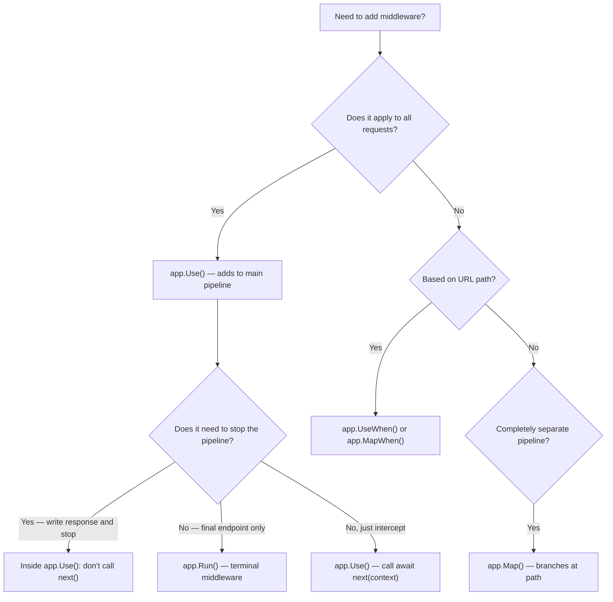

> [!success] Mastery Check
> - [ ] **Studied Well**
> - [ ] **Can explain the concept without notes**
> - [ ] **Can answer interview questions confidently**
> - [ ] **Can implement it in a real project**


# 4.049 — The Middleware Pipeline: Request Delegation Chain

## PART 0 — Navigation & Context

```
ASP.NET Core Mastery
├── E. Middleware Pipeline   (4.049–4.063)
│   ├── ▶▶▶ 4.049  The Middleware Pipeline: Request Delegation Chain  ◀◀◀
│   ├── 4.050  Writing Middleware
│   ├── 4.051  Short-Circuiting and Pipeline Branching
│   ├── 4.052  Middleware Ordering: The Canonical Order
│   └── 4.054  HttpContext and IHttpContextAccessor
```

---

## PART 1 — Core Mental Model

### The Fundamental Rule

> **The middleware pipeline is a linked chain of `RequestDelegate` functions. Each middleware receives the `HttpContext` and a reference to `next` (the rest of the pipeline). Calling `await next(context)` passes the request downstream. Not calling it short-circuits the pipeline. Code before `await next` runs on the way in (request path); code after `await next` runs on the way out (response path). The pipeline is compiled once at startup into a single nested async call chain.**

### The Chain Metaphor

```
Request ──► [MW1] ──► [MW2] ──► [MW3] ──► [Endpoint]
               ◄──────────────────────────────────────
Response (travels back through MW3, MW2, MW1)

Unrolled:
async Task MW1(HttpContext ctx, next)
{
    // ← RUNS ON REQUEST PATH
    await next(ctx);
    // ← RUNS ON RESPONSE PATH (after endpoint + downstream middleware)
}
```

### Compiled Pipeline (What builder.Build() Actually Creates)

```csharp
// Registration:
app.Use(exceptionHandlerMiddleware);
app.Use(httpsRedirectMiddleware);
app.Use(routingMiddleware);
app.MapControllers();

// builder.Build() compiles to a single RequestDelegate:
RequestDelegate pipeline = async ctx =>
{
    await exceptionHandlerMiddleware.InvokeAsync(ctx, async ctx =>
    {
        await httpsRedirectMiddleware.InvokeAsync(ctx, async ctx =>
        {
            await routingMiddleware.InvokeAsync(ctx, async ctx =>
            {
                await endpointMiddleware.InvokeAsync(ctx, _ => Task.CompletedTask);
            });
        });
    });
};

// Kestrel calls: await pipeline(httpContext) for every request
```

---

## PART 2 — Deep Mechanics

### 2.1 — RequestDelegate: The Type of the Pipeline

```csharp
// The fundamental type:
public delegate Task RequestDelegate(HttpContext context);

// A middleware is anything that transforms a RequestDelegate into a RequestDelegate:
// Func<RequestDelegate, RequestDelegate>
```

**This is the chain-of-responsibility pattern.** Each middleware is a decorator that wraps the `next` delegate.

### 2.2 — The `app.Use()` API

```csharp
// Full form: explicit access to both context and next
app.Use(async (context, next) =>
{
    // ─── REQUEST PATH ───
    context.Response.Headers["X-Custom"] = "MyValue";
    // Check the request, potentially short-circuit:
    if (context.Request.Headers.ContainsKey("X-Maintenance-Mode"))
    {
        context.Response.StatusCode = 503;
        await context.Response.WriteAsync("Service temporarily unavailable");
        return;  // ← short-circuit — next() NOT called
    }

    await next(context);  // ← passes to the next middleware

    // ─── RESPONSE PATH ───
    // context.Response.StatusCode is now set by the endpoint
    if (context.Response.StatusCode >= 500)
    {
        // Log, alert, etc.
    }
});

// Simplified form (next is a RequestDelegate directly):
app.Use((context, next) => next(context));  // ← pure pass-through (no-op)
```

### 2.3 — The `app.Run()` API: Terminal Middleware

```csharp
// app.Run() registers a terminal middleware — it does NOT receive a 'next' parameter
// It is always the last middleware to run
app.Run(async context =>
{
    // This is the endpoint — write the response here
    context.Response.StatusCode = 200;
    context.Response.ContentType = "text/plain";
    await context.Response.WriteAsync("Hello from terminal middleware");
    // There is no 'next' to call — pipeline ends here
});

// ⚠️ Any middleware registered AFTER app.Run() is dead code — never executes
app.Use(...)  // ← NEVER CALLED because app.Run() is terminal
```

### 2.4 — IMiddleware: The Interface Form

```csharp
// IMiddleware is the interface-based approach (preferred for complex middleware with DI)
public interface IMiddleware
{
    Task InvokeAsync(HttpContext context, RequestDelegate next);
}

// Implementation:
public class TimingMiddleware(ILogger<TimingMiddleware> logger) : IMiddleware
{
    public async Task InvokeAsync(HttpContext context, RequestDelegate next)
    {
        var sw = Stopwatch.StartNew();
        await next(context);
        sw.Stop();
        logger.LogInformation("Request {Path} completed in {Ms}ms",
            context.Request.Path, sw.ElapsedMilliseconds);
    }
}

// Registration (must be registered in DI container AND added to pipeline):
builder.Services.AddScoped<TimingMiddleware>();  // Register in DI (Scoped or Transient)
app.UseMiddleware<TimingMiddleware>();           // Add to pipeline
```

### 2.5 — Convention-Based Middleware (Without IMiddleware Interface)

```csharp
// Convention-based: class with InvokeAsync method and RequestDelegate in constructor
// Dependencies injected via constructor (Singleton) or InvokeAsync parameters (Scoped/Transient)
public class CorrelationIdMiddleware(RequestDelegate next)
{
    private const string HeaderName = "X-Correlation-ID";

    // ✅ Scoped services injected into InvokeAsync — not the constructor
    public async Task InvokeAsync(HttpContext context, ILogger<CorrelationIdMiddleware> logger)
    {
        var correlationId = context.Request.Headers[HeaderName].ToString();
        if (string.IsNullOrEmpty(correlationId))
            correlationId = Guid.NewGuid().ToString("N");

        context.Items["CorrelationId"] = correlationId;
        context.Response.Headers[HeaderName] = correlationId;

        using (logger.BeginScope(new { CorrelationId = correlationId }))
        {
            await next(context);
        }
    }
}

// Registration (no DI registration needed for convention-based — framework handles it):
app.UseMiddleware<CorrelationIdMiddleware>();
```

### 2.6 — The Request and Response Paths in Detail

```csharp
// Three middleware — tracing the execution order:
app.Use(async (ctx, next) =>
{
    Console.WriteLine("MW1: Before");      // Step 1
    await next(ctx);
    Console.WriteLine("MW1: After");       // Step 6
});

app.Use(async (ctx, next) =>
{
    Console.WriteLine("MW2: Before");      // Step 2
    await next(ctx);
    Console.WriteLine("MW2: After");       // Step 5
});

app.Run(async ctx =>
{
    Console.WriteLine("Terminal");         // Step 3
    ctx.Response.StatusCode = 200;
    await ctx.Response.WriteAsync("OK");
    Console.WriteLine("Terminal done");    // Step 4
});

// Output for one request:
// MW1: Before
// MW2: Before
// Terminal
// Terminal done
// MW2: After
// MW1: After
```

---

## PART 3 — Production Code Patterns

### Pattern 1: Request Timing Middleware

```csharp
public class RequestTimingMiddleware(RequestDelegate next, ILogger<RequestTimingMiddleware> logger)
{
    public async Task InvokeAsync(HttpContext context)
    {
        var sw = Stopwatch.StartNew();
        try
        {
            await next(context);
        }
        finally
        {
            // ✅ Use finally — runs even if downstream throws (before exception handler)
            sw.Stop();
            var path = context.Request.Path;
            var method = context.Request.Method;
            var status = context.Response.StatusCode;
            var ms = sw.ElapsedMilliseconds;

            if (ms > 500)
                logger.LogWarning("SLOW {Method} {Path} → {Status} in {Ms}ms", method, path, status, ms);
            else
                logger.LogInformation("{Method} {Path} → {Status} in {Ms}ms", method, path, status, ms);
        }
    }
}

app.UseMiddleware<RequestTimingMiddleware>();
```

### Pattern 2: Middleware With Short-Circuiting

```csharp
// IP allowlist middleware — short-circuits unauthorized IPs before they reach the pipeline
public class IpAllowlistMiddleware(RequestDelegate next, IOptions<IpAllowlistOptions> options)
{
    private readonly HashSet<string> _allowedIps =
        options.Value.AllowedIPs.ToHashSet(StringComparer.OrdinalIgnoreCase);

    public async Task InvokeAsync(HttpContext context)
    {
        var remoteIp = context.Connection.RemoteIpAddress?.ToString();
        if (remoteIp is null || !_allowedIps.Contains(remoteIp))
        {
            context.Response.StatusCode = 403;
            await context.Response.WriteAsync("Forbidden");
            return;   // ← short-circuit: downstream middleware never runs
        }
        await next(context);
    }
}
```

### Pattern 3: Response Manipulation on the Way Back

```csharp
// Security headers middleware — adds headers to every response on the response path
app.Use(async (context, next) =>
{
    // ─── Request path: nothing to do ───
    await next(context);
    // ─── Response path: add security headers ───
    // ⚠️ IMPORTANT: only if response hasn't started (headers not yet sent)
    if (!context.Response.HasStarted)
    {
        context.Response.Headers["X-Content-Type-Options"] = "nosniff";
        context.Response.Headers["X-Frame-Options"] = "DENY";
        context.Response.Headers["X-XSS-Protection"] = "1; mode=block";
        context.Response.Headers["Referrer-Policy"] = "strict-origin-when-cross-origin";
        context.Response.Headers["Permissions-Policy"] = "camera=(), microphone=()";
    }
});
```

---

## PART 4 — Gotchas

### Gotcha 1: Code After `app.Run()` Never Executes
`app.Run()` registers a terminal `RequestDelegate`. Any `app.Use()` calls after it are compiled into the pipeline but unreachable — the terminal middleware never calls `next`. This is a silent bug: no error, no warning, just dead middleware.

### Gotcha 2: `Response.HasStarted` After Endpoint Writes
Once the endpoint writes the response body (`Results.Ok()`, `WriteAsync()`), ASP.NET Core flushes the headers to the TCP socket. On the response path, any middleware trying to add headers or change `StatusCode` after `HasStarted == true` will either throw or silently fail (headers are already sent).

```csharp
// ⚠️ This fails silently on the response path:
app.Use(async (ctx, next) =>
{
    await next(ctx);
    ctx.Response.StatusCode = 200;  // ← Response.HasStarted == true; StatusCode change has no effect
    ctx.Response.Headers["X-Late"] = "too-late";  // ← Throws in some scenarios
});
```

### Gotcha 3: Injecting Scoped Services Into Convention-Based Middleware Constructor
```csharp
// ⚠️ WRONG: DbContext (Scoped) injected into middleware constructor (Singleton-scoped)
public class DataMiddleware(RequestDelegate next, OrderDbContext db)  // ← CAPTIVE DEPENDENCY
{
    public async Task InvokeAsync(HttpContext context)
    {
        var order = await db.Orders.FindAsync(1);   // Same DbContext for all requests!
        await next(context);
    }
}

// ✅ CORRECT: Inject Scoped services via InvokeAsync
public class DataMiddleware(RequestDelegate next)
{
    public async Task InvokeAsync(HttpContext context, OrderDbContext db)  // ← Per-request
    {
        var order = await db.Orders.FindAsync(1);   // Fresh DbContext per request
        await next(context);
    }
}
```

### Gotcha 4: Not Awaiting `next(context)`
```csharp
// ⚠️ WRONG — fire-and-forget: pipeline branches, response path code runs before endpoint
app.Use(async (ctx, next) =>
{
    _ = next(ctx);  // ← Not awaited! The endpoint runs concurrently with code after this line
    // Code here runs concurrently with the endpoint — race condition on HttpContext
});

// ✅ CORRECT:
app.Use(async (ctx, next) =>
{
    await next(ctx);  // ← Waits for the full downstream pipeline to complete
});
```

---

## PART 5 — Performance

| Operation | Cost | Notes |
|---|---|---|
| Pipeline compilation (startup) | ~1–10 ms | One-time cost; nested async delegate chain |
| Single middleware traversal | ~0.5–2 µs | Async state machine transition per middleware |
| 10 middleware pipeline traversal | ~3–6 µs | Round-trip request+response path |
| Short-circuit (no downstream) | ~0.5 µs | Terminates early; no downstream cost |
| `response.HasStarted` check | ~1 ns | Simple boolean read |

**Middleware count matters:** Each middleware in the pipeline adds one async state machine allocation on the request path and one on the response path. Typical production pipelines with 8–12 middleware add ~3–6 µs total overhead — negligible for API latency targets >10 ms.

---

## PART 6 — Interview Arsenal

**Q: Explain how the middleware pipeline works in ASP.NET Core.**
> "The middleware pipeline is a chain of `RequestDelegate` functions built at startup by `builder.Build()`. Each middleware is a function that receives the `HttpContext` and a `next` delegate representing the rest of the pipeline. When middleware calls `await next(context)`, it passes the request downstream. Code before `await next` runs on the request path — going into the pipeline. Code after `await next` runs on the response path — going back out. If a middleware does NOT call `next`, it short-circuits the pipeline — downstream middleware and the endpoint never run. The pipeline is compiled once into a nested async delegate chain, not dynamically executed on each request. This means pipeline structure is fixed at startup and adding middleware at runtime is not possible."

**Q: What is the difference between `IMiddleware` and convention-based middleware?**
> "`IMiddleware` is the interface approach: the class implements `InvokeAsync(HttpContext, RequestDelegate)`. It must be registered in the DI container and is resolved per-request (if Scoped) or once (if Singleton). Convention-based middleware has a public `InvokeAsync(HttpContext)` method and a constructor that takes `RequestDelegate` — the framework uses reflection to wire it up. The key difference for production code: with convention-based middleware, dependencies injected into the **constructor** are resolved once at startup (Singleton-scoped), while dependencies in the **InvokeAsync parameters** are resolved per-request. This is how convention-based middleware safely consumes Scoped services."

**Red flags:**
1. "I call `app.Use()` after `app.Run()`" — dead code; never executes.
2. "I inject DbContext into the middleware constructor" — captive dependency; data corruption.
3. "I don't await `next(context)`" — race condition on HttpContext; undefined behavior.

---

## PART 7 — Decision Framework



---

## PART 8 — Self-Check

1. What is a `RequestDelegate`?
2. What is the difference between code before `await next(context)` and code after it?
3. What does "short-circuiting" mean in the context of middleware?
4. Why can't you inject a Scoped service into a convention-based middleware constructor?
5. What happens if you register middleware after `app.Run()`?

<details><summary>Answers</summary>

1. `RequestDelegate` is `delegate Task RequestDelegate(HttpContext context)` — a function that takes an `HttpContext` and returns a `Task`. Each middleware is a function that transforms one `RequestDelegate` into another (the decorated version).
2. Code before `await next(context)` runs on the **request path** (going into the pipeline toward the endpoint). Code after runs on the **response path** (going back out toward Kestrel/client). This is the same execution model as a try/finally around `await next(context)`.
3. Short-circuiting means a middleware does NOT call `next(context)` — it writes a response and returns. All downstream middleware and the endpoint are skipped.
4. Convention-based middleware constructors are invoked once at startup — they behave like Singletons. A Scoped service (like DbContext) captured in the constructor becomes a captive dependency: the same instance is used for every request, violating the Scoped lifetime contract.
5. Middleware registered after `app.Run()` is compiled into the pipeline structure but is unreachable — `app.Run()` is a terminal that never calls `next`. The unreachable middleware is dead code with no error or warning.

</details>

---

## PART 9 — Connections

| Topic | Relationship |
|---|---|
| [[4.001 — The ASP.NET Core Request Pipeline]] | The five-layer model; this note explains Layer 2 (middleware) in depth |
| [[4.050 — Writing Middleware]] | How to write both IMiddleware and convention-based middleware |
| [[4.051 — Short-Circuiting and Pipeline Branching]] | Map, MapWhen, UseWhen — building conditional pipeline branches |
| [[4.052 — Middleware Ordering]] | The canonical production order for all built-in middleware |
| [[4.054 — HttpContext and IHttpContextAccessor]] | HttpContext is the shared state object flowing through the pipeline |

**Docs:** [ASP.NET Core Middleware — Microsoft Docs](https://learn.microsoft.com/en-us/aspnet/core/fundamentals/middleware/)
