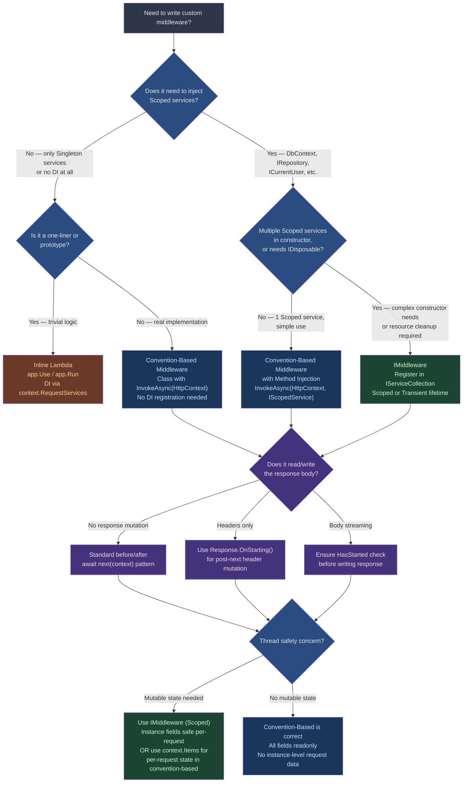

> [!success] Mastery Check
> - [ ] **Studied Well**
> - [ ] **Can explain the concept without notes**
> - [ ] **Can answer interview questions confidently**
> - [ ] **Can implement it in a real project**


# 4.050 — Writing Middleware: IMiddleware vs Convention-Based

---

## PART 0 — Navigation & Context

### Where This Topic Lives

```
ASP.NET Core Mastery
│
├── A. Host & Application Lifecycle       (4.001–4.010)
├── B. Configuration System               (4.011–4.022)
├── C. Logging & Diagnostics              (4.023–4.033)
├── D. Dependency Injection               (4.034–4.048)
├── E. Middleware Pipeline                (4.049–4.063)
│   ├── 4.049  The Middleware Pipeline: Request Delegation Chain
│   ├── 4.050  ◄ YOU ARE HERE — Writing Middleware: IMiddleware vs Convention-Based
│   ├── 4.051  Short-Circuiting and Pipeline Branching
│   ├── 4.052  Middleware Ordering: The Canonical Order
│   ├── 4.053  Built-In Middleware Reference
│   ├── 4.054  HttpContext and IHttpContextAccessor
│   ├── 4.055  Custom Exception Middleware
│   ├── 4.057  Middleware and Scoped DI
│   └── ...
├── F. Routing System                     (4.064–4.077)
└── ...
```

### What You Need Before This

- **[[4.049 — The Middleware Pipeline: Request Delegation Chain]]** — You must understand what `RequestDelegate`, `next()`, and the bidirectional pipeline mean before writing middleware that extends it.
- **[[4.034 — The Built-In DI Container: Service Registration and Resolution]]** — Both middleware styles interact with DI in different ways; knowing how registration works is prerequisite.
- **[[4.035 — Service Lifetimes: Singleton, Scoped, Transient — Rules and Pitfalls]]** — The entire DI section of this note is about lifetime; you cannot understand why `IMiddleware` exists without knowing the lifetime trap.
- **[[4.042 — The Captive Dependency Problem: Singleton Consuming Scoped]]** — Convention-based middleware _is_ a captive dependency trap waiting to happen; this is its most dangerous gotcha.

### What This Unlocks After

- **[[4.052 — Middleware Ordering: The Canonical Order and Why It Matters]]** — Once you can write middleware, the canonical order tells you where to register it.
- **[[4.057 — Middleware and Scoped DI: Injecting Scoped Services Correctly]]** — The deeper dive into scoped DI in middleware; `IMiddleware` is the solution introduced there.
- **[[4.055 — Custom Exception Middleware: Domain Exceptions to HTTP Responses]]** — A complete production application of middleware writing.
- **[[4.061 — Custom Middleware Catalog: Logging, Correlation ID, Timing]]** — Multiple real-world middleware implementations built on the patterns from this note.

### Why This Topic Matters at Scale

At 10k+ requests per second, the choice between convention-based and `IMiddleware` determines whether every Scoped service injected into a middleware is correctly isolated per request or silently shared across all requests for the lifetime of the process — the second case corrupts state, leaks context, and produces security bugs that only manifest under concurrent load.

---

## PART 1 — The Core Mental Model

### The Fundamental Rule

> **ASP.NET Core instantiates convention-based middleware exactly once (Singleton-like) and resolves its constructor dependencies from the root `IServiceProvider` — meaning Scoped services injected into the constructor are captured for the process lifetime. `IMiddleware` is resolved per-request from the request's `IServiceScope`, making it safe to inject Scoped services. The practical consequence is that the wrong choice produces a captive dependency that corrupts request isolation under concurrent load.**

### The Plain-Language Analogy

Think of the middleware pipeline as a hotel's service floor where every request is a guest. Convention-based middleware is like a **permanent on-duty concierge** hired once when the hotel opens: they carry their toolkit — their injected services — with them forever, regardless of which guest they're serving. If that toolkit includes a notepad where they track the current guest's room number (a Scoped service), every new guest after the first one is getting data from the previous guest's notepad. `IMiddleware` is like a **concierge hired fresh for each guest from a staffing agency**: they arrive with a clean notepad, serve exactly one guest, and leave. When a request short-circuits and the guest leaves without finishing the tour, the convention-based concierge simply stops their greeting mid-sentence and waits for the next guest — they're still there, still holding their old notepad. The `IMiddleware` concierge is released when the guest leaves, regardless of whether the tour completed. At scale, with 10,000 concurrent guests, the permanent concierge's notepad becomes a data race.

### The Taxonomy Diagram

```mermaid
graph TD
    A["Middleware Writing Approaches"] --> B["Convention-Based\n(Classic)"]
    A --> C["IMiddleware\n(Interface-Based, .NET Core 2.0+)"]
    A --> D["Inline Lambda\napp.Use / app.Run"]

    B --> B1["Shape:\nInvokeAsync(HttpContext, RequestDelegate)"]
    B --> B2["DI Lifetime:\nEffectively Singleton\n(activated once by pipeline)"]
    B --> B3["Constructor:\nReceives Singleton services only\n(safely)"]
    B --> B4["Method Params:\nReceives Scoped/Transient services\n(per-request injection)"]
    B --> B5["Registration:\napp.UseMiddleware<T>()"]
    B --> B6["DI Container:\nNOT registered in IServiceCollection\nUnless you choose to"]

    C --> C1["Shape:\nImplements IMiddleware\nInvokeAsync(HttpContext, RequestDelegate)"]
    C --> C2["DI Lifetime:\nScoped (recommended)\nor Transient or Singleton"]
    C --> C3["Constructor:\nReceives any lifetime safely\n(resolved per-request)"]
    C --> C4["Method Params:\nN/A — services in constructor"]
    C --> C5["Registration:\nMUST be in IServiceCollection\napp.UseMiddleware<T>()"]
    C --> C6["Resolved by:\nIMiddlewareFactory per request"]

    D --> D1["app.Use(next => async ctx => { ... })"]
    D --> D2["app.Run(async ctx => { ... })\nTerminal — no next()"]
    D --> D3["Suitable for:\nSimple, stateless, prototyping"]
    D --> D4["DI Access:\nvia ctx.RequestServices\n(manual, not injected)"]

    style A fill:#2d3748,color:#e2e8f0
    style B fill:#2b4c7e,color:#e2e8f0
    style C fill:#2d6a4f,color:#e2e8f0
    style D fill:#6b3a2a,color:#e2e8f0
    style B1 fill:#1a365d,color:#bee3f8
    style B2 fill:#742a2a,color:#fed7d7
    style B3 fill:#1a365d,color:#bee3f8
    style B4 fill:#1a365d,color:#bee3f8
    style B5 fill:#1a365d,color:#bee3f8
    style B6 fill:#1a365d,color:#bee3f8
    style C1 fill:#1c4532,color:#c6f6d5
    style C2 fill:#1c4532,color:#c6f6d5
    style C3 fill:#1c4532,color:#c6f6d5
    style C4 fill:#1c4532,color:#c6f6d5
    style C5 fill:#1c4532,color:#c6f6d5
    style C6 fill:#1c4532,color:#c6f6d5
    style D1 fill:#44271b,color:#fbd38d
    style D2 fill:#44271b,color:#fbd38d
    style D3 fill:#44271b,color:#fbd38d
    style D4 fill:#44271b,color:#fbd38d
```



---

## PART 2 — Deep Mechanics

### 2.1 — Convention-Based Middleware: How ASP.NET Core Activates It

Convention-based middleware is the original ASP.NET Core pattern. The framework recognizes it by shape — no interface required — using a convention that `UseMiddleware<T>()` enforces via reflection.

**Pipeline Position (generic custom middleware):**

```
──► ExceptionHandler ──► HSTS ──► StaticFiles ──► Routing ──► Auth ──► [YOUR MIDDLEWARE] ──► Endpoints
        ^                                                                         ^
        |                                                                         |
  First registered,                                               Registered after UseAuthorization
  catches all exceptions                                          unless you want it earlier
```

**Required Shape:**

```csharp
// Convention-based middleware: no interface, recognized by method name alone
// ~0 allocations per request beyond the async state machine
public class OrderAuditMiddleware
{
    private readonly RequestDelegate _next;
    private readonly ILogger<OrderAuditMiddleware> _logger;

    // CONSTRUCTOR: Only Singleton-safe services go here.
    // ILogger<T> is Singleton — safe. DbContext would be WRONG here.
    // Cost: called ONCE at startup, not per request
    public OrderAuditMiddleware(RequestDelegate next, ILogger<OrderAuditMiddleware> logger)
    {
        _next = next;
        _logger = logger;
    }

    // InvokeAsync or Invoke — the framework finds this by name via reflection
    // ADDITIONAL PARAMETERS: injected per-request from the request's IServiceScope
    // Cost: ~1 allocation for the async state machine per request
    public async Task InvokeAsync(
        HttpContext context,
        IAuditRepository auditRepo)  // Scoped service — safely injected here, NOT in constructor
    {
        // Pipeline position: BEFORE downstream middleware and endpoint
        var stopwatch = Stopwatch.StartNew();

        try
        {
            await _next(context);  // Pass control downstream
        }
        finally
        {
            // Pipeline position: AFTER downstream middleware returns (response phase)
            stopwatch.Stop();
            _logger.LogInformation(
                "Order request {Path} completed in {ElapsedMs}ms with status {Status}",
                context.Request.Path,
                stopwatch.ElapsedMilliseconds,
                context.Response.StatusCode);

            // auditRepo is scoped per this request — safe to use here
            await auditRepo.RecordAsync(context.Request.Path, stopwatch.ElapsedMilliseconds);
        }
    }
}
```

**ASP.NET Core Internally (approximate):**

```
// UseMiddleware<T>() calls into MiddlewareFactory / ConventionMiddlewarePipeline:
//
// 1. At app.Build() time (NOT per request):
//    - Reflects on T to find InvokeAsync(HttpContext, ...) method
//    - Inspects constructor parameters
//    - Creates compiled Expression<Func<RequestDelegate, T>> to instantiate T
//    - T is instantiated ONCE — the instance is held for the application lifetime
//    - Constructor services are resolved from app.ApplicationServices (root provider)
//
// 2. Per request:
//    - InvokeAsync is invoked on the SAME instance
//    - Additional InvokeAsync parameters (beyond HttpContext) are resolved
//      from context.RequestServices (request-scoped provider)
//    - This is the "method injection" trick that makes convention-based middleware
//      safe for Scoped services in parameters despite being Singleton in lifetime

// Source: Microsoft.AspNetCore.Builder.UseMiddlewareExtensions
// Class responsible: ActivatorUtilities.CreateFactory (constructor activation)
//                    + compiled delegate for per-request method injection
```

**HTTP Wire Effect:**

```http
// HTTP request entering the middleware:
// POST /api/orders HTTP/1.1
// Host: payments.api.internal
// Authorization: Bearer eyJhbGci...
// Content-Type: application/json
// Content-Length: 142

// The middleware adds no visible HTTP effect by itself.
// It observes and wraps — the response comes from downstream:
// HTTP/1.1 201 Created
// Location: /api/orders/order-8842
// Content-Type: application/json; charset=utf-8
// X-Request-Id: 4f3a2b1c-...   ← set by an upstream correlation middleware

// Cost: ~1 async state machine allocation per request
//       ~1 Stopwatch allocation per request
//       auditRepo.RecordAsync: ~1 DB round-trip per request (async, non-blocking)
```

> [!WARNING] The method injection trick for Scoped services **only works for `InvokeAsync`/`Invoke` method parameters**. If you store a Scoped service received via method injection in a field (`this._repo = repo`), you've recreated the captive dependency problem yourself. Never store method-injected parameters as instance state.

---

### 2.2 — IMiddleware: Interface-Based, Per-Request Resolution

`IMiddleware` was introduced to solve the DI lifetime problem cleanly. Instead of relying on the method-injection trick, `IMiddlewareFactory` resolves the middleware from the request's `IServiceScope` on every single request.

**The Interface:**

```csharp
// Microsoft.AspNetCore.Http.IMiddleware
// Defined in Microsoft.AspNetCore.Http.Abstractions
public interface IMiddleware
{
    Task InvokeAsync(HttpContext context, RequestDelegate next);
}
```

**IMiddleware Pipeline Resolution — ASP.NET Core Internally (approximate):**

```
// At UseMiddleware<T>() registration time:
//   - ASP.NET Core detects that T implements IMiddleware
//   - Instead of activating T now, it registers a UseMiddlewareExtension that
//     uses IMiddlewareFactory at request time
//
// Per request (IMiddlewareFactory.Create):
//   1. Resolve IMiddlewareFactory from context.RequestServices
//      (DefaultMiddlewareFactory is the built-in implementation)
//   2. DefaultMiddlewareFactory calls context.RequestServices.GetRequiredService<T>()
//   3. T is resolved from the request scope — whatever lifetime T was registered as
//   4. InvokeAsync is called on the fresh instance
//   5. After the request completes, DefaultMiddlewareFactory.Release(middleware)
//      is called — for IDisposable middleware, this triggers Dispose()
//
// Source: Microsoft.AspNetCore.Http.DefaultMiddlewareFactory
//         Microsoft.AspNetCore.Builder.UseMiddlewareExtensions (IMiddleware branch)
```

**Complete IMiddleware Example — Payment Fraud Check:**

```csharp
// ✅ CORRECT: IMiddleware — resolved per-request, Scoped services safe in constructor
public class PaymentFraudCheckMiddleware : IMiddleware
{
    private readonly IFraudDetectionService _fraudService;  // Scoped — safe!
    private readonly ILogger<PaymentFraudCheckMiddleware> _logger;  // Singleton — safe!

    // Constructor receives any lifetime — resolved from request scope
    // Cost: ~1 allocation for this instance per request (Scoped)
    public PaymentFraudCheckMiddleware(
        IFraudDetectionService fraudService,
        ILogger<PaymentFraudCheckMiddleware> logger)
    {
        _fraudService = fraudService;
        _logger = logger;
    }

    public async Task InvokeAsync(HttpContext context, RequestDelegate next)
    {
        // Only intercept payment endpoints — let others pass through
        if (!context.Request.Path.StartsWithSegments("/api/payments"))
        {
            await next(context);
            return;  // Short-circuit skips fraud check for non-payment routes
        }

        var clientIp = context.Connection.RemoteIpAddress?.ToString() ?? "unknown";
        var userId = context.User.FindFirst("sub")?.Value;

        // _fraudService is Scoped — fresh per request, no cross-request state leakage
        var isSuspicious = await _fraudService.IsSuspiciousAsync(clientIp, userId);

        if (isSuspicious)
        {
            _logger.LogWarning(
                "Fraud check blocked payment request from IP {IP} for user {UserId}",
                clientIp, userId);

            // Short-circuit: do NOT call next()
            // Pipeline stops here; downstream middleware and endpoint do NOT run
            context.Response.StatusCode = StatusCodes.Status403Forbidden;
            context.Response.ContentType = "application/problem+json";
            await context.Response.WriteAsJsonAsync(new
            {
                type = "https://api.payments.example.com/errors/fraud-suspected",
                title = "Transaction blocked",
                status = 403,
                detail = "This transaction has been blocked pending review."
            });
            return;
        }

        await next(context);
    }
}
```

**Registration (IMiddleware REQUIRES DI registration):**

```csharp
// Program.cs
// Step 1: MUST register the middleware in DI — IMiddleware requires this
builder.Services.AddScoped<PaymentFraudCheckMiddleware>();
// ^ Scoped = new instance per request — correct for stateful per-request logic

// Step 2: Add to pipeline
app.UseMiddleware<PaymentFraudCheckMiddleware>();

// What happens if you forget Step 1?
// InvalidOperationException: No service for type 'PaymentFraudCheckMiddleware'
// has been registered. This happens at first request, not at startup.
```

**HTTP Wire Effect — Fraud Blocked:**

```http
// HTTP request (payment endpoint):
// POST /api/payments/initiate HTTP/1.1
// Authorization: Bearer eyJhbGci...
// Content-Type: application/json
// X-Forwarded-For: 185.220.101.42  ← known Tor exit node

// HTTP response (fraud check short-circuits, endpoint never runs):
// HTTP/1.1 403 Forbidden
// Content-Type: application/problem+json; charset=utf-8
// Content-Length: 189
//
// {"type":"https://...","title":"Transaction blocked","status":403,"detail":"..."}

// Cost: ~1 IMiddlewareFactory.Create() call (= 1 DI resolution from scope)
//       ~1 IFraudDetectionService resolution
//       ~1 async HTTP call to fraud detection service
//       0 calls to downstream middleware or endpoint
```

---

### 2.3 — Constructor vs Method Injection in Convention-Based Middleware

This is the single most misunderstood aspect of convention-based middleware, and it produces some of the most insidious production bugs.

**The Rule Table:**

|Injection Point|Resolved From|Safe Lifetimes|Typical Use|
|---|---|---|---|
|Constructor parameter|`IApplicationBuilder.ApplicationServices` (root scope)|**Singleton only**|`ILogger<T>`, `IOptions<T>`, `IHttpClientFactory`|
|`InvokeAsync` parameter|`context.RequestServices` (request scope)|Singleton, Scoped, Transient|`DbContext`, `IRepository<T>`, `ICurrentUserService`|

**The Trap Visualized:**

```
ApplicationServices (root IServiceProvider)
│
├── ILogger<T>          [Singleton]  ← constructor injection safe
├── IOptions<T>         [Singleton]  ← constructor injection safe
├── IHttpClientFactory  [Singleton]  ← constructor injection safe
│
└── OrderMiddleware instance         ← lives here FOREVER
    │
    └── _orderRepo: IOrderRepository ← ⚠️ WRONG if Scoped
        This is now a root-scoped
        Singleton in disguise.
        It holds a DbContext that
        was created once and never
        released, sharing state
        across all concurrent requests.

Per-Request IServiceScope (created by Kestrel per HTTP request)
│
├── IOrderRepository    [Scoped]     ← InvokeAsync parameter injection safe
├── DbContext           [Scoped]     ← InvokeAsync parameter injection safe
└── ... (all scoped services)        ← resolved fresh per request
```

**Framework Source — How Method Injection Works (approximate):**

```csharp
// ASP.NET Core compiles an expression tree to handle method injection.
// Simplified version of what UseMiddlewareExtensions does internally:

// At build time:
var methodParameters = invokeMethod.GetParameters();
// methodParameters[0] is always HttpContext
// methodParameters[1..n] are the per-request injected services

// At request time, the generated delegate does approximately:
var serviceProvider = context.RequestServices;
var param1 = serviceProvider.GetRequiredService(methodParameters[1].ParameterType);
var param2 = serviceProvider.GetRequiredService(methodParameters[2].ParameterType);
await _middlewareInstance.InvokeAsync(context, param1, param2);

// The middleware instance itself (_middlewareInstance) is the Singleton
// but the parameters come from context.RequestServices — fresh per request
```

---

### 2.4 — Inline Lambda Middleware: When and When Not

Inline lambdas are appropriate for simple, stateless operations. They access services via `context.RequestServices` (manual resolution), which bypasses the constructor injection discussion entirely.

```csharp
// ✅ Appropriate: Stateless, one-liner operations
// Pipeline position: wherever you call app.Use()
app.Use(async (context, next) =>
{
    // Add a header to every response from this point downstream
    context.Response.OnStarting(() =>
    {
        context.Response.Headers["X-Powered-By"] = "OrdersAPI/2.0";
        return Task.CompletedTask;
    });
    await next(context);
});

// ✅ Appropriate: app.Run() as a terminal middleware
// Cost: no allocation beyond the async state machine
// Short-circuits: ALWAYS — never calls next
app.Run(async context =>
{
    context.Response.StatusCode = 404;
    await context.Response.WriteAsync("Not found");
});

// ⚠️ WRONG: Using inline lambda for anything needing DI resolution
app.Use(async (context, next) =>
{
    // Manual resolution from context.RequestServices is the escape hatch
    // but it hides dependencies and is harder to test
    var repo = context.RequestServices.GetRequiredService<IOrderRepository>();
    await repo.RecordRequestAsync(context.Request.Path);
    await next(context);
});
// Prefer: Extract this to a named IMiddleware class with proper DI
```

**HTTP Wire Effect — Response Header Middleware:**

```http
// Every response from downstream now carries:
// HTTP/1.1 200 OK
// Content-Type: application/json; charset=utf-8
// X-Powered-By: OrdersAPI/2.0    ← added by the inline lambda
// Content-Length: 847
```

---

### 2.5 — The `app.UseMiddleware<T>()` Registration Path in Full

Understanding how `UseMiddleware<T>()` works end-to-end eliminates confusion about which code path activates under which conditions.

```
app.UseMiddleware<T>() is called
         │
         ▼
Does T implement IMiddleware?
         │
    ┌────┴────┐
   YES        NO
    │          │
    ▼          ▼
IMiddlewareFactory path    Convention-Based path
    │                              │
    ▼                              ▼
Per-request:                  At build time (app.Build()):
IMiddlewareFactory               Reflect on T
  .Create(context)               Find InvokeAsync or Invoke method
  → context.RequestServices      Compile activation Expression
    .GetRequiredService<T>()     Instantiate T ONCE from app.ApplicationServices
    │                              │
    ▼                              ▼
T is fresh instance            T instance lives for process lifetime
per request                    Constructor params from root scope
    │                          InvokeAsync params from request scope
    ▼
InvokeAsync called
on fresh instance
    │
    ▼
After request:
IMiddlewareFactory
  .Release(middleware)
  → Dispose() if IDisposable
```

> [!IMPORTANT] The `IMiddlewareFactory` check happens inside `UseMiddlewareExtensions.UseMiddlewareInterface()`. If `T` implements `IMiddleware` but is **not registered in DI**, you get an `InvalidOperationException` at the first request. If `T` does **not** implement `IMiddleware` and is not registered in DI, convention-based activation still works — the framework creates it directly via `ActivatorUtilities`. This asymmetry trips up engineers who register convention-based middleware in DI "just in case."

---

### 2.6 — Thread Safety: What Each Approach Requires

```
Convention-Based Middleware:
  Instance is SHARED across all concurrent requests.
  
  Fields that are safe:
    ✅ readonly fields initialized in constructor
    ✅ ILogger<T> (thread-safe)
    ✅ IOptions<T> (immutable after app start)
    ✅ IHttpClientFactory (thread-safe)
    
  Fields that are NOT safe (must never be mutable instance state):
    ❌ Request-specific data (current order ID, user ID, etc.)
    ❌ DbContext or any EF Core type
    ❌ Any service with per-request lifecycle assumptions
    ❌ Counters / accumulators (use Interlocked or Metrics API instead)

IMiddleware:
  Each request gets its own instance (if registered as Scoped).
  
  Instance-level mutable state IS safe because no sharing occurs.
  (Though typically unnecessary — prefer stateless logic when possible.)
  
  Still unsafe:
    ❌ Static fields (shared across ALL instances, ALL requests)
    ❌ Singleton services with mutable shared state
```

---

## PART 3 — Production Code Patterns

### Pattern 1: The Request Timing Probe (Convention-Based, Stateless)

**Domain:** Logistics shipment tracking API — latency SLO enforcement.

```csharp
// ✅ CORRECT: Pure Singleton-safe convention-based middleware
// No Scoped services needed — logging and metrics are Singleton-safe

public class ShipmentRequestTimingMiddleware
{
    private readonly RequestDelegate _next;
    private readonly ILogger<ShipmentRequestTimingMiddleware> _logger;

    // Only Singleton services in constructor — correct
    public ShipmentRequestTimingMiddleware(
        RequestDelegate next,
        ILogger<ShipmentRequestTimingMiddleware> logger)
    {
        _next = next;
        _logger = logger;
    }

    public async Task InvokeAsync(HttpContext context)
    {
        // Pipeline position: wraps all downstream middleware
        // Timing starts BEFORE the request reaches routing/auth/endpoint
        var start = Stopwatch.GetTimestamp();

        await _next(context);

        // Response phase: after the endpoint has written the response
        var elapsedMs = Stopwatch.GetElapsedTime(start).TotalMilliseconds;

        _logger.LogInformation(
            "Shipment API: {Method} {Path} → {StatusCode} in {ElapsedMs:F1}ms",
            context.Request.Method,
            context.Request.Path,
            context.Response.StatusCode,
            elapsedMs);

        // SLO alert: P99 > 500ms warrants investigation in shipment tracking
        if (elapsedMs > 500)
        {
            _logger.LogWarning(
                "SLO breach: {Method} {Path} took {ElapsedMs:F1}ms (threshold: 500ms)",
                context.Request.Method,
                context.Request.Path,
                elapsedMs);
        }
    }
}

// Registration — no DI registration needed (convention-based, no IMiddleware)
// Register EARLY — timing should wrap everything including auth
app.UseMiddleware<ShipmentRequestTimingMiddleware>();  // Before UseRouting
```

```http
// HTTP wire effect: none visible — purely observational
// Log output per request:
// INFO: Shipment API: GET /api/shipments/SH-9921 → 200 in 47.3ms
// WARN: Shipment API: GET /api/shipments/SH-9921/route-history → 200 in 612.8ms
//       SLO breach: GET /api/shipments/SH-9921/route-history took 612.8ms
```

---

### Pattern 2: The Correlation ID Injector (Convention-Based with Response Header)

**Domain:** Order management service — distributed tracing across microservices.

```csharp
// ✅ CORRECT: Cross-cutting concern using only Singleton services in constructor
public class OrderCorrelationMiddleware
{
    private readonly RequestDelegate _next;

    public OrderCorrelationMiddleware(RequestDelegate next)
    {
        _next = next;
    }

    public async Task InvokeAsync(HttpContext context)
    {
        // Accept incoming correlation ID from upstream service, or generate one
        var correlationId = context.Request.Headers["X-Correlation-Id"].FirstOrDefault()
                            ?? Guid.NewGuid().ToString("N");

        // Store in Items for access by downstream middleware and endpoint handlers
        // Items is a per-request dictionary — scoped to this request naturally
        context.Items["CorrelationId"] = correlationId;

        // Hook into response start — cannot write headers after body starts
        // OnStarting fires just before the response headers are sent to the client
        context.Response.OnStarting(() =>
        {
            context.Response.Headers["X-Correlation-Id"] = correlationId;
            return Task.CompletedTask;
        });

        await _next(context);
    }
}
```

```http
// Incoming request (from API gateway):
// POST /api/orders HTTP/1.1
// X-Correlation-Id: abc123def456
// Authorization: Bearer eyJhbGci...
// Content-Type: application/json

// Outgoing response:
// HTTP/1.1 201 Created
// Location: /api/orders/order-7721
// X-Correlation-Id: abc123def456   ← echoed back, or new UUID if not provided
// Content-Type: application/json; charset=utf-8
```

---

### Pattern 3: The Tenant Context Resolver (IMiddleware with Scoped DI)

**Domain:** Multi-tenant payment API — per-request tenant isolation.

```csharp
// ✅ CORRECT: IMiddleware used because TenantResolutionService is Scoped
// (It holds per-request tenant state that must not leak between requests)

public class PaymentTenantContextMiddleware : IMiddleware
{
    private readonly ITenantResolutionService _tenantService;  // Scoped — safe in IMiddleware
    private readonly ILogger<PaymentTenantContextMiddleware> _logger;

    public PaymentTenantContextMiddleware(
        ITenantResolutionService tenantService,
        ILogger<PaymentTenantContextMiddleware> logger)
    {
        _tenantService = tenantService;
        _logger = logger;
    }

    public async Task InvokeAsync(HttpContext context, RequestDelegate next)
    {
        // Extract tenant identifier from subdomain: acme.payments.example.com
        var host = context.Request.Host.Host;
        var tenantSlug = host.Split('.')[0];  // "acme"

        var tenant = await _tenantService.ResolveAsync(tenantSlug);

        if (tenant is null)
        {
            _logger.LogWarning("Unknown tenant slug: {TenantSlug}", tenantSlug);

            context.Response.StatusCode = StatusCodes.Status404NotFound;
            await context.Response.WriteAsJsonAsync(new
            {
                type = "https://errors.payments.example.com/unknown-tenant",
                title = "Tenant not found",
                status = 404
            });
            return;  // Short-circuit — do not continue to auth/endpoints
        }

        // Store resolved tenant in Items for downstream access
        context.Items["Tenant"] = tenant;

        _logger.LogInformation(
            "Resolved tenant {TenantId} ({TenantName}) for request {Path}",
            tenant.Id, tenant.Name, context.Request.Path);

        await next(context);
    }
}

// Registration — IMiddleware REQUIRES DI registration
builder.Services.AddScoped<PaymentTenantContextMiddleware>();
// Register EARLY in pipeline, before authentication (tenant affects auth config)
app.UseMiddleware<PaymentTenantContextMiddleware>();
```

```http
// HTTP request:
// POST /api/payments/charge HTTP/1.1
// Host: unknown-company.payments.example.com

// HTTP response (short-circuit):
// HTTP/1.1 404 Not Found
// Content-Type: application/json; charset=utf-8
// {"type":"https://...","title":"Tenant not found","status":404}

// HTTP request (valid tenant):
// POST /api/payments/charge HTTP/1.1
// Host: acme.payments.example.com
// Authorization: Bearer eyJhbGci...

// HTTP response (passes through to auth → endpoint):
// HTTP/1.1 200 OK
// Content-Type: application/json; charset=utf-8
// {"transactionId": "txn-8821", "status": "approved"}
```

---

### Pattern 4: The API Key Rate Limiter Guard (IMiddleware, IDisposable)

**Domain:** Inventory webhook receiver — per-API-key request throttling.

```csharp
// ✅ CORRECT: IMiddleware + IDisposable — automatic cleanup via IMiddlewareFactory.Release()
public class InventoryWebhookApiKeyMiddleware : IMiddleware, IDisposable
{
    private readonly IApiKeyValidationService _apiKeyService;  // Scoped
    private readonly ILogger<InventoryWebhookApiKeyMiddleware> _logger;
    private bool _disposed;

    public InventoryWebhookApiKeyMiddleware(
        IApiKeyValidationService apiKeyService,
        ILogger<InventoryWebhookApiKeyMiddleware> logger)
    {
        _apiKeyService = apiKeyService;
        _logger = logger;
    }

    public async Task InvokeAsync(HttpContext context, RequestDelegate next)
    {
        // Only validate on webhook ingestion endpoint
        if (!context.Request.Path.StartsWithSegments("/webhooks/inventory"))
        {
            await next(context);
            return;
        }

        if (!context.Request.Headers.TryGetValue("X-Api-Key", out var apiKeyValues))
        {
            context.Response.StatusCode = StatusCodes.Status401Unauthorized;
            context.Response.Headers["WWW-Authenticate"] = "ApiKey";
            await context.Response.WriteAsJsonAsync(new
            {
                type = "https://errors.inventory.example.com/missing-api-key",
                title = "API key required",
                status = 401
            });
            return;
        }

        var apiKey = apiKeyValues.ToString();
        var validationResult = await _apiKeyService.ValidateAsync(apiKey);

        if (!validationResult.IsValid)
        {
            _logger.LogWarning("Invalid API key attempt: {KeyPrefix}***", apiKey[..4]);
            context.Response.StatusCode = StatusCodes.Status403Forbidden;
            await context.Response.WriteAsJsonAsync(new
            {
                type = "https://errors.inventory.example.com/invalid-api-key",
                title = "Invalid API key",
                status = 403
            });
            return;
        }

        // Attach validated tenant to HttpContext for downstream handlers
        context.Items["ApiKeyOwner"] = validationResult.Owner;

        await next(context);
    }

    public void Dispose()
    {
        // IMiddlewareFactory.Release() calls this after the request completes
        // Use for cleanup if the middleware holds disposable per-request resources
        if (!_disposed)
        {
            _disposed = true;
            // e.g., release any held connections
        }
    }
}
```

```http
// HTTP request — missing API key:
// POST /webhooks/inventory/stock-update HTTP/1.1
// Content-Type: application/json

// HTTP response:
// HTTP/1.1 401 Unauthorized
// WWW-Authenticate: ApiKey
// Content-Type: application/json; charset=utf-8
// {"type":"...","title":"API key required","status":401}

// HTTP request — valid API key:
// POST /webhooks/inventory/stock-update HTTP/1.1
// X-Api-Key: sk_live_4f3a2b1c...
// Content-Type: application/json

// HTTP response (endpoint handles):
// HTTP/1.1 202 Accepted
// Content-Type: application/json; charset=utf-8
// {"received": true, "processingId": "proc-5521"}
```

---

### Pattern 5: The Wrong and Right Way to Share Request Context

**Domain:** User authentication service — reading the authenticated user in middleware.

```csharp
// ⚠️ WRONG: Storing request-specific data in a convention-based middleware field
public class WrongUserContextMiddleware
{
    private readonly RequestDelegate _next;
    private string? _currentUserId;  // ❌ INSTANCE FIELD — shared across ALL requests!

    public WrongUserContextMiddleware(RequestDelegate next) => _next = next;

    public async Task InvokeAsync(HttpContext context)
    {
        // ❌ Concurrent Request A sets _currentUserId = "user-A"
        // ❌ Concurrent Request B sets _currentUserId = "user-B"  ← overwrites A's value
        // ❌ Request A continues with "user-B" as its userId — security bug
        _currentUserId = context.User.FindFirst("sub")?.Value;
        await _next(context);
    }
}

// ✅ CORRECT: Use HttpContext.Items for per-request state — never instance fields
public class CorrectUserContextMiddleware
{
    private readonly RequestDelegate _next;

    public CorrectUserContextMiddleware(RequestDelegate next) => _next = next;

    public async Task InvokeAsync(HttpContext context)
    {
        // HttpContext.Items is per-request — isolated, no sharing between requests
        // Each request has its own HttpContext; writing to Items is safe
        var userId = context.User.FindFirst("sub")?.Value;
        context.Items["AuthenticatedUserId"] = userId;

        await _next(context);
    }
}
```

```http
// HTTP consequence of the WRONG pattern:
// Request A (user-alice): GET /api/auth/profile
// Request B (user-bob, arrives 1ms later):  GET /api/auth/profile
//
// Race condition: Request A may see user-bob's ID in its response
// Outcome: Authentication bypass / data leakage — wrong user sees wrong profile
//
// HTTP/1.1 200 OK   ← Request A
// {"userId": "user-bob", "name": "Bob Jones"}  ← Should have been user-alice!
//
// HTTP consequence of the CORRECT pattern:
// HTTP/1.1 200 OK   ← Request A
// {"userId": "user-alice", "name": "Alice Smith"}  ← Correct isolation
```

---

### Pattern 6: Middleware Registration with DI Lifetime Variants

**Domain:** Healthcare patient portal — illustrating all three lifetime registration patterns.

```csharp
// ✅ The three valid registration patterns for IMiddleware

// PATTERN A: Scoped (most common for IMiddleware)
// New instance per request — appropriate for middleware needing per-request state
// or that injects Scoped services
builder.Services.AddScoped<PatientContextMiddleware>();

// PATTERN B: Transient (rare but valid)
// New instance each time resolved — appropriate if middleware is very lightweight
// and purely stateless. More allocations than Scoped.
builder.Services.AddTransient<PatientAuditMiddleware>();

// PATTERN C: Singleton (valid but rare for IMiddleware)
// Same instance for all requests — only correct when middleware has NO per-request
// state and all constructor dependencies are also Singleton.
// This removes the main benefit of IMiddleware over convention-based.
builder.Services.AddSingleton<PatientStaticHeaderMiddleware>();

// Pipeline registration (same for all lifetimes):
app.UseMiddleware<PatientContextMiddleware>();
app.UseMiddleware<PatientAuditMiddleware>();
app.UseMiddleware<PatientStaticHeaderMiddleware>();

// When to choose Singleton IMiddleware over convention-based:
// Answer: Almost never. If you need Singleton lifetime, convention-based is simpler.
// The only reason to use Singleton IMiddleware is if you want the IDisposable cleanup
// from IMiddlewareFactory.Release() or if your team has standardized on IMiddleware everywhere.
```

---

## PART 4 — Gotchas & Anti-Patterns

### Gotcha 1: Scoped Service in Convention-Based Middleware Constructor

The most dangerous production bug in middleware. Experienced engineers fall into this because the code compiles, starts, and works perfectly in low-concurrency development environments. The bug only manifests under concurrent production load.

```csharp
// ⚠️ WRONG: Scoped service in constructor of convention-based middleware
public class OrderPricingMiddleware
{
    private readonly RequestDelegate _next;
    private readonly IOrderPricingRepository _pricingRepo;  // ❌ Scoped, but held forever

    public OrderPricingMiddleware(RequestDelegate next, IOrderPricingRepository pricingRepo)
    {
        _next = next;
        _pricingRepo = pricingRepo;  // ❌ Captured from root scope — never released
    }

    public async Task InvokeAsync(HttpContext context)
    {
        // _pricingRepo is the SAME INSTANCE for ALL requests
        // If it holds a DbContext: that DbContext is shared across concurrent requests
        // DbContext is NOT thread-safe — concurrent access causes data corruption
        await _next(context);
    }
}

// HTTP consequence (wrong path):
// Under concurrent load:
// Request A and Request B both use the same DbContext instance
// DbContext.ChangeTracker has mixed state from both requests
// HTTP/1.1 500 Internal Server Error  ← random, non-deterministic, data-corruption errors
// {"title": "An unexpected error occurred"}
// Or worse: silently returns wrong data without an exception

// ✅ CORRECT: Use InvokeAsync parameter injection for Scoped services
public class OrderPricingMiddleware
{
    private readonly RequestDelegate _next;

    public OrderPricingMiddleware(RequestDelegate next)
    {
        _next = next;
    }

    // IOrderPricingRepository resolved from context.RequestServices per request
    public async Task InvokeAsync(HttpContext context, IOrderPricingRepository pricingRepo)
    {
        // pricingRepo is fresh per request — safe for concurrent access
        await _next(context);
    }
}

// HTTP consequence (correct path):
// HTTP/1.1 200 OK
// Content-Type: application/json; charset=utf-8
// — correct, isolated data per request

// WHY: Convention-based middleware is activated once from the root IServiceProvider.
// Constructor parameters come from that root scope — Scoped services resolved from the
// root scope are effectively Singleton, captured for the application lifetime.
// InvokeAsync parameters are resolved from context.RequestServices, which is the
// per-request IServiceScope created fresh for every HTTP request by Kestrel.
```

---

### Gotcha 2: Forgetting to Register IMiddleware in DI

`IMiddleware` looks syntactically identical to convention-based middleware at the `UseMiddleware<T>()` call site. Engineers forget the required DI step because convention-based middleware works without it.

```csharp
// ⚠️ WRONG: IMiddleware without DI registration
public class PaymentAuditMiddleware : IMiddleware  // Implements IMiddleware!
{
    private readonly IAuditService _auditService;
    public PaymentAuditMiddleware(IAuditService auditService) => _auditService = auditService;
    public async Task InvokeAsync(HttpContext context, RequestDelegate next) => await next(context);
}

// Program.cs
// builder.Services.AddScoped<PaymentAuditMiddleware>();  ← Missing!
app.UseMiddleware<PaymentAuditMiddleware>();  // Looks fine — compiles fine

// HTTP consequence (wrong path):
// First request to any endpoint:
// HTTP/1.1 500 Internal Server Error
// {"title": "An unhandled exception has occurred while executing the request."}
// Exception: System.InvalidOperationException:
//   No service for type 'PaymentAuditMiddleware' has been registered.

// ✅ CORRECT:
builder.Services.AddScoped<PaymentAuditMiddleware>();  // Required!
app.UseMiddleware<PaymentAuditMiddleware>();

// HTTP consequence (correct path):
// Middleware resolves normally, requests proceed to endpoints
// HTTP/1.1 200 OK  (or whatever the endpoint returns)

// WHY: ASP.NET Core detects IMiddleware and routes to IMiddlewareFactory.Create(),
// which calls context.RequestServices.GetRequiredService<T>().
// If T is not registered, GetRequiredService throws immediately.
// Convention-based middleware bypasses this entirely — ActivatorUtilities creates it
// without a DI registration.
```

---

### Gotcha 3: Writing to Response Headers After the Body Has Started

This catches engineers who put response mutation logic _after_ `await next(context)` without checking whether the response has already started streaming.

```csharp
// ⚠️ WRONG: Setting headers after the response body has started
public async Task InvokeAsync(HttpContext context)
{
    await _next(context);  // Downstream endpoint writes headers AND body

    // ❌ The response body may already be streaming to the client.
    // Setting headers after the body starts is silently ignored — or throws.
    context.Response.Headers["X-Order-Processing-Time"] = "142ms";
    context.Response.StatusCode = 200;  // ❌ Cannot change status after headers sent
}

// HTTP consequence (wrong path):
// System.InvalidOperationException: StatusCode cannot be set because
//   the response has already started.
// — OR the header is silently dropped (no exception, just missing)

// ✅ CORRECT: Use Response.OnStarting() to register a callback that fires
// just before headers are flushed, guaranteed to run before the body starts
public async Task InvokeAsync(HttpContext context)
{
    var sw = Stopwatch.StartNew();

    context.Response.OnStarting(() =>
    {
        // This callback fires BEFORE the first byte of response is written
        // Safe to mutate headers here regardless of when this middleware returns
        context.Response.Headers["X-Order-Processing-Time"] = $"{sw.ElapsedMilliseconds}ms";
        return Task.CompletedTask;
    });

    await _next(context);
}

// HTTP consequence (correct path):
// HTTP/1.1 200 OK
// Content-Type: application/json; charset=utf-8
// X-Order-Processing-Time: 142ms   ← Always present, always correct
// Content-Length: 512

// WHY: ASP.NET Core's response stream is write-once in the forward direction.
// Once the first byte is written, headers are flushed and locked.
// Response.OnStarting() registers a delegate that Kestrel invokes synchronously
// just before flushing headers — your callback is guaranteed to execute first.
// context.Response.HasStarted is the flag to check if you need to branch.
```

---

### Gotcha 4: Storing Method-Injected Parameters as Instance Fields

A subtle variant of Gotcha 1. The method injection trick is safe precisely because the parameter is local to the method invocation. Persisting it defeats the isolation.

```csharp
// ⚠️ WRONG: Persisting a method-injected parameter to an instance field
public class ShipmentTrackingMiddleware
{
    private readonly RequestDelegate _next;
    private IShipmentRepository _repo;  // ❌ Instance field for per-request service

    public ShipmentTrackingMiddleware(RequestDelegate next) => _next = next;

    public async Task InvokeAsync(HttpContext context, IShipmentRepository repo)
    {
        _repo = repo;  // ❌ Method parameter persisted to instance field
        // Request A sets _repo to its Scoped instance
        // Request B sets _repo to its Scoped instance — overwrites A's value mid-flight
        await _next(context);
        // Request A now uses Request B's repo — WRONG data
    }
}

// HTTP consequence (wrong path):
// Concurrent requests exchange repository contexts
// Request A sees data from Request B's transaction scope
// Unpredictable: wrong responses, cross-customer data exposure

// ✅ CORRECT: Use the parameter locally within the method, never store it
public class ShipmentTrackingMiddleware
{
    private readonly RequestDelegate _next;

    public ShipmentTrackingMiddleware(RequestDelegate next) => _next = next;

    public async Task InvokeAsync(HttpContext context, IShipmentRepository repo)
    {
        // repo is local to this invocation — safe under concurrent load
        var shipmentId = context.Request.RouteValues["id"]?.ToString();
        if (shipmentId is not null)
        {
            var exists = await repo.ExistsAsync(shipmentId);
            if (!exists)
            {
                context.Response.StatusCode = StatusCodes.Status404NotFound;
                return;
            }
        }
        await _next(context);
    }
}

// HTTP consequence (correct path):
// HTTP/1.1 404 Not Found  — for invalid shipment IDs
// HTTP/1.1 200 OK         — for valid shipment IDs (passed to endpoint)

// WHY: Convention-based middleware is a shared instance. Instance fields are
// shared state. Under concurrent load, two requests' InvokeAsync calls execute
// simultaneously on the same instance, and field writes race.
// Treat convention-based middleware exactly like a static class — no mutable
// instance state, ever.
```

---

### Gotcha 5: Calling next() Inside a try/catch That Swallows Exceptions

Exception handling middleware must sit at the outermost position. When intermediate middleware swallows exceptions, the exception handling middleware never sees them, and error responses are inconsistent.

```csharp
// ⚠️ WRONG: Non-exception-handling middleware swallowing downstream exceptions
public async Task InvokeAsync(HttpContext context)
{
    try
    {
        await _next(context);
    }
    catch (Exception ex)
    {
        // ❌ Swallowing the exception here prevents UseExceptionHandler from seeing it
        // The response may be partially written; the client sees a 200 with no body
        // OR the response was never written and the client sees a connection reset
        _logger.LogError(ex, "Something went wrong");
        // Silently returns — no response body written
    }
}

// HTTP consequence (wrong path):
// Client receives:
//   - HTTP/1.1 200 OK with empty body (if status was set before exception)
//   - OR connection reset (if nothing was written)
// UseExceptionHandler never executes — its problem details response is never produced
// Monitoring and alerting miss the exception (swallowed, not propagated)

// ✅ CORRECT: Re-throw or use try/finally (not try/catch) in cross-cutting middleware
public async Task InvokeAsync(HttpContext context)
{
    try
    {
        await _next(context);  // Let exceptions propagate upstream
    }
    finally
    {
        // finally runs regardless of success or exception
        // Safe for cleanup / logging timing / releasing resources
        _logger.LogInformation("Request {Path} completed", context.Request.Path);
    }
    // Exception propagates out — UseExceptionHandler catches it and writes
    // a proper problem details response with the correct 500 status code
}

// HTTP consequence (correct path):
// UseExceptionHandler middleware intercepts the propagated exception:
// HTTP/1.1 500 Internal Server Error
// Content-Type: application/problem+json; charset=utf-8
// {"type":"...","title":"An error occurred processing your request","status":500}

// WHY: UseExceptionHandler wraps the entire downstream pipeline in its own try/catch.
// It can only handle exceptions that propagate back up through it.
// Any middleware between UseExceptionHandler and the endpoint that swallows an exception
// breaks the contract and leaves the client with an undefined response state.
```

---

## PART 5 — Performance Implications

### 5.1 — Request Pipeline Characteristics Table

|Scenario|Pipeline Depth|Allocations Per Request|Approx Latency Impact|Recommendation|
|---|---|---|---|---|
|Convention-based, no DI services|1 middleware|~1 (async state machine)|<0.1µs|Default choice for stateless cross-cutting|
|Convention-based, 2 method-injected Scoped services|1 middleware|~3 (state machine + 2 DI resolutions)|~0.5µs|Safe pattern; minimal overhead|
|IMiddleware (Scoped registration)|1 middleware|~3 (IMiddlewareFactory, instance, state machine)|~1µs|Use when Scoped constructor injection needed|
|IMiddleware (Singleton registration)|1 middleware|~1 (same as convention-based)|~0.1µs|Pointless over convention-based; avoid|
|10 convention-based middlewares in chain|10|~10–15|~2–5µs|Normal for production pipelines|
|Inline lambda (`app.Use`)|1|~1 (closure + state machine)|<0.1µs|Prototyping only; extract to class|
|IMiddleware + IDisposable|1 middleware|~3 + Dispose() overhead|~1.5µs|Needed when per-request resources held|
|Convention-based with `context.RequestServices.GetRequiredService<T>()` inside InvokeAsync|1|~2–5 (manual DI resolution)|~0.5–2µs|Service locator antipattern; use method injection|

### 5.2 — BenchmarkDotNet: Convention-Based vs IMiddleware vs Inline Lambda

```csharp
using BenchmarkDotNet.Attributes;
using BenchmarkDotNet.Running;
using Microsoft.AspNetCore.Builder;
using Microsoft.AspNetCore.Http;
using Microsoft.AspNetCore.TestHost;

[MemoryDiagnoser]
[Orderer(BenchmarkDotNet.Order.SummaryOrderPolicy.FastestToSlowest)]
public class MiddlewareActivationBenchmarks
{
    private TestServer _conventionServer = null!;
    private TestServer _imiddlewareServer = null!;
    private TestServer _lambdaServer = null!;
    private HttpClient _conventionClient = null!;
    private HttpClient _imiddlewareClient = null!;
    private HttpClient _lambdaClient = null!;

    [GlobalSetup]
    public void Setup()
    {
        _conventionServer = BuildServer(app =>
        {
            app.UseMiddleware<BenchmarkConventionMiddleware>();
            app.Run(ctx => Task.CompletedTask);
        });

        _imiddlewareServer = BuildServer(app =>
        {
            app.UseMiddleware<BenchmarkIMiddleware>();
            app.Run(ctx => Task.CompletedTask);
        }, services =>
        {
            services.AddScoped<BenchmarkIMiddleware>();
        });

        _lambdaServer = BuildServer(app =>
        {
            app.Use(async (ctx, next) => await next(ctx));
            app.Run(ctx => Task.CompletedTask);
        });

        _conventionClient  = _conventionServer.CreateClient();
        _imiddlewareClient = _imiddlewareServer.CreateClient();
        _lambdaClient      = _lambdaServer.CreateClient();
    }

    [Benchmark(Baseline = true)]
    public Task ConventionBased() => _conventionClient.GetAsync("/");

    [Benchmark]
    public Task IMiddlewareScoped() => _imiddlewareClient.GetAsync("/");

    [Benchmark]
    public Task InlineLambda() => _lambdaClient.GetAsync("/");

    private static TestServer BuildServer(
        Action<IApplicationBuilder> configure,
        Action<IServiceCollection>? services = null)
    {
        var builder = WebApplication.CreateBuilder();
        services?.Invoke(builder.Services);
        var app = builder.Build();
        configure(app);
        return new TestServer(new WebHostBuilder().UseStartup(_ =>
            new TestStartup(configure, services)));
    }

    [GlobalCleanup]
    public void Cleanup()
    {
        _conventionClient.Dispose();
        _imiddlewareClient.Dispose();
        _lambdaClient.Dispose();
        _conventionServer.Dispose();
        _imiddlewareServer.Dispose();
        _lambdaServer.Dispose();
    }
}

// Placeholder middleware for benchmarks
public class BenchmarkConventionMiddleware
{
    private readonly RequestDelegate _next;
    public BenchmarkConventionMiddleware(RequestDelegate next) => _next = next;
    public Task InvokeAsync(HttpContext context) => _next(context);
}

public class BenchmarkIMiddleware : IMiddleware
{
    public Task InvokeAsync(HttpContext context, RequestDelegate next) => next(context);
}

// Expected output (approximate, .NET 8, x64, Kestrel, local):
// | Method            | Mean     | Error   | StdDev  | Ratio | Gen0   | Allocated | Alloc Ratio |
// |------------------ |---------:|--------:|--------:|------:|-------:|----------:|------------:|
// | InlineLambda      | 12.1 µs  | 0.18 µs | 0.16 µs |  0.94 | 0.0916 |     584 B |        0.91 |
// | ConventionBased   | 12.9 µs  | 0.21 µs | 0.20 µs |  1.00 | 0.1007 |     640 B |        1.00 |
// | IMiddlewareScoped | 15.3 µs  | 0.28 µs | 0.31 µs |  1.19 | 0.1221 |     776 B |        1.21 |

// Note: The IMiddleware overhead (~20%) is from IMiddlewareFactory.Create() resolving
// the instance from the DI scope. For the vast majority of APIs, this is irrelevant.
// The difference matters only in extreme cases (>50k req/s, dozens of IMiddleware in chain).
```

> [!TIP] For real HTTP pipeline profiling (not microbenchmarks), use `dotnet-counters monitor --counters Microsoft.AspNetCore.Hosting` to see `requests-per-second` and `current-requests` live. Use `dotnet-trace collect --providers Microsoft-AspNetCore-Server-Kestrel` to capture detailed Kestrel traces. BenchmarkDotNet measures allocation overhead but cannot capture the full HTTP stack latency — use `k6` or `nbomber` for end-to-end load testing.

### 5.3 — When to Care / When to Ignore

**When this costs you:**

- **High-throughput APIs (>50k req/s):** At extreme request rates, the DI resolution overhead of `IMiddleware` across 5–10 middleware per request adds up. Profile first; optimize second.
- **Long middleware chains (>15 middleware):** Each middleware adds async state machine allocation. Prefer fewer, more capable middleware over many single-purpose ones.
- **Middleware that allocates on every request:** Avoid `new` inside `InvokeAsync` for hot-path middleware. Use `ArrayPool<byte>`, `ObjectPool<T>`, or `RecyclableMemoryStream` for buffers.
- **Middleware with heavy per-request DI resolution:** If `IMiddleware` resolves 5 Scoped services per request at 20k req/s, that's 100k DI resolutions/sec. Profile the container.

**When this doesn't matter:**

- **Internal admin or management endpoints:** Traffic volumes are typically <100 req/s — the 20% overhead between convention-based and IMiddleware is ~1µs absolute, completely invisible.
- **Startup/health check endpoints:** Rarely on hot paths; middleware overhead is irrelevant.
- **Any API handling I/O:** Database round-trips (5–100ms), external HTTP calls (10–500ms) dwarf middleware overhead entirely. Optimizing middleware in I/O-bound services is premature optimization.
- **Development environments:** Write for correctness first. The correct lifetime choice (`IMiddleware` for Scoped) is always worth the ~1µs overhead over the convention-based captive dependency trap.

---

## PART 6 — Interview Arsenal

### A. The Question Bank

---

**Question 1: "What's the difference between convention-based middleware and `IMiddleware` in ASP.NET Core?"**

**Average Answer:** "Convention-based middleware uses a class with an `InvokeAsync` method and receives `RequestDelegate` in the constructor. `IMiddleware` is an interface that has `InvokeAsync(HttpContext, RequestDelegate)`. The main difference is that `IMiddleware` needs to be registered in DI."

**Why That's Insufficient:** It describes the API surface but misses the lifetime semantics — the actual reason the two approaches exist.

> **Great Answer:** "The real difference is activation lifetime and DI safety. Convention-based middleware is instantiated once at app startup and lives for the process lifetime — it's effectively Singleton. That means anything you inject in its constructor is also captured for life, so injecting a Scoped service like a DbContext there is a captive dependency bug waiting to explode under concurrent load. ASP.NET Core solves this by allowing additional Scoped services to be injected as method parameters on `InvokeAsync` rather than in the constructor — they're resolved per-request from `context.RequestServices`.
> 
> `IMiddleware` takes a different approach entirely: the framework uses `IMiddlewareFactory` to resolve the middleware from the request's DI scope on every single request, so you can inject Scoped services directly in the constructor safely. The trade-off is that `IMiddleware` must be registered in `IServiceCollection`, which convention-based doesn't require, and there's a small per-request DI resolution overhead. In production I default to convention-based with method injection for performance-critical paths, and use `IMiddleware` whenever the middleware genuinely needs per-request Scoped constructor dependencies — like a tenant resolver or a fraud check service that holds request-scoped context."

---

**Question 2: "Why can't you inject a `DbContext` into a convention-based middleware's constructor?"**

**Average Answer:** "`DbContext` is Scoped, and convention-based middleware is Singleton-like, so it would be a captive dependency."

**Why That's Insufficient:** Correct label, but doesn't explain the runtime consequence or the specific HTTP impact.

> **Great Answer:** "Convention-based middleware is activated once from the root `IServiceProvider` — the `ApplicationServices` — not from a request scope. When you inject a Scoped service in the constructor, ASP.NET Core resolves it from that root scope, which means it becomes a root-scoped Singleton for the process lifetime. For `DbContext`, that means the same `DbContext` instance serves every concurrent request. `DbContext` is not thread-safe — its `ChangeTracker` is a single in-memory graph. Two concurrent requests sharing one `DbContext` will see each other's tracked entities, produce incorrect queries, and eventually throw `ConcurrentOperationException` or corrupt data silently.
> 
> In development with `ValidateScopes = true` (the default), ASP.NET Core actually detects this at app startup and throws `InvalidOperationException` before any request is served — which is exactly why you should always test with `ValidateScopes` enabled. The solution is either method injection on `InvokeAsync` for the `DbContext`, which gets it from the per-request scope, or switching to `IMiddleware` so the whole middleware is resolved per-request. On the HTTP level, the wrong path produces 500 errors and data corruption; the correct path gives perfectly isolated, per-request `DbContext` instances."

---

**Question 3: "When would you choose `IMiddleware` over convention-based middleware?"**

**Average Answer:** "When I need to inject Scoped services."

**Why That's Insufficient:** One-sentence answer; doesn't address the practical trade-off or the alternative (method injection).

> **Great Answer:** "There are three scenarios where I'd reach for `IMiddleware` specifically. First, when the middleware genuinely needs per-request constructor injection — meaning multiple Scoped dependencies that inform how the middleware is configured, not just used. For example, a tenant resolver that needs both a `ITenantRepository` and a `ITenantCacheService` injected to build the context — pulling both through method parameters on `InvokeAsync` works but starts to feel unnatural.
> 
> Second, when the middleware is `IDisposable` and holds per-request resources that need deterministic release — `IMiddlewareFactory.Release()` is called at the end of each request and triggers `Dispose()`, giving you clean resource cleanup that convention-based middleware can't provide.
> 
> Third, when the team has a convention of testing middleware in isolation using the DI container — since `IMiddleware` is registered in DI, it can be resolved directly in unit tests without constructing the full pipeline.
> 
> For everything else — stateless cross-cutting concerns, timing, correlation IDs, simple header manipulation — convention-based with method injection is lower overhead and simpler. The ~20% extra allocation per request for `IMiddleware` only matters at extreme request rates, but I prefer keeping the choice intentional and documented."

---

### B. Trick Questions

**Trick 1: "If I register a convention-based middleware in `IServiceCollection` as Scoped, does that make it per-request like `IMiddleware`?"**

_The trap:_ Engineers assume DI lifetime applies to how `UseMiddleware<T>()` activates the middleware.

_Correct answer:_ No. `UseMiddleware<T>()` for convention-based middleware (non-`IMiddleware`) activates the class using `ActivatorUtilities.CreateFactory`, ignoring any DI registration. The DI registration is completely bypassed for activation. The middleware instance is still created once at build time from `ApplicationServices`. The only effect of also registering it in DI is that you've added a second, unused registration in the container that consumes memory. To get per-request activation, you must implement `IMiddleware` — the registration in DI is both required and the trigger that activates the `IMiddlewareFactory` path.

**Trick 2: "What happens if you call `await next(context)` twice in the same middleware?"**

_The trap:_ Most engineers know not to skip `next()`, but haven't thought about calling it twice.

_Correct answer:_ Calling `next()` twice attempts to execute the downstream pipeline twice — meaning the endpoint handler is invoked twice, which typically means two database writes, two external calls, or two responses. The second call will likely throw `InvalidOperationException: Response has already started` because the response body was already written on the first call. In the best case, you get an error log and a corrupt response. In the worst case (idempotency bugs), you've performed a payment or database mutation twice. A middleware must call `next()` at most once.

**Trick 3: "Can `IMiddleware` be registered as Singleton?"**

_The trap:_ Engineers assume `IMiddleware` is inherently Scoped.

_Correct answer:_ Yes — `IMiddleware` can be registered with any lifetime. If registered as Singleton, `context.RequestServices.GetRequiredService<T>()` in `DefaultMiddlewareFactory` still resolves it, but since it's Singleton, it returns the same cached instance every time. This gives you none of the per-request isolation benefits of `IMiddleware` and effectively makes it behave like convention-based middleware — but with the additional overhead of the `IMiddlewareFactory` resolution per request. It's technically valid but produces the same captive dependency risks as convention-based if you inject Scoped services. The framework does not prevent it; discipline prevents it.

**Trick 4: "Does `app.Use()` lambda middleware support DI injection?"**

_The trap:_ Engineers who write `app.Use(async (context, next) => { ... })` expect parameter injection like `InvokeAsync`.

_Correct answer:_ No. The `app.Use()` overload that takes `Func<HttpContext, RequestDelegate, Task>` or `Func<HttpContext, Func<Task>, Task>` does not support method injection. To access DI services, you must use `context.RequestServices.GetRequiredService<T>()` (service locator), which is an antipattern for anything non-trivial. The only way to get proper DI injection is to use a named class — either convention-based with `InvokeAsync` parameters or `IMiddleware`. Note: .NET 7+ added `app.Use(async (context, next) => ...)` with `RequestDelegate` as the second parameter instead of `Func<Task>`, but neither overload supports parameter injection.

---

### C. Red Flags to Avoid

1. **"I always use `IMiddleware` for everything."** — Signals you don't understand the performance trade-off or that convention-based with method injection is simpler for stateless cross-cutting concerns.
    
2. **"Middleware is like a filter."** — Middleware and filters are completely different pipeline stages. Middleware wraps the entire pipeline; MVC filters run inside the endpoint execution phase only. Confusing them reveals a fundamental misunderstanding of the ASP.NET Core architecture.
    
3. **"I inject my `DbContext` in the middleware constructor, it works fine in testing."** — Single-threaded development tests will never surface the race condition. This is the captive dependency bug — it fails under concurrent production load, not in tests.
    
4. **"I can change the response status code after calling `await next(context)`."** — Once `next()` has been called and the downstream middleware wrote the response, the headers are often already sent. Attempting to change the status code after the response has started throws `InvalidOperationException`.
    
5. **"Short-circuiting is just returning early without calling `next()`."** — Correct but incomplete. You must also have _written a response_ before returning — if you return without calling `next()` and without writing a response, the client receives an empty response with a 200 status (the default), which is wrong for any error scenario.
    
6. **"I register my cross-cutting middleware after `UseEndpoints`."** — Middleware registered after `UseEndpoints` / `MapControllers` / `MapGet` never runs for matched endpoints. The endpoint middleware short-circuits and returns — your middleware after it never executes for those requests. This is an ordering bug that produces silent failures.
    
7. **"You don't need to register `IMiddleware` in DI if you're not injecting services."** — Wrong. The `IMiddleware` path via `IMiddlewareFactory` unconditionally calls `GetRequiredService<T>()`. If not registered, this throws at the first request regardless of whether the middleware has constructor parameters.
    

---

## PART 7 — Decision Framework



---

## PART 8 — Self-Check

### A. Conceptual Questions

1. A convention-based middleware class is instantiated how many times during the application lifetime? How does this compare to an `IMiddleware` registered as Scoped?
    
2. What is the method injection trick in convention-based middleware? How does ASP.NET Core know to inject the second and third parameters of `InvokeAsync` from the request scope rather than the root scope?
    
3. What happens to the HTTP request if a middleware returns without calling `next()` and without writing any response?
    
4. You have a middleware that must add a custom header to every response. The header value depends on how long the endpoint took to run. Why is setting the header _after_ `await next(context)` unreliable, and what is the correct mechanism?
    
5. What is the minimum viable DI configuration required to use `IMiddleware`? What exception is thrown if you skip it, and when is that exception thrown — at startup or at first request?
    
6. A convention-based middleware class has a private field `_repo` of type `IOrderRepository` set in the constructor. A colleague runs the app under load and sees cross-request data contamination. What is the root cause, and what are the two correct solutions?
    
7. What does `context.Response.HasStarted` tell you, and when should you check it inside middleware?
    
8. You register middleware using `app.Use()` lambda. You want to inject an `IOrderService` without using `context.RequestServices.GetRequiredService<T>()`. What is the idiomatic way to achieve this?
    
9. What is the difference between `app.Use()` and `app.Run()`? In what scenario would calling `app.Run()` before `app.Use()` be a bug?
    
10. In the canonical middleware order, where should a custom authentication enforcement middleware be positioned relative to `UseAuthentication()` and `UseAuthorization()`? Why?
    

---

### B. Code Puzzles

**Puzzle 1 — What is the HTTP response?**

```csharp
// Program.cs
var app = builder.Build();

app.Use(async (context, next) =>
{
    context.Response.StatusCode = 418;
    await next(context);
});

app.Run(async context =>
{
    await context.Response.WriteAsync("I'm a teapot");
});

app.Run();
```

<details> <summary>Answer</summary>

**HTTP Response:**

```http
HTTP/1.1 418 I'm a Teapot
Content-Type: text/plain; charset=utf-8
Content-Length: 12

I'm a teapot
```

**Explanation:** The first `app.Use` sets the status code to 418 before calling `next()`. Then `next()` calls the terminal `app.Run` middleware which writes the response body. Setting status code _before_ calling `next()` is the correct approach — the response headers haven't been sent yet, so the status code change is valid. The client receives 418 with the body "I'm a teapot". Note: The second `app.Run` at the bottom starts the application, not another terminal middleware.

</details>

---

**Puzzle 2 — Does this compile? Does it work? What is the HTTP consequence?**

```csharp
// This is the most common misunderstanding of this topic
public class PaymentSummaryMiddleware
{
    private readonly RequestDelegate _next;
    private readonly IPaymentRepository _paymentRepo;  // Scoped service

    public PaymentSummaryMiddleware(RequestDelegate next, IPaymentRepository paymentRepo)
    {
        _next = next;
        _paymentRepo = paymentRepo;
    }

    public async Task InvokeAsync(HttpContext context)
    {
        var summary = await _paymentRepo.GetDailySummaryAsync();
        context.Items["PaymentSummary"] = summary;
        await _next(context);
    }
}

// Program.cs
builder.Services.AddScoped<IPaymentRepository, SqlPaymentRepository>();
// No registration of PaymentSummaryMiddleware in DI
app.UseMiddleware<PaymentSummaryMiddleware>();
```

<details> <summary>Answer</summary>

**Does it compile?** Yes.

**Does it start?** With `ValidateScopes = true` (default in Development): **No** — throws `InvalidOperationException` at startup:

```
Cannot consume scoped service 'IPaymentRepository' from singleton 'PaymentSummaryMiddleware'.
```

In Production (where `ValidateScopes = false` by default): **Yes** — it starts but is broken.

**What is the HTTP consequence in Production?**

`PaymentSummaryMiddleware` is convention-based (does not implement `IMiddleware`). Its constructor is resolved from `app.ApplicationServices` (root provider). `IPaymentRepository` (Scoped) resolved from the root scope becomes a root-scoped Singleton — the same `SqlPaymentRepository` (and its internal `DbContext`) is shared across every concurrent request for the process lifetime.

- First few requests work correctly by luck (single-threaded warm-up)
- Under concurrent load: multiple requests share one `DbContext` instance
- `DbContext` operations from concurrent requests interleave
- Result: `ConcurrentDependencyException` or silent data corruption
- HTTP consequence: sporadic `HTTP/1.1 500 Internal Server Error` at unpredictable intervals

**Correct fix:** Move `IPaymentRepository` to `InvokeAsync` method parameter:

```csharp
public async Task InvokeAsync(HttpContext context, IPaymentRepository paymentRepo)
{
    var summary = await paymentRepo.GetDailySummaryAsync();
    context.Items["PaymentSummary"] = summary;
    await _next(context);
}
```

</details>

---

**Puzzle 3 — What is the response header set on the HTTP response?**

```csharp
app.Use(async (context, next) =>
{
    context.Response.Headers["X-Trace-Id"] = "trace-abc";
    await next(context);
    context.Response.Headers["X-Trace-Id"] = "trace-xyz";  // Overwrite after next()
});

app.Run(async context =>
{
    await context.Response.WriteAsync("OK");
});
```

<details> <summary>Answer</summary>

**HTTP Response (approximate):**

```http
HTTP/1.1 200 OK
Content-Type: text/plain; charset=utf-8
X-Trace-Id: trace-abc   ← NOT trace-xyz

OK
```

**Explanation:** `app.Run` calls `context.Response.WriteAsync("OK")`, which flushes the response headers before writing the body. After this point, `context.Response.HasStarted` is `true` and the headers are locked. The line after `await next(context)` attempts to overwrite `X-Trace-Id` with `"trace-xyz"`, but since the headers have already been sent to the client, this is either silently ignored (Kestrel) or throws `InvalidOperationException: Response has already started` depending on the response body size and buffering behavior.

**Behavior in practice:** For small responses, Kestrel may buffer the entire response and flush headers + body together, in which case the header may or may not be overwritten depending on exact timing. The behavior is **undefined and unreliable** — the correct approach is to set the header _before_ calling `next()`, or use `Response.OnStarting()` for post-next header mutations.

</details>

---

**Puzzle 4 — Which middleware executes? What is the final HTTP status code?**

```csharp
// Middleware A
app.Use(async (context, next) =>
{
    context.Response.StatusCode = 200;
    // next() is NOT called
    await context.Response.WriteAsync("Blocked by A");
});

// Middleware B
app.Use(async (context, next) =>
{
    await next(context);
    context.Response.StatusCode = 503;
});

// Endpoint
app.MapGet("/health", () => "Healthy");

// Request: GET /health
```

<details> <summary>Answer</summary>

**Middleware execution order:**

1. Middleware A runs.
2. Middleware A does NOT call `next()` — short-circuit.
3. Middleware B never runs.
4. The `/health` endpoint never runs.

**HTTP Response:**

```http
HTTP/1.1 200 OK
Content-Type: text/plain; charset=utf-8
Content-Length: 12

Blocked by A
```

**Status code:** 200 (set by Middleware A; Middleware B's 503 never executes because B is downstream and A short-circuited).

**Key insight:** The pipeline executes in registration order. Middleware A runs _before_ Middleware B (registered first). When A does not call `next()`, B and all downstream middleware/endpoints are bypassed entirely. B's attempt to set 503 never runs. The final response is exactly what A wrote: 200 with "Blocked by A".

</details>

---

**Puzzle 5 — Does this `IMiddleware` work correctly? What is the bug?**

```csharp
public class CustomerContextMiddleware : IMiddleware
{
    private readonly ICustomerRepository _customerRepo;

    public CustomerContextMiddleware(ICustomerRepository customerRepo)
    {
        _customerRepo = customerRepo;
    }

    public async Task InvokeAsync(HttpContext context, RequestDelegate next)
    {
        var customerId = context.Request.Headers["X-Customer-Id"].FirstOrDefault();
        if (customerId is not null)
        {
            var customer = await _customerRepo.FindAsync(customerId);
            context.Items["Customer"] = customer;
        }
        await next(context);
    }
}

// Program.cs
builder.Services.AddScoped<ICustomerRepository, SqlCustomerRepository>();
// Missing: builder.Services.AddScoped<CustomerContextMiddleware>();
app.UseMiddleware<CustomerContextMiddleware>();
```

<details> <summary>Answer</summary>

**The Bug:** `CustomerContextMiddleware` implements `IMiddleware` but is **not registered in `IServiceCollection`**. `IMiddlewareFactory.Create()` calls `context.RequestServices.GetRequiredService<CustomerContextMiddleware>()` on every request. Since it's not registered, this throws:

```
System.InvalidOperationException: No service for type 
'CustomerContextMiddleware' has been registered.
```

**HTTP consequence:**

```http
HTTP/1.1 500 Internal Server Error
Content-Type: application/problem+json; charset=utf-8

{"title":"An unhandled exception occurred","status":500}
```

This happens on the **first request**, not at startup.

**Fix:**

```csharp
builder.Services.AddScoped<CustomerContextMiddleware>();  // ← Add this line
app.UseMiddleware<CustomerContextMiddleware>();
```

**Why this is the classic IMiddleware gotcha:** Convention-based middleware does NOT require DI registration — `ActivatorUtilities.CreateInstance` handles activation directly. `IMiddleware` ALWAYS requires DI registration because `IMiddlewareFactory` exclusively uses `GetRequiredService`. The two approaches look identical at the `UseMiddleware<T>()` call site, so engineers familiar with convention-based middleware skip the registration step.

</details>

---

## PART 9 — Connections & Resources

### A. Related Topics Table

|Topic|Why It Connects|
|---|---|
|[[4.049 — The Middleware Pipeline: Request Delegation Chain]]|The `RequestDelegate` chain that this note teaches you to extend; `next()` semantics are defined there.|
|[[4.052 — Middleware Ordering: The Canonical Order and Why It Matters]]|Once you can write middleware, you need to know where in the canonical pipeline to register it.|
|[[4.057 — Middleware and Scoped DI: Injecting Scoped Services Correctly]]|The deep dive into the exact DI patterns introduced here; covers `IServiceScopeFactory` for background scope creation inside middleware.|
|[[4.042 — The Captive Dependency Problem: Singleton Consuming Scoped]]|The theoretical foundation for why convention-based middleware constructor injection of Scoped services is broken.|
|[[4.035 — Service Lifetimes: Singleton, Scoped, Transient — Rules and Pitfalls]]|Lifetime rules that directly determine which injection point (constructor vs method) is correct for each service.|
|[[4.034 — The Built-In DI Container: Service Registration and Resolution]]|`AddScoped<IMiddleware>` is a DI registration; understanding what that registration does is prerequisite for `IMiddleware`.|
|[[4.054 — HttpContext and IHttpContextAccessor: Safe Shared Request State]]|`context.Items` is the correct shared-state mechanism shown in Pattern 2 and Gotcha 4; `IHttpContextAccessor` is how downstream services read HttpContext without it being passed directly.|
|[[4.055 — Custom Exception Middleware: Domain Exceptions to HTTP Responses]]|A complete production application of convention-based middleware with the try/finally pattern from Gotcha 5.|
|[[4.051 — Short-Circuiting and Pipeline Branching: Map, MapWhen, UseWhen]]|Short-circuiting (not calling `next()`) is introduced here; the branching topic covers conditional pipeline construction.|
|[[4.061 — Custom Middleware Catalog: Logging, Correlation ID, Timing]]|Multiple named, production-grade middleware implementations built on patterns from this note.|
|[[2.47 — Dependency Injection Internals]]|The C# DI internals that explain why `ActivatorUtilities.CreateFactory` works for convention-based middleware without a DI registration.|
|[[3.01 — DbContext: Lifecycle, Internals, and DI Scoping]]|`DbContext` is Scoped — understanding why injecting it in a middleware constructor is wrong connects directly to EF Core's thread-safety contract.|

---

### B. Books

|Book|Chapters|Why These Chapters|
|---|---|---|
|_ASP.NET Core in Action_ (3rd Ed.) — Andrew Lock|Ch. 9 (Middleware), Ch. 10 (Creating custom middleware)|Best production-focused coverage of both middleware styles with DI lifetime analysis; Lock explicitly covers the constructor vs method injection distinction with timing examples.|
|_Pro ASP.NET Core 8_ — Adam Freeman|Ch. 14–15 (Middleware)|Comprehensive reference covering inline, convention-based, and class-based patterns with full code examples for each; good for filling in the edge cases.|
|_Dependency Injection in .NET_ (2nd Ed.) — Mark Seemann, Steven van Deursen|Ch. 8 (Object lifetime), Ch. 11 (Composition in ASP.NET Core)|The definitive resource on captive dependencies and DI lifetime management — explains _why_ the Singleton-consuming-Scoped trap exists at the theoretical level, with ASP.NET Core examples.|

---

### C. Essential Articles & Docs

- **Microsoft Docs — ASP.NET Core Middleware:** https://learn.microsoft.com/en-us/aspnet/core/fundamentals/middleware/ — The official reference for both `UseMiddleware<T>()` and `IMiddleware`; covers the activation paths and the method injection mechanism.
- **Microsoft Docs — Write custom ASP.NET Core middleware:** https://learn.microsoft.com/en-us/aspnet/core/fundamentals/middleware/write — Covers `IMiddleware` with DI registration examples; the official authoritative source on the registration requirement.
- **Andrew Lock — "Understanding IMiddleware in ASP.NET Core":** https://andrewlock.net/exploring-imiddleware-in-aspnetcore/ — Detailed walkthrough of `IMiddlewareFactory` source code, the activation path differences, and when each style is appropriate; includes IL-level analysis.
- **David Fowler (ASP.NET Core architect) — GitHub issue on middleware lifetime:** https://github.com/dotnet/aspnetcore/issues/2565 — The original design discussion for `IMiddleware`; explains why the convention-based constructor injection problem was not "fixed" but instead given a new interface opt-in.
- **ASP.NET Core source — UseMiddlewareExtensions.cs:** https://github.com/dotnet/aspnetcore/blob/main/src/Http/Http.Abstractions/src/Extensions/UseMiddlewareExtensions.cs — The actual source for both activation paths, the method injection expression compilation, and the `IMiddleware` detection logic.

---

### D. Template Meta-Note

> [!NOTE] **What each part of this note is for:**
> 
> - **Part 0 — Navigation:** Orient yourself in the ASP.NET Core domain; know what to read before and after.
> - **Part 1 — Core Mental Model:** One anchor rule + a physical analogy + a full taxonomy diagram. Internalize before reading the details.
> - **Part 2 — Deep Mechanics:** What ASP.NET Core actually does — activation paths, thread safety, source-level behavior, HTTP wire effects, and runtime costs.
> - **Part 3 — Production Code:** Five to seven named, domain-specific patterns with right/wrong comparisons and HTTP consequences. Reference during code review.
> - **Part 4 — Gotchas:** Five production bugs that experienced engineers still make. Study these before any interview.
> - **Part 5 — Performance:** When middleware overhead matters, when it doesn't, and a BenchmarkDotNet baseline for both styles.
> - **Part 6 — Interview Arsenal:** Full question bank with great vs average answers, trick questions, and red flags. Practice out loud.
> - **Part 7 — Decision Framework:** A flowchart for "which middleware style do I use?" — usable as a cheat sheet during live interviews.
> - **Part 8 — Self-Check:** Ten conceptual questions and five code puzzles. Do this without looking at Parts 1–7 first.
> - **Part 9 — Connections:** Wiki links to related notes, book references, and official docs. Use to continue the curriculum.
