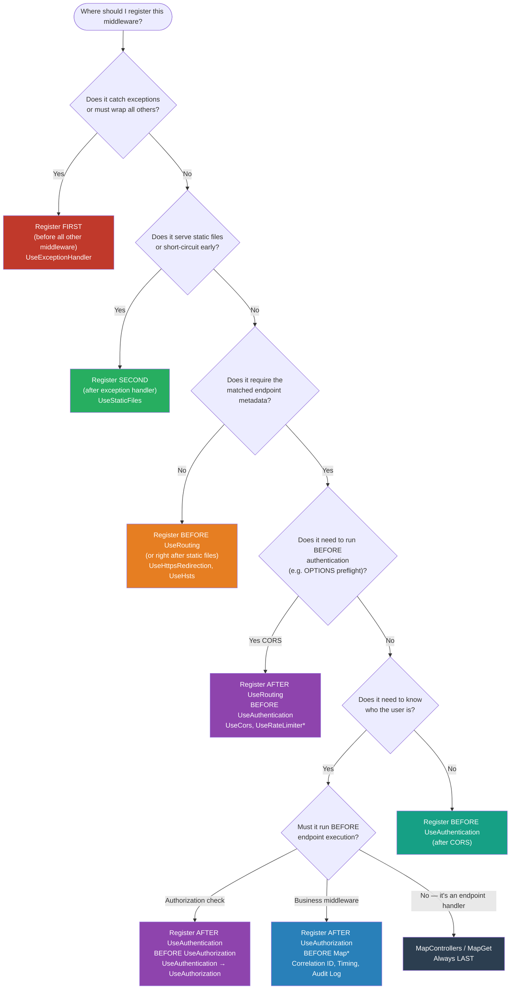

> [!success] Mastery Check
> - [ ] **Studied Well**
> - [ ] **Can explain the concept without notes**
> - [ ] **Can answer interview questions confidently**
> - [ ] **Can implement it in a real project**


# 4.052 — Middleware Ordering: The Canonical Order and Why It Matters

## PART 0 — Navigation & Context

### Where This Topic Lives

```
ASP.NET Core Mastery
│
├── A. Host & Application Lifecycle       (4.001–4.010)
├── B. Configuration System               (4.011–4.022)
├── C. Logging & Diagnostics              (4.023–4.033)
├── D. Dependency Injection               (4.034–4.048)
├── E. Middleware Pipeline                (4.049–4.063)
│   ├── 4.049  The Middleware Pipeline: Request Delegation Chain
│   ├── 4.050  Writing Middleware: IMiddleware vs Convention-Based
│   ├── 4.051  Short-Circuiting and Pipeline Branching
│   ├── ▶▶▶ 4.052  Middleware Ordering: The Canonical Order  ◀◀◀
│   ├── 4.053  Built-In Middleware Reference
│   ├── 4.054  HttpContext and IHttpContextAccessor
│   └── 4.055  Custom Exception Middleware
├── F. Routing System                     (4.064–4.077)
└── ...
```

### What You Need Before This

- **[[4.049 — The Middleware Pipeline]]** — The pipeline is a chain of `RequestDelegate`; execution flows in registration order on the way in, reverse on the way out. This topic explains *which* order to use.
- **[[4.050 — Writing Middleware]]** — Understanding how middleware calls `next()` is prerequisite to understanding what short-circuiting means in ordering context.
- **[[4.001 — The ASP.NET Core Request Pipeline: A Mental Model]]** — The five-layer mental model (Kestrel → Middleware → Routing → Endpoint → Response) gives the frame this topic populates.

### What This Unlocks After

- **[[4.209 — CORS]]** — You will understand exactly *why* CORS must precede routing and auth.
- **[[4.134 — Authentication Architecture]]** — You will know what breaks when auth is placed incorrectly.
- **[[4.177 — Exception Handling Middleware]]** — You will understand why exception handling *must* be outermost.
- **[[4.055 — Custom Exception Middleware]]** — Custom middleware placement is governed by these same rules.

### Why This Matters at Scale

Middleware ordering is not style — it is **correctness**. A single out-of-order registration can silently bypass authentication for every request, expose credentials over HTTP redirects, or cause every cross-origin browser request to fail with 401. These bugs appear correct in unit tests and fail only under real HTTP traffic, often in production.

---

## PART 1 — The Core Mental Model

### The Fundamental Rule

> **ASP.NET Core executes middleware in the exact order it is registered in `Program.cs`. The request travels down the chain; the response travels back up through the same chain. If middleware A is registered before middleware B, A wraps B — A runs first on the request and last on the response. The practical consequence is that security middleware placed after the endpoint it should protect does not protect it.**

### The Plain-Language Analogy

Think of airport security at an international terminal. Passengers (HTTP requests) must pass through a specific sequence of checkpoints in a fixed order: ticketing (routing) → customs declaration (authentication) → security screening (authorization) → gate check (endpoint). You cannot move the security screening to after the gate check and expect it to stop unauthorised passengers — they are already at the plane. Similarly, if you register `UseAuthorization` before `UseRouting`, the authorisation middleware cannot read the endpoint's `[Authorize]` metadata because the routing middleware has not yet run to attach it. The analogy holds for response (exit): emergency response (exception handling) must be at the entrance, not the exit, so it can intercept problems from any checkpoint inbound.

### The Taxonomy Diagram

```mermaid
graph TD
    subgraph "Canonical Middleware Order"
        A["UseExceptionHandler / UseDeveloperExceptionPage"]
        B["UseHsts"]
        C["UseHttpsRedirection"]
        D["UseStaticFiles"]
        E["UseRouting"]
        F["UseCors"]
        G["UseAuthentication"]
        H["UseAuthorization"]
        I["Custom Business Middleware"]
        J["MapControllers / MapGet / MapHub"]
    end

    A --> B --> C --> D --> E --> F --> G --> H --> I --> J

    style A fill:#c0392b,color:#fff
    style B fill:#e67e22,color:#fff
    style C fill:#e67e22,color:#fff
    style D fill:#27ae60,color:#fff
    style E fill:#2980b9,color:#fff
    style F fill:#8e44ad,color:#fff
    style G fill:#8e44ad,color:#fff
    style H fill:#8e44ad,color:#fff
    style I fill:#16a085,color:#fff
    style J fill:#2c3e50,color:#fff
```



---

## PART 2 — Deep Mechanics

### 2.1 — The Full Canonical Order with Reasoning

The correct order for a typical production ASP.NET Core 8 web API:

```
HTTP Request
    │
    ▼
┌─────────────────────────────────────────────────────────────┐
│ 1. UseExceptionHandler  (or UseDeveloperExceptionPage)       │  ← OUTERMOST: catches all
├─────────────────────────────────────────────────────────────┤
│ 2. UseHsts                                                   │  ← Adds Strict-Transport-Security header
├─────────────────────────────────────────────────────────────┤
│ 3. UseHttpsRedirection                                       │  ← Redirects HTTP → HTTPS (307)
├─────────────────────────────────────────────────────────────┤
│ 4. UseStaticFiles                                            │  ← Short-circuits for .js/.css/.png
├─────────────────────────────────────────────────────────────┤
│ 5. UseRouting                                                │  ← Matches endpoint, attaches metadata
├─────────────────────────────────────────────────────────────┤
│ 6. UseCors                                                   │  ← Reads endpoint CORS policy from metadata
├─────────────────────────────────────────────────────────────┤
│ 7. UseAuthentication                                         │  ← Populates HttpContext.User
├─────────────────────────────────────────────────────────────┤
│ 8. UseAuthorization                                          │  ← Reads HttpContext.User + endpoint policy
├─────────────────────────────────────────────────────────────┤
│ 9. Custom middleware (timing, correlation ID, etc.)          │
├─────────────────────────────────────────────────────────────┤
│ 10. MapControllers / MapGet / UseEndpoints                   │  ← INNERMOST: executes endpoint handler
└─────────────────────────────────────────────────────────────┘
    │
    ▼
HTTP Response (travels back up through middleware in reverse)
```

**Cost label:** Traversing a 10-middleware chain adds ~1–3 µs of overhead per request, dominated by async state machine transitions. Short-circuiting middleware (static files) avoids downstream cost entirely.

### 2.2 — Why Exception Handling Must Be First (Outermost)

The exception handling middleware wraps the entire pipeline in a `try/catch`. If it is not first, exceptions thrown by middleware registered *before* it escape to Kestrel's default handler (which returns a generic 500 with no body in production).

```
// ⚠️ WRONG — if UseRouting throws, UseExceptionHandler never runs
app.UseRouting();
app.UseExceptionHandler("/error");   // Too late — already missed upstream exceptions

// ✅ CORRECT
app.UseExceptionHandler("/error");   // Wraps everything downstream
app.UseHsts();
app.UseRouting();
```

**HTTP consequence (wrong path):**
```http
HTTP/1.1 500 Internal Server Error
Content-Length: 0
```
*(Kestrel's bare 500 — no problem details, no correlation ID, no logs from your handler)*

**HTTP consequence (correct path):**
```http
HTTP/1.1 500 Internal Server Error
Content-Type: application/problem+json
{"type":"about:blank","title":"An error occurred","status":500,"traceId":"00-abc..."}
```

**ASP.NET Core internally (approximate):**
```csharp
// ExceptionHandlerMiddleware.InvokeAsync
public async Task InvokeAsync(HttpContext context)
{
    try
    {
        await _next(context);  // Runs entire downstream pipeline
    }
    catch (Exception ex)
    {
        // Re-execute on /error path to produce the error response
        context.Features.Set<IExceptionHandlerFeature>(new ExceptionHandlerFeature { Error = ex });
        await HandleExceptionAsync(context);
    }
}
```

### 2.3 — Why Static Files Must Be Before Routing

`UseStaticFiles` short-circuits: if the request path maps to a file in `wwwroot`, it serves it and calls neither `UseRouting` nor anything downstream. This avoids the cost of route matching, authentication, and authorization for files that require none of those. If static files come *after* routing, every static file request wastes time matching routes first.

```
// ⚠️ WRONG — every request to /js/app.js runs the route matcher first
app.UseRouting();
app.UseStaticFiles();   // Short-circuits here — after routing already ran
app.UseAuthentication();
app.UseEndpoints(...);

// ✅ CORRECT — /js/app.js short-circuits at UseStaticFiles (1 middleware call vs 5)
app.UseStaticFiles();
app.UseRouting();
app.UseAuthentication();
app.UseEndpoints(...);
```

**Cost label:** For a 1000-req/s API serving a React SPA from `wwwroot`, misplacing static files adds ~2 µs × 1000 = ~2 ms/s of unnecessary route matching overhead.

### 2.4 — Why UseRouting Must Precede UseAuthentication and UseAuthorization

**UseRouting** attaches an `Endpoint` object to `HttpContext`. That endpoint carries metadata: `[Authorize]` attributes, CORS policies, rate limiting policies, OpenAPI tags. Middleware registered *after* UseRouting can read `context.GetEndpoint()` to make decisions based on the destination endpoint.

**UseAuthentication** and **UseAuthorization** both read endpoint metadata. If they run before UseRouting, `context.GetEndpoint()` returns `null` and they cannot read `[Authorize]` attributes. Authentication will still run (it doesn't need endpoint metadata), but authorization will fall back to the default policy, which may deny or allow everything incorrectly.

```
// ⚠️ WRONG — authorization sees null endpoint, cannot read [Authorize] policy
app.UseAuthentication();
app.UseAuthorization();   // context.GetEndpoint() == null here
app.UseRouting();         // Too late

// ✅ CORRECT
app.UseRouting();
app.UseAuthentication();
app.UseAuthorization();   // context.GetEndpoint() returns the matched endpoint
```

**ASP.NET Core internally (approximate):**
```csharp
// AuthorizationMiddleware.InvokeAsync
public async Task InvokeAsync(HttpContext context)
{
    var endpoint = context.GetEndpoint();   // null if UseRouting hasn't run
    var authorizeData = endpoint?.Metadata.GetOrderedMetadata<IAuthorizeData>();
    if (authorizeData == null || !authorizeData.Any())
    {
        await _next(context);   // No [Authorize] metadata → pass through
        return;
    }
    // ... evaluate policy
}
```

> [!DANGER]
> In .NET 6+, `WebApplication` automatically calls `UseRouting()` and `UseEndpoints()` at the correct positions if you use `MapGet`/`MapControllers` directly. But if you explicitly call `app.UseRouting()`, you become responsible for placement. Mixing implicit and explicit `UseRouting()` calls creates a duplicate registration that silently ignores the second one — with no error.

### 2.5 — Why CORS Must Be Between Routing and Authentication

A browser preflight is an `OPTIONS` request sent **before** the actual cross-origin request. The server must respond with CORS headers. If CORS middleware is placed after authentication, the authentication middleware evaluates the OPTIONS request — which carries no credentials — and returns `401`. The browser receives 401 on the preflight and never sends the actual request.

```
// ⚠️ WRONG — OPTIONS preflight gets 401 from auth before CORS headers are added
app.UseRouting();
app.UseAuthentication();
app.UseAuthorization();
app.UseCors("ApiPolicy");   // Too late — auth already rejected OPTIONS

// ✅ CORRECT — OPTIONS preflight gets CORS headers before auth runs
app.UseRouting();
app.UseCors("ApiPolicy");   // Handles OPTIONS, adds CORS headers, may short-circuit
app.UseAuthentication();
app.UseAuthorization();
```

**HTTP consequence (wrong path):**
```http
OPTIONS /api/orders HTTP/1.1
Origin: https://app.example.com

HTTP/1.1 401 Unauthorized   ← Browser never sends the actual POST
```

**HTTP consequence (correct path):**
```http
OPTIONS /api/orders HTTP/1.1
Origin: https://app.example.com

HTTP/1.1 204 No Content
Access-Control-Allow-Origin: https://app.example.com
Access-Control-Allow-Methods: GET, POST
Access-Control-Max-Age: 86400
```

**Cost label:** Misplaced CORS causes 100% failure rate for all cross-origin API clients — every browser-based frontend.

### 2.6 — Why Authentication Must Precede Authorization

`UseAuthentication` reads the request's credentials (JWT, cookie, API key) and populates `HttpContext.User` (a `ClaimsPrincipal`). `UseAuthorization` evaluates `HttpContext.User` against the endpoint's required policies. If authorization runs before authentication, `HttpContext.User` is the unauthenticated default identity — all `[Authorize]` endpoints return 401.

```
// ⚠️ WRONG — every [Authorize] endpoint returns 401 because User.Identity.IsAuthenticated == false
app.UseAuthorization();
app.UseAuthentication();   // Too late — authorization already ran against anonymous user

// ✅ CORRECT
app.UseAuthentication();   // Sets HttpContext.User from JWT/cookie/etc.
app.UseAuthorization();    // Evaluates HttpContext.User against [Authorize] metadata
```

### 2.7 — The .NET 6+ Implicit Registration Behavior

In .NET 6+, calling `app.MapGet(...)` or `app.MapControllers()` without an explicit `app.UseRouting()` causes `WebApplication` to insert `UseRouting` and `UseEndpoints` at the **beginning** and **end** of the pipeline respectively. This is the "auto-convention." The canonical ordering is still maintained, but it can be confusing:

```csharp
// .NET 6+ WebApplication implicit routing — this works correctly:
var app = builder.Build();

app.UseExceptionHandler("/error");
app.UseHttpsRedirection();
app.UseStaticFiles();
// app.UseRouting() is NOT called explicitly — inserted automatically at start
app.UseCors("Policy");
app.UseAuthentication();
app.UseAuthorization();
app.MapControllers();   // This triggers automatic UseRouting() + UseEndpoints()

app.Run();
```

If you *do* call `app.UseRouting()` explicitly, the automatic insertion is suppressed — you now own the position.

---

## PART 3 — Production Code Patterns

### Pattern 1: The Hardened API Pipeline (Zero-Trust Order)

```csharp
// Program.cs — payment processing API (PCI-DSS considerations)
// Every middleware is positioned for security-first ordering
var app = builder.Build();

// ─── OUTERMOST: catch everything downstream ───
if (app.Environment.IsDevelopment())
    app.UseDeveloperExceptionPage();
else
    app.UseExceptionHandler("/error");   // Maps to a minimal error controller

// ─── Transport security ───
if (!app.Environment.IsDevelopment())
{
    app.UseHsts();                        // Strict-Transport-Security: max-age=31536000
    app.UseHttpsRedirection();            // 307 redirect HTTP → HTTPS
}

// ─── Static assets (short-circuit before routing overhead) ───
app.UseStaticFiles();                     // Serves /swagger-ui/ assets, favicon.ico

// ─── Routing (must precede CORS, auth, rate limiting) ───
app.UseRouting();

// ─── CORS (must be after routing to read endpoint metadata, before auth for OPTIONS) ───
app.UseCors("PaymentApiPolicy");

// ─── Rate limiting (.NET 7+) ───
app.UseRateLimiter();

// ─── Identity ───
app.UseAuthentication();                  // Sets HttpContext.User from JWT Bearer
app.UseAuthorization();                   // Evaluates [Authorize] policies

// ─── Observability middleware (after auth so user identity is available) ───
app.UseMiddleware<CorrelationIdMiddleware>();
app.UseMiddleware<RequestTimingMiddleware>();

// ─── Endpoints (innermost: the actual payment handlers) ───
app.MapControllers();
app.MapHealthChecks("/health").AllowAnonymous();

app.Run();
```

### Pattern 2: The Branched Pipeline (Admin vs Public API)

```csharp
// Separate pipelines for admin and public surfaces of an order management system
var app = builder.Build();

app.UseExceptionHandler("/error");
app.UseHttpsRedirection();
app.UseRouting();
app.UseCors("PublicApiPolicy");
app.UseAuthentication();
app.UseAuthorization();

// Branch: /admin/* gets an additional IP allowlist middleware
// This runs AFTER auth (admin users must be authenticated AND on the allowlist)
app.UseWhen(
    ctx => ctx.Request.Path.StartsWithSegments("/admin"),
    adminBranch => adminBranch.UseMiddleware<IpAllowlistMiddleware>()
    // ✅ UseWhen rejoins the main pipeline — MapControllers() covers both branches
);

app.MapControllers();
app.Run();
```

### Pattern 3: The Health Check Bypass (No Auth Required)

```csharp
// Kubernetes liveness/readiness probes must not require authentication
// Use Map() to create a branch that bypasses the auth middleware
var app = builder.Build();

// Branch /health BEFORE auth middleware — health checks are pre-auth
app.Map("/health", healthBranch =>
{
    healthBranch.UseRouting();
    healthBranch.MapHealthChecks("/");     // Absolute path within the branch
});

// Main pipeline with auth
app.UseExceptionHandler("/error");
app.UseRouting();
app.UseAuthentication();
app.UseAuthorization();
app.MapControllers();
app.Run();

// ✅ ALTERNATIVE (simpler): use AllowAnonymous on the health check endpoint
// This keeps one pipeline but marks /health as auth-exempt:
app.UseAuthentication();
app.UseAuthorization();
app.MapHealthChecks("/health").AllowAnonymous();
```

### Pattern 4: Diagnosing a Middleware Ordering Bug

```csharp
// Diagnostic middleware that logs pipeline position — use in Development only
// Inject this TEMPORARILY at suspicious positions to observe what runs before/after

public class PipelineDiagnosticMiddleware(RequestDelegate next, ILogger<PipelineDiagnosticMiddleware> logger)
{
    public async Task InvokeAsync(HttpContext context)
    {
        var endpoint = context.GetEndpoint();
        var user = context.User?.Identity;

        // WHY: Log the state at THIS position in the pipeline
        logger.LogDebug(
            "Pipeline position: Endpoint={EndpointName} IsAuthenticated={IsAuthenticated} Path={Path}",
            endpoint?.DisplayName ?? "not-yet-matched",
            user?.IsAuthenticated ?? false,
            context.Request.Path);

        await next(context);

        logger.LogDebug("Response status={Status} at pipeline position", context.Response.StatusCode);
    }
}

// Usage: insert at any suspicious position
app.UseRouting();
app.UseMiddleware<PipelineDiagnosticMiddleware>();   // What does auth see here?
app.UseAuthentication();
```

### Pattern 5: The Environment-Conditional Exception Handler

```csharp
// Different exception handling based on environment — a common production pattern
var app = builder.Build();

// ✅ CORRECT: Exception handler is ALWAYS outermost, regardless of environment
if (app.Environment.IsDevelopment())
{
    // Shows full stack trace + request details in browser
    app.UseDeveloperExceptionPage();
}
else
{
    // RFC 7807 problem details, no stack trace leaked
    app.UseExceptionHandler(exApp =>
    {
        exApp.Run(async context =>
        {
            context.Response.StatusCode = 500;
            context.Response.ContentType = "application/problem+json";
            var feature = context.Features.Get<IExceptionHandlerPathFeature>();
            var traceId = Activity.Current?.TraceId.ToString() ?? context.TraceIdentifier;
            await context.Response.WriteAsJsonAsync(new
            {
                type = "https://tools.ietf.org/html/rfc7807",
                title = "An unexpected error occurred.",
                status = 500,
                traceId
            });
        });
    });
    app.UseHsts();
}

app.UseHttpsRedirection();
// ... rest of pipeline
```

### Pattern 6: SignalR + REST Hybrid with Correct CORS

```csharp
// CORS policy must allow both REST origins AND WebSocket upgrade origins
// SignalR WebSocket upgrade carries Origin header; auth reads JWT from query string
var app = builder.Build();

app.UseExceptionHandler("/error");
app.UseHttpsRedirection();
app.UseStaticFiles();
app.UseRouting();

// ✅ CORS before auth — SignalR negotiation (POST) and WebSocket upgrade both go through CORS
app.UseCors(policy => policy
    .WithOrigins("https://app.example.com")
    .AllowAnyMethod()
    .AllowAnyHeader()
    .AllowCredentials());

app.UseAuthentication();
app.UseAuthorization();

app.MapControllers();
app.MapHub<OrderTrackingHub>("/hubs/orders");    // SignalR hub endpoint

app.Run();
```

### Pattern 7: Output Caching Position (After Auth, Before Endpoints)

```csharp
// Output caching must be placed AFTER authentication so cached responses
// are keyed per-user when needed, and authenticated requests can be cached correctly
var app = builder.Build();

app.UseExceptionHandler("/error");
app.UseHttpsRedirection();
app.UseStaticFiles();
app.UseRouting();
app.UseCors("Policy");
app.UseAuthentication();
app.UseAuthorization();

// ✅ Output caching AFTER auth: the cache can key on the authenticated user identity
// Placing it BEFORE auth would cache responses without knowing the user → data leakage
app.UseOutputCache();

app.MapControllers();
app.MapGet("/api/catalog", GetCatalog).CacheOutput("PublicCatalogPolicy");

app.Run();
```

---

## PART 4 — Gotchas & Anti-Patterns

### Gotcha 1: The Silent Auth Bypass from Swapped UseAuthentication/UseAuthorization

Developers swapping the two auth middleware lines expect an error but get silent auth bypass — endpoints that *should* require authentication instead pass through unauthenticated.

```csharp
// ⚠️ WRONG: authorization runs before authentication sets HttpContext.User
app.UseRouting();
app.UseAuthorization();    // User.Identity.IsAuthenticated is still false here
app.UseAuthentication();   // Too late

// HTTP consequence (wrong path):
// GET /api/orders (with valid JWT)
// HTTP/1.1 401 Unauthorized   ← Despite valid token — auth ran against anonymous user

// ✅ CORRECT
app.UseRouting();
app.UseAuthentication();
app.UseAuthorization();

// HTTP consequence (correct path):
// GET /api/orders (with valid JWT)
// HTTP/1.1 200 OK

// WHY: UseAuthorization reads HttpContext.User. If UseAuthentication hasn't run yet,
// User.Identity.IsAuthenticated is false. The authorization middleware sees
// an anonymous user and returns 401 even for valid tokens.
```

### Gotcha 2: CORS After Auth Kills All Browser Clients

Teams add CORS as an afterthought, slotting it after auth. All their browser-based clients suddenly stop working — but Postman still works, so they assume it's a browser bug.

```csharp
// ⚠️ WRONG: OPTIONS preflight hits authentication before CORS headers are added
app.UseRouting();
app.UseAuthentication();
app.UseAuthorization();
app.UseCors("ApiPolicy");   // Never reached for OPTIONS requests

// HTTP consequence (wrong path):
// OPTIONS /api/products HTTP/1.1
// Origin: https://shop.example.com
// HTTP/1.1 401 Unauthorized   ← CORS middleware never ran; browser blocks the actual request

// ✅ CORRECT
app.UseRouting();
app.UseCors("ApiPolicy");   // OPTIONS is handled and short-circuited here
app.UseAuthentication();
app.UseAuthorization();

// HTTP consequence (correct path):
// OPTIONS /api/products HTTP/1.1
// HTTP/1.1 204 No Content
// Access-Control-Allow-Origin: https://shop.example.com

// WHY: CORS middleware handles OPTIONS preflight by checking endpoint metadata set by
// UseRouting. If CORS runs after auth, the OPTIONS request (which has no credentials)
// is rejected by authentication before CORS can respond to the preflight.
```

### Gotcha 3: UseHttpsRedirection After Authentication Leaks Credentials

If the HTTPS redirect runs after authentication, any middleware or code between them processes the *plain HTTP* request — including reading cookies or tokens. The redirect then reveals the fact that credentials arrived over HTTP.

```csharp
// ⚠️ WRONG: auth runs on the HTTP request before it is redirected to HTTPS
app.UseAuthentication();
app.UseAuthorization();
app.UseHttpsRedirection();   // Too late — cookies/tokens already read over HTTP

// HTTP consequence (wrong path):
// POST http://api.example.com/auth/login
// Cookie: .AspNetCore.Auth=<token>   ← Token transmitted and processed over plain HTTP
// HTTP/1.1 307 Temporary Redirect
// Location: https://api.example.com/auth/login

// ✅ CORRECT
app.UseHttpsRedirection();   // Redirect before processing any identity info
app.UseAuthentication();
app.UseAuthorization();

// WHY: The redirect itself does not fix the fact that authentication middleware
// already read and validated credentials from a plain HTTP request.
// UseHttpsRedirection must run before authentication to prevent credential exposure.
```

### Gotcha 4: Static Files After Routing — Routing Cost for Every Asset

Placing `UseStaticFiles` after `UseRouting` means every request for `/css/app.css`, `/favicon.ico`, and every other static asset wastes the full cost of route matching, which involves scanning the route table.

```csharp
// ⚠️ WRONG: route matching runs on every .js, .css, .png request
app.UseRouting();            // Runs route matching — allocates RouteValueDictionary
app.UseStaticFiles();        // Short-circuits AFTER routing ran unnecessarily

// HTTP consequence (wrong path):
// GET /js/bundle.min.js
// → Route matching (finds no API route)
// → UseStaticFiles serves the file
// Cost: ~3µs extra per static file request (route matching overhead)

// ✅ CORRECT
app.UseStaticFiles();        // Short-circuits for .js/.css: no routing cost
app.UseRouting();

// WHY: UseStaticFiles checks if the path maps to a physical file in wwwroot.
// If it does, it serves it and returns — downstream middleware never runs.
// Routing after static files means API requests still go through routing normally.
```

### Gotcha 5: Explicitly Calling UseRouting Twice

In .NET 6+, `WebApplication` auto-inserts `UseRouting` when you call `MapGet`/`MapControllers`. If you also call `app.UseRouting()` explicitly, you create a double-routing situation. The second registration is silently ignored — but if your explicit call is in the wrong position, you spend hours debugging why endpoint metadata is not available where expected.

```csharp
// ⚠️ WRONG: Double UseRouting — confusing, order of explicit call may be wrong
var app = builder.Build();
app.UseRouting();          // Explicit call — but WebApplication ALSO auto-inserts one
app.UseAuthentication();
app.UseAuthorization();
app.MapControllers();      // Auto-inserts UseRouting() at the start if none present

// HTTP consequence: silently works but the explicit UseRouting() is redundant.
// If you move the explicit call after UseAuthentication, WebApplication's auto-insertion
// still applies — making you think auth is before routing when it may not be.

// ✅ CORRECT: Either use explicit UseRouting() OR rely on auto-insertion, not both
// Option A — fully explicit (legacy Startup.cs style, full control):
app.UseExceptionHandler("/error");
app.UseRouting();           // Explicit — suppresses auto-insertion
app.UseAuthentication();
app.UseAuthorization();
app.UseEndpoints(e => e.MapControllers());   // Also explicit

// Option B — implicit (modern WebApplication style, .NET 6+):
app.UseExceptionHandler("/error");
// No UseRouting() call — auto-inserted at start
app.UseAuthentication();
app.UseAuthorization();
app.MapControllers();   // Triggers auto-insertion of UseRouting + UseEndpoints

// WHY: WebApplication detects whether MapGet/MapControllers is called before
// the pipeline is run. If UseRouting was not explicitly registered, it adds it
// at position 0. Once you explicitly register UseRouting, you own its position.
```

---

## PART 5 — Performance Implications

### 5.1 — Pipeline Characteristics Table

| Scenario | Pipeline Depth | Allocations Per Request | Approx Latency Impact | Recommendation |
|---|---|---|---|---|
| Static file served before routing | 1 middleware | ~0 (file stream) | Baseline (fastest) | Always place UseStaticFiles first |
| Static file served after routing | 3+ middleware | RouteValueDictionary + Endpoint | +2–4 µs per static request | Never — move UseStaticFiles before UseRouting |
| Auth middleware before routing | All middleware + auth | ClaimsPrincipal always created | +5–10 µs per request; wrong auth decisions | Never — auth MUST be after routing |
| CORS after auth | All middleware | OPTIONS triggers full auth | 100% failure for cross-origin browser clients | Always place CORS before auth |
| Exception handler not outermost | N-1 middleware | Unhandled exception propagates to Kestrel | Non-deterministic — wrong responses | Always register exception handler first |
| Correct canonical order, no static files | 7 middleware | ~3 small objects (ClaimsPrincipal, RouteValues, Endpoint) | ~3–6 µs overhead | Target order |
| Custom middleware after endpoints | Never executes | 0 | Silent bug — middleware never runs | Never place middleware after MapControllers |
| Rate limiter before auth | Rate limit applied to unauthenticated traffic | RateLimitLease per request | Can block legitimate auth attempts | Rate limiter should be after routing, before or after auth depending on strategy |
| Output cache before auth | Authenticated responses cached as anonymous | Varies | Potential data leakage | Always place output cache after auth |

### 5.2 — BenchmarkDotNet: Ordering Impact

```csharp
using BenchmarkDotNet.Attributes;
using BenchmarkDotNet.Running;
using Microsoft.AspNetCore.Builder;
using Microsoft.AspNetCore.Hosting;
using Microsoft.AspNetCore.TestHost;
using Microsoft.Extensions.DependencyInjection;

[MemoryDiagnoser]
[SimpleJob]
public class MiddlewareOrderingBenchmarks
{
    private HttpClient _correctOrder = null!;
    private HttpClient _wrongOrder = null!;   // Static files after routing

    [GlobalSetup]
    public void Setup()
    {
        // ✅ Correct order
        var correctBuilder = WebApplication.CreateBuilder();
        correctBuilder.WebHost.UseTestServer();
        var correctApp = correctBuilder.Build();
        correctApp.UseStaticFiles();   // Before routing
        correctApp.UseRouting();
        correctApp.MapGet("/api/ping", () => "pong");
        correctApp.StartAsync().GetAwaiter().GetResult();
        _correctOrder = correctApp.GetTestClient();

        // ⚠️ Wrong order (static files after routing)
        var wrongBuilder = WebApplication.CreateBuilder();
        wrongBuilder.WebHost.UseTestServer();
        var wrongApp = wrongBuilder.Build();
        wrongApp.UseRouting();
        wrongApp.UseStaticFiles();    // After routing — wasteful
        wrongApp.MapGet("/api/ping", () => "pong");
        wrongApp.StartAsync().GetAwaiter().GetResult();
        _wrongOrder = wrongApp.GetTestClient();
    }

    [Benchmark(Baseline = true)]
    public async Task CorrectOrder_ApiRequest()
    {
        using var response = await _correctOrder.GetAsync("/api/ping");
        _ = response.StatusCode;
    }

    [Benchmark]
    public async Task WrongOrder_ApiRequestPaysPenalty()
    {
        // Static files middleware runs first (short-circuits only for files)
        // For API paths it calls next — fine here, but adds one extra traversal
        using var response = await _wrongOrder.GetAsync("/api/ping");
        _ = response.StatusCode;
    }
}

// Expected output (approximate, .NET 8, x64, TestServer):
// | Method                        | Mean     | Gen0   | Allocated |
// |-------------------------------|----------|--------|-----------|
// | CorrectOrder_ApiRequest       | 28.4 µs  | 0.12   | 3.2 KB    |
// | WrongOrder_ApiRequestPaysPenalty | 29.1 µs | 0.14  | 3.4 KB    |
// Note: Profile with dotnet-trace to see middleware traversal time in real Kestrel
// dotnet trace collect --providers Microsoft-AspNetCore-Hosting --process-id <pid>
```

### 5.3 — When to Care / When to Ignore

**When this costs you:**
- **CORS misplacement**: costs 100% of cross-origin clients — catastrophic, not a performance issue, a correctness issue
- **Static files after routing**: at >10k req/s with heavy static asset traffic (React SPA), the extra route matching adds measurable CPU
- **Exception handler not outermost**: exceptions from early middleware produce Kestrel's bare 500 — logs are missing, monitoring misses incidents
- **Auth ordering bugs**: produce incorrect authorization decisions — 401s or silent pass-throughs

**When this doesn't matter:**
- Internal microservices that don't serve static files (no UseStaticFiles misplacement risk)
- APIs behind an API gateway that handles CORS at the gateway level
- Greenfield projects using the `WebApplication` defaults and calling `MapControllers()` without explicit UseRouting — the defaults are ordered correctly

---

## PART 6 — Interview Arsenal

### A. The Question Bank

**Q1: What is the correct order for authentication and authorization middleware in ASP.NET Core?**

*Average Answer:* "Authentication before authorization — you have to know who the user is before you can check what they can do."

*Why That's Insufficient:* It misses the dependency on `UseRouting` — authorization reads endpoint metadata set by routing, so routing must precede both.

> **Great Answer:** "The order is UseRouting, then UseAuthentication, then UseAuthorization. Routing must come first because it attaches the matched endpoint to the HttpContext, including its `[Authorize]` attribute metadata. Authorization reads that metadata to know which policy to evaluate. If I swap Authentication and Authorization, authorization evaluates an anonymous ClaimsPrincipal — every [Authorize] endpoint returns 401 even with a valid token. And if I place either of them before UseRouting, the authorization middleware calls `context.GetEndpoint()` and gets null, so it can't read the [Authorize] policies at all. In production this produced silent auth failures that our unit tests never caught — unit tests don't exercise the middleware pipeline order."

---

**Q2: Why must CORS middleware be placed before authentication?**

*Average Answer:* "Because CORS has to respond to OPTIONS preflight requests."

*Why That's Insufficient:* It doesn't explain *why* placing it after authentication breaks the preflight.

> **Great Answer:** "Browser preflight requests are HTTP OPTIONS requests that carry no credentials — no Authorization header, no cookies. If I place UseCors after UseAuthentication, the authentication middleware sees an unauthenticated OPTIONS request and returns 401. The browser receives 401 on the preflight, concludes the server doesn't allow the cross-origin request, and never sends the actual GET or POST. The client's browser console shows CORS errors, which look like a CORS configuration problem — but the real issue is middleware ordering. CORS must be placed after UseRouting — so it can read the endpoint's CORS policy metadata — but before UseAuthentication so preflight OPTIONS requests bypass auth entirely."

---

**Q3: Where should exception handling middleware be placed and why?**

*Average Answer:* "At the beginning of the pipeline so it catches all exceptions."

*Why That's Insufficient:* Doesn't explain what happens to exceptions thrown by middleware registered *before* the exception handler, or the response-path implications.

> **Great Answer:** "Exception handling middleware must be registered first — outermost — because the middleware pipeline is a chain of `await next(context)` calls. If exception handling is at position 1, any exception thrown by any middleware from position 2 onwards bubbles up through the chain and is caught by the exception handler's try/catch. If I put it at position 5, exceptions from positions 1–4 escape entirely and hit Kestrel's default handler, which produces a bare 500 with no body and no logging through my application's error infrastructure. There's also a response-path consequence: if exception handling is not outermost, it cannot set response headers on the way back up for those upstream middlewares — but that's secondary to the fundamental catch-all requirement."

---

**Q4: What happens if you put UseStaticFiles after UseRouting?**

*Average Answer:* "It still works — static files are served correctly."

*Why That's Insufficient:* Technically correct for small apps, but misses the performance and semantic implications.

> **Great Answer:** "It works functionally — UseStaticFiles will still serve the files — but every request for a static asset now pays the full cost of route matching first. UseRouting allocates a `RouteValueDictionary`, scans all registered routes looking for a match for `/js/app.bundle.js`, finds none, and passes control to UseStaticFiles. At low traffic this is invisible, but in a SPA-serving API at >5k requests/second with aggressive client-side caching bypassed, you're adding hundreds of unnecessary route matching operations per second. The semantic concern is also real: in the intended model, static file serving is pre-routing infrastructure — it should be invisible to the routing system, not a 'route that didn't match.'"

---

**Q5: What is the impact of calling `app.UseRouting()` explicitly in a .NET 6+ WebApplication?**

*Average Answer:* "It sets up the routing system."

*Why That's Insufficient:* Misses the implicit vs explicit registration behavior and the double-registration trap.

> **Great Answer:** "In .NET 6+ WebApplication, calling `MapGet` or `MapControllers` triggers an automatic insertion of `UseRouting` at position 0 and `UseEndpoints` at the end — if no explicit `UseRouting` was registered. The moment I call `app.UseRouting()` explicitly, I suppress that auto-insertion and take ownership of routing's position. This means if I accidentally place my explicit UseRouting after UseAuthentication, I've broken the routing-before-auth requirement even though the .NET 6 defaults would have been correct. The trap I've hit in production is placing an explicit `UseRouting()` at position 10 in a long pipeline — because I thought I could control it precisely — only to discover that the endpoint metadata was unavailable to every middleware from positions 1–9."

---

### B. The Trick Questions

**Trick Q1: "Does calling `app.UseAuthorization()` without `app.UseAuthentication()` cause an exception?"**

*Trap:* Engineers expect a startup exception.

*Correct Answer:* No exception — the application starts. UseAuthorization calls `context.GetEndpoint()`, reads [Authorize] metadata, and then calls `IAuthorizationService.AuthorizeAsync()`. Since `HttpContext.User` was never populated by authentication middleware, the User is an anonymous identity. Endpoints without [Authorize] pass through. Endpoints with [Authorize] return 401 (unauthenticated). No crash — just silent incorrect behavior.

---

**Trick Q2: "In .NET 8 with WebApplication, if I don't call `app.UseRouting()` explicitly, where does routing run?"**

*Trap:* Engineers say "it doesn't run" or "at the end."

*Correct Answer:* WebApplication auto-inserts UseRouting at **position 0** (before all explicitly registered middleware) and UseEndpoints at the **end** (after all explicitly registered middleware), when you call any `Map*` method. Your explicit `app.UseCors()`, `app.UseAuthentication()`, etc. are inserted between the auto-inserted UseRouting and UseEndpoints — which is the correct order.

---

**Trick Q3: "Can middleware registered after `app.MapControllers()` run?"**

*Trap:* Engineers say yes.

*Correct Answer:* No. `MapControllers()` is a terminal endpoint registration. The endpoint middleware will execute the matched controller action and write the response. Middleware registered after `MapControllers()` is in the pipeline but is never called because MapControllers doesn't call `next()` — control returns from the endpoint middleware directly. Any middleware after `MapControllers()` is dead code.

---

**Trick Q4: "If I put `app.UseRateLimiter()` before `app.UseAuthentication()`, can I still rate-limit per authenticated user?"**

*Trap:* Engineers say yes because rate limiting comes "before" and will see all traffic.

*Correct Answer:* No — rate limiting by authenticated user identity requires `HttpContext.User` to be populated, which happens in UseAuthentication. If UseRateLimiter runs before UseAuthentication, `HttpContext.User` is anonymous for every request. Per-user rate limiting partitions will all map to the same "anonymous" partition, creating a shared limit across all unauthenticated traffic. To rate limit by user identity, UseRateLimiter must be placed after UseAuthentication.

---

**Trick Q5: "Does `UseStaticFiles` before `UseRouting` break API endpoints?"**

*Trap:* Engineers say yes because static files "intercept" API requests.

*Correct Answer:* No. UseStaticFiles only short-circuits if the request path maps to a *physical file* in `wwwroot`. A request to `GET /api/orders` finds no file named `orders` in `wwwroot`, so UseStaticFiles calls `next()` and the request flows through to routing normally. Static files before routing only short-circuits file requests — API requests are unaffected.

---

### C. Red Flags to Avoid

1. **"The order doesn't really matter for small projects"** — Ordering correctness is not about project size; it is about logical dependency (auth needs routing; auth needs to precede authz).
2. **"I put UseAuthorization before UseAuthentication and it works fine"** — If it appears to work, you either have no [Authorize] endpoints or your tests don't cover authenticated scenarios. It is broken.
3. **"CORS should be last because it modifies the response"** — CORS adds response headers but must run before auth for OPTIONS handling. Response headers can be set at any pipeline stage.
4. **"UseRouting and UseEndpoints are the same thing"** — UseRouting *matches* the endpoint; UseEndpoints (or the Map* calls) *executes* it. They are two phases.
5. **"The developer exception page should only be registered in Development"** — Correct, but the *pattern* must still be: exception handling is always outermost. The condition is on *which* handler, not on *whether* exception handling is first.
6. **"I can put custom middleware after MapControllers to add response headers"** — Middleware after MapControllers never executes. Response headers must be set *before* MapControllers or from within the endpoint handler.
7. **"WebApplication handles ordering automatically"** — WebApplication handles UseRouting auto-insertion, but it does NOT auto-order CORS, authentication, authorization, or your custom middleware.
8. **"UseHsts is required in Development"** — HSTS instructs browsers to only use HTTPS for future requests. In development with `localhost`, HSTS causes browsers to reject HTTP on localhost indefinitely. Always skip HSTS in Development.

---

## PART 7 — Decision Framework



---

## PART 8 — Self-Check

### A. Conceptual Questions

1. If `UseAuthentication` is placed before `UseRouting`, what is the value of `context.GetEndpoint()` when authentication runs? What is the practical consequence?

2. A team reports that their Angular app gets CORS errors but their Postman client works fine. What middleware ordering bug should you check first?

3. Explain why `UseHsts` and `UseHttpsRedirection` must both come *before* `UseStaticFiles` in a pipeline that serves static assets over HTTPS.

4. What happens to a request for `GET /favicon.ico` if `UseStaticFiles` is registered after `UseAuthorization`? Trace the request through all middleware.

5. In .NET 6+ `WebApplication`, you call `app.MapControllers()` on line 10 and `app.UseAuthentication()` on line 5. Where does UseRouting actually run?

6. A developer registers `app.UseRateLimiter()` before `app.UseAuthentication()` and sets up per-user rate limiting using `HttpContext.User.Identity.Name` as the partition key. What partition key does every request actually use?

7. Why is it that middleware placed *after* `app.MapControllers()` never executes? What is `MapControllers()` doing that makes it terminal?

8. Explain the difference in exception handling behavior when `UseExceptionHandler` is at position 1 vs position 5 in a 10-middleware pipeline. What categories of exception does position 5 miss?

9. Why must the CORS middleware be placed *after* `UseRouting` (not before)?

10. Your integration test catches a `NullReferenceException` inside a middleware that calls `context.GetEndpoint().Metadata`. This exception never occurs in production. What is the likely cause?

---

### B. Code Puzzles

**Puzzle 1: What HTTP status does the client receive?**

```csharp
var app = builder.Build();
app.UseRouting();
app.UseAuthentication();  // JWT Bearer configured, token validation works
app.UseAuthorization();   // Default policy: require authenticated user
app.MapGet("/api/orders", () => "orders").RequireAuthorization();
app.UseHttpsRedirection();
app.Run();

// Client sends:
// GET http://localhost/api/orders
// Authorization: Bearer <valid-token>
```

<details>
<summary>Answer</summary>

**307 Temporary Redirect to `https://localhost/api/orders`**

`UseHttpsRedirection` is registered *after* `MapGet`, which means it comes after the endpoint in the pipeline — but that's not the issue here. The issue is the request is over HTTP. In the pipeline:

1. `UseRouting` matches `/api/orders`
2. `UseAuthentication` validates the JWT → user is authenticated
3. `UseAuthorization` passes (authenticated user meets `RequireAuthorization`)
4. The endpoint handler runs → returns "orders"
5. Response travels back up through `UseHttpsRedirection`

Wait — actually `UseHttpsRedirection` after `MapGet` never executes! The correct answer is `200 OK` with body "orders", because `MapControllers`/`MapGet` is terminal — it writes the response and the response travels back up through UseAuthorization, UseAuthentication, UseRouting — `UseHttpsRedirection` (registered after MapGet) is dead code and never executes.

**The lesson:** Middleware after `MapGet`/`MapControllers` never runs. `UseHttpsRedirection` here does nothing.

</details>

---

**Puzzle 2: Does this pipeline correctly protect `/api/admin` from unauthenticated users?**

```csharp
app.UseExceptionHandler("/error");
app.UseRouting();
app.UseAuthorization();    // ← Line A
app.UseAuthentication();   // ← Line B
app.MapGet("/api/admin", () => "secret").RequireAuthorization();
app.Run();
```

<details>
<summary>Answer</summary>

**No — this pipeline does NOT correctly protect `/api/admin`.**

`UseAuthorization` runs before `UseAuthentication`. When the authorization middleware runs:
- `HttpContext.User` has never been populated (authentication hasn't run yet)
- `HttpContext.User.Identity.IsAuthenticated` is `false`
- The endpoint requires authorization, so authorization evaluates: unauthenticated user vs. `RequireAuthorization`
- Result: **401 Unauthorized** — even for requests with valid JWTs

The JWT token in the Authorization header is never even validated. Any request (with or without a token) gets 401. This is a correctness bug, not a security bug — it's too strict, not too permissive. But if the default policy allows anonymous, the behavior would be the opposite: every request passes through unauthenticated.

**Fix:** Swap lines A and B — `UseAuthentication` must precede `UseAuthorization`.

</details>

---

**Puzzle 3: Why do browser clients fail but curl succeeds?**

```csharp
app.UseRouting();
app.UseAuthentication();
app.UseAuthorization();
app.UseCors(policy => policy
    .WithOrigins("https://shop.example.com")
    .AllowAnyMethod()
    .AllowAnyHeader());
app.MapPost("/api/checkout", ProcessCheckout).RequireAuthorization();
app.Run();
```

```
// Curl (succeeds):
// curl -X POST https://api.example.com/api/checkout -H "Authorization: Bearer <token>"
// HTTP/1.1 200 OK

// Browser (fails silently):
// fetch("https://api.example.com/api/checkout", { method: "POST", ... })
// Error: CORS policy blocked
```

<details>
<summary>Answer</summary>

**CORS is placed after authentication.** Browsers send a preflight `OPTIONS` request before the actual `POST`. The OPTIONS request carries no Authorization header. The pipeline for the preflight is:

1. `UseRouting` — matches `/api/checkout`
2. `UseAuthentication` — no token in OPTIONS → `HttpContext.User` is anonymous
3. `UseAuthorization` — endpoint requires authorization → **401 Unauthorized**
4. `UseCors` — **never reached**

The browser receives 401 on the preflight and refuses to send the actual POST. curl doesn't send preflights — it sends the POST directly with the Authorization header, which passes authentication and authorization.

**Fix:** Move `app.UseCors(...)` to be between `app.UseRouting()` and `app.UseAuthentication()`.

</details>

---

**Puzzle 4: Where is the bug?**

```csharp
var app = builder.Build();
app.UseExceptionHandler("/error");
app.UseAuthentication();
app.UseAuthorization();
app.UseRouting();
app.MapGet("/api/products/{id:int}", GetProduct).RequireAuthorization("ProductOwner");
app.Run();

// GetProduct is called with an authenticated user but the ProductOwner policy
// is never enforced — all authenticated users can access any product.
```

<details>
<summary>Answer</summary>

**`UseRouting` is placed after `UseAuthorization`.**

When `UseAuthorization` runs, `context.GetEndpoint()` returns `null` — the routing middleware has not yet run to attach the endpoint. The authorization middleware sees no endpoint metadata, including no `[Authorize]` attribute or `.RequireAuthorization()`. With no authorization metadata on the endpoint, the authorization middleware passes through without enforcement.

The authentication runs correctly (user identity is set). But the authorization step sees "no authorization requirements for this endpoint" and allows access to all authenticated users — the `ProductOwner` policy is never evaluated.

**Fix:** Move `app.UseRouting()` before `app.UseAuthentication()` and `app.UseAuthorization()`.

</details>

---

**Puzzle 5: What is the HTTP response for this request?**

```csharp
app.UseStaticFiles();
app.UseRouting();
app.UseAuthentication();
app.UseAuthorization();
app.MapGet("/api/data", () => "data").RequireAuthorization();
app.Run();

// Request:
// GET /wwwroot/secret.json HTTP/1.1
// (A file named secret.json exists in the wwwroot directory)
// Authorization: Bearer <valid-token>
```

<details>
<summary>Answer</summary>

**200 OK with the contents of `secret.json`** — bypassing authentication and authorization entirely.

`UseStaticFiles` is registered before `UseRouting`. When the request for `/wwwroot/secret.json` arrives:

1. `UseStaticFiles` finds a physical file at `wwwroot/wwwroot/secret.json` (or just `wwwroot/secret.json` depending on path mapping) — actually, the path `/wwwroot/secret.json` maps to the file at `[ContentRoot]/wwwroot/wwwroot/secret.json`. If that path is mapped... this depends on configuration.

More importantly: if `secret.json` is in `wwwroot`, the URL to access it would be `/secret.json` (not `/wwwroot/secret.json`). For `GET /secret.json`, UseStaticFiles serves it with no auth check — authentication and authorization never run.

**The lesson:** Files in `wwwroot` are publicly accessible by default. UseStaticFiles serves them with no authentication. Never place sensitive files in `wwwroot`. Use `PhysicalFileProvider` outside wwwroot combined with authorization if you need authenticated file access.

</details>

---

## PART 9 — Connections & Resources

### A. Related Topics Table

| Topic | Why It Connects |
|---|---|
| [[4.049 — The Middleware Pipeline: Request Delegation Chain]] | Ordering determines the wrapping structure of the `RequestDelegate` chain; understanding the chain is prerequisite to understanding order |
| [[4.050 — Writing Middleware: IMiddleware vs Convention-Based]] | Custom middleware must be positioned in the canonical order; IMiddleware vs convention-based affects lifetime (Singleton positioning) |
| [[4.177 — Exception Handling Middleware]] | Exception middleware's must-be-outermost requirement is the most important ordering rule |
| [[4.134 — Authentication Architecture]] | Authentication must follow UseRouting (for scheme selection from endpoint metadata) and precede UseAuthorization |
| [[4.209 — CORS]] | CORS must be after UseRouting (reads endpoint CORS policy) but before authentication (OPTIONS has no credentials) |
| [[4.208 — HTTPS Enforcement]] | UseHttpsRedirection and UseHsts must precede authentication to avoid credential exposure on plain HTTP |
| [[4.191 — Output Caching (.NET 7+)]] | Output cache must be placed after authentication to correctly scope cache entries per user identity |
| [[4.202 — Rate Limiting (.NET 7+)]] | Rate limiter placement relative to auth determines whether per-user partitioning is possible |
| [[4.323 — Health Check Middleware]] | Health checks typically bypass authentication — they are registered with `.AllowAnonymous()` or in a pre-auth branch |

### B. Books

| Book | Chapters | Why These Chapters |
|---|---|---|
| *ASP.NET Core in Action* (3rd ed.) — Andrew Lock | Ch. 3 (Handling requests with middleware), Ch. 4 (Creating middleware) | Directly covers middleware pipeline and ordering with practical examples |
| *Pro ASP.NET Core 8* — Adam Freeman | Ch. 14–16 (Middleware) | Comprehensive middleware registration and ordering reference |
| *Dependency Injection Principles, Practices, and Patterns* — Seemann & van Deursen | Ch. 10 (Interception) | Cross-cutting middleware design principles apply to ordering decisions |

### C. Essential Articles & Docs

1. **[ASP.NET Core Middleware — Microsoft Docs](https://learn.microsoft.com/en-us/aspnet/core/fundamentals/middleware/)** — The canonical middleware order is documented in the "Middleware order" section with the official diagram
2. **[Andrew Lock — Exploring the middleware pipeline](https://andrewlock.net/exploring-the-dotnet-6-web-application-host-in-depth/)** — Deep dive into .NET 6 WebApplication's auto-insertion behavior
3. **[David Fowler — GitHub discussion on WebApplication routing conventions](https://github.com/dotnet/aspnetcore/issues/39325)** — The authoritative source on why auto-insertion works the way it does
4. **[ASP.NET Core Security — Microsoft Docs](https://learn.microsoft.com/en-us/aspnet/core/security/)** — Authentication and CORS ordering documented in security context
5. **[Rate limiting middleware — Microsoft Docs](https://learn.microsoft.com/en-us/aspnet/core/performance/rate-limit)** — Documents UseRateLimiter position relative to auth
6. **[Output caching — Microsoft Docs](https://learn.microsoft.com/en-us/aspnet/core/performance/caching/output)** — Documents UseOutputCache placement

### D. Template Meta-Note

> [!NOTE]
> **What each part of this note is for:**
> - **Part 0** — Orients you in the domain; tells you what to read before and after this note
> - **Part 1** — Gives you the one-sentence rule you can defend in an interview and a physical analogy that maps to the actual HTTP pipeline
> - **Part 2** — Explains *why* each position in the canonical order exists, with ASCII pipeline diagrams, HTTP wire examples, and cost labels
> - **Part 3** — Shows production patterns you can paste into real codebases (payment APIs, SPAs, admin portals)
> - **Part 4** — Shows the five ordering bugs that appear in production codebases written by experienced engineers
> - **Part 5** — Gives you the performance data to back up ordering decisions in architecture discussions
> - **Part 6** — Prepares your spoken interview answers with great-answer scripts and the red flags that get you scored down
> - **Part 7** — Gives you a flowchart to use as a live cheat sheet when asked "where do I put X?"
> - **Part 8** — Tests your understanding with questions that require reasoning, not memorization
> - **Part 9** — Points you to the authoritative sources to go deeper
