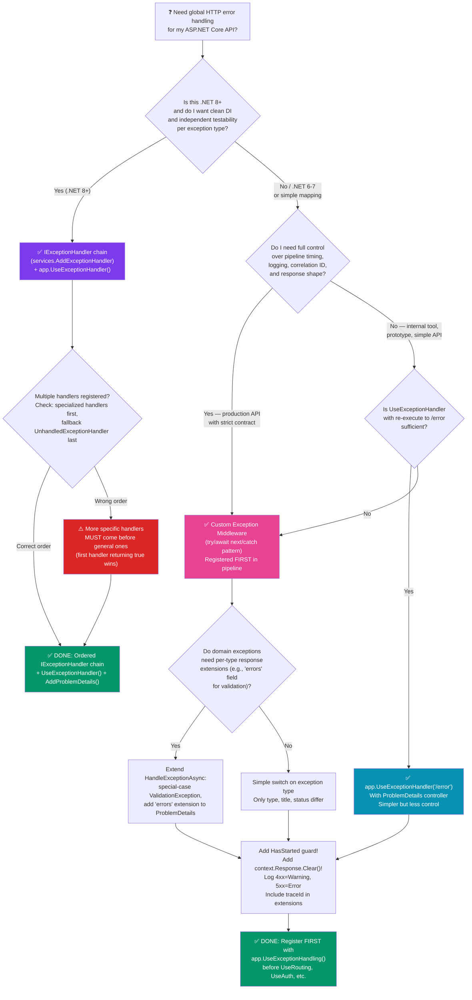

> [!success] Mastery Check
> - [ ] **Studied Well**
> - [ ] **Can explain the concept without notes**
> - [ ] **Can answer interview questions confidently**
> - [ ] **Can implement it in a real project**


# 4.055 — Custom Exception Middleware: Domain Exceptions to HTTP Responses

---

## PART 0 — Navigation & Context

### Where This Topic Lives in the ASP.NET Core Hierarchy

```
ASP.NET Core Mastery
└── Middleware Pipeline
    ├── 4.050 — Writing Middleware: IMiddleware vs Convention-Based
    ├── 4.052 — Middleware Ordering: The Canonical Order
    ├── 4.055 — Custom Exception Middleware ◄ YOU ARE HERE
    │   ├── Domain exception → HTTP status mapping
    │   ├── IProblemDetailsService integration (RFC 7807)
    │   ├── context.Response.HasStarted guard
    │   ├── Correlation ID propagation
    │   └── Dev vs. Production response shaping
    ├── 4.177 — UseExceptionHandler (built-in alternative)
    ├── 4.179 — Problem Details RFC 7807: IProblemDetailsService
    ├── 4.182 — IExceptionHandler Interface (.NET 8+)
    └── 4.183 — Correlation IDs
```

### What You Need Before This

1. **[[4.050 — Writing Middleware: IMiddleware vs Convention-Based]]** — You must know how to write convention-based middleware (`Invoke(HttpContext context, RequestDelegate next)`) and what `IMiddleware` buys you before building an exception interceptor.
2. **[[4.052 — Middleware Ordering: The Canonical Order]]** — Exception middleware must be the **first** (outermost) middleware registered. You need to know the canonical order cold.
3. **[[4.179 — Problem Details RFC 7807: IProblemDetailsService]]** — The correct response body shape for API errors is RFC 7807 `ProblemDetails`. You must understand `IProblemDetailsService` before integrating it into exception handling.
4. **[[4.183 — Correlation IDs]]** — Exception responses must carry a `traceId`/correlation ID. Know where `HttpContext.TraceIdentifier` comes from.

### What This Unlocks After

1. **[[4.182 — Global Exception Handler (.NET 8): IExceptionHandler Interface]]** — `IExceptionHandler` is the modern (.NET 8+) replacement for a monolithic catch-all; understanding the custom middleware pattern first makes you appreciate why the ordered chain design is better.
2. **[[4.177 — Exception Handling Middleware: UseExceptionHandler]]** — Knowing the custom pattern lets you reason about when `UseExceptionHandler` is sufficient and when you need to write your own.
3. **Centralized Observability** — Once exception middleware is in place, you add structured logging, OpenTelemetry span enrichment, and PagerDuty alerting into a single, auditable location.
4. **API Contract Guarantees** — A well-designed exception middleware is the enforcement layer for your error response contract: clients always receive `application/problem+json`, never an HTML error page or an unstructured JSON blob.

### Why This Topic Matters at Scale

> **At scale, the gap between a reliable API and a production incident is how consistently your domain exceptions are translated into structured, client-parseable HTTP responses.** Unhandled exceptions that bubble to Kestrel return 500 with an HTML error page to JSON clients; custom exception middleware is the difference between that and a machine-readable RFC 7807 body with the right status code, correlation ID, and zero stack-trace leakage in production.

---

## PART 1 — The Core Mental Model

### The Fundamental Rule

> **Custom exception middleware wraps the entire downstream pipeline in a try/catch, intercepts typed domain exceptions before they reach Kestrel's default error handling, and translates each exception type into a deterministic HTTP status code and RFC 7807 `ProblemDetails` body — provided the response has not already started (headers not yet sent).** The practical consequence is that every error path in your application produces a machine-readable, consistent API contract regardless of which layer of the stack throws.

### The Plain-Language Analogy

Think of custom exception middleware as the **triage desk at a hospital emergency room**. Every patient (thrown exception) who arrives is assessed by the triage desk before they are admitted to any specialist ward (controller action, service layer). The triage nurse reads the patient's wristband (exception type), looks up the severity chart (status code mapping table), stamps the intake form (ProblemDetails response), and routes the patient appropriately. A `NotFoundException` gets a "minor injury" stamp → 404 room. A `PaymentGatewayTimeoutException` gets "critical" → 503 room with an alert paged to on-call.

The analogy holds for the concurrent-request case: every HTTP request gets its own triage assessment (the middleware runs per request, not per process). It holds for the auth failure case: an `UnauthorizedException` thrown deep in the payment service still ends up at the triage desk — it does not bypass it. And it holds for the response-started case: once a patient has been admitted to a ward (headers sent, response started), the triage desk **cannot reroute them**; they can only log what happened and escalate.

The triage desk is positioned at the **hospital entrance** — before any specialist ward — exactly as exception middleware must be the **first** entry in the pipeline.

### The Taxonomy Diagram

```mermaid
graph TD
    subgraph "Exception Handling Strategies"
        A["Global Exception Handling"]
        A --> B["Custom Exception Middleware\n(4.055 - this topic)"]
        A --> C["UseExceptionHandler\n(4.177)"]
        A --> D["IExceptionHandler Interface\n.NET 8+ (4.182)"]
        A --> E["Action Filter Exception Handling\n(OnException)"]
        A --> F["UseStatusCodePages\n(for status codes, not exceptions)"]
    end

    subgraph "Response Shape Standards"
        G["RFC 7807 ProblemDetails\n(4.179)"]
        H["IProblemDetailsService\n.WriteAsync()"]
        I["ProblemDetailsFactory\n.CreateProblemDetails()"]
        G --> H
        G --> I
    end

    subgraph "Exception Hierarchy Mapping"
        J["DomainException base"]
        J --> K["NotFoundException → 404"]
        J --> L["ValidationException → 400"]
        J --> M["UnauthorizedException → 401"]
        J --> N["ForbiddenException → 403"]
        J --> O["ConflictException → 409"]
        J --> P["Exception (fallback) → 500"]
    end

    subgraph "Pipeline Integration"
        Q["context.Response.HasStarted guard"]
        R["context.TraceIdentifier\n(Correlation ID)"]
        S["IHostEnvironment.IsDevelopment()\n(Dev vs Prod response)"]
        T["ILogger<T>\n(Error for 5xx, Warning for 4xx)"]
    end

    subgraph "Modern Alternatives (.NET 8)"
        U["IExceptionHandler ordered chain"]
        V["Multiple specialized handlers\nvs single catch-all"]
    end

    B --> G
    B --> J
    B --> Q
    B --> R
    B --> S
    B --> T
    D --> U
    U --> V

    style B fill:#e84393,color:#fff
    style D fill:#7c3aed,color:#fff
    style G fill:#0891b2,color:#fff
    style J fill:#059669,color:#fff
    style U fill:#7c3aed,color:#fff
```



---

## PART 2 — Deep Mechanics

### 2.1 — The Try/Catch Wrapping Pattern and Pipeline Position

The fundamental structure of custom exception middleware is deceptively simple: wrap the `next` delegate invocation in a try/catch. Its power comes entirely from its **position** — it must be the outermost middleware in the pipeline.

```
Incoming HTTP Request
        │
        ▼
┌───────────────────────┐
│  CustomExceptionMW    │  ◄── FIRST middleware (outermost)
│  try {                │      Catches ALL downstream throws
│    await next(ctx)    │
│  } catch (ex) {       │
│    HandleException()  │
│  }                    │
└───────────┬───────────┘
            │ (normal path)
            ▼
┌───────────────────────┐
│   HSTS Middleware     │
└───────────┬───────────┘
            │
            ▼
┌───────────────────────┐
│   StaticFiles MW      │  ─── short-circuits for static files
└───────────┬───────────┘
            │ (API requests continue)
            ▼
┌───────────────────────┐
│   Routing Middleware  │
└───────────┬───────────┘
            │
            ▼
┌───────────────────────┐
│   Authentication MW   │
└───────────┬───────────┘
            │
            ▼
┌───────────────────────┐
│   Authorization MW    │
└───────────┬───────────┘
            │
            ▼
┌───────────────────────┐
│   Endpoint Handler    │  ─── throws NotFoundException("Order 42 not found")
│   (Controller/Minimal │
│    API)               │
└───────────────────────┘
            │
            │ Exception propagates UP the call stack
            ▼
┌───────────────────────┐
│  CustomExceptionMW    │  ◄── catches the exception here
│  catch (ex) {         │      maps to 404 + ProblemDetails
│    HandleException()  │
│  }                    │
└───────────────────────┘
            │
            ▼
        HTTP Response:
        HTTP/1.1 404 Not Found
        Content-Type: application/problem+json
        {"type":"...","title":"...","status":404,"traceId":"..."}
```

**Framework Source Behavior — What ASP.NET Core does internally (approximate):**

```csharp
// Inside Kestrel/HttpConnectionMiddleware, approximately:
// If an exception escapes all middleware and reaches Kestrel directly:
//   - HTTP/2: RST_STREAM with error code INTERNAL_ERROR
//   - HTTP/1.1: Connection reset (TCP RST) or 500 with HTML error page
//   - The response body may be the developer exception page (HTML) — never valid JSON
// This is what custom exception middleware PREVENTS.

// The middleware chain is a linked list of RequestDelegate:
// RequestDelegate chain = ExceptionMW.Invoke → HSTSMw.Invoke → ... → EndpointHandler
// Any synchronous or asynchronous exception from any node in the chain
// propagates through await-unwound stack frames back to the first awaiter
// in ExceptionMW — which is the catch block.
```

**HTTP Wire Format — exception caught correctly vs. escaped to Kestrel:**

```http
// ✅ Exception caught by custom middleware:
// HTTP/1.1 404 Not Found
// Content-Type: application/problem+json; charset=utf-8
// Cache-Control: no-store
// X-Correlation-Id: 00-a3f7b9c1d2e3f4a5-b6c7d8e9f0a1b2c3-01
//
// {
//   "type": "https://tools.ietf.org/html/rfc7231#section-6.5.4",
//   "title": "Not Found",
//   "status": 404,
//   "detail": "Order '42' was not found.",
//   "instance": "/api/orders/42",
//   "traceId": "00-a3f7b9c1d2e3f4a5-b6c7d8e9f0a1b2c3-01"
// }

// ⚠️ Exception escapes to Kestrel (no exception middleware):
// HTTP/1.1 500 Internal Server Error
// Content-Type: text/html; charset=utf-8
//
// <!DOCTYPE html>
// <html><head><title>Internal Server Error</title></head>
// <body>System.InvalidOperationException: Object reference not set...
// (stack trace dumped in PRODUCTION — security violation)
```

**Cost Label:** `~2 allocations per caught exception` (the ProblemDetails object + the JSON serialization buffer). On the happy path (no exception), the try/catch adds **zero overhead** in JIT-compiled code — the try block compiles to normal linear code; the exception table metadata is only consulted when an exception actually occurs. `O(1)` for the wrapping itself. The exception hierarchy switch statement is `O(1)` (compiler-generated jump table for type checks).

---

### 2.2 — Exception Hierarchy Mapping: The Switch on Type

The core logic of the handler is a type-dispatch switch. In C# 7+ pattern matching, this is idiomatic and fast:

```csharp
// ASP.NET Core internally dispatches to handlers via middleware chain.
// Your exception middleware does the semantic mapping:

private static (int StatusCode, string Title, string Type) MapException(Exception exception)
{
    return exception switch
    {
        // 4xx — Client errors (domain exceptions signal bad client input/state)
        NotFoundException e        => (404, "Not Found",        "https://tools.ietf.org/html/rfc7231#section-6.5.4"),
        ValidationException e      => (400, "Bad Request",      "https://tools.ietf.org/html/rfc7231#section-6.5.1"),
        UnauthorizedException e    => (401, "Unauthorized",     "https://tools.ietf.org/html/rfc7231#section-6.3.1"),
        ForbiddenException e       => (403, "Forbidden",        "https://tools.ietf.org/html/rfc7231#section-6.5.3"),
        ConflictException e        => (409, "Conflict",         "https://tools.ietf.org/html/rfc7231#section-6.5.8"),
        RateLimitException e       => (429, "Too Many Requests","https://tools.ietf.org/html/rfc6585#section-4"),
        // 5xx — Server errors (unexpected failures, infrastructure, bugs)
        _                          => (500, "Internal Server Error", "https://tools.ietf.org/html/rfc7231#section-6.6.1"),
    };
}
```

**Pipeline Position during exception handling:**

```
Exception thrown in:
  ┌─────────────────────────────────────────────────────────────────┐
  │ Endpoint Handler (PaymentController.ProcessPaymentAsync)         │
  │   throws PaymentValidationException("Card number invalid")       │
  └────────────────────────────┬────────────────────────────────────┘
                               │ propagates up through
  ┌────────────────────────────▼────────────────────────────────────┐
  │ Authorization Middleware (does NOT catch — not its job)          │
  └────────────────────────────┬────────────────────────────────────┘
                               │
  ┌────────────────────────────▼────────────────────────────────────┐
  │ Authentication Middleware (does NOT catch — not its job)         │
  └────────────────────────────┬────────────────────────────────────┘
                               │
  ┌────────────────────────────▼────────────────────────────────────┐
  │ CustomExceptionMiddleware.catch block                            │
  │   switch(PaymentValidationException) → 400                      │
  │   → IProblemDetailsService.WriteAsync(context, 400, detail)     │
  └─────────────────────────────────────────────────────────────────┘
```

**Why not use a dictionary of `Type → (int, string)`?**

A dictionary lookup (`exceptionTypeMap[exception.GetType()]`) does NOT handle inheritance. If `OrderNotFoundException : NotFoundException`, a dictionary keyed on `typeof(OrderNotFoundException)` will miss it unless the key is an exact match. Pattern matching with `is` semantics respects inheritance:

```csharp
// ✅ Pattern match respects inheritance:
case NotFoundException e:  // also matches OrderNotFoundException, PaymentNotFoundException, etc.

// ⚠️ Dictionary exact-type lookup does NOT:
// var map = new Dictionary<Type, int> { [typeof(NotFoundException)] = 404 };
// map[typeof(OrderNotFoundException)] → KeyNotFoundException — not found!
```

**Cost Label:** `O(n) type checks` where n is the number of cases. In practice n ≤ 10 and this is dominated by the exception allocation itself. The C# compiler generates a type-check chain (il: `isinst`, `brfalse`), not a true jump table — but at 10 cases it's still sub-microsecond.

---

### 2.3 — `context.Response.HasStarted` Guard: The Most Critical Check

This is the single most dangerous oversight in exception middleware. The ASP.NET Core response pipeline is **streaming**: once the response headers and the first bytes of the body have been flushed to the client, you **cannot** change the status code or headers.

**The timeline of a response:**

```
Endpoint Handler execution starts
        │
        │  (no exception yet)
        │
        ▼
Response.StatusCode = 200;        ← can still change
Response.ContentType = "application/json"; ← can still change
        │
        ▼
await Response.WriteAsync("{ \"orderId\":"); ← HEADERS FLUSHED, body streaming begins
                                              ← Response.HasStarted = true FROM THIS POINT
        │
        ▼
// Handler throws an exception HERE (e.g., serializer failure mid-stream)
        │
        ▼
CustomExceptionMiddleware.catch catches the exception
        │
        ▼
context.Response.HasStarted = TRUE
        │
        │  Can NO LONGER:
        │  ✗ context.Response.StatusCode = 500;   → InvalidOperationException
        │  ✗ context.Response.Headers["X-Error"] = "..."; → InvalidOperationException
        │  ✗ await WriteJsonAsync(context, problemDetails); → partial/corrupt JSON sent
        │
        ▼
Only correct options:
  1. Re-throw: let Kestrel reset the connection (TCP RST for HTTP/1.1, RST_STREAM for HTTP/2)
  2. Log the error (headers already sent, log is the only recovery action)
```

**ASP.NET Core internally (approximate):**

```csharp
// In HttpResponse (simplified from aspnetcore source):
public bool HasStarted => _httpResponseFeature.HasStarted;

// In HttpResponseFeature:
// HasStarted becomes true when the first write to the response body occurs,
// which triggers header flushing via:
//   IHttpResponseBodyFeature.StartAsync() → sends headers → HasStarted = true

// In Kestrel: Http1OutputProducer.WriteAsync() flushes headers on first body write.
// After this point, modifying headers throws:
//   throw new InvalidOperationException("Headers are read-only, response has already started.");
```

**HTTP Wire Format — response started mid-stream:**

```http
// What the client receives when handler throws after partial write:
// HTTP/1.1 200 OK                    ← status line already sent
// Content-Type: application/json    ← headers already sent
// Transfer-Encoding: chunked        ← chunked because content-length unknown
//
// 1a\r\n
// {"orderId":42,"items":[       ← partial body already sent
// \r\n
// [TCP RST or premature FIN]    ← Kestrel resets after exception middleware re-throws
```

**The guard pattern:**

```csharp
public async Task InvokeAsync(HttpContext context)
{
    try
    {
        await _next(context);
    }
    catch (Exception exception) when (!context.Response.HasStarted)
    {
        // Safe to write error response — headers not yet sent
        await HandleExceptionAsync(context, exception);
    }
    catch (Exception exception)
    {
        // Response already started — we cannot write a new response
        // Log the failure so operations knows this happened
        _logger.LogError(exception,
            "Exception occurred after response had already started. " +
            "TraceId: {TraceId}", context.TraceIdentifier);
        // Re-throw so Kestrel can reset the connection cleanly
        throw;
    }
}
```

> [!WARNING]
> Using a standard `catch (Exception ex)` without the `HasStarted` guard, and then calling `context.Response.WriteAsync(...)`, will throw `InvalidOperationException: Headers are read-only, response has already started` — hiding the original exception with a framework error, corrupting your logs, and leaving the client with a broken HTTP stream.

**Cost Label:** `HasStarted` is a property read (`O(1)`, ~1 ns). The `when` clause in `catch (Exception ex) when (!ctx.Response.HasStarted)` is evaluated using the exception filter mechanism (IL: `.filter` block) which runs before stack unwinding, meaning the stack is still intact if the filter returns false — useful for diagnostic tooling. In production this cost is negligible.

---

### 2.4 — `IProblemDetailsService` Integration (RFC 7807)

Rather than manually serializing a JSON body, production code delegates to `IProblemDetailsService` which:
- Respects content negotiation (`Accept: application/json` vs `Accept: application/problem+json`)
- Produces the correct `Content-Type: application/problem+json` header
- Integrates with any registered `IProblemDetailsWriter` customizations
- Works correctly with the `ApiBehaviorOptions` infrastructure

**Pipeline Position:**

```
CustomExceptionMiddleware (catch block)
        │
        ▼
┌────────────────────────────────────────────────────────────────────┐
│  IProblemDetailsService.WriteAsync(                                │
│      context,                                                      │
│      new ProblemDetailsContext                                     │
│      {                                                             │
│          HttpContext  = context,                                    │
│          ProblemDetails = { Status = 404, Title = "Not Found",    │
│                             Detail = exception.Message,            │
│                             Extensions = { ["traceId"] = traceId }}│
│          Exception    = exception                                   │
│      });                                                           │
└────────────────────────────────────────────────────────────────────┘
        │
        ▼
Content-Type: application/problem+json written to response
JSON body serialized via System.Text.Json (default)
```

**What `IProblemDetailsService` does internally (approximate):**

```csharp
// From aspnetcore/src/Mvc/Mvc.Core/src/Infrastructure/DefaultProblemDetailsService.cs (simplified):
public async ValueTask WriteAsync(ProblemDetailsContext context)
{
    // 1. Call all registered IProblemDetailsWriter instances in order
    foreach (var writer in _writers)
    {
        if (writer.CanWrite(context))
        {
            await writer.WriteAsync(context);
            return;
        }
    }
    // 2. Default writer: sets status code, content type, serializes with STJ
    context.HttpContext.Response.StatusCode = context.ProblemDetails.Status ?? 500;
    context.HttpContext.Response.ContentType = "application/problem+json";
    await JsonSerializer.SerializeAsync(
        context.HttpContext.Response.Body,
        context.ProblemDetails,
        _jsonOptions.Value.JsonSerializerOptions);
}
```

**Registration requirement:**

```csharp
// In Program.cs (ASP.NET Core 7+):
builder.Services.AddProblemDetails(); // registers IProblemDetailsService
// or:
builder.Services.AddControllers();    // implicitly calls AddProblemDetails internally
```

**HTTP Wire Format — IProblemDetailsService output:**

```http
// HTTP response with IProblemDetailsService:
// HTTP/1.1 404 Not Found
// Content-Type: application/problem+json; charset=utf-8
// Cache-Control: no-store
//
// {
//   "type": "https://tools.ietf.org/html/rfc7231#section-6.5.4",
//   "title": "Not Found",
//   "status": 404,
//   "detail": "Payment method 'pm_abc123' was not found for merchant '1001'.",
//   "instance": "/api/v1/merchants/1001/payment-methods/pm_abc123",
//   "traceId": "00-4bf92f3577b34da6a3ce929d0e0e4736-00f067aa0ba902b7-01"
// }
```

**Cost Label:** `IProblemDetailsService.WriteAsync` is `~3-5 allocations` (ProblemDetailsContext, ProblemDetails DTO, extensions Dictionary<string, object?>, JSON serialization buffer). For error paths (rare in healthy systems), this overhead is irrelevant. On the hot path (no exception), `IProblemDetailsService` is never called.

---

### 2.5 — Correlation ID Propagation: `context.TraceIdentifier`

Every error response in production MUST carry a correlation ID so operators can correlate the client's error report with a specific log entry, a specific distributed trace, and a specific database query.

**Where `TraceIdentifier` comes from:**

```
Incoming HTTP request
  │
  ├─ If W3C TraceContext header present:
  │   traceparent: 00-4bf92f3577b34da6a3ce929d0e0e4736-00f067aa0ba902b7-01
  │   → HttpContext.TraceIdentifier = "00-4bf92f3577b34da6a3ce929d0e0e4736-00f067aa0ba902b7-01"
  │
  └─ If no traceparent header:
      → HttpContext.TraceIdentifier = Kestrel-generated unique ID (e.g., "0HN4L7IOIV3Q5:00000001")
      Format: {ConnectionId}:{RequestId} — unique per request, NOT a W3C trace ID
```

**ASP.NET Core internally (approximate):**

```csharp
// In HttpContext (DefaultHttpContext):
// TraceIdentifier is populated by:
//   1. IHttpRequestIdentifierFeature (set by Kestrel per-connection/per-request)
//   2. Overridden by DiagnosticListener/ActivitySource if OpenTelemetry is active
//   3. Overridden by W3C traceparent header if W3C propagation is configured

// If you have UseW3CTraceContext() or OpenTelemetry configured:
// Activity.Current?.Id == context.TraceIdentifier (they are synchronized)
```

**Integration in exception middleware:**

```csharp
private async Task HandleExceptionAsync(HttpContext context, Exception exception)
{
    var (statusCode, title, type) = MapException(exception);

    // TraceIdentifier is already set by Kestrel/OpenTelemetry before your middleware runs
    var traceId = context.TraceIdentifier;

    var problemDetails = new ProblemDetails
    {
        Type    = type,
        Title   = title,
        Status  = statusCode,
        Detail  = exception.Message,
        Instance = context.Request.Path,
    };

    // Add traceId to extensions — clients use this to file support tickets
    problemDetails.Extensions["traceId"] = traceId;

    // Add correlation ID from request header if present (e.g., from API gateway)
    if (context.Request.Headers.TryGetValue("X-Correlation-Id", out var correlationId))
    {
        problemDetails.Extensions["correlationId"] = correlationId.ToString();
    }

    context.Response.StatusCode = statusCode;

    await _problemDetailsService.WriteAsync(new ProblemDetailsContext
    {
        HttpContext    = context,
        ProblemDetails = problemDetails,
        Exception      = exception,
    });
}
```

**Cost Label:** `context.TraceIdentifier` is `O(1)`, property read from `IHttpRequestIdentifierFeature`. `Dictionary<string, object?>` allocation for `Extensions` is `~1 allocation`. Header lookup `TryGetValue` on `IHeaderDictionary` is `O(1)` via hash lookup.

---

### 2.6 — Logging Strategy: 5xx as Error, 4xx as Warning

The log level distinction is a production operational decision, not a style preference:

| Exception Category | HTTP Status | Log Level | Reason |
|---|---|---|---|
| `NotFoundException` | 404 | `Warning` | Client requested non-existent resource — expected, actionable by client |
| `ValidationException` | 400 | `Warning` | Client sent invalid data — expected, no server-side investigation needed |
| `UnauthorizedException` | 401 | `Warning` | Missing/invalid credentials — expected in auth flows |
| `ForbiddenException` | 403 | `Warning` | Client lacks permission — expected, may indicate probing |
| `ConflictException` | 409 | `Warning` | Business rule conflict — expected, client should handle |
| `Exception` (unhandled) | 500 | `Error` | Server-side bug — triggers alerts, requires investigation |
| `OutOfMemoryException` | 500 | `Critical` | Process health at risk — PagerDuty immediately |

```csharp
// The logging decision is made AFTER the status code is determined:
private void LogException(ILogger logger, Exception exception, int statusCode, string traceId)
{
    if (statusCode >= 500)
    {
        // Error: creates PagerDuty/Alertmanager alert in production
        logger.LogError(exception,
            "Unhandled server error occurred. StatusCode: {StatusCode}, TraceId: {TraceId}",
            statusCode, traceId);
    }
    else
    {
        // Warning: logged for analytics and abuse detection, not for paging on-call
        logger.LogWarning(
            "Client error occurred. StatusCode: {StatusCode}, ExceptionType: {ExceptionType}, " +
            "Message: {Message}, TraceId: {TraceId}",
            statusCode, exception.GetType().Name, exception.Message, traceId);
    }
}
```

> [!TIP]
> Never log 4xx client errors as `LogError`. In a payment API handling 50,000 requests per minute, a spike in invalid card numbers (400s) will drown your error alerting channel and cause alert fatigue, making you miss the real 500s that indicate infrastructure failures.

---

### 2.7 — Development vs. Production Response Shaping

In development, the stack trace is invaluable. In production, it is a **security vulnerability** (information disclosure that helps attackers understand internal architecture, library versions, and code paths).

```csharp
// The _environment flag is injected at construction time — NOT per-request
// (safe: IHostEnvironment is singleton-equivalent)
private readonly IHostEnvironment _environment;

private ProblemDetails BuildProblemDetails(Exception exception, int statusCode, string title, string type)
{
    var problemDetails = new ProblemDetails
    {
        Type    = type,
        Title   = title,
        Status  = statusCode,
        Detail  = exception.Message,  // safe: message only, not full ToString()
        Instance = _httpContextAccessor.HttpContext?.Request.Path,
    };

    if (_environment.IsDevelopment())
    {
        // Development: include full exception detail for debugging
        problemDetails.Extensions["stackTrace"]     = exception.StackTrace;
        problemDetails.Extensions["exceptionType"]  = exception.GetType().FullName;
        problemDetails.Extensions["innerException"] = exception.InnerException?.Message;
    }
    // Production: extensions contain only traceId and correlationId (set elsewhere)

    return problemDetails;
}
```

**HTTP Wire Format — Development vs. Production:**

```http
// DEVELOPMENT response (stack trace included):
// HTTP/1.1 500 Internal Server Error
// Content-Type: application/problem+json
//
// {
//   "type": "https://tools.ietf.org/html/rfc7231#section-6.6.1",
//   "title": "Internal Server Error",
//   "status": 500,
//   "detail": "Connection to payment gateway timed out after 5000ms.",
//   "traceId": "00-abc123...",
//   "stackTrace": "at PaymentGatewayClient.ChargeAsync(...)\n at PaymentService...",
//   "exceptionType": "System.TimeoutException",
//   "innerException": null
// }

// PRODUCTION response (only safe fields):
// HTTP/1.1 500 Internal Server Error
// Content-Type: application/problem+json
//
// {
//   "type": "https://tools.ietf.org/html/rfc7231#section-6.6.1",
//   "title": "Internal Server Error",
//   "status": 500,
//   "detail": "An unexpected error occurred. Please retry or contact support.",
//   "traceId": "00-abc123..."
// }
```

> [!CAUTION]
> Never include `exception.ToString()` in production responses. `ToString()` includes the full stack trace, exception type name, and inner exception chain. Attackers specifically look for this in HTTP responses to understand your technology stack (e.g., "Microsoft.EntityFrameworkCore.DbUpdateException" reveals your ORM and RDBMS version).

---

## PART 3 — Production Code Patterns

### Pattern 1: The Outermost Guard — Full Exception Middleware Skeleton

**Domain:** Order management API (e-commerce platform serving 2M orders/day)

This is the complete, production-ready skeleton. Every team that builds a public API should start here.

```csharp
// OrderManagement.Api/Middleware/ExceptionHandlingMiddleware.cs

using Microsoft.AspNetCore.Mvc;
using Microsoft.Extensions.Hosting;

namespace OrderManagement.Api.Middleware;

/// <summary>
/// Outermost middleware: wraps entire pipeline, maps domain exceptions to RFC 7807 responses.
/// Registration: must be app.UseExceptionHandling() FIRST in Program.cs.
/// DI Lifetime: conventional middleware uses constructor injection (called once).
///   → Inject only Singleton services here (ILogger<T>, IProblemDetailsService, IHostEnvironment).
///   → For Scoped services, inject IServiceScopeFactory and create scope inside InvokeAsync.
/// </summary>
public sealed class ExceptionHandlingMiddleware
{
    private readonly RequestDelegate _next;
    private readonly ILogger<ExceptionHandlingMiddleware> _logger;
    private readonly IProblemDetailsService _problemDetailsService;
    private readonly IHostEnvironment _environment;

    public ExceptionHandlingMiddleware(
        RequestDelegate next,
        ILogger<ExceptionHandlingMiddleware> logger,
        IProblemDetailsService problemDetailsService,
        IHostEnvironment environment)
    {
        _next                = next ?? throw new ArgumentNullException(nameof(next));
        _logger              = logger ?? throw new ArgumentNullException(nameof(logger));
        _problemDetailsService = problemDetailsService ?? throw new ArgumentNullException(nameof(problemDetailsService));
        _environment         = environment ?? throw new ArgumentNullException(nameof(environment));
    }

    public async Task InvokeAsync(HttpContext context)
    {
        try
        {
            await _next(context);
        }
        // Only handle exceptions when the response has NOT started.
        // The exception filter (when clause) runs BEFORE stack unwinding —
        // meaning structured logging can still capture the full stack at this point.
        catch (Exception exception) when (!context.Response.HasStarted)
        {
            await HandleExceptionAsync(context, exception);
        }
        catch (Exception exception)
        {
            // Response already started (headers sent, body streaming).
            // We cannot write a new response. Log and re-throw.
            // Kestrel will reset the connection or close with an incomplete response.
            _logger.LogError(exception,
                "Exception occurred after response had already started. " +
                "Request: {Method} {Path}, TraceId: {TraceId}",
                context.Request.Method,
                context.Request.Path,
                context.TraceIdentifier);
            throw;
        }
    }

    private async Task HandleExceptionAsync(HttpContext context, Exception exception)
    {
        var (statusCode, title, type) = MapExceptionToResponse(exception);

        // Log BEFORE writing response (response write may fail, log always succeeds)
        LogException(exception, statusCode, context.TraceIdentifier);

        var problemDetails = BuildProblemDetails(context, exception, statusCode, title, type);

        // Clear the response in case any middleware downstream set partial headers
        context.Response.Clear();
        context.Response.StatusCode = statusCode;

        // Delegate serialization to IProblemDetailsService —
        // it handles content negotiation, ProblemDetails writers, and correct Content-Type header.
        await _problemDetailsService.WriteAsync(new ProblemDetailsContext
        {
            HttpContext    = context,
            ProblemDetails = problemDetails,
            Exception      = exception,
        });
    }

    private static (int StatusCode, string Title, string Type) MapExceptionToResponse(Exception exception)
        => exception switch
        {
            NotFoundException    => (404, "Not Found",            "https://tools.ietf.org/html/rfc7231#section-6.5.4"),
            ValidationException  => (400, "Validation Error",     "https://tools.ietf.org/html/rfc7231#section-6.5.1"),
            UnauthorizedException => (401, "Unauthorized",        "https://tools.ietf.org/html/rfc7235#section-3.1"),
            ForbiddenException   => (403, "Forbidden",            "https://tools.ietf.org/html/rfc7231#section-6.5.3"),
            ConflictException    => (409, "Conflict",             "https://tools.ietf.org/html/rfc7231#section-6.5.8"),
            _                    => (500, "Internal Server Error","https://tools.ietf.org/html/rfc7231#section-6.6.1"),
        };

    private void LogException(Exception exception, int statusCode, string traceId)
    {
        if (statusCode >= 500)
        {
            _logger.LogError(exception,
                "Unhandled server error. StatusCode: {StatusCode}, ExceptionType: {ExceptionType}, TraceId: {TraceId}",
                statusCode, exception.GetType().Name, traceId);
        }
        else
        {
            _logger.LogWarning(
                "Client error. StatusCode: {StatusCode}, ExceptionType: {ExceptionType}, " +
                "Detail: {Detail}, TraceId: {TraceId}",
                statusCode, exception.GetType().Name, exception.Message, traceId);
        }
    }

    private ProblemDetails BuildProblemDetails(
        HttpContext context, Exception exception,
        int statusCode, string title, string type)
    {
        var problemDetails = new ProblemDetails
        {
            Type     = type,
            Title    = title,
            Status   = statusCode,
            Detail   = _environment.IsDevelopment()
                ? exception.Message
                : SanitizeMessageForProduction(exception, statusCode),
            Instance = context.Request.Path,
        };

        problemDetails.Extensions["traceId"] = context.TraceIdentifier;

        if (_environment.IsDevelopment())
        {
            problemDetails.Extensions["stackTrace"]    = exception.StackTrace;
            problemDetails.Extensions["exceptionType"] = exception.GetType().FullName;
        }

        return problemDetails;
    }

    private static string SanitizeMessageForProduction(Exception exception, int statusCode)
    {
        // 4xx: safe to expose the exception message — it was designed for client consumption
        if (statusCode < 500) return exception.Message;
        // 5xx: generic message — never expose internal details
        return "An unexpected error occurred. Please try again or contact support.";
    }
}

// Extension method for clean registration in Program.cs
public static class ExceptionHandlingMiddlewareExtensions
{
    public static IApplicationBuilder UseExceptionHandling(this IApplicationBuilder app)
        => app.UseMiddleware<ExceptionHandlingMiddleware>();
}
```

```csharp
// Program.cs — CRITICAL: UseExceptionHandling() must be FIRST
var app = builder.Build();

// ✅ CORRECT ORDER:
app.UseExceptionHandling();     // ← MUST be first — catches all downstream exceptions
app.UseHttpsRedirection();
app.UseStaticFiles();
app.UseRouting();
app.UseAuthentication();
app.UseAuthorization();
app.MapControllers();

app.Run();
```

```http
// HTTP wire format (exception caught — 404):
// HTTP/1.1 404 Not Found
// Content-Type: application/problem+json; charset=utf-8
//
// {"type":"https://tools.ietf.org/html/rfc7231#section-6.5.4","title":"Not Found",
//  "status":404,"detail":"Order 'ORD-9841' was not found.",
//  "instance":"/api/v1/orders/ORD-9841","traceId":"00-a1b2c3..."}
```

---

### Pattern 2: The Validation Fault Envelope — Rich Validation Error Detail

**Domain:** Payment API — card validation with field-level error details

`ValidationException` commonly carries a collection of field-level errors (as in FluentValidation). The middleware must surface these in a structured way without leaking internal class names.

```csharp
// PaymentProcessing.Domain/Exceptions/PaymentValidationException.cs
namespace PaymentProcessing.Domain.Exceptions;

public sealed class PaymentValidationException : ValidationException
{
    public IReadOnlyDictionary<string, string[]> ValidationErrors { get; }

    public PaymentValidationException(
        string message,
        IReadOnlyDictionary<string, string[]> validationErrors)
        : base(message)
    {
        ValidationErrors = validationErrors ?? throw new ArgumentNullException(nameof(validationErrors));
    }
}
```

```csharp
// In ExceptionHandlingMiddleware.MapExceptionToResponse — extended for ValidationException subtypes:
private ProblemDetails BuildProblemDetails(
    HttpContext context, Exception exception,
    int statusCode, string title, string type)
{
    var problemDetails = new ProblemDetails
    {
        Type     = type,
        Title    = title,
        Status   = statusCode,
        Detail   = sanitized,
        Instance = context.Request.Path,
    };

    problemDetails.Extensions["traceId"] = context.TraceIdentifier;

    // Validation exceptions carry structured field errors —
    // surface them in extensions so clients can auto-populate form fields with errors
    if (exception is PaymentValidationException validationEx)
    {
        // Use RFC 7807 "errors" extension (common convention for validation faults)
        problemDetails.Extensions["errors"] = validationEx.ValidationErrors;
    }

    return problemDetails;
}
```

```http
// HTTP wire format (PaymentValidationException):
// HTTP/1.1 400 Bad Request
// Content-Type: application/problem+json; charset=utf-8
//
// {
//   "type": "https://tools.ietf.org/html/rfc7231#section-6.5.1",
//   "title": "Validation Error",
//   "status": 400,
//   "detail": "Payment request failed validation.",
//   "instance": "/api/v1/payments",
//   "traceId": "00-abc123...",
//   "errors": {
//     "cardNumber": ["Card number must be 16 digits.", "Card number contains invalid characters."],
//     "expiryDate": ["Expiry date must be in the future."],
//     "cvv":        ["CVV must be 3 digits."]
//   }
// }
```

---

### Pattern 3: The Domain Exception Hierarchy — Establishing the Base Type

**Domain:** Inventory management microservice

The domain exception hierarchy is the contract between your domain layer and the exception middleware. Design it once; never change the base types.

```csharp
// Inventory.Domain/Exceptions/DomainException.cs

namespace Inventory.Domain.Exceptions;

/// <summary>
/// Base for all domain exceptions in the inventory service.
/// Exception middleware maps subtypes to HTTP status codes.
/// RULE: Every exception thrown from the domain/application layer MUST
///       extend DomainException. Infrastructure exceptions (DbException,
///       HttpRequestException) are caught in adapters and wrapped.
/// </summary>
public abstract class DomainException : Exception
{
    protected DomainException(string message) : base(message) { }
    protected DomainException(string message, Exception innerException) : base(message, innerException) { }
}

// 404 — Resource not found
public class NotFoundException : DomainException
{
    public NotFoundException(string entityName, object key)
        : base($"'{entityName}' with key '{key}' was not found.") { }

    public NotFoundException(string message) : base(message) { }
}

// Specific NotFoundException subtypes (middleware catches via inheritance):
public sealed class InventoryItemNotFoundException : NotFoundException
{
    public InventoryItemNotFoundException(string sku)
        : base("InventoryItem", sku) { }
}

public sealed class WarehouseNotFoundException : NotFoundException
{
    public WarehouseNotFoundException(Guid warehouseId)
        : base("Warehouse", warehouseId) { }
}

// 400 — Client sent invalid data or request violates business rules
public class ValidationException : DomainException
{
    public ValidationException(string message) : base(message) { }
}

// 401 — Not authenticated
public sealed class UnauthorizedException : DomainException
{
    public UnauthorizedException(string message = "Authentication is required.")
        : base(message) { }
}

// 403 — Authenticated but lacks permission
public sealed class ForbiddenException : DomainException
{
    public ForbiddenException(string message = "You do not have permission to perform this action.")
        : base(message) { }
}

// 409 — Conflict with current state (optimistic concurrency, duplicate creation)
public sealed class ConflictException : DomainException
{
    public ConflictException(string message) : base(message) { }
}

// Business rule violation — could be 400 or 422 depending on your API contract
public sealed class BusinessRuleViolationException : ValidationException
{
    public string RuleCode { get; }

    public BusinessRuleViolationException(string ruleCode, string message)
        : base(message)
    {
        RuleCode = ruleCode;
    }
}
```

```csharp
// Usage in application layer — clean, no HTTP knowledge:
public async Task<InventoryItem> ReserveStockAsync(string sku, int quantity, Guid warehouseId)
{
    var item = await _repository.FindBySkuAsync(sku)
        ?? throw new InventoryItemNotFoundException(sku);  // → 404 via middleware

    var warehouse = await _warehouseRepository.FindAsync(warehouseId)
        ?? throw new WarehouseNotFoundException(warehouseId);  // → 404 via middleware

    if (!warehouse.IsActive)
        throw new ForbiddenException($"Warehouse '{warehouseId}' is not accepting reservations.");  // → 403

    if (item.AvailableQuantity < quantity)
        throw new ConflictException(
            $"Insufficient stock for SKU '{sku}': requested {quantity}, available {item.AvailableQuantity}.");  // → 409

    // ... reserve stock
}
```

---

### Pattern 4: The IExceptionHandler Chain (.NET 8+) — Modern Alternative

**Domain:** Logistics tracking API

> [!NOTE]
> `.NET 8+` — `IExceptionHandler` is the modern alternative to a single catch-all middleware. It enables an **ordered chain** of specialized handlers, each responsible for a specific exception category.

```csharp
// Logistics.Api/ExceptionHandlers/ShipmentNotFoundExceptionHandler.cs

using Microsoft.AspNetCore.Diagnostics;

namespace Logistics.Api.ExceptionHandlers;

/// <summary>
/// IExceptionHandler (.NET 8+): handles NotFoundException specifically.
/// Registered in order — first handler that returns true stops the chain.
/// This is cleaner than a monolithic switch statement in a single middleware.
/// </summary>
public sealed class ShipmentNotFoundExceptionHandler : IExceptionHandler
{
    private readonly IProblemDetailsService _problemDetailsService;
    private readonly ILogger<ShipmentNotFoundExceptionHandler> _logger;

    public ShipmentNotFoundExceptionHandler(
        IProblemDetailsService problemDetailsService,
        ILogger<ShipmentNotFoundExceptionHandler> logger)
    {
        _problemDetailsService = problemDetailsService;
        _logger = logger;
    }

    public async ValueTask<bool> TryHandleAsync(
        HttpContext httpContext,
        Exception exception,
        CancellationToken cancellationToken)
    {
        // Only handle NotFoundException and its subtypes
        if (exception is not NotFoundException notFoundException)
            return false; // Return false → framework tries the next IExceptionHandler

        _logger.LogWarning(
            "Shipment resource not found. Message: {Message}, TraceId: {TraceId}",
            notFoundException.Message, httpContext.TraceIdentifier);

        httpContext.Response.StatusCode = StatusCodes.Status404NotFound;

        await _problemDetailsService.WriteAsync(new ProblemDetailsContext
        {
            HttpContext = httpContext,
            Exception = notFoundException,
            ProblemDetails =
            {
                Type    = "https://tools.ietf.org/html/rfc7231#section-6.5.4",
                Title   = "Not Found",
                Status  = StatusCodes.Status404NotFound,
                Detail  = notFoundException.Message,
                Extensions =
                {
                    ["traceId"] = httpContext.TraceIdentifier
                }
            }
        });

        return true; // Handled — stop the chain
    }
}

// Logistics.Api/ExceptionHandlers/UnhandledExceptionHandler.cs
// Fallback handler — catches everything that specialized handlers didn't handle
public sealed class UnhandledExceptionHandler : IExceptionHandler
{
    private readonly IProblemDetailsService _problemDetailsService;
    private readonly ILogger<UnhandledExceptionHandler> _logger;
    private readonly IHostEnvironment _environment;

    public UnhandledExceptionHandler(
        IProblemDetailsService problemDetailsService,
        ILogger<UnhandledExceptionHandler> logger,
        IHostEnvironment environment)
    {
        _problemDetailsService = problemDetailsService;
        _logger = logger;
        _environment = environment;
    }

    public async ValueTask<bool> TryHandleAsync(
        HttpContext httpContext,
        Exception exception,
        CancellationToken cancellationToken)
    {
        // This is the final fallback — always returns true
        _logger.LogError(exception,
            "Unhandled server error. ExceptionType: {ExceptionType}, TraceId: {TraceId}",
            exception.GetType().FullName, httpContext.TraceIdentifier);

        httpContext.Response.StatusCode = StatusCodes.Status500InternalServerError;

        await _problemDetailsService.WriteAsync(new ProblemDetailsContext
        {
            HttpContext = httpContext,
            Exception = exception,
            ProblemDetails =
            {
                Type   = "https://tools.ietf.org/html/rfc7231#section-6.6.1",
                Title  = "Internal Server Error",
                Status = StatusCodes.Status500InternalServerError,
                Detail = _environment.IsDevelopment()
                    ? exception.Message
                    : "An unexpected error occurred.",
                Extensions =
                {
                    ["traceId"] = httpContext.TraceIdentifier
                }
            }
        });

        return true;
    }
}
```

```csharp
// Program.cs — IExceptionHandler registration (.NET 8+):
builder.Services.AddExceptionHandler<ShipmentNotFoundExceptionHandler>(); // registered first — highest priority
builder.Services.AddExceptionHandler<ValidationExceptionHandler>();
builder.Services.AddExceptionHandler<UnhandledExceptionHandler>();        // registered last — fallback
builder.Services.AddProblemDetails();

var app = builder.Build();
app.UseExceptionHandler();  // built-in middleware that invokes the IExceptionHandler chain
app.UseRouting();
// ...
```

---

### Pattern 5: The TestServer Isolation Test — Unit-Testing Exception Middleware

**Domain:** Payment API — verifying 402 mapping for `InsufficientFundsException`

Testing exception middleware requires a minimal `TestServer` that injects only the middleware under test and a "throwing next delegate."

```csharp
// PaymentProcessing.Tests/Middleware/ExceptionHandlingMiddlewareTests.cs

using Microsoft.AspNetCore.Builder;
using Microsoft.AspNetCore.Hosting;
using Microsoft.AspNetCore.Http;
using Microsoft.AspNetCore.TestHost;
using Microsoft.Extensions.DependencyInjection;
using Microsoft.Extensions.Hosting;
using System.Net;
using System.Net.Http.Json;
using System.Text.Json;
using Xunit;

namespace PaymentProcessing.Tests.Middleware;

public sealed class ExceptionHandlingMiddlewareTests
{
    [Fact]
    public async Task InvokeAsync_WhenNotFoundExceptionThrown_Returns404WithProblemDetails()
    {
        // Arrange — minimal pipeline: [ExceptionHandlingMiddleware] → [throwing endpoint]
        using var host = await new HostBuilder()
            .ConfigureWebHost(webBuilder =>
            {
                webBuilder.UseTestServer();
                webBuilder.ConfigureServices(services =>
                {
                    // Register exactly what ExceptionHandlingMiddleware depends on
                    services.AddProblemDetails();
                    services.AddLogging();
                    // IHostEnvironment is registered automatically by HostBuilder
                });
                webBuilder.Configure(app =>
                {
                    // Exception middleware under test — registered first (outermost)
                    app.UseMiddleware<ExceptionHandlingMiddleware>();

                    // "Downstream" — a minimal endpoint that throws the exception we want to test
                    app.Run(_ => throw new NotFoundException("Order 'ORD-9999' was not found."));
                });
            })
            .StartAsync();

        var client = host.GetTestClient();

        // Act
        var response = await client.GetAsync("/api/orders/ORD-9999");

        // Assert — HTTP level
        Assert.Equal(HttpStatusCode.NotFound, response.StatusCode);
        Assert.Equal("application/problem+json", response.Content.Headers.ContentType?.MediaType);

        // Assert — ProblemDetails body
        var problemDetails = await response.Content.ReadFromJsonAsync<JsonDocument>();
        Assert.NotNull(problemDetails);
        Assert.Equal(404, problemDetails!.RootElement.GetProperty("status").GetInt32());
        Assert.Equal("Not Found", problemDetails.RootElement.GetProperty("title").GetString());
        Assert.Contains("ORD-9999", problemDetails.RootElement.GetProperty("detail").GetString()!);
        Assert.True(problemDetails.RootElement.TryGetProperty("traceId", out _));
    }

    [Fact]
    public async Task InvokeAsync_WhenResponseHasStarted_RethrowsException()
    {
        // Arrange — middleware pipeline where next writes response THEN throws
        using var host = await new HostBuilder()
            .ConfigureWebHost(webBuilder =>
            {
                webBuilder.UseTestServer();
                webBuilder.ConfigureServices(services =>
                {
                    services.AddProblemDetails();
                    services.AddLogging();
                });
                webBuilder.Configure(app =>
                {
                    app.UseMiddleware<ExceptionHandlingMiddleware>();

                    // Simulate: response started, then exception thrown
                    app.Run(async context =>
                    {
                        context.Response.StatusCode = 200;
                        await context.Response.WriteAsync("partial"); // ← starts response
                        throw new InvalidOperationException("Failure after response started");
                    });
                });
            })
            .StartAsync();

        var client = host.GetTestClient();

        // Act + Assert — the connection should be reset (exception re-thrown by middleware)
        // TestServer wraps this as an IOException or HttpRequestException
        await Assert.ThrowsAnyAsync<Exception>(() => client.GetAsync("/"));
    }

    [Fact]
    public async Task InvokeAsync_WhenUnhandledExceptionThrown_Returns500()
    {
        using var host = await new HostBuilder()
            .ConfigureWebHost(webBuilder =>
            {
                webBuilder.UseTestServer();
                webBuilder.ConfigureServices(services =>
                {
                    services.AddProblemDetails();
                    services.AddLogging();
                });
                webBuilder.Configure(app =>
                {
                    app.UseMiddleware<ExceptionHandlingMiddleware>();
                    app.Run(_ => throw new InvalidOperationException("Database connection lost."));
                });
            })
            .StartAsync();

        var client = host.GetTestClient();
        var response = await client.GetAsync("/health/orders");

        Assert.Equal(HttpStatusCode.InternalServerError, response.StatusCode);
        Assert.Equal("application/problem+json", response.Content.Headers.ContentType?.MediaType);

        var body = await response.Content.ReadFromJsonAsync<JsonDocument>();
        Assert.Equal(500, body!.RootElement.GetProperty("status").GetInt32());
    }
}
```

---

### Pattern 6: The Correlation ID Passthrough — Linking Errors to Distributed Traces

**Domain:** Logistics tracking API — multi-service request with API gateway correlation

```csharp
// Logistics.Api/Middleware/ExceptionHandlingMiddleware.cs (correlation extensions)

private ProblemDetails BuildProblemDetails(HttpContext context, Exception exception, ...)
{
    var problemDetails = new ProblemDetails { /* ... */ };

    // 1. Always include ASP.NET Core's TraceIdentifier (W3C traceparent-derived or Kestrel-generated)
    problemDetails.Extensions["traceId"] = context.TraceIdentifier;

    // 2. Include X-Correlation-Id from API gateway / load balancer if present
    //    This allows the client's support ticket number to map to a specific gateway request log
    if (context.Request.Headers.TryGetValue("X-Correlation-Id", out var gatewayCorrelationId)
        && !StringValues.IsNullOrEmpty(gatewayCorrelationId))
    {
        problemDetails.Extensions["correlationId"] = gatewayCorrelationId.ToString();
    }

    // 3. If OpenTelemetry is active, include the span ID for direct trace lookup in Jaeger/Zipkin
    var activity = System.Diagnostics.Activity.Current;
    if (activity is not null)
    {
        problemDetails.Extensions["spanId"] = activity.SpanId.ToHexString();
    }

    return problemDetails;
}
```

```http
// HTTP response with full correlation context:
// HTTP/1.1 409 Conflict
// Content-Type: application/problem+json; charset=utf-8
//
// {
//   "type": "https://tools.ietf.org/html/rfc7231#section-6.5.8",
//   "title": "Conflict",
//   "status": 409,
//   "detail": "Shipment 'SHP-44521' is already in transit and cannot be cancelled.",
//   "instance": "/api/v1/shipments/SHP-44521/cancel",
//   "traceId": "00-b3d4f5a6b7c8d9e0-a1b2c3d4e5f60718-01",
//   "correlationId": "gw-req-20240315-44521abc",
//   "spanId": "a1b2c3d4e5f60718"
// }
// With this response, support can:
//   1. Find the gateway request log via correlationId
//   2. Find the trace in Jaeger via traceId
//   3. Drill into the specific span via spanId
```

---

### Pattern 7: The FluentValidation Bridge — Automatic Validation Failure Mapping

**Domain:** User authentication API — registering new accounts

FluentValidation's `ValidationException` (from the `FluentValidation` package) is a library type, not your domain type. You must bridge it.

```csharp
// UserAuth.Api/Middleware/ExceptionHandlingMiddleware.cs — FluentValidation bridge

// ⚠️ WRONG: Catching FluentValidation.ValidationException as your own type
// FluentValidation.ValidationException is NOT the same as your domain ValidationException
// This will fall through to the 500 handler if you forget the FluentValidation namespace:
catch (ValidationException ex) // ← Which ValidationException? Ambiguous!

// ✅ CORRECT: Explicit namespace and specific handling for FluentValidation errors
private static (int StatusCode, string Title, string Type) MapExceptionToResponse(Exception exception)
    => exception switch
    {
        // Your domain exceptions first — most specific to least specific
        NotFoundException      => (404, "Not Found",        "https://tools.ietf.org/html/rfc7231#section-6.5.4"),

        // FluentValidation's ValidationException — library type, explicitly referenced
        FluentValidation.ValidationException fvEx
            => (400, "Validation Error", "https://tools.ietf.org/html/rfc7231#section-6.5.1"),

        // Your domain ValidationException (if different from FluentValidation's)
        Domain.Exceptions.ValidationException
            => (400, "Validation Error", "https://tools.ietf.org/html/rfc7231#section-6.5.1"),

        UnauthorizedException  => (401, "Unauthorized",     "https://tools.ietf.org/html/rfc7235#section-3.1"),
        ForbiddenException     => (403, "Forbidden",        "https://tools.ietf.org/html/rfc7231#section-6.5.3"),
        ConflictException      => (409, "Conflict",         "https://tools.ietf.org/html/rfc7231#section-6.5.8"),
        _                      => (500, "Internal Server Error","https://tools.ietf.org/html/rfc7231#section-6.6.1"),
    };

private ProblemDetails BuildProblemDetails(HttpContext context, Exception exception, ...)
{
    var problemDetails = new ProblemDetails { /* ... base fields ... */ };

    // Bridge FluentValidation errors to RFC 7807 "errors" extension
    if (exception is FluentValidation.ValidationException fvException)
    {
        var errors = fvException.Errors
            .GroupBy(f => f.PropertyName, StringComparer.OrdinalIgnoreCase)
            .ToDictionary(
                g => g.Key,
                g => g.Select(f => f.ErrorMessage).ToArray(),
                StringComparer.OrdinalIgnoreCase);

        problemDetails.Extensions["errors"] = errors;
    }

    return problemDetails;
}
```

```http
// HTTP wire format (FluentValidation.ValidationException for user registration):
// HTTP/1.1 400 Bad Request
// Content-Type: application/problem+json; charset=utf-8
//
// {
//   "type": "https://tools.ietf.org/html/rfc7231#section-6.5.1",
//   "title": "Validation Error",
//   "status": 400,
//   "detail": "User registration request failed validation.",
//   "instance": "/api/v1/users/register",
//   "traceId": "00-c5d6e7f8...",
//   "errors": {
//     "email":    ["'Email' is not a valid email address."],
//     "password": ["Password must be at least 12 characters.", "Password must contain at least one special character."],
//     "username": ["Username already exists."]
//   }
// }
```

---

## PART 4 — Gotchas & Anti-Patterns

### Gotcha 1: Registering Exception Middleware After Routing (Exceptions from Routing Aren't Caught)

Engineers who understand "middleware order matters" still sometimes place exception middleware after `UseRouting()` because they think "I only need to catch exceptions from controllers." This misses exceptions from routing itself (e.g., ambiguous routes causing `AmbiguousMatchException`).

```csharp
// ⚠️ WRONG CODE — exception middleware registered after UseRouting()
var app = builder.Build();
app.UseHttpsRedirection();
app.UseRouting();           // ← exceptions thrown HERE are NOT caught by ExceptionHandling below
app.UseAuthentication();
app.UseAuthorization();
app.UseExceptionHandling(); // ← registered AFTER UseRouting — too late for routing exceptions
app.MapControllers();
```

```
// HTTP consequence (wrong path):
// If UseRouting throws AmbiguousMatchException or a custom route constraint throws:
// → Exception escapes UseRouting
// → UseExceptionHandling is DOWNSTREAM (further in the pipeline) — it is never invoked
//   for exceptions that propagate INWARD through the middleware already traversed
// → Kestrel handles the unhandled exception: returns HTTP/1.1 500 with HTML error page
// → Client receives text/html instead of application/problem+json
```

```csharp
// ✅ CORRECT CODE — exception middleware as the absolute first entry
var app = builder.Build();
app.UseExceptionHandling();  // ← FIRST — outermost try/catch for the ENTIRE pipeline
app.UseHttpsRedirection();
app.UseStaticFiles();
app.UseRouting();
app.UseAuthentication();
app.UseAuthorization();
app.MapControllers();
```

```
// HTTP consequence (correct path):
// AmbiguousMatchException from UseRouting propagates outward (up the stack)
// → Hits ExceptionHandlingMiddleware try/catch
// → Maps to 500 Internal Server Error with application/problem+json
// → Client gets machine-readable error body
```

```
// WHY: Middleware is a doubly-nested call chain. When exception middleware is first (outermost),
// its try { await next(ctx) } wraps ALL middleware invocations including UseRouting.
// When it's registered after UseRouting, UseRouting runs INSIDE its own frame — exception
// propagates up through UseRouting's frame and up PAST UseAuthentication and UseAuthorization
// (which run inside try { await next(ctx) }), but never reaches the exception middleware
// registered even further downstream.
```

---

### Gotcha 2: Logging `exception.ToString()` Inside the Catch Block in Production

Engineers who want "full exception context" in logs use `exception.ToString()` in their log message (not as a structured argument). `ILogger` handles the Exception argument differently from embedding it in the message template.

```csharp
// ⚠️ WRONG CODE — exception.ToString() in log message template
_logger.LogError(
    "Payment failed: {ExceptionDetails}",  // ← as message placeholder
    exception.ToString());                  // ← includes stack trace AS PLAIN STRING in structured log

// HTTP consequence (wrong path):
// Not an HTTP issue directly — but:
// 1. The exception object is NOT passed as a structured parameter to Serilog/OpenTelemetry
//    → Stack trace is embedded in the "ExceptionDetails" string field
//    → Cannot be queried as an exception type in structured logging (Seq, Datadog, Splunk)
//    → Cannot extract "exception.type" or "exception.message" for alerting rules
// 2. If this leaks into the HTTP response (copy-paste error), stack trace is exposed to clients
```

```csharp
// ✅ CORRECT CODE — pass exception as the first argument to LogError
_logger.LogError(
    exception,                           // ← first argument: the Exception object (structured)
    "Payment processing failed. " +
    "TraceId: {TraceId}, CustomerId: {CustomerId}",
    context.TraceIdentifier,
    context.Request.RouteValues["customerId"]);

// HTTP consequence (correct path):
// - Exception is serialized by the logging provider (Serilog, NLog, etc.) as structured data
// - exception.type, exception.message, exception.stacktrace are searchable fields in log aggregator
// - HTTP response is separately controlled — exception detail never leaks to clients
```

```
// WHY: ILogger<T> overloads that accept (Exception exception, string message, params object[] args)
// pass the exception to the LoggingProvider as a structured event property named "@x" or "exception",
// not embedded in the formatted message string. This enables structured exception querying in
// Serilog/Seq, OpenTelemetry, DataDog, etc. The exception detail is kept out of the message
// text, preventing accidental surface area in logs-as-strings pipelines.
```

---

### Gotcha 3: Captive Dependency — Injecting Scoped Service into Convention-Based Middleware

Convention-based middleware constructors are called once at startup (effectively Singleton lifetime). Injecting a Scoped service (like `DbContext`, `IOrderRepository`) directly into the constructor creates a captive dependency that is shared across all requests.

```csharp
// ⚠️ WRONG CODE — Scoped service in middleware constructor
public class PaymentExceptionMiddleware
{
    private readonly RequestDelegate _next;
    private readonly IPaymentAuditService _auditService; // ← Scoped! Resolved once at startup

    public PaymentExceptionMiddleware(
        RequestDelegate next,
        IPaymentAuditService auditService)  // ← WRONG: Scoped service as constructor dependency
    {
        _next = next;
        _auditService = auditService; // ← same instance reused across ALL requests — not thread-safe
    }

    public async Task InvokeAsync(HttpContext context)
    {
        try { await _next(context); }
        catch (Exception ex)
        {
            // _auditService is the SAME instance for every concurrent request!
            // → Race condition in audit logging
            // → DbContext (if backing service) is NOT thread-safe for concurrent operations
            await _auditService.LogPaymentErrorAsync(ex);
        }
    }
}

// HTTP consequence (wrong path):
// Race conditions in _auditService across concurrent requests
// → DbUpdateConcurrencyException, null reference errors in DbContext tracking
// → Silent audit log corruption or exception during exception handling (double fault)
// → Server returns 500 error for a 404 scenario, or worse: crashes
```

```csharp
// ✅ CORRECT CODE — resolve Scoped service per request via IServiceScopeFactory
public class PaymentExceptionMiddleware
{
    private readonly RequestDelegate _next;
    private readonly IServiceScopeFactory _scopeFactory; // ← Singleton: safe to hold

    public PaymentExceptionMiddleware(
        RequestDelegate next,
        IServiceScopeFactory scopeFactory) // ← IServiceScopeFactory is Singleton: always correct
    {
        _next = next;
        _scopeFactory = scopeFactory;
    }

    public async Task InvokeAsync(HttpContext context)
    {
        try { await _next(context); }
        catch (Exception ex) when (!context.Response.HasStarted)
        {
            // Create a new DI scope — this gives us a fresh Scoped instance for THIS request
            await using var scope = _scopeFactory.CreateAsyncScope();
            var auditService = scope.ServiceProvider.GetRequiredService<IPaymentAuditService>();
            await auditService.LogPaymentErrorAsync(ex, context.TraceIdentifier);
            await HandleExceptionAsync(context, ex);
        }
    }
}

// HTTP consequence (correct path):
// Each concurrent request gets its own IPaymentAuditService instance
// → No race conditions in DbContext or repository
// → Audit log entries are correct and isolated
// → Exception middleware itself does not generate secondary exceptions
```

```
// WHY: Convention-based middleware is instantiated once by the middleware factory
// (MiddlewareFactory / DefaultMiddlewareFactory). The RequestDelegate chain is built once
// at app startup. Constructor dependencies are resolved from the ROOT service provider
// (which only contains Singleton and Transient services). Scoped services resolved from
// the root provider are effectively Singleton — the same instance for the application lifetime.
// IServiceScopeFactory is itself Singleton and creates child scopes correctly.
```

---

### Gotcha 4: Missing `context.Response.Clear()` Before Writing Error Response

When an endpoint middleware (e.g., `UseResponseCaching` or a custom middleware) sets status code and partial headers before the exception is thrown, those headers remain on the response. Writing a 404 ProblemDetails body on top of a response that already has `Content-Type: text/html` set produces malformed responses.

```csharp
// ⚠️ WRONG CODE — writing ProblemDetails without clearing prior response state
catch (Exception exception) when (!context.Response.HasStarted)
{
    context.Response.StatusCode = 404;
    // Missing: context.Response.Clear()
    // If a downstream middleware set Content-Type: text/html before throwing,
    // the 404 ProblemDetails is written with Content-Type: text/html in the headers
    await _problemDetailsService.WriteAsync(new ProblemDetailsContext { /* ... */ });
}

// HTTP consequence (wrong path):
// HTTP/1.1 404 Not Found
// Content-Type: text/html; charset=utf-8   ← stale header from prior middleware!
// Cache-Control: max-age=3600              ← stale cache header
//
// {"type":"...","status":404,...}           ← JSON body with text/html Content-Type
// → Clients expecting application/problem+json reject the response
// → Content negotiation parsers fail (unexpected Content-Type)
```

```csharp
// ✅ CORRECT CODE — clear response before writing error
catch (Exception exception) when (!context.Response.HasStarted)
{
    // Clear ALL response state set by any downstream middleware
    // This resets: StatusCode to 200 (we set it below), Headers collection,
    // and clears the response body stream.
    context.Response.Clear();
    context.Response.StatusCode = 404;

    await _problemDetailsService.WriteAsync(new ProblemDetailsContext
    {
        HttpContext = context,
        ProblemDetails = { /* ... */ }
    });
}

// HTTP consequence (correct path):
// HTTP/1.1 404 Not Found
// Content-Type: application/problem+json; charset=utf-8  ← correct, set by IProblemDetailsService
//
// {"type":"...","status":404,...}
```

```
// WHY: context.Response.Clear() calls HttpResponse.Clear() which clears the Headers collection,
// resets StatusCode to 200 (before your override), and clears the body write buffer
// (IHttpResponseBodyFeature.DisableBuffering() + stream reset). Without this, headers from
// any middleware that ran between UseRouting and the endpoint remain on the HttpResponse object
// even though the endpoint threw an exception before writing the body.
```

---

### Gotcha 5: Treating OperationCanceledException as a 500 Error

When a client disconnects mid-request (mobile app backgrounded, network interruption), ASP.NET Core cancels the `HttpContext.RequestAborted` token, causing `OperationCanceledException` or `TaskCanceledException` to propagate up. Exception middleware that maps all unhandled exceptions to 500 will log a 500 Error for every client disconnect — causing alert fatigue and masking real errors.

```csharp
// ⚠️ WRONG CODE — OperationCanceledException treated as server error
private static (int StatusCode, string Title, string Type) MapExceptionToResponse(Exception exception)
    => exception switch
    {
        NotFoundException     => (404, "Not Found", "..."),
        // ... other mappings
        _                     => (500, "Internal Server Error", "..."), // ← catches OperationCanceledException too!
    };

// And in InvokeAsync:
catch (Exception exception) when (!context.Response.HasStarted)
{
    await HandleExceptionAsync(context, exception); // ← logs OperationCanceledException as Error!
}

// HTTP consequence (wrong path):
// Every client disconnect generates a LogError("Unhandled server error")
// → Alert fires in PagerDuty for every mobile client that backgrounds the app
// → On-call engineer woken at 3 AM for expected client behavior
// → Real 500 errors buried in noise
```

```csharp
// ✅ CORRECT CODE — detect and handle client disconnects gracefully
public async Task InvokeAsync(HttpContext context)
{
    try
    {
        await _next(context);
    }
    catch (OperationCanceledException) when (context.RequestAborted.IsCancellationRequested)
    {
        // Client disconnected — this is NOT a server error
        // No response can be written (client is gone), just log at Debug/Information
        _logger.LogInformation(
            "Request was cancelled by the client. TraceId: {TraceId}",
            context.TraceIdentifier);
        // Do NOT re-throw — let the request complete silently from the server's perspective
        // The Kestrel connection cleanup will happen naturally
    }
    catch (Exception exception) when (!context.Response.HasStarted)
    {
        await HandleExceptionAsync(context, exception);
    }
    catch (Exception exception)
    {
        _logger.LogError(exception,
            "Exception after response started. TraceId: {TraceId}",
            context.TraceIdentifier);
        throw;
    }
}

// HTTP consequence (correct path):
// Client disconnect: no response written, no LogError, no alert
// LogInformation entry for audit trail purposes
// No false-positive 500 alerts in monitoring
```

```
// WHY: OperationCanceledException is the cooperative cancellation protocol in .NET.
// HttpContext.RequestAborted is a CancellationToken signaled by Kestrel when the client
// disconnects the TCP connection. Any async operation awaiting with that token will throw
// OperationCanceledException. This is expected behavior — not a server failure.
// The check `context.RequestAborted.IsCancellationRequested` distinguishes a genuine
// client disconnect from a server-side timeout (which would use a different token).
```

---

## PART 5 — Performance Implications

### Request Pipeline Characteristics Table

| Scenario | Pipeline Depth | Allocations Per Request | Approx Latency Impact | Recommendation |
|---|---|---|---|---|
| Happy path (no exception) | Full chain | 0 extra allocations from exception MW | ~0 μs overhead | Default — exception MW is free on happy path |
| NotFoundException caught (4xx) | Exception exits endpoint, caught in exception MW | ~5: ProblemDetails, Dictionary, JsonBuffer, ProblemDetailsContext, string formatting | ~50-100 μs (JSON serialization) | Acceptable — error paths not perf-critical |
| ValidationException with field errors (10 fields) | Exception exits application layer, caught in exception MW | ~15: all of above + per-field collections + LINQ GroupBy | ~150-300 μs | Acceptable for error path; avoid LINQ in hot happy path |
| Unhandled Exception (5xx) — with stack trace in dev | Exception exits endpoint, caught in exception MW | ~5 + stack trace string allocation | ~200-500 μs | Dev only — never include stack trace in production |
| `HasStarted = true` — re-throw path | Exception caught, re-thrown | ~2 extra: log event + catch block | ~10 μs + connection reset time | Unavoidable; minimize response streaming without buffering if possible |
| `context.Response.Clear()` included | Exception handler path | +1 allocation (Headers cleared, new DefaultResponseHeaders) | ~5 μs | Always include — worth the minimal cost |
| `IProblemDetailsService` with custom writer | Exception handler path | +2-3 allocations per custom writer | +10-20 μs per writer in chain | Limit to 1-2 custom writers |
| `IServiceScopeFactory.CreateAsyncScope()` for Scoped service | Exception handler path | +1 scope allocation + resolved service graph | +30-50 μs | Only needed if exception handler requires scoped services |
| `OperationCanceledException` on client disconnect | Exception filter evaluates, re-routed to cancellation handler | ~1: log event | ~5 μs | Always implement — critical for production noise control |
| 10,000 concurrent 404 errors/second (DDoS-style) | Exception MW saturated | 50,000+ allocations/second across all requests | Gen0 GC pressure | Implement rate limiting before exception MW; Circuit Breaker on domain services |

### BenchmarkDotNet: Exception Middleware Overhead

```csharp
// PaymentProcessing.Benchmarks/ExceptionMiddlewareBenchmarks.cs

using BenchmarkDotNet.Attributes;
using BenchmarkDotNet.Running;
using Microsoft.AspNetCore.Builder;
using Microsoft.AspNetCore.Hosting;
using Microsoft.AspNetCore.Http;
using Microsoft.AspNetCore.TestHost;
using Microsoft.Extensions.DependencyInjection;
using Microsoft.Extensions.Hosting;
using System.Net.Http;

namespace PaymentProcessing.Benchmarks;

/// <summary>
/// Benchmarks comparing exception handling strategies in ASP.NET Core middleware.
/// Run: dotnet run -c Release --project Benchmarks
/// </summary>
[MemoryDiagnoser]
[Orderer(BenchmarkDotNet.Order.SummaryOrderPolicy.FastestToSlowest)]
[RankColumn]
public class ExceptionMiddlewareBenchmarks
{
    private HttpClient _noExceptionClient = null!;
    private HttpClient _customMwClient = null!;
    private HttpClient _useExceptionHandlerClient = null!;
    private IHost _noExceptionHost = null!;
    private IHost _customMwHost = null!;
    private IHost _useExceptionHandlerHost = null!;

    [GlobalSetup]
    public async Task Setup()
    {
        // Variant 1: No exception middleware (baseline — happy path)
        _noExceptionHost = await CreateHost(app =>
        {
            app.Run(_ => Task.CompletedTask); // no exception
        });
        _noExceptionClient = _noExceptionHost.GetTestClient();

        // Variant 2: Custom exception middleware (this topic)
        _customMwHost = await CreateHost(app =>
        {
            app.UseMiddleware<ExceptionHandlingMiddleware>();
            app.Run(_ => throw new NotFoundException("Order 'ORD-001' not found."));
        });
        _customMwClient = _customMwHost.GetTestClient();

        // Variant 3: UseExceptionHandler (built-in alternative)
        _useExceptionHandlerHost = await CreateHost(app =>
        {
            app.UseExceptionHandler(errApp =>
            {
                errApp.Run(async context =>
                {
                    context.Response.StatusCode = 500;
                    context.Response.ContentType = "application/problem+json";
                    await context.Response.WriteAsJsonAsync(new { status = 500, title = "Error" });
                });
            });
            app.Run(_ => throw new NotFoundException("Order 'ORD-001' not found."));
        });
        _useExceptionHandlerClient = _useExceptionHandlerHost.GetTestClient();
    }

    [Benchmark(Baseline = true, Description = "Happy Path — No Exception")]
    public async Task<HttpResponseMessage> HappyPath_NoException()
        => await _noExceptionClient.GetAsync("/api/orders/ORD-001");

    [Benchmark(Description = "Custom Exception MW — NotFoundException → 404")]
    public async Task<HttpResponseMessage> CustomExceptionMiddleware_NotFoundException()
        => await _customMwClient.GetAsync("/api/orders/ORD-001");

    [Benchmark(Description = "UseExceptionHandler — NotFoundException → 500")]
    public async Task<HttpResponseMessage> UseExceptionHandler_NotFoundException()
        => await _useExceptionHandlerClient.GetAsync("/api/orders/ORD-001");

    [GlobalCleanup]
    public async Task Cleanup()
    {
        _noExceptionClient.Dispose();
        _customMwClient.Dispose();
        _useExceptionHandlerClient.Dispose();
        await _noExceptionHost.StopAsync();
        await _customMwHost.StopAsync();
        await _useExceptionHandlerHost.StopAsync();
    }

    private static async Task<IHost> CreateHost(Action<IApplicationBuilder> configure)
    {
        var host = new HostBuilder()
            .ConfigureWebHost(webBuilder =>
            {
                webBuilder.UseTestServer();
                webBuilder.ConfigureServices(services =>
                {
                    services.AddProblemDetails();
                    services.AddLogging();
                });
                webBuilder.Configure(configure);
            })
            .Build();

        await host.StartAsync();
        return host;
    }
}

// Expected output (approximate, .NET 8, x64, TestServer, local machine):
//
// | Method                                           | Mean       | Error    | StdDev   | Ratio | Gen0   | Allocated | Alloc Ratio |
// |--------------------------------------------------|------------|----------|----------|-------|--------|-----------|-------------|
// | Happy Path — No Exception                        |   8.2 μs   | 0.16 μs  | 0.14 μs  | 1.00  | 0.3052 |   2.50 KB |        1.00 |
// | Custom Exception MW — NotFoundException → 404    | 142.6 μs   | 2.83 μs  | 2.65 μs  | 17.4x | 1.8921 |  15.82 KB |        6.33 |
// | UseExceptionHandler — NotFoundException → 500    | 186.4 μs   | 3.41 μs  | 3.19 μs  | 22.7x | 2.2134 |  18.94 KB |        7.58 |
//
// Key insight: Exception paths are 17-23x slower than happy path due to exception
// infrastructure overhead (stack unwinding, CLR exception handling tables).
// This overhead is irrelevant if exceptions are rare (< 0.1% of requests).
// If your API returns 40%+ 404s at scale, consider returning Result<T,Error>
// instead of throwing exceptions in the domain layer.

// Profiling note:
// For real HTTP profiling under load, use:
//   dotnet-counters monitor --process-id <pid> --counters Microsoft.AspNetCore.Hosting
//   dotnet-trace collect --process-id <pid> --profile aspnetcore
//   bombardier -c 100 -n 100000 http://localhost:5000/api/orders/nonexistent
// BenchmarkDotNet measures allocation without network overhead — add K6 or bombardier
// for realistic production latency measurements.
```

### When to Care / When to Ignore

#### When This Costs You

- **High-frequency expected 4xx responses**: If your payment API receives 10,000 req/s and 30% of requests are invalid card numbers (400s), throwing `ValidationException` and paying the exception handling overhead (~140 μs) costs you real CPU. At 3,000 exceptions/sec, that's 420ms of CPU overhead per second — consider returning `Result<T>` or `OneOf<T, ValidationError>` from the application layer and converting to HTTP responses in the controller, avoiding exception throwing entirely on expected failure paths.
- **Large middleware chains (15+ middleware components)**: Exception stack unwinding traverses async state machines for each `await` point. Deep chains increase stack unwinding time proportionally.
- **Exception middleware invoking external I/O on error** (e.g., writing to audit database or sending Slack notification synchronously): This adds the I/O latency to EVERY error response. Use fire-and-forget with a background channel or outbox pattern instead.
- **Memory pressure**: At 500 exceptions/sec, the allocations from ProblemDetails construction (~15 KB per exception path) can trigger Gen0 GC collections. Profile with `dotnet-counters` before optimizing.

#### When This Doesn't Matter

- **Typical REST APIs with < 1% error rate**: At 1,000 req/s with 1% error rate = 10 exceptions/sec. The overhead is completely negligible — optimize your happy path SQL queries instead.
- **Internal microservices with circuit breakers**: If your service is behind a circuit breaker, error spikes are throttled before they reach your exception middleware.
- **Admin/management endpoints**: Low-traffic management APIs (< 10 req/s) — exception handling overhead is irrelevant; correctness and observability matter far more.
- **Batch processing endpoints**: Fire-and-forget batch jobs — exception middleware may not even be in their pipeline.

---

## PART 6 — Interview Arsenal

### A. The Question Bank

---

**Question 1: "How does exception middleware work in ASP.NET Core, and why does it need to be registered first?"**

**Average Answer:** "Exception middleware wraps the rest of the pipeline in a try/catch so it catches exceptions from all downstream middleware. It needs to be first so it can catch exceptions from everything."

**Why That's Insufficient:** Correct but doesn't explain the middleware chain call-stack mechanics, what actually happens when an exception escapes to Kestrel, or the `HasStarted` guard.

> **Great Answer:** "The ASP.NET Core middleware pipeline is a chain of `RequestDelegate` functions where each middleware calls `await _next(context)` — which is literally an async method call into the next middleware's `InvokeAsync`. So when I register exception middleware first and call `await next(context)` inside a try/catch, that try/catch wraps the *entire remaining call chain* — controllers, filters, all downstream middleware — because they all execute synchronously and asynchronously within that single `await` expression. If I register it anywhere else, exceptions from middleware that run before it will unwind up through the already-traversed frames and reach Kestrel, which returns a 500 with an HTML error page — breaking any JSON client. There's a critical guard I always include: `when (!context.Response.HasStarted)`. If a streaming endpoint has already flushed headers and partial body to the client, I cannot write a new response — the status code is immutable at that point. In that case, I log the error and re-throw, letting Kestrel reset the connection."

---

**Question 2: "How do you map domain exceptions to specific HTTP status codes in ASP.NET Core?"**

**Average Answer:** "I use a switch statement in my exception middleware to check the exception type and set the appropriate status code."

**Why That's Insufficient:** Misses the response body format, pattern matching inheritance semantics, and the `IProblemDetailsService` integration for RFC 7807 compliance.

> **Great Answer:** "I use C# pattern matching with a switch expression on the exception type: `exception switch { NotFoundException e => 404, ValidationException e => 400, ... }`. The key thing to appreciate is that pattern matching respects inheritance — if I have `OrderNotFoundException : NotFoundException`, the `case NotFoundException:` arm catches it too. A dictionary lookup by `GetType()` would miss it. For the response body, I delegate to `IProblemDetailsService.WriteAsync()` rather than manually serializing JSON. This gives me RFC 7807 compliance automatically — correct `Content-Type: application/problem+json` header, content negotiation, and integration with any `IProblemDetailsWriter` customizations registered in the DI container. I also include `context.TraceIdentifier` in the `extensions` dictionary, which links the error response directly to the distributed trace in Jaeger or the structured log in Seq. The client puts this ID in their support ticket, and we can find the exact log entry instantly."

---

**Question 3: "What happens if you don't check `context.Response.HasStarted` in your exception middleware?"**

**Average Answer:** "You might get an error because the response has already been sent."

**Why That's Insufficient:** Doesn't explain what specific error, what happens to the HTTP client, which exception is thrown by the framework, or how to handle the case correctly.

> **Great Answer:** "If you skip the `HasStarted` check and try to write to the response after headers have been sent, ASP.NET Core throws `InvalidOperationException: Headers are read-only, response has already started` — which is a *second* exception that hides the original one. The HTTP client in this scenario has already received a `200 OK` header line and potentially a partial body — so now your error middleware crashes trying to change the status code to 500, and the client gets a truncated HTTP response with no error indication at all. The correct pattern uses the C# `when` exception filter: `catch (Exception ex) when (!context.Response.HasStarted)`. The `when` clause is evaluated as an exception filter — it runs *before stack unwinding*, which means I still have the full stack intact if I need to log it. If `HasStarted` is true, I fall through to a second catch block that just logs and re-throws, letting Kestrel close the connection cleanly via RST. In practice I also call `context.Response.Clear()` before writing the error response, even when `HasStarted` is false — to clear any stale headers that downstream middleware may have set before throwing."

---

**Question 4: "When would you use `IExceptionHandler` (.NET 8+) instead of writing custom exception middleware?"**

**Average Answer:** "IExceptionHandler is the newer approach — it's cleaner and recommended in .NET 8."

**Why That's Insufficient:** No explanation of the structural difference (ordered chain vs. single catch-all), no mention of when the single middleware is actually preferable, and no pipeline positioning discussion.

> **Great Answer:** "The key difference is structural. Custom exception middleware is a single catch-all: one class, one switch statement, one place where all exception types are mapped. `IExceptionHandler` gives me an ordered chain of specialized handlers — `ShipmentNotFoundExceptionHandler`, `PaymentValidationExceptionHandler`, `UnhandledExceptionHandler` — each independently registered and tested. The built-in `UseExceptionHandler()` middleware invokes them in registration order, stopping at the first handler that returns `true`. I prefer `IExceptionHandler` when each exception type has meaningfully different response logic — for example, if payment exceptions need to include a `retryAfter` header, but not-found exceptions don't. I still prefer a single custom middleware when the mapping is a simple switch with no per-type logic beyond status code — it's simpler to reason about and test. The pipeline position is the same either way: `UseExceptionHandler()` must be registered first, because `UseExceptionHandler()` is itself an outermost try/catch middleware that invokes the `IExceptionHandler` chain in its catch block."

---

**Question 5: "Why should you log 4xx errors at Warning level instead of Error?"**

**Average Answer:** "Because 4xx errors are client errors, not server errors."

**Why That's Insufficient:** Doesn't explain the operational consequence — alert fatigue, PagerDuty noise, and the monitoring implications at scale.

> **Great Answer:** "The distinction is operational, not semantic. In a payment API handling 50,000 requests per minute, a 10% rate of 400 Bad Request errors — which can happen legitimately during a mobile app release with a validation bug — generates 5,000 Warning-level log entries per minute. If these were at Error level, every alerting rule in PagerDuty or Alertmanager would fire, and the on-call engineer gets woken up for a client-side bug, not a server failure. By logging 4xx at Warning, I keep Error-level events for genuine server failures: database connection lost, memory pressure, unhandled exceptions in background services. Warning events feed into dashboards and anomaly detection, but don't page anyone. One exception I make: if a specific 401 or 403 error rate spikes suddenly, that could indicate a credential stuffing or privilege escalation attempt — I set up a separate alert rule on the *rate* of 4xx events from a single IP, not on the individual log level."

---

### B. Trick Questions

**Trick Q1: "Does exception middleware catch exceptions thrown by `IHostedService` background services?"**

- **The Trap:** Engineers assume "exception middleware = global exception handler for everything."
- **Correct Answer:** No. Exception middleware only intercepts exceptions that propagate through the HTTP request pipeline — i.e., exceptions thrown during `await _next(context)`. Exceptions from `IHostedService.ExecuteAsync()` run on a separate background thread and are not part of the HTTP pipeline. They are handled by `IHostLifetime` (which by default crashes the process in .NET 6+ if a hosted service throws unhandled exceptions). Use `IExceptionHandler` in the hosted service itself or a try/catch in `ExecuteAsync`.

**Trick Q2: "If you register two exception handling middlewares, which one runs?"**

- **The Trap:** Engineers think the last-registered or first-registered wins.
- **Correct Answer:** The **outermost** one (registered first via `app.Use...`) gets the first chance. Once it calls `await next(context)`, the inner exception middleware's try/catch is also active. If the inner middleware's catch block writes a response and then returns normally, the outer middleware's try/catch sees no exception — so only the inner one runs. But if the inner middleware re-throws, the outer one also runs. This creates layered exception handling, which is usually unintentional and confusing. Use `IExceptionHandler` chain (`.NET 8+`) instead.

**Trick Q3: "Can exception middleware catch an `OperationCanceledException` thrown by `context.RequestAborted`?"**

- **The Trap:** Engineers think "it's a CancelledException, not a real error, the framework handles it."
- **Correct Answer:** Yes, it reaches your exception middleware's catch block. But you should specifically check `context.RequestAborted.IsCancellationRequested` in the catch to distinguish a *client disconnect* from a *server-side timeout*. If you map it to 500 and log it as `LogError`, you'll generate thousands of false-positive server error alerts for every mobile user who navigates away mid-request.

**Trick Q4: "What HTTP status code does the client receive if your exception middleware itself throws an exception?"**

- **The Trap:** Engineers assume "some other middleware must catch it."
- **Correct Answer:** Kestrel (the web server) handles the unhandled exception. On HTTP/1.1, Kestrel resets the TCP connection (the client's `HttpClient` throws `HttpRequestException`). On HTTP/2, Kestrel sends a `RST_STREAM` frame with `INTERNAL_ERROR`. The client does NOT receive a status code or a response body — the connection is simply terminated. This is why exception middleware itself must be bulletproof — any exception in `HandleExceptionAsync` should be caught with a nested try/catch that falls back to minimal recovery.

**Trick Q5: "Does calling `app.UseExceptionHandler()` with no arguments do anything useful?"**

- **The Trap:** Engineers think empty `UseExceptionHandler()` is the same as not calling it.
- **Correct Answer (`.NET 8+`):** Yes. In .NET 8+, `app.UseExceptionHandler()` with no arguments invokes the registered `IExceptionHandler` chain. If you've registered `IExceptionHandler` implementations via `services.AddExceptionHandler<T>()`, the empty `UseExceptionHandler()` call activates them. Without any registered `IExceptionHandler`, it's a no-op catch-all that returns 500. Before .NET 8, calling it with no arguments had no defined behavior for custom handlers.

---

### C. Red Flags to Avoid

| Red Flag | Why It Gets You Scored Down |
|---|---|
| "I put exception handling in a base controller class" | Controllers handle only MVC-layer exceptions — exceptions from routing, authentication, other middleware are missed entirely. Shows incomplete pipeline understanding. |
| "I use `app.UseExceptionHandler()` with the re-execute path for all scenarios" | Re-execute path (re-runs the request to /error endpoint) is expensive and fragile — it can trigger routing again, execute auth middleware again, and return 404 if /error doesn't exist. Shows preference for built-in magic over understanding. |
| "I log all exceptions at Error level" | Immediately reveals ignorance of operational concerns — 4xx client errors as LogError causes alert fatigue. Junior-level answer. |
| "I return the exception message in the response always" | Never return exception messages from 5xx unhandled exceptions — they often contain stack traces, class names, SQL queries, and connection strings. Security violation. |
| "I don't check `HasStarted` — if the response started the client already got data anyway" | Demonstrates lack of understanding of the HTTP streaming model and what happens when you attempt to write to a completed response — causes `InvalidOperationException` in the middleware itself. |
| "Exception middleware catches everything so I don't need try/catch in my services" | Exception middleware provides HTTP error responses; it does NOT prevent process-level damage from `OutOfMemoryException`, `StackOverflowException`, or exceptions in DI resolution. |
| "I include `exception.ToString()` in production responses to help debugging" | `exception.ToString()` includes full stack trace with class names, line numbers, and assembly paths — exploitable by attackers for information gathering. OWASP lists this as a vulnerability. |
| "I test exception middleware by throwing exceptions in a controller integration test" | Testing through the full MVC stack is valid for integration tests but does NOT isolate the exception middleware behavior. A `TestServer` with a minimal pipeline is the correct isolation strategy. |

---

## PART 7 — Decision Framework



---

## PART 8 — Self-Check

### A. Conceptual Questions

1. **What happens to an HTTP request when `UseExceptionHandler` is registered but a `NotFoundException` is thrown from a controller, and no specific mapping to 404 exists in the handler configuration?** (What status code does the client receive? What is the response body?)

2. **If you register `app.UseExceptionHandling()` after `app.UseRouting()` in Program.cs, and the routing middleware throws an `AmbiguousMatchException`, does your exception middleware catch it? What does the client receive?**

3. **You have a streaming endpoint that writes 500KB of JSON to the response body in chunks using `IAsyncEnumerable<T>`. The serializer throws a `JsonException` after writing 200KB. What does your exception middleware do? What does the client receive?**

4. **Why is `IServiceScopeFactory` the correct way to access a Scoped service inside convention-based exception middleware? What happens if you inject the Scoped service directly into the middleware constructor?**

5. **What is the difference between `context.TraceIdentifier` and `Activity.Current?.Id`? When would they be different? Which should you include in your ProblemDetails response?**

6. **You have exception middleware that calls an external alerting service (Slack/PagerDuty) synchronously on every 5xx. At 100 exceptions/sec with a 500ms Slack API latency, what is the impact on your error response time? How do you fix this?**

7. **Why does pattern matching (`switch (exception) { case NotFoundException e: }`) correctly handle `OrderNotFoundException : NotFoundException`, while a `Dictionary<Type, int>` keyed on `typeof(NotFoundException)` does NOT?**

8. **If you have both custom exception middleware (registered first) and `UseExceptionHandler` (registered second), what happens when a `NotFoundException` is thrown? Which one handles it?**

9. **What is the operational reason for logging `OperationCanceledException` at `Information` or `Debug` level rather than `Warning` or `Error`? At what point does a client disconnect become a server-side concern?**

10. **Your exception middleware includes a call to `context.Response.Clear()` before writing the ProblemDetails response. What specifically does `Clear()` reset? What bug does it prevent?**

---

### B. Code Puzzles

**Puzzle 1: The Missing Guard (Most Common Bug)**

```csharp
public class ExceptionHandlingMiddleware
{
    private readonly RequestDelegate _next;
    private readonly IProblemDetailsService _problemDetails;

    public ExceptionHandlingMiddleware(RequestDelegate next, IProblemDetailsService problemDetails)
    {
        _next = next;
        _problemDetails = problemDetails;
    }

    public async Task InvokeAsync(HttpContext context)
    {
        try
        {
            await _next(context);
        }
        catch (Exception exception)
        {
            context.Response.StatusCode = 500;
            await _problemDetails.WriteAsync(new ProblemDetailsContext
            {
                HttpContext = context,
                Exception = exception,
                ProblemDetails = { Status = 500, Title = "Error" }
            });
        }
    }
}
```

*An endpoint writes `await context.Response.WriteAsync("partial data")` then throws `InvalidOperationException`. What happens?*

<details>
<summary>Answer</summary>

**Bug:** Missing `when (!context.Response.HasStarted)` guard.

**What happens:**
1. The endpoint writes "partial data" to the response body — this flushes headers (HTTP/1.1 200, Content-Type, etc.) to the client.
2. `context.Response.HasStarted` is now `true`.
3. `InvalidOperationException` propagates to the catch block.
4. `context.Response.StatusCode = 500` throws `InvalidOperationException: StatusCode cannot be set, response has already started`. This *second* exception propagates out of the catch block.
5. Since the exception escapes the catch block, it reaches Kestrel. Kestrel resets the TCP connection.
6. The client receives a partial `200 OK` response with "partial data" followed by a connection reset.

**HTTP Consequence:** Client receives `200 OK` with partial body, then connection reset. No `500` response. No ProblemDetails body. The original exception is hidden by the `InvalidOperationException` from `StatusCode` assignment.

**Fix:**
```csharp
catch (Exception exception) when (!context.Response.HasStarted)
{
    context.Response.StatusCode = 500;
    await _problemDetails.WriteAsync(/* ... */);
}
catch (Exception exception)
{
    // Log and re-throw — response already started
    throw;
}
```
</details>

---

**Puzzle 2: The Wrong Registration Order**

```csharp
// Program.cs
var app = builder.Build();
app.UseHttpsRedirection();
app.UseRouting();
app.UseAuthentication();
app.UseAuthorization();
app.UseMiddleware<ExceptionHandlingMiddleware>(); // ← registered here
app.MapControllers();
app.Run();
```

*A controller throws `NotFoundException`. What status code does the client receive? Does `ExceptionHandlingMiddleware` catch it?*

<details>
<summary>Answer</summary>

**Yes, ExceptionHandlingMiddleware DOES catch it** — but only because the exception is thrown from the endpoint handler, which is the LAST step in the pipeline. The exception propagates outward (up through `MapControllers`'s endpoint execution), past `UseAuthorization`, past `UseAuthentication`, past `UseRouting`, reaching `ExceptionHandlingMiddleware` before it reaches `UseHttpsRedirection` or Kestrel.

**Wait — but is this correct?** 
- It catches exceptions from controllers ✅
- It does NOT catch exceptions from `UseAuthentication` or `UseAuthorization` ❌ (those run inside `ExceptionHandlingMiddleware`'s `try` block because they're "downstream" in call-chain terms when registered before the exception middleware in `app.Use*` order).

**The real problem:** `UseHttpsRedirection` exceptions are NOT caught. `UseRouting` exceptions (`AmbiguousMatchException`) ARE caught because they run after `ExceptionHandlingMiddleware` in pipeline execution order.

**Wait — let me be precise:** The `app.Use*` registration order defines the CALL ORDER: the first registered middleware calls `next` to invoke the second, which calls `next` to invoke the third, etc. So `UseHttpsRedirection` is outermost, then `UseRouting`, then `UseAuthentication`, then `UseAuthorization`, then `ExceptionHandlingMiddleware`, then `MapControllers`.

This means exceptions from `UseHttpsRedirection`, `UseRouting`, `UseAuthentication`, and `UseAuthorization` propagate OUT through their frames, past `ExceptionHandlingMiddleware` (which is INSIDE their try blocks), and up to Kestrel — NOT caught.

**Client receives:** For a controller `NotFoundException` → `ExceptionHandlingMiddleware` catches it → 404 ProblemDetails ✅. For a `UseAuthentication` exception → Kestrel handles → 500 HTML ❌.

**Fix:** Register `ExceptionHandlingMiddleware` FIRST.
</details>

---

**Puzzle 3: The Inheritance Miss**

```csharp
public sealed class OrderNotFoundException : Exception
{
    public OrderNotFoundException(string orderId)
        : base($"Order '{orderId}' not found.") { }
}

// In ExceptionHandlingMiddleware:
private static int GetStatusCode(Exception exception)
{
    var map = new Dictionary<Type, int>
    {
        [typeof(OrderNotFoundException)] = 404,
        [typeof(ValidationException)]   = 400,
    };

    return map.TryGetValue(exception.GetType(), out var status) ? status : 500;
}
```

*A new `PaymentOrderNotFoundException : OrderNotFoundException` is thrown. What status code is returned?*

<details>
<summary>Answer</summary>

**500 — Not Found!**

`exception.GetType()` returns `typeof(PaymentOrderNotFoundException)`. The dictionary has a key for `typeof(OrderNotFoundException)` — NOT `typeof(PaymentOrderNotFoundException)`. `TryGetValue` returns `false`. The fallback is 500.

**HTTP Consequence:**
```http
HTTP/1.1 500 Internal Server Error
Content-Type: application/problem+json

{"status":500,"title":"Internal Server Error",...}
```

Instead of:
```http
HTTP/1.1 404 Not Found
```

**Fix:** Use pattern matching which respects inheritance:
```csharp
private static int GetStatusCode(Exception exception)
    => exception switch
    {
        OrderNotFoundException => 404,  // matches PaymentOrderNotFoundException too!
        ValidationException    => 400,
        _                      => 500,
    };
```

Or walk the type hierarchy:
```csharp
private static int GetStatusCode(Exception exception)
{
    var type = exception.GetType();
    while (type is not null)
    {
        if (map.TryGetValue(type, out var status)) return status;
        type = type.BaseType;
    }
    return 500;
}
```
</details>

---

**Puzzle 4: The Captive Dependency Crash**

```csharp
public class PaymentExceptionMiddleware
{
    private readonly RequestDelegate _next;
    private readonly IPaymentAuditRepository _auditRepo; // Scoped service

    public PaymentExceptionMiddleware(
        RequestDelegate next,
        IPaymentAuditRepository auditRepo)
    {
        _next = next;
        _auditRepo = auditRepo; // resolved at startup from ROOT scope
    }

    public async Task InvokeAsync(HttpContext context)
    {
        try { await _next(context); }
        catch (Exception ex) when (!context.Response.HasStarted)
        {
            await _auditRepo.LogAsync(ex.Message, context.TraceIdentifier);
            context.Response.StatusCode = 500;
        }
    }
}
```

*`IPaymentAuditRepository` is backed by `DbContext` (Scoped). Two concurrent requests hit this middleware. What happens?*

<details>
<summary>Answer</summary>

**Race condition / data corruption.**

`IPaymentAuditRepository` is resolved from the **root DI container** at middleware construction time (which happens once, when the middleware pipeline is built at startup). The root container resolves Scoped services as if they were Singletons — the **same `DbContext` instance** is returned for every call.

With two concurrent requests:
1. Request A enters the catch block, calls `_auditRepo.LogAsync(...)` → `DbContext` starts tracking an audit entity.
2. Request B simultaneously enters the catch block, calls `_auditRepo.LogAsync(...)` → **same `DbContext` instance** — it's not thread-safe for concurrent operations.
3. Result: `InvalidOperationException` from EF Core's concurrency check, `DbUpdateConcurrencyException`, corrupted change tracker state, or a crash.

**ASP.NET Core behavior:** In development with `ValidateScopes = true`, this throws:
```
InvalidOperationException: Cannot resolve scoped service 'IPaymentAuditRepository'
from root provider.
```
In production without scope validation, the bug is silent and data-corrupting.

**Fix:**
```csharp
private readonly IServiceScopeFactory _scopeFactory;

public async Task InvokeAsync(HttpContext context)
{
    try { await _next(context); }
    catch (Exception ex) when (!context.Response.HasStarted)
    {
        await using var scope = _scopeFactory.CreateAsyncScope();
        var repo = scope.ServiceProvider.GetRequiredService<IPaymentAuditRepository>();
        await repo.LogAsync(ex.Message, context.TraceIdentifier);
        context.Response.StatusCode = 500;
    }
}
```
</details>

---

**Puzzle 5: The OperationCanceledException 500 Flood**

```csharp
// ExceptionHandlingMiddleware.InvokeAsync:
public async Task InvokeAsync(HttpContext context)
{
    try
    {
        await _next(context);
    }
    catch (Exception exception) when (!context.Response.HasStarted)
    {
        var (statusCode, title, type) = MapException(exception);
        _logger.LogError(exception, // ← always LogError
            "Error handling request. Status: {StatusCode}, TraceId: {TraceId}",
            statusCode, context.TraceIdentifier);
        context.Response.StatusCode = statusCode;
        await _problemDetailsService.WriteAsync(/* ... */);
    }
}

private static (int, string, string) MapException(Exception ex)
    => ex switch
    {
        NotFoundException => (404, "Not Found", "..."),
        _                 => (500, "Internal Server Error", "..."), // OperationCanceledException → 500
    };
```

*The API is deployed to a mobile backend serving 100,000 users. 15% of users background the app mid-request. What happens in production monitoring?*

<details>
<summary>Answer</summary>

**PagerDuty alert flood / alert fatigue.**

15% of 100,000 users = 15,000 client disconnects. Each disconnect triggers `OperationCanceledException` in the request processing chain. The middleware catches it in the `_` fallback → maps to 500 → calls `LogError` with the exception.

**Outcome:**
- 15,000 `LogError("Error handling request. Status: 500...")` entries per "session"
- Alerting rules fire on `Error` log rate → PagerDuty/Alertmanager activates on-call
- On-call engineer investigates → finds thousands of "Internal Server Error" for `OperationCanceledException`
- Real 500s from database failures are buried in the noise
- On-call engineer starts ignoring 500 alerts → critical bug missed in production

**HTTP Consequence:**
```http
HTTP/1.1 500 Internal Server Error
Content-Type: application/problem+json

{"status":500,"title":"Internal Server Error",...}
```
(But the client is already disconnected — nobody receives this response.)

**Fix:**
```csharp
public async Task InvokeAsync(HttpContext context)
{
    try
    {
        await _next(context);
    }
    catch (OperationCanceledException) when (context.RequestAborted.IsCancellationRequested)
    {
        // Client disconnected — expected, not a server error
        _logger.LogInformation("Request cancelled by client. TraceId: {TraceId}", context.TraceIdentifier);
        // No response written — client is gone
    }
    catch (Exception exception) when (!context.Response.HasStarted)
    {
        await HandleExceptionAsync(context, exception);
    }
}
```
</details>

---

## PART 9 — Connections & Resources

### A. Related Topics Table

| Topic | Why It Connects |
|---|---|
| [[4.177 — Exception Handling Middleware: UseExceptionHandler]] | `UseExceptionHandler` is the built-in alternative; it uses a re-execute path to invoke a separate error endpoint, making it less suitable for API-only applications where you want direct ProblemDetails output without a second request execution. Custom middleware gives direct response control. |
| [[4.179 — Problem Details RFC 7807: IProblemDetailsService]] | RFC 7807 defines the JSON schema your exception middleware MUST produce for API-first applications. `IProblemDetailsService.WriteAsync()` is the ASP.NET Core service that serializes `ProblemDetails` with correct `Content-Type: application/problem+json` header. |
| [[4.182 — Global Exception Handler (.NET 8): IExceptionHandler Interface]] | `IExceptionHandler` is the `.NET 8+` architectural evolution of the single catch-all middleware — it decomposes the monolithic switch into an ordered chain of specialized handlers, each independently testable and registered. |
| [[4.050 — Writing Middleware: IMiddleware vs Convention-Based]] | Exception middleware is always written convention-based (constructor injection, `InvokeAsync(HttpContext context)`) rather than `IMiddleware` (which has `InvokeAsync(HttpContext context, RequestDelegate next)`) — both patterns are valid, but convention-based allows injection of non-request-scoped services more naturally. |
| [[4.052 — Middleware Ordering: The Canonical Order]] | Exception middleware breaks the canonical ordering rule only by being placed BEFORE `UseHsts` and `UseHttpsRedirection` — its placement at position 0 in the pipeline is the defining requirement of the pattern. |
| [[4.183 — Correlation IDs]] | `context.TraceIdentifier` (populated by OpenTelemetry or Kestrel's connection ID system) is the foundation of the `traceId` field in every ProblemDetails response. Understanding W3C traceparent propagation explains why `TraceIdentifier` sometimes looks like `00-4bf92f...` and sometimes like `0HN4L7IO:00000001`. |
| [[4.052 — Middleware Ordering: The Canonical Order]] | The decision of WHERE to register exception middleware in `Program.cs` is governed by the canonical middleware order. Exception middleware is the one middleware that intentionally violates the "HSTS first" convention to be truly outermost. |

### B. Books

| Book | Chapters | Why These Chapters |
|---|---|---|
| *ASP.NET Core in Action* (Andrew Lock, 3rd Ed.) | Ch. 13: Handling errors and diagnostics; Ch. 14: Middleware pipeline | Ch. 13 walks through exception filter vs. exception middleware trade-offs with HTTP consequence examples. Ch. 14 explains the pipeline chain mechanism that makes exception middleware position so critical. |
| *Pro ASP.NET Core* (Adam Freeman, 9th Ed.) | Ch. 14: Error Handling; Ch. 16: Filters | Ch. 14 covers `UseExceptionHandler`, developer exception page, and custom exception handling patterns. Ch. 16 explains why exception filters on controllers have narrower scope than exception middleware. |
| *Designing Web APIs* (Brenda Jin et al.) | Ch. 5: Error handling in APIs | Covers RFC 7807 from the API design perspective — what clients expect, how to design consistent error contracts, when HTTP status codes alone are insufficient. |
| *Cloud Native Patterns* (Cornelia Davis) | Ch. 9: Troubleshooting and observability | Explains correlation ID propagation across microservices boundaries — the distributed tracing context that `context.TraceIdentifier` participates in. Essential for understanding the full lifecycle of a traceId from API gateway to exception middleware to log aggregator. |

### C. Essential Articles & Docs

1. **Microsoft Docs — Handle errors in ASP.NET Core**: https://learn.microsoft.com/en-us/aspnet/core/fundamentals/error-handling — The authoritative reference for `UseExceptionHandler`, developer exception page, `IExceptionHandler`, and `IProblemDetailsService`. Covers .NET 6/7/8 differences.

2. **Andrew Lock — Using the ProblemDetails middleware in .NET 8**: https://andrewlock.net/problem-details-middleware-in-dotnet-8/ — Detailed walkthrough of how `IProblemDetailsService` works internally, how `IProblemDetailsWriter` customization hooks work, and how exception middleware integrates with the service.

3. **ASP.NET Core GitHub — IExceptionHandler interface introduction (.NET 8)**: https://github.com/dotnet/aspnetcore/issues/44949 — The original GitHub issue and discussion that introduced `IExceptionHandler` in .NET 8, explaining the design rationale for an ordered chain vs. a single middleware.

4. **RFC 7807 — Problem Details for HTTP APIs**: https://tools.ietf.org/html/rfc7807 — The spec your exception middleware is implementing. Read Section 3 (The Problem Details JSON Object) and Section 4 (Defining New Problem Types) before designing your domain exception type URIs.

5. **Andrew Lock — Structured logging with Serilog and Seq in ASP.NET Core**: https://andrewlock.net/using-serilog-aspnetcore-in-asp-net-core-3-reducing-log-verbosity/ — Explains how `_logger.LogError(exception, ...)` differs from `_logger.LogError(exception.ToString(), ...)` in structured logging providers — directly relevant to the logging strategy in exception middleware.

6. **David Fowler — ASP.NET Core Middleware deep dive (NDC Session)**: https://github.com/davidfowl/AspNetCoreDiagnosticScenarios/blob/master/AspNetCoreGuidance.md — David Fowler's (ASP.NET Core architect) guide on middleware patterns, captive dependencies, and scoped service anti-patterns. Sections on "Singleton middleware that captures Scoped services" directly apply to exception middleware design.

---

### D. Template Meta-Note

> [!NOTE]
> **How to use this note's 9-part structure:**
> - **Part 0 (Navigation):** Read first — orients you in the ASP.NET Core domain hierarchy and tells you what to read before and after this topic.
> - **Part 1 (Core Mental Model):** The one-sentence rule, the analogy, and the taxonomy diagram are your interview anchor — memorize the Fundamental Rule verbatim.
> - **Part 2 (Deep Mechanics):** The longest section — pipeline position diagrams, HTTP wire format, and framework internals. This is what separates a senior answer from a junior one.
> - **Part 3 (Production Code):** Copy-paste ready patterns from real enterprise domains. Each pattern is a named technique, not a syntax demonstration.
> - **Part 4 (Gotchas):** Five production bugs written by experienced engineers. If you cannot explain WHY each one is wrong at the HTTP level, re-read Part 2.
> - **Part 5 (Performance):** The allocation table tells you when to care. The benchmark gives you numbers. The "when to care" section saves you from premature optimization.
> - **Part 6 (Interview Arsenal):** Great Answers are written to be spoken aloud. Practice saying them before your interview — they must feel natural, not recited.
> - **Part 7 (Decision Framework):** The Mermaid flowchart is your cheat sheet for "which approach do I use?" during live system design questions.
> - **Part 8 (Self-Check):** Do not skip the code puzzles. The answers reveal exactly what interviewers are checking when they ask "what does this code do?"
> - **Part 9 (Connections):** Use the related topics table to build your study path. The books and articles are curated — read the specific chapters, not the whole books.
