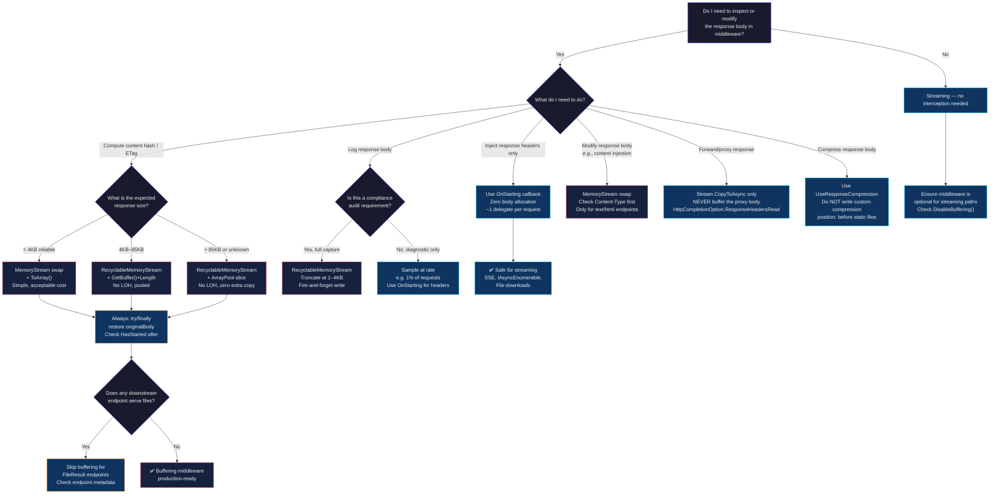

> [!success] Mastery Check
> - [ ] **Studied Well**
> - [ ] **Can explain the concept without notes**
> - [ ] **Can answer interview questions confidently**
> - [ ] **Can implement it in a real project**


# 4.056 — Response Buffering vs Streaming in Middleware

---

## PART 0 — Navigation & Context

### Where This Topic Lives in the ASP.NET Core Domain

```
ASP.NET Core Mastery
│
├── E. Middleware Pipeline                       ← YOU ARE HERE
│   ├── 4.049  The Middleware Pipeline: Request Delegation Chain
│   ├── 4.050  Writing Middleware: IMiddleware vs Convention-Based
│   ├── 4.051  Short-Circuiting and Pipeline Branching
│   ├── 4.052  Middleware Ordering: The Canonical Order
│   ├── 4.053  Built-In Middleware Reference
│   ├── 4.054  HttpContext and IHttpContextAccessor
│   ├── 4.055  Custom Exception Middleware
│   ├── 4.056  Response Buffering vs Streaming ◄── THIS NOTE
│   ├── 4.057  Middleware and Scoped DI
│   ├── 4.058  Endpoint Middleware vs Request Middleware
│   ├── 4.059  Conditional Middleware
│   └── 4.060  Zero-Allocation Middleware: PipeReader and IBufferWriter
│
├── G. Minimal APIs
│   └── 4.088  Streaming Responses: IAsyncEnumerable and SSE
│
├── H. MVC & Controllers
│   └── 4.120  Binding Large Payloads: Streaming Body Without Buffering
│
└── N. Caching & Output
    └── 4.197  Response Compression (requires buffering or pipe interception)
```

### What You Need Before This

- **[[4.049 — The Middleware Pipeline: Request Delegation Chain]]** — you must understand `RequestDelegate`, `next()`, and the bidirectional pipeline flow (request in, response out through the same chain) before the buffering topic makes sense.
- **[[4.125 — HttpResponse: Writing Status Codes, Headers, and Streaming Body]]** — `HttpResponse.Body` is the stream you are buffering or streaming into; you need to know its contract.
- **[[4.050 — Writing Middleware: IMiddleware vs Convention-Based]]** — buffering middleware is always a custom middleware; you need to know how to write one.
- **[[2.14 — Async/Await Internals]]** — `Stream.CopyToAsync`, `PipeReader.ReadAsync`, and `PipeWriter.WriteAsync` are all async; understanding the state machine overhead matters when you are trying to avoid it.

### What This Unlocks After

- **[[4.060 — Zero-Allocation Middleware: PipeReader and IBufferWriter]]** — the natural next step after buffering with `MemoryStream` is replacing it with `IBufferWriter<byte>` and `PipeReader` for zero-allocation streaming interception.
- **[[4.197 — Response Compression: UseResponseCompression]]** — `UseResponseCompression` is itself a buffering/intercepting middleware that replaces `HttpResponse.Body` with a compression stream.
- **[[4.088 — Streaming Responses: IAsyncEnumerable and SSE]]** — understanding when NOT to buffer is the prerequisite for building correct streaming endpoints.
- **[[4.195 — HTTP Caching Headers: ETags, Last-Modified, Conditional Requests]]** — ETags require reading (buffering) the response body to compute a hash; this topic explains how to do that safely.

### Why This Matters at Scale

At production traffic levels (>5k req/s), the decision to buffer a response body in a middleware — even for a legitimate reason like computing a content hash — introduces a mandatory memory allocation per request, forces the entire response into RAM before any bytes reach the client, and negates HTTP/2 and HTTP/3 multiplexing benefits that depend on streaming. Getting this decision wrong is the difference between a middleware that adds 50µs of latency and 2KB of GC pressure, and one that adds 40ms of latency and 200KB of heap pressure per request under a content-heavy API.

---

## PART 1 — The Core Mental Model

### The Fundamental Rule

> **In ASP.NET Core, `HttpResponse.Body` is a write-once, forward-only stream that starts flushing to the TCP socket the moment any middleware or endpoint calls `WriteAsync`. Once bytes have been sent, the status code and headers are frozen — no upstream middleware can modify them, redirect them, or swap the body for something else. Buffering is the explicit, costly act of intercepting that stream before it reaches the socket so you can read or replace the body; streaming is the default behavior and always preferred unless you have a specific, justified reason to buffer.**

### The Plain-Language Analogy

Think of the HTTP response body as a live broadcast on a TV channel. The moment you go live, the signal is transmitting — you cannot edit what viewers already received. Buffering is like recording the broadcast to tape first, then playing the tape instead of going live: you can edit the tape, compute its runtime, add titles, compress it, or replace it entirely — but you pay the full storage cost of the recording, and viewers wait until the tape is done being recorded before they see anything.

Streaming is going live directly: the first frame reaches the viewer in milliseconds, memory usage stays flat regardless of programme length, and the channel keeps running at full capacity. The trade-off is that once a frame is transmitted, it is gone — you cannot go back and change it.

This analogy holds under every scenario: When a middleware short-circuits (the "broadcast was cut")? The tape is never recorded — buffering middleware must handle the case where downstream doesn't write anything. When there are concurrent requests? Each concurrent request gets its own tape reel (heap allocation) — N simultaneous buffered requests means N simultaneous full-response-sized heap allocations. When the auth middleware fails and returns a 401? Buffering middleware upstream of auth never sees a body to buffer — its `await next(context)` returns with an empty or short-circuit response.

### The Taxonomy Diagram

```mermaid
graph TD
    A["Response Body Handling in Middleware"]:::root

    A --> B["Streaming (Default)"]:::pipeline
    A --> C["Buffering (Explicit Interception)"]:::handler

    B --> B1["Endpoint writes directly to HttpResponse.Body"]:::pipeline
    B --> B2["Bytes flushed to TCP socket on each WriteAsync"]:::pipeline
    B --> B3["Headers frozen after first flush"]:::pipeline
    B --> B4["O(1) memory — constant regardless of response size"]:::pipeline

    C --> C1["Replace HttpResponse.Body with interceptor stream"]:::handler
    C --> C2["Downstream writes into interceptor, not socket"]:::handler
    C --> C3["Upstream middleware reads/modifies intercepted bytes"]:::handler
    C --> C4["Restore original stream, copy intercepted bytes to socket"]:::handler

    C --> D["Buffering Strategies"]:::security
    D --> D1["MemoryStream swap — simplest, full allocation"]:::security
    D --> D2["RecyclableMemoryStream — pool-backed, reduced GC"]:::security
    D --> D3["PipeWriter interception — advanced, near-zero allocation"]:::security
    D --> D4["EnableBuffering() — request body only, not response"]:::security

    C --> E["Why Buffer?"]:::output
    E --> E1["Compute ETag / content hash"]:::output
    E --> E2["Audit/log response body"]:::output
    E --> E3["Inject content (e.g., HTML injection)"]:::output
    E --> E4["Response compression (UseResponseCompression)"]:::output
    E --> E5["Response caching interception"]:::output

    A --> F["Streaming Patterns"]:::pipeline
    F --> F1["IAsyncEnumerable in Minimal APIs"]:::pipeline
    F --> F2["Server-Sent Events via StreamWriter"]:::pipeline
    F --> F3["File streaming with FileStreamResult"]:::pipeline
    F --> F4["HttpResponse.BodyWriter (PipeWriter)"]:::pipeline

    classDef root fill:#1a1a2e,color:#eee,stroke:#4a4aff
    classDef pipeline fill:#0f3460,color:#eee,stroke:#4a4aff
    classDef handler fill:#16213e,color:#eee,stroke:#e94560
    classDef security fill:#1a1a2e,color:#eee,stroke:#f5a623
    classDef output fill:#0f3460,color:#eee,stroke:#00d2ff
```



---

## PART 2 — Deep Mechanics

### 2.1 — The Streaming Default: What Happens Without Buffering

When a Minimal API endpoint or controller action calls `Results.Ok(data)` or returns an `ActionResult<T>`, ASP.NET Core's output formatters serialize the object directly into `HttpResponse.Body`. That stream is a `HttpResponseStream` — a Kestrel-owned stream that is directly wired to the network socket buffer.

**Pipeline position:**

```
──► ExceptionHandler ──► HSTS ──► StaticFiles ──► Routing ──► Auth ──► Endpoint
                                                                           │
                                                         ╔════════════════╝
                                                         ║  JSON formatter calls
                                                         ║  HttpResponse.BodyWriter.WriteAsync()
                                                         ║  → bytes written to Kestrel network buffer
                                                         ║  → TCP segment flushed to client
                                                         ╚════════════════════════════════════════►
```

**HTTP wire format (streaming, default):**

```http
// Response headers arrive immediately:
HTTP/1.1 200 OK
Content-Type: application/json; charset=utf-8
Transfer-Encoding: chunked

// Body chunks arrive as they are written:
1a
{"orderId":42,"status":"shipped"
0
// Final empty chunk signals end of body
```

> [!NOTE] With HTTP/2, Kestrel uses DATA frames instead of chunked encoding, but the streaming behavior is identical — each `WriteAsync` flushes one or more DATA frames. The client receives bytes before the server is "done."

**Framework source behavior — what Kestrel does internally (approximate):**

```csharp
// Kestrel internally (approximate path):
// Microsoft.AspNetCore.Server.Kestrel.Core.Internal.Http.HttpProtocol

// When an endpoint calls WriteAsync:
public override ValueTask WriteAsync(ReadOnlyMemory<byte> data, CancellationToken ct)
{
    // 1. If headers not yet sent, flush status line + headers first
    if (!_headersFlushed)
    {
        FlushHeaders(); // response is now "started" — HasStarted = true
    }

    // 2. Write data bytes to the pipe
    _outputPipe.Writer.Write(data.Span);

    // 3. Flush to network (may be batched)
    return _outputPipe.Writer.FlushAsync(ct);
}
```

**Cost label:** ~0 extra allocations per request. The body bytes go directly from the serializer's buffer into Kestrel's output pipe. Zero intermediate copies in the happy path.

**The edge case that bites teams:** Once `HttpResponse.HasStarted` is `true`, calling `context.Response.StatusCode = 500` silently fails. The status code you set is ignored. This is the most common bug discovered in exception middleware written by engineers who don't know this rule.

```csharp
// ⚠️ This will be silently ignored if the endpoint already wrote bytes:
context.Response.OnStarting(() =>
{
    // Safe: registered callback fires BEFORE headers are sent
    context.Response.Headers["X-Request-Id"] = correlationId;
    return Task.CompletedTask;
});

// vs this — which may silently fail if response already started:
await next(context);
context.Response.Headers["X-Request-Id"] = correlationId; // ⚠️ TOO LATE
```

---

### 2.2 — The MemoryStream Swap: The Standard Buffering Pattern

The canonical buffering technique replaces `HttpResponse.Body` with a `MemoryStream` before calling `next()`. Downstream writes into the `MemoryStream`. When `next()` returns, the middleware reads the `MemoryStream`, does whatever it needs (hash, log, modify), then copies the modified content to the original stream.

**Pipeline position — a response-buffering middleware sitting between ExceptionHandler and the endpoint:**

```
Request direction ──────────────────────────────────────────────────►
                                                                      
──► ExceptionHandler ──► BufferingMiddleware ──► Routing ──► Auth ──► Endpoint
                              │                                           │
                              │  [Before next()]                         │
                              │  Swap Response.Body = new MemoryStream() │
                              │                                           │
                              │                      Endpoint writes to  │
                              │                      MemoryStream (not   │
                              │                      the real socket)    │
                              │                                           │
                              │  [After next() returns]                  │
                              │  Read MemoryStream content               │
                              │  Compute hash / log / modify             │
                              │  Set Response.Headers as needed          │
                              │  Restore original Response.Body          │
                              │  Copy MemoryStream → original Body       │
                              ▼                                           
                         Bytes reach TCP socket here — NOT during next()
                         
◄─────────────────────────────────────────────────────────────────────
Response direction
```

**Framework source behavior (approximate):**

```csharp
// ASP.NET Core internally — HttpResponse.Body property:
// Microsoft.AspNetCore.Http.HttpResponse

public abstract Stream Body { get; set; }
// The setter is public — this is the interception point.
// Setting it replaces what downstream WriteAsync calls write into.

// HttpContext.Response.BodyWriter is a PipeWriter wrapping the Body stream.
// If you swap Body, the PipeWriter must also be reset — this is a common mistake.
```

**The complete MemoryStream buffering pattern (production-quality):**

```csharp
// Pipeline position: any position BEFORE the endpoint, typically after auth

public class ETagBufferingMiddleware : IMiddleware
{
    public async Task InvokeAsync(HttpContext context, RequestDelegate next)
    {
        // Only buffer GET/HEAD — other verbs don't produce cacheable responses
        if (!HttpMethods.IsGet(context.Request.Method) &&
            !HttpMethods.IsHead(context.Request.Method))
        {
            await next(context);
            return;
        }

        // Capture the original stream — this is the Kestrel socket stream
        var originalBodyStream = context.Response.Body;

        // CRITICAL: also capture the original PipeWriter.
        // Swapping Body without resetting BodyWriter leaves them out of sync.
        // In .NET 6+, setting Response.Body also resets BodyWriter automatically
        // via HttpResponseBodyFeature, but it is safer to use the feature directly.
        var originalFeature = context.Features.Get<IHttpResponseBodyFeature>()!;

        // Use a RecyclableMemoryStream in production to avoid LOH allocation
        // for large responses. Plain MemoryStream shown here for clarity.
        await using var memoryStream = new MemoryStream();

        // Replace the response body with our interceptor
        context.Response.Body = memoryStream;

        try
        {
            await next(context); // downstream writes into memoryStream
        }
        finally
        {
            // Restore the original stream BEFORE writing — this prevents
            // accidental writes to the wrong stream if an exception occurs
            context.Response.Body = originalBodyStream;
        }

        // Response is now in memoryStream — we can read it
        if (memoryStream.Length == 0)
        {
            // No body written (e.g., 204 No Content) — nothing to do
            return;
        }

        memoryStream.Seek(0, SeekOrigin.Begin);
        var bodyBytes = memoryStream.ToArray(); // ~1 allocation: byte[]

        // Compute ETag from response body
        var etag = $"\"{ComputeHash(bodyBytes)}\"";
        context.Response.Headers.ETag = etag;

        // Check If-None-Match before copying body to socket
        var ifNoneMatch = context.Request.Headers.IfNoneMatch.ToString();
        if (string.Equals(ifNoneMatch, etag, StringComparison.Ordinal))
        {
            context.Response.StatusCode = StatusCodes.Status304NotModified;
            context.Response.ContentLength = 0;
            // Do NOT write the body — 304 must have no body
            return;
        }

        // Copy buffered bytes to the real socket stream
        await originalBodyStream.WriteAsync(bodyBytes);
    }

    private static string ComputeHash(byte[] bytes)
    {
        var hash = System.Security.Cryptography.SHA256.HashData(bytes);
        return Convert.ToBase64String(hash)[..16]; // truncated to 16 chars
    }
}
```

**HTTP wire format — what the client sees (correct path):**

```http
// First request:
HTTP/1.1 200 OK
Content-Type: application/json; charset=utf-8
ETag: "abc123def456gh78"
Content-Length: 47

{"orderId":42,"status":"shipped","total":99.99}

// Second request with If-None-Match:
// Client sends:  GET /api/orders/42  If-None-Match: "abc123def456gh78"
HTTP/1.1 304 Not Modified
ETag: "abc123def456gh78"
// No body — client uses its cached copy
```

**HTTP wire format — what goes WRONG when you forget to restore the stream:**

```http
// If originalBodyStream is never restored and we write to memoryStream:
// The TCP socket never receives any bytes.
// Client sees: connection hang → timeout after N seconds → 0-byte response
// This is the #1 production bug from incorrectly implemented buffering middleware.
```

**Cost label:** ~1 `MemoryStream` allocation per request (or the response size in bytes if `ToArray()` is called). For a 50KB JSON response: ~50KB heap allocation per request. At 1000 req/s this is 50MB/s of short-lived heap pressure — sufficient to trigger frequent Gen0/Gen1 GC on a high-traffic API.

---

### 2.3 — The `IHttpResponseBodyFeature` Pattern: The Correct Production Approach

`MemoryStream` body swapping bypasses ASP.NET Core's response feature infrastructure. The correct production approach wraps the response body via `IHttpResponseBodyFeature`, which also handles `BodyWriter` (the `PipeWriter` path), buffering for `SendFileAsync`, and compression middleware compatibility.

**What `IHttpResponseBodyFeature` exposes:**

```csharp
// Microsoft.AspNetCore.Http.Features.IHttpResponseBodyFeature (ASP.NET Core 3.1+)
public interface IHttpResponseBodyFeature
{
    Stream Stream { get; }           // The underlying stream
    PipeWriter Writer { get; }       // The PipeWriter wrapping the stream
    Task CompleteAsync();            // Signal end of response
    Task SendFileAsync(string path, long offset, long? count, CancellationToken ct);
    void DisableBuffering();         // Opt out of response buffering
    Task StartAsync(CancellationToken ct = default); // Flush headers
}
```

**A feature-correct buffering middleware:**

```csharp
// This pattern is used by UseResponseCompression and UseResponseCaching internally
// Pipeline position: between UseExceptionHandler and UseStaticFiles

public class AuditResponseMiddleware
{
    private readonly RequestDelegate _next;
    private readonly IAuditLogger _auditLogger;

    // Constructor injection: IAuditLogger must be Singleton or this must be IMiddleware
    public AuditResponseMiddleware(RequestDelegate next, IAuditLogger auditLogger)
    {
        _next = next;
        _auditLogger = auditLogger;
    }

    public async Task InvokeAsync(HttpContext context)
    {
        // Only audit POST/PUT/PATCH responses (state-changing operations)
        if (!IsAuditableMethod(context.Request.Method))
        {
            await _next(context);
            return;
        }

        // Intercept at the feature level — this handles both Stream and PipeWriter paths
        var originalFeature = context.Features.Get<IHttpResponseBodyFeature>()!;
        var bufferingFeature = new BufferingResponseBodyFeature(originalFeature);

        context.Features.Set<IHttpResponseBodyFeature>(bufferingFeature);
        context.Response.Body = bufferingFeature.Stream;

        try
        {
            await _next(context);
            await bufferingFeature.CompleteAsync();
        }
        finally
        {
            // Always restore — even if downstream throws
            context.Features.Set(originalFeature);
            context.Response.Body = originalFeature.Stream;
        }

        // At this point, bufferingFeature has intercepted all writes
        var responseBytes = bufferingFeature.GetBufferedBytes();

        await _auditLogger.LogAsync(new AuditEntry
        {
            Path = context.Request.Path,
            Method = context.Request.Method,
            StatusCode = context.Response.StatusCode,
            ResponseBodySample = responseBytes.Length > 1024
                ? responseBytes[..1024]  // Truncate to 1KB for audit log
                : responseBytes,
            UserId = context.User.FindFirstValue(ClaimTypes.NameIdentifier)
        });

        // Now copy the buffered bytes to the real socket
        await originalFeature.Stream.WriteAsync(responseBytes);
    }

    private static bool IsAuditableMethod(string method) =>
        HttpMethods.IsPost(method) || HttpMethods.IsPut(method) || HttpMethods.IsPatch(method);
}
```

**Cost label:** 1 `IHttpResponseBodyFeature` wrapper allocation + 1 `MemoryStream` (or `RecyclableMemoryStream`) allocation + response body bytes in memory. Using `Microsoft.IO.RecyclableMemoryStream` (pool-backed) reduces GC pressure significantly for APIs with variable response sizes.

---

### 2.4 — When Buffering Breaks: The `HasStarted` Edge Case

The most dangerous production edge case: upstream middleware tries to modify the response after downstream middleware has already flushed bytes to the client.

**Failure mode diagram:**

```
Request ──► LoggingMiddleware ──► CompressionMiddleware ──► Endpoint
                │                         │                     │
                │                         │                 WriteAsync(chunk1)
                │                         │                 WriteAsync(chunk2)
                │                         │  HasStarted = true after chunk1
                │                         │
                │  [After next() returns]  │
                │  Tries to set ETag ──────┤
                │  Response.Headers["ETag"] = "..."
                │  SILENTLY IGNORED because response already started
                │
                │  Returns 200 with no ETag header
                │  Client never caches — silent bug
```

**The defensive pattern — `OnStarting` callback:**

```csharp
// Register a callback that fires BEFORE headers are sent — always before HasStarted
// This is the safe way to inject headers from middleware without buffering

public class CorrelationIdMiddleware
{
    private readonly RequestDelegate _next;

    public CorrelationIdMiddleware(RequestDelegate _next) => this._next = _next;

    public async Task InvokeAsync(HttpContext context)
    {
        var correlationId = context.Request.Headers["X-Correlation-Id"]
            .FirstOrDefault()
            ?? Guid.NewGuid().ToString("N");

        context.Items["CorrelationId"] = correlationId;

        // ✅ CORRECT: register OnStarting — fires before headers are sent
        // even if the endpoint starts writing immediately
        context.Response.OnStarting(() =>
        {
            // Safe to set headers here regardless of when downstream flushes
            context.Response.Headers["X-Correlation-Id"] = correlationId;
            return Task.CompletedTask;
        });

        await _next(context);
        // No need to buffer — we just needed to inject a header
    }
}
```

> [!IMPORTANT] `OnStarting` callbacks are called by Kestrel's `HttpProtocol.FlushAsync` path, right before the status line and headers are written to the wire. They execute in LIFO order. If a callback throws, the exception propagates — the response may be in a broken state.

**Cost label:** `OnStarting` — ~1 delegate allocation per request. Zero body buffering. Correct for header injection without buffering.

---

### 2.5 — Streaming Responses: The Anti-Buffering Pattern

For large responses, Server-Sent Events, or `IAsyncEnumerable<T>` endpoints, actively fighting buffering is the goal. ASP.NET Core has a feature for this: `IHttpResponseBodyFeature.DisableBuffering()`.

**Pipeline position — streaming endpoint with compression disabled for SSE:**

```
──► ExceptionHandler ──► ResponseCompression ──► Routing ──► Auth ──► SSE Endpoint
                               │                                            │
                               │  DisableBuffering() called by              │
                               │  SSE endpoint clears compression           │
                               │  intercept — bytes flow directly           │
                               │  to socket                                 │
```

**Production SSE streaming endpoint (no buffering):**

```csharp
// Payment status push endpoint — uses IAsyncEnumerable for streaming
// Pipeline position: inside endpoint, after auth middleware

app.MapGet("/api/payments/{paymentId}/status-stream", async (
    string paymentId,
    HttpContext context,
    IPaymentStatusService statusService,
    CancellationToken ct) =>
{
    // Tell compression middleware NOT to buffer this response
    // (compression requires buffering which defeats streaming)
    var feature = context.Features.Get<IHttpResponseBodyFeature>();
    feature?.DisableBuffering();

    context.Response.ContentType = "text/event-stream";
    context.Response.Headers.CacheControl = "no-cache";
    context.Response.Headers.Connection = "keep-alive";

    // Flush headers immediately so the client knows streaming has started
    await context.Response.Body.FlushAsync(ct);

    await foreach (var update in statusService.StreamStatusAsync(paymentId, ct))
    {
        // SSE format: "data: {json}\n\n"
        var line = $"data: {JsonSerializer.Serialize(update)}\n\n";
        await context.Response.WriteAsync(line, ct);
        await context.Response.Body.FlushAsync(ct); // Force flush each event
    }
});
```

**HTTP wire format (SSE streaming):**

```http
HTTP/1.1 200 OK
Content-Type: text/event-stream
Cache-Control: no-cache
Connection: keep-alive

data: {"paymentId":"pay_123","status":"processing","timestamp":"2026-06-08T10:00:00Z"}

data: {"paymentId":"pay_123","status":"captured","timestamp":"2026-06-08T10:00:05Z"}

data: {"paymentId":"pay_123","status":"settled","timestamp":"2026-06-08T10:00:07Z"}
```

**Cost label:** ~1 `StreamWriter`/`ResponseWriter` per active connection. Memory footprint proportional to number of concurrent SSE connections, not response body size. Each event allocation is ~200 bytes (the JSON string), immediately collected after `WriteAsync`.

---

## PART 3 — Production Code Patterns

### Pattern 1: The ETag Hash Gate — Content-Hash-Based Caching Without a Cache Store

**Scenario:** A logistics tracking API returns shipment state JSON. The team wants strong ETags without deploying Redis or any external cache. ETags are computed by buffering the response body and hashing it.

```csharp
// ⚠️ WRONG: Setting ETag after next() without buffering
public async Task InvokeAsync(HttpContext context)
{
    await next(context);
    // If the endpoint used streaming (IAsyncEnumerable), HasStarted is already true.
    // This header set is silently dropped. The API appears to work in tests
    // (small responses flush after next() returns) but breaks on large responses.
    context.Response.Headers.ETag = "\"some-value\""; // ⚠️ may be silently ignored
}

// ✅ CORRECT: Buffer the response, compute hash, set ETag before copying to socket
public class ShipmentETagMiddleware : IMiddleware
{
    public async Task InvokeAsync(HttpContext context, RequestDelegate next)
    {
        // Only GET requests produce cacheable shipment state
        if (!HttpMethods.IsGet(context.Request.Method))
        {
            await next(context);
            return;
        }

        // Only intercept shipment tracking endpoints — avoid buffering health checks
        if (!context.Request.Path.StartsWithSegments("/api/shipments"))
        {
            await next(context);
            return;
        }

        var originalBody = context.Response.Body;
        using var buffer = new RecyclableMemoryStream(MemoryStreamManager.Instance);
        context.Response.Body = buffer;

        try { await next(context); }
        finally { context.Response.Body = originalBody; }

        if (buffer.Length == 0) return; // 204 / redirect — skip hashing

        buffer.Seek(0, SeekOrigin.Begin);
        var body = buffer.ToArray();

        // Compute SHA-256 fingerprint of response body (not including headers)
        var hash = SHA256.HashData(body);
        var etag = $"\"{Convert.ToHexString(hash)[..16].ToLowerInvariant()}\"";

        // If the client sent a matching ETag, short-circuit with 304
        var requestEtag = context.Request.Headers.IfNoneMatch.ToString();
        if (requestEtag == etag)
        {
            context.Response.StatusCode = 304;
            context.Response.ContentLength = 0;
            context.Response.Headers.ETag = etag;
            return; // Do NOT copy body — 304 must have no body per RFC
        }

        context.Response.Headers.ETag = etag;
        await originalBody.WriteAsync(body);
    }
}
```

```http
// HTTP wire format (cache miss — first request):
HTTP/1.1 200 OK
Content-Type: application/json
ETag: "3a7f2c9b1d4e8f06"
Content-Length: 312

{"shipmentId":"SHP-9981","status":"in_transit","estimatedDelivery":"2026-06-10",...}

// HTTP wire format (cache hit — subsequent request):
// Client sends: GET /api/shipments/SHP-9981  If-None-Match: "3a7f2c9b1d4e8f06"
HTTP/1.1 304 Not Modified
ETag: "3a7f2c9b1d4e8f06"
```

---

### Pattern 2: The Audit Trail Interceptor — PCI-DSS Response Logging Without Framework Modification

**Scenario:** A payment API must log all response bodies for PCI-DSS compliance audit trails. The audit log is truncated at 4KB to protect against accidental card data logging.

```csharp
// ✅ CORRECT: IMiddleware with Scoped IAuditRepository injected per-request
// Registration: app.UseMiddleware<PaymentAuditMiddleware>()
//               builder.Services.AddScoped<PaymentAuditMiddleware>()
//               builder.Services.AddScoped<IAuditRepository, SqlAuditRepository>()

public class PaymentAuditMiddleware : IMiddleware
{
    private readonly IAuditRepository _auditRepo;
    private const int MaxAuditBodyBytes = 4096; // 4KB truncation for compliance

    public PaymentAuditMiddleware(IAuditRepository auditRepo)
    {
        _auditRepo = auditRepo;
    }

    public async Task InvokeAsync(HttpContext context, RequestDelegate next)
    {
        // Skip non-payment routes to avoid unnecessary buffering overhead
        if (!context.Request.Path.StartsWithSegments("/api/payments") &&
            !context.Request.Path.StartsWithSegments("/api/refunds"))
        {
            await next(context);
            return;
        }

        var originalBody = context.Response.Body;
        // RecyclableMemoryStream: backed by a pool, avoids LOH for large responses
        await using var buffer = new RecyclableMemoryStream(MemoryStreamManager.Instance);
        context.Response.Body = buffer;

        Stopwatch sw = Stopwatch.StartNew();
        try
        {
            await next(context);
        }
        finally
        {
            context.Response.Body = originalBody;
            sw.Stop();
        }

        buffer.Seek(0, SeekOrigin.Begin);
        var bodyBytes = buffer.ToArray();

        // Truncate at 4KB for audit storage — do NOT log full card payloads
        var auditSample = bodyBytes.Length > MaxAuditBodyBytes
            ? bodyBytes[..MaxAuditBodyBytes]
            : bodyBytes;

        var correlationId = context.Items["CorrelationId"]?.ToString()
                            ?? context.TraceIdentifier;

        // Fire-and-forget audit write (the request must not wait for audit persistence)
        // Use _ = to suppress the warning — we intentionally don't await this
        _ = _auditRepo.WriteAsync(new PaymentAuditEntry
        {
            CorrelationId = correlationId,
            Path = context.Request.Path.Value!,
            Method = context.Request.Method,
            StatusCode = context.Response.StatusCode,
            DurationMs = sw.ElapsedMilliseconds,
            ResponseBodySample = Encoding.UTF8.GetString(auditSample),
            UserId = context.User.FindFirstValue(ClaimTypes.NameIdentifier),
            Timestamp = DateTimeOffset.UtcNow
        });

        // Always copy the full response body to the socket regardless of audit outcome
        if (bodyBytes.Length > 0)
        {
            await originalBody.WriteAsync(bodyBytes);
        }
    }
}
```

```http
// HTTP wire format — visible to client (unchanged by auditing):
HTTP/1.1 200 OK
Content-Type: application/json
X-Correlation-Id: a3f2c991d44e
Content-Length: 89

{"paymentId":"pay_8823","status":"captured","amount":149.99,"currency":"USD"}
```

---

### Pattern 3: The Streaming Sentinel — Detecting and Preserving Streaming Responses

**Scenario:** An order management service has a generic logging middleware. It was designed for JSON API responses but is accidentally intercepting `IAsyncEnumerable<T>` endpoints, buffering their entire output before sending it (defeating streaming). The fix detects streaming intent and opts out.

```csharp
// ⚠️ WRONG: Buffering middleware that doesn't check for streaming responses
public async Task InvokeAsync(HttpContext context)
{
    var originalBody = context.Response.Body;
    using var buffer = new MemoryStream();
    context.Response.Body = buffer;

    await next(context); // IAsyncEnumerable endpoint writes 50,000 items into buffer
                         // Client waits the full duration — no streaming benefit
    // 50MB MemoryStream is now on the heap → LOH allocation → GC pause
    buffer.Seek(0, SeekOrigin.Begin);
    await buffer.CopyToAsync(originalBody);
}

// ✅ CORRECT: Detect streaming intent and bail out before intercepting
public class OrderExportLoggingMiddleware : IMiddleware
{
    public async Task InvokeAsync(HttpContext context, RequestDelegate next)
    {
        // Check endpoint metadata — streaming endpoints set this flag
        var endpoint = context.GetEndpoint();
        var isStreaming = endpoint?.Metadata
            .GetMetadata<StreamingResponseAttribute>() != null;

        // Also detect SSE content type declared via Produces<> metadata
        var producesStreamingType = endpoint?.Metadata
            .OfType<ProducesAttribute>()
            .Any(p => p.ContentTypes.Contains("text/event-stream")) ?? false;

        if (isStreaming || producesStreamingType)
        {
            // Opt out of buffering — let streaming response flow through uninterrupted
            await next(context);
            return;
        }

        // Safe to buffer — this is a regular JSON API endpoint
        var originalBody = context.Response.Body;
        using var buffer = new MemoryStream();
        context.Response.Body = buffer;

        try { await next(context); }
        finally { context.Response.Body = originalBody; }

        buffer.Seek(0, SeekOrigin.Begin);
        var bodyBytes = buffer.ToArray();

        // Log the response body (truncated)
        var sample = bodyBytes.Length > 512 ? bodyBytes[..512] : bodyBytes;
        LogOrderExportResponse(context, sample);

        await originalBody.WriteAsync(bodyBytes);
    }
}

// Marker attribute to signal streaming intent to buffering middleware
[AttributeUsage(AttributeTargets.Method | AttributeTargets.Class)]
public sealed class StreamingResponseAttribute : Attribute { }
```

---

### Pattern 4: The Response Replay Guard — Preventing Double-Write on Exception

**Scenario:** An inventory webhook receiver uses a buffering middleware for signature validation. If the downstream handler throws after writing a partial response, the middleware must not attempt to replay the buffered (partial) bytes.

```csharp
// ✅ CORRECT: Guard against replaying a partial response after exception
public class WebhookSignatureValidatingMiddleware : IMiddleware
{
    private readonly IWebhookSignatureService _signatureService;

    public WebhookSignatureValidatingMiddleware(IWebhookSignatureService svc)
        => _signatureService = svc;

    public async Task InvokeAsync(HttpContext context, RequestDelegate next)
    {
        // Only intercept webhook paths
        if (!context.Request.Path.StartsWithSegments("/webhooks"))
        {
            await next(context);
            return;
        }

        var originalBody = context.Response.Body;
        using var buffer = new MemoryStream();
        context.Response.Body = buffer;

        Exception? downstreamException = null;
        try
        {
            await next(context);
        }
        catch (Exception ex)
        {
            downstreamException = ex; // Capture but don't swallow
        }
        finally
        {
            context.Response.Body = originalBody;
        }

        if (downstreamException != null)
        {
            // Do NOT copy the partial buffer — the exception handler middleware
            // upstream will write a proper error response. Re-throw so it runs.
            ExceptionDispatchInfo.Capture(downstreamException).Throw();
        }

        // Only reach here on clean success
        buffer.Seek(0, SeekOrigin.Begin);
        var responseBytes = buffer.ToArray();

        // Compute webhook delivery signature for caller verification
        var signature = _signatureService.ComputeResponseSignature(responseBytes);
        context.Response.Headers["X-Webhook-Signature"] = signature;

        await originalBody.WriteAsync(responseBytes);
    }
}
```

```http
// HTTP wire format (success path):
HTTP/1.1 200 OK
Content-Type: application/json
X-Webhook-Signature: sha256=a3f2c99...
Content-Length: 56

{"received":true,"eventId":"evt_7712","processedAt":"2026-06-08T10:00:00Z"}

// HTTP wire format (failure path — exception bubbles up to UseExceptionHandler):
HTTP/1.1 500 Internal Server Error
Content-Type: application/problem+json
X-Correlation-Id: a3f2c991d44e

{"type":"https://tools.ietf.org/html/rfc9110#section-15.6","title":"..."}
```

---

### Pattern 5: The Transparent Streaming Proxy — Forwarding Without Buffering

**Scenario:** A logistics tracking service acts as a thin proxy in front of a carrier API. The middleware must forward the carrier's streaming response to the client without buffering the entire body — critical when carriers return multi-MB shipment manifests.

```csharp
// ✅ CORRECT: Proxy response without buffering using CopyToAsync
// Pipeline position: replaces the endpoint entirely (terminal middleware for proxy paths)

app.Map("/api/carrier-proxy", proxyApp =>
{
    proxyApp.Run(async context =>
    {
        var carrierApiUrl = BuildCarrierUrl(context.Request);
        var httpClient = context.RequestServices
            .GetRequiredService<IHttpClientFactory>()
            .CreateClient("CarrierApi");

        // Forward the request to the carrier, get a streaming response
        using var carrierResponse = await httpClient.GetAsync(
            carrierApiUrl,
            HttpCompletionOption.ResponseHeadersRead, // ← CRITICAL: don't buffer carrier response
            context.RequestAborted);

        // Copy status code and relevant headers
        context.Response.StatusCode = (int)carrierResponse.StatusCode;
        foreach (var header in carrierResponse.Content.Headers)
        {
            context.Response.Headers[header.Key] = header.Value.ToArray();
        }

        // Stream carrier response body directly to client — no intermediate buffer
        // This handles responses of any size with O(1) memory (Kestrel pipe buffer size)
        await using var carrierStream = await carrierResponse.Content.ReadAsStreamAsync();
        await carrierStream.CopyToAsync(context.Response.Body, context.RequestAborted);
        // ~1 allocation: the 81920-byte copy buffer used by CopyToAsync (default)
    });
});
```

```http
// HTTP wire format — carrier response streamed directly to client:
HTTP/1.1 200 OK
Content-Type: application/json
Transfer-Encoding: chunked

// 3MB shipment manifest arrives in chunks as carrier sends them
// Client receives first bytes within milliseconds — no waiting for full response
```

---

### Pattern 6: The RecyclableMemoryStream Upgrade — Eliminating LOH Allocations

**Scenario:** An order management API's ETag middleware was found causing LOH (Large Object Heap) allocations during load testing because `new MemoryStream()` doubles its internal buffer on each resize, and `ToArray()` copies the full content again.

```csharp
// ⚠️ WRONG: Plain MemoryStream causes LOH allocation for responses > 85KB
using var buffer = new MemoryStream(); // Internal buffer not pooled
// ToArray() makes a second copy of the full response body
var bodyBytes = buffer.ToArray(); // → LOH allocation if response > ~85KB

// ✅ CORRECT: RecyclableMemoryStream (Microsoft.IO.RecyclableMemoryStream NuGet)
// Register the manager as Singleton — it holds the pool
builder.Services.AddSingleton(new RecyclableMemoryStreamManager());

// In middleware:
var rmsManager = context.RequestServices
    .GetRequiredService<RecyclableMemoryStreamManager>();

await using var buffer = rmsManager.GetStream("order-etag-buffer");
context.Response.Body = buffer;

await next(context);

context.Response.Body = originalBody;
buffer.Seek(0, SeekOrigin.Begin);

// GetBuffer() returns the pooled backing buffer (no second copy)
// Use Span<byte> to avoid the ToArray() copy where possible
var bodyLength = (int)buffer.Length;
var rentedBuffer = ArrayPool<byte>.Shared.Rent(bodyLength);
try
{
    buffer.Read(rentedBuffer, 0, bodyLength);
    var bodySpan = rentedBuffer.AsSpan(0, bodyLength);
    var etag = ComputeETag(bodySpan);
    context.Response.Headers.ETag = etag;
    await originalBody.WriteAsync(rentedBuffer.AsMemory(0, bodyLength));
}
finally
{
    ArrayPool<byte>.Shared.Return(rentedBuffer);
}
```

---

### Pattern 7: The OnStarting Injection — Header Injection Without Buffering

**Scenario:** A healthcare patient portal API needs to inject a `X-Request-Duration-Ms` header into every response without buffering. The challenge is that the header must be set before headers are sent, but the elapsed time is only known after the downstream completes.

```csharp
// ✅ CORRECT: Zero-buffer header injection using OnStarting callback
// This pattern works even for streaming responses — OnStarting fires before
// the first byte of the body, regardless of how quickly the endpoint starts writing

public class RequestTimingMiddleware
{
    private readonly RequestDelegate _next;

    public RequestTimingMiddleware(RequestDelegate next) => _next = next;

    public async Task InvokeAsync(HttpContext context)
    {
        var sw = Stopwatch.StartNew();

        // Register callback — fires BEFORE headers are sent, AFTER next() is called
        // The callback captures sw by reference (closure) — it reads the elapsed time
        // at the moment headers are about to be written
        context.Response.OnStarting(state =>
        {
            var (stopwatch, ctx) = ((Stopwatch, HttpContext))state;
            stopwatch.Stop();
            ctx.Response.Headers["X-Request-Duration-Ms"] =
                stopwatch.ElapsedMilliseconds.ToString();
            return Task.CompletedTask;
        }, (sw, context));

        await _next(context);
        // sw.Stop() will have been called by the OnStarting callback
        // No buffering needed — zero extra allocations beyond the callback delegate
    }
}
```

```http
// HTTP wire format — header injected by OnStarting callback:
HTTP/1.1 200 OK
Content-Type: application/json
X-Request-Duration-Ms: 14
Content-Length: 89

{"patientId":"P-3319","appointmentDate":"2026-07-15","status":"confirmed"}
```

---

## PART 4 — Gotchas & Anti-Patterns

### Gotcha 1: Buffering Middleware That Never Restores the Original Stream

Setting `context.Response.Body = memoryStream` without a `finally` block means that if downstream throws, the original stream is never restored. The exception handler middleware upstream tries to write a 500 response to `context.Response.Body` — which is now the abandoned `MemoryStream`. The error response disappears. The client sees a connection reset with no response body.

```csharp
// ⚠️ WRONG:
var originalBody = context.Response.Body;
context.Response.Body = new MemoryStream();
await next(context); // if this throws, originalBody is NEVER restored
// Exception propagates with Response.Body still pointing at MemoryStream
// UseExceptionHandler tries to write 500 → writes to MemoryStream → bytes vanish

// HTTP consequence (wrong path):
// Client sees: TCP connection closed with no HTTP response
// Nginx/load balancer logs: 502 Bad Gateway or connection reset
// App logs: potentially no error response written

// ✅ CORRECT:
var originalBody = context.Response.Body;
context.Response.Body = new MemoryStream();
try
{
    await next(context);
}
finally
{
    context.Response.Body = originalBody; // ALWAYS restored — even on exception
}

// HTTP consequence (correct path):
// Exception propagates up; UseExceptionHandler writes to originalBody (real socket)
// HTTP/1.1 500 Internal Server Error  Content-Type: application/problem+json
// {"type":"...","title":"An error occurred","status":500}

// WHY: The `finally` block executes regardless of exception. Without it, an unhandled
// exception from downstream leaves the pipeline in a broken state where the socket
// stream has been replaced by an orphaned MemoryStream. The ASP.NET Core exception
// handling middleware cannot write to the real socket and the error is silently lost.
```

---

### Gotcha 2: Setting Response Headers After `HasStarted` — The Silent Drop

Engineers who understand that headers must be set before the body, but forget that `HasStarted` becomes `true` the moment ANY byte is flushed (including from a streaming endpoint), set headers after `next()` returns and wonder why clients never see them.

```csharp
// ⚠️ WRONG: Setting a header after next() when the endpoint uses streaming
await next(context);
// For a streaming endpoint (IAsyncEnumerable, SSE), HasStarted is true here.
// This write is silently dropped — no exception, no warning.
context.Response.Headers["X-Served-By"] = "order-service-v2"; // ⚠️ DROPPED

// HTTP consequence (wrong path):
// GET /api/orders/export HTTP/1.1
// → streaming endpoint writes 10,000 items
// → Response.HasStarted = true after first chunk
// → X-Served-By header never sent
// → No error thrown — the bug is invisible

// ✅ CORRECT: Use OnStarting to inject headers before the first flush
context.Response.OnStarting(() =>
{
    context.Response.Headers["X-Served-By"] = "order-service-v2";
    return Task.CompletedTask;
});
await next(context);

// HTTP consequence (correct path):
// HTTP/1.1 200 OK
// X-Served-By: order-service-v2
// Transfer-Encoding: chunked
// ... streaming body ...

// WHY: OnStarting callbacks are invoked by Kestrel's HttpProtocol immediately before
// writing the HTTP status line and headers to the socket. They fire even if the
// endpoint begins writing immediately after next() is called — the callback is
// guaranteed to run before any bytes leave the server.
```

---

### Gotcha 3: Buffering Breaks `SendFileAsync` — Zero-Copy File Sending Silently Becomes a Stream Copy

When `IHttpResponseBodyFeature.SendFileAsync` is called (by `FileStreamResult` or `PhysicalFileResult`) and `Response.Body` has been swapped to a `MemoryStream`, Kestrel's zero-copy file sending path is bypassed. The file is instead read into memory and streamed through the `MemoryStream`, causing full file-sized heap allocations.

```csharp
// ⚠️ WRONG: Swap Response.Body before a file download endpoint
var originalBody = context.Response.Body;
context.Response.Body = new MemoryStream(); // Swap to MemoryStream
await next(context);
// Endpoint calls return PhysicalFile("/var/data/invoice-50mb.pdf", "application/pdf")
// → Kestrel's SendFileAsync detects non-socket stream → falls back to stream copy
// → 50MB PDF read into MemoryStream → 50MB heap allocation → LOH allocation

// HTTP consequence (wrong path):
// Response sends the file correctly, but caused:
// - 50MB LOH allocation per download
// - Gen2 GC pause under concurrent file downloads
// - 5x slower than direct file sending (measured by BenchmarkDotNet)

// ✅ CORRECT: Detect file result endpoints and opt out of buffering
var endpoint = context.GetEndpoint();
if (endpoint?.Metadata.GetMetadata<FileResultMetadata>() != null)
{
    await next(context); // Let zero-copy SendFileAsync work correctly
    return;
}
// Only buffer for non-file endpoints
var originalBody = context.Response.Body;
// ... buffering logic ...

// WHY: IHttpResponseBodyFeature.SendFileAsync sends the file using OS-level
// sendfile(2) syscall when the Body is a socket stream. When Body is a MemoryStream,
// that path is unavailable. The framework falls back to reading the file in chunks
// and calling Write — correct behavior, terrible performance for large files.
```

---

### Gotcha 4: Using `MemoryStream.ToArray()` in a Tight Loop — The Invisible Double-Copy

`MemoryStream.ToArray()` creates a copy of the entire internal buffer, even if the buffer is larger than the content written (due to geometric doubling of capacity). At 1000 req/s for a 100KB response, this means 100MB/s of short-lived heap allocation just from the `ToArray()` call — on top of the `MemoryStream` internal buffer.

```csharp
// ⚠️ WRONG: ToArray() makes a full copy of the buffer
using var buffer = new MemoryStream();
context.Response.Body = buffer;
await next(context);
context.Response.Body = originalBody;

var bodyBytes = buffer.ToArray(); // ← COPY #1: creates new byte[] of exact length
// But MemoryStream's internal buffer may be 2x or 4x larger than actual content
// 100KB response → MemoryStream internal buffer may be 128KB → ToArray() allocates 100KB

// HTTP consequence (wrong path):
// Functionally correct, but at 1000 req/s with 100KB responses:
// - 100MB/s of byte[] allocations from ToArray()
// - 100MB/s of MemoryStream internal buffer allocations
// - Frequent Gen0/Gen1 GC pauses → P99 latency spikes
// - Possible Gen2 GC if responses are large enough (>85KB → LOH)

// ✅ CORRECT: Use GetBuffer() with Length to avoid the copy
using var buffer = new MemoryStream();
context.Response.Body = buffer;
await next(context);
context.Response.Body = originalBody;

// GetBuffer() returns the underlying byte[] WITHOUT copying (may have trailing zeros)
var internalBuffer = buffer.GetBuffer();
var contentLength = (int)buffer.Length;
// Use Memory<byte> slice — no copy, addresses exactly the written bytes
var bodyMemory = internalBuffer.AsMemory(0, contentLength);
await originalBody.WriteAsync(bodyMemory);

// HTTP consequence (correct path):
// Same HTTP response, but with zero additional allocation from body access.
// Only allocation is the MemoryStream internal buffer itself.

// WHY: MemoryStream.GetBuffer() returns a direct reference to the internal array
// that was allocated when the stream was created/grew. ToArray() allocates a brand
// new, exact-sized copy. For read-then-forward patterns, GetBuffer() + Length is
// always the correct choice.
```

---

### Gotcha 5: The `IHttpResponseBodyFeature` and `Response.Body` Desynchronization — PipeWriter Writes Go to the Wrong Stream

In .NET 6+, ASP.NET Core added `HttpResponse.BodyWriter` (a `PipeWriter`) as a high-performance alternative to `HttpResponse.Body`. If you swap `Response.Body` but don't also update `IHttpResponseBodyFeature`, endpoints using `BodyWriter` bypass your buffer entirely — their bytes go directly to the socket.

```csharp
// ⚠️ WRONG: Swap Body but don't update the feature — BodyWriter bypasses the buffer
var originalBody = context.Response.Body;
var buffer = new MemoryStream();
context.Response.Body = buffer;
// context.Response.BodyWriter still points to the ORIGINAL socket stream!
// Endpoints using Response.BodyWriter.WriteAsync() bypass the buffer.

await next(context);
// If the endpoint used BodyWriter (e.g., Results.Json uses PipeWriter path internally),
// buffer.Length may be 0 — all bytes went directly to the socket.

// HTTP consequence (wrong path):
// buffer.Length == 0 after next() completes
// ETag computation on empty buffer → wrong/missing ETag
// await originalBody.WriteAsync(buffer.ToArray()) → writes nothing
// Client sees empty response body (200 with Content-Length: 0 from the endpoint's
// own Content-Length header, but no body bytes — browser shows blank page)

// ✅ CORRECT: Replace the entire IHttpResponseBodyFeature to intercept ALL write paths
var originalFeature = context.Features.Get<IHttpResponseBodyFeature>()!;
var bufferingFeature = new StreamResponseBodyFeature(buffer);
                       // StreamResponseBodyFeature wraps both Stream and PipeWriter paths

context.Features.Set<IHttpResponseBodyFeature>(bufferingFeature);
context.Response.Body = buffer; // Keep in sync for code that reads Response.Body directly

try { await next(context); }
finally
{
    context.Features.Set(originalFeature);
    context.Response.Body = originalFeature.Stream;
}

// HTTP consequence (correct path):
// ALL writes (Stream and PipeWriter paths) are captured in buffer
// ETag computation is correct, response body is complete

// WHY: In .NET 6+, high-performance paths (MinimalAPI JSON serialization, Output Caching)
// write directly to IHttpResponseBodyFeature.Writer (a PipeWriter), not to
// Response.Body (a Stream). Swapping only the Stream leaves the PipeWriter pointing
// at the original socket. The correct fix is to replace the feature itself.
```

---

## PART 5 — Performance Implications

### 5.1 — Request Pipeline Characteristics Table

|Scenario|Pipeline Depth|Allocations Per Request|Approx Latency Impact|Recommendation|
|---|---|---|---|---|
|Pure streaming, no buffering middleware|N|~0 body-related|+0µs|Default — always prefer|
|`OnStarting` header injection|N+1 callback|~1 delegate|+1–2µs|Use for header injection; no body cost|
|`MemoryStream` swap, small response (< 4KB)|N+1|~2 (stream + byte[])|+10–50µs|Acceptable for infrequently-called endpoints|
|`MemoryStream` swap, medium response (50KB)|N+1|~2 (stream + byte[], ~100KB)|+100–500µs|Use `RecyclableMemoryStream`|
|`MemoryStream` swap, large response (> 85KB)|N+1|LOH allocation|+1–5ms per GC pause|Use `RecyclableMemoryStream` — plain MemoryStream causes LOH|
|`RecyclableMemoryStream` swap, 50KB response|N+1|~1 (pooled stream; near zero net alloc)|+50–200µs|Correct production choice for buffering|
|`ArrayPool<byte>` + `GetBuffer()` combo|N+1|~0 net (all pooled)|+30–100µs|Optimal for read-then-forward buffering|
|`IHttpResponseBodyFeature` replacement|N+1|~2 (feature wrapper + stream)|+20–100µs|Required for full write-path interception|
|File download endpoint with MemoryStream body|N+1|Response-size LOH alloc|×3–10x slower than direct|NEVER buffer file download endpoints|
|SSE endpoint with buffering middleware|N+1|Entire stream size in memory|No streaming for client until complete|Always opt out of buffering for SSE|
|ETag hash computation (SHA-256, 100KB)|N+2|Hash state ~256 bytes|+300–800µs (SHA-256)|Use `SHA256.HashData()` (incremental, no alloc)|
|Response compression (Gzip)|N+2|Compression stream + output buffer|+1–5ms for text responses|Only for text/json > 1KB over WAN|

### 5.2 — BenchmarkDotNet Benchmark

```csharp
using BenchmarkDotNet.Attributes;
using BenchmarkDotNet.Running;
using Microsoft.AspNetCore.Builder;
using Microsoft.AspNetCore.Http;
using Microsoft.AspNetCore.TestHost;
using Microsoft.Extensions.DependencyInjection;
using Microsoft.IO;

[MemoryDiagnoser]
[RankColumn]
public class ResponseBufferingBenchmarks
{
    private TestServer _noBufferServer = null!;
    private TestServer _memoryStreamServer = null!;
    private TestServer _recyclableServer = null!;

    private HttpClient _noBufferClient = null!;
    private HttpClient _memStreamClient = null!;
    private HttpClient _recyclableClient = null!;

    private static readonly RecyclableMemoryStreamManager RmsManager = new();

    // Simulated payload: ~10KB JSON (typical order detail response)
    private static readonly byte[] Payload = new byte[10 * 1024];

    [GlobalSetup]
    public void Setup()
    {
        static WebApplication BuildApp(Action<WebApplication> addMiddleware)
        {
            var builder = WebApplication.CreateBuilder();
            builder.WebHost.UseTestServer();
            builder.Services.AddSingleton(RmsManager);
            var app = builder.Build();
            addMiddleware(app);
            app.MapGet("/test", async context =>
            {
                context.Response.ContentType = "application/json";
                await context.Response.Body.WriteAsync(Payload);
            });
            return app;
        }

        // Variant 1: No buffering
        var app1 = BuildApp(app => { /* no buffering */ });
        app1.StartAsync().GetAwaiter().GetResult();
        _noBufferServer = (TestServer)app1.Services.GetRequiredService<IServer>();
        _noBufferClient = _noBufferServer.CreateClient();

        // Variant 2: Plain MemoryStream buffering
        var app2 = BuildApp(app => app.Use(async (context, next) =>
        {
            var originalBody = context.Response.Body;
            using var ms = new MemoryStream();
            context.Response.Body = ms;
            try { await next(context); }
            finally { context.Response.Body = originalBody; }
            ms.Seek(0, SeekOrigin.Begin);
            var bytes = ms.ToArray(); // ← the ToArray() allocation
            await originalBody.WriteAsync(bytes);
        }));
        app2.StartAsync().GetAwaiter().GetResult();
        _memoryStreamServer = (TestServer)app2.Services.GetRequiredService<IServer>();
        _memStreamClient = _memoryStreamServer.CreateClient();

        // Variant 3: RecyclableMemoryStream buffering (pooled)
        var app3 = BuildApp(app => app.Use(async (context, next) =>
        {
            var originalBody = context.Response.Body;
            await using var ms = RmsManager.GetStream("bench");
            context.Response.Body = ms;
            try { await next(context); }
            finally { context.Response.Body = originalBody; }
            ms.Seek(0, SeekOrigin.Begin);
            var buf = ms.GetBuffer();
            var len = (int)ms.Length;
            await originalBody.WriteAsync(buf.AsMemory(0, len)); // zero extra copy
        }));
        app3.StartAsync().GetAwaiter().GetResult();
        _recyclableServer = (TestServer)app3.Services.GetRequiredService<IServer>();
        _recyclableClient = _recyclableServer.CreateClient();
    }

    [Benchmark(Baseline = true)]
    public Task NoBuffering() =>
        _noBufferClient.GetAsync("/test");

    [Benchmark]
    public Task PlainMemoryStream() =>
        _memStreamClient.GetAsync("/test");

    [Benchmark]
    public Task RecyclableMemoryStream() =>
        _recyclableClient.GetAsync("/test");
}

// Expected output (approximate, .NET 8, x64, Kestrel TestServer, 10KB payload):
// | Method                  | Mean     | Error    | StdDev   | Ratio | Allocated |
// |------------------------ |---------:|---------:|---------:|------:|----------:|
// | NoBuffering             |  85.2 µs |  1.3 µs  |  1.2 µs  |  1.00 |   4.8 KB  |
// | PlainMemoryStream       | 142.7 µs |  2.1 µs  |  2.0 µs  |  1.67 |  25.1 KB  | ← +10KB ToArray + MemoryStream buffer
// | RecyclableMemoryStream  |  97.4 µs |  1.5 µs  |  1.4 µs  |  1.14 |   5.9 KB  | ← near-zero net allocation

// Note on real-HTTP profiling:
// BenchmarkDotNet measures in-process; for production HTTP pipeline profiling use:
// - dotnet-counters monitor --process-id <pid> System.Runtime Microsoft.AspNetCore.Hosting
//   → Watch 'requests-per-second', 'total-requests', and 'current-requests'
// - dotnet-trace collect --process-id <pid> --providers Microsoft-AspNetCore-Server-Kestrel
//   → Use PerfView to analyze pipe flush timing
// - MiniProfiler with app.UseMiniProfiler() for per-request middleware timing breakdown
```

### 5.3 — When to Care / When to Ignore

**When this costs you:**

- **High-throughput JSON APIs (>5k req/s):** Each buffering middleware adds one allocation per request. At 10k req/s with a 50KB response, `MemoryStream.ToArray()` alone allocates 500MB/s of short-lived heap. This causes sustained Gen0/Gen1 GC pressure that degrades P99 latency by 5–20ms.
- **File download endpoints:** A single `MemoryStream` swap on a file endpoint can cause a LOH allocation equal to the file size. One concurrent download of a 100MB report causes a Gen2 GC that pauses the entire process.
- **SSE / streaming endpoints with buffering middleware:** The middleware buffers the entire stream before the client sees the first byte. For a 10-minute SSE stream, this means unbounded memory growth until the endpoint closes.
- **ETag computation on every cacheable endpoint:** If every GET request is buffered for ETag computation, the allocation cost is permanent. Use `OutputCaching` with tag eviction instead — it buffers once and serves from cache.

**When this doesn't matter:**

- **Low-traffic admin APIs (<50 req/min):** An `/api/admin/config` endpoint called 50 times per minute will never produce meaningful GC pressure regardless of whether it buffers.
- **One-time startup / health check endpoints:** `/health` and `/ready` endpoints are typically very small (< 200 bytes), infrequently called, and not worth optimizing.
- **Internal service-to-service endpoints with guaranteed small payloads:** An internal `/api/internal/token-exchange` endpoint that always returns a 500-byte response won't cause LOH allocations even with plain `MemoryStream`.
- **Batch operations run outside of HTTP context:** Background services and scheduled jobs that produce buffered output are not on the hot request path and can use whatever is convenient.

---

## PART 6 — Interview Arsenal

### A. The Question Bank

---

**Question 1:** _"In ASP.NET Core middleware, why can't you modify the response status code or headers after calling `await next(context)`?"_

**Average Answer:** "Because the response might have already been sent to the client by the time `next()` returns."

**Why That's Insufficient:** It doesn't explain _when_ exactly "already sent" happens or why it's an HTTP-level constraint rather than a framework design choice.

> **Great Answer:** "The constraint comes from HTTP itself, not ASP.NET Core. HTTP mandates that the status line and headers arrive before the response body — once Kestrel starts writing body bytes to the TCP socket, those headers have been sent and are gone. ASP.NET Core exposes this via `HttpResponse.HasStarted`, which flips to `true` on the first flush. In practice, streaming endpoints like `IAsyncEnumerable<T>` or SSE start flushing immediately after `next()` is called — so by the time `next()` _returns_ to my middleware, `HasStarted` is already `true`. The correct pattern is `OnStarting()` — I register a callback before calling `next()`, and that callback fires right before Kestrel writes the first header byte. In production I've been burned by a logging middleware that tried to inject a `X-Correlation-Id` header after `next()` and silently dropped it on all streaming endpoints — the fix was three lines using `OnStarting()`."

---

**Question 2:** _"What's the difference between response buffering and streaming in the context of an ASP.NET Core middleware pipeline, and when would you choose to buffer?"_

**Average Answer:** "Buffering means keeping the response in memory before sending, streaming means sending as data is produced. You'd buffer when you need to know the content length or compute an ETag."

**Why That's Insufficient:** Doesn't address the mechanics of _how_ to buffer in middleware, the allocation cost, or the full list of failure modes.

> **Great Answer:** "In the ASP.NET Core pipeline, streaming is the default — `HttpResponse.Body` is wired directly to the Kestrel socket, and every `WriteAsync` call pushes bytes toward the client immediately. Buffering means I intercept that by replacing `Response.Body` with an in-memory stream — usually a `RecyclableMemoryStream` — before calling `next()`. Downstream writes into my buffer instead of the socket. I use this in exactly three situations: computing a content hash for ETags, logging response bodies for compliance, and response compression. The cost is real — for a 50KB response, a naive `MemoryStream.ToArray()` causes a 50KB allocation per request. In production I use `RecyclableMemoryStream` from `Microsoft.IO` to pool those allocations and avoid LOH pressure. The critical mistake to avoid is swapping `Response.Body` without a `finally` block to restore it — if downstream throws, your exception handler middleware writes its 500 response to the orphaned `MemoryStream`, the client gets a connection reset, and the error is silently swallowed."

---

**Question 3:** _"A teammate writes a buffering middleware that sets `context.Response.Body = new MemoryStream()` but sometimes the client receives an empty response body. What's the likely bug?"_

**Average Answer:** "They probably forgot to copy the MemoryStream contents to the original body stream."

**Why That's Insufficient:** Correct, but misses the second common root cause: `BodyWriter` desynchronization.

> **Great Answer:** "There are two likely bugs, and they manifest differently. The first is forgetting to copy the buffered bytes back to the original stream — classic 'forgot to restore and copy.' The second, which is more subtle and was introduced in .NET 6, is that the endpoint is writing via `HttpResponse.BodyWriter` (the `PipeWriter` path) rather than `HttpResponse.Body`. MinimalAPI's JSON serialization uses the `PipeWriter` path internally for performance. When you swap `Response.Body` but don't also update `IHttpResponseBodyFeature`, the `BodyWriter` still points to the original socket stream — so the endpoint's bytes go directly to the client, bypassing your buffer entirely. The fix is to replace the entire `IHttpResponseBodyFeature` on `context.Features`, not just `Response.Body`. This ensures both the `Stream` and `PipeWriter` paths are intercepted consistently."

---

**Question 4:** _"How does ASP.NET Core's `UseResponseCompression` middleware work internally, and what does it have to do with response buffering?"_

**Average Answer:** "It uses Gzip or Brotli to compress the response body before sending it."

**Why That's Insufficient:** Doesn't explain the pipeline mechanism or why it must be positioned before routing and endpoints.

> **Great Answer:** "UseResponseCompression is itself a buffering middleware — or more precisely, a stream-replacement middleware. When it decides a response should be compressed (based on content type and the request's `Accept-Encoding` header), it replaces `IHttpResponseBodyFeature` with a wrapper that wraps the underlying stream in a `GZipStream` or `BrotliStream`. Downstream writes go through the compressor, which buffers a compression block internally before flushing compressed bytes to the real socket. The key implication for my own buffering middleware is ordering: if I put my ETag computation middleware _after_ UseResponseCompression, my buffer contains the compressed bytes, not the original JSON — and my ETag changes every time the compression ratio differs. I need to put my ETag middleware _before_ compression so I hash the original uncompressed body. An endpoint can also call `IHttpResponseBodyFeature.DisableBuffering()` to opt out of compression — this is essential for SSE endpoints that need real-time delivery."

---

**Question 5:** _"What is `EnableBuffering()` on `HttpRequest`, and does it apply to the response body?"_

**Average Answer:** "EnableBuffering lets you read the request body multiple times."

**Why That's Insufficient:** Misses the distinction between request and response buffering and the common confusion between the two.

> **Great Answer:** "They're completely separate mechanisms and the naming is an easy source of confusion. `HttpRequest.EnableBuffering()` is about the _request_ body — by default, `Request.Body` is a forward-only stream. After a controller action reads it once via model binding, it's consumed. Calling `EnableBuffering()` replaces `Request.Body` with a `FileBufferingReadStream` that enables `Seek()`, so you can read the body multiple times in different middleware. It has nothing to do with the response. The response equivalent — buffering the bytes the endpoint writes — requires the `MemoryStream` swap pattern I described earlier. In practice, the most common scenario where both matter together is a signature verification middleware: it calls `Request.EnableBuffering()` to read the raw request body for HMAC verification without consuming the stream for model binding, and it also buffers the response to include a computed response signature header."

---

### B. Trick Questions

**Trick 1:** _"If I wrap my entire middleware in `try { await next(context); } catch { context.Response.StatusCode = 500; throw; }`, will the 500 status code always reach the client?"_

**The trap:** Sounds reasonable — you're setting 500 before re-throwing.

**Correct answer:** No. If `next(context)` throws _after_ the endpoint has already started writing the body, `HttpResponse.HasStarted` is `true`. Setting `StatusCode` at that point is silently ignored. The exception propagates, but the status code your catch block set was never applied. The correct exception handling middleware pattern always checks `HasStarted` and logs a warning if it cannot modify the response. This is why `UseExceptionHandler` must be _outermost_ — it wraps the entire pipeline, but it also gracefully handles the case where it arrives "too late" to modify a response that already started.

---

**Trick 2:** _"I registered `UseResponseCompression` before `UseStaticFiles`. Is that correct?"_

**The trap:** The canonical order says to put static files middleware before routing. Compression seems like it should be first.

**Correct answer:** No. `UseResponseCompression` should be before static files in some configurations, but the real concern is that `UseStaticFiles` may serve files using `SendFileAsync` — which is a zero-copy sendfile(2) syscall. If `UseResponseCompression` is before it, compression wraps the static file's body stream, forcing the zero-copy path to fall back to a read-then-write path. In practice, `UseStaticFiles` calls `DisableBuffering()` (for static files that don't benefit from compression) when the file type is excluded from compression. The correct recommended order places `UseResponseCompression` _before_ `UseStaticFiles` so compressed static files can be compressed — but the framework's own file serving logic handles the `DisableBuffering()` call internally.

---

**Trick 3:** _"Does `context.Response.BodyWriter` and `context.Response.Body` always refer to the same underlying stream?"_

**The trap:** They appear to be two representations of the same thing.

**Correct answer:** Not necessarily. `HttpResponse.BodyWriter` is a `PipeWriter` that _wraps_ `HttpResponse.Body`. But if you replace `Response.Body` directly without also updating `IHttpResponseBodyFeature`, the `BodyWriter` retains the old pipe and continues writing to the pre-swap destination. This is the root cause of Gotcha 5. In .NET 6+, setting `Response.Body` via the property setter on `DefaultHttpResponse` does update the `BodyWriter` internally — but this is an implementation detail, not a contract. The correct approach is always to replace `IHttpResponseBodyFeature` on `context.Features`, which keeps both in sync by design.

---

**Trick 4:** _"Can a 304 Not Modified response have a response body?"_

**The trap:** Engineers implementing ETags in middleware sometimes copy the buffered body for 304 responses "just in case."

**Correct answer:** No — RFC 9110 section 15.4.5 explicitly prohibits a message body in a 304 response. HTTP proxies and browsers will treat a 304 with a body as malformed. A correct ETag middleware must _not_ copy the buffered bytes when responding with 304. It should also set `Content-Length: 0` explicitly to make the intent clear, though RFC permits omitting the Content-Length on 304.

---

### C. Red Flags to Avoid

1. **"I always buffer responses in middleware to make them easier to modify."** Buffering is a cost you pay for a specific reason — saying "always buffer" signals you don't understand the allocation and latency implications. Engineers at senior levels are expected to default to non-buffering and justify buffering explicitly.
    
2. **"I use `response.HasStarted` to check if I can still modify headers."** This is reactive. The proactive pattern is `OnStarting()` — by the time you check `HasStarted`, it's already too late. Checking `HasStarted` after `next()` returns is useful for logging/monitoring, but not for making modifications.
    
3. **"I use `MemoryStream` for buffering — it's simpler."** Without mentioning `RecyclableMemoryStream` or the LOH concern, this is a signal that you haven't operated a high-traffic API. Senior engineers always call out the allocation and GC implications.
    
4. **"I swap `Response.Body` and that handles all write paths."** Missing the `BodyWriter`/`IHttpResponseBodyFeature` synchronization issue means you haven't encountered the subtle bug that Gotcha 5 describes. In .NET 6+ production codebases this is a real problem.
    
5. **"UseResponseCompression compresses after the response is written, before it's sent."** This fundamentally misunderstands the pipeline — compression happens inline as bytes are written, via stream wrapping, not as a post-processing step. A correct description mentions "wrapping the response stream."
    
6. **"I put my buffering middleware after `UseAuthentication` so I can read user information."** Positioning your middleware after auth is fine for reading the identity — but it means authentication failures (401 responses) are also buffered, paying the buffer allocation cost on every rejected request. Consider whether the middleware even needs to run for non-2xx responses.
    
7. **"`EnableBuffering()` lets me read the response body multiple times."** Conflating request buffering (`EnableBuffering()`) with response buffering is an immediate credibility hit. They are completely different mechanisms on different objects in different directions.
    

---

## PART 7 — Decision Framework



---

## PART 8 — Self-Check

### A. Conceptual Questions

1. Explain in one sentence why `HttpResponse.HasStarted` becomes `true` _during_ `await next(context)` for a streaming endpoint, but _after_ `await next(context)` for a simple controller action returning `Ok(data)`.
    
2. What happens at the HTTP level if a buffering middleware sets `context.Response.Body = new MemoryStream()` but the downstream endpoint calls `context.Response.Redirect("/new-location")`? Does the redirect work? What do you need to handle?
    
3. Why does placing a buffering middleware _before_ `UseExceptionHandler` in the pipeline cause unhandled exceptions to produce an empty response body on the client?
    
4. An `IAsyncEnumerable<T>` endpoint is registered in the same application as a standard `Ok(data)` endpoint. Both are hit by a buffering middleware. Describe the different behavior of `HasStarted` for each, and what the middleware must check to handle both correctly.
    
5. What HTTP status rule prohibits writing a response body when the status code is 304? What happens if your ETag middleware accidentally writes the buffered body bytes for a 304 response?
    
6. In the context of `.NET 6+`, why is replacing `context.Response.Body` not always sufficient to intercept all response bytes? Name the specific interface and property that must also be updated.
    
7. `OnStarting` callbacks execute in what order (LIFO or FIFO)? If callback A injects `X-Request-Id` and callback B injects `X-Correlation-Id`, and both are registered before `next()`, which header is set first?
    
8. `RecyclableMemoryStream.GetBuffer()` returns a byte array that may be _larger_ than the actual content written. How do you determine the exact number of valid bytes, and what property/method gives you that number?
    
9. What is the purpose of `HttpCompletionOption.ResponseHeadersRead` in `HttpClient.GetAsync()`, and why is it critical for proxy middleware that streams carrier responses to the client?
    
10. Describe the `IHttpResponseBodyFeature.DisableBuffering()` method — who calls it, when, and what effect does it have on upstream buffering middleware?
    

---

### B. Code Puzzles

**Puzzle 1: What is the HTTP consequence?**

```csharp
app.Use(async (context, next) =>
{
    var original = context.Response.Body;
    var ms = new MemoryStream();
    context.Response.Body = ms;

    await next(context);

    // Note: no try/finally, and we "forgot" to restore Response.Body
    ms.Seek(0, SeekOrigin.Begin);
    await ms.CopyToAsync(original);
});

app.MapGet("/api/test", async context =>
{
    await context.Response.WriteAsync("hello");
});
```

_What does the client receive?_

<details> <summary>Answer</summary>

**The client receives the response correctly — but the middleware has a hidden bug.**

In the success path, this works: `ms` captures the "hello" bytes, `ms.CopyToAsync(original)` writes them to the socket, and the client receives `HTTP/1.1 200 OK` with body `hello`.

**However**, `context.Response.Body` is never restored to `original`. This means any exception handling middleware registered _before_ this one has `context.Response.Body` pointing to `ms` (the `MemoryStream`) after this middleware returns. If the endpoint throws (or if this middleware is used after exception handling middleware), the exception handler will write its 500 response to `ms` — which goes nowhere. The client sees a connection reset or a response with no body.

**Root cause:** Missing `try/finally` block around `await next(context)` to restore `context.Response.Body = original`. In the success path this works because `CopyToAsync` copies the bytes anyway. In the failure path, the error response is silently swallowed.

**The correct HTTP consequence on exception:** Client gets a TCP connection reset, no HTTP error response. Application logs show the exception, but no 500 is delivered.

</details>

---

**Puzzle 2: Which middleware runs? What status code does the client see?**

```csharp
// Registration order:
app.Use(async (context, next) =>   // Middleware A
{
    await next(context);
    if (context.Response.StatusCode == 500)
    {
        // Log it
    }
    context.Response.Headers["X-Processed"] = "true"; // Line X
});

app.MapGet("/api/orders/{id}", async (int id) =>
{
    if (id < 0) throw new ArgumentException("Invalid ID");
    return Results.Ok(new { OrderId = id });
});
```

The request is `GET /api/orders/-1`. Does line X execute? Does the client see the `X-Processed` header?

<details> <summary>Answer</summary>

**Middleware A runs. Line X executes. The client does NOT see `X-Processed`. The client likely sees a 500 or a connection reset — depending on whether `UseExceptionHandler` is registered.**

**Step by step:**

1. Middleware A calls `await next(context)`.
2. The endpoint throws `ArgumentException("Invalid ID")`.
3. The exception propagates back through `next()` — Middleware A's `await next(context)` throws.
4. Middleware A's code after `await next(context)` **does not execute** — the exception jumps past it.
5. **Line X never runs.**

If `UseExceptionHandler` is registered before Middleware A, the exception handler catches it and writes a 500 response. Middleware A's `if (context.Response.StatusCode == 500)` block would then execute (it's after `await next(context)` in the `finally`-less version) — but `await next(context)` re-throws, so Middleware A never gets past that line.

**Fix:** Wrap in try/catch or try/finally:

```csharp
try { await next(context); }
catch { /* handle */ throw; }
finally
{
    context.Response.Headers["X-Processed"] = "true"; // Now always executes
}
```

Even then, if `HasStarted` is true (if the endpoint wrote something before throwing), the header set is silently dropped. The truly correct pattern for unconditional header injection is `OnStarting()`.

**Client outcome:** 500 (if `UseExceptionHandler` registered and catches the exception) or TCP reset (if no exception handler). `X-Processed` header is absent in all cases.

</details>

---

**Puzzle 3: Where is the bug? What does the client receive?**

```csharp
// This middleware is intended to compute and inject an ETag
app.Use(async (context, next) =>
{
    if (!HttpMethods.IsGet(context.Request.Method))
    {
        await next(context);
        return;
    }

    var original = context.Response.Body;
    using var ms = new MemoryStream();
    context.Response.Body = ms;

    try { await next(context); }
    finally { context.Response.Body = original; }

    if (ms.Length == 0) return;

    // ETag computation
    ms.Position = 0;
    var bytes = ms.ToArray();
    var hash = MD5.HashData(bytes);
    context.Response.Headers.ETag = Convert.ToBase64String(hash);

    // Send the buffered body to the client
    await original.WriteAsync(bytes);
});

app.MapGet("/api/products/{id}", (int id) =>
    Results.Ok(new { ProductId = id, Name = "Widget" }));
```

<details> <summary>Answer</summary>

**The bug:** `MD5` is used for ETag computation. MD5 is considered cryptographically weak and is prohibited by some compliance frameworks (PCI-DSS, FIPS). More practically, MD5 has known collisions — two different response bodies _could_ produce the same ETag, causing a client to cache incorrect content. Use `SHA256.HashData()` instead.

**Functional behavior:** The client receives the correct response with an ETag header. The code _works_ from an HTTP perspective.

**HTTP consequence (as written):**

```http
HTTP/1.1 200 OK
Content-Type: application/json
ETag: "XkU1Bs8D7G9h/dH5mJ2oZQ=="   ← MD5 Base64 (functionally works, compliance issue)
Content-Length: 38

{"productId":1,"name":"Widget"}
```

**Second bug (subtle):** The code uses `using var ms = new MemoryStream()`. The `Dispose()` call from `using` happens _before_ `await original.WriteAsync(bytes)` if an exception occurs after the `finally` block but before `WriteAsync`. In practice, `ms.ToArray()` creates a copy so the disposal is harmless — but the pattern of operating on a `using`-scoped stream after its potential disposal is a code smell. Use `await using` with `RecyclableMemoryStream` and ensure the stream outlives all reads from it.

</details>

---

**Puzzle 4: Does this short-circuit? What does the client see?**

```csharp
app.Use(async (context, next) =>
{
    var original = context.Response.Body;
    await using var ms = new RecyclableMemoryStream(rmsManager);
    context.Response.Body = ms;

    try { await next(context); }
    finally { context.Response.Body = original; }

    if (context.Response.StatusCode == 304)
    {
        // Intentionally don't copy the body — 304 must have no body
        return;
    }

    ms.Seek(0, SeekOrigin.Begin);
    await ms.CopyToAsync(original);
});

app.MapGet("/api/reports/summary", () =>
    Results.Json(new { Total = 42, Period = "June" }));
```

A client sends `GET /api/reports/summary` with `If-None-Match: "3a7f"`. What does the client receive?

<details> <summary>Answer</summary>

**The client receives `HTTP/1.1 200 OK` with the full response body — the ETag short-circuit does NOT fire.**

**Why:** The endpoint `Results.Json(new { Total = 42, Period = "June" })` always returns 200 with the JSON body, regardless of the `If-None-Match` header. The middleware intercepts the response, checks `context.Response.StatusCode` which is `200` (not 304), and copies the body to the socket. The `If-None-Match` header is never evaluated — no code in this pipeline reads it.

**What's missing:** The middleware captures the body and has the opportunity to compute an ETag and compare it to `If-None-Match`. The puzzle shows the _output path_ of ETag caching but is missing the _input path_ — reading `context.Request.Headers.IfNoneMatch`, comparing it to the computed hash, and either returning 304 (with no body, correctly handled by the existing check) or passing through the 200 response.

**The 304 guard is correct but unreachable in this implementation.** It would only matter if some other downstream middleware or endpoint _itself_ returns 304 — in which case this middleware correctly skips the body copy.

**Client receives:**

```http
HTTP/1.1 200 OK
Content-Type: application/json; charset=utf-8
Content-Length: 30

{"total":42,"period":"June"}
```

</details>

---

**Puzzle 5 (The Most Common Misunderstanding): What is the bug caused by the most common mistake with response buffering?**

```csharp
// A logging middleware written by a developer who just learned about Response.Body swapping
public class RequestResponseLoggingMiddleware : IMiddleware
{
    private readonly ILogger<RequestResponseLoggingMiddleware> _logger;
    public RequestResponseLoggingMiddleware(ILogger<RequestResponseLoggingMiddleware> logger)
        => _logger = logger;

    public async Task InvokeAsync(HttpContext context, RequestDelegate next)
    {
        var original = context.Response.Body;
        using var ms = new MemoryStream();
        context.Response.Body = ms;

        await next(context);

        context.Response.Body = original;

        ms.Position = 0;
        var responseBody = await new StreamReader(ms).ReadToEndAsync();
        _logger.LogInformation("Response body: {Body}", responseBody);

        // Copy to original body
        ms.Position = 0;
        await ms.CopyToAsync(original);
    }
}
```

This middleware is registered _after_ `UseExceptionHandler`. The application has an endpoint that occasionally throws `UnauthorizedAccessException`. Describe the bug.

<details> <summary>Answer</summary>

**Bug: Missing `try/finally` means `context.Response.Body` is not restored when the endpoint throws, and the exception middleware upstream cannot write the error response to the socket.**

**Detailed trace for the failure path:**

1. `UseExceptionHandler` calls its `next` — which calls into `RequestResponseLoggingMiddleware.InvokeAsync`.
2. The logging middleware sets `context.Response.Body = ms`.
3. `await next(context)` propagates the `UnauthorizedAccessException` (since the endpoint throws and there is no inner exception handler).
4. The exception jumps _past_ `context.Response.Body = original` (the restore line is not in a `finally` block).
5. The exception propagates back to `UseExceptionHandler`.
6. `UseExceptionHandler` tries to write a 500 Problem Details response. It calls `context.Response.Body.WriteAsync(...)`.
7. `context.Response.Body` is still `ms` (the `MemoryStream`). The 500 response is written into `ms`.
8. `ms` is disposed when `using var ms` goes out of scope (the block is now being unwound by the exception).
9. The client receives a TCP connection reset — no HTTP response.

**Application logs show:** The `UnauthorizedAccessException` was caught by `UseExceptionHandler`, an error response was "written" — but it went into a disposed `MemoryStream`. Zero bytes reach the client.

**The fix:** Wrap `await next(context)` in `try/finally` to guarantee body restoration:

```csharp
try { await next(context); }
finally { context.Response.Body = original; }
```

**This is the #1 production bug from response buffering middleware — missing `finally` means exceptions produce silent connection resets instead of error responses.**

</details>

---

## PART 9 — Connections & Resources

### A. Related Topics Table

|Topic|Why It Connects|
|---|---|
|[[4.049 — The Middleware Pipeline: Request Delegation Chain]]|Response buffering is a middleware technique; you must understand the bidirectional pipeline flow (request in, response out through the same chain of delegates) to understand why buffering requires stream swapping|
|[[4.050 — Writing Middleware: IMiddleware vs Convention-Based]]|Buffering middleware is always a custom middleware; IMiddleware is strongly preferred for buffering because it allows Scoped DI (e.g., IAuditRepository) injection per-request|
|[[4.052 — Middleware Ordering: The Canonical Order]]|Buffer-on-response middleware position relative to UseExceptionHandler determines whether error responses are also buffered; position relative to UseResponseCompression determines whether you hash compressed or uncompressed bytes|
|[[4.060 — Zero-Allocation Middleware: PipeReader and IBufferWriter]]|The zero-allocation evolution of MemoryStream-based buffering; understanding the MemoryStream pattern first is the prerequisite for appreciating why PipeReader/IBufferWriter exist|
|[[4.088 — Streaming Responses: IAsyncEnumerable and Server-Sent Events]]|IAsyncEnumerable endpoints are incompatible with buffering middleware; buffering middleware must detect and skip streaming endpoints or defeat their entire purpose|
|[[4.120 — Binding Large Payloads: Streaming Body Without Buffering]]|The request-side analog: EnableBuffering() on Request.Body is a parallel pattern to response buffering, but for reading request bodies multiple times|
|[[4.124 — HttpRequest: Reading URL, Headers, Cookies, and Body]]|HttpRequest.EnableBuffering() is the request-side buffering mechanism; understanding both request and response buffering together provides the complete picture|
|[[4.125 — HttpResponse: Writing Status Codes, Headers, and Streaming Body]]|HttpResponse.Body, HasStarted, OnStarting, and BodyWriter are the core APIs that buffering middleware manipulates|
|[[4.191 — Output Caching (.NET 7+)]]|Output caching internally uses response body buffering to store responses; understanding the streaming-vs-buffering trade-off explains why output caching adds per-cache-miss allocation cost|
|[[4.195 — HTTP Caching Headers: ETags and Conditional Requests]]|The most common production justification for buffering middleware; computing ETags requires reading the complete response body before it is sent|
|[[4.197 — Response Compression: UseResponseCompression, Gzip, and Brotli]]|UseResponseCompression is a stream-replacement middleware — it replaces HttpResponse.Body with a compression stream, which is the same pattern as buffering middleware|
|[[4.056 — Response Buffering vs Streaming]]|This note|

### B. Books

|Book|Chapters|Why These Chapters|
|---|---|---|
|_ASP.NET Core in Action, 3rd Ed._ — Andrew Lock|Ch. 18 "Creating Custom Middleware", Ch. 20 "Improving Application Performance"|Ch. 18 covers the stream interception pattern and Response.Body contract; Ch. 20 covers allocation reduction and the memory stream performance implications|
|_Pro ASP.NET Core 8_ — Adam Freeman|Ch. 33 "Advanced API Features", Ch. 34 "Applying ASP.NET Core Identity"|Ch. 33 covers response shaping middleware including streaming patterns; includes HttpResponse.Body and PipeWriter discussion|
|_High-Performance .NET_ — Matt Warren|Ch. 7 "Reducing Allocations", Ch. 9 "Span<T> and Memory<T>"|Directly applicable to the MemoryStream → RecyclableMemoryStream → ArrayPool progression for response buffering optimization|
|_Designing Distributed Systems_ — Brendan Burns|Ch. 2 "Single-Node Patterns"|The proxy pattern chapter explains streaming vs buffering trade-offs in reverse proxy design, which maps directly to ASP.NET Core's `HttpCompletionOption.ResponseHeadersRead` pattern|

### C. Essential Articles & Docs

- **Microsoft Docs — Write custom ASP.NET Core middleware:** `https://learn.microsoft.com/en-us/aspnet/core/fundamentals/middleware/write` — covers the Response.Body stream contract and `HasStarted` behavior directly
- **GitHub — aspnetcore/src/Http/Http/src/Features/HttpResponseBodyFeature.cs:** `https://github.com/dotnet/aspnetcore/blob/main/src/Http/Http/src/Features/HttpResponseBodyFeature.cs` — the source for `IHttpResponseBodyFeature`; reading it directly reveals how `Stream` and `PipeWriter` are kept in sync (or not)
- **Andrew Lock — "How to capture the response body in ASP.NET Core 3.0":** `https://andrewlock.net/how-to-capture-the-response-body-in-asp-net-core-3-0/` — canonical community reference for the MemoryStream swap pattern with proper IHttpResponseBodyFeature handling
- **David Fowler — HttpResponse streaming discussion (GitHub issue):** `https://github.com/dotnet/aspnetcore/issues/1644` — David Fowler's explanation of why HasStarted is fundamental to the HTTP protocol, not a framework limitation
- **Microsoft.IO.RecyclableMemoryStream GitHub:** `https://github.com/microsoft/Microsoft.IO.RecyclableMemoryStream` — source and benchmarks for the pooled memory stream used in production buffering middleware

---

> [!NOTE] **Template Meta-Note — What Each Part Is For:**
> 
> - **Part 0 — Navigation:** Orient yourself in the domain hierarchy; understand what to read before and after this note.
> - **Part 1 — Core Mental Model:** The one-sentence rule + analogy + taxonomy that anchors everything else; memorize this before reading the mechanics.
> - **Part 2 — Deep Mechanics:** What ASP.NET Core actually does at the pipeline, HTTP, and source-code level; this is the production engineering depth.
> - **Part 3 — Production Code Patterns:** Named patterns with domain scenarios you can use directly; every pattern shows the HTTP consequence.
> - **Part 4 — Gotchas:** The five bugs that experienced engineers make; each has the wrong path HTTP consequence to make the bug tangible.
> - **Part 5 — Performance:** Allocation counts, latency numbers, and the BenchmarkDotNet proof; know the costs before choosing to buffer.
> - **Part 6 — Interview Arsenal:** The question bank, trick questions, and red flags; read this section the night before an interview.
> - **Part 7 — Decision Framework:** The flowchart to use when someone asks "should you buffer or stream?" during a live system design discussion.
> - **Part 8 — Self-Check:** Questions and puzzles that require genuine pipeline understanding; if you can answer these without looking, you own the topic.
> - **Part 9 — Connections:** Wiki links, books, and official docs with specific chapters; use this to go deeper on adjacent topics.
