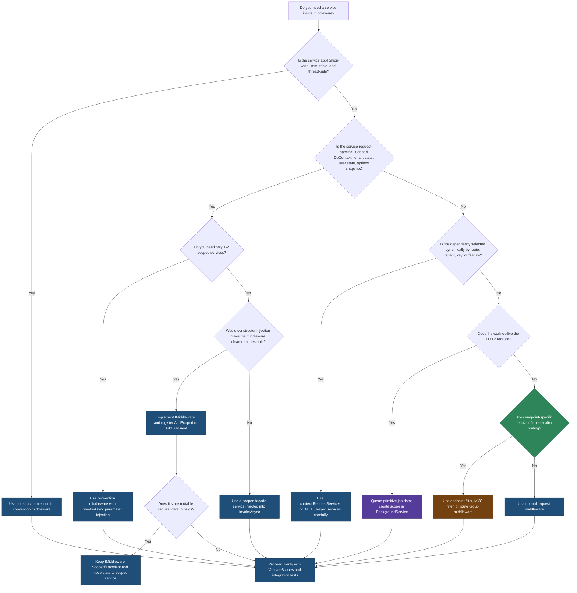

> [!success] Mastery Check
> - [ ] **Studied Well**
> - [ ] **Can explain the concept without notes**
> - [ ] **Can answer interview questions confidently**
> - [ ] **Can implement it in a real project**


# 4.057 — Middleware and Scoped DI: Injecting Scoped Services Correctly

---

## PART 0 — Navigation & Context

### Where This Topic Lives in the ASP.NET Core Domain

```
ASP.NET Core Mastery
│
├── Host & Lifecycle
│   ├── Generic Host, application startup, shutdown, request scope creation
│   └── 4.004  Generic Host (IHost): Configuration and Application Lifecycle
│
├── Configuration
├── Logging
│
├── DI
│   ├── 4.034  The Built-In DI Container
│   ├── 4.035  Service Lifetimes: Singleton, Scoped, Transient
│   ├── 4.036  IServiceProvider and IServiceScope
│   ├── 4.042  The Captive Dependency Problem
│   ├── 4.046  DI Validation at Startup
│   ├── 4.047  DI Scope in Background Services
│   └── 4.057  ◄ YOU ARE HERE FROM THE DI SIDE
│
├── Middleware
│   ├── 4.049  The Middleware Pipeline: Request Delegation Chain
│   ├── 4.050  Writing Middleware: IMiddleware vs Convention-Based
│   ├── 4.051  Short-Circuiting and Pipeline Branching
│   ├── 4.052  Middleware Ordering: The Canonical Order
│   ├── 4.054  HttpContext and IHttpContextAccessor
│   ├── 4.055  Custom Exception Middleware
│   ├── 4.056  Response Buffering vs Streaming
│   ├── 4.057  ◄ YOU ARE HERE FROM THE PIPELINE SIDE
│   ├── 4.058  Endpoint Middleware vs Request Middleware
│   └── 4.063  Middleware Testing
│
├── Routing
├── Minimal APIs / MVC
├── Auth
├── Validation
├── Error Handling
├── Caching
├── Security
├── Real-Time
├── Background Services
├── HTTP Clients
├── Testing
├── Serialization
├── API Design
├── Filters
├── Observability
└── Deployment
```

### What You Need Before This

- **[[4.034 — The Built-In DI Container: Service Registration and Resolution]]** — you need to know how ASP.NET Core resolves dependencies before you can reason about which provider middleware uses.
- **[[4.035 — Service Lifetimes: Singleton, Scoped, Transient — Rules and Pitfalls]]** — this note is mostly about what happens when a Scoped dependency accidentally crosses into a Singleton-like object.
- **[[4.049 — The Middleware Pipeline: Request Delegation Chain]]** — scoped injection in middleware is only meaningful if you understand `RequestDelegate`, `next`, short-circuiting, and reverse response flow.
- **[[4.050 — Writing Middleware: IMiddleware vs Convention-Based]]** — the two middleware activation models are the heart of the DI decision.

### What This Unlocks After

- **[[4.042 — The Captive Dependency Problem: Singleton Consuming Scoped]]** — middleware is one of the most common places this bug escapes code review.
- **[[4.046 — DI Validation at Startup: ValidateOnBuild and ValidateScopes]]** — `ValidateScopes` explains why scoped constructor injection into convention-based middleware throws in development.
- **[[4.047 — DI Scope in Background Services: The IServiceScopeFactory Pattern]]** — middleware and background services share the same rule: if no request scope owns the work, create a scope deliberately.
- **[[4.063 — Middleware Testing: Isolating Middleware Without the Full Pipeline]]** — tests must create request scopes explicitly when middleware depends on Scoped services.

### Why This Topic Matters at Scale

Middleware runs before the endpoint that usually enforces business boundaries, so a single scoped DI mistake can leak tenant, user, transaction, or `DbContext` state across concurrent HTTP requests and turn a throughput optimization into a security and data-corruption incident.

---

## PART 1 — The Core Mental Model

### The Fundamental Rule

> **Convention-based middleware is constructed once from the application provider, while `Invoke` / `InvokeAsync` parameters and `IMiddleware` instances are resolved from the current request scope; the practical consequence is that Scoped services belong in the request-time path, not in a convention-based middleware constructor.**

### The Plain-Language Analogy

Think of the ASP.NET Core pipeline as an airport security lane. The middleware object is the checkpoint booth, built once when the terminal opens; the current HTTP request is a passenger walking through the lane with a temporary tray that exists only for that passenger. A Scoped service is something placed in that passenger's tray: tenant context, user audit buffer, EF Core `DbContext`, request cache, transaction state. If you bolt the tray to the booth constructor, every passenger touches the same tray and the previous passenger's items can still be there. If you resolve the tray through `InvokeAsync`, `context.RequestServices`, or `IMiddleware`, the tray appears for the current passenger, is used while that request moves through the lane, and is disposed when the request leaves, even if the middleware short-circuits the request with a `401`, `403`, or `429`.

### The Taxonomy Diagram

```mermaid
graph TD
    A["Middleware + Scoped DI"] --> B["Convention-Based Middleware"]
    A --> C["Factory-Based Middleware: IMiddleware"]
    A --> D["Manual Resolution"]
    A --> E["Manual Scope Creation"]
    A --> F["Anti-Patterns"]

    B --> B1["Constructor Injection\nRoot application provider\nSafe for Singleton services"]
    B --> B2["Invoke/InvokeAsync Parameter Injection\nRequest provider\nSafe for Scoped services"]
    B --> B3["UseMiddleware<T>()\nBuilds RequestDelegate once"]

    C --> C1["Registered in IServiceCollection"]
    C --> C2["Resolved through IMiddlewareFactory"]
    C --> C3["Normally AddScoped<T>() or AddTransient<T>()"]
    C --> C4["Constructor can receive Scoped dependencies"]

    D --> D1["context.RequestServices.GetRequiredService<T>()"]
    D --> D2["Useful for optional/dynamic dependencies"]
    D --> D3["Avoid service locator drift"]

    E --> E1["IServiceScopeFactory.CreateScope()"]
    E --> E2["Only for work outside request scope"]
    E --> E3["Never carry HttpContext into background work"]

    F --> F1["Scoped service in convention constructor"]
    F --> F2["Root provider captured in field"]
    F --> F3["Task.Run with request-scoped service"]
    F --> F4["Singleton IMiddleware with mutable state"]
    F --> F5["Dispose scoped service manually"]

    classDef pipeline fill:#1f4e79,color:#ffffff,stroke:#0f2942
    classDef request fill:#2f855a,color:#ffffff,stroke:#1f5f3f
    classDef security fill:#9b2c2c,color:#ffffff,stroke:#63171b
    classDef output fill:#744210,color:#ffffff,stroke:#4a2c0a

    class B,B3,C,C2 pipeline
    class B2,C1,C3,C4,D,D1,D2,E,E1,E2 request
    class F,F1,F2,F3,F4,F5 security
    class D3,E3 output
```



---

## PART 2 — Deep Mechanics

### 2.1 The Request Scope Is Created Before Your Middleware Runs

The request scope is the invisible boundary that makes Scoped DI meaningful. Kestrel accepts bytes, ASP.NET Core builds an `HttpContext`, and the framework attaches a per-request `IServiceProvider` to `HttpContext.RequestServices`. Every Scoped service resolved through that provider is cached inside that request scope and disposed when request processing ends.

#### Pipeline Position Diagram

```
TCP socket
  │
  ▼
Kestrel parses HTTP request
  │
  ▼
DefaultHttpContextFactory creates HttpContext
  │
  ▼
RequestServicesFeature creates/attaches request IServiceScope lazily
  │
  ▼
──► ExceptionHandler ──► HSTS ──► HTTPS ──► StaticFiles ──► Routing ──► CORS ──► Auth ──► Authorization ──► [YOUR MIDDLEWARE] ──► Endpoints
                                                                                                  │
                                                                                                  └── context.RequestServices is the request provider

Short-circuit example:
──► ExceptionHandler ──► ... ──► [YOUR MIDDLEWARE writes 401 and does NOT call next] ──X── Endpoints
```

#### HTTP Wire Format

```http
// HTTP request (approximate):
GET /api/orders/42 HTTP/1.1
Host: api.example.com
Authorization: Bearer eyJhbGciOi...
X-Tenant-Id: contoso

// HTTP response if middleware allows the request:
HTTP/1.1 200 OK
Content-Type: application/json; charset=utf-8
X-Correlation-Id: 7f2c9a1d6bd44f19

{"orderId":42,"status":"allocated"}

// HTTP response if middleware short-circuits:
HTTP/1.1 401 Unauthorized
Content-Type: application/problem+json
X-Correlation-Id: 7f2c9a1d6bd44f19

{"type":"https://httpstatuses.com/401","title":"Unauthorized","status":401}
```

#### Framework Source Behavior

ASP.NET Core internally (approximate):

```csharp
// Pipeline position: before user middleware, inside hosting infrastructure.
public async Task ProcessRequestAsync(IFeatureCollection features)
{
    HttpContext context = httpContextFactory.Create(features);

    try
    {
        // The request delegate is the compiled middleware chain.
        await application.RequestDelegate(context);
    }
    finally
    {
        // Disposes request services, including Scoped DbContext, validators,
        // unit-of-work objects, tenant contexts, and audit buffers.
        httpContextFactory.Dispose(context);
    }
}
```

Relevant framework concepts:

- `DefaultHttpContextFactory` creates and initializes `HttpContext`.
- `RequestServicesFeature` provides `HttpContext.RequestServices` and owns the request `IServiceScope`.
- `ApplicationBuilder.Build()` composes the `RequestDelegate` chain once at startup.

#### Runtime Cost Labels

- Creating the request scope: roughly one scope object plus internal cache structures per request.
- Resolving a Scoped service for the first time: O(constructor graph size), cached for later resolutions in the same request.
- Resolving the same Scoped service again in the same request: O(1) dictionary lookup inside the scope.
- Disposing the request scope: O(number of disposable scoped/transient instances created in that scope).

#### The Edge Cases That Bite Engineers

- `HttpContext.RequestServices` is usually created lazily; if nothing resolves services, the scope may stay cheap. Once your middleware resolves a service, you have committed to scope allocation and disposal.
- Scoped means "per logical request scope", not "thread-local". A request can resume on different threads after `await`; the same scope still follows the `HttpContext`.
- Fire-and-forget work scheduled from middleware outlives the request scope. Any Scoped service captured by that work may be disposed before the background code runs.
- If middleware short-circuits, the request scope is still disposed. Short-circuiting changes the downstream pipeline, not DI cleanup.

---

### 2.2 Convention-Based Middleware Is Activated Once

Convention-based middleware is the classic class shape: constructor receives `RequestDelegate next`, public `Invoke` or `InvokeAsync` receives `HttpContext`, and `app.UseMiddleware<T>()` adds it to the pipeline. The trap is activation time. ASP.NET Core creates the middleware instance when the pipeline is built, not once per request.

#### Pipeline Position Diagram

```
Application startup:

builder.Build()
  │
  ▼
ApplicationBuilder.Build()
  │
  ▼
UseMiddleware<OrderTenantMiddleware>()
  │
  ├── ActivatorUtilities.CreateInstance(app.ApplicationServices, typeof(OrderTenantMiddleware), next)
  │      │
  │      ├── Constructor dependencies resolved from ROOT provider
  │      └── Middleware instance stored inside compiled RequestDelegate
  │
  ▼
App starts listening

Runtime request:

──► ExceptionHandler ──► Routing ──► Auth ──► Authorization ──► [same OrderTenantMiddleware instance] ──► Endpoints
                                                                  │
                                                                  └── InvokeAsync params resolved from context.RequestServices
```

#### HTTP Wire Format

```http
// HTTP request A (approximate):
GET /api/orders/42 HTTP/1.1
X-Tenant-Id: northwind

// HTTP request B at the same time:
GET /api/orders/99 HTTP/1.1
X-Tenant-Id: contoso

// Buggy HTTP consequence if tenant scoped state was captured in the constructor:
HTTP/1.1 200 OK
Content-Type: application/json

{"orderId":99,"tenant":"northwind"}  // tenant leak: request B observed request A state
```

#### Framework Source Behavior

`UseMiddlewareExtensions` checks the middleware type at startup. For non-`IMiddleware` types, it creates one middleware instance and returns a delegate that invokes the selected `Invoke` / `InvokeAsync` method for every request.

ASP.NET Core internally (approximate):

```csharp
// Pipeline position: application startup, while building the request delegate chain.
RequestDelegate CreateMiddleware(RequestDelegate next)
{
    object[] constructorArguments = [next, ..explicitArgs];

    // Constructor dependencies come from ApplicationServices: the root provider.
    var middlewareInstance = ActivatorUtilities.CreateInstance(
        app.ApplicationServices,
        typeof(TMiddleware),
        constructorArguments);

    // Request-time parameters after HttpContext are resolved from context.RequestServices.
    return context =>
    {
        IServiceProvider provider = context.RequestServices;
        return InvokeWithServices(middlewareInstance, context, provider);
    };
}
```

If the constructor asks for a Scoped service:

```csharp
// Pipeline position: startup, before any HTTP request can be served.
public sealed class BadTenantMiddleware
{
    private readonly TenantDbContext _db;
    private readonly RequestDelegate _next;

    public BadTenantMiddleware(RequestDelegate next, TenantDbContext db)
    {
        _next = next;
        _db = db;
    }
}
```

Possible failure path:

```
builder.Build()
  │
  ▼
UseMiddleware<T> tries to resolve TenantDbContext from root provider
  │
  ├── Development / ValidateScopes enabled
  │      └── throws InvalidOperationException:
  │          "Cannot resolve scoped service 'TenantDbContext' from root provider."
  │
  └── ValidateScopes disabled
         └── root provider creates/captures the service until app shutdown
             └── Scoped service behaves like Singleton
```

#### Runtime Cost Labels

- Constructor activation: paid once at startup; good for stateless middleware.
- Reflection/expression analysis of `InvokeAsync` parameters: paid once when the pipeline is built.
- Request-time method parameter resolution: O(number of non-`HttpContext` parameters) service lookups per request.
- Captured Scoped dependency: low allocation per request, catastrophic correctness cost.

#### The Edge Cases That Bite Engineers

- `AddScoped<BadTenantMiddleware>()` does not make convention-based middleware Scoped. If the class does not implement `IMiddleware`, `UseMiddleware<T>()` still uses convention activation.
- Constructor-injected `ILogger<T>`, `IOptions<T>`, `IOptionsMonitor<T>`, singleton caches, and other Singleton-safe dependencies are fine.
- `IOptionsSnapshot<T>` is Scoped. It belongs in `InvokeAsync`, not the constructor, unless the middleware uses `IMiddleware`.
- A Scoped service injected into `InvokeAsync` is the same instance that controllers, Minimal API handlers, filters, and endpoint filters receive in that request.

---

### 2.3 InvokeAsync Parameter Injection Uses the Current Request Scope

Convention-based middleware has a special escape hatch: any parameter after `HttpContext` in `Invoke` or `InvokeAsync` is resolved from `HttpContext.RequestServices`. This is the most direct way to use Scoped services while keeping the middleware instance itself Singleton-like.

#### Pipeline Position Diagram

```
Request flow:

──► ExceptionHandler ──► Routing ──► Auth ──► Authorization ──► TenantMiddleware ──► Endpoint
                                                                  │
                                                                  ├── InvokeAsync(HttpContext, ITenantResolver, TenantDbContext)
                                                                  │       │
                                                                  │       └── ITenantResolver + TenantDbContext resolved from request scope
                                                                  │
                                                                  ├── if tenant missing: write 400 and stop
                                                                  └── else: await next(context)

Response flow:

Endpoint ──► TenantMiddleware finally block ──► Authorization ──► Auth ──► Routing ──► ExceptionHandler ──► client
```

#### HTTP Wire Format

```http
// HTTP request with valid tenant:
GET /api/orders/42 HTTP/1.1
Host: api.example.com
X-Tenant-Id: contoso

// HTTP response:
HTTP/1.1 200 OK
Content-Type: application/json
Vary: X-Tenant-Id

{"orderId":42,"tenant":"contoso"}

// HTTP request with missing tenant:
GET /api/orders/42 HTTP/1.1
Host: api.example.com

// HTTP response from middleware:
HTTP/1.1 400 Bad Request
Content-Type: application/problem+json

{"type":"https://example.com/problems/missing-tenant","title":"Missing tenant","status":400}
```

#### Framework Source Behavior

ASP.NET Core internally (approximate):

```csharp
// Pipeline position: request-time, inside the middleware delegate.
Task InvokeConventionMiddleware(HttpContext context)
{
    IServiceProvider requestProvider = context.RequestServices;

    var tenantResolver = requestProvider.GetRequiredService<ITenantResolver>();
    var tenantDb = requestProvider.GetRequiredService<TenantDbContext>();

    return middlewareInstance.InvokeAsync(context, tenantResolver, tenantDb);
}
```

In the real framework, `UseMiddlewareExtensions` precomputes a delegate for the `Invoke` method. On normal JIT-capable runtimes, it compiles an expression to avoid slow reflection on every request. On environments where dynamic code is unavailable, it falls back to reflection.

#### Runtime Cost Labels

- One service lookup per extra `InvokeAsync` parameter per request.
- First resolution of a Scoped graph may allocate the service object and its dependencies.
- Later resolution of that Scoped service in the same request is cached.
- One async state machine if the middleware method contains `await`.

#### The Edge Cases That Bite Engineers

- The parameter name does not matter. The parameter type and optional `[FromKeyedServices]` key matter.
- Method injection is not available on `IMiddleware.InvokeAsync`; `IMiddleware` only receives `HttpContext` and `RequestDelegate`.
- A missing service registration causes an `InvalidOperationException` when the first request reaches the middleware, not necessarily at startup, unless validation or tests cover the route.
- Method-injected services are request scoped, but fields on the middleware class are still shared across requests. Do not copy scoped state into fields.

---

### 2.4 IMiddleware Is Resolved Per Request Through IMiddlewareFactory

`IMiddleware` changes the activation model. Instead of building one middleware instance into the pipeline, ASP.NET Core builds a small delegate that asks `IMiddlewareFactory` to create the middleware for each request. The default factory resolves it from the request provider, so constructor injection of Scoped services is safe when the middleware is registered as Scoped or Transient.

#### Pipeline Position Diagram

```
Startup:

builder.Services.AddScoped<PaymentIdempotencyMiddleware>();
app.UseMiddleware<PaymentIdempotencyMiddleware>();
  │
  └── UseMiddleware sees typeof(IMiddleware).IsAssignableFrom(type)
      └── stores InterfaceMiddlewareBinder delegate, not a PaymentIdempotencyMiddleware instance

Runtime:

──► ExceptionHandler ──► Routing ──► Auth ──► Authorization ──► [IMiddleware binder] ──► Endpoints
                                                                  │
                                                                  ├── context.RequestServices.GetRequiredService<IMiddlewareFactory>()
                                                                  ├── factory.Create(typeof(PaymentIdempotencyMiddleware))
                                                                  ├── middleware.InvokeAsync(context, next)
                                                                  └── factory.Release(middleware)
```

#### HTTP Wire Format

```http
// First payment request:
POST /api/payments HTTP/1.1
Host: payments.example.com
Idempotency-Key: pay_7ed1
Content-Type: application/json

{"amount":1299,"currency":"USD","orderId":"ord_1001"}

// Middleware records key in a scoped unit of work and allows endpoint:
HTTP/1.1 201 Created
Location: /api/payments/pmt_9001
Content-Type: application/json

{"paymentId":"pmt_9001","status":"authorized"}

// Duplicate request while key is locked:
HTTP/1.1 409 Conflict
Content-Type: application/problem+json

{"type":"https://example.com/problems/idempotency-conflict","title":"Idempotency key already in use","status":409}
```

#### Framework Source Behavior

ASP.NET Core internally (approximate):

```csharp
// Pipeline position: request-time, inside InterfaceMiddlewareBinder.
return async context =>
{
    var factory = context.RequestServices.GetRequiredService<IMiddlewareFactory>();
    IMiddleware middleware = factory.Create(typeof(PaymentIdempotencyMiddleware));

    try
    {
        await middleware.InvokeAsync(context, next);
    }
    finally
    {
        factory.Release(middleware);
    }
};
```

Default `MiddlewareFactory` behavior (approximate):

```csharp
// Pipeline position: request-time, using context.RequestServices.
public IMiddleware Create(Type middlewareType)
{
    return (IMiddleware)_serviceProvider.GetRequiredService(middlewareType);
}

public void Release(IMiddleware middleware)
{
    // The default container owns disposal through the request scope.
}
```

#### Failure Mode Diagram

```
Request reaches IMiddleware binder
  │
  ▼
factory.Create(typeof(PaymentIdempotencyMiddleware))
  │
  ├── Service registered
  │      └── constructor dependencies resolved from request scope
  │
  └── Service missing
         └── InvalidOperationException
             └── ExceptionHandler middleware returns 500 if registered before this middleware
```

```http
// HTTP response when IMiddleware type was not registered and exception handling is active:
HTTP/1.1 500 Internal Server Error
Content-Type: application/problem+json

{"type":"https://httpstatuses.com/500","title":"An unexpected error occurred.","status":500}
```

#### Runtime Cost Labels

- One middleware service resolution per request.
- Scoped registration: one middleware instance per request.
- Transient registration: one middleware instance per factory resolution; normally one per request.
- Singleton registration: one instance for the app lifetime; safe only if dependencies and fields are thread-safe and request-agnostic.
- Factory create/release overhead: tiny compared to database, auth, logging, and serialization costs, but measurable in microbenchmarks.

#### The Edge Cases That Bite Engineers

- `IMiddleware` must be registered in DI. `app.UseMiddleware<T>()` alone is not enough.
- `IMiddleware` does not support explicit constructor arguments passed through `UseMiddleware<T>(args)`.
- Registering `IMiddleware` as Singleton brings back the shared-state risk. The interface makes Scoped constructor injection possible; your registration lifetime still matters.
- If the middleware stores mutable request data in fields and is Singleton, concurrent requests race. If it is Scoped, fields are per request but still should be used carefully because async continuations can interleave.

---

### 2.5 Manual Resolution and Manual Scope Creation Are Different Tools

`context.RequestServices.GetRequiredService<T>()` resolves from the current request scope. `IServiceScopeFactory.CreateScope()` creates a new scope independent of the current request. They are not interchangeable.

#### Pipeline Position Diagram

```
Normal per-request resolution:

──► Routing ──► Auth ──► [Middleware] ──► Endpoint
                         │
                         └── context.RequestServices.GetRequiredService<T>()
                             └── same request scope used by endpoint

Manual background scope:

──► Routing ──► Auth ──► [Middleware] ──► Endpoint ──► response returned
                         │
                         └── enqueue background work with primitive data only
                                  │
                                  ▼
                         Background worker later:
                         IServiceScopeFactory.CreateScope()
                                  │
                                  └── new independent scope, no HttpContext
```

#### HTTP Wire Format

```http
// Middleware accepts request quickly and queues audit work:
POST /api/shipments/SH-100/events HTTP/1.1
Host: logistics.example.com
Content-Type: application/json

{"eventType":"Delivered","occurredAt":"2026-06-08T12:20:00Z"}

// Client observes success before background persistence finishes:
HTTP/1.1 202 Accepted
Content-Type: application/json

{"status":"queued"}
```

#### Framework Source Behavior

Request provider resolution:

```csharp
// Pipeline position: inside request middleware.
var auditBuffer = context.RequestServices.GetRequiredService<IShipmentAuditBuffer>();
auditBuffer.Record("request accepted");
await next(context);
```

Manual scope for work outside the request:

```csharp
// Pipeline position: background worker, after the HTTP request has completed.
await using AsyncServiceScope scope = serviceScopeFactory.CreateAsyncScope();
var db = scope.ServiceProvider.GetRequiredService<ShipmentDbContext>();
await db.SaveChangesAsync(stoppingToken);
```

#### Failure Mode Diagram

```
Middleware captures scoped DbContext
  │
  ├── request completes
  │     └── request scope disposed
  │          └── DbContext disposed
  │
  └── Task.Run continues later
        └── ObjectDisposedException OR data race OR lost exception
```

```http
// HTTP consequence:
HTTP/1.1 202 Accepted
Content-Type: application/json

{"status":"queued"}

// Server log after response:
System.ObjectDisposedException: Cannot access a disposed context instance.
```

#### Runtime Cost Labels

- `context.RequestServices.GetRequiredService<T>()`: one request-scope lookup; no new scope.
- `CreateScope()` / `CreateAsyncScope()`: allocates a new scope and its scoped graph; dispose cost is paid separately.
- Background scope database work: at least one database round-trip if persistence occurs.
- Capturing `HttpContext` into background work: zero allocation in code review, unbounded correctness cost at runtime.

#### The Edge Cases That Bite Engineers

- Manual scope creation inside a request is usually wrong if you need to share state with the endpoint. It creates a different Scoped instance.
- Manual scope creation is correct for detached work: queue consumers, hosted services, delayed processing, independent audit persistence, or retry loops after the HTTP request has completed.
- Never pass `HttpContext`, `ClaimsPrincipal`, `IFormFile`, `Stream`, or `DbContext` into background work. Copy primitive values and stable identifiers.
- If a manually created scope owns `IAsyncDisposable` services such as EF Core contexts using async providers, prefer `CreateAsyncScope()` and `await using`.

---

### 2.6 Keyed Services in Middleware (.NET 8+) Follow the Same Scope Rules

.NET 8 added built-in keyed service support. Middleware can request keyed services in constructor parameters and `Invoke` / `InvokeAsync` parameters using `[FromKeyedServices]`. The key changes selection, not lifetime. A keyed Scoped service still must be resolved from a scope.

#### Pipeline Position Diagram

```
Convention-based middleware with keyed service:

Startup:
UseMiddleware<InventoryCacheMiddleware>()
  └── constructor [FromKeyedServices("global")] IInventoryCache
      └── root provider; safe only if global cache is Singleton

Request:
──► Routing ──► Auth ──► [InventoryCacheMiddleware.InvokeAsync(
                           HttpContext,
                           [FromKeyedServices("tenant")] IInventoryCache tenantCache)]
                         ──► Endpoint
                           └── tenant cache resolved from request scope
```

#### HTTP Wire Format

```http
// HTTP request:
GET /api/inventory/SKU-771 HTTP/1.1
Host: inventory.example.com
X-Tenant-Id: fabrikam

// HTTP response:
HTTP/1.1 200 OK
Content-Type: application/json
Cache-Control: private, max-age=30

{"sku":"SKU-771","available":118,"tenant":"fabrikam"}
```

#### Framework Source Behavior

ASP.NET Core internally (approximate):

```csharp
// Pipeline position: request-time method parameter resolution.
object service = parameter.HasFromKeyedServicesAttribute
    ? keyedProvider.GetKeyedService(parameterType, key)
    : provider.GetService(parameterType);
```

#### Runtime Cost Labels

- Keyed lookup: O(1)-ish service lookup with additional key comparison and descriptor lookup.
- First keyed Scoped resolution: constructs and caches the keyed instance in the request scope.
- Constructor keyed service in convention middleware: startup-only resolution from root provider.

#### The Edge Cases That Bite Engineers

- A keyed service can be Singleton, Scoped, or Transient. The key does not make a Scoped service safe in a root constructor.
- Key mismatch fails at runtime when the middleware is activated or invoked.
- Keyed services improve selection clarity, but overusing keys for business branching can hide policy decisions inside DI.
- In `IMiddleware`, keyed constructor dependencies are safe if the middleware itself is resolved from the request scope.

---

## PART 3 — Production Code Patterns

### Pattern 1: The Tenant Gate at the Middleware Boundary

Domain scenario: a multi-tenant order management service rejects requests before routing reaches handlers that assume tenant context is already valid.

```csharp
using Microsoft.AspNetCore.Http;
using Microsoft.AspNetCore.Mvc;

namespace OrderManagement.Api.Middleware;

public interface ITenantContext
{
    string? TenantId { get; set; }
}

public sealed class TenantContext : ITenantContext
{
    public string? TenantId { get; set; }
}

public interface ITenantRegistry
{
    Task<bool> ExistsAsync(string tenantId, CancellationToken cancellationToken);
}

// ⚠️ WRONG: This constructor captures request-specific state in a middleware instance
// that ASP.NET Core creates once while building the pipeline.
public sealed class WrongTenantGateMiddleware
{
    private readonly RequestDelegate _next;
    private readonly ITenantContext _tenantContext;
    private readonly ITenantRegistry _tenantRegistry;

    public WrongTenantGateMiddleware(
        RequestDelegate next,
        ITenantContext tenantContext,
        ITenantRegistry tenantRegistry)
    {
        _next = next;
        _tenantContext = tenantContext;
        _tenantRegistry = tenantRegistry;
    }

    public async Task InvokeAsync(HttpContext context)
    {
        string? tenantId = context.Request.Headers["X-Tenant-Id"];

        if (string.IsNullOrWhiteSpace(tenantId) ||
            !await _tenantRegistry.ExistsAsync(tenantId, context.RequestAborted))
        {
            context.Response.StatusCode = StatusCodes.Status400BadRequest;
            await context.Response.WriteAsJsonAsync(new ProblemDetails
            {
                Status = StatusCodes.Status400BadRequest,
                Title = "Unknown tenant"
            }, context.RequestAborted);
            return;
        }

        _tenantContext.TenantId = tenantId;
        await _next(context);
    }
}

// ✅ CORRECT: The middleware object is stateless. Scoped services are resolved
// from the request provider through InvokeAsync parameters.
public sealed class TenantGateMiddleware
{
    private readonly RequestDelegate _next;

    public TenantGateMiddleware(RequestDelegate next)
    {
        _next = next;
    }

    public async Task InvokeAsync(
        HttpContext context,
        ITenantContext tenantContext,
        ITenantRegistry tenantRegistry)
    {
        string? tenantId = context.Request.Headers["X-Tenant-Id"];

        if (string.IsNullOrWhiteSpace(tenantId) ||
            !await tenantRegistry.ExistsAsync(tenantId, context.RequestAborted))
        {
            context.Response.StatusCode = StatusCodes.Status400BadRequest;
            await context.Response.WriteAsJsonAsync(new ProblemDetails
            {
                Type = "https://example.com/problems/unknown-tenant",
                Status = StatusCodes.Status400BadRequest,
                Title = "Unknown tenant",
                Detail = "The X-Tenant-Id header is missing or not recognized."
            }, context.RequestAborted);
            return;
        }

        tenantContext.TenantId = tenantId;
        context.Response.Headers["Vary"] = "X-Tenant-Id";

        await _next(context);
    }
}

public static class TenantGateMiddlewareExtensions
{
    public static IApplicationBuilder UseTenantGate(this IApplicationBuilder app)
    {
        return app.UseMiddleware<TenantGateMiddleware>();
    }
}
```

```http
// HTTP wire format:
GET /api/orders/42 HTTP/1.1
X-Tenant-Id: contoso

HTTP/1.1 200 OK
Vary: X-Tenant-Id
Content-Type: application/json

{"orderId":42,"tenant":"contoso"}

// HTTP wire format:
GET /api/orders/42 HTTP/1.1

HTTP/1.1 400 Bad Request
Content-Type: application/problem+json

{"type":"https://example.com/problems/unknown-tenant","title":"Unknown tenant","status":400}
```

Pipeline position:

```
──► ExceptionHandler ──► Routing ──► CORS ──► Auth ──► Authorization ──► [TenantGate] ──► Endpoints
```

Cost: one header read, one Scoped `ITenantContext` lookup, one Scoped `ITenantRegistry` lookup, and usually one database/cache read for tenant validation.

---

### Pattern 2: The Payment Idempotency Firewall

Domain scenario: a payment API must prevent duplicate charge attempts by locking an idempotency key before the endpoint runs.

```csharp
using Microsoft.AspNetCore.Http;
using Microsoft.AspNetCore.Mvc;

namespace Payments.Api.Middleware;

public interface IPaymentIdempotencyStore
{
    Task<IdempotencyReservation> TryReserveAsync(
        string key,
        string requestPath,
        CancellationToken cancellationToken);

    Task CompleteAsync(string key, int statusCode, CancellationToken cancellationToken);
}

public sealed record IdempotencyReservation(bool Accepted, string? ExistingPaymentId);

// ⚠️ WRONG: Registering the middleware as Scoped does not help unless it implements IMiddleware.
// UseMiddleware<T>() convention activation still creates one instance at startup.
public sealed class WrongPaymentIdempotencyMiddleware
{
    private readonly RequestDelegate _next;
    private readonly IPaymentIdempotencyStore _store;

    public WrongPaymentIdempotencyMiddleware(RequestDelegate next, IPaymentIdempotencyStore store)
    {
        _next = next;
        _store = store;
    }

    public Task InvokeAsync(HttpContext context)
    {
        return _next(context);
    }
}

// ✅ CORRECT: IMiddleware is resolved per request through IMiddlewareFactory,
// so its constructor can depend on Scoped services safely.
public sealed class PaymentIdempotencyMiddleware : IMiddleware
{
    private readonly IPaymentIdempotencyStore _store;

    public PaymentIdempotencyMiddleware(IPaymentIdempotencyStore store)
    {
        _store = store;
    }

    public async Task InvokeAsync(HttpContext context, RequestDelegate next)
    {
        if (!HttpMethods.IsPost(context.Request.Method) ||
            !context.Request.Path.StartsWithSegments("/api/payments"))
        {
            await next(context);
            return;
        }

        string? key = context.Request.Headers["Idempotency-Key"];
        if (string.IsNullOrWhiteSpace(key))
        {
            context.Response.StatusCode = StatusCodes.Status400BadRequest;
            await context.Response.WriteAsJsonAsync(new ProblemDetails
            {
                Type = "https://example.com/problems/missing-idempotency-key",
                Title = "Missing idempotency key",
                Status = StatusCodes.Status400BadRequest
            }, context.RequestAborted);
            return;
        }

        IdempotencyReservation reservation =
            await _store.TryReserveAsync(key, context.Request.Path, context.RequestAborted);

        if (!reservation.Accepted)
        {
            context.Response.StatusCode = StatusCodes.Status409Conflict;
            await context.Response.WriteAsJsonAsync(new ProblemDetails
            {
                Type = "https://example.com/problems/idempotency-conflict",
                Title = "Idempotency key already in use",
                Status = StatusCodes.Status409Conflict,
                Detail = reservation.ExistingPaymentId is null
                    ? "A request with the same idempotency key is already processing."
                    : $"A payment already exists for this key: {reservation.ExistingPaymentId}."
            }, context.RequestAborted);
            return;
        }

        await next(context);
        await _store.CompleteAsync(key, context.Response.StatusCode, context.RequestAborted);
    }
}

public static class PaymentIdempotencyRegistration
{
    public static IServiceCollection AddPaymentIdempotency(this IServiceCollection services)
    {
        services.AddScoped<PaymentIdempotencyMiddleware>();
        return services;
    }

    public static IApplicationBuilder UsePaymentIdempotency(this IApplicationBuilder app)
    {
        return app.UseMiddleware<PaymentIdempotencyMiddleware>();
    }
}
```

```http
// HTTP wire format:
POST /api/payments HTTP/1.1
Idempotency-Key: pay_abc123
Content-Type: application/json

{"orderId":"ORD-1001","amount":2499}

HTTP/1.1 201 Created
Location: /api/payments/PAY-9001

{"paymentId":"PAY-9001","status":"authorized"}

// Duplicate in-flight request:
HTTP/1.1 409 Conflict
Content-Type: application/problem+json

{"type":"https://example.com/problems/idempotency-conflict","title":"Idempotency key already in use","status":409}
```

Pipeline position:

```
──► ExceptionHandler ──► Routing ──► Auth ──► Authorization ──► [PaymentIdempotency] ──► Payment Endpoint
```

Cost: one middleware instance per request, one Scoped store resolution, one idempotency lookup/lock before the endpoint, and one completion write after the endpoint.

---

### Pattern 3: The Inventory Webhook Signature Verifier

Domain scenario: an inventory webhook receiver validates partner-specific HMAC signatures before deserializing the JSON body.

```csharp
using System.Security.Cryptography;
using System.Text;
using Microsoft.AspNetCore.Http;
using Microsoft.AspNetCore.Mvc;
using Microsoft.Extensions.DependencyInjection;

namespace Inventory.Api.Middleware;

public interface IWebhookSecretProvider
{
    ValueTask<byte[]> GetSecretAsync(string partnerId, CancellationToken cancellationToken);
}

public sealed class WebhookSignatureMiddleware
{
    private readonly RequestDelegate _next;

    public WebhookSignatureMiddleware(RequestDelegate next)
    {
        _next = next;
    }

    // ✅ CORRECT: The secret provider is Scoped because it may use a per-request tenant
    // cache and an EF Core DbContext underneath. It is method-injected from RequestServices.
    public async Task InvokeAsync(HttpContext context, IWebhookSecretProvider secretProvider)
    {
        if (!context.Request.Path.StartsWithSegments("/api/inventory/webhooks"))
        {
            await _next(context);
            return;
        }

        string? partnerId = context.Request.Headers["X-Partner-Id"];
        string? signature = context.Request.Headers["X-Signature-Sha256"];

        if (string.IsNullOrWhiteSpace(partnerId) || string.IsNullOrWhiteSpace(signature))
        {
            context.Response.StatusCode = StatusCodes.Status401Unauthorized;
            await context.Response.WriteAsJsonAsync(new ProblemDetails
            {
                Type = "https://example.com/problems/webhook-signature",
                Title = "Webhook signature required",
                Status = StatusCodes.Status401Unauthorized
            }, context.RequestAborted);
            return;
        }

        context.Request.EnableBuffering(bufferThreshold: 64 * 1024, bufferLimit: 1024 * 1024);

        using var bodyBuffer = new MemoryStream();
        await context.Request.Body.CopyToAsync(bodyBuffer, context.RequestAborted);
        byte[] bodyBytes = bodyBuffer.ToArray();
        context.Request.Body.Position = 0;

        byte[] secret = await secretProvider.GetSecretAsync(partnerId, context.RequestAborted);
        byte[] expectedHash = HMACSHA256.HashData(secret, bodyBytes);
        string expectedSignature = Convert.ToHexString(expectedHash).ToLowerInvariant();

        if (!CryptographicOperations.FixedTimeEquals(
            Encoding.ASCII.GetBytes(expectedSignature),
            Encoding.ASCII.GetBytes(signature)))
        {
            context.Response.StatusCode = StatusCodes.Status401Unauthorized;
            await context.Response.WriteAsJsonAsync(new ProblemDetails
            {
                Type = "https://example.com/problems/webhook-signature",
                Title = "Invalid webhook signature",
                Status = StatusCodes.Status401Unauthorized
            }, context.RequestAborted);
            return;
        }

        await _next(context);
    }
}
```

```http
// HTTP wire format:
POST /api/inventory/webhooks/stock-adjusted HTTP/1.1
X-Partner-Id: warehouse-east
X-Signature-Sha256: 0f2b7e...
Content-Type: application/json

{"sku":"SKU-100","delta":-3}

HTTP/1.1 202 Accepted
Content-Type: application/json

{"status":"accepted"}

// Invalid signature:
HTTP/1.1 401 Unauthorized
Content-Type: application/problem+json

{"type":"https://example.com/problems/webhook-signature","title":"Invalid webhook signature","status":401}
```

Pipeline position:

```
──► ExceptionHandler ──► Routing ──► CORS ──► [WebhookSignature] ──► Auth ──► Authorization ──► Endpoint
```

Cost: one Scoped provider lookup, request-body buffering up to 1 MB, one HMAC over the body, and one fixed-time comparison. This should run before expensive model binding or endpoint work.

---

### Pattern 4: The Logistics Audit Trail That Survives Short-Circuiting

Domain scenario: a logistics tracking API must record request outcome metadata whether the endpoint succeeds, fails validation, or a downstream middleware short-circuits.

```csharp
using Microsoft.AspNetCore.Http;

namespace Logistics.Api.Middleware;

public interface IShipmentAuditTrail
{
    void Begin(string traceIdentifier, string path);
    void MarkOutcome(int statusCode);
    Task FlushAsync(CancellationToken cancellationToken);
}

public sealed class ShipmentAuditMiddleware
{
    private readonly RequestDelegate _next;
    private readonly ILogger<ShipmentAuditMiddleware> _logger;

    public ShipmentAuditMiddleware(
        RequestDelegate next,
        ILogger<ShipmentAuditMiddleware> logger)
    {
        _next = next;
        _logger = logger;
    }

    // ✅ CORRECT: IShipmentAuditTrail is Scoped; the endpoint can append business
    // audit details to the same request audit trail before this finally block flushes.
    public async Task InvokeAsync(HttpContext context, IShipmentAuditTrail auditTrail)
    {
        auditTrail.Begin(context.TraceIdentifier, context.Request.Path);

        try
        {
            await _next(context);
        }
        finally
        {
            auditTrail.MarkOutcome(context.Response.StatusCode);

            try
            {
                await auditTrail.FlushAsync(context.RequestAborted);
            }
            catch (OperationCanceledException) when (context.RequestAborted.IsCancellationRequested)
            {
                _logger.LogInformation(
                    "Shipment audit flush cancelled for {TraceIdentifier}",
                    context.TraceIdentifier);
            }
        }
    }
}
```

```http
// HTTP wire format:
GET /api/shipments/SH-719 HTTP/1.1
Authorization: Bearer eyJhbGciOi...

HTTP/1.1 200 OK
Content-Type: application/json

{"shipmentId":"SH-719","status":"in_transit"}

// Audit middleware observes status 200 after next(context) returns.
```

Pipeline position:

```
──► ExceptionHandler ──► Routing ──► Auth ──► Authorization ──► [ShipmentAudit] ──► Endpoint
      ▲                                                                                  │
      └──────────────────────── exceptions bubble back through audit finally ◄───────────┘
```

Cost: one Scoped audit trail lookup, a few in-memory events during request handling, and one persistence flush after downstream completes. If `FlushAsync` writes to a database, this adds one write round-trip to the request latency.

---

### Pattern 5: The Healthcare Outbox Scope Boundary

Domain scenario: a healthcare patient portal accepts a consent update and schedules an integration event, but the event dispatcher must not capture request-scoped services.

```csharp
using System.Threading.Channels;
using Microsoft.AspNetCore.Http;

namespace PatientPortal.Api.Middleware;

public sealed record ConsentIntegrationJob(
    string PatientId,
    string TraceIdentifier,
    DateTimeOffset AcceptedAtUtc);

public interface IConsentJobQueue
{
    ValueTask EnqueueAsync(ConsentIntegrationJob job, CancellationToken cancellationToken);
}

public sealed class ChannelConsentJobQueue : IConsentJobQueue
{
    private readonly Channel<ConsentIntegrationJob> _channel;

    public ChannelConsentJobQueue(Channel<ConsentIntegrationJob> channel)
    {
        _channel = channel;
    }

    public ValueTask EnqueueAsync(ConsentIntegrationJob job, CancellationToken cancellationToken)
    {
        return _channel.Writer.WriteAsync(job, cancellationToken);
    }
}

public interface IConsentIntegrationDispatcher
{
    Task DispatchAsync(ConsentIntegrationJob job, CancellationToken cancellationToken);
}

public sealed class ConsentOutboxWorker : BackgroundService
{
    private readonly Channel<ConsentIntegrationJob> _channel;
    private readonly IServiceScopeFactory _scopeFactory;

    public ConsentOutboxWorker(
        Channel<ConsentIntegrationJob> channel,
        IServiceScopeFactory scopeFactory)
    {
        _channel = channel;
        _scopeFactory = scopeFactory;
    }

    protected override async Task ExecuteAsync(CancellationToken stoppingToken)
    {
        await foreach (ConsentIntegrationJob job in _channel.Reader.ReadAllAsync(stoppingToken))
        {
            await using AsyncServiceScope scope = _scopeFactory.CreateAsyncScope();
            var dispatcher = scope.ServiceProvider.GetRequiredService<IConsentIntegrationDispatcher>();
            await dispatcher.DispatchAsync(job, stoppingToken);
        }
    }
}

public sealed class ConsentAcceptedMiddleware
{
    private readonly RequestDelegate _next;

    public ConsentAcceptedMiddleware(RequestDelegate next)
    {
        _next = next;
    }

    // ✅ CORRECT: Queue only stable primitive data. The background worker creates
    // a fresh scope later for database and HTTP-client dependencies.
    public async Task InvokeAsync(HttpContext context, IConsentJobQueue queue)
    {
        await _next(context);

        if (context.Response.StatusCode != StatusCodes.Status202Accepted ||
            !context.Request.Path.StartsWithSegments("/api/patient-consents"))
        {
            return;
        }

        string? patientId = context.Request.RouteValues["patientId"]?.ToString();
        if (string.IsNullOrWhiteSpace(patientId))
        {
            return;
        }

        await queue.EnqueueAsync(new ConsentIntegrationJob(
            patientId,
            context.TraceIdentifier,
            DateTimeOffset.UtcNow), CancellationToken.None);
    }
}
```

```http
// HTTP wire format:
POST /api/patient-consents/PAT-881 HTTP/1.1
Content-Type: application/json

{"shareWithPartner":true}

HTTP/1.1 202 Accepted
Content-Type: application/json

{"status":"accepted"}

// Background dispatch happens later in a separate DI scope.
```

Pipeline position:

```
Request pipeline:
──► ExceptionHandler ──► Routing ──► Auth ──► Authorization ──► [ConsentAccepted] ──► Endpoint

Background pipeline:
Channel reader ──► IServiceScopeFactory.CreateAsyncScope ──► Scoped dispatcher ──► external integration
```

Cost: one Scoped queue lookup during the request, one channel write, one background scope per job, and independent downstream I/O. Request latency stays low, but consistency becomes eventual.

---

### Pattern 6: The Tenant-Specific Cache Selector With Keyed Services (.NET 8+)

Domain scenario: an e-commerce inventory API uses a global product cache for public catalog reads and a tenant-scoped cache for internal stock reads.

```csharp
using Microsoft.AspNetCore.Http;
using Microsoft.Extensions.DependencyInjection;

namespace Commerce.Api.Middleware;

public interface IInventoryCache
{
    Task WarmAsync(string tenantId, CancellationToken cancellationToken);
}

public sealed class InventoryCacheWarmupMiddleware
{
    private readonly RequestDelegate _next;
    private readonly IInventoryCache _globalCache;

    public InventoryCacheWarmupMiddleware(
        RequestDelegate next,
        [FromKeyedServices("global")] IInventoryCache globalCache)
    {
        _next = next;
        _globalCache = globalCache;
    }

    // ✅ CORRECT: The global cache is Singleton-safe in the constructor.
    // The tenant cache is Scoped and resolved for the current request.
    public async Task InvokeAsync(
        HttpContext context,
        [FromKeyedServices("tenant")] IInventoryCache tenantCache)
    {
        string tenantId = context.Request.Headers["X-Tenant-Id"].ToString();

        if (context.Request.Path.StartsWithSegments("/api/internal/inventory") &&
            !string.IsNullOrWhiteSpace(tenantId))
        {
            await tenantCache.WarmAsync(tenantId, context.RequestAborted);
        }
        else
        {
            await _globalCache.WarmAsync("public-catalog", context.RequestAborted);
        }

        await _next(context);
    }
}

public static class InventoryCacheRegistration
{
    public static IServiceCollection AddInventoryCaches(this IServiceCollection services)
    {
        services.AddKeyedSingleton<IInventoryCache, PublicCatalogInventoryCache>("global");
        services.AddKeyedScoped<IInventoryCache, TenantInventoryCache>("tenant");
        return services;
    }
}

public sealed class PublicCatalogInventoryCache : IInventoryCache
{
    public Task WarmAsync(string tenantId, CancellationToken cancellationToken)
    {
        return Task.CompletedTask;
    }
}

public sealed class TenantInventoryCache : IInventoryCache
{
    public Task WarmAsync(string tenantId, CancellationToken cancellationToken)
    {
        return Task.CompletedTask;
    }
}
```

```http
// HTTP wire format:
GET /api/internal/inventory/SKU-77 HTTP/1.1
X-Tenant-Id: contoso

HTTP/1.1 200 OK
Content-Type: application/json

{"sku":"SKU-77","available":41}
```

Pipeline position:

```
──► ExceptionHandler ──► Routing ──► Auth ──► Authorization ──► [InventoryCacheWarmup] ──► Endpoint
```

Cost: one keyed Scoped lookup for tenant paths or one Singleton method call for public paths. The keyed selection cost is tiny; cache warmup I/O dominates.

---

## PART 4 — Gotchas & Anti-Patterns

### Gotcha 1: Registering a Convention Middleware as Scoped and Thinking It Is Scoped

Experienced engineers fall into this because controllers, filters, handlers, and most application services honor their DI registration lifetime. Convention-based middleware is different: `UseMiddleware<T>()` creates the middleware instance while building the pipeline unless `T` implements `IMiddleware`.

```csharp
// ⚠️ WRONG CODE (with a comment showing the runtime/HTTP consequence)
builder.Services.AddScoped<OrderTenantMiddleware>();
builder.Services.AddScoped<OrderTenantContext>();

app.UseMiddleware<OrderTenantMiddleware>();

public sealed class OrderTenantMiddleware
{
    private readonly RequestDelegate _next;
    private readonly OrderTenantContext _tenantContext;

    public OrderTenantMiddleware(RequestDelegate next, OrderTenantContext tenantContext)
    {
        _next = next;
        _tenantContext = tenantContext; // Captured at startup/root-provider activation.
    }

    public Task InvokeAsync(HttpContext context)
    {
        _tenantContext.TenantId = context.Request.Headers["X-Tenant-Id"];
        return _next(context);
    }
}
```

```http
// HTTP consequence (wrong path):
// Development with ValidateScopes:
// app.Build() throws InvalidOperationException before serving traffic.
//
// Production without scope validation:
// GET /api/orders/1 with X-Tenant-Id: northwind
// GET /api/orders/2 with X-Tenant-Id: contoso
// The shared middleware field can expose the wrong tenant to downstream code.
```

```csharp
// ✅ CORRECT CODE
builder.Services.AddScoped<OrderTenantContext>();

app.UseMiddleware<OrderTenantMiddleware>();

public sealed class OrderTenantMiddleware
{
    private readonly RequestDelegate _next;

    public OrderTenantMiddleware(RequestDelegate next)
    {
        _next = next;
    }

    public Task InvokeAsync(HttpContext context, OrderTenantContext tenantContext)
    {
        tenantContext.TenantId = context.Request.Headers["X-Tenant-Id"];
        return _next(context);
    }
}
```

```http
// HTTP consequence (correct path):
// Each request gets its own OrderTenantContext from HttpContext.RequestServices.
// Concurrent requests cannot overwrite each other's tenant context instance.
```

WHY: Convention-based middleware activation uses the application provider for constructor dependencies. `InvokeAsync` parameter injection uses the request provider, which is the scope shared by endpoints and other request components.

---

### Gotcha 2: Copying a Scoped Service Into a Field During InvokeAsync

The code "looks" correct because the Scoped service arrives through `InvokeAsync`. The bug appears when the middleware stores that per-request object in a field on the Singleton-like middleware instance.

```csharp
// ⚠️ WRONG CODE (with a comment showing the runtime/HTTP consequence)
public sealed class CurrentUserMiddleware
{
    private readonly RequestDelegate _next;
    private IUserProfile? _currentUser;

    public CurrentUserMiddleware(RequestDelegate next)
    {
        _next = next;
    }

    public async Task InvokeAsync(HttpContext context, IUserProfileLoader loader)
    {
        _currentUser = await loader.LoadAsync(context.User, context.RequestAborted);
        await _next(context);
    }
}
```

```http
// HTTP consequence (wrong path):
// Request A authenticates as alice@example.com.
// Request B authenticates as bob@example.com at the same time.
// Any code reading _currentUser from the middleware instance can observe the other request's user.
```

```csharp
// ✅ CORRECT CODE
public sealed class CurrentUserMiddleware
{
    private readonly RequestDelegate _next;

    public CurrentUserMiddleware(RequestDelegate next)
    {
        _next = next;
    }

    public async Task InvokeAsync(
        HttpContext context,
        IUserProfileLoader loader,
        CurrentUserRequestState requestState)
    {
        requestState.User =
            await loader.LoadAsync(context.User, context.RequestAborted);

        await _next(context);
    }
}

public sealed class CurrentUserRequestState
{
    public IUserProfile? User { get; set; }
}
```

```http
// HTTP consequence (correct path):
// Request A and request B each mutate their own CurrentUserRequestState instance.
// Downstream handlers in each request read the correct user.
```

WHY: Method injection only fixes resolution. It does not change the lifetime of the middleware object. Fields on convention-based middleware are shared unless the field contains immutable, thread-safe, application-wide state.

---

### Gotcha 3: Creating a New Scope Inside the Request and Breaking Shared State

Manual scope creation is a legitimate tool, so experienced engineers reach for it too quickly. Inside a normal HTTP request, `context.RequestServices` is already the scope you usually want.

```csharp
// ⚠️ WRONG CODE (with a comment showing the runtime/HTTP consequence)
public sealed class WrongManualScopeTenantMiddleware
{
    private readonly RequestDelegate _next;
    private readonly IServiceScopeFactory _scopeFactory;

    public WrongManualScopeTenantMiddleware(RequestDelegate next, IServiceScopeFactory scopeFactory)
    {
        _next = next;
        _scopeFactory = scopeFactory;
    }

    public async Task InvokeAsync(HttpContext context)
    {
        using IServiceScope scope = _scopeFactory.CreateScope();
        var tenantContext = scope.ServiceProvider.GetRequiredService<TenantContext>();
        tenantContext.TenantId = context.Request.Headers["X-Tenant-Id"];

        await _next(context);
    }
}
```

```http
// HTTP consequence (wrong path):
// GET /api/orders/42 with X-Tenant-Id: contoso
// Endpoint receives a different TenantContext from the real request scope.
// Result: 403, 404, or cross-tenant query guard failure even though the header was valid.
```

```csharp
// ✅ CORRECT CODE
public sealed class RequestScopeTenantMiddleware
{
    private readonly RequestDelegate _next;

    public RequestScopeTenantMiddleware(RequestDelegate next)
    {
        _next = next;
    }

    public async Task InvokeAsync(HttpContext context, TenantContext tenantContext)
    {
        tenantContext.TenantId = context.Request.Headers["X-Tenant-Id"];
        await _next(context);
    }
}
```

```http
// HTTP consequence (correct path):
// GET /api/orders/42 with X-Tenant-Id: contoso
// Endpoint and middleware share the same TenantContext.
// Response can be 200 if authorization and data checks pass.
```

WHY: A manually created scope is a separate island. Use it for detached background work, not for state that must be shared with downstream request handlers.

---

### Gotcha 4: Capturing Scoped Services in Fire-and-Forget Work

The wrong mental model is "I already have the service, so I can use it in a background task." The service is tied to the request scope, and the request scope is disposed as soon as ASP.NET Core finishes the HTTP pipeline.

```csharp
// ⚠️ WRONG CODE (with a comment showing the runtime/HTTP consequence)
public sealed class WrongAuditDispatchMiddleware
{
    private readonly RequestDelegate _next;

    public WrongAuditDispatchMiddleware(RequestDelegate next)
    {
        _next = next;
    }

    public async Task InvokeAsync(HttpContext context, AuditDbContext auditDb)
    {
        await _next(context);

        _ = Task.Run(async () =>
        {
            auditDb.AuditEvents.Add(new AuditEvent(context.TraceIdentifier));
            await auditDb.SaveChangesAsync();
        });
    }
}
```

```http
// HTTP consequence (wrong path):
// Client receives:
// HTTP/1.1 200 OK
//
// Later server log:
// ObjectDisposedException: Cannot access a disposed context instance.
// Or worse: the background exception is unobserved and the audit event is silently lost.
```

```csharp
// ✅ CORRECT CODE
public sealed class AuditDispatchMiddleware
{
    private readonly RequestDelegate _next;
    private readonly IBackgroundAuditQueue _queue;

    public AuditDispatchMiddleware(RequestDelegate next, IBackgroundAuditQueue queue)
    {
        _next = next;
        _queue = queue;
    }

    public async Task InvokeAsync(HttpContext context)
    {
        await _next(context);

        await _queue.EnqueueAsync(new AuditEnvelope(
            context.TraceIdentifier,
            context.Request.Path,
            context.Response.StatusCode,
            DateTimeOffset.UtcNow), CancellationToken.None);
    }
}
```

```http
// HTTP consequence (correct path):
// Client receives the intended response.
// Background audit worker later creates its own DI scope and persists the event reliably.
```

WHY: Request-scoped dependencies die with the request. Background work needs a queue and a new scope created by a hosted service through `IServiceScopeFactory`.

---

### Gotcha 5: Making IMiddleware Singleton Because It "Has No State"

`IMiddleware` supports DI registration lifetimes, which is powerful and dangerous. A Singleton `IMiddleware` with mutable fields or Scoped constructor dependencies reintroduces the same bug the interface was meant to avoid.

```csharp
// ⚠️ WRONG CODE (with a comment showing the runtime/HTTP consequence)
builder.Services.AddSingleton<RateLimitDecisionMiddleware>();

public sealed class RateLimitDecisionMiddleware : IMiddleware
{
    private string? _lastApiKey;

    public async Task InvokeAsync(HttpContext context, RequestDelegate next)
    {
        _lastApiKey = context.Request.Headers["X-Api-Key"];
        context.Response.Headers["X-Last-Key-Seen"] = _lastApiKey;
        await next(context);
    }
}
```

```http
// HTTP consequence (wrong path):
// Two concurrent requests can overwrite _lastApiKey.
// A response can emit X-Last-Key-Seen for the wrong client.
```

```csharp
// ✅ CORRECT CODE
builder.Services.AddScoped<RateLimitDecisionMiddleware>();
builder.Services.AddScoped<RateLimitDecisionState>();

public sealed class RateLimitDecisionMiddleware : IMiddleware
{
    private readonly RateLimitDecisionState _state;

    public RateLimitDecisionMiddleware(RateLimitDecisionState state)
    {
        _state = state;
    }

    public async Task InvokeAsync(HttpContext context, RequestDelegate next)
    {
        _state.ApiKey = context.Request.Headers["X-Api-Key"];
        await next(context);
    }
}

public sealed class RateLimitDecisionState
{
    public string? ApiKey { get; set; }
}
```

```http
// HTTP consequence (correct path):
// Each request has a separate RateLimitDecisionMiddleware and RateLimitDecisionState.
// No response can observe another client's API key through middleware fields.
```

WHY: `IMiddleware` changes who activates the middleware; it does not magically make shared mutable state safe. Use Scoped or Transient for request-aware `IMiddleware`, and reserve Singleton for immutable, thread-safe, application-wide behavior.

---

## PART 5 — Performance Implications

### Request Pipeline Characteristics Table

| Scenario | Pipeline Depth | Allocations Per Request | Approx Latency Impact | Recommendation |
|---|---:|---:|---:|---|
| Stateless convention middleware with only `_next` and `ILogger<T>` | +1 middleware hop | 0 middleware instance allocations | ~10-80 ns plus async continuation if awaited | Best for cheap cross-cutting behavior |
| Convention middleware with one Scoped `InvokeAsync` parameter | +1 hop + 1 DI lookup | 0 middleware instance allocations; scoped service allocates only on first request-scope use | ~50-300 ns for cached lookup, more for graph construction | Preferred when one or two Scoped services are needed |
| Convention middleware with three Scoped `InvokeAsync` parameters | +1 hop + 3 DI lookups | Depends on scoped graph | ~150-900 ns plus graph construction | Fine for normal APIs; group dependencies behind a request service if it clarifies design |
| `IMiddleware` registered Scoped | +1 binder hop + middleware resolution | 1 middleware object per request plus scoped graph | ~100 ns-1 µs before dependency cost | Preferred when constructor injection improves clarity or many scoped dependencies are required |
| `IMiddleware` registered Transient | +1 binder hop + transient middleware resolution | 1 middleware object per request | Similar to Scoped for normal `UseMiddleware` | Good for stateless but dependency-rich middleware |
| Manual `context.RequestServices.GetRequiredService<T>()` once | +1 service lookup | No extra scope | ~50-300 ns if cached | Useful for dynamic/optional dependencies; avoid turning middleware into a service locator |
| Creating `IServiceScopeFactory.CreateScope()` inside request | +1 new scope + separate graph | Scope allocation plus all scoped services inside it | Microseconds plus graph construction | Avoid unless deliberately isolating work from request state |
| Middleware validates tenant with database lookup | +1 hop + DI + database call | Scoped graph plus DB client work | 1-20 ms depending on storage | Cache tenant metadata; do not hit DB on every request at high throughput |
| Fire-and-forget with captured Scoped service | Looks cheap | Hidden task allocation; correctness failure | Unbounded; failures occur after response | Never do this; use a queue and hosted service |
| Scoped service in convention constructor with ValidateScopes off | 0 request allocations | Captured once until app shutdown | Looks fast in benchmark | Invalid optimization; corrupts request isolation |

### BenchmarkDotNet Code

```csharp
using BenchmarkDotNet.Attributes;
using BenchmarkDotNet.Running;
using Microsoft.AspNetCore.Http;
using Microsoft.Extensions.DependencyInjection;

namespace MiddlewareScopedDiBenchmarks;

[MemoryDiagnoser]
public class ScopedMiddlewareResolutionBenchmarks
{
    private DefaultHttpContext _context = null!;
    private RequestDelegate _terminal = null!;
    private StatelessConventionMiddleware _stateless = null!;
    private MethodInjectedConventionMiddleware _methodInjected = null!;
    private PaymentAuditMiddleware _imiddleware = null!;

    [GlobalSetup]
    public void Setup()
    {
        var services = new ServiceCollection();
        services.AddScoped<RequestAuditBuffer>();
        services.AddScoped<PaymentAuditMiddleware>();
        services.AddSingleton<IMiddlewareFactory, MiddlewareFactory>();

        ServiceProvider root = services.BuildServiceProvider(new ServiceProviderOptions
        {
            ValidateScopes = true,
            ValidateOnBuild = true
        });

        IServiceScope requestScope = root.CreateScope();

        _context = new DefaultHttpContext
        {
            RequestServices = requestScope.ServiceProvider
        };

        _terminal = static _ => Task.CompletedTask;
        _stateless = new StatelessConventionMiddleware(_terminal);
        _methodInjected = new MethodInjectedConventionMiddleware(_terminal);
        _imiddleware = requestScope.ServiceProvider.GetRequiredService<PaymentAuditMiddleware>();
    }

    [Benchmark(Baseline = true)]
    public Task StatelessConvention()
    {
        return _stateless.InvokeAsync(_context);
    }

    [Benchmark]
    public Task ManualRequestServicesResolution()
    {
        return _methodInjected.InvokeWithManualResolutionAsync(_context);
    }

    [Benchmark]
    public Task ScopedInvokeParameterSimulation()
    {
        var auditBuffer = _context.RequestServices.GetRequiredService<RequestAuditBuffer>();
        return _methodInjected.InvokeAsync(_context, auditBuffer);
    }

    [Benchmark]
    public Task ScopedIMiddleware()
    {
        return _imiddleware.InvokeAsync(_context, _terminal);
    }
}

public sealed class StatelessConventionMiddleware
{
    private readonly RequestDelegate _next;

    public StatelessConventionMiddleware(RequestDelegate next)
    {
        _next = next;
    }

    public Task InvokeAsync(HttpContext context)
    {
        return _next(context);
    }
}

public sealed class MethodInjectedConventionMiddleware
{
    private readonly RequestDelegate _next;

    public MethodInjectedConventionMiddleware(RequestDelegate next)
    {
        _next = next;
    }

    public Task InvokeWithManualResolutionAsync(HttpContext context)
    {
        var auditBuffer = context.RequestServices.GetRequiredService<RequestAuditBuffer>();
        auditBuffer.Mark("manual");
        return _next(context);
    }

    public Task InvokeAsync(HttpContext context, RequestAuditBuffer auditBuffer)
    {
        auditBuffer.Mark("method");
        return _next(context);
    }
}

public sealed class PaymentAuditMiddleware : IMiddleware
{
    private readonly RequestAuditBuffer _auditBuffer;

    public PaymentAuditMiddleware(RequestAuditBuffer auditBuffer)
    {
        _auditBuffer = auditBuffer;
    }

    public Task InvokeAsync(HttpContext context, RequestDelegate next)
    {
        _auditBuffer.Mark("imiddleware");
        return next(context);
    }
}

public sealed class RequestAuditBuffer
{
    private string _lastMarker = "";

    public void Mark(string marker)
    {
        _lastMarker = marker;
    }
}

public static class Program
{
    public static void Main(string[] args)
    {
        BenchmarkRunner.Run<ScopedMiddlewareResolutionBenchmarks>();
    }
}

// Expected output (approximate, .NET 8, x64, Kestrel-like local delegate path):
//
// | Method                         | Mean      | Allocated |
// |------------------------------- |----------:|----------:|
// | StatelessConvention            |  10-40 ns |       0 B |
// | ManualRequestServicesResolution|  50-250 ns|       0 B |
// | ScopedInvokeParameterSimulation|  50-250 ns|       0 B |
// | ScopedIMiddleware              |  20-100 ns|       0 B |
//
// If the benchmark includes middleware creation per request through IMiddlewareFactory,
// expect one small middleware object allocation unless the container/runtime can elide it.
// For real HTTP profiling, use dotnet-trace, dotnet-counters, EventCounters,
// OpenTelemetry spans, or MiniProfiler around the actual Kestrel pipeline.
```

### When This Costs You

- High-throughput APIs above 10k req/s where every middleware adds a measurable P99 contribution.
- Tenant or auth middleware that does remote policy lookups on every request.
- Large middleware chains where each component performs DI lookups, logging scopes, and async calls.
- `IMiddleware` with expensive constructor graphs that are rebuilt for every request.
- Request middleware that creates manual scopes and duplicates `DbContext`, caches, validators, or options snapshots.
- Body-reading middleware that combines Scoped DI with buffering, because the I/O and allocations dominate the DI cost.

### When This Doesn't Matter

- Internal admin endpoints with low request volume.
- Management APIs where correctness and explicitness matter more than microsecond-level overhead.
- Middleware that resolves one or two Scoped services and then performs database, Redis, HTTP, or serialization work.
- One-time batch endpoints or rare operational callbacks.
- Middleware registered only in development, such as diagnostic or local testing helpers.

---

## PART 6 — Interview Arsenal

### A. The Question Bank

#### Question 1

**Question:** "Can I inject a scoped service into ASP.NET Core middleware?"

**Average Answer:** Yes, ASP.NET Core supports dependency injection in middleware, and Scoped services are per request.

**Why That's Insufficient:** It ignores the activation model difference between convention-based middleware and `IMiddleware`.

**Great Answer:**

> I always split that answer by middleware type. In convention-based middleware, the constructor is not a request-time boundary; ASP.NET Core creates that middleware instance when the pipeline is built, so constructor dependencies come from the application provider. A Scoped service belongs either in `Invoke` / `InvokeAsync` parameters or in `context.RequestServices`, because those are resolved from the current request scope. If I want normal constructor injection for Scoped services, I implement `IMiddleware` and register the middleware as Scoped or Transient. The HTTP consequence is request isolation: tenant context, `DbContext`, and audit buffers must be unique to the request that produced the response, not shared across concurrent requests.

#### Question 2

**Question:** "What happens if a convention-based middleware constructor takes a DbContext?"

**Average Answer:** That is bad because `DbContext` is Scoped and middleware is Singleton.

**Why That's Insufficient:** It does not describe when the failure occurs or what happens when scope validation is off.

**Great Answer:**

> A convention-based middleware is activated while building the application pipeline, so `UseMiddleware<T>()` tries to resolve that `DbContext` from the root provider. In development, or whenever `ValidateScopes` is enabled, that should throw before the app serves requests: you cannot resolve a Scoped service from the root provider. If validation is disabled, the bug can be worse because the context can effectively be promoted to application lifetime and disposed only when the root provider shuts down. From the client's perspective, the first symptom may be random 500s, stale tracked entities, cross-request state, or data concurrency failures under load, not a neat compile-time error.

#### Question 3

**Question:** "When would you choose `IMiddleware` over `InvokeAsync` parameter injection?"

**Average Answer:** I use `IMiddleware` when I need Scoped services.

**Why That's Insufficient:** `InvokeAsync` parameter injection also supports Scoped services; the real decision is about design, registration, and activation.

**Great Answer:**

> If the middleware has one or two request services, I often use convention-based middleware with `InvokeAsync` parameter injection because the middleware stays stateless and cheap. I choose `IMiddleware` when the middleware itself is request-oriented, has several Scoped dependencies, needs normal constructor injection for testability, or belongs to a feature module that already registers request-scoped components. I register it as Scoped or Transient and let `IMiddlewareFactory` resolve it from `HttpContext.RequestServices`. The HTTP behavior is the same if both are written correctly: the middleware can short-circuit with the same status codes and headers. The difference is the lifetime boundary and how easy it is to avoid accidentally storing request state in a shared object.

#### Question 4

**Question:** "Should middleware create an `IServiceScope` to resolve Scoped services?"

**Average Answer:** You can use `IServiceScopeFactory` to create a scope when you need Scoped services.

**Why That's Insufficient:** Inside an HTTP request, a scope already exists, and a second scope can break shared request state.

**Great Answer:**

> During a normal HTTP request, I almost never create a new scope inside middleware just to resolve a Scoped service. ASP.NET Core already created the request scope, and `context.RequestServices` is the provider that controllers, Minimal APIs, filters, and other middleware share. If I create another scope, I get a different `DbContext`, tenant context, options snapshot, or unit of work, and downstream code won't see the state I set. I use `IServiceScopeFactory` only when the work is detached from the request, like a hosted service or queued background job. In that case I copy stable values like IDs and trace identifiers, then create a fresh scope later without carrying `HttpContext` or request-scoped objects.

#### Question 5

**Question:** "Where should a tenant-resolving middleware sit in the pipeline if it needs authenticated user claims and a scoped tenant context?"

**Average Answer:** Put it after authentication so it can read `HttpContext.User`.

**Why That's Insufficient:** It must also consider routing metadata, authorization, CORS, and whether tenant resolution affects authorization.

**Great Answer:**

> I place it after routing and authentication if it needs endpoint metadata and authenticated claims. Whether it goes before or after authorization depends on the policy: if authorization needs the tenant context, tenant resolution must run before `UseAuthorization`; if the tenant should only be set after authorization succeeds, it can run after. CORS still needs to be earlier so preflight requests do not hit tenant or auth logic unnecessarily. The HTTP consequence of the wrong order is visible: OPTIONS preflight may get a 401, authorization may deny because tenant requirements are missing, or the endpoint may run with an unset tenant and produce a 500 or incorrect 404.

### B. The Trick Questions

#### Trick 1

**Question:** "If I write `builder.Services.AddScoped<MyMiddleware>()`, is `MyMiddleware` scoped?"

**Trap:** Most DI types honor their registration lifetime, but convention-based middleware does not unless it implements `IMiddleware`.

**Correct Answer:** Not necessarily. If `MyMiddleware` is convention-based, `UseMiddleware<MyMiddleware>()` creates it through convention activation at pipeline-build time. The Scoped registration is ignored for activation. It becomes request-scoped only if it implements `IMiddleware` and is resolved by `IMiddlewareFactory`.

#### Trick 2

**Question:** "If a Scoped service is injected into `InvokeAsync`, can I store it in a middleware field for later use?"

**Trap:** The resolution is scoped, but the middleware object may still be shared.

**Correct Answer:** No. In convention-based middleware, fields live on the one middleware instance shared by requests. Store request state in a Scoped request service, `HttpContext.Items`, or local variables that flow through the current call. Otherwise concurrent requests can overwrite each other and produce wrong HTTP responses.

#### Trick 3

**Question:** "Does `IMiddleware` always create one middleware instance per request?"

**Trap:** The factory resolves from DI, and DI obeys your registration lifetime.

**Correct Answer:** Only if you register it as Scoped or Transient. If you register an `IMiddleware` as Singleton, every request uses the same instance. Constructor injection of Scoped services will fail with scope validation or become invalid through the same lifetime mismatch.

#### Trick 4

**Question:** "If middleware short-circuits before calling `next`, are Scoped services disposed?"

**Trap:** People confuse downstream pipeline execution with request lifetime cleanup.

**Correct Answer:** Yes. Short-circuiting prevents downstream middleware and endpoints from running, but the hosting layer still completes the request and disposes the request scope. The client may get a `400`, `401`, `403`, or `429` directly from the middleware, and Scoped services resolved during that request are disposed afterward.

#### Trick 5

**Question:** "Is `IHttpContextAccessor` a good way for a Singleton middleware dependency to access Scoped request data?"

**Trap:** `IHttpContextAccessor` can access current context, but it does not make captured dependencies safe.

**Correct Answer:** It can be used sparingly to read the current `HttpContext`, but it is not a license to inject Scoped services into Singleton objects or store request data in fields. Prefer passing `HttpContext`, method-injected services, or a scoped request-state service. The HTTP bug to watch for is cross-request state leaking through a singleton that reads and caches request-specific information.

### C. Red Flags to Avoid

- "Middleware is always transient." This is false for convention-based middleware and dangerous for lifetime reasoning.
- "Just inject `DbContext` into the middleware constructor." That signals you do not understand root provider activation.
- "Registering the middleware as Scoped fixes it." Only true for `IMiddleware`.
- "Use `IServiceScopeFactory` everywhere." Inside requests, this can create a second scope and break shared request state.
- "Task.Run is fine after the response." Captured request services are disposed when the request ends.
- "Scoped means thread-local." Scoped means tied to a DI scope, not a specific thread.
- "A singleton middleware is fine if it only stores the last request ID." Any mutable request-specific field is a concurrency leak.
- "The client won't notice a DI lifetime bug." The client notices through wrong status codes, stale data, cross-tenant responses, intermittent 500s, and missing audit records.

---

## PART 7 — Decision Framework



---

## PART 8 — Self-Check

### A. Conceptual Questions

1. What happens to the HTTP request if a convention-based middleware short-circuits after resolving a Scoped service from `InvokeAsync`?
2. What happens to the HTTP request if a middleware constructor asks for `IOptionsSnapshot<T>` and `ValidateScopes` is enabled?
3. Why does `builder.Services.AddScoped<MyConventionMiddleware>()` not make constructor injection of Scoped services safe?
4. In what situation is `IServiceScopeFactory.CreateScope()` correct inside middleware, and why is it usually wrong for normal request state?
5. How does `IMiddlewareFactory` change the activation path compared with convention-based middleware?
6. Why can a Scoped service injected into `InvokeAsync` still cause a cross-request bug if the middleware copies it into a field?
7. Where should middleware that needs `HttpContext.GetEndpoint()` metadata be placed relative to routing?
8. Where should middleware that creates tenant context for authorization be placed relative to authentication and authorization?
9. Why is a manually created scope inside a request unable to share tenant state with a controller action?
10. What should you copy into a background job from middleware, and what should you never copy?

### B. Code Puzzles

#### Puzzle 1: What status code does the client see?

```csharp
app.UseMiddleware<ApiKeyMiddleware>();
app.MapGet("/api/orders/{id:int}", () => Results.Ok());

public sealed class ApiKeyMiddleware
{
    private readonly RequestDelegate _next;

    public ApiKeyMiddleware(RequestDelegate next)
    {
        _next = next;
    }

    public Task InvokeAsync(HttpContext context, ApiKeyRequestState state)
    {
        if (!context.Request.Headers.ContainsKey("X-Api-Key"))
        {
            context.Response.StatusCode = StatusCodes.Status401Unauthorized;
            return Task.CompletedTask;
        }

        state.ApiKey = context.Request.Headers["X-Api-Key"];
        return _next(context);
    }
}
```

<details>
<summary>Answer</summary>

The client receives `401 Unauthorized` for a request without `X-Api-Key`. The middleware resolves `ApiKeyRequestState` from the request scope, writes the status code, and does not call `_next(context)`, so the endpoint never runs. The request scope is still disposed after the pipeline returns.

</details>

#### Puzzle 2: Where is the bug?

```csharp
builder.Services.AddScoped<AuditDbContext>();
builder.Services.AddScoped<AuditMiddleware>();

app.UseMiddleware<AuditMiddleware>();

public sealed class AuditMiddleware
{
    private readonly RequestDelegate _next;
    private readonly AuditDbContext _db;

    public AuditMiddleware(RequestDelegate next, AuditDbContext db)
    {
        _next = next;
        _db = db;
    }

    public Task InvokeAsync(HttpContext context)
    {
        return _next(context);
    }
}
```

<details>
<summary>Answer</summary>

The bug is the `AuditDbContext` constructor parameter. `AuditMiddleware` is convention-based because it does not implement `IMiddleware`. `UseMiddleware<AuditMiddleware>()` activates it at pipeline-build time using the application provider. With scope validation enabled, startup throws before serving requests. Without validation, the `DbContext` can be captured from the root provider and behave like a Singleton, which is invalid.

</details>

#### Puzzle 3: Does this share state with the endpoint?

```csharp
public sealed class TenantMiddleware
{
    private readonly RequestDelegate _next;
    private readonly IServiceScopeFactory _scopeFactory;

    public TenantMiddleware(RequestDelegate next, IServiceScopeFactory scopeFactory)
    {
        _next = next;
        _scopeFactory = scopeFactory;
    }

    public async Task InvokeAsync(HttpContext context)
    {
        using IServiceScope scope = _scopeFactory.CreateScope();
        var tenant = scope.ServiceProvider.GetRequiredService<TenantContext>();
        tenant.Id = context.Request.Headers["X-Tenant-Id"];

        await _next(context);
    }
}
```

<details>
<summary>Answer</summary>

No. This creates a separate DI scope, sets `TenantContext.Id` inside that separate scope, and then calls the endpoint. The endpoint resolves `TenantContext` from `context.RequestServices`, which is the real request scope, so it sees a different instance. The HTTP response may be a `403`, `404`, or `500` depending on how downstream code reacts to missing tenant state.

</details>

#### Puzzle 4: Which middleware instances are per request?

```csharp
builder.Services.AddSingleton<SingletonHeaderMiddleware>();
builder.Services.AddScoped<ScopedHeaderMiddleware>();

app.UseMiddleware<SingletonHeaderMiddleware>();
app.UseMiddleware<ScopedHeaderMiddleware>();

public sealed class SingletonHeaderMiddleware : IMiddleware
{
    public Task InvokeAsync(HttpContext context, RequestDelegate next)
    {
        context.Response.Headers["X-Singleton"] = "yes";
        return next(context);
    }
}

public sealed class ScopedHeaderMiddleware : IMiddleware
{
    public Task InvokeAsync(HttpContext context, RequestDelegate next)
    {
        context.Response.Headers["X-Scoped"] = "yes";
        return next(context);
    }
}
```

<details>
<summary>Answer</summary>

`SingletonHeaderMiddleware` is one instance for the entire app because it is registered as Singleton. `ScopedHeaderMiddleware` is one instance per request because it is registered as Scoped. Both implement `IMiddleware`, so `UseMiddleware<T>()` uses `IMiddlewareFactory` and respects the DI registration lifetime. The HTTP response can contain both headers, but only the Scoped middleware gets a fresh instance per request.

</details>

#### Puzzle 5: What happens after the response?

```csharp
public sealed class FireAndForgetMiddleware
{
    private readonly RequestDelegate _next;

    public FireAndForgetMiddleware(RequestDelegate next)
    {
        _next = next;
    }

    public async Task InvokeAsync(HttpContext context, ShipmentDbContext db)
    {
        await _next(context);

        _ = Task.Run(async () =>
        {
            db.ShipmentAudits.Add(new ShipmentAudit(context.TraceIdentifier));
            await db.SaveChangesAsync();
        });
    }
}
```

<details>
<summary>Answer</summary>

The client may receive the original endpoint response, often `200 OK` or `202 Accepted`, because the background task is not awaited. After the response, ASP.NET Core disposes the request scope, which disposes `ShipmentDbContext`. The `Task.Run` delegate can then throw `ObjectDisposedException`, lose the audit write, or access `HttpContext` after it is no longer valid. The correct pattern is to enqueue primitive job data and let a `BackgroundService` create a fresh DI scope.

</details>

---

## PART 9 — Connections & Resources

### A. Related Topics Table

| Topic | Why It Connects |
|---|---|
| [[4.034 — The Built-In DI Container: Service Registration and Resolution]] | Middleware activation is just DI resolution at a different point in the application lifecycle. |
| [[4.035 — Service Lifetimes: Singleton, Scoped, Transient — Rules and Pitfalls]] | This topic is the concrete middleware application of lifetime rules. |
| [[4.036 — IServiceProvider and IServiceScope: Manual Resolution Patterns]] | `context.RequestServices` and `IServiceScopeFactory` are the two service-provider APIs middleware authors must distinguish. |
| [[4.042 — The Captive Dependency Problem: Singleton Consuming Scoped]] | Convention-based middleware constructor injection is a common captive dependency path. |
| [[4.046 — DI Validation at Startup: ValidateOnBuild and ValidateScopes]] | Scope validation is what catches many bad middleware constructor dependencies before traffic arrives. |
| [[4.047 — DI Scope in Background Services: The IServiceScopeFactory Pattern]] | Middleware that starts detached work must hand off to background services and new scopes. |
| [[4.049 — The Middleware Pipeline: Request Delegation Chain]] | Scoped services live for the request that travels through the `RequestDelegate` chain. |
| [[4.050 — Writing Middleware: IMiddleware vs Convention-Based]] | This note explains the activation models that decide whether Scoped constructor injection is valid. |
| [[4.052 — Middleware Ordering: The Canonical Order and Why It Matters]] | DI correctness is not enough; middleware must still run at the right point relative to routing, auth, and endpoints. |
| [[4.054 — HttpContext and IHttpContextAccessor: Safe Shared Request State]] | `HttpContext.RequestServices` is the request-scope access point, and `IHttpContextAccessor` must not become a backdoor for shared mutable state. |
| [[4.083 — Minimal API Filters: IEndpointFilter Pipeline]] | Endpoint filters have their own activation and DI behavior; use them when the concern is endpoint-specific rather than whole-pipeline. |
| [[3.033 — DbContext Lifetime and Unit of Work]] | EF Core `DbContext` is Scoped by default, making it the most common service affected by middleware DI mistakes. |
| [[2.14 — Async/Await Internals]] | Request scopes flow across awaits, but fire-and-forget async work breaks the request lifetime boundary. |

### B. Books

| Book | Chapters | Why These Chapters |
|---|---|---|
| *ASP.NET Core in Action*, Andrew Lock | Middleware, Dependency Injection, Configuration | These chapters connect middleware activation, request services, and DI lifetime behavior in production-style apps. |
| *Pro ASP.NET Core*, Adam Freeman | Middleware, Services and Dependency Injection | Good for seeing convention middleware, pipeline composition, and DI registration rules side by side. |
| *Dependency Injection Principles, Practices, and Patterns*, Mark Seemann and Steven van Deursen | Captive Dependencies, Object Composition, Lifetime Management | The captive dependency explanation applies directly to convention middleware constructor injection. |
| *Entity Framework Core in Action*, Jon P Smith | DbContext Lifetime, Unit of Work, ASP.NET Core Integration | Explains why `DbContext` is Scoped and why sharing it across requests is invalid. |

### C. Essential Articles & Docs

- [Microsoft Docs — Dependency injection in ASP.NET Core](https://learn.microsoft.com/en-us/aspnet/core/fundamentals/dependency-injection)
- [Microsoft Docs — Write custom ASP.NET Core middleware](https://learn.microsoft.com/en-us/aspnet/core/fundamentals/middleware/write)
- [Microsoft Docs — Factory-based middleware activation in ASP.NET Core](https://learn.microsoft.com/en-us/aspnet/core/fundamentals/middleware/extensibility)
- [Microsoft Docs — Dependency injection service lifetimes](https://learn.microsoft.com/en-us/dotnet/core/extensions/dependency-injection#service-lifetimes)
- [GitHub — UseMiddlewareExtensions source](https://github.com/dotnet/aspnetcore/blob/main/src/Http/Http.Abstractions/src/Extensions/UseMiddlewareExtensions.cs)
- [Steve Gordon — Deep Dive: How is the ASP.NET Core Middleware Pipeline Built?](https://www.stevejgordon.co.uk/how-is-the-asp-net-core-middleware-pipeline-built)

### D. Template Meta-Note

> [!NOTE]
> **Part 0** orients you in the ASP.NET Core map before details begin.  
> **Part 1** gives the one-sentence rule, analogy, and taxonomy.  
> **Part 2** shows what the framework does in the HTTP pipeline and DI container.  
> **Part 3** turns the mechanics into production code patterns.  
> **Part 4** names the bugs senior engineers still ship.  
> **Part 5** explains cost, latency, allocation, and when to care.  
> **Part 6** prepares interview answers that mention pipeline and HTTP consequences.  
> **Part 7** gives a decision flowchart for choosing the right ASP.NET Core component.  
> **Part 8** checks whether you can reason from code to runtime behavior.  
> **Part 9** connects this note to the rest of the knowledge base and primary resources.
