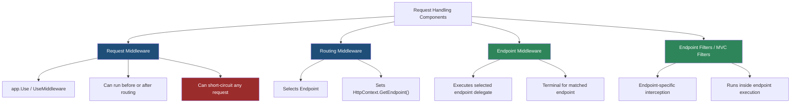
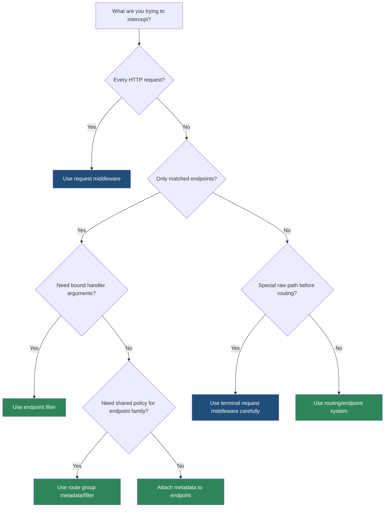

> [!success] Mastery Check
> - [ ] **Studied Well**
> - [ ] **Can explain the concept without notes**
> - [ ] **Can answer interview questions confidently**
> - [ ] **Can implement it in a real project**


# 4.058 — Endpoint Middleware vs Request Middleware: The Distinction

---

## PART 0 — Navigation & Context

### Where This Topic Lives

```
ASP.NET Core Mastery
├── Middleware Pipeline
│   ├── 4.049  RequestDelegate chain
│   ├── 4.052  Middleware ordering
│   ├── 4.058  ◄ YOU ARE HERE — request middleware vs endpoint middleware
│   └── 4.063  Middleware testing
├── Routing
│   ├── 4.064  Endpoint routing
│   ├── 4.065  Route templates
│   └── 4.070  Route groups
└── Minimal APIs / MVC
    ├── Endpoint handlers
    ├── Endpoint filters
    └── MVC filter pipeline
```

### What You Need Before This

- **[[4.049 — The Middleware Pipeline: Request Delegation Chain]]** — request middleware is just a `RequestDelegate` wrapper.
- **[[4.052 — Middleware Ordering: The Canonical Order and Why It Matters]]** — this distinction matters only because pipeline position changes behavior.
- **[[4.064 — Endpoint Routing: The Modern Routing Architecture]]** — routing selects an endpoint before endpoint middleware executes it.

### What This Unlocks After

- **[[4.070 — Route Groups: Prefix, Filters, Metadata, and Shared Middleware]]** — route groups attach endpoint-level behavior without global middleware.
- **[[4.083 — Minimal API Filters: IEndpointFilter Pipeline]]** — endpoint filters are endpoint-scoped interception, not app-wide request middleware.
- **[[4.089 — Authorization on Endpoints: RequireAuthorization and WithMetadata]]** — endpoint metadata is what lets authorization behave per endpoint.

### Why This Matters at Scale

At scale, putting endpoint-specific logic into global request middleware makes every request pay for code that only some endpoints need, while putting global transport/security logic into endpoint filters leaves static files, health checks, preflight requests, and unmatched routes outside the policy.

---

## PART 1 — The Core Mental Model

### The Fundamental Rule

> **Request middleware wraps the whole HTTP pipeline at a chosen position; endpoint middleware executes the selected endpoint after routing. The practical consequence is that request middleware is for cross-cutting request flow, while endpoint behavior belongs on endpoints, metadata, route groups, or filters.**

### The Plain-Language Analogy

Request middleware is the building's hallway security: everyone passes it if it is placed before the destination. Endpoint middleware is the door to the exact meeting room chosen by the receptionist. If the receptionist has not selected a room yet, hallway security cannot inspect room rules. If the door rule is attached to the room, it only runs for people who reach that room, not for the whole building.

### The Taxonomy Diagram



---

## PART 2 — Deep Mechanics

### 2.1 Request Middleware Can See the Whole Request, But Not Always the Endpoint

```
──► ExceptionHandler ──► HTTPS ──► StaticFiles ──► Routing ──► Auth ──► Authorization ──► Custom Request Middleware ──► Endpoint
                                                 │
                                                 └── after Routing, context.GetEndpoint() may be non-null
```

```http
// HTTP request:
GET /api/orders/42 HTTP/1.1
Authorization: Bearer token

// HTTP response when request middleware short-circuits:
HTTP/1.1 429 Too Many Requests
Retry-After: 15
Content-Type: application/problem+json
```

ASP.NET Core internally (approximate):

```csharp
// Pipeline position: anywhere app.Use placed it.
app.Use(async (context, next) =>
{
    Endpoint? endpoint = context.GetEndpoint(); // null before routing
    await next(context);
});
```

Cost: one delegate hop per middleware, one async continuation if it awaits, O(1) endpoint lookup after routing. Edge case: middleware before `UseRouting` cannot read endpoint metadata; it must use path/header data or move later.

### 2.2 Routing Selects, Endpoint Middleware Executes

```
──► StaticFiles ──► Routing ──► Auth ──► Authorization ──► EndpointMiddleware ──► Endpoint delegate
                   │                                               │
                   └── match route pattern                         └── invoke MapGet/Controller/Hub/Razor endpoint
```

```http
// HTTP request:
GET /api/orders/42 HTTP/1.1

// HTTP response from matched endpoint:
HTTP/1.1 200 OK
Content-Type: application/json

{"orderId":42}
```

ASP.NET Core internally (approximate):

```csharp
Endpoint? endpoint = context.GetEndpoint();
if (endpoint is null)
{
    await next(context); // later middleware may produce 404
    return;
}

RequestDelegate endpointDelegate = endpoint.RequestDelegate!;
await endpointDelegate(context);
```

Cost: route matching is optimized using endpoint data sources and matcher structures; endpoint execution cost depends on handler type. Edge case: endpoints are terminal once executed; middleware registered after endpoint execution usually does not run for matched endpoints.

### 2.3 Endpoint Metadata Lets Request Middleware Behave Per Endpoint

```
──► Routing ──► [Policy Middleware Reads Endpoint Metadata] ──► EndpointMiddleware
                 │
                 ├── IAuthorizeData
                 ├── ICorsMetadata
                 ├── IRateLimiterPolicy
                 └── custom metadata
```

```http
// HTTP request:
DELETE /api/payments/pay_123 HTTP/1.1
Authorization: Bearer low-privilege-token

// HTTP response from authorization middleware:
HTTP/1.1 403 Forbidden
```

Framework behavior:

```csharp
Endpoint? endpoint = context.GetEndpoint();
var policy = endpoint?.Metadata.GetMetadata<PaymentRiskPolicyMetadata>();
if (policy is not null && !await riskEngine.AllowsAsync(context.User, policy))
{
    context.Response.StatusCode = StatusCodes.Status403Forbidden;
    return;
}
```

Cost: metadata access is O(n) over endpoint metadata collection, usually tiny. Edge case: metadata-aware middleware must run after routing and before endpoint execution.

### 2.4 Endpoint Filters Run Inside Endpoint Execution

```
──► Routing ──► Auth ──► Authorization ──► EndpointMiddleware
                                                │
                                                ├── EndpointFilter 1
                                                ├── EndpointFilter 2
                                                └── Handler delegate
```

```http
// HTTP request:
POST /api/orders HTTP/1.1
Content-Type: application/json

{"quantity":0}

// HTTP response from endpoint filter validation:
HTTP/1.1 400 Bad Request
Content-Type: application/problem+json
```

Cost: endpoint filters run only for matched endpoints; they add one delegate hop per filter. Edge case: filters do not protect static files, unmatched routes, CORS preflight, or requests short-circuited before endpoint execution.

---

## PART 3 — Production Code Patterns

### Pattern 1: Correlation ID as Request Middleware

```csharp
public sealed class CorrelationIdMiddleware
{
    private readonly RequestDelegate _next;

    public CorrelationIdMiddleware(RequestDelegate next) => _next = next;

    public async Task InvokeAsync(HttpContext context)
    {
        string correlationId = context.Request.Headers.TryGetValue("X-Correlation-Id", out var value)
            ? value.ToString()
            : context.TraceIdentifier;

        context.Response.Headers["X-Correlation-Id"] = correlationId;
        context.Items["CorrelationId"] = correlationId;

        await _next(context);
    }
}
```

```http
// HTTP wire format:
GET /api/orders/42 HTTP/1.1
X-Correlation-Id: req-123

HTTP/1.1 200 OK
X-Correlation-Id: req-123
```

Use request middleware because every response should carry the header, including `404`, `401`, and endpoint errors.

### Pattern 2: Payment Risk Policy as Metadata-Aware Middleware

```csharp
public sealed record PaymentRiskMetadata(decimal MaximumAmount);

app.MapPost("/api/payments", CreatePayment)
   .WithMetadata(new PaymentRiskMetadata(5000m));

app.Use(async (context, next) =>
{
    PaymentRiskMetadata? metadata =
        context.GetEndpoint()?.Metadata.GetMetadata<PaymentRiskMetadata>();

    if (metadata is not null && context.Request.ContentLength > 32_000)
    {
        context.Response.StatusCode = StatusCodes.Status413PayloadTooLarge;
        return;
    }

    await next(context);
});
```

```http
// HTTP consequence:
HTTP/1.1 413 Payload Too Large
```

Register after routing so the endpoint has been selected.

### Pattern 3: Order Validation as Endpoint Filter

```csharp
app.MapPost("/api/orders", (CreateOrderRequest request) =>
{
    return Results.Created($"/api/orders/{Guid.NewGuid():N}", request);
})
.AddEndpointFilter(async (context, next) =>
{
    var request = context.GetArgument<CreateOrderRequest>(0);
    if (request.Quantity <= 0)
    {
        return Results.ValidationProblem(new Dictionary<string, string[]>
        {
            ["quantity"] = ["Quantity must be greater than zero."]
        });
    }

    return await next(context);
});

public sealed record CreateOrderRequest(string Sku, int Quantity);
```

Use endpoint filters because validation depends on bound handler arguments.

### Pattern 4: Terminal Middleware for Legacy Health Probe

```csharp
app.Use(async (context, next) =>
{
    if (context.Request.Path == "/legacy-health")
    {
        context.Response.ContentType = "text/plain";
        await context.Response.WriteAsync("ok");
        return;
    }

    await next(context);
});
```

This is request middleware by design: it bypasses routing for a very small, deliberate path.

### Pattern 5: Route Group for Endpoint Family Policy

```csharp
RouteGroupBuilder admin = app.MapGroup("/api/admin")
    .RequireAuthorization("AdminOnly")
    .AddEndpointFilter<AdminAuditFilter>();

admin.MapGet("/orders", ListOrders);
admin.MapDelete("/orders/{id:guid}", DeleteOrder);
```

This is endpoint-scoped policy: it applies only to the admin endpoint family and uses routing metadata.

---

## PART 4 — Gotchas & Anti-Patterns

### Gotcha 1: Reading Endpoint Metadata Before Routing

```csharp
// ⚠️ WRONG CODE
app.Use(async (context, next) =>
{
    if (context.GetEndpoint()?.Metadata.GetMetadata<AuthorizeAttribute>() is not null)
    {
        context.Response.StatusCode = 403;
        return;
    }
    await next(context);
});
app.UseRouting();
```

```http
// HTTP consequence (wrong path):
// Middleware sees null endpoint and allows a request it meant to inspect.
```

```csharp
// ✅ CORRECT CODE
app.UseRouting();
app.Use(async (context, next) =>
{
    Endpoint? endpoint = context.GetEndpoint();
    await next(context);
});
```

WHY: `EndpointRoutingMiddleware` sets the endpoint; before it runs there is no selected endpoint.

### Gotcha 2: Using Terminal Middleware Instead of Routing for Business Endpoints

```csharp
// ⚠️ WRONG CODE
app.Use(async (context, next) =>
{
    if (context.Request.Path == "/api/payments")
    {
        await context.Response.WriteAsync("created");
        return;
    }
    await next(context);
});
```

```http
// HTTP consequence (wrong path):
// Authorization, OpenAPI metadata, route values, filters, and endpoint policy are bypassed.
```

```csharp
// ✅ CORRECT CODE
app.MapPost("/api/payments", CreatePayment).RequireAuthorization("Payments.Write");
```

WHY: Business endpoints should participate in endpoint routing so metadata-aware middleware can enforce policy.

### Gotcha 3: Expecting Endpoint Filters to Run for 404s

```csharp
// ⚠️ WRONG CODE
app.MapGroup("/api").AddEndpointFilter<ApiAuditFilter>();
```

```http
// HTTP consequence (wrong path):
// GET /api/not-real returns 404 without running ApiAuditFilter.
```

```csharp
// ✅ CORRECT CODE
app.UseMiddleware<GlobalRequestAuditMiddleware>();
app.MapGroup("/api").AddEndpointFilter<ApiEndpointAuditFilter>();
```

WHY: endpoint filters run only after an endpoint is selected and executed.

### Gotcha 4: Registering Middleware After Endpoints and Expecting It to Wrap Them

```csharp
// ⚠️ WRONG CODE
app.MapGet("/api/orders", ListOrders);
app.Run(async context => await context.Response.WriteAsync("fallback"));
app.UseMiddleware<ResponseHeaderMiddleware>();
```

```http
// HTTP consequence (wrong path):
// The header middleware is unreachable for matched endpoints and fallback paths.
```

```csharp
// ✅ CORRECT CODE
app.UseMiddleware<ResponseHeaderMiddleware>();
app.MapGet("/api/orders", ListOrders);
```

WHY: terminal middleware and endpoint execution stop the pipeline.

### Gotcha 5: Using Request Middleware for Bound Argument Validation

```csharp
// ⚠️ WRONG CODE
app.Use(async (context, next) =>
{
    // Re-reading JSON here duplicates model binding work and risks consuming the body.
    await next(context);
});
```

```http
// HTTP consequence (wrong path):
// Handler may see an empty body or validation runs inconsistently.
```

```csharp
// ✅ CORRECT CODE
app.MapPost("/api/orders", CreateOrder)
   .AddEndpointFilter<OrderValidationFilter>();
```

WHY: endpoint filters see already-bound arguments; request middleware sees raw HTTP.

---

## PART 5 — Performance Implications

| Scenario | Pipeline Depth | Allocations Per Request | Approx Latency Impact | Recommendation |
|---|---:|---:|---:|---|
| Stateless request middleware | +1 global hop | 0-1 | nanoseconds to low microseconds | Use for truly global concerns |
| Metadata-aware request middleware | +1 hop + metadata lookup | 0 | low microseconds | Place after routing |
| Endpoint filter | +1 endpoint-only hop | 0-1 | low microseconds | Use for endpoint-specific validation |
| Terminal middleware path check | +1 path check globally | 0 | tiny | Reserve for special simple paths |
| Global middleware doing endpoint-only DB lookup | +1 hop + I/O for all requests | many | milliseconds | Move to endpoint/group filter |
| Endpoint group policy | endpoint-only | minimal | low | Prefer for resource families |
| Static file through endpoint filter | not applicable | 0 | none | Filters do not run |
| Middleware after endpoint execution | usually unreachable | 0 | none | Avoid unless deliberately fallback-only |

```csharp
[MemoryDiagnoser]
public sealed class EndpointVsRequestMiddlewareBenchmarks
{
    private readonly RequestDelegate _terminal = _ => Task.CompletedTask;
    private readonly DefaultHttpContext _context = new();

    [Benchmark(Baseline = true)]
    public Task OneRequestMiddleware()
    {
        RequestDelegate next = _terminal;
        return next(_context);
    }

    [Benchmark]
    public Task MetadataLookup()
    {
        _ = _context.GetEndpoint()?.Metadata;
        return _terminal(_context);
    }

    [Benchmark]
    public async Task EndpointFilterShape()
    {
        await _terminal(_context);
    }
}
```

When this costs you: global middleware that performs endpoint-only work, remote calls before route selection, or filters stacked on hot endpoints. When this does not matter: simple header, trace, and response-shaping middleware whose work is cheaper than JSON serialization.

---

## PART 6 — Interview Arsenal

### A. The Question Bank

**Question:** "What's the difference between middleware and an endpoint?"

Average answer: Middleware runs before controllers and endpoints handle the request.

Why that's insufficient: It misses routing selection and endpoint metadata.

Great answer:

> I think of request middleware as the outer HTTP pipeline and endpoints as the selected terminal handler. Routing chooses an endpoint and stores it on `HttpContext`; middleware after routing can read that metadata, and endpoint middleware eventually invokes the selected delegate. If the concern applies to every request, like correlation IDs or exception handling, I use request middleware. If the concern applies only to selected handlers, like Minimal API validation or admin audit, I attach it to the endpoint or route group so unrelated requests do not pay for it.

**Question:** "Why does authorization middleware need routing first?"

Great answer:

> Authorization uses endpoint metadata, such as `[Authorize]` or `RequireAuthorization`, to know which policy applies. Before routing, `HttpContext.GetEndpoint()` is null, so there is no endpoint policy to evaluate. The HTTP consequence of wrong order is either every request being treated generically or policy not being applied as intended.

**Question:** "Can endpoint filters replace middleware?"

Great answer:

> Only for endpoint-scoped concerns. Filters run inside endpoint execution, after routing and after middleware such as auth. They do not run for static files, unmatched routes, or requests short-circuited earlier. I use filters for bound-argument validation and endpoint-specific response shaping; I use middleware for transport-level or global behavior.

### B. Trick Questions

- "Does `MapGet` add middleware?" Trap: it registers an endpoint; endpoint middleware executes it later.
- "Can middleware after `MapGet` wrap the endpoint?" Correct answer: in minimal hosting ordering can be subtle, but terminal middleware after endpoint execution will not wrap already-executed endpoints; put wrappers before endpoint execution.
- "Can request middleware validate Minimal API parameters?" It can parse the body manually, but it should not; endpoint filters see bound arguments.

### C. Red Flags to Avoid

- "Middleware and filters are basically the same." They run at different pipeline levels.
- "Endpoint metadata is available everywhere." It exists only after routing.
- "Endpoint filters secure the whole app." They secure only endpoints that execute them.
- "Terminal middleware is fine for API endpoints." It bypasses endpoint routing features.
- "Put all cross-cutting concerns in global middleware." That wastes work and hides endpoint policy.

---

## PART 7 — Decision Framework



---

## PART 8 — Self-Check

### A. Conceptual Questions

1. What happens to `HttpContext.GetEndpoint()` before routing runs?
2. Why can authorization read `[Authorize]` metadata only after route matching?
3. What happens to a request if terminal middleware returns without calling `next()`?
4. Why are endpoint filters inappropriate for global correlation IDs?
5. What does endpoint middleware actually execute?
6. Why is request middleware better for 404 audit logging?
7. What is the cost difference between global middleware and endpoint filters?
8. Where would you place middleware that reads endpoint metadata?

### B. Code Puzzles

```csharp
app.Use(async (ctx, next) =>
{
    var endpoint = ctx.GetEndpoint();
    await next();
});
app.UseRouting();
```

<details><summary>Answer</summary>
`endpoint` is null because routing has not selected an endpoint yet.
</details>

```csharp
app.MapGet("/secure", () => "ok").RequireAuthorization();
app.UseAuthorization();
```

<details><summary>Answer</summary>
The order is wrong in explicit pipeline style. Authorization must run after routing and before endpoint execution so it can see endpoint metadata.
</details>

```csharp
app.Use(async (ctx, next) =>
{
    ctx.Response.StatusCode = 204;
});
app.MapGet("/orders", () => "orders");
```

<details><summary>Answer</summary>
The middleware short-circuits. `/orders` returns `204 No Content`; the endpoint does not run.
</details>

```csharp
app.MapGet("/orders/{id:int}", (int id) => id)
   .AddEndpointFilter(async (ctx, next) => await next(ctx));
```

<details><summary>Answer</summary>
The filter runs only when `/orders/{id:int}` matches and endpoint execution begins.
</details>

---

## PART 9 — Connections & Resources

### A. Related Topics Table

| Topic | Why It Connects |
|---|---|
| [[4.049 — The Middleware Pipeline: Request Delegation Chain]] | Request middleware is the core `RequestDelegate` chain. |
| [[4.052 — Middleware Ordering: The Canonical Order and Why It Matters]] | The distinction only works if routing, auth, and endpoint execution are ordered correctly. |
| [[4.064 — Endpoint Routing: The Modern Routing Architecture]] | Endpoint routing explains endpoint selection and execution. |
| [[4.070 — Route Groups: Prefix, Filters, Metadata, and Shared Middleware]] | Route groups are endpoint-family policy. |
| [[4.083 — Minimal API Filters: IEndpointFilter Pipeline]] | Endpoint filters are the endpoint-scoped alternative to middleware. |

### B. Books

| Book | Chapters | Why These Chapters |
|---|---|---|
| *ASP.NET Core in Action* | Middleware, Routing, Minimal APIs | Clear contrast between global pipeline and endpoint execution. |
| *Pro ASP.NET Core* | URL routing, middleware | Shows terminal middleware and endpoint routing patterns. |

### C. Essential Articles & Docs

- [Microsoft Docs — ASP.NET Core Middleware](https://learn.microsoft.com/en-us/aspnet/core/fundamentals/middleware/)
- [Microsoft Docs — Routing in ASP.NET Core](https://learn.microsoft.com/en-us/aspnet/core/fundamentals/routing)
- [Microsoft Docs — Minimal API filters](https://learn.microsoft.com/en-us/aspnet/core/fundamentals/minimal-apis/min-api-filters)
- [GitHub — ASP.NET Core routing source](https://github.com/dotnet/aspnetcore/tree/main/src/Http/Routing)

### D. Template Meta-Note

> [!NOTE]
> **Part 0** orients the topic. **Part 1** gives the mental model. **Part 2** shows framework mechanics. **Part 3** gives production patterns. **Part 4** names gotchas. **Part 5** covers performance. **Part 6** prepares interviews. **Part 7** gives decisions. **Part 8** checks understanding. **Part 9** connects resources.
