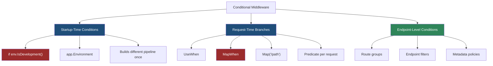
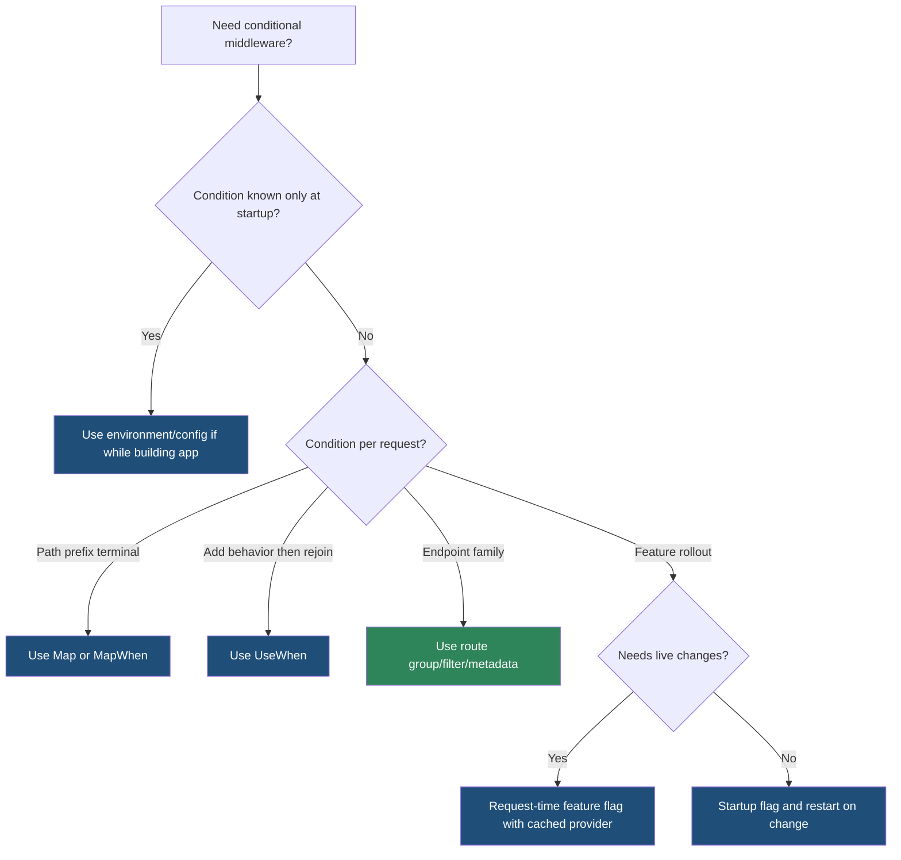

> [!success] Mastery Check
> - [ ] **Studied Well**
> - [ ] **Can explain the concept without notes**
> - [ ] **Can answer interview questions confidently**
> - [ ] **Can implement it in a real project**


# 4.059 — Conditional Middleware: Environment and Feature-Specific Pipelines

---

## PART 0 — Navigation & Context

### Where This Topic Lives

```
ASP.NET Core Mastery
├── Host & Lifecycle
│   └── 4.003  IWebHostEnvironment
├── Configuration
│   └── 4.021  Feature Flags
└── Middleware Pipeline
    ├── 4.049  RequestDelegate chain
    ├── 4.051  Map, MapWhen, UseWhen
    ├── 4.052  Middleware ordering
    └── 4.059  ◄ YOU ARE HERE — conditional pipelines
```

### What You Need Before This

- **[[4.003 — IWebHostEnvironment: Environments]]** — environment checks are evaluated when the app starts.
- **[[4.049 — The Middleware Pipeline: Request Delegation Chain]]** — conditional middleware still composes delegates.
- **[[4.051 — Short-Circuiting and Pipeline Branching: Map, MapWhen, UseWhen]]** — this note applies branching intentionally in production.

### What This Unlocks After

- **[[4.063 — Middleware Testing: Isolating Middleware Without the Full Pipeline]]** — conditional branches must be tested in every environment shape.
- **[[4.070 — Route Groups: Prefix, Filters, Metadata, and Shared Middleware]]** — often a route group is better than a request-time branch.
- **[[4.202 — Rate Limiting .NET 7 Fixed Window Sliding Window Token Bucket Concurrency]]** — rate limiting is commonly enabled conditionally by endpoint family or environment.

### Why This Matters at Scale

Conditional middleware is where production and development pipelines silently diverge; one misplaced `if`, `UseWhen`, or feature flag can remove exception handling, CORS, auth, logging, or rate limiting from the exact traffic path that needs it.

---

## PART 1 — The Core Mental Model

### The Fundamental Rule

> **Startup conditions choose which middleware is built into the pipeline; request-time conditions choose which branch a specific HTTP request enters. The practical consequence is that environment checks change the app shape, while `UseWhen` and `MapWhen` change individual request flow.**

### The Plain-Language Analogy

Think of startup-time conditions as building different roads before traffic begins: in Development you pave a diagnostics lane, in Production you pave an exception-handler lane. Request-time branching is a traffic light on the road: each car may be diverted by path, host, header, tenant, or feature state. You cannot use a traffic light for a road that was never built, and you should not rebuild the highway for every car.

### The Taxonomy Diagram



---

## PART 2 — Deep Mechanics

### 2.1 Environment Checks Run at Startup

```
Startup:
builder.Build()
  └── if app.Environment.IsDevelopment()
        ├── add DeveloperExceptionPage
        └── else add ExceptionHandler + HSTS

Runtime request:
──► [one chosen pipeline shape] ──► Routing ──► Auth ──► Endpoints
```

```http
// Development failure response:
HTTP/1.1 500 Internal Server Error
Content-Type: text/html

// Production failure response:
HTTP/1.1 500 Internal Server Error
Content-Type: application/problem+json
```

Framework behavior:

```csharp
if (app.Environment.IsDevelopment())
{
    app.UseDeveloperExceptionPage();
}
else
{
    app.UseExceptionHandler("/error");
    app.UseHsts();
}
```

Cost: zero per-request predicate cost after startup; only the selected middleware exists in the pipeline. Edge case: changing `ASPNETCORE_ENVIRONMENT` requires process restart; it is not a hot feature switch.

### 2.2 UseWhen Branches Per Request and Rejoins

```
──► ExceptionHandler ──► UseWhen(predicate)
                         │
                         ├── false ───────────────► Auth ──► Endpoints
                         │
                         └── true ─► Branch MW ───► Auth ──► Endpoints
                                      rejoins
```

```http
// Request with header:
GET /api/orders HTTP/1.1
X-Debug-Timing: true

// Response:
HTTP/1.1 200 OK
X-Elapsed-Ms: 12
```

ASP.NET Core internally (approximate):

```csharp
app.UseWhen(
    context => context.Request.Headers.ContainsKey("X-Debug-Timing"),
    branch => branch.UseMiddleware<RequestTimingMiddleware>());
```

Cost: one predicate evaluation per request plus branch middleware only on true path. Edge case: branch middleware must still call `next` if the request should rejoin.

### 2.3 MapWhen Branches Per Request and Does Not Automatically Rejoin

```
──► ExceptionHandler ──► MapWhen(predicate)
                         │
                         ├── false ──► Auth ──► Endpoints
                         │
                         └── true ───► Branch pipeline ──► Terminal or branch fallback
```

```http
// Feature-specific path:
GET /internal/metrics HTTP/1.1

HTTP/1.1 200 OK
Content-Type: text/plain
```

Cost: one predicate per request; branch pipeline isolated. Edge case: if the true branch does not write a response and has no terminal delegate, the request can fall into an unexpected 404 inside the branch.

### 2.4 Feature Flags Can Be Startup-Time or Request-Time

```
Startup feature flag snapshot:
if enabled -> middleware is built
if disabled -> middleware absent until restart

Request-time feature flag:
middleware always present
  └── checks flag per request, tenant, user, endpoint, or percentage
```

```http
// Flag disabled for tenant:
GET /api/recommendations HTTP/1.1
X-Tenant-Id: contoso

HTTP/1.1 404 Not Found
```

Cost: startup flag has no request cost but cannot react instantly; request-time flag can include config/cache lookup per request. Edge case: do not put security middleware behind request-time flags unless the disabled behavior is explicitly safe.

### 2.5 Endpoint Conditions Often Beat Middleware Branches

```
──► Routing ──► Auth ──► Authorization ──► Endpoint
                   │                         │
                   │                         └── Route group / endpoint filter / metadata
                   └── global policies
```

Use endpoint-level conditions when the condition is about a resource family, action, role, OpenAPI tag, or bound argument. Use middleware conditions when the condition is about HTTP transport, path prefix before routing, host, headers, or global diagnostics.

---

## PART 3 — Production Code Patterns

### Pattern 1: Production Exception Pipeline

```csharp
if (app.Environment.IsDevelopment())
{
    app.UseDeveloperExceptionPage();
}
else
{
    app.UseExceptionHandler("/error");
    app.UseHsts();
}
```

```http
// Production HTTP consequence:
HTTP/1.1 500 Internal Server Error
Content-Type: application/problem+json
```

Use startup condition because exception handling shape should be stable for the process lifetime.

### Pattern 2: Tenant-Specific Diagnostic Timing

```csharp
app.UseWhen(
    context => context.Request.Headers.TryGetValue("X-Diagnostics", out var value)
               && value == "timing",
    branch =>
    {
        branch.Use(async (context, next) =>
        {
            long start = Stopwatch.GetTimestamp();
            await next(context);
            long elapsedMs = Stopwatch.GetElapsedTime(start).Milliseconds;
            context.Response.Headers["X-Elapsed-Ms"] = elapsedMs.ToString(CultureInfo.InvariantCulture);
        });
    });
```

```http
// HTTP wire format:
GET /api/orders HTTP/1.1
X-Diagnostics: timing

HTTP/1.1 200 OK
X-Elapsed-Ms: 8
```

Use `UseWhen` because diagnostics should rejoin the normal pipeline.

### Pattern 3: Internal Metrics Branch

```csharp
app.MapWhen(
    context => context.Request.Host.Host == "internal.example.com"
               && context.Request.Path == "/metrics",
    branch =>
    {
        branch.Run(async context =>
        {
            context.Response.ContentType = "text/plain";
            await context.Response.WriteAsync("orders_processed_total 1942\n");
        });
    });
```

```http
// HTTP consequence:
HTTP/1.1 200 OK
Content-Type: text/plain
```

Use `MapWhen` because metrics is an isolated branch.

### Pattern 4: Feature-Flagged Middleware With Safe Default

```csharp
app.Use(async (context, next) =>
{
    var featureManager = context.RequestServices.GetRequiredService<IFeatureManagerSnapshot>();

    if (await featureManager.IsEnabledAsync("PaymentFraudScreening"))
    {
        context.Items["FraudScreeningEnabled"] = true;
    }

    await next(context);
});
```

The middleware exists in all environments; the behavior changes per request.

### Pattern 5: Route Group Instead of Branch Predicate

```csharp
RouteGroupBuilder beta = app.MapGroup("/api/beta")
    .RequireAuthorization("BetaUsers")
    .AddEndpointFilter<BetaFeatureFilter>();

beta.MapGet("/pricing", GetBetaPricing);
```

Use route groups when the condition is an endpoint family, not arbitrary request shape.

---

## PART 4 — Gotchas & Anti-Patterns

### Gotcha 1: Expecting Environment Changes Without Restart

```csharp
// ⚠️ WRONG CODE
if (app.Environment.IsDevelopment())
{
    app.UseDeveloperExceptionPage();
}
```

```http
// HTTP consequence (wrong path):
// Changing ASPNETCORE_ENVIRONMENT while the process runs does not change the pipeline.
```

```csharp
// ✅ CORRECT CODE
// Treat environment as startup configuration. Restart to change it.
```

WHY: the middleware chain is built once.

### Gotcha 2: Putting Auth Only in a Conditional Branch

```csharp
// ⚠️ WRONG CODE
app.UseWhen(ctx => ctx.Request.Path.StartsWithSegments("/api"), branch =>
{
    branch.UseAuthentication();
    branch.UseAuthorization();
});
```

```http
// HTTP consequence (wrong path):
// Non-/api endpoints may miss auth entirely.
```

```csharp
// ✅ CORRECT CODE
app.UseAuthentication();
app.UseAuthorization();
```

WHY: security defaults should be global unless the public surface is deliberately isolated.

### Gotcha 3: Using MapWhen When You Meant UseWhen

```csharp
// ⚠️ WRONG CODE
app.MapWhen(ctx => ctx.Request.Headers.ContainsKey("X-Timing"), branch =>
{
    branch.UseMiddleware<TimingMiddleware>();
});
```

```http
// HTTP consequence (wrong path):
// Matching requests enter the branch and may never reach normal endpoints.
```

```csharp
// ✅ CORRECT CODE
app.UseWhen(ctx => ctx.Request.Headers.ContainsKey("X-Timing"), branch =>
{
    branch.UseMiddleware<TimingMiddleware>();
});
```

WHY: `UseWhen` rejoins; `MapWhen` is an isolated branch.

### Gotcha 4: Expensive Predicates on Every Request

```csharp
// ⚠️ WRONG CODE
app.UseWhen(ctx => IsPremiumTenantByDatabase(ctx), branch => branch.UseMiddleware<PremiumMiddleware>());
```

```http
// HTTP consequence (wrong path):
// Every request pays a database lookup before routing.
```

```csharp
// ✅ CORRECT CODE
app.UseWhen(ctx => ctx.Request.Headers.ContainsKey("X-Premium-Tenant"), branch =>
{
    branch.UseMiddleware<PremiumMiddleware>();
});
```

WHY: branch predicates must be cheap and deterministic; expensive logic belongs inside the selected path.

### Gotcha 5: Hiding Production-Only Middleware From Tests

```csharp
// ⚠️ WRONG CODE
if (!app.Environment.IsDevelopment())
{
    app.UseMiddleware<SecurityHeadersMiddleware>();
}
```

```http
// HTTP consequence (wrong path):
// Development and test clients never see missing production security headers.
```

```csharp
// ✅ CORRECT CODE
if (!app.Environment.IsDevelopment())
{
    app.UseMiddleware<SecurityHeadersMiddleware>();
}
// Also run integration tests under Staging/Production environment names.
```

WHY: environment branches create different pipelines; test the one you deploy.

---

## PART 5 — Performance Implications

| Scenario | Pipeline Depth | Allocations Per Request | Approx Latency Impact | Recommendation |
|---|---:|---:|---:|---|
| Startup `if` | unchanged | 0 | none after startup | Use for environment shape |
| Cheap `UseWhen` predicate | +1 predicate | 0 | tiny | Fine for headers/path |
| Expensive predicate | +I/O | many | high P99 | Move cost into branch |
| `MapWhen` isolated branch | branch only | depends | branch-specific | Use for terminal sub-pipelines |
| Feature flag per request | +flag lookup | depends | cache to DB-scale | Use snapshots/caches |
| Conditional auth | varies | varies | correctness risk | Avoid unless deliberate |
| Route group policy | endpoint-only | minimal | low | Prefer for endpoint families |
| Environment-only tests | hidden | hidden | hidden risk | Test deployed environment |

```csharp
[MemoryDiagnoser]
public sealed class ConditionalMiddlewareBenchmarks
{
    private readonly DefaultHttpContext _context = new();

    [Benchmark(Baseline = true)]
    public bool PathPredicate() => _context.Request.Path.StartsWithSegments("/api");

    [Benchmark]
    public bool HeaderPredicate() => _context.Request.Headers.ContainsKey("X-Diagnostics");

    [Benchmark]
    public bool HostPredicate() => _context.Request.Host.Host == "internal.example.com";
}
```

When this costs you: predicates that hit databases, remote config, or parse bodies before routing. When this does not matter: startup `if` blocks and cheap path/header checks.

---

## PART 6 — Interview Arsenal

### A. The Question Bank

**Question:** "What's the difference between `if (env.IsDevelopment())` and `UseWhen`?"

Average answer: One is for environments and one is for requests.

Why that's insufficient: It misses pipeline construction.

Great answer:

> An environment `if` runs while the app is being built, so it changes which middleware exists in the pipeline at all. `UseWhen` runs a predicate per request and conditionally sends that request through extra middleware before rejoining the main pipeline. The HTTP consequence is that an environment branch changes every request for that process, while `UseWhen` can affect only requests with a given path, header, host, tenant, or feature state.

**Question:** "When do you use `MapWhen`?"

Great answer:

> I use `MapWhen` for an isolated sub-pipeline where matching requests should not continue through the normal path unless the branch explicitly delegates. Internal metrics, special host-based pipelines, and legacy compatibility routes are good examples. If I only want to add timing, logging, or a header and then return to normal endpoints, I use `UseWhen` instead.

**Question:** "Can feature flags control middleware?"

Great answer:

> Yes, but I decide whether the flag is startup-time or request-time. Startup-time flags build or omit middleware and require restart for a shape change. Request-time flags keep middleware in the pipeline and check a cached flag per request, which supports tenant or percentage rollout but adds cost and complexity.

### B. Trick Questions

- "Does `UseWhen` short-circuit?" Only if the branch middleware does not call `next`; otherwise it rejoins.
- "Can `MapWhen` branch return to the main pipeline?" Not automatically; choose `UseWhen` for rejoin semantics.
- "Can production middleware be untested because it is not in Development?" Yes, and that is the bug.
- "Are feature flags free?" Startup flags are free per request; request-time flags are not.

### C. Red Flags to Avoid

- "Environment checks update live." They do not without rebuilding/restarting.
- "Branch predicates can do anything." They run on every request.
- "Put auth in a branch for `/api`." Easy to leave gaps.
- "MapWhen and UseWhen are equivalent." They have different rejoin behavior.
- "Tests only need Development." Production-only branches need tests.

---

## PART 7 — Decision Framework



---

## PART 8 — Self-Check

### A. Conceptual Questions

1. When is an environment-based middleware `if` evaluated?
2. What happens if a `UseWhen` branch middleware never calls `next`?
3. Why is `MapWhen` dangerous for diagnostics branches?
4. What makes a branch predicate too expensive?
5. Why should production-only middleware be covered by integration tests?
6. What is safer: route group policy or path predicate for endpoint family security?
7. How do request-time feature flags affect P99 latency?
8. What does "rejoin the pipeline" mean?

### B. Code Puzzles

```csharp
app.UseWhen(ctx => ctx.Request.Path.StartsWithSegments("/api"), branch =>
{
    branch.Use(async (ctx, next) => { ctx.Response.Headers["X-Api"] = "true"; await next(); });
});
```

<details><summary>Answer</summary>
Matching `/api` requests get the header and then rejoin the main pipeline because the branch calls `next`.
</details>

```csharp
app.MapWhen(ctx => ctx.Request.Headers.ContainsKey("X-Debug"), branch =>
{
    branch.UseMiddleware<DebugMiddleware>();
});
```

<details><summary>Answer</summary>
Debug requests enter an isolated branch. If the branch has no terminal response or re-routing, normal endpoints may not execute.
</details>

```csharp
if (app.Environment.IsProduction())
{
    app.UseHsts();
}
```

<details><summary>Answer</summary>
`UseHsts` is included only in the pipeline built under Production. Changing the environment later does not add it.
</details>

```csharp
app.UseWhen(ctx => CheckTenantInDatabase(ctx), branch => branch.UseMiddleware<TenantMiddleware>());
```

<details><summary>Answer</summary>
Bug: the predicate is expensive and runs for every request. Use cheap predicates and do expensive tenant checks inside the selected middleware or endpoint.
</details>

---

## PART 9 — Connections & Resources

### A. Related Topics Table

| Topic | Why It Connects |
|---|---|
| [[4.003 — IWebHostEnvironment: Environments]] | Environment names drive startup-time pipeline shape. |
| [[4.021 — Feature Flags: Microsoft.FeatureManagement in ASP.NET Core]] | Feature flags commonly control middleware behavior. |
| [[4.051 — Short-Circuiting and Pipeline Branching: Map, MapWhen, UseWhen]] | This note applies branching to production conditions. |
| [[4.052 — Middleware Ordering: The Canonical Order and Why It Matters]] | Conditional middleware still obeys registration order. |
| [[4.063 — Middleware Testing: Isolating Middleware Without the Full Pipeline]] | Every branch needs tests. |

### B. Books

| Book | Chapters | Why These Chapters |
|---|---|---|
| *ASP.NET Core in Action* | Middleware, Configuration | Covers environment and middleware composition. |
| *Pro ASP.NET Core* | Middleware, Configuration | Shows branch pipelines and environment-specific setup. |

### C. Essential Articles & Docs

- [Microsoft Docs — ASP.NET Core environments](https://learn.microsoft.com/en-us/aspnet/core/fundamentals/environments)
- [Microsoft Docs — ASP.NET Core middleware](https://learn.microsoft.com/en-us/aspnet/core/fundamentals/middleware/)
- [Microsoft Docs — Feature Management in .NET](https://learn.microsoft.com/en-us/azure/azure-app-configuration/feature-management-dotnet-reference)
- [Microsoft Docs — Routing in ASP.NET Core](https://learn.microsoft.com/en-us/aspnet/core/fundamentals/routing)

### D. Template Meta-Note

> [!NOTE]
> **Part 0** orients the topic. **Part 1** gives the mental model. **Part 2** shows framework mechanics. **Part 3** gives production patterns. **Part 4** names gotchas. **Part 5** covers performance. **Part 6** prepares interviews. **Part 7** gives decisions. **Part 8** checks understanding. **Part 9** connects resources.
