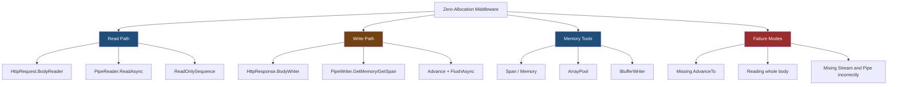
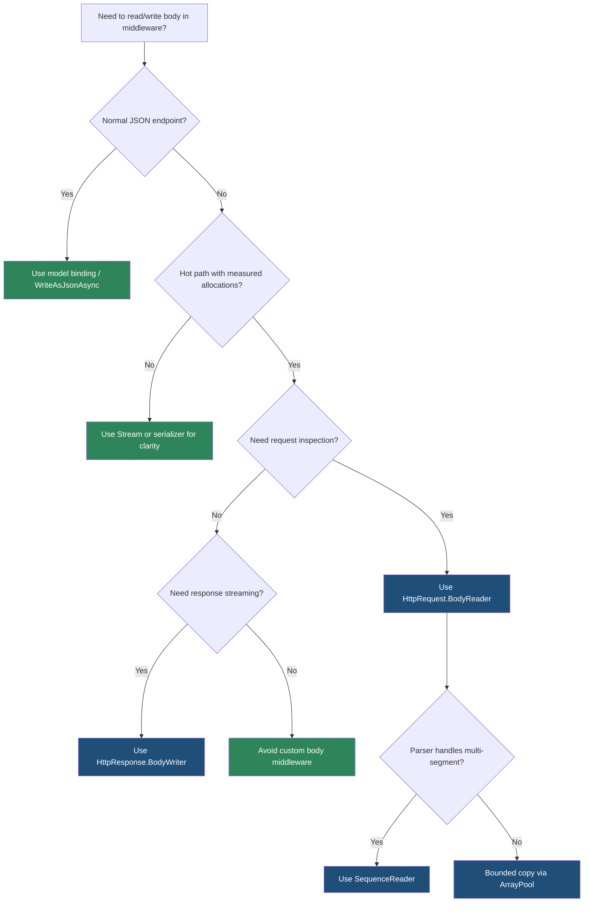

> [!success] Mastery Check
> - [ ] **Studied Well**
> - [ ] **Can explain the concept without notes**
> - [ ] **Can answer interview questions confidently**
> - [ ] **Can implement it in a real project**


# 4.060 — Zero-Allocation Middleware: PipeReader and IBufferWriter<byte>

---

## PART 0 — Navigation & Context

### Where This Topic Lives

```
ASP.NET Core Mastery
├── Middleware Pipeline
│   ├── 4.056  Response Buffering vs Streaming
│   ├── 4.060  ◄ YOU ARE HERE — zero-allocation middleware
│   └── 4.063  Middleware testing
├── HTTP Fundamentals
│   ├── 4.124  HttpRequest
│   └── 4.125  HttpResponse
└── C# / Runtime
    ├── Span<T>, Memory<T>
    ├── System.Buffers
    └── System.IO.Pipelines
```

### What You Need Before This

- **[[4.056 — Response Buffering vs Streaming in Middleware]]** — zero allocation usually means streaming, not buffering.
- **[[4.125 — HttpResponse: Writing Status Codes, Headers, and Streaming Body]]** — response headers freeze when the body starts.
- **[[2.14 — Async/Await Internals]]** — hot-path middleware pays for every allocation and async state machine.

### What This Unlocks After

- High-throughput request inspection without body strings.
- Streaming response generation through `HttpResponse.BodyWriter`.
- Custom protocol adapters, webhook validators, and line readers that avoid `MemoryStream` and `string` churn.

### Why This Matters at Scale

At 10k+ requests per second, a middleware that converts every body into a `string`, allocates arrays, or buffers JSON just to inspect a prefix can turn Gen0 GC into a P99 latency problem; `PipeReader` and `IBufferWriter<byte>` let you process bytes in-place when the business case justifies the complexity.

---

## PART 1 — The Core Mental Model

### The Fundamental Rule

> **Zero-allocation middleware avoids turning HTTP bytes into new objects unless the request actually needs them; the practical consequence is that hot-path body work should read from `BodyReader`, write to `BodyWriter`, advance buffers correctly, and flush deliberately.**

### The Plain-Language Analogy

Streams are like taking every package off a conveyor belt, putting it in your own box, and opening it there. Pipelines let you inspect packages as they pass over the belt and tell the conveyor which packages you consumed. If you forget to move the belt forward, the line jams. If you copy every package anyway, you paid for the advanced conveyor but still did warehouse work.

### The Taxonomy Diagram



---

## PART 2 — Deep Mechanics

### 2.1 BodyReader Reads Kestrel's Request Pipe

```
Client ──TCP──► Kestrel Pipe ──► HttpRequest.BodyReader ──► [Your Middleware] ──► Endpoint
```

```http
// HTTP request:
POST /webhooks/inventory HTTP/1.1
Content-Type: application/json

{"sku":"A-100","delta":-2}
```

Framework behavior:

```csharp
PipeReader reader = context.Request.BodyReader;
ReadResult result = await reader.ReadAsync(context.RequestAborted);
ReadOnlySequence<byte> buffer = result.Buffer;

// inspect bytes...

reader.AdvanceTo(buffer.Start, buffer.End);
```

Cost: no `string`, no `byte[]` copy if inspection stays inside the `ReadOnlySequence<byte>`. Edge case: always call `AdvanceTo`; otherwise Kestrel cannot know what was consumed or examined.

### 2.2 BodyWriter Writes Directly to the Response Pipe

```
Endpoint/Middleware ──► HttpResponse.BodyWriter ──► Kestrel Pipe ──TCP──► Client
```

```http
// HTTP response:
HTTP/1.1 200 OK
Content-Type: application/json

{"status":"ok"}
```

```csharp
context.Response.ContentType = "application/json";
PipeWriter writer = context.Response.BodyWriter;
Span<byte> span = writer.GetSpan(32);
int written = Encoding.UTF8.GetBytes("""{"status":"ok"}""", span);
writer.Advance(written);
await writer.FlushAsync(context.RequestAborted);
```

Cost: writes into the response buffer without an intermediate `byte[]`. Edge case: after the first flush, headers are committed.

### 2.3 ReadOnlySequence Can Be Multi-Segment

```
Buffer segment 1: {"sku":"A-
Buffer segment 2: 100","delta":-2}
```

`ReadOnlySequence<byte>` is not always contiguous. Code that assumes `buffer.FirstSpan` contains the whole body is wrong under real transport segmentation.

```csharp
SequenceReader<byte> reader = new(buffer);
if (reader.TryReadTo(out ReadOnlySequence<byte> line, (byte)'\n'))
{
    // line may be multi-segment too
}
```

Cost: `SequenceReader<byte>` walks segments without copying. Edge case: if a parser requires contiguous memory, copy only the small token that needs it, not the whole body.

### 2.4 StartAsync and Response Ownership

```
──► Middleware sets headers ──► StartAsync/first write ──► headers frozen ──► BodyWriter writes bytes
```

```csharp
context.Response.StatusCode = StatusCodes.Status200OK;
context.Response.ContentType = "text/plain";
await context.Response.StartAsync(context.RequestAborted);

Memory<byte> memory = context.Response.BodyWriter.GetMemory(16);
int bytes = Encoding.ASCII.GetBytes("ready\n", memory.Span);
context.Response.BodyWriter.Advance(bytes);
await context.Response.BodyWriter.FlushAsync(context.RequestAborted);
```

Cost: avoids adapter buffers and confirms response has started. Edge case: do not try to change status code after `StartAsync` or first flush.

### 2.5 Zero Allocation Does Not Mean Zero Work

Pipe APIs remove unnecessary copies, but parsing still costs CPU. Cryptographic HMAC, JSON tokenization, decompression, compression, and database calls dominate allocation savings. Use zero-allocation middleware for hot paths where profiling shows body/string allocations matter.

---

## PART 3 — Production Code Patterns

### Pattern 1: Inventory Webhook Prefix Guard

```csharp
public sealed class InventoryWebhookPrefixMiddleware
{
    private static readonly byte[] RequiredPrefix = Encoding.UTF8.GetBytes("""{"eventType":""");
    private readonly RequestDelegate _next;

    public InventoryWebhookPrefixMiddleware(RequestDelegate next) => _next = next;

    public async Task InvokeAsync(HttpContext context)
    {
        if (!context.Request.Path.StartsWithSegments("/webhooks/inventory"))
        {
            await _next(context);
            return;
        }

        ReadResult result = await context.Request.BodyReader.ReadAsync(context.RequestAborted);
        ReadOnlySequence<byte> buffer = result.Buffer;

        bool valid = buffer.Length >= RequiredPrefix.Length &&
                     buffer.Slice(0, RequiredPrefix.Length).ToArray().AsSpan()
                         .SequenceEqual(RequiredPrefix);

        context.Request.BodyReader.AdvanceTo(buffer.Start, buffer.End);

        if (!valid)
        {
            context.Response.StatusCode = StatusCodes.Status400BadRequest;
            await context.Response.WriteAsync("Invalid webhook envelope", context.RequestAborted);
            return;
        }

        await _next(context);
    }
}
```

```http
// HTTP consequence:
HTTP/1.1 400 Bad Request
Invalid webhook envelope
```

Note: the small `ToArray()` is acceptable only because the prefix is tiny; a production parser should avoid copying with `SequenceReader<byte>`.

### Pattern 2: Payment Status Response Through BodyWriter

```csharp
public static async Task WritePaymentStatusAsync(HttpContext context, string paymentId)
{
    context.Response.ContentType = "application/json";

    PipeWriter writer = context.Response.BodyWriter;
    await writer.WriteAsync(Encoding.UTF8.GetBytes("""{"paymentId":""""), context.RequestAborted);
    await writer.WriteAsync(Encoding.UTF8.GetBytes(paymentId), context.RequestAborted);
    await writer.WriteAsync(Encoding.UTF8.GetBytes("""","status":"authorized"}"""), context.RequestAborted);
}
```

Use when response shape is simple and on a hot path. Otherwise `WriteAsJsonAsync` is clearer.

### Pattern 3: Logistics Line Reader

```csharp
public static async IAsyncEnumerable<ReadOnlySequence<byte>> ReadLinesAsync(
    PipeReader reader,
    [EnumeratorCancellation] CancellationToken cancellationToken)
{
    while (true)
    {
        ReadResult result = await reader.ReadAsync(cancellationToken);
        ReadOnlySequence<byte> buffer = result.Buffer;
        SequencePosition consumed = buffer.Start;
        SequencePosition examined = buffer.End;

        try
        {
            var sequenceReader = new SequenceReader<byte>(buffer);
            while (sequenceReader.TryReadTo(out ReadOnlySequence<byte> line, (byte)'\n'))
            {
                consumed = sequenceReader.Position;
                yield return line;
            }

            if (result.IsCompleted)
            {
                yield break;
            }
        }
        finally
        {
            reader.AdvanceTo(consumed, examined);
        }
    }
}
```

This is for newline-delimited event streams where allocating one string per line is too expensive.

### Pattern 4: ArrayPool for Rare Contiguous Copy

```csharp
byte[] rented = ArrayPool<byte>.Shared.Rent((int)buffer.Length);
try
{
    buffer.CopyTo(rented);
    ReadOnlySpan<byte> body = rented.AsSpan(0, (int)buffer.Length);
    // parse the copied body
}
finally
{
    ArrayPool<byte>.Shared.Return(rented);
}
```

Use only when a library requires contiguous memory and the payload size is bounded.

### Pattern 5: Safe Fallback to Normal JSON

```csharp
if (context.Request.ContentLength is > 4096)
{
    await _next(context); // let endpoint/model binder handle complex body
    return;
}
```

The most senior zero-allocation pattern is knowing when not to hand-roll a parser.

---

## PART 4 — Gotchas & Anti-Patterns

### Gotcha 1: Forgetting AdvanceTo

```csharp
// ⚠️ WRONG CODE
ReadResult result = await context.Request.BodyReader.ReadAsync();
ReadOnlySequence<byte> buffer = result.Buffer;
```

```http
// HTTP consequence (wrong path):
// The request can hang or memory can grow because the reader never reports consumed bytes.
```

```csharp
// ✅ CORRECT CODE
context.Request.BodyReader.AdvanceTo(buffer.Start, buffer.End);
```

WHY: pipes require explicit consumed/examined positions.

### Gotcha 2: Assuming FirstSpan Is the Whole Body

```csharp
// ⚠️ WRONG CODE
ReadOnlySpan<byte> body = result.Buffer.FirstSpan;
```

```http
// HTTP consequence (wrong path):
// Parser fails only when transport splits the body across segments.
```

```csharp
// ✅ CORRECT CODE
var reader = new SequenceReader<byte>(result.Buffer);
```

WHY: `ReadOnlySequence<byte>` can contain multiple segments.

### Gotcha 3: Mixing Body and BodyReader Without Understanding Adapters

```csharp
// ⚠️ WRONG CODE
string text = await new StreamReader(context.Request.Body).ReadToEndAsync();
ReadResult result = await context.Request.BodyReader.ReadAsync();
```

```http
// HTTP consequence (wrong path):
// The endpoint may see an empty body or inconsistent buffering behavior.
```

```csharp
// ✅ CORRECT CODE
PipeReader reader = context.Request.BodyReader;
```

WHY: pick one abstraction per operation unless you deliberately reset/buffer.

### Gotcha 4: Forgetting FlushAsync

```csharp
// ⚠️ WRONG CODE
PipeWriter writer = context.Response.BodyWriter;
writer.Advance(5);
```

```http
// HTTP consequence (wrong path):
// Client may not receive bytes until later or at all before completion.
```

```csharp
// ✅ CORRECT CODE
writer.Advance(written);
await writer.FlushAsync(context.RequestAborted);
```

WHY: advancing only publishes bytes to the writer; flushing pushes them toward the transport.

### Gotcha 5: Optimizing the Wrong Bottleneck

```csharp
// ⚠️ WRONG CODE
// Hand-written byte parser before a middleware that still calls a remote database.
```

```http
// HTTP consequence (wrong path):
// P99 still dominated by the database call.
```

```csharp
// ✅ CORRECT CODE
// Profile first with dotnet-trace, dotnet-counters, and allocation views.
```

WHY: zero allocation is a production tool, not a readability tax you pay blindly.

---

## PART 5 — Performance Implications

| Scenario | Pipeline Depth | Allocations Per Request | Approx Latency Impact | Recommendation |
|---|---:|---:|---:|---|
| `StreamReader.ReadToEndAsync` | +body read | string + buffers | high for large body | Avoid hot path |
| `BodyReader` prefix scan | +pipe read | near zero | low | Good for small inspections |
| `BodyWriter` simple response | +write | near zero | low | Good for hot simple responses |
| `ReadOnlySequence.ToArray()` | +copy | one array | payload-size dependent | Avoid except tiny tokens |
| `ArrayPool` bounded copy | +copy | rented array | moderate | Use for library interop |
| `SequenceReader<byte>` parser | +segment walk | near zero | low CPU | Preferred for multi-segment parsing |
| `WriteAsJsonAsync` | serialization | serializer allocations | moderate | Prefer for normal code |
| HMAC over body | cryptographic CPU | depends | CPU-bound | Optimize after security correctness |

```csharp
[MemoryDiagnoser]
public sealed class PipeMiddlewareBenchmarks
{
    private readonly byte[] _payload = Encoding.UTF8.GetBytes("""{"eventType":"stock","sku":"A"}""");

    [Benchmark(Baseline = true)]
    public string StringDecode() => Encoding.UTF8.GetString(_payload);

    [Benchmark]
    public bool SpanPrefix() => _payload.AsSpan().StartsWith(Encoding.UTF8.GetBytes("""{"eventType":"""));

    [Benchmark]
    public int BufferWriterWrite()
    {
        var writer = new ArrayBufferWriter<byte>();
        writer.Write(_payload);
        return writer.WrittenCount;
    }
}
```

When this costs you: high-throughput body inspection, webhook ingestion, SSE, NDJSON, custom binary protocols. When this does not matter: low-traffic CRUD APIs where JSON serializer and database time dominate.

---

## PART 6 — Interview Arsenal

### A. The Question Bank

**Question:** "Why use `PipeReader` instead of `Stream` in middleware?"

Great answer:

> I use `PipeReader` when profiling shows request-body allocation or copying on a hot path. It lets me inspect bytes in Kestrel's pipeline using `ReadOnlySequence<byte>` instead of building strings or byte arrays. The important part is correctness: I must handle multi-segment buffers and call `AdvanceTo` with consumed and examined positions. If the endpoint just needs normal JSON binding, I do not replace it with hand-written pipe code.

**Question:** "What happens if you write to `BodyWriter` but don't flush?"

Great answer:

> `Advance` tells the writer how many bytes I filled, but it does not necessarily send them to the client. `FlushAsync` moves the bytes toward the transport and can also commit response headers. The HTTP symptom is a client waiting longer than expected or not seeing streaming chunks when it should.

**Question:** "What is the biggest trap with `ReadOnlySequence<byte>`?"

Great answer:

> It may be multi-segment. Code that passes `FirstSpan` to a parser works in tests with small bodies and fails under real network segmentation. I either use `SequenceReader<byte>` or copy only a bounded token when contiguous memory is required.

### B. Trick Questions

- "Is zero allocation always faster?" No; CPU, complexity, and I/O may dominate.
- "Does `GetSpan` allocate?" It returns writable buffer from the writer; the underlying writer manages memory.
- "Can you change headers after `FlushAsync`?" Usually no; the response may have started.
- "Is `ToArray()` zero allocation?" No; it allocates a new array.

### C. Red Flags to Avoid

- "Use pipes everywhere." Use them where profiling justifies it.
- "FirstSpan is the body." It may be only one segment.
- "AdvanceTo is optional." It is required for correct pipe progress.
- "Flush is just cleanup." It affects when clients see bytes.
- "Zero allocation can ignore cancellation." Hot paths still need `RequestAborted`.

---

## PART 7 — Decision Framework



---

## PART 8 — Self-Check

### A. Conceptual Questions

1. Why must `PipeReader.AdvanceTo` be called?
2. What happens if a request body is split across multiple segments?
3. When does `FlushAsync` matter for responses?
4. Why can zero-allocation middleware still be slower than normal JSON handling?
5. What does `IBufferWriter<byte>` provide?
6. Why is `ReadOnlySequence<byte>.ToArray()` a smell?
7. What happens to headers after response body starts?
8. When is `ArrayPool<byte>` appropriate?

### B. Code Puzzles

```csharp
ReadResult result = await context.Request.BodyReader.ReadAsync();
var span = result.Buffer.FirstSpan;
```

<details><summary>Answer</summary>
Bug: `FirstSpan` may not contain the whole buffer. Use `SequenceReader<byte>` or handle segments.
</details>

```csharp
PipeWriter writer = context.Response.BodyWriter;
Span<byte> span = writer.GetSpan(5);
writer.Advance(5);
```

<details><summary>Answer</summary>
The bytes were not necessarily flushed to the client. Call `FlushAsync`.
</details>

```csharp
byte[] body = result.Buffer.ToArray();
```

<details><summary>Answer</summary>
This allocates a full copy. It may be fine for bounded tiny data, but it is not zero-allocation.
</details>

```csharp
context.Response.Headers["X-Test"] = "a";
await context.Response.BodyWriter.FlushAsync();
context.Response.Headers["X-Late"] = "b";
```

<details><summary>Answer</summary>
The late header may throw or be ignored because the response has started.
</details>

---

## PART 9 — Connections & Resources

### A. Related Topics Table

| Topic | Why It Connects |
|---|---|
| [[4.056 — Response Buffering vs Streaming in Middleware]] | Zero allocation is usually a streaming strategy. |
| [[4.124 — HttpRequest: Reading URL, Headers, Cookies, and Body]] | Request body access starts from `HttpRequest`. |
| [[4.125 — HttpResponse: Writing Status Codes, Headers, and Streaming Body]] | `BodyWriter` commits bytes and headers. |
| [[2.14 — Async/Await Internals]] | Hot middleware must understand async allocation costs. |

### B. Books

| Book | Chapters | Why These Chapters |
|---|---|---|
| *Pro .NET Memory Management* | GC, allocation, pooling | Explains why allocations matter in hot paths. |
| *ASP.NET Core in Action* | Middleware, performance | Provides practical pipeline context. |

### C. Essential Articles & Docs

- [Microsoft Docs — Request and response operations in ASP.NET Core](https://learn.microsoft.com/en-us/aspnet/core/fundamentals/middleware/request-response)
- [Microsoft Docs — System.IO.Pipelines](https://learn.microsoft.com/en-us/dotnet/standard/io/pipelines)
- [Microsoft Docs — ASP.NET Core middleware](https://learn.microsoft.com/en-us/aspnet/core/fundamentals/middleware/)
- [GitHub — System.IO.Pipelines source](https://github.com/dotnet/runtime/tree/main/src/libraries/System.IO.Pipelines)

### D. Template Meta-Note

> [!NOTE]
> **Part 0** orients the topic. **Part 1** gives the mental model. **Part 2** shows framework mechanics. **Part 3** gives production patterns. **Part 4** names gotchas. **Part 5** covers performance. **Part 6** prepares interviews. **Part 7** gives decisions. **Part 8** checks understanding. **Part 9** connects resources.
