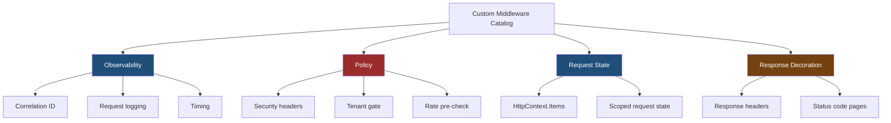
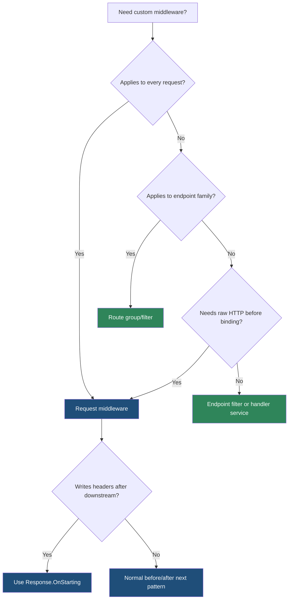

> [!success] Mastery Check
> - [ ] **Studied Well**
> - [ ] **Can explain the concept without notes**
> - [ ] **Can answer interview questions confidently**
> - [ ] **Can implement it in a real project**


# 4.061 — Custom Middleware Catalog: Logging, Correlation ID, Timing

---

## PART 0 — Navigation & Context

### Where This Topic Lives

```
ASP.NET Core Mastery
├── Logging & Diagnostics
│   ├── 4.025  Structured logging
│   ├── 4.026  Log scopes
│   └── 4.031  High-performance logging
├── Middleware Pipeline
│   ├── 4.049  RequestDelegate chain
│   ├── 4.050  Writing middleware
│   └── 4.061  ◄ YOU ARE HERE — custom middleware catalog
└── Observability
    ├── 4.183  Correlation IDs
    ├── 4.297  Activity API
    └── 4.299  OpenTelemetry
```

### What You Need Before This

- **[[4.049 — The Middleware Pipeline: Request Delegation Chain]]** — every catalog pattern is just "before next" and "after next".
- **[[4.050 — Writing Middleware: IMiddleware vs Convention-Based]]** — choose the middleware activation model before writing production code.
- **[[4.026 — Log Scopes: Contextual Information Across a Request]]** — correlation and request logging rely on scoped log context.

### What This Unlocks After

- **[[4.183 — Correlation IDs: Request Tracing Across Services]]** — correlation middleware is the foundation.
- **[[4.297 — Activity API: System.Diagnostics.Activity and Distributed Tracing]]** — request timing and correlation become distributed traces.
- **[[4.299 — OpenTelemetry .NET SDK: Tracing, Metrics, and Logs]]** — middleware data becomes telemetry signals.

### Why This Matters at Scale

Custom middleware is where production APIs enforce observability and request hygiene; without consistent correlation IDs, timing, security headers, and failure logging, every incident becomes a manual archaeology project.

---

## PART 1 — The Core Mental Model

### The Fundamental Rule

> **Custom middleware is the correct tool for behavior that must wrap the HTTP request before and after downstream execution; the practical consequence is that logging, correlation, timing, and coarse request policy belong near the pipeline edge.**

### The Plain-Language Analogy

Custom middleware is the clipboard carried by the person escorting a request through the building. Before the request enters, the clipboard gets a tracking number and start time. Every room can add notes. When the request leaves, the escort records the exit status, elapsed time, and anything that went wrong.

### The Taxonomy Diagram



---

## PART 2 — Deep Mechanics

### 2.1 Correlation ID Middleware Runs Early

```
──► ExceptionHandler ──► [CorrelationId] ──► Logging ──► Routing ──► Auth ──► Endpoints
```

```http
GET /api/orders/42 HTTP/1.1
X-Correlation-Id: req-789

HTTP/1.1 200 OK
X-Correlation-Id: req-789
```

Framework behavior:

```csharp
string id = context.Request.Headers.TryGetValue("X-Correlation-Id", out var value)
    ? value.ToString()
    : context.TraceIdentifier;

using (_logger.BeginScope(new Dictionary<string, object> { ["CorrelationId"] = id }))
{
    context.Response.Headers["X-Correlation-Id"] = id;
    await _next(context);
}
```

Cost: one header read, one response header write, one logging scope allocation. Edge case: sanitize externally supplied IDs to avoid log abuse.

### 2.2 Timing Middleware Wraps Downstream Execution

```
request in ──► start timer ──► await next(context) ──► stop timer ──► response out
```

```http
HTTP/1.1 200 OK
X-Elapsed-Ms: 34
```

Cost: one timestamp before and after. Edge case: do not write headers after response has already started unless you register `OnStarting`.

### 2.3 Request Logging Needs Status After next()

```
──► RequestLogging before ──► downstream middleware/endpoint ──► RequestLogging after reads status code
```

```csharp
try
{
    await _next(context);
}
finally
{
    _logger.LogInformation("HTTP {Method} {Path} -> {StatusCode}",
        context.Request.Method,
        context.Request.Path,
        context.Response.StatusCode);
}
```

Cost: one log event per request; high-cardinality paths can create telemetry cost. Edge case: log route patterns after routing when possible, not raw IDs in paths.

### 2.4 Security Headers Must Be Set Before Body Starts

```
──► [SecurityHeaders OnStarting] ──► Endpoint writes body ──► OnStarting fires ──► headers sent
```

```http
HTTP/1.1 200 OK
X-Content-Type-Options: nosniff
X-Frame-Options: DENY
```

Use `Response.OnStarting` so downstream code can still run normally while headers are applied at the last safe moment.

### 2.5 Tenant Context Middleware Is Request State, Not Logging

Tenant middleware reads headers/claims, validates them, and stores a scoped tenant context for downstream services. It must run before any endpoint service uses tenant-scoped data.

---

## PART 3 — Production Code Patterns

### Pattern 1: Correlation ID Boundary

```csharp
public sealed class CorrelationIdMiddleware
{
    private readonly RequestDelegate _next;
    private readonly ILogger<CorrelationIdMiddleware> _logger;

    public CorrelationIdMiddleware(RequestDelegate next, ILogger<CorrelationIdMiddleware> logger)
    {
        _next = next;
        _logger = logger;
    }

    public async Task InvokeAsync(HttpContext context)
    {
        string correlationId = GetOrCreateCorrelationId(context);
        context.Items["CorrelationId"] = correlationId;
        context.Response.Headers["X-Correlation-Id"] = correlationId;

        using (_logger.BeginScope(new Dictionary<string, object>
        {
            ["CorrelationId"] = correlationId
        }))
        {
            await _next(context);
        }
    }

    private static string GetOrCreateCorrelationId(HttpContext context)
    {
        string? incoming = context.Request.Headers["X-Correlation-Id"];
        return string.IsNullOrWhiteSpace(incoming) || incoming.Length > 128
            ? context.TraceIdentifier
            : incoming;
    }
}
```

### Pattern 2: Request Timing With OnStarting

```csharp
public sealed class RequestTimingMiddleware
{
    private readonly RequestDelegate _next;

    public RequestTimingMiddleware(RequestDelegate next) => _next = next;

    public async Task InvokeAsync(HttpContext context)
    {
        long start = Stopwatch.GetTimestamp();

        context.Response.OnStarting(() =>
        {
            TimeSpan elapsed = Stopwatch.GetElapsedTime(start);
            context.Response.Headers["X-Elapsed-Ms"] =
                elapsed.TotalMilliseconds.ToString("0.###", CultureInfo.InvariantCulture);
            return Task.CompletedTask;
        });

        await _next(context);
    }
}
```

### Pattern 3: Structured Request Logging

```csharp
public sealed class StructuredRequestLoggingMiddleware
{
    private readonly RequestDelegate _next;
    private readonly ILogger<StructuredRequestLoggingMiddleware> _logger;

    public StructuredRequestLoggingMiddleware(RequestDelegate next, ILogger<StructuredRequestLoggingMiddleware> logger)
    {
        _next = next;
        _logger = logger;
    }

    public async Task InvokeAsync(HttpContext context)
    {
        long start = Stopwatch.GetTimestamp();

        try
        {
            await _next(context);
        }
        finally
        {
            Endpoint? endpoint = context.GetEndpoint();
            _logger.LogInformation(
                "HTTP {Method} {Path} {Endpoint} responded {StatusCode} in {ElapsedMs}ms",
                context.Request.Method,
                context.Request.Path,
                endpoint?.DisplayName ?? "unmatched",
                context.Response.StatusCode,
                Stopwatch.GetElapsedTime(start).TotalMilliseconds);
        }
    }
}
```

### Pattern 4: Security Headers

```csharp
public sealed class SecurityHeadersMiddleware
{
    private readonly RequestDelegate _next;

    public SecurityHeadersMiddleware(RequestDelegate next) => _next = next;

    public Task InvokeAsync(HttpContext context)
    {
        context.Response.OnStarting(() =>
        {
            IHeaderDictionary headers = context.Response.Headers;
            headers.TryAdd("X-Content-Type-Options", "nosniff");
            headers.TryAdd("X-Frame-Options", "DENY");
            headers.TryAdd("Referrer-Policy", "no-referrer");
            return Task.CompletedTask;
        });

        return _next(context);
    }
}
```

### Pattern 5: Tenant Context Gate

```csharp
public sealed class TenantContextMiddleware
{
    private readonly RequestDelegate _next;

    public TenantContextMiddleware(RequestDelegate next) => _next = next;

    public async Task InvokeAsync(HttpContext context, TenantRequestContext tenantContext)
    {
        string? tenantId = context.Request.Headers["X-Tenant-Id"];
        if (string.IsNullOrWhiteSpace(tenantId))
        {
            context.Response.StatusCode = StatusCodes.Status400BadRequest;
            await context.Response.WriteAsJsonAsync(new { error = "Tenant header is required" });
            return;
        }

        tenantContext.TenantId = tenantId;
        await _next(context);
    }
}

public sealed class TenantRequestContext
{
    public string? TenantId { get; set; }
}
```

---

## PART 4 — Gotchas & Anti-Patterns

### Gotcha 1: Adding Timing Header After the Body Started

```csharp
// ⚠️ WRONG CODE
await _next(context);
context.Response.Headers["X-Elapsed-Ms"] = "10";
```

```http
// HTTP consequence (wrong path):
// InvalidOperationException or missing header after response has started.
```

```csharp
// ✅ CORRECT CODE
context.Response.OnStarting(() =>
{
    context.Response.Headers["X-Elapsed-Ms"] = "10";
    return Task.CompletedTask;
});
await _next(context);
```

WHY: `OnStarting` runs just before headers are sent.

### Gotcha 2: Logging Raw Paths as Metrics Dimensions

```csharp
// ⚠️ WRONG CODE
_logger.LogInformation("Path {Path}", context.Request.Path);
```

```http
// HTTP consequence (wrong path):
// /api/orders/1 and /api/orders/2 explode metric cardinality.
```

```csharp
// ✅ CORRECT CODE
_logger.LogInformation("Endpoint {Endpoint}", context.GetEndpoint()?.DisplayName);
```

WHY: route patterns and endpoint names reduce telemetry cardinality.

### Gotcha 3: Trusting Incoming Correlation IDs Blindly

```csharp
// ⚠️ WRONG CODE
string id = context.Request.Headers["X-Correlation-Id"];
```

```http
// HTTP consequence (wrong path):
// Logs can contain huge or malicious correlation values.
```

```csharp
// ✅ CORRECT CODE
string id = incoming.Length <= 128 ? incoming : context.TraceIdentifier;
```

WHY: request headers are attacker-controlled.

### Gotcha 4: Reading Request Body in Logging Middleware

```csharp
// ⚠️ WRONG CODE
string body = await new StreamReader(context.Request.Body).ReadToEndAsync();
await _next(context);
```

```http
// HTTP consequence (wrong path):
// Endpoint may receive an empty body.
```

```csharp
// ✅ CORRECT CODE
// Log metadata by default; use EnableBuffering only for bounded diagnostic cases.
```

WHY: body reads consume the stream unless buffering/reset is handled.

### Gotcha 5: Putting Tenant Gate After Endpoints

```csharp
// ⚠️ WRONG CODE
app.MapGet("/api/orders", Handler);
app.UseMiddleware<TenantContextMiddleware>();
```

```http
// HTTP consequence (wrong path):
// Handler runs before tenant context is set.
```

```csharp
// ✅ CORRECT CODE
app.UseMiddleware<TenantContextMiddleware>();
app.MapGet("/api/orders", Handler);
```

WHY: request middleware must wrap endpoint execution to provide state.

---

## PART 5 — Performance Implications

| Scenario | Pipeline Depth | Allocations Per Request | Approx Latency Impact | Recommendation |
|---|---:|---:|---:|---|
| Correlation header | +1 | low | tiny | Use globally |
| Log scope | +1 | scope allocation | low | Use for traceability |
| One log event/request | +1 | provider-dependent | low-medium | Keep structured |
| Timing stopwatch | +1 | 0 | tiny | Use globally or sampled |
| Security headers | +1 | low | tiny | Use globally |
| Body logging | +1 + body buffer | high | high | Avoid by default |
| Tenant DB validation | +1 + I/O | high | ms | Cache aggressively |
| High-cardinality logs | none | telemetry cost | operational | Normalize endpoint names |

```csharp
[MemoryDiagnoser]
public sealed class CatalogMiddlewareBenchmarks
{
    private readonly DefaultHttpContext _context = new();

    [Benchmark(Baseline = true)]
    public string TraceIdentifier() => _context.TraceIdentifier;

    [Benchmark]
    public void SetHeader() => _context.Response.Headers["X-Test"] = "abc";

    [Benchmark]
    public long StopwatchTimestamp() => Stopwatch.GetTimestamp();
}
```

When this costs you: body logging, sync I/O, high-cardinality telemetry, and database validation in global middleware. When it does not matter: simple headers and timestamp checks.

---

## PART 6 — Interview Arsenal

### A. The Question Bank

**Question:** "What custom middleware have you written?"

Great answer:

> I have written correlation ID, request timing, structured logging, security headers, and tenant context middleware. I put correlation and security headers early because I want them on errors and 404s too. For timing and logging, I record state before `await next(context)` and log the final status after it returns. I avoid reading request bodies in global logging middleware unless there is a bounded diagnostic reason, because it changes the HTTP body behavior and can add large allocations.

**Question:** "Why use `OnStarting`?"

Great answer:

> I use `OnStarting` when a middleware needs to set response headers after downstream code has run but before headers are sent. It prevents the common bug where an endpoint writes the body first and my middleware tries to add timing or security headers too late.

**Question:** "Where should correlation ID middleware sit?"

Great answer:

> Very early, after exception handling if I want exception handling to stay outermost, but before routing, auth, and endpoints. The goal is that every downstream log scope and every HTTP response sees the same ID, including failures.

### B. Trick Questions

- "Can request logging know status before `next`?" No, final status is known after downstream runs.
- "Can security headers be added after `WriteAsync`?" Not reliably.
- "Should request logging include full body?" Rarely; it creates allocation and privacy risk.
- "Does correlation ID from client always win?" No, validate and bound it.

### C. Red Flags to Avoid

- "I log everything including bodies." Privacy and performance risk.
- "Headers can be changed anytime." They freeze after response starts.
- "Raw paths are fine as metric labels." Cardinality risk.
- "Correlation ID is just `Guid.NewGuid()`." You may need to preserve upstream trace IDs.
- "Middleware can store current request in fields." Shared-state bug.

---

## PART 7 — Decision Framework



---

## PART 8 — Self-Check

### A. Conceptual Questions

1. Why does timing middleware need code before and after `next`?
2. What happens if you set headers after the body starts?
3. Why should correlation middleware run early?
4. What makes raw URL paths dangerous in metrics?
5. Why is body logging risky?
6. When should tenant middleware run?
7. What does a log scope add to downstream logs?
8. Why is `HttpContext.Items` useful but limited?

### B. Code Puzzles

```csharp
await _next(context);
context.Response.Headers["X-Test"] = "late";
```

<details><summary>Answer</summary>
This may fail if the response has already started. Use `OnStarting`.
</details>

```csharp
using (_logger.BeginScope(new { CorrelationId = id }))
{
    await _next(context);
}
```

<details><summary>Answer</summary>
Downstream logs within the async flow include the correlation scope.
</details>

```csharp
string body = await new StreamReader(context.Request.Body).ReadToEndAsync();
await _next(context);
```

<details><summary>Answer</summary>
Bug: the endpoint may see an empty request body unless buffering and reset are handled.
</details>

```csharp
_logger.LogInformation("GET {Path}", context.Request.Path);
```

<details><summary>Answer</summary>
Correct for logs if needed, but dangerous as a metric dimension because IDs in paths create high cardinality.
</details>

---

## PART 9 — Connections & Resources

### A. Related Topics Table

| Topic | Why It Connects |
|---|---|
| [[4.026 — Log Scopes: Contextual Information Across a Request]] | Correlation middleware commonly creates log scopes. |
| [[4.031 — High-Performance Logging: LoggerMessage.Define and Source Generators]] | Hot request logging may need source-generated logging. |
| [[4.049 — The Middleware Pipeline: Request Delegation Chain]] | Every catalog middleware uses the before/after `next` pattern. |
| [[4.054 — HttpContext and IHttpContextAccessor: Safe Shared Request State]] | Middleware stores request state in `HttpContext` and scoped services. |
| [[4.183 — Correlation IDs: Request Tracing Across Services]] | Correlation IDs become distributed trace linkage. |

### B. Books

| Book | Chapters | Why These Chapters |
|---|---|---|
| *ASP.NET Core in Action* | Middleware, logging | Practical request logging and middleware patterns. |
| *Cloud Native .NET* | Observability | Connects correlation, logs, traces, and production operations. |

### C. Essential Articles & Docs

- [Microsoft Docs — ASP.NET Core middleware](https://learn.microsoft.com/en-us/aspnet/core/fundamentals/middleware/)
- [Microsoft Docs — Logging in .NET](https://learn.microsoft.com/en-us/dotnet/core/extensions/logging)
- [Microsoft Docs — Distributed tracing in .NET](https://learn.microsoft.com/en-us/dotnet/core/diagnostics/distributed-tracing)
- [Microsoft Docs — Request and response operations in ASP.NET Core](https://learn.microsoft.com/en-us/aspnet/core/fundamentals/middleware/request-response)

### D. Template Meta-Note

> [!NOTE]
> **Part 0** orients the topic. **Part 1** gives the mental model. **Part 2** shows framework mechanics. **Part 3** gives production patterns. **Part 4** names gotchas. **Part 5** covers performance. **Part 6** prepares interviews. **Part 7** gives decisions. **Part 8** checks understanding. **Part 9** connects resources.
