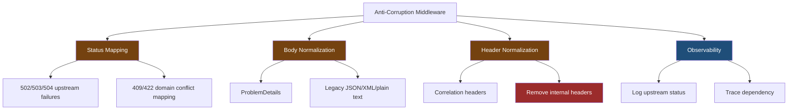
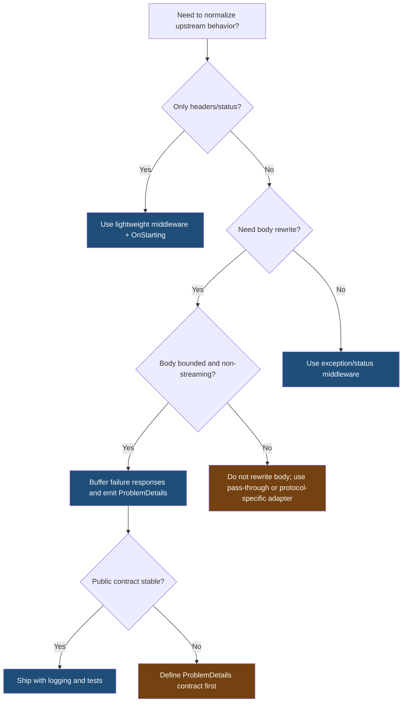

> [!success] Mastery Check
> - [ ] **Studied Well**
> - [ ] **Can explain the concept without notes**
> - [ ] **Can answer interview questions confidently**
> - [ ] **Can implement it in a real project**


# 4.062 — Anti-Corruption Middleware: Normalizing Upstream API Responses

---

## PART 0 — Navigation & Context

### Where This Topic Lives

```
ASP.NET Core Mastery
├── Middleware Pipeline
│   ├── 4.055  Custom exception middleware
│   ├── 4.056  Buffering vs streaming
│   └── 4.062  ◄ YOU ARE HERE — anti-corruption response normalization
├── Error Handling
│   └── 4.179  Problem Details
├── HTTP Clients
│   └── 4.249  IHttpClientFactory
└── Deployment / Gateways
    └── 4.345  YARP gateway patterns
```

### What You Need Before This

- **[[4.055 — Custom Exception Middleware: Domain Exceptions to HTTP Responses]]** — anti-corruption middleware maps non-domain failures into your contract.
- **[[4.056 — Response Buffering vs Streaming in Middleware]]** — response rewriting usually requires buffering and must be bounded.
- **[[4.125 — HttpResponse: Writing Status Codes, Headers, and Streaming Body]]** — headers and status become immutable once the response starts.

### What This Unlocks After

- Stable gateway contracts in front of inconsistent upstream APIs.
- Consistent `ProblemDetails` responses from legacy services.
- Safer BFF and reverse-proxy error handling.

### Why This Matters at Scale

When ten upstream services return ten different error formats, your public API becomes operationally impossible to reason about; anti-corruption middleware gives clients one stable HTTP contract while preserving upstream details in logs and traces.

---

## PART 1 — The Core Mental Model

### The Fundamental Rule

> **Anti-corruption middleware translates upstream HTTP behavior into your API's contract before the client sees it; the practical consequence is that status codes, headers, and error bodies must be normalized before the response is committed.**

### The Plain-Language Analogy

Think of upstream services as suppliers that all ship products in different boxes. The anti-corruption layer is your warehouse repackaging station. Customers should receive your standard box, labels, and return instructions even if the supplier used a strange label or a damaged carton. But once the package is on the delivery truck, you cannot relabel it.

### The Taxonomy Diagram



---

## PART 2 — Deep Mechanics

### 2.1 Response Rewriting Wraps Downstream Proxy or Handler

```
──► ExceptionHandler ──► Correlation ──► [AntiCorruption buffers response] ──► Proxy/Endpoint ──► Upstream API
                                      ▲                                      │
                                      └──── rewrite response after next ◄────┘
```

```http
// Upstream response:
HTTP/1.1 500 Internal Server Error
Content-Type: text/plain

DB DOWN

// Public response:
HTTP/1.1 502 Bad Gateway
Content-Type: application/problem+json

{"type":"https://example.com/problems/upstream-failure","title":"Upstream service failed","status":502}
```

Framework behavior:

```csharp
Stream originalBody = context.Response.Body;
await using var buffer = new MemoryStream();
context.Response.Body = buffer;

await _next(context);

buffer.Position = 0;
// inspect status/body, then write normalized response to originalBody
context.Response.Body = originalBody;
```

Cost: full response buffering, one `MemoryStream`, body copy, and possible JSON parse. Edge case: do not buffer large downloads or streaming responses.

### 2.2 Status Mapping Must Preserve HTTP Semantics

```
Upstream 500 ──► public 502
Upstream timeout ──► public 504
Upstream unavailable ──► public 503
Upstream domain conflict ──► public 409
Upstream validation failure ──► public 400 or 422 by contract
```

Incorrect mapping breaks retries, caching, client UX, and incident triage.

### 2.3 Header Normalization Is a Security Boundary

```http
// Upstream:
X-Internal-Node: api-7
Server: legacy-stack

// Public:
X-Correlation-Id: req-123
```

Cost: header dictionary edits are cheap. Edge case: removing or adding headers after response start fails.

### 2.4 ProblemDetails Gives One Error Contract

```csharp
var problem = new ProblemDetails
{
    Type = "https://example.com/problems/upstream-failure",
    Title = "Upstream service failed",
    Status = StatusCodes.Status502BadGateway,
    Detail = "The order provider did not return a usable response."
};
```

Cost: one JSON serialization. Edge case: do not leak upstream raw messages that contain connection strings, SQL, tokens, or internal hostnames.

---

## PART 3 — Production Code Patterns

### Pattern 1: Bounded Upstream Error Normalizer

```csharp
public sealed class UpstreamErrorNormalizationMiddleware
{
    private const int MaxBufferedBytes = 64 * 1024;
    private readonly RequestDelegate _next;

    public UpstreamErrorNormalizationMiddleware(RequestDelegate next) => _next = next;

    public async Task InvokeAsync(HttpContext context)
    {
        Stream originalBody = context.Response.Body;
        await using var buffer = new MemoryStream();
        context.Response.Body = buffer;

        await _next(context);

        if (buffer.Length > MaxBufferedBytes || context.Response.StatusCode < 500)
        {
            buffer.Position = 0;
            context.Response.Body = originalBody;
            await buffer.CopyToAsync(originalBody, context.RequestAborted);
            return;
        }

        int originalStatus = context.Response.StatusCode;
        context.Response.Body = originalBody;
        context.Response.Clear();
        context.Response.StatusCode = MapStatus(originalStatus);
        context.Response.ContentType = "application/problem+json";

        await context.Response.WriteAsJsonAsync(new ProblemDetails
        {
            Type = "https://example.com/problems/upstream-failure",
            Title = "Upstream service failed",
            Status = context.Response.StatusCode
        }, context.RequestAborted);
    }

    private static int MapStatus(int upstreamStatus) => upstreamStatus switch
    {
        StatusCodes.Status504GatewayTimeout => StatusCodes.Status504GatewayTimeout,
        StatusCodes.Status503ServiceUnavailable => StatusCodes.Status503ServiceUnavailable,
        _ => StatusCodes.Status502BadGateway
    };
}
```

### Pattern 2: Remove Internal Headers

```csharp
public sealed class PublicHeaderBoundaryMiddleware
{
    private readonly RequestDelegate _next;

    public PublicHeaderBoundaryMiddleware(RequestDelegate next) => _next = next;

    public Task InvokeAsync(HttpContext context)
    {
        context.Response.OnStarting(() =>
        {
            context.Response.Headers.Remove("X-Internal-Node");
            context.Response.Headers.Remove("X-Upstream-Stack");
            context.Response.Headers.TryAdd("X-Correlation-Id", context.TraceIdentifier);
            return Task.CompletedTask;
        });

        return _next(context);
    }
}
```

### Pattern 3: Order Service Domain Error Mapping

```csharp
public static ProblemDetails MapOrderProviderError(JsonElement upstream)
{
    string code = upstream.TryGetProperty("code", out JsonElement value)
        ? value.GetString() ?? "unknown"
        : "unknown";

    return code switch
    {
        "ORDER_LOCKED" => new ProblemDetails
        {
            Type = "https://example.com/problems/order-locked",
            Title = "Order is locked",
            Status = StatusCodes.Status409Conflict
        },
        _ => new ProblemDetails
        {
            Type = "https://example.com/problems/upstream-error",
            Title = "Order provider returned an error",
            Status = StatusCodes.Status502BadGateway
        }
    };
}
```

### Pattern 4: Preserve Upstream Details in Logs, Not Public Body

```csharp
_logger.LogWarning(
    "Upstream {Service} returned {StatusCode} for {CorrelationId}: {BodyPreview}",
    "OrderProvider",
    upstreamStatus,
    context.TraceIdentifier,
    bodyPreview);
```

### Pattern 5: Skip Streaming Responses

```csharp
if (context.Response.ContentType?.StartsWith("text/event-stream", StringComparison.OrdinalIgnoreCase) == true)
{
    await _next(context);
    return;
}
```

---

## PART 4 — Gotchas & Anti-Patterns

### Gotcha 1: Buffering Every Response

```csharp
// ⚠️ WRONG CODE
context.Response.Body = new MemoryStream();
await _next(context);
```

```http
// HTTP consequence (wrong path):
// Large downloads and streaming responses are forced into memory.
```

```csharp
// ✅ CORRECT CODE
// Buffer only small candidate error responses; pass through streams.
```

WHY: buffering changes latency and memory shape.

### Gotcha 2: Rewriting After Response Started

```csharp
// ⚠️ WRONG CODE
await _next(context);
context.Response.StatusCode = 502;
```

```http
// HTTP consequence (wrong path):
// Status code may already be committed.
```

```csharp
// ✅ CORRECT CODE
// Intercept before writing to original response body.
```

WHY: headers/status freeze after first write.

### Gotcha 3: Leaking Upstream Error Text

```csharp
// ⚠️ WRONG CODE
await context.Response.WriteAsync(upstreamBody);
```

```http
// HTTP consequence (wrong path):
// Client sees SQL error, hostnames, internal codes, or tokens.
```

```csharp
// ✅ CORRECT CODE
await context.Response.WriteAsJsonAsync(publicProblem);
```

WHY: logs can hold diagnostics; public bodies need contract-safe details.

### Gotcha 4: Mapping Every Upstream Error to 500

```csharp
// ⚠️ WRONG CODE
context.Response.StatusCode = 500;
```

```http
// HTTP consequence (wrong path):
// Clients cannot distinguish timeout, unavailable, bad gateway, or conflict.
```

```csharp
// ✅ CORRECT CODE
context.Response.StatusCode = upstreamTimeout ? 504 : 502;
```

WHY: HTTP status codes drive retry and user behavior.

### Gotcha 5: Losing Correlation Across the Boundary

```csharp
// ⚠️ WRONG CODE
httpRequest.Headers.Remove("X-Correlation-Id");
```

```http
// HTTP consequence (wrong path):
// Upstream logs cannot be tied back to the public request.
```

```csharp
// ✅ CORRECT CODE
httpRequest.Headers["X-Correlation-Id"] = context.TraceIdentifier;
```

WHY: anti-corruption should hide format differences, not destroy traceability.

---

## PART 5 — Performance Implications

| Scenario | Pipeline Depth | Allocations Per Request | Approx Latency Impact | Recommendation |
|---|---:|---:|---:|---|
| Header cleanup only | +1 | low | tiny | Safe globally |
| Error-only buffering | +1 on failures | buffer per failure | moderate | Good default |
| Buffer all JSON | +1 all requests | high | high | Avoid |
| ProblemDetails serialization | failure only | small | low | Recommended |
| XML-to-JSON normalization | failure only | parser allocations | medium | Bound body size |
| Streaming passthrough | unchanged | low | low | Do not buffer |
| Upstream body logging | failure only | preview copy | medium | Truncate and redact |
| Full body logging | all failures | high | high | Avoid |

```csharp
[MemoryDiagnoser]
public sealed class AntiCorruptionBenchmarks
{
    private readonly byte[] _smallError = Encoding.UTF8.GetBytes("""{"code":"ORDER_LOCKED"}""");

    [Benchmark(Baseline = true)]
    public ProblemDetails StaticProblem() => new() { Status = 502, Title = "Upstream failed" };

    [Benchmark]
    public JsonDocument ParseSmallError() => JsonDocument.Parse(_smallError);

    [Benchmark]
    public MemoryStream BufferSmallError() => new(_smallError);
}
```

When this costs you: large responses, streaming, proxying files, and parsing every success body. When it does not matter: small failure-only normalization in a gateway.

---

## PART 6 — Interview Arsenal

### A. The Question Bank

**Question:** "What is an anti-corruption layer in an ASP.NET Core gateway?"

Great answer:

> It is the boundary that prevents upstream service contracts from leaking into my public API. In middleware, that usually means normalizing status codes, stripping internal headers, and converting inconsistent error bodies into `ProblemDetails`. I only rewrite before the response is committed, and I avoid buffering large or streaming responses. The client should see one stable HTTP contract even if the upstream services are inconsistent internally.

**Question:** "Why not just pass upstream errors through?"

Great answer:

> Passing them through couples clients to every upstream service and can leak internal details. It also makes retries and monitoring inconsistent because one service may use `500`, another `503`, and another a custom JSON error. I preserve details in logs and traces, but public responses follow my API contract.

**Question:** "What is the main performance risk?"

Great answer:

> Buffering. To rewrite a response body, I often need to intercept it before it reaches the client, which can allocate memory and delay the first byte. I bound the body size, skip streaming responses, and normalize primarily error responses.

### B. Trick Questions

- "Can you always rewrite downstream response status?" No, not after response starts.
- "Should public ProblemDetails include upstream raw message?" Usually no.
- "Is `500` a good generic upstream status?" Prefer `502`, `503`, or `504` depending on failure.
- "Can anti-corruption middleware normalize SSE?" Not by buffering; streaming needs a different design.

### C. Red Flags to Avoid

- "Buffer all responses." Dangerous memory and latency.
- "Expose upstream body for transparency." Security and contract risk.
- "All upstream failures are 500." Bad HTTP semantics.
- "Headers can be cleaned after the body." Too late if response started.
- "Correlation is an internal concern." It is essential for incident response.

---

## PART 7 — Decision Framework



---

## PART 8 — Self-Check

### A. Conceptual Questions

1. Why does response body rewriting require buffering?
2. What happens if upstream writes before your middleware changes status?
3. Why is `502` often better than `500` for upstream service failure?
4. What should be logged but not returned to the client?
5. Why should streaming responses bypass normalization?
6. How do correlation IDs cross an anti-corruption boundary?
7. What headers should be removed from public responses?
8. When is a gateway middleware better than endpoint-specific mapping?

### B. Code Puzzles

```csharp
await _next(context);
context.Response.Clear();
```

<details><summary>Answer</summary>
This is only safe if the response has not started. If downstream wrote to the real body, status and headers may already be committed.
</details>

```csharp
context.Response.Body = new MemoryStream();
await _next(context);
```

<details><summary>Answer</summary>
The middleware captured the response but must restore the original body and copy or rewrite output. It also risks buffering large responses.
</details>

```csharp
problem.Detail = upstreamBody;
```

<details><summary>Answer</summary>
Bug: public `Detail` may leak internal data. Put upstream body preview in logs instead.
</details>

```csharp
context.Response.StatusCode = 502;
await context.Response.WriteAsJsonAsync(problem);
```

<details><summary>Answer</summary>
Correct only if headers/body have not started. The status and content type must be set before writing.
</details>

---

## PART 9 — Connections & Resources

### A. Related Topics Table

| Topic | Why It Connects |
|---|---|
| [[4.055 — Custom Exception Middleware: Domain Exceptions to HTTP Responses]] | Both map failures into stable HTTP contracts. |
| [[4.056 — Response Buffering vs Streaming in Middleware]] | Body normalization depends on buffering trade-offs. |
| [[4.179 — Problem Details (RFC 7807): IProblemDetailsService]] | ProblemDetails is the normalized public error shape. |
| [[4.249 — IHttpClientFactory: Why HttpClient Must Never Be Newed Directly]] | Upstream calls should be made through resilient clients. |
| [[4.345 — YARP Yet Another Reverse Proxy — Gateway Patterns in ASP.NET Core]] | Gateways commonly need anti-corruption behavior. |

### B. Books

| Book | Chapters | Why These Chapters |
|---|---|---|
| *Enterprise Integration Patterns* | Message translators, gateways | The anti-corruption idea maps directly to HTTP gateways. |
| *ASP.NET Core in Action* | Middleware, error handling | Practical middleware and response handling. |

### C. Essential Articles & Docs

- [Microsoft Docs — ASP.NET Core middleware](https://learn.microsoft.com/en-us/aspnet/core/fundamentals/middleware/)
- [Microsoft Docs — Error handling in ASP.NET Core](https://learn.microsoft.com/en-us/aspnet/core/fundamentals/error-handling)
- [Microsoft Docs — ProblemDetails in ASP.NET Core](https://learn.microsoft.com/en-us/aspnet/core/fundamentals/error-handling-api)
- [Microsoft Docs — IHttpClientFactory](https://learn.microsoft.com/en-us/dotnet/core/extensions/httpclient-factory)

### D. Template Meta-Note

> [!NOTE]
> **Part 0** orients the topic. **Part 1** gives the mental model. **Part 2** shows framework mechanics. **Part 3** gives production patterns. **Part 4** names gotchas. **Part 5** covers performance. **Part 6** prepares interviews. **Part 7** gives decisions. **Part 8** checks understanding. **Part 9** connects resources.
