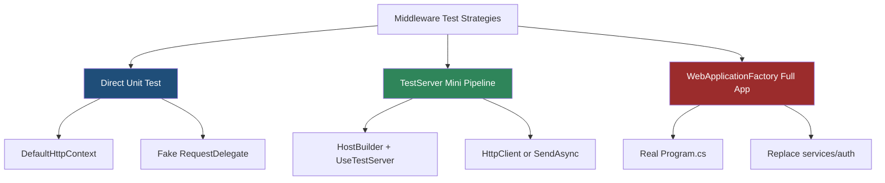
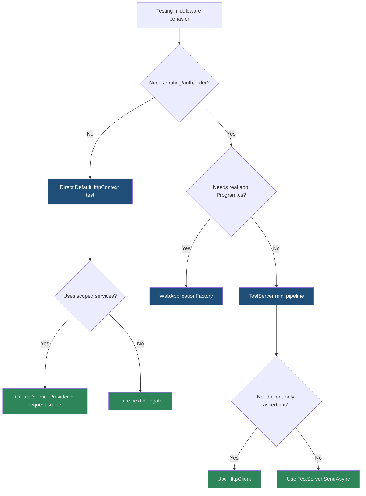

> [!success] Mastery Check
> - [ ] **Studied Well**
> - [ ] **Can explain the concept without notes**
> - [ ] **Can answer interview questions confidently**
> - [ ] **Can implement it in a real project**


# 4.063 — Middleware Testing: Isolating Middleware Without the Full Pipeline

---

## PART 0 — Navigation & Context

### Where This Topic Lives

```
ASP.NET Core Mastery
├── Middleware Pipeline
│   ├── 4.050  Writing middleware
│   ├── 4.057  Middleware and scoped DI
│   └── 4.063  ◄ YOU ARE HERE — testing middleware
└── Testing
    ├── 4.257  WebApplicationFactory
    ├── 4.258  Replacing services
    ├── 4.259  Fake auth schemes
    └── TestServer / DefaultHttpContext
```

### What You Need Before This

- **[[4.050 — Writing Middleware: IMiddleware vs Convention-Based]]** — tests need to instantiate the correct activation model.
- **[[4.057 — Middleware and Scoped DI: Injecting Scoped Services Correctly]]** — scoped middleware tests need request services.
- **[[4.052 — Middleware Ordering: The Canonical Order and Why It Matters]]** — some middleware can only be tested correctly with routing/auth around it.

### What This Unlocks After

- Fast unit tests for simple request/response behavior.
- Focused `TestServer` tests for branch and pipeline behavior.
- Full `WebApplicationFactory` tests only when the whole app pipeline matters.

### Why This Matters at Scale

Middleware bugs usually affect entire request families, so a small, isolated test that proves "this middleware short-circuits with the right HTTP status and headers" can prevent broad production regressions without booting the whole application for every case.

---

## PART 1 — The Core Mental Model

### The Fundamental Rule

> **Test middleware at the smallest pipeline depth that still preserves the HTTP behavior you care about; the practical consequence is that pure middleware can use `DefaultHttpContext`, branch/order-sensitive middleware needs `TestServer`, and app-wide interactions need `WebApplicationFactory`.**

### The Plain-Language Analogy

Testing middleware is like testing a checkpoint. If you only need to know whether the guard stamps a ticket, you can hand them a fake ticket. If you need to know whether the guard stands before the elevator, you need a small building mockup. If you need to know whether the whole airport flow works, you test the terminal.

### The Taxonomy Diagram



---

## PART 2 — Deep Mechanics

### 2.1 Direct Tests Call InvokeAsync With a Fake next

```
Test ──► Middleware.InvokeAsync(DefaultHttpContext) ──► fake next delegate
```

```http
// HTTP behavior under test:
GET /api/orders HTTP/1.1

HTTP/1.1 401 Unauthorized
```

```csharp
var context = new DefaultHttpContext();
var called = false;
RequestDelegate next = _ =>
{
    called = true;
    return Task.CompletedTask;
};

var middleware = new ApiKeyMiddleware(next);
await middleware.InvokeAsync(context);

Assert.False(called);
Assert.Equal(StatusCodes.Status401Unauthorized, context.Response.StatusCode);
```

Cost: fastest test shape, no server startup. Edge case: you must populate request services, route values, user, headers, and body manually.

### 2.2 TestServer Builds a Minimal Real Pipeline

```
Test HttpClient ──► TestServer ──► Middleware chain under test ──► test endpoint
```

```http
GET /hello HTTP/1.1

HTTP/1.1 200 OK
X-Test: yes
```

```csharp
using IHost host = await new HostBuilder()
    .ConfigureWebHost(webBuilder =>
    {
        webBuilder.UseTestServer()
            .Configure(app =>
            {
                app.UseMiddleware<ResponseHeaderMiddleware>();
                app.Run(context => context.Response.WriteAsync("hello"));
            });
    })
    .StartAsync();
```

Cost: starts a lightweight in-memory host. Edge case: TestServer is not Kestrel; transport-specific headers and socket behavior differ.

### 2.3 SendAsync Gives Direct HttpContext Control

```csharp
HttpContext context = await host.GetTestServer().SendAsync(ctx =>
{
    ctx.Request.Method = HttpMethods.Post;
    ctx.Request.Path = "/api/orders";
    ctx.Request.Headers["X-Tenant-Id"] = "contoso";
});
```

Use this when assertions need `HttpContext` state, not only `HttpResponseMessage`.

### 2.4 Scoped DI Tests Need RequestServices

```csharp
var services = new ServiceCollection();
services.AddScoped<TenantRequestContext>();
await using ServiceProvider provider = services.BuildServiceProvider();
await using AsyncServiceScope scope = provider.CreateAsyncScope();

var context = new DefaultHttpContext
{
    RequestServices = scope.ServiceProvider
};
```

Cost: creates a real DI scope. Edge case: direct tests without `RequestServices` will fail for method-injected or manually resolved Scoped services.

### 2.5 Order-Sensitive Middleware Requires a Pipeline Test

Middleware that reads `context.GetEndpoint()`, relies on auth, CORS, routing, or endpoint filters cannot be fully tested by direct invocation. Build a minimal `TestServer` pipeline with the exact surrounding middleware.

---

## PART 3 — Production Code Patterns

### Pattern 1: Direct Short-Circuit Test

```csharp
[Fact]
public async Task ApiKeyMiddleware_WithoutKey_Returns401_AndDoesNotCallNext()
{
    var context = new DefaultHttpContext();
    bool nextCalled = false;

    var middleware = new ApiKeyMiddleware(_ =>
    {
        nextCalled = true;
        return Task.CompletedTask;
    });

    await middleware.InvokeAsync(context);

    Assert.False(nextCalled);
    Assert.Equal(StatusCodes.Status401Unauthorized, context.Response.StatusCode);
}
```

### Pattern 2: Direct Pass-Through Test

```csharp
[Fact]
public async Task ApiKeyMiddleware_WithKey_CallsNext()
{
    var context = new DefaultHttpContext();
    context.Request.Headers["X-Api-Key"] = "test-key";
    bool nextCalled = false;

    var middleware = new ApiKeyMiddleware(_ =>
    {
        nextCalled = true;
        return Task.CompletedTask;
    });

    await middleware.InvokeAsync(context);

    Assert.True(nextCalled);
}
```

### Pattern 3: TestServer Header Test

```csharp
[Fact]
public async Task ResponseHeaderMiddleware_AddsHeader()
{
    using IHost host = await new HostBuilder()
        .ConfigureWebHost(webBuilder =>
        {
            webBuilder.UseTestServer()
                .Configure(app =>
                {
                    app.UseMiddleware<ResponseHeaderMiddleware>();
                    app.Run(ctx => ctx.Response.WriteAsync("ok"));
                });
        })
        .StartAsync();

    HttpResponseMessage response = await host.GetTestClient().GetAsync("/");

    Assert.Equal(HttpStatusCode.OK, response.StatusCode);
    Assert.True(response.Headers.Contains("X-App-Version"));
}
```

### Pattern 4: Routing Metadata Test

```csharp
[Fact]
public async Task MetadataAwareMiddleware_SeesEndpointAfterRouting()
{
    using IHost host = await new HostBuilder()
        .ConfigureWebHost(webBuilder =>
        {
            webBuilder.UseTestServer()
                .ConfigureServices(services => services.AddRouting())
                .Configure(app =>
                {
                    app.UseRouting();
                    app.UseMiddleware<EndpointNameMiddleware>();
                    app.UseEndpoints(endpoints =>
                    {
                        endpoints.MapGet("/orders", () => "ok").WithDisplayName("orders-list");
                    });
                });
        })
        .StartAsync();

    HttpResponseMessage response = await host.GetTestClient().GetAsync("/orders");

    Assert.True(response.Headers.Contains("X-Endpoint-Name"));
}
```

### Pattern 5: Scoped Middleware Test

```csharp
[Fact]
public async Task TenantMiddleware_SetsScopedTenant()
{
    var services = new ServiceCollection();
    services.AddScoped<TenantRequestContext>();
    await using ServiceProvider provider = services.BuildServiceProvider();
    await using AsyncServiceScope scope = provider.CreateAsyncScope();

    var context = new DefaultHttpContext { RequestServices = scope.ServiceProvider };
    context.Request.Headers["X-Tenant-Id"] = "contoso";

    var middleware = new TenantContextMiddleware(_ => Task.CompletedTask);

    await middleware.InvokeAsync(context, scope.ServiceProvider.GetRequiredService<TenantRequestContext>());

    Assert.Equal("contoso", scope.ServiceProvider.GetRequiredService<TenantRequestContext>().TenantId);
}
```

---

## PART 4 — Gotchas & Anti-Patterns

### Gotcha 1: Testing Middleware Without Testing Whether next Was Called

```csharp
// ⚠️ WRONG CODE
await middleware.InvokeAsync(context);
Assert.Equal(401, context.Response.StatusCode);
```

```http
// HTTP consequence (wrong path):
// Test misses whether endpoint still ran after the 401.
```

```csharp
// ✅ CORRECT CODE
bool nextCalled = false;
RequestDelegate next = _ => { nextCalled = true; return Task.CompletedTask; };
Assert.False(nextCalled);
```

WHY: short-circuiting is a core middleware behavior.

### Gotcha 2: Forgetting RequestServices

```csharp
// ⚠️ WRONG CODE
var context = new DefaultHttpContext();
await middleware.InvokeAsync(context);
```

```http
// HTTP consequence (wrong path):
// Test throws even though real requests have a request scope.
```

```csharp
// ✅ CORRECT CODE
context.RequestServices = scope.ServiceProvider;
```

WHY: direct tests must create the services the hosting layer normally provides.

### Gotcha 3: Using Direct Tests for Routing-Dependent Middleware

```csharp
// ⚠️ WRONG CODE
Assert.Null(new DefaultHttpContext().GetEndpoint());
```

```http
// HTTP consequence (wrong path):
// Test cannot prove behavior after routing.
```

```csharp
// ✅ CORRECT CODE
// Use TestServer with UseRouting and mapped endpoints.
```

WHY: endpoint metadata exists only after routing middleware runs.

### Gotcha 4: Assuming TestServer Is Kestrel

```csharp
// ⚠️ WRONG CODE
Assert.True(response.Headers.Contains("Transfer-Encoding"));
```

```http
// HTTP consequence (wrong path):
// TestServer may omit transport-specific headers.
```

```csharp
// ✅ CORRECT CODE
// Assert middleware-owned headers and status, not transport artifacts.
```

WHY: TestServer is in-memory and does not emulate every socket detail.

### Gotcha 5: Only Testing Success Path

```csharp
// ⚠️ WRONG CODE
await client.GetAsync("/orders");
```

```http
// HTTP consequence (wrong path):
// Missing tests for 400/401/403/500 branches.
```

```csharp
// ✅ CORRECT CODE
// Test pass-through, short-circuit, exception, and response-started paths.
```

WHY: middleware failures are usually branch-specific.

---

## PART 5 — Performance Implications

| Scenario | Pipeline Depth | Allocations Per Request | Approx Latency Impact | Recommendation |
|---|---:|---:|---:|---|
| Direct `DefaultHttpContext` test | none | low | fastest | Use for pure middleware |
| TestServer mini pipeline | minimal | host/test allocations | medium | Use for routing/order behavior |
| WebApplicationFactory | full app | high | slowest | Use for integration coverage |
| Body middleware test | depends | buffers | medium | Bound payloads |
| Scoped DI test | scope | service graph | low-medium | Use real scope |
| Auth middleware test | mini/full | auth handler | medium | Use fake auth scheme |
| Transport header test | TestServer mismatch | n/a | flaky | Avoid |
| Branch matrix test | many cases | test count | time | Use theory data |

```csharp
[MemoryDiagnoser]
public sealed class MiddlewareTestShapeBenchmarks
{
    [Benchmark(Baseline = true)]
    public DefaultHttpContext CreateContext() => new();

    [Benchmark]
    public ServiceProvider CreateProvider() =>
        new ServiceCollection().AddScoped<object>().BuildServiceProvider();
}
```

When this costs you: using full app integration tests for every middleware branch. When it does not matter: a small number of high-value full-pipeline tests.

---

## PART 6 — Interview Arsenal

### A. The Question Bank

**Question:** "How do you test custom middleware?"

Great answer:

> I start with the smallest test that proves the HTTP behavior. For simple short-circuiting or header middleware, I instantiate it directly with `DefaultHttpContext` and a fake `next` delegate, then assert status, headers, body, and whether `next` was called. If the middleware depends on routing, endpoint metadata, auth, or order, I use `TestServer` with a minimal pipeline. I reserve `WebApplicationFactory` for proving it works in the real app composition.

**Question:** "What do you assert in middleware tests?"

Great answer:

> I assert what the client observes: status code, response headers, body shape, and whether downstream ran. I also assert side effects like scoped request state or log calls when those are the middleware contract. I avoid asserting TestServer transport details that Kestrel would handle differently.

**Question:** "Why not always use WebApplicationFactory?"

Great answer:

> It is valuable but slower and broader than necessary. Middleware is often easy to isolate, and focused tests make branch behavior clearer. Full app tests are still important for ordering and service registration, but they should not be the only way I test every edge case.

### B. Trick Questions

- "Does `DefaultHttpContext` include routing metadata?" No, you must set it or run routing.
- "Does TestServer behave exactly like Kestrel?" No.
- "Can you test scoped middleware directly?" Yes, but create a real request scope.
- "What proves short-circuiting?" The fake `next` delegate was not called.

### C. Red Flags to Avoid

- "I only test middleware through full end-to-end tests." Slow and unclear.
- "I don't assert next." Misses short-circuit bugs.
- "TestServer proves socket behavior." It is in-memory.
- "No need to test order." Many middleware bugs are order bugs.
- "Scoped services just work in direct tests." Only if you provide `RequestServices`.

---

## PART 7 — Decision Framework



---

## PART 8 — Self-Check

### A. Conceptual Questions

1. What does a fake `next` delegate prove?
2. When is `DefaultHttpContext` enough?
3. When do you need `TestServer`?
4. Why is `WebApplicationFactory` not the default for every middleware branch?
5. How do you test method-injected Scoped services?
6. What TestServer behavior differs from Kestrel?
7. Why should middleware tests assert HTTP status and headers?
8. How do you test middleware that reads endpoint metadata?

### B. Code Puzzles

```csharp
bool called = false;
RequestDelegate next = _ => { called = true; return Task.CompletedTask; };
```

<details><summary>Answer</summary>
This fake `next` lets the test prove whether middleware passed the request downstream or short-circuited.
</details>

```csharp
var context = new DefaultHttpContext();
var endpoint = context.GetEndpoint();
```

<details><summary>Answer</summary>
`endpoint` is null unless the test sets an endpoint manually or runs routing.
</details>

```csharp
context.RequestServices = new ServiceCollection().BuildServiceProvider();
```

<details><summary>Answer</summary>
This provides a provider but not necessarily a request scope with required services. Use a configured provider and `CreateAsyncScope`.
</details>

```csharp
Assert.True(response.Headers.Contains("Transfer-Encoding"));
```

<details><summary>Answer</summary>
Flaky/wrong for TestServer; it may not emit transport-specific headers.
</details>

---

## PART 9 — Connections & Resources

### A. Related Topics Table

| Topic | Why It Connects |
|---|---|
| [[4.050 — Writing Middleware: IMiddleware vs Convention-Based]] | Tests instantiate middleware according to activation style. |
| [[4.052 — Middleware Ordering: The Canonical Order and Why It Matters]] | Order-sensitive middleware needs pipeline tests. |
| [[4.057 — Middleware and Scoped DI: Injecting Scoped Services Correctly]] | Scoped middleware tests must create request scopes. |
| [[4.257 — WebApplicationFactory<T>: Integration Testing the Full Pipeline]] | Full app tests prove real composition. |
| [[4.258 — Customizing WebApplicationFactory: Replacing Services for Tests]] | Middleware dependencies often need test doubles. |

### B. Books

| Book | Chapters | Why These Chapters |
|---|---|---|
| *ASP.NET Core in Action* | Testing, middleware | Practical middleware and integration testing. |
| *xUnit Test Patterns* | Test doubles, fixtures | Helps structure isolated tests cleanly. |

### C. Essential Articles & Docs

- [Microsoft Docs — Test ASP.NET Core middleware](https://learn.microsoft.com/en-us/aspnet/core/test/middleware)
- [Microsoft Docs — Integration tests in ASP.NET Core](https://learn.microsoft.com/en-us/aspnet/core/test/integration-tests)
- [Microsoft Docs — ASP.NET Core middleware](https://learn.microsoft.com/en-us/aspnet/core/fundamentals/middleware/)
- [GitHub — Microsoft.AspNetCore.TestHost](https://github.com/dotnet/aspnetcore/tree/main/src/Hosting/TestHost)

### D. Template Meta-Note

> [!NOTE]
> **Part 0** orients the topic. **Part 1** gives the mental model. **Part 2** shows framework mechanics. **Part 3** gives production patterns. **Part 4** names gotchas. **Part 5** covers performance. **Part 6** prepares interviews. **Part 7** gives decisions. **Part 8** checks understanding. **Part 9** connects resources.
