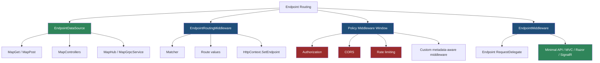
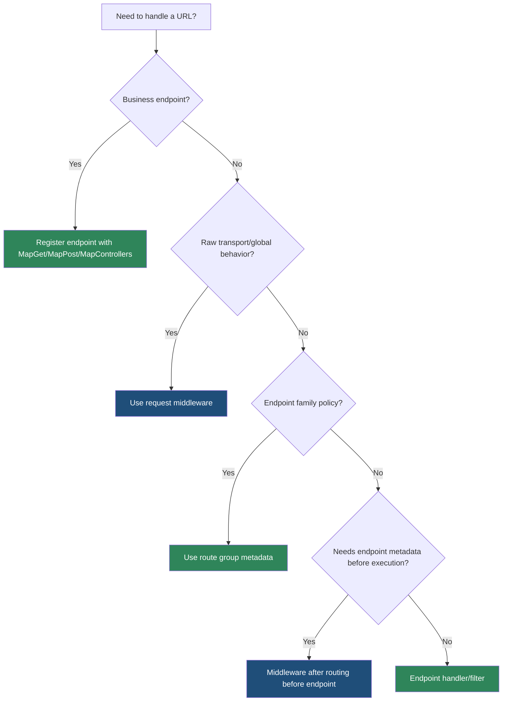

> [!success] Mastery Check
> - [ ] **Studied Well**
> - [ ] **Can explain the concept without notes**
> - [ ] **Can answer interview questions confidently**
> - [ ] **Can implement it in a real project**


# 4.064 — Endpoint Routing: The Modern Routing Architecture

---

## PART 0 — Navigation & Context

### Where This Topic Lives

```
ASP.NET Core Mastery
├── Middleware Pipeline
│   ├── 4.049  RequestDelegate chain
│   └── 4.052  Middleware order
└── Routing System
    ├── 4.064  ◄ YOU ARE HERE — endpoint routing
    ├── 4.065  Route templates
    ├── 4.066  Route constraints
    ├── 4.070  Route groups
    ├── 4.074  Endpoint metadata
    └── 4.075  Route performance
```

### What You Need Before This

- **[[4.001 — The ASP.NET Core Request Pipeline: A Mental Model]]** — endpoint routing is a middleware pair inside the larger request pipeline.
- **[[4.052 — Middleware Ordering: The Canonical Order and Why It Matters]]** — routing must run before metadata-aware middleware such as auth.
- **[[4.049 — The Middleware Pipeline: Request Delegation Chain]]** — routing selects a terminal delegate that endpoint middleware later invokes.

### What This Unlocks After

- **[[4.065 — Route Templates: Syntax, Literals, Parameters, and Wildcards]]** — route templates are the matching language endpoint routing consumes.
- **[[4.070 — Route Groups: Prefix, Filters, Metadata, and Shared Middleware]]** — route groups are endpoint builders on top of endpoint routing.
- **[[4.074 — Endpoint Metadata: Decorating Endpoints with Custom Attributes]]** — metadata is how auth, CORS, OpenAPI, and filters attach policy to endpoints.
- **[[4.083 — Minimal API Filters: IEndpointFilter Pipeline]]** — endpoint filters run inside endpoint execution.

### Why This Matters at Scale

Endpoint routing is the dispatch system that decides which code handles the HTTP request and which metadata policies apply; if you do not understand it, middleware ordering, authorization, CORS, route groups, filters, OpenAPI, and link generation all feel like unrelated magic.

---

## PART 1 — The Core Mental Model

### The Fundamental Rule

> **Endpoint routing first selects an `Endpoint` and stores it on `HttpContext`; later endpoint middleware executes that endpoint's `RequestDelegate`. The practical consequence is that middleware between selection and execution can inspect endpoint metadata and enforce per-endpoint policy.**

### The Plain-Language Analogy

Routing is the receptionist in a large office. The receptionist reads the visitor's destination, chooses the room, and writes the room and rules on a badge. Security guards in the hallway can inspect the badge before the visitor reaches the room. Endpoint middleware is the room door: once the visitor enters, the selected meeting actually happens.

### The Taxonomy Diagram



---

## PART 2 — Deep Mechanics

### 2.1 Endpoint Registration Builds Data Sources

```
Startup:
app.MapGet("/api/orders/{id:int}", Handler)
  └── creates RouteEndpoint
      ├── RoutePattern
      ├── RequestDelegate
      └── Metadata collection
```

```csharp
app.MapGet("/api/orders/{id:int}", (int id) => Results.Ok(new { id }))
   .WithName("GetOrder")
   .RequireAuthorization("Orders.Read");
```

Cost: endpoint objects are built at startup; per-request matching uses precomputed route structures. Edge case: changing endpoints generally means rebuilding/restarting the app unless using dynamic endpoint data sources.

### 2.2 EndpointRoutingMiddleware Selects the Endpoint

```
──► StaticFiles ──► [EndpointRoutingMiddleware] ──► Auth ──► Authorization ──► EndpointMiddleware
                       │
                       ├── match path/method/constraints
                       ├── set context.Request.RouteValues
                       └── set context.GetEndpoint()
```

```http
GET /api/orders/42 HTTP/1.1

// After routing:
// endpoint = "HTTP: GET /api/orders/{id:int}"
// routeValues["id"] = "42"
```

Framework behavior:

```csharp
Endpoint? endpoint = matcher.Match(context.Request.Path, context.Request.Method);
context.SetEndpoint(endpoint);
context.Request.RouteValues = extractedValues;
await next(context);
```

Cost: optimized route matching; constraints add work. Edge case: endpoint is null for unmatched paths, static files that short-circuit earlier, or requests excluded by method/constraint.

### 2.3 The Middleware Window Between Routing and Endpoint Execution

```
──► Routing ──► CORS ──► Authentication ──► Authorization ──► RateLimiting ──► Endpoint
                 │                         │
                 └── all can inspect endpoint metadata after routing
```

```http
GET /api/admin/orders HTTP/1.1

HTTP/1.1 401 Unauthorized
WWW-Authenticate: Bearer
```

Authorization reads endpoint metadata and may short-circuit before the endpoint delegate executes.

### 2.4 EndpointMiddleware Executes the Selected Delegate

```
──► EndpointMiddleware
      ├── if endpoint null: call next/fallback 404 path
      └── if endpoint selected: endpoint.RequestDelegate(context)
```

```http
GET /api/orders/42 HTTP/1.1

HTTP/1.1 200 OK
Content-Type: application/json

{"id":42}
```

Cost: endpoint delegate cost depends on handler model: Minimal API, MVC action invocation, Razor Page, SignalR, gRPC. Edge case: endpoint execution is terminal for matched endpoints.

### 2.5 Minimal Hosting Hides Some Explicit Calls

In .NET 6+, `WebApplication` makes many simple apps look like:

```csharp
var app = builder.Build();
app.MapGet("/", () => "Hello");
app.Run();
```

Routing and endpoint execution still exist. The hosting model inserts/arranges them around mapped endpoints. Senior engineers should reason in phases even when the code is terse.

---

## PART 3 — Production Code Patterns

### Pattern 1: Canonical API Routing Window

```csharp
app.UseExceptionHandler("/error");
app.UseHttpsRedirection();
app.UseRouting();
app.UseCors();
app.UseAuthentication();
app.UseAuthorization();

app.MapGet("/api/orders/{id:int}", GetOrder)
   .WithName("GetOrder")
   .RequireAuthorization("Orders.Read");
```

```http
// Unauthorized request:
HTTP/1.1 401 Unauthorized
```

Routing selects the endpoint before authorization reads its policy.

### Pattern 2: Metadata-Aware Audit Middleware

```csharp
app.UseRouting();
app.Use(async (context, next) =>
{
    Endpoint? endpoint = context.GetEndpoint();
    string endpointName = endpoint?.DisplayName ?? "unmatched";
    context.Response.Headers["X-Endpoint"] = endpointName;
    await next(context);
});
app.UseAuthorization();
```

Use this only after routing.

### Pattern 3: Named Route for Link Generation

```csharp
app.MapGet("/api/orders/{id:int}", (int id) => Results.Ok(new { id }))
   .WithName("Orders_GetById");

app.MapPost("/api/orders", (LinkGenerator links, HttpContext context) =>
{
    int id = 42;
    string? uri = links.GetUriByName(context, "Orders_GetById", new { id });
    return Results.Created(uri!, new { id });
});
```

```http
HTTP/1.1 201 Created
Location: https://api.example.com/api/orders/42
```

### Pattern 4: Route Group as EndpointDataSource Builder

```csharp
RouteGroupBuilder orders = app.MapGroup("/api/orders")
    .WithTags("Orders")
    .RequireAuthorization("Orders");

orders.MapGet("/{id:int}", GetOrder);
orders.MapPost("/", CreateOrder);
```

The group contributes prefix and metadata to all child endpoints.

### Pattern 5: Fallback Endpoint

```csharp
app.MapFallback(() => Results.NotFound(new ProblemDetails
{
    Title = "Endpoint not found",
    Status = StatusCodes.Status404NotFound
}));
```

Fallback is still endpoint routing; it is not a random middleware afterthought.

---

## PART 4 — Gotchas & Anti-Patterns

### Gotcha 1: Authorization Before Routing

```csharp
// ⚠️ WRONG CODE
app.UseAuthorization();
app.UseRouting();
```

```http
// HTTP consequence (wrong path):
// Authorization cannot see endpoint metadata.
```

```csharp
// ✅ CORRECT CODE
app.UseRouting();
app.UseAuthorization();
```

WHY: endpoint metadata exists after route selection.

### Gotcha 2: Reading Route Values Before Routing

```csharp
// ⚠️ WRONG CODE
app.Use(async (ctx, next) =>
{
    var id = ctx.Request.RouteValues["id"];
    await next();
});
app.MapGet("/orders/{id:int}", Handler);
```

```http
// HTTP consequence (wrong path):
// id is null before routing runs.
```

```csharp
// ✅ CORRECT CODE
app.UseRouting();
app.Use(async (ctx, next) =>
{
    var id = ctx.Request.RouteValues["id"];
    await next();
});
```

WHY: route values are produced by the matcher.

### Gotcha 3: Treating MapGet as Immediate Execution

```csharp
// ⚠️ WRONG MENTAL MODEL
app.MapGet("/orders", Handler); // "runs here"
```

```http
// HTTP consequence:
// None at startup; this registers an endpoint for later matching.
```

```csharp
// ✅ CORRECT MODEL
// MapGet adds endpoint metadata and delegate to data sources.
```

WHY: endpoint execution occurs later per request.

### Gotcha 4: Using Terminal Middleware for Routed APIs

```csharp
// ⚠️ WRONG CODE
app.Use(async (ctx, next) =>
{
    if (ctx.Request.Path == "/orders/42") await ctx.Response.WriteAsync("ok");
    else await next();
});
```

```http
// HTTP consequence (wrong path):
// No route values, metadata, OpenAPI, auth policies, or link generation.
```

```csharp
// ✅ CORRECT CODE
app.MapGet("/orders/{id:int}", Handler);
```

WHY: routing gives policy integration and dispatch semantics.

### Gotcha 5: Forgetting Method Matching

```csharp
// ⚠️ WRONG ASSUMPTION
app.MapGet("/orders", Handler);
```

```http
POST /orders HTTP/1.1

HTTP/1.1 405 Method Not Allowed
```

```csharp
// ✅ CORRECT CODE
app.MapPost("/orders", CreateOrder);
```

WHY: HTTP method metadata participates in endpoint selection.

---

## PART 5 — Performance Implications

| Scenario | Pipeline Depth | Allocations Per Request | Approx Latency Impact | Recommendation |
|---|---:|---:|---:|---|
| Simple literal route | routing + endpoint | low | very low | Default |
| Parameter route | route value extraction | low | low | Normal |
| Constrained route | constraint eval | low | low-medium | Use for correctness |
| Many endpoints | matcher data structures | startup memory | low per request | Organize routes |
| Metadata lookup | O(metadata count) | 0 | tiny | Safe after routing |
| MVC endpoint | MVC invocation | more | medium | Use when MVC features needed |
| Minimal API endpoint | direct delegate | lower | low | Good for APIs |
| Terminal custom path matching | custom | varies | easy to get wrong | Prefer routing |

```csharp
[MemoryDiagnoser]
public sealed class RoutingMentalModelBenchmarks
{
    [Benchmark(Baseline = true)]
    public bool LiteralPathCheck() => "/api/orders" == "/api/orders";

    [Benchmark]
    public RouteValueDictionary RouteValues() => new(new { id = 42 });
}
```

When this costs you: huge route tables with many constraints, ambiguous patterns, and expensive custom constraints. When it does not matter: normal CRUD endpoint counts where JSON and data access dominate.

---

## PART 6 — Interview Arsenal

### A. The Question Bank

**Question:** "Explain endpoint routing."

Great answer:

> Endpoint routing splits dispatch into selection and execution. The routing middleware matches the request path, method, and constraints against registered endpoints, then stores the selected `Endpoint` and route values on `HttpContext`. Middleware after routing can inspect endpoint metadata, which is why CORS, authorization, and rate limiting sit there. Endpoint middleware later invokes the selected endpoint delegate. The client sees the consequence as the correct handler, status code, auth challenge, or 404/405.

**Question:** "Why must `UseRouting` come before `UseAuthorization`?"

Great answer:

> Authorization needs endpoint metadata like `[Authorize]` or `RequireAuthorization`. Before routing, there is no selected endpoint, so authorization cannot know which policy applies. If the order is wrong, security behavior becomes generic or broken.

**Question:** "What does `MapGet` do?"

Great answer:

> It registers a route endpoint: a pattern, HTTP method metadata, a request delegate, and additional metadata like name, authorization, OpenAPI, and filters. It does not execute at startup. It contributes to endpoint data sources that routing uses per request.

### B. Trick Questions

- "Is endpoint routing only for Minimal APIs?" No; MVC, Razor Pages, SignalR, and gRPC also use endpoint routing.
- "Is route value binding the same as model binding?" No; routing extracts route values; endpoint/MVC binding consumes them later.
- "Does `context.GetEndpoint()` always return a value?" No; unmatched requests and pre-routing middleware see null.
- "Does `MapGet` bypass middleware?" No; it registers an endpoint executed inside the pipeline.

### C. Red Flags to Avoid

- "Routing executes the action directly." It selects; endpoint middleware executes.
- "Authorization can run anywhere." It needs endpoint metadata.
- "Route values exist from the start." They are produced by routing.
- "Terminal middleware is equivalent to routing." It lacks metadata and policy integration.
- "Minimal hosting removed routing." It hid some boilerplate, not the architecture.

---

## PART 7 — Decision Framework



---

## PART 8 — Self-Check

### A. Conceptual Questions

1. What two phases does endpoint routing split request dispatch into?
2. What does `HttpContext.GetEndpoint()` return before routing?
3. Why does authorization need endpoint metadata?
4. What are route values and when are they created?
5. How does `MapGet` differ from `Use`?
6. What happens when no endpoint matches?
7. Why are route groups part of endpoint routing?
8. What HTTP response can method mismatch produce?

### B. Code Puzzles

```csharp
app.UseAuthorization();
app.MapGet("/admin", () => "ok").RequireAuthorization();
```

<details><summary>Answer</summary>
If authorization runs before routing/endpoint metadata is available, the policy may not be enforced correctly. Correct order is routing, auth, authorization, endpoint execution.
</details>

```csharp
app.Use(async (ctx, next) =>
{
    var endpoint = ctx.GetEndpoint();
    await next();
});
app.MapGet("/orders", () => "ok");
```

<details><summary>Answer</summary>
Depending on implicit routing insertion, explicit middleware before routing sees null. To read endpoint metadata, place middleware after routing.
</details>

```csharp
app.MapGet("/orders/{id:int}", (int id) => id);
```

<details><summary>Answer</summary>
`GET /orders/abc` does not match the int-constrained endpoint; the client gets 404 unless another route matches.
</details>

```csharp
app.MapGet("/orders", () => "list");
```

<details><summary>Answer</summary>
`POST /orders` does not match this GET endpoint and can produce 405 Method Not Allowed when the path matches but method does not.
</details>

---

## PART 9 — Connections & Resources

### A. Related Topics Table

| Topic | Why It Connects |
|---|---|
| [[4.052 — Middleware Ordering: The Canonical Order and Why It Matters]] | Routing order determines whether metadata-aware middleware works. |
| [[4.065 — Route Templates: Syntax, Literals, Parameters, and Wildcards]] | Templates are the matching language of endpoint routing. |
| [[4.070 — Route Groups: Prefix, Filters, Metadata, and Shared Middleware]] | Groups compose endpoint metadata and prefixes. |
| [[4.074 — Endpoint Metadata: Decorating Endpoints with Custom Attributes]] | Metadata is attached to endpoints and read by middleware. |
| [[4.083 — Minimal API Filters: IEndpointFilter Pipeline]] | Filters run inside endpoint execution. |

### B. Books

| Book | Chapters | Why These Chapters |
|---|---|---|
| *ASP.NET Core in Action* | Routing, Minimal APIs, middleware | Clear model of endpoint routing. |
| *Pro ASP.NET Core* | URL routing | Good route examples and matching behavior. |

### C. Essential Articles & Docs

- [Microsoft Docs — Routing in ASP.NET Core](https://learn.microsoft.com/en-us/aspnet/core/fundamentals/routing)
- [Microsoft Docs — ASP.NET Core middleware](https://learn.microsoft.com/en-us/aspnet/core/fundamentals/middleware/)
- [Microsoft Docs — Routing to controller actions](https://learn.microsoft.com/en-us/aspnet/core/mvc/controllers/routing)
- [GitHub — ASP.NET Core Routing source](https://github.com/dotnet/aspnetcore/tree/main/src/Http/Routing)

### D. Template Meta-Note

> [!NOTE]
> **Part 0** orients the topic. **Part 1** gives the mental model. **Part 2** shows framework mechanics. **Part 3** gives production patterns. **Part 4** names gotchas. **Part 5** covers performance. **Part 6** prepares interviews. **Part 7** gives decisions. **Part 8** checks understanding. **Part 9** connects resources.
