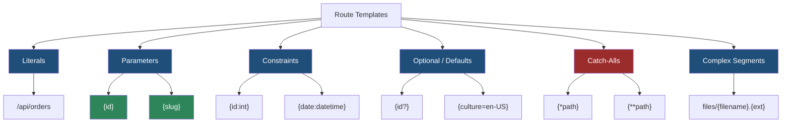
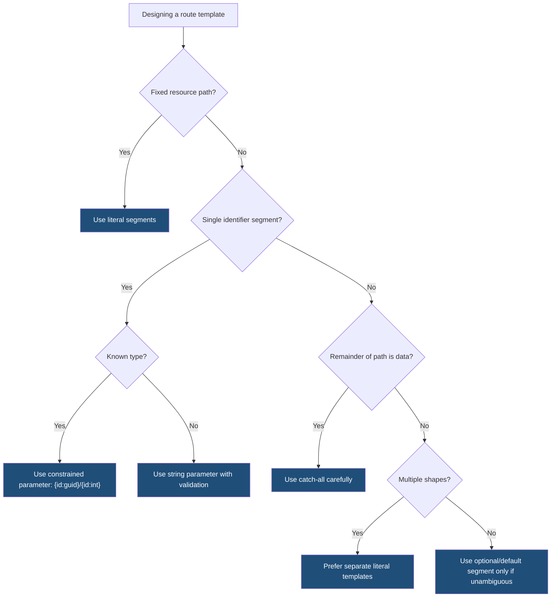

> [!success] Mastery Check
> - [ ] **Studied Well**
> - [ ] **Can explain the concept without notes**
> - [ ] **Can answer interview questions confidently**
> - [ ] **Can implement it in a real project**


# 4.065 — Route Templates: Syntax, Literals, Parameters, and Wildcards

---

## PART 0 — Navigation & Context

### Where This Topic Lives

```
ASP.NET Core Mastery
├── Routing System
│   ├── 4.064  Endpoint Routing: The Modern Routing Architecture
│   ├── 4.065  ◄ YOU ARE HERE — route templates
│   ├── 4.066  Route constraints
│   ├── 4.067  Attribute routing
│   ├── 4.068  Route order and precedence
│   ├── 4.071  Link generation
│   └── 4.073  Catch-all and fallback routes
├── Minimal APIs
│   └── MapGet / MapPost route patterns
└── MVC & Controllers
    └── [Route], [HttpGet], token replacement
```

### What You Need Before This

- **[[4.064 — Endpoint Routing: The Modern Routing Architecture]]** — route templates are compiled into route patterns consumed by endpoint routing.
- **[[4.049 — The Middleware Pipeline: Request Delegation Chain]]** — route matching happens inside the request pipeline before endpoint execution.
- **HTTP path basics** — templates match the URL path, not query string, headers, or body.

### What This Unlocks After

- **[[4.066 — Route Constraints: Type Constraints, Regex, and Custom Constraints]]** — constraints refine parameter matching.
- **[[4.068 — Route Order and Precedence: How Conflicts Are Resolved]]** — route specificity determines which matching endpoint wins.
- **[[4.071 — Link Generation: IUrlHelper, LinkGenerator, and Named Routes]]** — link generation uses the same route values and template grammar in reverse.
- **[[4.073 — Catch-All Routes, Fallback Routes, and 404 Response Handling]]** — wildcard templates are the foundation for catch-all behavior.

### Why This Matters at Scale

Route templates are your API contract at the URL level; a vague wildcard, missing constraint, or ambiguous parameter can route production traffic to the wrong handler, break client links, expose endpoints, or turn clean `404`/`405` behavior into confusing operational noise.

---

## PART 1 — The Core Mental Model

### The Fundamental Rule

> **A route template is a path-matching pattern made of literal segments, parameter segments, optional/default values, constraints, and catch-alls; the practical consequence is that endpoint routing chooses handlers from URL path shape before model binding or handler code runs.**

### The Plain-Language Analogy

Think of route templates as labeled bins on a sorting conveyor. A literal segment like `/orders` is a bin with an exact printed label. A parameter like `{id}` is a bin that accepts any package in that position and writes the value on a form. A constraint like `{id:int}` is a bin that only accepts packages with a numeric label. A catch-all is the overflow bin at the end, useful but dangerous if it is placed where more precise bins should catch the package first.

### The Taxonomy Diagram



---

## PART 2 — Deep Mechanics

### 2.1 Literal Segments Match Exact Path Text

```
──► Routing ──► compare path segments ──► selected endpoint or no match ──► Auth ──► Endpoint

Template: /api/orders
Path:     /api/orders   ✅ match
Path:     /api/order    ❌ no match
```

```http
GET /api/orders HTTP/1.1

HTTP/1.1 200 OK
Content-Type: application/json

[]
```

Framework behavior:

```csharp
app.MapGet("/api/orders", () => Results.Ok(Array.Empty<object>()));
```

Cost: literal matching is the cheapest and most specific route matching form. Edge case: route path matching is generally case-insensitive in ASP.NET Core, but do not rely on casing differences as distinct API contracts.

### 2.2 Parameter Segments Capture Route Values

```
Template: /api/orders/{id}
Path:     /api/orders/42

RouteValues:
id = "42"
```

```http
GET /api/orders/42 HTTP/1.1

HTTP/1.1 200 OK
Content-Type: application/json

{"id":"42"}
```

Framework behavior:

```csharp
app.MapGet("/api/orders/{id}", (string id) => Results.Ok(new { id }));
```

Cost: one route value extraction and later handler binding conversion. Edge case: without a constraint, `{id}` also matches `abc`, `pending`, and `2026-06-08`.

### 2.3 Constraints Filter Matches Before Handler Binding

```
Template: /api/orders/{id:int}
Path:     /api/orders/42      ✅ match
Path:     /api/orders/abc     ❌ no match
```

```http
GET /api/orders/abc HTTP/1.1

HTTP/1.1 404 Not Found
```

Framework behavior:

```csharp
app.MapGet("/api/orders/{id:int}", (int id) => Results.Ok(new { id }));
```

Cost: constraint evaluation during route matching. Edge case: route constraints decide whether the route matches; they are not validation errors. A failed constraint produces no route match, usually `404`, not `400`.

### 2.4 Optional and Default Values Affect Matching and Link Generation

```
Template: /api/reports/{year:int?}
Path:     /api/reports        ✅ year missing
Path:     /api/reports/2026   ✅ year = 2026
```

```csharp
app.MapGet("/api/reports/{year:int?}", (int? year) =>
{
    return Results.Ok(new { year = year ?? DateTime.UtcNow.Year });
});
```

Cost: optional segment increases matching possibilities. Edge case: optional route parameters must appear toward the end of the template unless the surrounding shape makes matching unambiguous.

### 2.5 Catch-Alls Consume the Rest of the Path

```
Template: /files/{*path}
Path:     /files/reports/2026/q2.pdf

RouteValues:
path = "reports/2026/q2.pdf"
```

```http
GET /files/reports/2026/q2.pdf HTTP/1.1

HTTP/1.1 200 OK
Content-Type: application/pdf
```

Framework behavior:

```csharp
app.MapGet("/files/{*path}", (string path) => Results.Ok(new { path }));
```

Cost: catch-all matching is broad and can compete with more specific routes. Edge case: catch-alls should be near fallback/static file boundaries and should not accidentally swallow API routes.

---

## PART 3 — Production Code Patterns

### Pattern 1: Typed Identifier Route for Order API

```csharp
app.MapGet("/api/orders/{id:guid}", async (
    Guid id,
    IOrderReader orders,
    CancellationToken cancellationToken) =>
{
    OrderDto? order = await orders.FindAsync(id, cancellationToken);
    return order is null ? Results.NotFound() : Results.Ok(order);
});
```

```http
GET /api/orders/not-a-guid HTTP/1.1

HTTP/1.1 404 Not Found
```

The `guid` constraint prevents the handler from running for invalid URL shapes.

### Pattern 2: Slug Route for Product Catalog

```csharp
app.MapGet("/api/products/{slug}", async (
    string slug,
    IProductCatalog catalog,
    CancellationToken cancellationToken) =>
{
    ProductDto? product = await catalog.FindBySlugAsync(slug, cancellationToken);
    return product is null ? Results.NotFound() : Results.Ok(product);
});
```

Use a string slug when the URL identifier is a public SEO/business key, not an internal database ID.

### Pattern 3: Date-Constrained Reporting Route

```csharp
app.MapGet("/api/reports/{year:int}/{month:int}", (
    int year,
    int month) =>
{
    if (month is < 1 or > 12)
    {
        return Results.BadRequest(new { error = "Month must be between 1 and 12." });
    }

    return Results.Ok(new { year, month });
});
```

```http
GET /api/reports/2026/abc HTTP/1.1

HTTP/1.1 404 Not Found

GET /api/reports/2026/13 HTTP/1.1

HTTP/1.1 400 Bad Request
```

Use route constraints for shape; use validation for business range.

### Pattern 4: Version Prefix Route Group

```csharp
RouteGroupBuilder v1 = app.MapGroup("/api/v1");

v1.MapGet("/orders/{id:guid}", GetOrderV1);
v1.MapPost("/orders", CreateOrderV1);
```

Prefix groups keep version literals consistent across endpoint families.

### Pattern 5: Safe File Catch-All

```csharp
app.MapGet("/download/{*path}", (string path, IFileLocator files) =>
{
    if (path.Contains("..", StringComparison.Ordinal))
    {
        return Results.BadRequest(new { error = "Invalid path." });
    }

    Stream? stream = files.OpenRead(path);
    return stream is null ? Results.NotFound() : Results.File(stream);
});
```

Catch-all values are untrusted input. Validate them before file access.

---

## PART 4 — Gotchas & Anti-Patterns

### Gotcha 1: Treating Constraints as Validation

```csharp
// ⚠️ WRONG CODE
app.MapGet("/orders/{id:int}", (int id) => Results.Ok(id));
```

```http
// HTTP consequence (wrong path):
// GET /orders/abc returns 404, not 400.
```

```csharp
// ✅ CORRECT CODE
app.MapGet("/orders/{id}", (string id) =>
{
    return int.TryParse(id, out int parsed)
        ? Results.Ok(parsed)
        : Results.BadRequest(new { error = "id must be an integer" });
});
```

WHY: constraints are route selection rules; validation is request semantics.

### Gotcha 2: Over-Broad Catch-All Before Specific Routes

```csharp
// ⚠️ WRONG CODE
app.MapGet("/{*path}", (string path) => Results.Ok(path));
app.MapGet("/api/orders/{id:int}", GetOrder);
```

```http
// HTTP consequence (wrong path):
// Catch-all may capture routes intended for API handlers depending on precedence/order.
```

```csharp
// ✅ CORRECT CODE
app.MapGet("/api/orders/{id:int}", GetOrder);
app.MapFallback(() => Results.NotFound());
```

WHY: broad templates belong at the fallback boundary.

### Gotcha 3: Ambiguous Parameter Names Do Not Create Specificity

```csharp
// ⚠️ WRONG CODE
app.MapGet("/orders/{id}", GetById);
app.MapGet("/orders/{slug}", GetBySlug);
```

```http
// HTTP consequence (wrong path):
// /orders/abc is ambiguous or resolved contrary to intent.
```

```csharp
// ✅ CORRECT CODE
app.MapGet("/orders/by-id/{id:guid}", GetById);
app.MapGet("/orders/by-slug/{slug}", GetBySlug);
```

WHY: parameter names do not affect route shape; literals and constraints do.

### Gotcha 4: Expecting Query String in Route Template

```csharp
// ⚠️ WRONG CODE
app.MapGet("/orders?status={status}", Handler);
```

```http
// HTTP consequence (wrong path):
// The template does not match query strings the way the developer expects.
```

```csharp
// ✅ CORRECT CODE
app.MapGet("/orders", ([FromQuery] string? status) => Results.Ok(status));
```

WHY: route templates match path, not query.

### Gotcha 5: Putting Optional Parameters in Confusing Positions

```csharp
// ⚠️ WRONG CODE
app.MapGet("/reports/{year?}/summary/{month?}", Handler);
```

```http
// HTTP consequence (wrong path):
// Matching and link generation become hard to reason about.
```

```csharp
// ✅ CORRECT CODE
app.MapGet("/reports/summary", CurrentSummary);
app.MapGet("/reports/{year:int}/{month:int}/summary", MonthlySummary);
```

WHY: clear literal routes beat clever optional segment layouts.

---

## PART 5 — Performance Implications

| Scenario | Pipeline Depth | Allocations Per Request | Approx Latency Impact | Recommendation |
|---|---:|---:|---:|---|
| Literal route | normal routing | low | lowest | Prefer for fixed resources |
| Simple parameter | route value extraction | low | low | Normal |
| Type constraint | constraint eval | low | low | Use for route disambiguation |
| Regex constraint | regex eval | depends | medium-high | Use sparingly |
| Optional segment | more candidates | low | low-medium | Keep at end |
| Catch-all | broad candidate | low | can affect ambiguity | Use for fallback/files |
| Ambiguous route table | extra candidate processing | low | correctness risk | Fix templates |
| Complex segment | parser work | low | medium | Prefer simpler paths |

```csharp
[MemoryDiagnoser]
public sealed class RouteTemplateBenchmarks
{
    [Benchmark(Baseline = true)]
    public bool LiteralCompare() => "/api/orders" == "/api/orders";

    [Benchmark]
    public bool IntParseConstraint() => int.TryParse("42", out _);

    [Benchmark]
    public bool GuidParseConstraint() => Guid.TryParse("0f8fad5b-d9cb-469f-a165-70867728950e", out _);
}
```

When this costs you: huge endpoint sets, regex constraints, custom constraints with I/O, and ambiguous route designs. When it does not matter: ordinary literal and constrained parameter routes in APIs where database and JSON dominate.

---

## PART 6 — Interview Arsenal

### A. The Question Bank

**Question:** "How do route templates work in ASP.NET Core?"

Great answer:

> A route template describes the URL path shape an endpoint accepts. Literal segments must match exact path text, parameter segments capture values into `RouteValues`, constraints filter candidates before the handler runs, and catch-alls capture the rest of the path. Routing uses that template to select an endpoint before model binding or endpoint invocation. The HTTP consequence is important: a failed constraint usually means no route match and a `404`, not a validation `400`.

**Question:** "What's the difference between `{id}` and `{id:int}`?"

Great answer:

> `{id}` captures any single path segment. `{id:int}` only matches a segment that satisfies the integer route constraint, so it helps disambiguate routes and prevents the handler from running for invalid path shape. I still validate business rules inside the handler, because constraints are about routing, not domain validation.

**Question:** "When would you use a catch-all route?"

Great answer:

> I use catch-alls for file paths, fallback routes, SPA fallback, or proxy-like behavior where the rest of the path is intentionally data. I keep them away from normal API routes and validate the captured value because a catch-all is broad. It can change 404 behavior and accidentally swallow routes if designed carelessly.

### B. Trick Questions

- "Do parameter names affect route specificity?" No; `{id}` and `{slug}` have the same shape.
- "Does `{id:int}` return 400 for `/abc`?" No, usually 404 because the route did not match.
- "Can route templates match query strings?" No, they match path.
- "Are catch-alls safe for file paths?" Only after path traversal validation.

### C. Red Flags to Avoid

- "Constraints are validation." They are matching rules.
- "Parameter names disambiguate routes." Shape, literals, constraints, and order/precedence matter.
- "Catch-all is a convenient default everywhere." It can swallow legitimate routes.
- "Query strings belong in templates." They do not.
- "Optional parameters make APIs cleaner." Often they make routes and links ambiguous.

---

## PART 7 — Decision Framework



---

## PART 8 — Self-Check

### A. Conceptual Questions

1. What does a literal route segment match?
2. What is stored in `RouteValues` for `/orders/{id}`?
3. What happens to `/orders/abc` for route `/orders/{id:int}`?
4. Why do `{id}` and `{slug}` conflict?
5. Why are catch-alls dangerous?
6. Do route templates match query strings?
7. When should validation happen instead of constraints?
8. How do route templates affect link generation?

### B. Code Puzzles

```csharp
app.MapGet("/orders/{id:int}", (int id) => id);
```

<details><summary>Answer</summary>
`GET /orders/abc` does not match and usually returns 404. The handler does not run.
</details>

```csharp
app.MapGet("/orders/{id}", GetById);
app.MapGet("/orders/{slug}", GetBySlug);
```

<details><summary>Answer</summary>
The routes have the same shape. Parameter names do not disambiguate them.
</details>

```csharp
app.MapGet("/search?term={term}", Search);
```

<details><summary>Answer</summary>
Wrong mental model. Route templates match path only; use query binding for `term`.
</details>

```csharp
app.MapGet("/files/{*path}", (string path) => path);
```

<details><summary>Answer</summary>
`GET /files/a/b/c.txt` captures `path = "a/b/c.txt"`. Treat it as untrusted input.
</details>

---

## PART 9 — Connections & Resources

### A. Related Topics Table

| Topic | Why It Connects |
|---|---|
| [[4.064 — Endpoint Routing: The Modern Routing Architecture]] | Endpoint routing compiles and matches route templates. |
| [[4.066 — Route Constraints: Type Constraints, Regex, and Custom Constraints]] | Constraints refine template matching. |
| [[4.067 — Attribute Routing on Controllers: [Route], [HttpGet], Token Replacement]] | Controller attributes use the same template concepts. |
| [[4.068 — Route Order and Precedence: How Conflicts Are Resolved]] | Precedence decides between competing route templates. |
| [[4.071 — Link Generation: IUrlHelper, LinkGenerator, and Named Routes]] | Link generation fills route templates with values. |

### B. Books

| Book | Chapters | Why These Chapters |
|---|---|---|
| *ASP.NET Core in Action* | Routing | Explains endpoint routing templates clearly. |
| *Pro ASP.NET Core* | URL Routing | Provides many template examples and edge cases. |

### C. Essential Articles & Docs

- [Microsoft Docs — Routing in ASP.NET Core](https://learn.microsoft.com/en-us/aspnet/core/fundamentals/routing)
- [Microsoft Docs — Routing to controller actions](https://learn.microsoft.com/en-us/aspnet/core/mvc/controllers/routing)
- [Microsoft Docs — Minimal APIs route handlers](https://learn.microsoft.com/en-us/aspnet/core/fundamentals/minimal-apis/route-handlers)
- [GitHub — RoutePattern source](https://github.com/dotnet/aspnetcore/tree/main/src/Http/Routing)

### D. Template Meta-Note

> [!NOTE]
> **Part 0** orients the topic. **Part 1** gives the mental model. **Part 2** shows framework mechanics. **Part 3** gives production patterns. **Part 4** names gotchas. **Part 5** covers performance. **Part 6** prepares interviews. **Part 7** gives decisions. **Part 8** checks understanding. **Part 9** connects resources.
