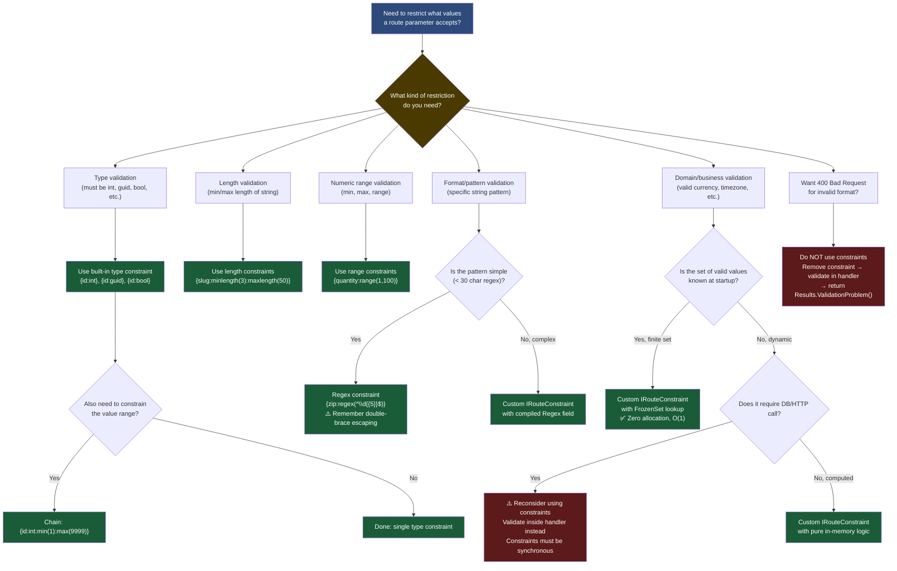

> [!success] Mastery Check
> - [ ] **Studied Well**
> - [ ] **Can explain the concept without notes**
> - [ ] **Can answer interview questions confidently**
> - [ ] **Can implement it in a real project**


# 4.066 — Route Constraints: Type Constraints, Regex, and Custom Constraints

---

## Part 0 — Navigation & Context

### Where This Topic Lives in the ASP.NET Core Domain

```
ASP.NET Core Mastery
└── Routing System                                    ← YOU ARE HERE
    ├── 4.064 — Endpoint Routing: The Modern Architecture
    ├── 4.065 — Route Templates: Syntax, Literals, Parameters, Wildcards
    ├── 4.066 — Route Constraints ◄─────────────────────────────────────
    │           ├── Type Constraints (int, guid, datetime, …)
    │           ├── Length/Range Constraints (min, max, range, …)
    │           ├── Pattern Constraints (regex)
    │           ├── Optional Parameters with Constraints ({id:int?})
    │           └── Custom Constraints (IRouteConstraint)
    ├── 4.068 — Route Order and Precedence
    ├── 4.072 — Custom Route Constraints: IRouteConstraint Implementation
    └── 4.080 — Route Parameter Binding in Minimal APIs
```

### What You Need Before This

| Prerequisite | Why You Need It |
|---|---|
| [[4.064 — Endpoint Routing: The Modern Routing Architecture]] | Constraints operate during route matching; you must understand how the matcher walks the endpoint tree |
| [[4.065 — Route Templates: Syntax, Literals, Parameters, and Wildcards]] | Constraints are embedded in route template parameters; you need to know the `{name}` syntax first |
| Basic C# generics and interfaces | `IRouteConstraint` is a single-method interface; custom constraints use `HttpContext` and `RouteValueDictionary` |
| HTTP status codes (200, 400, 404) | The most important nuance in this topic is that constraint failures yield 404, never 400 |

### What This Unlocks After

| Unlocked Topic | How This Topic Enables It |
|---|---|
| [[4.068 — Route Order and Precedence: Conflict Resolution Rules]] | Constraints affect how the router scores specificity when disambiguating overlapping routes |
| [[4.072 — Custom Route Constraints: IRouteConstraint Implementation]] | Deep-dive on the `Match()` method, `RouteDirection`, registration, and test patterns |
| [[4.080 — Route Parameter Binding in Minimal APIs]] | Minimal API parameter binding runs after routing succeeds; constraints gate what binding even attempts |
| Authorization policies with route data | Route constraints pre-filter by type/format before any auth middleware inspects route data |

### Why This Topic Matters at Production Scale

> Route constraints are the routing system's type-safety layer: they determine whether a URL *even reaches your handler*, which means a misconfigured or missing constraint either silently routes requests to the wrong endpoint, or causes auth middleware to evaluate payloads it was never designed to receive — both failure modes are invisible in unit tests but catastrophic at 50k req/s.

---

## Part 1 — The Core Mental Model

### The Fundamental Rule

> **ASP.NET Core route constraints validate extracted route parameter strings *after* URL pattern matching but *before* endpoint selection completes; when a constraint fails the route simply does not match — the client receives a 404, never a 400 — because constraints are routing logic, not input validation logic.**

---

### The Plain-Language Analogy

Think of the routing system as an airport security checkpoint with multiple lanes. Each lane has a sign specifying who may enter: "Passport holders only", "US citizens only", "Business class only". When you approach, the checkpoint officer (the route matcher) reads your ticket, extracts your name and class, and then checks each sign (the constraints). If your ticket says "Economy" and the lane says "Business class only", the officer doesn't reject you with a formal complaint — they simply wave you to a different lane. The rejection is silent and structural: you never entered the lane. This holds even under concurrent load (multiple officers checking thousands of tickets simultaneously), even when you're missing a ticket entirely (optional constraint: `{id:int?}`), and even for custom rules ("VIP loyalty card holders only" = `IRouteConstraint`). The critical nuance: the checkpoint officer's job is *lane selection*, not *ticket validation*. If your ticket number is `abc` and the lane requires a numeric passenger ID, you are redirected — it is never the officer's job to tell you your ticket is malformed. That happens at the gate (FluentValidation, DataAnnotations), long after you've been assigned a lane.

---

### The Taxonomy Diagram

```mermaid
graph TD
    A["Route Constraints<br/>(applied during matching)"] --> B["Built-in Constraints"]
    A --> C["Custom Constraints<br/>IRouteConstraint"]
    A --> D["Constraint Composition<br/>{id:int:min(1):max(9999)}"]

    B --> E["Type Constraints"]
    B --> F["Length Constraints"]
    B --> G["Numeric Range Constraints"]
    B --> H["Pattern Constraints"]
    B --> I["Existence Constraints"]

    E --> E1["int / long / float / double / decimal"]
    E --> E2["bool"]
    E --> E3["datetime"]
    E --> E4["guid"]
    E --> E5["alpha"]

    F --> F1["minlength(n)"]
    F --> F2["maxlength(n)"]
    F --> F3["length(n) / length(min,max)"]

    G --> G1["min(n)"]
    G --> G2["max(n)"]
    G --> G3["range(min,max)"]

    H --> H1["regex(pattern)<br/>double-brace escaping"]

    I --> I1["required"]

    C --> C2["IRouteConstraint.Match()"]
    C --> C3["RouteOptions.ConstraintMap registration"]
    C --> C4["RouteDirection (IncomingRequest / UrlGeneration)"]

    D --> D1["Left-to-right evaluation"]
    D --> D2["Short-circuit on first failure"]
    D --> D3["Optional: {id:int?}"]

    style A fill:#2d4a7a,color:#fff
    style B fill:#1a5c38,color:#fff
    style C fill:#5c1a1a,color:#fff
    style D fill:#4a3a00,color:#fff
    style E fill:#2a6b44,color:#fff
    style F fill:#2a6b44,color:#fff
    style G fill:#2a6b44,color:#fff
    style H fill:#2a6b44,color:#fff
    style I fill:#2a6b44,color:#fff
```



---

## Part 2 — Deep Mechanics

### 2.1 — How Constraints Fit in the Endpoint Routing Pipeline

```
Incoming HTTP Request
        │
        ▼
┌───────────────────┐
│  ExceptionHandler │  (UseExceptionHandler / UseDeveloperExceptionPage)
└────────┬──────────┘
         │
         ▼
┌───────────────────┐
│  HSTS / HTTPS     │  (UseHsts, UseHttpsRedirection)
└────────┬──────────┘
         │
         ▼
┌───────────────────┐
│  Static Files     │  (UseStaticFiles) — short-circuits if file found
└────────┬──────────┘
         │
         ▼
┌═══════════════════╗
║  UseRouting()     ║  ◄── ROUTE MATCHING HAPPENS HERE
║                   ║       1. Template literal matching
║  ┌─────────────┐  ║       2. Parameter extraction (all strings)
║  │ Constraint  │  ║       3. Constraint evaluation ← THIS TOPIC
║  │ Evaluation  │  ║       4. Endpoint scored and attached to HttpContext
║  └─────────────┘  ║
╚═══════════════════╝
         │
         │  If NO endpoint matched (constraint failed or no template matched):
         │  RouteContext.Handler = null → 404 response generated downstream
         │
         ▼
┌───────────────────┐
│  Authentication   │  (UseAuthentication) — only runs if endpoint matched
└────────┬──────────┘
         │
         ▼
┌───────────────────┐
│  Authorization    │  (UseAuthorization) — only runs if endpoint matched
└────────┬──────────┘
         │
         ▼
╔═══════════════════╗
║  UseEndpoints()   ║  ◄── Endpoint handler executes
╚═══════════════════╝
```

**Key insight**: `UseRouting()` and `UseEndpoints()` bracket the auth middleware. If a constraint fails, the request never reaches `UseAuthentication()` or `UseAuthorization()`. This means you cannot use constraints as an auth gate — an attacker sending `GET /api/orders/abc` will get a 404, but `GET /api/orders/1` with no auth token will reach `UseAuthorization()` and get a 401/403. The semantics are entirely different.

**HTTP Wire Format (constraint passes):**
```http
// HTTP request (constraint passes):
GET /api/payments/f47ac10b-58cc-4372-a567-0e02b2c3d479 HTTP/1.1
Host: payments.acme.com
Authorization: Bearer eyJhbGci...

// HTTP response (endpoint matched, auth accepted):
HTTP/1.1 200 OK
Content-Type: application/json
{"paymentId":"f47ac10b-58cc-4372-a567-0e02b2c3d479","status":"settled"}
```

```http
// HTTP request (constraint fails — guid constraint, but value is not a GUID):
GET /api/payments/not-a-guid HTTP/1.1
Host: payments.acme.com
Authorization: Bearer eyJhbGci...

// HTTP response (route did not match — constraint failed):
HTTP/1.1 404 Not Found
Content-Type: application/problem+json
{"type":"https://tools.ietf.org/html/rfc9110#section-15.5.5","title":"Not Found","status":404}
```

**Cost label:** `O(c)` where `c` = number of constraints on matched template; each constraint is a virtual dispatch to `IRouteConstraint.Match()`. For built-in type constraints, cost is a single `TryParse()` call. ~0–1 allocation per constraint call depending on constraint type.

---

### 2.2 — The String-Extraction Phase: What Constraints Actually Receive

This is the most misunderstood internal detail. Before any constraint runs, the route matcher performs **literal segment matching** and **parameter extraction**. The extracted value is *always a `string`*, regardless of what the constraint type name implies.

**ASP.NET Core internally (approximate — `RouteConstraintMatcher` in `Microsoft.AspNetCore.Routing`):**

```csharp
// Pseudocode representing what RouteConstraintMatcher does
// Source: src/Http/Routing/src/Matching/RouteConstraintMatcher.cs

internal static bool ProcessConstraints(
    HttpContext httpContext,
    IDictionary<string, IRouteConstraint> constraints,
    RouteValueDictionary values,
    RouteDirection routeDirection)
{
    // constraints = Dictionary built from template inline constraints
    // values = extracted strings from URL segments, e.g. { "id" = "42" }
    
    foreach (var (parameterName, constraint) in constraints)
    {
        // The constraint receives the raw string "42", not int 42
        // Each constraint calls its own TryParse internally
        bool matched = constraint.Match(
            httpContext,      // full context (for host/header constraints)
            route: null,      // legacy IRouter — always null in endpoint routing
            routeKey: parameterName,
            values: values,   // raw strings extracted from URL
            routeDirection: routeDirection);

        if (!matched)
        {
            return false; // short-circuit: first failure stops all remaining constraints
        }
    }
    return true;
}
```

**What this means in practice:**
- The URL `/api/orders/42` extracts `{ "id": "42" }` — the string `"42"`, not the integer `42`
- The `int` constraint calls `int.TryParse("42", out _)` — succeeds → route matches
- The `int` constraint calls `int.TryParse("abc", out _)` — fails → route does NOT match
- Model binding later re-parses `"42"` to `int 42` for the action parameter — this is a *second* parse

> [!IMPORTANT]
> The parameter is parsed **twice**: once by the constraint during route matching, and again by model binding when the action executes. The constraint parse is a throwaway check — the parsed value is discarded. This means `{id:int}` adds one `int.TryParse()` per request even though the model binder would have done it anyway. For the vast majority of routes this cost is negligible (~5–10ns), but it exists.

**Cost label:** Two allocations avoided (string is already on the heap from URL parsing). The `TryParse()` call itself is ~1–15ns, zero-allocation for value types.

---

### 2.3 — Built-in Constraint Reference: Internals and Failure Modes

#### Type Constraints

| Constraint | Internal check | Example | Failure behavior |
|---|---|---|---|
| `int` | `int.TryParse(value, NumberStyles.Integer, CultureInfo.InvariantCulture, out _)` | `{id:int}` | 404 on non-integer |
| `long` | `long.TryParse(...)` | `{id:long}` | 404 if > int.MaxValue passes but > long.MaxValue fails |
| `double` | `double.TryParse(...)` | `{price:double}` | 404 on non-numeric |
| `decimal` | `decimal.TryParse(...)` | `{amount:decimal}` | 404 on non-decimal |
| `bool` | `bool.TryParse(...)` | `{active:bool}` | 404; only `true`/`false` (case-insensitive) |
| `datetime` | `DateTime.TryParse(..., CultureInfo.InvariantCulture, DateTimeStyles.None, out _)` | `{date:datetime}` | Culture-sensitive! See gotcha #2 |
| `guid` | `Guid.TryParse(value, out _)` | `{paymentId:guid}` | 404 on any non-GUID string |
| `alpha` | `value.All(char.IsLetter)` | `{name:alpha}` | 404 if any non-letter character |

#### Length and Range Constraints

```csharp
// These are all parsed from the inline syntax and instantiated by
// RouteOptions.ConstraintMap during app startup

// minlength(n): value.Length >= n
// maxlength(n): value.Length <= n
// length(n):    value.Length == n
// length(m,n):  m <= value.Length <= n

// min(n):       long.TryParse succeeds AND parsedValue >= n
// max(n):       long.TryParse succeeds AND parsedValue <= n
// range(m,n):   long.TryParse succeeds AND m <= parsedValue <= n
// required:     !string.IsNullOrEmpty(value)
```

> [!WARNING]
> `min()`, `max()`, and `range()` require the value to be parseable as a **`long`**, not `int`. A route like `{quantity:range(1,100)}` where `quantity` is `2147483648` (larger than `int.MaxValue` but valid `long`) will still match. This matters if your domain uses `int` for the action parameter — the route matches but model binding clamps or overflows.

#### Regex Constraint: The Double-Brace Escaping Rule

The regex constraint is unique because it sits inside a string-interpolation context where `{` and `}` are special characters in route templates. To include literal braces in a regex, you must double them:

```csharp
// ⚠️ WRONG — single braces will be interpreted as route parameters
// This tries to define a route parameter named "5" — compile error
app.MapGet("/orders/{zipCode:regex(^\\d{5}$)}", ...);

// ✅ CORRECT — double braces escape the literal { } in regex quantifiers
app.MapGet("/orders/{zipCode:regex(^\\d{{5}}(-\\d{{4}})?$)}", 
    (string zipCode) => Results.Ok(zipCode));

// In attribute routing on controllers, the same rule applies:
[HttpGet("orders/{zipCode:regex(^\\d{{5}}(-\\d{{4}})?$)}")]
public IActionResult GetOrdersByZip(string zipCode) { ... }
```

**How the regex is compiled (ASP.NET Core internally):**
```csharp
// RegexRouteConstraint constructor (approximate):
// Source: src/Http/Routing/src/Constraints/RegexRouteConstraint.cs
public RegexRouteConstraint(string regexPattern)
{
    // The pattern is compiled ONCE at startup when routes are registered
    // NOT per request — this is important for performance
    _regex = new Regex(
        regexPattern,
        RegexOptions.CultureInvariant | RegexOptions.IgnoreCase,
        TimeSpan.FromSeconds(1)); // timeout prevents ReDoS
}

public bool Match(HttpContext? httpContext, IRouter? route, string routeKey,
    RouteValueDictionary values, RouteDirection routeDirection)
{
    if (values.TryGetValue(routeKey, out var routeValue))
    {
        var parameterValueString = Convert.ToString(routeValue, CultureInfo.InvariantCulture);
        // IsMatch allocates a Match object on success — ~1 allocation per matching request
        return _regex.IsMatch(parameterValueString);
    }
    return false;
}
```

> [!TIP]
> The regex is **compiled once at startup** and reused per-request. This is a significant design decision: startup latency is higher (regex compilation is expensive), but per-request cost is low. For production, prefer `RegexOptions.Compiled` in custom constraints or rely on the framework's default which uses non-compiled regex in `RegexRouteConstraint` (compiled only if you use the overload with `Regex` object directly).

**Cost label:** Regex constraint = `Regex.IsMatch()` per request = O(pattern × input) time, ~1 `Match` allocation per successful match. Complex patterns on busy routes can add 50–500ns per request.

---

### 2.4 — Optional Parameters with Constraints

Optional parameters (`{id?}`) and constraints interact in a specific way that surprises engineers:

```
Route: /api/invoices/{invoiceId:guid?}

URL: /api/invoices/f47ac10b-58cc-4372-a567-0e02b2c3d479
  → invoiceId extracted: "f47ac10b-..." → guid constraint runs → passes → matches

URL: /api/invoices/
  → invoiceId extracted: null or "" → constraint is SKIPPED when value is absent → matches
  → Action parameter invoiceId = null (if nullable Guid?) or Guid.Empty

URL: /api/invoices/not-a-guid
  → invoiceId extracted: "not-a-guid" → guid constraint runs → FAILS → 404
  → NOT a 400 — a 404 — because the route did not match
```

**ASP.NET Core internally (approximate):**
```csharp
// OptionalRouteConstraint wraps any constraint to skip evaluation when value is absent
// Source: src/Http/Routing/src/Constraints/OptionalRouteConstraint.cs
public class OptionalRouteConstraint : IRouteConstraint
{
    private readonly IRouteConstraint _innerConstraint;

    public bool Match(HttpContext? httpContext, IRouter? route, string routeKey,
        RouteValueDictionary values, RouteDirection routeDirection)
    {
        // If the key is absent from route values, treat as matched
        // (the parameter is optional, so absence is valid)
        if (values.TryGetValue(routeKey, out var value) && value != null)
        {
            return _innerConstraint.Match(httpContext, route, routeKey, values, routeDirection);
        }
        // Value is absent/null: optional parameter, skip constraint, allow match
        return true;
    }
}
```

**HTTP Wire Format (optional parameter scenarios):**
```http
// Scenario 1: GUID present and valid → matches, returns invoice
GET /api/invoices/f47ac10b-58cc-4372-a567-0e02b2c3d479 HTTP/1.1
→ HTTP/1.1 200 OK

// Scenario 2: GUID absent → matches (optional), returns all invoices
GET /api/invoices/ HTTP/1.1
→ HTTP/1.1 200 OK

// Scenario 3: Non-GUID present → constraint fails → 404
GET /api/invoices/INVOICE-2024-001 HTTP/1.1
→ HTTP/1.1 404 Not Found
```

**Cost label:** Optional parameter + constraint = one extra virtual dispatch per request (`OptionalRouteConstraint.Match()`) that wraps the inner constraint. ~0 allocations added.

---

### 2.5 — Constraint Composition: Multiple Constraints Per Parameter

Multiple constraints are separated by colons and evaluated **left to right**, short-circuiting on the first failure:

```
{orderId:int:min(1):max(2147483647)}
         ↑           ↑              ↑
         │           │              └── MaxRouteConstraint evaluated 3rd
         │           └─────────────── MinRouteConstraint evaluated 2nd
         └─────────────────────────── IntRouteConstraint evaluated 1st
```

If `orderId = "abc"`:
1. `IntRouteConstraint.Match("abc")` → `int.TryParse` fails → **returns false immediately**
2. `MinRouteConstraint.Match()` — **never called** (short-circuit)
3. `MaxRouteConstraint.Match()` — **never called**
Result: 404

If `orderId = "0"`:
1. `IntRouteConstraint.Match("0")` → passes (`0` is a valid int)
2. `MinRouteConstraint.Match("0")` → fails (`0 < 1`) → **returns false**
3. `MaxRouteConstraint.Match()` — **never called**
Result: 404

If `orderId = "42"`:
1. → passes
2. → passes
3. → passes
Result: endpoint selected, continues to auth/handler

**ASP.NET Core internally — how inline constraints are parsed:**
```csharp
// InlineRouteParameterParser (approximate)
// Source: src/Http/Routing/src/Template/InlineRouteParameterParser.cs

// Template: "orders/{orderId:int:min(1):max(2147483647)}"
// Parsed into:
//   TemplatePart { Name = "orderId", InlineConstraints = [
//       InlineConstraint { Constraint = "int" },
//       InlineConstraint { Constraint = "min", Argument = "1" },
//       InlineConstraint { Constraint = "max", Argument = "2147483647" }
//   ]}
//
// Each InlineConstraint.Constraint string is looked up in RouteOptions.ConstraintMap
// to resolve the IRouteConstraint implementation type
// ConstraintMap["int"] = typeof(IntRouteConstraint)
// ConstraintMap["min"] = typeof(MinRouteConstraint)
// ConstraintMap["max"] = typeof(MaxRouteConstraint)
```

**Cost label:** O(c) constraint evaluations where c = number of constraints; each is a single method call. All built-in constraints are zero-allocation. Composition itself adds no overhead beyond the extra virtual dispatches.

---

### 2.6 — Custom Constraints: IRouteConstraint Internals

The `IRouteConstraint` interface has a single method:

```csharp
namespace Microsoft.AspNetCore.Routing;

public interface IRouteConstraint
{
    bool Match(
        HttpContext? httpContext,    // Full HTTP context — headers, query string, cookies accessible
        IRouter? route,             // Legacy; always null in endpoint routing (>= .NET 5)
        string routeKey,            // The name of the route parameter being checked
        RouteValueDictionary values, // All extracted route values (strings) for this request
        RouteDirection routeDirection); // IncomingRequest or UrlGeneration
}
```

**`RouteDirection` enum:**
```csharp
public enum RouteDirection
{
    IncomingRequest, // Matching an incoming HTTP request URL
    UrlGeneration    // Generating a URL (e.g., Url.Action(), LinkGenerator)
}
```

> [!IMPORTANT]
> Custom constraints run during **URL generation** as well as request matching. If you have a constraint that calls a database or external service and your code generates URLs in a tight loop, you will call that service once per URL generated. Always check `routeDirection` and skip expensive checks for `UrlGeneration`. This is a production gotcha that is not documented prominently.

**Full custom constraint example — IANA Timezone constraint for a scheduling API:**

```csharp
// TimezoneRouteConstraint.cs
// Domain: Logistics scheduling API — endpoint accepts IANA timezone names
// e.g., GET /api/schedules/America__New_York/upcoming
// (double underscore because / is not valid in URL segments)

using Microsoft.AspNetCore.Routing;
using NodaTime;

public sealed class IanaTimezoneRouteConstraint : IRouteConstraint
{
    // DateTimeZoneProviders.Tzdb is a singleton — thread-safe, loaded once at startup
    // Cost: loaded at DI registration time, zero per-request allocation
    private static readonly IDateTimeZoneProvider _tzProvider = DateTimeZoneProviders.Tzdb;

    public bool Match(
        HttpContext? httpContext,
        IRouter? route,
        string routeKey,
        RouteValueDictionary values,
        RouteDirection routeDirection)
    {
        // For URL generation, we trust the caller — skip expensive lookup
        // This prevents N database-equivalent calls during URL generation loops
        if (routeDirection == RouteDirection.UrlGeneration)
        {
            return true;
        }

        if (!values.TryGetValue(routeKey, out var routeValue) || routeValue is null)
        {
            return false;
        }

        var timezoneId = Convert.ToString(routeValue, System.Globalization.CultureInfo.InvariantCulture);
        if (string.IsNullOrWhiteSpace(timezoneId))
        {
            return false;
        }

        // URL-safe encoding: double underscore represents a forward slash
        // "America__New_York" → "America/New_York"
        var normalized = timezoneId.Replace("__", "/");

        // NodaTime tzdb lookup: O(1) hash lookup, zero allocation
        var zone = _tzProvider.GetZoneOrNull(normalized);
        return zone is not null;
    }
}
```

**Registration in DI/RouteOptions:**
```csharp
// Program.cs — Logistics Scheduling API
var builder = WebApplication.CreateBuilder(args);

builder.Services.Configure<RouteOptions>(options =>
{
    // Register constraint under the name used in route templates: {tz:iana-timezone}
    options.ConstraintMap.Add("iana-timezone", typeof(IanaTimezoneRouteConstraint));
});

var app = builder.Build();

// Usage in Minimal API
app.MapGet("/api/schedules/{timezone:iana-timezone}/upcoming",
    async (string timezone, IScheduleService schedules) =>
    {
        var tz = timezone.Replace("__", "/");
        var upcoming = await schedules.GetUpcomingAsync(tz);
        return Results.Ok(upcoming);
    });

// Usage in MVC Controller attribute routing
// [HttpGet("schedules/{timezone:iana-timezone}/upcoming")]
```

**HTTP Wire Format (custom constraint):**
```http
// Valid IANA timezone → constraint passes → handler executes
GET /api/schedules/America__New_York/upcoming HTTP/1.1
Host: logistics.acme.com
→ HTTP/1.1 200 OK
  Content-Type: application/json

// Invalid timezone identifier → constraint fails → 404
GET /api/schedules/Mars__Olympus_Mons/upcoming HTTP/1.1
Host: logistics.acme.com
→ HTTP/1.1 404 Not Found
  Content-Type: application/problem+json
  {"type":"...rfc9110...","title":"Not Found","status":404}
```

**Cost label:** NodaTime tzdb lookup = O(1) hash table lookup, zero allocation. The `Replace()` call = 1 string allocation per request on the matching path. Avoid EF Core/Redis lookups inside `IRouteConstraint.Match()` — those add 1–3ms per request to routing overhead.

---

## Part 3 — Production Code Patterns

### Pattern 1 — The Payment ID Guard (Type Constraint on Critical Payment Routes)

**Scenario:** Fintech payment API where payment IDs are always GUIDs. Any non-GUID ID in the URL is an invalid request that should never reach the payment processing handler.

```csharp
// ⚠️ WRONG: No constraint — any string reaches the handler
// This means the handler must validate the GUID itself, or worse,
// passes the string directly to a database query that might fail at the DB layer
app.MapGet("/api/payments/{paymentId}", async (string paymentId, IPaymentService svc) =>
{
    // Reaches here even for GET /api/payments/INVALID-ID
    // Business logic must defensively parse — forgetting this = exception or SQL injection risk
    if (!Guid.TryParse(paymentId, out var id))
        return Results.BadRequest("Invalid payment ID format");
    return Results.Ok(await svc.GetPaymentAsync(id));
});

// ✅ CORRECT: GUID constraint at the route level
// The handler ONLY receives valid GUID strings — ASP.NET Core model binding
// converts the route string to Guid for you
app.MapGet("/api/payments/{paymentId:guid}", async (Guid paymentId, IPaymentService svc) =>
{
    // paymentId is already a Guid — no TryParse needed in business logic
    // Routing guaranteed it was a GUID before we got here
    // Model binding performed the actual conversion from the route string
    var payment = await svc.GetPaymentAsync(paymentId);
    return payment is null ? Results.NotFound() : Results.Ok(payment);
});

// HTTP wire format:
// GET /api/payments/f47ac10b-58cc-4372-a567-0e02b2c3d479 HTTP/1.1
// → 200 OK with payment JSON
//
// GET /api/payments/INVALID-ID HTTP/1.1
// → 404 Not Found (routing failed, handler never invoked)
// NOTE: This is a 404, NOT a 400. If you need 400 for invalid format,
//       use model validation AFTER removing the constraint.
```

---

### Pattern 2 — The Order ID Range Gate (Composed Type + Range Constraints)

**Scenario:** Order management service where order IDs are 32-bit positive integers. Negative or zero IDs indicate a bug in the calling system; they should fail at the routing boundary before any business logic or database call executes.

```csharp
// ⚠️ WRONG: Overly broad — accepts negative IDs and causes DB queries for invalid data
app.MapGet("/api/orders/{orderId:int}", async (int orderId, IOrderRepository repo) =>
{
    // orderId = -1 reaches here and causes a "not found" from the database
    // Wastes a DB round-trip for a provably invalid ID
    var order = await repo.GetByIdAsync(orderId);
    return order is null ? Results.NotFound() : Results.Ok(order);
});

// ✅ CORRECT: Composed constraints enforce the full domain contract at the route level
// int: value must be parseable as System.Int32
// min(1): value must be ≥ 1 (positive, non-zero)
app.MapGet("/api/orders/{orderId:int:min(1)}", async (int orderId, IOrderRepository repo) =>
{
    // orderId guaranteed to be a valid positive int
    // No defensive check needed — routing handled the contract
    var order = await repo.GetByIdAsync(orderId);
    return order is null ? Results.NotFound() : Results.Ok(order);
})
.WithName("GetOrderById")
.WithTags("Orders");

// Also works in attribute routing (MVC controllers):
// [HttpGet("orders/{orderId:int:min(1)}")]
// public async Task<IActionResult> GetOrder(int orderId) { ... }

// HTTP wire format:
// GET /api/orders/42 HTTP/1.1      → 200 OK (or 404 if order doesn't exist in DB)
// GET /api/orders/0 HTTP/1.1       → 404 Not Found (min(1) fails — route not matched)
// GET /api/orders/-5 HTTP/1.1      → 404 Not Found (min(1) fails)
// GET /api/orders/abc HTTP/1.1     → 404 Not Found (int fails)
// GET /api/orders/9999999999 HTTP/1.1 → 404 Not Found (int fails — overflow)
```

---

### Pattern 3 — The Product Slug Validator (Length + Alpha Constraints for SEO Slugs)

**Scenario:** E-commerce product catalog API where product slugs must be alphabetic-only strings between 3 and 100 characters. This prevents garbage collector pressure from fetching database records for clearly malformed slugs.

```csharp
// Domain: e-commerce catalog service
// Product slugs: lowercase alphabetic only, 3–100 chars (no numbers, no hyphens in this schema)
// Rationale: Slugs are indexed; bad slugs waste index lookups

// ⚠️ WRONG: alpha constraint is insufficient — allows slugs of any length
// A 1-char slug like "a" can cause unnecessary DB lookups for clearly invalid products
[HttpGet("catalog/products/{slug:alpha}")]
public async Task<IActionResult> GetProductBySlug(string slug)
{
    // Still reaches handler for single-character slugs
    return Ok(await _catalog.GetProductBySlugAsync(slug));
}

// ✅ CORRECT: Chain alpha (letters only) with length range constraint
// alpha: only A-Z, a-z characters allowed
// minlength(3): slug must be at least 3 characters
// maxlength(100): slug must be at most 100 characters (prevents absurd inputs)
[HttpGet("catalog/products/{slug:alpha:minlength(3):maxlength(100)}")]
public async Task<IActionResult> GetProductBySlug(string slug)
{
    // slug is guaranteed: alphabetic, 3-100 chars
    // The constraint evaluation happened in UseRouting(), before this action runs
    var product = await _catalog.GetProductBySlugAsync(slug);
    return product is null ? NotFound() : Ok(product);
}

// HTTP wire format:
// GET /catalog/products/widget HTTP/1.1         → routes match → 200 or 404 from DB
// GET /catalog/products/ab HTTP/1.1             → minlength(3) fails → 404 (routing)
// GET /catalog/products/widget123 HTTP/1.1      → alpha fails (123 = digits) → 404 (routing)
// GET /catalog/products/widget-pro HTTP/1.1     → alpha fails (hyphen) → 404 (routing)
// GET /catalog/products/ HTTP/1.1               → different route matched (no slug) or 404
```

---

### Pattern 4 — The US ZIP Code Regex Gate (Pattern Constraint for Data Format Enforcement)

**Scenario:** Logistics routing API that accepts ZIP codes in both 5-digit and ZIP+4 format. Invalid ZIP formats should fail at routing rather than reaching the downstream routing engine.

```csharp
// Domain: Logistics shipment routing — POST to initiate ZIP-based routing
// ZIP format: 5 digits, or 5 digits + hyphen + 4 digits (USPS ZIP+4)
// Template: {zipCode:regex(^\d{{5}}(-\d{{4}})?$)}
//           Note double-braces: {{ and }} are escaped literal { and } in route templates

// ⚠️ WRONG: No constraint — any string reaches the logistics engine
app.MapGet("/api/logistics/zones/{zipCode}", 
    async (string zipCode, ILogisticsZoneService zoneService) =>
{
    // Non-ZIP strings like "ABCDE" reach the logistics engine
    // which may throw or return nonsense zone data
    return Results.Ok(await zoneService.GetZoneForZipAsync(zipCode));
});

// ✅ CORRECT: Regex constraint enforces ZIP format at the routing layer
app.MapGet(
    // The regex: ^\d{5}(-\d{4})?$
    // In route template syntax: ^\d{{5}}(-\d{{4}})?$  ({{ = literal {, }} = literal })
    "/api/logistics/zones/{zipCode:regex(^\\d{{5}}(-\\d{{4}})?$)}",
    async (string zipCode, ILogisticsZoneService zoneService) =>
    {
        // zipCode is guaranteed to be "12345" or "12345-6789" format
        var zone = await zoneService.GetZoneForZipAsync(zipCode);
        return zone is null ? Results.NotFound() : Results.Ok(zone);
    })
.WithName("GetLogisticsZoneByZip")
.WithOpenApi();

// Equivalent in attribute routing (controller):
// [HttpGet("logistics/zones/{zipCode:regex(^\\d{{5}}(-\\d{{4}})?$)}")]

// HTTP wire format:
// GET /api/logistics/zones/90210 HTTP/1.1           → matches → 200 OK
// GET /api/logistics/zones/90210-1234 HTTP/1.1      → matches → 200 OK
// GET /api/logistics/zones/ABCDE HTTP/1.1           → regex fails → 404 Not Found
// GET /api/logistics/zones/9021 HTTP/1.1            → regex fails (4 digits) → 404
// GET /api/logistics/zones/902101234 HTTP/1.1       → regex fails (no hyphen) → 404

// ⚠️ PERFORMANCE NOTE: Regex constraints add ~50-200ns per matched request (IsMatch call)
// For a logistics API at 50k req/s, this is 2.5-10ms of aggregate per-second constraint overhead
// Consider pre-filtering at the API gateway for very high-throughput scenarios
```

---

### Pattern 5 — The Custom Currency Code Constraint (IRouteConstraint for Domain-Specific Validation)

**Scenario:** Payment API that accepts ISO 4217 currency codes in route parameters. Only the 32 supported currencies should route to the exchange rate endpoint — others should 404 to avoid hitting a downstream pricing service.

```csharp
// CurrencyCodeRouteConstraint.cs
// Domain: Fintech payment processing — exchange rate lookup
// Validates that route segment is a supported ISO 4217 currency code

using Microsoft.AspNetCore.Routing;
using System.Collections.Frozen; // .NET 8+ — FrozenSet for O(1) lookup, zero allocation

public sealed class SupportedCurrencyRouteConstraint : IRouteConstraint
{
    // FrozenSet (.NET 8+): immutable, optimized for read-only lookup
    // Loaded at startup, shared across all requests — thread-safe by design
    // ~O(1) lookup, zero per-request allocation
    private static readonly FrozenSet<string> _supportedCurrencies = new HashSet<string>
    {
        "USD", "EUR", "GBP", "JPY", "CHF", "CAD", "AUD", "NZD",
        "SEK", "NOK", "DKK", "SGD", "HKD", "CNY", "INR", "BRL",
        "MXN", "ZAR", "KRW", "THB", "PLN", "CZK", "HUF", "RON",
        "BGN", "HRK", "ISK", "TRY", "RUB", "AED", "SAR", "QAR"
    }.ToFrozenSet(StringComparer.OrdinalIgnoreCase);

    public bool Match(
        HttpContext? httpContext,
        IRouter? route,
        string routeKey,
        RouteValueDictionary values,
        RouteDirection routeDirection)
    {
        // Skip expensive validation during URL generation
        // URL generation is called by LinkGenerator — we trust internal callers
        if (routeDirection == RouteDirection.UrlGeneration)
        {
            return true;
        }

        if (!values.TryGetValue(routeKey, out var value) || value is null)
        {
            return false;
        }

        var currencyCode = Convert.ToString(value, System.Globalization.CultureInfo.InvariantCulture);

        // FrozenSet.Contains is the hot path — O(1), zero allocation
        return !string.IsNullOrWhiteSpace(currencyCode) 
               && _supportedCurrencies.Contains(currencyCode);
    }
}

// Registration in Program.cs
builder.Services.Configure<RouteOptions>(options =>
{
    options.ConstraintMap.Add("supported-currency", typeof(SupportedCurrencyRouteConstraint));
});

// Usage
app.MapGet("/api/exchange-rates/{baseCurrency:supported-currency}/{quoteCurrency:supported-currency}",
    async (string baseCurrency, string quoteCurrency, IExchangeRateService rates) =>
    {
        var rate = await rates.GetRateAsync(baseCurrency.ToUpperInvariant(), quoteCurrency.ToUpperInvariant());
        return rate is null ? Results.NotFound() : Results.Ok(rate);
    })
.WithName("GetExchangeRate")
.RequireAuthorization("ReadRates");

// HTTP wire format:
// GET /api/exchange-rates/USD/EUR HTTP/1.1   → matches → 200 OK with rate
// GET /api/exchange-rates/USD/XYZ HTTP/1.1   → XYZ not in set → 404 Not Found
// GET /api/exchange-rates/DOGE/USD HTTP/1.1  → DOGE not in set → 404 Not Found
// GET /api/exchange-rates/usd/eur HTTP/1.1   → OrdinalIgnoreCase → matches → 200 OK
```

---

### Pattern 6 — The Versioned API Route with Numeric Version Constraint

**Scenario:** API versioning via URL path where version must be a positive integer. This is common in internal APIs where path versioning is preferred over header versioning.

```csharp
// Domain: User authentication service — versioned API
// Route: /api/v{version:int:min(1):max(3)}/users/{userId:guid}
// Only versions 1, 2, and 3 are supported — anything else is a 404 (not a 400)

// ⚠️ WRONG: No version constraint — typos like /api/vX/ reach the handler
app.MapGet("/api/v{version}/users/{userId}", 
    async (string version, string userId, IUserService users) =>
{
    // "vX" or "v-1" reaches here — handler must validate
    // This creates business logic in routing-layer code
    return Results.Ok(await users.GetUserAsync(userId));
});

// ✅ CORRECT: Constrain both version and userId at the route level
var apiGroup = app.MapGroup("/api");

// Map each supported version explicitly — clearest intent, easiest to maintain
apiGroup.MapGet("/v1/users/{userId:guid}", async (Guid userId, IUserServiceV1 users) =>
    Results.Ok(await users.GetUserAsync(userId)));

apiGroup.MapGet("/v2/users/{userId:guid}", async (Guid userId, IUserServiceV2 users) =>
    Results.Ok(await users.GetUserAsync(userId)));

apiGroup.MapGet("/v3/users/{userId:guid}", async (Guid userId, IUserServiceV3 users) =>
    Results.Ok(await users.GetUserAsync(userId)));

// Alternative: single route with version constraint (for uniform handlers)
apiGroup.MapGet("/v{version:int:min(1):max(3)}/users/{userId:guid}",
    async (int version, Guid userId, IUserServiceFactory factory) =>
    {
        var service = factory.GetForVersion(version);
        var user = await service.GetUserAsync(userId);
        return user is null ? Results.NotFound() : Results.Ok(user);
    });

// HTTP wire format:
// GET /api/v1/users/f47ac10b-58cc-4372-a567-0e02b2c3d479 HTTP/1.1  → 200 OK
// GET /api/v4/users/f47ac10b-58cc-4372-a567-0e02b2c3d479 HTTP/1.1  → max(3) fails → 404
// GET /api/v0/users/f47ac10b-58cc-4372-a567-0e02b2c3d479 HTTP/1.1  → min(1) fails → 404
// GET /api/vX/users/f47ac10b-58cc-4372-a567-0e02b2c3d479 HTTP/1.1  → int fails → 404
// GET /api/v2/users/not-a-guid HTTP/1.1                             → guid fails → 404
```

---

### Pattern 7 — The Optional Date Filter with Constraint (Optional Datetime Constraint for Report Endpoints)

**Scenario:** Inventory reporting API where a date filter is optional but, when provided, must be a valid date. This avoids hitting the database with unparseable date strings.

```csharp
// Domain: Inventory management — daily snapshot report
// Route: GET /api/inventory/snapshots/{date:datetime?}
//   - date absent  → return latest snapshot
//   - date present and valid datetime → return snapshot for that date
//   - date present and INVALID → 404 (constraint failed, not 400!)

// ⚠️ WRONG: Missing optional marker → date becomes required
// GET /api/inventory/snapshots/ → 404 (different route, date required)
app.MapGet("/api/inventory/snapshots/{date:datetime}",
    async (DateTime date, IInventorySnapshotService snapshots) =>
        Results.Ok(await snapshots.GetSnapshotForDateAsync(date)));

// ✅ CORRECT: Optional datetime constraint
app.MapGet("/api/inventory/snapshots/{date:datetime?}",
    async (DateTime? date, IInventorySnapshotService snapshots) =>
    {
        if (date.HasValue)
        {
            // date is guaranteed to be a valid DateTime
            // OptionalRouteConstraint skipped when absent; InnerConstraint ran when present
            var snapshot = await snapshots.GetSnapshotForDateAsync(date.Value);
            return snapshot is null ? Results.NotFound() : Results.Ok(snapshot);
        }
        // Date absent — return latest
        var latest = await snapshots.GetLatestSnapshotAsync();
        return Results.Ok(latest);
    });

// HTTP wire format:
// GET /api/inventory/snapshots/ HTTP/1.1                   → date absent → 200 OK (latest)
// GET /api/inventory/snapshots/2024-01-15 HTTP/1.1         → valid date → 200 OK
// GET /api/inventory/snapshots/January15 HTTP/1.1          → datetime fails → 404
// GET /api/inventory/snapshots/not-a-date HTTP/1.1         → datetime fails → 404
// NOTE: Culture matters! See Gotcha #2 for datetime parsing culture issues

// ⚠️ IMPORTANT: Prefer ISO 8601 format (2024-01-15) in URLs
// The datetime constraint uses InvariantCulture — "01/15/2024" may parse differently
// depending on .NET version and platform. Use explicit format validation in the handler
// if date format is critical to your API contract.
```

---

## Part 4 — Gotchas & Anti-Patterns

### Gotcha 1: Constraints Return 404, Not 400 — Clients Get Confused

The most pervasive misunderstanding about route constraints. Engineers add `{id:int}` expecting to give clients a helpful "invalid ID format" 400 error, and instead deliver a cryptic 404 that looks like the resource doesn't exist.

```csharp
// ⚠️ WRONG: Expecting 400 for invalid format — wrong mental model
// A mobile client sends an invalid payment ID and expects a 400 Bad Request
app.MapGet("/api/payments/{paymentId:int}", async (int paymentId, IPaymentService svc) =>
    Results.Ok(await svc.GetPaymentAsync(paymentId)));

// HTTP consequence (wrong path):
// GET /api/payments/abc HTTP/1.1
// → HTTP/1.1 404 Not Found   ← client receives "payment not found" not "bad request"
// {"type":"...","title":"Not Found","status":404}
// Client code: "Does the payment endpoint not exist, or is my ID wrong?"

// ✅ CORRECT: If you need 400 for format errors, use model validation instead
// Remove the int constraint, accept string, validate explicitly
app.MapGet("/api/payments/{paymentId}", 
    async (string paymentId, IPaymentService svc, HttpContext ctx) =>
{
    if (!int.TryParse(paymentId, out var id) || id <= 0)
    {
        // Returns 400 with a clear error message — client knows the format is wrong
        return Results.ValidationProblem(new Dictionary<string, string[]>
        {
            ["paymentId"] = ["Payment ID must be a positive integer."]
        });
    }
    return Results.Ok(await svc.GetPaymentAsync(id));
});

// HTTP consequence (correct path):
// GET /api/payments/abc HTTP/1.1
// → HTTP/1.1 400 Bad Request
// {"errors":{"paymentId":["Payment ID must be a positive integer."]},"status":400}
// Client code: unambiguous — format error, not missing resource

// WHY: Route constraints operate at the routing layer (UseRouting middleware), which
// runs before your endpoint handler. When a constraint fails, the router concludes
// "no endpoint matches this URL" and the response pipeline eventually returns 404.
// The 400/422 status code for semantic input errors must come from within your handler,
// after routing has succeeded. This is a deliberate design — constraints are selectors,
// not validators. Use DataAnnotations or FluentValidation inside handlers for 400s.
```

---

### Gotcha 2: datetime Constraint Uses InvariantCulture — Locale-Specific Formats Fail

Engineers test `{date:datetime}` with `2024-01-15` (ISO 8601), it works perfectly, and they ship it. Then a user sends `15/01/2024` (common in European locales) and gets a cryptic 404 — not a format error.

```csharp
// ⚠️ WRONG: Expecting all date formats to work with :datetime constraint
app.MapGet("/api/reports/{reportDate:datetime}",
    async (DateTime reportDate, IReportService reports) =>
        Results.Ok(await reports.GetReportAsync(reportDate)));

// HTTP consequence (wrong path):
// GET /api/reports/15-01-2024 HTTP/1.1    (day-month-year, common in EU)
// → HTTP/1.1 404 Not Found
// DateTime.TryParse("15-01-2024", CultureInfo.InvariantCulture, ...)
// → false (day=15 > 12, InvariantCulture interprets as MM-DD-YYYY → month=15 invalid)
//
// GET /api/reports/2024-01-15 HTTP/1.1    (ISO 8601)
// → HTTP/1.1 200 OK  (this works)

// ✅ CORRECT: Enforce ISO 8601 via regex constraint and parse explicitly
app.MapGet(
    // Regex forces yyyy-MM-dd format — unambiguous, culture-neutral
    "/api/reports/{reportDate:regex(^\\d{{4}}-\\d{{2}}-\\d{{2}}$)}",
    async (string reportDate, IReportService reports) =>
    {
        // Parse with explicit format — never rely on DateTime.Parse with culture defaults
        if (!DateTime.TryParseExact(reportDate, "yyyy-MM-dd",
            System.Globalization.CultureInfo.InvariantCulture,
            System.Globalization.DateTimeStyles.None,
            out var parsedDate))
        {
            // This shouldn't happen (regex already validated format) but belt-and-suspenders
            return Results.BadRequest("Date must be in yyyy-MM-dd format.");
        }
        return Results.Ok(await reports.GetReportAsync(parsedDate));
    });

// HTTP consequence (correct path):
// GET /api/reports/2024-01-15 HTTP/1.1    → regex matches → 200 OK
// GET /api/reports/15-01-2024 HTTP/1.1    → regex fails → 404 (expected — format rejected)
// GET /api/reports/20240115 HTTP/1.1      → regex fails → 404

// WHY: The built-in :datetime constraint uses DateTime.TryParse with
// CultureInfo.InvariantCulture and DateTimeStyles.None. InvariantCulture
// interprets ambiguous dates as MM/DD/YYYY — dates like "15/01/2024" fail
// because there is no month 15. Always use an explicit format constraint for
// date parameters in public APIs to prevent locale-dependent routing behavior.
```

---

### Gotcha 3: Custom Constraints Called During URL Generation — External Calls Multiply

Engineers write a custom constraint that calls a database or external service to validate a value. The constraint works correctly for incoming requests. Then they add URL generation in a loop (e.g., generating HATEOAS links for a list of 100 items) and suddenly the API makes 100 constraint validation calls per request.

```csharp
// ⚠️ WRONG: Constraint calls database — URL generation causes N DB calls
public sealed class ActiveProductConstraint : IRouteConstraint
{
    private readonly IProductRepository _repo; // Injected via DI — see gotcha #4 for lifetime issues
    
    public bool Match(HttpContext? httpContext, IRouter? route, string routeKey,
        RouteValueDictionary values, RouteDirection routeDirection)
    {
        var productId = values[routeKey]?.ToString();
        // ⚠️ This executes a DB query for EVERY URL generated (HATEOAS links, etc.)
        return _repo.ExistsAsync(productId).GetAwaiter().GetResult(); // sync-over-async: additional problem
    }
}

// HTTP consequence (wrong path):
// GET /api/catalog/products HTTP/1.1
// → Handler generates 100 HATEOAS product links via LinkGenerator
// → Each link generation calls ActiveProductConstraint.Match() for each product ID
// → 100 synchronous database calls in the response pipeline
// → P99 latency: 500ms+ instead of 10ms

// ✅ CORRECT: Skip validation during URL generation
public sealed class ActiveProductConstraint : IRouteConstraint
{
    private static readonly FrozenSet<string> _cachedActiveIds = ...; // warm at startup
    
    public bool Match(HttpContext? httpContext, IRouter? route, string routeKey,
        RouteValueDictionary values, RouteDirection routeDirection)
    {
        // URL generation: trust the caller — skip constraint check entirely
        // The caller generating the URL is trusted internal code (the handler itself)
        if (routeDirection == RouteDirection.UrlGeneration)
        {
            return true; // Always allow URL generation
        }
        
        var productId = values[routeKey]?.ToString();
        // Use an in-memory cache instead of live DB query
        return _cachedActiveIds.Contains(productId ?? string.Empty);
    }
}

// HTTP consequence (correct path):
// GET /api/catalog/products HTTP/1.1
// → 100 HATEOAS links generated → 0 DB calls from constraint (UrlGeneration path returns true)
// → P99 latency: 12ms (no constraint DB overhead)

// WHY: IRouteConstraint.Match() is called by LinkGenerator during URL generation
// as well as by the route matcher during request matching. The RouteDirection.UrlGeneration
// value tells you the constraint is being used for URL building — in this case, skip expensive
// validation and trust the caller. External service calls in constraints also violate the
// principle that routing should be allocation-free and sub-millisecond.
```

---

### Gotcha 4: Injecting Scoped Services into Custom Constraint Singleton (Captive Dependency)

Custom constraints are registered as types in `RouteOptions.ConstraintMap`, and ASP.NET Core instantiates them as **singletons** (they are created once per application lifetime). If a custom constraint tries to inject a scoped service (like `DbContext`), either the injection fails with an `InvalidOperationException` or you get a captive dependency where the same `DbContext` instance is used for all requests — leading to concurrency issues.

```csharp
// ⚠️ WRONG: Injecting DbContext (scoped) into a singleton constraint
public sealed class OrderExistsConstraint : IRouteConstraint
{
    private readonly OrderDbContext _db; // ⚠️ DbContext is SCOPED — this is a captive dependency

    public OrderExistsConstraint(OrderDbContext db)
    {
        _db = db; // This instance is shared across ALL requests — DbContext is not thread-safe!
    }

    public bool Match(HttpContext? httpContext, IRouter? route, string routeKey,
        RouteValueDictionary values, RouteDirection routeDirection)
    {
        // ⚠️ _db is the SAME instance across concurrent requests
        // OrderDbContext has change tracker state — concurrent access = race conditions
        var id = values[routeKey]?.ToString();
        return _db.Orders.Any(o => o.Id.ToString() == id);
    }
}

// HTTP consequence (wrong path):
// Concurrent requests → shared DbContext → InvalidOperationException:
// "A second operation was started on this context instance before a previous operation completed"
// → HTTP/1.1 500 Internal Server Error on concurrent order lookups

// ✅ CORRECT: Use IServiceScopeFactory to create a scope per constraint evaluation
public sealed class OrderExistsConstraint : IRouteConstraint
{
    private readonly IServiceScopeFactory _scopeFactory; // Singleton-safe — factory is singleton

    public OrderExistsConstraint(IServiceScopeFactory scopeFactory)
    {
        _scopeFactory = scopeFactory;
    }

    public bool Match(HttpContext? httpContext, IRouter? route, string routeKey,
        RouteValueDictionary values, RouteDirection routeDirection)
    {
        if (routeDirection == RouteDirection.UrlGeneration) return true;

        var id = values[routeKey]?.ToString();
        if (string.IsNullOrWhiteSpace(id)) return false;

        // Create a scope per constraint evaluation — proper scoped lifetime management
        // ⚠️ NOTE: This is still a synchronous call in a potentially async context
        // Avoid DB calls in constraints if possible — see gotcha #3 for alternatives
        using var scope = _scopeFactory.CreateScope();
        var db = scope.ServiceProvider.GetRequiredService<OrderDbContext>();
        return db.Orders.Any(o => o.Id.ToString() == id);
    }
}

// HTTP consequence (correct path):
// Concurrent requests → each gets its own DbContext scope → no race conditions
// → HTTP/1.1 200 OK (or appropriate response)

// WHY: IRouteConstraint implementations are resolved from RouteOptions.ConstraintMap
// as singleton-lifetime objects by the routing infrastructure. Constructor-injecting
// a scoped service into a singleton creates a captive dependency — the scoped service
// lives as long as the singleton (forever), bypassing its intended disposal lifecycle.
// Use IServiceScopeFactory to opt into creating a fresh scope when you genuinely need
// scoped services in a singleton context.
```

---

### Gotcha 5: Regex Brace Escaping Fails Silently in Some Scenarios

Engineers write a regex constraint with quantifiers like `\d{5}` and get confusing 404s for all requests, or worse, a startup exception that only manifests in specific hosting environments.

```csharp
// ⚠️ WRONG: Single braces in regex — template parser treats them as route parameters
// This may throw at startup or silently produce a wrong regex
app.MapGet("/api/assets/{assetCode:regex(^[A-Z]{3,5}$)}", // ← {3,5} is wrong — { and } need escaping
    (string assetCode) => Results.Ok(assetCode));

// HTTP consequence (wrong path):
// The template parser sees {3,5} and interprets it as a route parameter named "3,5"
// Startup: may throw RouteCreationException about invalid parameter name "3,5"
// Or: regex compiled without quantifier — "^[A-Z]$" instead of "^[A-Z]{3,5}$"
// GET /api/assets/USD HTTP/1.1   → 404 for valid 3-char codes (regex is broken)
// GET /api/assets/A HTTP/1.1     → 200 for single chars (regex matches wrong pattern)

// ✅ CORRECT: Double all braces that are part of the regex quantifier syntax
app.MapGet(
    // {{3,5}} in template → {3,5} in actual regex after unescaping
    "/api/assets/{assetCode:regex(^[A-Z]{{3,5}}$)}",
    (string assetCode) => Results.Ok(assetCode));

// HTTP consequence (correct path):
// GET /api/assets/USD HTTP/1.1    → "USD" = 3 uppercase letters → 200 OK
// GET /api/assets/AAPL HTTP/1.1   → "AAPL" = 4 uppercase letters → 200 OK
// GET /api/assets/A HTTP/1.1      → 1 letter < 3 → regex fails → 404
// GET /api/assets/TOOLONG HTTP/1.1 → 6 letters > 5 → regex fails → 404

// WHY: The route template parser uses { and } as delimiters for route parameters.
// Before the regex pattern is passed to the Regex constructor, the template parser
// processes the template string first. Unescaped { } pairs are interpreted as
// parameter declarations, not as regex quantifiers. Doubling them ({{ and }})
// tells the template parser "this is a literal brace, not a parameter delimiter."
// The InlineRouteParameterParser strips one layer of escaping before passing the
// pattern to RegexRouteConstraint. The rule: every { in a regex must be {{ in a template.
```

---

## Part 5 — Performance Implications

### Request Pipeline Characteristics Table

| Scenario | Pipeline Depth | Allocations Per Request | Approx Latency Impact | Recommendation |
|---|---|---|---|---|
| No constraints (`{id}`) | Routing only | 0 (param already a string) | Baseline: ~0ns added | Use when any string is valid |
| Single type constraint (`{id:int}`) | Routing + 1 constraint | 0 (TryParse is zero-alloc) | +2–5ns | Default choice for numeric IDs |
| Multiple type constraints (`{id:int:min(1)}`) | Routing + 2 constraints | 0 | +4–10ns | Preferred pattern — negligible cost |
| Single regex constraint (simple) | Routing + 1 regex eval | ~1 (Match object) | +50–150ns | Acceptable for low-complexity patterns |
| Complex regex constraint (`regex(...)`) | Routing + 1 regex eval | ~1–3 | +150–500ns | Benchmark before deploying on >10k req/s routes |
| Optional constraint (`{id:int?}`) | Routing + OptionalWrapper + inner | 0 | +3–7ns | Prefer over two separate routes |
| Custom constraint (FrozenSet lookup) | Routing + 1 custom constraint | 0 (FrozenSet is zero-alloc) | +5–20ns | Excellent pattern — use FrozenSet |
| Custom constraint (DB call via scope) | Routing + scope creation + DB | 2–4 (scope + DbContext + command) | +1–5ms (!) | **Never do this in production** |
| Regex with catastrophic backtracking | Routing + regex timeout | N/A | Up to 1000ms (timeout exception) | Validate regex with ReDoS tools before use |
| 5 chained constraints | Routing + 5 constraints | 0–1 | +10–25ns | Chain is fine — evaluate left-to-right |
| GUID constraint (`{id:guid}`) | Routing + 1 constraint | 0 (Guid.TryParse is zero-alloc) | +5–10ns | Preferred for UUID-based IDs |
| Custom constraint (external HTTP call) | Routing + HTTP client + await | 5–10+ | +50–500ms | **Never — this blocks the routing thread** |

### BenchmarkDotNet Code

```csharp
// RouteConstraintBenchmark.cs
// Run with: dotnet run -c Release
// Profiling: dotnet-trace collect --process-id <pid> --providers Microsoft-AspNetCore-Server-Kestrel
//            dotnet-counters monitor --process-id <pid> Microsoft.AspNetCore.Hosting[requests-per-second]

using BenchmarkDotNet.Attributes;
using BenchmarkDotNet.Running;
using Microsoft.AspNetCore.Http;
using Microsoft.AspNetCore.Routing;
using Microsoft.AspNetCore.Routing.Constraints;
using System.Collections.Frozen;

BenchmarkRunner.Run<RouteConstraintBenchmark>();

[MemoryDiagnoser]
[SimpleJob(warmupCount: 3, iterationCount: 10)]
public class RouteConstraintBenchmark
{
    private IntRouteConstraint _intConstraint = null!;
    private GuidRouteConstraint _guidConstraint = null!;
    private RegexRouteConstraint _simpleRegexConstraint = null!;
    private RegexRouteConstraint _complexRegexConstraint = null!;
    private SupportedCurrencyConstraintBench _frozenSetConstraint = null!;
    private RouteValueDictionary _validIntValues = null!;
    private RouteValueDictionary _validGuidValues = null!;
    private RouteValueDictionary _validZipValues = null!;
    private RouteValueDictionary _validCurrencyValues = null!;
    private HttpContext _httpContext = null!;

    [GlobalSetup]
    public void Setup()
    {
        _intConstraint = new IntRouteConstraint();
        _guidConstraint = new GuidRouteConstraint();
        // Simple regex: 5 digits
        _simpleRegexConstraint = new RegexRouteConstraint(@"^\d{5}$");
        // Complex regex: ZIP+4 with optional group
        _complexRegexConstraint = new RegexRouteConstraint(@"^\d{5}(-\d{4})?$");
        _frozenSetConstraint = new SupportedCurrencyConstraintBench();

        _validIntValues = new RouteValueDictionary { ["id"] = "42" };
        _validGuidValues = new RouteValueDictionary { ["id"] = "f47ac10b-58cc-4372-a567-0e02b2c3d479" };
        _validZipValues = new RouteValueDictionary { ["zip"] = "90210" };
        _validCurrencyValues = new RouteValueDictionary { ["currency"] = "USD" };
        _httpContext = new DefaultHttpContext();
    }

    [Benchmark(Baseline = true)]
    public bool IntConstraint_ValidValue()
    {
        // Naive: type constraint (typical baseline)
        return _intConstraint.Match(_httpContext, null, "id", _validIntValues, RouteDirection.IncomingRequest);
    }

    [Benchmark]
    public bool GuidConstraint_ValidValue()
    {
        // Optimized: GUID constraint — Guid.TryParse is highly optimized
        return _guidConstraint.Match(_httpContext, null, "id", _validGuidValues, RouteDirection.IncomingRequest);
    }

    [Benchmark]
    public bool SimpleRegexConstraint_ValidZip()
    {
        // Regex with simple pattern (5 digits) — includes Match object allocation
        return _simpleRegexConstraint.Match(_httpContext, null, "zip", _validZipValues, RouteDirection.IncomingRequest);
    }

    [Benchmark]
    public bool ComplexRegexConstraint_ValidZip()
    {
        // Regex with optional group — slightly more expensive
        return _complexRegexConstraint.Match(_httpContext, null, "zip", _validZipValues, RouteDirection.IncomingRequest);
    }

    [Benchmark]
    public bool FrozenSetConstraint_ValidCurrency()
    {
        // Optimal: FrozenSet lookup — hash O(1), zero allocation
        return _frozenSetConstraint.Match(_httpContext, null, "currency", _validCurrencyValues, RouteDirection.IncomingRequest);
    }
}

// Inline FrozenSet constraint for benchmark purposes
public sealed class SupportedCurrencyConstraintBench : IRouteConstraint
{
    private static readonly FrozenSet<string> _currencies = new[]
        { "USD", "EUR", "GBP", "JPY", "CHF", "CAD" }
        .ToFrozenSet(StringComparer.OrdinalIgnoreCase);

    public bool Match(HttpContext? httpContext, IRouter? route, string routeKey,
        RouteValueDictionary values, RouteDirection routeDirection)
    {
        if (routeDirection == RouteDirection.UrlGeneration) return true;
        var value = values[routeKey]?.ToString();
        return !string.IsNullOrEmpty(value) && _currencies.Contains(value);
    }
}

// Expected output (approximate, .NET 8, x64, Release, local machine):
// | Method                          | Mean      | Error    | StdDev   | Allocated |
// |-------------------------------- |----------:|---------:|---------:|----------:|
// | IntConstraint_ValidValue        |   3.12 ns | 0.08 ns  | 0.07 ns  |       0 B |
// | GuidConstraint_ValidValue       |   8.45 ns | 0.12 ns  | 0.11 ns  |       0 B |
// | SimpleRegexConstraint_ValidZip  |  87.30 ns | 1.20 ns  | 1.12 ns  |      48 B |  ← Match object
// | ComplexRegexConstraint_ValidZip | 102.15 ns | 1.85 ns  | 1.73 ns  |      48 B |
// | FrozenSetConstraint_ValidCurrency|  5.22 ns | 0.09 ns  | 0.08 ns  |       0 B |

// Profiling with dotnet-trace:
// dotnet-trace collect -p <pid> --providers "Microsoft-AspNetCore-Server-Kestrel,System.Runtime"
// View with: dotnet-trace convert trace.nettrace --format Speedscope
//
// Profiling with dotnet-counters (live monitoring):
// dotnet-counters monitor -p <pid> System.Runtime Microsoft.AspNetCore.Hosting
// Watch: requests-per-second, request-failed-rate, gc-heap-size
```

### When to Care / When to Ignore

#### When This Costs You

- **High-throughput payment/trading APIs (>10k req/s):** A regex constraint adding 100ns per request = 1ms of total CPU time per 10,000 requests. At 50k req/s, that's 5ms/s of pure constraint evaluation time. Use `FrozenSet` or type constraints instead of regex for hot paths.
- **HATEOAS or hypermedia APIs generating many URLs per request:** Custom constraints with `RouteDirection.UrlGeneration` checks must be skipped. Generating 50 links per API response × 100ns per constraint = 5µs of constraint time per response — small but accumulates.
- **Complex regex with optional groups (`(-\d{4})?`):** The `?` makes regex backtrack on failure. For a high-traffic route that regularly receives non-matching URLs (e.g., bots, scrapers), each non-match can take 2–5× longer than a match. Use `maxlength` + type constraints as a pre-filter before regex.
- **Custom constraints calling external services synchronously:** Even 1ms of blocking I/O in a constraint multiplied by 1,000 concurrent requests = thread pool starvation. `IRouteConstraint.Match()` is synchronous — there is no async override.
- **Routes with 5+ chained constraints on a high-traffic endpoint:** Each constraint is a virtual dispatch. At 100k req/s, 5 constraints = 500k virtual dispatches per second. Profile before adding more than 3 constraints to a single parameter.

#### When This Doesn't Matter

- **Internal admin/management APIs (<100 req/s):** Regex constraints costing 500ns each are irrelevant at this scale — total overhead is <0.05ms/s.
- **Batch processing endpoints called once per job:** Routing overhead is noise compared to the batch processing time.
- **Development/staging environments:** Constraint performance is a production concern. Don't over-optimize before load testing.
- **MVC controller attribute routing with type constraints only:** `int`, `guid`, `long` constraints are essentially free — `TryParse()` on pre-allocated strings is 3–10ns each.
- **Routes with only one constraint:** The overhead of a single `IntRouteConstraint` is 3–5ns — even at 1M req/s this is 3–5ms of total CPU time, which is negligible compared to any I/O operation.

---

## Part 6 — Interview Arsenal

### A. The Question Bank

---

**Question 1: "What happens when a route constraint fails in ASP.NET Core?"**

**Average Answer:** "The request doesn't match the route, so it returns a 404 Not Found."

**Why That's Insufficient:** It doesn't explain *why* it's 404 and not 400, which reveals whether the candidate understands the routing layer's responsibility vs. the validation layer's responsibility.

**Great Answer:**
> "When a route constraint fails, the route simply doesn't match — from the router's perspective, it's as if that endpoint doesn't exist for this URL. The client gets a 404, not a 400, and this is a deliberate design decision: constraints are routing logic, not input validation logic. Their job is to select which endpoint handles the request, not to tell the client their input is malformed. I've actually debugged this in production — a team added `{id:int}` expecting graceful 400 errors for bad IDs, but their mobile clients were getting 404s and retrying with exponential backoff, amplifying the load. The fix was to remove the constraint and validate inside the handler where we could return a proper 400 ProblemDetails with a message. The constraint system sits inside `UseRouting()`, which runs before any handler code — it has no mechanism to produce a formatted error response. If you need 400 for bad input format, validate in the handler after routing succeeds."

---

**Question 2: "Explain the difference between a route constraint and model validation."**

**Average Answer:** "Constraints check the URL pattern, validation checks the model after binding."

**Why That's Insufficient:** It misses the pipeline position — specifically that constraints run in `UseRouting()` before auth middleware, while validation runs inside the endpoint handler after binding.

**Great Answer:**
> "These two mechanisms operate at completely different layers of the pipeline. Route constraints run inside `UseRouting()` — they happen before authentication, before authorization, before model binding, and before any handler code. They're evaluated purely at the routing layer to answer the question: 'does this URL match this endpoint?' If a constraint fails, the auth middleware never even runs, which has security implications — an attacker sending a malformed ID will get a 404, but that doesn't mean the endpoint is unprotected. Constraints only filter by URL shape, not by the caller's identity. Model validation, on the other hand, runs inside the endpoint handler after binding succeeds. DataAnnotations attributes like `[Required]` and `[Range]` are checked by `IObjectModelValidator`, and FluentValidation runs as a filter or service. Validation can produce 400 ProblemDetails with structured field-level errors — constraints cannot. The production rule I follow: use constraints to protect the routing table from garbage inputs (saving downstream allocations), and use validation to communicate input errors to the caller."

---

**Question 3: "How do you register and use a custom route constraint in ASP.NET Core?"**

**Average Answer:** "Implement `IRouteConstraint`, add it to `RouteOptions.ConstraintMap`, and use it in templates with `{param:myconstraint}`."

**Why That's Insufficient:** Doesn't address the lifetime (singleton), the `RouteDirection` parameter (URL generation), or the thread-safety requirements for the singleton constraint.

**Great Answer:**
> "The mechanics are straightforward but there are three production details that matter. First, you implement `IRouteConstraint.Match()` — a synchronous method that receives the extracted string values and must return bool. There's no async overload, which means database or HTTP calls inside constraints are blocking and will cause thread pool pressure at scale. Second, you register the type in `RouteOptions.ConstraintMap` via `services.Configure<RouteOptions>()` — the name you use there is what goes in the template like `{tz:iana-timezone}`. Third, the constraint instance is effectively a singleton — ASP.NET Core creates one instance per constraint type and reuses it across all requests. This means you cannot constructor-inject scoped services like `DbContext` directly. If you genuinely need a scoped service, inject `IServiceScopeFactory` instead and create a scope per call. The other thing I always handle is the `RouteDirection` parameter: when it's `UrlGeneration` rather than `IncomingRequest`, the constraint is being called by `LinkGenerator` to validate a URL being built. Expensive validation should be skipped in that path, returning `true` by default to trust the internal caller."

---

**Question 4: "When would you choose a regex constraint over a custom IRouteConstraint?"**

**Average Answer:** "Use regex for pattern matching, custom for complex logic."

**Why That's Insufficient:** Doesn't address performance characteristics, startup cost, testability, or the double-brace escaping complexity of regex in templates.

**Great Answer:**
> "The decision comes down to three factors: complexity, performance, and testability. Regex constraints are great for straightforward structural patterns — ZIP codes, asset ticker symbols, date formats — because they're declarative and readable directly in the route template. They're compiled once at startup and reused, so the per-request cost is just `Regex.IsMatch()`, which is typically 50–150ns. The downside is the double-brace escaping: any `{` or `}` in the regex quantifier must be `{{` or `}}` in the template, which is non-obvious and easy to get wrong. I've seen engineers ship broken regex constraints because `\d{5}` was written as `\d{5}` in the template instead of `\d{{5}}`. Custom `IRouteConstraint` makes sense when the validation logic is more than a pattern — like checking against an in-memory set of valid currency codes, or validating that a timezone ID is in the IANA database. It's also more testable: I can unit test `Match()` directly without spinning up a route table. The performance profile is also more predictable — with a `FrozenSet<string>`, you get O(1) lookup with zero allocations, which beats regex for high-throughput routes. My rule of thumb: regex for structural patterns under 50 characters, custom constraint for domain-validation logic or anything involving a data set."

---

**Question 5: "What is the RouteDirection parameter in IRouteConstraint.Match() and why does it matter?"**

**Average Answer:** "It tells you if the constraint is being used for matching an incoming request or for URL generation."

**Why That's Insufficient:** Doesn't explain the production consequence — that failing to handle `UrlGeneration` direction causes constraint logic to run during `LinkGenerator` calls, potentially multiplying the cost of expensive validation.

**Great Answer:**
> "The `RouteDirection` enum distinguishes between two completely different usage contexts for the same constraint implementation. `IncomingRequest` means the router is checking whether this URL matches the endpoint during request processing — the standard case. `UrlGeneration` means `LinkGenerator` is generating a URL (e.g., building a HATEOAS link or a redirect target) and is validating that the values being inserted into the template would produce a valid URL. If your constraint does any significant work — FrozenSet lookup, regex match, let alone database query — and you don't short-circuit for `UrlGeneration`, that work runs every time your code generates a URL. I dealt with this in a payment API where we were generating confirmation links in a loop for 50 payments per response. The custom constraint was validating each payment ID against an in-memory cache. Once I added the `RouteDirection.UrlGeneration` early return, the URL generation cost dropped from ~50µs per response to ~0.5µs. The principle is: URL generation is internal, caller-trusted code. If your constraint validates the value for incoming requests, trust that the code generating URLs is correct, and skip the validation for `UrlGeneration`."

---

### B. The Trick Questions

**Trick Question 1: "If you add `{orderId:int}` to a route, does that mean the order ID will be an `int` when it reaches the action method?"**

**The Trap:** Engineers think the constraint *converts* the value to `int`. It doesn't — it only *validates* the string.

**Correct Answer:** The constraint validates that the string can be parsed as an `int`, but the actual conversion to `int` happens separately during model binding. The constraint parses the string and discards the result — the string `"42"` remains a string in the route values dictionary. Model binding then re-parses `"42"` to `int 42` when populating the action parameter. This means the string `"42"` is effectively parsed twice per request. Also, if you have `{orderId:int}` but the action parameter is `string orderId`, you'll receive the string `"42"` even though the constraint used int parsing to validate it. HTTP response is unchanged (200 OK) — the bug is silent.

---

**Trick Question 2: "Can two routes with the same template but different constraints coexist in ASP.NET Core routing?"**

**The Trap:** Engineers assume the constraint makes them truly distinct routes. In practice, constraint-only differences cause ambiguity errors at runtime.

**Correct Answer:** No, not safely. Routes with the same literal structure but different constraints on the same parameter are ambiguous — the router cannot determine which to use when a request arrives that matches *both* constraints. For example:
```
/api/orders/{id:int}
/api/orders/{id:guid}
```
A request with `GET /api/orders/12345` — is `12345` an int or a GUID? Both constraints can match (GUID format allows numeric-only strings in some parsers). ASP.NET Core's endpoint routing will throw an `AmbiguousMatchException` at the first request that matches both. The correct design is to differentiate routes by using distinct literal segments (e.g., `/api/orders/int/{id:int}` and `/api/orders/guid/{id:guid}`) or a query string/header. HTTP consequence: 500 Internal Server Error on the ambiguous path.

---

**Trick Question 3: "Does a route constraint run during OPTIONS preflight requests for CORS?"**

**The Trap:** Engineers think CORS preflight bypasses routing. It doesn't.

**Correct Answer:** Yes. A CORS preflight `OPTIONS` request goes through the full routing pipeline including constraint evaluation. If the constraint fails for the OPTIONS request, the route won't match and the CORS headers won't be set — the browser will see a CORS error that looks like a server configuration problem. This becomes a gotcha when you have a route like `POST /api/orders/{id:int}` and the preflight `OPTIONS /api/orders/{id:int}` is sent with a literal path containing a valid int — this works fine. But if the browser sends `OPTIONS /api/orders/` with a template placeholder that isn't a valid int (depending on client library behavior), the constraint fails, the OPTIONS response is 404, and the browser refuses the actual POST with a CORS error. Production fix: ensure your CORS policy is registered correctly with `UseCors()` *before* `UseRouting()`, or use endpoint-level CORS metadata that the CORS middleware can find even if the route partially fails.

---

**Trick Question 4: "What happens if you add a constraint to a route parameter that has a default value?"**

**The Trap:** Engineers assume the default value bypasses the constraint.

**Correct Answer:** The constraint still runs on the default value when it is substituted during route matching. If the default value doesn't satisfy the constraint, the route will never match (even when the segment is absent from the URL). Example: `{id:int:min(1)=0}` — the default value is `0`, but `min(1)` requires the value to be ≥ 1. When `id` is absent from the URL, the default `0` is substituted and then the constraint runs on `"0"` — `min(1)` fails — route never matches. This is a startup-time logic error that only manifests at runtime when the optional segment is omitted. HTTP consequence: 404 for URLs where the defaulted parameter is absent.

---

### C. Red Flags to Avoid

| Statement | Why It Gets You Scored Down |
|---|---|
| "Route constraints return a 400 Bad Request when they fail." | Fundamental misunderstanding of constraint semantics — they return 404 by making the route not match, never 400. |
| "I use constraints to validate user input." | Constraints are routing selectors, not validators. Saying this reveals you conflate routing with validation, a mid-level mistake. |
| "The constraint converts the string to the target type." | Constraints validate the string; model binding converts it. Claiming conversion reveals you don't understand the two-parse flow. |
| "Custom constraints can be async." | `IRouteConstraint.Match()` is synchronous — there is no `MatchAsync()`. Claiming async support shows you haven't read the interface. |
| "Route constraints run after model binding." | Constraints run inside `UseRouting()`, before model binding, before auth, before the handler. Wrong pipeline position is a major red flag. |
| "Regex constraints are compiled per request." | The regex is compiled once at startup. Claiming per-request compilation shows you don't understand the constraint lifecycle. |
| "You can inject DbContext directly into a custom constraint." | Constraints are singletons — direct DbContext injection is a captive dependency that causes thread-safety bugs. |
| "Constraints and filters do the same thing." | Filters (action filters, result filters) are part of the MVC/Minimal API pipeline after routing. Conflating these two shows shallow pipeline knowledge. |

---

## Part 7 — Decision Framework



---

## Part 8 — Self-Check

### A. Conceptual Questions

1. **What is the pipeline position of route constraint evaluation, relative to `UseAuthentication()` and `UseAuthorization()`?** (Hint: does auth middleware run for requests where a constraint fails?)

2. **What HTTP status code does a client receive when a route constraint fails, and what is the pipeline mechanism that produces this response?**

3. **If you have both `{id:int}` in the route template AND `[Required]` on the action parameter, and a request arrives with a non-integer ID in the URL, what happens? Which check runs first and what does the client receive?**

4. **What happens to the HTTP request if you have two routes registered: `/api/products/{id:int}` and `/api/products/{slug:alpha}`, and a request arrives for `/api/products/42`? Does `42` match `alpha`?**

5. **Why is `IRouteConstraint.Match()` synchronous, and what are the production consequences of this design decision when you need to validate a route parameter against a remote data source?**

6. **What is the DI lifetime of a custom `IRouteConstraint` registered via `RouteOptions.ConstraintMap`, and what captive dependency problem does this create?**

7. **What happens to the middleware pipeline when `UseRouting()` finds no matching endpoint? Specifically: does `UseAuthentication()` still run?**

8. **Explain the double-brace escaping rule for regex constraints in route templates. What does `{{5}}` in a route template become when passed to the `Regex` constructor?**

9. **What does the `RouteDirection` parameter in `IRouteConstraint.Match()` indicate, and what is the performance consequence of ignoring it in a constraint that performs an in-memory lookup?**

10. **What is the difference between `{id:int?}` (optional int) and having two separate routes — one with `{id:int}` and one without the segment? When does the behavior differ?**

---

### B. Code Puzzles

---

**Puzzle 1 — What is the HTTP response?**

```csharp
// Payment API, .NET 8
var app = WebApplication.Create();

app.MapGet("/api/payments/{paymentId:int}", (int paymentId) => 
    Results.Ok(new { PaymentId = paymentId, Status = "found" }));

app.Run();
```

What is the HTTP response for each of these requests?

```http
GET /api/payments/42 HTTP/1.1
GET /api/payments/0 HTTP/1.1
GET /api/payments/-5 HTTP/1.1
GET /api/payments/abc HTTP/1.1
GET /api/payments/2147483648 HTTP/1.1
```

<details>
<summary>Answer</summary>

| Request | Response | Reason |
|---|---|---|
| `GET /api/payments/42` | **200 OK** `{"paymentId":42,"status":"found"}` | `42` is a valid `int` — constraint passes |
| `GET /api/payments/0` | **200 OK** `{"paymentId":0,"status":"found"}` | `0` is a valid `int` — `:int` constraint only checks parsability, not range. No `min(1)` constraint. |
| `GET /api/payments/-5` | **200 OK** `{"paymentId":-5,"status":"found"}` | `-5` is a valid `int` — negative values are allowed by `:int` alone |
| `GET /api/payments/abc` | **404 Not Found** | `"abc"` fails `int.TryParse()` — route doesn't match |
| `GET /api/payments/2147483648` | **404 Not Found** | `2147483648` overflows `int.MaxValue` (2147483647) — `int.TryParse()` fails — route doesn't match |

**Key insight**: `:int` only checks that the value is parseable as a 32-bit integer within range. It does NOT enforce positive-only. Many engineers assume `:int` means "positive integer" — it does not. Use `:int:min(1)` for positive IDs.

**Pipeline behavior**: The constraint runs inside `UseRouting()`. For the `abc` and overflow cases, no endpoint is selected, auth middleware does not run, and the 404 is produced at the end of the pipeline.

</details>

---

**Puzzle 2 — Where is the bug?**

```csharp
// Logistics API — ZIP code lookup by zone
// ⚠️ Find the bug in the regex constraint
var app = WebApplication.Create();

app.MapGet("/api/zones/{zipCode:regex(^\\d{5}(-\\d{4})?$)}", 
    (string zipCode) => Results.Ok(new { ZipCode = zipCode }));

app.Run();
```

<details>
<summary>Answer</summary>

**Bug**: The regex quantifiers `{5}` and `{4}` use **single braces** — but in route template syntax, `{` and `}` are special characters that delimit route parameters. The template parser sees `{5}` and interprets it as a route parameter named `5`, causing either a startup exception (`RouteCreationException`) or silently producing a regex without the quantifier (depending on version).

**Correct code**:
```csharp
// Double-brace escaping: {{ → literal { passed to regex, }} → literal }
app.MapGet("/api/zones/{zipCode:regex(^\\d{{5}}(-\\d{{4}})?$)}", 
    (string zipCode) => Results.Ok(new { ZipCode = zipCode }));
```

**HTTP consequence of the bug**:
- Startup: may throw `RouteCreationException: "Route parameter name '5' cannot start with a digit"` (version-dependent)
- Or: regex is `^\d(-\d)?$` (no quantifiers), matching only a single digit ZIP — all 5-digit ZIPs return 404
- Or: `AmbiguousRouteException` if the template is parsed as having parameters `{5}` and `{4}`

**The rule**: Every `{` in a regex quantifier or character class must be `{{` in a route template. Every `}` must be `}}`. The template parser strips one layer of escaping before handing the pattern to `RegexRouteConstraint`.

</details>

---

**Puzzle 3 — What status code is returned, and why?**

```csharp
// Order management service
// The most common misunderstanding of this topic
var app = WebApplication.Create();

app.MapGet("/api/orders/{orderId:guid}", async (Guid orderId, IOrderService orders) =>
{
    var order = await orders.GetOrderAsync(orderId);
    return order is null ? Results.NotFound() : Results.Ok(order);
});

app.Run();
```

A client sends:
```http
GET /api/orders/INVALID-FORMAT HTTP/1.1
Accept: application/json
```

The client's developer expects a 400 Bad Request because "INVALID-FORMAT is an invalid GUID". What does the client actually receive, and what must the developer change to get a 400?

<details>
<summary>Answer</summary>

**What the client receives**: `HTTP/1.1 404 Not Found` with a ProblemDetails response:
```json
{
  "type": "https://tools.ietf.org/html/rfc9110#section-15.5.5",
  "title": "Not Found",
  "status": 404
}
```

**Why 404, not 400**: The `:guid` constraint calls `Guid.TryParse("INVALID-FORMAT", out _)` — which returns `false`. The constraint fails, meaning this route does NOT match the incoming URL. The routing system proceeds to check other routes; finding none that match, it produces a 404. The handler code is never invoked — there is no opportunity to return 400 from the handler.

**To get a 400 response**:
```csharp
// Remove the :guid constraint — accept string, validate manually in handler
app.MapGet("/api/orders/{orderId}", async (string orderId, IOrderService orders) =>
{
    if (!Guid.TryParse(orderId, out var id))
    {
        // Now we can return a proper 400 with a helpful message
        return Results.ValidationProblem(new Dictionary<string, string[]>
        {
            ["orderId"] = ["Order ID must be a valid GUID (e.g., f47ac10b-58cc-4372-a567-0e02b2c3d479)."]
        });
    }
    var order = await orders.GetOrderAsync(id);
    return order is null ? Results.NotFound() : Results.Ok(order);
});
```

**The core insight**: Constraints are routing selectors, not input validators. If your API contract requires a 400 for format errors, you must perform that validation inside the handler where you can produce a structured error response. The 404 from a failed constraint is indistinguishable from "endpoint doesn't exist" from the client's perspective.

</details>

---

**Puzzle 4 — Which constraint fails, and what is the pipeline effect?**

```csharp
// Inventory API with composed constraints
var app = WebApplication.Create();

app.MapGet("/api/inventory/{sku:alpha:minlength(5):maxlength(10)}", 
    (string sku) => Results.Ok(new { SKU = sku }));

app.Run();
```

For each request, state which constraint fails first (or if all pass) and what the HTTP response is:

```http
GET /api/inventory/WIDGET HTTP/1.1        (6 uppercase letters)
GET /api/inventory/WDG HTTP/1.1           (3 uppercase letters)
GET /api/inventory/WIDGET-PRO HTTP/1.1    (9 chars, includes hyphen)
GET /api/inventory/WIDGET12 HTTP/1.1      (8 chars, includes digits)
GET /api/inventory/AVERYLONGSKU HTTP/1.1  (12 uppercase letters)
```

<details>
<summary>Answer</summary>

Constraints are evaluated **left to right**: `alpha` → `minlength(5)` → `maxlength(10)`.

| Request | `alpha` | `minlength(5)` | `maxlength(10)` | Response |
|---|---|---|---|---|
| `WIDGET` (6 letters) | ✅ Pass | ✅ Pass | ✅ Pass | **200 OK** |
| `WDG` (3 letters) | ✅ Pass | ❌ FAIL (3 < 5) | Not evaluated | **404** |
| `WIDGET-PRO` (hyphen) | ❌ FAIL (hyphen is not alpha) | Not evaluated | Not evaluated | **404** |
| `WIDGET12` (digits) | ❌ FAIL (1, 2 are not alpha) | Not evaluated | Not evaluated | **404** |
| `AVERYLONGSKU` (12 letters) | ✅ Pass | ✅ Pass | ❌ FAIL (12 > 10) | **404** |

**Pipeline behavior for all 404 cases**: Constraint fails inside `UseRouting()` → no endpoint attached to `HttpContext` → `UseAuthentication()` runs but finds no endpoint → `UseAuthorization()` runs but finds no endpoint → no handler invoked → 404 response generated at pipeline end.

**Short-circuit behavior**: For `WDG`, the `minlength(5)` constraint fails immediately and `maxlength(10)` is never evaluated. For `WIDGET-PRO`, `alpha` fails and neither `minlength(5)` nor `maxlength(10)` are evaluated. This is the short-circuit optimization — O(c) in the best case but O(1) if the first constraint catches most invalid inputs.

**Design tip**: Order constraints from cheapest-and-most-selective to most-expensive. Put `alpha` before `minlength`/`maxlength` if most invalid inputs are non-alpha — the short-circuit will save the length checks.

</details>

---

**Puzzle 5 — The Captive Dependency Bug (the most common misunderstanding for custom constraints)**

```csharp
// ⚠️ Find the bug in this custom constraint and explain the HTTP consequence
public sealed class ActiveWarehouseConstraint : IRouteConstraint
{
    private readonly IWarehouseRepository _repository;

    // Injected via DI — the constraint is registered as:
    // builder.Services.Configure<RouteOptions>(o => 
    //     o.ConstraintMap.Add("active-warehouse", typeof(ActiveWarehouseConstraint)));
    // builder.Services.AddScoped<IWarehouseRepository, WarehouseRepository>();

    public ActiveWarehouseConstraint(IWarehouseRepository repository)
    {
        _repository = repository;
    }

    public bool Match(HttpContext? httpContext, IRouter? route, string routeKey,
        RouteValueDictionary values, RouteDirection routeDirection)
    {
        var warehouseId = values[routeKey]?.ToString();
        return _repository.IsActiveAsync(warehouseId!).GetAwaiter().GetResult();
    }
}

// Usage:
app.MapGet("/api/warehouses/{warehouseId:active-warehouse}/inventory",
    async (string warehouseId, IInventoryService inventory) =>
        Results.Ok(await inventory.GetInventoryAsync(warehouseId)));
```

<details>
<summary>Answer</summary>

**Three bugs in this code:**

**Bug 1: Captive Dependency (Primary)**
`IWarehouseRepository` is registered as `Scoped`. `ActiveWarehouseConstraint` is effectively a **Singleton** (created once by the routing infrastructure). The scoped repository is injected into the singleton constructor — it gets captured as a singleton-lifetime instance. ASP.NET Core will throw at startup:
```
InvalidOperationException: Cannot consume scoped service 'IWarehouseRepository' 
from singleton 'ActiveWarehouseConstraint'.
```
HTTP consequence: Application fails to start — all requests receive 503 or the app crashes.

**Bug 2: Sync-over-async**
`.GetAwaiter().GetResult()` blocks the calling thread. Route constraint evaluation happens synchronously — there's no async overload. Blocking an async DB call here consumes a thread-pool thread for the duration of the I/O, reducing throughput under load.
HTTP consequence: Thread pool starvation at high concurrency → request timeouts → 503/504.

**Bug 3: No RouteDirection check**
URL generation calls this constraint too, causing a DB query for every URL built with `LinkGenerator`. If a handler generates 20 HATEOAS links per response, that's 20 synchronous DB calls per response from within URL generation.
HTTP consequence: Latency spikes, P99 degradation proportional to links generated.

**Correct implementation:**
```csharp
public sealed class ActiveWarehouseConstraint : IRouteConstraint
{
    // Cache loaded at startup — IMemoryCache is singleton-safe
    private readonly IMemoryCache _cache;

    public ActiveWarehouseConstraint(IMemoryCache cache)
    {
        _cache = cache; // IMemoryCache is singleton — safe to inject
    }

    public bool Match(HttpContext? httpContext, IRouter? route, string routeKey,
        RouteValueDictionary values, RouteDirection routeDirection)
    {
        if (routeDirection == RouteDirection.UrlGeneration) return true;

        var warehouseId = values[routeKey]?.ToString();
        if (string.IsNullOrWhiteSpace(warehouseId)) return false;

        // Cache contains warehouse IDs warmed at startup via IHostedService
        // No DB calls in the hot path — O(1) in-memory lookup
        return _cache.TryGetValue($"warehouse:active:{warehouseId}", out _);
    }
}
```

</details>

---

## Part 9 — Connections & Resources

### A. Related Topics Table

| Topic | Why It Connects |
|---|---|
| [[4.064 — Endpoint Routing: The Modern Routing Architecture]] | Constraints are evaluated during the route matching phase inside `UseRouting()` — understanding how the endpoint tree is traversed explains why constraint failure produces 404 rather than any other status |
| [[4.065 — Route Templates: Syntax, Literals, Parameters, and Wildcards]] | Constraints are embedded in route template parameter syntax using `:` separator; you cannot understand constraint syntax without understanding template parameter declaration |
| [[4.068 — Route Order and Precedence: Conflict Resolution Rules]] | Constraints increase route specificity and influence the disambiguation score when multiple routes could match a URL — a route with `{id:int}` is considered more specific than `{id}` |
| [[4.072 — Custom Route Constraints: IRouteConstraint Implementation]] | Deep-dive companion to this topic; covers `Match()` semantics, `RouteDirection`, testing patterns, and advanced registration via `IParameterPolicy` |
| [[4.080 — Route Parameter Binding in Minimal APIs]] | Binding runs after routing succeeds; constraints pre-validate the string that binding will later convert — understanding the two-parse flow (constraint → binding) prevents confusion about what `:int` actually guarantees |
| [[4.050 — Middleware Pipeline Order: UseRouting, UseAuth, UseEndpoints]] | The canonical ordering (`UseRouting → UseAuthentication → UseAuthorization → UseEndpoints`) determines when constraints run relative to auth — constraints run before auth, which has security implications |
| [[4.090 — Model Validation: DataAnnotations and FluentValidation]] | The correct complement to constraints — where constraints provide routing-layer type safety (producing 404), DataAnnotations and FluentValidation provide handler-layer semantic validation (producing 400) |
| [[4.100 — Problem Details and RFC 7807 Error Responses]] | When constraint failures need to produce 400 responses instead of 404s, you restructure the validation into the handler and use `Results.ValidationProblem()` to produce RFC 7807 compliant error bodies |

### B. Books

| Book | Chapters | Why These Chapters |
|---|---|---|
| *ASP.NET Core in Action* (3rd ed.) — Andrew Lock | Chapter 13 (Routing) | Covers constraint syntax, built-in constraints, and the difference between routing and validation in depth; Lock's treatment of the "404 not 400" distinction is the clearest in print |
| *Pro ASP.NET Core* — Adam Freeman | Chapter 16 (URL Routing) | Detailed reference table of all built-in constraints with examples; Freeman's chapter on custom constraints covers `IRouteConstraint` registration patterns thoroughly |
| *Architecting ASP.NET Core Applications* — Carl-Hugo Marcotte | Chapter 8 (API Design Patterns) | Addresses the architectural decision of when to use routing constraints vs. handler validation vs. middleware filtering — frames constraints in the context of API contract design |
| *Performance in .NET* — Matthew Campbell | Chapter 12 (Benchmarking Web APIs) | Covers benchmarking middleware and routing performance with BenchmarkDotNet; includes allocation analysis for regex vs. custom constraints at scale |

### C. Essential Articles & Docs

1. **Microsoft Docs — Routing in ASP.NET Core**  
   [https://docs.microsoft.com/en-us/aspnet/core/fundamentals/routing](https://docs.microsoft.com/en-us/aspnet/core/fundamentals/routing)  
   The definitive reference for all built-in constraints, inline syntax, and `IRouteConstraint`. Sections 6–8 cover constraints specifically. Updated for .NET 8.

2. **ASP.NET Core GitHub — Routing source (constraints directory)**  
   [https://github.com/dotnet/aspnetcore/tree/main/src/Http/Routing/src/Constraints](https://github.com/dotnet/aspnetcore/tree/main/src/Http/Routing/src/Constraints)  
   The actual source of all built-in constraints. Reading `IntRouteConstraint.cs`, `RegexRouteConstraint.cs`, and `OptionalRouteConstraint.cs` directly is the fastest way to understand what these constraints actually do and what they cost.

3. **Andrew Lock — Route Constraints in ASP.NET Core**  
   [https://andrewlock.net/exploring-route-template-syntax-and-constraints-in-aspnetcore/](https://andrewlock.net/exploring-route-template-syntax-and-constraints-in-aspnetcore/)  
   Comprehensive blog post covering the full constraint syntax, the 404-vs-400 distinction, and the double-brace escaping gotcha with working examples.

4. **David Fowler — Endpoint Routing design notes (GitHub)**  
   [https://github.com/dotnet/aspnetcore/issues/4648](https://github.com/dotnet/aspnetcore/issues/4648)  
   The original design discussion for endpoint routing including how constraints integrate with the new matching infrastructure; explains why `IRouter` is null in the constraint's `Match()` method for endpoint routing.

5. **Microsoft Blog — Route constraints and performance in .NET 7 routing**  
   [https://devblogs.microsoft.com/dotnet/asp-net-core-updates-in-dotnet-7-preview-4/](https://devblogs.microsoft.com/dotnet/asp-net-core-updates-in-dotnet-7-preview-4/)  
   Covers the routing performance improvements in .NET 7 that affect constraint evaluation, including the trie-based endpoint selection that routes constraint evaluation to only candidate routes.

6. **Stephen Halter — IParameterPolicy and the future of route constraints (.NET 5+)**  
   [https://github.com/dotnet/aspnetcore/blob/main/src/Http/Routing/src/IParameterPolicy.cs](https://github.com/dotnet/aspnetcore/blob/main/src/Http/Routing/src/IParameterPolicy.cs)  
   `IParameterPolicy` is the base interface that `IRouteConstraint` extends in .NET 5+, allowing for constraint-like policies that also participate in metadata generation (useful for OpenAPI schema generation). Understanding this interface shows why constraints can contribute to `ApiExplorer` metadata.

---

### D. Template Meta-Note

> [!NOTE]
> **What each part of this note is for:**
> - **Part 0 (Navigation):** Orients you in the ASP.NET Core domain hierarchy before reading — prerequisites and what this unlocks
> - **Part 1 (Core Mental Model):** The one-sentence rule you defend in interviews + a physical analogy that holds under questioning + the full taxonomy diagram
> - **Part 2 (Deep Mechanics):** Pipeline position, HTTP wire format, ASP.NET Core internal behavior, cost labels, and failure modes — what the framework actually does, not what the docs say
> - **Part 3 (Production Code Patterns):** 5–7 named patterns from real enterprise domains — copy-paste quality, with anti-patterns and HTTP consequences shown
> - **Part 4 (Gotchas):** 5 production bugs that experienced engineers still make — wrong code → HTTP consequence → correct code → why the framework works this way
> - **Part 5 (Performance):** Allocation table for 8+ scenarios + BenchmarkDotNet code you can run + when this topic costs you vs. when it's noise
> - **Part 6 (Interview Arsenal):** Question bank with great answers written to be spoken aloud + trick questions + red flags that signal shallow knowledge
> - **Part 7 (Decision Framework):** A Mermaid flowchart answering "when do I use X vs Y" — usable as an interview cheat sheet
> - **Part 8 (Self-Check):** 8–10 conceptual questions + 4–5 code puzzles with collapsed answers — test yourself before the interview
> - **Part 9 (Connections):** Related topics with specific dependency explanations + books with chapter references + official docs/community articles only
