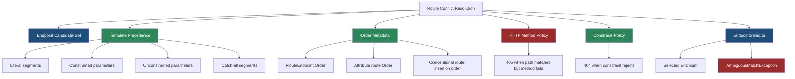
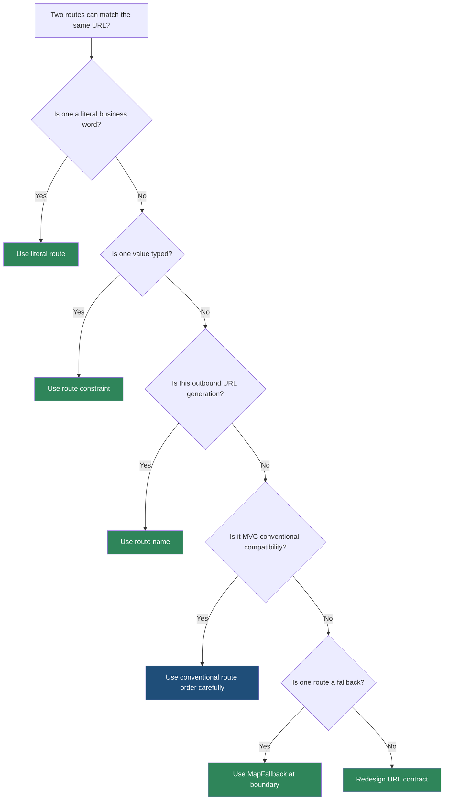

> [!success] Mastery Check
> - [ ] **Studied Well**
> - [ ] **Can explain the concept without notes**
> - [ ] **Can answer interview questions confidently**
> - [ ] **Can implement it in a real project**


# 4.068 - Route Order and Precedence: How Conflicts Are Resolved

---

## PART 0 - Navigation & Context

### Where This Topic Lives

```
ASP.NET Core Mastery
├── Middleware
│   └── 4.052  Middleware Ordering
└── Routing
    ├── 4.064  Endpoint Routing
    ├── 4.065  Route Templates
    ├── 4.066  Route Constraints
    ├── 4.068  YOU ARE HERE - route conflict resolution
    ├── 4.071  Link Generation
    └── 4.073  Catch-All and Fallback Routes
```

### What You Need Before This

- **[[4.064 - Endpoint Routing: The Modern Routing Architecture]]** - the endpoint selector chooses from candidate endpoints after route matching.
- **[[4.065 - Route Templates: Syntax, Literals, Parameters, and Wildcards]]** - precedence is calculated from route template shape.
- **[[4.066 - Route Constraints: Type Constraints, Regex, and Custom Constraints]]** - constraints change candidate validity and specificity.

### What This Unlocks After

- **[[4.071 - Link Generation: IUrlHelper, LinkGenerator, and Named Routes]]** - outbound URL generation has its own ambiguity rules.
- **[[4.073 - Catch-All Routes, Fallback Routes, and 404 Response Handling]]** - greedy routes are where precedence bugs become visible.
- **[[4.075 - Route Performance: Trie-Based Matching and Route Cache]]** - route precedence is baked into matcher construction.

### Why This Matters at Scale

Route conflict resolution is the difference between a request reaching the intended handler, returning a clean `404` or `405`, or blowing up with an ambiguous match under production traffic.

---

## PART 1 - The Core Mental Model

### The Fundamental Rule

> **Endpoint routing considers all matching endpoints, filters them by constraints and HTTP method, then selects the highest-precedence candidate; the practical consequence is that registration order usually does not save a vague URL design.**

### The Plain-Language Analogy

Imagine a mailroom with labels of different precision. A package addressed to "Finance / Payroll / 2026" should go to the exact shelf, not the broad "Finance / anything" bin. A catch-all bin can exist, but it belongs at the end of the sorting system. If two shelves are equally specific and both accept the package, the mailroom cannot guess; it raises an exception instead of silently choosing one.

### The Taxonomy Diagram



---

## PART 2 - Deep Mechanics

### 2.1 Candidate Selection Happens Before Handler Code

```
---> ExceptionHandler ---> StaticFiles ---> Routing[build candidates/select endpoint] ---> Auth ---> Endpoints
                                      no endpoint: next middleware, usually 404
                                      ambiguous: AmbiguousMatchException
```

```http
// HTTP request (approximate):
GET /api/orders/pending HTTP/1.1
Host: api.example.com

// HTTP response when literal route wins:
HTTP/1.1 200 OK
Content-Type: application/json
```

ASP.NET Core internally (approximate): `EndpointRoutingMiddleware` asks the `Matcher` for candidate endpoints, applies endpoint selector policies such as HTTP method and constraints, and `DefaultEndpointSelector` stores the winning endpoint in `HttpContext`.

**Runtime cost:** O(path segment count) matching through the DFA plus O(candidate count) policy evaluation; handler code has not allocated yet.

**Edge case:** Two endpoints can look ambiguous to humans but never conflict at runtime, such as `/{id:int}` and `/{slug:alpha}`. They have similar precedence, but their constraints accept disjoint inputs.

### 2.2 Template Specificity Beats Registration Order

```
Templates:
/api/products/list          literal > parameter
/api/products/{id}          parameter
/api/products/{id:int}      constrained parameter > unconstrained parameter
/api/products/{*path}       catch-all
```

```csharp
app.MapGet("/api/products/{id}", (string id) => Results.Ok($"parameter:{id}"));
app.MapGet("/api/products/list", () => Results.Ok("literal"));
```

```http
// HTTP wire format:
GET /api/products/list HTTP/1.1

HTTP/1.1 200 OK
Content-Type: text/plain
literal
```

ASP.NET Core source behavior: route template precedence assigns more specific templates higher priority. A literal segment outranks a parameter segment; a constrained parameter outranks an unconstrained parameter.

**Runtime cost:** precedence is calculated at endpoint build time; per request cost is only candidate selection.

**Edge case:** If you depend on source-code order for two attribute routes, you probably designed an unclear URL space. Use route names for link generation and clearer templates for inbound matching.

### 2.3 `Order` Is a Sharp Tool

```
---> Routing
     candidate A: /reports/{id}       Order = 0
     candidate B: /reports/archive    Order = -1
     choose lower Order first only after policy applies
---> Endpoint
```

```csharp
[HttpGet("archive", Order = -1)]
public IActionResult Archive() => Ok();

[HttpGet("{id}")]
public IActionResult ById(string id) => Ok();
```

`Order` changes endpoint priority, but it should be exceptional. Microsoft guidance is to avoid depending on `Order` because it often hides a confusing API contract.

**Runtime cost:** zero meaningful per-request allocation; ordering is stored in endpoint metadata.

**Edge case:** MVC conventional routes assigned through `MapControllerRoute` and `MapAreaControllerRoute` still simulate ordered route tables. Minimal APIs generally do not.

### 2.4 Failure Paths: 404, 405, and Ambiguity

```
---> Routing
     path does not match any endpoint       -> Endpoint null -> 404 later
     path matches but method does not       -> HttpMethodMatcherPolicy -> 405
     same priority candidates remain        -> AmbiguousMatchException
---> ExceptionHandler / DeveloperExceptionPage
```

```http
// HTTP request:
POST /api/orders/42 HTTP/1.1

// If only GET /api/orders/{id:int} exists:
HTTP/1.1 405 Method Not Allowed
Allow: GET
```

ASP.NET Core source behavior: `HttpMethodMatcherPolicy` can reject candidates by method while preserving enough information to emit `405 Method Not Allowed`. If no path candidate exists at all, endpoint routing does not invent a result; endpoint middleware later allows a `404`.

**Runtime cost:** one policy pass over candidates; `405` response writes a small header set.

**Edge case:** Constraint failure is not model validation. `GET /orders/abc` against `{id:int}` is a route miss, not a `400`.

---

## PART 3 - Production Code Patterns

### Pattern 1: The Literal Escape Hatch

```csharp
// Domain scenario: logistics shipment service.

// ⚠️ WRONG: "pending" can be treated as a status string and hides intent.
app.MapGet("/api/shipments/{status}", (string status) => Results.Ok(status));

// ✅ CORRECT: reserve operational words as literal routes.
app.MapGet("/api/shipments/pending", () => Results.Ok(new { Queue = "pending" }))
   .WithName("GetPendingShipments");
app.MapGet("/api/shipments/status/{status:alpha}", (string status) => Results.Ok(new { Status = status }))
   .WithName("GetShipmentsByStatus");
```

```http
// HTTP wire format:
GET /api/shipments/pending HTTP/1.1
HTTP/1.1 200 OK
Content-Type: application/json
```

### Pattern 2: The Constraint Before Binder Boundary

```csharp
// Domain scenario: payment API.

// ⚠️ WRONG: route accepts any text; binding/handler must reject junk.
app.MapGet("/api/payments/{paymentId}", (string paymentId) => Results.Ok(paymentId));

// ✅ CORRECT: route rejects non-GUID paths before auth-sensitive handler logic.
app.MapGet("/api/payments/{paymentId:guid}", (Guid paymentId) =>
    Results.Ok(new { PaymentId = paymentId }));
```

```http
// HTTP wire format:
GET /api/payments/not-a-guid HTTP/1.1
HTTP/1.1 404 Not Found
```

### Pattern 3: The Named Route Override for URL Generation

```csharp
// Domain scenario: order management service.
app.MapGet("/api/orders/{orderId:int}", (int orderId) => Results.Ok(new { orderId }))
   .WithName("Orders.GetById");

app.MapPost("/api/orders", (LinkGenerator links, HttpContext ctx) =>
{
    var orderId = 123;
    var location = links.GetUriByName(ctx, "Orders.GetById", new { orderId });
    return Results.Created(location!, new { orderId });
});
```

```http
// HTTP wire format:
POST /api/orders HTTP/1.1
HTTP/1.1 201 Created
Location: https://api.example.com/api/orders/123
```

### Pattern 4: The Catch-All Quarantine

```csharp
// Domain scenario: file download gateway.
app.MapGet("/api/files/{fileId:guid}", (Guid fileId) => Results.Ok(new { fileId }));

// Keep catch-all under a dedicated namespace so it cannot steal API routes.
app.MapFallbackToFile("/app/{*path:nonfile}", "index.html");
```

```http
// HTTP wire format:
GET /api/files/4bbf56ef-0147-4a44-b55b-1f5925baf827 HTTP/1.1
HTTP/1.1 200 OK
```

### Pattern 5: The Integration Test for Ambiguity

```csharp
// Domain scenario: inventory API route regression test.
public sealed class InventoryRoutingTests
{
    [Fact]
    public async Task Literal_status_route_wins_over_id_route()
    {
        await using var app = new WebApplicationFactory<Program>();
        var client = app.CreateClient();

        var response = await client.GetAsync("/api/inventory/available");

        Assert.Equal(HttpStatusCode.OK, response.StatusCode);
    }
}
```

**Cost label:** one integration request in test only; prevents production ambiguity after a refactor.

---

## PART 4 - Gotchas & Anti-Patterns

### Gotcha 1: Thinking Registration Order Controls Minimal API Precedence

Experienced engineers remember old route tables and expect first match wins. Endpoint routing processes endpoints together.

```csharp
// ⚠️ WRONG CODE
app.MapGet("/api/products/{id}", (string id) => $"id:{id}");
app.MapGet("/api/products/list", () => "list");

// HTTP consequence (wrong mental model):
// GET /api/products/list still goes to the literal route, not the first registered route.

// ✅ CORRECT CODE
app.MapGet("/api/products/list", () => "list");
app.MapGet("/api/products/{id:int}", (int id) => $"id:{id}");

// HTTP consequence (correct path):
// GET /api/products/list -> 200 "list"
// GET /api/products/42 -> 200 "id:42"

// WHY: endpoint routing uses route template precedence and constraints, not source order, for normal endpoint selection.
```

### Gotcha 2: Using `Order` to Fix Bad URL Design

`Order` can force selection, but it hides ambiguity from clients and future maintainers.

```csharp
// ⚠️ WRONG CODE
[HttpGet("{value}", Order = -1)]
public IActionResult Lookup(string value) => Ok();

// HTTP consequence (wrong path):
// /api/customers/search can be swallowed by {value}.

// ✅ CORRECT CODE
[HttpGet("search")]
public IActionResult Search() => Ok();

[HttpGet("{customerId:guid}")]
public IActionResult Lookup(Guid customerId) => Ok();

// HTTP consequence (correct path):
// /api/customers/search -> Search
// /api/customers/{guid} -> Lookup

// WHY: literals and constrained parameters encode intent directly in the route matcher.
```

### Gotcha 3: Expecting Constraint Failure to Produce 400

Route constraints are not validation filters.

```csharp
// ⚠️ WRONG CODE
app.MapGet("/api/orders/{id:int}", (int id) => Results.Ok(id));

// HTTP consequence (wrong path):
// GET /api/orders/abc -> 404 Not Found, not 400 Bad Request.

// ✅ CORRECT CODE
app.MapGet("/api/orders/{id}", (string id) =>
    int.TryParse(id, out var value)
        ? Results.Ok(value)
        : Results.BadRequest(new { error = "id must be an integer" }));

// HTTP consequence (correct path):
// GET /api/orders/abc -> 400 Bad Request

// WHY: constraints decide whether an endpoint exists for a URL; validation explains why an accepted endpoint rejects input.
```

### Gotcha 4: Letting Catch-All Routes Compete With APIs

Catch-alls are useful for SPA fallback and file paths, but greedy by nature.

```csharp
// ⚠️ WRONG CODE
app.MapGet("/{*path}", (string path) => Results.Ok(path));
app.MapGet("/api/orders/{id:int}", (int id) => Results.Ok(id));

// HTTP consequence (wrong path):
// Future less-specific API routes become harder to reason about and can produce ambiguous behavior.

// ✅ CORRECT CODE
app.MapGet("/api/orders/{id:int}", (int id) => Results.Ok(id));
app.MapFallbackToFile("index.html");

// HTTP consequence (correct path):
// /api/orders/42 -> API endpoint
// /unknown-client-route -> SPA fallback

// WHY: fallback endpoints are terminal safety nets; isolate them from business API route space.
```

### Gotcha 5: Missing 405 Behavior in Tests

Teams often test the right path but not the wrong method.

```csharp
// ⚠️ WRONG CODE
app.MapGet("/api/payments/{id:guid}", (Guid id) => Results.Ok(id));

// HTTP consequence (wrong path):
// POST /api/payments/{guid} -> 405 Method Not Allowed, not 404.

// ✅ CORRECT CODE
app.MapGet("/api/payments/{id:guid}", (Guid id) => Results.Ok(id));
app.MapPost("/api/payments", () => Results.Created("/api/payments/1", new {}));

// HTTP consequence (correct path):
// POST /api/payments/{guid} remains 405; POST /api/payments creates.

// WHY: method policy can detect path matches with rejected HTTP verbs and emits 405 plus Allow headers.
```

---

## PART 5 - Performance Implications

### Request Pipeline Characteristics Table

| Scenario | Pipeline Depth | Allocations Per Request | Approx Latency Impact | Recommendation |
|---|---:|---:|---:|---|
| Literal route hit | Low | ~0 routing allocations | Very low | Prefer clear literals |
| Constrained parameter hit | Low | ~0-1 | Very low | Use for URL shape |
| Unconstrained parameter hit | Low | ~0 | Very low | Pair with validation |
| Constraint miss | Low | ~0 | Very low | Expect 404 |
| Method mismatch | Low | small header write | Low | Test 405 behavior |
| Ambiguous candidates | Low | exception allocation | High on failure | Fix template design |
| Catch-all fallback | Low | path capture | Low | Keep at boundary |
| Many endpoints | Medium | build-time cost mostly | Low per request | Watch startup and memory |

### BenchmarkDotNet Code

```csharp
using BenchmarkDotNet.Attributes;
using Microsoft.AspNetCore.Builder;
using Microsoft.AspNetCore.Http;
using Microsoft.AspNetCore.Routing;

[MemoryDiagnoser]
public sealed class RoutePrecedenceBenchmarks
{
    private readonly RequestDelegate _literal;
    private readonly RequestDelegate _parameter;
    private readonly RequestDelegate _mixed;

    public RoutePrecedenceBenchmarks()
    {
        _literal = Build(app => app.MapGet("/api/orders/list", () => Results.Ok()));
        _parameter = Build(app => app.MapGet("/api/orders/{id}", (string id) => Results.Ok(id)));
        _mixed = Build(app =>
        {
            app.MapGet("/api/orders/list", () => Results.Ok());
            app.MapGet("/api/orders/{id:int}", (int id) => Results.Ok(id));
            app.MapFallback(() => Results.NotFound());
        });
    }

    [Benchmark] public Task LiteralOnly() => Invoke(_literal, "/api/orders/list");
    [Benchmark] public Task ParameterOnly() => Invoke(_parameter, "/api/orders/42");
    [Benchmark] public Task MixedPrecedence() => Invoke(_mixed, "/api/orders/list");

    private static RequestDelegate Build(Action<WebApplication> map)
    {
        var builder = WebApplication.CreateBuilder();
        var app = builder.Build();
        map(app);
        return app;
    }

    private static Task Invoke(RequestDelegate app, string path)
    {
        var ctx = new DefaultHttpContext();
        ctx.Request.Path = path;
        return app(ctx);
    }
}

// Expected output (approximate, .NET 8, x64, local):
// LiteralOnly       low microseconds, low allocation
// ParameterOnly     low microseconds, low allocation
// MixedPrecedence   similar; endpoint count matters more than syntax
```

Use `dotnet-trace`, `dotnet-counters`, or real Kestrel load tests for production routing analysis; microbenchmarks are only shape tests.

### When This Costs You

High-throughput APIs with thousands of endpoints, ambiguous route exceptions under load, catch-all patterns in shared gateways, and hot paths where bad route design turns clean misses into exception-heavy failures.

### When This Doesn't Matter

Internal admin endpoints, small services with obvious URL spaces, and low-traffic controllers where database and serialization dominate latency.

---

## PART 6 - Interview Arsenal

### A. The Question Bank

**Question:** "If `/products/list` and `/products/{id}` both match, which action runs?"

**Average Answer:** "The one registered first."

**Why That's Insufficient:** It confuses old route-table thinking with endpoint routing.

> **Great Answer:** "In endpoint routing I do not assume source order. The matcher builds a candidate set and the selector picks the highest-precedence endpoint. A literal segment like `list` is more specific than `{id}`, so `/products/list` goes to the literal route. If I need `/products/42`, I usually constrain it as `{id:int}` so non-IDs do not reach that handler."

**Question:** "What status code do you expect when a route constraint fails?"

**Average Answer:** "Probably 400 because the id is invalid."

**Why That's Insufficient:** It misses that constraints run during route matching, before model binding.

> **Great Answer:** "A constraint failure is a route miss, so the client usually sees 404. The handler was never selected and model binding never tried to parse the parameter. If I want to tell the client the value is malformed, I accept the segment and validate inside the endpoint or a filter, returning 400 intentionally."

**Question:** "When would you use route `Order`?"

**Average Answer:** "When routes conflict."

**Why That's Insufficient:** It normalizes a tool that should be rare.

> **Great Answer:** "I treat `Order` as a last resort. Most conflicts should be solved by clearer templates, literals, constraints, or route names for URL generation. I have used order in MVC conventional routing compatibility work, but for new APIs, explicit order often means the URL contract is confusing."

### B. The Trick Questions

| Question | Trap | Correct Answer |
|---|---|---|
| Does `MapGet` order decide which endpoint runs? | First-match assumption | Usually no; endpoint routing considers all endpoints and uses precedence. |
| Does `{id:int}` returning 404 mean auth did not run? | Pipeline confusion | Routing runs before auth; if no endpoint is selected, endpoint-specific auth metadata is unavailable. |
| Can two routes with same precedence be valid? | Assuming startup detects all conflicts | Yes, if constraints are disjoint; ambiguity is input-dependent. |
| Is `POST` to a `GET` path a 404? | Method as path | Usually 405 when the path matches but method does not. |

### C. Red Flags to Avoid

- "Routes are matched in the order I call `MapGet`." - not generally true for endpoint routing.
- "Constraints are validation." - they are endpoint selection.
- "Order is the normal fix." - it hides API design problems.
- "Catch-all routes are harmless." - they can dominate URL space.
- "Ambiguity always fails at startup." - some ambiguity is runtime-input dependent.

---

## PART 7 - Decision Framework



---

## PART 8 - Self-Check

### A. Conceptual Questions

1. What happens to the HTTP request if two endpoints have identical route templates and methods?
2. Why does `/products/list` beat `/products/{id}`?
3. What happens to the HTTP request if `{id:int}` receives `abc`?
4. Why is `Order` usually a smell in new APIs?
5. How can two same-precedence routes avoid ambiguity?
6. Why can a wrong HTTP verb produce 405 instead of 404?
7. Where in the middleware pipeline does conflict resolution occur?
8. Why are catch-all routes risky in API gateways?
9. How do route names help avoid outbound ambiguity?

### B. Code Puzzles

```csharp
app.MapGet("/api/orders/{id}", (string id) => $"id:{id}");
app.MapGet("/api/orders/pending", () => "pending");
```

<details><summary>Answer</summary>
`GET /api/orders/pending` returns `pending`. The literal segment has higher precedence than the parameter segment.
</details>

```csharp
app.MapGet("/api/orders/{id:int}", (int id) => id);
```

<details><summary>Answer</summary>
`GET /api/orders/abc` returns 404. The route constraint fails, so the endpoint is not selected.
</details>

```csharp
app.MapGet("/api/items/{value}", () => "a");
app.MapGet("/api/items/{name}", () => "b");
```

<details><summary>Answer</summary>
The routes have the same shape. A matching request can produce `AmbiguousMatchException`; parameter names do not disambiguate route templates.
</details>

```csharp
app.MapGet("/api/reports/{id:int}", (int id) => id);
```

<details><summary>Answer</summary>
`POST /api/reports/10` usually returns 405 Method Not Allowed because the path matches but the HTTP method policy rejects `POST`.
</details>

---

## PART 9 - Connections & Resources

### A. Related Topics Table

| Topic | Why It Connects |
|---|---|
| [[4.064 - Endpoint Routing: The Modern Routing Architecture]] | Endpoint selection is the final phase of endpoint routing. |
| [[4.065 - Route Templates: Syntax, Literals, Parameters, and Wildcards]] | Template shape determines route precedence. |
| [[4.066 - Route Constraints: Type Constraints, Regex, and Custom Constraints]] | Constraints decide whether parameter candidates remain valid. |
| [[4.071 - Link Generation: IUrlHelper, LinkGenerator, and Named Routes]] | Route names avoid ambiguous outbound URL generation. |
| [[2.020 - Pattern Matching]] | Thinking in shape matching helps reason about route templates. |

### B. Books

| Book | Chapters | Why These Chapters |
|---|---|---|
| *ASP.NET Core in Action* | Routing chapters | Explains endpoint routing and precedence with practical examples. |
| *Pro ASP.NET Core* | URL routing | Covers conventional and attribute route conflicts. |

### C. Essential Articles & Docs

- [Microsoft Docs - Routing in ASP.NET Core](https://learn.microsoft.com/en-us/aspnet/core/fundamentals/routing)
- [Microsoft Docs - Routing to controller actions](https://learn.microsoft.com/en-us/aspnet/core/mvc/controllers/routing)
- [ASP.NET Core source - Routing](https://github.com/dotnet/aspnetcore/tree/main/src/Http/Routing)
- [Andrew Lock - Endpoint routing articles](https://andrewlock.net/tag/endpoint-routing/)

### D. Template Meta-Note

> [!NOTE]
> **Part 0** orients the topic. **Part 1** gives the mental model. **Part 2** shows framework mechanics. **Part 3** gives production patterns. **Part 4** names gotchas. **Part 5** covers performance. **Part 6** prepares interviews. **Part 7** gives decisions. **Part 8** checks understanding. **Part 9** connects resources.
