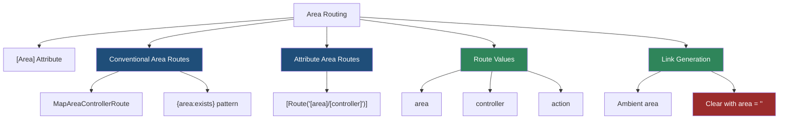
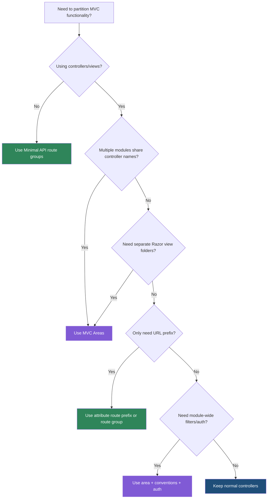

> [!success] Mastery Check
> - [ ] **Studied Well**
> - [ ] **Can explain the concept without notes**
> - [ ] **Can answer interview questions confidently**
> - [ ] **Can implement it in a real project**


# 4.069 - Area Routing: Namespace Partitioning for Large Codebases

---

## PART 0 - Navigation & Context

### Where This Topic Lives

```
ASP.NET Core Mastery
├── Routing
│   ├── 4.064  Endpoint Routing
│   ├── 4.067  Attribute Routing
│   ├── 4.068  Route Order and Precedence
│   └── 4.069  YOU ARE HERE - area routing
└── MVC & Controllers
    ├── 4.098  ControllerBase vs Controller
    ├── 4.105  MVC Areas
    └── 4.110  MVC Filter Pipeline
```

### What You Need Before This

- **[[4.067 - Attribute Routing on Controllers: [Route], [HttpGet], Token Replacement]]** - areas can use attribute routes and `[area]` token replacement.
- **[[4.068 - Route Order and Precedence: How Conflicts Are Resolved]]** - conventional area routes are order-dependent.
- **MVC controller/action basics** - area routing adds an `area` route value to the controller/action pair.

### What This Unlocks After

- **[[4.105 - MVC Areas: Namespace Partitioning for Large Applications]]** - the broader project structure and views story.
- **[[4.071 - Link Generation: IUrlHelper, LinkGenerator, and Named Routes]]** - area route values become sticky ambient values.
- **[[4.110 - MVC Filter Pipeline: Six Filter Types and Execution Order]]** - area-specific filters are common in large codebases.

### Why This Matters at Scale

Areas let a large MVC app have multiple controllers with the same names and separate URL spaces without turning route tables into an accidental shared namespace.

---

## PART 1 - The Core Mental Model

### The Fundamental Rule

> **Area routing adds an `area` route value to MVC action selection; the practical consequence is that `/Admin/Users/Edit` and `/Store/Users/Edit` can target different controllers without name collisions.**

### The Plain-Language Analogy

An area is a building wing. Two wings can both have a "Users" office, but the badge must include the wing name or security cannot know which office you mean. Route matching writes the wing into route values. Link generation then keeps using that wing unless you explicitly clear it, which is why area links can feel "sticky."

### The Taxonomy Diagram



---

## PART 2 - Deep Mechanics

### 2.1 `[Area]` Changes Action Selection Metadata

```
---> Routing ---> MVC endpoint selected ---> Authorization ---> MVC action invoker
                 route values:
                 area=Admin, controller=Users, action=Edit
```

```csharp
[Area("Admin")]
public sealed class UsersController : Controller
{
    [HttpGet]
    public IActionResult Edit(int id) => View();
}
```

```http
// HTTP wire format:
GET /Admin/Users/Edit/42 HTTP/1.1
HTTP/1.1 200 OK
Content-Type: text/html
```

ASP.NET Core internally: MVC builds `ControllerActionDescriptor` instances with route values including `area`. Endpoint routing matches to MVC endpoints; MVC action selection only considers actions whose required route values match.

**Runtime cost:** area is a route value lookup; most cost is MVC action invocation and view rendering.

**Edge case:** C# namespace does not affect MVC routing. `[Area]` and route values do.

### 2.2 `MapAreaControllerRoute` Adds Defaults and Constraints

```
---> Routing
     pattern: Manage/{controller}/{action}/{id?}
     defaults: area=Admin
     constraints: area=Admin
---> Endpoint
```

```csharp
app.MapAreaControllerRoute(
    name: "admin",
    areaName: "Admin",
    pattern: "Manage/{controller=Dashboard}/{action=Index}/{id?}");
```

```http
// HTTP wire format:
GET /Manage/Users/Edit/42 HTTP/1.1
HTTP/1.1 200 OK
```

ASP.NET Core source behavior: `MapAreaControllerRoute` is equivalent to a controller route with an `area` default and an `area` constraint, so the URL does not have to display the literal area name.

**Runtime cost:** one route pattern candidate plus route value defaults; no extra middleware.

**Edge case:** Area routes should be registered before non-area conventional routes because conventional MVC routing is order-dependent.

### 2.3 `{area:exists}` Creates a Uniform Area URL Space

```
---> Routing ---> pattern {area:exists}/{controller=Home}/{action=Index}/{id?}
              ---> requires route value area to match an MVC area
```

```csharp
app.MapControllerRoute(
    name: "areas",
    pattern: "{area:exists}/{controller=Home}/{action=Index}/{id?}");

app.MapControllerRoute(
    name: "default",
    pattern: "{controller=Home}/{action=Index}/{id?}");
```

```http
// HTTP wire format:
GET /Billing/Invoices/Index HTTP/1.1
HTTP/1.1 200 OK
```

ASP.NET Core internally: the `exists` route constraint confirms the area route value can match an action descriptor with that area.

**Runtime cost:** route constraint check plus MVC endpoint lookup.

**Edge case:** A controller without `[Area]` will not match when an `area` value is present.

### 2.4 Ambient Area Values Affect Links

```
Request in Admin area
---> Url.Action("Index", "Home")
     ambient values: area=Admin
     generated URL: /Admin/Home/Index
```

```csharp
public IActionResult ExitAdmin()
{
    var homeUrl = Url.Action("Index", "Home", new { area = "" });
    return Redirect(homeUrl!);
}
```

```http
// HTTP wire format:
HTTP/1.1 302 Found
Location: /Home/Index
```

ASP.NET Core source behavior: `IUrlHelper` uses ambient route values from the current action unless explicitly replaced. Area values are route values like any other.

**Runtime cost:** route value dictionary merge plus endpoint address scheme lookup.

**Edge case:** Many "wrong admin link" bugs are not route matching bugs; they are ambient area value bugs.

---

## PART 3 - Production Code Patterns

### Pattern 1: The Admin Area Boundary

```csharp
// Domain scenario: healthcare patient portal.
app.MapAreaControllerRoute(
    name: "admin",
    areaName: "Admin",
    pattern: "admin/{controller=Dashboard}/{action=Index}/{id?}");

app.MapControllerRoute(
    name: "public",
    pattern: "{controller=Home}/{action=Index}/{id?}");

[Area("Admin")]
[Authorize(Policy = "StaffOnly")]
public sealed class PatientsController : Controller
{
    public IActionResult Index() => View();
}
```

```http
// HTTP wire format:
GET /admin/patients HTTP/1.1
Authorization: Bearer staff-token
HTTP/1.1 200 OK
```

### Pattern 2: The Uniform Area Token

```csharp
// Domain scenario: multi-module commerce back office.
app.MapControllerRoute(
    name: "module-area",
    pattern: "{area:exists}/{controller=Home}/{action=Index}/{id?}");
```

```csharp
[Area("Inventory")]
[Route("[area]/[controller]")]
public sealed class StockController : Controller
{
    [HttpGet("{sku}")]
    public IActionResult Details(string sku) => Ok(new { sku });
}
```

### Pattern 3: The Explicit Exit Link

```csharp
// Domain scenario: admin returns to public catalog.
public IActionResult BackToCatalog()
{
    // Clear area intentionally; otherwise Admin remains ambient.
    return RedirectToAction("Index", "Catalog", new { area = "" });
}
```

```http
// HTTP wire format:
HTTP/1.1 302 Found
Location: /Catalog
```

### Pattern 4: The Area-Specific Authorization Convention

```csharp
// Domain scenario: financial reporting app.
builder.Services.AddControllersWithViews(options =>
{
    options.Conventions.Add(new AdminAreaAuthorizationConvention());
});

public sealed class AdminAreaAuthorizationConvention : IControllerModelConvention
{
    public void Apply(ControllerModel controller)
    {
        if (controller.RouteValues.TryGetValue("area", out var area) && area == "Admin")
        {
            controller.Filters.Add(new AuthorizeFilter("AdminOnly"));
        }
    }
}
```

### Pattern 5: The Same Controller Name in Different Areas

```csharp
// Domain scenario: SaaS operations app.
[Area("Billing")]
public sealed class ReportsController : Controller
{
    public IActionResult Index() => View("BillingReports");
}

[Area("Support")]
public sealed class ReportsController : Controller
{
    public IActionResult Index() => View("SupportReports");
}
```

**Cost label:** extra descriptors at startup; no meaningful per-request penalty beyond normal MVC selection.

---

## PART 4 - Gotchas & Anti-Patterns

### Gotcha 1: Believing Namespaces Select Areas

Namespace folders look convincing, but MVC routing ignores them.

```csharp
// ⚠️ WRONG CODE
namespace App.Areas.Admin.Controllers;
public sealed class UsersController : Controller { }

// HTTP consequence (wrong path):
// GET /Admin/Users may not match because no area route value is attached.

// ✅ CORRECT CODE
[Area("Admin")]
public sealed class UsersController : Controller { }

// HTTP consequence (correct path):
// GET /Admin/Users can match an Admin area route.

// WHY: MVC action descriptors use route values, not CLR namespaces, for area matching.
```

### Gotcha 2: Registering Default Route Before Area Route

Conventional routing still has order-sensitive pieces.

```csharp
// ⚠️ WRONG CODE
app.MapControllerRoute("default", "{controller=Home}/{action=Index}/{id?}");
app.MapAreaControllerRoute("admin", "Admin", "admin/{controller=Home}/{action=Index}/{id?}");

// HTTP consequence (wrong path):
// Some conventional matches can be evaluated by the broad route first.

// ✅ CORRECT CODE
app.MapAreaControllerRoute("admin", "Admin", "admin/{controller=Home}/{action=Index}/{id?}");
app.MapControllerRoute("default", "{controller=Home}/{action=Index}/{id?}");

// HTTP consequence (correct path):
// /admin/users resolves with area=Admin.

// WHY: area routes are more specific and should be registered before broad conventional routes.
```

### Gotcha 3: Sticky Area Links

Ambient values surprise teams when a link inside an area points back into the same area.

```csharp
// ⚠️ WRONG CODE
var url = Url.Action("Index", "Home");

// HTTP consequence (wrong path):
// In Admin area this may generate /Admin/Home/Index.

// ✅ CORRECT CODE
var url = Url.Action("Index", "Home", new { area = "" });

// HTTP consequence (correct path):
// Generates /Home/Index or equivalent default route.

// WHY: link generation reuses ambient route values unless they are explicitly overridden.
```

### Gotcha 4: Mixing Attribute and Conventional Area Routes Carelessly

The same controller can become reachable through two URL shapes.

```csharp
// ⚠️ WRONG CODE
[Area("Admin")]
[Route("users")]
public sealed class UsersController : Controller { }

// HTTP consequence (wrong path):
// Public-looking /users may reach an Admin controller.

// ✅ CORRECT CODE
[Area("Admin")]
[Route("[area]/users")]
public sealed class UsersController : Controller { }

// HTTP consequence (correct path):
// /Admin/users reaches the Admin area route.

// WHY: `[Area]` marks route values; it does not automatically prefix every attribute route.
```

### Gotcha 5: Treating Areas as Security

Area partitioning is organization, not access control.

```csharp
// ⚠️ WRONG CODE
[Area("Admin")]
public sealed class AuditController : Controller { }

// HTTP consequence (wrong path):
// Anyone who can reach the URL can hit it unless auth rejects them.

// ✅ CORRECT CODE
[Area("Admin")]
[Authorize(Policy = "AdminOnly")]
public sealed class AuditController : Controller { }

// HTTP consequence (correct path):
// Unauthorized users receive 401 or 403 before action execution.

// WHY: endpoint routing selects endpoints; authorization middleware enforces access through metadata.
```

---

## PART 5 - Performance Implications

### Request Pipeline Characteristics Table

| Scenario | Pipeline Depth | Allocations Per Request | Approx Latency Impact | Recommendation |
|---|---:|---:|---:|---|
| Area conventional route hit | Normal MVC | route values | Low | Fine for large MVC apps |
| Attribute area route hit | Normal MVC | route values | Low | Prefer explicit URLs |
| Ambient URL generation | In action/view | small dictionary merge | Low | Clear area when leaving |
| Wrong area route order | Normal MVC | none | Operational risk | Put area routes first |
| Area-specific filters | MVC filter pipeline | filter dependent | Medium | Use for real boundaries |
| Many area controllers | Startup/action model | startup allocations | Low per request | Watch startup only |
| Razor views in areas | MVC + view engine | view allocations | Higher | Cache views normally |
| Area auth policy | Auth middleware + MVC | policy dependent | Medium | Keep policy cheap |

### BenchmarkDotNet Code

```csharp
using BenchmarkDotNet.Attributes;
using Microsoft.AspNetCore.Routing;

[MemoryDiagnoser]
public sealed class AreaRouteValueBenchmarks
{
    private readonly RouteValueDictionary _noArea = new(new { controller = "Home", action = "Index" });
    private readonly RouteValueDictionary _withArea = new(new { area = "Admin", controller = "Home", action = "Index" });
    private readonly RouteValueDictionary _clearArea = new(new { area = "", controller = "Home", action = "Index" });

    [Benchmark] public int NoAreaValues() => _noArea.Count;
    [Benchmark] public int WithAreaValues() => _withArea.Count;
    [Benchmark] public int ClearAreaValues() => _clearArea.Count;
}

// Expected output (approximate, .NET 8, x64, local):
// All variants are nanosecond-scale dictionary reads; view rendering and auth dominate real requests.
```

Profile real area-heavy MVC apps with `dotnet-trace`, request logs, and MVC action invoker timings rather than obsessing over the `area` route value.

### When This Costs You

Huge MVC monoliths with hundreds of controllers, many area-specific filters, Razor view discovery churn, and authorization policies that hit a database per request.

### When This Doesn't Matter

Small APIs, Minimal API services, and MVC apps where routing is dwarfed by database, view rendering, or serialization work.

---

## PART 6 - Interview Arsenal

### A. The Question Bank

**Question:** "What does an ASP.NET Core area add to routing?"

**Average Answer:** "It organizes controllers into folders."

**Why That's Insufficient:** Folder structure is secondary; route values drive matching.

> **Great Answer:** "An area adds an `area` route value to MVC action selection. The route matcher can produce values like `area=Admin, controller=Users, action=Edit`, and MVC only selects actions whose required route values match. I still add authorization explicitly, because an area is an organization boundary, not a security boundary."

**Question:** "Why are links generated inside an area sometimes wrong?"

**Average Answer:** "The route is configured wrong."

**Why That's Insufficient:** Often the route is fine; ambient values are the problem.

> **Great Answer:** "Inside an area, URL generation inherits the current `area` as an ambient value. So `Url.Action("Index", "Home")` may generate an Admin URL unless I pass `new { area = "" }`. The HTTP consequence is a redirect or link that keeps the user in the admin namespace when I intended to leave it."

**Question:** "Should area routes be before default routes?"

**Average Answer:** "Probably yes."

**Why That's Insufficient:** It needs the conventional routing reason.

> **Great Answer:** "Yes for conventional MVC routes. Area routes are more specific and `MapAreaControllerRoute` adds area defaults and constraints. If I register the broad default route first, I make matching harder to reason about and can produce surprising handler selection."

### B. The Trick Questions

| Question | Trap | Correct Answer |
|---|---|---|
| Does namespace define area? | Folder/namespace assumption | No, `[Area]` and route values do. |
| Does `[Area]` automatically prefix attribute routes? | Attribute routing assumption | No, include `[area]` or a literal prefix in the route. |
| Is an area secure by default? | Organization equals auth | No, add `[Authorize]` or conventions. |
| Why does `Url.Action` stay in Admin? | Ignoring ambient values | The current `area` value is reused until cleared. |

### C. Red Flags to Avoid

- "Areas are just folders." - incomplete and operationally misleading.
- "Namespace controls routing." - false.
- "Admin area means admin-only." - security bug.
- "URL generation ignores current route." - false; ambient values matter.
- "Attribute routes get area prefixes automatically." - false.

---

## PART 7 - Decision Framework



---

## PART 8 - Self-Check

### A. Conceptual Questions

1. What route value does an area add?
2. What happens to the HTTP request if a controller lacks `[Area]` but the route produces `area=Admin`?
3. Why should area conventional routes be placed before default conventional routes?
4. What happens to link generation inside an area if `area` is not cleared?
5. Why are areas not security boundaries?
6. How does `[area]` token replacement differ from `[Area]`?
7. When is `{area:exists}` useful?
8. How do areas permit duplicate controller names?

### B. Code Puzzles

```csharp
namespace App.Areas.Admin.Controllers;
public sealed class UsersController : Controller { }
```

<details><summary>Answer</summary>
No area is created by the namespace alone. Without `[Area("Admin")]`, MVC does not attach the Admin area route value.
</details>

```csharp
[Area("Admin")]
[Route("users")]
public sealed class UsersController : Controller { }
```

<details><summary>Answer</summary>
The attribute route is `/users`, not `/Admin/users`. `[Area]` does not automatically prefix attribute routes.
</details>

```csharp
var url = Url.Action("Index", "Home");
```

<details><summary>Answer</summary>
Inside an Admin area action, this may generate an Admin-area URL because area is an ambient route value.
</details>

```csharp
app.MapControllerRoute("default", "{controller}/{action}/{id?}");
app.MapAreaControllerRoute("admin", "Admin", "admin/{controller}/{action}/{id?}");
```

<details><summary>Answer</summary>
The broad conventional route is registered before the area route. Put area routes first so more specific area matching is evaluated before defaults.
</details>

---

## PART 9 - Connections & Resources

### A. Related Topics Table

| Topic | Why It Connects |
|---|---|
| [[4.067 - Attribute Routing on Controllers: [Route], [HttpGet], Token Replacement]] | Area attributes and route tokens combine with controller attribute routes. |
| [[4.068 - Route Order and Precedence: How Conflicts Are Resolved]] | Conventional area routes depend on ordering. |
| [[4.071 - Link Generation: IUrlHelper, LinkGenerator, and Named Routes]] | Ambient area values affect generated links. |
| [[4.105 - MVC Areas: Namespace Partitioning for Large Applications]] | Area routing is the URL side of MVC areas. |
| [[4.154 - Authorization Architecture]] | Areas need explicit authorization metadata to become security boundaries. |

### B. Books

| Book | Chapters | Why These Chapters |
|---|---|---|
| *ASP.NET Core in Action* | MVC controllers and routing | Practical MVC route value explanations. |
| *Pro ASP.NET Core* | Areas and URL routing | Detailed area examples and view organization. |

### C. Essential Articles & Docs

- [Microsoft Docs - Areas in ASP.NET Core](https://learn.microsoft.com/en-us/aspnet/core/mvc/controllers/areas)
- [Microsoft Docs - Routing to controller actions](https://learn.microsoft.com/en-us/aspnet/core/mvc/controllers/routing)
- [ASP.NET Core source - MVC routing](https://github.com/dotnet/aspnetcore/tree/main/src/Mvc)
- [Andrew Lock - MVC and routing articles](https://andrewlock.net/)

### D. Template Meta-Note

> [!NOTE]
> **Part 0** orients the topic. **Part 1** gives the mental model. **Part 2** shows framework mechanics. **Part 3** gives production patterns. **Part 4** names gotchas. **Part 5** covers performance. **Part 6** prepares interviews. **Part 7** gives decisions. **Part 8** checks understanding. **Part 9** connects resources.
