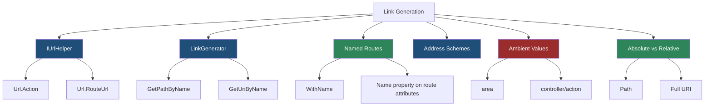
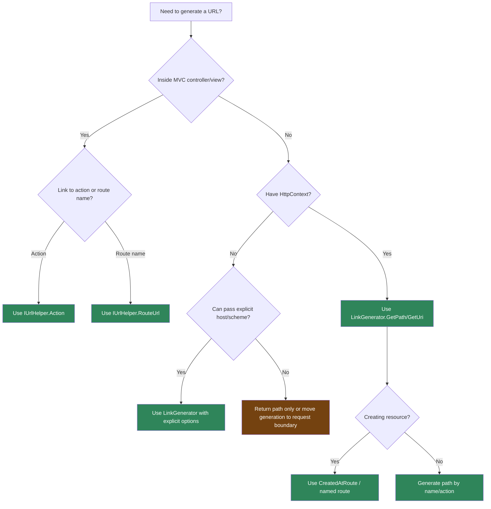

> [!success] Mastery Check
> - [ ] **Studied Well**
> - [ ] **Can explain the concept without notes**
> - [ ] **Can answer interview questions confidently**
> - [ ] **Can implement it in a real project**


# 4.071 - Link Generation: IUrlHelper, LinkGenerator, and Named Routes

---

## PART 0 - Navigation & Context

### Where This Topic Lives

```
ASP.NET Core Mastery
├── Routing
│   ├── 4.064  Endpoint Routing
│   ├── 4.065  Route Templates
│   ├── 4.068  Route Order and Precedence
│   ├── 4.071  YOU ARE HERE - link generation
│   └── 4.077  Route Value Transformers
└── API Design
    ├── 4.283  REST API Design Conventions
    └── 4.284  Idempotency Keys
```

### What You Need Before This

- **[[4.064 - Endpoint Routing: The Modern Routing Architecture]]** - link generation uses endpoint data sources too.
- **[[4.065 - Route Templates: Syntax, Literals, Parameters, and Wildcards]]** - URL generation fills templates in reverse.
- **[[4.068 - Route Order and Precedence: How Conflicts Are Resolved]]** - ambiguous inbound routes often cause ambiguous outbound links.

### What This Unlocks After

- **[[4.077 - Route Value Transformers: IOutboundParameterTransformer]]** - transformers customize generated route value text.
- **[[4.082 - IResult and TypedResults: Shaping HTTP Responses in Minimal APIs]]** - `CreatedAtRoute` and typed results depend on route names.
- **[[4.284 - Idempotency Keys: Preventing Duplicate POST Operations]]** - `201 Created` responses should generate canonical resource links.

### Why This Matters at Scale

Correct link generation gives clients stable resource URLs even when route templates change; bad link generation creates broken `Location` headers, wrong-area redirects, and subtle multi-tenant leaks.

---

## PART 1 - The Core Mental Model

### The Fundamental Rule

> **Link generation selects an endpoint address and fills its route pattern with explicit plus ambient values; the practical consequence is that generated URLs are only as stable as your route names and route value discipline.**

### The Plain-Language Analogy

Link generation is a return-address printer. A named route is a saved address template. Route values are the fields you type into the printer. Ambient values are fields the printer remembers from the current request, which is useful inside a controller and dangerous when the remembered area or tenant is wrong.

### The Taxonomy Diagram



---

## PART 2 - Deep Mechanics

### 2.1 Link Generation Is Outbound Routing

```
Request handler
---> LinkGenerator/IUrlHelper
     endpoint data sources
     address scheme
     route pattern expansion
---> Response header/body contains generated URL
```

```csharp
app.MapGet("/api/orders/{orderId:int}", (int orderId) => Results.Ok(new { orderId }))
   .WithName("Orders.GetById");
```

```http
// HTTP wire format:
HTTP/1.1 201 Created
Location: https://api.example.com/api/orders/123
```

ASP.NET Core internally: `LinkGenerator` uses registered `EndpointDataSource` objects and address schemes such as route name or action address to find candidate endpoints, then tries to bind route values.

**Runtime cost:** route value dictionary creation/merge plus candidate address lookup; usually tiny compared with I/O.

**Edge case:** If required route values are missing, link generation returns `null`; it does not throw by default.

### 2.2 `IUrlHelper` Is MVC-Centric

```
MVC action
---> Url.Action("Details", "Orders", values)
     ambient controller/action/area values are available
---> generated path
```

```csharp
public sealed class OrdersController : ControllerBase
{
    [HttpGet("/api/orders/{orderId:int}", Name = "Orders.GetById")]
    public IActionResult GetById(int orderId) => Ok(new { orderId });

    [HttpPost("/api/orders")]
    public IActionResult Create()
    {
        var location = Url.RouteUrl("Orders.GetById", new { orderId = 123 });
        return Created(location!, new { orderId = 123 });
    }
}
```

ASP.NET Core source behavior: MVC exposes `IUrlHelper` through `ControllerBase.Url`; it builds route values from action/controller/area plus provided values.

**Runtime cost:** `IUrlHelper` allocation is handled by MVC infrastructure; per link cost is route value binding.

**Edge case:** `Url.Action` may reuse ambient `area`. Use `area = ""` when leaving an area.

### 2.3 `LinkGenerator` Is App-Wide and DI-Friendly

```
Endpoint handler / service
---> LinkGenerator.GetPathByName(...)
---> no ControllerContext required
```

```csharp
app.MapPost("/api/invoices", (LinkGenerator links, HttpContext ctx) =>
{
    var invoiceId = 501;
    var location = links.GetUriByName(ctx, "Invoices.GetById", new { invoiceId });
    return Results.Created(location!, new { invoiceId });
});

app.MapGet("/api/invoices/{invoiceId:int}", (int invoiceId) => Results.Ok(new { invoiceId }))
   .WithName("Invoices.GetById");
```

**Runtime cost:** one DI-resolved singleton service plus route value dictionary; no MVC action context.

**Edge case:** Generating absolute URIs uses the request scheme and host unless you pass explicit values. Behind a reverse proxy, configure forwarded headers or generated links may use internal hosts.

### 2.4 Named Routes Are Contract Anchors

```
Template can change:
/api/v1/orders/{orderId}
       |
Name remains:
Orders.GetById
       |
CreatedAtRoute still works
```

```csharp
return Results.CreatedAtRoute(
    routeName: "Orders.GetById",
    routeValues: new { orderId = 123 },
    value: new { orderId = 123 });
```

**Runtime cost:** named route lookup is cheap; the value is contract stability.

**Edge case:** Route names must be unique. Duplicate names can make link generation fail or choose unexpectedly depending on address candidates.

---

## PART 3 - Production Code Patterns

### Pattern 1: The Canonical Created Location

```csharp
// Domain scenario: order management service.
app.MapGet("/api/orders/{orderId:int}", (int orderId) => Results.Ok(new { orderId }))
   .WithName("Orders.GetById");

app.MapPost("/api/orders", () =>
{
    var orderId = 123;
    return Results.CreatedAtRoute("Orders.GetById", new { orderId }, new { orderId });
});
```

```http
// HTTP wire format:
POST /api/orders HTTP/1.1
HTTP/1.1 201 Created
Location: /api/orders/123
```

### Pattern 2: The Reverse-Proxy Aware Absolute URL

```csharp
// Domain scenario: payment API callback registration.
builder.Services.Configure<ForwardedHeadersOptions>(options =>
{
    options.ForwardedHeaders =
        ForwardedHeaders.XForwardedHost | ForwardedHeaders.XForwardedProto;
});

app.UseForwardedHeaders();

app.MapGet("/api/payments/{paymentId:guid}", (Guid paymentId) => Results.Ok())
   .WithName("Payments.GetById");
```

```http
// HTTP wire format:
HTTP/1.1 201 Created
Location: https://payments.example.com/api/payments/...
```

### Pattern 3: The Area Exit Link

```csharp
// Domain scenario: admin dashboard.
public IActionResult PublicHome()
{
    var url = Url.Action("Index", "Home", new { area = "" });
    return Redirect(url!);
}
```

### Pattern 4: The Named Route Instead of Action Guessing

```csharp
// Domain scenario: inventory webhook receiver.
[HttpGet("/api/inventory/items/{sku}", Name = "Inventory.GetItem")]
public IActionResult GetItem(string sku) => Ok(new { sku });

[HttpPost("/api/inventory/webhooks/items")]
public IActionResult Receive(ItemWebhook webhook)
{
    var link = Url.RouteUrl("Inventory.GetItem", new { sku = webhook.Sku });
    return Accepted(link);
}

public sealed record ItemWebhook(string Sku);
```

### Pattern 5: The Null Link Guard

```csharp
// Domain scenario: logistics tracking endpoint.
var path = links.GetPathByName("Shipments.GetById", new { shipmentId });

if (path is null)
{
    throw new InvalidOperationException("Route name Shipments.GetById could not be generated.");
}
```

**Cost label:** one branch and one route lookup; worth it because silent `null` links become production API contract bugs.

---

## PART 4 - Gotchas & Anti-Patterns

### Gotcha 1: Hard-Coding URLs in `Location`

Hard-coded URLs drift when route templates change.

```csharp
// ⚠️ WRONG CODE
return Results.Created($"/api/orders/{orderId}", new { orderId });

// HTTP consequence (wrong path):
// Location may point to an old route after versioning or prefix changes.

// ✅ CORRECT CODE
return Results.CreatedAtRoute("Orders.GetById", new { orderId }, new { orderId });

// HTTP consequence (correct path):
// Location follows the named endpoint route.

// WHY: named routes bind to endpoint metadata instead of string duplication.
```

### Gotcha 2: Ignoring `null` From Link Generation

Link generation failure is often silent.

```csharp
// ⚠️ WRONG CODE
var path = links.GetPathByName("Orders.GetById", new { id = orderId });
return Results.Created(path!, new { orderId });

// HTTP consequence (wrong path):
// Location can be null/empty or throw later.

// ✅ CORRECT CODE
var path = links.GetPathByName("Orders.GetById", new { orderId });
return path is null
    ? Results.Problem("Canonical order route is not configured.")
    : Results.Created(path, new { orderId });

// HTTP consequence (correct path):
// Misconfiguration becomes a clear 500 ProblemDetails response.

// WHY: route value names must match required route pattern parameters.
```

### Gotcha 3: Generating Internal Hosts Behind a Proxy

Production clients should not receive `http://10.0.0.4:8080`.

```csharp
// ⚠️ WRONG CODE
var uri = links.GetUriByName(ctx, "Payments.GetById", new { paymentId });

// HTTP consequence (wrong path):
// Location: http://internal-service:8080/api/payments/...

// ✅ CORRECT CODE
app.UseForwardedHeaders();
var uri = links.GetUriByName(ctx, "Payments.GetById", new { paymentId });

// HTTP consequence (correct path):
// Location: https://payments.example.com/api/payments/...

// WHY: absolute URI generation uses request scheme/host; forwarded headers restore public values.
```

### Gotcha 4: Letting Area Ambient Values Leak

Area links are sticky by default.

```csharp
// ⚠️ WRONG CODE
Url.Action("Index", "Home");

// HTTP consequence (wrong path):
// Generates /Admin/Home/Index inside Admin area.

// ✅ CORRECT CODE
Url.Action("Index", "Home", new { area = "" });

// HTTP consequence (correct path):
// Generates /Home/Index.

// WHY: `IUrlHelper` merges explicit route values with ambient action route values.
```

### Gotcha 5: Duplicate Route Names

Names are global addresses.

```csharp
// ⚠️ WRONG CODE
app.MapGet("/api/orders/{id:int}", () => Results.Ok()).WithName("GetById");
app.MapGet("/api/products/{id:int}", () => Results.Ok()).WithName("GetById");

// HTTP consequence (wrong path):
// CreatedAtRoute("GetById") becomes ambiguous or incorrect.

// ✅ CORRECT CODE
app.MapGet("/api/orders/{id:int}", () => Results.Ok()).WithName("Orders.GetById");
app.MapGet("/api/products/{id:int}", () => Results.Ok()).WithName("Products.GetById");

// HTTP consequence (correct path):
// Each Created response links to the correct resource family.

// WHY: route names are endpoint addresses, not local method names.
```

---

## PART 5 - Performance Implications

### Request Pipeline Characteristics Table

| Scenario | Pipeline Depth | Allocations Per Request | Approx Latency Impact | Recommendation |
|---|---:|---:|---:|---|
| `GetPathByName` | Handler only | small route values | Very low | Prefer for Minimal APIs |
| `Url.Action` | MVC action | small route values | Low | Good inside controllers |
| Absolute URI generation | Handler only | string allocation | Low | Configure forwarded headers |
| Missing values | Handler only | route lookup | Low | Guard against null |
| Many route names | Handler only | candidate lookup | Low | Use unique names |
| Ambient values | MVC action | dictionary merge | Low | Clear area/tenant |
| Hard-coded URL | none | string only | Low | Avoid contract drift |
| Link in collection response | many calls | many strings | Medium | Generate only needed links |

### BenchmarkDotNet Code

```csharp
using BenchmarkDotNet.Attributes;
using Microsoft.AspNetCore.Routing;

[MemoryDiagnoser]
public sealed class LinkGenerationShapeBenchmarks
{
    private readonly RouteValueDictionary _anonymous = new(new { orderId = 123 });
    private readonly RouteValueDictionary _many = new(new { area = "", controller = "Orders", action = "Get", orderId = 123 });

    [Benchmark] public int AnonymousRouteValues() => _anonymous.Count;
    [Benchmark] public int ManyRouteValues() => _many.Count;
    [Benchmark] public string HardCoded() => "/api/orders/123";
}

// Expected output (approximate, .NET 8, x64, local):
// HardCoded is fastest but brittle.
// Route value generation is cheap; correctness usually matters more.
```

Use `dotnet-trace` or MiniProfiler when generating thousands of hypermedia links in one response.

### When This Costs You

Hypermedia-heavy APIs, huge collection responses, multi-tenant services generating absolute URLs, and route names with many candidates.

### When This Doesn't Matter

Single `Location` header generation, admin controllers, and low-volume redirects.

---

## PART 6 - Interview Arsenal

### A. The Question Bank

**Question:** "When do you use `LinkGenerator` instead of `IUrlHelper`?"

**Average Answer:** "`LinkGenerator` is for Minimal APIs."

**Why That's Insufficient:** It misses the DI and context difference.

> **Great Answer:** "I use `IUrlHelper` inside MVC when I already have a controller/action context and want action-based generation. I use `LinkGenerator` when I am in Minimal APIs, middleware, or a service that should not depend on MVC. In both cases I prefer named routes for API resource links, especially `201 Created` responses, because the HTTP client observes the `Location` header."

**Question:** "Why might generated links use the wrong host?"

**Average Answer:** "Because the server is behind a proxy."

**Why That's Insufficient:** It needs the request metadata reason.

> **Great Answer:** "Absolute URL generation uses the current request scheme and host. Behind a reverse proxy, the app may see the internal HTTP host unless `UseForwardedHeaders` is configured. The visible HTTP bug is a `Location` header pointing to an internal container or load balancer address."

**Question:** "Why are named routes useful?"

**Average Answer:** "They make routes easier to find."

**Why That's Insufficient:** The real value is contract stability.

> **Great Answer:** "A route name is an outbound address. It lets me change `/api/v1/orders/{orderId}` to another template without rewriting every `Location` header generator. I still have to pass the correct route values; if generation returns null, I treat that as a contract bug."

### B. The Trick Questions

| Question | Trap | Correct Answer |
|---|---|---|
| Does `GetPathByName` throw when values are missing? | Exception assumption | It commonly returns null; guard it. |
| Does `Url.Action` ignore current area? | Ambient values | No, area can be reused. |
| Is hard-coded URL faster? | Micro-optimization | Yes, but it is brittle and usually not worth it. |
| Can Minimal APIs use named routes? | MVC-only thinking | Yes, `.WithName()` names endpoints. |

### C. Red Flags to Avoid

- "I just concatenate strings for links." - contract drift risk.
- "Generated URLs always use public host." - false behind proxies.
- "Route names are local to a controller." - they are endpoint addresses.
- "Null from link generation is impossible." - common misconfiguration.
- "IUrlHelper is required everywhere." - `LinkGenerator` is app-wide.

---

## PART 7 - Decision Framework



---

## PART 8 - Self-Check

### A. Conceptual Questions

1. What happens if link generation lacks a required route value?
2. What happens to generated absolute URLs behind a proxy without forwarded headers?
3. Why are route names better than hard-coded URLs for `Location` headers?
4. What ambient values can affect `Url.Action`?
5. Why is `LinkGenerator` usable outside MVC?
6. What HTTP header is most often affected by link generation?
7. How do route value transformers affect generated links?
8. Why should duplicate route names be avoided?

### B. Code Puzzles

```csharp
app.MapGet("/api/orders/{orderId:int}", () => Results.Ok())
   .WithName("Orders.GetById");
links.GetPathByName("Orders.GetById", new { id = 10 });
```

<details><summary>Answer</summary>
The link likely returns null because the route requires `orderId`, not `id`.
</details>

```csharp
Url.Action("Index", "Home");
```

<details><summary>Answer</summary>
Inside an MVC area this may generate a URL in the same area due to ambient route values.
</details>

```csharp
return Results.Created($"/api/orders/{orderId}", value);
```

<details><summary>Answer</summary>
The HTTP response may be correct today, but the `Location` header will drift if route prefixes or versions change. Use `CreatedAtRoute`.
</details>

```csharp
var uri = links.GetUriByName(ctx, "Orders.GetById", new { orderId = 42 });
```

<details><summary>Answer</summary>
Behind a reverse proxy, this may generate an internal host/scheme unless forwarded headers are configured.
</details>

---

## PART 9 - Connections & Resources

### A. Related Topics Table

| Topic | Why It Connects |
|---|---|
| [[4.064 - Endpoint Routing: The Modern Routing Architecture]] | Link generation uses endpoint data sources. |
| [[4.068 - Route Order and Precedence: How Conflicts Are Resolved]] | Ambiguous routes affect outbound generation too. |
| [[4.077 - Route Value Transformers: IOutboundParameterTransformer]] | Transformers rewrite route values during link generation. |
| [[4.329 - Reverse Proxy Configuration: X-Forwarded Headers Middleware]] | Absolute generated links need correct public scheme and host. |
| [[4.283 - REST API Design Conventions in ASP.NET Core]] | REST creation responses rely on canonical resource links. |

### B. Books

| Book | Chapters | Why These Chapters |
|---|---|---|
| *ASP.NET Core in Action* | Routing, controllers, Minimal APIs | Covers route names and URL generation. |
| *Pro ASP.NET Core* | URL routing and controllers | Shows MVC URL generation and conventional routes. |

### C. Essential Articles & Docs

- [Microsoft Docs - Routing in ASP.NET Core](https://learn.microsoft.com/en-us/aspnet/core/fundamentals/routing)
- [Microsoft Docs - Routing to controller actions](https://learn.microsoft.com/en-us/aspnet/core/mvc/controllers/routing)
- [Microsoft Docs - Minimal APIs route handlers](https://learn.microsoft.com/en-us/aspnet/core/fundamentals/minimal-apis/route-handlers)
- [ASP.NET Core source - LinkGenerator](https://github.com/dotnet/aspnetcore/tree/main/src/Http/Routing)

### D. Template Meta-Note

> [!NOTE]
> **Part 0** orients the topic. **Part 1** gives the mental model. **Part 2** shows framework mechanics. **Part 3** gives production patterns. **Part 4** names gotchas. **Part 5** covers performance. **Part 6** prepares interviews. **Part 7** gives decisions. **Part 8** checks understanding. **Part 9** connects resources.
