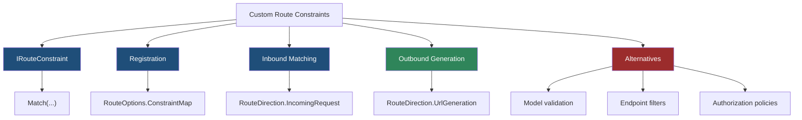
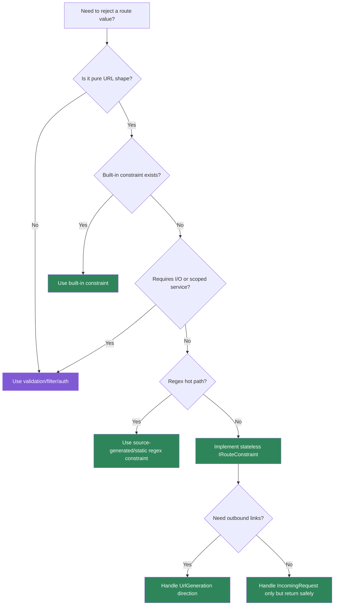

> [!success] Mastery Check
> - [ ] **Studied Well**
> - [ ] **Can explain the concept without notes**
> - [ ] **Can answer interview questions confidently**
> - [ ] **Can implement it in a real project**


# 4.072 - Custom Route Constraints: IRouteConstraint Implementation

---

## PART 0 - Navigation & Context

### Where This Topic Lives

```
ASP.NET Core Mastery
└── Routing
    ├── 4.065  Route Templates
    ├── 4.066  Route Constraints
    ├── 4.068  Route Precedence
    ├── 4.072  YOU ARE HERE - custom constraints
    └── 4.075  Route Performance
```

### What You Need Before This

- **[[4.066 - Route Constraints: Type Constraints, Regex, and Custom Constraints]]** - custom constraints are a specialized version of the constraint system.
- **[[4.068 - Route Order and Precedence: How Conflicts Are Resolved]]** - constraints affect candidate validity and specificity.
- **C# interfaces and DI basics** - custom constraints are registered by type in route options.

### What This Unlocks After

- **[[4.075 - Route Performance: Trie-Based Matching and Route Cache]]** - custom constraints are part of route policy cost.
- **[[4.080 - Route Parameter Binding in Minimal APIs]]** - constraints run before parameter binding.
- **[[4.283 - REST API Design Conventions in ASP.NET Core]]** - good constraints protect URL contracts without becoming validation.

### Why This Matters at Scale

Custom constraints let you enforce URL shape before endpoint execution, but if you put business logic or database calls there, you turn routing into a hidden latency and correctness trap.

---

## PART 1 - The Core Mental Model

### The Fundamental Rule

> **`IRouteConstraint.Match` decides whether a route candidate remains eligible; the practical consequence is that failure returns a route miss, usually `404`, before auth, binding, filters, or handler code run.**

### The Plain-Language Analogy

A custom route constraint is a gate with a shape scanner. It can say "this barcode looks like a valid warehouse SKU" before the package reaches the warehouse desk. It should not call the warehouse database to verify stock because that turns the front gate into the whole business process. If the gate rejects the package, the desk never sees it.

### The Taxonomy Diagram



---

## PART 2 - Deep Mechanics

### 2.1 Constraint Registration Maps Template Text to a Type

```
Startup:
RouteOptions.ConstraintMap["sku"] = typeof(SkuRouteConstraint)
       |
Template:
/api/items/{sku:sku}
       |
Matcher uses constraint during routing
```

```csharp
builder.Services.Configure<RouteOptions>(options =>
{
    options.ConstraintMap["sku"] = typeof(SkuRouteConstraint);
});
```

ASP.NET Core internally: route pattern parsing keeps constraint references; route options resolve the token to a constraint implementation when endpoints are built.

**Runtime cost:** one type map lookup at build time; per request cost is the `Match` method.

**Edge case:** Constraint tokens share a namespace. Pick names that will not collide with framework or library constraints.

### 2.2 `Match` Runs During Candidate Filtering

```
---> Routing
     /api/items/ABC-123
     candidate: /api/items/{sku:sku}
     SkuRouteConstraint.Match(...)
     true -> candidate remains
     false -> candidate removed
---> Auth ---> Endpoint
```

```csharp
public sealed class SkuRouteConstraint : IRouteConstraint
{
    private static readonly Regex Pattern =
        new("^[A-Z]{3}-[0-9]{3}$", RegexOptions.Compiled | RegexOptions.CultureInvariant);

    public bool Match(
        HttpContext? httpContext,
        IRouter? route,
        string routeKey,
        RouteValueDictionary values,
        RouteDirection routeDirection)
    {
        return values.TryGetValue(routeKey, out var value)
            && value is not null
            && Pattern.IsMatch(Convert.ToString(value, CultureInfo.InvariantCulture)!);
    }
}
```

```http
// HTTP wire format:
GET /api/items/abc-123 HTTP/1.1
HTTP/1.1 404 Not Found
```

**Runtime cost:** one regex check per candidate containing the constraint. Use compiled/static regex or source-generated regex for hot paths.

**Edge case:** `Match` may run for URL generation too; check `routeDirection` if behavior differs.

### 2.3 Constraints Are Not Business Validation

```
Routing constraint:
  "does this look like an SKU?" -> 404 if no

Endpoint validation:
  "is this SKU active for tenant?" -> 400/403/404 depending contract
```

```csharp
app.MapGet("/api/items/{sku:sku}", async (string sku, InventoryDb db) =>
{
    var item = await db.Items.FindAsync(sku);
    return item is null ? Results.NotFound() : Results.Ok(item);
});
```

**Runtime cost:** constraint is CPU only; database lookup belongs in handler/filter where cancellation, auth, and error shaping are available.

**Edge case:** Putting tenant checks in `IRouteConstraint` can bypass proper authorization auditing because auth middleware has not enforced endpoint policy yet.

### 2.4 Outbound Generation Uses Constraints Too

```
CreatedAtRoute("Items.GetBySku", sku="bad")
---> route value expansion
---> constraint rejects value
---> link generation returns null
```

```csharp
return Results.CreatedAtRoute("Items.GetBySku", new { sku = "ABC-123" }, value);
```

**Runtime cost:** one `Match` call during URL generation for constrained route value.

**Edge case:** A constraint that only handles `IncomingRequest` and returns false for `UrlGeneration` breaks generated links.

---

## PART 3 - Production Code Patterns

### Pattern 1: The Format-Only Constraint

```csharp
// Domain scenario: inventory API.
public sealed class WarehouseSkuConstraint : IRouteConstraint
{
    private static readonly Regex Pattern =
        new("^[A-Z]{2}[0-9]{6}$", RegexOptions.Compiled | RegexOptions.CultureInvariant);

    public bool Match(HttpContext? httpContext, IRouter? route, string routeKey,
        RouteValueDictionary values, RouteDirection routeDirection)
    {
        return values.TryGetValue(routeKey, out var raw)
            && raw is not null
            && Pattern.IsMatch(raw.ToString()!);
    }
}
```

```http
// HTTP wire format:
GET /api/items/AA123456 HTTP/1.1
HTTP/1.1 200 OK
```

### Pattern 2: The Constraint Map Registration

```csharp
// Domain scenario: logistics tracking endpoint.
builder.Services.Configure<RouteOptions>(options =>
{
    options.ConstraintMap["tracking"] = typeof(TrackingNumberConstraint);
});

app.MapGet("/api/shipments/{trackingNumber:tracking}", (string trackingNumber) =>
    Results.Ok(new { trackingNumber }));
```

### Pattern 3: The No-Database Rule

```csharp
// ⚠️ WRONG: route matching now performs I/O before auth and endpoint filters.
public sealed class ActiveTenantConstraint : IRouteConstraint
{
    public bool Match(HttpContext? ctx, IRouter? route, string key,
        RouteValueDictionary values, RouteDirection direction)
    {
        throw new NotSupportedException("Do not query a database in route constraints.");
    }
}

// ✅ CORRECT: use route constraint for shape and authorization for tenant access.
app.MapGet("/api/tenants/{tenantId:guid}/orders", () => Results.Ok())
   .RequireAuthorization("TenantAccess");
```

### Pattern 4: The Direction-Aware Constraint

```csharp
// Domain scenario: public catalog slug.
public bool Match(HttpContext? httpContext, IRouter? route, string routeKey,
    RouteValueDictionary values, RouteDirection routeDirection)
{
    if (!values.TryGetValue(routeKey, out var value) || value is null)
    {
        return false;
    }

    var text = value.ToString()!;
    return routeDirection == RouteDirection.UrlGeneration
        ? text.Length <= 80
        : SlugRegex().IsMatch(text);
}

[GeneratedRegex("^[a-z0-9]+(?:-[a-z0-9]+)*$", RegexOptions.CultureInvariant)]
private static partial Regex SlugRegex();
```

### Pattern 5: The Constraint Integration Test

```csharp
// Domain scenario: payment API.
[Fact]
public async Task Invalid_public_payment_id_is_route_miss()
{
    await using var factory = new WebApplicationFactory<Program>();
    var client = factory.CreateClient();

    var response = await client.GetAsync("/api/payments/not-valid");

    Assert.Equal(HttpStatusCode.NotFound, response.StatusCode);
}
```

---

## PART 4 - Gotchas & Anti-Patterns

### Gotcha 1: Returning 400 Expectations From Constraints

Constraint failures are route misses.

```csharp
// ⚠️ WRONG CODE
app.MapGet("/api/items/{sku:sku}", (string sku) => Results.Ok());

// HTTP consequence (wrong path):
// GET /api/items/bad -> 404, not 400.

// ✅ CORRECT CODE
app.MapGet("/api/items/{sku}", (string sku) =>
    SkuValidator.IsValid(sku) ? Results.Ok() : Results.BadRequest());

// HTTP consequence (correct path):
// GET /api/items/bad -> 400 when you intentionally want validation semantics.

// WHY: routing decides endpoint existence; validation explains accepted endpoint input.
```

### Gotcha 2: Performing Database Queries in `Match`

The route matcher is not a domain service.

```csharp
// ⚠️ WRONG CODE
public bool Match(...) => _db.Tenants.Any(t => t.Slug == value);

// HTTP consequence (wrong path):
// Every candidate match can add a database round trip before authorization.

// ✅ CORRECT CODE
app.MapGet("/api/tenants/{tenantSlug:slug}/orders", Handler)
   .RequireAuthorization("TenantAccess");

// HTTP consequence (correct path):
// Bad slug shape -> 404; unauthorized tenant -> 403.

// WHY: business checks belong after routing, inside auth/handler scope.
```

### Gotcha 3: Ignoring URL Generation Direction

Constraints can affect outbound links.

```csharp
// ⚠️ WRONG CODE
if (routeDirection == RouteDirection.UrlGeneration) return false;

// HTTP consequence (wrong path):
// CreatedAtRoute returns no Location even for valid values.

// ✅ CORRECT CODE
return IsValid(values[routeKey]?.ToString());

// HTTP consequence (correct path):
// Valid constrained values generate canonical links.

// WHY: routing uses constraints for inbound matching and outbound generation.
```

### Gotcha 4: Capturing Scoped Services in Constraints

Constraints are not request-scoped handlers.

```csharp
// ⚠️ WRONG CODE
public sealed class TenantConstraint(TenantDbContext db) : IRouteConstraint { }

// HTTP consequence (wrong path):
// Captive dependency or invalid scoped service resolution at startup.

// ✅ CORRECT CODE
public sealed class TenantSlugConstraint : IRouteConstraint
{
    public bool Match(...) => SlugRegex().IsMatch(value);
}

// HTTP consequence (correct path):
// Route shape check stays cheap and lifetime-safe.

// WHY: constraints are route infrastructure, not per-request domain workflows.
```

### Gotcha 5: Re-Implementing Built-In Constraints

Custom code often loses culture and edge-case handling.

```csharp
// ⚠️ WRONG CODE
app.MapGet("/api/orders/{id:customInt}", (int id) => Results.Ok());

// HTTP consequence (wrong path):
// Custom parsing can disagree with model binding or built-in route behavior.

// ✅ CORRECT CODE
app.MapGet("/api/orders/{id:int}", (int id) => Results.Ok());

// HTTP consequence (correct path):
// Invalid integer shape -> 404 using framework constraint.

// WHY: use built-ins unless the URL shape is truly domain-specific.
```

---

## PART 5 - Performance Implications

### Request Pipeline Characteristics Table

| Scenario | Pipeline Depth | Allocations Per Request | Approx Latency Impact | Recommendation |
|---|---:|---:|---:|---|
| Built-in int constraint | Routing only | ~0 | Very low | Prefer built-ins |
| Static regex constraint | Routing only | ~0-1 | Low | Precompile/source-generate |
| Allocating regex per call | Routing only | many | Medium | Avoid |
| DB call in constraint | Routing before auth | query allocations | Very high | Never do this |
| Constraint miss | Routing only | ~0 | Low | Expect 404 |
| URL generation constraint | Handler | small | Low | Support both directions |
| Many constrained candidates | Routing | per candidate checks | Medium | Keep templates specific |
| Custom constraint with DI | Startup/request | lifetime risk | Medium | Keep stateless |

### BenchmarkDotNet Code

```csharp
using BenchmarkDotNet.Attributes;
using System.Text.RegularExpressions;

[MemoryDiagnoser]
public sealed partial class ConstraintRegexBenchmarks
{
    private const string Value = "AB123456";
    private static readonly Regex StaticRegex = new("^[A-Z]{2}[0-9]{6}$", RegexOptions.Compiled);

    [Benchmark] public bool NaiveNewRegex() => new Regex("^[A-Z]{2}[0-9]{6}$").IsMatch(Value);
    [Benchmark] public bool StaticCompiledRegex() => StaticRegex.IsMatch(Value);
    [Benchmark] public bool SourceGeneratedRegex() => SkuRegex().IsMatch(Value);

    [GeneratedRegex("^[A-Z]{2}[0-9]{6}$", RegexOptions.CultureInvariant)]
    private static partial Regex SkuRegex();
}

// Expected output (approximate, .NET 8, x64, local):
// NaiveNewRegex allocates heavily.
// StaticCompiledRegex is much cheaper.
// SourceGeneratedRegex is typically optimal for hot route constraints.
```

### When This Costs You

High-cardinality APIs with custom regex constraints, gateways with many candidate endpoints, and any constraint that allocates or performs I/O.

### When This Doesn't Matter

One-off admin routes, simple built-in constraints, and endpoints dominated by database or external HTTP latency.

---

## PART 6 - Interview Arsenal

### A. The Question Bank

**Question:** "What does `IRouteConstraint` do in the pipeline?"

**Average Answer:** "It validates route parameters."

**Why That's Insufficient:** It confuses route selection with validation.

> **Great Answer:** "A custom route constraint runs during endpoint routing while the framework is deciding if a candidate endpoint matches. If it returns false, the endpoint is removed from consideration and the handler never runs. The client usually sees 404, not 400, because ASP.NET Core treats it as no route matched."

**Question:** "Would you query a database inside a custom route constraint?"

**Average Answer:** "Maybe, if I need to check the tenant exists."

**Why That's Insufficient:** It misses pipeline order, auth, and cost.

> **Great Answer:** "No. A route constraint should be a cheap shape check. It runs before authorization and before the endpoint handler, and it can run during URL generation too. I would validate tenant format with a constraint, then enforce tenant existence or access in authorization or the handler where DI scope, cancellation, logging, and response semantics are correct."

**Question:** "How do custom constraints affect link generation?"

**Average Answer:** "They are for incoming requests."

**Why That's Insufficient:** They also participate in outbound routing.

> **Great Answer:** "They can run for URL generation, so I make sure `Match` handles `RouteDirection.UrlGeneration`. If it rejects a value there, `CreatedAtRoute` or `LinkGenerator` may return null and the HTTP response can lose its `Location` header."

### B. The Trick Questions

| Question | Trap | Correct Answer |
|---|---|---|
| Constraint failure returns 400? | Validation assumption | No, usually 404. |
| Can `Match` run without `HttpContext`? | Request-only thinking | It can for URL generation; handle nullable context. |
| Should constraints use scoped services? | DI misuse | Avoid; keep constraints stateless and cheap. |
| Should custom constraints replace built-ins? | Overengineering | No, use built-ins when they fit. |

### C. Red Flags to Avoid

- "Constraints are model validation." - wrong pipeline stage.
- "I can hit the database in `Match`." - performance and auth smell.
- "URL generation does not use constraints." - false.
- "A namespace-specific constraint is harmless." - naming collisions matter.
- "Custom constraints are always better than filters." - wrong abstraction.

---

## PART 7 - Decision Framework



---

## PART 8 - Self-Check

### A. Conceptual Questions

1. What happens to the HTTP request if `IRouteConstraint.Match` returns false?
2. Why is a custom constraint not the right place for a database lookup?
3. How can a custom constraint break `CreatedAtRoute`?
4. What is `RouteDirection.UrlGeneration` for?
5. Why should custom constraints be stateless?
6. What happens before auth when a constraint rejects a candidate?
7. When should you use validation instead of a route constraint?
8. Why are built-in constraints preferable when available?

### B. Code Puzzles

```csharp
app.MapGet("/api/items/{sku:sku}", (string sku) => Results.Ok());
```

<details><summary>Answer</summary>
If `sku` constraint rejects the segment, the response is usually 404. The endpoint is not selected.
</details>

```csharp
public bool Match(...) => _db.Items.Any(x => x.Sku == values[routeKey].ToString());
```

<details><summary>Answer</summary>
The bug is database I/O inside route matching. It runs before auth and can add a query per candidate.
</details>

```csharp
if (routeDirection == RouteDirection.UrlGeneration) return false;
```

<details><summary>Answer</summary>
Outbound link generation for this constrained route fails, likely returning null.
</details>

```csharp
builder.Services.Configure<RouteOptions>(o => o.ConstraintMap["int"] = typeof(MyConstraint));
```

<details><summary>Answer</summary>
This risks overriding/conflicting with a built-in token name. Choose a domain-specific token.
</details>

---

## PART 9 - Connections & Resources

### A. Related Topics Table

| Topic | Why It Connects |
|---|---|
| [[4.066 - Route Constraints: Type Constraints, Regex, and Custom Constraints]] | Custom constraints are the extensibility point for the constraint system. |
| [[4.068 - Route Order and Precedence: How Conflicts Are Resolved]] | Constraints influence candidate selection and ambiguity. |
| [[4.071 - Link Generation: IUrlHelper, LinkGenerator, and Named Routes]] | Constraints can reject outbound route values. |
| [[4.080 - Route Parameter Binding in Minimal APIs]] | Binding only runs after constraints accept the route. |
| [[2.045 - Regular Expressions in C#]] | Regex cost and correctness matter in custom constraints. |

### B. Books

| Book | Chapters | Why These Chapters |
|---|---|---|
| *ASP.NET Core in Action* | Routing | Explains route constraints and endpoint routing behavior. |
| *Pro ASP.NET Core* | URL routing | Includes custom constraints and conventional routing examples. |

### C. Essential Articles & Docs

- [Microsoft Docs - Routing in ASP.NET Core](https://learn.microsoft.com/en-us/aspnet/core/fundamentals/routing)
- [Microsoft Docs - Routing to controller actions](https://learn.microsoft.com/en-us/aspnet/core/mvc/controllers/routing)
- [ASP.NET Core source - Route constraints](https://github.com/dotnet/aspnetcore/tree/main/src/Http/Routing)
- [Microsoft Docs - Generated regular expressions](https://learn.microsoft.com/en-us/dotnet/standard/base-types/regular-expression-source-generators)

### D. Template Meta-Note

> [!NOTE]
> **Part 0** orients the topic. **Part 1** gives the mental model. **Part 2** shows framework mechanics. **Part 3** gives production patterns. **Part 4** names gotchas. **Part 5** covers performance. **Part 6** prepares interviews. **Part 7** gives decisions. **Part 8** checks understanding. **Part 9** connects resources.
