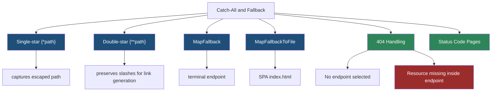
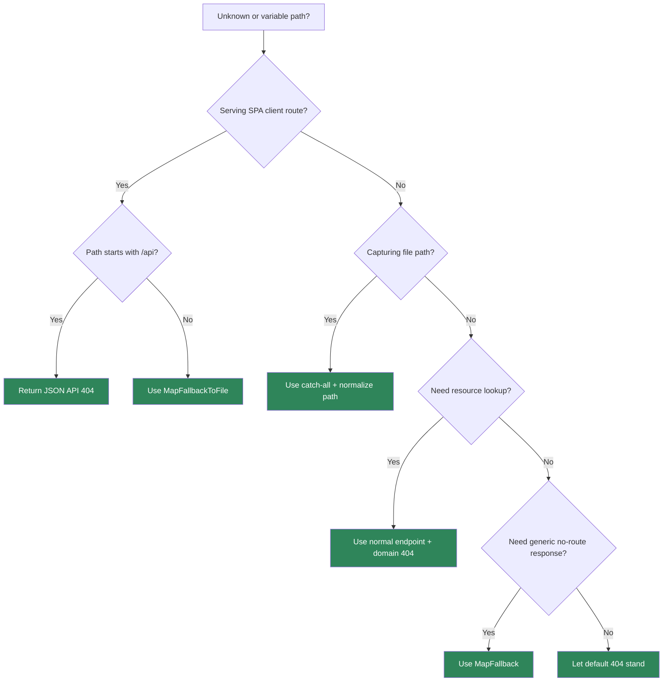

> [!success] Mastery Check
> - [ ] **Studied Well**
> - [ ] **Can explain the concept without notes**
> - [ ] **Can answer interview questions confidently**
> - [ ] **Can implement it in a real project**


# 4.073 - Catch-All Routes, Fallback Routes, and 404 Response Handling

---

## PART 0 - Navigation & Context

### Where This Topic Lives

```
ASP.NET Core Mastery
├── Routing
│   ├── 4.065  Route Templates
│   ├── 4.068  Route Order and Precedence
│   ├── 4.073  YOU ARE HERE - catch-all and fallback
│   └── 4.075  Route Performance
└── Error Handling
    ├── 4.179  Problem Details
    └── 4.180  Status Code Pages
```

### What You Need Before This

- **[[4.065 - Route Templates: Syntax, Literals, Parameters, and Wildcards]]** - catch-all syntax is part of route templates.
- **[[4.068 - Route Order and Precedence: How Conflicts Are Resolved]]** - fallback routes must not compete with real endpoints.
- **[[4.064 - Endpoint Routing: The Modern Routing Architecture]]** - no endpoint selected usually becomes a 404.

### What This Unlocks After

- **[[4.180 - Status Code Pages and Custom HTTP Error Response Shaping]]** - shaping body content for 404 responses.
- **[[4.315 - Static Files Middleware: UseStaticFiles, wwwroot, and File Providers]]** - SPA fallback often serves static files.
- **[[4.283 - REST API Design Conventions in ASP.NET Core]]** - APIs should distinguish route miss, method mismatch, and resource not found.

### Why This Matters at Scale

Catch-all routes are powerful enough to make a single-page app work and dangerous enough to mask API 404s, leak file paths, or route production traffic to the wrong terminal handler.

---

## PART 1 - The Core Mental Model

### The Fundamental Rule

> **A catch-all route captures remaining path segments, while a fallback endpoint runs when no better endpoint matches; the practical consequence is that fallback belongs at the edge of URL space, never in the middle of business routing.**

### The Plain-Language Analogy

A fallback route is the lost-and-found desk. If a visitor cannot find any office, the desk can help. It should not stand in front of every office door and intercept visitors who were almost correctly addressed. A catch-all is a large basket; useful for files and client-side routes, but it must be labeled and isolated.

### The Taxonomy Diagram



---

## PART 2 - Deep Mechanics

### 2.1 Catch-All Captures Remaining Segments

```
---> Routing
     /files/a/b/c.txt
     template /files/{*path}
     route value path = "a/b/c.txt"
---> Endpoint
```

```csharp
app.MapGet("/files/{*path}", (string path) => Results.Ok(new { path }));
```

```http
// HTTP wire format:
GET /files/a/b/c.txt HTTP/1.1
HTTP/1.1 200 OK
Content-Type: application/json
```

ASP.NET Core internally: route pattern matching stores the catch-all value in `HttpContext.Request.RouteValues`. Binding then supplies it to the handler parameter.

**Runtime cost:** one string capture for the remaining path; avoid treating it as trusted filesystem input.

**Edge case:** Catch-all values can include encoded path separators and traversal-like text. Always normalize before file access.

### 2.2 Fallback Runs Only When No Endpoint Wins

```
---> Routing ---> no endpoint selected ---> EndpointMiddleware
                                      └---> fallback endpoint if configured
```

```csharp
app.MapFallback(() => Results.NotFound(new { error = "No route matched." }));
```

```http
// HTTP wire format:
GET /missing HTTP/1.1
HTTP/1.1 404 Not Found
Content-Type: application/json
```

ASP.NET Core source behavior: fallback endpoints are registered with low priority so normal endpoints win. They are still endpoints and can carry metadata.

**Runtime cost:** fallback invocation only on misses; cheap but can hide real API misses.

**Edge case:** A fallback that returns `200 index.html` for `/api/missing` makes API clients think the request succeeded.

### 2.3 SPA Fallback Must Exclude API and Files

```
StaticFiles ---> Routing ---> API endpoints ---> MapFallbackToFile("index.html")
```

```csharp
app.UseStaticFiles();
app.MapControllers();
app.MapFallbackToFile("/{*path:nonfile}", "index.html");
```

```http
// HTTP wire format:
GET /dashboard/settings HTTP/1.1
HTTP/1.1 200 OK
Content-Type: text/html
```

ASP.NET Core internally: `MapFallbackToFile` creates an endpoint that rewrites to a file result after route matching fails for normal endpoints.

**Runtime cost:** static file lookup and response streaming on fallback.

**Edge case:** Do not let SPA fallback handle `/api/*`; return JSON 404 for API clients.

### 2.4 404 Has Two Meanings

```
No endpoint selected:
  routing miss -> generic 404

Endpoint selected:
  handler runs -> domain resource not found -> domain 404 body
```

```csharp
app.MapGet("/api/orders/{orderId:int}", async (int orderId, OrdersDb db) =>
{
    var order = await db.Orders.FindAsync(orderId);
    return order is null
        ? Results.NotFound(new { error = "Order not found." })
        : Results.Ok(order);
});
```

**Runtime cost:** routing miss is cheap; domain 404 usually includes database lookup.

**Edge case:** Observability should distinguish "no route matched" from "resource not found" because they imply different client or data problems.

---

## PART 3 - Production Code Patterns

### Pattern 1: The API 404 Before SPA Fallback

```csharp
// Domain scenario: e-commerce API plus React admin.
app.MapControllers();

app.Map("/api/{**path}", api =>
{
    api.Run(async context =>
    {
        context.Response.StatusCode = StatusCodes.Status404NotFound;
        await context.Response.WriteAsJsonAsync(new { error = "API route not found." });
    });
});

app.MapFallbackToFile("index.html");
```

```http
// HTTP wire format:
GET /api/unknown HTTP/1.1
HTTP/1.1 404 Not Found
Content-Type: application/json
```

### Pattern 2: The Safe File Catch-All

```csharp
// Domain scenario: logistics document download.
app.MapGet("/documents/{**path}", (string path, IWebHostEnvironment env) =>
{
    var root = Path.Combine(env.ContentRootPath, "safe-documents");
    var fullPath = Path.GetFullPath(Path.Combine(root, path));

    if (!fullPath.StartsWith(root, StringComparison.OrdinalIgnoreCase))
    {
        return Results.BadRequest(new { error = "Invalid path." });
    }

    return File.Exists(fullPath)
        ? Results.File(fullPath)
        : Results.NotFound();
});
```

### Pattern 3: The Domain 404 Inside the Endpoint

```csharp
// Domain scenario: payment API.
app.MapGet("/api/payments/{paymentId:guid}", async (Guid paymentId, PaymentsDb db) =>
{
    var payment = await db.Payments.FindAsync(paymentId);
    return payment is null ? Results.NotFound(new { paymentId }) : Results.Ok(payment);
});
```

### Pattern 4: The Low-Priority Fallback

```csharp
// Domain scenario: public web app.
app.MapGet("/health", () => Results.Ok("ok"));
app.MapGet("/api/products/{id:int}", (int id) => Results.Ok(new { id }));
app.MapFallbackToFile("index.html");
```

### Pattern 5: The 405 Test

```csharp
// Domain scenario: order management test.
[Fact]
public async Task Wrong_method_on_existing_path_returns_405_not_spa()
{
    var client = _factory.CreateClient();
    var response = await client.PostAsync("/api/orders/42", null);
    Assert.Equal(HttpStatusCode.MethodNotAllowed, response.StatusCode);
}
```

---

## PART 4 - Gotchas & Anti-Patterns

### Gotcha 1: Returning SPA HTML for API 404s

This looks fine in a browser and terrible to API clients.

```csharp
// ⚠️ WRONG CODE
app.MapFallbackToFile("index.html");

// HTTP consequence (wrong path):
// GET /api/missing -> 200 text/html.

// ✅ CORRECT CODE
app.Map("/api/{**path}", api => api.Run(ctx =>
{
    ctx.Response.StatusCode = 404;
    return ctx.Response.WriteAsJsonAsync(new { error = "API route not found." });
}));
app.MapFallbackToFile("index.html");

// HTTP consequence (correct path):
// GET /api/missing -> 404 application/json.

// WHY: API and browser fallback paths have different contracts.
```

### Gotcha 2: Using Catch-All for File Paths Without Normalization

Path traversal often enters through catch-all values.

```csharp
// ⚠️ WRONG CODE
app.MapGet("/files/{**path}", (string path) => Results.File(path));

// HTTP consequence (wrong path):
// Encoded traversal can attempt to read outside allowed storage.

// ✅ CORRECT CODE
app.MapGet("/files/{**path}", (string path, IWebHostEnvironment env) =>
{
    var root = Path.Combine(env.ContentRootPath, "files");
    var full = Path.GetFullPath(Path.Combine(root, path));
    return full.StartsWith(root, StringComparison.OrdinalIgnoreCase)
        ? Results.File(full)
        : Results.BadRequest();
});

// HTTP consequence (correct path):
// Unsafe paths -> 400 Bad Request.

// WHY: routing captures strings; file safety is your responsibility.
```

### Gotcha 3: Confusing Routing 404 With Domain 404

They look identical unless you shape them.

```csharp
// ⚠️ WRONG CODE
app.MapFallback(() => Results.NotFound("not found"));

// HTTP consequence (wrong path):
// Cannot tell missing route from missing order in logs.

// ✅ CORRECT CODE
app.MapGet("/api/orders/{id:int}", async (int id, OrdersDb db) =>
    await db.Orders.FindAsync(id) is { } order
        ? Results.Ok(order)
        : Results.NotFound(new { type = "order-not-found", id }));

app.MapFallback(() => Results.NotFound(new { type = "route-not-found" }));

// HTTP consequence (correct path):
// Distinct JSON body shapes for routing vs domain failures.

// WHY: endpoint selected vs endpoint not selected are different pipeline outcomes.
```

### Gotcha 4: Assuming Catch-All Should Beat Literals

Catch-all should be the least specific endpoint.

```csharp
// ⚠️ WRONG CODE
app.MapGet("/{**path}", (string path) => Results.Ok(path));
app.MapGet("/health", () => Results.Ok("ok"));

// HTTP consequence (wrong path):
// URL space becomes unclear and future endpoints are risky.

// ✅ CORRECT CODE
app.MapGet("/health", () => Results.Ok("ok"));
app.MapFallback(() => Results.NotFound());

// HTTP consequence (correct path):
// /health remains explicit; unknown paths fall back.

// WHY: fallback endpoints are intentionally low-priority terminal endpoints.
```

### Gotcha 5: Treating 405 as 404

Wrong method is a different client error.

```csharp
// ⚠️ WRONG CODE
// Test expects POST /api/orders/42 to be 404.

// HTTP consequence (wrong path):
// Actual response can be 405 with Allow: GET.

// ✅ CORRECT CODE
// Test for 405 and assert Allow header.

// HTTP consequence (correct path):
// POST /api/orders/42 -> 405 Method Not Allowed.

// WHY: method policy recognizes the path but rejects the verb.
```

---

## PART 5 - Performance Implications

### Request Pipeline Characteristics Table

| Scenario | Pipeline Depth | Allocations Per Request | Approx Latency Impact | Recommendation |
|---|---:|---:|---:|---|
| Normal endpoint hit | Normal | normal | Low | Fallback not involved |
| Routing miss fallback | Normal | small | Low | Shape 404 clearly |
| SPA file fallback | Static file | stream/file cost | Medium | Exclude API paths |
| Catch-all capture | Routing | one string | Low | Treat as untrusted |
| Domain 404 | Handler + DB | query allocations | Higher | Log separately |
| 405 method mismatch | Routing policy | header write | Low | Test it |
| Path normalization | Handler | string allocations | Low-medium | Required for security |
| Many fallback branches | Middleware | branch checks | Low | Keep URL spaces clean |

### BenchmarkDotNet Code

```csharp
using BenchmarkDotNet.Attributes;
using System.IO;

[MemoryDiagnoser]
public sealed class PathSafetyBenchmarks
{
    private const string Root = "C:\\app\\files";
    private const string PathValue = "orders\\2026\\invoice.pdf";

    [Benchmark] public string NaiveCombine() => Path.Combine(Root, PathValue);
    [Benchmark] public string NormalizedFullPath() => Path.GetFullPath(Path.Combine(Root, PathValue));
    [Benchmark] public bool NormalizedAndChecked()
    {
        var full = Path.GetFullPath(Path.Combine(Root, PathValue));
        return full.StartsWith(Root, StringComparison.OrdinalIgnoreCase);
    }
}

// Expected output (approximate, .NET 8, x64, local):
// Normalization allocates more than naive combine but is mandatory before file access.
```

### When This Costs You

High-volume static file fallback, catch-all file downloads, SPA/API mixed hosting, and path normalization in hot download services.

### When This Doesn't Matter

Simple API-only services with no catch-all routes and clear endpoint templates.

---

## PART 6 - Interview Arsenal

### A. The Question Bank

**Question:** "What is the difference between a catch-all route and a fallback endpoint?"

**Average Answer:** "They both handle anything."

**Why That's Insufficient:** It misses precedence and route value capture.

> **Great Answer:** "A catch-all is a route template segment that captures the rest of the path into a route value. A fallback endpoint is a low-priority endpoint that runs when no normal endpoint matches. The HTTP consequence is important: I can use fallback for a SPA, but I should keep `/api/*` misses returning JSON 404 rather than `index.html`."

**Question:** "What is the difference between no route matched and resource not found?"

**Average Answer:** "Both are 404."

**Why That's Insufficient:** Operationally they are different.

> **Great Answer:** "No route matched means endpoint routing never selected a handler. Resource not found means the endpoint did run, usually queried storage, and intentionally returned 404. I separate those in response bodies and logs because one is a client URL problem and the other may be a domain data problem."

**Question:** "What security issue appears with catch-all file routes?"

**Average Answer:** "Path traversal."

**Why That's Insufficient:** It needs the pipeline reason.

> **Great Answer:** "Routing only gives me a captured string. It does not prove that string is safe for the filesystem. I normalize the combined path with `Path.GetFullPath`, check it stays under the allowed root, and only then stream the file; otherwise the HTTP response should be 400 or 404."

### B. The Trick Questions

| Question | Trap | Correct Answer |
|---|---|---|
| Should `/api/missing` return SPA HTML? | Browser-first thinking | No, API misses should return API-shaped 404. |
| Is a catch-all path trusted after routing? | Router validation myth | No, it is untrusted input. |
| Does fallback run before normal endpoints? | Middleware order confusion | No, fallback endpoints are low priority. |
| Is wrong method a route miss? | 404 assumption | Often 405 if path matches. |

### C. Red Flags to Avoid

- "Fallback is a good global API handler." - it can hide API errors.
- "Catch-all paths are safe because routing parsed them." - false.
- "All 404s mean no route matched." - false.
- "SPA fallback can be registered anywhere." - endpoint priority and URL partitioning matter.
- "405 and 404 are interchangeable." - incorrect HTTP contract.

---

## PART 7 - Decision Framework



---

## PART 8 - Self-Check

### A. Conceptual Questions

1. What route value does `{**path}` capture?
2. What happens to the HTTP request if no endpoint is selected?
3. Why should SPA fallback not handle `/api/*`?
4. What is the difference between route 404 and domain 404?
5. Why must catch-all file paths be normalized?
6. How can wrong HTTP methods produce 405?
7. Where should fallback sit relative to business endpoints?
8. What does `MapFallbackToFile` usually return?

### B. Code Puzzles

```csharp
app.MapFallbackToFile("index.html");
```

<details><summary>Answer</summary>
If not partitioned, an unknown API path can receive `200 text/html` instead of JSON 404. Add an API fallback before SPA fallback.
</details>

```csharp
app.MapGet("/files/{**path}", (string path) => Results.File(path));
```

<details><summary>Answer</summary>
The bug is trusting a catch-all route value as a filesystem path. Normalize and check root containment.
</details>

```csharp
app.MapGet("/api/orders/{id:int}", (int id) => Results.Ok());
```

<details><summary>Answer</summary>
`POST /api/orders/1` can return 405 Method Not Allowed. The path matches but the method policy rejects POST.
</details>

```csharp
app.MapGet("/api/orders/{id:int}", async (int id, Db db) =>
    await db.Orders.FindAsync(id) is null ? Results.NotFound() : Results.Ok());
```

<details><summary>Answer</summary>
This is a domain 404, not a route miss. The endpoint ran and decided the resource was absent.
</details>

---

## PART 9 - Connections & Resources

### A. Related Topics Table

| Topic | Why It Connects |
|---|---|
| [[4.065 - Route Templates: Syntax, Literals, Parameters, and Wildcards]] | Catch-all syntax is part of route template grammar. |
| [[4.068 - Route Order and Precedence: How Conflicts Are Resolved]] | Catch-all and fallback depend on precedence. |
| [[4.180 - Status Code Pages and Custom HTTP Error Response Shaping]] | 404 bodies should be shaped consistently. |
| [[4.315 - Static Files Middleware: UseStaticFiles, wwwroot, and File Providers]] | SPA fallback often serves static files. |
| [[4.322 - File Security: Path Traversal Prevention and Content Type Validation]] | Catch-all file routes must be path-safe. |

### B. Books

| Book | Chapters | Why These Chapters |
|---|---|---|
| *ASP.NET Core in Action* | Routing, static files, error handling | Connects fallback routing with static file hosting. |
| *Pro ASP.NET Core* | URL routing and static content | Shows wildcard route behavior and file serving. |

### C. Essential Articles & Docs

- [Microsoft Docs - Routing in ASP.NET Core](https://learn.microsoft.com/en-us/aspnet/core/fundamentals/routing)
- [Microsoft Docs - Static files in ASP.NET Core](https://learn.microsoft.com/en-us/aspnet/core/fundamentals/static-files)
- [Microsoft Docs - Error handling in ASP.NET Core](https://learn.microsoft.com/en-us/aspnet/core/fundamentals/error-handling)
- [ASP.NET Core source - Routing](https://github.com/dotnet/aspnetcore/tree/main/src/Http/Routing)

### D. Template Meta-Note

> [!NOTE]
> **Part 0** orients the topic. **Part 1** gives the mental model. **Part 2** shows framework mechanics. **Part 3** gives production patterns. **Part 4** names gotchas. **Part 5** covers performance. **Part 6** prepares interviews. **Part 7** gives decisions. **Part 8** checks understanding. **Part 9** connects resources.
