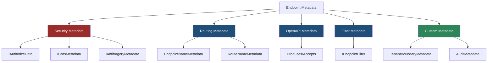
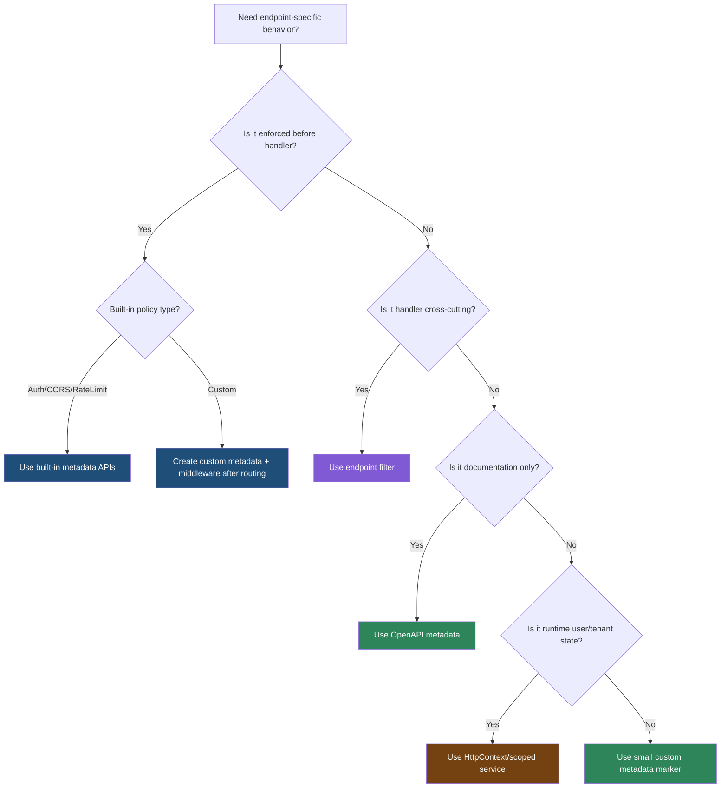

> [!success] Mastery Check
> - [ ] **Studied Well**
> - [ ] **Can explain the concept without notes**
> - [ ] **Can answer interview questions confidently**
> - [ ] **Can implement it in a real project**


# 4.074 - Endpoint Metadata: Decorating Endpoints with Custom Attributes

---

## PART 0 - Navigation & Context

### Where This Topic Lives

```
ASP.NET Core Mastery
├── Middleware
│   ├── 4.052  Middleware Ordering
│   └── metadata-aware middleware: CORS, Auth, Rate Limiting
└── Routing
    ├── 4.064  Endpoint Routing
    ├── 4.070  Route Groups
    ├── 4.074  YOU ARE HERE - endpoint metadata
    └── 4.083  Minimal API Filters
```

### What You Need Before This

- **[[4.064 - Endpoint Routing: The Modern Routing Architecture]]** - routing stores the selected endpoint on `HttpContext`.
- **[[4.052 - Middleware Ordering: The Canonical Order and Why It Matters]]** - metadata-aware middleware must run after routing.
- **[[4.070 - Route Groups: Prefix, Filters, Metadata, and Shared Middleware]]** - route groups compose metadata for child endpoints.

### What This Unlocks After

- **[[4.083 - Minimal API Filters: IEndpointFilter Pipeline]]** - filters can read endpoint metadata at execution time.
- **[[4.089 - Authorization on Endpoints: RequireAuthorization and WithMetadata]]** - authorization metadata drives policy enforcement.
- **[[4.095 - IEndpointMetadataProvider: Pushing Metadata from Parameter Types]]** - parameter types can contribute metadata automatically.

### Why This Matters at Scale

Endpoint metadata is how ASP.NET Core connects routing to policy enforcement; if metadata is missing or read at the wrong pipeline position, auth, CORS, OpenAPI, antiforgery, and rate limiting silently behave like global guesses.

---

## PART 1 - The Core Mental Model

### The Fundamental Rule

> **Endpoint metadata is selected-route policy data attached at startup and read after `UseRouting`; the practical consequence is that middleware can enforce per-endpoint behavior before the handler runs.**

### The Plain-Language Analogy

Routing gives each request a badge. Metadata is the badge text: "requires admin", "allows CORS policy X", "produces JSON", "rate limit bucket Y." Guards in the hallway can read the badge only after the receptionist assigns it. If a guard stands before the receptionist, the badge is blank and the guard can only apply global rules.

### The Taxonomy Diagram



---

## PART 2 - Deep Mechanics

### 2.1 Metadata Is Built With the Endpoint

```
Startup:
MapGet("/api/orders/{id}", handler)
  .RequireAuthorization("Orders.Read")
  .WithName("Orders.GetById")
  .WithMetadata(new AuditMetadata("orders-read"))

Build endpoint:
RoutePattern + RequestDelegate + MetadataCollection
```

```csharp
public sealed record AuditMetadata(string EventName);

app.MapGet("/api/orders/{orderId:int}", (int orderId) => Results.Ok(new { orderId }))
   .RequireAuthorization("Orders.Read")
   .WithName("Orders.GetById")
   .WithMetadata(new AuditMetadata("orders.read"));
```

ASP.NET Core internally: `RouteEndpointBuilder.Metadata` is populated by conventions. When endpoint data sources are built, metadata becomes an ordered `EndpointMetadataCollection`.

**Runtime cost:** mostly startup/build-time; per request reads are indexed metadata lookups and cheap.

**Edge case:** Metadata order can matter when multiple values of the same type are present; the "last one wins" pattern is common but not universal.

### 2.2 Middleware Reads Metadata After Routing

```
---> ExceptionHandler ---> Routing[SetEndpoint] ---> CORS/Auth/RateLimit[read metadata] ---> Endpoint[handler]
                                  before routing: GetEndpoint() == null
```

```csharp
app.UseRouting();

app.Use(async (context, next) =>
{
    var audit = context.GetEndpoint()?.Metadata.GetMetadata<AuditMetadata>();
    if (audit is not null)
    {
        context.Response.Headers["X-Audit-Event"] = audit.EventName;
    }

    await next();
});
```

```http
// HTTP wire format:
GET /api/orders/42 HTTP/1.1
HTTP/1.1 200 OK
X-Audit-Event: orders.read
```

ASP.NET Core source behavior: `HttpContext.GetEndpoint()` returns the endpoint selected by `EndpointRoutingMiddleware`. Before that middleware runs, there is no selected endpoint.

**Runtime cost:** one endpoint pointer read plus metadata lookup; no database or reflection required.

**Edge case:** In .NET 6+ minimal hosting, routing middleware can be inserted implicitly, but custom middleware placement still controls whether endpoint metadata exists.

### 2.3 Metadata Can Short-Circuit Through Policy Middleware

```
---> Routing ---> AuthorizationMiddleware
                 reads IAuthorizeData
                 no/invalid user -> challenge/forbid
                 success -> next
---> Endpoint
```

```csharp
app.MapGet("/api/payments/{paymentId:guid}", (Guid paymentId) => Results.Ok(new { paymentId }))
   .RequireAuthorization("Payments.Read");
```

```http
// HTTP wire format:
GET /api/payments/11111111-1111-1111-1111-111111111111 HTTP/1.1

HTTP/1.1 401 Unauthorized
WWW-Authenticate: Bearer
```

ASP.NET Core internally: `AuthorizationMiddleware` reads `IAuthorizeData` metadata from the selected endpoint and invokes `IAuthorizationService` before endpoint execution.

**Runtime cost:** policy combine/cache plus authentication/authorization work; can include DB/cache lookups if policy handlers do that.

**Edge case:** If authorization middleware runs before routing, endpoint-specific authorization metadata cannot be read.

### 2.4 Custom Attributes Are Metadata Too

```
Controller action attributes
  -> ApplicationModel
  -> Endpoint metadata
  -> Middleware/filter reads metadata
```

```csharp
[AttributeUsage(AttributeTargets.Method | AttributeTargets.Class)]
public sealed class AuditAttribute(string eventName) : Attribute
{
    public string EventName { get; } = eventName;
}

[HttpPost("/api/refunds")]
[Audit("refund.created")]
public IActionResult CreateRefund() => Ok();
```

**Runtime cost:** attribute instances are discovered at startup/action model build; per request access is metadata lookup.

**Edge case:** Attributes are static declarations. If the value depends on the current tenant or user, store only the policy name in metadata and compute runtime facts later.

---

## PART 3 - Production Code Patterns

### Pattern 1: The Audit Badge

```csharp
// Domain scenario: payment API.
public sealed record AuditEventMetadata(string Name);

app.MapPost("/api/payments/{paymentId:guid}/capture", (Guid paymentId) => Results.Accepted())
   .RequireAuthorization("Payments.Capture")
   .WithMetadata(new AuditEventMetadata("payment.capture"));
```

```http
// HTTP wire format:
POST /api/payments/.../capture HTTP/1.1
HTTP/1.1 202 Accepted
```

### Pattern 2: The Metadata-Aware Middleware

```csharp
// Domain scenario: order management service.
app.Use(async (context, next) =>
{
    var metadata = context.GetEndpoint()?.Metadata.GetMetadata<AuditEventMetadata>();
    if (metadata is not null)
    {
        context.Items["AuditEvent"] = metadata.Name;
    }

    await next();
});
```

### Pattern 3: The Route Group Security Boundary

```csharp
// Domain scenario: healthcare patient portal.
var patientApi = app.MapGroup("/api/patients")
    .RequireAuthorization("ClinicalStaff")
    .WithMetadata(new AuditEventMetadata("patient-api"));

patientApi.MapGet("/{patientId:guid}", (Guid patientId) => Results.Ok(new { patientId }));
```

### Pattern 4: The OpenAPI Contract Metadata

```csharp
// Domain scenario: inventory API.
app.MapPost("/api/items", (CreateItemRequest request) => Results.Created("/api/items/1", request))
   .Accepts<CreateItemRequest>("application/json")
   .Produces<CreateItemRequest>(StatusCodes.Status201Created)
   .ProducesProblem(StatusCodes.Status400BadRequest);

public sealed record CreateItemRequest(string Sku, string Name);
```

### Pattern 5: The Attribute-to-Metadata Bridge

```csharp
// Domain scenario: logistics tracking controller.
[AttributeUsage(AttributeTargets.Method)]
public sealed class PublicTrackingEndpointAttribute : Attribute { }

[HttpGet("/track/{trackingNumber}")]
[PublicTrackingEndpoint]
public IActionResult Track(string trackingNumber) => Ok(new { trackingNumber });
```

**Cost label:** attribute discovery at startup; no per-request reflection when read through endpoint metadata.

---

## PART 4 - Gotchas & Anti-Patterns

### Gotcha 1: Reading Metadata Before Routing

The endpoint badge does not exist yet.

```csharp
// ⚠️ WRONG CODE
app.Use(async (ctx, next) =>
{
    var endpoint = ctx.GetEndpoint(); // null here if before routing
    await next();
});
app.UseRouting();

// HTTP consequence (wrong path):
// Per-endpoint policy is never observed by the middleware.

// ✅ CORRECT CODE
app.UseRouting();
app.Use(async (ctx, next) =>
{
    var endpoint = ctx.GetEndpoint();
    await next();
});

// HTTP consequence (correct path):
// Middleware can inspect selected endpoint metadata.

// WHY: EndpointRoutingMiddleware sets the endpoint on HttpContext.
```

### Gotcha 2: Treating Metadata as Runtime State

Metadata is static endpoint configuration.

```csharp
// ⚠️ WRONG CODE
app.MapGet("/api/orders", () => Results.Ok())
   .WithMetadata(new CurrentUserMetadata("alice"));

// HTTP consequence (wrong path):
// Every request sees the same metadata regardless of authenticated user.

// ✅ CORRECT CODE
app.MapGet("/api/orders", (ClaimsPrincipal user) => Results.Ok(new { user.Identity?.Name }));

// HTTP consequence (correct path):
// Runtime user data comes from the authenticated principal.

// WHY: metadata is attached at startup; request data lives in HttpContext and services.
```

### Gotcha 3: Adding Auth Metadata Without Auth Middleware

Metadata does nothing unless middleware reads it.

```csharp
// ⚠️ WRONG CODE
app.MapGet("/api/admin", () => "secret").RequireAuthorization();

// HTTP consequence (wrong path):
// Without UseAuthentication/UseAuthorization, endpoint may be reachable.

// ✅ CORRECT CODE
app.UseAuthentication();
app.UseAuthorization();
app.MapGet("/api/admin", () => "secret").RequireAuthorization();

// HTTP consequence (correct path):
// Anonymous request -> 401 or 403 before handler execution.

// WHY: metadata is declarative; policy middleware enforces it.
```

### Gotcha 4: Assuming Metadata Overrides Instead of Accumulates

Groups and endpoints can accumulate multiple metadata entries.

```csharp
// ⚠️ WRONG CODE
var api = app.MapGroup("/api").RequireAuthorization("User");
api.MapGet("/admin", () => "admin").RequireAuthorization("Admin");

// HTTP consequence (wrong path):
// Both policies may apply depending metadata type/policy combination.

// ✅ CORRECT CODE
var admin = app.MapGroup("/api/admin").RequireAuthorization("Admin");
admin.MapGet("/", () => "admin");

// HTTP consequence (correct path):
// Endpoint policy is obvious and testable.

// WHY: endpoint builder conventions add metadata; they do not always replace earlier metadata.
```

### Gotcha 5: Depending on OpenAPI Metadata for Runtime Behavior

Documentation metadata does not validate requests by itself.

```csharp
// ⚠️ WRONG CODE
app.MapPost("/api/items", (Item item) => Results.Ok())
   .Accepts<Item>("application/json");

// HTTP consequence (wrong path):
// Accepts metadata documents expected content; it is not a full validation pipeline.

// ✅ CORRECT CODE
app.MapPost("/api/items", (Item item) =>
    string.IsNullOrWhiteSpace(item.Sku)
        ? Results.BadRequest()
        : Results.Ok())
   .Accepts<Item>("application/json");

// HTTP consequence (correct path):
// Invalid body -> explicit 400.

// WHY: metadata can describe contracts; handlers/filters enforce domain validation.
```

---

## PART 5 - Performance Implications

### Request Pipeline Characteristics Table

| Scenario | Pipeline Depth | Allocations Per Request | Approx Latency Impact | Recommendation |
|---|---:|---:|---:|---|
| Metadata lookup | After routing | ~0 | Very low | Safe in middleware |
| Authorization metadata | Auth window | policy dependent | Medium | Keep handlers cheap |
| OpenAPI metadata | Startup/docs | none in request | None | Use freely |
| Many metadata entries | After routing | ~0 | Low | Keep types clear |
| Attribute discovery | Startup | reflection/startup | Startup only | Fine for MVC |
| Custom metadata with large object | Startup/request ref | memory cost | Medium | Store small descriptors |
| Route group metadata | Build time | none per request | Low | Prefer for shared policy |
| Metadata before routing | Wrong position | none | Correctness failure | Move middleware |

### BenchmarkDotNet Code

```csharp
using BenchmarkDotNet.Attributes;
using Microsoft.AspNetCore.Http;

[MemoryDiagnoser]
public sealed class EndpointMetadataBenchmarks
{
    private readonly Endpoint _endpoint = new(
        _ => Task.CompletedTask,
        new EndpointMetadataCollection(new AuditEventMetadata("orders.read")),
        "orders");

    [Benchmark] public object? LinearMetadataLookup() =>
        _endpoint.Metadata.GetMetadata<AuditEventMetadata>();

    [Benchmark] public string? DirectKnownValue() =>
        _endpoint.DisplayName;
}

public sealed record AuditEventMetadata(string Name);

// Expected output (approximate, .NET 8, x64, local):
// Metadata lookup is tiny; authorization or I/O behind the metadata is what costs.
```

### When This Costs You

Metadata-triggered policy handlers that hit databases, enormous endpoint graphs with many conventions, and middleware that performs expensive work after every metadata lookup.

### When This Doesn't Matter

OpenAPI metadata, route names, small custom descriptors, and normal per-endpoint auth declarations.

---

## PART 6 - Interview Arsenal

### A. The Question Bank

**Question:** "What is endpoint metadata used for?"

**Average Answer:** "Attributes on endpoints."

**Why That's Insufficient:** It misses the middleware relationship.

> **Great Answer:** "Endpoint metadata is policy and description data attached to the selected endpoint. Routing sets the endpoint on `HttpContext`, then middleware like authorization, CORS, rate limiting, and custom middleware can read that metadata before the handler runs. The HTTP consequence is concrete: an endpoint with `RequireAuthorization` can produce 401 or 403 before handler code executes."

**Question:** "Where can middleware read endpoint metadata?"

**Average Answer:** "From `HttpContext.GetEndpoint()`."

**Why That's Insufficient:** It needs pipeline placement.

> **Great Answer:** "It can read it only after routing has selected an endpoint. If my middleware runs before `UseRouting`, `GetEndpoint()` is null. I place metadata-aware middleware in the window between routing and endpoint execution, usually around auth/rate limit/CORS depending on the behavior."

**Question:** "Is metadata dynamic per request?"

**Average Answer:** "It can store anything."

**Why That's Insufficient:** Static vs runtime state matters.

> **Great Answer:** "Metadata is endpoint configuration built at startup. I use it to store policy names, tags, OpenAPI descriptions, or small markers. I do not store the current user or tenant there; those come from `HttpContext`, claims, route values, or scoped services."

### B. The Trick Questions

| Question | Trap | Correct Answer |
|---|---|---|
| Does `RequireAuthorization` enforce auth by itself? | Metadata as behavior | No, `UseAuthorization` enforces metadata. |
| Can `GetEndpoint()` be null? | Assuming always selected | Yes, before routing or on route miss. |
| Is OpenAPI metadata validation? | Docs equals runtime | No, it describes unless runtime components use it. |
| Does group metadata always override endpoint metadata? | Override assumption | Often accumulates; understand metadata type behavior. |

### C. Red Flags to Avoid

- "Metadata is just for Swagger." - much too narrow.
- "I can read endpoint metadata anywhere." - false.
- "Auth metadata secures endpoints without middleware." - dangerous.
- "Metadata is per-user state." - wrong lifetime.
- "Group metadata always replaces child metadata." - not generally true.

---

## PART 7 - Decision Framework



---

## PART 8 - Self-Check

### A. Conceptual Questions

1. What happens to `HttpContext.GetEndpoint()` before routing?
2. What happens to the HTTP request if authorization metadata exists but authorization middleware is missing?
3. Why is endpoint metadata not the right place for current user state?
4. Which middleware commonly reads endpoint metadata?
5. How do route groups affect metadata?
6. Why can metadata accumulation surprise teams?
7. What is the runtime cost of reading a small metadata marker?
8. How does OpenAPI metadata differ from validation behavior?

### B. Code Puzzles

```csharp
app.Use(async (ctx, next) =>
{
    var meta = ctx.GetEndpoint()?.Metadata.GetMetadata<AuditEventMetadata>();
    await next();
});
app.UseRouting();
```

<details><summary>Answer</summary>
`meta` is null because the middleware runs before routing selects an endpoint.
</details>

```csharp
app.MapGet("/admin", () => "secret").RequireAuthorization();
```

<details><summary>Answer</summary>
If `UseAuthorization` is not in the pipeline, the metadata is not enforced. Metadata is declaration, middleware is behavior.
</details>

```csharp
app.MapGet("/orders", () => Results.Ok())
   .WithMetadata(new CurrentUserMetadata("alice"));
```

<details><summary>Answer</summary>
This stores static endpoint metadata, not request user state. Every request sees the same value.
</details>

```csharp
var group = app.MapGroup("/api").RequireAuthorization("User");
group.MapGet("/admin", () => "admin").RequireAuthorization("Admin");
```

<details><summary>Answer</summary>
Both pieces of authorization metadata can apply. Do not assume endpoint metadata automatically replaces group metadata.
</details>

---

## PART 9 - Connections & Resources

### A. Related Topics Table

| Topic | Why It Connects |
|---|---|
| [[4.064 - Endpoint Routing: The Modern Routing Architecture]] | Routing selects the endpoint whose metadata middleware reads. |
| [[4.052 - Middleware Ordering: The Canonical Order and Why It Matters]] | Metadata-aware middleware must run after routing. |
| [[4.083 - Minimal API Filters: IEndpointFilter Pipeline]] | Filters can consume metadata during endpoint execution. |
| [[4.089 - Authorization on Endpoints: RequireAuthorization and WithMetadata]] | Authorization is the most important metadata-driven behavior. |
| [[4.095 - IEndpointMetadataProvider: Pushing Metadata from Parameter Types]] | Types can contribute endpoint metadata automatically. |

### B. Books

| Book | Chapters | Why These Chapters |
|---|---|---|
| *ASP.NET Core in Action* | Endpoint routing, Minimal APIs | Explains how metadata connects routing to policies. |
| *Pro ASP.NET Core* | Routing and API controllers | Shows attribute metadata and filters in MVC. |

### C. Essential Articles & Docs

- [Microsoft Docs - Routing in ASP.NET Core](https://learn.microsoft.com/en-us/aspnet/core/fundamentals/routing)
- [Microsoft Docs - Minimal APIs route handlers](https://learn.microsoft.com/en-us/aspnet/core/fundamentals/minimal-apis/route-handlers)
- [Microsoft Docs - Authorization in ASP.NET Core](https://learn.microsoft.com/en-us/aspnet/core/security/authorization/introduction)
- [ASP.NET Core source - Endpoint metadata](https://github.com/dotnet/aspnetcore/tree/main/src/Http/Http.Abstractions/src/Routing)

### D. Template Meta-Note

> [!NOTE]
> **Part 0** orients the topic. **Part 1** gives the mental model. **Part 2** shows framework mechanics. **Part 3** gives production patterns. **Part 4** names gotchas. **Part 5** covers performance. **Part 6** prepares interviews. **Part 7** gives decisions. **Part 8** checks understanding. **Part 9** connects resources.
