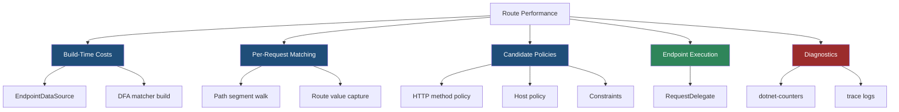
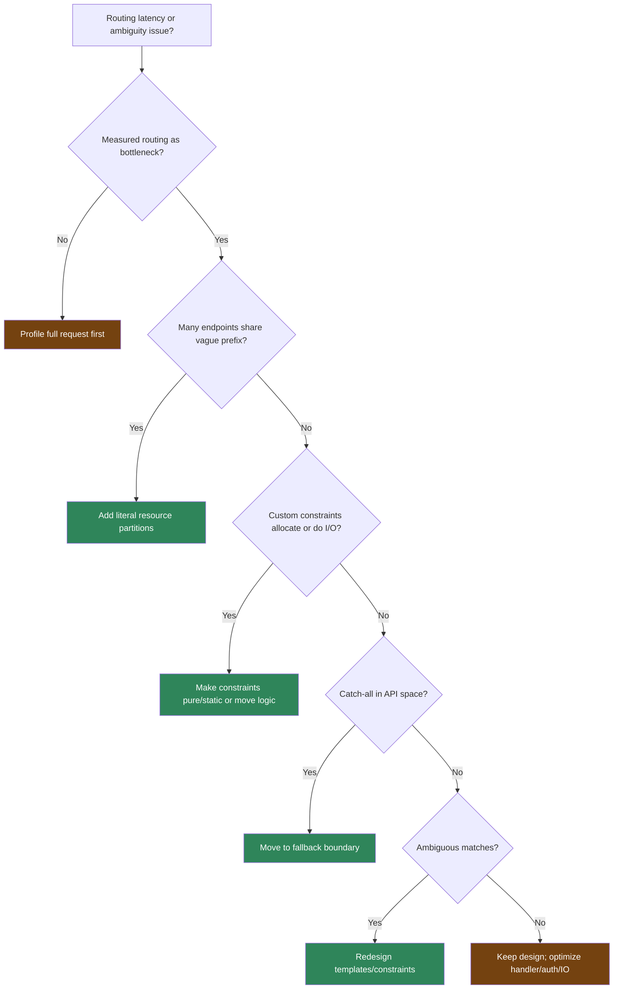

> [!success] Mastery Check
> - [ ] **Studied Well**
> - [ ] **Can explain the concept without notes**
> - [ ] **Can answer interview questions confidently**
> - [ ] **Can implement it in a real project**


# 4.075 - Route Performance: Trie-Based Matching and Route Cache

---

## PART 0 - Navigation & Context

### Where This Topic Lives

```
ASP.NET Core Mastery
├── Routing
│   ├── 4.064  Endpoint Routing
│   ├── 4.068  Route Precedence
│   ├── 4.075  YOU ARE HERE - route performance
│   └── 4.352  Source-Generated Route Dispatcher
└── Observability
    ├── 4.267  Load Testing
    └── 4.298  DiagnosticSource
```

### What You Need Before This

- **[[4.064 - Endpoint Routing: The Modern Routing Architecture]]** - the matcher selects endpoints before policy middleware.
- **[[4.065 - Route Templates: Syntax, Literals, Parameters, and Wildcards]]** - template shape determines matcher graph complexity.
- **[[4.068 - Route Order and Precedence: How Conflicts Are Resolved]]** - precedence and candidate selection affect runtime work.

### What This Unlocks After

- **[[4.267 - Load Testing ASP.NET Core: k6, NBomber, and BenchmarkDotNet]]** - measure routing in the full HTTP stack.
- **[[4.340 - Request Delegate Compilation: How MapGet Becomes a RequestDelegate]]** - after routing, endpoint delegates execute.
- **[[4.352 - ASP.NET Core Internals: Source-Generated Route Dispatcher Deep Dive]]** - route dispatch internals at expert depth.

### Why This Matters at Scale

Routing is usually not your bottleneck, but route shape can still decide P99 behavior in gateways, large monoliths, and services with thousands of endpoints or expensive custom constraints.

---

## PART 1 - The Core Mental Model

### The Fundamental Rule

> **ASP.NET Core pays most route-matcher cost at startup by building a DFA-style matcher; the practical consequence is that per-request routing is fast unless your endpoint graph creates many candidates or expensive policies.**

### The Plain-Language Analogy

The routing system pre-builds a road map before traffic starts. Literal paths are highways with clear signs. Parameters are exits that need labels checked. Constraints are toll booths that inspect the vehicle. Most cars move quickly, but if you build too many vague roads into the same intersection, every car has to wait while the system decides which road is valid.

### The Taxonomy Diagram



---

## PART 2 - Deep Mechanics

### 2.1 Endpoint Data Sources Are Built Before Traffic

```
Startup:
MapGet/MapControllers/MapHub
  -> EndpointDataSource
  -> RouteEndpoint list
  -> Matcher factory builds DFA-like graph
```

```csharp
app.MapGet("/api/orders/{orderId:int}", (int orderId) => Results.Ok(new { orderId }));
app.MapGet("/api/orders/pending", () => Results.Ok());
```

ASP.NET Core internally: endpoint data sources expose route endpoints. `DataSourceDependentMatcher` rebuilds the matcher when data source change tokens fire.

**Runtime cost:** startup memory and CPU; per-request route table scanning is avoided.

**Edge case:** Dynamic endpoint data sources can invalidate matcher caches. Rare in typical apps, important in plugin/gateway architectures.

### 2.2 Matching Walks Path Shape, Not Every Endpoint

```
/api/orders/42
  segment api    -> literal node
  segment orders -> literal node
  segment 42     -> parameter/constrained candidate
  policies       -> method/host/constraint filtering
```

```http
// HTTP wire format:
GET /api/orders/42 HTTP/1.1
HTTP/1.1 200 OK
```

ASP.NET Core source behavior: the DFA matcher narrows candidates by path segments, then endpoint selector policies evaluate remaining candidates.

**Runtime cost:** roughly O(number of path segments + remaining candidate policies), not O(total endpoints).

**Edge case:** Many endpoints with the same prefix and vague parameter shapes increase candidate count at the leaf.

### 2.3 Constraints and Regex Can Dominate Routing Cost

```
---> Routing
     candidate path match
     regex constraint
     custom constraint
---> Auth
```

```csharp
app.MapGet("/api/catalog/{slug:regex(^[a-z0-9-]{1,80}$)}", (string slug) =>
    Results.Ok(new { slug }));
```

**Runtime cost:** regex evaluation per constrained candidate. A compiled/source-generated regex is cheap; catastrophic regex patterns are not.

**Edge case:** Route regex should validate shape only. Complex domain parsing belongs in binding or validation where you can return intentional `400`.

### 2.4 Performance Bugs Often Look Like Correctness Bugs First

```
Ambiguous/vague graph:
/api/{tenant}/{resource}/{id}
/api/{region}/{module}/{key}
/api/{*path}
```

```http
// HTTP wire format:
GET /api/us/orders/42 HTTP/1.1
HTTP/1.1 500 Internal Server Error
// body from exception handler if ambiguity remains
```

ASP.NET Core source behavior: if multiple valid candidates remain with equal priority, selector throws `AmbiguousMatchException`. That is an exception allocation plus a production failure, not just a slow route.

**Runtime cost:** exception path is expensive and noisy.

**Edge case:** Route performance tuning starts with clearer URL design, not micro-optimizing handlers.

---

## PART 3 - Production Code Patterns

### Pattern 1: The Literal Prefix Partition

```csharp
// Domain scenario: commerce platform.
app.MapGroup("/api/orders").MapGet("/{orderId:int}", (int orderId) => Results.Ok());
app.MapGroup("/api/inventory").MapGet("/{sku}", (string sku) => Results.Ok());
app.MapGroup("/api/payments").MapGet("/{paymentId:guid}", (Guid paymentId) => Results.Ok());
```

```http
// HTTP wire format:
GET /api/orders/42 HTTP/1.1
HTTP/1.1 200 OK
```

### Pattern 2: The Constrained Hot Path

```csharp
// Domain scenario: payment API.
app.MapGet("/api/payments/{paymentId:guid}", (Guid paymentId) => Results.Ok(new { paymentId }));
```

### Pattern 3: The Regex Budget

```csharp
// Domain scenario: catalog slug.
app.MapGet("/api/products/{slug:regex(^[a-z0-9]+(?:-[a-z0-9]+)*$)}",
    (string slug) => Results.Ok(new { slug }));
```

### Pattern 4: The Fallback Boundary

```csharp
// Domain scenario: web app plus API.
app.MapControllers();
app.Map("/api/{**path}", api => api.Run(ctx =>
{
    ctx.Response.StatusCode = 404;
    return ctx.Response.WriteAsJsonAsync(new { error = "API route not found." });
}));
app.MapFallbackToFile("index.html");
```

### Pattern 5: The Route Logging Switch

```json
{
  "Logging": {
    "LogLevel": {
      "Microsoft.AspNetCore.Routing": "Trace"
    }
  }
}
```

**Cost label:** trace logging is expensive and should be temporary in production diagnostics.

---

## PART 4 - Gotchas & Anti-Patterns

### Gotcha 1: Blaming Routing Before Measuring

Routing is rarely slower than JSON, auth, or database I/O.

```csharp
// ⚠️ WRONG CODE
// Refactor all routes because P99 is high.

// HTTP consequence (wrong path):
// P99 remains high if the real cost is SQL or downstream HTTP.

// ✅ CORRECT CODE
// Use dotnet-trace, dotnet-counters, and request timing to isolate routing.

// HTTP consequence (correct path):
// Optimization targets the stage actually causing latency.

// WHY: endpoint routing is designed to avoid per-request full table scans.
```

### Gotcha 2: Huge Vague Prefixes

Broad parameter prefixes create larger candidate sets.

```csharp
// ⚠️ WRONG CODE
app.MapGet("/api/{a}/{b}/{c}", () => Results.Ok());
app.MapGet("/api/{x}/{y}/{z}", () => Results.Ok());

// HTTP consequence (wrong path):
// AmbiguousMatchException for matching shapes.

// ✅ CORRECT CODE
app.MapGet("/api/orders/{orderId:int}", () => Results.Ok());
app.MapGet("/api/products/{productId:int}", () => Results.Ok());

// HTTP consequence (correct path):
// Literal partitions narrow the matcher quickly.

// WHY: template shape determines candidate narrowing.
```

### Gotcha 3: Allocating Regex Per Match

The regex can cost more than routing.

```csharp
// ⚠️ WRONG CODE
public bool Match(...) => new Regex("^[A-Z]+$").IsMatch(value);

// HTTP consequence (wrong path):
// High allocations on hot routing path.

// ✅ CORRECT CODE
private static readonly Regex Pattern = new("^[A-Z]+$", RegexOptions.Compiled);
public bool Match(...) => Pattern.IsMatch(value);

// HTTP consequence (correct path):
// Same routing result with much lower allocation pressure.

// WHY: constraints run during route candidate filtering.
```

### Gotcha 4: Letting Catch-All Compete With API Routes

Catch-all routes increase uncertainty.

```csharp
// ⚠️ WRONG CODE
app.MapGet("/api/{**path}", (string path) => Results.Ok(path));

// HTTP consequence (wrong path):
// API misses become 200 OK and route metrics lie.

// ✅ CORRECT CODE
app.Map("/api/{**path}", api => api.Run(ctx =>
{
    ctx.Response.StatusCode = 404;
    return Task.CompletedTask;
}));

// HTTP consequence (correct path):
// Unknown API paths remain 404.

// WHY: fallback should be a miss handler, not a competing business endpoint.
```

### Gotcha 5: Leaving Routing Trace Logs On

Trace logs are a diagnostic tool, not a normal setting.

```json
// ⚠️ WRONG CODE
"Microsoft.AspNetCore.Routing": "Trace"

// HTTP consequence (wrong path):
// High log volume, noisy P99, possible sensitive route value exposure.

// ✅ CORRECT CODE
"Microsoft.AspNetCore.Routing": "Warning"

// HTTP consequence (correct path):
// Normal traffic avoids heavy diagnostic logging.

// WHY: route tracing emits detailed matcher decisions per request.
```

---

## PART 5 - Performance Implications

### Request Pipeline Characteristics Table

| Scenario | Pipeline Depth | Allocations Per Request | Approx Latency Impact | Recommendation |
|---|---:|---:|---:|---|
| Literal route | Routing | ~0 | Very low | Prefer for fixed paths |
| Parameter route | Routing | route value capture | Low | Fine |
| Constrained parameter | Routing | constraint dependent | Low-medium | Use cheap constraints |
| Regex constraint | Routing | regex dependent | Medium | Compile/source-generate |
| Ambiguous route | Exception path | exception allocation | High | Fix design |
| Thousands of endpoints | Routing | low per request | Low-medium | Partition prefixes |
| Dynamic data source | Matcher rebuild | rebuild allocation | Startup/runtime spike | Use carefully |
| Trace routing logs | Logging | many strings | High | Temporary only |

### BenchmarkDotNet Code

```csharp
using BenchmarkDotNet.Attributes;
using System.Text.RegularExpressions;

[MemoryDiagnoser]
public sealed class RouteShapeCostBenchmarks
{
    private static readonly Regex CompiledSlug = new("^[a-z0-9-]{1,80}$", RegexOptions.Compiled);
    private const string Segment = "winter-sale-2026";

    [Benchmark] public bool NaiveRegexConstraint() => new Regex("^[a-z0-9-]{1,80}$").IsMatch(Segment);
    [Benchmark] public bool CompiledRegexConstraint() => CompiledSlug.IsMatch(Segment);
    [Benchmark] public bool SimpleCharLoop()
    {
        foreach (var ch in Segment)
        {
            if (!(char.IsAsciiLetterLower(ch) || char.IsDigit(ch) || ch == '-')) return false;
        }
        return true;
    }
}

// Expected output (approximate, .NET 8, x64, local):
// Naive regex allocates heavily.
// Compiled regex is much cheaper.
// Simple char loop can be fastest for simple shapes.
```

### When This Costs You

API gateways, multi-tenant monoliths with thousands of endpoints, dynamic route data sources, expensive custom constraints, and high-cardinality fallback routing.

### When This Doesn't Matter

Small services, normal MVC apps, and endpoints dominated by authentication, database, serialization, or downstream HTTP calls.

---

## PART 6 - Interview Arsenal

### A. The Question Bank

**Question:** "Is ASP.NET Core routing O(number of endpoints)?"

**Average Answer:** "I think it checks routes in order."

**Why That's Insufficient:** It misses endpoint routing internals.

> **Great Answer:** "Modern endpoint routing builds a matcher at startup, roughly a DFA over path segments. At request time it walks the path shape and evaluates policies on the remaining candidate set. So the cost is not a naive scan of every endpoint, but vague route shapes and expensive constraints can still increase candidate work."

**Question:** "How do you optimize routing in a large API?"

**Average Answer:** "Put common routes first."

**Why That's Insufficient:** Source order is not the main lever.

> **Great Answer:** "I start with URL shape: literal resource prefixes, typed constraints, no broad catch-alls in API space, and unique named routes. Then I measure with routing logs or tracing. If P99 is high, I prove routing is the bottleneck before touching it because auth, JSON, EF, and outbound calls usually dominate."

**Question:** "What routing choices cause allocations?"

**Average Answer:** "Parameters allocate."

**Why That's Insufficient:** It is too vague.

> **Great Answer:** "Simple route value capture is cheap. The bigger allocation risks are custom constraints that allocate per match, regex construction, exception paths from ambiguity, and trace logging. I keep constraints stateless and use static or source-generated regex for hot patterns."

### B. The Trick Questions

| Question | Trap | Correct Answer |
|---|---|---|
| Does route order optimize Minimal APIs? | Old route table thinking | Usually no; shape matters more. |
| Is routing usually the bottleneck? | Premature optimization | Usually no; measure first. |
| Do catch-alls improve performance? | One handler idea | They can hide errors and increase ambiguity. |
| Are regex constraints free? | Syntax-only view | No, regex cost depends on implementation. |

### C. Red Flags to Avoid

- "ASP.NET Core scans all routes in order." - outdated mental model.
- "Routing is probably the bottleneck." - measure first.
- "Regex constraints are harmless." - can be expensive.
- "Catch-all reduces route complexity." - often false operationally.
- "Trace logging can stay enabled." - high-volume risk.

---

## PART 7 - Decision Framework



---

## PART 8 - Self-Check

### A. Conceptual Questions

1. Why is endpoint routing not a simple route-table scan?
2. What happens to the HTTP request if equal-priority candidates remain?
3. Why do literal prefixes improve matcher narrowing?
4. What operations in routing can allocate heavily?
5. Why should route performance be measured in full HTTP tests?
6. How can dynamic endpoint data sources affect matcher caches?
7. Why are catch-all API routes a performance and correctness smell?
8. What is the cost difference between startup route building and per-request matching?

### B. Code Puzzles

```csharp
app.MapGet("/api/{a}/{b}", () => "one");
app.MapGet("/api/{x}/{y}", () => "two");
```

<details><summary>Answer</summary>
A matching request can produce `AmbiguousMatchException`. The shapes are equivalent; parameter names do not matter.
</details>

```csharp
public bool Match(...) => new Regex("^[A-Z]+$").IsMatch(value);
```

<details><summary>Answer</summary>
This allocates a regex during routing. Use a static compiled or source-generated regex.
</details>

```json
"Microsoft.AspNetCore.Routing": "Trace"
```

<details><summary>Answer</summary>
Useful temporarily, dangerous permanently. It can produce high log volume and affect latency.
</details>

```csharp
app.MapGet("/api/{**path}", (string path) => Results.Ok(path));
```

<details><summary>Answer</summary>
This makes unknown API routes return 200 and hides misses. Prefer a fallback that returns 404 for API paths.
</details>

---

## PART 9 - Connections & Resources

### A. Related Topics Table

| Topic | Why It Connects |
|---|---|
| [[4.064 - Endpoint Routing: The Modern Routing Architecture]] | Route performance starts with how endpoint routing matches candidates. |
| [[4.068 - Route Order and Precedence: How Conflicts Are Resolved]] | Precedence determines final candidate selection. |
| [[4.072 - Custom Route Constraints: IRouteConstraint Implementation]] | Custom constraints are common routing hot-path costs. |
| [[4.267 - Load Testing ASP.NET Core: k6, NBomber, and BenchmarkDotNet]] | Full HTTP load tests reveal whether routing matters. |
| [[4.298 - DiagnosticSource and DiagnosticListener: The ASP.NET Core Event Bus]] | Diagnostics help isolate routing from handler latency. |

### B. Books

| Book | Chapters | Why These Chapters |
|---|---|---|
| *ASP.NET Core in Action* | Endpoint routing | Practical explanation of route matching behavior. |
| *Pro ASP.NET Core* | URL routing | Useful for understanding route table shape and constraints. |

### C. Essential Articles & Docs

- [Microsoft Docs - Routing in ASP.NET Core](https://learn.microsoft.com/en-us/aspnet/core/fundamentals/routing)
- [ASP.NET Core source - Routing](https://github.com/dotnet/aspnetcore/tree/main/src/Http/Routing)
- [Microsoft Docs - Performance best practices in ASP.NET Core](https://learn.microsoft.com/en-us/aspnet/core/performance/performance-best-practices)
- [Microsoft Docs - dotnet-trace](https://learn.microsoft.com/en-us/dotnet/core/diagnostics/dotnet-trace)

### D. Template Meta-Note

> [!NOTE]
> **Part 0** orients the topic. **Part 1** gives the mental model. **Part 2** shows framework mechanics. **Part 3** gives production patterns. **Part 4** names gotchas. **Part 5** covers performance. **Part 6** prepares interviews. **Part 7** gives decisions. **Part 8** checks understanding. **Part 9** connects resources.
