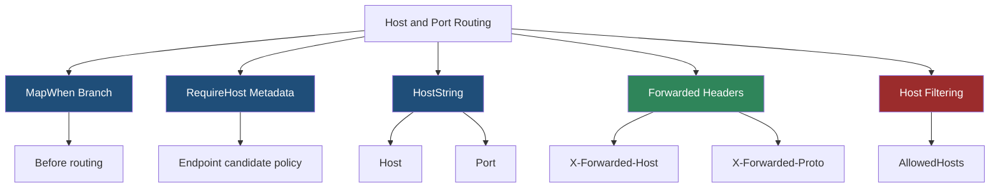
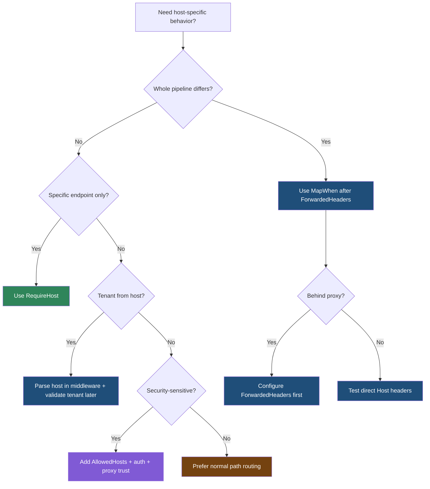

> [!success] Mastery Check
> - [ ] **Studied Well**
> - [ ] **Can explain the concept without notes**
> - [ ] **Can answer interview questions confidently**
> - [ ] **Can implement it in a real project**


# 4.076 - Host and Port Routing: MapWhen with HostString Matching

---

## PART 0 - Navigation & Context

### Where This Topic Lives

```
ASP.NET Core Mastery
├── Middleware
│   └── 4.051  MapWhen / UseWhen Branching
├── Routing
│   ├── 4.064  Endpoint Routing
│   └── 4.076  YOU ARE HERE - host and port routing
└── Deployment
    └── 4.329  X-Forwarded Headers
```

### What You Need Before This

- **[[4.051 - Short-Circuiting and Pipeline Branching: Map, MapWhen, UseWhen]]** - host matching can branch the middleware pipeline before endpoint routing.
- **[[4.064 - Endpoint Routing: The Modern Routing Architecture]]** - endpoint host metadata can also select candidates.
- **[[4.329 - Reverse Proxy Configuration: X-Forwarded Headers Middleware]]** - proxies affect `Request.Host` and generated links.

### What This Unlocks After

- **[[4.207 - Rate Limiting Layered with Auth: Per-Tenant API Quotas]]** - host names often represent tenants or products.
- **[[4.208 - HTTPS Enforcement: UseHttpsRedirection, HSTS, and Kestrel TLS]]** - host routing depends on correct public scheme/host.
- **[[4.345 - YARP: Gateway Patterns in ASP.NET Core]]** - reverse proxies perform host-based routing at the gateway layer.

### Why This Matters at Scale

Host-based routing separates tenants, admin surfaces, and product APIs, but trusting the wrong host header or branching before forwarded headers can route traffic to the wrong security boundary.

---

## PART 1 - The Core Mental Model

### The Fundamental Rule

> **Host and port routing uses the request host as a selection signal before or during endpoint routing; the practical consequence is that proxy normalization and host filtering must happen before security-sensitive host decisions.**

### The Plain-Language Analogy

The URL path is the room number, but the host is the building. `/login` in the admin building is not the same as `/login` in the public building. A reverse proxy is the front desk that forwards visitors through internal doors; if it does not pass the original building name correctly, your app may make decisions based on the hallway it sees, not the building the user entered.

### The Taxonomy Diagram



---

## PART 2 - Deep Mechanics

### 2.1 `MapWhen` Branches Before Endpoint Routing

```
---> ForwardedHeaders ---> MapWhen(host == admin.example.com)
                         ├── true: admin branch -> auth -> admin endpoints
                         └── false: next -> public routing
```

```csharp
app.MapWhen(
    ctx => string.Equals(ctx.Request.Host.Host, "admin.example.com", StringComparison.OrdinalIgnoreCase),
    admin =>
    {
        admin.UseAuthentication();
        admin.UseAuthorization();
        admin.Run(ctx => ctx.Response.WriteAsync("admin branch"));
    });
```

```http
// HTTP wire format:
GET / HTTP/1.1
Host: admin.example.com
HTTP/1.1 200 OK
```

ASP.NET Core internally: `MapWhenMiddleware` evaluates the predicate and either invokes the branch pipeline or the next middleware. If the branch does not call back, it short-circuits the main pipeline.

**Runtime cost:** one predicate per request plus branch pipeline; cheap, but correctness-sensitive.

**Edge case:** If `UseForwardedHeaders` must rewrite host, it must run before host-based branching.

### 2.2 Endpoint Host Metadata Filters Candidates

```
---> Routing
     path candidates match
     host policy checks RequireHost metadata
     host mismatch -> candidate removed
---> Endpoint
```

```csharp
app.MapGet("/health", () => Results.Ok("admin health"))
   .RequireHost("admin.example.com");
```

```http
// HTTP wire format:
GET /health HTTP/1.1
Host: public.example.com
HTTP/1.1 404 Not Found
```

ASP.NET Core source behavior: host matching is an endpoint selector policy. It filters route candidates based on host metadata after path matching.

**Runtime cost:** host comparison over remaining candidates.

**Edge case:** Host mismatch is a route miss, commonly `404`, not `403`. Use auth if the endpoint exists but access is denied.

### 2.3 Port Is Part of `HostString`

```
Request.Host = "api.example.com:8443"
HostString.Host = "api.example.com"
HostString.Port = 8443
```

```csharp
app.MapWhen(ctx =>
{
    var host = ctx.Request.Host;
    return host.Host.Equals("api.example.com", StringComparison.OrdinalIgnoreCase)
        && host.Port == 8443;
}, branch =>
{
    branch.Run(ctx => ctx.Response.WriteAsync("private port"));
});
```

**Runtime cost:** one string comparison and nullable int comparison.

**Edge case:** Behind a proxy, Kestrel may see the proxy's internal port. Do not use port-based branching unless deployment makes it reliable.

### 2.4 Host Headers Are Security-Sensitive

```
Client Host header
---> Host filtering / forwarded headers
---> host-based routing decision
---> auth / endpoint
```

```csharp
builder.WebHost.UseKestrel();
builder.Configuration["AllowedHosts"] = "api.example.com;admin.example.com";
```

**Runtime cost:** host filter comparison per request.

**Edge case:** Host headers can be spoofed by direct clients. In production, combine allowed hosts, trusted proxies, TLS/SNI, and external gateway rules.

---

## PART 3 - Production Code Patterns

### Pattern 1: The Forwarded-Header First Branch

```csharp
// Domain scenario: SaaS admin portal behind Nginx.
app.UseForwardedHeaders();

app.MapWhen(ctx => ctx.Request.Host.Host.Equals("admin.example.com", StringComparison.OrdinalIgnoreCase),
    admin =>
    {
        admin.UseAuthentication();
        admin.UseAuthorization();
        admin.Run(ctx => ctx.Response.WriteAsync("admin"));
    });
```

```http
// HTTP wire format:
GET / HTTP/1.1
X-Forwarded-Host: admin.example.com
HTTP/1.1 200 OK
```

### Pattern 2: The Endpoint Host Gate

```csharp
// Domain scenario: internal operations health endpoint.
app.MapGet("/ops/health", () => Results.Ok(new { status = "ok" }))
   .RequireHost("ops.example.com")
   .RequireAuthorization("OpsOnly");
```

### Pattern 3: The Tenant Host Parser

```csharp
// Domain scenario: multi-tenant storefront.
app.Use(async (ctx, next) =>
{
    var host = ctx.Request.Host.Host;
    if (host.EndsWith(".shop.example.com", StringComparison.OrdinalIgnoreCase))
    {
        ctx.Items["TenantSlug"] = host[..^".shop.example.com".Length];
    }

    await next();
});
```

### Pattern 4: The Host Filter Configuration

```json
{
  "AllowedHosts": "api.example.com;admin.example.com;ops.example.com"
}
```

### Pattern 5: The Port Guard for Local-Only Tools

```csharp
// Domain scenario: local diagnostics endpoint.
app.MapWhen(ctx => ctx.Request.Host.Port == 5005, diagnostics =>
{
    diagnostics.Run(ctx => ctx.Response.WriteAsync("diagnostics"));
});
```

**Cost label:** host/port checks are cheap; the risk is trusting incorrect deployment metadata.

---

## PART 4 - Gotchas & Anti-Patterns

### Gotcha 1: Branching Before Forwarded Headers

The app sees the proxy host, not the public host.

```csharp
// ⚠️ WRONG CODE
app.MapWhen(ctx => ctx.Request.Host.Host == "admin.example.com", admin => { });
app.UseForwardedHeaders();

// HTTP consequence (wrong path):
// Admin host request may miss branch because Request.Host is internal.

// ✅ CORRECT CODE
app.UseForwardedHeaders();
app.MapWhen(ctx => ctx.Request.Host.Host == "admin.example.com", admin => { });

// HTTP consequence (correct path):
// Host-based branch uses normalized public host.

// WHY: forwarded headers mutate request scheme/host before downstream middleware reads them.
```

### Gotcha 2: Treating Host Routing as Authorization

Host mismatch and authorization failure are different.

```csharp
// ⚠️ WRONG CODE
app.MapGet("/admin", () => "secret").RequireHost("admin.example.com");

// HTTP consequence (wrong path):
// Anyone who can send Host: admin.example.com may reach it if no auth exists.

// ✅ CORRECT CODE
app.MapGet("/admin", () => "secret")
   .RequireHost("admin.example.com")
   .RequireAuthorization("AdminOnly");

// HTTP consequence (correct path):
// Wrong host -> 404; wrong user -> 401/403.

// WHY: host metadata selects endpoint candidates; auth enforces identity and permission.
```

### Gotcha 3: Comparing `Request.Host.Value` Naively

Ports and casing matter.

```csharp
// ⚠️ WRONG CODE
ctx.Request.Host.Value == "api.example.com"

// HTTP consequence (wrong path):
// api.example.com:443 fails the branch unexpectedly.

// ✅ CORRECT CODE
ctx.Request.Host.Host.Equals("api.example.com", StringComparison.OrdinalIgnoreCase)

// HTTP consequence (correct path):
// Host comparison ignores port unless port is intentionally checked.

// WHY: HostString separates host and port.
```

### Gotcha 4: Missing Allowed Hosts

Direct host header spoofing can affect generated links and routing.

```json
// ⚠️ WRONG CODE
{ "AllowedHosts": "*" }

// HTTP consequence (wrong path):
// App accepts arbitrary Host headers in direct traffic.

// ✅ CORRECT CODE
{ "AllowedHosts": "api.example.com;admin.example.com" }

// HTTP consequence (correct path):
// Unexpected host is rejected by host filtering.

// WHY: host headers are client-provided unless constrained by trusted infrastructure.
```

### Gotcha 5: Port Routing Behind Load Balancers

The app may not see public ports.

```csharp
// ⚠️ WRONG CODE
app.MapWhen(ctx => ctx.Request.Host.Port == 443, secure => { });

// HTTP consequence (wrong path):
// Behind a proxy Kestrel may see 8080, so branch fails.

// ✅ CORRECT CODE
app.UseForwardedHeaders();
app.MapWhen(ctx => ctx.Request.Scheme == "https", secure => { });

// HTTP consequence (correct path):
// Branch uses normalized public scheme.

// WHY: load balancers often terminate TLS and forward to internal ports.
```

---

## PART 5 - Performance Implications

### Request Pipeline Characteristics Table

| Scenario | Pipeline Depth | Allocations Per Request | Approx Latency Impact | Recommendation |
|---|---:|---:|---:|---|
| Simple host compare | Branch middleware | ~0 | Very low | Fine |
| `RequireHost` endpoint | Routing policy | ~0 | Low | Prefer for endpoint-specific host |
| `MapWhen` branch | Branch pipeline | predicate only | Low | Use for whole pipeline split |
| Forwarded headers | Early middleware | header parsing | Low | Required behind proxy |
| Host filtering | Early middleware | string compare | Low | Enable in production |
| Regex tenant host | Middleware | regex dependent | Medium | Prefer simple suffix parse |
| Port-based branch | Branch middleware | ~0 | Low | Avoid behind proxy |
| Misbranch to admin | Security failure | n/a | Critical | Test host routing |

### BenchmarkDotNet Code

```csharp
using BenchmarkDotNet.Attributes;

[MemoryDiagnoser]
public sealed class HostMatchingBenchmarks
{
    private const string Host = "tenant42.shop.example.com";

    [Benchmark] public bool OrdinalEquals() =>
        Host.Equals("admin.example.com", StringComparison.OrdinalIgnoreCase);

    [Benchmark] public bool SuffixTenant() =>
        Host.EndsWith(".shop.example.com", StringComparison.OrdinalIgnoreCase);

    [Benchmark] public string ExtractTenant() =>
        Host[..^".shop.example.com".Length];
}

// Expected output (approximate, .NET 8, x64, local):
// Simple comparisons are cheap; substring extraction allocates.
```

### When This Costs You

High-throughput multi-tenant host parsing, regex host extraction, per-request branch pipelines, and incorrect forwarded header processing that routes to the wrong handlers.

### When This Doesn't Matter

Small apps with one host, endpoint-level `RequireHost` on a few operations, and local-only diagnostics.

---

## PART 6 - Interview Arsenal

### A. The Question Bank

**Question:** "Where should forwarded headers run if you route by host?"

**Average Answer:** "Somewhere before routing."

**Why That's Insufficient:** It must be before any component reading scheme/host.

> **Great Answer:** "I put `UseForwardedHeaders` before host-based branching, auth redirects, link generation decisions, and routing that depends on host. Otherwise the app may use the internal proxy host and scheme. The HTTP symptom is wrong branch selection or `Location` headers pointing to internal addresses."

**Question:** "What is the difference between `MapWhen` host routing and `RequireHost`?"

**Average Answer:** "`MapWhen` is middleware and `RequireHost` is routing."

**Why That's Insufficient:** It needs pipeline consequence.

> **Great Answer:** "`MapWhen` branches the middleware pipeline before endpoint selection, so I use it when the entire pipeline differs by host. `RequireHost` attaches endpoint metadata used by routing policies, so I use it when only certain endpoints are host-specific. Host mismatch with `RequireHost` is a route miss, often 404, not an authorization decision."

**Question:** "Is host routing a security boundary?"

**Average Answer:** "Yes, if the host is admin."

**Why That's Insufficient:** Host headers can be spoofed.

> **Great Answer:** "Host routing is a selection boundary, not enough by itself. I combine trusted proxies, allowed host filtering, TLS/SNI or gateway rules, and authorization. The HTTP behavior I want is wrong host returns 404, unauthenticated admin user gets 401, and unauthorized user gets 403."

### B. The Trick Questions

| Question | Trap | Correct Answer |
|---|---|---|
| Does `Request.Host.Value` exclude port? | String assumption | No, use `Host` and `Port` properties. |
| Is `RequireHost` authorization? | Selection vs security | No, it filters candidates. |
| Can clients spoof Host? | Trust assumption | Direct clients can send Host; configure allowed hosts/proxy trust. |
| Is public port visible to Kestrel? | Proxy blindness | Not always behind load balancers. |

### C. Red Flags to Avoid

- "Host header is always trustworthy." - security risk.
- "Port routing works the same behind every proxy." - false.
- "RequireHost secures admin endpoints." - incomplete.
- "Forwarded headers can run late." - wrong for host decisions.
- "String compare `Host.Value` is enough." - port/case bugs.

---

## PART 7 - Decision Framework



---

## PART 8 - Self-Check

### A. Conceptual Questions

1. What happens to the HTTP request if `MapWhen` branch predicate returns true?
2. Why must forwarded headers run before host-based branching?
3. What status code can `RequireHost` mismatch produce?
4. Why is host routing not authorization?
5. How do `HostString.Host` and `HostString.Port` differ?
6. Why can port routing fail behind a load balancer?
7. What does `AllowedHosts` protect against?
8. When should you prefer `RequireHost` over `MapWhen`?

### B. Code Puzzles

```csharp
app.MapWhen(ctx => ctx.Request.Host.Host == "admin.example.com", admin => { });
app.UseForwardedHeaders();
```

<details><summary>Answer</summary>
The branch reads host before forwarded headers normalize it. Put `UseForwardedHeaders` first.
</details>

```csharp
app.MapGet("/admin", () => "secret").RequireHost("admin.example.com");
```

<details><summary>Answer</summary>
Wrong host usually gets 404, but correct host is not automatically authorized. Add auth metadata.
</details>

```csharp
ctx.Request.Host.Value == "api.example.com"
```

<details><summary>Answer</summary>
This can fail when the host includes a port. Use `Request.Host.Host` and compare ordinal-ignore-case.
</details>

```csharp
app.MapWhen(ctx => ctx.Request.Host.Port == 443, branch => { });
```

<details><summary>Answer</summary>
Behind TLS-terminating proxies, Kestrel may see an internal port such as 8080. Use forwarded scheme/host or gateway routing.
</details>

---

## PART 9 - Connections & Resources

### A. Related Topics Table

| Topic | Why It Connects |
|---|---|
| [[4.051 - Short-Circuiting and Pipeline Branching: Map, MapWhen, UseWhen]] | Host routing often uses middleware branch predicates. |
| [[4.064 - Endpoint Routing: The Modern Routing Architecture]] | `RequireHost` filters endpoint candidates during routing. |
| [[4.329 - Reverse Proxy Configuration: X-Forwarded Headers Middleware]] | Host decisions must use normalized public host values. |
| [[4.208 - HTTPS Enforcement: UseHttpsRedirection, HSTS, and Kestrel TLS]] | Scheme and host decisions interact with TLS termination. |
| [[4.154 - Authorization Architecture]] | Host selection must be paired with real authorization. |

### B. Books

| Book | Chapters | Why These Chapters |
|---|---|---|
| *ASP.NET Core in Action* | Middleware, routing, hosting | Explains branching and reverse proxy behavior. |
| *Pro ASP.NET Core* | Request pipeline and deployment | Covers host configuration and routing examples. |

### C. Essential Articles & Docs

- [Microsoft Docs - Routing in ASP.NET Core](https://learn.microsoft.com/en-us/aspnet/core/fundamentals/routing)
- [Microsoft Docs - Proxy and load balancer configuration](https://learn.microsoft.com/en-us/aspnet/core/host-and-deploy/proxy-load-balancer)
- [Microsoft Docs - Host filtering](https://learn.microsoft.com/en-us/aspnet/core/fundamentals/servers/kestrel/host-filtering)
- [ASP.NET Core source - Routing](https://github.com/dotnet/aspnetcore/tree/main/src/Http/Routing)

### D. Template Meta-Note

> [!NOTE]
> **Part 0** orients the topic. **Part 1** gives the mental model. **Part 2** shows framework mechanics. **Part 3** gives production patterns. **Part 4** names gotchas. **Part 5** covers performance. **Part 6** prepares interviews. **Part 7** gives decisions. **Part 8** checks understanding. **Part 9** connects resources.
