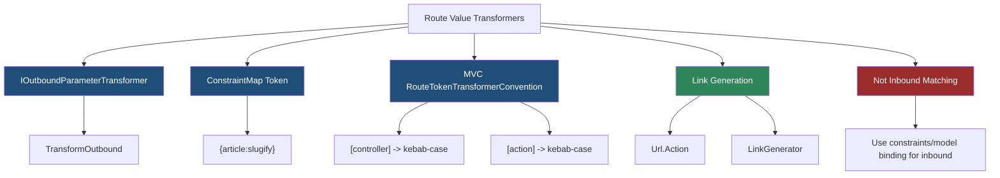
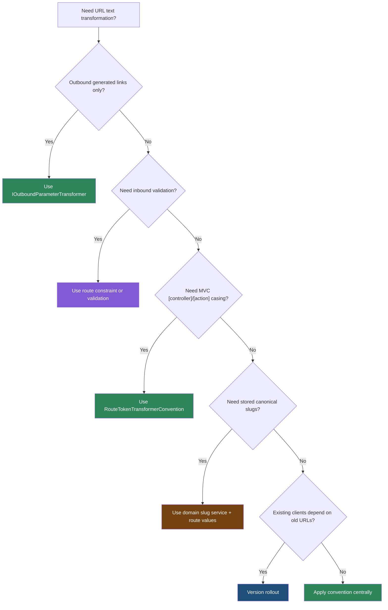

> [!success] Mastery Check
> - [ ] **Studied Well**
> - [ ] **Can explain the concept without notes**
> - [ ] **Can answer interview questions confidently**
> - [ ] **Can implement it in a real project**


# 4.077 - Route Value Transformers: IOutboundParameterTransformer

---

## PART 0 - Navigation & Context

### Where This Topic Lives

```
ASP.NET Core Mastery
└── Routing
    ├── 4.065  Route Templates
    ├── 4.067  Attribute Routing
    ├── 4.071  Link Generation
    └── 4.077  YOU ARE HERE - outbound transformers
```

### What You Need Before This

- **[[4.071 - Link Generation: IUrlHelper, LinkGenerator, and Named Routes]]** - transformers run during link generation.
- **[[4.067 - Attribute Routing on Controllers: [Route], [HttpGet], Token Replacement]]** - token transformer conventions are common with MVC attributes.
- **[[4.065 - Route Templates: Syntax, Literals, Parameters, and Wildcards]]** - transformers operate on route values used to fill templates.

### What This Unlocks After

- **[[4.085 - OpenAPI Integration: WithOpenApi(), Tags, and Summaries]]** - generated links and docs should agree on URL shape.
- **[[4.283 - REST API Design Conventions in ASP.NET Core]]** - slugified and kebab-case URLs are API contract decisions.
- **[[4.340 - Request Delegate Compilation: How MapGet Becomes a RequestDelegate]]** - transformer effects happen outside handler execution.

### Why This Matters at Scale

Outbound transformers enforce URL naming conventions centrally, preventing thousands of controller/action links from drifting into mixed casing, underscores, or client-visible implementation names.

---

## PART 1 - The Core Mental Model

### The Fundamental Rule

> **`IOutboundParameterTransformer` changes route values only during URL generation; the practical consequence is that it shapes generated links, not incoming request matching or handler binding.**

### The Plain-Language Analogy

A route value transformer is a label printer style. The warehouse record might say `MonthlyInvoiceReport`, but the public label prints `monthly-invoice-report`. It does not change what boxes arrive at the warehouse, and it does not validate that incoming labels are correct. It only controls how your app prints URLs when generating them.

### The Taxonomy Diagram



---

## PART 2 - Deep Mechanics

### 2.1 Transformers Run During URL Generation

```
Handler/controller
---> Url.Action / LinkGenerator
     route value: article = "MonthlyInvoiceReport"
     transformer: slugify
     generated segment: monthly-invoice-report
---> response link
```

```csharp
public sealed partial class SlugifyParameterTransformer : IOutboundParameterTransformer
{
    public string? TransformOutbound(object? value)
    {
        if (value is null) return null;
        return SlugRegex().Replace(value.ToString()!, "$1-$2").ToLowerInvariant();
    }

    [GeneratedRegex("([a-z])([A-Z])", RegexOptions.CultureInvariant)]
    private static partial Regex SlugRegex();
}
```

```http
// HTTP wire format:
HTTP/1.1 201 Created
Location: /blog/monthly-invoice-report
```

ASP.NET Core internally: link generation calls `TransformOutbound` on transformer policies configured in route patterns or conventions before building the URL string.

**Runtime cost:** one method call and string transformation per transformed value.

**Edge case:** Returning `null` can cause the generated link to fail if the segment is required.

### 2.2 Constraint Map Registers Transformer Tokens

```
RouteOptions.ConstraintMap["slugify"] = typeof(SlugifyParameterTransformer)
Template: /blog/{article:slugify}
```

```csharp
builder.Services.Configure<RouteOptions>(options =>
{
    options.ConstraintMap["slugify"] = typeof(SlugifyParameterTransformer);
});
```

**Runtime cost:** registration is startup; transformations happen only when links are generated.

**Edge case:** The route token name is shared with constraints. Pick a clear transformer token to avoid confusion.

### 2.3 MVC Token Transformer Convention Applies Globally

```
[controller] = SubscriptionReports
[action] = MonthlySummary
Convention -> subscription-reports/monthly-summary
```

```csharp
builder.Services.AddControllers(options =>
{
    options.Conventions.Add(
        new RouteTokenTransformerConvention(new SlugifyParameterTransformer()));
});
```

```csharp
[Route("api/[controller]")]
public sealed class SubscriptionReportsController : ControllerBase
{
    [HttpGet("[action]")]
    public IActionResult MonthlySummary() => Ok();
}
```

```http
// HTTP wire format:
GET /api/subscription-reports/monthly-summary HTTP/1.1
HTTP/1.1 200 OK
```

ASP.NET Core source behavior: MVC application model conventions rewrite route token replacements for attribute routes during endpoint creation.

**Runtime cost:** mostly startup; generated links also use transformed tokens.

**Edge case:** Existing clients may depend on old PascalCase URLs. This is a breaking API change.

### 2.4 Transformers Do Not Validate Incoming Routes

```
Incoming request:
/blog/MonthlyInvoiceReport
---> route matching sees path text
---> transformer is not an inbound validator
```

```csharp
app.MapGet("/blog/{article:slugify}", (string article) => Results.Ok(article));
```

**Runtime cost:** none for inbound transformation because this is not an inbound transformer.

**Edge case:** If you need inbound slug validation, use a route constraint or endpoint validation. `IOutboundParameterTransformer` alone does not enforce it.

---

## PART 3 - Production Code Patterns

### Pattern 1: The Central Slugifier

```csharp
// Domain scenario: public knowledge base API.
public sealed partial class SlugifyParameterTransformer : IOutboundParameterTransformer
{
    public string? TransformOutbound(object? value)
    {
        if (value is null) return null;
        return BoundaryRegex().Replace(value.ToString()!, "$1-$2").ToLowerInvariant();
    }

    [GeneratedRegex("([a-z])([A-Z])", RegexOptions.CultureInvariant)]
    private static partial Regex BoundaryRegex();
}
```

### Pattern 2: The MVC Kebab-Case Convention

```csharp
// Domain scenario: reporting API with controller attributes.
builder.Services.AddControllers(options =>
{
    options.Conventions.Add(
        new RouteTokenTransformerConvention(new SlugifyParameterTransformer()));
});
```

### Pattern 3: The Explicit Link Contract

```csharp
// Domain scenario: document publishing service.
app.MapGet("/articles/{slug}", (string slug) => Results.Ok(new { slug }))
   .WithName("Articles.GetBySlug");

app.MapPost("/articles", (LinkGenerator links, HttpContext ctx) =>
{
    var slug = "monthly-invoice-report";
    var location = links.GetUriByName(ctx, "Articles.GetBySlug", new { slug });
    return Results.Created(location!, new { slug });
});
```

### Pattern 4: The Transformer Plus Inbound Constraint

```csharp
// Domain scenario: catalog URLs.
builder.Services.Configure<RouteOptions>(options =>
{
    options.ConstraintMap["slugify"] = typeof(SlugifyParameterTransformer);
});

app.MapGet("/products/{slug:regex(^[a-z0-9]+(?:-[a-z0-9]+)*$)}",
    (string slug) => Results.Ok(new { slug }));
```

### Pattern 5: The Versioned Rollout

```csharp
// Domain scenario: old clients keep PascalCase; v2 emits kebab-case.
app.MapGroup("/api/v1").MapControllers();
app.MapGroup("/api/v2").MapControllers();
```

**Cost label:** transformers add string work when generating links; the bigger cost is API compatibility if URL casing changes unexpectedly.

---

## PART 4 - Gotchas & Anti-Patterns

### Gotcha 1: Expecting Transformers to Match Inbound URLs

Outbound means outbound.

```csharp
// ⚠️ WRONG CODE
app.MapGet("/blog/{article:slugify}", (string article) => Results.Ok());

// HTTP consequence (wrong path):
// Incoming bad slugs are not rejected by IOutboundParameterTransformer alone.

// ✅ CORRECT CODE
app.MapGet("/blog/{article:regex(^[a-z0-9]+(?:-[a-z0-9]+)*$)}",
    (string article) => Results.Ok());

// HTTP consequence (correct path):
// Bad slug shape -> 404 route miss.

// WHY: outbound transformers generate URL text; constraints validate route matching.
```

### Gotcha 2: Returning Null for Required Values

Null can break link generation.

```csharp
// ⚠️ WRONG CODE
public string? TransformOutbound(object? value) => null;

// HTTP consequence (wrong path):
// CreatedAtRoute may fail to produce Location.

// ✅ CORRECT CODE
public string? TransformOutbound(object? value) =>
    value is null ? null : Slugify(value.ToString()!);

// HTTP consequence (correct path):
// Non-null values generate route segments.

// WHY: required route parameters need generated segment text.
```

### Gotcha 3: Changing Public URLs Accidentally

Global conventions are breaking changes.

```csharp
// ⚠️ WRONG CODE
options.Conventions.Add(new RouteTokenTransformerConvention(new SlugifyParameterTransformer()));

// HTTP consequence (wrong path):
// /api/SubscriptionReports may become /api/subscription-reports.

// ✅ CORRECT CODE
// Introduce on a new API version or after compatibility review.

// HTTP consequence (correct path):
// Existing clients keep old URLs; v2 gets new convention.

// WHY: route token transformation changes public route templates.
```

### Gotcha 4: Allocating Heavy Regex Per Link

Generated links can be inside large response loops.

```csharp
// ⚠️ WRONG CODE
return new Regex("([a-z])([A-Z])").Replace(value.ToString()!, "$1-$2");

// HTTP consequence (wrong path):
// Collection responses allocate per link.

// ✅ CORRECT CODE
return BoundaryRegex().Replace(value.ToString()!, "$1-$2").ToLowerInvariant();

// HTTP consequence (correct path):
// Lower allocation during link-heavy responses.

// WHY: transformers run whenever a transformed link is generated.
```

### Gotcha 5: Mixing Slugification Rules

Two slugifiers create inconsistent URLs.

```csharp
// ⚠️ WRONG CODE
var slug = title.Replace(" ", "-");

// HTTP consequence (wrong path):
// Generated app links differ from stored canonical slugs.

// ✅ CORRECT CODE
var slug = slugService.ToCanonicalSlug(title);

// HTTP consequence (correct path):
// Links and persisted slugs agree.

// WHY: route value transformers should implement one shared public URL policy.
```

---

## PART 5 - Performance Implications

### Request Pipeline Characteristics Table

| Scenario | Pipeline Depth | Allocations Per Request | Approx Latency Impact | Recommendation |
|---|---:|---:|---:|---|
| No generated links | None | none | None | Transformer not involved |
| One `CreatedAtRoute` | Handler | one string transform | Low | Fine |
| Many HATEOAS links | Handler | many strings | Medium | Cache/limit links |
| MVC token convention | Startup | startup transformations | Low | Use deliberately |
| Naive regex per link | Handler | high | Medium-high | Static/source-generated |
| Transformer returns null | Handler | n/a | Correctness failure | Guard values |
| Inbound slug validation | Routing | constraint cost | Low-medium | Use constraints |
| Public URL migration | Clients | n/a | High compatibility risk | Version rollout |

### BenchmarkDotNet Code

```csharp
using BenchmarkDotNet.Attributes;
using System.Text.RegularExpressions;

[MemoryDiagnoser]
public sealed partial class SlugTransformerBenchmarks
{
    private const string Value = "MonthlyInvoiceReport";
    private static readonly Regex StaticRegex = new("([a-z])([A-Z])", RegexOptions.Compiled);

    [Benchmark] public string NaiveRegex() =>
        new Regex("([a-z])([A-Z])").Replace(Value, "$1-$2").ToLowerInvariant();

    [Benchmark] public string StaticCompiled() =>
        StaticRegex.Replace(Value, "$1-$2").ToLowerInvariant();

    [Benchmark] public string SourceGenerated() =>
        BoundaryRegex().Replace(Value, "$1-$2").ToLowerInvariant();

    [GeneratedRegex("([a-z])([A-Z])", RegexOptions.CultureInvariant)]
    private static partial Regex BoundaryRegex();
}

// Expected output (approximate, .NET 8, x64, local):
// NaiveRegex allocates most.
// StaticCompiled and SourceGenerated are much cheaper for link-heavy responses.
```

### When This Costs You

Large collection responses with generated links, HATEOAS-heavy APIs, and transformers using regex allocation or culture-sensitive operations repeatedly.

### When This Doesn't Matter

Single-resource creation responses, low-volume MVC apps, and APIs that do not generate many links.

---

## PART 6 - Interview Arsenal

### A. The Question Bank

**Question:** "What does `IOutboundParameterTransformer` do?"

**Average Answer:** "It slugifies routes."

**Why That's Insufficient:** It misses directionality.

> **Great Answer:** "It transforms route values during URL generation. For example, when `Url.Action` fills `[controller]`, a transformer can turn `SubscriptionReports` into `subscription-reports`. It does not validate incoming requests; if I need inbound slug rules, I add a route constraint or validation."

**Question:** "What is the risk of adding a global route token transformer?"

**Average Answer:** "It changes route names."

**Why That's Insufficient:** It changes public URLs, not just names.

> **Great Answer:** "It can change the public URL contract. Existing clients calling `/api/SubscriptionReports` may need `/api/subscription-reports`. I would roll that out under a new API version or test compatibility carefully because the HTTP client sees a different path."

**Question:** "Where does transformer cost show up?"

**Average Answer:** "At startup."

**Why That's Insufficient:** Link generation can run per request.

> **Great Answer:** "MVC route token convention work is mostly startup, but `TransformOutbound` can run whenever the app generates links. If a response includes hundreds of generated links, regex allocation in a transformer can show up in allocations and P99."

### B. The Trick Questions

| Question | Trap | Correct Answer |
|---|---|---|
| Does transformer reject incoming bad slugs? | Direction confusion | No, use constraints. |
| Can returning null break links? | Null is fine assumption | Yes, required segments may fail. |
| Is slugifying a breaking change? | Cosmetic thinking | Yes, URLs are contracts. |
| Does it affect `LinkGenerator`? | MVC-only thinking | Yes, during route value generation. |

### C. Red Flags to Avoid

- "Outbound transformers validate incoming paths." - false.
- "URL casing is not a breaking change." - often false.
- "Regex allocation in a transformer is harmless." - not for link-heavy responses.
- "Returning null is always fine." - can break required links.
- "Each team can define its own slug rules." - public URL inconsistency.

---

## PART 7 - Decision Framework



---

## PART 8 - Self-Check

### A. Conceptual Questions

1. What happens to an incoming request if a route only has an outbound transformer?
2. When does `TransformOutbound` run?
3. Why can global token transformation be a breaking change?
4. How does a transformer differ from a route constraint?
5. What happens if a transformer returns null for a required parameter?
6. Why does link-heavy API output make transformer performance matter?
7. How does `RouteTokenTransformerConvention` affect `[controller]` and `[action]`?
8. Why should slug rules be centralized?

### B. Code Puzzles

```csharp
app.MapGet("/blog/{article:slugify}", (string article) => Results.Ok());
```

<details><summary>Answer</summary>
The `slugify` outbound transformer does not reject incoming bad slugs by itself. Use a route constraint for inbound shape.
</details>

```csharp
public string? TransformOutbound(object? value) => null;
```

<details><summary>Answer</summary>
Required route values may fail to generate links because the transformer produced no segment text.
</details>

```csharp
options.Conventions.Add(new RouteTokenTransformerConvention(new SlugifyParameterTransformer()));
```

<details><summary>Answer</summary>
This can change public attribute-route URLs such as `[controller]` from PascalCase to kebab-case. Treat it as an API compatibility change.
</details>

```csharp
return new Regex("([a-z])([A-Z])").Replace(value.ToString()!, "$1-$2");
```

<details><summary>Answer</summary>
This allocates a regex per generated link. Use static compiled or source-generated regex.
</details>

---

## PART 9 - Connections & Resources

### A. Related Topics Table

| Topic | Why It Connects |
|---|---|
| [[4.071 - Link Generation: IUrlHelper, LinkGenerator, and Named Routes]] | Transformers run during link generation. |
| [[4.067 - Attribute Routing on Controllers: [Route], [HttpGet], Token Replacement]] | MVC token transformers affect attribute route token replacement. |
| [[4.065 - Route Templates: Syntax, Literals, Parameters, and Wildcards]] | Route values fill route templates before transformation. |
| [[4.085 - OpenAPI Integration: WithOpenApi(), Tags, and Summaries]] | Public URL shape must align with API documentation. |
| [[2.045 - Regular Expressions in C#]] | Regex choices affect transformer allocations. |

### B. Books

| Book | Chapters | Why These Chapters |
|---|---|---|
| *ASP.NET Core in Action* | Routing and controllers | Covers URL generation and route token conventions. |
| *Pro ASP.NET Core* | URL routing | Shows route parameters and link generation behavior. |

### C. Essential Articles & Docs

- [Microsoft Docs - Routing in ASP.NET Core](https://learn.microsoft.com/en-us/aspnet/core/fundamentals/routing)
- [Microsoft Docs - Routing to controller actions](https://learn.microsoft.com/en-us/aspnet/core/mvc/controllers/routing)
- [ASP.NET Core source - Routing abstractions](https://github.com/dotnet/aspnetcore/tree/main/src/Http/Routing)
- [Microsoft Docs - Regular expression source generators](https://learn.microsoft.com/en-us/dotnet/standard/base-types/regular-expression-source-generators)

### D. Template Meta-Note

> [!NOTE]
> **Part 0** orients the topic. **Part 1** gives the mental model. **Part 2** shows framework mechanics. **Part 3** gives production patterns. **Part 4** names gotchas. **Part 5** covers performance. **Part 6** prepares interviews. **Part 7** gives decisions. **Part 8** checks understanding. **Part 9** connects resources.
