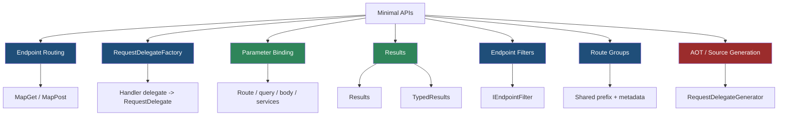
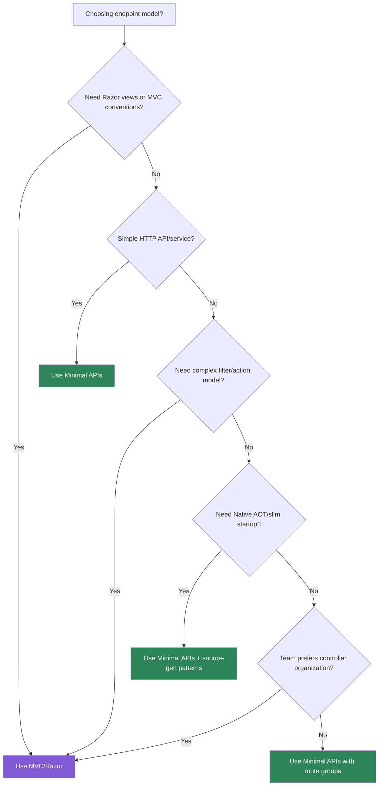

> [!success] Mastery Check
> - [ ] **Studied Well**
> - [ ] **Can explain the concept without notes**
> - [ ] **Can answer interview questions confidently**
> - [ ] **Can implement it in a real project**


# 4.078 - Minimal APIs: Why They Exist and When to Use Them

---

## PART 0 - Navigation & Context

### Where This Topic Lives

```
ASP.NET Core Mastery
├── Routing
│   └── 4.064  Endpoint Routing
├── Minimal APIs
│   ├── 4.078  YOU ARE HERE - why Minimal APIs exist
│   ├── 4.079  Defining Endpoints
│   ├── 4.080  Route Parameter Binding
│   ├── 4.082  IResult and TypedResults
│   └── 4.083  Endpoint Filters
└── MVC & Controllers
    └── 4.092  Minimal API vs MVC Decision Framework
```

### What You Need Before This

- **[[4.001 - The ASP.NET Core Request Pipeline: A Mental Model]]** - Minimal APIs are still endpoint delegates in the HTTP pipeline.
- **[[4.064 - Endpoint Routing: The Modern Routing Architecture]]** - `MapGet` creates endpoints consumed by routing.
- **Basic HTTP verbs and status codes** - Minimal APIs are a direct HTTP endpoint model.

### What This Unlocks After

- **[[4.079 - Defining Endpoints: MapGet, MapPost, MapPut, MapDelete]]** - the core API surface.
- **[[4.080 - Route Parameter Binding in Minimal APIs]]** - how handler parameters become values.
- **[[4.082 - IResult and TypedResults: Shaping HTTP Responses in Minimal APIs]]** - how responses are written to the wire.
- **[[4.083 - Minimal API Filters: IEndpointFilter Pipeline]]** - cross-cutting behavior inside endpoint execution.

### Why This Matters at Scale

Minimal APIs remove MVC action-model overhead when you need small, explicit, high-throughput HTTP endpoints, but they also move more contract discipline onto your route definitions, handlers, filters, and return types.

---

## PART 1 - The Core Mental Model

### The Fundamental Rule

> **A Minimal API maps an HTTP route directly to a generated `RequestDelegate`; the practical consequence is fewer framework layers between routing and your handler, with less automatic MVC behavior.**

### The Plain-Language Analogy

MVC is a full-service restaurant with host, waiter, menu rules, kitchen stations, and manager approvals. Minimal APIs are a focused counter-service kitchen: the customer order goes directly to the station built for that item. The counter can still have security, receipts, validation, and tracing, but you choose those pieces explicitly. If you forget a piece MVC usually gave you, the request will still move through the pipeline and expose the omission.

### The Taxonomy Diagram



---

## PART 2 - Deep Mechanics

### 2.1 Minimal APIs Are Endpoint Routing First

```
---> ExceptionHandler ---> Routing[select Minimal API endpoint] ---> Auth ---> Endpoint[generated delegate]
```

```csharp
app.MapGet("/api/orders/{orderId:int}", (int orderId) =>
    Results.Ok(new { orderId }));
```

```http
// HTTP wire format:
GET /api/orders/42 HTTP/1.1
HTTP/1.1 200 OK
Content-Type: application/json
```

ASP.NET Core internally: `MapGet` registers a `RouteEndpoint`. `RequestDelegateFactory` turns the handler lambda into a `RequestDelegate` that reads parameters, calls the handler, and writes the result.

**Runtime cost:** route matching plus generated delegate invocation; typically fewer MVC allocations.

**Edge case:** Minimal APIs do not automatically mean "no architecture." You still need feature organization, validation, auth, and response contracts.

### 2.2 Minimal APIs Skip MVC Action Model

```
MVC request:
Routing -> MVC action invoker -> model binding -> filters -> action result

Minimal API request:
Routing -> endpoint filters -> generated handler delegate -> IResult/write response
```

```csharp
var app = WebApplication.CreateSlimBuilder(args).Build(); // .NET 8+ slim builder for small APIs
```

ASP.NET Core source behavior: Minimal APIs do not build controller/action descriptors, controller instances, or MVC filter pipelines unless MVC is also registered.

**Runtime cost:** less startup and memory than MVC for simple APIs; handler binding/serialization still cost real work.

**Edge case:** You lose MVC conveniences such as automatic `[ApiController]` model validation unless you add equivalent filters/validation.

### 2.3 Metadata Still Drives Policy

```
---> Routing ---> AuthorizationMiddleware[reads endpoint metadata] ---> Endpoint
```

```csharp
var payments = app.MapGroup("/api/payments")
    .RequireAuthorization("Payments")
    .WithTags("Payments");

payments.MapGet("/{paymentId:guid}", (Guid paymentId) => Results.Ok(new { paymentId }));
```

```http
// HTTP wire format:
GET /api/payments/... HTTP/1.1
HTTP/1.1 401 Unauthorized
WWW-Authenticate: Bearer
```

ASP.NET Core internally: route groups and endpoint builders attach metadata. Authorization middleware reads it exactly like MVC endpoint metadata.

**Runtime cost:** metadata lookup is cheap; policy handlers may be expensive.

**Edge case:** `RequireAuthorization` does not enforce anything unless auth middleware is registered in the pipeline.

### 2.4 Minimal API Return Types Write the HTTP Response

```
Handler returns:
  object       -> JSON 200
  IResult      -> ExecuteAsync writes response
  TypedResults -> IResult + static metadata
```

```csharp
app.MapPost("/api/orders", (CreateOrder request) =>
{
    var orderId = 123;
    return TypedResults.Created($"/api/orders/{orderId}", new { orderId });
});

public sealed record CreateOrder(string Sku, int Quantity);
```

**Runtime cost:** result execution plus serialization; typed results improve OpenAPI metadata without changing HTTP body.

**Edge case:** Returning raw objects is convenient, but production APIs often need explicit status codes and error shapes.

---

## PART 3 - Production Code Patterns

### Pattern 1: The Thin Resource Endpoint

```csharp
// Domain scenario: order management service.
app.MapGet("/api/orders/{orderId:int}", async (int orderId, OrdersDb db) =>
{
    var order = await db.Orders.FindAsync(orderId);
    return order is null ? Results.NotFound() : Results.Ok(order);
})
.WithName("Orders.GetById")
.RequireAuthorization("Orders.Read");
```

```http
// HTTP wire format:
GET /api/orders/42 HTTP/1.1
HTTP/1.1 200 OK
```

### Pattern 2: The Feature Route Group

```csharp
// Domain scenario: inventory API.
var inventory = app.MapGroup("/api/inventory")
    .WithTags("Inventory")
    .RequireAuthorization("Inventory");

inventory.MapGet("/{sku}", (string sku) => Results.Ok(new { sku }));
inventory.MapPost("/", (CreateInventoryItem item) => Results.Created($"/api/inventory/{item.Sku}", item));

public sealed record CreateInventoryItem(string Sku, string Name);
```

### Pattern 3: The Explicit Result Contract

```csharp
// Domain scenario: payment capture endpoint.
app.MapPost("/api/payments/{paymentId:guid}/capture",
    Results<Accepted, NotFound, Conflict> (Guid paymentId) =>
    {
        return TypedResults.Accepted();
    });
```

### Pattern 4: The Validation Filter

```csharp
// Domain scenario: shipment creation.
app.MapPost("/api/shipments", (CreateShipment request) => Results.Accepted())
   .AddEndpointFilter(async (context, next) =>
   {
       var request = context.GetArgument<CreateShipment>(0);
       if (string.IsNullOrWhiteSpace(request.DestinationPostalCode))
       {
           return Results.ValidationProblem(new Dictionary<string, string[]>
           {
               ["destinationPostalCode"] = ["Destination postal code is required."]
           });
       }

       return await next(context);
   });

public sealed record CreateShipment(string DestinationPostalCode);
```

### Pattern 5: The MVC Escape Hatch

```csharp
// Domain scenario: public site plus API.
builder.Services.AddControllersWithViews();

app.MapGet("/api/health", () => Results.Ok("ok"));
app.MapControllers();
```

**Cost label:** mixing MVC and Minimal APIs is valid, but MVC services add startup/memory cost that pure Minimal API services avoid.

---

## PART 4 - Gotchas & Anti-Patterns

### Gotcha 1: Assuming Minimal Means Toy

Minimal APIs are a lower-ceremony endpoint model, not a lower-quality architecture.

```csharp
// ⚠️ WRONG CODE
app.MapPost("/orders", (Order order) => Save(order));

// HTTP consequence (wrong path):
// No auth, validation, named route, or explicit response contract.

// ✅ CORRECT CODE
app.MapPost("/api/orders", CreateOrder)
   .RequireAuthorization("Orders.Write")
   .WithName("Orders.Create")
   .Produces<CreateOrderResponse>(StatusCodes.Status201Created);

// HTTP consequence (correct path):
// Request passes policy and returns documented status codes.

// WHY: Minimal APIs remove ceremony, not production responsibilities.
```

### Gotcha 2: Expecting `[ApiController]` Behavior

Minimal APIs do not automatically run MVC model validation.

```csharp
// ⚠️ WRONG CODE
app.MapPost("/api/items", (CreateItem item) => Results.Ok(item));

// HTTP consequence (wrong path):
// Invalid domain values may still reach handler unless binding itself fails.

// ✅ CORRECT CODE
app.MapPost("/api/items", (CreateItem item) =>
    string.IsNullOrWhiteSpace(item.Sku)
        ? Results.ValidationProblem(new() { ["sku"] = ["Required."] })
        : Results.Ok(item));

// HTTP consequence (correct path):
// Invalid domain input -> 400 validation problem.

// WHY: model validation is an explicit concern in Minimal APIs.
```

### Gotcha 3: Adding Authorization Metadata Without Middleware

Metadata is not enforcement.

```csharp
// ⚠️ WRONG CODE
app.MapGet("/api/admin", () => "secret").RequireAuthorization();

// HTTP consequence (wrong path):
// If UseAuthorization is absent, the handler may run.

// ✅ CORRECT CODE
app.UseAuthentication();
app.UseAuthorization();
app.MapGet("/api/admin", () => "secret").RequireAuthorization();

// HTTP consequence (correct path):
// Anonymous request -> 401/403 before handler.

// WHY: authorization middleware reads endpoint metadata after routing.
```

### Gotcha 4: Returning Anonymous Objects Everywhere

Convenient responses can become unstable contracts.

```csharp
// ⚠️ WRONG CODE
app.MapGet("/api/orders/{id:int}", (int id) => new { id, status = "new" });

// HTTP consequence (wrong path):
// Always 200; hard to document alternate errors.

// ✅ CORRECT CODE
app.MapGet("/api/orders/{id:int}", Results<Ok<OrderDto>, NotFound> (int id) =>
    id == 42 ? TypedResults.Ok(new OrderDto(id, "new")) : TypedResults.NotFound());

// HTTP consequence (correct path):
// 200 or 404 is explicit.

// WHY: production APIs need stable status-code and schema contracts.
```

### Gotcha 5: Mixing Business Logic Into Program.cs

The file stays short only until the service grows.

```csharp
// ⚠️ WRONG CODE
app.MapPost("/api/payments", async (PaymentRequest r, PaymentsDb db) =>
{
    // 80 lines of payment orchestration here
});

// HTTP consequence (wrong path):
// Hard-to-test endpoint behavior and fragile error mapping.

// ✅ CORRECT CODE
app.MapPost("/api/payments", async (PaymentRequest r, PaymentService service) =>
{
    var result = await service.CreateAsync(r);
    return TypedResults.Created($"/api/payments/{result.Id}", result);
});

// HTTP consequence (correct path):
// Handler remains HTTP adapter; service owns business workflow.

// WHY: Minimal API handler is still the HTTP boundary, not the domain layer.
```

---

## PART 5 - Performance Implications

### Request Pipeline Characteristics Table

| Scenario | Pipeline Depth | Allocations Per Request | Approx Latency Impact | Recommendation |
|---|---:|---:|---:|---|
| Simple Minimal GET | Routing + endpoint | low | Very low | Good fit |
| MVC controller GET | Routing + MVC | higher | Low-medium | Use when MVC features matter |
| Minimal API with filters | Routing + filters | filter dependent | Low-medium | Use for validation/cross-cutting |
| Raw object return | serialization | JSON allocations | Medium | Fine for simple 200 |
| TypedResults | result execution | low | Low | Prefer for contracts |
| Auth policy | auth middleware | policy dependent | Medium | Cache policy data |
| Complex body binding | endpoint binding | body JSON cost | Medium | Validate explicitly |
| Native AOT/slim builder | startup optimized | lower startup memory | Startup win | Use for small services |

### BenchmarkDotNet Code

```csharp
using BenchmarkDotNet.Attributes;
using Microsoft.AspNetCore.Http;

[MemoryDiagnoser]
public sealed class MinimalApiResultBenchmarks
{
    private static readonly OrderDto Order = new(42, "created");
    private readonly DefaultHttpContext _ctx = new();

    [Benchmark] public object RawObject() => Order;

    [Benchmark]
    public Task ResultsOk() => Results.Ok(Order).ExecuteAsync(_ctx);

    [Benchmark]
    public Task TypedResultsOk() => TypedResults.Ok(Order).ExecuteAsync(_ctx);
}

public sealed record OrderDto(int Id, string Status);

// Expected output (approximate, .NET 8, x64, local):
// Raw object is cheapest before response writing.
// Results/TypedResults cost is dominated by HTTP response writing and serialization.
```

Use real HTTP profiling with `dotnet-trace`, `dotnet-counters`, k6, or NBomber before claiming Minimal API vs MVC performance matters for your endpoint.

### When This Costs You

High-throughput APIs, cold-start-sensitive services, containerized microservices, and Native AOT deployments where MVC reflection and startup cost matter.

### When This Doesn't Matter

Complex MVC apps with views, admin tools, endpoints dominated by database latency, and teams relying heavily on MVC conventions/filters.

---

## PART 6 - Interview Arsenal

### A. The Question Bank

**Question:** "Why did ASP.NET Core add Minimal APIs?"

**Average Answer:** "To write less code."

**Why That's Insufficient:** It misses the pipeline and performance motivation.

> **Great Answer:** "Minimal APIs map HTTP routes directly to endpoint delegates. They reduce MVC ceremony and action-model overhead for simple APIs, and they fit source generation and Native AOT better. I still think of them as normal ASP.NET Core endpoints: routing selects them, metadata drives auth/CORS/OpenAPI, filters can wrap them, and results write the HTTP response."

**Question:** "When would you not use Minimal APIs?"

**Average Answer:** "For big apps."

**Why That's Insufficient:** Size alone is not the real criterion.

> **Great Answer:** "I avoid them when MVC's conventions are the product: views, complex action filters, controller conventions, model validation behavior, or a team structure built around controllers. I use Minimal APIs for service endpoints where the HTTP contract is explicit and route groups plus filters are enough."

**Question:** "Do Minimal APIs bypass middleware?"

**Average Answer:** "They are simpler, so maybe."

**Why That's Insufficient:** They still live in the same pipeline.

> **Great Answer:** "No. A Minimal API endpoint is selected by endpoint routing and executed by endpoint middleware like other endpoint types. Authentication, authorization, CORS, rate limiting, exception handling, and custom middleware still run based on their pipeline position. The client observes the same HTTP consequences: 401 before handler, 404 on route miss, and so on."

### B. The Trick Questions

| Question | Trap | Correct Answer |
|---|---|---|
| Are Minimal APIs only for small apps? | Toy framing | No, but large apps need organization patterns. |
| Do they include automatic MVC validation? | MVC assumption | No, add validation explicitly. |
| Does `RequireAuthorization` enforce without middleware? | Metadata confusion | No, middleware enforces metadata. |
| Are Minimal APIs always faster? | Blanket claim | Often lower overhead, but real bottlenecks vary. |

### C. Red Flags to Avoid

- "Minimal APIs bypass the pipeline." - false.
- "They are only for demos." - false.
- "No need for validation." - production bug.
- "MVC is obsolete." - wrong; MVC is still valuable.
- "Returning objects is enough for contracts." - shallow API design.
- "Performance is guaranteed." - measure.

---

## PART 7 - Decision Framework



---

## PART 8 - Self-Check

### A. Conceptual Questions

1. What happens to the HTTP request before a Minimal API handler runs?
2. Why are Minimal APIs still endpoint routing endpoints?
3. What MVC behavior do Minimal APIs not automatically provide?
4. How does metadata affect Minimal API auth and OpenAPI?
5. Why do route groups matter for production Minimal APIs?
6. What happens if a Minimal API route misses?
7. When does Native AOT influence endpoint model choice?
8. Why should business logic not live in large handler lambdas?

### B. Code Puzzles

```csharp
app.MapGet("/admin", () => "secret").RequireAuthorization();
```

<details><summary>Answer</summary>
Authorization metadata is attached, but without authentication/authorization middleware in the pipeline it is not enforced.
</details>

```csharp
app.MapPost("/items", (CreateItem item) => Results.Ok(item));
```

<details><summary>Answer</summary>
Domain validation does not automatically run like `[ApiController]` model validation. Binding may succeed and invalid business data can reach the handler.
</details>

```csharp
app.MapGet("/orders/{id:int}", (int id) => Results.Ok(id));
```

<details><summary>Answer</summary>
`GET /orders/abc` is a route constraint miss and usually returns 404. The handler does not run.
</details>

```csharp
app.MapGet("/orders/{id}", (int id) => Results.Ok(id));
```

<details><summary>Answer</summary>
`GET /orders/abc` selects the route but binding `abc` to `int` fails, so Minimal API binding returns 400.
</details>

---

## PART 9 - Connections & Resources

### A. Related Topics Table

| Topic | Why It Connects |
|---|---|
| [[4.064 - Endpoint Routing: The Modern Routing Architecture]] | Minimal APIs are endpoint routing endpoints. |
| [[4.079 - Defining Endpoints: MapGet, MapPost, MapPut, MapDelete]] | `Map*` methods are the Minimal API registration surface. |
| [[4.080 - Route Parameter Binding in Minimal APIs]] | Handler parameters are bound by generated delegates. |
| [[4.082 - IResult and TypedResults: Shaping HTTP Responses in Minimal APIs]] | Minimal API return types write HTTP responses. |
| [[4.092 - Minimal API vs MVC Controller: The Decision Framework]] | The endpoint model decision belongs here. |

### B. Books

| Book | Chapters | Why These Chapters |
|---|---|---|
| *ASP.NET Core in Action* | Minimal APIs, endpoint routing | Best practical explanation of Minimal API design. |
| *Pro ASP.NET Core* | Minimal APIs and controllers | Useful comparison with MVC. |

### C. Essential Articles & Docs

- [Microsoft Docs - Minimal APIs overview](https://learn.microsoft.com/aspnet/core/fundamentals/minimal-apis/overview)
- [Microsoft Docs - Minimal APIs quick reference](https://learn.microsoft.com/aspnet/core/fundamentals/minimal-apis)
- [Microsoft Docs - Minimal API route handlers](https://learn.microsoft.com/aspnet/core/fundamentals/minimal-apis/route-handlers)
- [ASP.NET Core source - Http.Extensions](https://github.com/dotnet/aspnetcore/tree/main/src/Http/Http.Extensions)

### D. Template Meta-Note

> [!NOTE]
> **Part 0** orients the topic. **Part 1** gives the mental model. **Part 2** shows framework mechanics. **Part 3** gives production patterns. **Part 4** names gotchas. **Part 5** covers performance. **Part 6** prepares interviews. **Part 7** gives decisions. **Part 8** checks understanding. **Part 9** connects resources.
